# crates

Parent: [[code/repo|Repository Overview]]

## Overview

The crates module is a container directory with no direct files of its own; it groups the Rust workspace's tooling crates and shared foundation that together make up the Gobby command-line surface. Its responsibilities are split across six child crates: gcode packages a code-indexing CLI and reusable library whose source root keeps command parsing, process dispatch, daemon-facing contract publication, and core indexing APIs separated, with tests guarding that the public library stays independent of CLI-specific code [crates/gcode/src/main.rs:4-6] [crates/gcode/src/cli.rs:21-44] [crates/gcode/src/contract.rs:5-259] [crates/gcode/src/lib.rs:34-42]; and gcore provides the shared foundation—bootstrap, daemon URL discovery, project lookup, layered configuration, CLI contracts, setup/provisioning, degradation vocabulary, and feature-gated storage/indexing integrations—alongside assets that package the Docker Compose service stack installed by `gobby install` [crates/gcore/src/lib.rs:27-34].

The remaining crates layer specific tools on top of that foundation. ghook is a hook-dispatcher crate plus strict draft-07 JSON schemas for diagnostic output and queued inbox envelopes, using `additionalProperties: false` so external surfaces reject unknown fields [crates/ghook/schemas/diagnose-output.v2.schema.json:19] [crates/ghook/schemas/inbox-envelope.v1.schema.json:16]. gloc is a launcher that auto-detects a local LLM backend and hands control to a supported AI CLI, with a built-in YAML defining configuration precedence and runtime defaults such as a 500 ms probe timeout and automatic model loading [crates/gloc/config.yaml:11-14]. gsqz compresses command output for LLM consumption, defining ordered first-match-wins pipeline matching in YAML and routing stdin or stripped-ANSI command output through the compressor with optional stats and daemon savings reporting [crates/gsqz/src/main.rs:25-48] [crates/gsqz/src/main.rs:67-139] [crates/gsqz/src/main.rs:186-276]. gwiki is the local-first wiki system, pairing a contract layer that declares tool identity, version, command shape, output flags, and scope selectors with a library/CLI layer covering scope resolution, vault initialization, ingestion, indexing, manifest and registry persistence, search, provenance audits, and formatted output [crates/gwiki/contract/gwiki.contract.json:2] [crates/gwiki/contract/gwiki.contract.json:5-25] [crates/gwiki/src/lib.rs:1-60].

These crates collaborate through a consistent pattern established in gcode and gcore: each tool publishes a JSON CLI contract describing its tool identity, version, summary, global flags, project detection, and identity keys [crates/gcode/contract/gcode.contract.json:2] [crates/gcode/contract/gcode.contract.json:5-49], while depending on gcore for cross-cutting concerns like configuration layering, daemon discovery, and the provisioned service stack. The tool crates (gcode, gsqz, gloc, ghook, gwiki) thus remain focused on their domain logic and contract surfaces, deferring shared bootstrap, storage, and degradation handling to gcore so that the Gobby CLI ecosystem stays uniform in how it detects projects, reads configuration, and reports degraded behavior.

## Call Diagram

```mermaid
sequenceDiagram
    participant m_00015808_7660_5129_8df1_45d4b9551ad1 as section_claim_comparisons &#91;function&#93;
    participant m_001e5557_abaf_5197_b5ac_897f6a6ad6bc as test_no_match_returns_none &#91;function&#93;
    participant m_00260bd3_7b94_5050_87e1_8f9d438367cd as test_on_empty_pipeline_overrides_global &#91;function&#93;
    participant m_002737f5_f8fe_5e56_8173_de1610984978 as blame_file_contributors_with_timeout &#91;function&#93;
    participant m_00589531_b7ac_54da_a6ca_02d9c8ea1804 as ingest_image_with_vision &#91;function&#93;
    participant m_00c45c9b_0377_5f2c_b12f_360c8d9afc3b as marker_accepts_fresh_allowed_intents &#91;function&#93;
    participant m_00cbc729_855d_5862_882b_0eb46c04e2fb as normalize_sslmode_pair &#91;function&#93;
    participant m_011a0baa_dc8d_5b8e_b0e9_cb9f4295edb3 as falkor_password_reads_password_key &#91;function&#93;
    participant m_012eaa3b_661d_5d53_9d81_3c47594e071f as find_callees_batch &#91;function&#93;
    participant m_01368509_6873_510a_9138_026736b2283e as frontmatter_migration_parses_shared_contract_keys &#91;function&#93;
    participant m_014c2f03_e0e9_59cb_945c_7a8bb9c65a6b as source_kind_for_url_response &#91;function&#93;
    participant m_015125b2_7388_5621_8d0d_9cb2a00b81fb as ReusePlan.reusable_page_with_summary &#91;method&#93;
    participant m_01643f1a_bc6d_5aa0_b1c7_e24709829aa6 as TypedQuery.insert_param &#91;method&#93;
    participant m_017e301e_e617_58cc_b179_cb2195a4f3f0 as sanitize_pdf_page_markdown &#91;function&#93;
    participant m_01a578a5_71ed_5a3f_a7a4_153605f04415 as english_one_pass_vs_target_first &#91;function&#93;
    participant m_04796375_e1a3_5fa7_af29_7b585d7764a4 as parse_frontmatter &#91;function&#93;
    participant m_2280ab06_6ecd_52db_a9c1_f33bbd0eb73c as find_callees_batch_query &#91;function&#93;
    participant m_32efbce0_fa3f_56fe_bc0f_f835fc242381 as check &#91;function&#93;
    participant m_38c2171b_952e_589f_a60c_c7c20cd5719d as content_type_media_type &#91;function&#93;
    participant m_4a3322af_f8bc_5dc0_a366_6e5523d13c7c as is_markdown_horizontal_rule &#91;function&#93;
    participant m_4d96cd0c_6125_510e_8a0c_be9ca181554f as test_config &#91;function&#93;
    participant m_60722538_2324_5c6e_ac3a_7e80a0c05e72 as normalize_sslmode_token &#91;function&#93;
    participant m_653f5cff_90ae_52e9_9bfb_ba0d78c31172 as validate_identifier &#91;function&#93;
    participant m_6a95a7e1_e58c_55a8_ac11_94f20e7abbc5 as neutralize_gwiki_page_marker_variants &#91;function&#93;
    participant m_74c91864_ce73_5e7a_bf1c_749773eb62dd as render_cypher_value &#91;function&#93;
    participant m_80b86ae0_52b6_557e_a3f7_fcd29acbffbd as with_service_env &#91;function&#93;
    participant m_82f3e4f9_5e64_5f94_84ff_2c0e0dbef37e as normalize_claim &#91;function&#93;
    participant m_8c66f12f_4bbb_5a85_b464_7dc9611dfb24 as request &#91;function&#93;
    participant m_99326af5_69bd_5565_bee6_cb3375d238ae as config_value_for &#91;function&#93;
    participant m_b790b565_784f_5385_819b_858e1b4a29e2 as write_marker &#91;function&#93;
    participant m_b904720c_a279_5107_93cd_ceb111199ebb as translate_audio &#91;function&#93;
    participant m_c0f1027b_eb47_565d_baf4_8dbc40908eee as blame_file_contributors &#91;function&#93;
    participant m_c4fae48a_685c_593e_831c_dab9e872d3af as ReusePlan.reusable_page &#91;method&#93;
    participant m_def86bb9_e734_5291_a0c0_043c8d384f39 as lines &#91;function&#93;
    participant m_f6fff319_9e6b_5d72_9655_068135e8ea16 as ingest_image_with_vision_without_index &#91;function&#93;
    m_00015808_7660_5129_8df1_45d4b9551ad1->>m_82f3e4f9_5e64_5f94_84ff_2c0e0dbef37e: calls
    m_001e5557_abaf_5197_b5ac_897f6a6ad6bc->>m_32efbce0_fa3f_56fe_bc0f_f835fc242381: calls
    m_001e5557_abaf_5197_b5ac_897f6a6ad6bc->>m_def86bb9_e734_5291_a0c0_043c8d384f39: calls
    m_00260bd3_7b94_5050_87e1_8f9d438367cd->>m_4d96cd0c_6125_510e_8a0c_be9ca181554f: calls
    m_002737f5_f8fe_5e56_8173_de1610984978->>m_c0f1027b_eb47_565d_baf4_8dbc40908eee: calls
    m_00589531_b7ac_54da_a6ca_02d9c8ea1804->>m_f6fff319_9e6b_5d72_9655_068135e8ea16: calls
    m_00c45c9b_0377_5f2c_b12f_360c8d9afc3b->>m_b790b565_784f_5385_819b_858e1b4a29e2: calls
    m_00cbc729_855d_5862_882b_0eb46c04e2fb->>m_60722538_2324_5c6e_ac3a_7e80a0c05e72: calls
    m_011a0baa_dc8d_5b8e_b0e9_cb9f4295edb3->>m_80b86ae0_52b6_557e_a3f7_fcd29acbffbd: calls
    m_011a0baa_dc8d_5b8e_b0e9_cb9f4295edb3->>m_99326af5_69bd_5565_bee6_cb3375d238ae: calls
    m_012eaa3b_661d_5d53_9d81_3c47594e071f->>m_2280ab06_6ecd_52db_a9c1_f33bbd0eb73c: calls
    m_01368509_6873_510a_9138_026736b2283e->>m_04796375_e1a3_5fa7_af29_7b585d7764a4: calls
    m_014c2f03_e0e9_59cb_945c_7a8bb9c65a6b->>m_38c2171b_952e_589f_a60c_c7c20cd5719d: calls
    m_015125b2_7388_5621_8d0d_9cb2a00b81fb->>m_c4fae48a_685c_593e_831c_dab9e872d3af: calls
    m_01643f1a_bc6d_5aa0_b1c7_e24709829aa6->>m_653f5cff_90ae_52e9_9bfb_ba0d78c31172: calls
    m_01643f1a_bc6d_5aa0_b1c7_e24709829aa6->>m_74c91864_ce73_5e7a_bf1c_749773eb62dd: calls
    m_017e301e_e617_58cc_b179_cb2195a4f3f0->>m_4a3322af_f8bc_5dc0_a366_6e5523d13c7c: calls
    m_017e301e_e617_58cc_b179_cb2195a4f3f0->>m_6a95a7e1_e58c_55a8_ac11_94f20e7abbc5: calls
    m_01a578a5_71ed_5a3f_a7a4_153605f04415->>m_8c66f12f_4bbb_5a85_b464_7dc9611dfb24: calls
    m_01a578a5_71ed_5a3f_a7a4_153605f04415->>m_b904720c_a279_5107_93cd_ceb111199ebb: calls
```

## Child Modules

- [[code/modules/crates/gcode|crates/gcode]] - The crates/gcode module packages the Rust gcode tool as both a CLI and a reusable indexing library. Its source root keeps command parsing, process dispatch, daemon-facing contract publication, and core indexing APIs separated, with tests guarding that the public library surface remains independent of CLI-specific code [crates/gcode/src/main.rs:4-6] [crates/gcode/src/cli.rs:21-44] [crates/gcode/src/contract.rs:5-259] [crates/gcode/src/lib.rs:34-42]. The JSON contract submodule defines the external CLI shape for Gobby, including the “gcode” tool identity, contract version, summary, global flags, project detection, and project identity keys [crates/gcode/contract/gcode.contract.json:2] [crates/gcode/contract/gcode.contract.json:3] [crates/gcode/contract/gcode.contract.json:4] [crates/gcode/contract/gcode.contract.json:5-49].

The main flows center on indexing and querying code, with operational helpers around progress, output formatting, setup, secret handling, and skill installation [crates/gcode/src/progress.rs:16-71] [crates/gcode/src/secrets.rs:1-4] [crates/gcode/src/setup.rs:1-16]. Static assets support language analysis by mapping import roots, dependency names, and require paths to the symbols they introduce, while the contract and src modules collaborate to keep daemon invocation semantics aligned with the executable implementation.

At build time, the crate also controls optional PostgreSQL-backed test coverage. The build script tells Cargo to rerun when GCODE_POSTGRES_TEST_DATABASE_URL changes, declares the gcode_postgres_tests cfg as valid, and enables that cfg only when the environment variable is present, allowing PostgreSQL-specific test code to compile conditionally .
- [[code/modules/crates/gcore|crates/gcore]] - crates/gcore is the shared Rust foundation for Gobby tools, but the top-level module has no direct files of its own. Its implementation is split between assets and source modules: assets package the Docker Compose service stack installed by `gobby install`, while `src` exposes bootstrap, daemon URL discovery, project lookup, layered configuration, CLI contracts, setup/provisioning abstractions, degradation vocabulary, and feature-gated storage/indexing integrations [crates/gcore/src/lib.rs:27-34].

The main runtime flow starts from common state discovery: `gobby_home` resolves `GOBBY_HOME` or falls back to `~/.gobby`, then bootstrap reads `bootstrap.yaml` there and defaults to `127.0.0.1:60887` if the file is missing or invalid [crates/gcore/src/lib.rs:27-34] [crates/gcore/src/bootstrap.rs:33-36] [crates/gcore/src/bootstrap.rs:38-45]. Daemon URL resolution layers environment overrides above that bootstrap endpoint, trims/normalizes URL inputs, and maps wildcard bind hosts back to loopback so clients get a dialable local URL [crates/gcore/src/daemon_url.rs:28-34] [crates/gcore/src/daemon_url.rs:47-59].

The assets child module complements those library contracts by providing the managed local dependencies used by storage, search, and indexing integrations. Its Compose manifest defines profile-driven services for FalkorDB, Qdrant, and Postgres, with FalkorDB offering Redis-compatible persistent graph storage plus password and port configuration, and Qdrant offering local vector search over HTTP/gRPC with persistent storage and health checks [crates/gcore/assets/docker-compose.services.yml:5-28] [crates/gcore/assets/docker-compose.services.yml:30-51]. Together, the source crate resolves configuration and capability routing while the assets module supplies the concrete local services those higher-level flows can provision and validate.
- [[code/modules/crates/ghook|crates/ghook]] - crates/ghook is organized as a Rust hook-dispatcher crate plus schema contracts for the data it exchanges with the rest of Gobby. Its schemas define strict draft-07 JSON interfaces for diagnostic output and queued inbox envelopes, using object validation and `additionalProperties: false` so external surfaces stay predictable and reject unknown fields [crates/ghook/schemas/diagnose-output.v2.schema.json:19] [crates/ghook/schemas/inbox-envelope.v1.schema.json:16].

The implementation side, under crates/ghook/src, is responsible for sandbox-tolerant hook dispatch across supported host CLIs. Its main path handles owned hook dispatch, diagnostics, and version stamping; for normal dispatch it builds and enqueues an envelope, then attempts a daemon POST while preserving each host CLI’s stdout, stderr, and exit-code protocol. CLI-specific policy is concentrated in `cli_config`, which recognizes hosts, selects fallback behavior, and determines which hooks fail closed [crates/ghook/src/cli_config.rs:20-61].

The remaining source modules support that flow by resolving where a hook came from, normalizing dispatcher semantics, and keeping console I/O best-effort. `source` detects the dispatch source, `json_value` mirrors Python-style truthiness used by the dispatcher, and `output` handles stdout and stderr writes without making reporting failures dominate hook behavior [crates/ghook/src/source.rs] [crates/ghook/src/json_value.rs:3-20]. Together, the schemas, envelope queueing, daemon delivery, diagnostics, and CLI policy modules form a boundary layer between external coding tools and Gobby’s daemon.
- [[code/modules/crates/gloc|crates/gloc]] - The `crates/gloc` module provides the default configuration surface for `gloc`, a launcher that auto-detects a local LLM backend and transfers control to a supported AI CLI. Its built-in YAML defines the configuration precedence, where explicit config paths, project config, global config, and built-in defaults are tried in order with no merging . It also owns runtime defaults for backend probing and model preparation, including a 500 ms probe timeout, automatic model loading, and disabled automatic Ollama pulls [crates/gloc/config.yaml:11-14].

The main flow is driven by configuration-backed resolution: probe the listed backends in priority order, choose the first responding backend, resolve the requested client, resolve aliases before passing a model onward, optionally prepare the model, then exec into the selected CLI. The default backend list prefers LM Studio at `http://localhost:1234` before Ollama at `http://localhost:11434`, with each backend defining its probe path and auth token . The Rust source module implements the launcher around these concepts, exposing CLI options for client, backend, model, URL override, config path, status/init/dump modes, and passthrough arguments, then sequencing config loading, backend/client/model resolution, status reporting, readiness checks, and execution handoff [crates/gloc/src/main.rs:16-52] [crates/gloc/src/main.rs:54-100].

The files collaborate by keeping policy and defaults in `config.yaml` while `crates/gloc/src` turns those settings into execution behavior. Client definitions map supported tools to binaries, environment templates, model flags, defaults, and extra arguments: Claude receives Anthropic-style environment variables and Codex receives OpenAI-style variables plus `--provider openai` defaults . The configuration layer also supplies shorthand aliases such as `qwen` and `glm`, which are resolved before execution so user-facing model names stay concise while backend-facing names remain explicit .
- [[code/modules/crates/gsqz|crates/gsqz]] - crates/gsqz provides the default configuration and implementation surface for `gsqz`, a command-output compression utility that makes shell output easier for LLMs to consume. Its YAML defaults define global compression thresholds, a maximum compressed length, and the empty-output message, then establish that pipeline matching is ordered, first-match-wins, and sequential, with later config layers overriding built-in, global, project, and explicit config files . The Rust CLI layer loads this configuration, parses compression-level defaults, and routes either stdin or stripped-ANSI command output through the compressor, optionally reporting stats and daemon savings [crates/gsqz/src/main.rs:25-48] [crates/gsqz/src/main.rs:67-139] [crates/gsqz/src/main.rs:186-276].

The main flow is command classification followed by pipeline execution. Test commands such as pytest, cargo test, and generic runners first use `match_output` rules to collapse successful output to “All tests passed.” when failure markers are absent, then remove noisy pass/session lines and group remaining failures [crates/gsqz/config.yaml:17-67]. Linter pipelines deduplicate diagnostics, group them by rule, and truncate the result to keep the highest-value head and tail visible [crates/gsqz/config.yaml:69-100]. The broader default config extends the same pattern to build, package, container, download, listing, find, grep, and fallback cases with filters, grouping, replacement, deduplication, and truncation steps [crates/gsqz/config.yaml:17-204].

The module’s files collaborate by keeping policy in YAML and behavior in `src`: `config.yaml` names command patterns and ordered step chains, while the source module deserializes settings, pipelines, fallback steps, exclusions, and step arguments into typed configuration and executes them through the compressor. Supporting helpers handle command tokenization and exclusions before compression, while step implementations perform filtering, grouping, replacement, prose compression, deduplication, match-output short-circuiting, and truncation; the test surface covers those behaviors across command matching, fallback use, empty-output handling, exclusions, and per-step transforms.
- [[code/modules/crates/gwiki|crates/gwiki]] - The `crates/gwiki` module is the local-first wiki system for the `gwiki` CLI, with its contract layer defining the public tool identity, version, command shape, global output flags, scope selectors, and current-directory project detection defaults [crates/gwiki/contract/gwiki.contract.json:2] [crates/gwiki/contract/gwiki.contract.json:3] [crates/gwiki/contract/gwiki.contract.json:4] [crates/gwiki/contract/gwiki.contract.json:5-25]. Its implementation layer provides the library and CLI entry point for scoped research/wiki vaults, covering scope resolution, vault initialization, source ingestion, indexing, manifest and registry persistence, search, provenance audits, and formatted outputs [crates/gwiki/src/lib.rs:1-60].

The main flow begins by resolving a project or topic scope, establishing the vault layout, and routing commands through the implementation modules exported from the crate entry point [crates/gwiki/src/lib.rs:1-60]. Ingested material is represented through store models for documents, chunks, links, sources, ingestion events, and scope metadata, which gives the rest of the system a shared data contract for indexing, search, graph, audit, and synthesis workflows [crates/gwiki/src/store.rs:15-21].

The contract and implementation collaborate as two halves of the same tool: the contract describes how callers invoke `gwiki`, while `src` performs the work behind those commands. Within `src`, ingestion and vault management feed Markdown files into the indexer, the indexer parses headings, chunks, and links, and shared memory or Postgres stores receive added, changed, and deleted rows for downstream search, provenance, upkeep, and synthesis flows.

