# crates

Parent: [[code/repo|Repository Overview]]

## Overview

The crates module is the Rust workspace container for Gobby’s command-line tools and shared libraries. Its children cover code indexing (`gcode`), shared runtime and integration primitives (`gcore`), host CLI hook delivery (`ghook`), local LLM launcher behavior (`gloc`), output compression for LLM consumption (`gsqz`), and the local-first wiki CLI (`gwiki`). Each package owns either a user-facing CLI contract or a reusable layer: `gcode` and `gwiki` pin public command shapes in contract JSON files  , while `gcore` exposes common bootstrap, daemon, project, config, AI, setup, degradation, datastore, search, and indexing capabilities with heavier integrations feature-gated for lighter consumers (crates/gcore/src/lib.rs:27-34).

The main flows split along tool boundaries. `gcode` parses global flags and subcommands, then routes from its binary entry point into dispatch while supporting runtime config, daemon schemas, output formatting, and progress reporting [crates/gcode/src/main.rs:4-6]  [crates/gcode/src/config.rs:1-25] [crates/gcode/src/contract.rs:5-288]. `ghook` parses host CLI hook invocations, classifies diagnostics/version/owned-execution paths, and returns usage-style exit code 2 for validation failures  [crates/ghook/src/args.rs:9-33]. `gloc` uses layered configuration to probe local backends such as LM Studio and Ollama until a responding backend wins [crates/gloc/config.yaml:18-30], while `gsqz` matches command-output pipelines in order and applies compression steps under configurable thresholds.

These crates collaborate by sharing conventions and infrastructure while keeping product-specific behavior isolated. `gcore` supplies the cross-cutting foundations that let CLIs depend on common project identity, daemon access, AI routing, setup, degradation, and optional service integrations without duplicating service logic (crates/gcore/src/lib.rs:27-34). The CLI packages then layer their own contracts and orchestration on top: `gcode` focuses on code-indexing workflows and daemon-facing schemas [crates/gcode/contract/gcode.contract.json:4] [crates/gcode/src/contract.rs:5-288], `gwiki` defines wiki capture/search/upkeep/synthesis semantics and shared scope flags [crates/gwiki/contract/gwiki.contract.json:4] [crates/gwiki/contract/gwiki.contract.json:5-25], and the supporting tools (`ghook`, `gloc`, `gsqz`) feed runtime context, local AI execution, and compacted command output into those broader workflows.

## Call Diagram

```mermaid
sequenceDiagram
    participant m_00015808_7660_5129_8df1_45d4b9551ad1 as section_claim_comparisons &#91;function&#93;
    participant m_001e5557_abaf_5197_b5ac_897f6a6ad6bc as test_no_match_returns_none &#91;function&#93;
    participant m_00260bd3_7b94_5050_87e1_8f9d438367cd as test_on_empty_pipeline_overrides_global &#91;function&#93;
    participant m_00589531_b7ac_54da_a6ca_02d9c8ea1804 as ingest_image_with_vision &#91;function&#93;
    participant m_00c45c9b_0377_5f2c_b12f_360c8d9afc3b as marker_accepts_fresh_allowed_intents &#91;function&#93;
    participant m_00cbc729_855d_5862_882b_0eb46c04e2fb as normalize_sslmode_pair &#91;function&#93;
    participant m_00f6cfc1_fef1_593a_8493_dc9f7c660663 as test_dedup_mixed_groups &#91;function&#93;
    participant m_00fcb270_174d_5305_b915_713696c44cd6 as LayeredTestSource.resolve_value &#91;method&#93;
    participant m_0109c774_ada4_5242_9e1c_a990394e462a as test_filter_removes_none &#91;function&#93;
    participant m_0115ef12_fca2_59bd_a949_5d74551e9c6f as run_with_exit_code &#91;function&#93;
    participant m_011a0baa_dc8d_5b8e_b0e9_cb9f4295edb3 as falkor_password_reads_password_key &#91;function&#93;
    participant m_01368509_6873_510a_9138_026736b2283e as frontmatter_migration_parses_shared_contract_keys &#91;function&#93;
    participant m_015125b2_7388_5621_8d0d_9cb2a00b81fb as ReusePlan.reusable_page_with_summary &#91;method&#93;
    participant m_01643f1a_bc6d_5aa0_b1c7_e24709829aa6 as TypedQuery.insert_param &#91;method&#93;
    participant m_017e301e_e617_58cc_b179_cb2195a4f3f0 as sanitize_pdf_page_markdown &#91;function&#93;
    participant m_01a578a5_71ed_5a3f_a7a4_153605f04415 as english_one_pass_vs_target_first &#91;function&#93;
    participant m_04796375_e1a3_5fa7_af29_7b585d7764a4 as parse_frontmatter &#91;function&#93;
    participant m_32efbce0_fa3f_56fe_bc0f_f835fc242381 as check &#91;function&#93;
    participant m_4690ffe8_c1e2_5c70_9a9d_d5cb2ff5919b as dedup &#91;function&#93;
    participant m_4a3322af_f8bc_5dc0_a366_6e5523d13c7c as is_markdown_horizontal_rule &#91;function&#93;
    participant m_4d96cd0c_6125_510e_8a0c_be9ca181554f as test_config &#91;function&#93;
    participant m_60722538_2324_5c6e_ac3a_7e80a0c05e72 as normalize_sslmode_token &#91;function&#93;
    participant m_653f5cff_90ae_52e9_9bfb_ba0d78c31172 as validate_identifier &#91;function&#93;
    participant m_6a95a7e1_e58c_55a8_ac11_94f20e7abbc5 as neutralize_gwiki_page_marker_variants &#91;function&#93;
    participant m_70465562_004d_5a80_b655_e6c8dc7455bd as run &#91;function&#93;
    participant m_74c91864_ce73_5e7a_bf1c_749773eb62dd as render_cypher_value &#91;function&#93;
    participant m_80b86ae0_52b6_557e_a3f7_fcd29acbffbd as with_service_env &#91;function&#93;
    participant m_82f3e4f9_5e64_5f94_84ff_2c0e0dbef37e as normalize_claim &#91;function&#93;
    participant m_8c66f12f_4bbb_5a85_b464_7dc9611dfb24 as request &#91;function&#93;
    participant m_8faa2138_fa37_53b4_b21b_2dc80b2babf5 as filter_lines &#91;function&#93;
    participant m_99326af5_69bd_5565_bee6_cb3375d238ae as config_value_for &#91;function&#93;
    participant m_b790b565_784f_5385_819b_858e1b4a29e2 as write_marker &#91;function&#93;
    participant m_c4fae48a_685c_593e_831c_dab9e872d3af as ReusePlan.reusable_page &#91;method&#93;
    participant m_def86bb9_e734_5291_a0c0_043c8d384f39 as lines &#91;function&#93;
    participant m_f6fff319_9e6b_5d72_9655_068135e8ea16 as ingest_image_with_vision_without_index &#91;function&#93;
    m_00015808_7660_5129_8df1_45d4b9551ad1->>m_82f3e4f9_5e64_5f94_84ff_2c0e0dbef37e: calls
    m_001e5557_abaf_5197_b5ac_897f6a6ad6bc->>m_32efbce0_fa3f_56fe_bc0f_f835fc242381: calls
    m_001e5557_abaf_5197_b5ac_897f6a6ad6bc->>m_def86bb9_e734_5291_a0c0_043c8d384f39: calls
    m_00260bd3_7b94_5050_87e1_8f9d438367cd->>m_4d96cd0c_6125_510e_8a0c_be9ca181554f: calls
    m_00589531_b7ac_54da_a6ca_02d9c8ea1804->>m_f6fff319_9e6b_5d72_9655_068135e8ea16: calls
    m_00c45c9b_0377_5f2c_b12f_360c8d9afc3b->>m_b790b565_784f_5385_819b_858e1b4a29e2: calls
    m_00cbc729_855d_5862_882b_0eb46c04e2fb->>m_60722538_2324_5c6e_ac3a_7e80a0c05e72: calls
    m_00f6cfc1_fef1_593a_8493_dc9f7c660663->>m_4690ffe8_c1e2_5c70_9a9d_d5cb2ff5919b: calls
    m_00fcb270_174d_5305_b915_713696c44cd6->>m_00fcb270_174d_5305_b915_713696c44cd6: calls
    m_0109c774_ada4_5242_9e1c_a990394e462a->>m_8faa2138_fa37_53b4_b21b_2dc80b2babf5: calls
    m_0115ef12_fca2_59bd_a949_5d74551e9c6f->>m_70465562_004d_5a80_b655_e6c8dc7455bd: calls
    m_011a0baa_dc8d_5b8e_b0e9_cb9f4295edb3->>m_80b86ae0_52b6_557e_a3f7_fcd29acbffbd: calls
    m_011a0baa_dc8d_5b8e_b0e9_cb9f4295edb3->>m_99326af5_69bd_5565_bee6_cb3375d238ae: calls
    m_01368509_6873_510a_9138_026736b2283e->>m_04796375_e1a3_5fa7_af29_7b585d7764a4: calls
    m_015125b2_7388_5621_8d0d_9cb2a00b81fb->>m_c4fae48a_685c_593e_831c_dab9e872d3af: calls
    m_01643f1a_bc6d_5aa0_b1c7_e24709829aa6->>m_653f5cff_90ae_52e9_9bfb_ba0d78c31172: calls
    m_01643f1a_bc6d_5aa0_b1c7_e24709829aa6->>m_74c91864_ce73_5e7a_bf1c_749773eb62dd: calls
    m_017e301e_e617_58cc_b179_cb2195a4f3f0->>m_4a3322af_f8bc_5dc0_a366_6e5523d13c7c: calls
    m_017e301e_e617_58cc_b179_cb2195a4f3f0->>m_6a95a7e1_e58c_55a8_ac11_94f20e7abbc5: calls
    m_01a578a5_71ed_5a3f_a7a4_153605f04415->>m_8c66f12f_4bbb_5a85_b464_7dc9611dfb24: calls
```

## Child Modules

- [[code/modules/crates/gcode|crates/gcode]] - crates/gcode packages the `gcode` CLI as a code-indexing tool, with its contract module declaring the tool name, contract version, summary, and shared global flags such as `--project`, `--format`, `--quiet`, `--verbose`, and `--no-freshness` [crates/gcode/contract/gcode.contract.json:2] [crates/gcode/contract/gcode.contract.json:3] [crates/gcode/contract/gcode.contract.json:4] [crates/gcode/contract/gcode.contract.json:5-49]. Its main implementation lives under `src`, where the binary entry point delegates into dispatch, CLI parsing defines flags and subcommands, and supporting modules provide runtime configuration, daemon-facing schema, output formatting, and progress reporting [crates/gcode/src/main.rs:4-6] [crates/gcode/src/cli.rs:21-44] [crates/gcode/src/cli.rs:47-52] [crates/gcode/src/cli.rs:54-63] [crates/gcode/src/config.rs:1-25] [crates/gcode/src/contract.rs:5-288].

The module’s key flow starts with command-line invocation, passes through command and option resolution, then fans out into indexing, search, graph, vector, documentation, setup, and freshness-oriented operations exposed by the implementation surface. Static lookup data is kept separate in `assets`, currently through import-root mappings, so dependency-resolution logic can consume curated language-specific data without embedding those tables directly in command or parser code. The contract directory mirrors that runtime surface declaratively, letting daemon or integration consumers understand command shapes and JSON/text output expectations while the `src` code owns execution behavior.

At build time, `build.rs` adds the small amount of conditional compilation needed for Postgres-backed tests: Cargo is told to rerun when `GCODE_POSTGRES_TEST_DATABASE_URL` changes, the custom `gcode_postgres_tests` cfg is registered for checking, and the cfg is enabled only when that environment variable is present [crates/gcode/build.rs:1-8]. That keeps database-dependent test code available in configured environments without making it part of every build.
- [[code/modules/crates/gcore|crates/gcore]] - crates/gcore is the shared core layer for Gobby’s Rust ecosystem. It has no direct files at the module root, but its src child module exposes bootstrap, daemon URL, project, configuration, AI context/types, setup, degradation, and optional datastore/search/indexing integrations, with heavier backends feature-gated so lighter consumers can depend on the same primitives without pulling in every service integration (crates/gcore/src/lib.rs:27-34).

Its key flows center on stable, transport-neutral contracts. AI context resolution remains config-only while probe-backed routing is left to transport code, AI result and error types normalize transcription, vision, text generation, token usage, and parse failures across transports, and CLI/codewiki contracts provide stable serialized schemas for tools and generated pages (crates/gcore/src/ai_types.rs:9-13) (crates/gcore/src/ai_types.rs:17-26) (crates/gcore/src/ai_types.rs:38-44) (crates/gcore/src/cli_contract.rs:4-12) (crates/gcore/src/codewiki_contract.rs:64-86).

The assets child module complements those Rust primitives by packaging the local service stack needed at runtime. Its Docker Compose assets define FalkorDB, Qdrant, and a custom Postgres image, with profile gating that lets services start individually or through a shared all profile, while FalkorDB and Qdrant use upstream images with configurable ports, persisted volumes, healthchecks, restart policy, and environment-driven defaults (crates/gcore/assets/docker-compose.services.yml:5-117) (crates/gcore/assets/docker-compose.services.yml:6-28). Together, src defines the contracts and runtime boundaries, while assets supplies the concrete local dependencies those contracts can provision and target.
[crates/gcore/src/ai/daemon/transport.rs:8-12]
[crates/gcore/src/ai/daemon/types.rs:4-9]
[crates/gcore/src/cli_contract.rs:4-12]
[crates/gcore/src/codewiki_contract.rs:64-86]
[crates/gcore/src/config/types.rs:5-9]
- [[code/modules/crates/ghook|crates/ghook]] - The `crates/ghook` module is the hook-side bridge between supported host CLIs and Gobby’s daemon pipeline. Its source submodule parses invocations, identifies the host CLI, reports diagnostics, stamps runtime metadata, and executes owned hook calls; `main` routes parsed arguments into version, diagnostics, or owned-execution paths, with argument validation failures returning usage-style exit code 2 [crates/ghook/src/main.rs:40-63] [crates/ghook/src/main.rs:65-81]. The parsed `Args` carry the mode, CLI name, hook type, diagnostics flag, runtime stamp, and optional detachment settings that drive those flows [crates/ghook/src/args.rs:9-33].

Host-specific behavior is concentrated behind `CliConfig`, which normalizes CLI names into canonical sources, critical-hook policy, and malformed-JSON exit-code behavior [crates/ghook/src/cli_config.rs:11-18] [crates/ghook/src/cli_config.rs:20-61]. Source detection adds Claude-only override handling, while detachment support provides best-effort process or session separation without changing the hook’s control flow [crates/ghook/src/source.rs:3-14] [crates/ghook/src/detach.rs:23-44]. The broader source submodule also builds daemon dispatch envelopes, captures terminal context for eligible hooks, handles statusline forwarding, enqueues durable inbox records, and maps daemon success or failure responses back into hook actions.

The `schemas` child module defines the external data contracts that make those flows stable for downstream consumers. One draft-07 schema validates `ghook --diagnose` output as a fixed-version object with required diagnostic fields, no extra top-level properties, and version 2 install-provenance additions. The other schema defines the v1 inbox envelope written by ghook for later daemon replay, also with required fields and `additionalProperties: false`, aligning the CLI dispatch path with the durable daemon-facing format.
- [[code/modules/crates/gloc|crates/gloc]] - The `crates/gloc` module packages the default behavior for a local LLM CLI launcher: it auto-detects local backends, resolves a client and model, and then hands execution to an AI CLI tool. Its built-in configuration defines the layer order for config discovery, global settings such as `probe_timeout_ms`, `auto_load`, and `auto_pull`, and a priority-ordered backend list where `lmstudio` and `ollama` are probed by URL and path until the first responding backend wins  [crates/gloc/config.yaml:18-30].

The module’s runtime flow is driven by `crates/gloc/src`: the entry point parses options for client, backend, model, URL override, config path, status, initialization, config dumping, and passthrough arguments, then loads configuration and resolves the effective backend, client, and model before either reporting status or launching the selected binary [crates/gloc/src/main.rs:16-52] [crates/gloc/src/main.rs:54-118]. Startup keeps control actions early: `--init` runs before config loading, first-run config export can happen automatically, `--dump_config` exits after rendering the active config, and normal execution validates model readiness before process handoff [crates/gloc/src/main.rs:54-118].

The configuration file and source modules collaborate through templated client definitions. `claude` and `codex` each declare a binary, environment variables derived from the resolved backend URL and token, a model flag, default model, and default arguments, while aliases like `qwen` and `glm` are resolved before backend execution . The supporting source components cover config loading and dumping, alias and template resolution, backend probing and URL overrides, model readiness for backends such as Ollama, and final environment/argument construction for `exec_client`, giving the launcher a compact path from user intent to a configured local-client process.
- [[code/modules/crates/gsqz|crates/gsqz]] - The `crates/gsqz` module provides the default configuration and CLI implementation for compressing verbose command or stdin output into shorter text intended for LLM consumption. Its built-in `config.yaml` defines global thresholds such as `min_output_length`, `max_compressed_lines`, and the empty-output message, and documents that config layers override built-ins through global, project, and explicit config files . Pipelines are matched against command strings in order, with the first match winning and each step feeding the next .

The main flow is command-specific output reduction. Test-runner pipelines for pytest, cargo test, and generic JS/Go test commands first short-circuit successful runs with `match_output`, then remove routine pass/setup lines, then group remaining failures for concise reporting [crates/gsqz/config.yaml:17-72]. Linter pipelines match Python and JavaScript tooling, deduplicate repeated diagnostics, group lines by lint rule, and truncate around the most useful head and tail content [crates/gsqz/config.yaml:74-100]. The broader configuration continues this same pattern for build, package, Docker, download, search, and fallback outputs, combining matching, filtering, grouping, deduplication, replacement, and truncation to preserve failures and summaries while suppressing noise [crates/gsqz/config.yaml:17-204].

The `src` child module supplies the executable behavior around this configuration: `main.rs` handles argument parsing, config initialization and loading, stdin mode, command-output mode, ANSI stripping before compression, and optional daemon integration [crates/gsqz/src/main.rs:25-48] [crates/gsqz/src/main.rs:67-139] [crates/gsqz/src/main.rs:141-184] [crates/gsqz/src/main.rs:186-276]. `config.rs` defines the structured model used by the YAML, including `Config`, `Settings`, `Pipeline`, `Step`, fallback behavior, excluded commands, daemon URL overrides, and single-key YAML step deserialization, which lets the YAML pipelines map directly onto the compressor’s ordered processing steps [crates/gsqz/src/config.rs:26-35] [crates/gsqz/src/config.rs:38-47] [crates/gsqz/src/config.rs:49-58] [crates/gsqz/src/config.rs:60-62].
- [[code/modules/crates/gwiki|crates/gwiki]] - The gwiki module is organized as a top-level CLI/library package with its behavior split between a contract definition and the Rust implementation under src. The contract submodule anchors the public command shape by naming the tool as gwiki, pinning the contract version, and describing it as a “Local-first wiki CLI for capture, search, upkeep, and synthesis” [crates/gwiki/contract/gwiki.contract.json:2] [crates/gwiki/contract/gwiki.contract.json:3] [crates/gwiki/contract/gwiki.contract.json:4]. It also standardizes invocation concerns shared across commands, including global format/quiet flags and scope flags whose default is current-project detection with kind and id as identity keys [crates/gwiki/contract/gwiki.contract.json:5-25].

The src submodule provides the executable and library surface that implement that contract. Its API layer defines command types and payloads, the binary parses CLI arguments into those commands, and the runner hands execution to a shared dispatcher [crates/gwiki/src/lib.rs:1-60] [crates/gwiki/src/main.rs:45-59] [crates/gwiki/src/main.rs:167-209] [crates/gwiki/src/runner.rs:7-9]. The resulting flows cover building, maintaining, querying, and exporting scoped wiki vaults, with ingestion, search, refresh, read, compile, audit, benchmark, export, and synthesis-style operations all routed through the same command model.

Supporting modules in src establish the durable environment those commands operate on. Scope and vault code decide where work happens, while registry, setup, schema, store, and model components handle scope metadata, PostgreSQL objects, runtime validation, storage boundaries, and canonical IDs [crates/gwiki/src/scope.rs:12-16] [crates/gwiki/src/vault.rs:19-22] [crates/gwiki/src/registry.rs:15-20] [crates/gwiki/src/setup.rs:29-35] [crates/gwiki/src/store.rs:15-17]. Together, the contract supplies the CLI schema and src supplies the runtime machinery that maps scoped user requests into vault files, indexes, graph/vector integrations, and rendered command outputs.

