# crates/gcode

Parent: [[code/modules/crates|crates]]

## Overview

crates/gcode packages the `gcode` CLI as a code-indexing tool, with its contract module declaring the tool name, contract version, summary, and shared global flags such as `--project`, `--format`, `--quiet`, `--verbose`, and `--no-freshness` [crates/gcode/contract/gcode.contract.json:2] [crates/gcode/contract/gcode.contract.json:3] [crates/gcode/contract/gcode.contract.json:4] [crates/gcode/contract/gcode.contract.json:5-49]. Its main implementation lives under `src`, where the binary entry point delegates into dispatch, CLI parsing defines flags and subcommands, and supporting modules provide runtime configuration, daemon-facing schema, output formatting, and progress reporting [crates/gcode/src/main.rs:4-6] [crates/gcode/src/cli.rs:21-44] [crates/gcode/src/cli.rs:47-52] [crates/gcode/src/cli.rs:54-63] [crates/gcode/src/config.rs:1-25] [crates/gcode/src/contract.rs:5-288].

The module’s key flow starts with command-line invocation, passes through command and option resolution, then fans out into indexing, search, graph, vector, documentation, setup, and freshness-oriented operations exposed by the implementation surface. Static lookup data is kept separate in `assets`, currently through import-root mappings, so dependency-resolution logic can consume curated language-specific data without embedding those tables directly in command or parser code. The contract directory mirrors that runtime surface declaratively, letting daemon or integration consumers understand command shapes and JSON/text output expectations while the `src` code owns execution behavior.

At build time, `build.rs` adds the small amount of conditional compilation needed for Postgres-backed tests: Cargo is told to rerun when `GCODE_POSTGRES_TEST_DATABASE_URL` changes, the custom `gcode_postgres_tests` cfg is registered for checking, and the cfg is enabled only when that environment variable is present [crates/gcode/build.rs:1-8]. That keeps database-dependent test code available in configured environments without making it part of every build.

## Call Diagram

```mermaid
sequenceDiagram
    participant m_0115ef12_fca2_59bd_a949_5d74551e9c6f as run_with_exit_code &#91;function&#93;
    participant m_011a0baa_dc8d_5b8e_b0e9_cb9f4295edb3 as falkor_password_reads_password_key &#91;function&#93;
    participant m_015125b2_7388_5621_8d0d_9cb2a00b81fb as ReusePlan.reusable_page_with_summary &#91;method&#93;
    participant m_01643f1a_bc6d_5aa0_b1c7_e24709829aa6 as TypedQuery.insert_param &#91;method&#93;
    participant m_01ac953b_e521_5091_9d8e_d040ecc2e069 as file_uri_to_path_strips_windows_drive_leading_slash &#91;function&#93;
    participant m_01ec77cc_48df_5af6_ad42_b9d5800cf9ad as index_overlay_files &#91;function&#93;
    participant m_025b4846_7970_5700_99f0_0ccabc7ebfc4 as resolve_embedding_config &#91;function&#93;
    participant m_029a8312_9dd7_5dc3_a5bb_b810ceecb892 as ensure_files_fresh &#91;function&#93;
    participant m_033cbdbd_93ca_508c_91e8_3189ffb13a43 as pre_gate_skips_lock_when_unchanged_and_trips_after_a_change &#91;function&#93;
    participant m_10340c10_e576_5d26_badb_81bc9e42948a as indexed_file_states &#91;function&#93;
    participant m_3d1b84ec_2be8_570c_920b_a124276a9dec as FreshnessGuard.drop &#91;method&#93;
    participant m_42851f95_fa4f_5cbf_9f12_a9f8ea0efc38 as file_uri_to_path &#91;function&#93;
    participant m_653f5cff_90ae_52e9_9bfb_ba0d78c31172 as validate_identifier &#91;function&#93;
    participant m_70465562_004d_5a80_b655_e6c8dc7455bd as run &#91;function&#93;
    participant m_74c91864_ce73_5e7a_bf1c_749773eb62dd as render_cypher_value &#91;function&#93;
    participant m_80b86ae0_52b6_557e_a3f7_fcd29acbffbd as with_service_env &#91;function&#93;
    participant m_842ac6aa_35d2_5a1b_b8bd_f032a923d79f as warn_if_busy &#91;function&#93;
    participant m_99326af5_69bd_5565_bee6_cb3375d238ae as config_value_for &#91;function&#93;
    participant m_a39e2d92_ff91_5403_8947_b40af9ff64bf as full_index &#91;function&#93;
    participant m_a9f2c37b_f389_51a0_a072_9e0a37c211d8 as hold_project_lock &#91;function&#93;
    participant m_ac53669b_29ee_5344_acd8_336ad0104d53 as resolve_embedding_config_from_service_source &#91;function&#93;
    participant m_be1729cf_c48d_5d6e_8ccf_bfee68ce411e as overlay_reconcile_action &#91;function&#93;
    participant m_c37b5340_8902_5b1c_a469_944a66f25bf7 as write_tombstone &#91;function&#93;
    participant m_c4fae48a_685c_593e_831c_dab9e872d3af as ReusePlan.reusable_page &#91;method&#93;
    participant m_c795b9ab_9a3a_5bc0_bb23_1af5b39714cf as invalidate_test_project &#91;function&#93;
    participant m_c8af2110_ca73_5c67_932b_0c884dd653dd as ensure_fresh &#91;function&#93;
    participant m_d0c535c9_f938_5584_99a0_02a2a7c3c113 as paths_by_relative &#91;function&#93;
    participant m_d8a9fdbf_e6be_5cef_ba09_479c03c7e522 as overlay_reconcile_candidates &#91;function&#93;
    participant m_f6a4f46d_0e79_54eb_b222_2cd0b7d7fb2d as rel_matches_filter &#91;function&#93;
    m_0115ef12_fca2_59bd_a949_5d74551e9c6f->>m_70465562_004d_5a80_b655_e6c8dc7455bd: calls
    m_011a0baa_dc8d_5b8e_b0e9_cb9f4295edb3->>m_80b86ae0_52b6_557e_a3f7_fcd29acbffbd: calls
    m_011a0baa_dc8d_5b8e_b0e9_cb9f4295edb3->>m_99326af5_69bd_5565_bee6_cb3375d238ae: calls
    m_015125b2_7388_5621_8d0d_9cb2a00b81fb->>m_c4fae48a_685c_593e_831c_dab9e872d3af: calls
    m_01643f1a_bc6d_5aa0_b1c7_e24709829aa6->>m_653f5cff_90ae_52e9_9bfb_ba0d78c31172: calls
    m_01643f1a_bc6d_5aa0_b1c7_e24709829aa6->>m_74c91864_ce73_5e7a_bf1c_749773eb62dd: calls
    m_01ac953b_e521_5091_9d8e_d040ecc2e069->>m_42851f95_fa4f_5cbf_9f12_a9f8ea0efc38: calls
    m_01ec77cc_48df_5af6_ad42_b9d5800cf9ad->>m_10340c10_e576_5d26_badb_81bc9e42948a: calls
    m_01ec77cc_48df_5af6_ad42_b9d5800cf9ad->>m_be1729cf_c48d_5d6e_8ccf_bfee68ce411e: calls
    m_01ec77cc_48df_5af6_ad42_b9d5800cf9ad->>m_c37b5340_8902_5b1c_a469_944a66f25bf7: calls
    m_01ec77cc_48df_5af6_ad42_b9d5800cf9ad->>m_d0c535c9_f938_5584_99a0_02a2a7c3c113: calls
    m_01ec77cc_48df_5af6_ad42_b9d5800cf9ad->>m_d8a9fdbf_e6be_5cef_ba09_479c03c7e522: calls
    m_01ec77cc_48df_5af6_ad42_b9d5800cf9ad->>m_f6a4f46d_0e79_54eb_b222_2cd0b7d7fb2d: calls
    m_025b4846_7970_5700_99f0_0ccabc7ebfc4->>m_ac53669b_29ee_5344_acd8_336ad0104d53: calls
    m_029a8312_9dd7_5dc3_a5bb_b810ceecb892->>m_842ac6aa_35d2_5a1b_b8bd_f032a923d79f: calls
    m_033cbdbd_93ca_508c_91e8_3189ffb13a43->>m_3d1b84ec_2be8_570c_920b_a124276a9dec: calls
    m_033cbdbd_93ca_508c_91e8_3189ffb13a43->>m_a39e2d92_ff91_5403_8947_b40af9ff64bf: calls
    m_033cbdbd_93ca_508c_91e8_3189ffb13a43->>m_a9f2c37b_f389_51a0_a072_9e0a37c211d8: calls
    m_033cbdbd_93ca_508c_91e8_3189ffb13a43->>m_c795b9ab_9a3a_5bc0_bb23_1af5b39714cf: calls
    m_033cbdbd_93ca_508c_91e8_3189ffb13a43->>m_c8af2110_ca73_5c67_932b_0c884dd653dd: calls
```

## Child Modules

- [[code/modules/crates/gcode/assets|crates/gcode/assets]] - crates/gcode/assets is an asset-only module with no direct source files of its own. Its responsibility is to group static lookup data used by gcode tooling, currently through the import_roots child module, so dependency-resolution logic can consume curated language-specific mappings rather than hard-coding them elsewhere.

The key flow is lookup-oriented: a dependency package name is normalized to the lowercase key used in the asset table, then resolved to one or more canonical import roots. The Elixir import-root asset maps packages such as `jason`, `httpoison`, `ecto`, and `phoenix` to roots like `Jason`, `HTTPoison`, `Ecto`, and `Phoenix`, with values stored as arrays so dependencies can expose multiple roots when needed (crates/gcode/assets/import_roots/elixir_dependency_roots.json:2-18).

The parent module acts as the bundle boundary, while crates/gcode/assets/import_roots owns the actual language tables. This keeps asset ownership separated from the resolver code that reads it, and gives the module a stable catalog of dependency-name properties spanning Elixir and Ruby-style package identifiers for downstream import inference.
[crates/gcode/assets/import_roots/elixir_dependency_roots.json:2]
[crates/gcode/assets/import_roots/ruby_require_roots.json:2]
[crates/gcode/assets/import_roots/elixir_dependency_roots.json:3]
[crates/gcode/assets/import_roots/elixir_dependency_roots.json:4]
[crates/gcode/assets/import_roots/elixir_dependency_roots.json:5]
- [[code/modules/crates/gcode/contract|crates/gcode/contract]] - The `crates/gcode/contract` module is the declarative interface contract for the `gcode` CLI, identifying the tool as `gcode`, versioning the contract, and summarizing it as a “Fast code index CLI for Gobby” [crates/gcode/contract/gcode.contract.json:2] [crates/gcode/contract/gcode.contract.json:3] [crates/gcode/contract/gcode.contract.json:4]. It centralizes shared invocation behavior through global flags such as `--project`, `--format`, `--quiet`, `--verbose`, and `--no-freshness`, including value requirements, accepted values, and repeatability metadata [crates/gcode/contract/gcode.contract.json:5-49].

The contract also defines how commands resolve project scope: callers may pass `--project ROOT`, otherwise the tool detects the project from the current working directory, with `project_id` and `project_root` acting as identity keys . Command entries then describe the CLI surface consumed by both humans and daemon integrations, including command names, summaries, positionals, flags, daemon consumption status, and JSON output keys; for example, `contract` emits the contract itself and exposes output keys for the top-level schema fields .

Because this module has no child modules, collaboration is contained within the single JSON file: top-level metadata establishes the CLI identity, shared flags and scope rules provide consistent invocation semantics, and command definitions enumerate the supported operational flows. The surrounding contract structure also includes error code definitions for expected failure modes, making the file the shared schema boundary for clients that need to discover, validate, or automate `gcode` behavior [crates/gcode/contract/gcode.contract.json:7].
- [[code/modules/crates/gcode/src|crates/gcode/src]] - The `crates/gcode/src` module is the main implementation surface for the `gcode` CLI and its indexing ecosystem. The binary entry point delegates directly into dispatch, while `cli.rs` defines global flags, subcommands, AI option adapters, validators, and command-sensitive output defaults [crates/gcode/src/main.rs:4-6] [crates/gcode/src/cli.rs:21-44] [crates/gcode/src/cli.rs:47-52] [crates/gcode/src/cli.rs:54-63]. Around that shell, `config.rs` re-exports runtime configuration and project identity helpers, `contract.rs` publishes the versioned daemon-facing command schema, and `output.rs` plus `progress.rs` provide consistent JSON/text emission and stderr progress rendering [crates/gcode/src/config.rs:1-25] [crates/gcode/src/contract.rs:5-288]  .

The key runtime flow starts in dispatch: arguments are parsed, logging and output are initialized, early setup/contract commands can run before full context resolution, and the selected command is mapped to the minimal service configuration it needs [crates/gcode/src/dispatch.rs:8] [crates/gcode/src/dispatch.rs:10-22]. Freshness protection then bridges CLI reads with the indexer: `ensure_fresh` skips recursive in-flight checks, avoids work when the project is already current, and otherwise uses a short advisory-lock attempt before reindexing the project or explicit normalized files  [crates/gcode/src/freshness.rs:24-83]. The lock layer itself derives a project-scoped PostgreSQL advisory key, supports blocking or brief-try acquisition, warns on slow waits, and reports busy status without taking over another index run  .

The rest of the module is organized around the data and service boundaries that those commands orchestrate. `models.rs` defines deterministic IDs, projection provenance, symbols, files, chunks, imports, calls, projects, search results, graph results, and pagination contracts shared by PostgreSQL, graph, vector, Rust, and Python consumers [crates/gcode/src/models.rs:18-22]  [crates/gcode/src/models.rs:52-108]. Child modules then own focused responsibilities: `index` discovers, parses, and persists code facts; `db` validates PostgreSQL access; `search` combines BM25, semantic vectors, graph boosts, and RRF; `graph` synchronizes and reads FalkorDB code projections; `vector` manages Qdrant symbol embeddings; `projection` coordinates graph/vector sync reports; and `commands` binds those services back to CLI workflows. Visibility, project identity, Git detection, schema validation, standalone setup, embedded skill installation, and small utility helpers round out the collaboration layer for single-project and overlay modes  [crates/gcode/src/git.rs:19-51] [crates/gcode/src/schema.rs:24-52] [crates/gcode/src/setup.rs:1-16] .

## Files

- [[code/files/crates/gcode/build.rs|crates/gcode/build.rs]] - Cargo build script that watches `GCODE_POSTGRES_TEST_DATABASE_URL`, registers the custom `gcode_postgres_tests` cfg with Rust, and enables that cfg when the environment variable is present so Postgres test-only code can be conditionally compiled. [crates/gcode/build.rs:1-8]

## Components

- `a0d760c2-abd5-5181-9527-a7b6ba1d6e27`

