# crates/gcode

Parent: [[code/modules/crates|crates]]

## Overview

The crates/gcode module packages the Rust gcode tool as both a CLI and a reusable indexing library. Its source root keeps command parsing, process dispatch, daemon-facing contract publication, and core indexing APIs separated, with tests guarding that the public library surface remains independent of CLI-specific code [crates/gcode/src/main.rs:4-6] [crates/gcode/src/cli.rs:21-44] [crates/gcode/src/contract.rs:5-259] [crates/gcode/src/lib.rs:34-42]. The JSON contract submodule defines the external CLI shape for Gobby, including the “gcode” tool identity, contract version, summary, global flags, project detection, and project identity keys [crates/gcode/contract/gcode.contract.json:2] [crates/gcode/contract/gcode.contract.json:3] [crates/gcode/contract/gcode.contract.json:4] [crates/gcode/contract/gcode.contract.json:5-49].

The main flows center on indexing and querying code, with operational helpers around progress, output formatting, setup, secret handling, and skill installation [crates/gcode/src/progress.rs:16-71] [crates/gcode/src/secrets.rs:1-4] [crates/gcode/src/setup.rs:1-16]. Static assets support language analysis by mapping import roots, dependency names, and require paths to the symbols they introduce, while the contract and src modules collaborate to keep daemon invocation semantics aligned with the executable implementation.

At build time, the crate also controls optional PostgreSQL-backed test coverage. The build script tells Cargo to rerun when GCODE_POSTGRES_TEST_DATABASE_URL changes, declares the gcode_postgres_tests cfg as valid, and enables that cfg only when the environment variable is present, allowing PostgreSQL-specific test code to compile conditionally .

## Call Diagram

```mermaid
sequenceDiagram
    participant m_002737f5_f8fe_5e56_8173_de1610984978 as blame_file_contributors_with_timeout &#91;function&#93;
    participant m_011a0baa_dc8d_5b8e_b0e9_cb9f4295edb3 as falkor_password_reads_password_key &#91;function&#93;
    participant m_012eaa3b_661d_5d53_9d81_3c47594e071f as find_callees_batch &#91;function&#93;
    participant m_015125b2_7388_5621_8d0d_9cb2a00b81fb as ReusePlan.reusable_page_with_summary &#91;method&#93;
    participant m_01643f1a_bc6d_5aa0_b1c7_e24709829aa6 as TypedQuery.insert_param &#91;method&#93;
    participant m_01ac953b_e521_5091_9d8e_d040ecc2e069 as file_uri_to_path_strips_windows_drive_leading_slash &#91;function&#93;
    participant m_01ec77cc_48df_5af6_ad42_b9d5800cf9ad as index_overlay_files &#91;function&#93;
    participant m_025b4846_7970_5700_99f0_0ccabc7ebfc4 as resolve_embedding_config &#91;function&#93;
    participant m_028fe4bd_db40_553e_b5a7_ac83a4266eea as skips_root_build_directory &#91;function&#93;
    participant m_029a8312_9dd7_5dc3_a5bb_b810ceecb892 as ensure_files_fresh &#91;function&#93;
    participant m_033cbdbd_93ca_508c_91e8_3189ffb13a43 as pre_gate_skips_lock_when_unchanged_and_trips_after_a_change &#91;function&#93;
    participant m_10340c10_e576_5d26_badb_81bc9e42948a as indexed_file_states &#91;function&#93;
    participant m_2280ab06_6ecd_52db_a9c1_f33bbd0eb73c as find_callees_batch_query &#91;function&#93;
    participant m_3d1b84ec_2be8_570c_920b_a124276a9dec as FreshnessGuard.drop &#91;method&#93;
    participant m_42851f95_fa4f_5cbf_9f12_a9f8ea0efc38 as file_uri_to_path &#91;function&#93;
    participant m_4f32cb32_3983_5e2e_a133_2621571d3454 as write_file &#91;function&#93;
    participant m_653f5cff_90ae_52e9_9bfb_ba0d78c31172 as validate_identifier &#91;function&#93;
    participant m_74c91864_ce73_5e7a_bf1c_749773eb62dd as render_cypher_value &#91;function&#93;
    participant m_80b86ae0_52b6_557e_a3f7_fcd29acbffbd as with_service_env &#91;function&#93;
    participant m_842ac6aa_35d2_5a1b_b8bd_f032a923d79f as warn_if_busy &#91;function&#93;
    participant m_99326af5_69bd_5565_bee6_cb3375d238ae as config_value_for &#91;function&#93;
    participant m_a39e2d92_ff91_5403_8947_b40af9ff64bf as full_index &#91;function&#93;
    participant m_a9f2c37b_f389_51a0_a072_9e0a37c211d8 as hold_project_lock &#91;function&#93;
    participant m_ac53669b_29ee_5344_acd8_336ad0104d53 as resolve_embedding_config_from_service_source &#91;function&#93;
    participant m_be1729cf_c48d_5d6e_8ccf_bfee68ce411e as overlay_reconcile_action &#91;function&#93;
    participant m_c0f1027b_eb47_565d_baf4_8dbc40908eee as blame_file_contributors &#91;function&#93;
    participant m_c37b5340_8902_5b1c_a469_944a66f25bf7 as write_tombstone &#91;function&#93;
    participant m_c4fae48a_685c_593e_831c_dab9e872d3af as ReusePlan.reusable_page &#91;method&#93;
    participant m_d0c535c9_f938_5584_99a0_02a2a7c3c113 as paths_by_relative &#91;function&#93;
    participant m_d8a9fdbf_e6be_5cef_ba09_479c03c7e522 as overlay_reconcile_candidates &#91;function&#93;
    participant m_f6a4f46d_0e79_54eb_b222_2cd0b7d7fb2d as rel_matches_filter &#91;function&#93;
    m_002737f5_f8fe_5e56_8173_de1610984978->>m_c0f1027b_eb47_565d_baf4_8dbc40908eee: calls
    m_011a0baa_dc8d_5b8e_b0e9_cb9f4295edb3->>m_80b86ae0_52b6_557e_a3f7_fcd29acbffbd: calls
    m_011a0baa_dc8d_5b8e_b0e9_cb9f4295edb3->>m_99326af5_69bd_5565_bee6_cb3375d238ae: calls
    m_012eaa3b_661d_5d53_9d81_3c47594e071f->>m_2280ab06_6ecd_52db_a9c1_f33bbd0eb73c: calls
    m_015125b2_7388_5621_8d0d_9cb2a00b81fb->>m_c4fae48a_685c_593e_831c_dab9e872d3af: calls
    m_01643f1a_bc6d_5aa0_b1c7_e24709829aa6->>m_653f5cff_90ae_52e9_9bfb_ba0d78c31172: calls
    m_01643f1a_bc6d_5aa0_b1c7_e24709829aa6->>m_74c91864_ce73_5e7a_bf1c_749773eb62dd: calls
    m_01ac953b_e521_5091_9d8e_d040ecc2e069->>m_42851f95_fa4f_5cbf_9f12_a9f8ea0efc38: calls
    m_01ec77cc_48df_5af6_ad42_b9d5800cf9ad->>m_10340c10_e576_5d26_badb_81bc9e42948a: calls
    m_01ec77cc_48df_5af6_ad42_b9d5800cf9ad->>m_be1729cf_c48d_5d6e_8ccf_bfee68ce411e: calls
    m_01ec77cc_48df_5af6_ad42_b9d5800cf9ad->>m_c37b5340_8902_5b1c_a469_944a66f25bf7: calls
    m_01ec77cc_48df_5af6_ad42_b9d5800cf9ad->>m_d0c535c9_f938_5584_99a0_02a2a7c3c113: calls
    m_01ec77cc_48df_5af6_ad42_b9d5800cf9ad->>m_d8a9fdbf_e6be_5cef_ba09_479c03c7e522: calls
    m_01ec77cc_48df_5af6_ad42_b9d5800cf9ad->>m_f6a4f46d_0e79_54eb_b222_2cd0b7d7fb2d: calls
    m_025b4846_7970_5700_99f0_0ccabc7ebfc4->>m_ac53669b_29ee_5344_acd8_336ad0104d53: calls
    m_028fe4bd_db40_553e_b5a7_ac83a4266eea->>m_4f32cb32_3983_5e2e_a133_2621571d3454: calls
    m_029a8312_9dd7_5dc3_a5bb_b810ceecb892->>m_842ac6aa_35d2_5a1b_b8bd_f032a923d79f: calls
    m_033cbdbd_93ca_508c_91e8_3189ffb13a43->>m_3d1b84ec_2be8_570c_920b_a124276a9dec: calls
    m_033cbdbd_93ca_508c_91e8_3189ffb13a43->>m_a39e2d92_ff91_5403_8947_b40af9ff64bf: calls
    m_033cbdbd_93ca_508c_91e8_3189ffb13a43->>m_a9f2c37b_f389_51a0_a072_9e0a37c211d8: calls
```

## Child Modules

- [[code/modules/crates/gcode/assets|crates/gcode/assets]] - The crates/gcode/assets module is an asset container rather than an implementation module: it has no direct files of its own, and its responsibilities are carried by the import_roots child module. That child module supplies static lookup tables used by gcode’s language analysis to connect dependency names or require paths to the top-level symbols they introduce.

The key flow is language-specific import-root resolution. For Elixir, package names such as jason, httpoison, phoenix, telemetry, and ex_doc map to PascalCase module roots such as Jason, HTTPoison, Phoenix, Telemetry, and ExDoc. For Ruby, require paths such as json, fileutils, net/http, faraday, nokogiri, and rspec subpaths map to their corresponding root constants. The stable component IDs show these mappings are tracked as individual properties, including Elixir entries like phoenix and telemetry and Ruby entries like net/http, rspec/core, and rspec/mocks.
[crates/gcode/assets/import_roots/elixir_dependency_roots.json:2]
[crates/gcode/assets/import_roots/ruby_require_roots.json:2]
[crates/gcode/assets/import_roots/elixir_dependency_roots.json:3]
[crates/gcode/assets/import_roots/elixir_dependency_roots.json:4]
[crates/gcode/assets/import_roots/elixir_dependency_roots.json:5]
- [[code/modules/crates/gcode/contract|crates/gcode/contract]] - The contract module is the single JSON specification for the gcode CLI, identifying the tool as “gcode,” versioning the contract, and summarizing it as a fast code index CLI for Gobby. It defines shared invocation behavior through global flags such as project selection, output format, quiet/verbose modes, and freshness control, then separately describes project scoping: callers may pass --project, otherwise the project is detected from the current working directory, with project_id and project_root used as identity keys. [crates/gcode/contract/gcode.contract.json:2] [crates/gcode/contract/gcode.contract.json:3] [crates/gcode/contract/gcode.contract.json:4] [crates/gcode/contract/gcode.contract.json:5-49]

Its key flow is contract-driven command discovery. The commands array records each subcommand’s name, summary, whether the daemon consumes it, accepted positionals and flags, and the JSON keys it can emit. The contract command is itself daemon-consumed and emits the full schema surface, including tool metadata, global flags, scope, command definitions, and error codes, making this file both the CLI’s declared interface and the machine-readable source for daemon integration. 

There are no child modules; collaboration is internal to the JSON structure. The top-level metadata establishes the CLI identity, global_flags provide common option definitions, scope describes how invocations bind to a project, commands enumerate callable behaviors such as contract and index, and error_codes completes the shared failure vocabulary for consumers. [crates/gcode/contract/gcode.contract.json:2] [crates/gcode/contract/gcode.contract.json:5-49]  
- [[code/modules/crates/gcode/src|crates/gcode/src]] - The `crates/gcode/src` module is the root of the Rust `gcode` CLI and library surface. It separates command-line concerns from core indexing APIs: `main.rs` delegates process execution to dispatch, `cli.rs` defines the clap parser and typed command arguments, `contract.rs` publishes the daemon-facing CLI contract, and `lib.rs` organizes the core modules while tests enforce that public library APIs stay independent from CLI-specific code [crates/gcode/src/main.rs:4-6] [crates/gcode/src/cli.rs:21-44] [crates/gcode/src/contract.rs:5-259] [crates/gcode/src/lib.rs:34-42]. Output, progress, utility, secrets, setup, and skill-installation helpers fill in the operational shell around the domain services  [crates/gcode/src/progress.rs:16-71]  [crates/gcode/src/secrets.rs:1-4] [crates/gcode/src/setup.rs:1-16] .

The main runtime flow starts with CLI parsing and dispatch, then resolves the minimum needed service configuration, checks freshness where appropriate, and routes to command handlers for indexing, search, graph, grep, status, setup/init, symbols, codewiki, embeddings diagnostics, and vector operations [crates/gcode/src/dispatch.rs:10-22] [crates/gcode/src/commands/mod.rs:1-14]. Freshness is coordinated through `ensure_fresh`, which skips recursive refreshes using `GCODE_FRESHNESS_INFLIGHT`, pre-gates whole-project reads with `project_needs_refresh`, and reindexes either the project or explicit normalized files under a project advisory lock  [crates/gcode/src/freshness.rs:24-83]. The advisory lock layer computes project-scoped PostgreSQL lock keys, supports blocking or brief retry policies, and returns a guard-backed result that reports busy state without forcing callers to fail  .

The module’s data model and collaboration points center on indexed code facts. `models.rs` defines stable UUID-backed symbols, files, chunks, imports, calls, search and graph results, plus projection provenance metadata used by graph and vector projections . The `index` child discovers, classifies, parses, chunks, hashes, and persists files; `db` owns PostgreSQL connections and schema validation; `search`, `graph`, `projection`, and `vector` consume those facts for BM25, semantic, graph, and projection workflows. Project scoping is shared through configuration and visibility helpers: `visibility.rs` maps single-project and overlay contexts into visible project IDs, source-project contexts, tombstone filtering, and SQL-backed visibility checks so search, graph, outline, and symbol flows see the right files and symbols  [crates/gcode/src/visibility.rs:55-99].

## Files

- [[code/files/crates/gcode/build.rs|crates/gcode/build.rs]] - This is a Cargo build script that conditionally enables PostgreSQL-related tests. The main function instructs Cargo to rerun the build whenever the GCODE_POSTGRES_TEST_DATABASE_URL environment variable changes, and it sets the gcode_postgres_tests conditional compilation flag when that variable is present, allowing test code guarded by that cfg attribute to be compiled into the binary. [crates/gcode/build.rs:1-8]

## Components

- `a0d760c2-abd5-5181-9527-a7b6ba1d6e27`

