# crates/gcode/src

Parent: [[code/modules/crates/gcode|crates/gcode]]

## Overview

The `crates/gcode/src` module is the main implementation surface for the `gcode` CLI and its indexing ecosystem. The binary entry point delegates directly into dispatch, while `cli.rs` defines global flags, subcommands, AI option adapters, validators, and command-sensitive output defaults [crates/gcode/src/main.rs:4-6] [crates/gcode/src/cli.rs:21-44] [crates/gcode/src/cli.rs:47-52] [crates/gcode/src/cli.rs:54-63]. Around that shell, `config.rs` re-exports runtime configuration and project identity helpers, `contract.rs` publishes the versioned daemon-facing command schema, and `output.rs` plus `progress.rs` provide consistent JSON/text emission and stderr progress rendering [crates/gcode/src/config.rs:1-25] [crates/gcode/src/contract.rs:5-288]  .

The key runtime flow starts in dispatch: arguments are parsed, logging and output are initialized, early setup/contract commands can run before full context resolution, and the selected command is mapped to the minimal service configuration it needs [crates/gcode/src/dispatch.rs:8] [crates/gcode/src/dispatch.rs:10-22]. Freshness protection then bridges CLI reads with the indexer: `ensure_fresh` skips recursive in-flight checks, avoids work when the project is already current, and otherwise uses a short advisory-lock attempt before reindexing the project or explicit normalized files  [crates/gcode/src/freshness.rs:24-83]. The lock layer itself derives a project-scoped PostgreSQL advisory key, supports blocking or brief-try acquisition, warns on slow waits, and reports busy status without taking over another index run  .

The rest of the module is organized around the data and service boundaries that those commands orchestrate. `models.rs` defines deterministic IDs, projection provenance, symbols, files, chunks, imports, calls, projects, search results, graph results, and pagination contracts shared by PostgreSQL, graph, vector, Rust, and Python consumers [crates/gcode/src/models.rs:18-22]  [crates/gcode/src/models.rs:52-108]. Child modules then own focused responsibilities: `index` discovers, parses, and persists code facts; `db` validates PostgreSQL access; `search` combines BM25, semantic vectors, graph boosts, and RRF; `graph` synchronizes and reads FalkorDB code projections; `vector` manages Qdrant symbol embeddings; `projection` coordinates graph/vector sync reports; and `commands` binds those services back to CLI workflows. Visibility, project identity, Git detection, schema validation, standalone setup, embedded skill installation, and small utility helpers round out the collaboration layer for single-project and overlay modes  [crates/gcode/src/git.rs:19-51] [crates/gcode/src/schema.rs:24-52] [crates/gcode/src/setup.rs:1-16] .

## Call Diagram

```mermaid
sequenceDiagram
    participant m_0115ef12_fca2_59bd_a949_5d74551e9c6f as run_with_exit_code &#91;function&#93;
    participant m_011a0baa_dc8d_5b8e_b0e9_cb9f4295edb3 as falkor_password_reads_password_key &#91;function&#93;
    participant m_015125b2_7388_5621_8d0d_9cb2a00b81fb as ReusePlan.reusable_page_with_summary &#91;method&#93;
    participant m_01643f1a_bc6d_5aa0_b1c7_e24709829aa6 as TypedQuery.insert_param &#91;method&#93;
    participant m_01ac953b_e521_5091_9d8e_d040ecc2e069 as file_uri_to_path_strips_windows_drive_leading_slash &#91;function&#93;
    participant m_01ec77cc_48df_5af6_ad42_b9d5800cf9ad as index_overlay_files &#91;function&#93;
    participant m_025b4846_7970_5700_99f0_0ccabc7ebfc4 as resolve_embedding_config &#91;function&#93;
    participant m_029a8312_9dd7_5dc3_a5bb_b810ceecb892 as ensure_files_fresh &#91;function&#93;
    participant m_033cbdbd_93ca_508c_91e8_3189ffb13a43 as pre_gate_skips_lock_when_unchanged_and_trips_after_a_change &#91;function&#93;
    participant m_10340c10_e576_5d26_badb_81bc9e42948a as indexed_file_states &#91;function&#93;
    participant m_3d1b84ec_2be8_570c_920b_a124276a9dec as FreshnessGuard.drop &#91;method&#93;
    participant m_42851f95_fa4f_5cbf_9f12_a9f8ea0efc38 as file_uri_to_path &#91;function&#93;
    participant m_653f5cff_90ae_52e9_9bfb_ba0d78c31172 as validate_identifier &#91;function&#93;
    participant m_70465562_004d_5a80_b655_e6c8dc7455bd as run &#91;function&#93;
    participant m_74c91864_ce73_5e7a_bf1c_749773eb62dd as render_cypher_value &#91;function&#93;
    participant m_80b86ae0_52b6_557e_a3f7_fcd29acbffbd as with_service_env &#91;function&#93;
    participant m_842ac6aa_35d2_5a1b_b8bd_f032a923d79f as warn_if_busy &#91;function&#93;
    participant m_99326af5_69bd_5565_bee6_cb3375d238ae as config_value_for &#91;function&#93;
    participant m_a39e2d92_ff91_5403_8947_b40af9ff64bf as full_index &#91;function&#93;
    participant m_a9f2c37b_f389_51a0_a072_9e0a37c211d8 as hold_project_lock &#91;function&#93;
    participant m_ac53669b_29ee_5344_acd8_336ad0104d53 as resolve_embedding_config_from_service_source &#91;function&#93;
    participant m_be1729cf_c48d_5d6e_8ccf_bfee68ce411e as overlay_reconcile_action &#91;function&#93;
    participant m_c37b5340_8902_5b1c_a469_944a66f25bf7 as write_tombstone &#91;function&#93;
    participant m_c4fae48a_685c_593e_831c_dab9e872d3af as ReusePlan.reusable_page &#91;method&#93;
    participant m_c795b9ab_9a3a_5bc0_bb23_1af5b39714cf as invalidate_test_project &#91;function&#93;
    participant m_c8af2110_ca73_5c67_932b_0c884dd653dd as ensure_fresh &#91;function&#93;
    participant m_d0c535c9_f938_5584_99a0_02a2a7c3c113 as paths_by_relative &#91;function&#93;
    participant m_d8a9fdbf_e6be_5cef_ba09_479c03c7e522 as overlay_reconcile_candidates &#91;function&#93;
    participant m_f6a4f46d_0e79_54eb_b222_2cd0b7d7fb2d as rel_matches_filter &#91;function&#93;
    m_0115ef12_fca2_59bd_a949_5d74551e9c6f->>m_70465562_004d_5a80_b655_e6c8dc7455bd: calls
    m_011a0baa_dc8d_5b8e_b0e9_cb9f4295edb3->>m_80b86ae0_52b6_557e_a3f7_fcd29acbffbd: calls
    m_011a0baa_dc8d_5b8e_b0e9_cb9f4295edb3->>m_99326af5_69bd_5565_bee6_cb3375d238ae: calls
    m_015125b2_7388_5621_8d0d_9cb2a00b81fb->>m_c4fae48a_685c_593e_831c_dab9e872d3af: calls
    m_01643f1a_bc6d_5aa0_b1c7_e24709829aa6->>m_653f5cff_90ae_52e9_9bfb_ba0d78c31172: calls
    m_01643f1a_bc6d_5aa0_b1c7_e24709829aa6->>m_74c91864_ce73_5e7a_bf1c_749773eb62dd: calls
    m_01ac953b_e521_5091_9d8e_d040ecc2e069->>m_42851f95_fa4f_5cbf_9f12_a9f8ea0efc38: calls
    m_01ec77cc_48df_5af6_ad42_b9d5800cf9ad->>m_10340c10_e576_5d26_badb_81bc9e42948a: calls
    m_01ec77cc_48df_5af6_ad42_b9d5800cf9ad->>m_be1729cf_c48d_5d6e_8ccf_bfee68ce411e: calls
    m_01ec77cc_48df_5af6_ad42_b9d5800cf9ad->>m_c37b5340_8902_5b1c_a469_944a66f25bf7: calls
    m_01ec77cc_48df_5af6_ad42_b9d5800cf9ad->>m_d0c535c9_f938_5584_99a0_02a2a7c3c113: calls
    m_01ec77cc_48df_5af6_ad42_b9d5800cf9ad->>m_d8a9fdbf_e6be_5cef_ba09_479c03c7e522: calls
    m_01ec77cc_48df_5af6_ad42_b9d5800cf9ad->>m_f6a4f46d_0e79_54eb_b222_2cd0b7d7fb2d: calls
    m_025b4846_7970_5700_99f0_0ccabc7ebfc4->>m_ac53669b_29ee_5344_acd8_336ad0104d53: calls
    m_029a8312_9dd7_5dc3_a5bb_b810ceecb892->>m_842ac6aa_35d2_5a1b_b8bd_f032a923d79f: calls
    m_033cbdbd_93ca_508c_91e8_3189ffb13a43->>m_3d1b84ec_2be8_570c_920b_a124276a9dec: calls
    m_033cbdbd_93ca_508c_91e8_3189ffb13a43->>m_a39e2d92_ff91_5403_8947_b40af9ff64bf: calls
    m_033cbdbd_93ca_508c_91e8_3189ffb13a43->>m_a9f2c37b_f389_51a0_a072_9e0a37c211d8: calls
    m_033cbdbd_93ca_508c_91e8_3189ffb13a43->>m_c795b9ab_9a3a_5bc0_bb23_1af5b39714cf: calls
    m_033cbdbd_93ca_508c_91e8_3189ffb13a43->>m_c8af2110_ca73_5c67_932b_0c884dd653dd: calls
```

## Child Modules

- [[code/modules/crates/gcode/src/cli|crates/gcode/src/cli]] - This module contains the CLI-focused test harness for the `gcode` crate. Its visible responsibility is to bring the parent CLI definitions into scope and import the `clap` traits needed to construct and parse command definitions during tests, via `use super::*` and `use clap::{CommandFactory, Parser};` [crates/gcode/src/cli/tests.rs:1-2].

The module delegates actual behavioral coverage to focused test submodules rather than defining tests inline. Those submodules cover command areas for `codewiki`, `grep`, `projection`, `search`, and top-level CLI behavior, letting the CLI test suite stay organized around command surfaces while sharing the same parent imports and CLI context [crates/gcode/src/cli/tests.rs:4-8].
- [[code/modules/crates/gcode/src/commands|crates/gcode/src/commands]] - The commands module is the CLI surface for gcode’s project setup, indexing, search, inspection, graph, vector, status, and documentation workflows. Its top-level module exposes the command submodules for codewiki, embeddings doctor, graph, grep, index, init, scope, search, setup, status, symbol-at, symbols, and vector, while the graph shim re-exports lifecycle, payload, read, report, and dependency-query commands for the rest of the crate [crates/gcode/src/commands/mod.rs:1-14] [crates/gcode/src/commands/graph.rs:1-15]. Most commands start from a shared `Context`, open the database read-only or prepare project services, and then emit either structured JSON or human-readable output; examples include grep’s indexed chunk search response types , search’s hybrid symbol query options and literal-query guidance [crates/gcode/src/commands/search.rs:13-21], status’s project reporting flow [crates/gcode/src/commands/status.rs:62-100], and symbol-at’s normalized source-location lookup .

The key flows divide between project lifecycle, indexed-code retrieval, and auxiliary projection health. `init`, `setup`, and `index` establish project identity, services, database context, indexing requests, locks, and optional projection sync output [crates/gcode/src/commands/init.rs:11-148] [crates/gcode/src/commands/index.rs:10-60] [crates/gcode/src/commands/index.rs:62-92]. Retrieval commands then share scope normalization and visibility-aware database access: `scope` resolves file arguments and cross-project matches , `grep` filters indexed content chunks through path/glob constraints and matcher options , `search` combines exact, BM25, vector, and graph-backed results [crates/gcode/src/commands/search.rs:25-100], and `symbols`/`symbol_at` turn visible symbols and source ranges into outlines or nearest-symbol lookups  .

The submodules collaborate by keeping command orchestration thin around reusable subsystems: graph commands wrap lifecycle mutation and read degradation for FalkorDB-backed relationships, vector commands wrap Qdrant-backed symbol embedding lifecycle, and embeddings doctor compares local embedding settings against a daemon peer with diagnostic exit payloads  . Codewiki builds on the same indexed files, symbols, graph edges, and leading source chunks to generate module, file, architecture, onboarding, hotspot, change, and ownership documentation, with `CodewikiInput` carrying the common data model [crates/gcode/src/commands/codewiki/mod.rs:1-100] [crates/gcode/src/commands/codewiki/build.rs:1-25] [crates/gcode/src/commands/codewiki/types.rs:11-21].
- [[code/modules/crates/gcode/src/config|crates/gcode/src/config]] - The config module is responsible for turning bootstrap, database, config-store, standalone file, environment, Git, filesystem, and `.gobby` metadata into the runtime configuration used by `gcode`. Its central `context.rs` types define the runtime-facing shapes for FalkorDB, Qdrant, embeddings, code-vector settings, indexing settings, and service-selection presets, including constants for graph names, collection prefixes, environment keys, and config-store keys . `Context` resolution then combines those service settings with project identity and project-root discovery, including helpers for isolated overlays, parent roots, normalized IDs, project-name lookup, and absolute-path fallbacks.

The service flow lives in `services.rs`, where a shared `ServiceConfigSource` interface lets the module read raw config values and resolve secret or variable references through different backing stores [crates/gcode/src/config/services.rs:20-22]. PostgreSQL-backed reads decode config-store values, treat a missing config table as an absent value, and resolve stored secrets through the database connection . Environment overrides are mapped for FalkorDB and Qdrant keys up front, while fallback source adapters layer PostgreSQL, optional `gcore.yaml` standalone config, tracing, closure sources, and error capture so concrete resolvers can consistently choose defaults, propagate failures, and report which source supplied a value .

The files collaborate with tests that exercise the same boundaries the runtime code depends on: service-value parsing, environment precedence, secret resolution, missing or invalid ports, embedding error propagation, daemon URL fallback, and project-identity edge cases. `tests.rs` builds realistic fixtures by writing `.gobby/project.json`, initializing Git repositories, creating linked worktrees, and scoping service environment variables so project ID and service config behavior can be verified across normal repos, copied metadata, isolated overlays, and generated identities [crates/gcode/src/config/tests.rs:14-22]  .
- [[code/modules/crates/gcode/src/db|crates/gcode/src/db]] - The `db` module is the gcode crate’s PostgreSQL boundary: `mod.rs` exposes the query and resolution submodules, re-exports their helpers, and provides explicit read-write and read-only connection entry points. Both connection paths delegate to `gobby_core::postgres`, then validate the runtime schema before returning a `postgres::Client`, while `read_config_value` remains a thin wrapper around the core config lookup API.   

Its query flow centers on indexed project/file state and graph facts. `queries.rs` defines `GraphFileFacts` as the aggregate of a file path, imports, definitions, and calls, then builds that record by reading imports, symbols, and calls for a given project file. The same file also supplies read helpers for listing indexed file paths and checking project/file existence, alongside write helpers that update graph and vector synchronization state for files or entire projects.   

Database URL resolution is handled separately in `resolution.rs`, which models broker responses and bootstrap database config, locates Gobby home and `bootstrap.yaml`, and resolves a PostgreSQL hub DSN without a local fallback. The main path prioritizes explicit environment overrides, daemon/broker discovery, bootstrap config, and gcore config, with validation around brokered URLs, loopback daemon access, identity, and reachability before callers connect through `mod.rs`.  
[crates/gcode/src/db/mod.rs:16-20]
[crates/gcode/src/db/queries.rs:8-13]
[crates/gcode/src/db/resolution.rs:16-18]
[crates/gcode/src/db/mod.rs:27-31]
[crates/gcode/src/db/mod.rs:33-35]
- [[code/modules/crates/gcode/src/dispatch|crates/gcode/src/dispatch]] - The dispatch module is responsible for turning parsed CLI intent into the right runtime behavior without doing unnecessary setup. Its stderr logging policy defaults normal runs to warnings, honors a plain Rust log level when one is supplied, and treats quiet mode as a hard mute even if a level is provided. The tests capture those behaviors through `stderr_log_level(false, None)`, `stderr_log_level(false, Some("debug"))`, and `stderr_log_level(true, Some("warn"))`. 

A key flow is early handling for `setup`: the test builds a parsed `Cli` with project path, standalone mode, database URL, index overwrite, and embedding API base, then calls `dispatch_early_command` with `effective_format(cli.format, &cli.command)`. The closure receives the already-parsed request and asserts the request fields directly, showing that setup can dispatch successfully before resolving broader project context. 

The module also decides which backend services a command needs. The local `services_for` helper parses synthetic CLI arguments into `Cli` and passes `cli.command` to `service_config_selection`, giving tests a compact way to verify command-to-service selection. Lookup-oriented commands such as `grep`, `tree`, `symbol-at`, and search variants are covered as commands that skip service config resolution, while the file summary notes that graph and AI commands are separately checked to request only the minimal services they require. [crates/gcode/src/dispatch/tests.rs:5-9] [crates/gcode/src/dispatch/tests.rs:62-70]
- [[code/modules/crates/gcode/src/graph|crates/gcode/src/graph]] - The `graph` module is the crate’s public organizing point for graph functionality: it exposes `code_graph`, `report`, and `typed_query` as sibling submodules [crates/gcode/src/graph/mod.rs:1-4]. `code_graph` is the FalkorDB-backed code index surface, wiring connection, lifecycle, payload, read, and write internals and re-exporting the main lifecycle APIs, read queries, mutation/sync operations, and serializable graph payload types [crates/gcode/src/graph/code_graph.rs:1-24]. Its child modules split ownership cleanly: writes keep `gcode`-owned `Code*` nodes and edges synchronized from indexed PostgreSQL data, reads project those structures back into graph payloads and analytics views, and the payload layer carries nodes, links, optional centers, duplicate-ID checks, and weighted analytics conversion [crates/gcode/src/graph/code_graph/payload.rs:44-64].

The reporting side turns graph data into project-level summaries and Markdown. `report.rs` composes generation, loading, Cypher query, rendering, row parsing, summary, time, and type modules, then re-exports the report builders and public report model types while defining shared reporting constants like `RELATES_TO_CODE` and the default top-N limit [crates/gcode/src/graph/report.rs:1-21]. Report generation can start from a configured FalkorDB project or an already materialized `ReportGraphSnapshot`; it normalizes options, checks service availability, loads snapshots, handles query/service degradation, derives missing analysis, and produces a `ProjectGraphReport` containing identity, timestamp, summary, hotspots, unresolved/external targets, bridge hypotheses, suggested questions, degradation details, and rendered Markdown [crates/gcode/src/graph/report/generation.rs:25-59] [crates/gcode/src/graph/report/generation.rs:78-159].

`typed_query` provides the shared safe-query construction layer used by graph reads, writes, and reports. `TypedQuery` stores Cypher text plus rendered string parameters, `TypedValue` models supported parameter values, and insertion validates parameter identifiers before rendering values into Cypher literals  [crates/gcode/src/graph/typed_query.rs:40-64]. Its renderer handles nulls, strings, numbers, booleans, lists, and maps while surfacing typed errors for invalid identifiers or non-finite floats, giving the higher-level graph modules a common serialization and validation boundary  .
- [[code/modules/crates/gcode/src/index|crates/gcode/src/index]] - The `crates/gcode/src/index` module owns gcode’s code-indexing pipeline: discovering eligible files, parsing supported languages, extracting symbols/imports/calls/content chunks, and persisting those facts to PostgreSQL. Its top-level exports gather the indexing submodules and enforce size policy, including a 10 MB file cap and a smaller AST cap for large JSON/YAML data files [crates/gcode/src/index/mod.rs:1-26]. File eligibility starts with walker and security checks: paths must remain inside the root, symlinks must resolve safely, unreadable or NUL-containing files are treated as binary, and generated or secret-looking paths are excluded [crates/gcode/src/index/security.rs:26-31] [crates/gcode/src/index/security.rs:34-39] [crates/gcode/src/index/security.rs:42-54] [crates/gcode/src/index/security.rs:63-89]. The language registry then maps extensions to Tree-sitter symbol, import, and call queries through `LanguageSpec` [crates/gcode/src/index/languages.rs:7-12].

The main indexing flow is orchestrated by `indexer`, which routes full, incremental, overlay, discovered-file, and explicit-file requests, cleans stale or skipped facts, and reports run outcomes [crates/gcode/src/index/indexer.rs:1-27] [crates/gcode/src/index/indexer/pipeline.rs:47-173] [crates/gcode/src/index/indexer/types.rs:8-17] [crates/gcode/src/index/indexer/types.rs:45-68]. Parsing rejects unsafe, excluded, secret, binary, empty, oversized, or unsupported files before loading the Tree-sitter grammar; successful parses feed symbol extraction, parent linking, docstring extraction, import extraction, and call extraction [crates/gcode/src/index/parser.rs:29-133] [crates/gcode/src/index/parser.rs:135-234] [crates/gcode/src/index/parser.rs:236-261] [crates/gcode/src/index/parser.rs:263-324]. Content-only indexing is handled by the chunker, which emits nonblank overlapping 100-line `ContentChunk` records with line ranges and timestamps [crates/gcode/src/index/chunker.rs:19-62] [crates/gcode/src/index/chunker.rs:64-72], while hashing helpers delegate incremental content hashes to `gobby_core::indexing` [crates/gcode/src/index/hasher.rs:7-9] [crates/gcode/src/index/hasher.rs:12-14] [crates/gcode/src/index/hasher.rs:17-27].

Persistence and cross-file interpretation sit around that core flow. `api.rs` defines the public write request and summary types, marks graph/vector sync as pending for file writes, and provides cleanup plus conflict-aware upserts for files, symbols, chunks, imports, calls, and project stats over a `GenericClient` [crates/gcode/src/index/api.rs:16-23] [crates/gcode/src/index/api.rs:26-34] [crates/gcode/src/index/api.rs:36-48] [crates/gcode/src/index/api.rs:50-60]. `import_resolution` builds language-aware context for deciding whether imports and call targets are local or external, and exposes the unresolved `UNPARSED:` marker [crates/gcode/src/index/import_resolution.rs:1-17]. For C/C++, `semantic.rs` can optionally create a clangd-backed resolver: request and target structs describe the call site and resolved external module, the trait abstracts resolution, and setup discovers `compile_commands.json` plus `clangd`, failing only when strict semantics are required [crates/gcode/src/index/semantic.rs:15-23]  .
- [[code/modules/crates/gcode/src/projection|crates/gcode/src/projection]] - The projection module is the `gcode` crate’s entry point for projection-related behavior, currently exposing the `sync` module as its only public submodule (crates/gcode/src/projection/mod.rs:1-2). Its main responsibility is to model and coordinate projection synchronization for a project across graph and vector targets: callers submit a `ProjectionSyncRequest` with a project id, file paths, and selected `ProjectionTarget`s, then receive status and report structures that describe pending work, synced file and symbol counts, and whether the run was ok, degraded, or failed (crates/gcode/src/projection/sync.rs:8-45).

The sync layer ties together configuration, database access, graph reads, and vector symbol lifecycle handling through imports from `config::Context`, `db`, `graph::code_graph`, and `vector::code_symbols` (crates/gcode/src/projection/sync.rs:1-6). Its report helpers centralize result construction: `ProjectionSyncReport::ok` records a clean completion with counts and no error, while `ProjectionSyncReport::degraded` preserves partial counts and attaches a typed `ProjectionSyncError` containing a kind and message (crates/gcode/src/projection/sync.rs:47-74).

The broader flow described by the module summaries is that indexing or code-fact writes can mark graph and vector projections as pending, then synchronization helpers process files with state, route work to graph or vector sync paths, and mark successful projection updates. Error conversion helpers classify graph and vector failures into typed projection errors so degraded reports can explain what failed while still retaining any successfully synced files or symbols (crates/gcode/src/projection/sync.rs:36-45, crates/gcode/src/projection/sync.rs:76-100).
[crates/gcode/src/projection/mod.rs:1-2]
[crates/gcode/src/projection/sync.rs:11-14]
[crates/gcode/src/projection/sync.rs:17-21]
[crates/gcode/src/projection/sync.rs:24-29]
[crates/gcode/src/projection/sync.rs:33-37]
- [[code/modules/crates/gcode/src/search|crates/gcode/src/search]] - The search module is the top-level coordination point for Gobby search, combining PostgreSQL keyword search, semantic vectors, and graph-derived boosts through Reciprocal Rank Fusion while allowing hybrid callers to degrade when optional services are unavailable (crates/gcode/src/search/mod.rs:1-11). Its `fts` entry point keeps command wiring stable while routing pg_search BM25 query sanitization and execution across common helpers, content search, counts, graph symbol resolution, and symbol/text search APIs, re-exporting the public functions and shared types used by callers (crates/gcode/src/search/fts.rs:1-32).

The main lexical flow starts in `fts`, where shared infrastructure handles safe parameter binding, visibility and path filters, BM25 ordering, query sanitation, and reusable result/filter types before dispatching to content, symbol, text, count, or graph-resolution helpers. Graph boosting then augments search by resolving a query to the best visible symbol with `search_symbols_exact_first_visible`, scoping graph lookup to the symbol’s project, collecting caller and usage IDs from FalkorDB, and deduplicating non-empty IDs; if FalkorDB, PostgreSQL connection, resolution, or graph neighbors are unavailable, it returns an empty list so lexical results can continue (crates/gcode/src/search/graph_boost.rs:1-47).

For broader hybrid search, `graph_expand` takes seed IDs from FTS or semantic search, groups work by project, and expands through callees and callers for use as another ranked source, again falling back to an empty result when there are no seeds or graph infrastructure is missing (crates/gcode/src/search/graph_boost.rs:55-86). The `rrf` submodule is the final merge layer: it defines merged results as `(symbol_id, combined_score, source_names)` and delegates fusion to `gobby_core::search::rrf_merge`, returning results sorted by combined reciprocal-rank score with deterministic source attribution (crates/gcode/src/search/rrf.rs:1-20).
[crates/gcode/src/search/fts/common.rs:16]
[crates/gcode/src/search/fts/content.rs:13-21]
[crates/gcode/src/search/fts/counts.rs:10-66]
[crates/gcode/src/search/fts/graph.rs:16-50]
[crates/gcode/src/search/fts/symbols.rs:15-18]
- [[code/modules/crates/gcode/src/setup|crates/gcode/src/setup]] - The setup module owns standalone provisioning for gcode’s PostgreSQL-backed code index. It defines the schema contract for gcode-owned tables and indexes, including default schema, namespace, overwrite guidance, and iterators that expose expected table and index names for validation and reset flows [crates/gcode/src/setup/contracts.rs:5-8] [crates/gcode/src/setup/contracts.rs:10-14] . Its request and status types carry setup inputs, service and embedding options, created/skipped/failed results, and redacted setup-only secrets so database URLs and API keys can be used during provisioning without leaking through debug or JSON output [crates/gcode/src/setup/types.rs:7-23] .

The main flow starts in `run_standalone_setup`: it validates the request, constructs `GcodeStandaloneSetup` for the requested schema, opens a PostgreSQL transaction, either resets the existing code index when overwrite is enabled or verifies compatibility against the table and index contracts, then invokes `setup.create` through a `SetupContext` and commits only if no failures were reported [crates/gcode/src/setup/postgres.rs:12-57]. `GcodeStandaloneSetup` builds schema-qualified object definitions for `pg_search` and the code-index tables using identifier helpers, then exposes them through the core `StandaloneSetup` contract as Postgres owned objects  [crates/gcode/src/setup/ddl.rs:18-100].

The files collaborate around a contract-first installer: `contracts.rs` names the expected database surface, `identifiers.rs` safely quotes and qualifies schema/relation names before DDL is generated, `ddl.rs` turns those names into executable object definitions, and `postgres.rs` coordinates adoption, overwrite, creation, and final status reporting [crates/gcode/src/setup/identifiers.rs:5-15] . The test suite locks these pieces together by asserting the setup targets the public gcode namespace, declares the expected indexed-files, symbols, content-chunks, CIF, and BM25 objects while excluding unrelated internal tables, satisfies `gobby_core::setup::StandaloneSetup`, and matches the catalog contracts [crates/gcode/src/setup/tests.rs:12-55] [crates/gcode/src/setup/tests.rs:58-84] [crates/gcode/src/setup/tests.rs:87-128].
- [[code/modules/crates/gcode/src/vector|crates/gcode/src/vector]] - The vector module is a thin entry point for code-symbol vector functionality: `mod.rs` exposes the `code_symbols` submodule, while `code_symbols.rs` assembles the internal implementation areas for embedding, lifecycle, Qdrant access, repository reads, search, and shared types (`crates/gcode/src/vector/mod.rs:1-2`, `crates/gcode/src/vector/code_symbols.rs:1-6`). Its public surface re-exports embedding backends and helpers, lifecycle orchestration, Qdrant collection and cleanup operations, symbol repository fetches, semantic search APIs, and the request, hit, payload, schema, status, output, and error types consumed by callers (`crates/gcode/src/vector/code_symbols.rs:8-24`).

The main flow starts with repository helpers loading extracted `Symbol` rows for a project or file through a shared predicate-based fetch path, so indexing and lifecycle operations work from consistent symbol inputs (`crates/gcode/src/vector/code_symbols/repository.rs:6-18`, `crates/gcode/src/vector/code_symbols/repository.rs:27-35`, `crates/gcode/src/vector/code_symbols/repository.rs:45-56`). Those symbols are converted into vector text and payload records, embedded by the configured backend, and then managed by `CodeSymbolVectorLifecycle`, which can ensure collections, sync file symbols, rebuild project vectors, clear vectors, and report lifecycle status through the exported lifecycle APIs (`crates/gcode/src/vector/code_symbols.rs:8-15`, `crates/gcode/src/vector/code_symbols/types.rs:7-12`, `crates/gcode/src/vector/code_symbols/types.rs:21-26`).

The submodules collaborate around Qdrant as the vector store: lifecycle code creates or validates collection schema and upserts or deletes points, Qdrant helpers provide naming, search, project/file deletion, orphan cleanup, and prefix cleanup, and search combines query embedding with vector lookup to return structured code-symbol hits (`crates/gcode/src/vector/code_symbols.rs:12-20`). Shared types keep these boundaries explicit by defining search requests and hits, vector payloads derived from symbols with projection metadata, schema descriptors, lifecycle status/output records, and lifecycle errors (`crates/gcode/src/vector/code_symbols/types.rs:7-12`, `crates/gcode/src/vector/code_symbols/types.rs:21-26`).
[crates/gcode/src/vector/code_symbols/embedding.rs:21-23]
[crates/gcode/src/vector/code_symbols/lifecycle.rs:29-37]
[crates/gcode/src/vector/code_symbols/qdrant.rs:21-27]
[crates/gcode/src/vector/code_symbols/repository.rs:6-18]
[crates/gcode/src/vector/code_symbols/search.rs:8-14]

## Files

- [[code/files/crates/gcode/src/cli.rs|crates/gcode/src/cli.rs]] - Defines the `gcode` command-line interface with clap. `Cli` collects global flags for project root, output format, verbosity, warning suppression, and freshness checks, then dispatches into a large `Command` subcommand tree. The file also declares value-enum adapters for AI routing and AI depth so CLI choices can be converted into the core config types, plus validation helpers for non-empty grep patterns and bounded positive counts. `effective_format` ties the top-level format flag to command-specific defaults, using text for grep and JSON for other commands unless the user overrides it.
[crates/gcode/src/cli.rs:21-44]
[crates/gcode/src/cli.rs:47-52]
[crates/gcode/src/cli.rs:54-63]
[crates/gcode/src/cli.rs:55-62]
[crates/gcode/src/cli.rs:66-71]
- [[code/files/crates/gcode/src/config.rs|crates/gcode/src/config.rs]] - Configuration resolution entry point for `gcode`, wiring together context and service modules and re-exporting the config, identity, embedding, and project-root resolution types and helpers used elsewhere in the crate. [crates/gcode/src/config.rs:1-25]
- [[code/files/crates/gcode/src/contract.rs|crates/gcode/src/contract.rs]] - Defines the `gcode` CLI’s versioned `CliContract`, including its tool metadata, global flags, project-scope detection, and the daemon-consumed `contract` and `index` commands with their positionals, flags, and JSON output keys. The helper functions factor out reusable flag contracts and fixed key lists for search, grep, graph read, cleanup, vector cleanup, and contract payloads so the command schema stays consistent across the CLI and daemon output.
[crates/gcode/src/contract.rs:5-288]
[crates/gcode/src/contract.rs:290-292]
[crates/gcode/src/contract.rs:294-297]
[crates/gcode/src/contract.rs:299-306]
[crates/gcode/src/contract.rs:308-320]
- [[code/files/crates/gcode/src/dispatch.rs|crates/gcode/src/dispatch.rs]] - Provides the top-level dispatch logic for `gcode`: it installs a simple stderr logger, derives log verbosity from `quiet` and `RUST_LOG`, and wraps freshness checks so project, file, or symbol requests can warn and continue if the index is busy. It also maps commands to service-configuration presets, handles a few early subcommands like init/setup/contract before full context setup, and runs the main CLI flow by parsing arguments, initializing output and services, dispatching the selected command, and translating results into process exit codes.
[crates/gcode/src/dispatch.rs:8]
[crates/gcode/src/dispatch.rs:10-22]
[crates/gcode/src/dispatch.rs:11-13]
[crates/gcode/src/dispatch.rs:15-19]
[crates/gcode/src/dispatch.rs:21]
- [[code/files/crates/gcode/src/freshness.rs|crates/gcode/src/freshness.rs]] - Coordinates freshness checks for the gcode index. It defines `FreshnessScope` and `FreshnessStatus`, then `ensure_fresh` uses an in-flight environment marker plus a lock-free project precheck to skip unnecessary work, otherwise taking the project advisory lock and reindexing either the whole project or a normalized set of explicit file paths. The helper functions support that flow by detecting stale project indexes, validating symbol byte-slice hashes, normalizing file paths, and building test/Postgres contexts and locks for the freshness tests that exercise the short-circuit, busy-lock, and slice-validity paths.
[crates/gcode/src/freshness.rs:13-16]
[crates/gcode/src/freshness.rs:19-22]
[crates/gcode/src/freshness.rs:24-83]
[crates/gcode/src/freshness.rs:93-121]
[crates/gcode/src/freshness.rs:123-144]
- [[code/files/crates/gcode/src/git.rs|crates/gcode/src/git.rs]] - This file provides Git worktree detection and path normalization for a repository path. `worktree_info()` shells out to `git` to determine the top-level directory, absolute git directory, and common git directory, then classifies the path as `Main`, `Linked`, or `NotGit` in `WorktreeInfo`; helper functions handle command execution, resolving relative git metadata paths, and producing an absolute fallback when Git is unavailable. The included tests verify detection for a normal repository, a linked worktree, and a repository using a separate git directory.
[crates/gcode/src/git.rs:5-9]
[crates/gcode/src/git.rs:12-17]
[crates/gcode/src/git.rs:19-51]
[crates/gcode/src/git.rs:53-63]
[crates/gcode/src/git.rs:65-77]
- [[code/files/crates/gcode/src/index_lock.rs|crates/gcode/src/index_lock.rs]] - This file implements project-scoped PostgreSQL advisory locking for gcode index work. `IndexLockPolicy` chooses either a blocking `Wait` acquisition or a short bounded `BriefTry`, `with_project_lock`/`acquire_project_lock` use that policy to connect to Postgres, derive a deterministic lock key from the project ID, acquire the lock, optionally warn if acquisition is slow, and either run the caller’s closure or report `Busy`; `ProjectIndexLock` holds the live connection and releases the advisory lock on drop. The remaining helpers provide the key derivation, retry loop, warning threshold, and test fixtures that verify the lock key and blocking/busy behavior.
[crates/gcode/src/index_lock.rs:15-21]
[crates/gcode/src/index_lock.rs:23-30]
[crates/gcode/src/index_lock.rs:24-29]
[crates/gcode/src/index_lock.rs:33-36]
[crates/gcode/src/index_lock.rs:38-47]
- [[code/files/crates/gcode/src/lib.rs|crates/gcode/src/lib.rs]] - This crate root wires together the `gcode` domain modules, re-exports the public indexing API, and defines test-only contract checks that enforce architectural boundaries. The tests verify that projection-facing types remain CLI-independent, required projection modules exist, foundation-consumer code has moved to `gobby_core`-backed APIs, indexing/search primitives now use core implementations instead of local ones, and no source file still directly uses `FalkorClientBuilder`.
[crates/gcode/src/lib.rs:34-42]
[crates/gcode/src/lib.rs:45-75]
[crates/gcode/src/lib.rs:78-142]
[crates/gcode/src/lib.rs:145-179]
[crates/gcode/src/lib.rs:182-211]
- [[code/files/crates/gcode/src/main.rs|crates/gcode/src/main.rs]] - This file is the binary entry point for `gcode`. It declares the `cli` and `dispatch` modules, then hands control to `dispatch::run_with_exit_code()` from `main`, returning that function’s `std::process::ExitCode` as the program exit status. [crates/gcode/src/main.rs:4-6]
- [[code/files/crates/gcode/src/models.rs|crates/gcode/src/models.rs]] - Defines the core data models for the gcode indexer and graph/search pipeline. It establishes a stable UUID5 namespace and source-system constant, then provides projection provenance and `ProjectionMetadata` helpers for labeling derived facts with confidence and source attribution. The rest of the file models indexed symbols, files, chunks, imports, call relations, projects, search and graph results, parse/index outcomes, and pagination envelopes, with conversion helpers that build DTOs, deterministic IDs, and database-row mappings. The tests lock in UUID determinism and JSON contracts so these models stay compatible across Rust and Python consumers.
[crates/gcode/src/models.rs:18-22]
[crates/gcode/src/models.rs:24-33]
[crates/gcode/src/models.rs:25-32]
[crates/gcode/src/models.rs:37-50]
[crates/gcode/src/models.rs:52-108]
- [[code/files/crates/gcode/src/output.rs|crates/gcode/src/output.rs]] - This file defines the output formatting API for the gcode crate. `Format` is a `clap::ValueEnum` used to select between JSON and plain text output, and the three helper functions write results to stdout: `print_json` emits pretty-printed JSON, `print_json_compact` emits compact JSON, and `print_text` prints raw text. All three return `anyhow::Result<()>` so serialization or I/O-related formatting failures can be propagated consistently.
[crates/gcode/src/output.rs:5-8]
[crates/gcode/src/output.rs:11-14]
[crates/gcode/src/output.rs:17-20]
[crates/gcode/src/output.rs:23-26]
- [[code/files/crates/gcode/src/progress.rs|crates/gcode/src/progress.rs]] - This file implements a lightweight stderr progress bar for indexing operations. `ProgressBar::new` decides whether rendering is enabled based on `quiet`, a nonzero total, and whether stderr is a TTY, then initializes a fixed 20-character bar. `tick` advances the counter, and when enabled it computes the filled versus empty bar segments, formats a `current/total` counter, left-truncates long file paths to fit an 80-character line, and overwrites the same terminal line with carriage-return and erase-to-end-of-line sequences. `finish` clears that line at completion and flushes stderr.
[crates/gcode/src/progress.rs:9-14]
[crates/gcode/src/progress.rs:16-71]
[crates/gcode/src/progress.rs:18-26]
[crates/gcode/src/progress.rs:29-62]
[crates/gcode/src/progress.rs:65-70]
- [[code/files/crates/gcode/src/project.rs|crates/gcode/src/project.rs]] - Resolves and manages project identity for gcode standalone mode. It prefers an isolation marker from `.gobby/project.json` when present, otherwise reads or initializes `.gobby/gcode.json`, and falls back to a deterministic UUID v5 derived from the project root path so the same root always maps to the same code-index ID.

The helper functions split the work by source and state: `read_isolation_marker` detects parent-project boundaries, `read_gcode_json` and `ensure_gcode_json` load or create gcode-owned identity metadata, `has_identity_file` checks whether either identity file already exists, `now_iso8601` stamps new metadata, and `absolute_fallback` supports stable ID generation when canonicalization fails. The tests cover deterministic ID generation, isolation parsing, creation/idempotence of `gcode.json`, timestamp formatting, and identity-file detection.
[crates/gcode/src/project.rs:15-18]
[crates/gcode/src/project.rs:21-30]
[crates/gcode/src/project.rs:35-44]
[crates/gcode/src/project.rs:47-70]
[crates/gcode/src/project.rs:78-115]
- [[code/files/crates/gcode/src/savings.rs|crates/gcode/src/savings.rs]] - This file provides daemon-based savings tracking for `gcode`: it computes the percentage reduction from original to actual character counts, returning `0.0` when the original count is zero. It also best-effort reports each savings event to the Gobby daemon via a short-timeout JSON POST with fixed `code_index` and `outline` metadata, and includes tests covering a basic savings case, zero-original handling, and no-savings behavior.
[crates/gcode/src/savings.rs:7-12]
[crates/gcode/src/savings.rs:18-29]
[crates/gcode/src/savings.rs:36-39]
[crates/gcode/src/savings.rs:42-44]
[crates/gcode/src/savings.rs:47-49]
- [[code/files/crates/gcode/src/schema.rs|crates/gcode/src/schema.rs]] - Validates that a PostgreSQL runtime schema has the Gobby code-index prerequisites in place: the `pg_search` extension, the BM25 score procedure, the required tables, and the BM25 indexes. `validate_runtime_schema` orchestrates those checks and bails with a migration hint if anything is missing, while helper functions probe `pg_extension`, `to_regprocedure`, and `to_regclass` to detect specific objects and normalize schema-qualified relation names. The file also includes tests that cover successful validation against a test DSN, the setup guidance in the migration hint, and qualification of `public.code_symbols`.
[crates/gcode/src/schema.rs:24-52]
[crates/gcode/src/schema.rs:54-63]
[crates/gcode/src/schema.rs:65-71]
[crates/gcode/src/schema.rs:73-88]
[crates/gcode/src/schema.rs:91-93]
- [[code/files/crates/gcode/src/secrets.rs|crates/gcode/src/secrets.rs]] - Shared secret-resolution re-exports for the Gobby CLI crates, exposing `resolve_config_value` and `resolve_secret` from `gobby_core::secrets`. [crates/gcode/src/secrets.rs:1-4]
- [[code/files/crates/gcode/src/setup.rs|crates/gcode/src/setup.rs]] - Entry-point module for Gcode standalone setup, wiring together setup-related submodules and re-exporting the main schema constant, setup type, request/status types, and PostgreSQL helpers used to validate and run standalone setup requests. [crates/gcode/src/setup.rs:1-16]
- [[code/files/crates/gcode/src/skill.rs|crates/gcode/src/skill.rs]] - Defines the embedded `gcode` skill and the install logic for placing it into each supported AI CLI target. It stores the shared `SKILL.md` content and Claude Code `plugin.json`, models supported targets with `SkillTarget` and the private `InstallKind` enum, and uses `supported_targets()` plus `install_skill()` to route each target to either Claude plugin installation or a CLI skill-directory install. Helper functions compute the expected manifest path and validate the plugin metadata, while the test functions verify target stability, correct install paths, manifest contents, and that existing CLI files are preserved.
[crates/gcode/src/skill.rs:20-23]
[crates/gcode/src/skill.rs:26-29]
[crates/gcode/src/skill.rs:61-63]
[crates/gcode/src/skill.rs:67-72]
[crates/gcode/src/skill.rs:75-85]
- [[code/files/crates/gcode/src/utils.rs|crates/gcode/src/utils.rs]] - Utility helpers for `gcode`: it provides `api_key_fingerprint` to produce a deterministic 16-character SHA-256-based fingerprint from an API key, `short_id` to return the first 8 Unicode scalar characters of an identifier, and `i64_to_usize` to convert signed integers to `usize` with column-aware error context on failure. The tests verify truncation behavior, Unicode handling, and that the API key fingerprint is stable.
[crates/gcode/src/utils.rs:4-12]
[crates/gcode/src/utils.rs:14-16]
[crates/gcode/src/utils.rs:18-22]
[crates/gcode/src/utils.rs:29-31]
[crates/gcode/src/utils.rs:34-36]
- [[code/files/crates/gcode/src/visibility.rs|crates/gcode/src/visibility.rs]] - This file implements visibility rules and query helpers for gcode’s indexed projects, files, and symbols. It defines `VisibleFile` and tombstone markers, then uses `Context` and `ProjectIndexScope` to decide which project IDs, file paths, and symbol rows are visible in either single-project or overlay mode, including parent-vs-overlay shadowing and exclusion of tombstoned files.

The helpers build on each other: low-level checks like `is_tombstone_language`, `indexed_file_exists`, `project_path_is_visible`, and `overlay_has_row` feed symbol filtering routines such as `visible_symbol_by_id`, `visible_symbols_by_ids`, `filter_visible_symbols`, and `symbol_visible_from_file_languages`. Higher-level entry points like `visible_symbols_for_file(s)`, `visible_kinds`, `visible_tree`, and `tombstone_count` then expose the visible contents of the current context, while the SQL builder functions and tests ensure the queries preserve overlay semantics and correct parameterization.
[crates/gcode/src/visibility.rs:13-17]
[crates/gcode/src/visibility.rs:19-21]
[crates/gcode/src/visibility.rs:23-32]
[crates/gcode/src/visibility.rs:34-53]
[crates/gcode/src/visibility.rs:55-99]

## Components

- `264e54c1-0bbe-53b8-ad64-ac66790dfc6e`
- `1d24b3ac-3dd1-52f1-87f7-0f7d018182e3`
- `5c82f871-9f53-5f10-9238-84bb92784779`
- `cecbe8f5-b5c6-539f-a1ab-cc3537f03968`
- `f38f3121-6b12-5aef-8091-7dd5fd749e1a`
- `41201313-ba7e-58f2-8e2b-4342ce3238e1`
- `b894d587-5257-5619-a169-0f99c19b2ee1`
- `80b173c7-197c-56e3-99a3-44fbeb56d48b`
- `0d5bf8f2-0040-54a0-9937-9eb4591a3f6c`
- `1aac8d0c-ccd5-52bc-99af-45274f6b3eda`
- `b8c4d442-b005-5049-b736-cf94e5dc77aa`
- `74d9964a-be52-559f-a7a8-95790610f093`
- `8228f9b8-85b6-52f2-80c0-1b211c070c8c`
- `7ce5fa8a-341a-599a-bd36-d6069bdf7040`
- `715f73ac-4341-5a5b-8a3a-12f7db514bbe`
- `41472832-6151-5685-ba9f-58ae5a756e29`
- `9c09617f-99ea-5bc6-9b4a-990a5e6543cb`
- `e2e911f2-b973-505d-b6c0-912b8c3eec97`
- `5665327b-baf5-5091-9cd5-e0cde9849f1c`
- `0410e10b-aab3-5683-96f1-e51d78450fa0`
- `5de7b45a-0ea3-5196-ae1e-65cb92342ad9`
- `755696f1-076a-5f26-9dc5-00c15bbdffc3`
- `3eeb8bfb-187f-526f-bc0d-b482b4a1ef34`
- `c5695556-299b-5f46-9225-11c5f51db35d`
- `b745d5ed-1cc1-5c17-90b1-893aa1620018`
- `41bc9137-aaf2-560e-beb3-9b6efa7b2bee`
- `d3445a60-fe41-550d-9673-5454f285265d`
- `66f16e24-1c8e-5c91-b027-92c63ae1639c`
- `eaba3079-cfb6-5037-8986-efc20d820870`
- `2d71eb13-2869-5f4a-920c-da64de430437`
- `a777337a-8ad5-5616-8c21-649766f70339`
- `2383f1c4-c756-5611-8934-d7cb282e6e22`
- `396f55d1-22db-5f92-9b10-c8908210073f`
- `1bbd68fd-8e89-55da-9283-3e831c777121`
- `ab252d2e-fc3b-5ad8-b1f0-b7241e7efa2f`
- `370f2735-75cf-5a9e-ab25-f05cb782fe67`
- `bc6b40ac-1c6f-5750-b1a5-34a9f37b8158`
- `029a8312-9dd7-5dc3-a5bb-b810ceecb892`
- `998c5487-2667-5815-bdbd-1f410e0c2781`
- `eec2bd7d-b774-5d4f-ba03-72ca48b941da`
- `842ac6aa-35d2-5a1b-b8bd-f032a923d79f`
- `9d1a225e-8c4f-53b5-ba2f-eba4be26d2cc`
- `8b47d357-6850-51da-968a-7a2cfd8be183`
- `0115ef12-fca2-59bd-a949-5d74551e9c6f`
- `70465562-004d-5a80-b655-e6c8dc7455bd`
- `f61fe7d0-cb35-5fa9-ab58-80938ba8529f`
- `b4ef28ed-7a8f-597c-96af-fe09a246a5b1`
- `c8af2110-ca73-5c67-932b-0c884dd653dd`
- `6970c8cd-4aa3-51fa-832f-cc2a313fa9b0`
- `27e3bed4-eb80-526e-bb22-4465aa356e45`
- `9f86c033-896a-53a7-8c17-44012ae81185`
- `0279e83e-5e1a-5c8e-b538-9b116d7eab9b`
- `4d8390fd-df77-5e9c-bcb0-c4afa141068e`
- `e46d16c8-6fb7-5d4e-8bbe-25c4d6d9a9ff`
- `71e65cf6-f900-5130-98c7-04dd8ed8ed40`
- `3ae4a5dd-3b1c-5d54-8152-9d1f54789cc0`
- `3d1b84ec-2be8-570c-920b-a124276a9dec`
- `d65f924d-9fc6-57c4-9336-56b7592a4b13`
- `77932652-b9d3-5e58-aeac-0e74ca70877f`
- `2525dc46-d85e-555e-8fe5-7b170c985f2d`
- `db970b82-436f-5da7-aff4-3adb610737a4`
- `a9f2c37b-f389-51a0-a072-9e0a37c211d8`
- `db6a25a4-60ce-5c9d-b451-3ad0dfb142fa`
- `c795b9ab-9a3a-5bc0-bb23-1af5b39714cf`
- `a39e2d92-ff91-5403-8947-b40af9ff64bf`
- `882a8f06-d15a-56ac-9fd2-4ec5425a3638`
- `6e155bbb-4b2d-50fd-ae4b-655f4a75e04f`
- `033cbdbd-93ca-508c-91e8-3189ffb13a43`
- `636cf13c-5179-546e-9c0a-b6e7d3eeffaf`
- `63bb9aec-16fc-5ad9-a688-0860d4308d52`
- `d19e4784-7058-56e5-935c-839bad7b4ba8`
- `4b64c580-012c-5152-bc7f-77b063ea1f16`
- `c6c9952c-f499-59f1-a3a7-228af73775c0`
- `a08cf2db-7372-5dfe-a89b-bd91a7718832`
- `157847af-48e7-5d92-bad8-81587335dc7d`
- `6369616b-6763-5839-8398-6e5919931a66`
- `a0e3ea24-d249-5435-a042-1c1868843b27`
- `6220f704-f110-57b1-a0c0-2899a36f789c`
- `b87cdc42-5bcc-585e-9b08-637867a3a64e`
- `e66daca7-0fa1-5221-ad7c-5ef33df84450`
- `a4a4ee4b-ba48-5dc4-aa1a-9bf259639711`
- `d9a68714-3c34-529b-b434-67faab0c000b`
- `b9c7b001-b46b-5d26-95f4-97ad89733a4b`
- `cfaa2da9-4ca0-5c8b-9cc1-e9bbc141950a`
- `c96a3a9a-8ba5-521a-9057-fe9cc2eafe82`
- `9ee44c9c-cb2e-5877-8df8-97cff4fa795a`
- `46dad12d-f8f2-5580-87a9-9adf1d6fe92b`
- `bee371b0-6a42-52ef-947a-4bcd1ba343eb`
- `e1274b3b-e147-5bd2-ab53-7046b3aa4485`
- `4e2cddcd-9637-56c6-80e9-c3709ec155c5`
- `35d4b618-a1a0-57ca-8204-c2c53ddfba5e`
- `2652f13c-4e1b-55fe-92ec-e23feeea62a3`
- `672ee214-3ed6-5c37-a4aa-2884f5061138`
- `f4f1ce2c-c984-53f3-9675-e52d858a778c`
- `85b117b7-bb60-5d10-a9be-cf809f79fe6a`
- `73c49d7e-d58b-5aae-8ba5-43ab46c514cb`
- `8a3d943a-86b7-5bc1-bffc-fa23556511db`
- `b4c162d0-b497-5609-8a19-68e9a30e9118`
- `03e58d56-06c2-5630-a74d-1577eb76c28e`
- `33180984-54e1-59b8-a3cf-d142488fe408`
- `b0ff08fa-643c-5981-89a5-0621fbcb8362`
- `c184843a-46aa-5af2-b2fa-69aa47f56f8c`
- `44b94af2-7a42-5fd8-8e11-8fd9e7dcdf2a`
- `5d684f92-1512-5642-aecc-03e9de62f772`
- `76b62a69-0285-5800-a977-6f72e0b92710`
- `95e75a28-a70e-5a1b-8aaa-71ae12e30565`
- `cfc552f0-c9a6-5fa2-a439-52249205114c`
- `75b50513-0d27-5c26-8b9e-617572bd7140`
- `8e467992-cf7d-50da-9171-184b5fcdf4b4`
- `65ba8ecd-b178-5ce9-a1cc-c9c3058b8a1e`
- `cc08f8f9-225a-54f0-93d7-98b263534eb5`
- `e815c658-062b-5f76-a149-5ea6e6e3a259`
- `dbbd701a-2d56-5862-b22d-0e1240010134`
- `c1cbda8c-46b1-5afc-b83b-cfef08fe42d0`
- `ef487a81-db35-5a05-ab47-78684b8ebc80`
- `e2e44548-3aca-5c71-98f1-69c66fb4f477`
- `3b9073c2-95da-5c40-9d52-749c36c03f12`
- `91e5910d-4dc4-5702-b7ba-7ee5f89d5bf9`
- `d364c373-f668-5d5b-99f7-8b7f56ba6115`
- `13632e87-ef67-5106-a7d4-5b8e35884394`
- `a804e0af-891c-59ea-8ceb-0438b1d705bf`
- `c0158985-b601-584e-9e67-8f20ec5c8fac`
- `8df62a74-4966-5ffb-9ec5-596c7f76d5f9`
- `6b3e7eba-64a7-5d47-99fc-4b2fe47c2d9b`
- `11b7a2b8-1e16-5c3e-934e-5d96fddb57fa`
- `599d85f4-c220-575b-9a05-763e2538de33`
- `df0df6cd-9bbb-5f1d-82d3-989dff8c944f`
- `d6b73a92-07ce-58e7-b26d-14b59a47b6e7`
- `aaa67eb8-755e-5fb5-b7e7-76e70a6b992e`
- `d8c72666-c1ea-5209-9c4b-78d1c18bf1bc`
- `0fcbe831-c8a9-59a2-8fa0-c5bb33dc9174`
- `257f4d2d-3f5e-5087-b435-51e2f97413a0`
- `78a1121a-d51a-5a41-8449-ceefdd468b44`
- `b542c0bf-0746-53d5-bc4b-2e1d073f2f3d`
- `a6a95e5a-42e2-5cab-85cb-e7555a110b62`
- `8116f271-0a9e-5349-8bae-3574fa9444a8`
- `2e88d547-0941-55bd-9d26-1e699a7c3a04`
- `5ae833e5-abd9-5482-b739-a78626a2fc2d`
- `efa58848-4833-5a75-851c-1292983d42dd`
- `d13c3917-80ca-5eb9-bb83-1c83c53187be`
- `2fd5a984-be13-5dd8-b0cd-daee949e0307`
- `d375a7d1-bbe3-50c7-a706-d19bcfc27244`
- `25113b69-019e-56ab-9ee8-1c7e30eb1c84`
- `1a071893-b076-53c0-9a5e-f6b5c67c90b8`
- `94c39b90-4750-5d95-a450-35e8021184f0`
- `e5cf659f-e7b7-5c8a-87b8-28332b93fead`
- `5a1e3f34-d250-5547-bbe0-7d0735450d61`
- `98fd2de6-ed7a-51dc-9135-9a3385537d26`
- `7013aa55-9921-5cbf-a9bc-307e8fcb6d68`
- `32c47c4e-d103-5b6e-ba77-09c7981c0cdc`
- `711f06fd-686b-5b96-8712-8babd8c9f55d`
- `5e6fd04c-bef6-5e8c-8c5b-4e95ffdcc7c5`
- `f396a671-73e8-58f5-91a2-dabae7a4d16e`
- `b28a285c-d5ab-53d1-a58b-b4e29a992d8d`
- `f96eb98d-9d70-5a7d-9c80-e5a4789bdc62`
- `4533ee40-6423-5279-8785-15875d6f7fc9`
- `ac941e96-b083-5250-8a28-68695123b0a0`
- `6947ce0d-faca-5753-98ed-17486a1fa73b`
- `5178ee0f-859e-5c13-81db-4ad63fb170e2`
- `7eb9f494-a44f-5b90-878b-0aea097637e0`
- `32d8d097-db0e-56fc-aa13-f7a3e6b0a01d`
- `f6317c63-2ed5-51d5-af06-f5d20a6abaef`
- `5ee2672b-46db-5f12-917f-949b6030dffb`
- `b1cbcdf7-c9a6-5ef2-bdbc-bbe7a7f3219e`
- `d4e541e2-9540-5d12-a80a-1d987cc26336`
- `f124d912-62b1-5972-81a3-e00c3d1854ad`
- `2edd7e40-6ffc-50e3-8726-da1c8d6b5e86`
- `ae9d43b2-7f45-5576-8b7b-9be3f49a9c57`
- `200c306f-5de1-57d1-82ee-ca5703cff633`
- `b754b762-52ed-587c-b4d0-f2dd4f2a5440`
- `4f681307-deba-54d9-adc6-a69fc9dd2c6c`
- `fb2c6384-be67-5ea1-a338-6e9e3ab1075c`
- `0dbfa9ad-18c8-5246-9665-aa3819682cf7`
- `d7f9547a-f9cf-560c-b138-e885f7216d75`
- `afe90a1f-613f-5ab6-a790-d26deb7d60dc`
- `c99a8253-098a-59db-b318-bcb07e72742a`
- `896dd4bd-21e8-529a-914a-26efe0b1f294`
- `28aaf799-7974-505a-9374-0f2746c10b4b`
- `19f46b95-cbd2-56c2-81ed-405f4c6c937e`
- `fb435773-d249-5341-b942-f7366eaa854e`
- `baa997d0-b8ca-53fd-8922-7973d0038af7`
- `18eb1b3b-6103-5b73-8075-cf6108ff4856`
- `e2d0d9b9-d9c8-5c67-8cb1-8d6f4cc1bcd9`
- `53a928ec-218f-53d1-ae0f-58db8aa5ecb4`
- `191e009d-b5ac-58f2-b6d1-b3b66cab5b90`
- `db2bda4d-2adf-5fd2-b648-3c24a61b1538`
- `6c008c9c-58a7-5e66-8d7f-1f802776a52b`
- `d4572a4d-abcd-5da5-8797-f80458d0f042`
- `f3a804e3-4b91-511f-833b-ea1c0a8b2024`
- `bbf18bf9-0db8-5cad-98db-59e3fdad255c`
- `adf75c2a-46db-5cb0-8d2a-eb8bafd87a8d`
- `5c8c098a-08cb-5d57-a759-20eed195ad0a`
- `ae3f6e6a-a9ed-54bb-9072-7c3b52695f63`
- `a9cc14ab-1c4e-5309-ba0b-7261c3223c4a`
- `d7648799-f584-5d53-9d54-5fb155831fd1`
- `a5d232ea-38f2-543c-a5cc-32837548312c`
- `52413b93-42d7-5ac0-9eae-8ec893e60908`
- `ed4a76b3-0990-507d-be46-0068f4883db9`
- `cebd5590-90dd-56e5-8214-eba948346301`
- `5a41c0d8-d3ac-577b-8a2f-141c12fdb8c5`
- `1ddf8fc8-5593-56e8-889f-8eb842a4fdb4`
- `e754ea69-291a-54da-bf88-8dcfd72a920e`
- `f4026363-dfb6-5286-acc2-5a86c632d07f`
- `e57757de-fa8f-547a-8aa9-7d140d1970c5`
- `39d2c4fc-8622-55d4-bea7-0206eb612361`
- `f5127b17-bbd0-5674-880c-a48b16e55c6b`
- `49d13cc4-d67f-54a4-9b43-0fc64a6ddd77`
- `03634f4d-8a9a-546f-ac12-55889da932ba`
- `d765a135-4f04-5ba7-ac6b-d2d077a8f544`
- `76a52bfa-6711-5213-872c-422f93d36c99`
- `223d866d-626c-567b-b1d6-88465ce3d9d4`
- `763371cd-4805-55d6-a148-30cea10b3791`
- `ad5c0986-eae3-56e6-9e32-77b939e69cab`
- `300bbf35-9e00-5213-82f8-225bad6fccda`
- `fae1da5d-8bd3-5d4b-88f0-3b7ff07b8a25`
- `ec5a2acc-c541-5277-b3ea-274def0123c0`
- `05de6dda-c389-5e30-9849-b4695870bc9b`
- `605a2b69-f74a-5f7b-a144-491bbac0f65c`
- `066a21cd-b78f-53db-913b-108eb1adb7d6`
- `8037f444-32f0-5ee8-b1f7-52f8f33b2c2c`
- `86045ddf-dd3e-5ee0-9edd-f7616cbfd92b`
- `0135ea18-95fe-5013-9293-b327d5e0de6b`
- `5fae9e61-67b9-5ad8-9ebb-1774b6e5c8d6`
- `71063b35-b381-5489-a4f9-d0ca7acca366`
- `27c6cd4e-13ed-59e8-a82d-891201ab3a49`
- `c673496f-2343-592d-861d-dba9cd4c4bb4`
- `91f309e1-db67-530e-bbaa-6e4c37078798`
- `d1b04c3b-ab21-5118-bf3b-7a778c4f2b03`
- `96fc76d2-eb72-5f5b-a9ac-ceed4c550a72`
- `c81df665-fa70-5875-8174-71aaa62125be`
- `887f09cb-d3e1-50fd-b959-70f088e37689`
- `ec279f15-db31-5e75-8a59-3d686a30edc4`
- `b01e50cb-daea-5b7d-873a-906cbe3203fa`
- `53c83206-a0f4-53d2-961c-5b01975bf8ea`
- `c2fca560-7d45-58ba-b549-bdfd8edb41f0`
- `bd298967-47f0-50aa-b422-f2828444f9a6`
- `9980aaeb-426d-5fe5-baaf-a0ec4b60ad67`
- `85594023-9138-5b6f-9e35-a7f830cf11de`
- `ab0800fd-3780-5f87-b3c5-ef20c052c9e5`
- `9d15f8ef-5ed1-5a1f-8fe0-4be4c2f4060c`
- `af95f309-122c-53a9-be0f-c9283769c407`
- `0a7779c0-e57f-5686-bc51-c8731d6cd7f8`
- `ce6d4fbc-ca1d-5bb3-9f6b-09a4dc5e08f8`
- `3f983b55-9fe7-5d82-b47e-059f94972071`
- `342a8eab-150d-572d-b5e8-bac043bb8d40`
- `cbcb1617-93ce-5767-b79f-efe7b4e92f41`
- `9ffef222-e02b-53b6-b5fc-c62968218301`
- `084373a5-89ac-5b0e-9de2-b797ec84980d`

