# crates/gcode/src

Parent: [[code/modules/crates/gcode|crates/gcode]]

## Overview

The `crates/gcode/src` module is the root of the Rust `gcode` CLI and library surface. It separates command-line concerns from core indexing APIs: `main.rs` delegates process execution to dispatch, `cli.rs` defines the clap parser and typed command arguments, `contract.rs` publishes the daemon-facing CLI contract, and `lib.rs` organizes the core modules while tests enforce that public library APIs stay independent from CLI-specific code [crates/gcode/src/main.rs:4-6] [crates/gcode/src/cli.rs:21-44] [crates/gcode/src/contract.rs:5-259] [crates/gcode/src/lib.rs:34-42]. Output, progress, utility, secrets, setup, and skill-installation helpers fill in the operational shell around the domain services  [crates/gcode/src/progress.rs:16-71]  [crates/gcode/src/secrets.rs:1-4] [crates/gcode/src/setup.rs:1-16] .

The main runtime flow starts with CLI parsing and dispatch, then resolves the minimum needed service configuration, checks freshness where appropriate, and routes to command handlers for indexing, search, graph, grep, status, setup/init, symbols, codewiki, embeddings diagnostics, and vector operations [crates/gcode/src/dispatch.rs:10-22] [crates/gcode/src/commands/mod.rs:1-14]. Freshness is coordinated through `ensure_fresh`, which skips recursive refreshes using `GCODE_FRESHNESS_INFLIGHT`, pre-gates whole-project reads with `project_needs_refresh`, and reindexes either the project or explicit normalized files under a project advisory lock  [crates/gcode/src/freshness.rs:24-83]. The advisory lock layer computes project-scoped PostgreSQL lock keys, supports blocking or brief retry policies, and returns a guard-backed result that reports busy state without forcing callers to fail  .

The module’s data model and collaboration points center on indexed code facts. `models.rs` defines stable UUID-backed symbols, files, chunks, imports, calls, search and graph results, plus projection provenance metadata used by graph and vector projections . The `index` child discovers, classifies, parses, chunks, hashes, and persists files; `db` owns PostgreSQL connections and schema validation; `search`, `graph`, `projection`, and `vector` consume those facts for BM25, semantic, graph, and projection workflows. Project scoping is shared through configuration and visibility helpers: `visibility.rs` maps single-project and overlay contexts into visible project IDs, source-project contexts, tombstone filtering, and SQL-backed visibility checks so search, graph, outline, and symbol flows see the right files and symbols  [crates/gcode/src/visibility.rs:55-99].

## Call Diagram

```mermaid
sequenceDiagram
    participant m_002737f5_f8fe_5e56_8173_de1610984978 as blame_file_contributors_with_timeout &#91;function&#93;
    participant m_011a0baa_dc8d_5b8e_b0e9_cb9f4295edb3 as falkor_password_reads_password_key &#91;function&#93;
    participant m_012eaa3b_661d_5d53_9d81_3c47594e071f as find_callees_batch &#91;function&#93;
    participant m_015125b2_7388_5621_8d0d_9cb2a00b81fb as ReusePlan.reusable_page_with_summary &#91;method&#93;
    participant m_01643f1a_bc6d_5aa0_b1c7_e24709829aa6 as TypedQuery.insert_param &#91;method&#93;
    participant m_01ac953b_e521_5091_9d8e_d040ecc2e069 as file_uri_to_path_strips_windows_drive_leading_slash &#91;function&#93;
    participant m_01ec77cc_48df_5af6_ad42_b9d5800cf9ad as index_overlay_files &#91;function&#93;
    participant m_025b4846_7970_5700_99f0_0ccabc7ebfc4 as resolve_embedding_config &#91;function&#93;
    participant m_028fe4bd_db40_553e_b5a7_ac83a4266eea as skips_root_build_directory &#91;function&#93;
    participant m_029a8312_9dd7_5dc3_a5bb_b810ceecb892 as ensure_files_fresh &#91;function&#93;
    participant m_033cbdbd_93ca_508c_91e8_3189ffb13a43 as pre_gate_skips_lock_when_unchanged_and_trips_after_a_change &#91;function&#93;
    participant m_10340c10_e576_5d26_badb_81bc9e42948a as indexed_file_states &#91;function&#93;
    participant m_2280ab06_6ecd_52db_a9c1_f33bbd0eb73c as find_callees_batch_query &#91;function&#93;
    participant m_3d1b84ec_2be8_570c_920b_a124276a9dec as FreshnessGuard.drop &#91;method&#93;
    participant m_42851f95_fa4f_5cbf_9f12_a9f8ea0efc38 as file_uri_to_path &#91;function&#93;
    participant m_4f32cb32_3983_5e2e_a133_2621571d3454 as write_file &#91;function&#93;
    participant m_653f5cff_90ae_52e9_9bfb_ba0d78c31172 as validate_identifier &#91;function&#93;
    participant m_74c91864_ce73_5e7a_bf1c_749773eb62dd as render_cypher_value &#91;function&#93;
    participant m_80b86ae0_52b6_557e_a3f7_fcd29acbffbd as with_service_env &#91;function&#93;
    participant m_842ac6aa_35d2_5a1b_b8bd_f032a923d79f as warn_if_busy &#91;function&#93;
    participant m_99326af5_69bd_5565_bee6_cb3375d238ae as config_value_for &#91;function&#93;
    participant m_a39e2d92_ff91_5403_8947_b40af9ff64bf as full_index &#91;function&#93;
    participant m_a9f2c37b_f389_51a0_a072_9e0a37c211d8 as hold_project_lock &#91;function&#93;
    participant m_ac53669b_29ee_5344_acd8_336ad0104d53 as resolve_embedding_config_from_service_source &#91;function&#93;
    participant m_be1729cf_c48d_5d6e_8ccf_bfee68ce411e as overlay_reconcile_action &#91;function&#93;
    participant m_c0f1027b_eb47_565d_baf4_8dbc40908eee as blame_file_contributors &#91;function&#93;
    participant m_c37b5340_8902_5b1c_a469_944a66f25bf7 as write_tombstone &#91;function&#93;
    participant m_c4fae48a_685c_593e_831c_dab9e872d3af as ReusePlan.reusable_page &#91;method&#93;
    participant m_d0c535c9_f938_5584_99a0_02a2a7c3c113 as paths_by_relative &#91;function&#93;
    participant m_d8a9fdbf_e6be_5cef_ba09_479c03c7e522 as overlay_reconcile_candidates &#91;function&#93;
    participant m_f6a4f46d_0e79_54eb_b222_2cd0b7d7fb2d as rel_matches_filter &#91;function&#93;
    m_002737f5_f8fe_5e56_8173_de1610984978->>m_c0f1027b_eb47_565d_baf4_8dbc40908eee: calls
    m_011a0baa_dc8d_5b8e_b0e9_cb9f4295edb3->>m_80b86ae0_52b6_557e_a3f7_fcd29acbffbd: calls
    m_011a0baa_dc8d_5b8e_b0e9_cb9f4295edb3->>m_99326af5_69bd_5565_bee6_cb3375d238ae: calls
    m_012eaa3b_661d_5d53_9d81_3c47594e071f->>m_2280ab06_6ecd_52db_a9c1_f33bbd0eb73c: calls
    m_015125b2_7388_5621_8d0d_9cb2a00b81fb->>m_c4fae48a_685c_593e_831c_dab9e872d3af: calls
    m_01643f1a_bc6d_5aa0_b1c7_e24709829aa6->>m_653f5cff_90ae_52e9_9bfb_ba0d78c31172: calls
    m_01643f1a_bc6d_5aa0_b1c7_e24709829aa6->>m_74c91864_ce73_5e7a_bf1c_749773eb62dd: calls
    m_01ac953b_e521_5091_9d8e_d040ecc2e069->>m_42851f95_fa4f_5cbf_9f12_a9f8ea0efc38: calls
    m_01ec77cc_48df_5af6_ad42_b9d5800cf9ad->>m_10340c10_e576_5d26_badb_81bc9e42948a: calls
    m_01ec77cc_48df_5af6_ad42_b9d5800cf9ad->>m_be1729cf_c48d_5d6e_8ccf_bfee68ce411e: calls
    m_01ec77cc_48df_5af6_ad42_b9d5800cf9ad->>m_c37b5340_8902_5b1c_a469_944a66f25bf7: calls
    m_01ec77cc_48df_5af6_ad42_b9d5800cf9ad->>m_d0c535c9_f938_5584_99a0_02a2a7c3c113: calls
    m_01ec77cc_48df_5af6_ad42_b9d5800cf9ad->>m_d8a9fdbf_e6be_5cef_ba09_479c03c7e522: calls
    m_01ec77cc_48df_5af6_ad42_b9d5800cf9ad->>m_f6a4f46d_0e79_54eb_b222_2cd0b7d7fb2d: calls
    m_025b4846_7970_5700_99f0_0ccabc7ebfc4->>m_ac53669b_29ee_5344_acd8_336ad0104d53: calls
    m_028fe4bd_db40_553e_b5a7_ac83a4266eea->>m_4f32cb32_3983_5e2e_a133_2621571d3454: calls
    m_029a8312_9dd7_5dc3_a5bb_b810ceecb892->>m_842ac6aa_35d2_5a1b_b8bd_f032a923d79f: calls
    m_033cbdbd_93ca_508c_91e8_3189ffb13a43->>m_3d1b84ec_2be8_570c_920b_a124276a9dec: calls
    m_033cbdbd_93ca_508c_91e8_3189ffb13a43->>m_a39e2d92_ff91_5403_8947_b40af9ff64bf: calls
    m_033cbdbd_93ca_508c_91e8_3189ffb13a43->>m_a9f2c37b_f389_51a0_a072_9e0a37c211d8: calls
```

## Child Modules

- [[code/modules/crates/gcode/src/cli|crates/gcode/src/cli]] - The `crates/gcode/src/cli` module is responsible for defining and preserving the command-line surface of `gcode`, with its behavior documented here through parser tests. Its coverage centers on mapping user invocations into structured `Cli` and `Command` variants, including graph and vector projection lifecycle commands such as `sync-file`, `clear`, `rebuild`, `report`, and `overview`, while also checking global format handling like `--format text` on projection commands (crates/gcode/src/cli/tests.rs:5-100). The tests assert both command shape and parsed field values, so this module acts as the contract between raw CLI arguments and the rest of the application’s typed command execution layer.

The key flows are argument parsing, validation, and default resolution. Search commands are tested across symbol, text, and content variants with filters, positional paths, graph selection, language constraints, and rejected legacy or unsupported flags; grep parsing is similarly exercised for pattern options, fixed JSON output, max counts, empty-pattern rejection, and unsupported flag failures (crates/gcode/src/cli/tests.rs:5-213, crates/gcode/src/cli/tests.rs:216-234, crates/gcode/src/cli/tests.rs:237-252). The module also keeps important commands at the top level, including callers, usages, imports, and blast-radius, and validates configuration/setup-oriented flows such as index, codewiki, and setup parsing.

Because there are no child modules, collaboration is mostly between the CLI definitions in the parent module and this test suite’s exhaustive checks. The tests use Clap’s `Cli::try_parse_from()` and command factory support to verify success cases, parser errors, help text content, and output-format defaults, including the special case that grep defaults to text while other commands retain JSON unless explicitly overridden (crates/gcode/src/cli/tests.rs:255-270, crates/gcode/src/cli/tests.rs:273-288).
[crates/gcode/src/cli/tests.rs:5-213]
[crates/gcode/src/cli/tests.rs:216-234]
[crates/gcode/src/cli/tests.rs:237-252]
[crates/gcode/src/cli/tests.rs:255-270]
[crates/gcode/src/cli/tests.rs:273-288]
- [[code/modules/crates/gcode/src/commands|crates/gcode/src/commands]] - The commands module is the command-facing surface of gcode: `mod.rs` registers indexing, search, graph, grep, status, setup/init, symbol lookup, embeddings diagnostics, codewiki, and vector operations as sibling command implementations [crates/gcode/src/commands/mod.rs:1-14]. Most commands follow the same shape: accept a `Context`, connect to the configured database or service, normalize project/file scope, run a domain operation, and print either structured JSON or text. Examples include indexing, which resolves project context, locks and indexes files, then formats human or sync-projection output [crates/gcode/src/commands/index.rs:10-60] [crates/gcode/src/commands/index.rs:62-92]; setup, which provisions or resolves services, connects to Postgres, cleans projections when requested, writes config, and reports status [crates/gcode/src/commands/setup.rs:22-94]; and init, which resolves project identity, writes config, installs CLI skills, and prepares database context [crates/gcode/src/commands/init.rs:11-148].

The module’s main read flows center on code intelligence over the indexed project. Search combines exact symbol lookup, BM25, semantic vectors, optional graph enrichment, and visibility/path filters before ranking and diagnostics [crates/gcode/src/commands/search.rs:13-21] [crates/gcode/src/commands/search.rs:25-200] [crates/gcode/src/commands/search.rs:301-405]. Grep searches indexed content chunks with regex or fixed-string matching, path/glob filters, context lines, truncation tracking, and JSON/text responses; its `run` path opens a readonly DB connection, builds `GrepFilters`, loads chunks, then matches and formats results  . Symbol commands provide outlines and point lookups: `symbols::outline` normalizes file scope, loads visible symbols, optionally summarizes through AI, and reports savings , while `symbol_at::run` parses a file/line/column request, reads source, loads visible symbols, and selects the containing or nearest symbol  .

Submodules collaborate around shared project scope and generated projections. `scope` is the cross-cutting helper for normalizing file arguments, checking paths against current and overlay roots, and locating the indexed project that owns a file [crates/gcode/src/commands/scope.rs:9-12] . `graph` is split into lifecycle, payload, and read/report layers, then re-exported by its module file so callers can clear, rebuild, sync, inspect neighbors, analyze blast radius, and render reports through one public surface [crates/gcode/src/commands/graph.rs:1-13]. `vector` wraps code-symbol vector lifecycle work against Qdrant and embedding sources, including sync, clear, rebuild, status, config validation, and JSON payload rendering [crates/gcode/src/commands/vector.rs:12-18] , while `embeddings_doctor` validates the local embedding configuration against daemon peer state and returns a serializable report with health, drift, missing-config, or transport-error exit semantics .
- [[code/modules/crates/gcode/src/config|crates/gcode/src/config]] - The config module is responsible for building gcode’s runtime configuration from layered sources: bootstrap.yaml, the PostgreSQL hub, config stores, standalone service config, environment variables, and secret references. Its context layer defines the public configuration shapes for FalkorDB, Qdrant, embeddings, vector settings, indexing, and service selection, then drives resolution through Context and project identity helpers; the module-level docs explicitly describe the flow as “bootstrap.yaml → PostgreSQL hub → config_store → service configs” with `$secret:NAME` and `${VAR}` expansion . Core types and constants for FalkorDB, Qdrant, embeddings, graph naming, env vars, config keys, and service selection are centralized in context.rs .

The services layer supplies the source abstraction that makes those resolution flows composable. ServiceConfigSource exposes config_value and resolve_value, while PostgresConfigSource reads decoded config values from PostgreSQL and resolves secrets through the shared secrets path  . Environment overrides are mapped for FalkorDB and Qdrant keys, and missing config-store tables are treated as absent data rather than fatal errors [crates/gcode/src/config/services.rs:29-39] [crates/gcode/src/config/services.rs:41-48]. Context delegates to services.rs for resolving FalkorDB, Qdrant, embedding, indexing, and code-vector settings, keeping project and execution-context decisions separate from per-service credential and setting lookup .

The tests exercise both halves together: they create project metadata, git repositories, linked worktrees, and scoped environment overrides to validate identity resolution and service configuration behavior . The suite covers precedence, JSON decoding, daemon URL fallback and normalization, secret-backed service credentials, embedding/vector parsing, invalid ports, and project identity edge cases such as isolated markers, parent metadata, missing parent paths, and linked worktrees, ensuring the collaboration between context discovery and service source resolution remains explicit and predictable  .
- [[code/modules/crates/gcode/src/db|crates/gcode/src/db]] - The `crates/gcode/src/db` module is the database boundary for gcode’s PostgreSQL-backed code index. Its top-level module exposes explicit read-write and read-only connection entry points, validates the runtime schema before returning a client, delegates config value reads to `gobby_core::postgres`, and re-exports the query and resolution APIs for callers (`crates/gcode/src/db/mod.rs:3-7`, `crates/gcode/src/db/mod.rs:13-31`, `crates/gcode/src/db/mod.rs:33-35`). The separate connection functions currently share core connection mechanics but preserve access intent for future routing, permissions, pools, or replica support (`crates/gcode/src/db/mod.rs:8-12`, `crates/gcode/src/db/mod.rs:20-24`).

The query layer models per-file graph data with `GraphFileFacts`, combining imports, symbol definitions, and call relations (`crates/gcode/src/db/queries.rs:6-12`). Its main read flow lists indexed files, checks project or file presence, and builds a file’s graph facts by composing `read_imports_for_file`, `read_symbols_for_file`, and `read_calls_for_file` before returning the aggregate (`crates/gcode/src/db/queries.rs:14-48`, `crates/gcode/src/db/queries.rs:50-62`). The same file owns synchronization mutations such as marking graph sync attempts and successful syncs, keeping status updates close to the indexed-file tables they affect (`crates/gcode/src/db/queries.rs:64-100`).

Database URL resolution is centralized in `resolution.rs`. It derives Gobby home and bootstrap paths, then resolves a PostgreSQL DSN through a cascade that starts from environment overrides, asks the daemon broker when available, and falls back to bootstrap or gcore configuration sources while validating reachability and hub identity (`crates/gcode/src/db/resolution.rs:8-12`, `crates/gcode/src/db/resolution.rs:25-48`). Brokered resolution is guarded by local CLI token use, loopback-only daemon validation, a strict PostgreSQL URL contract, and a default seven-second timeout, represented by the broker response and bootstrap database structs near the top of the module (`crates/gcode/src/db/resolution.rs:13-23`, `crates/gcode/src/db/resolution.rs:31-39`).
[crates/gcode/src/db/mod.rs:16-20]
[crates/gcode/src/db/queries.rs:8-13]
[crates/gcode/src/db/resolution.rs:16-18]
[crates/gcode/src/db/mod.rs:27-31]
[crates/gcode/src/db/mod.rs:33-35]
- [[code/modules/crates/gcode/src/dispatch|crates/gcode/src/dispatch]] - The dispatch module is responsible for turning parsed `gcode` CLI commands into the right early actions, logger settings, and service initialization requirements. Its tests show that dispatch treats stderr logging as warning-only by default, honors a plain `RUST_LOG` level such as `debug`, and lets the quiet flag hard-mute stderr logging even when an environment level is supplied. The `services_for` helper parses CLI arguments through `Cli::try_parse_from` and passes the parsed command into `service_config_selection`, making service resolution a direct consequence of the command variant rather than a separate ad hoc path  .

A key flow is early command dispatch for setup: the parsed `Cli` is passed to `dispatch_early_command` along with the effective output format and a callback that receives the setup request. The test confirms this path uses only the parsed request fields, including standalone mode, database URL, schema, overwrite behavior, and embedding API base, and succeeds without resolving project context first . This keeps setup-style commands independent from the normal project/service bootstrapping path.

The module also distinguishes lookup commands from graph and AI commands when deciding which services to request. Lookup-oriented commands such as `grep`, `tree`, `symbol-at`, and search variants are tested as skipping service config resolution, while separate coverage verifies graph and AI command families request only the services they actually need . Since there are no child modules, collaboration is primarily between dispatch functions, CLI parsing, format selection, and configuration selection within this module’s test surface.
[crates/gcode/src/dispatch/tests.rs:5-9]
[crates/gcode/src/dispatch/tests.rs:12-14]
[crates/gcode/src/dispatch/tests.rs:17-22]
[crates/gcode/src/dispatch/tests.rs:25-27]
[crates/gcode/src/dispatch/tests.rs:30-70]
- [[code/modules/crates/gcode/src/graph|crates/gcode/src/graph]] - The graph module is the gcode crate’s entry point for code graph functionality, exposing the code graph projection, graph reports, and typed query construction as sibling public modules [crates/gcode/src/graph/mod.rs:1-4]. Its code graph facade gathers connection, lifecycle, payload, read, and write concerns behind one API: it re-exports graph access guards, lifecycle request/output types, node/link payload types, read queries such as callers, usages, imports, blast radius, and overview graphs, plus write operations for syncing, cleanup, deletion, and project clearing [crates/gcode/src/graph/code_graph.rs:1-46].

The main operational flow starts with indexed code being projected into graph storage by the code_graph write side, which manages CodeFile, CodeSymbol, CodeModule, UnresolvedCallee, and ExternalSymbol nodes and their relationships with sync tokens and provenance. Read APIs then convert query rows into GraphPayload node/link structures for callers, callees, usages, imports, file graphs, symbol neighborhoods, and blast radius analysis. Lifecycle and connection helpers sit around those flows so graph reads can be required or degraded depending on service availability, while scoped deletion and cleanup keep per-project projections current.

The report submodule consumes that graph data to produce structured project analysis and rendered markdown. Its public facade re-exports generation entry points and the report schema types, while internal generation, loading, queries, render, rows, summary, time, and types modules collaborate to load snapshots, compute summaries and hotspots, track unresolved and external target frequencies, summarize bridge relationships, and render results [crates/gcode/src/graph/report.rs:1-21]. Typed queries support both graph reads and writes by pairing Cypher text with validated rendered parameters: TypedQuery stores the query and parameter map, TypedValue covers nulls, strings, numbers, booleans, lists, and maps, and insertion validates parameter identifiers before rendering safe Cypher literals .
- [[code/modules/crates/gcode/src/index|crates/gcode/src/index]] - The index module is the gcode crate’s code indexing subsystem: it discovers eligible project files, validates them, parses AST-backed languages, chunks text-only content, hashes content for incremental work, and persists resulting code facts. Its root wires together parsers, semantic analysis, security checks, import resolution, chunking, hashing, and related helpers while enforcing a 10 MB indexing limit [crates/gcode/src/index/mod.rs:1-16]. File discovery is git-aware and classifies paths into AST or content-only indexing using `DiscoveryOptions`, `FileClassification`, `.gitignore` handling, hidden allowlists, generated-file checks, language detection, and the shared `MAX_FILE_SIZE` limit .

The main flow starts with the indexer, which selects overlay, discovered-file, or explicit-file indexing, then performs per-file parsing, language detection, hashing, optional semantic resolver setup, content-only fallback, and transactional writes through a sink abstraction. Parsing is tree-sitter based: `parse_file_with_semantic` validates security and size, detects language, extracts symbols, imports, docstrings, and parent links, and integrates semantic call resolution into a `ParseResult` [crates/gcode/src/index/parser.rs:29-133] [crates/gcode/src/index/parser.rs:135-234] [crates/gcode/src/index/parser.rs:236-261] [crates/gcode/src/index/parser.rs:263-324]. The language registry supplies file-extension detection, tree-sitter parsers, and symbol/import/call query definitions through `LanguageSpec` [crates/gcode/src/index/languages.rs:7-12] [crates/gcode/src/index/languages.rs:326-338] [crates/gcode/src/index/languages.rs:349-371].

The persistence layer in `api.rs` exposes the public indexing API and PostgreSQL CRUD operations for symbols, indexed files, chunks, imports, calls, and project stats, with write summaries tracking graph and vector sync state  . Import resolution turns raw imports into local or external bindings across many languages, feeding call resolution so local references can be distinguished from external targets [crates/gcode/src/index/import_resolution/context.rs:19-37] [crates/gcode/src/index/import_resolution/context.rs:39-53]. For C/C++, semantic analysis optionally launches clangd, discovers `compile_commands.json`, resolves definitions through LSP, and classifies external calls while gracefully disabling itself unless strict semantics are required [crates/gcode/src/index/semantic.rs:15-23] .
- [[code/modules/crates/gcode/src/projection|crates/gcode/src/projection]] - The projection module is a small root that exposes the `sync` submodule, keeping projection-related implementation in `sync.rs` while `mod.rs` only declares `pub mod sync` (crates/gcode/src/projection/mod.rs:1-2). The sync layer coordinates database projection updates for two targets, graph and vectors, using `ProjectionTarget`, `ProjectionSyncRequest`, and `ProjectionSyncStatus` to describe what project files need syncing and whether graph or vector work is pending (crates/gcode/src/projection/sync.rs:7-28).

Its reporting model separates successful, degraded, and failed projection outcomes through `ProjectionStatus`, `ProjectionSyncError`, and `ProjectionSyncReport` (crates/gcode/src/projection/sync.rs:30-44). Reports can be built as clean successes with synced file and symbol counts, or as degraded results carrying a typed error kind and message while still preserving partial sync counts (crates/gcode/src/projection/sync.rs:46-75). The module collaborates with configuration context, database access, code graph reads, and vector symbol lifecycle code, as shown by its imports from `config::Context`, `db`, `graph::code_graph`, and `vector::code_symbols` (crates/gcode/src/projection/sync.rs:1-6).
[crates/gcode/src/projection/mod.rs:1-2]
[crates/gcode/src/projection/sync.rs:11-14]
[crates/gcode/src/projection/sync.rs:17-21]
[crates/gcode/src/projection/sync.rs:24-29]
[crates/gcode/src/projection/sync.rs:33-37]
- [[code/modules/crates/gcode/src/search|crates/gcode/src/search]] - The search module is the gcode search orchestration layer: it groups PostgreSQL BM25 full-text search, semantic-vector inputs, graph-derived boosts, and Reciprocal Rank Fusion into one search surface, while allowing hybrid callers to degrade when a configured backend is unavailable at query time (crates/gcode/src/search/mod.rs:1-11). Its `fts` submodule is the PostgreSQL-backed lexical layer, keeping the public module name stable while running pg_search BM25 against Gobby’s hub; it exposes content search, symbol search, visible-project variants, counts, graph-symbol resolution, query sanitation, path expansion, and pattern compilation from smaller internal files such as `common`, `content`, `counts`, `graph`, and `symbols` (crates/gcode/src/search/fts.rs:1-32).

The key flow starts with lexical lookup through `fts`, where shared helpers centralize BM25 query sanitation, parameter handling, row-id trust boundaries, reusable symbol filters, path-glob expansion, visible-project file predicates, and ordering strategies. Graph-aware ranking then uses `graph_boost`: it first resolves the query through exact-first visible symbol search, scopes graph access to the resolved symbol’s source project, gathers caller and usage IDs from FalkorDB, and returns a deduplicated ranked boost list; if FalkorDB, a PostgreSQL connection, or a resolved symbol is missing, it returns an empty list so callers can keep lexical results (crates/gcode/src/search/graph_boost.rs:1-47). Related flows expand seed IDs from FTS or semantic search into callee/caller neighborhoods, ranking callees first and deduplicating results for use as another RRF source (crates/gcode/src/search/graph_boost.rs:49-86).

Final result blending is handled by `rrf`, a narrow wrapper around `gobby_core::search::rrf_merge`: callers provide named ranked ID lists such as FTS, semantic, or graph sources, and receive `(symbol_id, combined_score, source_names)` sorted by fused relevance (crates/gcode/src/search/rrf.rs:1-20). Its tests document the expected collaboration contract: single-source ordering is preserved, duplicate IDs accumulate score across sources, source names are deterministic, disjoint sources still merge, and empty inputs are valid edge cases (crates/gcode/src/search/rrf.rs:22-64).
[crates/gcode/src/search/fts/common.rs:16]
[crates/gcode/src/search/fts/content.rs:13-21]
[crates/gcode/src/search/fts/counts.rs:10-66]
[crates/gcode/src/search/fts/graph.rs:16-50]
[crates/gcode/src/search/fts/symbols.rs:15-18]
- [[code/modules/crates/gcode/src/setup|crates/gcode/src/setup]] - The `crates/gcode/src/setup` module owns standalone provisioning for gcode’s PostgreSQL code index. Its contract layer defines the expected schema namespace, tables, required columns, and indexes, while `GcodeStandaloneSetup` turns those contracts into schema-qualified DDL objects for the `pg_search` extension and code-index tables such as indexed projects, files, symbols, chunks, imports, and calls. The DDL path implements the shared `StandaloneSetup` interface, reports created/skipped/failed objects, and limits the declared public objects to the daemon code-index subset rather than broader Gobby storage like config, secrets, migrations, or sync-state tables [crates/gcode/src/setup/ddl.rs:8-10] [crates/gcode/src/setup/ddl.rs:18-279] [crates/gcode/src/setup/tests.rs:12-55].

The main PostgreSQL flow starts in `run_standalone_setup`: it validates the request, opens a transaction, either resets incompatible code-index relations when overwrite is requested or checks compatibility against the existing schema, then calls `setup.create` through a `SetupContext`. Successful reports are committed, while failures clear created/skipped entries before being converted into `StandaloneSetupStatus` with structured failure objects [crates/gcode/src/setup/postgres.rs:12-57] [crates/gcode/src/setup/postgres.rs:59-77]. Identifier helpers keep all generated SQL safe by validating PostgreSQL identifier length and contents, quoting schema and relation names independently, and returning setup errors on invalid input [crates/gcode/src/setup/identifiers.rs:5-15] [crates/gcode/src/setup/identifiers.rs:17-41].

The type layer carries setup input and output state across this flow. `StandaloneSetupRequest` collects standalone mode, database URL, overwrite flag, schema, embedding, FalkorDB, and Qdrant configuration, defaulting the schema from the shared contract; sensitive fields use `Redacted`, which preserves access for provisioning but hides values in debug output and skips selected secrets during JSON serialization [crates/gcode/src/setup/types.rs:5] [crates/gcode/src/setup/types.rs:7-23] [crates/gcode/src/setup/types.rs:8-10] [crates/gcode/src/setup/types.rs:16-18]. The tests tie these pieces together by asserting the standalone object set, core setup trait integration, DDL/catalog contract matching, overwrite/reset SQL allowlisting, request redaction, serialization behavior, identifier edge cases, and destructive-Postgres safeguards [crates/gcode/src/setup/tests.rs:58-84] [crates/gcode/src/setup/tests.rs:87-128] [crates/gcode/src/setup/tests.rs:130-155].
- [[code/modules/crates/gcode/src/vector|crates/gcode/src/vector]] - The `crates/gcode/src/vector` module is a small entry point that exposes vector functionality through its `code_symbols` submodule, making semantic code-symbol indexing available to the rest of the crate via `pub mod code_symbols` [crates/gcode/src/vector/mod.rs:1-2]. The `code_symbols` facade gathers the public API from its internal embedding, lifecycle, Qdrant, repository, search, and type modules, so callers can use one namespace for embedding text and queries, probing dimensions, resolving embedding sources, fetching repository symbols, managing vector collections, deleting project or file vectors, and running semantic searches [crates/gcode/src/vector/code_symbols.rs:1-21].

Its key flow starts with repository symbol extraction, turns `Symbol` records into vector text and payloads, embeds that text, and stores or searches the resulting vectors in Qdrant-backed collections. The child module summaries show that shared types carry search requests and hits, payload provenance, source locations, symbol identity, lifecycle status/output/schema data, and lifecycle errors, with tests covering preserved metadata and optional summary enrichment [crates/gcode/src/vector/code_symbols/tests.rs:47-74]. Embedding support sits at the front of that flow by abstracting daemon-backed AI contexts and direct embedding configs, validating direct configuration, caching blocking clients, applying query prefixes, supporting single and batch embeddings, and providing a fixed probe text for dimension checks [crates/gcode/src/vector/code_symbols/embedding.rs:58-100].

The files collaborate through `code_symbols.rs` as a public facade rather than exposing each implementation module directly. Lifecycle APIs coordinate collection setup, schema compatibility, sync, rebuild, and status reporting; Qdrant APIs handle collection naming, deletion, vector search, and distance configuration; repository APIs fetch symbols at file or project scope; search APIs provide higher-level semantic lookup and error handling; and the type exports define the request, hit, payload, lifecycle, schema, and error structures shared across those operations [crates/gcode/src/vector/code_symbols.rs:7-21].

## Files

- [[code/files/crates/gcode/src/cli.rs|crates/gcode/src/cli.rs]] - This file defines the `gcode` CLI surface: a clap-parsed `Cli` root that carries global flags for project root, output format, verbosity, warnings, and freshness checks, then dispatches into the `Command` subcommand tree. It also defines value-enum argument types for AI routing and AI depth with `From` conversions into the core config types, plus validation helpers for non-empty grep patterns and bounded positive integers, and a formatter helper that chooses a default output format when the user does not specify one.
[crates/gcode/src/cli.rs:21-44]
[crates/gcode/src/cli.rs:47-52]
[crates/gcode/src/cli.rs:54-63]
[crates/gcode/src/cli.rs:55-62]
[crates/gcode/src/cli.rs:66-71]
- [[code/files/crates/gcode/src/config.rs|crates/gcode/src/config.rs]] - Configuration resolution module for gcode that handles settings and initialization. Serves as the public API for configuration management, re-exporting types and functions from submodules for project identity detection, embedding configuration (including Qdrant and FalkorDB database settings), code vector settings, and configuration validation utilities. [crates/gcode/src/config.rs:1-25]
- [[code/files/crates/gcode/src/contract.rs|crates/gcode/src/contract.rs]] - Defines the CLI contract for the `gcode` tool, describing its global flags, project scoping, and the full command surface that the daemon consumes. `contract()` assembles the top-level `CliContract` and wires each command to shared helpers for flags and JSON output keys, while the smaller helper functions group reusable contract pieces for formatting, AI/search/grep options, graph read options, and key lists for search, grep, graph read, lifecycle, and overall contract payloads.
[crates/gcode/src/contract.rs:5-259]
[crates/gcode/src/contract.rs:261-263]
[crates/gcode/src/contract.rs:265-268]
[crates/gcode/src/contract.rs:270-277]
[crates/gcode/src/contract.rs:279-291]
- [[code/files/crates/gcode/src/dispatch.rs|crates/gcode/src/dispatch.rs]] - This file is the CLI dispatch layer for `gcode`: it sets up stderr logging, checks index freshness, chooses the minimal service configuration for each command, and routes parsed commands to their handlers. `StderrLogger` provides a simple `log::Log` implementation that prints enabled messages as `LEVEL: message` to stderr, while `init_logger` and `stderr_log_level` control global verbosity from `quiet` and `RUST_LOG`. The freshness helpers wrap project, file, and symbol refresh checks and surface a non-fatal warning when the index is already busy. `dispatch_early_command` handles startup-style commands that can exit before full context resolution, `run_with_exit_code` translates `run()` results into process exit codes with specialized error reporting, and `run` ties everything together by parsing the CLI, initializing output, resolving context, and dispatching the selected subcommand.
[crates/gcode/src/dispatch.rs:8]
[crates/gcode/src/dispatch.rs:10-22]
[crates/gcode/src/dispatch.rs:11-13]
[crates/gcode/src/dispatch.rs:15-19]
[crates/gcode/src/dispatch.rs:21]
- [[code/files/crates/gcode/src/freshness.rs|crates/gcode/src/freshness.rs]] - This file implements freshness management for GCode indexing. `ensure_fresh` short-circuits when freshness is already in flight, pre-gates whole-project refreshes with `project_needs_refresh`, and otherwise takes an advisory project lock before reindexing either the entire project or a normalized explicit file list; `FreshnessStatus` reports whether work ran or was skipped because the lock was busy. Supporting helpers check symbol slice hashes against stored content, normalize file paths under the project root, and manage the `GCODE_FRESHNESS_INFLIGHT` marker with an RAII guard, while the test helpers and cases exercise lock behavior, env short-circuiting, refresh invalidation, and byte-range hash validation.
[crates/gcode/src/freshness.rs:13-16]
[crates/gcode/src/freshness.rs:19-22]
[crates/gcode/src/freshness.rs:24-83]
[crates/gcode/src/freshness.rs:93-121]
[crates/gcode/src/freshness.rs:123-144]
- [[code/files/crates/gcode/src/git.rs|crates/gcode/src/git.rs]] - This module inspects and classifies Git repository worktrees. It defines a `WorktreeKind` enum and `WorktreeInfo` struct to represent git directory metadata. The core `worktree_info()` function resolves repository paths using git commands, canonicalizes them, and classifies the worktree as Main (standard repo), Linked (created with git worktree), or NotGit (not a repository). Supporting functions handle git command execution with error handling, relative path resolution fallbacks, and absolute path conversion. The file includes helper functions for test setup (`run_git`, `commit_initial`) and three test cases validating correct detection of main worktrees, linked worktrees, and repos with separate git directories.
[crates/gcode/src/git.rs:5-9]
[crates/gcode/src/git.rs:12-17]
[crates/gcode/src/git.rs:19-51]
[crates/gcode/src/git.rs:53-63]
[crates/gcode/src/git.rs:65-77]
- [[code/files/crates/gcode/src/index_lock.rs|crates/gcode/src/index_lock.rs]] - Implements project-scoped PostgreSQL advisory locking for gcode indexing. It defines lock policies and results, computes a deterministic per-project lock key, acquires the lock with either blocking or brief retry semantics, warns if acquisition is slow, and returns a RAII guard that releases the lock on drop.

The helper `with_project_lock` runs a closure only after the lock is acquired and reports `Busy` otherwise. Test helpers and cases verify key generation, lock contention behavior, and that different project IDs do not block each other.
[crates/gcode/src/index_lock.rs:15-21]
[crates/gcode/src/index_lock.rs:23-30]
[crates/gcode/src/index_lock.rs:24-29]
[crates/gcode/src/index_lock.rs:33-36]
[crates/gcode/src/index_lock.rs:38-47]
- [[code/files/crates/gcode/src/lib.rs|crates/gcode/src/lib.rs]] - The file serves as the root library module organizing code analysis and indexing functionality through multiple sub-modules (index, graph, vector, projection, etc.). It re-exports key public APIs including IndexRequest, IndexOutcome, and related types for indexing operations. The test module enforces architectural boundaries through assert_cli_independent_contract, a generic validation helper that ensures types don't reference CLI-specific modules (commands, output, clap), and public_projection_api_is_cli_independent, which verifies that core public APIs remain decoupled from CLI code. Additional functions like foundation_consumer_migration, indexing_search_primitive_migration, and falkor_facade_uses_core_graph_client_only support internal system evolution and constraint validation. Together these pieces maintain clean separation between the core library and command-line interface layers while supporting system migrations.
[crates/gcode/src/lib.rs:34-42]
[crates/gcode/src/lib.rs:45-75]
[crates/gcode/src/lib.rs:78-142]
[crates/gcode/src/lib.rs:145-172]
[crates/gcode/src/lib.rs:175-204]
- [[code/files/crates/gcode/src/main.rs|crates/gcode/src/main.rs]] - This file serves as the entry point for the gcode CLI application. The main function delegates program execution to the dispatch::run_with_exit_code() function and returns its exit code. The file imports two modules—cli and dispatch—that provide command-line interface handling and dispatch logic for the application. [crates/gcode/src/main.rs:4-6]
- [[code/files/crates/gcode/src/models.rs|crates/gcode/src/models.rs]] - The file defines core domain models for a code indexing and search system. It provides artifacts (Symbol, IndexedFile, ContentChunk, IndexedProject), relationships (CallRelation, ImportRelation), and result types (SearchResult, GraphResult, PagedResponse) that represent indexed code structure. ProjectionProvenance and ProjectionMetadata track data provenance and confidence levels, with ProjectionMetadata supporting a builder pattern for constructing lineage metadata. Symbol generates deterministic UUID v5 identifiers from composite keys (project ID, file path, name, kind, offset) using CODE_INDEX_UUID_NAMESPACE, enabling cross-system compatibility; related functions make_unresolved_callee_id and make_external_symbol_id do the same for external and unresolved callees. CallRelation uses a builder pattern to resolve call targets to internal symbols or external modules. Symbol also deserializes from PostgreSQL rows and converts to OutlineSymbol and SearchResult forms. The models integrate Serde for JSON serialization with optional field skipping, and include tests validating UUID determinism against Python golden vectors, call relation construction, and JSON contract enforcement for optional metadata fields.
[crates/gcode/src/models.rs:18-22]
[crates/gcode/src/models.rs:24-33]
[crates/gcode/src/models.rs:25-32]
[crates/gcode/src/models.rs:37-50]
[crates/gcode/src/models.rs:52-108]
- [[code/files/crates/gcode/src/output.rs|crates/gcode/src/output.rs]] - This file provides output formatting utilities for the gcode crate. It defines a `Format` enum with Json and Text variants for specifying output format, and implements three printing functions: `print_json` outputs serializable values as pretty-printed JSON, `print_json_compact` outputs them as compact JSON without whitespace, and `print_text` prints plain string output. Together these functions enable flexible stdout output in multiple formats.
[crates/gcode/src/output.rs:5-8]
[crates/gcode/src/output.rs:11-14]
[crates/gcode/src/output.rs:17-20]
[crates/gcode/src/output.rs:23-26]
- [[code/files/crates/gcode/src/progress.rs|crates/gcode/src/progress.rs]] - This file provides a lightweight, single-line progress bar for indexing operations that displays on stderr only when it's a TTY and quiet mode is disabled. The ProgressBar struct maintains state (total items, current position, enabled flag, display width) and exposes three methods: new() initializes the bar conditionally based on terminal capability, tick() increments progress and renders a visual bar with filled/empty characters plus file path information (truncating from the left to fit terminal width), and finish() clears the display line. The implementation uses ANSI escape codes for line overwriting and clearing, with no external dependencies.
[crates/gcode/src/progress.rs:9-14]
[crates/gcode/src/progress.rs:16-71]
[crates/gcode/src/progress.rs:18-26]
[crates/gcode/src/progress.rs:29-62]
[crates/gcode/src/progress.rs:65-70]
- [[code/files/crates/gcode/src/project.rs|crates/gcode/src/project.rs]] - This file manages project identity resolution for gcode in standalone mode. It implements a hierarchical resolution strategy (existing gobby project.json > existing gcode-owned gcode.json > generated identity) to determine and track project identifiers. The core components work together as follows:

IsolationMarker struct represents parent project relationships for tracking isolation boundaries. The identity reading functions (read_gcode_json, read_isolation_marker) retrieve existing project metadata from .gobby config files. code_index_id_for_root generates deterministic UUIDs using canonical file paths, while ensure_gcode_json creates or retrieves the project identity file with metadata (ID, name, creation timestamp), returning both the ID and a flag indicating whether the file was newly initialized. Supporting utilities include has_identity_file to check for identity file presence, now_iso8601 for RFC3339 timestamps, and absolute_fallback for reliable path resolution. The file includes extensive unit tests verifying deterministic ID generation across multiple invocations, correct config file handling, idempotent gcode.json creation, isolation marker deserialization, and timestamp formatting.
[crates/gcode/src/project.rs:15-18]
[crates/gcode/src/project.rs:21-30]
[crates/gcode/src/project.rs:35-44]
[crates/gcode/src/project.rs:47-70]
[crates/gcode/src/project.rs:78-115]
- [[code/files/crates/gcode/src/savings.rs|crates/gcode/src/savings.rs]] - This file implements daemon-based savings tracking for gcode. It calculates and reports token savings when gcode returns compact symbol/outline data instead of full file contents.

The core functionality centers on two functions: `savings_pct` computes the percentage reduction between original and actual character counts, handling the edge case of zero-length originals by returning 0.0. `report_savings` wraps this calculation and sends it to the Gobby daemon via HTTP POST with context metadata (strategy: "outline"), designed as best-effort with all errors silently ignored so daemon downtime never breaks gcode functionality.

Three unit tests validate `savings_pct` behavior across basic calculation, zero-division handling, and no-savings scenarios.
[crates/gcode/src/savings.rs:7-12]
[crates/gcode/src/savings.rs:18-29]
[crates/gcode/src/savings.rs:36-39]
[crates/gcode/src/savings.rs:42-44]
[crates/gcode/src/savings.rs:47-49]
- [[code/files/crates/gcode/src/schema.rs|crates/gcode/src/schema.rs]] - This file validates that a PostgreSQL Gobby hub has the expected runtime schema before gcode uses it. `validate_runtime_schema` checks for the `pg_search` extension, the BM25 score procedure, required code-index tables, and required BM25 indexes, failing fast with a migration hint if anything is missing.

The helper functions each probe one part of the database catalog: `extension_exists` checks `pg_extension`, `procedure_exists` resolves a `regprocedure`, and `missing_relations` looks up tables or indexes via `to_regclass`, with `required_relation_regclass_name` providing the schema-qualified names used by the checks. The tests verify that missing schema is reported clearly and that relation checks target the expected schema.
[crates/gcode/src/schema.rs:24-52]
[crates/gcode/src/schema.rs:54-63]
[crates/gcode/src/schema.rs:65-71]
[crates/gcode/src/schema.rs:73-88]
[crates/gcode/src/schema.rs:91-93]
- [[code/files/crates/gcode/src/secrets.rs|crates/gcode/src/secrets.rs]] - Shared secret-resolution module for the Gobby CLI crates, re-exporting `resolve_config_value` and `resolve_secret` from `gobby_core::secrets`. [crates/gcode/src/secrets.rs:1-4]
- [[code/files/crates/gcode/src/setup.rs|crates/gcode/src/setup.rs]] - Exports the standalone GCode setup API surface by wiring together internal setup modules and re-exporting the main setup type, request/status types, and helper functions for running and validating standalone setup. [crates/gcode/src/setup.rs:1-16]
- [[code/files/crates/gcode/src/skill.rs|crates/gcode/src/skill.rs]] - This file defines the embedded `gcode` skill installer for AI CLI agents. It stores the bundled `SKILL.md` content and a Claude Code `plugin.json` manifest, models each supported install destination with `SkillTarget` and the private `InstallKind`, and exposes `supported_targets()` plus `install_skill()` to route installation to either a Claude plugin layout or a CLI-specific skill directory. Helper functions resolve the expected manifest path and validate the plugin metadata, while the tests lock down the supported target list, confirm installs land in the right places, and ensure existing CLI files are left untouched.
[crates/gcode/src/skill.rs:20-23]
[crates/gcode/src/skill.rs:26-29]
[crates/gcode/src/skill.rs:61-63]
[crates/gcode/src/skill.rs:67-72]
[crates/gcode/src/skill.rs:75-85]
- [[code/files/crates/gcode/src/utils.rs|crates/gcode/src/utils.rs]] - Provides small utility helpers for `gcode`: `api_key_fingerprint` turns an API key into a stable 16-character SHA-256 fingerprint, `short_id` trims identifiers to the first eight Unicode characters, and `i64_to_usize` converts signed counts to `usize` with contextual error reporting. The tests lock in truncation behavior, Unicode handling, and deterministic fingerprint output.
[crates/gcode/src/utils.rs:4-12]
[crates/gcode/src/utils.rs:14-16]
[crates/gcode/src/utils.rs:18-22]
[crates/gcode/src/utils.rs:29-31]
[crates/gcode/src/utils.rs:34-36]
- [[code/files/crates/gcode/src/visibility.rs|crates/gcode/src/visibility.rs]] - Implements visibility and lookup logic for indexed code data in a project context, including the tombstone-language marker, visible project scoping, and conversion of a context to the appropriate source-project view. It provides helpers to determine whether files, content chunks, symbols, symbol kinds, and the file tree are visible in either single-project or overlay mode, with overlay handling that respects shadowing by the overlay project and excludes tombstoned files. The file also builds the SQL used to fetch visible symbols from the database and includes tests that verify project ordering, query shape, and overlay shadowing behavior.
[crates/gcode/src/visibility.rs:13-17]
[crates/gcode/src/visibility.rs:19-21]
[crates/gcode/src/visibility.rs:23-32]
[crates/gcode/src/visibility.rs:34-53]
[crates/gcode/src/visibility.rs:55-99]

## Components

- `264e54c1-0bbe-53b8-ad64-ac66790dfc6e`
- `1d24b3ac-3dd1-52f1-87f7-0f7d018182e3`
- `5c82f871-9f53-5f10-9238-84bb92784779`
- `cecbe8f5-b5c6-539f-a1ab-cc3537f03968`
- `f38f3121-6b12-5aef-8091-7dd5fd749e1a`
- `41201313-ba7e-58f2-8e2b-4342ce3238e1`
- `b894d587-5257-5619-a169-0f99c19b2ee1`
- `8a2bb2a8-1daa-5e86-8dab-93b4052ed2b7`
- `3b477146-180a-5533-8b10-b53f3694d2ef`
- `e8375ffb-7f0c-57ad-8210-320375431816`
- `7e0340cb-36b4-599d-b0b6-a71c0dfb3744`
- `1d85ee7d-2cd8-5ff9-bd34-05aa1f5dece8`
- `a4090ed9-4aca-5e39-9761-619ba1becedc`
- `55113a99-7ecb-5781-be1d-649abf191a52`
- `231651c1-aa08-5915-91ab-724aa68e1656`
- `41472832-6151-5685-ba9f-58ae5a756e29`
- `53720267-007d-59bc-b200-1e0700065598`
- `be5a6e0b-7096-5719-9822-56c2dfe50381`
- `fbaf9a3c-1a8f-51fc-9dee-0ee6bd4e66ac`
- `5147e4b6-fd8c-5993-a383-859f8696b499`
- `69de647b-d000-5874-b1a7-76fb11b0141f`
- `df93c2ec-3ca5-53fc-88cf-8a0a6536c8db`
- `6c9c6458-4970-515b-b154-c03258eab42e`
- `b9fdace3-d26c-5883-8eb6-c01a6c769dbe`
- `e0a2ffd1-7a2e-5f10-9c60-5e55fa8cf79e`
- `3fe99dec-cf08-57dc-989b-2bcc192f684e`
- `b606dde8-ef83-567d-944b-4f0c98da1de0`
- `2d71eb13-2869-5f4a-920c-da64de430437`
- `a777337a-8ad5-5616-8c21-649766f70339`
- `2383f1c4-c756-5611-8934-d7cb282e6e22`
- `396f55d1-22db-5f92-9b10-c8908210073f`
- `1bbd68fd-8e89-55da-9283-3e831c777121`
- `ab252d2e-fc3b-5ad8-b1f0-b7241e7efa2f`
- `370f2735-75cf-5a9e-ab25-f05cb782fe67`
- `bc6b40ac-1c6f-5750-b1a5-34a9f37b8158`
- `029a8312-9dd7-5dc3-a5bb-b810ceecb892`
- `998c5487-2667-5815-bdbd-1f410e0c2781`
- `eec2bd7d-b774-5d4f-ba03-72ca48b941da`
- `842ac6aa-35d2-5a1b-b8bd-f032a923d79f`
- `9d1a225e-8c4f-53b5-ba2f-eba4be26d2cc`
- `4c5d2289-f073-5c8c-8abe-ac9ea025d43d`
- `6e24412f-9c28-5c50-8b1c-fb4912a11590`
- `4a61f40b-a283-5ffb-a53e-5a742cabacfd`
- `f61fe7d0-cb35-5fa9-ab58-80938ba8529f`
- `b4ef28ed-7a8f-597c-96af-fe09a246a5b1`
- `c8af2110-ca73-5c67-932b-0c884dd653dd`
- `6970c8cd-4aa3-51fa-832f-cc2a313fa9b0`
- `27e3bed4-eb80-526e-bb22-4465aa356e45`
- `9f86c033-896a-53a7-8c17-44012ae81185`
- `0279e83e-5e1a-5c8e-b538-9b116d7eab9b`
- `4d8390fd-df77-5e9c-bcb0-c4afa141068e`
- `e46d16c8-6fb7-5d4e-8bbe-25c4d6d9a9ff`
- `71e65cf6-f900-5130-98c7-04dd8ed8ed40`
- `3ae4a5dd-3b1c-5d54-8152-9d1f54789cc0`
- `3d1b84ec-2be8-570c-920b-a124276a9dec`
- `d65f924d-9fc6-57c4-9336-56b7592a4b13`
- `77932652-b9d3-5e58-aeac-0e74ca70877f`
- `2525dc46-d85e-555e-8fe5-7b170c985f2d`
- `db970b82-436f-5da7-aff4-3adb610737a4`
- `a9f2c37b-f389-51a0-a072-9e0a37c211d8`
- `db6a25a4-60ce-5c9d-b451-3ad0dfb142fa`
- `c795b9ab-9a3a-5bc0-bb23-1af5b39714cf`
- `a39e2d92-ff91-5403-8947-b40af9ff64bf`
- `882a8f06-d15a-56ac-9fd2-4ec5425a3638`
- `6e155bbb-4b2d-50fd-ae4b-655f4a75e04f`
- `033cbdbd-93ca-508c-91e8-3189ffb13a43`
- `636cf13c-5179-546e-9c0a-b6e7d3eeffaf`
- `63bb9aec-16fc-5ad9-a688-0860d4308d52`
- `d19e4784-7058-56e5-935c-839bad7b4ba8`
- `4b64c580-012c-5152-bc7f-77b063ea1f16`
- `c6c9952c-f499-59f1-a3a7-228af73775c0`
- `a08cf2db-7372-5dfe-a89b-bd91a7718832`
- `157847af-48e7-5d92-bad8-81587335dc7d`
- `6369616b-6763-5839-8398-6e5919931a66`
- `a0e3ea24-d249-5435-a042-1c1868843b27`
- `6220f704-f110-57b1-a0c0-2899a36f789c`
- `b87cdc42-5bcc-585e-9b08-637867a3a64e`
- `e66daca7-0fa1-5221-ad7c-5ef33df84450`
- `a4a4ee4b-ba48-5dc4-aa1a-9bf259639711`
- `d9a68714-3c34-529b-b434-67faab0c000b`
- `b9c7b001-b46b-5d26-95f4-97ad89733a4b`
- `cfaa2da9-4ca0-5c8b-9cc1-e9bbc141950a`
- `c96a3a9a-8ba5-521a-9057-fe9cc2eafe82`
- `9ee44c9c-cb2e-5877-8df8-97cff4fa795a`
- `46dad12d-f8f2-5580-87a9-9adf1d6fe92b`
- `bee371b0-6a42-52ef-947a-4bcd1ba343eb`
- `e1274b3b-e147-5bd2-ab53-7046b3aa4485`
- `4e2cddcd-9637-56c6-80e9-c3709ec155c5`
- `35d4b618-a1a0-57ca-8204-c2c53ddfba5e`
- `2652f13c-4e1b-55fe-92ec-e23feeea62a3`
- `672ee214-3ed6-5c37-a4aa-2884f5061138`
- `f4f1ce2c-c984-53f3-9675-e52d858a778c`
- `85b117b7-bb60-5d10-a9be-cf809f79fe6a`
- `73c49d7e-d58b-5aae-8ba5-43ab46c514cb`
- `8a3d943a-86b7-5bc1-bffc-fa23556511db`
- `b4c162d0-b497-5609-8a19-68e9a30e9118`
- `03e58d56-06c2-5630-a74d-1577eb76c28e`
- `33180984-54e1-59b8-a3cf-d142488fe408`
- `b0ff08fa-643c-5981-89a5-0621fbcb8362`
- `c184843a-46aa-5af2-b2fa-69aa47f56f8c`
- `44b94af2-7a42-5fd8-8e11-8fd9e7dcdf2a`
- `5d684f92-1512-5642-aecc-03e9de62f772`
- `76b62a69-0285-5800-a977-6f72e0b92710`
- `95e75a28-a70e-5a1b-8aaa-71ae12e30565`
- `58b22d9b-9122-5061-9624-3486abb84abd`
- `4fbaa328-4c50-53cd-b212-a774e7caa2c2`
- `8e467992-cf7d-50da-9171-184b5fcdf4b4`
- `65ba8ecd-b178-5ce9-a1cc-c9c3058b8a1e`
- `cc08f8f9-225a-54f0-93d7-98b263534eb5`
- `e815c658-062b-5f76-a149-5ea6e6e3a259`
- `dbbd701a-2d56-5862-b22d-0e1240010134`
- `c1cbda8c-46b1-5afc-b83b-cfef08fe42d0`
- `ef487a81-db35-5a05-ab47-78684b8ebc80`
- `e2e44548-3aca-5c71-98f1-69c66fb4f477`
- `3b9073c2-95da-5c40-9d52-749c36c03f12`
- `91e5910d-4dc4-5702-b7ba-7ee5f89d5bf9`
- `d364c373-f668-5d5b-99f7-8b7f56ba6115`
- `13632e87-ef67-5106-a7d4-5b8e35884394`
- `a804e0af-891c-59ea-8ceb-0438b1d705bf`
- `c0158985-b601-584e-9e67-8f20ec5c8fac`
- `8df62a74-4966-5ffb-9ec5-596c7f76d5f9`
- `6b3e7eba-64a7-5d47-99fc-4b2fe47c2d9b`
- `11b7a2b8-1e16-5c3e-934e-5d96fddb57fa`
- `599d85f4-c220-575b-9a05-763e2538de33`
- `df0df6cd-9bbb-5f1d-82d3-989dff8c944f`
- `d6b73a92-07ce-58e7-b26d-14b59a47b6e7`
- `aaa67eb8-755e-5fb5-b7e7-76e70a6b992e`
- `d8c72666-c1ea-5209-9c4b-78d1c18bf1bc`
- `0fcbe831-c8a9-59a2-8fa0-c5bb33dc9174`
- `257f4d2d-3f5e-5087-b435-51e2f97413a0`
- `78a1121a-d51a-5a41-8449-ceefdd468b44`
- `b542c0bf-0746-53d5-bc4b-2e1d073f2f3d`
- `a6a95e5a-42e2-5cab-85cb-e7555a110b62`
- `8116f271-0a9e-5349-8bae-3574fa9444a8`
- `2e88d547-0941-55bd-9d26-1e699a7c3a04`
- `5ae833e5-abd9-5482-b739-a78626a2fc2d`
- `efa58848-4833-5a75-851c-1292983d42dd`
- `d13c3917-80ca-5eb9-bb83-1c83c53187be`
- `2fd5a984-be13-5dd8-b0cd-daee949e0307`
- `d375a7d1-bbe3-50c7-a706-d19bcfc27244`
- `25113b69-019e-56ab-9ee8-1c7e30eb1c84`
- `1a071893-b076-53c0-9a5e-f6b5c67c90b8`
- `94c39b90-4750-5d95-a450-35e8021184f0`
- `e5cf659f-e7b7-5c8a-87b8-28332b93fead`
- `5a1e3f34-d250-5547-bbe0-7d0735450d61`
- `98fd2de6-ed7a-51dc-9135-9a3385537d26`
- `7013aa55-9921-5cbf-a9bc-307e8fcb6d68`
- `32c47c4e-d103-5b6e-ba77-09c7981c0cdc`
- `711f06fd-686b-5b96-8712-8babd8c9f55d`
- `5e6fd04c-bef6-5e8c-8c5b-4e95ffdcc7c5`
- `f396a671-73e8-58f5-91a2-dabae7a4d16e`
- `b28a285c-d5ab-53d1-a58b-b4e29a992d8d`
- `f96eb98d-9d70-5a7d-9c80-e5a4789bdc62`
- `4533ee40-6423-5279-8785-15875d6f7fc9`
- `ac941e96-b083-5250-8a28-68695123b0a0`
- `6947ce0d-faca-5753-98ed-17486a1fa73b`
- `5178ee0f-859e-5c13-81db-4ad63fb170e2`
- `7eb9f494-a44f-5b90-878b-0aea097637e0`
- `32d8d097-db0e-56fc-aa13-f7a3e6b0a01d`
- `f6317c63-2ed5-51d5-af06-f5d20a6abaef`
- `5ee2672b-46db-5f12-917f-949b6030dffb`
- `b1cbcdf7-c9a6-5ef2-bdbc-bbe7a7f3219e`
- `d4e541e2-9540-5d12-a80a-1d987cc26336`
- `f124d912-62b1-5972-81a3-e00c3d1854ad`
- `2edd7e40-6ffc-50e3-8726-da1c8d6b5e86`
- `ae9d43b2-7f45-5576-8b7b-9be3f49a9c57`
- `200c306f-5de1-57d1-82ee-ca5703cff633`
- `b754b762-52ed-587c-b4d0-f2dd4f2a5440`
- `4f681307-deba-54d9-adc6-a69fc9dd2c6c`
- `fb2c6384-be67-5ea1-a338-6e9e3ab1075c`
- `0dbfa9ad-18c8-5246-9665-aa3819682cf7`
- `d7f9547a-f9cf-560c-b138-e885f7216d75`
- `afe90a1f-613f-5ab6-a790-d26deb7d60dc`
- `c99a8253-098a-59db-b318-bcb07e72742a`
- `896dd4bd-21e8-529a-914a-26efe0b1f294`
- `28aaf799-7974-505a-9374-0f2746c10b4b`
- `19f46b95-cbd2-56c2-81ed-405f4c6c937e`
- `fb435773-d249-5341-b942-f7366eaa854e`
- `baa997d0-b8ca-53fd-8922-7973d0038af7`
- `18eb1b3b-6103-5b73-8075-cf6108ff4856`
- `e2d0d9b9-d9c8-5c67-8cb1-8d6f4cc1bcd9`
- `53a928ec-218f-53d1-ae0f-58db8aa5ecb4`
- `191e009d-b5ac-58f2-b6d1-b3b66cab5b90`
- `db2bda4d-2adf-5fd2-b648-3c24a61b1538`
- `6c008c9c-58a7-5e66-8d7f-1f802776a52b`
- `d4572a4d-abcd-5da5-8797-f80458d0f042`
- `f3a804e3-4b91-511f-833b-ea1c0a8b2024`
- `bbf18bf9-0db8-5cad-98db-59e3fdad255c`
- `adf75c2a-46db-5cb0-8d2a-eb8bafd87a8d`
- `5c8c098a-08cb-5d57-a759-20eed195ad0a`
- `ae3f6e6a-a9ed-54bb-9072-7c3b52695f63`
- `a9cc14ab-1c4e-5309-ba0b-7261c3223c4a`
- `d7648799-f584-5d53-9d54-5fb155831fd1`
- `a5d232ea-38f2-543c-a5cc-32837548312c`
- `52413b93-42d7-5ac0-9eae-8ec893e60908`
- `ed4a76b3-0990-507d-be46-0068f4883db9`
- `cebd5590-90dd-56e5-8214-eba948346301`
- `5a41c0d8-d3ac-577b-8a2f-141c12fdb8c5`
- `1ddf8fc8-5593-56e8-889f-8eb842a4fdb4`
- `e754ea69-291a-54da-bf88-8dcfd72a920e`
- `f4026363-dfb6-5286-acc2-5a86c632d07f`
- `e57757de-fa8f-547a-8aa9-7d140d1970c5`
- `39d2c4fc-8622-55d4-bea7-0206eb612361`
- `f5127b17-bbd0-5674-880c-a48b16e55c6b`
- `49d13cc4-d67f-54a4-9b43-0fc64a6ddd77`
- `03634f4d-8a9a-546f-ac12-55889da932ba`
- `d765a135-4f04-5ba7-ac6b-d2d077a8f544`
- `76a52bfa-6711-5213-872c-422f93d36c99`
- `223d866d-626c-567b-b1d6-88465ce3d9d4`
- `763371cd-4805-55d6-a148-30cea10b3791`
- `ad5c0986-eae3-56e6-9e32-77b939e69cab`
- `300bbf35-9e00-5213-82f8-225bad6fccda`
- `fae1da5d-8bd3-5d4b-88f0-3b7ff07b8a25`
- `ec5a2acc-c541-5277-b3ea-274def0123c0`
- `05de6dda-c389-5e30-9849-b4695870bc9b`
- `605a2b69-f74a-5f7b-a144-491bbac0f65c`
- `066a21cd-b78f-53db-913b-108eb1adb7d6`
- `8037f444-32f0-5ee8-b1f7-52f8f33b2c2c`
- `86045ddf-dd3e-5ee0-9edd-f7616cbfd92b`
- `0135ea18-95fe-5013-9293-b327d5e0de6b`
- `5fae9e61-67b9-5ad8-9ebb-1774b6e5c8d6`
- `71063b35-b381-5489-a4f9-d0ca7acca366`
- `27c6cd4e-13ed-59e8-a82d-891201ab3a49`
- `c673496f-2343-592d-861d-dba9cd4c4bb4`
- `91f309e1-db67-530e-bbaa-6e4c37078798`
- `d1b04c3b-ab21-5118-bf3b-7a778c4f2b03`
- `96fc76d2-eb72-5f5b-a9ac-ceed4c550a72`
- `c81df665-fa70-5875-8174-71aaa62125be`
- `887f09cb-d3e1-50fd-b959-70f088e37689`
- `ec279f15-db31-5e75-8a59-3d686a30edc4`
- `b01e50cb-daea-5b7d-873a-906cbe3203fa`
- `53c83206-a0f4-53d2-961c-5b01975bf8ea`
- `c2fca560-7d45-58ba-b549-bdfd8edb41f0`
- `bd298967-47f0-50aa-b422-f2828444f9a6`
- `9980aaeb-426d-5fe5-baaf-a0ec4b60ad67`
- `85594023-9138-5b6f-9e35-a7f830cf11de`
- `ab0800fd-3780-5f87-b3c5-ef20c052c9e5`
- `9d15f8ef-5ed1-5a1f-8fe0-4be4c2f4060c`
- `af95f309-122c-53a9-be0f-c9283769c407`
- `0a7779c0-e57f-5686-bc51-c8731d6cd7f8`
- `ce6d4fbc-ca1d-5bb3-9f6b-09a4dc5e08f8`
- `3f983b55-9fe7-5d82-b47e-059f94972071`
- `342a8eab-150d-572d-b5e8-bac043bb8d40`
- `cbcb1617-93ce-5767-b79f-efe7b4e92f41`
- `9ffef222-e02b-53b6-b5fc-c62968218301`
- `084373a5-89ac-5b0e-9de2-b797ec84980d`

