# crates/gcode/src

Parent: [[code/modules/crates/gcode|crates/gcode]]

## Overview

`crates/gcode/src` contains 20 direct files and 11 child modules.
[crates/gcode/src/cli.rs:21-44]
[crates/gcode/src/cli.rs:47-52]
[crates/gcode/src/cli.rs:54-63]
[crates/gcode/src/cli.rs:55-62]
[crates/gcode/src/cli.rs:66-71]
[crates/gcode/src/cli.rs:74-80]
[crates/gcode/src/cli.rs:84-376]
[crates/gcode/src/cli.rs:379-441]
[crates/gcode/src/cli.rs:444-455]
[crates/gcode/src/cli.rs:458-461]
[crates/gcode/src/cli.rs:463-469]
[crates/gcode/src/cli.rs:471-473]
[crates/gcode/src/cli.rs:475-477]
[crates/gcode/src/cli.rs:479-490]
[crates/gcode/src/cli.rs:492-500]
[crates/gcode/src/cli/tests.rs:5-213]
[crates/gcode/src/cli/tests.rs:216-234]
[crates/gcode/src/cli/tests.rs:237-252]
[crates/gcode/src/cli/tests.rs:255-270]
[crates/gcode/src/cli/tests.rs:273-288]
[crates/gcode/src/cli/tests.rs:291-298]
[crates/gcode/src/cli/tests.rs:301-312]
[crates/gcode/src/cli/tests.rs:315-348]
[crates/gcode/src/cli/tests.rs:351-359]
[crates/gcode/src/cli/tests.rs:362-372]
[crates/gcode/src/cli/tests.rs:375-394]
[crates/gcode/src/cli/tests.rs:397-415]
[crates/gcode/src/cli/tests.rs:418-440]
[crates/gcode/src/cli/tests.rs:443-461]
[crates/gcode/src/cli/tests.rs:464-478]
[crates/gcode/src/cli/tests.rs:481-488]
[crates/gcode/src/cli/tests.rs:491-503]
[crates/gcode/src/cli/tests.rs:506-511]
[crates/gcode/src/cli/tests.rs:514-528]
[crates/gcode/src/cli/tests.rs:531-559]
[crates/gcode/src/cli/tests.rs:562-614]
[crates/gcode/src/cli/tests.rs:617-636]
[crates/gcode/src/cli/tests.rs:639-646]
[crates/gcode/src/cli/tests.rs:649-658]
[crates/gcode/src/cli/tests.rs:661-693]
[crates/gcode/src/cli/tests.rs:696-726]
[crates/gcode/src/cli/tests.rs:729-784]
[crates/gcode/src/cli/tests.rs:787-796]
[crates/gcode/src/cli/tests.rs:799-808]
[crates/gcode/src/cli/tests.rs:811-821]
[crates/gcode/src/cli/tests.rs:824-835]
[crates/gcode/src/cli/tests.rs:838-850]
[crates/gcode/src/cli/tests.rs:853-876]
[crates/gcode/src/cli/tests.rs:879-887]
[crates/gcode/src/cli/tests.rs:890-899]
[crates/gcode/src/cli/tests.rs:902-913]
[crates/gcode/src/cli/tests.rs:916-924]
[crates/gcode/src/commands/codewiki/build_parts/architecture.rs:5-110]
[crates/gcode/src/commands/codewiki/build_parts/architecture.rs:112-127]
[crates/gcode/src/commands/codewiki/build_parts/architecture.rs:130-180]
[crates/gcode/src/commands/codewiki/build_parts/changes.rs:5-101]
[crates/gcode/src/commands/codewiki/build_parts/changes.rs:104-113]
[crates/gcode/src/commands/codewiki/build_parts/changes.rs:115-138]
[crates/gcode/src/commands/codewiki/build_parts/changes.rs:140-156]
[crates/gcode/src/commands/codewiki/build_parts/changes.rs:158-163]
[crates/gcode/src/commands/codewiki/build_parts/file.rs:10-13]
[crates/gcode/src/commands/codewiki/build_parts/file.rs:15-115]
[crates/gcode/src/commands/codewiki/build_parts/hotspots.rs:5-131]
[crates/gcode/src/commands/codewiki/build_parts/hotspots.rs:133-157]
[crates/gcode/src/commands/codewiki/build_parts/modules.rs:4-114]
[crates/gcode/src/commands/codewiki/build_parts/modules.rs:116-126]
[crates/gcode/src/commands/codewiki/build_parts/onboarding.rs:7-52]
[crates/gcode/src/commands/codewiki/build_parts/onboarding.rs:54-109]
[crates/gcode/src/commands/codewiki/build_parts/onboarding.rs:111-200]
[crates/gcode/src/commands/codewiki/build_parts/onboarding.rs:202-208]
[crates/gcode/src/commands/codewiki/build_parts/onboarding.rs:210-212]
[crates/gcode/src/commands/codewiki/build_parts/onboarding.rs:214-219]
[crates/gcode/src/commands/codewiki/build_parts/onboarding.rs:225-246]
[crates/gcode/src/commands/codewiki/build_parts/onboarding.rs:249-255]
[crates/gcode/src/commands/codewiki/build_parts/onboarding.rs:258-268]
[crates/gcode/src/commands/codewiki/build_parts/snapshot.rs:6-84]
[crates/gcode/src/commands/codewiki/build_parts/snapshot.rs:86-99]
[crates/gcode/src/commands/codewiki/build_parts/snapshot.rs:101-134]
[crates/gcode/src/commands/codewiki/cluster.rs:3-54]
[crates/gcode/src/commands/codewiki/cluster.rs:56-80]
[crates/gcode/src/commands/codewiki/cluster.rs:89-130]
[crates/gcode/src/commands/codewiki/cluster.rs:132-156]
[crates/gcode/src/commands/codewiki/cluster.rs:158-168]
[crates/gcode/src/commands/codewiki/cluster.rs:170-178]
[crates/gcode/src/commands/codewiki/cluster.rs:180-196]
[crates/gcode/src/commands/codewiki/cluster.rs:198-206]
[crates/gcode/src/commands/codewiki/cluster.rs:208-226]
[crates/gcode/src/commands/codewiki/cluster.rs:228-233]
[crates/gcode/src/commands/codewiki/graph.rs:4-109]
[crates/gcode/src/commands/codewiki/graph.rs:34-49]
[crates/gcode/src/commands/codewiki/graph.rs:113-142]
[crates/gcode/src/commands/codewiki/graph.rs:148-163]
[crates/gcode/src/commands/codewiki/graph.rs:165-180]
[crates/gcode/src/commands/codewiki/io.rs:3-9]
[crates/gcode/src/commands/codewiki/io.rs:11-17]
[crates/gcode/src/commands/codewiki/io.rs:19-79]
[crates/gcode/src/commands/codewiki/io.rs:81-89]
[crates/gcode/src/commands/codewiki/io.rs:91-109]
[crates/gcode/src/commands/codewiki/io.rs:111-131]
[crates/gcode/src/commands/codewiki/io.rs:133-140]
[crates/gcode/src/commands/codewiki/io.rs:142-145]
[crates/gcode/src/commands/codewiki/io.rs:147-154]
[crates/gcode/src/commands/codewiki/io.rs:156-159]
[crates/gcode/src/commands/codewiki/io.rs:161-182]
[crates/gcode/src/commands/codewiki/io.rs:184-217]
[crates/gcode/src/commands/codewiki/io.rs:220-250]
[crates/gcode/src/commands/codewiki/io.rs:253-260]
[crates/gcode/src/commands/codewiki/io.rs:262-272]
[crates/gcode/src/commands/codewiki/mod.rs:84-89]
[crates/gcode/src/commands/codewiki/mod.rs:92-96]
[crates/gcode/src/commands/codewiki/mod.rs:98-120]
[crates/gcode/src/commands/codewiki/mod.rs:99-108]
[crates/gcode/src/commands/codewiki/mod.rs:110-119]
[crates/gcode/src/commands/codewiki/mod.rs:123-126]
[crates/gcode/src/commands/codewiki/mod.rs:129-132]
[crates/gcode/src/commands/codewiki/mod.rs:134-155]
[crates/gcode/src/commands/codewiki/mod.rs:135-140]
[crates/gcode/src/commands/codewiki/mod.rs:142-147]
[crates/gcode/src/commands/codewiki/mod.rs:149-154]
[crates/gcode/src/commands/codewiki/mod.rs:158-162]
[crates/gcode/src/commands/codewiki/mod.rs:165-172]
[crates/gcode/src/commands/codewiki/mod.rs:175-181]
[crates/gcode/src/commands/codewiki/mod.rs:184-194]
[crates/gcode/src/commands/codewiki/mod.rs:197-202]
[crates/gcode/src/commands/codewiki/mod.rs:205-209]
[crates/gcode/src/commands/codewiki/mod.rs:212-217]
[crates/gcode/src/commands/codewiki/mod.rs:220-224]
[crates/gcode/src/commands/codewiki/mod.rs:227-232]
[crates/gcode/src/commands/codewiki/mod.rs:235-241]
[crates/gcode/src/commands/codewiki/mod.rs:244-250]
[crates/gcode/src/commands/codewiki/mod.rs:253-260]
[crates/gcode/src/commands/codewiki/mod.rs:263-267]
[crates/gcode/src/commands/codewiki/mod.rs:270-274]
[crates/gcode/src/commands/codewiki/mod.rs:277-281]
[crates/gcode/src/commands/codewiki/mod.rs:284-296]
[crates/gcode/src/commands/codewiki/mod.rs:299-306]
[crates/gcode/src/commands/codewiki/mod.rs:309-311]
[crates/gcode/src/commands/codewiki/mod.rs:314-321]
[crates/gcode/src/commands/codewiki/mod.rs:324-327]
[crates/gcode/src/commands/codewiki/mod.rs:330-336]
[crates/gcode/src/commands/codewiki/mod.rs:338]
[crates/gcode/src/commands/codewiki/mod.rs:343-351]
[crates/gcode/src/commands/codewiki/mod.rs:353-369]
[crates/gcode/src/commands/codewiki/mod.rs:354-356]
[crates/gcode/src/commands/codewiki/mod.rs:358-360]
[crates/gcode/src/commands/codewiki/mod.rs:362-368]
[crates/gcode/src/commands/codewiki/mod.rs:372-375]
[crates/gcode/src/commands/codewiki/mod.rs:377-397]
[crates/gcode/src/commands/codewiki/mod.rs:378-384]
[crates/gcode/src/commands/codewiki/mod.rs:386-392]
[crates/gcode/src/commands/codewiki/mod.rs:394-396]
[crates/gcode/src/commands/codewiki/mod.rs:399-522]
[crates/gcode/src/commands/codewiki/mod.rs:524-529]
[crates/gcode/src/commands/codewiki/mod.rs:531-554]
[crates/gcode/src/commands/codewiki/mod.rs:556-561]
[crates/gcode/src/commands/codewiki/mod.rs:563-581]
[crates/gcode/src/commands/codewiki/mod.rs:583-598]
[crates/gcode/src/commands/codewiki/mod.rs:601-614]
[crates/gcode/src/commands/codewiki/mod.rs:616-742]
[crates/gcode/src/commands/codewiki/ownership.rs:20-23]
[crates/gcode/src/commands/codewiki/ownership.rs:25-32]
[crates/gcode/src/commands/codewiki/ownership.rs:26-31]
[crates/gcode/src/commands/codewiki/ownership.rs:35-38]
[crates/gcode/src/commands/codewiki/ownership.rs:41-44]
[crates/gcode/src/commands/codewiki/ownership.rs:47-53]
[crates/gcode/src/commands/codewiki/ownership.rs:56-60]
[crates/gcode/src/commands/codewiki/ownership.rs:62-66]
[crates/gcode/src/commands/codewiki/ownership.rs:69-71]
[crates/gcode/src/commands/codewiki/ownership.rs:74-77]
[crates/gcode/src/commands/codewiki/ownership.rs:80-85]
[crates/gcode/src/commands/codewiki/ownership.rs:88-91]
[crates/gcode/src/commands/codewiki/ownership.rs:93-138]
[crates/gcode/src/commands/codewiki/ownership.rs:140-150]
[crates/gcode/src/commands/codewiki/ownership.rs:152-170]
[crates/gcode/src/commands/codewiki/ownership.rs:172-191]
[crates/gcode/src/commands/codewiki/ownership.rs:193-228]
[crates/gcode/src/commands/codewiki/ownership.rs:230-297]
[crates/gcode/src/commands/codewiki/ownership.rs:299-301]
[crates/gcode/src/commands/codewiki/ownership.rs:303-328]
[crates/gcode/src/commands/codewiki/ownership.rs:330-367]
[crates/gcode/src/commands/codewiki/ownership.rs:369-382]
[crates/gcode/src/commands/codewiki/ownership.rs:384-433]
[crates/gcode/src/commands/codewiki/ownership.rs:435-444]
[crates/gcode/src/commands/codewiki/ownership.rs:446-460]
[crates/gcode/src/commands/codewiki/ownership.rs:462-486]
[crates/gcode/src/commands/codewiki/ownership.rs:488-520]
[crates/gcode/src/commands/codewiki/ownership.rs:490-504]
[crates/gcode/src/commands/codewiki/ownership.rs:522-524]
[crates/gcode/src/commands/codewiki/ownership.rs:526-552]
[crates/gcode/src/commands/codewiki/ownership.rs:554-566]
[crates/gcode/src/commands/codewiki/ownership.rs:568-578]
[crates/gcode/src/commands/codewiki/ownership.rs:580-624]
[crates/gcode/src/commands/codewiki/ownership.rs:626-632]
[crates/gcode/src/commands/codewiki/ownership.rs:634-656]
[crates/gcode/src/commands/codewiki/ownership.rs:667-694]
[crates/gcode/src/commands/codewiki/ownership.rs:697-721]
[crates/gcode/src/commands/codewiki/ownership.rs:724-741]
[crates/gcode/src/commands/codewiki/ownership.rs:744-765]
[crates/gcode/src/commands/codewiki/ownership.rs:768-791]
[crates/gcode/src/commands/codewiki/ownership.rs:794-813]
[crates/gcode/src/commands/codewiki/ownership.rs:816-851]
[crates/gcode/src/commands/codewiki/ownership.rs:854-878]
[crates/gcode/src/commands/codewiki/ownership.rs:881-888]
[crates/gcode/src/commands/codewiki/ownership.rs:891-895]
[crates/gcode/src/commands/codewiki/ownership.rs:897-902]
[crates/gcode/src/commands/codewiki/ownership.rs:904-923]
[crates/gcode/src/commands/codewiki/ownership.rs:925-934]
[crates/gcode/src/commands/codewiki/ownership.rs:936-952]
[crates/gcode/src/commands/codewiki/ownership.rs:954-962]
[crates/gcode/src/commands/codewiki/paths.rs:3-14]
[crates/gcode/src/commands/codewiki/paths.rs:16-28]
[crates/gcode/src/commands/codewiki/paths.rs:30-32]
[crates/gcode/src/commands/codewiki/paths.rs:34-41]
[crates/gcode/src/commands/codewiki/paths.rs:43-98]
[crates/gcode/src/commands/codewiki/paths.rs:103-111]
[crates/gcode/src/commands/codewiki/paths.rs:113-119]
[crates/gcode/src/commands/codewiki/paths.rs:121-129]
[crates/gcode/src/commands/codewiki/paths.rs:131-133]
[crates/gcode/src/commands/codewiki/paths.rs:135-137]
[crates/gcode/src/commands/codewiki/paths.rs:139-147]
[crates/gcode/src/commands/codewiki/paths.rs:149-151]
[crates/gcode/src/commands/codewiki/paths.rs:153-155]
[crates/gcode/src/commands/codewiki/paths.rs:157-159]
[crates/gcode/src/commands/codewiki/paths.rs:161-163]
[crates/gcode/src/commands/codewiki/paths.rs:165-167]
[crates/gcode/src/commands/codewiki/progress.rs:2-7]
[crates/gcode/src/commands/codewiki/progress.rs:10-12]
[crates/gcode/src/commands/codewiki/progress.rs:14-55]
[crates/gcode/src/commands/codewiki/progress.rs:15-19]
[crates/gcode/src/commands/codewiki/progress.rs:21-29]
[crates/gcode/src/commands/codewiki/progress.rs:32-36]
[crates/gcode/src/commands/codewiki/progress.rs:38-46]
[crates/gcode/src/commands/codewiki/progress.rs:49-54]
[crates/gcode/src/commands/codewiki/prompts.rs:11-33]
[crates/gcode/src/commands/codewiki/prompts.rs:35-56]
[crates/gcode/src/commands/codewiki/prompts.rs:58-72]
[crates/gcode/src/commands/codewiki/prompts.rs:74-94]
[crates/gcode/src/commands/codewiki/prompts.rs:96-110]
[crates/gcode/src/commands/codewiki/prompts.rs:112-123]
[crates/gcode/src/commands/codewiki/prompts.rs:125-154]
[crates/gcode/src/commands/codewiki/prompts.rs:157-165]
[crates/gcode/src/commands/codewiki/prompts.rs:168-171]
[crates/gcode/src/commands/codewiki/render.rs:5-35]
[crates/gcode/src/commands/codewiki/render.rs:37-71]
[crates/gcode/src/commands/codewiki/render.rs:73-87]
[crates/gcode/src/commands/codewiki/render.rs:89-112]
[crates/gcode/src/commands/codewiki/render.rs:114-121]
[crates/gcode/src/commands/codewiki/render.rs:123-211]
[crates/gcode/src/commands/codewiki/render.rs:213-242]
[crates/gcode/src/commands/codewiki/render.rs:244-294]
[crates/gcode/src/commands/codewiki/render.rs:296-309]
[crates/gcode/src/commands/codewiki/render.rs:311-321]
[crates/gcode/src/commands/codewiki/render.rs:323-338]
[crates/gcode/src/commands/codewiki/render.rs:340-390]
[crates/gcode/src/commands/codewiki/render.rs:392-420]
[crates/gcode/src/commands/codewiki/render.rs:422-448]
[crates/gcode/src/commands/codewiki/render.rs:450-486]
[crates/gcode/src/commands/codewiki/render.rs:488-531]
[crates/gcode/src/commands/codewiki/render.rs:533-535]
[crates/gcode/src/commands/codewiki/render.rs:537-596]
[crates/gcode/src/commands/codewiki/render.rs:598-657]
[crates/gcode/src/commands/codewiki/render.rs:659-697]
[crates/gcode/src/commands/codewiki/tests.rs:14-48]
[crates/gcode/src/commands/codewiki/tests.rs:51-113]
[crates/gcode/src/commands/codewiki/tests.rs:116-125]
[crates/gcode/src/commands/codewiki/tests.rs:128-201]
[crates/gcode/src/commands/codewiki/tests.rs:204-217]
[crates/gcode/src/commands/codewiki/tests.rs:220-222]
[crates/gcode/src/commands/codewiki/tests.rs:225-230]
[crates/gcode/src/commands/codewiki/tests.rs:233-245]
[crates/gcode/src/commands/codewiki/tests.rs:248-278]
[crates/gcode/src/commands/codewiki/tests.rs:281-293]
[crates/gcode/src/commands/codewiki/tests.rs:296-318]
[crates/gcode/src/commands/codewiki/tests.rs:321-348]
[crates/gcode/src/commands/codewiki/tests.rs:351-357]
[crates/gcode/src/commands/codewiki/tests.rs:360-381]
[crates/gcode/src/commands/codewiki/tests.rs:384-395]
[crates/gcode/src/commands/codewiki/tests.rs:398-405]
[crates/gcode/src/commands/codewiki/tests.rs:408-492]
[crates/gcode/src/commands/codewiki/tests.rs:495-563]
[crates/gcode/src/commands/codewiki/tests.rs:566-580]
[crates/gcode/src/commands/codewiki/tests.rs:583-613]
[crates/gcode/src/commands/codewiki/tests.rs:616-637]
[crates/gcode/src/commands/codewiki/tests.rs:640-678]
[crates/gcode/src/commands/codewiki/tests.rs:681-693]
[crates/gcode/src/commands/codewiki/tests.rs:696-712]
[crates/gcode/src/commands/codewiki/tests.rs:715-727]
[crates/gcode/src/commands/codewiki/tests.rs:730-747]
[crates/gcode/src/commands/codewiki/tests.rs:750-764]
[crates/gcode/src/commands/codewiki/tests.rs:767-800]
[crates/gcode/src/commands/codewiki/tests.rs:803-853]
[crates/gcode/src/commands/codewiki/tests.rs:856-961]
[crates/gcode/src/commands/codewiki/tests.rs:963-979]
[crates/gcode/src/commands/codewiki/tests.rs:981-997]
[crates/gcode/src/commands/codewiki/tests.rs:1000-1007]
[crates/gcode/src/commands/codewiki/tests.rs:1010-1015]
[crates/gcode/src/commands/codewiki/tests.rs:1018-1022]
[crates/gcode/src/commands/codewiki/tests.rs:1025-1056]
[crates/gcode/src/commands/codewiki/tests.rs:1059-1082]
[crates/gcode/src/commands/codewiki/tests.rs:1085-1089]
[crates/gcode/src/commands/codewiki/tests.rs:1093-1107]
[crates/gcode/src/commands/codewiki/tests.rs:1111-1125]
[crates/gcode/src/commands/codewiki/text.rs:8-20]
[crates/gcode/src/commands/codewiki/text.rs:23-26]
[crates/gcode/src/commands/codewiki/text.rs:28-59]
[crates/gcode/src/commands/codewiki/text.rs:61-77]
[crates/gcode/src/commands/codewiki/text.rs:79-87]
[crates/gcode/src/commands/codewiki/text.rs:89-92]
[crates/gcode/src/commands/codewiki/text.rs:94-109]
[crates/gcode/src/commands/codewiki/text.rs:111-120]
[crates/gcode/src/commands/codewiki/text.rs:122-134]
[crates/gcode/src/commands/codewiki/text.rs:136-142]
[crates/gcode/src/commands/codewiki/text.rs:144-146]
[crates/gcode/src/commands/codewiki/text.rs:148-157]
[crates/gcode/src/commands/codewiki/text.rs:159-168]
[crates/gcode/src/commands/codewiki/text.rs:170-190]
[crates/gcode/src/commands/codewiki/text.rs:192-199]
[crates/gcode/src/commands/codewiki/text.rs:201-210]
[crates/gcode/src/commands/codewiki/text.rs:212-218]
[crates/gcode/src/commands/codewiki/text.rs:220-230]
[crates/gcode/src/commands/codewiki/text.rs:232-245]
[crates/gcode/src/commands/codewiki/text.rs:247-273]
[crates/gcode/src/commands/codewiki/text.rs:275-292]
[crates/gcode/src/commands/codewiki/text.rs:294-307]
[crates/gcode/src/commands/codewiki/text.rs:309-311]
[crates/gcode/src/commands/codewiki/text.rs:315-366]
[crates/gcode/src/commands/codewiki/text.rs:372-378]
[crates/gcode/src/commands/codewiki/text.rs:381-401]
[crates/gcode/src/commands/codewiki/text.rs:404-418]
[crates/gcode/src/commands/embeddings_doctor.rs:19-22]
[crates/gcode/src/commands/embeddings_doctor.rs:24-32]
[crates/gcode/src/commands/embeddings_doctor.rs:25-27]
[crates/gcode/src/commands/embeddings_doctor.rs:29-31]
[crates/gcode/src/commands/embeddings_doctor.rs:34-38]
[crates/gcode/src/commands/embeddings_doctor.rs:35-37]
[crates/gcode/src/commands/embeddings_doctor.rs:40]
[crates/gcode/src/commands/embeddings_doctor.rs:43-55]
[crates/gcode/src/commands/embeddings_doctor.rs:58-63]
[crates/gcode/src/commands/embeddings_doctor.rs:66-70]
[crates/gcode/src/commands/embeddings_doctor.rs:73-77]
[crates/gcode/src/commands/embeddings_doctor.rs:79-95]
[crates/gcode/src/commands/embeddings_doctor.rs:97-99]
[crates/gcode/src/commands/embeddings_doctor.rs:101-165]
[crates/gcode/src/commands/embeddings_doctor.rs:167-176]
[crates/gcode/src/commands/embeddings_doctor.rs:178-195]
[crates/gcode/src/commands/embeddings_doctor.rs:197-223]
[crates/gcode/src/commands/embeddings_doctor.rs:225-239]
[crates/gcode/src/commands/embeddings_doctor.rs:241-276]
[crates/gcode/src/commands/embeddings_doctor.rs:283-295]
[crates/gcode/src/commands/embeddings_doctor.rs:298-362]
[crates/gcode/src/commands/graph/lifecycle.rs:11-13]
[crates/gcode/src/commands/graph/lifecycle.rs:15-53]
[crates/gcode/src/commands/graph/lifecycle.rs:16-27]
[crates/gcode/src/commands/graph/lifecycle.rs:29-40]
[crates/gcode/src/commands/graph/lifecycle.rs:42-44]
[crates/gcode/src/commands/graph/lifecycle.rs:46-48]
[crates/gcode/src/commands/graph/lifecycle.rs:50-52]
[crates/gcode/src/commands/graph/lifecycle.rs:55-64]
[crates/gcode/src/commands/graph/lifecycle.rs:56-63]
[crates/gcode/src/commands/graph/lifecycle.rs:66]
[crates/gcode/src/commands/graph/lifecycle.rs:68-75]
[crates/gcode/src/commands/graph/lifecycle.rs:77-83]
[crates/gcode/src/commands/graph/lifecycle.rs:85]
[crates/gcode/src/commands/graph/lifecycle.rs:87-98]
[crates/gcode/src/commands/graph/lifecycle.rs:88-97]
[crates/gcode/src/commands/graph/lifecycle.rs:100-114]
[crates/gcode/src/commands/graph/lifecycle.rs:116-128]
[crates/gcode/src/commands/graph/lifecycle.rs:130-136]
[crates/gcode/src/commands/graph/lifecycle.rs:138-145]
[crates/gcode/src/commands/graph/lifecycle.rs:147-177]
[crates/gcode/src/commands/graph/lifecycle.rs:179-200]
[crates/gcode/src/commands/graph/lifecycle.rs:202-280]
[crates/gcode/src/commands/graph/lifecycle.rs:282-289]
[crates/gcode/src/commands/graph/lifecycle.rs:291-298]
[crates/gcode/src/commands/graph/lifecycle.rs:300-348]
[crates/gcode/src/commands/graph/payload.rs:6-37]
[crates/gcode/src/commands/graph/payload.rs:39-44]
[crates/gcode/src/commands/graph/payload.rs:46-48]
[crates/gcode/src/commands/graph/payload.rs:50-59]
[crates/gcode/src/commands/graph/payload.rs:61-64]
[crates/gcode/src/commands/graph/payload.rs:66-69]
[crates/gcode/src/commands/graph/payload.rs:71-79]
[crates/gcode/src/commands/graph/payload.rs:81-96]
[crates/gcode/src/commands/graph/reads.rs:14-20]
[crates/gcode/src/commands/graph/reads.rs:22-30]
[crates/gcode/src/commands/graph/reads.rs:32-38]
[crates/gcode/src/commands/graph/reads.rs:40-48]
[crates/gcode/src/commands/graph/reads.rs:50-73]
[crates/gcode/src/commands/graph/reads.rs:75-90]
[crates/gcode/src/commands/graph/reads.rs:92-118]
[crates/gcode/src/commands/graph/reads.rs:120-133]
[crates/gcode/src/commands/graph/reads.rs:137-158]
[crates/gcode/src/commands/graph/reads.rs:160-174]
[crates/gcode/src/commands/graph/reads.rs:176-209]
[crates/gcode/src/commands/graph/reads.rs:211-262]
[crates/gcode/src/commands/graph/reads.rs:264-316]
[crates/gcode/src/commands/graph/reads.rs:318-353]
[crates/gcode/src/commands/graph/reads.rs:355-402]
[crates/gcode/src/commands/graph/reads.rs:419-421]
[crates/gcode/src/commands/graph/reads.rs:423-440]
[crates/gcode/src/commands/graph/reads.rs:442-449]
[crates/gcode/src/commands/graph/reads.rs:451-454]
[crates/gcode/src/commands/graph/reads.rs:456-464]
[crates/gcode/src/commands/graph/reads.rs:457-463]
[crates/gcode/src/commands/graph/reads.rs:466-479]
[crates/gcode/src/commands/graph/reads.rs:467-478]
[crates/gcode/src/commands/graph/reads.rs:481-484]
[crates/gcode/src/commands/graph/reads.rs:486-500]
[crates/gcode/src/commands/graph/reads.rs:502-511]
[crates/gcode/src/commands/graph/reads.rs:513-524]
[crates/gcode/src/commands/graph/reads.rs:526-545]
[crates/gcode/src/commands/graph/reads.rs:552-580]
[crates/gcode/src/commands/graph/reads.rs:584-610]
[crates/gcode/src/commands/graph/reads.rs:614-650]
[crates/gcode/src/commands/graph/tests.rs:16-30]
[crates/gcode/src/commands/graph/tests.rs:33-39]
[crates/gcode/src/commands/graph/tests.rs:42-50]
[crates/gcode/src/commands/graph/tests.rs:53-89]
[crates/gcode/src/commands/graph/tests.rs:92-106]
[crates/gcode/src/commands/graph/tests.rs:109-111]
[crates/gcode/src/commands/graph/tests.rs:113-132]
[crates/gcode/src/commands/graph/tests.rs:114-131]
[crates/gcode/src/commands/graph/tests.rs:135-158]
[crates/gcode/src/commands/graph/tests.rs:161-170]
[crates/gcode/src/commands/graph/tests.rs:173-189]
[crates/gcode/src/commands/graph/tests.rs:192-204]
[crates/gcode/src/commands/graph/tests.rs:207-219]
[crates/gcode/src/commands/graph/tests.rs:222-235]
[crates/gcode/src/commands/graph/tests.rs:238-253]
[crates/gcode/src/commands/graph/tests.rs:256-272]
[crates/gcode/src/commands/graph/tests.rs:275-292]
[crates/gcode/src/commands/graph/tests.rs:295-312]
[crates/gcode/src/commands/graph/tests.rs:315-373]
[crates/gcode/src/commands/grep.rs:21-33]
[crates/gcode/src/commands/grep.rs:36-40]
[crates/gcode/src/commands/grep.rs:43-46]
[crates/gcode/src/commands/grep.rs:49-52]
[crates/gcode/src/commands/grep.rs:55-58]
[crates/gcode/src/commands/grep.rs:61-68]
[crates/gcode/src/commands/grep.rs:71-84]
[crates/gcode/src/commands/grep.rs:87-92]
[crates/gcode/src/commands/grep.rs:94-125]
[crates/gcode/src/commands/grep.rs:127-234]
[crates/gcode/src/commands/grep.rs:236-254]
[crates/gcode/src/commands/grep.rs:256-276]
[crates/gcode/src/commands/grep.rs:279-285]
[crates/gcode/src/commands/grep.rs:287-352]
[crates/gcode/src/commands/grep.rs:354-375]
[crates/gcode/src/commands/grep.rs:377-407]
[crates/gcode/src/commands/grep.rs:409-414]
[crates/gcode/src/commands/grep.rs:416-439]
[crates/gcode/src/commands/grep.rs:417-430]
[crates/gcode/src/commands/grep.rs:432-438]
[crates/gcode/src/commands/grep.rs:441-456]
[crates/gcode/src/commands/grep.rs:458-467]
[crates/gcode/src/commands/grep.rs:469-472]
[crates/gcode/src/commands/grep.rs:474-497]
[crates/gcode/src/commands/grep.rs:475-481]
[crates/gcode/src/commands/grep.rs:483-496]
[crates/gcode/src/commands/grep.rs:499-515]
[crates/gcode/src/commands/grep.rs:517-533]
[crates/gcode/src/commands/grep.rs:535-582]
[crates/gcode/src/commands/grep.rs:584-597]
[crates/gcode/src/commands/grep.rs:603-609]
[crates/gcode/src/commands/grep.rs:611-625]
[crates/gcode/src/commands/grep.rs:628-633]
[crates/gcode/src/commands/grep.rs:636-647]
[crates/gcode/src/commands/grep.rs:650-664]
[crates/gcode/src/commands/grep.rs:667-674]
[crates/gcode/src/commands/grep.rs:677-685]
[crates/gcode/src/commands/grep.rs:688-703]
[crates/gcode/src/commands/grep.rs:706-738]
[crates/gcode/src/commands/grep.rs:741-759]
[crates/gcode/src/commands/grep.rs:762-776]
[crates/gcode/src/commands/grep.rs:779-799]
[crates/gcode/src/commands/grep.rs:802-817]
[crates/gcode/src/commands/grep.rs:820-837]
[crates/gcode/src/commands/grep.rs:840-868]
[crates/gcode/src/commands/grep.rs:871-879]
[crates/gcode/src/commands/grep/grep_matcher.rs:6-9]
[crates/gcode/src/commands/grep/grep_matcher.rs:11-44]
[crates/gcode/src/commands/grep/grep_matcher.rs:12-31]
[crates/gcode/src/commands/grep/grep_matcher.rs:33-43]
[crates/gcode/src/commands/grep/grep_matcher.rs:46-65]
[crates/gcode/src/commands/grep/grep_matcher.rs:67-75]
[crates/gcode/src/commands/grep/grep_matcher.rs:78-80]
[crates/gcode/src/commands/grep/grep_matcher.rs:86-92]
[crates/gcode/src/commands/grep/grep_matcher.rs:95-105]
[crates/gcode/src/commands/grep/grep_matcher.rs:108-116]
[crates/gcode/src/commands/grep/grep_matcher.rs:119-126]
[crates/gcode/src/commands/grep/grep_matcher.rs:129-136]
[crates/gcode/src/commands/grep/grep_matcher.rs:139-146]
[crates/gcode/src/commands/grep/grep_matcher.rs:149-156]
[crates/gcode/src/commands/grep/grep_matcher.rs:159-163]
[crates/gcode/src/commands/index.rs:10-60]
[crates/gcode/src/commands/index.rs:62-92]
[crates/gcode/src/commands/index.rs:96-104]
[crates/gcode/src/commands/index.rs:107-117]
[crates/gcode/src/commands/index.rs:119-132]
[crates/gcode/src/commands/index.rs:134-138]
[crates/gcode/src/commands/index.rs:140-195]
[crates/gcode/src/commands/index.rs:197-216]
[crates/gcode/src/commands/index.rs:218-240]
[crates/gcode/src/commands/index.rs:252-257]
[crates/gcode/src/commands/index.rs:260-262]
[crates/gcode/src/commands/index.rs:264-272]
[crates/gcode/src/commands/index.rs:274-294]
[crates/gcode/src/commands/index.rs:297-301]
[crates/gcode/src/commands/index.rs:304-309]
[crates/gcode/src/commands/index.rs:312-338]
[crates/gcode/src/commands/index.rs:341-364]
[crates/gcode/src/commands/init.rs:11-148]
[crates/gcode/src/commands/scope.rs:9-12]
[crates/gcode/src/commands/scope.rs:14-27]
[crates/gcode/src/commands/scope.rs:29-45]
[crates/gcode/src/commands/scope.rs:47-60]
[crates/gcode/src/commands/scope.rs:62-69]
[crates/gcode/src/commands/scope.rs:71-109]
[crates/gcode/src/commands/scope.rs:111-133]
[crates/gcode/src/commands/scope.rs:135-146]
[crates/gcode/src/commands/scope.rs:153-167]
[crates/gcode/src/commands/scope.rs:170-182]
[crates/gcode/src/commands/scope.rs:185-190]
[crates/gcode/src/commands/scope.rs:193-208]
[crates/gcode/src/commands/search.rs:13-21]
[crates/gcode/src/commands/search.rs:25-200]
[crates/gcode/src/commands/search.rs:202-292]
[crates/gcode/src/commands/search.rs:294-299]
[crates/gcode/src/commands/search.rs:301-405]
[crates/gcode/src/commands/search.rs:407-485]
[crates/gcode/src/commands/search.rs:488-511]
[crates/gcode/src/commands/search.rs:513-593]
[crates/gcode/src/commands/search.rs:595-605]
[crates/gcode/src/commands/search.rs:607-613]
[crates/gcode/src/commands/search.rs:615-617]
[crates/gcode/src/commands/search.rs:619-631]
[crates/gcode/src/commands/search.rs:633-643]
[crates/gcode/src/commands/search.rs:645-647]
[crates/gcode/src/commands/search.rs:649-654]
[crates/gcode/src/commands/search.rs:656-659]
[crates/gcode/src/commands/search.rs:661-663]
[crates/gcode/src/commands/search.rs:665-667]
[crates/gcode/src/commands/search.rs:669-679]
[crates/gcode/src/commands/search.rs:681-685]
[crates/gcode/src/commands/search.rs:687-698]
[crates/gcode/src/commands/search.rs:700-702]
[crates/gcode/src/commands/search.rs:704-712]
[crates/gcode/src/commands/search.rs:714-716]
[crates/gcode/src/commands/search.rs:718-725]
[crates/gcode/src/commands/search.rs:727-733]
[crates/gcode/src/commands/search.rs:735-750]
[crates/gcode/src/commands/search.rs:752-754]
[crates/gcode/src/commands/search.rs:756-767]
[crates/gcode/src/commands/search.rs:769-778]
[crates/gcode/src/commands/search.rs:784-805]
[crates/gcode/src/commands/search.rs:808-819]
[crates/gcode/src/commands/search.rs:822-836]
[crates/gcode/src/commands/search.rs:839-848]
[crates/gcode/src/commands/search.rs:851-860]
[crates/gcode/src/commands/search.rs:863-874]
[crates/gcode/src/commands/search.rs:877-879]
[crates/gcode/src/commands/search.rs:882-887]
[crates/gcode/src/commands/setup.rs:22-94]
[crates/gcode/src/commands/setup.rs:96-99]
[crates/gcode/src/commands/setup.rs:101-117]
[crates/gcode/src/commands/setup.rs:119-165]
[crates/gcode/src/commands/setup.rs:167-186]
[crates/gcode/src/commands/setup.rs:188-201]
[crates/gcode/src/commands/setup.rs:203-219]
[crates/gcode/src/commands/setup.rs:221-283]
[crates/gcode/src/commands/setup.rs:285-296]
[crates/gcode/src/commands/setup.rs:298-301]
[crates/gcode/src/commands/setup.rs:303-351]
[crates/gcode/src/commands/setup.rs:353-372]
[crates/gcode/src/commands/setup.rs:374-390]
[crates/gcode/src/commands/setup.rs:398-460]
[crates/gcode/src/commands/setup.rs:463-511]
[crates/gcode/src/commands/setup.rs:514-529]
[crates/gcode/src/commands/setup.rs:532-541]
[crates/gcode/src/commands/setup.rs:548-586]
[crates/gcode/src/commands/status.rs:18-42]
[crates/gcode/src/commands/status.rs:45-58]
[crates/gcode/src/commands/status.rs:60-134]
[crates/gcode/src/commands/status.rs:136-158]
[crates/gcode/src/commands/status.rs:160-185]
[crates/gcode/src/commands/status.rs:187-197]
[crates/gcode/src/commands/status.rs:200-227]
[crates/gcode/src/commands/status.rs:229-245]
[crates/gcode/src/commands/status.rs:248-256]
[crates/gcode/src/commands/status.rs:259-268]
[crates/gcode/src/commands/status.rs:271-293]
[crates/gcode/src/commands/status.rs:296-310]
[crates/gcode/src/commands/status.rs:313-316]
[crates/gcode/src/commands/status.rs:318-372]
[crates/gcode/src/commands/status.rs:375-415]
[crates/gcode/src/commands/status.rs:417-457]
[crates/gcode/src/commands/status.rs:463-473]
[crates/gcode/src/commands/status.rs:475-489]
[crates/gcode/src/commands/status.rs:492-510]
[crates/gcode/src/commands/symbol_at.rs:16-20]
[crates/gcode/src/commands/symbol_at.rs:23-26]
[crates/gcode/src/commands/symbol_at.rs:30-33]
[crates/gcode/src/commands/symbol_at.rs:36-47]
[crates/gcode/src/commands/symbol_at.rs:50-55]
[crates/gcode/src/commands/symbol_at.rs:57-64]
[crates/gcode/src/commands/symbol_at.rs:66-124]
[crates/gcode/src/commands/symbol_at.rs:126-173]
[crates/gcode/src/commands/symbol_at.rs:175-185]
[crates/gcode/src/commands/symbol_at.rs:187-195]
[crates/gcode/src/commands/symbol_at.rs:197-199]
[crates/gcode/src/commands/symbol_at.rs:204-220]
[crates/gcode/src/commands/symbol_at.rs:222-235]
[crates/gcode/src/commands/symbol_at.rs:237-243]
[crates/gcode/src/commands/symbol_at.rs:245-270]
[crates/gcode/src/commands/symbol_at.rs:272-277]
[crates/gcode/src/commands/symbol_at.rs:279-284]
[crates/gcode/src/commands/symbol_at.rs:286-294]
[crates/gcode/src/commands/symbol_at.rs:296-313]
[crates/gcode/src/commands/symbol_at.rs:315-325]
[crates/gcode/src/commands/symbol_at.rs:327-329]
[crates/gcode/src/commands/symbol_at.rs:331-333]
[crates/gcode/src/commands/symbol_at.rs:335-341]
[crates/gcode/src/commands/symbol_at.rs:343-351]
[crates/gcode/src/commands/symbol_at.rs:353-367]
[crates/gcode/src/commands/symbol_at.rs:369-374]
[crates/gcode/src/commands/symbol_at.rs:376-385]
[crates/gcode/src/commands/symbol_at.rs:387-412]
[crates/gcode/src/commands/symbol_at.rs:414-424]
[crates/gcode/src/commands/symbol_at.rs:431-458]
[crates/gcode/src/commands/symbol_at.rs:460-465]
[crates/gcode/src/commands/symbol_at.rs:468-478]
[crates/gcode/src/commands/symbol_at.rs:481-487]
[crates/gcode/src/commands/symbol_at.rs:490-511]
[crates/gcode/src/commands/symbol_at.rs:514-522]
[crates/gcode/src/commands/symbol_at.rs:525-530]
[crates/gcode/src/commands/symbol_at.rs:533-551]
[crates/gcode/src/commands/symbol_at.rs:554-571]
[crates/gcode/src/commands/symbol_at.rs:574-592]
[crates/gcode/src/commands/symbol_at.rs:595-618]
[crates/gcode/src/commands/symbol_at.rs:621-642]
[crates/gcode/src/commands/symbols.rs:21-80]
[crates/gcode/src/commands/symbols.rs:82-105]
[crates/gcode/src/commands/symbols.rs:107-128]
[crates/gcode/src/commands/symbols.rs:130-144]
[crates/gcode/src/commands/symbols.rs:146-169]
[crates/gcode/src/commands/symbols.rs:171-185]
[crates/gcode/src/commands/symbols.rs:187-202]
[crates/gcode/src/commands/symbols.rs:204-231]
[crates/gcode/src/commands/symbols.rs:233-241]
[crates/gcode/src/commands/symbols.rs:243-258]
[crates/gcode/src/commands/symbols.rs:260-306]
[crates/gcode/src/commands/symbols.rs:308-347]
[crates/gcode/src/commands/symbols.rs:349-362]
[crates/gcode/src/commands/symbols.rs:364-388]
[crates/gcode/src/commands/symbols.rs:396-423]
[crates/gcode/src/commands/symbols.rs:429-450]
[crates/gcode/src/commands/symbols.rs:453-459]
[crates/gcode/src/commands/symbols.rs:462-484]
[crates/gcode/src/commands/symbols.rs:487-496]
[crates/gcode/src/commands/symbols.rs:499-517]
[crates/gcode/src/commands/symbols.rs:520-522]
[crates/gcode/src/commands/symbols.rs:525-537]
[crates/gcode/src/commands/symbols.rs:540-563]
[crates/gcode/src/commands/symbols.rs:566-574]
[crates/gcode/src/commands/vector.rs:12-18]
[crates/gcode/src/commands/vector.rs:20-24]
[crates/gcode/src/commands/vector.rs:26-41]
[crates/gcode/src/commands/vector.rs:43-62]
[crates/gcode/src/commands/vector.rs:64-71]
[crates/gcode/src/commands/vector.rs:73-83]
[crates/gcode/src/commands/vector.rs:85-95]
[crates/gcode/src/commands/vector.rs:98-114]
[crates/gcode/src/commands/vector.rs:116-136]
[crates/gcode/src/commands/vector.rs:145-159]
[crates/gcode/src/commands/vector.rs:161-166]
[crates/gcode/src/commands/vector.rs:168-184]
[crates/gcode/src/commands/vector.rs:187-207]
[crates/gcode/src/commands/vector.rs:210-268]
[crates/gcode/src/config/context.rs:26-31]
[crates/gcode/src/config/context.rs:34]
[crates/gcode/src/config/context.rs:37]
[crates/gcode/src/config/context.rs:51-53]
[crates/gcode/src/config/context.rs:55]
[crates/gcode/src/config/context.rs:58-63]
[crates/gcode/src/config/context.rs:65-110]
[crates/gcode/src/config/context.rs:66-73]
[crates/gcode/src/config/context.rs:75-82]
[crates/gcode/src/config/context.rs:84-91]
[crates/gcode/src/config/context.rs:93-100]
[crates/gcode/src/config/context.rs:102-109]
[crates/gcode/src/config/context.rs:112-116]
[crates/gcode/src/config/context.rs:113-115]
[crates/gcode/src/config/context.rs:119-122]
[crates/gcode/src/config/context.rs:124-134]
[crates/gcode/src/config/context.rs:125-133]
[crates/gcode/src/config/context.rs:136]
[crates/gcode/src/config/context.rs:138-146]
[crates/gcode/src/config/context.rs:139-145]
[crates/gcode/src/config/context.rs:150-173]
[crates/gcode/src/config/context.rs:176-185]
[crates/gcode/src/config/context.rs:188-191]
[crates/gcode/src/config/context.rs:194-201]
[crates/gcode/src/config/context.rs:204-211]
[crates/gcode/src/config/context.rs:213-317]
[crates/gcode/src/config/context.rs:215-217]
[crates/gcode/src/config/context.rs:219-284]
[crates/gcode/src/config/context.rs:292-316]
[crates/gcode/src/config/context.rs:319-372]
[crates/gcode/src/config/context.rs:374-439]
[crates/gcode/src/config/context.rs:441-449]
[crates/gcode/src/config/context.rs:451-459]
[crates/gcode/src/config/context.rs:461-469]
[crates/gcode/src/config/context.rs:471-502]
[crates/gcode/src/config/context.rs:504-511]
[crates/gcode/src/config/context.rs:516-540]
[crates/gcode/src/config/context.rs:542-544]
[crates/gcode/src/config/context.rs:552-555]
[crates/gcode/src/config/context.rs:557-593]
[crates/gcode/src/config/context.rs:602-626]
[crates/gcode/src/config/context.rs:628-634]
[crates/gcode/src/config/context.rs:643-645]
[crates/gcode/src/config/context.rs:647-655]
[crates/gcode/src/config/services.rs:22-24]
[crates/gcode/src/config/services.rs:26-29]
[crates/gcode/src/config/services.rs:31-41]
[crates/gcode/src/config/services.rs:43-50]
[crates/gcode/src/config/services.rs:53-59]
[crates/gcode/src/config/services.rs:61-63]
[crates/gcode/src/config/services.rs:67-72]
[crates/gcode/src/config/services.rs:74-76]
[crates/gcode/src/config/services.rs:79-82]
[crates/gcode/src/config/services.rs:85-93]
[crates/gcode/src/config/services.rs:95-97]
[crates/gcode/src/config/services.rs:101-112]
[crates/gcode/src/config/services.rs:114-116]
[crates/gcode/src/config/services.rs:120-124]
[crates/gcode/src/config/services.rs:126-130]
[crates/gcode/src/config/services.rs:133-135]
[crates/gcode/src/config/services.rs:139-156]
[crates/gcode/src/config/services.rs:158-160]
[crates/gcode/src/config/services.rs:163-172]
[crates/gcode/src/config/services.rs:175-190]
[crates/gcode/src/config/services.rs:192-216]
[crates/gcode/src/config/services.rs:193-215]
[crates/gcode/src/config/services.rs:218]
[crates/gcode/src/config/services.rs:220-235]
[crates/gcode/src/config/services.rs:238-241]
[crates/gcode/src/config/services.rs:249-251]
[crates/gcode/src/config/services.rs:253-255]
[crates/gcode/src/config/services.rs:264-270]
[crates/gcode/src/config/services.rs:272-274]
[crates/gcode/src/config/services.rs:278-291]
[crates/gcode/src/config/services.rs:294-307]
[crates/gcode/src/config/services.rs:310-323]
[crates/gcode/src/config/services.rs:326-337]
[crates/gcode/src/config/services.rs:342-352]
[crates/gcode/src/config/services.rs:354-369]
[crates/gcode/src/config/services.rs:374-384]
[crates/gcode/src/config/services.rs:386-395]
[crates/gcode/src/config/services.rs:397-405]
[crates/gcode/src/config/services.rs:407-422]
[crates/gcode/src/config/services.rs:424-447]
[crates/gcode/src/config/services.rs:454-464]
[crates/gcode/src/config/services.rs:466-484]
[crates/gcode/src/config/services.rs:486-496]
[crates/gcode/src/config/services.rs:498-507]
[crates/gcode/src/config/services.rs:509-515]
[crates/gcode/src/config/services.rs:517-526]
[crates/gcode/src/config/services.rs:528-535]
[crates/gcode/src/config/services.rs:537-543]
[crates/gcode/src/config/services.rs:545-556]
[crates/gcode/src/config/services.rs:558-567]
[crates/gcode/src/config/tests.rs:14-22]
[crates/gcode/src/config/tests.rs:24-38]
[crates/gcode/src/config/tests.rs:40-70]
[crates/gcode/src/config/tests.rs:80-90]
[crates/gcode/src/config/tests.rs:92-96]
[crates/gcode/src/config/tests.rs:100-140]
[crates/gcode/src/config/tests.rs:143-148]
[crates/gcode/src/config/tests.rs:152-165]
[crates/gcode/src/config/tests.rs:169-189]
[crates/gcode/src/config/tests.rs:193-227]
[crates/gcode/src/config/tests.rs:204-211]
[crates/gcode/src/config/tests.rs:231-253]
[crates/gcode/src/config/tests.rs:257-280]
[crates/gcode/src/config/tests.rs:284-298]
[crates/gcode/src/config/tests.rs:302-318]
[crates/gcode/src/config/tests.rs:321-333]
[crates/gcode/src/config/tests.rs:336-352]
[crates/gcode/src/config/tests.rs:355-374]
[crates/gcode/src/config/tests.rs:377-411]
[crates/gcode/src/config/tests.rs:414-434]
[crates/gcode/src/config/tests.rs:437-451]
[crates/gcode/src/config/tests.rs:454-485]
[crates/gcode/src/config/tests.rs:488-500]
[crates/gcode/src/config/tests.rs:503-510]
[crates/gcode/src/contract.rs:5-254]
[crates/gcode/src/contract.rs:256-258]
[crates/gcode/src/contract.rs:260-263]
[crates/gcode/src/contract.rs:265-272]
[crates/gcode/src/contract.rs:274-286]
[crates/gcode/src/contract.rs:288-294]
[crates/gcode/src/contract.rs:296-314]
[crates/gcode/src/contract.rs:316-339]
[crates/gcode/src/contract.rs:341-357]
[crates/gcode/src/contract.rs:359-369]
[crates/gcode/src/contract.rs:371-373]
[crates/gcode/src/contract.rs:375-387]
[crates/gcode/src/db/mod.rs:16-20]
[crates/gcode/src/db/mod.rs:27-31]
[crates/gcode/src/db/mod.rs:33-35]
[crates/gcode/src/db/queries.rs:8-13]
[crates/gcode/src/db/queries.rs:15-26]
[crates/gcode/src/db/queries.rs:28-38]
[crates/gcode/src/db/queries.rs:40-55]
[crates/gcode/src/db/queries.rs:57-69]
[crates/gcode/src/db/queries.rs:71-83]
[crates/gcode/src/db/queries.rs:85-97]
[crates/gcode/src/db/queries.rs:99-109]
[crates/gcode/src/db/queries.rs:111-123]
[crates/gcode/src/db/queries.rs:125-135]
[crates/gcode/src/db/queries.rs:141-156]
[crates/gcode/src/db/queries.rs:158-168]
[crates/gcode/src/db/queries.rs:170-190]
[crates/gcode/src/db/queries.rs:192-205]
[crates/gcode/src/db/queries.rs:207-236]
[crates/gcode/src/db/queries.rs:238-240]
[crates/gcode/src/db/queries.rs:242-249]
[crates/gcode/src/db/queries.rs:251-270]
[crates/gcode/src/db/queries.rs:272-281]
[crates/gcode/src/db/queries.rs:288-292]
[crates/gcode/src/db/queries.rs:296-298]
[crates/gcode/src/db/resolution.rs:16-18]
[crates/gcode/src/db/resolution.rs:21-24]
[crates/gcode/src/db/resolution.rs:27-29]
[crates/gcode/src/db/resolution.rs:31-33]
[crates/gcode/src/db/resolution.rs:39-48]
[crates/gcode/src/db/resolution.rs:51-64]
[crates/gcode/src/db/resolution.rs:67-81]
[crates/gcode/src/db/resolution.rs:83-138]
[crates/gcode/src/db/resolution.rs:140-156]
[crates/gcode/src/db/resolution.rs:158-166]
[crates/gcode/src/db/resolution.rs:168-175]
[crates/gcode/src/db/resolution.rs:177-186]
[crates/gcode/src/db/resolution.rs:188-211]
[crates/gcode/src/db/resolution.rs:213-226]
[crates/gcode/src/db/resolution.rs:228-235]
[crates/gcode/src/db/resolution.rs:237-244]
[crates/gcode/src/db/resolution.rs:246-255]
[crates/gcode/src/db/resolution.rs:257-280]
[crates/gcode/src/db/resolution.rs:282-284]
[crates/gcode/src/db/resolution.rs:286-300]
[crates/gcode/src/db/resolution.rs:302-323]
[crates/gcode/src/db/resolution.rs:325-353]
[crates/gcode/src/db/resolution.rs:362-367]
[crates/gcode/src/db/resolution.rs:370-378]
[crates/gcode/src/db/resolution.rs:381-388]
[crates/gcode/src/db/resolution.rs:391-399]
[crates/gcode/src/db/resolution.rs:402-417]
[crates/gcode/src/db/resolution.rs:420-432]
[crates/gcode/src/db/resolution.rs:435-452]
[crates/gcode/src/db/resolution.rs:455-472]
[crates/gcode/src/db/resolution.rs:475-500]
[crates/gcode/src/db/resolution.rs:503-511]
[crates/gcode/src/db/resolution.rs:514-521]
[crates/gcode/src/db/resolution.rs:524-529]
[crates/gcode/src/db/resolution.rs:532-537]
[crates/gcode/src/db/resolution.rs:540-552]
[crates/gcode/src/db/resolution.rs:555-572]
[crates/gcode/src/db/resolution.rs:575-583]
[crates/gcode/src/db/resolution.rs:586-597]
[crates/gcode/src/db/resolution.rs:600-604]
[crates/gcode/src/db/resolution.rs:607-613]
[crates/gcode/src/db/resolution.rs:616-622]
[crates/gcode/src/db/resolution.rs:625-633]
[crates/gcode/src/db/resolution.rs:636-648]
[crates/gcode/src/db/resolution.rs:651-665]
[crates/gcode/src/db/resolution.rs:668-682]
[crates/gcode/src/db/resolution.rs:685-696]
[crates/gcode/src/db/resolution.rs:699-711]
[crates/gcode/src/db/resolution.rs:714-722]
[crates/gcode/src/db/resolution.rs:725-733]
[crates/gcode/src/db/resolution.rs:736-744]
[crates/gcode/src/db/resolution.rs:746-754]
[crates/gcode/src/db/resolution.rs:756-761]
[crates/gcode/src/db/resolution.rs:763-765]
[crates/gcode/src/db/resolution.rs:767-794]
[crates/gcode/src/dispatch.rs:6-14]
[crates/gcode/src/dispatch.rs:16-28]
[crates/gcode/src/dispatch.rs:30-32]
[crates/gcode/src/dispatch.rs:34-39]
[crates/gcode/src/dispatch.rs:41-45]
[crates/gcode/src/dispatch.rs:47-90]
[crates/gcode/src/dispatch.rs:92-173]
[crates/gcode/src/dispatch.rs:175-201]
[crates/gcode/src/dispatch.rs:203-520]
[crates/gcode/src/dispatch/tests.rs:5-9]
[crates/gcode/src/dispatch/tests.rs:12-52]
[crates/gcode/src/dispatch/tests.rs:55-69]
[crates/gcode/src/dispatch/tests.rs:72-89]
[crates/gcode/src/freshness.rs:13-16]
[crates/gcode/src/freshness.rs:19-22]
[crates/gcode/src/freshness.rs:24-83]
[crates/gcode/src/freshness.rs:93-121]
[crates/gcode/src/freshness.rs:123-144]
[crates/gcode/src/freshness.rs:146-160]
[crates/gcode/src/freshness.rs:162-182]
[crates/gcode/src/freshness.rs:184]
[crates/gcode/src/freshness.rs:186-193]
[crates/gcode/src/freshness.rs:187-192]
[crates/gcode/src/freshness.rs:195-200]
[crates/gcode/src/freshness.rs:196-199]
[crates/gcode/src/freshness.rs:208-222]
[crates/gcode/src/freshness.rs:224-226]
[crates/gcode/src/freshness.rs:228-249]
[crates/gcode/src/freshness.rs:251-274]
[crates/gcode/src/freshness.rs:276-283]
[crates/gcode/src/freshness.rs:285-293]
[crates/gcode/src/freshness.rs:295-300]
[crates/gcode/src/freshness.rs:302-315]
[crates/gcode/src/freshness.rs:322-330]
[crates/gcode/src/freshness.rs:334-343]
[crates/gcode/src/freshness.rs:347-388]
[crates/gcode/src/freshness.rs:392-428]
[crates/gcode/src/git.rs:5-9]
[crates/gcode/src/git.rs:12-17]
[crates/gcode/src/git.rs:19-51]
[crates/gcode/src/git.rs:53-63]
[crates/gcode/src/git.rs:65-77]
[crates/gcode/src/git.rs:79-87]
[crates/gcode/src/git.rs:93-101]
[crates/gcode/src/git.rs:103-118]
[crates/gcode/src/git.rs:121-132]
[crates/gcode/src/git.rs:135-158]
[crates/gcode/src/git.rs:161-181]
[crates/gcode/src/graph/code_graph/connection.rs:7-12]
[crates/gcode/src/graph/code_graph/connection.rs:14-40]
[crates/gcode/src/graph/code_graph/connection.rs:42-68]
[crates/gcode/src/graph/code_graph/lifecycle.rs:18-21]
[crates/gcode/src/graph/code_graph/lifecycle.rs:23-44]
[crates/gcode/src/graph/code_graph/lifecycle.rs:24-29]
[crates/gcode/src/graph/code_graph/lifecycle.rs:31-36]
[crates/gcode/src/graph/code_graph/lifecycle.rs:38-43]
[crates/gcode/src/graph/code_graph/lifecycle.rs:47-52]
[crates/gcode/src/graph/code_graph/lifecycle.rs:54-62]
[crates/gcode/src/graph/code_graph/lifecycle.rs:55-61]
[crates/gcode/src/graph/code_graph/lifecycle.rs:65-68]
[crates/gcode/src/graph/code_graph/lifecycle.rs:70-77]
[crates/gcode/src/graph/code_graph/lifecycle.rs:71-76]
[crates/gcode/src/graph/code_graph/lifecycle.rs:79-96]
[crates/gcode/src/graph/code_graph/lifecycle.rs:80-88]
[crates/gcode/src/graph/code_graph/lifecycle.rs:90-95]
[crates/gcode/src/graph/code_graph/lifecycle.rs:98-105]
[crates/gcode/src/graph/code_graph/lifecycle.rs:108-113]
[crates/gcode/src/graph/code_graph/lifecycle.rs:116-122]
[crates/gcode/src/graph/code_graph/lifecycle.rs:125-130]
[crates/gcode/src/graph/code_graph/lifecycle.rs:132-150]
[crates/gcode/src/graph/code_graph/lifecycle.rs:133-149]
[crates/gcode/src/graph/code_graph/lifecycle.rs:152]
[crates/gcode/src/graph/code_graph/lifecycle.rs:154-164]
[crates/gcode/src/graph/code_graph/lifecycle.rs:166-176]
[crates/gcode/src/graph/code_graph/lifecycle.rs:178-191]
[crates/gcode/src/graph/code_graph/lifecycle.rs:193-211]
[crates/gcode/src/graph/code_graph/lifecycle.rs:213-232]
[crates/gcode/src/graph/code_graph/lifecycle.rs:234-248]
[crates/gcode/src/graph/code_graph/lifecycle.rs:250-286]
[crates/gcode/src/graph/code_graph/payload.rs:10-19]
[crates/gcode/src/graph/code_graph/payload.rs:21-82]
[crates/gcode/src/graph/code_graph/payload.rs:22-30]
[crates/gcode/src/graph/code_graph/payload.rs:32-43]
[crates/gcode/src/graph/code_graph/payload.rs:45-47]
[crates/gcode/src/graph/code_graph/payload.rs:49-51]
[crates/gcode/src/graph/code_graph/payload.rs:53-71]
[crates/gcode/src/graph/code_graph/payload.rs:73-81]
[crates/gcode/src/graph/code_graph/payload.rs:84-88]
[crates/gcode/src/graph/code_graph/payload.rs:85-87]
[crates/gcode/src/graph/code_graph/payload.rs:90-109]
[crates/gcode/src/graph/code_graph/payload.rs:91-108]
[crates/gcode/src/graph/code_graph/payload.rs:111-113]
[crates/gcode/src/graph/code_graph/payload.rs:116-135]
[crates/gcode/src/graph/code_graph/payload.rs:137-200]
[crates/gcode/src/graph/code_graph/payload.rs:138-155]
[crates/gcode/src/graph/code_graph/payload.rs:161-177]
[crates/gcode/src/graph/code_graph/payload.rs:179-199]
[crates/gcode/src/graph/code_graph/payload.rs:203-214]
[crates/gcode/src/graph/code_graph/payload.rs:216-243]
[crates/gcode/src/graph/code_graph/payload.rs:217-230]
[crates/gcode/src/graph/code_graph/payload.rs:232-242]
[crates/gcode/src/graph/code_graph/payload.rs:246-249]
[crates/gcode/src/graph/code_graph/payload.rs:250-262]
[crates/gcode/src/graph/code_graph/payload.rs:264-290]
[crates/gcode/src/graph/code_graph/payload.rs:292-297]
[crates/gcode/src/graph/code_graph/payload.rs:299-316]
[crates/gcode/src/graph/code_graph/payload.rs:318-322]
[crates/gcode/src/graph/code_graph/payload.rs:324-328]
[crates/gcode/src/graph/code_graph/payload.rs:330-339]
[crates/gcode/src/graph/code_graph/read.rs:45-90]
[crates/gcode/src/graph/code_graph/read.rs:91-93]
[crates/gcode/src/graph/code_graph/read.rs:95-97]
[crates/gcode/src/graph/code_graph/read.rs:99-111]
[crates/gcode/src/graph/code_graph/read.rs:113-128]
[crates/gcode/src/graph/code_graph/read.rs:130-149]
[crates/gcode/src/graph/code_graph/read.rs:151-170]
[crates/gcode/src/graph/code_graph/read.rs:172-188]
[crates/gcode/src/graph/code_graph/read.rs:190-206]
[crates/gcode/src/graph/code_graph/read.rs:208-227]
[crates/gcode/src/graph/code_graph/read.rs:229-246]
[crates/gcode/src/graph/code_graph/read.rs:248-267]
[crates/gcode/src/graph/code_graph/read.rs:269-286]
[crates/gcode/src/graph/code_graph/read.rs:288-298]
[crates/gcode/src/graph/code_graph/read.rs:300-317]
[crates/gcode/src/graph/code_graph/read.rs:319-338]
[crates/gcode/src/graph/code_graph/read.rs:340-356]
[crates/gcode/src/graph/code_graph/read.rs:358-377]
[crates/gcode/src/graph/code_graph/read.rs:379-399]
[crates/gcode/src/graph/code_graph/read.rs:401-412]
[crates/gcode/src/graph/code_graph/read.rs:414-436]
[crates/gcode/src/graph/code_graph/read.rs:438-459]
[crates/gcode/src/graph/code_graph/read.rs:461-475]
[crates/gcode/src/graph/code_graph/read.rs:477-501]
[crates/gcode/src/graph/code_graph/read.rs:503-525]
[crates/gcode/src/graph/code_graph/read.rs:527-553]
[crates/gcode/src/graph/code_graph/read.rs:555-564]
[crates/gcode/src/graph/code_graph/read.rs:566-645]
[crates/gcode/src/graph/code_graph/read.rs:647-673]
[crates/gcode/src/graph/code_graph/read.rs:675-711]
[crates/gcode/src/graph/code_graph/read.rs:713-786]
[crates/gcode/src/graph/code_graph/read.rs:788-798]
[crates/gcode/src/graph/code_graph/read.rs:800-810]
[crates/gcode/src/graph/code_graph/read.rs:812-823]
[crates/gcode/src/graph/code_graph/read.rs:825-836]
[crates/gcode/src/graph/code_graph/read.rs:838-851]
[crates/gcode/src/graph/code_graph/read.rs:853-862]
[crates/gcode/src/graph/code_graph/read.rs:864-877]
[crates/gcode/src/graph/code_graph/read.rs:879-895]
[crates/gcode/src/graph/code_graph/read.rs:897-910]
[crates/gcode/src/graph/code_graph/read.rs:912-928]
[crates/gcode/src/graph/code_graph/read.rs:930-936]
[crates/gcode/src/graph/code_graph/read.rs:938-949]
[crates/gcode/src/graph/code_graph/tests.rs:7-21]
[crates/gcode/src/graph/code_graph/tests.rs:24-33]
[crates/gcode/src/graph/code_graph/tests.rs:36-65]
[crates/gcode/src/graph/code_graph/tests.rs:68-151]
[crates/gcode/src/graph/code_graph/tests.rs:154-159]
[crates/gcode/src/graph/code_graph/tests.rs:162-189]
[crates/gcode/src/graph/code_graph/tests.rs:192-198]
[crates/gcode/src/graph/code_graph/tests.rs:201-218]
[crates/gcode/src/graph/code_graph/tests.rs:221-237]
[crates/gcode/src/graph/code_graph/tests.rs:240-245]
[crates/gcode/src/graph/code_graph/tests.rs:248-252]
[crates/gcode/src/graph/code_graph/tests.rs:255-269]
[crates/gcode/src/graph/code_graph/tests.rs:272-282]
[crates/gcode/src/graph/code_graph/tests.rs:285-324]
[crates/gcode/src/graph/code_graph/tests.rs:327-374]
[crates/gcode/src/graph/code_graph/tests.rs:377-396]
[crates/gcode/src/graph/code_graph/tests.rs:399-409]
[crates/gcode/src/graph/code_graph/tests.rs:412-439]
[crates/gcode/src/graph/code_graph/tests.rs:442-454]
[crates/gcode/src/graph/code_graph/write.rs:110-113]
[crates/gcode/src/graph/code_graph/write.rs:116-118]
[crates/gcode/src/graph/code_graph/write.rs:120-158]
[crates/gcode/src/graph/code_graph/write.rs:160-165]
[crates/gcode/src/graph/code_graph/write.rs:167-177]
[crates/gcode/src/graph/code_graph/write.rs:179-195]
[crates/gcode/src/graph/code_graph/write.rs:197-216]
[crates/gcode/src/graph/code_graph/write.rs:218-249]
[crates/gcode/src/graph/code_graph/write.rs:251-266]
[crates/gcode/src/graph/code_graph/write.rs:268-277]
[crates/gcode/src/graph/code_graph/write.rs:279-284]
[crates/gcode/src/graph/code_graph/write.rs:286-290]
[crates/gcode/src/graph/code_graph/write.rs:292-297]
[crates/gcode/src/graph/code_graph/write.rs:299-301]
[crates/gcode/src/graph/code_graph/write.rs:304-315]
[crates/gcode/src/graph/code_graph/write.rs:317-326]
[crates/gcode/src/graph/code_graph/write.rs:328-336]
[crates/gcode/src/graph/code_graph/write.rs:338-342]
[crates/gcode/src/graph/code_graph/write.rs:344-346]
[crates/gcode/src/graph/code_graph/write.rs:348-352]
[crates/gcode/src/graph/code_graph/write.rs:354-377]
[crates/gcode/src/graph/code_graph/write.rs:379-383]
[crates/gcode/src/graph/code_graph/write.rs:385-392]
[crates/gcode/src/graph/code_graph/write.rs:394-400]
[crates/gcode/src/graph/code_graph/write.rs:402-406]
[crates/gcode/src/graph/code_graph/write.rs:409-412]
[crates/gcode/src/graph/code_graph/write.rs:415-422]
[crates/gcode/src/graph/code_graph/write.rs:425-429]
[crates/gcode/src/graph/code_graph/write.rs:431-438]
[crates/gcode/src/graph/code_graph/write.rs:440-455]
[crates/gcode/src/graph/code_graph/write.rs:457-462]
[crates/gcode/src/graph/code_graph/write.rs:464-492]
[crates/gcode/src/graph/code_graph/write.rs:494-507]
[crates/gcode/src/graph/code_graph/write.rs:509-511]
[crates/gcode/src/graph/code_graph/write.rs:513-518]
[crates/gcode/src/graph/code_graph/write.rs:520-528]
[crates/gcode/src/graph/code_graph/write.rs:530-566]
[crates/gcode/src/graph/code_graph/write.rs:568-586]
[crates/gcode/src/graph/code_graph/write.rs:588-618]
[crates/gcode/src/graph/code_graph/write.rs:620-654]
[crates/gcode/src/graph/code_graph/write.rs:656-660]
[crates/gcode/src/graph/code_graph/write.rs:662-694]
[crates/gcode/src/graph/code_graph/write.rs:663-680]
[crates/gcode/src/graph/code_graph/write.rs:682-686]
[crates/gcode/src/graph/code_graph/write.rs:688-693]
[crates/gcode/src/graph/code_graph/write.rs:696-702]
[crates/gcode/src/graph/code_graph/write.rs:704-723]
[crates/gcode/src/graph/code_graph/write.rs:725-743]
[crates/gcode/src/graph/code_graph/write.rs:745-765]
[crates/gcode/src/graph/code_graph/write.rs:767-778]
[crates/gcode/src/graph/code_graph/write.rs:780-791]
[crates/gcode/src/graph/code_graph/write.rs:793-804]
[crates/gcode/src/graph/code_graph/write.rs:806-864]
[crates/gcode/src/graph/code_graph/write.rs:866-933]
[crates/gcode/src/graph/code_graph/write.rs:935-947]
[crates/gcode/src/graph/code_graph/write.rs:949-957]
[crates/gcode/src/graph/code_graph/write.rs:959-975]
[crates/gcode/src/graph/code_graph/write.rs:977-986]
[crates/gcode/src/graph/code_graph/write.rs:988-997]
[crates/gcode/src/graph/report/generation.rs:21-23]
[crates/gcode/src/graph/report/generation.rs:25-59]
[crates/gcode/src/graph/report/generation.rs:61-63]
[crates/gcode/src/graph/report/generation.rs:65-76]
[crates/gcode/src/graph/report/generation.rs:78-159]
[crates/gcode/src/graph/report/loading.rs:18-78]
[crates/gcode/src/graph/report/loading.rs:80-95]
[crates/gcode/src/graph/report/loading.rs:97-111]
[crates/gcode/src/graph/report/loading.rs:113-128]
[crates/gcode/src/graph/report/loading.rs:130-146]
[crates/gcode/src/graph/report/queries.rs:7-18]
[crates/gcode/src/graph/report/queries.rs:20-22]
[crates/gcode/src/graph/report/queries.rs:24-26]
[crates/gcode/src/graph/report/queries.rs:28-38]
[crates/gcode/src/graph/report/queries.rs:40-49]
[crates/gcode/src/graph/report/queries.rs:51-85]
[crates/gcode/src/graph/report/queries.rs:87-104]
[crates/gcode/src/graph/report/queries.rs:106-126]
[crates/gcode/src/graph/report/queries.rs:128-144]
[crates/gcode/src/graph/report/render.rs:8-18]
[crates/gcode/src/graph/report/render.rs:20-99]
[crates/gcode/src/graph/report/render.rs:101-121]
[crates/gcode/src/graph/report/render.rs:123-141]
[crates/gcode/src/graph/report/render.rs:143-150]
[crates/gcode/src/graph/report/render.rs:152-164]
[crates/gcode/src/graph/report/render.rs:166-177]
[crates/gcode/src/graph/report/render.rs:179-185]
[crates/gcode/src/graph/report/rows.rs:11-19]
[crates/gcode/src/graph/report/rows.rs:21-31]
[crates/gcode/src/graph/report/rows.rs:33-39]
[crates/gcode/src/graph/report/rows.rs:41-66]
[crates/gcode/src/graph/report/rows.rs:68-78]
[crates/gcode/src/graph/report/rows.rs:80-106]
[crates/gcode/src/graph/report/rows.rs:108-112]
[crates/gcode/src/graph/report/rows.rs:119-128]
[crates/gcode/src/graph/report/rows.rs:131-140]
[crates/gcode/src/graph/report/rows.rs:143-154]
[crates/gcode/src/graph/report/rows.rs:157-162]
[crates/gcode/src/graph/report/summary.rs:14-17]
[crates/gcode/src/graph/report/summary.rs:19-41]
[crates/gcode/src/graph/report/summary.rs:43-49]
[crates/gcode/src/graph/report/summary.rs:51-91]
[crates/gcode/src/graph/report/summary.rs:93-100]
[crates/gcode/src/graph/report/summary.rs:102-156]
[crates/gcode/src/graph/report/summary.rs:158-195]
[crates/gcode/src/graph/report/summary.rs:197-231]
[crates/gcode/src/graph/report/summary.rs:233-237]
[crates/gcode/src/graph/report/summary.rs:239-275]
[crates/gcode/src/graph/report/summary.rs:277-317]
[crates/gcode/src/graph/report/summary.rs:319-329]
[crates/gcode/src/graph/report/summary.rs:333-347]
[crates/gcode/src/graph/report/summary.rs:349-378]
[crates/gcode/src/graph/report/summary.rs:380-388]
[crates/gcode/src/graph/report/summary.rs:390-395]
[crates/gcode/src/graph/report/tests.rs:15-65]
[crates/gcode/src/graph/report/tests.rs:68-84]
[crates/gcode/src/graph/report/tests.rs:87-127]
[crates/gcode/src/graph/report/tests.rs:129-179]
[crates/gcode/src/graph/report/tests.rs:181-196]
[crates/gcode/src/graph/report/tests.rs:199-225]
[crates/gcode/src/graph/report/tests.rs:228-249]
[crates/gcode/src/graph/report/tests.rs:252-277]
[crates/gcode/src/graph/report/tests.rs:280-317]
[crates/gcode/src/graph/report/tests.rs:320-342]
[crates/gcode/src/graph/report/time.rs:3-5]
[crates/gcode/src/graph/report/types.rs:10-17]
[crates/gcode/src/graph/report/types.rs:19-50]
[crates/gcode/src/graph/report/types.rs:20-34]
[crates/gcode/src/graph/report/types.rs:36-49]
[crates/gcode/src/graph/report/types.rs:53-68]
[crates/gcode/src/graph/report/types.rs:71-73]
[crates/gcode/src/graph/report/types.rs:75-81]
[crates/gcode/src/graph/report/types.rs:76-80]
[crates/gcode/src/graph/report/types.rs:83-89]
[crates/gcode/src/graph/report/types.rs:84-88]
[crates/gcode/src/graph/report/types.rs:92-97]
[crates/gcode/src/graph/report/types.rs:100-105]
[crates/gcode/src/graph/report/types.rs:108-118]
[crates/gcode/src/graph/report/types.rs:121-125]
[crates/gcode/src/graph/report/types.rs:128-136]
[crates/gcode/src/graph/report/types.rs:139-142]
[crates/gcode/src/graph/report/types.rs:145-148]
[crates/gcode/src/graph/report/types.rs:151-155]
[crates/gcode/src/graph/report/types.rs:158-162]
[crates/gcode/src/graph/report/types.rs:164-179]
[crates/gcode/src/graph/report/types.rs:165-178]
[crates/gcode/src/graph/report/types.rs:181]
[crates/gcode/src/graph/report/types.rs:184-192]
[crates/gcode/src/graph/report/types.rs:195-200]
[crates/gcode/src/graph/report/types.rs:202-222]
[crates/gcode/src/graph/report/types.rs:204-215]
[crates/gcode/src/graph/report/types.rs:218-221]
[crates/gcode/src/graph/report/types.rs:225-229]
[crates/gcode/src/graph/report/types.rs:231-244]
[crates/gcode/src/graph/report/types.rs:233-243]
[crates/gcode/src/graph/report/types.rs:247-251]
[crates/gcode/src/graph/report/types.rs:253-262]
[crates/gcode/src/graph/report/types.rs:254-256]
[crates/gcode/src/graph/report/types.rs:259-261]
[crates/gcode/src/graph/report/types.rs:264-268]
[crates/gcode/src/graph/report/types.rs:265-267]
[crates/gcode/src/graph/typed_query.rs:7-10]
[crates/gcode/src/graph/typed_query.rs:13-21]
[crates/gcode/src/graph/typed_query.rs:24-27]
[crates/gcode/src/graph/typed_query.rs:30-38]
[crates/gcode/src/graph/typed_query.rs:40-71]
[crates/gcode/src/graph/typed_query.rs:41-46]
[crates/gcode/src/graph/typed_query.rs:48-58]
[crates/gcode/src/graph/typed_query.rs:60-70]
[crates/gcode/src/graph/typed_query.rs:73-75]
[crates/gcode/src/graph/typed_query.rs:77-98]
[crates/gcode/src/graph/typed_query.rs:100-105]
[crates/gcode/src/graph/typed_query.rs:107-109]
[crates/gcode/src/graph/typed_query.rs:111-113]
[crates/gcode/src/graph/typed_query.rs:115-120]
[crates/gcode/src/graph/typed_query.rs:122-141]
[crates/gcode/src/graph/typed_query.rs:143-145]
[crates/gcode/src/graph/typed_query.rs:147-164]
[crates/gcode/src/graph/typed_query.rs:166-178]
[crates/gcode/src/graph/typed_query.rs:180-187]
[crates/gcode/src/graph/typed_query.rs:181-186]
[crates/gcode/src/graph/typed_query.rs:189-201]
[crates/gcode/src/graph/typed_query.rs:190-200]
[crates/gcode/src/graph/typed_query.rs:203]
[crates/gcode/src/graph/typed_query.rs:211-276]
[crates/gcode/src/graph/typed_query.rs:279-284]
[crates/gcode/src/graph/typed_query.rs:287-297]
[crates/gcode/src/graph/typed_query.rs:300-315]
[crates/gcode/src/graph/typed_query.rs:318-341]
[crates/gcode/src/graph/typed_query.rs:344-350]
[crates/gcode/src/index/api.rs:16-23]
[crates/gcode/src/index/api.rs:26-34]
[crates/gcode/src/index/api.rs:36-48]
[crates/gcode/src/index/api.rs:37-47]
[crates/gcode/src/index/api.rs:50-76]
[crates/gcode/src/index/api.rs:78-93]
[crates/gcode/src/index/api.rs:95-209]
[crates/gcode/src/index/api.rs:211-237]
[crates/gcode/src/index/api.rs:239-266]
[crates/gcode/src/index/api.rs:268-293]
[crates/gcode/src/index/api.rs:295-314]
[crates/gcode/src/index/api.rs:316-349]
[crates/gcode/src/index/api.rs:351-353]
[crates/gcode/src/index/chunker.rs:19-62]
[crates/gcode/src/index/chunker.rs:64-72]
[crates/gcode/src/index/chunker.rs:77-90]
[crates/gcode/src/index/hasher.rs:7-9]
[crates/gcode/src/index/hasher.rs:12-14]
[crates/gcode/src/index/hasher.rs:17-27]
[crates/gcode/src/index/hasher.rs:35-49]
[crates/gcode/src/index/hasher.rs:52-59]
[crates/gcode/src/index/import_resolution/context.rs:19-37]
[crates/gcode/src/index/import_resolution/context.rs:39-53]
[crates/gcode/src/index/import_resolution/context.rs:40-45]
[crates/gcode/src/index/import_resolution/context.rs:47-52]
[crates/gcode/src/index/import_resolution/context.rs:56-59]
[crates/gcode/src/index/import_resolution/context.rs:62-67]
[crates/gcode/src/index/import_resolution/context.rs:70-73]
[crates/gcode/src/index/import_resolution/context.rs:76-79]
[crates/gcode/src/index/import_resolution/context.rs:82-85]
[crates/gcode/src/index/import_resolution/context.rs:152-162]
[crates/gcode/src/index/import_resolution/context.rs:164-189]
[crates/gcode/src/index/import_resolution/context.rs:191-228]
[crates/gcode/src/index/import_resolution/context.rs:230-262]
[crates/gcode/src/index/import_resolution/context.rs:264-271]
[crates/gcode/src/index/import_resolution/context.rs:273-282]
[crates/gcode/src/index/import_resolution/context.rs:284-308]
[crates/gcode/src/index/import_resolution/context.rs:310-350]
[crates/gcode/src/index/import_resolution/context.rs:352-361]
[crates/gcode/src/index/import_resolution/context.rs:363-376]
[crates/gcode/src/index/import_resolution/context.rs:378-380]
[crates/gcode/src/index/import_resolution/context.rs:382-420]
[crates/gcode/src/index/import_resolution/context.rs:422-462]
[crates/gcode/src/index/import_resolution/context.rs:464-503]
[crates/gcode/src/index/import_resolution/context.rs:505-545]
[crates/gcode/src/index/import_resolution/context.rs:547-588]
[crates/gcode/src/index/import_resolution/context.rs:590-609]
[crates/gcode/src/index/import_resolution/context.rs:611-617]
[crates/gcode/src/index/import_resolution/context.rs:619-655]
[crates/gcode/src/index/import_resolution/context.rs:657-668]
[crates/gcode/src/index/import_resolution/context.rs:670-691]
[crates/gcode/src/index/import_resolution/context.rs:693-698]
[crates/gcode/src/index/import_resolution/context.rs:700-706]
[crates/gcode/src/index/import_resolution/helpers.rs:1-3]
[crates/gcode/src/index/import_resolution/helpers.rs:5-11]
[crates/gcode/src/index/import_resolution/helpers.rs:13-17]
[crates/gcode/src/index/import_resolution/helpers.rs:19-47]
[crates/gcode/src/index/import_resolution/helpers.rs:49-86]
[crates/gcode/src/index/import_resolution/helpers.rs:88-97]
[crates/gcode/src/index/import_resolution/helpers.rs:99-105]
[crates/gcode/src/index/import_resolution/helpers.rs:107-134]
[crates/gcode/src/index/import_resolution/helpers.rs:136-164]
[crates/gcode/src/index/import_resolution/helpers.rs:167-172]
[crates/gcode/src/index/import_resolution/helpers.rs:174-182]
[crates/gcode/src/index/import_resolution/helpers.rs:175-181]
[crates/gcode/src/index/import_resolution/helpers.rs:184]
[crates/gcode/src/index/import_resolution/helpers.rs:186-195]
[crates/gcode/src/index/import_resolution/helpers.rs:187-194]
[crates/gcode/src/index/import_resolution/helpers.rs:197-212]
[crates/gcode/src/index/import_resolution/helpers.rs:214-303]
[crates/gcode/src/index/import_resolution/helpers.rs:305-307]
[crates/gcode/src/index/import_resolution/helpers.rs:309-316]
[crates/gcode/src/index/import_resolution/helpers.rs:318-330]
[crates/gcode/src/index/import_resolution/helpers.rs:332-334]
[crates/gcode/src/index/import_resolution/helpers.rs:336-338]
[crates/gcode/src/index/import_resolution/helpers.rs:340-352]
[crates/gcode/src/index/import_resolution/parser/go_rust.rs:12-40]
[crates/gcode/src/index/import_resolution/parser/go_rust.rs:42-77]
[crates/gcode/src/index/import_resolution/parser/go_rust.rs:79-106]
[crates/gcode/src/index/import_resolution/parser/go_rust.rs:108-136]
[crates/gcode/src/index/import_resolution/parser/go_rust.rs:138-188]
[crates/gcode/src/index/import_resolution/parser/go_rust.rs:195-206]
[crates/gcode/src/index/import_resolution/parser/go_rust.rs:209-219]
[crates/gcode/src/index/import_resolution/parser/java_csharp.rs:8-60]
[crates/gcode/src/index/import_resolution/parser/java_csharp.rs:62-118]
[crates/gcode/src/index/import_resolution/parser/java_csharp.rs:120-122]
[crates/gcode/src/index/import_resolution/parser/java_csharp.rs:124-137]
[crates/gcode/src/index/import_resolution/parser/mod.rs:29-54]
[crates/gcode/src/index/import_resolution/parser/mod.rs:56-74]
[crates/gcode/src/index/import_resolution/parser/mod.rs:76-126]
[crates/gcode/src/index/import_resolution/parser/mod.rs:128-203]
[crates/gcode/src/index/import_resolution/parser/php_kotlin.rs:7-14]
[crates/gcode/src/index/import_resolution/parser/php_kotlin.rs:16-59]
[crates/gcode/src/index/import_resolution/parser/php_kotlin.rs:62-66]
[crates/gcode/src/index/import_resolution/parser/php_kotlin.rs:68-104]
[crates/gcode/src/index/import_resolution/parser/php_kotlin.rs:106-147]
[crates/gcode/src/index/import_resolution/parser/php_kotlin.rs:149-168]
[crates/gcode/src/index/import_resolution/parser/php_kotlin.rs:170-183]
[crates/gcode/src/index/import_resolution/parser/php_kotlin.rs:185-191]
[crates/gcode/src/index/import_resolution/parser/php_kotlin.rs:193-213]
[crates/gcode/src/index/import_resolution/parser/python_js.rs:11-98]
[crates/gcode/src/index/import_resolution/parser/python_js.rs:100-194]
[crates/gcode/src/index/import_resolution/parser/rest.rs:10-54]
[crates/gcode/src/index/import_resolution/parser/rest.rs:56-92]
[crates/gcode/src/index/import_resolution/parser/rest.rs:94-121]
[crates/gcode/src/index/import_resolution/parser/rest.rs:123-176]
[crates/gcode/src/index/import_resolution/predicates.rs:8-21]
[crates/gcode/src/index/import_resolution/predicates.rs:23-53]
[crates/gcode/src/index/import_resolution/predicates.rs:55-68]
[crates/gcode/src/index/import_resolution/predicates.rs:70-77]
[crates/gcode/src/index/import_resolution/predicates.rs:79-81]
[crates/gcode/src/index/import_resolution/predicates.rs:83-88]
[crates/gcode/src/index/import_resolution/predicates.rs:94-107]
[crates/gcode/src/index/import_resolution/predicates.rs:109-179]
[crates/gcode/src/index/import_resolution/predicates.rs:185-201]
[crates/gcode/src/index/import_resolution/predicates.rs:203-210]
[crates/gcode/src/index/import_resolution/predicates.rs:212-220]
[crates/gcode/src/index/import_resolution/predicates.rs:222-231]
[crates/gcode/src/index/import_resolution/predicates.rs:233-241]
[crates/gcode/src/index/import_resolution/predicates.rs:243-251]
[crates/gcode/src/index/import_resolution/predicates.rs:258-262]
[crates/gcode/src/index/import_resolution/predicates.rs:264-276]
[crates/gcode/src/index/import_resolution/predicates.rs:284-288]
[crates/gcode/src/index/import_resolution/predicates.rs:290-302]
[crates/gcode/src/index/import_resolution/predicates.rs:304-316]
[crates/gcode/src/index/import_resolution/predicates.rs:318-328]
[crates/gcode/src/index/indexer/file.rs:15-91]
[crates/gcode/src/index/indexer/file.rs:93-108]
[crates/gcode/src/index/indexer/file.rs:111-115]
[crates/gcode/src/index/indexer/file.rs:117-127]
[crates/gcode/src/index/indexer/file.rs:130-177]
[crates/gcode/src/index/indexer/file.rs:179-223]
[crates/gcode/src/index/indexer/file.rs:225-258]
[crates/gcode/src/index/indexer/freshness_probe.rs:37-81]
[crates/gcode/src/index/indexer/freshness_probe.rs:89-96]
[crates/gcode/src/index/indexer/freshness_probe.rs:98-105]
[crates/gcode/src/index/indexer/freshness_probe.rs:109-111]
[crates/gcode/src/index/indexer/freshness_probe.rs:113-115]
[crates/gcode/src/index/indexer/freshness_probe.rs:118-138]
[crates/gcode/src/index/indexer/freshness_probe.rs:141-156]
[crates/gcode/src/index/indexer/freshness_probe.rs:159-176]
[crates/gcode/src/index/indexer/freshness_probe.rs:179-195]
[crates/gcode/src/index/indexer/freshness_probe.rs:198-235]
[crates/gcode/src/index/indexer/freshness_probe.rs:238-265]
[crates/gcode/src/index/indexer/lifecycle.rs:16-54]
[crates/gcode/src/index/indexer/lifecycle.rs:56-69]
[crates/gcode/src/index/indexer/lifecycle.rs:71-81]
[crates/gcode/src/index/indexer/lifecycle.rs:84-121]
[crates/gcode/src/index/indexer/lifecycle.rs:125-152]
[crates/gcode/src/index/indexer/lifecycle.rs:154-181]
[crates/gcode/src/index/indexer/lifecycle.rs:183-229]
[crates/gcode/src/index/indexer/lifecycle.rs:232-235]
[crates/gcode/src/index/indexer/lifecycle.rs:237-260]
[crates/gcode/src/index/indexer/lifecycle.rs:262-294]
[crates/gcode/src/index/indexer/lifecycle.rs:296-305]
[crates/gcode/src/index/indexer/overlay.rs:32-35]
[crates/gcode/src/index/indexer/overlay.rs:38-44]
[crates/gcode/src/index/indexer/overlay.rs:46-82]
[crates/gcode/src/index/indexer/overlay.rs:84-255]
[crates/gcode/src/index/indexer/overlay.rs:257-288]
[crates/gcode/src/index/indexer/overlay.rs:290-299]
[crates/gcode/src/index/indexer/overlay.rs:301-321]
[crates/gcode/src/index/indexer/overlay.rs:323-375]
[crates/gcode/src/index/indexer/overlay.rs:377-393]
[crates/gcode/src/index/indexer/overlay.rs:395-400]
[crates/gcode/src/index/indexer/overlay.rs:402-407]
[crates/gcode/src/index/indexer/overlay.rs:409-414]
[crates/gcode/src/index/indexer/overlay.rs:416-429]
[crates/gcode/src/index/indexer/overlay.rs:431-447]
[crates/gcode/src/index/indexer/overlay.rs:455-462]
[crates/gcode/src/index/indexer/overlay.rs:466-470]
[crates/gcode/src/index/indexer/overlay.rs:474-483]
[crates/gcode/src/index/indexer/pipeline.rs:27-30]
[crates/gcode/src/index/indexer/pipeline.rs:32-45]
[crates/gcode/src/index/indexer/pipeline.rs:47-164]
[crates/gcode/src/index/indexer/pipeline.rs:166-293]
[crates/gcode/src/index/indexer/pipeline.rs:295-299]
[crates/gcode/src/index/indexer/pipeline.rs:301-315]
[crates/gcode/src/index/indexer/pipeline.rs:317-331]
[crates/gcode/src/index/indexer/sink.rs:6-23]
[crates/gcode/src/index/indexer/sink.rs:25-27]
[crates/gcode/src/index/indexer/sink.rs:30-32]
[crates/gcode/src/index/indexer/sink.rs:39-41]
[crates/gcode/src/index/indexer/sink.rs:43-45]
[crates/gcode/src/index/indexer/sink.rs:47-49]
[crates/gcode/src/index/indexer/sink.rs:51-58]
[crates/gcode/src/index/indexer/sink.rs:60-67]
[crates/gcode/src/index/indexer/sink.rs:69-71]
[crates/gcode/src/index/indexer/tests.rs:22-28]
[crates/gcode/src/index/indexer/tests.rs:30-38]
[crates/gcode/src/index/indexer/tests.rs:41-60]
[crates/gcode/src/index/indexer/tests.rs:63-82]
[crates/gcode/src/index/indexer/tests.rs:85-103]
[crates/gcode/src/index/indexer/tests.rs:106-150]
[crates/gcode/src/index/indexer/tests.rs:153-161]
[crates/gcode/src/index/indexer/tests.rs:163-212]
[crates/gcode/src/index/indexer/tests.rs:164-167]
[crates/gcode/src/index/indexer/tests.rs:169-173]
[crates/gcode/src/index/indexer/tests.rs:175-179]
[crates/gcode/src/index/indexer/tests.rs:181-190]
[crates/gcode/src/index/indexer/tests.rs:192-205]
[crates/gcode/src/index/indexer/tests.rs:207-211]
[crates/gcode/src/index/indexer/tests.rs:215-282]
[crates/gcode/src/index/indexer/tests.rs:285-307]
[crates/gcode/src/index/indexer/tests.rs:310-346]
[crates/gcode/src/index/indexer/tests.rs:349-385]
[crates/gcode/src/index/indexer/tests.rs:388-418]
[crates/gcode/src/index/indexer/tests.rs:421-447]
[crates/gcode/src/index/indexer/tests.rs:450-472]
[crates/gcode/src/index/indexer/tests.rs:475-490]
[crates/gcode/src/index/indexer/tests.rs:493-542]
[crates/gcode/src/index/indexer/tests.rs:545-573]
[crates/gcode/src/index/indexer/tests.rs:576-626]
[crates/gcode/src/index/indexer/tests.rs:629-666]
[crates/gcode/src/index/indexer/tests.rs:669-695]
[crates/gcode/src/index/indexer/types.rs:8-17]
[crates/gcode/src/index/indexer/types.rs:20-25]
[crates/gcode/src/index/indexer/types.rs:29-42]
[crates/gcode/src/index/indexer/types.rs:45-68]
[crates/gcode/src/index/indexer/types.rs:71-76]
[crates/gcode/src/index/indexer/types.rs:79-84]
[crates/gcode/src/index/indexer/types.rs:86-109]
[crates/gcode/src/index/indexer/types.rs:87-92]
[crates/gcode/src/index/indexer/types.rs:94-104]
[crates/gcode/src/index/indexer/types.rs:106-108]
[crates/gcode/src/index/indexer/types.rs:111-113]
[crates/gcode/src/index/indexer/types.rs:116-124]
[crates/gcode/src/index/indexer/util.rs:28-66]
[crates/gcode/src/index/indexer/util.rs:70-93]
[crates/gcode/src/index/indexer/util.rs:95-101]
[crates/gcode/src/index/indexer/util.rs:103-111]
[crates/gcode/src/index/indexer/util.rs:113-142]
[crates/gcode/src/index/indexer/util.rs:144-154]
[crates/gcode/src/index/indexer/util.rs:156-160]
[crates/gcode/src/index/indexer/util.rs:162-169]
[crates/gcode/src/index/indexer/util.rs:176-186]
[crates/gcode/src/index/indexer/util.rs:189-194]
[crates/gcode/src/index/indexer/util.rs:197-205]
[crates/gcode/src/index/indexer/util.rs:209-214]
[crates/gcode/src/index/indexer/util.rs:218-223]
[crates/gcode/src/index/indexer/util.rs:227-232]
[crates/gcode/src/index/languages.rs:7-12]
[crates/gcode/src/index/languages.rs:326-338]
[crates/gcode/src/index/languages.rs:341-346]
[crates/gcode/src/index/languages.rs:349-371]
[crates/gcode/src/index/languages.rs:374-385]
[crates/gcode/src/index/languages.rs:392-396]
[crates/gcode/src/index/languages.rs:399-404]
[crates/gcode/src/index/languages.rs:407-410]
[crates/gcode/src/index/languages.rs:413-419]
[crates/gcode/src/index/languages.rs:422-428]
[crates/gcode/src/index/languages.rs:430-435]
[crates/gcode/src/index/languages.rs:437-442]
[crates/gcode/src/index/parser.rs:31-135]
[crates/gcode/src/index/parser.rs:137-236]
[crates/gcode/src/index/parser.rs:238-263]
[crates/gcode/src/index/parser.rs:265-326]
[crates/gcode/src/index/parser.rs:328-335]
[crates/gcode/src/index/parser.rs:337-380]
[crates/gcode/src/index/parser/calls.rs:23-32]
[crates/gcode/src/index/parser/calls.rs:35-42]
[crates/gcode/src/index/parser/calls.rs:44-55]
[crates/gcode/src/index/parser/calls.rs:57-132]
[crates/gcode/src/index/parser/calls/ast.rs:17-96]
[crates/gcode/src/index/parser/calls/ast.rs:109-140]
[crates/gcode/src/index/parser/calls/ast.rs:142-154]
[crates/gcode/src/index/parser/calls/ast.rs:157-166]
[crates/gcode/src/index/parser/calls/ast.rs:169-178]
[crates/gcode/src/index/parser/calls/ast.rs:181-196]
[crates/gcode/src/index/parser/calls/ast.rs:199-213]
[crates/gcode/src/index/parser/calls/dart_textual.rs:8-55]
[crates/gcode/src/index/parser/calls/dart_textual.rs:57-77]
[crates/gcode/src/index/parser/calls/dart_textual.rs:79-168]
[crates/gcode/src/index/parser/calls/dart_textual.rs:170-172]
[crates/gcode/src/index/parser/calls/dart_textual.rs:174-189]
[crates/gcode/src/index/parser/calls/dart_textual.rs:191-216]
[crates/gcode/src/index/parser/calls/dart_textual.rs:218-223]
[crates/gcode/src/index/parser/calls/dart_textual.rs:226-232]
[crates/gcode/src/index/parser/calls/dart_textual.rs:234-244]
[crates/gcode/src/index/parser/calls/dart_textual.rs:235-237]
[crates/gcode/src/index/parser/calls/dart_textual.rs:239-243]
[crates/gcode/src/index/parser/calls/dart_textual.rs:247-252]
[crates/gcode/src/index/parser/calls/dart_textual.rs:255-259]
[crates/gcode/src/index/parser/calls/dart_textual.rs:261-371]
[crates/gcode/src/index/parser/calls/dart_textual.rs:262-362]
[crates/gcode/src/index/parser/calls/dart_textual.rs:364-366]
[crates/gcode/src/index/parser/calls/dart_textual.rs:368-370]
[crates/gcode/src/index/parser/calls/dart_textual.rs:373-375]
[crates/gcode/src/index/parser/calls/dart_textual.rs:377-379]
[crates/gcode/src/index/parser/calls/dart_textual.rs:381-391]
[crates/gcode/src/index/parser/calls/dart_textual.rs:393-417]
[crates/gcode/src/index/parser/calls/dart_textual.rs:419-441]
[crates/gcode/src/index/parser/calls/dart_textual.rs:443-492]
[crates/gcode/src/index/parser/calls/resolution.rs:6-10]
[crates/gcode/src/index/parser/calls/resolution.rs:17-21]
[crates/gcode/src/index/parser/calls/resolution.rs:23-46]
[crates/gcode/src/index/parser/calls/resolution.rs:48-61]
[crates/gcode/src/index/parser/calls/resolution.rs:63-65]
[crates/gcode/src/index/parser/calls/resolution.rs:67-90]
[crates/gcode/src/index/parser/calls/resolution.rs:92-105]
[crates/gcode/src/index/parser/calls/resolution.rs:107-115]
[crates/gcode/src/index/parser/calls/resolution.rs:117-155]
[crates/gcode/src/index/parser/calls/resolution.rs:157-162]
[crates/gcode/src/index/parser/calls/resolution.rs:164-175]
[crates/gcode/src/index/parser/calls/resolution.rs:177-182]
[crates/gcode/src/index/parser/calls/shadowing.rs:6-23]
[crates/gcode/src/index/parser/calls/shadowing.rs:25-43]
[crates/gcode/src/index/parser/calls/shadowing.rs:45-84]
[crates/gcode/src/index/parser/calls/shadowing.rs:86-96]
[crates/gcode/src/index/parser/calls/shadowing.rs:98-113]
[crates/gcode/src/index/parser/calls/shadowing.rs:115-129]
[crates/gcode/src/index/parser/calls/shadowing.rs:131-153]
[crates/gcode/src/index/parser/calls/shadowing.rs:155-218]
[crates/gcode/src/index/parser/calls/shadowing.rs:220-224]
[crates/gcode/src/index/parser/calls/shadowing.rs:226-235]
[crates/gcode/src/index/parser/calls/shadowing.rs:237-260]
[crates/gcode/src/index/parser/calls/shadowing.rs:262-273]
[crates/gcode/src/index/parser/calls/shadowing.rs:283-299]
[crates/gcode/src/index/parser/calls/shadowing.rs:302-315]
[crates/gcode/src/index/parser/calls/shadowing.rs:318-327]
[crates/gcode/src/index/parser/calls/shadowing.rs:330-339]
[crates/gcode/src/index/parser/calls/shadowing.rs:342-351]
[crates/gcode/src/index/parser/calls/shadowing.rs:354-363]
[crates/gcode/src/index/parser/calls/text.rs:4-20]
[crates/gcode/src/index/parser/calls/text.rs:22-30]
[crates/gcode/src/index/parser/calls/text.rs:32-49]
[crates/gcode/src/index/parser/calls/text.rs:51-53]
[crates/gcode/src/index/parser/calls/text.rs:55-57]
[crates/gcode/src/index/parser/calls/text.rs:59-61]
[crates/gcode/src/index/parser/calls/text.rs:63-65]
[crates/gcode/src/index/parser/calls/text.rs:67-151]
[crates/gcode/src/index/parser/calls/text.rs:158-163]
[crates/gcode/src/index/parser/calls/text.rs:166-172]
[crates/gcode/src/index/security.rs:26-31]
[crates/gcode/src/index/security.rs:34-39]
[crates/gcode/src/index/security.rs:42-54]
[crates/gcode/src/index/security.rs:63-89]
[crates/gcode/src/index/security.rs:91-93]
[crates/gcode/src/index/security.rs:96-120]
[crates/gcode/src/index/security.rs:123-127]
[crates/gcode/src/index/security.rs:129-148]
[crates/gcode/src/index/semantic.rs:15-23]
[crates/gcode/src/index/semantic.rs:26-29]
[crates/gcode/src/index/semantic.rs:31-36]
[crates/gcode/src/index/semantic.rs:39-41]
[crates/gcode/src/index/semantic.rs:43-71]
[crates/gcode/src/index/semantic.rs:73-91]
[crates/gcode/src/index/semantic.rs:93-110]
[crates/gcode/src/index/semantic.rs:112-123]
[crates/gcode/src/index/semantic.rs:125-133]
[crates/gcode/src/index/semantic.rs:135-141]
[crates/gcode/src/index/semantic.rs:143-163]
[crates/gcode/src/index/semantic.rs:165-198]
[crates/gcode/src/index/semantic.rs:200-206]
[crates/gcode/src/index/semantic.rs:208-215]
[crates/gcode/src/index/semantic.rs:217-223]
[crates/gcode/src/index/semantic.rs:226-231]
[crates/gcode/src/index/semantic.rs:234-246]
[crates/gcode/src/index/semantic.rs:249-270]
[crates/gcode/src/index/semantic.rs:272-277]
[crates/gcode/src/index/semantic.rs:279-305]
[crates/gcode/src/index/semantic.rs:307-310]
[crates/gcode/src/index/semantic.rs:312-314]
[crates/gcode/src/index/semantic.rs:316-331]
[crates/gcode/src/index/semantic.rs:333-341]
[crates/gcode/src/index/semantic.rs:343-470]
[crates/gcode/src/index/semantic.rs:344-374]
[crates/gcode/src/index/semantic.rs:376-388]
[crates/gcode/src/index/semantic.rs:390-408]
[crates/gcode/src/index/semantic.rs:410-438]
[crates/gcode/src/index/semantic.rs:440-450]
[crates/gcode/src/index/semantic.rs:452-458]
[crates/gcode/src/index/semantic.rs:460-465]
[crates/gcode/src/index/semantic.rs:467-469]
[crates/gcode/src/index/semantic.rs:472-480]
[crates/gcode/src/index/semantic.rs:473-479]
[crates/gcode/src/index/semantic.rs:482-519]
[crates/gcode/src/index/semantic.rs:483-518]
[crates/gcode/src/index/semantic.rs:521-527]
[crates/gcode/src/index/semantic.rs:529-547]
[crates/gcode/src/index/semantic.rs:549-571]
[crates/gcode/src/index/semantic.rs:573-605]
[crates/gcode/src/index/semantic.rs:607-615]
[crates/gcode/src/index/semantic.rs:626-633]
[crates/gcode/src/index/semantic.rs:636-648]
[crates/gcode/src/index/semantic.rs:651-660]
[crates/gcode/src/index/semantic.rs:663-668]
[crates/gcode/src/index/semantic.rs:671-677]
[crates/gcode/src/index/semantic.rs:680-695]
[crates/gcode/src/index/semantic.rs:698-742]
[crates/gcode/src/index/semantic.rs:745-763]
[crates/gcode/src/index/semantic.rs:767-771]
[crates/gcode/src/index/semantic.rs:775-779]
[crates/gcode/src/index/semantic.rs:783-788]
[crates/gcode/src/index/semantic.rs:792-797]
[crates/gcode/src/index/semantic.rs:802-826]
[crates/gcode/src/index/semantic.rs:829-864]
[crates/gcode/src/index/walker.rs:36-39]
[crates/gcode/src/index/walker.rs:42-44]
[crates/gcode/src/index/walker.rs:46-52]
[crates/gcode/src/index/walker.rs:47-51]
[crates/gcode/src/index/walker.rs:56-61]
[crates/gcode/src/index/walker.rs:63-108]
[crates/gcode/src/index/walker.rs:111-135]
[crates/gcode/src/index/walker.rs:139-149]
[crates/gcode/src/index/walker.rs:152-161]
[crates/gcode/src/index/walker.rs:164-176]
[crates/gcode/src/index/walker.rs:178-196]
[crates/gcode/src/index/walker.rs:198-214]
[crates/gcode/src/index/walker.rs:216-220]
[crates/gcode/src/index/walker.rs:223-225]
[crates/gcode/src/index/walker.rs:227-274]
[crates/gcode/src/index/walker.rs:228-235]
[crates/gcode/src/index/walker.rs:237-245]
[crates/gcode/src/index/walker.rs:247-263]
[crates/gcode/src/index/walker.rs:265-273]
[crates/gcode/src/index/walker.rs:276-290]
[crates/gcode/src/index/walker.rs:292-304]
[crates/gcode/src/index/walker.rs:306-312]
[crates/gcode/src/index/walker.rs:314-317]
[crates/gcode/src/index/walker.rs:319-327]
[crates/gcode/src/index/walker.rs:329-359]
[crates/gcode/src/index/walker.rs:361-386]
[crates/gcode/src/index/walker.rs:388-396]
[crates/gcode/src/index/walker.rs:398-423]
[crates/gcode/src/index/walker.rs:425-445]
[crates/gcode/src/index/walker.rs:447-452]
[crates/gcode/src/index/walker.rs:454-464]
[crates/gcode/src/index/walker.rs:466-472]
[crates/gcode/src/index/walker.rs:474-499]
[crates/gcode/src/index/walker.rs:505-511]
[crates/gcode/src/index/walker.rs:513-525]
[crates/gcode/src/index/walker.rs:528-567]
[crates/gcode/src/index/walker.rs:570-591]
[crates/gcode/src/index/walker.rs:594-605]
[crates/gcode/src/index/walker.rs:608-618]
[crates/gcode/src/index/walker.rs:621-630]
[crates/gcode/src/index/walker.rs:633-653]
[crates/gcode/src/index/walker.rs:656-675]
[crates/gcode/src/index/walker.rs:678-699]
[crates/gcode/src/index/walker.rs:702-717]
[crates/gcode/src/index/walker.rs:720-753]
[crates/gcode/src/index/walker.rs:756-778]
[crates/gcode/src/index/walker.rs:781-792]
[crates/gcode/src/index/walker.rs:795-813]
[crates/gcode/src/index/walker.rs:816-830]
[crates/gcode/src/index/walker.rs:833-846]
[crates/gcode/src/index/walker.rs:849-862]
[crates/gcode/src/index/walker.rs:865-878]
[crates/gcode/src/index/walker.rs:881-895]
[crates/gcode/src/index/walker.rs:898-908]
[crates/gcode/src/index/walker.rs:911-918]
[crates/gcode/src/index_lock.rs:15-21]
[crates/gcode/src/index_lock.rs:23-30]
[crates/gcode/src/index_lock.rs:24-29]
[crates/gcode/src/index_lock.rs:33-36]
[crates/gcode/src/index_lock.rs:38-47]
[crates/gcode/src/index_lock.rs:49-52]
[crates/gcode/src/index_lock.rs:54-92]
[crates/gcode/src/index_lock.rs:94-125]
[crates/gcode/src/index_lock.rs:127-132]
[crates/gcode/src/index_lock.rs:134-146]
[crates/gcode/src/index_lock.rs:148-154]
[crates/gcode/src/index_lock.rs:156-160]
[crates/gcode/src/index_lock.rs:162-191]
[crates/gcode/src/index_lock.rs:163-190]
[crates/gcode/src/index_lock.rs:200-214]
[crates/gcode/src/index_lock.rs:216-225]
[crates/gcode/src/index_lock.rs:227-233]
[crates/gcode/src/index_lock.rs:236-238]
[crates/gcode/src/index_lock.rs:241-243]
[crates/gcode/src/index_lock.rs:250-268]
[crates/gcode/src/index_lock.rs:272-298]
[crates/gcode/src/index_lock.rs:302-320]
[crates/gcode/src/lib.rs:34-42]
[crates/gcode/src/lib.rs:45-75]
[crates/gcode/src/lib.rs:78-139]
[crates/gcode/src/lib.rs:142-169]
[crates/gcode/src/lib.rs:172-201]
[crates/gcode/src/lib.rs:177-194]
[crates/gcode/src/main.rs:4-6]
[crates/gcode/src/models.rs:18-22]
[crates/gcode/src/models.rs:24-33]
[crates/gcode/src/models.rs:25-32]
[crates/gcode/src/models.rs:37-50]
[crates/gcode/src/models.rs:52-108]
[crates/gcode/src/models.rs:53-63]
[crates/gcode/src/models.rs:65-67]
[crates/gcode/src/models.rs:69-71]
[crates/gcode/src/models.rs:73-75]
[crates/gcode/src/models.rs:77-80]
[crates/gcode/src/models.rs:82-85]
[crates/gcode/src/models.rs:87-90]
[crates/gcode/src/models.rs:92-95]
[crates/gcode/src/models.rs:97-100]
[crates/gcode/src/models.rs:102-107]
[crates/gcode/src/models.rs:112-138]
[crates/gcode/src/models.rs:140-217]
[crates/gcode/src/models.rs:143-152]
[crates/gcode/src/models.rs:158-185]
[crates/gcode/src/models.rs:188-197]
[crates/gcode/src/models.rs:200-216]
[crates/gcode/src/models.rs:219-222]
[crates/gcode/src/models.rs:224-232]
[crates/gcode/src/models.rs:236-245]
[crates/gcode/src/models.rs:247-252]
[crates/gcode/src/models.rs:248-251]
[crates/gcode/src/models.rs:256-266]
[crates/gcode/src/models.rs:268-273]
[crates/gcode/src/models.rs:269-272]
[crates/gcode/src/models.rs:277-280]
[crates/gcode/src/models.rs:284-288]
[crates/gcode/src/models.rs:290-298]
[crates/gcode/src/models.rs:291-297]
[crates/gcode/src/models.rs:302-310]
[crates/gcode/src/models.rs:312-346]
[crates/gcode/src/models.rs:313-328]
[crates/gcode/src/models.rs:330-334]
[crates/gcode/src/models.rs:336-345]
[crates/gcode/src/models.rs:350-359]
[crates/gcode/src/models.rs:363-381]
[crates/gcode/src/models.rs:385-396]
[crates/gcode/src/models.rs:399-405]
[crates/gcode/src/models.rs:409-416]
[crates/gcode/src/models.rs:421-429]
[crates/gcode/src/models.rs:433-441]
[crates/gcode/src/models.rs:445-452]
[crates/gcode/src/models.rs:459-507]
[crates/gcode/src/models.rs:510-523]
[crates/gcode/src/models.rs:525-536]
[crates/gcode/src/models.rs:539-553]
[crates/gcode/src/models.rs:556-590]
[crates/gcode/src/output.rs:5-8]
[crates/gcode/src/output.rs:11-14]
[crates/gcode/src/output.rs:17-20]
[crates/gcode/src/output.rs:23-26]
[crates/gcode/src/progress.rs:9-14]
[crates/gcode/src/progress.rs:16-71]
[crates/gcode/src/progress.rs:18-26]
[crates/gcode/src/progress.rs:29-62]
[crates/gcode/src/progress.rs:65-70]
[crates/gcode/src/project.rs:15-18]
[crates/gcode/src/project.rs:21-30]
[crates/gcode/src/project.rs:35-44]
[crates/gcode/src/project.rs:47-70]
[crates/gcode/src/project.rs:78-115]
[crates/gcode/src/project.rs:118-121]
[crates/gcode/src/project.rs:126-128]
[crates/gcode/src/project.rs:130-138]
[crates/gcode/src/project.rs:145-152]
[crates/gcode/src/project.rs:155-161]
[crates/gcode/src/project.rs:164-183]
[crates/gcode/src/project.rs:186-201]
[crates/gcode/src/project.rs:204-226]
[crates/gcode/src/project.rs:229-245]
[crates/gcode/src/project.rs:248-254]
[crates/gcode/src/project.rs:257-265]
[crates/gcode/src/projection/sync.rs:11-14]
[crates/gcode/src/projection/sync.rs:17-21]
[crates/gcode/src/projection/sync.rs:24-29]
[crates/gcode/src/projection/sync.rs:33-37]
[crates/gcode/src/projection/sync.rs:40-43]
[crates/gcode/src/projection/sync.rs:46-52]
[crates/gcode/src/projection/sync.rs:54-97]
[crates/gcode/src/projection/sync.rs:55-63]
[crates/gcode/src/projection/sync.rs:65-81]
[crates/gcode/src/projection/sync.rs:83-96]
[crates/gcode/src/projection/sync.rs:100-103]
[crates/gcode/src/projection/sync.rs:105-112]
[crates/gcode/src/projection/sync.rs:114-122]
[crates/gcode/src/projection/sync.rs:124-151]
[crates/gcode/src/projection/sync.rs:153-205]
[crates/gcode/src/projection/sync.rs:207-235]
[crates/gcode/src/projection/sync.rs:237-264]
[crates/gcode/src/projection/sync.rs:266-270]
[crates/gcode/src/projection/sync.rs:273-285]
[crates/gcode/src/projection/sync.rs:287-296]
[crates/gcode/src/projection/sync.rs:299-314]
[crates/gcode/src/projection/sync.rs:316-326]
[crates/gcode/src/projection/sync.rs:328-335]
[crates/gcode/src/projection/sync.rs:337-348]
[crates/gcode/src/projection/sync.rs:355-390]
[crates/gcode/src/projection/sync.rs:358-361]
[crates/gcode/src/savings.rs:7-12]
[crates/gcode/src/savings.rs:18-29]
[crates/gcode/src/savings.rs:34-54]
[crates/gcode/src/savings.rs:61-64]
[crates/gcode/src/savings.rs:67-69]
[crates/gcode/src/savings.rs:72-74]
[crates/gcode/src/savings.rs:77-80]
[crates/gcode/src/savings.rs:84-89]
[crates/gcode/src/savings.rs:93-97]
[crates/gcode/src/savings.rs:101-106]
[crates/gcode/src/schema.rs:24-52]
[crates/gcode/src/schema.rs:54-63]
[crates/gcode/src/schema.rs:65-71]
[crates/gcode/src/schema.rs:73-88]
[crates/gcode/src/schema.rs:91-93]
[crates/gcode/src/schema.rs:99-105]
[crates/gcode/src/schema.rs:112-120]
[crates/gcode/src/schema.rs:124-129]
[crates/gcode/src/schema.rs:132-137]
[crates/gcode/src/search/fts/common.rs:16]
[crates/gcode/src/search/fts/common.rs:19-22]
[crates/gcode/src/search/fts/common.rs:25-29]
[crates/gcode/src/search/fts/common.rs:32-36]
[crates/gcode/src/search/fts/common.rs:38-54]
[crates/gcode/src/search/fts/common.rs:39-53]
[crates/gcode/src/search/fts/common.rs:56-59]
[crates/gcode/src/search/fts/common.rs:63-69]
[crates/gcode/src/search/fts/common.rs:71-76]
[crates/gcode/src/search/fts/common.rs:78-86]
[crates/gcode/src/search/fts/common.rs:88-123]
[crates/gcode/src/search/fts/common.rs:126-135]
[crates/gcode/src/search/fts/common.rs:138-148]
[crates/gcode/src/search/fts/common.rs:150-152]
[crates/gcode/src/search/fts/common.rs:154-175]
[crates/gcode/src/search/fts/common.rs:177-184]
[crates/gcode/src/search/fts/common.rs:186-196]
[crates/gcode/src/search/fts/common.rs:198-200]
[crates/gcode/src/search/fts/common.rs:202-233]
[crates/gcode/src/search/fts/common.rs:235-250]
[crates/gcode/src/search/fts/common.rs:252-272]
[crates/gcode/src/search/fts/common.rs:274-291]
[crates/gcode/src/search/fts/common.rs:293-341]
[crates/gcode/src/search/fts/common.rs:348-354]
[crates/gcode/src/search/fts/common.rs:357-362]
[crates/gcode/src/search/fts/content.rs:13-21]
[crates/gcode/src/search/fts/content.rs:24-81]
[crates/gcode/src/search/fts/content.rs:83-138]
[crates/gcode/src/search/fts/content.rs:140-178]
[crates/gcode/src/search/fts/content.rs:180-196]
[crates/gcode/src/search/fts/content.rs:199-202]
[crates/gcode/src/search/fts/content.rs:204-210]
[crates/gcode/src/search/fts/content.rs:212-227]
[crates/gcode/src/search/fts/content.rs:229-244]
[crates/gcode/src/search/fts/content.rs:250-253]
[crates/gcode/src/search/fts/content.rs:256-261]
[crates/gcode/src/search/fts/content.rs:264-269]
[crates/gcode/src/search/fts/counts.rs:10-66]
[crates/gcode/src/search/fts/counts.rs:69-113]
[crates/gcode/src/search/fts/counts.rs:115-146]
[crates/gcode/src/search/fts/counts.rs:148-164]
[crates/gcode/src/search/fts/counts.rs:166-191]
[crates/gcode/src/search/fts/counts.rs:193-243]
[crates/gcode/src/search/fts/counts.rs:245-259]
[crates/gcode/src/search/fts/counts.rs:261-273]
[crates/gcode/src/search/fts/counts.rs:275-294]
[crates/gcode/src/search/fts/counts.rs:296-307]
[crates/gcode/src/search/fts/counts.rs:309-333]
[crates/gcode/src/search/fts/counts.rs:335-359]
[crates/gcode/src/search/fts/counts.rs:366-385]
[crates/gcode/src/search/fts/graph.rs:16-50]
[crates/gcode/src/search/fts/graph.rs:52-55]
[crates/gcode/src/search/fts/graph.rs:57-62]
[crates/gcode/src/search/fts/graph.rs:64-69]
[crates/gcode/src/search/fts/graph.rs:71-78]
[crates/gcode/src/search/fts/graph.rs:80-96]
[crates/gcode/src/search/fts/graph.rs:98-103]
[crates/gcode/src/search/fts/graph.rs:108-147]
[crates/gcode/src/search/fts/symbols.rs:15-18]
[crates/gcode/src/search/fts/symbols.rs:21-26]
[crates/gcode/src/search/fts/symbols.rs:28-33]
[crates/gcode/src/search/fts/symbols.rs:36-73]
[crates/gcode/src/search/fts/symbols.rs:76-112]
[crates/gcode/src/search/fts/symbols.rs:114-190]
[crates/gcode/src/search/fts/symbols.rs:192-225]
[crates/gcode/src/search/fts/symbols.rs:227-260]
[crates/gcode/src/search/fts/symbols.rs:262-337]
[crates/gcode/src/search/fts/symbols.rs:339-371]
[crates/gcode/src/search/fts/symbols.rs:374-386]
[crates/gcode/src/search/fts/symbols.rs:388-401]
[crates/gcode/src/search/fts/tests.rs:17-26]
[crates/gcode/src/search/fts/tests.rs:29-34]
[crates/gcode/src/search/fts/tests.rs:37-43]
[crates/gcode/src/search/fts/tests.rs:46-49]
[crates/gcode/src/search/fts/tests.rs:52-57]
[crates/gcode/src/search/fts/tests.rs:60-72]
[crates/gcode/src/search/fts/tests.rs:75-81]
[crates/gcode/src/search/fts/tests.rs:84-99]
[crates/gcode/src/search/fts/tests.rs:102-133]
[crates/gcode/src/search/fts/tests.rs:136-142]
[crates/gcode/src/search/fts/tests.rs:145-151]
[crates/gcode/src/search/fts/tests.rs:154-166]
[crates/gcode/src/search/fts/tests.rs:173-207]
[crates/gcode/src/search/fts/tests.rs:211-239]
[crates/gcode/src/search/fts/tests.rs:242-257]
[crates/gcode/src/search/fts/tests.rs:260-269]
[crates/gcode/src/search/fts/tests.rs:272-281]
[crates/gcode/src/search/fts/tests.rs:283-302]
[crates/gcode/src/search/fts/tests.rs:304-308]
[crates/gcode/src/search/fts/tests.rs:310-319]
[crates/gcode/src/search/fts/tests.rs:311-318]
[crates/gcode/src/search/fts/tests.rs:321-325]
[crates/gcode/src/search/fts/tests.rs:327-336]
[crates/gcode/src/search/fts/tests.rs:328-335]
[crates/gcode/src/search/fts/tests.rs:338-342]
[crates/gcode/src/search/fts/tests.rs:339-341]
[crates/gcode/src/search/fts/tests.rs:344-347]
[crates/gcode/src/search/fts/tests.rs:349-355]
[crates/gcode/src/search/fts/tests.rs:350-354]
[crates/gcode/src/search/fts/tests.rs:357-360]
[crates/gcode/src/search/fts/tests.rs:362-364]
[crates/gcode/src/search/fts/tests.rs:366-380]
[crates/gcode/src/search/fts/tests.rs:382-470]
[crates/gcode/src/search/fts/tests.rs:472-480]
[crates/gcode/src/search/fts/tests.rs:482-499]
[crates/gcode/src/search/fts/tests.rs:501-514]
[crates/gcode/src/search/fts/tests.rs:516-533]
[crates/gcode/src/search/fts/tests.rs:535-554]
[crates/gcode/src/search/graph_boost.rs:21-47]
[crates/gcode/src/search/graph_boost.rs:55-86]
[crates/gcode/src/search/graph_boost.rs:88-106]
[crates/gcode/src/search/graph_boost.rs:113-127]
[crates/gcode/src/search/graph_boost.rs:129-153]
[crates/gcode/src/search/graph_boost.rs:156-160]
[crates/gcode/src/search/graph_boost.rs:163-167]
[crates/gcode/src/search/graph_boost.rs:170-174]
[crates/gcode/src/search/graph_boost.rs:177-223]
[crates/gcode/src/search/rrf.rs:7]
[crates/gcode/src/search/rrf.rs:15-20]
[crates/gcode/src/search/rrf.rs:27-34]
[crates/gcode/src/search/rrf.rs:37-49]
[crates/gcode/src/search/rrf.rs:52-64]
[crates/gcode/src/search/rrf.rs:67-75]
[crates/gcode/src/search/rrf.rs:78-81]
[crates/gcode/src/search/rrf.rs:84-87]
[crates/gcode/src/search/rrf.rs:90-113]
[crates/gcode/src/setup/contracts.rs:5-8]
[crates/gcode/src/setup/contracts.rs:10-14]
[crates/gcode/src/setup/contracts.rs:191-193]
[crates/gcode/src/setup/contracts.rs:195-197]
[crates/gcode/src/setup/ddl.rs:8-10]
[crates/gcode/src/setup/ddl.rs:13-16]
[crates/gcode/src/setup/ddl.rs:18-279]
[crates/gcode/src/setup/ddl.rs:19-23]
[crates/gcode/src/setup/ddl.rs:25-27]
[crates/gcode/src/setup/ddl.rs:29-34]
[crates/gcode/src/setup/ddl.rs:36-38]
[crates/gcode/src/setup/ddl.rs:40-278]
[crates/gcode/src/setup/ddl.rs:281-309]
[crates/gcode/src/setup/ddl.rs:282-284]
[crates/gcode/src/setup/ddl.rs:286-292]
[crates/gcode/src/setup/ddl.rs:294-308]
[crates/gcode/src/setup/ddl.rs:311-319]
[crates/gcode/src/setup/ddl.rs:321-338]
[crates/gcode/src/setup/identifiers.rs:5-15]
[crates/gcode/src/setup/identifiers.rs:17-41]
[crates/gcode/src/setup/postgres.rs:12-57]
[crates/gcode/src/setup/postgres.rs:59-77]
[crates/gcode/src/setup/postgres.rs:85-101]
[crates/gcode/src/setup/postgres.rs:103-114]
[crates/gcode/src/setup/postgres.rs:116-131]
[crates/gcode/src/setup/postgres.rs:133-145]
[crates/gcode/src/setup/postgres.rs:147-179]
[crates/gcode/src/setup/postgres.rs:181-212]
[crates/gcode/src/setup/postgres.rs:214-232]
[crates/gcode/src/setup/postgres.rs:234-256]
[crates/gcode/src/setup/postgres.rs:258-262]
[crates/gcode/src/setup/postgres.rs:264-292]
[crates/gcode/src/setup/postgres.rs:294-308]
[crates/gcode/src/setup/tests.rs:12-55]
[crates/gcode/src/setup/tests.rs:58-84]
[crates/gcode/src/setup/tests.rs:59]
[crates/gcode/src/setup/tests.rs:87-128]
[crates/gcode/src/setup/tests.rs:130-155]
[crates/gcode/src/setup/tests.rs:157-162]
[crates/gcode/src/setup/tests.rs:165-180]
[crates/gcode/src/setup/tests.rs:183-191]
[crates/gcode/src/setup/tests.rs:194-224]
[crates/gcode/src/setup/tests.rs:227-231]
[crates/gcode/src/setup/tests.rs:234-244]
[crates/gcode/src/setup/tests.rs:247-258]
[crates/gcode/src/setup/tests.rs:261-274]
[crates/gcode/src/setup/tests.rs:277-297]
[crates/gcode/src/setup/tests.rs:300-313]
[crates/gcode/src/setup/tests.rs:316-321]
[crates/gcode/src/setup/tests.rs:324-329]
[crates/gcode/src/setup/tests.rs:336-409]
[crates/gcode/src/setup/tests.rs:412-424]
[crates/gcode/src/setup/tests.rs:426-430]
[crates/gcode/src/setup/tests.rs:432-438]
[crates/gcode/src/setup/tests.rs:440-445]
[crates/gcode/src/setup/tests.rs:449-460]
[crates/gcode/src/setup/tests.rs:464-473]
[crates/gcode/src/setup/types.rs:5]
[crates/gcode/src/setup/types.rs:7-23]
[crates/gcode/src/setup/types.rs:8-10]
[crates/gcode/src/setup/types.rs:12-14]
[crates/gcode/src/setup/types.rs:16-18]
[crates/gcode/src/setup/types.rs:20-22]
[crates/gcode/src/setup/types.rs:25-29]
[crates/gcode/src/setup/types.rs:26-28]
[crates/gcode/src/setup/types.rs:31-38]
[crates/gcode/src/setup/types.rs:32-37]
[crates/gcode/src/setup/types.rs:41-66]
[crates/gcode/src/setup/types.rs:68-88]
[crates/gcode/src/setup/types.rs:69-87]
[crates/gcode/src/setup/types.rs:95-110]
[crates/gcode/src/setup/types.rs:114-118]
[crates/gcode/src/setup/types.rs:121-129]
[crates/gcode/src/setup/types.rs:132-135]
[crates/gcode/src/setup/types.rs:138-147]
[crates/gcode/src/skill.rs:20-23]
[crates/gcode/src/skill.rs:26-29]
[crates/gcode/src/skill.rs:61-63]
[crates/gcode/src/skill.rs:67-72]
[crates/gcode/src/skill.rs:75-85]
[crates/gcode/src/skill.rs:88-94]
[crates/gcode/src/skill.rs:100-107]
[crates/gcode/src/skill.rs:109-114]
[crates/gcode/src/skill.rs:117-128]
[crates/gcode/src/skill.rs:131-148]
[crates/gcode/src/skill.rs:151-164]
[crates/gcode/src/skill.rs:167-188]
[crates/gcode/src/skill.rs:191-220]
[crates/gcode/src/utils.rs:4-12]
[crates/gcode/src/utils.rs:14-16]
[crates/gcode/src/utils.rs:18-22]
[crates/gcode/src/utils.rs:29-31]
[crates/gcode/src/utils.rs:34-36]
[crates/gcode/src/utils.rs:39-41]
[crates/gcode/src/utils.rs:44-48]
[crates/gcode/src/utils.rs:51-53]
[crates/gcode/src/vector/code_symbols/embedding.rs:21-23]
[crates/gcode/src/vector/code_symbols/embedding.rs:26-29]
[crates/gcode/src/vector/code_symbols/embedding.rs:31-35]
[crates/gcode/src/vector/code_symbols/embedding.rs:32-34]
[crates/gcode/src/vector/code_symbols/embedding.rs:37-41]
[crates/gcode/src/vector/code_symbols/embedding.rs:38-40]
[crates/gcode/src/vector/code_symbols/embedding.rs:44-47]
[crates/gcode/src/vector/code_symbols/embedding.rs:49-121]
[crates/gcode/src/vector/code_symbols/embedding.rs:50-64]
[crates/gcode/src/vector/code_symbols/embedding.rs:66-72]
[crates/gcode/src/vector/code_symbols/embedding.rs:74-101]
[crates/gcode/src/vector/code_symbols/embedding.rs:103-120]
[crates/gcode/src/vector/code_symbols/embedding.rs:123-126]
[crates/gcode/src/vector/code_symbols/embedding.rs:128-140]
[crates/gcode/src/vector/code_symbols/embedding.rs:142-145]
[crates/gcode/src/vector/code_symbols/embedding.rs:147-179]
[crates/gcode/src/vector/code_symbols/embedding.rs:181-203]
[crates/gcode/src/vector/code_symbols/embedding.rs:205-223]
[crates/gcode/src/vector/code_symbols/embedding.rs:225-228]
[crates/gcode/src/vector/code_symbols/embedding.rs:230-281]
[crates/gcode/src/vector/code_symbols/embedding.rs:283-306]
[crates/gcode/src/vector/code_symbols/embedding.rs:308-338]
[crates/gcode/src/vector/code_symbols/embedding.rs:340-361]
[crates/gcode/src/vector/code_symbols/embedding.rs:363-378]
[crates/gcode/src/vector/code_symbols/embedding.rs:380-411]
[crates/gcode/src/vector/code_symbols/embedding.rs:422-424]
[crates/gcode/src/vector/code_symbols/embedding.rs:426-432]
[crates/gcode/src/vector/code_symbols/embedding.rs:427-431]
[crates/gcode/src/vector/code_symbols/embedding.rs:434-445]
[crates/gcode/src/vector/code_symbols/embedding.rs:435-437]
[crates/gcode/src/vector/code_symbols/embedding.rs:439-444]
[crates/gcode/src/vector/code_symbols/embedding.rs:448-482]
[crates/gcode/src/vector/code_symbols/embedding.rs:485-507]
[crates/gcode/src/vector/code_symbols/embedding.rs:510-533]
[crates/gcode/src/vector/code_symbols/lifecycle.rs:29-37]
[crates/gcode/src/vector/code_symbols/lifecycle.rs:39-43]
[crates/gcode/src/vector/code_symbols/lifecycle.rs:45-56]
[crates/gcode/src/vector/code_symbols/lifecycle.rs:58-376]
[crates/gcode/src/vector/code_symbols/lifecycle.rs:59-82]
[crates/gcode/src/vector/code_symbols/lifecycle.rs:84-86]
[crates/gcode/src/vector/code_symbols/lifecycle.rs:88-98]
[crates/gcode/src/vector/code_symbols/lifecycle.rs:100-118]
[crates/gcode/src/vector/code_symbols/lifecycle.rs:120-141]
[crates/gcode/src/vector/code_symbols/lifecycle.rs:143-160]
[crates/gcode/src/vector/code_symbols/lifecycle.rs:162-182]
[crates/gcode/src/vector/code_symbols/lifecycle.rs:184-201]
[crates/gcode/src/vector/code_symbols/lifecycle.rs:203-205]
[crates/gcode/src/vector/code_symbols/lifecycle.rs:207-217]
[crates/gcode/src/vector/code_symbols/lifecycle.rs:219-240]
[crates/gcode/src/vector/code_symbols/lifecycle.rs:242-261]
[crates/gcode/src/vector/code_symbols/lifecycle.rs:263-282]
[crates/gcode/src/vector/code_symbols/lifecycle.rs:284-292]
[crates/gcode/src/vector/code_symbols/lifecycle.rs:294-307]
[crates/gcode/src/vector/code_symbols/lifecycle.rs:309-326]
[crates/gcode/src/vector/code_symbols/lifecycle.rs:328-367]
[crates/gcode/src/vector/code_symbols/lifecycle.rs:369-375]
[crates/gcode/src/vector/code_symbols/lifecycle.rs:378-389]
[crates/gcode/src/vector/code_symbols/lifecycle.rs:391-393]
[crates/gcode/src/vector/code_symbols/qdrant.rs:17-23]
[crates/gcode/src/vector/code_symbols/qdrant.rs:25-27]
[crates/gcode/src/vector/code_symbols/qdrant.rs:29-36]
[crates/gcode/src/vector/code_symbols/qdrant.rs:38-46]
[crates/gcode/src/vector/code_symbols/qdrant.rs:48-75]
[crates/gcode/src/vector/code_symbols/qdrant.rs:77-95]
[crates/gcode/src/vector/code_symbols/qdrant.rs:97-108]
[crates/gcode/src/vector/code_symbols/qdrant.rs:110-125]
[crates/gcode/src/vector/code_symbols/qdrant.rs:127-136]
[crates/gcode/src/vector/code_symbols/qdrant.rs:138-148]
[crates/gcode/src/vector/code_symbols/qdrant.rs:150-157]
[crates/gcode/src/vector/code_symbols/qdrant.rs:159-178]
[crates/gcode/src/vector/code_symbols/qdrant.rs:180-201]
[crates/gcode/src/vector/code_symbols/qdrant.rs:203-211]
[crates/gcode/src/vector/code_symbols/qdrant.rs:213-283]
[crates/gcode/src/vector/code_symbols/qdrant.rs:285-295]
[crates/gcode/src/vector/code_symbols/repository.rs:6-18]
[crates/gcode/src/vector/code_symbols/repository.rs:20-25]
[crates/gcode/src/vector/code_symbols/repository.rs:27-35]
[crates/gcode/src/vector/code_symbols/repository.rs:38-43]
[crates/gcode/src/vector/code_symbols/repository.rs:45-56]
[crates/gcode/src/vector/code_symbols/repository.rs:59-77]
[crates/gcode/src/vector/code_symbols/search.rs:8-14]
[crates/gcode/src/vector/code_symbols/search.rs:16-26]
[crates/gcode/src/vector/code_symbols/search.rs:17-25]
[crates/gcode/src/vector/code_symbols/search.rs:28]
[crates/gcode/src/vector/code_symbols/search.rs:30-58]
[crates/gcode/src/vector/code_symbols/search.rs:63-81]
[crates/gcode/src/vector/code_symbols/tests.rs:13-34]
[crates/gcode/src/vector/code_symbols/tests.rs:36-44]
[crates/gcode/src/vector/code_symbols/tests.rs:47-74]
[crates/gcode/src/vector/code_symbols/tests.rs:77-86]
[crates/gcode/src/vector/code_symbols/tests.rs:89-94]
[crates/gcode/src/vector/code_symbols/tests.rs:97-102]
[crates/gcode/src/vector/code_symbols/tests.rs:105-117]
[crates/gcode/src/vector/code_symbols/tests.rs:120-137]
[crates/gcode/src/vector/code_symbols/tests.rs:139-153]
[crates/gcode/src/vector/code_symbols/tests.rs:156-167]
[crates/gcode/src/vector/code_symbols/tests.rs:170-184]
[crates/gcode/src/vector/code_symbols/tests.rs:187-236]
[crates/gcode/src/vector/code_symbols/tests.rs:239-256]
[crates/gcode/src/vector/code_symbols/tests.rs:259-321]
[crates/gcode/src/vector/code_symbols/tests.rs:324-364]
[crates/gcode/src/vector/code_symbols/tests.rs:367-390]
[crates/gcode/src/vector/code_symbols/tests.rs:393-422]
[crates/gcode/src/vector/code_symbols/tests.rs:425-463]
[crates/gcode/src/vector/code_symbols/tests.rs:466-512]
[crates/gcode/src/vector/code_symbols/tests.rs:515-580]
[crates/gcode/src/vector/code_symbols/tests.rs:583-653]
[crates/gcode/src/vector/code_symbols/tests.rs:656-703]
[crates/gcode/src/vector/code_symbols/tests.rs:661-696]
[crates/gcode/src/vector/code_symbols/tests.rs:705-762]
[crates/gcode/src/vector/code_symbols/tests.rs:764-783]
[crates/gcode/src/vector/code_symbols/tests.rs:785-796]
[crates/gcode/src/vector/code_symbols/tests.rs:798-803]
[crates/gcode/src/vector/code_symbols/tests.rs:805-819]
[crates/gcode/src/vector/code_symbols/tests.rs:821-838]
[crates/gcode/src/vector/code_symbols/tests.rs:840-849]
[crates/gcode/src/vector/code_symbols/tests.rs:851-859]
[crates/gcode/src/vector/code_symbols/tests.rs:862-873]
[crates/gcode/src/vector/code_symbols/tests.rs:876-884]
[crates/gcode/src/vector/code_symbols/tests.rs:886-915]
[crates/gcode/src/vector/code_symbols/tests.rs:917-937]
[crates/gcode/src/vector/code_symbols/tests.rs:939-979]
[crates/gcode/src/vector/code_symbols/types.rs:7-12]
[crates/gcode/src/vector/code_symbols/types.rs:15-18]
[crates/gcode/src/vector/code_symbols/types.rs:20-24]
[crates/gcode/src/vector/code_symbols/types.rs:21-23]
[crates/gcode/src/vector/code_symbols/types.rs:26]
[crates/gcode/src/vector/code_symbols/types.rs:29-57]
[crates/gcode/src/vector/code_symbols/types.rs:59-96]
[crates/gcode/src/vector/code_symbols/types.rs:60-95]
[crates/gcode/src/vector/code_symbols/types.rs:100-105]
[crates/gcode/src/vector/code_symbols/types.rs:108-112]
[crates/gcode/src/vector/code_symbols/types.rs:115-118]
[crates/gcode/src/vector/code_symbols/types.rs:121-124]
[crates/gcode/src/vector/code_symbols/types.rs:127-137]
[crates/gcode/src/vector/code_symbols/types.rs:140-162]
[crates/gcode/src/vector/code_symbols/types.rs:164-203]
[crates/gcode/src/vector/code_symbols/types.rs:165-202]
[crates/gcode/src/vector/code_symbols/types.rs:205-209]
[crates/gcode/src/vector/code_symbols/types.rs:206-208]
[crates/gcode/src/vector/code_symbols/types.rs:211]
[crates/gcode/src/visibility.rs:13-17]
[crates/gcode/src/visibility.rs:19-21]
[crates/gcode/src/visibility.rs:23-32]
[crates/gcode/src/visibility.rs:34-53]
[crates/gcode/src/visibility.rs:55-99]
[crates/gcode/src/visibility.rs:101-149]
[crates/gcode/src/visibility.rs:151-153]
[crates/gcode/src/visibility.rs:155-181]
[crates/gcode/src/visibility.rs:183-193]
[crates/gcode/src/visibility.rs:195-205]
[crates/gcode/src/visibility.rs:207-222]
[crates/gcode/src/visibility.rs:224-254]
[crates/gcode/src/visibility.rs:256-291]
[crates/gcode/src/visibility.rs:293-319]
[crates/gcode/src/visibility.rs:321-350]
[crates/gcode/src/visibility.rs:352-354]
[crates/gcode/src/visibility.rs:356-374]
[crates/gcode/src/visibility.rs:376-386]
[crates/gcode/src/visibility.rs:388-400]
[crates/gcode/src/visibility.rs:402-447]
[crates/gcode/src/visibility.rs:449-489]
[crates/gcode/src/visibility.rs:491-508]
[crates/gcode/src/visibility.rs:516-537]
[crates/gcode/src/visibility.rs:540-547]

## Call Diagram

```mermaid
sequenceDiagram
    participant m_09db0dba_04fd_5f06_a81a_ddde0906e01b as positive_usize &#91;function&#93;
    participant m_0d55b484_c5bd_5508_b2d2_afe0c8b67554 as postgres_context_with_root &#91;function&#93;
    participant m_128b4e84_041d_597e_8da8_8a3ad8b66d70 as test_savings_pct_basic &#91;function&#93;
    participant m_159a8ac1_360b_5221_a8f5_75814730f5e2 as bounded_positive_usize &#91;function&#93;
    participant m_16703327_90f7_56c2_9f86_373a36770ed1 as pre_gate_skips_lock_when_unchanged_and_trips_after_a_change &#91;function&#93;
    participant m_18eb1b3b_6103_5b73_8075_cf6108ff4856 as test_ensure_gcode_json_skips_when_project_json_exists &#91;function&#93;
    participant m_19f46b95_cbd2_56c2_81ed_405f4c6c937e as test_code_index_id_for_root_different_paths &#91;function&#93;
    participant m_223d866d_626c_567b_b1d6_88465ce3d9d4 as claude_plugin_manifest_is_written &#91;function&#93;
    participant m_2248f804_561a_556b_afe3_300538438f28 as test_resolve_daemon_url_config_value &#91;function&#93;
    participant m_24bf6fbf_f9ea_56ea_be51_078fc05e7933 as falkor_facade_uses_core_graph_client_only &#91;function&#93;
    participant m_27e3bed4_eb80_526e_bb22_4465aa356e45 as ensure_symbol_fresh &#91;function&#93;
    participant m_28aaf799_7974_505a_9374_0f2746c10b4b as test_code_index_id_for_root_deterministic &#91;function&#93;
    participant m_33991afd_8dd0_5894_b7a6_ecb1781b1ad7 as symbols_for_file_sql_qualifies_joined_symbol_columns &#91;function&#93;
    participant m_33ef1321_30a3_547d_8439_157e57e309d0 as hold_project_lock &#91;function&#93;
    participant m_34f90854_d409_513f_a3a2_d02ddb12a7f1 as visit &#91;function&#93;
    participant m_3720e36a_f4b2_548a_b670_5ad04ba03108 as invalidate_test_project &#91;function&#93;
    participant m_3d1b84ec_2be8_570c_920b_a124276a9dec as FreshnessGuard.drop &#91;method&#93;
    participant m_6dd33fb8_73ad_5f1a_aeaf_e0e237aba34f as symbols_for_file_sql &#91;function&#93;
    participant m_99dace60_cedc_5b27_87cf_2420cd730436 as resolve_daemon_url &#91;function&#93;
    participant m_9f86c033_896a_53a7_8c17_44012ae81185 as symbol_slice_is_current &#91;function&#93;
    participant m_a6f0e81f_88f7_5283_92cb_a725e91241fb as full_index &#91;function&#93;
    participant m_c8af2110_ca73_5c67_932b_0c884dd653dd as ensure_fresh &#91;function&#93;
    participant m_d7f9547a_f9cf_560c_b138_e885f7216d75 as ensure_gcode_json &#91;function&#93;
    participant m_db2bda4d_2adf_5fd2_b648_3c24a61b1538 as savings_pct &#91;function&#93;
    participant m_e754ea69_291a_54da_bf88_8dcfd72a920e as supported_targets &#91;function&#93;
    participant m_f028e1a6_8ba1_5105_8ba0_417521ce5f72 as set_mtime &#91;function&#93;
    participant m_f4026363_dfb6_5286_acc2_5a86c632d07f as install_skill &#91;function&#93;
    participant m_fb2c6384_be67_5ea1_a338_6e9e3ab1075c as code_index_id_for_root &#91;function&#93;
    m_09db0dba_04fd_5f06_a81a_ddde0906e01b->>m_159a8ac1_360b_5221_a8f5_75814730f5e2: calls
    m_128b4e84_041d_597e_8da8_8a3ad8b66d70->>m_db2bda4d_2adf_5fd2_b648_3c24a61b1538: calls
    m_16703327_90f7_56c2_9f86_373a36770ed1->>m_0d55b484_c5bd_5508_b2d2_afe0c8b67554: calls
    m_16703327_90f7_56c2_9f86_373a36770ed1->>m_33ef1321_30a3_547d_8439_157e57e309d0: calls
    m_16703327_90f7_56c2_9f86_373a36770ed1->>m_3720e36a_f4b2_548a_b670_5ad04ba03108: calls
    m_16703327_90f7_56c2_9f86_373a36770ed1->>m_3d1b84ec_2be8_570c_920b_a124276a9dec: calls
    m_16703327_90f7_56c2_9f86_373a36770ed1->>m_a6f0e81f_88f7_5283_92cb_a725e91241fb: calls
    m_16703327_90f7_56c2_9f86_373a36770ed1->>m_c8af2110_ca73_5c67_932b_0c884dd653dd: calls
    m_16703327_90f7_56c2_9f86_373a36770ed1->>m_f028e1a6_8ba1_5105_8ba0_417521ce5f72: calls
    m_18eb1b3b_6103_5b73_8075_cf6108ff4856->>m_d7f9547a_f9cf_560c_b138_e885f7216d75: calls
    m_19f46b95_cbd2_56c2_81ed_405f4c6c937e->>m_fb2c6384_be67_5ea1_a338_6e9e3ab1075c: calls
    m_223d866d_626c_567b_b1d6_88465ce3d9d4->>m_e754ea69_291a_54da_bf88_8dcfd72a920e: calls
    m_223d866d_626c_567b_b1d6_88465ce3d9d4->>m_f4026363_dfb6_5286_acc2_5a86c632d07f: calls
    m_2248f804_561a_556b_afe3_300538438f28->>m_99dace60_cedc_5b27_87cf_2420cd730436: calls
    m_24bf6fbf_f9ea_56ea_be51_078fc05e7933->>m_34f90854_d409_513f_a3a2_d02ddb12a7f1: calls
    m_27e3bed4_eb80_526e_bb22_4465aa356e45->>m_3d1b84ec_2be8_570c_920b_a124276a9dec: calls
    m_27e3bed4_eb80_526e_bb22_4465aa356e45->>m_9f86c033_896a_53a7_8c17_44012ae81185: calls
    m_27e3bed4_eb80_526e_bb22_4465aa356e45->>m_c8af2110_ca73_5c67_932b_0c884dd653dd: calls
    m_28aaf799_7974_505a_9374_0f2746c10b4b->>m_fb2c6384_be67_5ea1_a338_6e9e3ab1075c: calls
    m_33991afd_8dd0_5894_b7a6_ecb1781b1ad7->>m_6dd33fb8_73ad_5f1a_aeaf_e0e237aba34f: calls
```

## Child Modules

- [[code/modules/crates/gcode/src/cli|crates/gcode/src/cli]] - The `crates/gcode/src/cli` module contains unit tests for CLI argument parsing, validation, and help generation across `gcode` subcommands. It verifies flag handling, positional arguments, global options, and error rejection for `grep`, `search`, `index`, `graph`, `codewiki`, `setup`, and `projection`. Tests also cover help text routing, command-specific behaviors, and output format defaults.
[crates/gcode/src/cli/tests.rs:5-213]
[crates/gcode/src/cli/tests.rs:216-234]
[crates/gcode/src/cli/tests.rs:237-252]
[crates/gcode/src/cli/tests.rs:255-270]
[crates/gcode/src/cli/tests.rs:273-288]
[crates/gcode/src/cli/tests.rs:291-298]
[crates/gcode/src/cli/tests.rs:301-312]
[crates/gcode/src/cli/tests.rs:315-348]
[crates/gcode/src/cli/tests.rs:351-359]
[crates/gcode/src/cli/tests.rs:362-372]
[crates/gcode/src/cli/tests.rs:375-394]
[crates/gcode/src/cli/tests.rs:397-415]
[crates/gcode/src/cli/tests.rs:418-440]
[crates/gcode/src/cli/tests.rs:443-461]
[crates/gcode/src/cli/tests.rs:464-478]
[crates/gcode/src/cli/tests.rs:481-488]
[crates/gcode/src/cli/tests.rs:491-503]
[crates/gcode/src/cli/tests.rs:506-511]
[crates/gcode/src/cli/tests.rs:514-528]
[crates/gcode/src/cli/tests.rs:531-559]
[crates/gcode/src/cli/tests.rs:562-614]
[crates/gcode/src/cli/tests.rs:617-636]
[crates/gcode/src/cli/tests.rs:639-646]
[crates/gcode/src/cli/tests.rs:649-658]
[crates/gcode/src/cli/tests.rs:661-693]
[crates/gcode/src/cli/tests.rs:696-726]
[crates/gcode/src/cli/tests.rs:729-784]
[crates/gcode/src/cli/tests.rs:787-796]
[crates/gcode/src/cli/tests.rs:799-808]
[crates/gcode/src/cli/tests.rs:811-821]
[crates/gcode/src/cli/tests.rs:824-835]
[crates/gcode/src/cli/tests.rs:838-850]
[crates/gcode/src/cli/tests.rs:853-876]
[crates/gcode/src/cli/tests.rs:879-887]
[crates/gcode/src/cli/tests.rs:890-899]
[crates/gcode/src/cli/tests.rs:902-913]
[crates/gcode/src/cli/tests.rs:916-924]
- [[code/modules/crates/gcode/src/commands|crates/gcode/src/commands]] - The commands module serves as the core execution layer for the G-code CLI, orchestrating a comprehensive suite of code analysis, search, and documentation commands. It exposes functionality for generating hierarchical repository documentation and architecture overviews via the codewiki subsystem, querying and managing source code dependency graphs through the graph subsystem, and performing fast indexed text and pattern matching via grep and search. The module also handles code indexing and symbol resolution (index, symbol_at, symbols), manages project configuration and embedding lifecycle (setup, vector), and provides diagnostics for vector consistency through embeddings_doctor. Together, these components provide a unified interface for programmatically navigating, analyzing, and documenting codebases.
[crates/gcode/src/commands/codewiki/build_parts/architecture.rs:5-110]
[crates/gcode/src/commands/codewiki/build_parts/architecture.rs:112-127]
[crates/gcode/src/commands/codewiki/build_parts/architecture.rs:130-180]
[crates/gcode/src/commands/codewiki/build_parts/changes.rs:5-101]
[crates/gcode/src/commands/codewiki/build_parts/changes.rs:104-113]
[crates/gcode/src/commands/codewiki/build_parts/changes.rs:115-138]
[crates/gcode/src/commands/codewiki/build_parts/changes.rs:140-156]
[crates/gcode/src/commands/codewiki/build_parts/changes.rs:158-163]
[crates/gcode/src/commands/codewiki/build_parts/file.rs:10-13]
[crates/gcode/src/commands/codewiki/build_parts/file.rs:15-115]
[crates/gcode/src/commands/codewiki/build_parts/hotspots.rs:5-131]
[crates/gcode/src/commands/codewiki/build_parts/hotspots.rs:133-157]
[crates/gcode/src/commands/codewiki/build_parts/modules.rs:4-114]
[crates/gcode/src/commands/codewiki/build_parts/modules.rs:116-126]
[crates/gcode/src/commands/codewiki/build_parts/onboarding.rs:7-52]
[crates/gcode/src/commands/codewiki/build_parts/onboarding.rs:54-109]
[crates/gcode/src/commands/codewiki/build_parts/onboarding.rs:111-200]
[crates/gcode/src/commands/codewiki/build_parts/onboarding.rs:202-208]
[crates/gcode/src/commands/codewiki/build_parts/onboarding.rs:210-212]
[crates/gcode/src/commands/codewiki/build_parts/onboarding.rs:214-219]
[crates/gcode/src/commands/codewiki/build_parts/onboarding.rs:225-246]
[crates/gcode/src/commands/codewiki/build_parts/onboarding.rs:249-255]
[crates/gcode/src/commands/codewiki/build_parts/onboarding.rs:258-268]
[crates/gcode/src/commands/codewiki/build_parts/snapshot.rs:6-84]
[crates/gcode/src/commands/codewiki/build_parts/snapshot.rs:86-99]
[crates/gcode/src/commands/codewiki/build_parts/snapshot.rs:101-134]
[crates/gcode/src/commands/codewiki/cluster.rs:3-54]
[crates/gcode/src/commands/codewiki/cluster.rs:56-80]
[crates/gcode/src/commands/codewiki/cluster.rs:89-130]
[crates/gcode/src/commands/codewiki/cluster.rs:132-156]
[crates/gcode/src/commands/codewiki/cluster.rs:158-168]
[crates/gcode/src/commands/codewiki/cluster.rs:170-178]
[crates/gcode/src/commands/codewiki/cluster.rs:180-196]
[crates/gcode/src/commands/codewiki/cluster.rs:198-206]
[crates/gcode/src/commands/codewiki/cluster.rs:208-226]
[crates/gcode/src/commands/codewiki/cluster.rs:228-233]
[crates/gcode/src/commands/codewiki/graph.rs:4-109]
[crates/gcode/src/commands/codewiki/graph.rs:34-49]
[crates/gcode/src/commands/codewiki/graph.rs:113-142]
[crates/gcode/src/commands/codewiki/graph.rs:148-163]
[crates/gcode/src/commands/codewiki/graph.rs:165-180]
[crates/gcode/src/commands/codewiki/io.rs:3-9]
[crates/gcode/src/commands/codewiki/io.rs:11-17]
[crates/gcode/src/commands/codewiki/io.rs:19-79]
[crates/gcode/src/commands/codewiki/io.rs:81-89]
[crates/gcode/src/commands/codewiki/io.rs:91-109]
[crates/gcode/src/commands/codewiki/io.rs:111-131]
[crates/gcode/src/commands/codewiki/io.rs:133-140]
[crates/gcode/src/commands/codewiki/io.rs:142-145]
[crates/gcode/src/commands/codewiki/io.rs:147-154]
[crates/gcode/src/commands/codewiki/io.rs:156-159]
[crates/gcode/src/commands/codewiki/io.rs:161-182]
[crates/gcode/src/commands/codewiki/io.rs:184-217]
[crates/gcode/src/commands/codewiki/io.rs:220-250]
[crates/gcode/src/commands/codewiki/io.rs:253-260]
[crates/gcode/src/commands/codewiki/io.rs:262-272]
[crates/gcode/src/commands/codewiki/mod.rs:84-89]
[crates/gcode/src/commands/codewiki/mod.rs:92-96]
[crates/gcode/src/commands/codewiki/mod.rs:98-120]
[crates/gcode/src/commands/codewiki/mod.rs:99-108]
[crates/gcode/src/commands/codewiki/mod.rs:110-119]
[crates/gcode/src/commands/codewiki/mod.rs:123-126]
[crates/gcode/src/commands/codewiki/mod.rs:129-132]
[crates/gcode/src/commands/codewiki/mod.rs:134-155]
[crates/gcode/src/commands/codewiki/mod.rs:135-140]
[crates/gcode/src/commands/codewiki/mod.rs:142-147]
[crates/gcode/src/commands/codewiki/mod.rs:149-154]
[crates/gcode/src/commands/codewiki/mod.rs:158-162]
[crates/gcode/src/commands/codewiki/mod.rs:165-172]
[crates/gcode/src/commands/codewiki/mod.rs:175-181]
[crates/gcode/src/commands/codewiki/mod.rs:184-194]
[crates/gcode/src/commands/codewiki/mod.rs:197-202]
[crates/gcode/src/commands/codewiki/mod.rs:205-209]
[crates/gcode/src/commands/codewiki/mod.rs:212-217]
[crates/gcode/src/commands/codewiki/mod.rs:220-224]
[crates/gcode/src/commands/codewiki/mod.rs:227-232]
[crates/gcode/src/commands/codewiki/mod.rs:235-241]
[crates/gcode/src/commands/codewiki/mod.rs:244-250]
[crates/gcode/src/commands/codewiki/mod.rs:253-260]
[crates/gcode/src/commands/codewiki/mod.rs:263-267]
[crates/gcode/src/commands/codewiki/mod.rs:270-274]
[crates/gcode/src/commands/codewiki/mod.rs:277-281]
[crates/gcode/src/commands/codewiki/mod.rs:284-296]
[crates/gcode/src/commands/codewiki/mod.rs:299-306]
[crates/gcode/src/commands/codewiki/mod.rs:309-311]
[crates/gcode/src/commands/codewiki/mod.rs:314-321]
[crates/gcode/src/commands/codewiki/mod.rs:324-327]
[crates/gcode/src/commands/codewiki/mod.rs:330-336]
[crates/gcode/src/commands/codewiki/mod.rs:338]
[crates/gcode/src/commands/codewiki/mod.rs:343-351]
[crates/gcode/src/commands/codewiki/mod.rs:353-369]
[crates/gcode/src/commands/codewiki/mod.rs:354-356]
[crates/gcode/src/commands/codewiki/mod.rs:358-360]
[crates/gcode/src/commands/codewiki/mod.rs:362-368]
[crates/gcode/src/commands/codewiki/mod.rs:372-375]
[crates/gcode/src/commands/codewiki/mod.rs:377-397]
[crates/gcode/src/commands/codewiki/mod.rs:378-384]
[crates/gcode/src/commands/codewiki/mod.rs:386-392]
[crates/gcode/src/commands/codewiki/mod.rs:394-396]
[crates/gcode/src/commands/codewiki/mod.rs:399-522]
[crates/gcode/src/commands/codewiki/mod.rs:524-529]
[crates/gcode/src/commands/codewiki/mod.rs:531-554]
[crates/gcode/src/commands/codewiki/mod.rs:556-561]
[crates/gcode/src/commands/codewiki/mod.rs:563-581]
[crates/gcode/src/commands/codewiki/mod.rs:583-598]
[crates/gcode/src/commands/codewiki/mod.rs:601-614]
[crates/gcode/src/commands/codewiki/mod.rs:616-742]
[crates/gcode/src/commands/codewiki/ownership.rs:20-23]
[crates/gcode/src/commands/codewiki/ownership.rs:25-32]
[crates/gcode/src/commands/codewiki/ownership.rs:26-31]
[crates/gcode/src/commands/codewiki/ownership.rs:35-38]
[crates/gcode/src/commands/codewiki/ownership.rs:41-44]
[crates/gcode/src/commands/codewiki/ownership.rs:47-53]
[crates/gcode/src/commands/codewiki/ownership.rs:56-60]
[crates/gcode/src/commands/codewiki/ownership.rs:62-66]
[crates/gcode/src/commands/codewiki/ownership.rs:69-71]
[crates/gcode/src/commands/codewiki/ownership.rs:74-77]
[crates/gcode/src/commands/codewiki/ownership.rs:80-85]
[crates/gcode/src/commands/codewiki/ownership.rs:88-91]
[crates/gcode/src/commands/codewiki/ownership.rs:93-138]
[crates/gcode/src/commands/codewiki/ownership.rs:140-150]
[crates/gcode/src/commands/codewiki/ownership.rs:152-170]
[crates/gcode/src/commands/codewiki/ownership.rs:172-191]
[crates/gcode/src/commands/codewiki/ownership.rs:193-228]
[crates/gcode/src/commands/codewiki/ownership.rs:230-297]
[crates/gcode/src/commands/codewiki/ownership.rs:299-301]
[crates/gcode/src/commands/codewiki/ownership.rs:303-328]
[crates/gcode/src/commands/codewiki/ownership.rs:330-367]
[crates/gcode/src/commands/codewiki/ownership.rs:369-382]
[crates/gcode/src/commands/codewiki/ownership.rs:384-433]
[crates/gcode/src/commands/codewiki/ownership.rs:435-444]
[crates/gcode/src/commands/codewiki/ownership.rs:446-460]
[crates/gcode/src/commands/codewiki/ownership.rs:462-486]
[crates/gcode/src/commands/codewiki/ownership.rs:488-520]
[crates/gcode/src/commands/codewiki/ownership.rs:490-504]
[crates/gcode/src/commands/codewiki/ownership.rs:522-524]
[crates/gcode/src/commands/codewiki/ownership.rs:526-552]
[crates/gcode/src/commands/codewiki/ownership.rs:554-566]
[crates/gcode/src/commands/codewiki/ownership.rs:568-578]
[crates/gcode/src/commands/codewiki/ownership.rs:580-624]
[crates/gcode/src/commands/codewiki/ownership.rs:626-632]
[crates/gcode/src/commands/codewiki/ownership.rs:634-656]
[crates/gcode/src/commands/codewiki/ownership.rs:667-694]
[crates/gcode/src/commands/codewiki/ownership.rs:697-721]
[crates/gcode/src/commands/codewiki/ownership.rs:724-741]
[crates/gcode/src/commands/codewiki/ownership.rs:744-765]
[crates/gcode/src/commands/codewiki/ownership.rs:768-791]
[crates/gcode/src/commands/codewiki/ownership.rs:794-813]
[crates/gcode/src/commands/codewiki/ownership.rs:816-851]
[crates/gcode/src/commands/codewiki/ownership.rs:854-878]
[crates/gcode/src/commands/codewiki/ownership.rs:881-888]
[crates/gcode/src/commands/codewiki/ownership.rs:891-895]
[crates/gcode/src/commands/codewiki/ownership.rs:897-902]
[crates/gcode/src/commands/codewiki/ownership.rs:904-923]
[crates/gcode/src/commands/codewiki/ownership.rs:925-934]
[crates/gcode/src/commands/codewiki/ownership.rs:936-952]
[crates/gcode/src/commands/codewiki/ownership.rs:954-962]
[crates/gcode/src/commands/codewiki/paths.rs:3-14]
[crates/gcode/src/commands/codewiki/paths.rs:16-28]
[crates/gcode/src/commands/codewiki/paths.rs:30-32]
[crates/gcode/src/commands/codewiki/paths.rs:34-41]
[crates/gcode/src/commands/codewiki/paths.rs:43-98]
[crates/gcode/src/commands/codewiki/paths.rs:103-111]
[crates/gcode/src/commands/codewiki/paths.rs:113-119]
[crates/gcode/src/commands/codewiki/paths.rs:121-129]
[crates/gcode/src/commands/codewiki/paths.rs:131-133]
[crates/gcode/src/commands/codewiki/paths.rs:135-137]
[crates/gcode/src/commands/codewiki/paths.rs:139-147]
[crates/gcode/src/commands/codewiki/paths.rs:149-151]
[crates/gcode/src/commands/codewiki/paths.rs:153-155]
[crates/gcode/src/commands/codewiki/paths.rs:157-159]
[crates/gcode/src/commands/codewiki/paths.rs:161-163]
[crates/gcode/src/commands/codewiki/paths.rs:165-167]
[crates/gcode/src/commands/codewiki/progress.rs:2-7]
[crates/gcode/src/commands/codewiki/progress.rs:10-12]
[crates/gcode/src/commands/codewiki/progress.rs:14-55]
[crates/gcode/src/commands/codewiki/progress.rs:15-19]
[crates/gcode/src/commands/codewiki/progress.rs:21-29]
[crates/gcode/src/commands/codewiki/progress.rs:32-36]
[crates/gcode/src/commands/codewiki/progress.rs:38-46]
[crates/gcode/src/commands/codewiki/progress.rs:49-54]
[crates/gcode/src/commands/codewiki/prompts.rs:11-33]
[crates/gcode/src/commands/codewiki/prompts.rs:35-56]
[crates/gcode/src/commands/codewiki/prompts.rs:58-72]
[crates/gcode/src/commands/codewiki/prompts.rs:74-94]
[crates/gcode/src/commands/codewiki/prompts.rs:96-110]
[crates/gcode/src/commands/codewiki/prompts.rs:112-123]
[crates/gcode/src/commands/codewiki/prompts.rs:125-154]
[crates/gcode/src/commands/codewiki/prompts.rs:157-165]
[crates/gcode/src/commands/codewiki/prompts.rs:168-171]
[crates/gcode/src/commands/codewiki/render.rs:5-35]
[crates/gcode/src/commands/codewiki/render.rs:37-71]
[crates/gcode/src/commands/codewiki/render.rs:73-87]
[crates/gcode/src/commands/codewiki/render.rs:89-112]
[crates/gcode/src/commands/codewiki/render.rs:114-121]
[crates/gcode/src/commands/codewiki/render.rs:123-211]
[crates/gcode/src/commands/codewiki/render.rs:213-242]
[crates/gcode/src/commands/codewiki/render.rs:244-294]
[crates/gcode/src/commands/codewiki/render.rs:296-309]
[crates/gcode/src/commands/codewiki/render.rs:311-321]
[crates/gcode/src/commands/codewiki/render.rs:323-338]
[crates/gcode/src/commands/codewiki/render.rs:340-390]
[crates/gcode/src/commands/codewiki/render.rs:392-420]
[crates/gcode/src/commands/codewiki/render.rs:422-448]
[crates/gcode/src/commands/codewiki/render.rs:450-486]
[crates/gcode/src/commands/codewiki/render.rs:488-531]
[crates/gcode/src/commands/codewiki/render.rs:533-535]
[crates/gcode/src/commands/codewiki/render.rs:537-596]
[crates/gcode/src/commands/codewiki/render.rs:598-657]
[crates/gcode/src/commands/codewiki/render.rs:659-697]
[crates/gcode/src/commands/codewiki/tests.rs:14-48]
[crates/gcode/src/commands/codewiki/tests.rs:51-113]
[crates/gcode/src/commands/codewiki/tests.rs:116-125]
[crates/gcode/src/commands/codewiki/tests.rs:128-201]
[crates/gcode/src/commands/codewiki/tests.rs:204-217]
[crates/gcode/src/commands/codewiki/tests.rs:220-222]
[crates/gcode/src/commands/codewiki/tests.rs:225-230]
[crates/gcode/src/commands/codewiki/tests.rs:233-245]
[crates/gcode/src/commands/codewiki/tests.rs:248-278]
[crates/gcode/src/commands/codewiki/tests.rs:281-293]
[crates/gcode/src/commands/codewiki/tests.rs:296-318]
[crates/gcode/src/commands/codewiki/tests.rs:321-348]
[crates/gcode/src/commands/codewiki/tests.rs:351-357]
[crates/gcode/src/commands/codewiki/tests.rs:360-381]
[crates/gcode/src/commands/codewiki/tests.rs:384-395]
[crates/gcode/src/commands/codewiki/tests.rs:398-405]
[crates/gcode/src/commands/codewiki/tests.rs:408-492]
[crates/gcode/src/commands/codewiki/tests.rs:495-563]
[crates/gcode/src/commands/codewiki/tests.rs:566-580]
[crates/gcode/src/commands/codewiki/tests.rs:583-613]
[crates/gcode/src/commands/codewiki/tests.rs:616-637]
[crates/gcode/src/commands/codewiki/tests.rs:640-678]
[crates/gcode/src/commands/codewiki/tests.rs:681-693]
[crates/gcode/src/commands/codewiki/tests.rs:696-712]
[crates/gcode/src/commands/codewiki/tests.rs:715-727]
[crates/gcode/src/commands/codewiki/tests.rs:730-747]
[crates/gcode/src/commands/codewiki/tests.rs:750-764]
[crates/gcode/src/commands/codewiki/tests.rs:767-800]
[crates/gcode/src/commands/codewiki/tests.rs:803-853]
[crates/gcode/src/commands/codewiki/tests.rs:856-961]
[crates/gcode/src/commands/codewiki/tests.rs:963-979]
[crates/gcode/src/commands/codewiki/tests.rs:981-997]
[crates/gcode/src/commands/codewiki/tests.rs:1000-1007]
[crates/gcode/src/commands/codewiki/tests.rs:1010-1015]
[crates/gcode/src/commands/codewiki/tests.rs:1018-1022]
[crates/gcode/src/commands/codewiki/tests.rs:1025-1056]
[crates/gcode/src/commands/codewiki/tests.rs:1059-1082]
[crates/gcode/src/commands/codewiki/tests.rs:1085-1089]
[crates/gcode/src/commands/codewiki/tests.rs:1093-1107]
[crates/gcode/src/commands/codewiki/tests.rs:1111-1125]
[crates/gcode/src/commands/codewiki/text.rs:8-20]
[crates/gcode/src/commands/codewiki/text.rs:23-26]
[crates/gcode/src/commands/codewiki/text.rs:28-59]
[crates/gcode/src/commands/codewiki/text.rs:61-77]
[crates/gcode/src/commands/codewiki/text.rs:79-87]
[crates/gcode/src/commands/codewiki/text.rs:89-92]
[crates/gcode/src/commands/codewiki/text.rs:94-109]
[crates/gcode/src/commands/codewiki/text.rs:111-120]
[crates/gcode/src/commands/codewiki/text.rs:122-134]
[crates/gcode/src/commands/codewiki/text.rs:136-142]
[crates/gcode/src/commands/codewiki/text.rs:144-146]
[crates/gcode/src/commands/codewiki/text.rs:148-157]
[crates/gcode/src/commands/codewiki/text.rs:159-168]
[crates/gcode/src/commands/codewiki/text.rs:170-190]
[crates/gcode/src/commands/codewiki/text.rs:192-199]
[crates/gcode/src/commands/codewiki/text.rs:201-210]
[crates/gcode/src/commands/codewiki/text.rs:212-218]
[crates/gcode/src/commands/codewiki/text.rs:220-230]
[crates/gcode/src/commands/codewiki/text.rs:232-245]
[crates/gcode/src/commands/codewiki/text.rs:247-273]
[crates/gcode/src/commands/codewiki/text.rs:275-292]
[crates/gcode/src/commands/codewiki/text.rs:294-307]
[crates/gcode/src/commands/codewiki/text.rs:309-311]
[crates/gcode/src/commands/codewiki/text.rs:315-366]
[crates/gcode/src/commands/codewiki/text.rs:372-378]
[crates/gcode/src/commands/codewiki/text.rs:381-401]
[crates/gcode/src/commands/codewiki/text.rs:404-418]
[crates/gcode/src/commands/embeddings_doctor.rs:19-22]
[crates/gcode/src/commands/embeddings_doctor.rs:24-32]
[crates/gcode/src/commands/embeddings_doctor.rs:25-27]
[crates/gcode/src/commands/embeddings_doctor.rs:29-31]
[crates/gcode/src/commands/embeddings_doctor.rs:34-38]
[crates/gcode/src/commands/embeddings_doctor.rs:35-37]
[crates/gcode/src/commands/embeddings_doctor.rs:40]
[crates/gcode/src/commands/embeddings_doctor.rs:43-55]
[crates/gcode/src/commands/embeddings_doctor.rs:58-63]
[crates/gcode/src/commands/embeddings_doctor.rs:66-70]
[crates/gcode/src/commands/embeddings_doctor.rs:73-77]
[crates/gcode/src/commands/embeddings_doctor.rs:79-95]
[crates/gcode/src/commands/embeddings_doctor.rs:97-99]
[crates/gcode/src/commands/embeddings_doctor.rs:101-165]
[crates/gcode/src/commands/embeddings_doctor.rs:167-176]
[crates/gcode/src/commands/embeddings_doctor.rs:178-195]
[crates/gcode/src/commands/embeddings_doctor.rs:197-223]
[crates/gcode/src/commands/embeddings_doctor.rs:225-239]
[crates/gcode/src/commands/embeddings_doctor.rs:241-276]
[crates/gcode/src/commands/embeddings_doctor.rs:283-295]
[crates/gcode/src/commands/embeddings_doctor.rs:298-362]
[crates/gcode/src/commands/graph/lifecycle.rs:11-13]
[crates/gcode/src/commands/graph/lifecycle.rs:15-53]
[crates/gcode/src/commands/graph/lifecycle.rs:16-27]
[crates/gcode/src/commands/graph/lifecycle.rs:29-40]
[crates/gcode/src/commands/graph/lifecycle.rs:42-44]
[crates/gcode/src/commands/graph/lifecycle.rs:46-48]
[crates/gcode/src/commands/graph/lifecycle.rs:50-52]
[crates/gcode/src/commands/graph/lifecycle.rs:55-64]
[crates/gcode/src/commands/graph/lifecycle.rs:56-63]
[crates/gcode/src/commands/graph/lifecycle.rs:66]
[crates/gcode/src/commands/graph/lifecycle.rs:68-75]
[crates/gcode/src/commands/graph/lifecycle.rs:77-83]
[crates/gcode/src/commands/graph/lifecycle.rs:85]
[crates/gcode/src/commands/graph/lifecycle.rs:87-98]
[crates/gcode/src/commands/graph/lifecycle.rs:88-97]
[crates/gcode/src/commands/graph/lifecycle.rs:100-114]
[crates/gcode/src/commands/graph/lifecycle.rs:116-128]
[crates/gcode/src/commands/graph/lifecycle.rs:130-136]
[crates/gcode/src/commands/graph/lifecycle.rs:138-145]
[crates/gcode/src/commands/graph/lifecycle.rs:147-177]
[crates/gcode/src/commands/graph/lifecycle.rs:179-200]
[crates/gcode/src/commands/graph/lifecycle.rs:202-280]
[crates/gcode/src/commands/graph/lifecycle.rs:282-289]
[crates/gcode/src/commands/graph/lifecycle.rs:291-298]
[crates/gcode/src/commands/graph/lifecycle.rs:300-348]
[crates/gcode/src/commands/graph/payload.rs:6-37]
[crates/gcode/src/commands/graph/payload.rs:39-44]
[crates/gcode/src/commands/graph/payload.rs:46-48]
[crates/gcode/src/commands/graph/payload.rs:50-59]
[crates/gcode/src/commands/graph/payload.rs:61-64]
[crates/gcode/src/commands/graph/payload.rs:66-69]
[crates/gcode/src/commands/graph/payload.rs:71-79]
[crates/gcode/src/commands/graph/payload.rs:81-96]
[crates/gcode/src/commands/graph/reads.rs:14-20]
[crates/gcode/src/commands/graph/reads.rs:22-30]
[crates/gcode/src/commands/graph/reads.rs:32-38]
[crates/gcode/src/commands/graph/reads.rs:40-48]
[crates/gcode/src/commands/graph/reads.rs:50-73]
[crates/gcode/src/commands/graph/reads.rs:75-90]
[crates/gcode/src/commands/graph/reads.rs:92-118]
[crates/gcode/src/commands/graph/reads.rs:120-133]
[crates/gcode/src/commands/graph/reads.rs:137-158]
[crates/gcode/src/commands/graph/reads.rs:160-174]
[crates/gcode/src/commands/graph/reads.rs:176-209]
[crates/gcode/src/commands/graph/reads.rs:211-262]
[crates/gcode/src/commands/graph/reads.rs:264-316]
[crates/gcode/src/commands/graph/reads.rs:318-353]
[crates/gcode/src/commands/graph/reads.rs:355-402]
[crates/gcode/src/commands/graph/reads.rs:419-421]
[crates/gcode/src/commands/graph/reads.rs:423-440]
[crates/gcode/src/commands/graph/reads.rs:442-449]
[crates/gcode/src/commands/graph/reads.rs:451-454]
[crates/gcode/src/commands/graph/reads.rs:456-464]
[crates/gcode/src/commands/graph/reads.rs:457-463]
[crates/gcode/src/commands/graph/reads.rs:466-479]
[crates/gcode/src/commands/graph/reads.rs:467-478]
[crates/gcode/src/commands/graph/reads.rs:481-484]
[crates/gcode/src/commands/graph/reads.rs:486-500]
[crates/gcode/src/commands/graph/reads.rs:502-511]
[crates/gcode/src/commands/graph/reads.rs:513-524]
[crates/gcode/src/commands/graph/reads.rs:526-545]
[crates/gcode/src/commands/graph/reads.rs:552-580]
[crates/gcode/src/commands/graph/reads.rs:584-610]
[crates/gcode/src/commands/graph/reads.rs:614-650]
[crates/gcode/src/commands/graph/tests.rs:16-30]
[crates/gcode/src/commands/graph/tests.rs:33-39]
[crates/gcode/src/commands/graph/tests.rs:42-50]
[crates/gcode/src/commands/graph/tests.rs:53-89]
[crates/gcode/src/commands/graph/tests.rs:92-106]
[crates/gcode/src/commands/graph/tests.rs:109-111]
[crates/gcode/src/commands/graph/tests.rs:113-132]
[crates/gcode/src/commands/graph/tests.rs:114-131]
[crates/gcode/src/commands/graph/tests.rs:135-158]
[crates/gcode/src/commands/graph/tests.rs:161-170]
[crates/gcode/src/commands/graph/tests.rs:173-189]
[crates/gcode/src/commands/graph/tests.rs:192-204]
[crates/gcode/src/commands/graph/tests.rs:207-219]
[crates/gcode/src/commands/graph/tests.rs:222-235]
[crates/gcode/src/commands/graph/tests.rs:238-253]
[crates/gcode/src/commands/graph/tests.rs:256-272]
[crates/gcode/src/commands/graph/tests.rs:275-292]
[crates/gcode/src/commands/graph/tests.rs:295-312]
[crates/gcode/src/commands/graph/tests.rs:315-373]
[crates/gcode/src/commands/grep.rs:21-33]
[crates/gcode/src/commands/grep.rs:36-40]
[crates/gcode/src/commands/grep.rs:43-46]
[crates/gcode/src/commands/grep.rs:49-52]
[crates/gcode/src/commands/grep.rs:55-58]
[crates/gcode/src/commands/grep.rs:61-68]
[crates/gcode/src/commands/grep.rs:71-84]
[crates/gcode/src/commands/grep.rs:87-92]
[crates/gcode/src/commands/grep.rs:94-125]
[crates/gcode/src/commands/grep.rs:127-234]
[crates/gcode/src/commands/grep.rs:236-254]
[crates/gcode/src/commands/grep.rs:256-276]
[crates/gcode/src/commands/grep.rs:279-285]
[crates/gcode/src/commands/grep.rs:287-352]
[crates/gcode/src/commands/grep.rs:354-375]
[crates/gcode/src/commands/grep.rs:377-407]
[crates/gcode/src/commands/grep.rs:409-414]
[crates/gcode/src/commands/grep.rs:416-439]
[crates/gcode/src/commands/grep.rs:417-430]
[crates/gcode/src/commands/grep.rs:432-438]
[crates/gcode/src/commands/grep.rs:441-456]
[crates/gcode/src/commands/grep.rs:458-467]
[crates/gcode/src/commands/grep.rs:469-472]
[crates/gcode/src/commands/grep.rs:474-497]
[crates/gcode/src/commands/grep.rs:475-481]
[crates/gcode/src/commands/grep.rs:483-496]
[crates/gcode/src/commands/grep.rs:499-515]
[crates/gcode/src/commands/grep.rs:517-533]
[crates/gcode/src/commands/grep.rs:535-582]
[crates/gcode/src/commands/grep.rs:584-597]
[crates/gcode/src/commands/grep.rs:603-609]
[crates/gcode/src/commands/grep.rs:611-625]
[crates/gcode/src/commands/grep.rs:628-633]
[crates/gcode/src/commands/grep.rs:636-647]
[crates/gcode/src/commands/grep.rs:650-664]
[crates/gcode/src/commands/grep.rs:667-674]
[crates/gcode/src/commands/grep.rs:677-685]
[crates/gcode/src/commands/grep.rs:688-703]
[crates/gcode/src/commands/grep.rs:706-738]
[crates/gcode/src/commands/grep.rs:741-759]
[crates/gcode/src/commands/grep.rs:762-776]
[crates/gcode/src/commands/grep.rs:779-799]
[crates/gcode/src/commands/grep.rs:802-817]
[crates/gcode/src/commands/grep.rs:820-837]
[crates/gcode/src/commands/grep.rs:840-868]
[crates/gcode/src/commands/grep.rs:871-879]
[crates/gcode/src/commands/grep/grep_matcher.rs:6-9]
[crates/gcode/src/commands/grep/grep_matcher.rs:11-44]
[crates/gcode/src/commands/grep/grep_matcher.rs:12-31]
[crates/gcode/src/commands/grep/grep_matcher.rs:33-43]
[crates/gcode/src/commands/grep/grep_matcher.rs:46-65]
[crates/gcode/src/commands/grep/grep_matcher.rs:67-75]
[crates/gcode/src/commands/grep/grep_matcher.rs:78-80]
[crates/gcode/src/commands/grep/grep_matcher.rs:86-92]
[crates/gcode/src/commands/grep/grep_matcher.rs:95-105]
[crates/gcode/src/commands/grep/grep_matcher.rs:108-116]
[crates/gcode/src/commands/grep/grep_matcher.rs:119-126]
[crates/gcode/src/commands/grep/grep_matcher.rs:129-136]
[crates/gcode/src/commands/grep/grep_matcher.rs:139-146]
[crates/gcode/src/commands/grep/grep_matcher.rs:149-156]
[crates/gcode/src/commands/grep/grep_matcher.rs:159-163]
[crates/gcode/src/commands/index.rs:10-60]
[crates/gcode/src/commands/index.rs:62-92]
[crates/gcode/src/commands/index.rs:96-104]
[crates/gcode/src/commands/index.rs:107-117]
[crates/gcode/src/commands/index.rs:119-132]
[crates/gcode/src/commands/index.rs:134-138]
[crates/gcode/src/commands/index.rs:140-195]
[crates/gcode/src/commands/index.rs:197-216]
[crates/gcode/src/commands/index.rs:218-240]
[crates/gcode/src/commands/index.rs:252-257]
[crates/gcode/src/commands/index.rs:260-262]
[crates/gcode/src/commands/index.rs:264-272]
[crates/gcode/src/commands/index.rs:274-294]
[crates/gcode/src/commands/index.rs:297-301]
[crates/gcode/src/commands/index.rs:304-309]
[crates/gcode/src/commands/index.rs:312-338]
[crates/gcode/src/commands/index.rs:341-364]
[crates/gcode/src/commands/init.rs:11-148]
[crates/gcode/src/commands/scope.rs:9-12]
[crates/gcode/src/commands/scope.rs:14-27]
[crates/gcode/src/commands/scope.rs:29-45]
[crates/gcode/src/commands/scope.rs:47-60]
[crates/gcode/src/commands/scope.rs:62-69]
[crates/gcode/src/commands/scope.rs:71-109]
[crates/gcode/src/commands/scope.rs:111-133]
[crates/gcode/src/commands/scope.rs:135-146]
[crates/gcode/src/commands/scope.rs:153-167]
[crates/gcode/src/commands/scope.rs:170-182]
[crates/gcode/src/commands/scope.rs:185-190]
[crates/gcode/src/commands/scope.rs:193-208]
[crates/gcode/src/commands/search.rs:13-21]
[crates/gcode/src/commands/search.rs:25-200]
[crates/gcode/src/commands/search.rs:202-292]
[crates/gcode/src/commands/search.rs:294-299]
[crates/gcode/src/commands/search.rs:301-405]
[crates/gcode/src/commands/search.rs:407-485]
[crates/gcode/src/commands/search.rs:488-511]
[crates/gcode/src/commands/search.rs:513-593]
[crates/gcode/src/commands/search.rs:595-605]
[crates/gcode/src/commands/search.rs:607-613]
[crates/gcode/src/commands/search.rs:615-617]
[crates/gcode/src/commands/search.rs:619-631]
[crates/gcode/src/commands/search.rs:633-643]
[crates/gcode/src/commands/search.rs:645-647]
[crates/gcode/src/commands/search.rs:649-654]
[crates/gcode/src/commands/search.rs:656-659]
[crates/gcode/src/commands/search.rs:661-663]
[crates/gcode/src/commands/search.rs:665-667]
[crates/gcode/src/commands/search.rs:669-679]
[crates/gcode/src/commands/search.rs:681-685]
[crates/gcode/src/commands/search.rs:687-698]
[crates/gcode/src/commands/search.rs:700-702]
[crates/gcode/src/commands/search.rs:704-712]
[crates/gcode/src/commands/search.rs:714-716]
[crates/gcode/src/commands/search.rs:718-725]
[crates/gcode/src/commands/search.rs:727-733]
[crates/gcode/src/commands/search.rs:735-750]
[crates/gcode/src/commands/search.rs:752-754]
[crates/gcode/src/commands/search.rs:756-767]
[crates/gcode/src/commands/search.rs:769-778]
[crates/gcode/src/commands/search.rs:784-805]
[crates/gcode/src/commands/search.rs:808-819]
[crates/gcode/src/commands/search.rs:822-836]
[crates/gcode/src/commands/search.rs:839-848]
[crates/gcode/src/commands/search.rs:851-860]
[crates/gcode/src/commands/search.rs:863-874]
[crates/gcode/src/commands/search.rs:877-879]
[crates/gcode/src/commands/search.rs:882-887]
[crates/gcode/src/commands/setup.rs:22-94]
[crates/gcode/src/commands/setup.rs:96-99]
[crates/gcode/src/commands/setup.rs:101-117]
[crates/gcode/src/commands/setup.rs:119-165]
[crates/gcode/src/commands/setup.rs:167-186]
[crates/gcode/src/commands/setup.rs:188-201]
[crates/gcode/src/commands/setup.rs:203-219]
[crates/gcode/src/commands/setup.rs:221-283]
[crates/gcode/src/commands/setup.rs:285-296]
[crates/gcode/src/commands/setup.rs:298-301]
[crates/gcode/src/commands/setup.rs:303-351]
[crates/gcode/src/commands/setup.rs:353-372]
[crates/gcode/src/commands/setup.rs:374-390]
[crates/gcode/src/commands/setup.rs:398-460]
[crates/gcode/src/commands/setup.rs:463-511]
[crates/gcode/src/commands/setup.rs:514-529]
[crates/gcode/src/commands/setup.rs:532-541]
[crates/gcode/src/commands/setup.rs:548-586]
[crates/gcode/src/commands/status.rs:18-42]
[crates/gcode/src/commands/status.rs:45-58]
[crates/gcode/src/commands/status.rs:60-134]
[crates/gcode/src/commands/status.rs:136-158]
[crates/gcode/src/commands/status.rs:160-185]
[crates/gcode/src/commands/status.rs:187-197]
[crates/gcode/src/commands/status.rs:200-227]
[crates/gcode/src/commands/status.rs:229-245]
[crates/gcode/src/commands/status.rs:248-256]
[crates/gcode/src/commands/status.rs:259-268]
[crates/gcode/src/commands/status.rs:271-293]
[crates/gcode/src/commands/status.rs:296-310]
[crates/gcode/src/commands/status.rs:313-316]
[crates/gcode/src/commands/status.rs:318-372]
[crates/gcode/src/commands/status.rs:375-415]
[crates/gcode/src/commands/status.rs:417-457]
[crates/gcode/src/commands/status.rs:463-473]
[crates/gcode/src/commands/status.rs:475-489]
[crates/gcode/src/commands/status.rs:492-510]
[crates/gcode/src/commands/symbol_at.rs:16-20]
[crates/gcode/src/commands/symbol_at.rs:23-26]
[crates/gcode/src/commands/symbol_at.rs:30-33]
[crates/gcode/src/commands/symbol_at.rs:36-47]
[crates/gcode/src/commands/symbol_at.rs:50-55]
[crates/gcode/src/commands/symbol_at.rs:57-64]
[crates/gcode/src/commands/symbol_at.rs:66-124]
[crates/gcode/src/commands/symbol_at.rs:126-173]
[crates/gcode/src/commands/symbol_at.rs:175-185]
[crates/gcode/src/commands/symbol_at.rs:187-195]
[crates/gcode/src/commands/symbol_at.rs:197-199]
[crates/gcode/src/commands/symbol_at.rs:204-220]
[crates/gcode/src/commands/symbol_at.rs:222-235]
[crates/gcode/src/commands/symbol_at.rs:237-243]
[crates/gcode/src/commands/symbol_at.rs:245-270]
[crates/gcode/src/commands/symbol_at.rs:272-277]
[crates/gcode/src/commands/symbol_at.rs:279-284]
[crates/gcode/src/commands/symbol_at.rs:286-294]
[crates/gcode/src/commands/symbol_at.rs:296-313]
[crates/gcode/src/commands/symbol_at.rs:315-325]
[crates/gcode/src/commands/symbol_at.rs:327-329]
[crates/gcode/src/commands/symbol_at.rs:331-333]
[crates/gcode/src/commands/symbol_at.rs:335-341]
[crates/gcode/src/commands/symbol_at.rs:343-351]
[crates/gcode/src/commands/symbol_at.rs:353-367]
[crates/gcode/src/commands/symbol_at.rs:369-374]
[crates/gcode/src/commands/symbol_at.rs:376-385]
[crates/gcode/src/commands/symbol_at.rs:387-412]
[crates/gcode/src/commands/symbol_at.rs:414-424]
[crates/gcode/src/commands/symbol_at.rs:431-458]
[crates/gcode/src/commands/symbol_at.rs:460-465]
[crates/gcode/src/commands/symbol_at.rs:468-478]
[crates/gcode/src/commands/symbol_at.rs:481-487]
[crates/gcode/src/commands/symbol_at.rs:490-511]
[crates/gcode/src/commands/symbol_at.rs:514-522]
[crates/gcode/src/commands/symbol_at.rs:525-530]
[crates/gcode/src/commands/symbol_at.rs:533-551]
[crates/gcode/src/commands/symbol_at.rs:554-571]
[crates/gcode/src/commands/symbol_at.rs:574-592]
[crates/gcode/src/commands/symbol_at.rs:595-618]
[crates/gcode/src/commands/symbol_at.rs:621-642]
[crates/gcode/src/commands/symbols.rs:21-80]
[crates/gcode/src/commands/symbols.rs:82-105]
[crates/gcode/src/commands/symbols.rs:107-128]
[crates/gcode/src/commands/symbols.rs:130-144]
[crates/gcode/src/commands/symbols.rs:146-169]
[crates/gcode/src/commands/symbols.rs:171-185]
[crates/gcode/src/commands/symbols.rs:187-202]
[crates/gcode/src/commands/symbols.rs:204-231]
[crates/gcode/src/commands/symbols.rs:233-241]
[crates/gcode/src/commands/symbols.rs:243-258]
[crates/gcode/src/commands/symbols.rs:260-306]
[crates/gcode/src/commands/symbols.rs:308-347]
[crates/gcode/src/commands/symbols.rs:349-362]
[crates/gcode/src/commands/symbols.rs:364-388]
[crates/gcode/src/commands/symbols.rs:396-423]
[crates/gcode/src/commands/symbols.rs:429-450]
[crates/gcode/src/commands/symbols.rs:453-459]
[crates/gcode/src/commands/symbols.rs:462-484]
[crates/gcode/src/commands/symbols.rs:487-496]
[crates/gcode/src/commands/symbols.rs:499-517]
[crates/gcode/src/commands/symbols.rs:520-522]
[crates/gcode/src/commands/symbols.rs:525-537]
[crates/gcode/src/commands/symbols.rs:540-563]
[crates/gcode/src/commands/symbols.rs:566-574]
[crates/gcode/src/commands/vector.rs:12-18]
[crates/gcode/src/commands/vector.rs:20-24]
[crates/gcode/src/commands/vector.rs:26-41]
[crates/gcode/src/commands/vector.rs:43-62]
[crates/gcode/src/commands/vector.rs:64-71]
[crates/gcode/src/commands/vector.rs:73-83]
[crates/gcode/src/commands/vector.rs:85-95]
[crates/gcode/src/commands/vector.rs:98-114]
[crates/gcode/src/commands/vector.rs:116-136]
[crates/gcode/src/commands/vector.rs:145-159]
[crates/gcode/src/commands/vector.rs:161-166]
[crates/gcode/src/commands/vector.rs:168-184]
[crates/gcode/src/commands/vector.rs:187-207]
[crates/gcode/src/commands/vector.rs:210-268]
- [[code/modules/crates/gcode/src/config|crates/gcode/src/config]] - This module handles configuration resolution, validation, and management for the GCode system. It provides abstractions for multiple configuration sources, resolves service-specific settings (FalkorDB, Qdrant, embeddings, and code vector indexing), and manages project identity and scope resolution. The `context.rs` file focuses on project identity and runtime context, `services.rs` implements service configuration resolution and environment binding, and `tests.rs` validates resolution logic, isolation handling, and linked worktree scenarios.
[crates/gcode/src/config/context.rs:26-31]
[crates/gcode/src/config/context.rs:34]
[crates/gcode/src/config/context.rs:37]
[crates/gcode/src/config/context.rs:51-53]
[crates/gcode/src/config/context.rs:55]
[crates/gcode/src/config/context.rs:58-63]
[crates/gcode/src/config/context.rs:65-110]
[crates/gcode/src/config/context.rs:66-73]
[crates/gcode/src/config/context.rs:75-82]
[crates/gcode/src/config/context.rs:84-91]
[crates/gcode/src/config/context.rs:93-100]
[crates/gcode/src/config/context.rs:102-109]
[crates/gcode/src/config/context.rs:112-116]
[crates/gcode/src/config/context.rs:113-115]
[crates/gcode/src/config/context.rs:119-122]
[crates/gcode/src/config/context.rs:124-134]
[crates/gcode/src/config/context.rs:125-133]
[crates/gcode/src/config/context.rs:136]
[crates/gcode/src/config/context.rs:138-146]
[crates/gcode/src/config/context.rs:139-145]
[crates/gcode/src/config/context.rs:150-173]
[crates/gcode/src/config/context.rs:176-185]
[crates/gcode/src/config/context.rs:188-191]
[crates/gcode/src/config/context.rs:194-201]
[crates/gcode/src/config/context.rs:204-211]
[crates/gcode/src/config/context.rs:213-317]
[crates/gcode/src/config/context.rs:215-217]
[crates/gcode/src/config/context.rs:219-284]
[crates/gcode/src/config/context.rs:292-316]
[crates/gcode/src/config/context.rs:319-372]
[crates/gcode/src/config/context.rs:374-439]
[crates/gcode/src/config/context.rs:441-449]
[crates/gcode/src/config/context.rs:451-459]
[crates/gcode/src/config/context.rs:461-469]
[crates/gcode/src/config/context.rs:471-502]
[crates/gcode/src/config/context.rs:504-511]
[crates/gcode/src/config/context.rs:516-540]
[crates/gcode/src/config/context.rs:542-544]
[crates/gcode/src/config/context.rs:552-555]
[crates/gcode/src/config/context.rs:557-593]
[crates/gcode/src/config/context.rs:602-626]
[crates/gcode/src/config/context.rs:628-634]
[crates/gcode/src/config/context.rs:643-645]
[crates/gcode/src/config/context.rs:647-655]
[crates/gcode/src/config/services.rs:22-24]
[crates/gcode/src/config/services.rs:26-29]
[crates/gcode/src/config/services.rs:31-41]
[crates/gcode/src/config/services.rs:43-50]
[crates/gcode/src/config/services.rs:53-59]
[crates/gcode/src/config/services.rs:61-63]
[crates/gcode/src/config/services.rs:67-72]
[crates/gcode/src/config/services.rs:74-76]
[crates/gcode/src/config/services.rs:79-82]
[crates/gcode/src/config/services.rs:85-93]
[crates/gcode/src/config/services.rs:95-97]
[crates/gcode/src/config/services.rs:101-112]
[crates/gcode/src/config/services.rs:114-116]
[crates/gcode/src/config/services.rs:120-124]
[crates/gcode/src/config/services.rs:126-130]
[crates/gcode/src/config/services.rs:133-135]
[crates/gcode/src/config/services.rs:139-156]
[crates/gcode/src/config/services.rs:158-160]
[crates/gcode/src/config/services.rs:163-172]
[crates/gcode/src/config/services.rs:175-190]
[crates/gcode/src/config/services.rs:192-216]
[crates/gcode/src/config/services.rs:193-215]
[crates/gcode/src/config/services.rs:218]
[crates/gcode/src/config/services.rs:220-235]
[crates/gcode/src/config/services.rs:238-241]
[crates/gcode/src/config/services.rs:249-251]
[crates/gcode/src/config/services.rs:253-255]
[crates/gcode/src/config/services.rs:264-270]
[crates/gcode/src/config/services.rs:272-274]
[crates/gcode/src/config/services.rs:278-291]
[crates/gcode/src/config/services.rs:294-307]
[crates/gcode/src/config/services.rs:310-323]
[crates/gcode/src/config/services.rs:326-337]
[crates/gcode/src/config/services.rs:342-352]
[crates/gcode/src/config/services.rs:354-369]
[crates/gcode/src/config/services.rs:374-384]
[crates/gcode/src/config/services.rs:386-395]
[crates/gcode/src/config/services.rs:397-405]
[crates/gcode/src/config/services.rs:407-422]
[crates/gcode/src/config/services.rs:424-447]
[crates/gcode/src/config/services.rs:454-464]
[crates/gcode/src/config/services.rs:466-484]
[crates/gcode/src/config/services.rs:486-496]
[crates/gcode/src/config/services.rs:498-507]
[crates/gcode/src/config/services.rs:509-515]
[crates/gcode/src/config/services.rs:517-526]
[crates/gcode/src/config/services.rs:528-535]
[crates/gcode/src/config/services.rs:537-543]
[crates/gcode/src/config/services.rs:545-556]
[crates/gcode/src/config/services.rs:558-567]
[crates/gcode/src/config/tests.rs:14-22]
[crates/gcode/src/config/tests.rs:24-38]
[crates/gcode/src/config/tests.rs:40-70]
[crates/gcode/src/config/tests.rs:80-90]
[crates/gcode/src/config/tests.rs:92-96]
[crates/gcode/src/config/tests.rs:100-140]
[crates/gcode/src/config/tests.rs:143-148]
[crates/gcode/src/config/tests.rs:152-165]
[crates/gcode/src/config/tests.rs:169-189]
[crates/gcode/src/config/tests.rs:193-227]
[crates/gcode/src/config/tests.rs:204-211]
[crates/gcode/src/config/tests.rs:231-253]
[crates/gcode/src/config/tests.rs:257-280]
[crates/gcode/src/config/tests.rs:284-298]
[crates/gcode/src/config/tests.rs:302-318]
[crates/gcode/src/config/tests.rs:321-333]
[crates/gcode/src/config/tests.rs:336-352]
[crates/gcode/src/config/tests.rs:355-374]
[crates/gcode/src/config/tests.rs:377-411]
[crates/gcode/src/config/tests.rs:414-434]
[crates/gcode/src/config/tests.rs:437-451]
[crates/gcode/src/config/tests.rs:454-485]
[crates/gcode/src/config/tests.rs:488-500]
[crates/gcode/src/config/tests.rs:503-510]
- [[code/modules/crates/gcode/src/db|crates/gcode/src/db]] - The db module manages database connectivity, data synchronization, and configuration resolution for G-code projects. It provides functions to establish read/write and read-only database connections, resolve database URLs from environment variables, bootstrap files, and local daemon brokers, and initialize database schemas. The module tracks synchronization states for graph facts and vector data, offering utilities to mark and reset sync progress across projects and files. It also includes safe SQL query helpers, readers for file imports/symbols/calls, and robust daemon broker communication with comprehensive timeout, authentication, and validation logic.
[crates/gcode/src/db/mod.rs:16-20]
[crates/gcode/src/db/mod.rs:27-31]
[crates/gcode/src/db/mod.rs:33-35]
[crates/gcode/src/db/queries.rs:8-13]
[crates/gcode/src/db/queries.rs:15-26]
[crates/gcode/src/db/queries.rs:28-38]
[crates/gcode/src/db/queries.rs:40-55]
[crates/gcode/src/db/queries.rs:57-69]
[crates/gcode/src/db/queries.rs:71-83]
[crates/gcode/src/db/queries.rs:85-97]
[crates/gcode/src/db/queries.rs:99-109]
[crates/gcode/src/db/queries.rs:111-123]
[crates/gcode/src/db/queries.rs:125-135]
[crates/gcode/src/db/queries.rs:141-156]
[crates/gcode/src/db/queries.rs:158-168]
[crates/gcode/src/db/queries.rs:170-190]
[crates/gcode/src/db/queries.rs:192-205]
[crates/gcode/src/db/queries.rs:207-236]
[crates/gcode/src/db/queries.rs:238-240]
[crates/gcode/src/db/queries.rs:242-249]
[crates/gcode/src/db/queries.rs:251-270]
[crates/gcode/src/db/queries.rs:272-281]
[crates/gcode/src/db/queries.rs:288-292]
[crates/gcode/src/db/queries.rs:296-298]
[crates/gcode/src/db/resolution.rs:16-18]
[crates/gcode/src/db/resolution.rs:21-24]
[crates/gcode/src/db/resolution.rs:27-29]
[crates/gcode/src/db/resolution.rs:31-33]
[crates/gcode/src/db/resolution.rs:39-48]
[crates/gcode/src/db/resolution.rs:51-64]
[crates/gcode/src/db/resolution.rs:67-81]
[crates/gcode/src/db/resolution.rs:83-138]
[crates/gcode/src/db/resolution.rs:140-156]
[crates/gcode/src/db/resolution.rs:158-166]
[crates/gcode/src/db/resolution.rs:168-175]
[crates/gcode/src/db/resolution.rs:177-186]
[crates/gcode/src/db/resolution.rs:188-211]
[crates/gcode/src/db/resolution.rs:213-226]
[crates/gcode/src/db/resolution.rs:228-235]
[crates/gcode/src/db/resolution.rs:237-244]
[crates/gcode/src/db/resolution.rs:246-255]
[crates/gcode/src/db/resolution.rs:257-280]
[crates/gcode/src/db/resolution.rs:282-284]
[crates/gcode/src/db/resolution.rs:286-300]
[crates/gcode/src/db/resolution.rs:302-323]
[crates/gcode/src/db/resolution.rs:325-353]
[crates/gcode/src/db/resolution.rs:362-367]
[crates/gcode/src/db/resolution.rs:370-378]
[crates/gcode/src/db/resolution.rs:381-388]
[crates/gcode/src/db/resolution.rs:391-399]
[crates/gcode/src/db/resolution.rs:402-417]
[crates/gcode/src/db/resolution.rs:420-432]
[crates/gcode/src/db/resolution.rs:435-452]
[crates/gcode/src/db/resolution.rs:455-472]
[crates/gcode/src/db/resolution.rs:475-500]
[crates/gcode/src/db/resolution.rs:503-511]
[crates/gcode/src/db/resolution.rs:514-521]
[crates/gcode/src/db/resolution.rs:524-529]
[crates/gcode/src/db/resolution.rs:532-537]
[crates/gcode/src/db/resolution.rs:540-552]
[crates/gcode/src/db/resolution.rs:555-572]
[crates/gcode/src/db/resolution.rs:575-583]
[crates/gcode/src/db/resolution.rs:586-597]
[crates/gcode/src/db/resolution.rs:600-604]
[crates/gcode/src/db/resolution.rs:607-613]
[crates/gcode/src/db/resolution.rs:616-622]
[crates/gcode/src/db/resolution.rs:625-633]
[crates/gcode/src/db/resolution.rs:636-648]
[crates/gcode/src/db/resolution.rs:651-665]
[crates/gcode/src/db/resolution.rs:668-682]
[crates/gcode/src/db/resolution.rs:685-696]
[crates/gcode/src/db/resolution.rs:699-711]
[crates/gcode/src/db/resolution.rs:714-722]
[crates/gcode/src/db/resolution.rs:725-733]
[crates/gcode/src/db/resolution.rs:736-744]
[crates/gcode/src/db/resolution.rs:746-754]
[crates/gcode/src/db/resolution.rs:756-761]
[crates/gcode/src/db/resolution.rs:763-765]
[crates/gcode/src/db/resolution.rs:767-794]
- [[code/modules/crates/gcode/src/dispatch|crates/gcode/src/dispatch]] - This module implements the dispatch routing logic for G-code commands, managing service resolution and command lookup. It includes tests that verify early dispatch behavior without context, optimized service configuration resolution, and efficient service allocation specifically for graph and AI command requests.
[crates/gcode/src/dispatch/tests.rs:5-9]
[crates/gcode/src/dispatch/tests.rs:12-52]
[crates/gcode/src/dispatch/tests.rs:55-69]
[crates/gcode/src/dispatch/tests.rs:72-89]
- [[code/modules/crates/gcode/src/graph|crates/gcode/src/graph]] - The `graph` module provides a comprehensive system for managing, querying, and analyzing code dependency graphs. It is structured around three core capabilities: graph lifecycle management, type-safe query construction, and analytical reporting. The `code_graph` submodule handles the storage, synchronization, and mutation of code relationships, along with extensive read operations for tracing callers, usages, and blast radius. The `typed_query` submodule exposes a strongly-typed API for safely building and validating graph queries, ensuring consistent Cypher generation and parameter safety. Finally, the `report` submodule implements an end-to-end pipeline for processing graph data, computing metrics like hotspots and bridge edges, and rendering structured Markdown summaries. Together, these components deliver a robust foundation for tracking and analyzing codebase dependencies.
[crates/gcode/src/graph/code_graph/connection.rs:7-12]
[crates/gcode/src/graph/code_graph/connection.rs:14-40]
[crates/gcode/src/graph/code_graph/connection.rs:42-68]
[crates/gcode/src/graph/code_graph/lifecycle.rs:18-21]
[crates/gcode/src/graph/code_graph/lifecycle.rs:23-44]
[crates/gcode/src/graph/code_graph/lifecycle.rs:24-29]
[crates/gcode/src/graph/code_graph/lifecycle.rs:31-36]
[crates/gcode/src/graph/code_graph/lifecycle.rs:38-43]
[crates/gcode/src/graph/code_graph/lifecycle.rs:47-52]
[crates/gcode/src/graph/code_graph/lifecycle.rs:54-62]
[crates/gcode/src/graph/code_graph/lifecycle.rs:55-61]
[crates/gcode/src/graph/code_graph/lifecycle.rs:65-68]
[crates/gcode/src/graph/code_graph/lifecycle.rs:70-77]
[crates/gcode/src/graph/code_graph/lifecycle.rs:71-76]
[crates/gcode/src/graph/code_graph/lifecycle.rs:79-96]
[crates/gcode/src/graph/code_graph/lifecycle.rs:80-88]
[crates/gcode/src/graph/code_graph/lifecycle.rs:90-95]
[crates/gcode/src/graph/code_graph/lifecycle.rs:98-105]
[crates/gcode/src/graph/code_graph/lifecycle.rs:108-113]
[crates/gcode/src/graph/code_graph/lifecycle.rs:116-122]
[crates/gcode/src/graph/code_graph/lifecycle.rs:125-130]
[crates/gcode/src/graph/code_graph/lifecycle.rs:132-150]
[crates/gcode/src/graph/code_graph/lifecycle.rs:133-149]
[crates/gcode/src/graph/code_graph/lifecycle.rs:152]
[crates/gcode/src/graph/code_graph/lifecycle.rs:154-164]
[crates/gcode/src/graph/code_graph/lifecycle.rs:166-176]
[crates/gcode/src/graph/code_graph/lifecycle.rs:178-191]
[crates/gcode/src/graph/code_graph/lifecycle.rs:193-211]
[crates/gcode/src/graph/code_graph/lifecycle.rs:213-232]
[crates/gcode/src/graph/code_graph/lifecycle.rs:234-248]
[crates/gcode/src/graph/code_graph/lifecycle.rs:250-286]
[crates/gcode/src/graph/code_graph/payload.rs:10-19]
[crates/gcode/src/graph/code_graph/payload.rs:21-82]
[crates/gcode/src/graph/code_graph/payload.rs:22-30]
[crates/gcode/src/graph/code_graph/payload.rs:32-43]
[crates/gcode/src/graph/code_graph/payload.rs:45-47]
[crates/gcode/src/graph/code_graph/payload.rs:49-51]
[crates/gcode/src/graph/code_graph/payload.rs:53-71]
[crates/gcode/src/graph/code_graph/payload.rs:73-81]
[crates/gcode/src/graph/code_graph/payload.rs:84-88]
[crates/gcode/src/graph/code_graph/payload.rs:85-87]
[crates/gcode/src/graph/code_graph/payload.rs:90-109]
[crates/gcode/src/graph/code_graph/payload.rs:91-108]
[crates/gcode/src/graph/code_graph/payload.rs:111-113]
[crates/gcode/src/graph/code_graph/payload.rs:116-135]
[crates/gcode/src/graph/code_graph/payload.rs:137-200]
[crates/gcode/src/graph/code_graph/payload.rs:138-155]
[crates/gcode/src/graph/code_graph/payload.rs:161-177]
[crates/gcode/src/graph/code_graph/payload.rs:179-199]
[crates/gcode/src/graph/code_graph/payload.rs:203-214]
[crates/gcode/src/graph/code_graph/payload.rs:216-243]
[crates/gcode/src/graph/code_graph/payload.rs:217-230]
[crates/gcode/src/graph/code_graph/payload.rs:232-242]
[crates/gcode/src/graph/code_graph/payload.rs:246-249]
[crates/gcode/src/graph/code_graph/payload.rs:250-262]
[crates/gcode/src/graph/code_graph/payload.rs:264-290]
[crates/gcode/src/graph/code_graph/payload.rs:292-297]
[crates/gcode/src/graph/code_graph/payload.rs:299-316]
[crates/gcode/src/graph/code_graph/payload.rs:318-322]
[crates/gcode/src/graph/code_graph/payload.rs:324-328]
[crates/gcode/src/graph/code_graph/payload.rs:330-339]
[crates/gcode/src/graph/code_graph/read.rs:45-90]
[crates/gcode/src/graph/code_graph/read.rs:91-93]
[crates/gcode/src/graph/code_graph/read.rs:95-97]
[crates/gcode/src/graph/code_graph/read.rs:99-111]
[crates/gcode/src/graph/code_graph/read.rs:113-128]
[crates/gcode/src/graph/code_graph/read.rs:130-149]
[crates/gcode/src/graph/code_graph/read.rs:151-170]
[crates/gcode/src/graph/code_graph/read.rs:172-188]
[crates/gcode/src/graph/code_graph/read.rs:190-206]
[crates/gcode/src/graph/code_graph/read.rs:208-227]
[crates/gcode/src/graph/code_graph/read.rs:229-246]
[crates/gcode/src/graph/code_graph/read.rs:248-267]
[crates/gcode/src/graph/code_graph/read.rs:269-286]
[crates/gcode/src/graph/code_graph/read.rs:288-298]
[crates/gcode/src/graph/code_graph/read.rs:300-317]
[crates/gcode/src/graph/code_graph/read.rs:319-338]
[crates/gcode/src/graph/code_graph/read.rs:340-356]
[crates/gcode/src/graph/code_graph/read.rs:358-377]
[crates/gcode/src/graph/code_graph/read.rs:379-399]
[crates/gcode/src/graph/code_graph/read.rs:401-412]
[crates/gcode/src/graph/code_graph/read.rs:414-436]
[crates/gcode/src/graph/code_graph/read.rs:438-459]
[crates/gcode/src/graph/code_graph/read.rs:461-475]
[crates/gcode/src/graph/code_graph/read.rs:477-501]
[crates/gcode/src/graph/code_graph/read.rs:503-525]
[crates/gcode/src/graph/code_graph/read.rs:527-553]
[crates/gcode/src/graph/code_graph/read.rs:555-564]
[crates/gcode/src/graph/code_graph/read.rs:566-645]
[crates/gcode/src/graph/code_graph/read.rs:647-673]
[crates/gcode/src/graph/code_graph/read.rs:675-711]
[crates/gcode/src/graph/code_graph/read.rs:713-786]
[crates/gcode/src/graph/code_graph/read.rs:788-798]
[crates/gcode/src/graph/code_graph/read.rs:800-810]
[crates/gcode/src/graph/code_graph/read.rs:812-823]
[crates/gcode/src/graph/code_graph/read.rs:825-836]
[crates/gcode/src/graph/code_graph/read.rs:838-851]
[crates/gcode/src/graph/code_graph/read.rs:853-862]
[crates/gcode/src/graph/code_graph/read.rs:864-877]
[crates/gcode/src/graph/code_graph/read.rs:879-895]
[crates/gcode/src/graph/code_graph/read.rs:897-910]
[crates/gcode/src/graph/code_graph/read.rs:912-928]
[crates/gcode/src/graph/code_graph/read.rs:930-936]
[crates/gcode/src/graph/code_graph/read.rs:938-949]
[crates/gcode/src/graph/code_graph/tests.rs:7-21]
[crates/gcode/src/graph/code_graph/tests.rs:24-33]
[crates/gcode/src/graph/code_graph/tests.rs:36-65]
[crates/gcode/src/graph/code_graph/tests.rs:68-151]
[crates/gcode/src/graph/code_graph/tests.rs:154-159]
[crates/gcode/src/graph/code_graph/tests.rs:162-189]
[crates/gcode/src/graph/code_graph/tests.rs:192-198]
[crates/gcode/src/graph/code_graph/tests.rs:201-218]
[crates/gcode/src/graph/code_graph/tests.rs:221-237]
[crates/gcode/src/graph/code_graph/tests.rs:240-245]
[crates/gcode/src/graph/code_graph/tests.rs:248-252]
[crates/gcode/src/graph/code_graph/tests.rs:255-269]
[crates/gcode/src/graph/code_graph/tests.rs:272-282]
[crates/gcode/src/graph/code_graph/tests.rs:285-324]
[crates/gcode/src/graph/code_graph/tests.rs:327-374]
[crates/gcode/src/graph/code_graph/tests.rs:377-396]
[crates/gcode/src/graph/code_graph/tests.rs:399-409]
[crates/gcode/src/graph/code_graph/tests.rs:412-439]
[crates/gcode/src/graph/code_graph/tests.rs:442-454]
[crates/gcode/src/graph/code_graph/write.rs:110-113]
[crates/gcode/src/graph/code_graph/write.rs:116-118]
[crates/gcode/src/graph/code_graph/write.rs:120-158]
[crates/gcode/src/graph/code_graph/write.rs:160-165]
[crates/gcode/src/graph/code_graph/write.rs:167-177]
[crates/gcode/src/graph/code_graph/write.rs:179-195]
[crates/gcode/src/graph/code_graph/write.rs:197-216]
[crates/gcode/src/graph/code_graph/write.rs:218-249]
[crates/gcode/src/graph/code_graph/write.rs:251-266]
[crates/gcode/src/graph/code_graph/write.rs:268-277]
[crates/gcode/src/graph/code_graph/write.rs:279-284]
[crates/gcode/src/graph/code_graph/write.rs:286-290]
[crates/gcode/src/graph/code_graph/write.rs:292-297]
[crates/gcode/src/graph/code_graph/write.rs:299-301]
[crates/gcode/src/graph/code_graph/write.rs:304-315]
[crates/gcode/src/graph/code_graph/write.rs:317-326]
[crates/gcode/src/graph/code_graph/write.rs:328-336]
[crates/gcode/src/graph/code_graph/write.rs:338-342]
[crates/gcode/src/graph/code_graph/write.rs:344-346]
[crates/gcode/src/graph/code_graph/write.rs:348-352]
[crates/gcode/src/graph/code_graph/write.rs:354-377]
[crates/gcode/src/graph/code_graph/write.rs:379-383]
[crates/gcode/src/graph/code_graph/write.rs:385-392]
[crates/gcode/src/graph/code_graph/write.rs:394-400]
[crates/gcode/src/graph/code_graph/write.rs:402-406]
[crates/gcode/src/graph/code_graph/write.rs:409-412]
[crates/gcode/src/graph/code_graph/write.rs:415-422]
[crates/gcode/src/graph/code_graph/write.rs:425-429]
[crates/gcode/src/graph/code_graph/write.rs:431-438]
[crates/gcode/src/graph/code_graph/write.rs:440-455]
[crates/gcode/src/graph/code_graph/write.rs:457-462]
[crates/gcode/src/graph/code_graph/write.rs:464-492]
[crates/gcode/src/graph/code_graph/write.rs:494-507]
[crates/gcode/src/graph/code_graph/write.rs:509-511]
[crates/gcode/src/graph/code_graph/write.rs:513-518]
[crates/gcode/src/graph/code_graph/write.rs:520-528]
[crates/gcode/src/graph/code_graph/write.rs:530-566]
[crates/gcode/src/graph/code_graph/write.rs:568-586]
[crates/gcode/src/graph/code_graph/write.rs:588-618]
[crates/gcode/src/graph/code_graph/write.rs:620-654]
[crates/gcode/src/graph/code_graph/write.rs:656-660]
[crates/gcode/src/graph/code_graph/write.rs:662-694]
[crates/gcode/src/graph/code_graph/write.rs:663-680]
[crates/gcode/src/graph/code_graph/write.rs:682-686]
[crates/gcode/src/graph/code_graph/write.rs:688-693]
[crates/gcode/src/graph/code_graph/write.rs:696-702]
[crates/gcode/src/graph/code_graph/write.rs:704-723]
[crates/gcode/src/graph/code_graph/write.rs:725-743]
[crates/gcode/src/graph/code_graph/write.rs:745-765]
[crates/gcode/src/graph/code_graph/write.rs:767-778]
[crates/gcode/src/graph/code_graph/write.rs:780-791]
[crates/gcode/src/graph/code_graph/write.rs:793-804]
[crates/gcode/src/graph/code_graph/write.rs:806-864]
[crates/gcode/src/graph/code_graph/write.rs:866-933]
[crates/gcode/src/graph/code_graph/write.rs:935-947]
[crates/gcode/src/graph/code_graph/write.rs:949-957]
[crates/gcode/src/graph/code_graph/write.rs:959-975]
[crates/gcode/src/graph/code_graph/write.rs:977-986]
[crates/gcode/src/graph/code_graph/write.rs:988-997]
[crates/gcode/src/graph/report/generation.rs:21-23]
[crates/gcode/src/graph/report/generation.rs:25-59]
[crates/gcode/src/graph/report/generation.rs:61-63]
[crates/gcode/src/graph/report/generation.rs:65-76]
[crates/gcode/src/graph/report/generation.rs:78-159]
[crates/gcode/src/graph/report/loading.rs:18-78]
[crates/gcode/src/graph/report/loading.rs:80-95]
[crates/gcode/src/graph/report/loading.rs:97-111]
[crates/gcode/src/graph/report/loading.rs:113-128]
[crates/gcode/src/graph/report/loading.rs:130-146]
[crates/gcode/src/graph/report/queries.rs:7-18]
[crates/gcode/src/graph/report/queries.rs:20-22]
[crates/gcode/src/graph/report/queries.rs:24-26]
[crates/gcode/src/graph/report/queries.rs:28-38]
[crates/gcode/src/graph/report/queries.rs:40-49]
[crates/gcode/src/graph/report/queries.rs:51-85]
[crates/gcode/src/graph/report/queries.rs:87-104]
[crates/gcode/src/graph/report/queries.rs:106-126]
[crates/gcode/src/graph/report/queries.rs:128-144]
[crates/gcode/src/graph/report/render.rs:8-18]
[crates/gcode/src/graph/report/render.rs:20-99]
[crates/gcode/src/graph/report/render.rs:101-121]
[crates/gcode/src/graph/report/render.rs:123-141]
[crates/gcode/src/graph/report/render.rs:143-150]
[crates/gcode/src/graph/report/render.rs:152-164]
[crates/gcode/src/graph/report/render.rs:166-177]
[crates/gcode/src/graph/report/render.rs:179-185]
[crates/gcode/src/graph/report/rows.rs:11-19]
[crates/gcode/src/graph/report/rows.rs:21-31]
[crates/gcode/src/graph/report/rows.rs:33-39]
[crates/gcode/src/graph/report/rows.rs:41-66]
[crates/gcode/src/graph/report/rows.rs:68-78]
[crates/gcode/src/graph/report/rows.rs:80-106]
[crates/gcode/src/graph/report/rows.rs:108-112]
[crates/gcode/src/graph/report/rows.rs:119-128]
[crates/gcode/src/graph/report/rows.rs:131-140]
[crates/gcode/src/graph/report/rows.rs:143-154]
[crates/gcode/src/graph/report/rows.rs:157-162]
[crates/gcode/src/graph/report/summary.rs:14-17]
[crates/gcode/src/graph/report/summary.rs:19-41]
[crates/gcode/src/graph/report/summary.rs:43-49]
[crates/gcode/src/graph/report/summary.rs:51-91]
[crates/gcode/src/graph/report/summary.rs:93-100]
[crates/gcode/src/graph/report/summary.rs:102-156]
[crates/gcode/src/graph/report/summary.rs:158-195]
[crates/gcode/src/graph/report/summary.rs:197-231]
[crates/gcode/src/graph/report/summary.rs:233-237]
[crates/gcode/src/graph/report/summary.rs:239-275]
[crates/gcode/src/graph/report/summary.rs:277-317]
[crates/gcode/src/graph/report/summary.rs:319-329]
[crates/gcode/src/graph/report/summary.rs:333-347]
[crates/gcode/src/graph/report/summary.rs:349-378]
[crates/gcode/src/graph/report/summary.rs:380-388]
[crates/gcode/src/graph/report/summary.rs:390-395]
[crates/gcode/src/graph/report/tests.rs:15-65]
[crates/gcode/src/graph/report/tests.rs:68-84]
[crates/gcode/src/graph/report/tests.rs:87-127]
[crates/gcode/src/graph/report/tests.rs:129-179]
[crates/gcode/src/graph/report/tests.rs:181-196]
[crates/gcode/src/graph/report/tests.rs:199-225]
[crates/gcode/src/graph/report/tests.rs:228-249]
[crates/gcode/src/graph/report/tests.rs:252-277]
[crates/gcode/src/graph/report/tests.rs:280-317]
[crates/gcode/src/graph/report/tests.rs:320-342]
[crates/gcode/src/graph/report/time.rs:3-5]
[crates/gcode/src/graph/report/types.rs:10-17]
[crates/gcode/src/graph/report/types.rs:19-50]
[crates/gcode/src/graph/report/types.rs:20-34]
[crates/gcode/src/graph/report/types.rs:36-49]
[crates/gcode/src/graph/report/types.rs:53-68]
[crates/gcode/src/graph/report/types.rs:71-73]
[crates/gcode/src/graph/report/types.rs:75-81]
[crates/gcode/src/graph/report/types.rs:76-80]
[crates/gcode/src/graph/report/types.rs:83-89]
[crates/gcode/src/graph/report/types.rs:84-88]
[crates/gcode/src/graph/report/types.rs:92-97]
[crates/gcode/src/graph/report/types.rs:100-105]
[crates/gcode/src/graph/report/types.rs:108-118]
[crates/gcode/src/graph/report/types.rs:121-125]
[crates/gcode/src/graph/report/types.rs:128-136]
[crates/gcode/src/graph/report/types.rs:139-142]
[crates/gcode/src/graph/report/types.rs:145-148]
[crates/gcode/src/graph/report/types.rs:151-155]
[crates/gcode/src/graph/report/types.rs:158-162]
[crates/gcode/src/graph/report/types.rs:164-179]
[crates/gcode/src/graph/report/types.rs:165-178]
[crates/gcode/src/graph/report/types.rs:181]
[crates/gcode/src/graph/report/types.rs:184-192]
[crates/gcode/src/graph/report/types.rs:195-200]
[crates/gcode/src/graph/report/types.rs:202-222]
[crates/gcode/src/graph/report/types.rs:204-215]
[crates/gcode/src/graph/report/types.rs:218-221]
[crates/gcode/src/graph/report/types.rs:225-229]
[crates/gcode/src/graph/report/types.rs:231-244]
[crates/gcode/src/graph/report/types.rs:233-243]
[crates/gcode/src/graph/report/types.rs:247-251]
[crates/gcode/src/graph/report/types.rs:253-262]
[crates/gcode/src/graph/report/types.rs:254-256]
[crates/gcode/src/graph/report/types.rs:259-261]
[crates/gcode/src/graph/report/types.rs:264-268]
[crates/gcode/src/graph/report/types.rs:265-267]
[crates/gcode/src/graph/typed_query.rs:7-10]
[crates/gcode/src/graph/typed_query.rs:13-21]
[crates/gcode/src/graph/typed_query.rs:24-27]
[crates/gcode/src/graph/typed_query.rs:30-38]
[crates/gcode/src/graph/typed_query.rs:40-71]
[crates/gcode/src/graph/typed_query.rs:41-46]
[crates/gcode/src/graph/typed_query.rs:48-58]
[crates/gcode/src/graph/typed_query.rs:60-70]
[crates/gcode/src/graph/typed_query.rs:73-75]
[crates/gcode/src/graph/typed_query.rs:77-98]
[crates/gcode/src/graph/typed_query.rs:100-105]
[crates/gcode/src/graph/typed_query.rs:107-109]
[crates/gcode/src/graph/typed_query.rs:111-113]
[crates/gcode/src/graph/typed_query.rs:115-120]
[crates/gcode/src/graph/typed_query.rs:122-141]
[crates/gcode/src/graph/typed_query.rs:143-145]
[crates/gcode/src/graph/typed_query.rs:147-164]
[crates/gcode/src/graph/typed_query.rs:166-178]
[crates/gcode/src/graph/typed_query.rs:180-187]
[crates/gcode/src/graph/typed_query.rs:181-186]
[crates/gcode/src/graph/typed_query.rs:189-201]
[crates/gcode/src/graph/typed_query.rs:190-200]
[crates/gcode/src/graph/typed_query.rs:203]
[crates/gcode/src/graph/typed_query.rs:211-276]
[crates/gcode/src/graph/typed_query.rs:279-284]
[crates/gcode/src/graph/typed_query.rs:287-297]
[crates/gcode/src/graph/typed_query.rs:300-315]
[crates/gcode/src/graph/typed_query.rs:318-341]
[crates/gcode/src/graph/typed_query.rs:344-350]
- [[code/modules/crates/gcode/src/index|crates/gcode/src/index]] - The `index` module provides a comprehensive, language-agnostic indexing pipeline for G-code projects. It orchestrates file discovery, change detection, and semantic fact extraction across diverse programming languages. The system routes files through a multi-stage workflow that combines git-integrated freshness probes, language-specific AST parsing, and textual scanning to extract symbols, imports, and call sites. Import resolution handles cross-language binding tracking and external module detection, while semantic resolution integrates with external toolchains like Clangd for definition lookups. Extracted facts are normalized, hashed, and persisted to pluggable sinks, enabling efficient, incremental indexing of large, multi-language codebases.
[crates/gcode/src/index/api.rs:16-23]
[crates/gcode/src/index/api.rs:26-34]
[crates/gcode/src/index/api.rs:36-48]
[crates/gcode/src/index/api.rs:37-47]
[crates/gcode/src/index/api.rs:50-76]
[crates/gcode/src/index/api.rs:78-93]
[crates/gcode/src/index/api.rs:95-209]
[crates/gcode/src/index/api.rs:211-237]
[crates/gcode/src/index/api.rs:239-266]
[crates/gcode/src/index/api.rs:268-293]
[crates/gcode/src/index/api.rs:295-314]
[crates/gcode/src/index/api.rs:316-349]
[crates/gcode/src/index/api.rs:351-353]
[crates/gcode/src/index/chunker.rs:19-62]
[crates/gcode/src/index/chunker.rs:64-72]
[crates/gcode/src/index/chunker.rs:77-90]
[crates/gcode/src/index/hasher.rs:7-9]
[crates/gcode/src/index/hasher.rs:12-14]
[crates/gcode/src/index/hasher.rs:17-27]
[crates/gcode/src/index/hasher.rs:35-49]
[crates/gcode/src/index/hasher.rs:52-59]
[crates/gcode/src/index/import_resolution/context.rs:19-37]
[crates/gcode/src/index/import_resolution/context.rs:39-53]
[crates/gcode/src/index/import_resolution/context.rs:40-45]
[crates/gcode/src/index/import_resolution/context.rs:47-52]
[crates/gcode/src/index/import_resolution/context.rs:56-59]
[crates/gcode/src/index/import_resolution/context.rs:62-67]
[crates/gcode/src/index/import_resolution/context.rs:70-73]
[crates/gcode/src/index/import_resolution/context.rs:76-79]
[crates/gcode/src/index/import_resolution/context.rs:82-85]
[crates/gcode/src/index/import_resolution/context.rs:152-162]
[crates/gcode/src/index/import_resolution/context.rs:164-189]
[crates/gcode/src/index/import_resolution/context.rs:191-228]
[crates/gcode/src/index/import_resolution/context.rs:230-262]
[crates/gcode/src/index/import_resolution/context.rs:264-271]
[crates/gcode/src/index/import_resolution/context.rs:273-282]
[crates/gcode/src/index/import_resolution/context.rs:284-308]
[crates/gcode/src/index/import_resolution/context.rs:310-350]
[crates/gcode/src/index/import_resolution/context.rs:352-361]
[crates/gcode/src/index/import_resolution/context.rs:363-376]
[crates/gcode/src/index/import_resolution/context.rs:378-380]
[crates/gcode/src/index/import_resolution/context.rs:382-420]
[crates/gcode/src/index/import_resolution/context.rs:422-462]
[crates/gcode/src/index/import_resolution/context.rs:464-503]
[crates/gcode/src/index/import_resolution/context.rs:505-545]
[crates/gcode/src/index/import_resolution/context.rs:547-588]
[crates/gcode/src/index/import_resolution/context.rs:590-609]
[crates/gcode/src/index/import_resolution/context.rs:611-617]
[crates/gcode/src/index/import_resolution/context.rs:619-655]
[crates/gcode/src/index/import_resolution/context.rs:657-668]
[crates/gcode/src/index/import_resolution/context.rs:670-691]
[crates/gcode/src/index/import_resolution/context.rs:693-698]
[crates/gcode/src/index/import_resolution/context.rs:700-706]
[crates/gcode/src/index/import_resolution/helpers.rs:1-3]
[crates/gcode/src/index/import_resolution/helpers.rs:5-11]
[crates/gcode/src/index/import_resolution/helpers.rs:13-17]
[crates/gcode/src/index/import_resolution/helpers.rs:19-47]
[crates/gcode/src/index/import_resolution/helpers.rs:49-86]
[crates/gcode/src/index/import_resolution/helpers.rs:88-97]
[crates/gcode/src/index/import_resolution/helpers.rs:99-105]
[crates/gcode/src/index/import_resolution/helpers.rs:107-134]
[crates/gcode/src/index/import_resolution/helpers.rs:136-164]
[crates/gcode/src/index/import_resolution/helpers.rs:167-172]
[crates/gcode/src/index/import_resolution/helpers.rs:174-182]
[crates/gcode/src/index/import_resolution/helpers.rs:175-181]
[crates/gcode/src/index/import_resolution/helpers.rs:184]
[crates/gcode/src/index/import_resolution/helpers.rs:186-195]
[crates/gcode/src/index/import_resolution/helpers.rs:187-194]
[crates/gcode/src/index/import_resolution/helpers.rs:197-212]
[crates/gcode/src/index/import_resolution/helpers.rs:214-303]
[crates/gcode/src/index/import_resolution/helpers.rs:305-307]
[crates/gcode/src/index/import_resolution/helpers.rs:309-316]
[crates/gcode/src/index/import_resolution/helpers.rs:318-330]
[crates/gcode/src/index/import_resolution/helpers.rs:332-334]
[crates/gcode/src/index/import_resolution/helpers.rs:336-338]
[crates/gcode/src/index/import_resolution/helpers.rs:340-352]
[crates/gcode/src/index/import_resolution/parser/go_rust.rs:12-40]
[crates/gcode/src/index/import_resolution/parser/go_rust.rs:42-77]
[crates/gcode/src/index/import_resolution/parser/go_rust.rs:79-106]
[crates/gcode/src/index/import_resolution/parser/go_rust.rs:108-136]
[crates/gcode/src/index/import_resolution/parser/go_rust.rs:138-188]
[crates/gcode/src/index/import_resolution/parser/go_rust.rs:195-206]
[crates/gcode/src/index/import_resolution/parser/go_rust.rs:209-219]
[crates/gcode/src/index/import_resolution/parser/java_csharp.rs:8-60]
[crates/gcode/src/index/import_resolution/parser/java_csharp.rs:62-118]
[crates/gcode/src/index/import_resolution/parser/java_csharp.rs:120-122]
[crates/gcode/src/index/import_resolution/parser/java_csharp.rs:124-137]
[crates/gcode/src/index/import_resolution/parser/mod.rs:29-54]
[crates/gcode/src/index/import_resolution/parser/mod.rs:56-74]
[crates/gcode/src/index/import_resolution/parser/mod.rs:76-126]
[crates/gcode/src/index/import_resolution/parser/mod.rs:128-203]
[crates/gcode/src/index/import_resolution/parser/php_kotlin.rs:7-14]
[crates/gcode/src/index/import_resolution/parser/php_kotlin.rs:16-59]
[crates/gcode/src/index/import_resolution/parser/php_kotlin.rs:62-66]
[crates/gcode/src/index/import_resolution/parser/php_kotlin.rs:68-104]
[crates/gcode/src/index/import_resolution/parser/php_kotlin.rs:106-147]
[crates/gcode/src/index/import_resolution/parser/php_kotlin.rs:149-168]
[crates/gcode/src/index/import_resolution/parser/php_kotlin.rs:170-183]
[crates/gcode/src/index/import_resolution/parser/php_kotlin.rs:185-191]
[crates/gcode/src/index/import_resolution/parser/php_kotlin.rs:193-213]
[crates/gcode/src/index/import_resolution/parser/python_js.rs:11-98]
[crates/gcode/src/index/import_resolution/parser/python_js.rs:100-194]
[crates/gcode/src/index/import_resolution/parser/rest.rs:10-54]
[crates/gcode/src/index/import_resolution/parser/rest.rs:56-92]
[crates/gcode/src/index/import_resolution/parser/rest.rs:94-121]
[crates/gcode/src/index/import_resolution/parser/rest.rs:123-176]
[crates/gcode/src/index/import_resolution/predicates.rs:8-21]
[crates/gcode/src/index/import_resolution/predicates.rs:23-53]
[crates/gcode/src/index/import_resolution/predicates.rs:55-68]
[crates/gcode/src/index/import_resolution/predicates.rs:70-77]
[crates/gcode/src/index/import_resolution/predicates.rs:79-81]
[crates/gcode/src/index/import_resolution/predicates.rs:83-88]
[crates/gcode/src/index/import_resolution/predicates.rs:94-107]
[crates/gcode/src/index/import_resolution/predicates.rs:109-179]
[crates/gcode/src/index/import_resolution/predicates.rs:185-201]
[crates/gcode/src/index/import_resolution/predicates.rs:203-210]
[crates/gcode/src/index/import_resolution/predicates.rs:212-220]
[crates/gcode/src/index/import_resolution/predicates.rs:222-231]
[crates/gcode/src/index/import_resolution/predicates.rs:233-241]
[crates/gcode/src/index/import_resolution/predicates.rs:243-251]
[crates/gcode/src/index/import_resolution/predicates.rs:258-262]
[crates/gcode/src/index/import_resolution/predicates.rs:264-276]
[crates/gcode/src/index/import_resolution/predicates.rs:284-288]
[crates/gcode/src/index/import_resolution/predicates.rs:290-302]
[crates/gcode/src/index/import_resolution/predicates.rs:304-316]
[crates/gcode/src/index/import_resolution/predicates.rs:318-328]
[crates/gcode/src/index/indexer/file.rs:15-91]
[crates/gcode/src/index/indexer/file.rs:93-108]
[crates/gcode/src/index/indexer/file.rs:111-115]
[crates/gcode/src/index/indexer/file.rs:117-127]
[crates/gcode/src/index/indexer/file.rs:130-177]
[crates/gcode/src/index/indexer/file.rs:179-223]
[crates/gcode/src/index/indexer/file.rs:225-258]
[crates/gcode/src/index/indexer/freshness_probe.rs:37-81]
[crates/gcode/src/index/indexer/freshness_probe.rs:89-96]
[crates/gcode/src/index/indexer/freshness_probe.rs:98-105]
[crates/gcode/src/index/indexer/freshness_probe.rs:109-111]
[crates/gcode/src/index/indexer/freshness_probe.rs:113-115]
[crates/gcode/src/index/indexer/freshness_probe.rs:118-138]
[crates/gcode/src/index/indexer/freshness_probe.rs:141-156]
[crates/gcode/src/index/indexer/freshness_probe.rs:159-176]
[crates/gcode/src/index/indexer/freshness_probe.rs:179-195]
[crates/gcode/src/index/indexer/freshness_probe.rs:198-235]
[crates/gcode/src/index/indexer/freshness_probe.rs:238-265]
[crates/gcode/src/index/indexer/lifecycle.rs:16-54]
[crates/gcode/src/index/indexer/lifecycle.rs:56-69]
[crates/gcode/src/index/indexer/lifecycle.rs:71-81]
[crates/gcode/src/index/indexer/lifecycle.rs:84-121]
[crates/gcode/src/index/indexer/lifecycle.rs:125-152]
[crates/gcode/src/index/indexer/lifecycle.rs:154-181]
[crates/gcode/src/index/indexer/lifecycle.rs:183-229]
[crates/gcode/src/index/indexer/lifecycle.rs:232-235]
[crates/gcode/src/index/indexer/lifecycle.rs:237-260]
[crates/gcode/src/index/indexer/lifecycle.rs:262-294]
[crates/gcode/src/index/indexer/lifecycle.rs:296-305]
[crates/gcode/src/index/indexer/overlay.rs:32-35]
[crates/gcode/src/index/indexer/overlay.rs:38-44]
[crates/gcode/src/index/indexer/overlay.rs:46-82]
[crates/gcode/src/index/indexer/overlay.rs:84-255]
[crates/gcode/src/index/indexer/overlay.rs:257-288]
[crates/gcode/src/index/indexer/overlay.rs:290-299]
[crates/gcode/src/index/indexer/overlay.rs:301-321]
[crates/gcode/src/index/indexer/overlay.rs:323-375]
[crates/gcode/src/index/indexer/overlay.rs:377-393]
[crates/gcode/src/index/indexer/overlay.rs:395-400]
[crates/gcode/src/index/indexer/overlay.rs:402-407]
[crates/gcode/src/index/indexer/overlay.rs:409-414]
[crates/gcode/src/index/indexer/overlay.rs:416-429]
[crates/gcode/src/index/indexer/overlay.rs:431-447]
[crates/gcode/src/index/indexer/overlay.rs:455-462]
[crates/gcode/src/index/indexer/overlay.rs:466-470]
[crates/gcode/src/index/indexer/overlay.rs:474-483]
[crates/gcode/src/index/indexer/pipeline.rs:27-30]
[crates/gcode/src/index/indexer/pipeline.rs:32-45]
[crates/gcode/src/index/indexer/pipeline.rs:47-164]
[crates/gcode/src/index/indexer/pipeline.rs:166-293]
[crates/gcode/src/index/indexer/pipeline.rs:295-299]
[crates/gcode/src/index/indexer/pipeline.rs:301-315]
[crates/gcode/src/index/indexer/pipeline.rs:317-331]
[crates/gcode/src/index/indexer/sink.rs:6-23]
[crates/gcode/src/index/indexer/sink.rs:25-27]
[crates/gcode/src/index/indexer/sink.rs:30-32]
[crates/gcode/src/index/indexer/sink.rs:39-41]
[crates/gcode/src/index/indexer/sink.rs:43-45]
[crates/gcode/src/index/indexer/sink.rs:47-49]
[crates/gcode/src/index/indexer/sink.rs:51-58]
[crates/gcode/src/index/indexer/sink.rs:60-67]
[crates/gcode/src/index/indexer/sink.rs:69-71]
[crates/gcode/src/index/indexer/tests.rs:22-28]
[crates/gcode/src/index/indexer/tests.rs:30-38]
[crates/gcode/src/index/indexer/tests.rs:41-60]
[crates/gcode/src/index/indexer/tests.rs:63-82]
[crates/gcode/src/index/indexer/tests.rs:85-103]
[crates/gcode/src/index/indexer/tests.rs:106-150]
[crates/gcode/src/index/indexer/tests.rs:153-161]
[crates/gcode/src/index/indexer/tests.rs:163-212]
[crates/gcode/src/index/indexer/tests.rs:164-167]
[crates/gcode/src/index/indexer/tests.rs:169-173]
[crates/gcode/src/index/indexer/tests.rs:175-179]
[crates/gcode/src/index/indexer/tests.rs:181-190]
[crates/gcode/src/index/indexer/tests.rs:192-205]
[crates/gcode/src/index/indexer/tests.rs:207-211]
[crates/gcode/src/index/indexer/tests.rs:215-282]
[crates/gcode/src/index/indexer/tests.rs:285-307]
[crates/gcode/src/index/indexer/tests.rs:310-346]
[crates/gcode/src/index/indexer/tests.rs:349-385]
[crates/gcode/src/index/indexer/tests.rs:388-418]
[crates/gcode/src/index/indexer/tests.rs:421-447]
[crates/gcode/src/index/indexer/tests.rs:450-472]
[crates/gcode/src/index/indexer/tests.rs:475-490]
[crates/gcode/src/index/indexer/tests.rs:493-542]
[crates/gcode/src/index/indexer/tests.rs:545-573]
[crates/gcode/src/index/indexer/tests.rs:576-626]
[crates/gcode/src/index/indexer/tests.rs:629-666]
[crates/gcode/src/index/indexer/tests.rs:669-695]
[crates/gcode/src/index/indexer/types.rs:8-17]
[crates/gcode/src/index/indexer/types.rs:20-25]
[crates/gcode/src/index/indexer/types.rs:29-42]
[crates/gcode/src/index/indexer/types.rs:45-68]
[crates/gcode/src/index/indexer/types.rs:71-76]
[crates/gcode/src/index/indexer/types.rs:79-84]
[crates/gcode/src/index/indexer/types.rs:86-109]
[crates/gcode/src/index/indexer/types.rs:87-92]
[crates/gcode/src/index/indexer/types.rs:94-104]
[crates/gcode/src/index/indexer/types.rs:106-108]
[crates/gcode/src/index/indexer/types.rs:111-113]
[crates/gcode/src/index/indexer/types.rs:116-124]
[crates/gcode/src/index/indexer/util.rs:28-66]
[crates/gcode/src/index/indexer/util.rs:70-93]
[crates/gcode/src/index/indexer/util.rs:95-101]
[crates/gcode/src/index/indexer/util.rs:103-111]
[crates/gcode/src/index/indexer/util.rs:113-142]
[crates/gcode/src/index/indexer/util.rs:144-154]
[crates/gcode/src/index/indexer/util.rs:156-160]
[crates/gcode/src/index/indexer/util.rs:162-169]
[crates/gcode/src/index/indexer/util.rs:176-186]
[crates/gcode/src/index/indexer/util.rs:189-194]
[crates/gcode/src/index/indexer/util.rs:197-205]
[crates/gcode/src/index/indexer/util.rs:209-214]
[crates/gcode/src/index/indexer/util.rs:218-223]
[crates/gcode/src/index/indexer/util.rs:227-232]
[crates/gcode/src/index/languages.rs:7-12]
[crates/gcode/src/index/languages.rs:326-338]
[crates/gcode/src/index/languages.rs:341-346]
[crates/gcode/src/index/languages.rs:349-371]
[crates/gcode/src/index/languages.rs:374-385]
[crates/gcode/src/index/languages.rs:392-396]
[crates/gcode/src/index/languages.rs:399-404]
[crates/gcode/src/index/languages.rs:407-410]
[crates/gcode/src/index/languages.rs:413-419]
[crates/gcode/src/index/languages.rs:422-428]
[crates/gcode/src/index/languages.rs:430-435]
[crates/gcode/src/index/languages.rs:437-442]
[crates/gcode/src/index/parser.rs:31-135]
[crates/gcode/src/index/parser.rs:137-236]
[crates/gcode/src/index/parser.rs:238-263]
[crates/gcode/src/index/parser.rs:265-326]
[crates/gcode/src/index/parser.rs:328-335]
[crates/gcode/src/index/parser.rs:337-380]
[crates/gcode/src/index/parser/calls.rs:23-32]
[crates/gcode/src/index/parser/calls.rs:35-42]
[crates/gcode/src/index/parser/calls.rs:44-55]
[crates/gcode/src/index/parser/calls.rs:57-132]
[crates/gcode/src/index/parser/calls/ast.rs:17-96]
[crates/gcode/src/index/parser/calls/ast.rs:109-140]
[crates/gcode/src/index/parser/calls/ast.rs:142-154]
[crates/gcode/src/index/parser/calls/ast.rs:157-166]
[crates/gcode/src/index/parser/calls/ast.rs:169-178]
[crates/gcode/src/index/parser/calls/ast.rs:181-196]
[crates/gcode/src/index/parser/calls/ast.rs:199-213]
[crates/gcode/src/index/parser/calls/dart_textual.rs:8-55]
[crates/gcode/src/index/parser/calls/dart_textual.rs:57-77]
[crates/gcode/src/index/parser/calls/dart_textual.rs:79-168]
[crates/gcode/src/index/parser/calls/dart_textual.rs:170-172]
[crates/gcode/src/index/parser/calls/dart_textual.rs:174-189]
[crates/gcode/src/index/parser/calls/dart_textual.rs:191-216]
[crates/gcode/src/index/parser/calls/dart_textual.rs:218-223]
[crates/gcode/src/index/parser/calls/dart_textual.rs:226-232]
[crates/gcode/src/index/parser/calls/dart_textual.rs:234-244]
[crates/gcode/src/index/parser/calls/dart_textual.rs:235-237]
[crates/gcode/src/index/parser/calls/dart_textual.rs:239-243]
[crates/gcode/src/index/parser/calls/dart_textual.rs:247-252]
[crates/gcode/src/index/parser/calls/dart_textual.rs:255-259]
[crates/gcode/src/index/parser/calls/dart_textual.rs:261-371]
[crates/gcode/src/index/parser/calls/dart_textual.rs:262-362]
[crates/gcode/src/index/parser/calls/dart_textual.rs:364-366]
[crates/gcode/src/index/parser/calls/dart_textual.rs:368-370]
[crates/gcode/src/index/parser/calls/dart_textual.rs:373-375]
[crates/gcode/src/index/parser/calls/dart_textual.rs:377-379]
[crates/gcode/src/index/parser/calls/dart_textual.rs:381-391]
[crates/gcode/src/index/parser/calls/dart_textual.rs:393-417]
[crates/gcode/src/index/parser/calls/dart_textual.rs:419-441]
[crates/gcode/src/index/parser/calls/dart_textual.rs:443-492]
[crates/gcode/src/index/parser/calls/resolution.rs:6-10]
[crates/gcode/src/index/parser/calls/resolution.rs:17-21]
[crates/gcode/src/index/parser/calls/resolution.rs:23-46]
[crates/gcode/src/index/parser/calls/resolution.rs:48-61]
[crates/gcode/src/index/parser/calls/resolution.rs:63-65]
[crates/gcode/src/index/parser/calls/resolution.rs:67-90]
[crates/gcode/src/index/parser/calls/resolution.rs:92-105]
[crates/gcode/src/index/parser/calls/resolution.rs:107-115]
[crates/gcode/src/index/parser/calls/resolution.rs:117-155]
[crates/gcode/src/index/parser/calls/resolution.rs:157-162]
[crates/gcode/src/index/parser/calls/resolution.rs:164-175]
[crates/gcode/src/index/parser/calls/resolution.rs:177-182]
[crates/gcode/src/index/parser/calls/shadowing.rs:6-23]
[crates/gcode/src/index/parser/calls/shadowing.rs:25-43]
[crates/gcode/src/index/parser/calls/shadowing.rs:45-84]
[crates/gcode/src/index/parser/calls/shadowing.rs:86-96]
[crates/gcode/src/index/parser/calls/shadowing.rs:98-113]
[crates/gcode/src/index/parser/calls/shadowing.rs:115-129]
[crates/gcode/src/index/parser/calls/shadowing.rs:131-153]
[crates/gcode/src/index/parser/calls/shadowing.rs:155-218]
[crates/gcode/src/index/parser/calls/shadowing.rs:220-224]
[crates/gcode/src/index/parser/calls/shadowing.rs:226-235]
[crates/gcode/src/index/parser/calls/shadowing.rs:237-260]
[crates/gcode/src/index/parser/calls/shadowing.rs:262-273]
[crates/gcode/src/index/parser/calls/shadowing.rs:283-299]
[crates/gcode/src/index/parser/calls/shadowing.rs:302-315]
[crates/gcode/src/index/parser/calls/shadowing.rs:318-327]
[crates/gcode/src/index/parser/calls/shadowing.rs:330-339]
[crates/gcode/src/index/parser/calls/shadowing.rs:342-351]
[crates/gcode/src/index/parser/calls/shadowing.rs:354-363]
[crates/gcode/src/index/parser/calls/text.rs:4-20]
[crates/gcode/src/index/parser/calls/text.rs:22-30]
[crates/gcode/src/index/parser/calls/text.rs:32-49]
[crates/gcode/src/index/parser/calls/text.rs:51-53]
[crates/gcode/src/index/parser/calls/text.rs:55-57]
[crates/gcode/src/index/parser/calls/text.rs:59-61]
[crates/gcode/src/index/parser/calls/text.rs:63-65]
[crates/gcode/src/index/parser/calls/text.rs:67-151]
[crates/gcode/src/index/parser/calls/text.rs:158-163]
[crates/gcode/src/index/parser/calls/text.rs:166-172]
[crates/gcode/src/index/security.rs:26-31]
[crates/gcode/src/index/security.rs:34-39]
[crates/gcode/src/index/security.rs:42-54]
[crates/gcode/src/index/security.rs:63-89]
[crates/gcode/src/index/security.rs:91-93]
[crates/gcode/src/index/security.rs:96-120]
[crates/gcode/src/index/security.rs:123-127]
[crates/gcode/src/index/security.rs:129-148]
[crates/gcode/src/index/semantic.rs:15-23]
[crates/gcode/src/index/semantic.rs:26-29]
[crates/gcode/src/index/semantic.rs:31-36]
[crates/gcode/src/index/semantic.rs:39-41]
[crates/gcode/src/index/semantic.rs:43-71]
[crates/gcode/src/index/semantic.rs:73-91]
[crates/gcode/src/index/semantic.rs:93-110]
[crates/gcode/src/index/semantic.rs:112-123]
[crates/gcode/src/index/semantic.rs:125-133]
[crates/gcode/src/index/semantic.rs:135-141]
[crates/gcode/src/index/semantic.rs:143-163]
[crates/gcode/src/index/semantic.rs:165-198]
[crates/gcode/src/index/semantic.rs:200-206]
[crates/gcode/src/index/semantic.rs:208-215]
[crates/gcode/src/index/semantic.rs:217-223]
[crates/gcode/src/index/semantic.rs:226-231]
[crates/gcode/src/index/semantic.rs:234-246]
[crates/gcode/src/index/semantic.rs:249-270]
[crates/gcode/src/index/semantic.rs:272-277]
[crates/gcode/src/index/semantic.rs:279-305]
[crates/gcode/src/index/semantic.rs:307-310]
[crates/gcode/src/index/semantic.rs:312-314]
[crates/gcode/src/index/semantic.rs:316-331]
[crates/gcode/src/index/semantic.rs:333-341]
[crates/gcode/src/index/semantic.rs:343-470]
[crates/gcode/src/index/semantic.rs:344-374]
[crates/gcode/src/index/semantic.rs:376-388]
[crates/gcode/src/index/semantic.rs:390-408]
[crates/gcode/src/index/semantic.rs:410-438]
[crates/gcode/src/index/semantic.rs:440-450]
[crates/gcode/src/index/semantic.rs:452-458]
[crates/gcode/src/index/semantic.rs:460-465]
[crates/gcode/src/index/semantic.rs:467-469]
[crates/gcode/src/index/semantic.rs:472-480]
[crates/gcode/src/index/semantic.rs:473-479]
[crates/gcode/src/index/semantic.rs:482-519]
[crates/gcode/src/index/semantic.rs:483-518]
[crates/gcode/src/index/semantic.rs:521-527]
[crates/gcode/src/index/semantic.rs:529-547]
[crates/gcode/src/index/semantic.rs:549-571]
[crates/gcode/src/index/semantic.rs:573-605]
[crates/gcode/src/index/semantic.rs:607-615]
[crates/gcode/src/index/semantic.rs:626-633]
[crates/gcode/src/index/semantic.rs:636-648]
[crates/gcode/src/index/semantic.rs:651-660]
[crates/gcode/src/index/semantic.rs:663-668]
[crates/gcode/src/index/semantic.rs:671-677]
[crates/gcode/src/index/semantic.rs:680-695]
[crates/gcode/src/index/semantic.rs:698-742]
[crates/gcode/src/index/semantic.rs:745-763]
[crates/gcode/src/index/semantic.rs:767-771]
[crates/gcode/src/index/semantic.rs:775-779]
[crates/gcode/src/index/semantic.rs:783-788]
[crates/gcode/src/index/semantic.rs:792-797]
[crates/gcode/src/index/semantic.rs:802-826]
[crates/gcode/src/index/semantic.rs:829-864]
[crates/gcode/src/index/walker.rs:36-39]
[crates/gcode/src/index/walker.rs:42-44]
[crates/gcode/src/index/walker.rs:46-52]
[crates/gcode/src/index/walker.rs:47-51]
[crates/gcode/src/index/walker.rs:56-61]
[crates/gcode/src/index/walker.rs:63-108]
[crates/gcode/src/index/walker.rs:111-135]
[crates/gcode/src/index/walker.rs:139-149]
[crates/gcode/src/index/walker.rs:152-161]
[crates/gcode/src/index/walker.rs:164-176]
[crates/gcode/src/index/walker.rs:178-196]
[crates/gcode/src/index/walker.rs:198-214]
[crates/gcode/src/index/walker.rs:216-220]
[crates/gcode/src/index/walker.rs:223-225]
[crates/gcode/src/index/walker.rs:227-274]
[crates/gcode/src/index/walker.rs:228-235]
[crates/gcode/src/index/walker.rs:237-245]
[crates/gcode/src/index/walker.rs:247-263]
[crates/gcode/src/index/walker.rs:265-273]
[crates/gcode/src/index/walker.rs:276-290]
[crates/gcode/src/index/walker.rs:292-304]
[crates/gcode/src/index/walker.rs:306-312]
[crates/gcode/src/index/walker.rs:314-317]
[crates/gcode/src/index/walker.rs:319-327]
[crates/gcode/src/index/walker.rs:329-359]
[crates/gcode/src/index/walker.rs:361-386]
[crates/gcode/src/index/walker.rs:388-396]
[crates/gcode/src/index/walker.rs:398-423]
[crates/gcode/src/index/walker.rs:425-445]
[crates/gcode/src/index/walker.rs:447-452]
[crates/gcode/src/index/walker.rs:454-464]
[crates/gcode/src/index/walker.rs:466-472]
[crates/gcode/src/index/walker.rs:474-499]
[crates/gcode/src/index/walker.rs:505-511]
[crates/gcode/src/index/walker.rs:513-525]
[crates/gcode/src/index/walker.rs:528-567]
[crates/gcode/src/index/walker.rs:570-591]
[crates/gcode/src/index/walker.rs:594-605]
[crates/gcode/src/index/walker.rs:608-618]
[crates/gcode/src/index/walker.rs:621-630]
[crates/gcode/src/index/walker.rs:633-653]
[crates/gcode/src/index/walker.rs:656-675]
[crates/gcode/src/index/walker.rs:678-699]
[crates/gcode/src/index/walker.rs:702-717]
[crates/gcode/src/index/walker.rs:720-753]
[crates/gcode/src/index/walker.rs:756-778]
[crates/gcode/src/index/walker.rs:781-792]
[crates/gcode/src/index/walker.rs:795-813]
[crates/gcode/src/index/walker.rs:816-830]
[crates/gcode/src/index/walker.rs:833-846]
[crates/gcode/src/index/walker.rs:849-862]
[crates/gcode/src/index/walker.rs:865-878]
[crates/gcode/src/index/walker.rs:881-895]
[crates/gcode/src/index/walker.rs:898-908]
[crates/gcode/src/index/walker.rs:911-918]
- [[code/modules/crates/gcode/src/projection|crates/gcode/src/projection]] - This module manages synchronization workflows and state tracking for projection operations. It defines core types for sync requests, status, and reports, alongside utility functions to coordinate file, graph, and vector synchronization. The module maintains projection state, handles lifecycle context, and provides structured error classification for graph and vector operations, ensuring reliable tracking of sync progress and outcomes.
[crates/gcode/src/projection/sync.rs:11-14]
[crates/gcode/src/projection/sync.rs:17-21]
[crates/gcode/src/projection/sync.rs:24-29]
[crates/gcode/src/projection/sync.rs:33-37]
[crates/gcode/src/projection/sync.rs:40-43]
[crates/gcode/src/projection/sync.rs:46-52]
[crates/gcode/src/projection/sync.rs:54-97]
[crates/gcode/src/projection/sync.rs:55-63]
[crates/gcode/src/projection/sync.rs:65-81]
[crates/gcode/src/projection/sync.rs:83-96]
[crates/gcode/src/projection/sync.rs:100-103]
[crates/gcode/src/projection/sync.rs:105-112]
[crates/gcode/src/projection/sync.rs:114-122]
[crates/gcode/src/projection/sync.rs:124-151]
[crates/gcode/src/projection/sync.rs:153-205]
[crates/gcode/src/projection/sync.rs:207-235]
[crates/gcode/src/projection/sync.rs:237-264]
[crates/gcode/src/projection/sync.rs:266-270]
[crates/gcode/src/projection/sync.rs:273-285]
[crates/gcode/src/projection/sync.rs:287-296]
[crates/gcode/src/projection/sync.rs:299-314]
[crates/gcode/src/projection/sync.rs:316-326]
[crates/gcode/src/projection/sync.rs:328-335]
[crates/gcode/src/projection/sync.rs:337-348]
[crates/gcode/src/projection/sync.rs:355-390]
[crates/gcode/src/projection/sync.rs:358-361]
- [[code/modules/crates/gcode/src/search|crates/gcode/src/search]] - The search module provides a comprehensive full-text search system for indexing and querying GCode symbols and file contents. It implements BM25-based relevance scoring, visibility and path filtering, and snippet generation through dedicated full-text search logic. Search results are enhanced via graph-based expansion and boosting to surface related definitions, then unified using Reciprocal Rank Fusion (RRF) for consistent ranking across multiple data sources. The module includes extensive test fixtures and validation utilities to verify search accuracy, visibility constraints, and scoring behavior across supported database backends.
[crates/gcode/src/search/fts/common.rs:16]
[crates/gcode/src/search/fts/common.rs:19-22]
[crates/gcode/src/search/fts/common.rs:25-29]
[crates/gcode/src/search/fts/common.rs:32-36]
[crates/gcode/src/search/fts/common.rs:38-54]
[crates/gcode/src/search/fts/common.rs:39-53]
[crates/gcode/src/search/fts/common.rs:56-59]
[crates/gcode/src/search/fts/common.rs:63-69]
[crates/gcode/src/search/fts/common.rs:71-76]
[crates/gcode/src/search/fts/common.rs:78-86]
[crates/gcode/src/search/fts/common.rs:88-123]
[crates/gcode/src/search/fts/common.rs:126-135]
[crates/gcode/src/search/fts/common.rs:138-148]
[crates/gcode/src/search/fts/common.rs:150-152]
[crates/gcode/src/search/fts/common.rs:154-175]
[crates/gcode/src/search/fts/common.rs:177-184]
[crates/gcode/src/search/fts/common.rs:186-196]
[crates/gcode/src/search/fts/common.rs:198-200]
[crates/gcode/src/search/fts/common.rs:202-233]
[crates/gcode/src/search/fts/common.rs:235-250]
[crates/gcode/src/search/fts/common.rs:252-272]
[crates/gcode/src/search/fts/common.rs:274-291]
[crates/gcode/src/search/fts/common.rs:293-341]
[crates/gcode/src/search/fts/common.rs:348-354]
[crates/gcode/src/search/fts/common.rs:357-362]
[crates/gcode/src/search/fts/content.rs:13-21]
[crates/gcode/src/search/fts/content.rs:24-81]
[crates/gcode/src/search/fts/content.rs:83-138]
[crates/gcode/src/search/fts/content.rs:140-178]
[crates/gcode/src/search/fts/content.rs:180-196]
[crates/gcode/src/search/fts/content.rs:199-202]
[crates/gcode/src/search/fts/content.rs:204-210]
[crates/gcode/src/search/fts/content.rs:212-227]
[crates/gcode/src/search/fts/content.rs:229-244]
[crates/gcode/src/search/fts/content.rs:250-253]
[crates/gcode/src/search/fts/content.rs:256-261]
[crates/gcode/src/search/fts/content.rs:264-269]
[crates/gcode/src/search/fts/counts.rs:10-66]
[crates/gcode/src/search/fts/counts.rs:69-113]
[crates/gcode/src/search/fts/counts.rs:115-146]
[crates/gcode/src/search/fts/counts.rs:148-164]
[crates/gcode/src/search/fts/counts.rs:166-191]
[crates/gcode/src/search/fts/counts.rs:193-243]
[crates/gcode/src/search/fts/counts.rs:245-259]
[crates/gcode/src/search/fts/counts.rs:261-273]
[crates/gcode/src/search/fts/counts.rs:275-294]
[crates/gcode/src/search/fts/counts.rs:296-307]
[crates/gcode/src/search/fts/counts.rs:309-333]
[crates/gcode/src/search/fts/counts.rs:335-359]
[crates/gcode/src/search/fts/counts.rs:366-385]
[crates/gcode/src/search/fts/graph.rs:16-50]
[crates/gcode/src/search/fts/graph.rs:52-55]
[crates/gcode/src/search/fts/graph.rs:57-62]
[crates/gcode/src/search/fts/graph.rs:64-69]
[crates/gcode/src/search/fts/graph.rs:71-78]
[crates/gcode/src/search/fts/graph.rs:80-96]
[crates/gcode/src/search/fts/graph.rs:98-103]
[crates/gcode/src/search/fts/graph.rs:108-147]
[crates/gcode/src/search/fts/symbols.rs:15-18]
[crates/gcode/src/search/fts/symbols.rs:21-26]
[crates/gcode/src/search/fts/symbols.rs:28-33]
[crates/gcode/src/search/fts/symbols.rs:36-73]
[crates/gcode/src/search/fts/symbols.rs:76-112]
[crates/gcode/src/search/fts/symbols.rs:114-190]
[crates/gcode/src/search/fts/symbols.rs:192-225]
[crates/gcode/src/search/fts/symbols.rs:227-260]
[crates/gcode/src/search/fts/symbols.rs:262-337]
[crates/gcode/src/search/fts/symbols.rs:339-371]
[crates/gcode/src/search/fts/symbols.rs:374-386]
[crates/gcode/src/search/fts/symbols.rs:388-401]
[crates/gcode/src/search/fts/tests.rs:17-26]
[crates/gcode/src/search/fts/tests.rs:29-34]
[crates/gcode/src/search/fts/tests.rs:37-43]
[crates/gcode/src/search/fts/tests.rs:46-49]
[crates/gcode/src/search/fts/tests.rs:52-57]
[crates/gcode/src/search/fts/tests.rs:60-72]
[crates/gcode/src/search/fts/tests.rs:75-81]
[crates/gcode/src/search/fts/tests.rs:84-99]
[crates/gcode/src/search/fts/tests.rs:102-133]
[crates/gcode/src/search/fts/tests.rs:136-142]
[crates/gcode/src/search/fts/tests.rs:145-151]
[crates/gcode/src/search/fts/tests.rs:154-166]
[crates/gcode/src/search/fts/tests.rs:173-207]
[crates/gcode/src/search/fts/tests.rs:211-239]
[crates/gcode/src/search/fts/tests.rs:242-257]
[crates/gcode/src/search/fts/tests.rs:260-269]
[crates/gcode/src/search/fts/tests.rs:272-281]
[crates/gcode/src/search/fts/tests.rs:283-302]
[crates/gcode/src/search/fts/tests.rs:304-308]
[crates/gcode/src/search/fts/tests.rs:310-319]
[crates/gcode/src/search/fts/tests.rs:311-318]
[crates/gcode/src/search/fts/tests.rs:321-325]
[crates/gcode/src/search/fts/tests.rs:327-336]
[crates/gcode/src/search/fts/tests.rs:328-335]
[crates/gcode/src/search/fts/tests.rs:338-342]
[crates/gcode/src/search/fts/tests.rs:339-341]
[crates/gcode/src/search/fts/tests.rs:344-347]
[crates/gcode/src/search/fts/tests.rs:349-355]
[crates/gcode/src/search/fts/tests.rs:350-354]
[crates/gcode/src/search/fts/tests.rs:357-360]
[crates/gcode/src/search/fts/tests.rs:362-364]
[crates/gcode/src/search/fts/tests.rs:366-380]
[crates/gcode/src/search/fts/tests.rs:382-470]
[crates/gcode/src/search/fts/tests.rs:472-480]
[crates/gcode/src/search/fts/tests.rs:482-499]
[crates/gcode/src/search/fts/tests.rs:501-514]
[crates/gcode/src/search/fts/tests.rs:516-533]
[crates/gcode/src/search/fts/tests.rs:535-554]
[crates/gcode/src/search/graph_boost.rs:21-47]
[crates/gcode/src/search/graph_boost.rs:55-86]
[crates/gcode/src/search/graph_boost.rs:88-106]
[crates/gcode/src/search/graph_boost.rs:113-127]
[crates/gcode/src/search/graph_boost.rs:129-153]
[crates/gcode/src/search/graph_boost.rs:156-160]
[crates/gcode/src/search/graph_boost.rs:163-167]
[crates/gcode/src/search/graph_boost.rs:170-174]
[crates/gcode/src/search/graph_boost.rs:177-223]
[crates/gcode/src/search/rrf.rs:7]
[crates/gcode/src/search/rrf.rs:15-20]
[crates/gcode/src/search/rrf.rs:27-34]
[crates/gcode/src/search/rrf.rs:37-49]
[crates/gcode/src/search/rrf.rs:52-64]
[crates/gcode/src/search/rrf.rs:67-75]
[crates/gcode/src/search/rrf.rs:78-81]
[crates/gcode/src/search/rrf.rs:84-87]
[crates/gcode/src/search/rrf.rs:90-113]
- [[code/modules/crates/gcode/src/setup|crates/gcode/src/setup]] - This module manages the setup, DDL generation, and execution workflows for a PostgreSQL-backed code indexing system. It defines schema contracts for tables and indexes, generates and executes PostgreSQL DDL statements through the GcodeStandaloneSetup builder, and handles SQL identifier quoting and relation naming. Core types cover setup requests, status tracking, and secure redaction. The module also includes comprehensive test utilities for validating DDL compatibility, enforcing destructive operation guards, and verifying serialization behavior.
[crates/gcode/src/setup/contracts.rs:5-8]
[crates/gcode/src/setup/contracts.rs:10-14]
[crates/gcode/src/setup/contracts.rs:191-193]
[crates/gcode/src/setup/contracts.rs:195-197]
[crates/gcode/src/setup/ddl.rs:8-10]
[crates/gcode/src/setup/ddl.rs:13-16]
[crates/gcode/src/setup/ddl.rs:18-279]
[crates/gcode/src/setup/ddl.rs:19-23]
[crates/gcode/src/setup/ddl.rs:25-27]
[crates/gcode/src/setup/ddl.rs:29-34]
[crates/gcode/src/setup/ddl.rs:36-38]
[crates/gcode/src/setup/ddl.rs:40-278]
[crates/gcode/src/setup/ddl.rs:281-309]
[crates/gcode/src/setup/ddl.rs:282-284]
[crates/gcode/src/setup/ddl.rs:286-292]
[crates/gcode/src/setup/ddl.rs:294-308]
[crates/gcode/src/setup/ddl.rs:311-319]
[crates/gcode/src/setup/ddl.rs:321-338]
[crates/gcode/src/setup/identifiers.rs:5-15]
[crates/gcode/src/setup/identifiers.rs:17-41]
[crates/gcode/src/setup/postgres.rs:12-57]
[crates/gcode/src/setup/postgres.rs:59-77]
[crates/gcode/src/setup/postgres.rs:85-101]
[crates/gcode/src/setup/postgres.rs:103-114]
[crates/gcode/src/setup/postgres.rs:116-131]
[crates/gcode/src/setup/postgres.rs:133-145]
[crates/gcode/src/setup/postgres.rs:147-179]
[crates/gcode/src/setup/postgres.rs:181-212]
[crates/gcode/src/setup/postgres.rs:214-232]
[crates/gcode/src/setup/postgres.rs:234-256]
[crates/gcode/src/setup/postgres.rs:258-262]
[crates/gcode/src/setup/postgres.rs:264-292]
[crates/gcode/src/setup/postgres.rs:294-308]
[crates/gcode/src/setup/tests.rs:12-55]
[crates/gcode/src/setup/tests.rs:58-84]
[crates/gcode/src/setup/tests.rs:59]
[crates/gcode/src/setup/tests.rs:87-128]
[crates/gcode/src/setup/tests.rs:130-155]
[crates/gcode/src/setup/tests.rs:157-162]
[crates/gcode/src/setup/tests.rs:165-180]
[crates/gcode/src/setup/tests.rs:183-191]
[crates/gcode/src/setup/tests.rs:194-224]
[crates/gcode/src/setup/tests.rs:227-231]
[crates/gcode/src/setup/tests.rs:234-244]
[crates/gcode/src/setup/tests.rs:247-258]
[crates/gcode/src/setup/tests.rs:261-274]
[crates/gcode/src/setup/tests.rs:277-297]
[crates/gcode/src/setup/tests.rs:300-313]
[crates/gcode/src/setup/tests.rs:316-321]
[crates/gcode/src/setup/tests.rs:324-329]
[crates/gcode/src/setup/tests.rs:336-409]
[crates/gcode/src/setup/tests.rs:412-424]
[crates/gcode/src/setup/tests.rs:426-430]
[crates/gcode/src/setup/tests.rs:432-438]
[crates/gcode/src/setup/tests.rs:440-445]
[crates/gcode/src/setup/tests.rs:449-460]
[crates/gcode/src/setup/tests.rs:464-473]
[crates/gcode/src/setup/types.rs:5]
[crates/gcode/src/setup/types.rs:7-23]
[crates/gcode/src/setup/types.rs:8-10]
[crates/gcode/src/setup/types.rs:12-14]
[crates/gcode/src/setup/types.rs:16-18]
[crates/gcode/src/setup/types.rs:20-22]
[crates/gcode/src/setup/types.rs:25-29]
[crates/gcode/src/setup/types.rs:26-28]
[crates/gcode/src/setup/types.rs:31-38]
[crates/gcode/src/setup/types.rs:32-37]
[crates/gcode/src/setup/types.rs:41-66]
[crates/gcode/src/setup/types.rs:68-88]
[crates/gcode/src/setup/types.rs:69-87]
[crates/gcode/src/setup/types.rs:95-110]
[crates/gcode/src/setup/types.rs:114-118]
[crates/gcode/src/setup/types.rs:121-129]
[crates/gcode/src/setup/types.rs:132-135]
[crates/gcode/src/setup/types.rs:138-147]
- [[code/modules/crates/gcode/src/vector|crates/gcode/src/vector]] - The `vector` module manages the lifecycle of vector embeddings for code symbols using Qdrant. It orchestrates collection creation, synchronization, schema validation, and cleanup, while handling embedding generation and batch processing. The module provides core types for payloads, search requests, and lifecycle states, along with utilities for fetching symbols and performing semantic searches. A robust test suite validates the embedding pipelines, collection management, and search operations.
[crates/gcode/src/vector/code_symbols/embedding.rs:21-23]
[crates/gcode/src/vector/code_symbols/embedding.rs:26-29]
[crates/gcode/src/vector/code_symbols/embedding.rs:31-35]
[crates/gcode/src/vector/code_symbols/embedding.rs:32-34]
[crates/gcode/src/vector/code_symbols/embedding.rs:37-41]
[crates/gcode/src/vector/code_symbols/embedding.rs:38-40]
[crates/gcode/src/vector/code_symbols/embedding.rs:44-47]
[crates/gcode/src/vector/code_symbols/embedding.rs:49-121]
[crates/gcode/src/vector/code_symbols/embedding.rs:50-64]
[crates/gcode/src/vector/code_symbols/embedding.rs:66-72]
[crates/gcode/src/vector/code_symbols/embedding.rs:74-101]
[crates/gcode/src/vector/code_symbols/embedding.rs:103-120]
[crates/gcode/src/vector/code_symbols/embedding.rs:123-126]
[crates/gcode/src/vector/code_symbols/embedding.rs:128-140]
[crates/gcode/src/vector/code_symbols/embedding.rs:142-145]
[crates/gcode/src/vector/code_symbols/embedding.rs:147-179]
[crates/gcode/src/vector/code_symbols/embedding.rs:181-203]
[crates/gcode/src/vector/code_symbols/embedding.rs:205-223]
[crates/gcode/src/vector/code_symbols/embedding.rs:225-228]
[crates/gcode/src/vector/code_symbols/embedding.rs:230-281]
[crates/gcode/src/vector/code_symbols/embedding.rs:283-306]
[crates/gcode/src/vector/code_symbols/embedding.rs:308-338]
[crates/gcode/src/vector/code_symbols/embedding.rs:340-361]
[crates/gcode/src/vector/code_symbols/embedding.rs:363-378]
[crates/gcode/src/vector/code_symbols/embedding.rs:380-411]
[crates/gcode/src/vector/code_symbols/embedding.rs:422-424]
[crates/gcode/src/vector/code_symbols/embedding.rs:426-432]
[crates/gcode/src/vector/code_symbols/embedding.rs:427-431]
[crates/gcode/src/vector/code_symbols/embedding.rs:434-445]
[crates/gcode/src/vector/code_symbols/embedding.rs:435-437]
[crates/gcode/src/vector/code_symbols/embedding.rs:439-444]
[crates/gcode/src/vector/code_symbols/embedding.rs:448-482]
[crates/gcode/src/vector/code_symbols/embedding.rs:485-507]
[crates/gcode/src/vector/code_symbols/embedding.rs:510-533]
[crates/gcode/src/vector/code_symbols/lifecycle.rs:29-37]
[crates/gcode/src/vector/code_symbols/lifecycle.rs:39-43]
[crates/gcode/src/vector/code_symbols/lifecycle.rs:45-56]
[crates/gcode/src/vector/code_symbols/lifecycle.rs:58-376]
[crates/gcode/src/vector/code_symbols/lifecycle.rs:59-82]
[crates/gcode/src/vector/code_symbols/lifecycle.rs:84-86]
[crates/gcode/src/vector/code_symbols/lifecycle.rs:88-98]
[crates/gcode/src/vector/code_symbols/lifecycle.rs:100-118]
[crates/gcode/src/vector/code_symbols/lifecycle.rs:120-141]
[crates/gcode/src/vector/code_symbols/lifecycle.rs:143-160]
[crates/gcode/src/vector/code_symbols/lifecycle.rs:162-182]
[crates/gcode/src/vector/code_symbols/lifecycle.rs:184-201]
[crates/gcode/src/vector/code_symbols/lifecycle.rs:203-205]
[crates/gcode/src/vector/code_symbols/lifecycle.rs:207-217]
[crates/gcode/src/vector/code_symbols/lifecycle.rs:219-240]
[crates/gcode/src/vector/code_symbols/lifecycle.rs:242-261]
[crates/gcode/src/vector/code_symbols/lifecycle.rs:263-282]
[crates/gcode/src/vector/code_symbols/lifecycle.rs:284-292]
[crates/gcode/src/vector/code_symbols/lifecycle.rs:294-307]
[crates/gcode/src/vector/code_symbols/lifecycle.rs:309-326]
[crates/gcode/src/vector/code_symbols/lifecycle.rs:328-367]
[crates/gcode/src/vector/code_symbols/lifecycle.rs:369-375]
[crates/gcode/src/vector/code_symbols/lifecycle.rs:378-389]
[crates/gcode/src/vector/code_symbols/lifecycle.rs:391-393]
[crates/gcode/src/vector/code_symbols/qdrant.rs:17-23]
[crates/gcode/src/vector/code_symbols/qdrant.rs:25-27]
[crates/gcode/src/vector/code_symbols/qdrant.rs:29-36]
[crates/gcode/src/vector/code_symbols/qdrant.rs:38-46]
[crates/gcode/src/vector/code_symbols/qdrant.rs:48-75]
[crates/gcode/src/vector/code_symbols/qdrant.rs:77-95]
[crates/gcode/src/vector/code_symbols/qdrant.rs:97-108]
[crates/gcode/src/vector/code_symbols/qdrant.rs:110-125]
[crates/gcode/src/vector/code_symbols/qdrant.rs:127-136]
[crates/gcode/src/vector/code_symbols/qdrant.rs:138-148]
[crates/gcode/src/vector/code_symbols/qdrant.rs:150-157]
[crates/gcode/src/vector/code_symbols/qdrant.rs:159-178]
[crates/gcode/src/vector/code_symbols/qdrant.rs:180-201]
[crates/gcode/src/vector/code_symbols/qdrant.rs:203-211]
[crates/gcode/src/vector/code_symbols/qdrant.rs:213-283]
[crates/gcode/src/vector/code_symbols/qdrant.rs:285-295]
[crates/gcode/src/vector/code_symbols/repository.rs:6-18]
[crates/gcode/src/vector/code_symbols/repository.rs:20-25]
[crates/gcode/src/vector/code_symbols/repository.rs:27-35]
[crates/gcode/src/vector/code_symbols/repository.rs:38-43]
[crates/gcode/src/vector/code_symbols/repository.rs:45-56]
[crates/gcode/src/vector/code_symbols/repository.rs:59-77]
[crates/gcode/src/vector/code_symbols/search.rs:8-14]
[crates/gcode/src/vector/code_symbols/search.rs:16-26]
[crates/gcode/src/vector/code_symbols/search.rs:17-25]
[crates/gcode/src/vector/code_symbols/search.rs:28]
[crates/gcode/src/vector/code_symbols/search.rs:30-58]
[crates/gcode/src/vector/code_symbols/search.rs:63-81]
[crates/gcode/src/vector/code_symbols/tests.rs:13-34]
[crates/gcode/src/vector/code_symbols/tests.rs:36-44]
[crates/gcode/src/vector/code_symbols/tests.rs:47-74]
[crates/gcode/src/vector/code_symbols/tests.rs:77-86]
[crates/gcode/src/vector/code_symbols/tests.rs:89-94]
[crates/gcode/src/vector/code_symbols/tests.rs:97-102]
[crates/gcode/src/vector/code_symbols/tests.rs:105-117]
[crates/gcode/src/vector/code_symbols/tests.rs:120-137]
[crates/gcode/src/vector/code_symbols/tests.rs:139-153]
[crates/gcode/src/vector/code_symbols/tests.rs:156-167]
[crates/gcode/src/vector/code_symbols/tests.rs:170-184]
[crates/gcode/src/vector/code_symbols/tests.rs:187-236]
[crates/gcode/src/vector/code_symbols/tests.rs:239-256]
[crates/gcode/src/vector/code_symbols/tests.rs:259-321]
[crates/gcode/src/vector/code_symbols/tests.rs:324-364]
[crates/gcode/src/vector/code_symbols/tests.rs:367-390]
[crates/gcode/src/vector/code_symbols/tests.rs:393-422]
[crates/gcode/src/vector/code_symbols/tests.rs:425-463]
[crates/gcode/src/vector/code_symbols/tests.rs:466-512]
[crates/gcode/src/vector/code_symbols/tests.rs:515-580]
[crates/gcode/src/vector/code_symbols/tests.rs:583-653]
[crates/gcode/src/vector/code_symbols/tests.rs:656-703]
[crates/gcode/src/vector/code_symbols/tests.rs:661-696]
[crates/gcode/src/vector/code_symbols/tests.rs:705-762]
[crates/gcode/src/vector/code_symbols/tests.rs:764-783]
[crates/gcode/src/vector/code_symbols/tests.rs:785-796]
[crates/gcode/src/vector/code_symbols/tests.rs:798-803]
[crates/gcode/src/vector/code_symbols/tests.rs:805-819]
[crates/gcode/src/vector/code_symbols/tests.rs:821-838]
[crates/gcode/src/vector/code_symbols/tests.rs:840-849]
[crates/gcode/src/vector/code_symbols/tests.rs:851-859]
[crates/gcode/src/vector/code_symbols/tests.rs:862-873]
[crates/gcode/src/vector/code_symbols/tests.rs:876-884]
[crates/gcode/src/vector/code_symbols/tests.rs:886-915]
[crates/gcode/src/vector/code_symbols/tests.rs:917-937]
[crates/gcode/src/vector/code_symbols/tests.rs:939-979]
[crates/gcode/src/vector/code_symbols/types.rs:7-12]
[crates/gcode/src/vector/code_symbols/types.rs:15-18]
[crates/gcode/src/vector/code_symbols/types.rs:20-24]
[crates/gcode/src/vector/code_symbols/types.rs:21-23]
[crates/gcode/src/vector/code_symbols/types.rs:26]
[crates/gcode/src/vector/code_symbols/types.rs:29-57]
[crates/gcode/src/vector/code_symbols/types.rs:59-96]
[crates/gcode/src/vector/code_symbols/types.rs:60-95]
[crates/gcode/src/vector/code_symbols/types.rs:100-105]
[crates/gcode/src/vector/code_symbols/types.rs:108-112]
[crates/gcode/src/vector/code_symbols/types.rs:115-118]
[crates/gcode/src/vector/code_symbols/types.rs:121-124]
[crates/gcode/src/vector/code_symbols/types.rs:127-137]
[crates/gcode/src/vector/code_symbols/types.rs:140-162]
[crates/gcode/src/vector/code_symbols/types.rs:164-203]
[crates/gcode/src/vector/code_symbols/types.rs:165-202]
[crates/gcode/src/vector/code_symbols/types.rs:205-209]
[crates/gcode/src/vector/code_symbols/types.rs:206-208]
[crates/gcode/src/vector/code_symbols/types.rs:211]

## Files

- [[code/files/crates/gcode/src/cli.rs|crates/gcode/src/cli.rs]] - `crates/gcode/src/cli.rs` exposes 15 indexed API symbols.
[crates/gcode/src/cli.rs:21-44]
[crates/gcode/src/cli.rs:47-52]
[crates/gcode/src/cli.rs:54-63]
[crates/gcode/src/cli.rs:55-62]
[crates/gcode/src/cli.rs:66-71]
[crates/gcode/src/cli.rs:74-80]
[crates/gcode/src/cli.rs:84-376]
[crates/gcode/src/cli.rs:379-441]
[crates/gcode/src/cli.rs:444-455]
[crates/gcode/src/cli.rs:458-461]
[crates/gcode/src/cli.rs:463-469]
[crates/gcode/src/cli.rs:471-473]
[crates/gcode/src/cli.rs:475-477]
[crates/gcode/src/cli.rs:479-490]
[crates/gcode/src/cli.rs:492-500]
- [[code/files/crates/gcode/src/config.rs|crates/gcode/src/config.rs]] - `crates/gcode/src/config.rs` has no indexed API symbols.
- [[code/files/crates/gcode/src/contract.rs|crates/gcode/src/contract.rs]] - `crates/gcode/src/contract.rs` exposes 12 indexed API symbols.
[crates/gcode/src/contract.rs:5-254]
[crates/gcode/src/contract.rs:256-258]
[crates/gcode/src/contract.rs:260-263]
[crates/gcode/src/contract.rs:265-272]
[crates/gcode/src/contract.rs:274-286]
[crates/gcode/src/contract.rs:288-294]
[crates/gcode/src/contract.rs:296-314]
[crates/gcode/src/contract.rs:316-339]
[crates/gcode/src/contract.rs:341-357]
[crates/gcode/src/contract.rs:359-369]
[crates/gcode/src/contract.rs:371-373]
[crates/gcode/src/contract.rs:375-387]
- [[code/files/crates/gcode/src/dispatch.rs|crates/gcode/src/dispatch.rs]] - `crates/gcode/src/dispatch.rs` exposes 9 indexed API symbols.
[crates/gcode/src/dispatch.rs:6-14]
[crates/gcode/src/dispatch.rs:16-28]
[crates/gcode/src/dispatch.rs:30-32]
[crates/gcode/src/dispatch.rs:34-39]
[crates/gcode/src/dispatch.rs:41-45]
[crates/gcode/src/dispatch.rs:47-90]
[crates/gcode/src/dispatch.rs:92-173]
[crates/gcode/src/dispatch.rs:175-201]
[crates/gcode/src/dispatch.rs:203-520]
- [[code/files/crates/gcode/src/freshness.rs|crates/gcode/src/freshness.rs]] - `crates/gcode/src/freshness.rs` exposes 24 indexed API symbols.
[crates/gcode/src/freshness.rs:13-16]
[crates/gcode/src/freshness.rs:19-22]
[crates/gcode/src/freshness.rs:24-83]
[crates/gcode/src/freshness.rs:93-121]
[crates/gcode/src/freshness.rs:123-144]
[crates/gcode/src/freshness.rs:146-160]
[crates/gcode/src/freshness.rs:162-182]
[crates/gcode/src/freshness.rs:184]
[crates/gcode/src/freshness.rs:186-193]
[crates/gcode/src/freshness.rs:187-192]
[crates/gcode/src/freshness.rs:195-200]
[crates/gcode/src/freshness.rs:196-199]
[crates/gcode/src/freshness.rs:208-222]
[crates/gcode/src/freshness.rs:224-226]
[crates/gcode/src/freshness.rs:228-249]
[crates/gcode/src/freshness.rs:251-274]
[crates/gcode/src/freshness.rs:276-283]
[crates/gcode/src/freshness.rs:285-293]
[crates/gcode/src/freshness.rs:295-300]
[crates/gcode/src/freshness.rs:302-315]
[crates/gcode/src/freshness.rs:322-330]
[crates/gcode/src/freshness.rs:334-343]
[crates/gcode/src/freshness.rs:347-388]
[crates/gcode/src/freshness.rs:392-428]
- [[code/files/crates/gcode/src/git.rs|crates/gcode/src/git.rs]] - `crates/gcode/src/git.rs` exposes 11 indexed API symbols.
[crates/gcode/src/git.rs:5-9]
[crates/gcode/src/git.rs:12-17]
[crates/gcode/src/git.rs:19-51]
[crates/gcode/src/git.rs:53-63]
[crates/gcode/src/git.rs:65-77]
[crates/gcode/src/git.rs:79-87]
[crates/gcode/src/git.rs:93-101]
[crates/gcode/src/git.rs:103-118]
[crates/gcode/src/git.rs:121-132]
[crates/gcode/src/git.rs:135-158]
[crates/gcode/src/git.rs:161-181]
- [[code/files/crates/gcode/src/index_lock.rs|crates/gcode/src/index_lock.rs]] - `crates/gcode/src/index_lock.rs` exposes 22 indexed API symbols.
[crates/gcode/src/index_lock.rs:15-21]
[crates/gcode/src/index_lock.rs:23-30]
[crates/gcode/src/index_lock.rs:24-29]
[crates/gcode/src/index_lock.rs:33-36]
[crates/gcode/src/index_lock.rs:38-47]
[crates/gcode/src/index_lock.rs:49-52]
[crates/gcode/src/index_lock.rs:54-92]
[crates/gcode/src/index_lock.rs:94-125]
[crates/gcode/src/index_lock.rs:127-132]
[crates/gcode/src/index_lock.rs:134-146]
[crates/gcode/src/index_lock.rs:148-154]
[crates/gcode/src/index_lock.rs:156-160]
[crates/gcode/src/index_lock.rs:162-191]
[crates/gcode/src/index_lock.rs:163-190]
[crates/gcode/src/index_lock.rs:200-214]
[crates/gcode/src/index_lock.rs:216-225]
[crates/gcode/src/index_lock.rs:227-233]
[crates/gcode/src/index_lock.rs:236-238]
[crates/gcode/src/index_lock.rs:241-243]
[crates/gcode/src/index_lock.rs:250-268]
[crates/gcode/src/index_lock.rs:272-298]
[crates/gcode/src/index_lock.rs:302-320]
- [[code/files/crates/gcode/src/lib.rs|crates/gcode/src/lib.rs]] - `crates/gcode/src/lib.rs` exposes 6 indexed API symbols.
[crates/gcode/src/lib.rs:34-42]
[crates/gcode/src/lib.rs:45-75]
[crates/gcode/src/lib.rs:78-139]
[crates/gcode/src/lib.rs:142-169]
[crates/gcode/src/lib.rs:172-201]
[crates/gcode/src/lib.rs:177-194]
- [[code/files/crates/gcode/src/main.rs|crates/gcode/src/main.rs]] - `crates/gcode/src/main.rs` exposes 1 indexed API symbol. [crates/gcode/src/main.rs:4-6]
- [[code/files/crates/gcode/src/models.rs|crates/gcode/src/models.rs]] - `crates/gcode/src/models.rs` exposes 51 indexed API symbols.
[crates/gcode/src/models.rs:18-22]
[crates/gcode/src/models.rs:24-33]
[crates/gcode/src/models.rs:25-32]
[crates/gcode/src/models.rs:37-50]
[crates/gcode/src/models.rs:52-108]
[crates/gcode/src/models.rs:53-63]
[crates/gcode/src/models.rs:65-67]
[crates/gcode/src/models.rs:69-71]
[crates/gcode/src/models.rs:73-75]
[crates/gcode/src/models.rs:77-80]
[crates/gcode/src/models.rs:82-85]
[crates/gcode/src/models.rs:87-90]
[crates/gcode/src/models.rs:92-95]
[crates/gcode/src/models.rs:97-100]
[crates/gcode/src/models.rs:102-107]
[crates/gcode/src/models.rs:112-138]
[crates/gcode/src/models.rs:140-217]
[crates/gcode/src/models.rs:143-152]
[crates/gcode/src/models.rs:158-185]
[crates/gcode/src/models.rs:188-197]
[crates/gcode/src/models.rs:200-216]
[crates/gcode/src/models.rs:219-222]
[crates/gcode/src/models.rs:224-232]
[crates/gcode/src/models.rs:236-245]
[crates/gcode/src/models.rs:247-252]
[crates/gcode/src/models.rs:248-251]
[crates/gcode/src/models.rs:256-266]
[crates/gcode/src/models.rs:268-273]
[crates/gcode/src/models.rs:269-272]
[crates/gcode/src/models.rs:277-280]
[crates/gcode/src/models.rs:284-288]
[crates/gcode/src/models.rs:290-298]
[crates/gcode/src/models.rs:291-297]
[crates/gcode/src/models.rs:302-310]
[crates/gcode/src/models.rs:312-346]
[crates/gcode/src/models.rs:313-328]
[crates/gcode/src/models.rs:330-334]
[crates/gcode/src/models.rs:336-345]
[crates/gcode/src/models.rs:350-359]
[crates/gcode/src/models.rs:363-381]
[crates/gcode/src/models.rs:385-396]
[crates/gcode/src/models.rs:399-405]
[crates/gcode/src/models.rs:409-416]
[crates/gcode/src/models.rs:421-429]
[crates/gcode/src/models.rs:433-441]
[crates/gcode/src/models.rs:445-452]
[crates/gcode/src/models.rs:459-507]
[crates/gcode/src/models.rs:510-523]
[crates/gcode/src/models.rs:525-536]
[crates/gcode/src/models.rs:539-553]
[crates/gcode/src/models.rs:556-590]
- [[code/files/crates/gcode/src/output.rs|crates/gcode/src/output.rs]] - `crates/gcode/src/output.rs` exposes 4 indexed API symbols.
[crates/gcode/src/output.rs:5-8]
[crates/gcode/src/output.rs:11-14]
[crates/gcode/src/output.rs:17-20]
[crates/gcode/src/output.rs:23-26]
- [[code/files/crates/gcode/src/progress.rs|crates/gcode/src/progress.rs]] - `crates/gcode/src/progress.rs` exposes 5 indexed API symbols.
[crates/gcode/src/progress.rs:9-14]
[crates/gcode/src/progress.rs:16-71]
[crates/gcode/src/progress.rs:18-26]
[crates/gcode/src/progress.rs:29-62]
[crates/gcode/src/progress.rs:65-70]
- [[code/files/crates/gcode/src/project.rs|crates/gcode/src/project.rs]] - `crates/gcode/src/project.rs` exposes 16 indexed API symbols.
[crates/gcode/src/project.rs:15-18]
[crates/gcode/src/project.rs:21-30]
[crates/gcode/src/project.rs:35-44]
[crates/gcode/src/project.rs:47-70]
[crates/gcode/src/project.rs:78-115]
[crates/gcode/src/project.rs:118-121]
[crates/gcode/src/project.rs:126-128]
[crates/gcode/src/project.rs:130-138]
[crates/gcode/src/project.rs:145-152]
[crates/gcode/src/project.rs:155-161]
[crates/gcode/src/project.rs:164-183]
[crates/gcode/src/project.rs:186-201]
[crates/gcode/src/project.rs:204-226]
[crates/gcode/src/project.rs:229-245]
[crates/gcode/src/project.rs:248-254]
[crates/gcode/src/project.rs:257-265]
- [[code/files/crates/gcode/src/savings.rs|crates/gcode/src/savings.rs]] - `crates/gcode/src/savings.rs` exposes 10 indexed API symbols.
[crates/gcode/src/savings.rs:7-12]
[crates/gcode/src/savings.rs:18-29]
[crates/gcode/src/savings.rs:34-54]
[crates/gcode/src/savings.rs:61-64]
[crates/gcode/src/savings.rs:67-69]
[crates/gcode/src/savings.rs:72-74]
[crates/gcode/src/savings.rs:77-80]
[crates/gcode/src/savings.rs:84-89]
[crates/gcode/src/savings.rs:93-97]
[crates/gcode/src/savings.rs:101-106]
- [[code/files/crates/gcode/src/schema.rs|crates/gcode/src/schema.rs]] - `crates/gcode/src/schema.rs` exposes 9 indexed API symbols.
[crates/gcode/src/schema.rs:24-52]
[crates/gcode/src/schema.rs:54-63]
[crates/gcode/src/schema.rs:65-71]
[crates/gcode/src/schema.rs:73-88]
[crates/gcode/src/schema.rs:91-93]
[crates/gcode/src/schema.rs:99-105]
[crates/gcode/src/schema.rs:112-120]
[crates/gcode/src/schema.rs:124-129]
[crates/gcode/src/schema.rs:132-137]
- [[code/files/crates/gcode/src/secrets.rs|crates/gcode/src/secrets.rs]] - `crates/gcode/src/secrets.rs` has no indexed API symbols.
- [[code/files/crates/gcode/src/setup.rs|crates/gcode/src/setup.rs]] - `crates/gcode/src/setup.rs` has no indexed API symbols.
- [[code/files/crates/gcode/src/skill.rs|crates/gcode/src/skill.rs]] - `crates/gcode/src/skill.rs` exposes 13 indexed API symbols.
[crates/gcode/src/skill.rs:20-23]
[crates/gcode/src/skill.rs:26-29]
[crates/gcode/src/skill.rs:61-63]
[crates/gcode/src/skill.rs:67-72]
[crates/gcode/src/skill.rs:75-85]
[crates/gcode/src/skill.rs:88-94]
[crates/gcode/src/skill.rs:100-107]
[crates/gcode/src/skill.rs:109-114]
[crates/gcode/src/skill.rs:117-128]
[crates/gcode/src/skill.rs:131-148]
[crates/gcode/src/skill.rs:151-164]
[crates/gcode/src/skill.rs:167-188]
[crates/gcode/src/skill.rs:191-220]
- [[code/files/crates/gcode/src/utils.rs|crates/gcode/src/utils.rs]] - `crates/gcode/src/utils.rs` exposes 8 indexed API symbols.
[crates/gcode/src/utils.rs:4-12]
[crates/gcode/src/utils.rs:14-16]
[crates/gcode/src/utils.rs:18-22]
[crates/gcode/src/utils.rs:29-31]
[crates/gcode/src/utils.rs:34-36]
[crates/gcode/src/utils.rs:39-41]
[crates/gcode/src/utils.rs:44-48]
[crates/gcode/src/utils.rs:51-53]
- [[code/files/crates/gcode/src/visibility.rs|crates/gcode/src/visibility.rs]] - `crates/gcode/src/visibility.rs` exposes 24 indexed API symbols.
[crates/gcode/src/visibility.rs:13-17]
[crates/gcode/src/visibility.rs:19-21]
[crates/gcode/src/visibility.rs:23-32]
[crates/gcode/src/visibility.rs:34-53]
[crates/gcode/src/visibility.rs:55-99]
[crates/gcode/src/visibility.rs:101-149]
[crates/gcode/src/visibility.rs:151-153]
[crates/gcode/src/visibility.rs:155-181]
[crates/gcode/src/visibility.rs:183-193]
[crates/gcode/src/visibility.rs:195-205]
[crates/gcode/src/visibility.rs:207-222]
[crates/gcode/src/visibility.rs:224-254]
[crates/gcode/src/visibility.rs:256-291]
[crates/gcode/src/visibility.rs:293-319]
[crates/gcode/src/visibility.rs:321-350]
[crates/gcode/src/visibility.rs:352-354]
[crates/gcode/src/visibility.rs:356-374]
[crates/gcode/src/visibility.rs:376-386]
[crates/gcode/src/visibility.rs:388-400]
[crates/gcode/src/visibility.rs:402-447]
[crates/gcode/src/visibility.rs:449-489]
[crates/gcode/src/visibility.rs:491-508]
[crates/gcode/src/visibility.rs:516-537]
[crates/gcode/src/visibility.rs:540-547]

## Components

- `264e54c1-0bbe-53b8-ad64-ac66790dfc6e`
- `1d24b3ac-3dd1-52f1-87f7-0f7d018182e3`
- `5c82f871-9f53-5f10-9238-84bb92784779`
- `cecbe8f5-b5c6-539f-a1ab-cc3537f03968`
- `f38f3121-6b12-5aef-8091-7dd5fd749e1a`
- `41201313-ba7e-58f2-8e2b-4342ce3238e1`
- `b894d587-5257-5619-a169-0f99c19b2ee1`
- `55532fb4-8ee7-5baa-8173-1f90ffc40e33`
- `9bd38e3c-05d0-568f-80f6-7cd701889219`
- `973f2011-a42a-5b18-b25f-1cec1b8c7de1`
- `b3a23d4c-07cf-555c-af7d-017aa1582cc4`
- `09db0dba-04fd-5f06-a81a-ddde0906e01b`
- `528493e4-6d15-5963-acd9-f8413a35a286`
- `159a8ac1-360b-5221-a8f5-75814730f5e2`
- `4e9f58f1-4ea4-52b0-b34f-4a5e8b80edd3`
- `9c741412-7933-5ef9-828a-c7cbed61eb6c`
- `d7c125ef-0fcc-56ab-bfce-52398aec3be3`
- `fc8a3ded-0516-5e00-9fe7-a613b72cc2bf`
- `1d0d67ea-99c9-5868-b106-04cdbb46b7fc`
- `f08b3ddb-160c-5181-abe3-ceb46260ceec`
- `b37dcc5d-3d2e-5eb1-826e-71b807a59f48`
- `3692d049-bcce-5629-9ab8-51d4ce433c50`
- `96d50dd6-56ec-5bca-9797-25ffb2a24856`
- `c51f13d4-9b81-550e-8457-3adf2d176229`
- `b0718bf1-d30c-5c3b-9da3-050d32f7d716`
- `00dbdfe0-4b8f-5f24-9a29-ce8966da102d`
- `57311634-100e-5bb4-81f5-39e6837bc818`
- `d11ba557-7d75-5d1f-872b-d5a2d849e310`
- `1bf6d286-1d88-537a-ab8e-27329f738e83`
- `b0438a53-61e7-589f-b46b-7fd24a965d2d`
- `b109dc9a-f0c3-5875-b206-237f2beacba6`
- `4d4500ab-b067-5900-96d6-b99eeb6dce2b`
- `3518e280-04a4-5b2c-999f-805a9c959939`
- `cc695152-b17b-5865-806e-8e13cf1ffd68`
- `17dc8c95-d813-5784-9d05-be8c905c7fcd`
- `fb6c5404-cd34-5039-a4bd-cdd8ab0c0244`
- `30e3a1a0-c154-5df2-bf00-e5affbcfd97a`
- `3d48f22c-5145-505c-9650-6d373361aaed`
- `b94a2778-9e2b-540d-8ab8-03b369075a15`
- `ccbd1042-b3a8-5eba-95b6-e01ce9f02e3f`
- `3f87276e-1133-5b86-af2b-2390ccda6c36`
- `eed18059-ffa2-5a90-801a-fae98c5c167a`
- `29c79d7c-9cd9-5220-b2d2-fb1b8bab7339`
- `5eab7ad4-9146-51d8-aa70-0729e1e2e4d0`
- `d221cdf1-781a-5038-8ebf-d04746c6f202`
- `99a75153-06d2-5af8-b960-20171a4bc9f8`
- `41bdaeb5-7f96-5b24-8cf0-bae525456b4f`
- `66252b91-b4fe-5a32-9402-5fa057f238ac`
- `0d69e5a4-0225-503b-a866-b975cb7f74ec`
- `c92485b7-171b-5bcc-b1fc-aeedec156d93`
- `0474b35f-05d2-59f9-9226-2fe181b44463`
- `cd9492ef-bfe0-5848-82f1-913b7776cfbb`
- `729c6797-7c1f-54df-9e47-ac5f3dbaf7b3`
- `53db5b0d-9c4d-52fc-8815-7e45d2be6887`
- `20e29ea6-03ee-58b8-b42a-7d5e3d197a3f`
- `83dd441f-f8ae-5caf-93ee-7fb58a33acb9`
- `66b787f9-a6ca-5499-94e2-9743c2a99efe`
- `4e4335db-4971-58c5-9017-670a914be229`
- `ee63900d-2a0b-5282-96ab-a6253625e09b`
- `0781ba0b-6bd0-58f6-bcf8-6ed87c515b81`
- `aaa333ac-1941-55aa-a7e5-8e034478fef3`
- `118b1b7a-620e-5083-b760-42e6f9be9815`
- `827f6d4e-76a7-54f7-ad22-c97eb3ead5a9`
- `d5ea9924-4f7a-59fa-af46-01b397a81526`
- `40915297-eb8e-5839-abd6-a5e1ef5cdb2f`
- `ca21e93d-eabf-56cd-8d68-9915e2d4e83b`
- `c2998ded-02bc-515a-a973-f9628d853a16`
- `512b74da-d547-5cf0-85b9-f47e18a6abf8`
- `4f8ee865-ff5d-5abc-83e5-4cb632aa0108`
- `35d266e1-588c-5922-be7b-59c73aac0fe6`
- `d18447d0-e856-5eee-8b40-6724ee638f03`
- `84030109-023b-567c-ba3d-5f7793a04cd6`
- `c329e461-dea4-5cd0-8053-478bd08fe594`
- `05c77be0-fc54-5ebc-8aea-e4920a40c314`
- `0e815d94-2c0b-56d5-b834-0d9d89a09442`
- `8a4cda8e-8e1d-539a-a929-f7ec34f73d38`
- `fc982987-7570-5095-b7df-450efceae8b5`
- `a23d7e7d-f73e-5b17-a94f-daf542fd5cc7`
- `b5f7a087-cd7f-5e27-823b-79664f1a5646`
- `2cf219a4-ccdc-5833-af4a-e0b6a1985105`
- `731f2c21-b8ef-5b43-a961-72daf4bf1d5a`
- `375c30f2-681b-56a1-bb8c-3a87f1b45bb1`
- `f49c3c64-b3e7-5a95-8f0f-4848c16324dc`
- `4a29bdf1-f7ab-5254-a2cf-cddacc17f47c`
- `f24c62ab-dfa9-57f2-aede-7b84478262c7`
- `5b87f590-cc00-51f2-a9b3-705b4fdb4048`
- `0c6bff98-f535-535b-b04c-5bc1873f8bfb`
- `a2788420-9cd4-55d3-925d-8765093224a7`
- `1653d1e5-3ac6-5f4e-96de-bb46fd727b1f`
- `c2474b4a-3816-5e4d-9f13-a1a296986eb3`
- `4e862278-2391-5e0a-8b76-f04cf8df3287`
- `4912a584-cc76-5735-80de-0cb286e853c4`
- `d515c347-b86d-5297-9803-cc692b841646`
- `da03a0d9-08a1-5f2c-848f-855e55517a86`
- `fa8a9d60-b906-5015-bfaa-0440a7025e2d`
- `fe44c412-b3a7-5e9e-b709-8dfcb29c48f6`
- `6eafe506-975b-59f6-9ddd-c97fbcf0d2fc`
- `e54d5c3b-7665-5e46-b4b0-e98b8c112c75`
- `7d3bc3a4-7d8f-5a42-8d3c-8f1b7e2ae50b`
- `34544a04-7bbc-5ee0-8fe1-51567fc85fa8`
- `86b5c6b0-de05-51d7-94b0-9adfb95d6fdb`
- `bf3a9ef0-9d07-5149-874e-1bf404639f2b`
- `78590362-f00e-5aaf-b4d4-44a56ddb9efb`
- `698f72a6-b9a1-5e2c-8201-427dfc0e450b`
- `f994b7ef-3758-50d0-8238-016b6308a484`
- `fa2d4760-c5a2-5f3a-b30d-43e9f8838cf4`
- `8805b874-8f5b-52e2-a744-12a8aafce3a3`
- `d9008d35-32b1-5373-af68-d115de7db276`
- `264f0b1e-40af-5b4b-a308-2f2b158209d6`
- `71f20874-5e07-5cbd-9714-3d1a4ed6951c`
- `0c58bd7d-b2cd-579a-87d4-a370373ce37a`
- `5529f342-becb-5147-ab99-ac4b099fc241`
- `2231bc10-a53f-5c92-ad98-ebea2da95bd0`
- `21b3a27e-d757-5cea-bf5d-8ba1b7d22a87`
- `048edc83-3d56-5252-bbd9-51f11e1cdbde`
- `1435f60d-ff63-5839-9108-e5012e17a14d`
- `2c0a806b-f18b-52cd-bf72-4e91a439afdb`
- `3ce657b8-ff40-50e1-851a-4ca259612b02`
- `e9961dcc-7a15-51b6-b5ad-b73cefc089a4`
- `6c40a2eb-287a-577c-900e-765d3344c02d`
- `cac9d777-2aaf-5018-a9fa-e63056a9671c`
- `255e196e-320b-51c7-a7d2-8ca302277c8f`
- `d4e1f871-115a-5f37-9af2-00ba8385b716`
- `52bf052a-8b7f-5204-929e-49c0178626dd`
- `94bb24ac-d847-50b6-a6ad-b762f2d9e020`
- `182e85ce-704a-5c19-ae91-44258c2c69e2`
- `93439864-62c2-5ad7-a3fc-8c03a85e5283`
- `7db62319-de52-5826-b662-83e1b3fec011`
- `079e8393-56f3-58fe-bedc-1330c6dc08bb`
- `bbe5ed19-ab16-5432-b8a6-af65f0540515`
- `6ec3f131-8035-5a79-afca-35c20640e91b`
- `91b99737-520d-53e1-90f6-ab3cd869a73d`
- `3b999ec8-7f7b-5bb6-86d0-21cfe6ac773d`
- `61b67532-22c6-5a7a-93d8-81e2fc73d73d`
- `b9de8627-2f91-588d-9268-cfa78d1079af`
- `46b7204e-129b-5e10-91a2-ff7270ac2d9a`
- `cf33d74b-6fae-5c35-9b43-63be94aef8b5`
- `ac307735-3319-5a51-97f5-8b5d61b6f706`
- `01474d36-9553-5679-a37d-00ae4c431cd7`
- `c53c9f78-9b53-5688-aa31-a1c0e7d6d1ab`
- `debd9316-3c45-5ec5-89b7-6f8a590725a0`
- `f6e77c42-2835-5463-ad70-d94487b2da9f`
- `8e7b891f-07cb-5fcf-9533-adde32746ff2`
- `79fdaf99-3ed2-588b-b653-d082cbb4dcbf`
- `2e8b7241-516b-53af-8bf3-acfb003292de`
- `a8798aeb-dd2f-5d90-a33a-8c6104eda6fe`
- `babbcb4c-ea6d-50e0-b152-f78e90452862`
- `05adeece-93a0-57e9-8cd0-fea4e10cbfe1`
- `5859004e-cb7f-559f-9eab-b19423977c3a`
- `bd5a5ccf-fcf6-5275-8947-ab550a349ee2`
- `fc44d1a9-6dd8-5774-8d07-475de91b81fa`
- `145ba7e3-1427-52d7-8cb4-e0d669063f45`
- `394a92b1-a8d3-5d04-a09d-4186fd357389`
- `1aec054a-f201-5b6e-8019-79e42648b3e5`
- `e5f6e08c-3a3c-5d78-9e1c-5074bbfd84e7`
- `7e4e152e-6079-5f65-8e99-7a7d708c3157`
- `9ae4a3d2-39de-52be-8d75-e7073ccdab20`
- `690ec5ef-c1cb-57bd-89e4-2567a057ab6e`
- `c8057477-4bbb-5509-962f-ac214ca07c21`
- `8f280098-b9b8-508a-becc-609396731c93`
- `7efc9e5c-ad02-517a-babb-95b8942149c6`
- `7f32b34a-9446-5689-b555-a320e4ebe03d`
- `5a7b6d61-ddc7-54af-9946-09547d20011f`
- `ea83fa2d-5dcd-51a0-94c3-755b0f651b1f`
- `0ab029b7-1755-5719-af3d-e2aa36734580`
- `bd1cd57e-21b0-5055-a805-c99836c6c962`
- `726e920d-a812-5b7f-8200-d3bd52a8822f`
- `ef3b09a3-deb0-529e-9cb4-d26142a24cdc`
- `d3fc80d0-6df3-5b63-a532-9da10a634539`
- `fee633a9-e021-5ea2-91c5-6b228642012d`
- `844a061a-b235-55ae-a704-62635cd33769`
- `eef21fe9-1184-5062-8f7d-91439c57f939`
- `fb9b861c-0707-5036-8601-46aa11fa12d5`
- `0d5cf1ca-65e5-5848-9eaf-2fe95c3684d0`
- `0115e211-6a65-5f0a-b171-aa210619a4a6`
- `d88408ad-346a-5e73-8b55-d48ed0ce9504`
- `2910b38e-2b56-506b-a8a8-34716bd898b9`
- `3b2ba538-4872-5a6e-a356-2b10c85ed023`
- `5ed2d6c2-57cf-5500-9256-2900f0437dbb`
- `89d264de-ab48-5fbc-8815-06666f80ac8b`
- `7afedf5d-041e-5235-af24-7bdb8360f872`
- `2ce30059-52f4-5119-aaa8-ef9b827adaa7`
- `041a35eb-6074-5bbd-9f1a-fcb5d8e6c025`
- `e532aa21-35c5-5bf3-be9c-ec5af9db1ba0`
- `86bb4713-c702-5444-b5c5-458349d4e91a`
- `b8861637-29bb-50af-98b4-29cbf273c783`
- `ac9b20bd-cdd9-5524-bffe-49c5b3027076`
- `f4a525ce-4f4f-5886-b778-010a84bb7651`
- `6fbad978-4969-52ec-aaca-2ed93195469e`
- `a1468119-20b9-54a5-b2b8-2a6d59d7c23e`
- `6da9e452-23e0-543c-8511-124a27ec6ffa`
- `0f035ad9-181a-5243-9851-6b7b54ac25a9`
- `589f6b56-599a-51d0-81c2-d8670c0fa998`
- `aa48b436-a0a9-589d-aeca-0508947ba775`
- `eb808d24-78c5-565f-8356-beefc290ea09`
- `ddbde373-06e7-59ae-b5ac-21373fc054e5`
- `2d9c877c-a627-5968-8038-a4eaab8bcbc4`
- `3c83aa1f-982a-5580-bb8c-ee93688207c9`
- `957bdf76-4f3c-5a7c-a3a9-71b784e21eba`
- `d5654fe6-86ea-5490-8e90-6c6ef7bca729`
- `5d9374ef-98d0-5f4a-93c9-eb0d654a0206`
- `17fc0587-76cd-55cd-b7aa-d6488b225396`
- `5f52a679-b266-5153-8bfc-322472cfd114`
- `413676ca-547d-53a4-9d6a-3b88efb4ce8d`
- `b28e0707-ccda-5afe-a06c-f93b1e5a2729`
- `6598383a-5be8-5914-be8a-b305bf5d74cb`
- `2fdf80a5-b622-5049-89a9-f9c3c5fd01ef`
- `18babbc7-aeaf-5025-a920-a9b86e389cc3`
- `3b3d02e6-2b29-5f53-a2f7-6e2f3c60a19e`
- `2482ea17-b327-536d-96d8-3904bc42d195`
- `ec4098a0-25ed-5493-b157-ed20fa7aeb45`
- `316a2e47-3aca-54d4-b838-e50b108b9a97`
- `04d65c23-d8aa-51ac-8bd4-1fab55e33e6e`
- `71aaee14-3966-5290-9382-5d298386c508`
- `4eef7898-0dea-5cbb-a8b7-17dedca6b71a`
- `3eacba48-7f39-5861-a224-8d6d45de0ad3`
- `8e064c8a-5105-556f-b625-fbd812efd9a1`
- `2e0d358b-6d7a-5ec1-aeb6-b22d2ee206e9`
- `f0efb105-6797-5faf-952f-c229b14adcc3`
- `ffc15d98-88e0-59fa-84c9-550c5854f642`
- `20940da9-9adb-57b7-ad68-cace1d4ed1ea`
- `e946705f-1af1-5fc3-8e6b-08de8ab0ce94`
- `f561e669-c4b9-5f9b-a9df-113b63c832c8`
- `96e25dd9-ae72-5cc3-bcc8-527b5c212902`
- `6025330a-ba66-5966-aa90-318d5f7992ef`
- `8f203f7d-2cb3-528c-8962-75f40313065c`
- `5e6101ee-775f-5fc8-9ea6-38fbb8994290`
- `cf20f645-11d3-530b-8df4-155e3f3a48f7`
- `3fa6722b-8389-524c-8dee-953471ee4475`
- `99a28788-b80a-57e0-a1c3-3d4b8455e4a0`
- `34ee3cfc-a921-5e43-a3d7-df4f2e0e32e1`
- `9afc96e8-7b7b-5802-8b15-ac7cab4cc8f6`
- `5d13726f-3982-5c25-a86c-dbe7ded9ddbd`
- `5a65fb56-e981-5cfb-8db9-cd7603f94ad6`
- `b981c250-dd67-5629-abce-4ec63966c980`
- `bf0e4e18-e0c4-5300-b1bd-ea69e9c727ee`
- `8eda5041-f84d-5eca-a8a6-b5bdb51d0190`
- `8134a506-ea9f-5633-87f4-e78f719027ae`
- `7ddb1282-f543-51ee-83f9-2890322b9f04`
- `8d03ff14-ad54-5cb0-875b-485dcacd5776`
- `929bd4bf-408a-58a9-b664-eba04121e64c`
- `b40da4fd-9150-5555-b5e1-e32e2f972ab8`
- `b7b35534-a8ba-5c4b-a97d-2c70814ae8bd`
- `f01dacd0-759a-57d4-af1a-ba8425a39ab8`
- `35a8f69a-945d-5b9f-abe4-a2c43f26a889`
- `5001a88d-9d21-58e6-9d0a-e4ec4f234375`
- `0573641e-bc7d-5668-a21f-7d180b53a6be`
- `98788570-6558-5d0b-8776-0550d11ef9b2`
- `1aa33a46-a03c-5222-8d23-5be1393b2ad1`
- `d2001392-7d38-5840-96e5-8541ca4f71fd`
- `18207b0a-bc23-53ec-9eab-5a0574ffdea1`
- `522deb7c-b9d8-56d9-b250-15a62d7e116e`
- `3b6bb0e5-2666-54e5-82c7-69818b1ab9b9`
- `ec73f37c-6b87-5bca-8444-c27fa612fcf9`
- `7ac7e37c-e831-5c91-9bf2-f0d7f6307265`
- `1cee6d29-a7d9-54df-88f4-06b109b121d0`
- `65c0258b-f4d3-5d88-9d3b-0910a2d8d13e`
- `374cbaa6-bbea-5b20-98bb-2c572c73edb8`
- `ee6cced2-9a96-5e07-ae9c-6d45d908ba70`
- `abf2f633-f99c-5c10-a679-952c992caa06`
- `79775b73-f1db-5abe-b55d-19b26898d06e`
- `e74877fb-7cf2-550f-a395-28b3aff27bc1`
- `e8ec1943-e5bc-5bb1-a283-a69ee2b29be6`
- `ee4478d4-6837-5804-8c34-b08ec0c6c07c`
- `ad0e8f5d-731d-5948-8886-37ca3db2a0e9`
- `a7566ead-f759-5e00-a3c1-854e37349f31`
- `933d1965-3664-5723-8d86-4a62594c07a4`
- `f5d4795e-0d22-53a1-a792-07111fa9cfa1`
- `5fd2d3ff-c3d1-5621-a910-7e07178fb8dc`
- `cdcfc318-fb43-5410-b1f3-4115f36f2f63`
- `b18b554b-ca3f-5a38-bc43-76fb0a7d2b2a`
- `5130e814-5556-5c71-be1e-21e70e5252b6`
- `a10264a7-6f64-5df3-8984-7a2fed43dc5b`
- `40f17390-bdd4-5380-886e-54fb0035820e`
- `dc32ddd9-78fd-5d32-80b8-23c7f46e4e96`
- `d296a1d4-1067-5780-a5dc-17fe4c4f6675`
- `d97d9a4a-0bb5-593f-a640-f2a4b2bd8792`
- `e47545b3-2fea-550d-9c38-81551bd16365`
- `f140bc6e-b262-5bec-9498-2564411f9427`
- `1b2bda1f-aa83-5d98-b4d9-fe0ad5234966`
- `3b7fcf80-9854-5cc4-b227-73d71f9d83c1`
- `a70d0e96-4bb8-5857-aa95-918c7722836e`
- `35eafe8b-7705-5c45-bd49-f009744d824f`
- `ebb53f17-e950-5dd4-b409-f88090e413f9`
- `45c0d422-7c92-51fe-9797-998a6d96e161`
- `9ed20764-864d-5689-98e2-474c2cc818e9`
- `72ceacf9-5db4-5714-9757-277bb2d4cd67`
- `9035bcec-9780-5df5-8355-5ac060582e69`
- `c3092d5b-83ff-56b5-adae-113477ffcbd7`
- `bb165e81-00da-5825-a733-25e7b10454ee`
- `f50b8608-6220-590a-8041-1642496f31d3`
- `fcbb1a07-3521-56fc-ae59-dd15807482e9`
- `649ba769-d0a7-51c4-9c97-54de17bd98ed`
- `d4b28d3f-7259-56fe-9ccf-bdf9fd4cc517`
- `6b19bdbb-5a81-5216-821e-e6cfac28f34b`
- `10664074-5376-5290-ac6a-6179f145d854`
- `20f9bddc-eda0-5a39-b491-f5a2f66b1157`
- `259f5ad1-101b-5e36-850c-077bd4da033c`
- `c34f5401-b822-508d-a817-d91c2fa9260a`
- `fc24ca84-22bc-5642-ae2b-f43b9d16907d`
- `aac02de8-6d4d-5aa3-81d5-0c7eb6d8c028`
- `0fba7a9c-f728-555a-b2ba-950414132de2`
- `5e888c37-961f-5e8b-9167-bc80542f182f`
- `ef0454e6-7d8e-5e37-8dc1-04c834c91ce0`
- `a26a6d71-2213-5e3c-9352-2911bba74bf8`
- `92d6fb72-6370-54f4-8f4a-c2d3436874d7`
- `1f0e0319-f634-56a5-875f-a552dfeb373f`
- `54892051-a65e-5fdb-bb24-4e183b4d433a`
- `6077645c-2070-517f-97b9-e5d496a3ccd3`
- `4f717f81-c8af-5b31-ba9a-805a05ebe63f`
- `06f3b739-b627-5423-aae1-a2aa86644840`
- `25d49938-2870-56c3-abba-9dd4cdaedd1e`
- `2eeda5ca-b9dc-5f46-9cf9-9407d5884bae`
- `16c9aea8-0c7e-5596-8766-59d6c81f28f0`
- `cf5fee06-d6e5-5058-acbd-ff8c12e472be`
- `863f17b8-6b40-5012-a727-852af745ba08`
- `0b0512fa-8e9b-5441-b0f1-58420bc96497`
- `c636d715-1dba-57c2-a3c9-da9b3c5fb19d`
- `b1fbc0a6-5338-5b7b-bd6f-840e8f1e1646`
- `e88ae08f-29ad-57bb-bc42-f47eb2c46b16`
- `b73bb34e-62c5-51b0-bb9b-c1068b28a7be`
- `374204bf-6283-59a5-9f4e-e06d9e6a46e5`
- `15933aa0-c92e-503d-ba3d-8e4f091870e3`
- `e7609374-0fb8-517c-9bde-4e0ca5cf4907`
- `9d052ca9-5007-5f5c-a403-4d73805f6406`
- `a58f74d7-471e-5dea-88de-fd35d1e48a43`
- `a8cd5c7d-9ada-557e-abfc-d6f6335dc6df`
- `e15c99c4-c626-5918-8b9c-3eb197e9d6a0`
- `f7bb2055-75d7-5f4e-8133-084fc5bb6040`
- `12434bb8-7bc0-59af-8fc2-579e71830d1e`
- `cb2a5a14-9402-504c-953c-a2354344c3cd`
- `65ce4f1c-086b-5d3a-a976-55913e622d2b`
- `fda4da2e-b9fa-5f7d-a085-5a41d0c15033`
- `7099d284-0e98-5e6f-8146-a8a26e7b0f17`
- `3c04e2c2-449c-5e4f-8428-7eed1f6a8617`
- `1ca9b888-663a-5b5d-8970-352e87551a91`
- `43ae9df1-1856-5dd2-b305-c33cbfacd6c7`
- `211a83ad-ee72-5062-b837-06ed794edaac`
- `94379149-0170-53f3-a099-785d235d3312`
- `6f4c2a6e-76cc-50b3-8302-548bd4d7d364`
- `8a6daa59-bd6e-542f-b2af-b47cb3dbe4c6`
- `4f070f22-e1f0-58df-932f-07e241a7c139`
- `e5ce60bc-37e1-5343-a43b-7967ccddb4b5`
- `f0b436a4-269f-5dac-a1ce-106903c85d16`
- `9490fdaf-3d1f-5d2e-99ea-de03193bc57e`
- `d03feac3-535d-5648-9f53-0fbd1f9e40f5`
- `f4690711-443b-594e-9f23-caf75279da14`
- `eeff7fc5-e760-558b-8b93-d0653ff5c574`
- `1314a11b-cde3-581f-9cf2-0e9bb03e47bd`
- `e034bb1c-42a5-5fc7-aab3-a3d41b715d2a`
- `f408e6ee-9e37-5222-9f4a-97e83ab4ef79`
- `6a10a7ef-2f67-5752-9496-a02b1c6e8878`
- `e61b355b-e387-5510-a122-2476709e1ca4`
- `ae650cad-6cda-5fa3-9148-d5ebdc6ea6d6`
- `b21d67eb-1f56-54de-bcdf-0134c438955e`
- `87a60057-f56e-55c4-8a92-504dddd268d9`
- `8935ff8f-44f6-5ec6-adb0-7bfe253eed4c`
- `c43650c1-dd83-55e1-abde-3068f935b61c`
- `7efe44a7-e662-5fe1-8572-35021f46ee22`
- `e3a73218-b774-5088-8fa2-bf7cb062a0e0`
- `7eb80600-b72c-54d5-8a48-5df3e060db3e`
- `4342ff37-f20b-5c4f-b35d-f3cd002c6de8`
- `947a81f1-a4e7-5882-9300-39550e9e1ca6`
- `6a419f48-0344-5014-aa8c-c4aab948eb78`
- `fa45bf46-0cc5-583c-915d-73a47381f4b4`
- `40b17f53-5fae-58a5-9895-e56ca7f153be`
- `c53a32d7-43a2-5c19-b3e5-3aafb3902d5d`
- `072f681f-19cb-55b6-b525-dd0ea38472ac`
- `83b93b4b-8806-5801-b747-d10d4b510d5a`
- `01fd49c6-babb-53a4-9732-2b70dc8bf2a6`
- `b6d8e8dd-0c93-5f78-987b-e51c973cd1cd`
- `09a464ab-ebaf-54a6-97e6-4c42851d7961`
- `4d0f4c95-1f34-5975-8246-5dfc20a8b5d0`
- `b9f3c9a0-e046-5fea-a178-9900f51d35ac`
- `7bf10282-b9d8-563c-a20a-7969760dcde0`
- `3d28836a-3131-57ef-9d9d-7b47405155cc`
- `eae59979-bc5d-5c0f-a67b-fadf5ff52825`
- `b1011ef1-d6a0-5841-bf9e-aea33a9feaf8`
- `bd2049dd-9c75-5e96-a74b-400a199fc004`
- `a11de9f9-24a2-5c45-914e-05c652a70def`
- `088ce1b3-b2ca-506f-b95e-31536517658b`
- `52816628-b5e3-5102-9b08-0a024a0e7fb1`
- `a4088741-10dc-5f7b-9197-c6357c877462`
- `c77c4fac-f2a7-5572-8a3e-164d5de7cf72`
- `ccb53cb3-3005-5518-a309-1baa2fb9c2fd`
- `471d1cdf-3a26-5a63-8d83-6a61f1adb340`
- `2946cad6-db7b-5b7f-a3d1-4c5ffec3489a`
- `dccfb810-0928-5a3e-b9fb-22445a82a241`
- `acbf7de9-663b-5fae-8383-cba38e21f58d`
- `5ab8b804-fe94-55c5-8c25-f494ab365c8e`
- `9cacd81a-39c9-56e8-b693-fba43062a725`
- `e055ceaf-5ae2-56a1-88a0-5a1be654af9a`
- `9d5664b7-3f0a-5321-98ee-9c7152968aef`
- `073de07c-31ba-547c-8306-03fe619f12ce`
- `097b1a01-832f-549f-9c7b-f6951d1a8b56`
- `d5a3ca78-49a4-50b1-b73d-3a95b85a7156`
- `514d6604-7a12-5269-b45a-dc77747a769d`
- `e51045af-1c30-504b-a711-b8ab64f08e03`
- `59948c24-5dfd-5eb7-a5a3-f9a57bf054b8`
- `f913e0e1-17df-5b79-89f6-7058a398ba5f`
- `3bb847cb-17df-57ca-947e-a3e2f0dbd974`
- `699c1131-ee3f-51eb-8dec-1d131af0e6f8`
- `88a90fed-bdab-5022-8a80-0e9aada1e621`
- `b8a6659c-dee5-505b-b865-989603f26640`
- `5bf38ccc-ca94-562a-9f95-023ee40d2626`
- `5ad02bec-dda6-56fd-a30c-2a5c0a3d7c42`
- `7b2f6758-f4e7-5192-a556-a04286fdc3df`
- `86cc4a2f-6f66-548b-9478-38eb6d868ff5`
- `caad8438-a9d2-5a5b-9752-3f39b8f5be95`
- `ffacd6c3-c856-5a94-990b-d614a99d16dc`
- `ddb67797-13a4-582f-ac7a-1337c1425a04`
- `4cc7bd06-32aa-5577-a0a6-bebf3f886481`
- `4aefc65d-bf64-514b-acec-4a41b53fed68`
- `5cbe2db9-a160-5ece-95ae-bda37698fc64`
- `52fdb0e8-6610-5b5d-9a9d-86aac8eaed49`
- `3c3a6d7e-5e30-57d5-9fd5-46c2185bb40e`
- `7198e6e3-e89e-53e5-9ead-46c268c9ade4`
- `040301e3-6066-5889-8821-fef23433b0b5`
- `ee9e8cd2-e12b-5432-a691-32dcbe289f4e`
- `a7462ddc-fb26-5a29-93b7-e9062feb08e1`
- `8b89641a-4224-5586-8024-522b59f61dd3`
- `1228ce2a-d619-5e71-8ea1-0d735c0e9120`
- `c00eb613-66b3-552d-aa21-54fb5443e8ce`
- `f1b08e81-1850-58b0-aca0-ef21225c8b6c`
- `38a24efd-2bcd-51ec-8037-cf812200fd7f`
- `f93f458f-8d57-5a7d-8d24-585dc5e362ab`
- `8945eca6-45cd-57dc-8977-2d89320dc732`
- `7fdd8f5e-235e-5645-96fb-0ef7d2ece101`
- `d65de84a-82a5-590d-a6e1-db0e655e9d99`
- `5a12d2a5-0e4c-5e16-adf8-744f5c4eb38d`
- `992fa618-8cac-57dd-a599-537ac4a5916b`
- `72717bc6-fd55-5354-af25-e0bdf6805aab`
- `2d4644fa-5bb0-5a24-8eff-65a582c11880`
- `9f43ffb2-a0e2-584d-8dfe-82f0ce874a24`
- `a65c0559-e81e-5a17-9e34-ebeed224caec`
- `6fc15fb0-bb89-5936-9db4-bcaa6d6f7df6`
- `a878e6c4-236b-53fc-a236-408cf43fdbd2`
- `b8e8d047-8f26-5940-971b-710d77152bf7`
- `86f41bac-4649-5bd6-97d6-9fd4f872ff30`
- `58726474-5973-560c-9146-2faff91c89a3`
- `27c1f00b-2e90-5b76-809a-1b4bea5df859`
- `e4ad18ed-bf49-5e30-9643-c4663ca79386`
- `83404754-52be-5b49-a427-5ebe679917e5`
- `2ff26069-514a-56c1-a80e-1a6be42ecbce`
- `7c0008e1-a6c7-54e5-a63b-b063ec39052f`
- `954329a6-d4a3-5a62-817d-5bf3efe8d331`
- `8d76e759-dbab-5321-9fab-32689530c947`
- `dcc025cd-e9eb-576c-b9df-4e1316cbda62`
- `45706af7-f610-56ef-a836-ce2fc419b8c2`
- `bd62ccd2-646e-5409-a0db-1ad365e2cdf0`
- `e13afc24-2daf-53d8-b92e-792ca9241336`
- `cf1f9046-be13-5808-831b-256769c7b1b8`
- `c641df2d-cacd-550c-ad50-e07cf000e199`
- `644f2010-69d2-55f5-b0af-22fed8545f29`
- `13033af0-a185-5280-a5f8-3afe00b8251b`
- `2799976f-1742-50e4-baed-e05e472703a0`
- `ed326f9c-7cb7-55d0-b99c-e166e877f2ad`
- `074e9aa6-d4fa-5edd-87f1-8d351cf9b842`
- `eb3daa05-3f26-5757-bee5-fce82627e4b0`
- `b52b9585-424c-50f4-8867-c41a7db63ba5`
- `15cf79b4-25cf-5ac9-bbe7-b0b89c82c4e0`
- `c02cd8cb-a29e-55f8-9b93-ccd228274be1`
- `ec2e1060-afcb-5065-af30-f0cde31e01b5`
- `ac573f3c-d5e8-5888-baa5-1b865c37f9bc`
- `6f61f38a-5454-559a-974c-5071faabe799`
- `e0017516-64f8-5a21-bf17-16be7dd0b3e9`
- `a3d33973-a772-5cf8-b823-8598a2371b51`
- `2bdd7782-cac8-5f88-9a7e-c2cf791486a3`
- `7e756417-f504-5fc1-8c4f-ab0542086d9e`
- `3a304aaf-8f7d-5b7d-b921-37295bd0af53`
- `ecad04ae-9a94-54de-808f-2bee566c70bf`
- `e068ba8c-f043-5a69-8dea-f72530f8a667`
- `2551b512-edc2-5703-960d-1965d2dacff3`
- `23478b36-66d4-5eb3-80ab-3ba256c877bb`
- `b735aac2-8f6b-5d7c-bf1b-bfca81a1ddfd`
- `e0d0bcee-eada-5623-9706-6f81ef7be175`
- `f92c30a6-8c83-59b4-a63b-d5d3a2a61c04`
- `c5305f9f-a236-51cf-89bb-3fa90015f6da`
- `73f14613-cf9a-5d14-b7bc-eccbe524a8ad`
- `628d07b3-d008-5bd5-b330-fd328ea2e211`
- `e4a0bd8c-b79b-55fb-8ef1-7ad41194a5f1`
- `d1bd0c60-2fe5-5595-9339-d69f73a7452f`
- `6a2a20ca-13b7-57a9-84f5-bed7f3582e09`
- `b7c64e1e-2670-5052-831b-225b2f9a292e`
- `66514ac7-12ff-5a73-a43b-5a9b52f7fac1`
- `d8abe9ae-62da-5d0d-9ea7-406ef25efc79`
- `ec6e1cd7-3f22-5b82-88eb-84fcfdcf457b`
- `a55a9acd-0567-5e5a-98f2-a22b2aa210c2`
- `b050eb19-6a18-5775-b254-bc8e4d0e696e`
- `d9092c4b-2a69-5609-b202-ef7e6aa45ad6`
- `61b156f4-c2f7-5e1b-9c94-db8161d42e77`
- `5137b80c-cf7d-5427-8c2f-097cb213767b`
- `02637ee7-bb0a-5844-a952-69604eb7e63b`
- `0d0f04a2-4906-5fe9-b7ab-04b7650a05b7`
- `7721bdec-8426-5866-bf95-2e88bc949bd6`
- `052f4c96-2fb2-5fc7-b302-67e1723fa7a6`
- `efa941fc-614f-5dfb-89b1-c2183a246a73`
- `427a1009-6d54-5890-8f63-3991d51a152b`
- `5deed216-d2ce-5241-ae89-3b058e7ca658`
- `878dbfc7-6098-5d33-9c14-0d9e002fb015`
- `30262d9a-aca4-531a-8e4c-88ba5eadf5a8`
- `20b94c5c-ca03-57a3-9a66-ffb0cd5b60c6`
- `5fb206ef-fa5d-5f7a-ab9b-59349d682e73`
- `cd4e684f-2b22-570d-b030-91ee582055fc`
- `5d2392ab-bf6b-5728-8913-62ccf8cc4d42`
- `17c10e50-6a1f-5bd3-b523-fbd5cd687f8d`
- `cdadc9d7-493a-5a55-a6c9-d58fb31dd2e8`
- `49cf0335-27a3-5466-93f5-7a1de8317e90`
- `c112c5d2-65cc-5e28-8e45-4e36b7aaa969`
- `0c12a52b-3a21-5032-9c62-45e82d7b449a`
- `17cd1983-18b6-506b-99d5-37f6bce36648`
- `fe31a853-1683-5729-9359-f9f539491450`
- `c5f4af9f-e5e2-5f91-94b1-f84a537c3519`
- `2b5cb0d6-435f-5628-b32d-56d21830ef86`
- `5ae4ac2e-7d6a-5186-9c1e-aabc0511eb89`
- `0c4fe9ea-00da-56d3-809d-e6ec5730b527`
- `9adda441-01c3-5af5-9e3c-ff8b1f4dd075`
- `3c6c8f86-0784-59a2-9637-dbc84345ada7`
- `de1879e6-045a-5749-b421-5509cebac207`
- `04752993-633e-5e0c-b1b3-487a7076ecca`
- `7808a652-8f5d-5a8d-ac48-7c9b6419a561`
- `0b01faac-d7b4-54e8-ba2f-beeaa4a59bdd`
- `23898ad3-c36e-5cf8-91c7-97114cd11c8f`
- `f1c5865b-9662-55fc-a25a-bdd20df6d657`
- `aa4212ee-e929-5006-96a2-b59bc3ee2286`
- `6ef435c9-dafa-51d5-9b0d-b55d16ced45a`
- `74908035-4858-5737-977e-a580cce813d4`
- `889b6e00-6968-54ad-8fb3-3b1fed6a3870`
- `379056cb-d5a1-5a5b-8a61-cac91578453e`
- `35da9588-ed2d-52ee-a34c-c772bf37f38f`
- `1db6f618-bf89-5472-8ff5-12728b7d8947`
- `6ef79c20-f6e6-56d0-896e-a5ac41456140`
- `e72a997f-4906-5194-8c0a-29356028c4d8`
- `ca602825-8f65-5de3-99c1-29daa83d8dbb`
- `f46cca62-82c6-5d85-b4ba-259e4ceee9ef`
- `c2450c17-975f-5e70-bcd3-336256fbe3be`
- `74b2e23a-421e-5eb7-b607-d67e02635110`
- `5e33dbe2-5a13-55b7-b4bf-457370d9b177`
- `b228b6c9-797b-534c-92ac-4c7d14e8a4b6`
- `03a03125-048b-5ed1-82b7-066222cec1b8`
- `115472dd-65b2-5bf9-a910-4fc5d7f4d553`
- `3379d553-112b-51b8-947b-46e1db935074`
- `7abf7dfd-3a04-5d86-87a6-70974eb5cf01`
- `5d96ffe1-c82d-5799-ace0-1ac373da6f7d`
- `19cf9c57-fe70-55e6-92f8-5c5f7059e12b`
- `123bdeae-c055-5673-b8d6-8bbfb5dbd456`
- `1679faf9-8659-5bb3-856c-ec376633b1ce`
- `c92f0122-1a7e-5107-8b6e-e5d7c958f16d`
- `192027e9-7fae-5ea7-a07b-3502514bf8ec`
- `d4ae90d6-cfad-5bc9-b170-57d40fcb579f`
- `fc2918fc-0c26-5533-8638-792f40a98dee`
- `36376181-c760-58fe-bc8d-eb281f27b8e8`
- `3055b36e-32ba-58e9-b0f2-f81aa3835185`
- `1a5c6d95-29e5-5a7c-84fb-c60e4231f426`
- `7651cc50-d67f-5295-bb0d-adadd055d16f`
- `3328e414-1ea8-5b2a-b27a-d3bd774f1798`
- `8f7de53d-f744-5ce8-ba1a-5150ffe112c9`
- `c6b768ca-b1ec-5d4f-b33d-4168d0df98c8`
- `fdc8df80-f598-5d05-9109-d1ae7ece53ab`
- `ef6bb305-e6fe-52d8-b05c-c0a87a1f78b8`
- `0b3551b1-bfe2-5050-92ae-e64ec8a3824b`
- `8ba7a954-d687-5dbb-9ef3-595885f1989e`
- `9dc50e8d-0c99-53b3-a7ae-4d010ee7bfd6`
- `1059a619-b0f5-53ff-b42c-12e3ad77c4f5`
- `b75a2915-26c4-5465-93ad-03f319e7ddd8`
- `a3e3ae09-6903-5d40-8127-08436c0b2173`
- `bbcfa564-c3ab-5959-b8d3-59ba484d1857`
- `bb0421c5-16f5-5db4-afd9-fa6a38aae8ae`
- `c906be44-d257-515c-a451-591115c32c89`
- `902bec0d-7426-5a01-8728-1e22bd8aaf74`
- `be627624-6381-5faa-8220-44f4cff9b592`
- `0f6a5297-78c8-5929-9e16-88fa9130caa2`
- `a2b563fb-1353-5cfd-a555-7cfc7760f498`
- `68d3e471-bb90-5c9e-8b50-bab88333cd79`
- `2933a9f0-52c1-5a35-8bee-31fada2cbe16`
- `4d1b94d5-3619-577b-a813-717625cce318`
- `49e02074-3acf-5878-a323-7e8bfa745289`
- `81c55b98-d81d-58d0-910a-91cb16f08e63`
- `7718a632-c78d-5e34-b22b-3f2a2f888dd4`
- `83461f9c-ad94-50d1-ad3a-20e14c62b73d`
- `7027693a-1411-5ccd-90be-cc3810418e85`
- `a2c86830-61ee-56e0-a451-271f26a16c3a`
- `bfc1cae3-4c00-5c73-9dc5-dce66f0eec85`
- `a7f6bfd3-9618-5f95-8de9-75d4a7e252a7`
- `0f76d4c3-4416-5c6a-a6fe-6412539a54ce`
- `f3af98c0-13ed-574c-9fa7-860777fee0f2`
- `b8a64763-17fe-5978-849c-212a7193587d`
- `7da7842b-9070-53f3-af3d-0d4474453982`
- `d985b558-527d-54b5-b16c-83529d40b856`
- `fab3b435-7199-5e13-bf61-58fdb3c43510`
- `a87c6b68-c8ad-56f5-8165-55fa8584c3e4`
- `bcd80e7e-aab0-57be-88c2-e05d8885d0c2`
- `64197fa3-d771-51b1-8afc-a20cda7fe2c8`
- `375b29cf-84b3-59b6-a648-ecbf26843370`
- `deaeb577-543f-579b-8a25-0519c5702ac8`
- `aa1e91c4-0443-5cc8-b6a4-9a36c70af5ca`
- `43ef187e-c632-5d90-832e-124e5cbfa1b7`
- `b882d957-2812-51ff-8ff2-0c643ee8d36a`
- `91e21d17-7eb1-53bf-82b4-53a51143ec83`
- `23a18fcf-f191-5f18-8f90-f96c31be5e74`
- `9ab78ade-aec5-51c5-bed0-826bc898d12a`
- `f1fb17f6-d9a7-5b93-acf7-25ccfaddde73`
- `a281f804-6a20-5d49-9471-61b0972ea102`
- `b1661aec-3cb2-5c81-ac62-cf91adba92a9`
- `16ef6bf6-1d54-57b8-b278-3596c704aad1`
- `ebf44413-29e7-5c34-b640-89e53e9a7be2`
- `b87b66d9-f346-5aa0-bb4b-25321813cddd`
- `6f18ef83-0017-5241-9d3c-ccb6ea736eb9`
- `aaf8ed9b-33e1-5d5b-8578-e380989e03b8`
- `65fe92ff-06d3-5eef-839f-e8024738b66e`
- `9436bfed-4f32-5c30-b763-32d42adabf92`
- `f6061a37-7259-545d-9d02-423363dfb01a`
- `559f19c0-2dac-5638-82d3-0c07edb2e376`
- `2a456788-4130-5809-bc1c-873659422345`
- `2e347167-7918-5063-996e-0c3df126e3c4`
- `501c0820-4ab5-5055-963f-5b29880830cb`
- `c21c34bd-6813-5ac7-b599-73cef8b4cb08`
- `01e1138b-b604-590d-9c47-a37e90a70ca3`
- `d76deb34-b57d-5ee3-9081-b6f71b239c64`
- `d73aaa27-f7e1-5dce-8b18-31db9593f048`
- `9a142e77-333b-5643-a9ae-399f3dacd0b6`
- `de9fe7a5-c293-5819-bff4-a71384836047`
- `5c422dca-29b9-5d43-9be3-ee3ff17cb7b0`
- `bab6d1ae-4f2c-51ec-a09d-6275d2b73e0a`
- `b17f356e-ce79-52b3-9ec4-7fac59ef1189`
- `7f5ab302-7052-535a-a6c7-fb81f026c6d6`
- `b6aec16a-acee-5796-9dee-a27daba25f41`
- `8380ffc1-58af-5ba3-b1e3-9aafea6d5b34`
- `6c23ec01-90d0-5284-80ed-9baebfe4b2b2`
- `18d84262-71d9-5603-b1e5-cfb2831480c2`
- `82e79384-db9e-59cd-9817-0f5fc76bdfc7`
- `7b4bca8a-3d15-5382-8b25-37ea440de766`
- `a9c17528-2482-5a2b-977e-6bf788beac2c`
- `8b3b1663-7f95-5640-addd-e6b11ee4c6c5`
- `c9e305c0-1025-5722-aaf2-cd2e3b16d725`
- `b96893c0-f575-5296-8abc-1ac1d83ddec0`
- `c807afb7-6a47-5965-8ea8-a7ce28f42179`
- `dfe72ec9-d211-5eb2-bfeb-8f646308dcdf`
- `cc535d2f-dd22-5fdf-9efa-05c5b0d82670`
- `5a34ebb8-4ae3-54a8-87ed-cc4946a4cc5f`
- `2bea4bc1-87fb-55dd-9bed-abd5a8f54a06`
- `c04fc718-a0e2-5f0a-af1f-591b6d6ef8b0`
- `fd3eb540-2416-5a83-a541-ed2eba51f6d2`
- `675132d7-78b2-5f44-b379-5309da07aca8`
- `68d8731d-cbe8-5431-b52b-65b2f89ec570`
- `178a3242-1be9-51bf-9279-e66511b37ae8`
- `a00df07e-8384-56eb-aba2-1f883ef7a644`
- `ab094e56-364f-5f25-a6b6-8ad4a982fffb`
- `a1660bfb-1cfc-5d64-a05f-bb6b8c7e2a9c`
- `a189e064-1e87-50d6-89b9-c795ecc55f69`
- `ab554e34-0abd-528e-bbb3-a783158d09f9`
- `1a2955dd-20eb-59f7-8ce2-4c664d9c9eb6`
- `22433aba-6503-533d-9898-b9037bed2e29`
- `39cade2e-3b68-5aff-961e-4b564dd897ac`
- `9087b197-da6e-500d-aa81-33dbc7f2ed99`
- `0d0ee78a-0121-595f-be2f-7dcad3b316b0`
- `96a02a33-d726-55bc-a5a0-a0884042d976`
- `d0e99dff-65ed-5360-99a2-cdc3fe4fb6c6`
- `759c9f13-ed10-5fad-8d3d-b907653c2db5`
- `1bbf1ccc-4e43-5041-9662-9d2becd3a44b`
- `e6ff2d99-9378-57a7-bc0b-cedb6ce9be0c`
- `087123e4-f17a-5834-ae65-694943c5e4ad`
- `590ed386-de6d-53b9-baf2-08a0aacefb77`
- `7c6eaa72-0701-5a5d-bae8-126c839ca840`
- `356461b5-4bb7-58d2-990d-5cb9f865d3ee`
- `1a57d4f7-9ff3-5405-a3eb-039d0f3d8eda`
- `4aaf04a5-d95f-5020-be3f-09f5880e610b`
- `03804e55-1653-5e20-9e60-d9becc5a799b`
- `81f53124-5cbb-5248-9eef-15b86ceb810d`
- `778f3eee-94df-573c-b119-850ca89ea9a5`
- `55648085-91c5-5864-83a1-ef83e42c6fa9`
- `a452f2bd-f89c-5a56-baac-f59774b2d8b5`
- `542cfbc8-254d-51a1-b76f-90eb4ee4c9b9`
- `24b12c0f-2f94-5fd4-988f-3c9dd44f2763`
- `5a6d85c2-ea41-5aa6-bf0b-0987652f611e`
- `641c24a6-b147-5ade-ac3f-1161c65226c8`
- `2cc0d68a-d05e-5467-baf1-f044d9713266`
- `b6018ece-6193-5ead-9935-149b4aae2c62`
- `53926106-6dfb-54e8-98e8-fba4322e5dec`
- `64da5dd7-9a46-54c3-856e-22934520004d`
- `fa989081-e16b-5255-84da-f2e8958ca42c`
- `3c239d5c-acad-5519-8278-7872a54e5164`
- `375d916b-30e4-55bb-9471-2f963f005197`
- `8627d53f-73ba-53a7-8e99-16b027b0b43a`
- `029d25d6-a9f9-55ef-9799-f9ebd8327d6d`
- `c9a1cb62-7c8b-5590-91d0-babf0631b4b8`
- `b42e3e41-716a-5888-9afa-b816f1a85ee2`
- `41215555-256a-53a5-8d44-c0787823aade`
- `a4c1f2d9-c41a-5cc3-98b1-e00f4ab47425`
- `5b7522d5-3026-5c24-8928-ec469fc6df71`
- `dd4f67d9-d274-5a58-a881-bd28e73acd40`
- `a4e17f61-3949-5078-9372-85c6c48ce886`
- `af12f40d-1d4d-5085-9f4f-7290f4a41fce`
- `0e37688d-ceb6-5676-8dbd-7221a7970f7b`
- `6da2a5dd-5190-5e5b-918d-782ba3edb87e`
- `19890a79-3fe2-53d9-8d1f-f9123bb32ec5`
- `552aaab0-c0e5-52e0-b933-b3dc69d52831`
- `1a50772c-a7b4-53dd-8641-b7664ce043f8`
- `7032577f-b11e-5c5d-abab-db0b71de4cdd`
- `46d8d301-b9e3-5346-9c0e-28f3b7dda935`
- `cc6ed12b-94b2-53a7-bbfe-eeada184d113`
- `90458d54-1a28-5701-9b35-d51a64d8ab85`
- `c47ec3db-5553-5238-823a-156d04d3a0f6`
- `df0b5059-b1bc-50e0-b6d6-7bc99f0b4fe5`
- `3228ad40-0817-52f7-88a9-afca5418ea28`
- `a2db489f-4ae5-57c7-8ed2-d96c19b2e3e1`
- `342481bd-9542-5f02-a1b9-ff15ad6c82d5`
- `3597452f-13b4-5430-a083-abb2c3094c3e`
- `b2e5d850-372b-5ef6-adec-3577f415052a`
- `f3a344ec-05f7-5986-9254-ab959faeda53`
- `7ba2a606-b5eb-57ba-bab2-097c58f768a8`
- `477a0067-214d-5666-87df-d3dfbf362830`
- `01ab95bd-a9dd-5723-a320-4047d3d2c44f`
- `5a2f2657-4867-5a29-bbf2-b269582568df`
- `0d9013c4-b309-5bbb-ac01-4cde99959f6a`
- `672c2525-2537-58eb-99cc-e7f345240dab`
- `a86f8ebd-bdc8-5c7b-9b9f-8682681a3f89`
- `83c15d6b-b0b1-532a-9659-4524925af101`
- `856ab946-1671-5244-891d-7aa3fe2a358d`
- `07633b2b-d79d-54b3-bf65-63691bead465`
- `52463b27-8c45-5e92-86c1-b72dc4c2a023`
- `89872601-7281-53c4-982e-90201bb58a01`
- `14c4212d-a6da-54df-a04d-2d0c25e27714`
- `2a2eb8b3-dca4-5844-8004-a6d2ee165753`
- `7fd2e53c-7c6f-5155-bc27-a3c429561fc3`
- `db0efd01-b1fd-56f8-96a0-9f9aa605494a`
- `81aa888c-ee22-59df-bcfb-9d1856edf208`
- `ece694a9-8654-5fe8-921d-7e2ec8a7fc71`
- `95851a28-1ce8-5335-a925-11d6294a992a`
- `766144d1-42b2-5eb4-9c04-d0de59ae07ba`
- `1b29490e-8a84-58b4-b2e4-e88b56517a91`
- `e0a31368-fe19-5829-a9f7-006712693029`
- `291295b5-55b7-5bf3-a726-51c76420218f`
- `8f26dbba-a2b9-5ae2-8dab-ea12e8705fd4`
- `71905ef8-695f-58c8-88ac-5d22f59699f0`
- `304017c5-dfe2-5555-9875-6a31c9c87662`
- `18d76442-1497-5a59-b7c0-433ae9a91455`
- `a9717877-1099-5736-9ea8-4683a02da418`
- `942fe0c8-6639-56ff-880f-f34202374a6a`
- `0e03cae1-d6e4-55c9-bdd9-fbe4cfb36c83`
- `bab6d8b0-2808-57bc-9374-f31156cfadcd`
- `2025869c-530b-5de2-acfc-9ceac7b6aa5b`
- `b0087188-b260-582c-ab15-c85f480fb3fc`
- `2bfb9379-f5f4-5b1c-af1a-4c1bebff0804`
- `8e4e4d87-e10e-54f2-8f96-7ff390850c8e`
- `6d278f4b-ad53-5786-94c6-3cd1ddac3032`
- `0379ee82-5f77-5559-b9b8-a76e2fda6bf1`
- `65852c62-c7a9-5d1d-9fb0-9fc6ad950252`
- `12fc04f2-7460-5ebb-8536-1c38dee51dee`
- `743a17c5-9359-51f4-967b-10ee0d1607c7`
- `9d45a022-4b3f-508c-9eca-e6af37c96c2a`
- `523926e7-1690-5cc7-b673-05e87a2b3fbf`
- `e00f9a7a-fece-5757-8288-3cbbacb9c2d7`
- `33141d32-6bc8-5e65-8efe-06ac8a6370a9`
- `adc777b9-e542-598e-8fab-875b00c2efbf`
- `890b2a87-752d-5d0f-8152-34488090abfd`
- `739040b9-4171-55ea-81f9-f84fc990f9dc`
- `b14f66d8-fde5-573a-908b-ddf133d35105`
- `8bd1e74a-54a0-57c3-b63b-25060269a9f3`
- `03755984-285c-57e4-915a-4cea8aeab831`
- `55e4f315-a103-56fa-b047-df26a822cd55`
- `17a48f35-a80a-598e-8eb9-aa38301ec306`
- `87e4e3ff-edb6-5489-a5be-94b63a8002ec`
- `8d7d502b-0be0-5138-a1ae-bbd0411df566`
- `5f6fdbea-392e-596b-8fef-08ebf9142edc`
- `6a386e76-9564-5c12-ad19-e46fd2812a9d`
- `c9bca84e-f249-55e3-8578-b0f623c66bac`
- `7797e0f2-91e7-5b47-9f4d-ec529b1b8d9e`
- `baec2284-bbbc-5479-92d1-642723622df2`
- `d4038920-4a94-51e8-87d6-4b79d4bf4867`
- `1f5d09c3-f01f-5ee8-836f-d2822455fa95`
- `40f0a253-56b5-5d18-8ca2-415b3ca63f3a`
- `22d95967-4c47-5301-9893-eea888265aa6`
- `d62437bb-180d-55c1-b833-f7027755f35a`
- `61abcfc3-fe76-5500-8838-75ac4b17f916`
- `d06b8de3-1553-5342-ba44-f1745930b5b1`
- `be80e8f1-1e5a-5700-b35e-39bccbfa4e08`
- `dc2980b8-a6f8-5578-b588-1bdcabd2da5b`
- `e910f040-f10a-5e17-9d6a-b3022f74b52b`
- `55454640-c86e-515e-8fee-3b7189883fe8`
- `d1a6b3c8-8c6a-5d16-a932-537861278482`
- `bcd73b9b-420b-5979-8a5b-6fda2cbfcfad`
- `1c4fc141-62b4-51ce-ad6d-628f37472fc7`
- `bd61a8b0-4f4a-55a4-953c-ce21de81b3e5`
- `ae99a563-1411-56af-9bc0-c4737941286a`
- `d884867c-bea0-5618-a5d7-0b70d8daa610`
- `c2c00cde-b914-5ede-98c3-612ab58cfb66`
- `5d5f2185-07ab-5517-bc40-59eb9b6f6187`
- `745a76d2-a635-56e8-8ef1-75f60d2231f1`
- `f5aa1d4a-ce3b-5dd8-b095-a5f96261877d`
- `20f92f08-6f19-56bc-865e-304f414c4563`
- `e8a687ef-a35c-56de-9ffd-87fa42a43170`
- `b42a268f-2850-5575-9888-91d5aed30743`
- `96b35a60-feb6-570c-9df5-21cc1e46ceab`
- `a40c0a2e-4087-58f1-8246-0d074946d175`
- `b1edf567-bce7-56cd-bb8b-0ba800d056f6`
- `41472832-6151-5685-ba9f-58ae5a756e29`
- `27bc2e46-e13e-5e85-b7c0-29c052ce93fa`
- `43644977-5212-5ee1-8935-db0b7710a94f`
- `34f209bf-7e8a-5a1f-90c4-60f3c3e40149`
- `b0ac629e-152e-597f-be08-4a1d03fa3ba8`
- `04c2ccfe-3138-59e4-b778-39d1872d6206`
- `4e74cfc1-65fd-55ca-9fd3-c581dfc5bd07`
- `979eacd0-660b-51cb-9b8e-686e55bacacb`
- `86e51545-9ede-587f-990d-ce15e5b604b0`
- `5deaa977-b39a-5bff-88cf-4a121c664c32`
- `7f715bf6-c3b0-5dd5-814f-44493c36fa65`
- `4c6fe517-7a38-568a-8d51-53fb7ba2b755`
- `8b63e348-5e46-53b5-9fc7-6a0c636e3b84`
- `972f2a42-df59-5828-a61a-48ae143430ea`
- `b8a73bdd-11bb-5d01-8187-08674eccc507`
- `e246332f-4b56-54d8-9c30-d2eb0fd22317`
- `8b652c63-6d76-54dd-8d45-21ace76f373e`
- `7fd72311-3a27-5041-bbc1-b902a2e3befa`
- `25b0349f-916e-5122-a4ff-e00a72b3e478`
- `6524a97c-e990-53e6-a188-d713cbf6ae30`
- `b7f0438b-913e-530e-b42b-c3282f6d89a8`
- `f1deb79d-f478-5d9e-af41-e7a81efd5d5b`
- `4bd59611-25f4-5318-ba4c-57af36eb8a78`
- `7a15e279-5b5a-5f51-81f8-33e683f23c84`
- `a215d167-f5c3-5d85-90b6-3ea69d369f88`
- `7e1cb395-59ff-5822-b355-89eca4bd5804`
- `9cb523e6-341e-5a59-ae9a-9bdc4fa503b3`
- `0b9c0618-cf65-5bf0-9e0f-a2ea3e01e057`
- `10d7b27b-d830-50e7-8dab-20cf950c1f40`
- `ee16f0b6-e143-57c6-8af2-bb834b4c98b5`
- `4df2a72f-8c27-55ff-b0ce-df1c24fe4397`
- `4cd2adae-7e54-50db-b297-2bdeee0c434a`
- `2f2b38e7-762a-5aed-824e-ba3e1ecf385b`
- `ddc3e953-a356-526e-8081-733019a6b8b8`
- `9180db5c-1def-506b-bb9a-7cd4a1cc5915`
- `0fc60be7-0559-58bc-8ace-2da15c4a3200`
- `e1a47bd4-8488-57c2-b9f3-fe11f328e9ee`
- `a4a8ec5f-8b7e-56f7-b7b0-98451701ff1b`
- `abf8feb8-2b7f-59c8-a22b-3b7b171bead7`
- `2d5e07d4-698a-547c-9493-86b1404eb7f7`
- `62e0931c-0f59-5d70-aee0-e3a67f5cd70b`
- `2eb15708-e3e4-5511-80ba-28078ec3c819`
- `14f5c3a0-921c-5ad1-87ac-2cfcec180161`
- `195bd3ff-a7ef-5a63-91b1-ab7762b1edf9`
- `5bc0cad3-9212-5aba-a753-cbefe56a1abf`
- `61681180-8d76-5562-94de-2dbce8c9144b`
- `20fd61b6-3117-5b9a-93b0-14ff0ea8b39a`
- `4bd03715-17ec-5950-ae70-0671e91e616a`
- `882e9b8a-ebab-5fab-97bf-5e32f701c6d8`
- `f05288c3-69df-520e-be0c-d278c7d01b7a`
- `731e2901-3f38-57dc-bead-ea5470c45727`
- `b73be4b7-f3af-53af-ada1-32d201a0f27a`
- `248d9efb-c1f7-5501-aec9-a1ea837a2d7a`
- `60cd637f-925d-5638-95af-884e02f0d7a7`
- `34b739a1-8fa3-54dd-addd-24326b488f9f`
- `6635c09c-dd4b-5ac5-8026-f8ba7f8043c2`
- `d3d7be68-0422-5599-a960-b776ca36e123`
- `8170e4c7-35e6-5066-ba6d-4760164f2f5d`
- `7928ce0e-d6f7-5d2f-aa5b-055adb4f1117`
- `ceb3e7e0-7825-55aa-8212-9c9f66a8acbc`
- `1e9f51d8-920f-5189-a1eb-e676d4b4f0cc`
- `d1770dc2-5349-54c4-97d0-ae0cb69585a7`
- `4c814114-0977-5503-82e1-8db30e783288`
- `8f222e02-ecf8-5cb3-98de-9d70a122e8e9`
- `693476f8-f3ce-5a0a-8ce0-f8dc4850f406`
- `05dc0ea7-ef9e-557a-bdbe-16f72a6914da`
- `bae371fd-bdce-5ca6-a0f3-ffddf4b8aa90`
- `e5fd214d-eb81-542e-bd5a-73eb0e17267b`
- `d372b49d-7b5b-5db2-94c7-a63dc6ba6eed`
- `132008a8-f931-5acc-badf-e5d5d56063ff`
- `11114b11-3e11-59f1-b5b9-c42abd078123`
- `a8b6e9ea-2e1e-5ef1-9849-edad058c1246`
- `edab86ee-085d-5f66-84f0-20d49facd6b4`
- `26510a28-69d3-5381-a2f8-5af92b456d41`
- `0d8e4e28-deab-5aec-95e8-01a57ddaf503`
- `f98ef5c5-95d9-5e2e-b4f4-835edf4ddf71`
- `6c1402bd-165b-55d2-ae65-aaad2d1e713d`
- `ec03e1fa-d8fa-5dbd-91a9-0d72195a5d3f`
- `b632aba3-0f0f-546e-9b2d-37b2c3b8f66d`
- `f45f6c51-249a-54d8-b797-bef949997bdc`
- `e52f4392-fd13-57b8-a8f5-bbbc74615199`
- `45b2ab8a-3d84-5151-99ce-3ce3bd420638`
- `25cdbc95-780b-5f77-bf31-e6287089462c`
- `4fc29167-b0a8-53df-b8fc-44c629729d14`
- `bfa5b0f2-1d34-5f63-a9fe-c1c5ebb469e3`
- `66b42ab9-dfe6-5365-b098-6acb7cdbd1f4`
- `f06db841-f4c0-57ef-9705-213dc8e0de68`
- `cb84ebd0-8819-571a-9d40-0c4a16c14575`
- `003ca858-885e-50ea-9283-6e4808dc4473`
- `f1d75b29-ef41-5e51-89d2-c8d5e1aa70fd`
- `8d052b0a-d623-5bc9-beda-f07d7d3f786a`
- `5f919b73-0a3c-5adc-b93f-9f0b96b8d9de`
- `408ed3da-e4f8-55ca-89a6-7c3c3e37e0e7`
- `deeb92ba-732c-5c22-9735-ed158c178c0e`
- `e4d587d4-4e76-5baf-a502-6612e009b54b`
- `a99ed3f3-b60a-5894-afc7-f80b76deda10`
- `f3db92e1-b225-5ef1-9674-4a4a56395ebd`
- `0783665a-0d72-5199-905c-7b1ff955da0a`
- `5e3c95b6-e1c2-581e-a6a0-0eb3016abc10`
- `351326c5-afa3-59cf-ae0a-9b4bcaaa0fa3`
- `fc1559c1-f164-54c8-b94f-ad104dc8e5e8`
- `2fca8eb4-00af-5c4d-8c50-88191dd4205c`
- `5253d1cd-23d7-5140-81a5-8d9180840fc5`
- `b90e3843-b015-5222-b4fd-b2f92d553ea3`
- `f61fe7d0-cb35-5fa9-ab58-80938ba8529f`
- `b4ef28ed-7a8f-597c-96af-fe09a246a5b1`
- `c8af2110-ca73-5c67-932b-0c884dd653dd`
- `6970c8cd-4aa3-51fa-832f-cc2a313fa9b0`
- `27e3bed4-eb80-526e-bb22-4465aa356e45`
- `9f86c033-896a-53a7-8c17-44012ae81185`
- `0279e83e-5e1a-5c8e-b538-9b116d7eab9b`
- `4d8390fd-df77-5e9c-bcb0-c4afa141068e`
- `e46d16c8-6fb7-5d4e-8bbe-25c4d6d9a9ff`
- `71e65cf6-f900-5130-98c7-04dd8ed8ed40`
- `3ae4a5dd-3b1c-5d54-8152-9d1f54789cc0`
- `3d1b84ec-2be8-570c-920b-a124276a9dec`
- `d65f924d-9fc6-57c4-9336-56b7592a4b13`
- `77932652-b9d3-5e58-aeac-0e74ca70877f`
- `2525dc46-d85e-555e-8fe5-7b170c985f2d`
- `0d55b484-c5bd-5508-b2d2-afe0c8b67554`
- `33ef1321-30a3-547d-8439-157e57e309d0`
- `f028e1a6-8ba1-5105-8ba0-417521ce5f72`
- `3720e36a-f4b2-548a-b670-5ad04ba03108`
- `a6f0e81f-88f7-5283-92cb-a725e91241fb`
- `5713ef22-5332-5977-88da-72674eb6e997`
- `cb13391f-f830-5379-9017-7f0e180b499f`
- `16703327-90f7-56c2-9f86-373a36770ed1`
- `dd72a5da-6d0b-5f25-945e-39d1f67e6232`
- `63bb9aec-16fc-5ad9-a688-0860d4308d52`
- `d19e4784-7058-56e5-935c-839bad7b4ba8`
- `4b64c580-012c-5152-bc7f-77b063ea1f16`
- `c6c9952c-f499-59f1-a3a7-228af73775c0`
- `a08cf2db-7372-5dfe-a89b-bd91a7718832`
- `157847af-48e7-5d92-bad8-81587335dc7d`
- `6369616b-6763-5839-8398-6e5919931a66`
- `a0e3ea24-d249-5435-a042-1c1868843b27`
- `6220f704-f110-57b1-a0c0-2899a36f789c`
- `b87cdc42-5bcc-585e-9b08-637867a3a64e`
- `e66daca7-0fa1-5221-ad7c-5ef33df84450`
- `347ab6bb-ae29-5207-ae9e-d0805653885a`
- `48bed7c5-177e-50e4-abd2-79973010a2e8`
- `ca927725-1bad-5ac7-87df-e2ff8a58dfbd`
- `786b4b51-b899-5a98-b62b-c5e50ceebd5e`
- `af583299-8f0c-50f9-858e-aef0c1514c70`
- `0184b10e-ae6b-570e-b52d-cd07712d63ef`
- `67ec3bc8-acfc-5ea8-a633-1c8ce684abf3`
- `44c0e7bc-fa77-5430-85d1-96418fe782bb`
- `5e637503-5ab6-5fcc-9f40-2a9b8ccfcf2b`
- `dc8c2aa0-94fb-5a60-b3dc-19ee581f658a`
- `c0c431b5-c75c-5ff2-866d-ee2b4937bdd4`
- `a5e0498e-d7e7-5117-8175-0f992597baf6`
- `40f0d784-f925-5724-8a5c-c975fab13494`
- `6afd25f6-d670-51a0-9403-517d9305c867`
- `45f94756-b0d4-5f60-bc27-8f878e347d37`
- `9067ed3f-8a56-5e31-9fe5-574b31e3ea97`
- `1db818d9-630e-58e8-bc8d-de302703cc5a`
- `992c9ac5-5710-5af9-9543-807ea9d0b769`
- `49453eb9-1035-5032-8ac6-4ef2c6dd3824`
- `4ee0050d-487c-5845-b77d-2323fe91767b`
- `9dc5b0fd-9df4-5435-8ed3-7182a5c093e5`
- `918919bf-1427-5626-ab1e-faae96d16af6`
- `f40cd3e8-58be-531a-a3cc-383a9d73d2b1`
- `c47ad836-425d-59e0-ab47-cdb3723d6cd4`
- `45a21f8f-94ab-56c8-9b13-6fb807f974b0`
- `4453d99f-2fe2-5bc1-85ca-333d7d74a4e7`
- `960701ce-7cd6-5b9e-b83d-2b9cdb44976e`
- `864a1f4a-cf4f-5883-b05e-dd0041dbc58f`
- `4fb93f1c-f232-5c21-8be7-8d95aa2cd3ee`
- `3e63418d-91be-587f-b332-34986e97cdf6`
- `3108b7ef-9759-5509-9018-0af9cfdc2368`
- `b6ce4f8f-620e-5843-bf9b-0bdd6218d53e`
- `df198b8a-8f88-5019-8fc0-e7a246b8e828`
- `7d3749b7-41d2-5478-910b-2689e57f92c4`
- `9a6c7bf6-a2bc-506f-8207-d0ea83981d02`
- `72a7b60d-95c7-5304-a5a0-066a668a52a7`
- `8c438192-3140-57af-a36c-cf156753fb70`
- `bd10be28-d77f-5822-bc76-b287fc7ed611`
- `48bdb900-86fb-5ed0-ba01-dbc8d611af7a`
- `f6a6730e-342b-5566-b52b-f9ece2db04b3`
- `8e653bba-18cc-5cd5-bd28-2c8489928b76`
- `450dbc97-6f90-52ba-8995-bbb35d4c7a65`
- `6af8553a-586c-57c1-b509-962b15b6cba4`
- `de9e32b9-3ca6-5ccb-b15b-c99f15deb36c`
- `285bf827-eeac-54e3-9599-5ac737692107`
- `ea771c32-df61-5d69-9c62-234d101d926e`
- `b2733cef-3d40-5a43-95f8-fecbe032c555`
- `c4b69336-b2ff-5244-a040-4a0d88caf971`
- `88357457-6f31-5970-b20b-4075a316ce46`
- `4b3fb968-81d6-5c00-9fa3-b93223eb6a45`
- `9d5463ba-e6f5-5bb9-bb4e-1c557a9cc64e`
- `0ae7f4d0-4dcf-528a-bc41-dad45f95dfd5`
- `83a203fa-d966-5cb8-ae62-627e46dd9323`
- `c3e83663-569b-534e-939a-ad1b05617fe0`
- `85ac5fd4-9bd7-554b-b380-1d6c58a4cc10`
- `9c8a8bb8-3659-53cd-b76f-38d9901d25b1`
- `8fc344e4-c8e3-53db-8d35-6e2813a6d439`
- `5b2e343b-f802-504d-88c8-6ca297fba2bf`
- `6c18fcf6-4109-5765-a289-5c8c146b2f49`
- `c5e6b7f2-467e-563f-a84d-a475e7c01d25`
- `84131c3f-68d4-5c25-a711-53aabf8ad89b`
- `4a77dc3d-2ed0-5ea4-9b83-c099cfe94f94`
- `5ee1320e-2e49-5c1c-b8b7-2cbb7a1adc50`
- `c2c5846c-da6e-516d-ba8c-aec079725d4b`
- `947df2c3-4e25-5192-a7fe-f91ebec51657`
- `9b3ee435-9157-5583-bb9c-52593d59bf64`
- `2e283c0b-5213-51ac-acab-4e551320c9ba`
- `23753c47-43dc-5968-b295-595699d8fb38`
- `a90a1b19-e2c4-5f45-aa1f-dffac723aaab`
- `80914974-32bb-5651-b04e-40673403e891`
- `b3c4580a-e2b4-5d89-9dda-c0ada4b56e08`
- `94d28483-6e5e-5319-bac6-4064ac82b702`
- `2280ab06-6ecd-52db-a9c1-f33bbd0eb73c`
- `4e980fea-090b-56e8-81e9-ea910d31d297`
- `753e67e2-a227-5261-9c26-e75e046b0ff2`
- `7281c24b-2a5b-5ed2-90f0-d958adebdbac`
- `781eab46-0a56-55c3-9f71-65a1f5699927`
- `549f79f5-c9f5-59b6-a967-814716cd3d63`
- `dacc64d4-cd96-5be4-ba7a-ef0466d00c9b`
- `08f81370-6f2e-5152-8fb0-4017d6ac1ff0`
- `935f63b4-e712-5177-854a-28a8a67e0f29`
- `616c9984-e531-5527-bac8-1a89c15149b3`
- `df7a8d96-eb1c-5655-a488-c233bdcbe631`
- `262a2e33-8e04-5f40-9886-1c9aaed12ca6`
- `73c30320-453a-5537-81c5-3a818ac4ebf5`
- `6c9bb637-f396-5be1-bfb5-a902c9953ff2`
- `e02e9136-83d4-522c-aa86-32c89bb17ea9`
- `99f413e0-edfe-5119-8e72-191a20e73aca`
- `6ecab80b-a13c-5f86-a65b-b85d453fe648`
- `6ae9710e-d584-5253-8e5a-bc68334d5c13`
- `c623ca8d-407a-5735-bbe9-9f6d63e3d5a5`
- `2aa33b89-b550-5e1a-8fbb-2c941b585662`
- `33f555c1-e680-5b0d-9bda-37989270b502`
- `4b7701b1-c6b2-5ef0-8966-5fcde6677cc5`
- `ee5d723d-639e-5469-88a0-1bda04d72888`
- `123ef69e-6051-5e0f-9ee9-494551e7e4a1`
- `8b4f038e-63dc-562a-b860-c527dc966ae3`
- `93feef96-c223-5590-9af4-8e95dbb1c21f`
- `c3b3335e-8ad0-590f-95f9-c38a8dad1b24`
- `7cb6c81f-0649-5b8b-8c6d-ca1d161be669`
- `012eaa3b-661d-5d53-9d81-3c47594e071f`
- `6ac6bb29-2cd6-50da-b870-5b41e6d5a100`
- `a676e7bd-4c78-54ec-981e-1774d22d7da5`
- `768dc91e-d2a4-586c-81a3-4f937d599f2a`
- `6ada5f13-a01c-502f-a972-3217233985d9`
- `997a6ff7-0182-55be-a78f-6a99981cb933`
- `db7e66a2-5c4e-51ca-9ce3-cbe0a451bada`
- `b5fc4fd1-546f-5a04-a606-0290158634ec`
- `7df349e3-8ec9-53dc-ace2-652737365365`
- `66e16705-8139-5a2d-b892-6e7d34f414b5`
- `a521573d-8d55-570d-bc21-368c25abba02`
- `2912145e-d9eb-5a79-8bd7-116fc512d610`
- `a49206b3-922c-5c1f-a829-b6452876945a`
- `974418c2-f1ef-5226-bda4-a998c74f85f4`
- `9a65f915-0ea0-531a-98e0-1c8fa1c53b51`
- `3e5b0ee6-479a-51de-abd5-127139799e87`
- `e08e8955-4908-52b8-8c51-37b8262ad4db`
- `6f57dbfe-ec7a-5dc2-9a7d-240d117f6dfa`
- `ce7ca738-08aa-5842-9990-a7ca372ce079`
- `857fdb88-cc01-5819-8aab-af2d64f54df1`
- `804f63f1-5045-51c2-9265-d3ca6260aac1`
- `481f99d7-57e7-5aea-85d4-59608b548f84`
- `dfeb388c-a61b-5d1e-b8c7-5b7657895be1`
- `0cd2965d-8a90-59fe-b817-b02ed37141d5`
- `665a3ed2-351e-541b-b7c7-48ea49122acd`
- `6ed40537-fddc-5438-a9a3-e07eeb743420`
- `f13ecbc0-6fa2-52e0-bd12-b584e4348268`
- `0dc0ac75-ddc3-54e1-b384-bdfb58f0077d`
- `75faa18d-3d18-5c59-9ad2-7cf88c5cdf21`
- `888d7c01-2d25-53f3-9eee-0c8efe0cc9c9`
- `e96f8d28-f28d-52d0-83fe-38d9c860f598`
- `58e6f988-8b96-57f3-ae6c-0df18da3ddb2`
- `8dcb5a81-5800-5b94-9afb-f8a3bb7fdb00`
- `b8f12ee8-d96e-587b-b3de-093730be90fc`
- `70cca93c-9857-5a43-80f7-ea18df80f991`
- `536aee97-c9e9-5de7-a6b4-da258605d8e3`
- `f8f85f97-3190-58e8-80c3-29dd87c920a9`
- `784936a7-609a-5664-b2b1-2693e51e21ce`
- `05fb8057-3d64-5567-94b1-9c56afda95d7`
- `c56794bf-bb59-5bb2-a271-8645f5cea6be`
- `dd68b005-77de-54be-b0a6-8721c78af907`
- `f1318b3e-014e-5e51-a43c-12eb816e3543`
- `1aae9e8e-4e0a-591d-b0ab-fd081c1d2aff`
- `c7e4841b-4279-538c-9373-74dd25cf1dcc`
- `13119f1a-8c60-51b2-bfa3-640751db91e1`
- `c9c2debf-97c8-5323-93a2-c1e630283c50`
- `0bbcb310-a597-58b6-8d06-2ed7658e1b9b`
- `8fddca91-0b91-5e28-9fe4-be965c020eec`
- `17d0a6b6-f9de-5b04-ac67-cd2eff0a48ca`
- `504bc3c1-69bf-5167-b6d5-1d0779fa0099`
- `04b8aaf8-a6e2-5640-a16b-0b8683e7b579`
- `37af5f55-cd13-51cd-b5a0-aa6ce73be869`
- `ac47fc6c-c3a5-5893-a871-4d402bd0c074`
- `81ee02dc-1fa7-5f69-a502-819ffb6e33a3`
- `00a5a6ee-3091-5539-91b4-f10a5f28b790`
- `7cce972a-9ab0-548e-adbf-5ce8f5ee3b65`
- `31036c05-4460-545e-8265-ea402c0e12a0`
- `b1402759-23a5-5c28-9707-e3177eecb460`
- `70394379-8fca-570f-90c2-faba76115b2c`
- `fce4944f-78df-5155-97f4-cd9e08cd3673`
- `0657608d-6a60-5abe-be90-563a2c3ea467`
- `978e6027-4c28-59c2-ab6c-276fe55ec90e`
- `b35cfe49-47b8-540d-aaf7-448d7555f7a4`
- `bf1e68bc-6a9c-521a-9e22-494e78014151`
- `35fa8bd6-176e-5720-abda-415dd08feac5`
- `c88d3906-f777-5885-bae1-c48fee1b71db`
- `fe22ca38-c5ed-53cf-9098-382678c79df3`
- `9ac55836-978c-5653-b105-94ad38e61095`
- `0c2f5228-e2fe-58fb-9d89-7e8f943e6325`
- `b7000339-cd8a-5a47-8b65-fdc8b535dc7a`
- `83262748-ae8e-52ff-89c0-d09e85be107d`
- `8cfa7e9c-cbaf-5f49-930c-fcac5ee849ea`
- `de62f113-0f66-5fd9-bee8-4693d762c0ef`
- `fe3ef795-5fda-59f9-ac2e-f7df6045ee33`
- `68b61a5c-7343-5a2e-a588-e04f94462441`
- `92f5c27b-d465-52f3-a18b-529b9c8f5a5b`
- `f3c28db8-4fa0-5766-9f15-15a3a6cdfabf`
- `81753bf0-c6bc-542e-8812-a9f04f815774`
- `6f681259-716a-58fd-afd2-5b3b55e5ccb1`
- `c0a382c4-9160-5eb9-becb-aab2708ea5ea`
- `806e9eb7-2379-5f2b-b4fb-b6fa84deab44`
- `74a69779-cace-5e27-ba5d-b634bab74ed2`
- `e0217ea3-a71e-5e9a-bb03-932e835e10ba`
- `22d472bb-0e6e-553b-8160-09db28c2ce94`
- `07d606ca-c504-5800-9a55-25109e41cbee`
- `1d3aae22-c86e-5f25-b30d-fa181fa82726`
- `f0e586e1-4d76-5191-b194-c8fd1efd03ff`
- `84e19c1d-61b0-598f-888a-90153e662249`
- `5ad444d5-80f0-5359-92f1-6bf86dd21413`
- `44c52bb8-57e0-5886-8ef4-eed59fbd332c`
- `ceaf1a7e-466e-586d-a445-21c5b1b3ce1c`
- `f78fff36-26fb-56b9-ad90-02a78833f458`
- `e93dcb0f-4b3e-5880-95fc-e9d117c8904a`
- `64ebc387-e3a1-563b-b207-890b25ddd958`
- `7f6fc2d7-84f2-5786-b53e-3454eb92974c`
- `e938825f-a1b9-5945-b60c-33e9b9caf8f7`
- `456fe611-43e7-5035-be45-cd7e440f8147`
- `bdb18233-a822-5fc0-bf1b-8920f03a76ac`
- `71d0e8a5-06c9-52d1-a7f9-756bc2937435`
- `d95e7a4b-e4a7-598b-9330-4d5f8e131e67`
- `cd1c8b80-df45-5871-aec5-91174598d776`
- `22688337-5529-53a1-a581-7127412b4536`
- `2e342435-0b6b-52b8-a5a2-7b5d60d0aa52`
- `3328327f-db95-569d-b43b-e21f8dbab0db`
- `5a0d8348-6520-5220-8a67-4e7ee729f212`
- `531d48a4-bf59-5f2c-b1b8-a91f6fdc3277`
- `fddfe140-2357-52a4-aa5c-15bd86f74cf6`
- `2d26d80c-6a5e-5df6-8be8-94cc957b3464`
- `c925723a-1915-5fea-bec4-205cbe0d78b1`
- `5c906575-9e41-5977-bcb0-058c2b77120f`
- `9f12f72e-998f-5b8f-b11c-c8a184ab2174`
- `1217d1cb-e173-540c-be3d-1b8fa3699c23`
- `49480ab2-1284-52c3-909e-d3892295f42e`
- `5f45b090-aa30-584f-a6d1-47f0e0b97a39`
- `6b4d0e55-9ec2-5842-9ff3-fe81a05ec714`
- `1ef10d37-1300-5751-8121-68ea5132b223`
- `ad700713-0954-5630-8300-e191d8b4253d`
- `bed47a27-db47-59cd-926e-3891cf833025`
- `b895a14c-6fdf-5ef7-aa06-d6c888849b5b`
- `5fb8773e-5154-5998-801e-b9a8d82cd331`
- `1b9188fc-b061-57eb-ba0c-bf8f2b2563ec`
- `6f2f5615-8ab2-599f-bf2c-44493b4890c8`
- `cbfd7503-3454-533b-bcbf-6a7881123cfe`
- `256697eb-3260-5da6-8730-b028b9a3d578`
- `009b304a-4e55-5816-99ea-938130de7ee9`
- `6be392bf-708d-562c-a0c7-387684751985`
- `41b21694-17bd-593c-a79a-d2ba9d3155db`
- `c26052ea-da95-5d91-a445-496dbde9e891`
- `c2fc5858-0831-5bf4-9194-6e698e80d73e`
- `edf1bb51-29f7-531b-bc41-d1854aa0f1a8`
- `725671b1-345b-5368-8440-bfa739f0f387`
- `760705a1-521d-5b02-94af-4b71a825c14f`
- `6c99d805-b521-5cb6-b98b-3914edc8429b`
- `19746df8-f404-5edf-bfd7-01e277739958`
- `611e6df0-8875-5913-95a4-52e0ed78efd9`
- `db6e7f0e-dfb0-5948-8313-779e6fde1b4f`
- `9142cd68-b487-5f7a-a910-fbd4b71d3cc1`
- `4c344a58-b80f-5dba-88e1-4e6a793a4d4a`
- `e5131274-82e9-5402-a913-b768b70681ed`
- `42a312ac-939c-5aed-bd1e-bfbb76a10060`
- `77a058fd-c4f1-54f6-bd2f-6552561eace5`
- `4e209230-a203-5a38-932a-469515c165a2`
- `80742743-b1b9-5969-991d-b08533e34b25`
- `67d84179-c1ea-54af-9db4-dedfb36d6a33`
- `598b9a05-6d4b-59b0-add1-86c233395c2b`
- `41f4c5f5-0451-5521-aee1-10c5edcef7bd`
- `c0d03fb4-d57c-59c8-a5d7-b4cbddaa9c60`
- `d918517e-c334-52ce-900a-9e965389ae4a`
- `781d1611-6a96-55ec-b47f-21f956a2cc83`
- `ba33ce95-5ef9-5073-bef7-41d158deca59`
- `7b00de4f-4e37-5d8e-9207-47497357abe1`
- `736b2c55-42ec-57f9-b92f-9b76c89a641a`
- `01af899d-41da-5467-a90c-00bb23c09a05`
- `9ef147d0-2cc4-5408-91eb-3439ac024527`
- `e40d2796-48c9-58a3-a236-b0b21433ba9c`
- `92e4d371-7d9f-5ddd-b209-4c018bb444d1`
- `78d1b3e4-93d3-5791-bf3f-86126114eab1`
- `aab5e21d-fb38-5b57-a1be-b52e369980e4`
- `8cf33a5b-e916-5815-b5a5-417f5b145ba3`
- `fd3fd065-2c4a-5417-a7d2-2a034a958a1a`
- `73aa6fbb-8662-50bb-9035-ba2c9e89dc22`
- `018ad04b-3a6c-5dfe-b4ec-a43b0694c285`
- `312eac88-28c0-5584-8e8d-d96efcd071d5`
- `8015de67-583e-51b7-b2f7-d757d1da8b08`
- `ea809185-b36b-513b-86a9-59c58b3c46a8`
- `2165f448-b64d-5cdb-b9c4-9c5b242c5608`
- `c33027c5-1a67-5410-9571-8e1c3586ccb9`
- `3c51fdb9-a59d-589d-99a4-45fd856a1115`
- `4ef1b370-953e-5b61-8408-c2f00c3274c1`
- `4fd60dcc-aa30-58ce-a308-e9a3ad15df41`
- `c8ca1e44-4439-55e7-a0b1-1ac18baff53a`
- `98518fa6-8901-572b-a995-90690c331cd6`
- `26313d90-b424-514e-a96b-db75bb1a36f5`
- `365ff31d-340c-5b2a-8403-48f494001740`
- `954751e9-880d-5494-8292-71db5ebe736d`
- `3edd1623-35dd-501c-b202-87c245a93e65`
- `c9b69d5d-178d-5767-89c0-ff7b2e809152`
- `2cdc924e-0a75-53cf-bf45-d26fda8442b1`
- `9acfe065-45d3-5dac-ac6a-ec471c9a21ce`
- `01b34a2c-95ec-505d-be24-f39290d33ee1`
- `b05657c3-0f2b-58bf-a139-a8ee8d26e1ba`
- `11a1ba3c-7466-5ded-9d67-b0f0b2b3fe2d`
- `2ca3a8c2-d7a4-5e3d-beda-41b6d4763941`
- `253b9b29-dceb-5672-a721-5d54c2418774`
- `b8f78e98-501e-5b25-a52f-a3ae5a455b7d`
- `009bb1ad-d649-50a2-b296-8fbe9ad71ca2`
- `848f7f52-30fc-5278-8555-a6851eec679f`
- `36f544e9-d6e4-5cf3-80fb-4bfae81d48f4`
- `033311ce-5853-5eb3-85f7-86b1ec16fe6c`
- `7bf33194-8dd4-5dd7-a601-63b8863c5fd1`
- `01643f1a-bc6d-5aa0-b1c7-e24709829aa6`
- `5725568d-6530-58ba-ae4a-9438c76a7ab6`
- `74c91864-ce73-5e7a-bf1c-749773eb62dd`
- `d2ced456-93df-58dd-9459-c67535715451`
- `f9fb6abe-6731-56c4-8dd6-43418f0edf10`
- `ef1c3970-bc91-5dd1-863e-6fdc606915a8`
- `7601d6f1-139b-57ed-818b-9d66f37e9a28`
- `653f5cff-90ae-52e9-9bfb-ba0d78c31172`
- `d3f2d5f1-8cc2-555b-bf13-b6390bc2a13e`
- `8010a20e-f99a-5801-bf8d-ebe8d737ab53`
- `564814c2-501e-52e4-9095-bcb8ef6bcd5d`
- `8f4324a8-a5f5-5652-9c57-073442fd22be`
- `8fdd0d1f-da86-5c54-a9af-cf309f441f88`
- `c6671deb-6d92-59d7-880e-c6683bbfed77`
- `948ed2fd-0b7f-53e4-a6c4-745c0c6b7a70`
- `1eaec93d-71d3-5d47-8e7c-e603e34e5173`
- `e5dcf98b-a6d6-5dd2-8408-b7234acf5e20`
- `cf901af5-c937-5526-aada-187139f6d0f2`
- `09dd73ce-4ab9-5002-95a7-5dde362c9bfb`
- `971887e9-0c6e-545a-842b-1ee5105969e6`
- `4b0dd5f0-5186-5324-be9c-d73284c11d8b`
- `3ed62b10-a62b-54cc-b7de-6834c141e46c`
- `999fd758-5ee6-565b-b3fc-05ece84767a6`
- `2a187c49-b0c7-5c33-9cff-0423155e25d3`
- `c2c04fa1-0607-55ee-9c89-5e5655282072`
- `404ecb9a-f4ec-5e4a-9eb6-0f0088f2b397`
- `4f7daf79-3a6f-5f10-b235-168a2bb29944`
- `54839e09-5fc4-5e76-b690-d0fe0bf8c568`
- `571e0ce4-5896-556e-9cc2-9e2348b9e541`
- `5bd27f49-a67d-555a-9142-d6f04a44e631`
- `86cee32a-87d0-5a66-8e59-78a2df7b46b9`
- `010d7ed5-bb30-52e4-80f1-821b6810d900`
- `dee039e1-55f0-5a5d-ab8c-5e2f843600d6`
- `d5bdfe77-83ca-58c2-aa48-7fbf0ec62445`
- `93268314-0647-5ec1-ad56-ee395a6a4491`
- `d21e3ef6-4770-50f4-9d52-d1ba8459f999`
- `2398bbf7-1243-50b1-aa90-4b17e9cba4bc`
- `ae1546cd-8c8e-5a2f-906b-8d4c24c77584`
- `c600b0c6-f66e-52ae-b3e1-f362d21b5616`
- `f7bcf6cd-26cb-5578-98c7-61253811ba0e`
- `913a763d-ce18-5b88-8b21-a4dd80fae937`
- `6957af87-88db-5c60-9cd2-ace100fa662d`
- `1106bcfa-cd46-5069-ac5e-43764f61253a`
- `e24f1e4c-2253-5ebc-9e69-07b59cc9aabd`
- `8c8a0c4e-f900-59c3-ad03-0ef6ff240633`
- `82f5659f-6af8-53fe-9228-a6929b8cfbf4`
- `c1228792-e981-55f7-8c95-c5efa6f00a4f`
- `beb87e1c-a626-5f1f-9345-c5232b40fefc`
- `dca34dcb-3a01-58c1-87d8-da808a075ee4`
- `5c10f9e3-8195-5c5b-a967-4ca6c793c248`
- `d4bb6afb-9ded-5045-bd7c-91b497c69db0`
- `7ca0f75f-8ff2-5204-9791-050efa1d7965`
- `de706f3b-489f-5058-8dcf-306a7df250ce`
- `20f62109-b4b8-589b-8404-2a3d49722dff`
- `e1682169-e23a-543d-8a3f-980c8fca3bb0`
- `7ba7179b-456f-57ee-816e-a2659bf976b5`
- `fd5d8525-3676-5763-874c-711e900e07af`
- `fc0d68ad-f171-5100-b2fd-a9c81b419072`
- `49a757df-a6df-58a8-a6b5-cb2d92d804fd`
- `52ccd516-377e-52c0-bcc3-595db26a415e`
- `5958e922-0af7-552c-81a6-891a17beaf6d`
- `2e711541-2bba-5bba-8dba-4f9fb59e65bf`
- `c49321da-1712-5774-918d-95128f238d98`
- `1916df87-11f9-5c71-a142-83c4c1d86c8c`
- `858dff17-95c0-552d-9531-9e03c4e80028`
- `a8899244-81c7-5851-b841-761da9b4337d`
- `36c33943-45c4-56a6-a86c-7e386caf98f7`
- `f56ce8bc-3a86-5c7b-904d-709b101e4612`
- `7f4d4363-fe89-51aa-829d-0ee94609faa5`
- `43bc3bfa-f233-500f-a022-b41ea83a5c4d`
- `4ce37be2-33ae-5331-82e6-afaa3c389553`
- `f6e24e4b-9f00-53b9-9028-0b3b8aaa1497`
- `41594132-4ef6-50b6-a67b-621a3c3ac5fb`
- `a6cf91da-e087-5ac1-8fd8-6c64b8313da4`
- `1d00d95f-4489-5e2f-b842-bd3c2e0b6b79`
- `a4c2ee4b-65fd-51c9-8c66-d768b267e4a0`
- `437c13ac-dca4-5091-9085-e26c94422ce8`
- `634bbbde-7bc3-56c9-b682-ad6dd5427803`
- `8fa24ae8-c68a-5743-863d-d43aa8f63f29`
- `05e1ba4b-7a24-5803-9402-9dd07845d243`
- `022febc3-6f22-5f26-9403-1b53a66466d1`
- `a20aece7-d14b-51d5-90a0-0c4824050740`
- `43652486-e9ef-57cc-abd5-b5e489b0618c`
- `42af5f2c-a5fa-5f91-94ff-c8550303c22e`
- `17a0206d-acd4-5707-b678-831791ccb76f`
- `3fd8c6a7-ac3d-56d2-b3cd-a74f7e7d0c22`
- `f8548d08-2736-5c7b-b989-d2b3eaa4db17`
- `6e952616-a9b0-5d9f-9e69-418f7b9cf2de`
- `0734158f-7eea-527d-bbfe-3fcae4c92be7`
- `745f167d-b99d-5f7e-8283-06aa2aebf242`
- `bf446b9c-cded-5cc5-b70c-0e878b1494d1`
- `1d87edf1-aab1-5e72-a7ae-fb20b5490da2`
- `f201e538-e01b-59ec-ae7c-78109ca78f43`
- `fc9f79bc-ed88-5926-b897-e76e0c08081d`
- `f550cc37-008b-5fb3-a35e-37559d5ca490`
- `1458f6f6-a1e9-50b3-92b7-ff0e333b20d0`
- `a4479e3d-fc7f-5c19-8df0-c3c3a9b81d5a`
- `298a796f-3b71-57de-91e3-92ee6f7bd0f2`
- `09b2efc9-1277-55d5-bcd5-177f6318698b`
- `4f70d13c-23e0-5f16-a6c6-69ce69537432`
- `ead7eba1-e088-5d34-ba91-e3ccc61cd99f`
- `82851c31-bf0c-5a9e-87cc-fa0437fb8915`
- `cd7395b3-be22-5552-8d59-09fe129eee76`
- `5bf53bfb-5e8c-5982-8126-7de7c1838571`
- `1198e746-172a-5cb1-b20f-e9369afc0ee6`
- `31904d91-9f4c-54e0-8a86-8056b5df3716`
- `e5cc9588-90a6-5344-94bb-ac47901275cc`
- `b2225e6f-4ecd-5924-89de-8bfcb35cca75`
- `c0a263fb-60f4-5921-ac79-71d39e7bd81e`
- `42ae76be-6ef2-51f4-a9d0-db788ea9cbba`
- `ebf4eb51-028a-5909-8da9-325dbbb89705`
- `3d6658af-dec0-5ed6-9ef6-23af85f8d081`
- `4be33aa6-bc44-53dc-a95e-2d90037f0ff0`
- `9d0cf291-80b8-561b-89b5-e1c1cf992098`
- `8a4fb0c6-b6c9-514c-a9b2-35d6261ffd1d`
- `d0eb6e1f-cacc-536d-8ad3-65e661acaedb`
- `344a756e-ef65-554e-adda-c6414e768359`
- `d14f20b1-7d41-5049-bc5d-16e27d701598`
- `8a75b2a5-d532-5828-87f4-f1af978fc6e7`
- `352830db-1cc4-54fc-95dd-37c91592e63e`
- `9b01598a-a9e4-59a8-a095-a5633f8ee2cb`
- `46e6ba59-99c4-5804-aedc-4c1a39955cc5`
- `3ea5626f-08bc-55a2-b9b6-ba688ae21f0a`
- `6be4b17d-d357-5b96-acbc-fab4a2a49803`
- `77ba50c7-a30b-5dd0-8037-7d2f0f2ea69b`
- `9d13c163-29db-520d-899f-f584bb13933a`
- `bf2026d2-540d-5f58-9f42-2702565a0aa5`
- `73cc590f-f921-59aa-b038-486b2307a92c`
- `07f657d4-9c5a-56b4-8ddc-3a5d061639d7`
- `750b41c0-111c-5111-9510-6e02889c7d9e`
- `7e7d0299-670d-518b-bf8f-7552a45b1590`
- `2fcf36cb-7394-5944-b6c5-8fc721bd5f25`
- `ff25375d-7cfd-5f19-a7a9-af1337f683f5`
- `4e36e015-f9be-5008-a6b3-33a07a2d9313`
- `c4799ccd-275b-599c-9f4d-dadc9b681fb5`
- `6e2c4a70-1c80-5eca-ab8a-56e9c94e6dab`
- `6c0ea49d-bd2c-51c6-96cc-0dd4ebe026ae`
- `99b6bbce-7221-5f71-8963-9dd01758aa13`
- `123db214-0e01-5bce-8144-449c656c5774`
- `b2c7ec54-187d-5f46-b143-782a3d5ca89a`
- `c33bb23c-e5dc-5404-8622-17a2208734f5`
- `51404e43-9190-5595-8d38-40cedb7ec16e`
- `e833a0ae-52f6-58ab-b0bc-d6b283957351`
- `db874d10-b95c-5912-be49-f94fb150216e`
- `478268b0-31a0-52da-8f3d-eeac9f9cdd6c`
- `8c11cbd1-1bfe-5a02-ad63-8d6b216ddd2e`
- `543980d7-b8a9-598c-8a0a-d384b1a0c564`
- `5752de2e-6213-5500-9719-fc467a640117`
- `4b12832a-8119-5965-b9c6-d91d8cb4122e`
- `c13ce350-3af8-5341-ba85-f91321f40cb2`
- `e0425afb-6091-5f4b-8ed8-0077a7cbdbc8`
- `a46733a5-8a30-596e-a98c-6214e9693bde`
- `b07b2215-4ef6-53de-9d92-eef5f90e3aec`
- `8db19430-dba8-52b8-b94c-ebd14b9c1b71`
- `12e0f099-e3f9-5b7a-92a8-df26816e0fb7`
- `d30b24ca-520a-57b2-885f-fb0f1d2fe538`
- `d4fc0ae1-b01a-5027-9c1c-91ce4e5a2e64`
- `2b097022-1ca0-54ab-9167-230f31715fe8`
- `4d80ef56-1326-501d-ad99-6e76e8e39313`
- `3cced7cf-62ab-5c52-8e0f-591a88557847`
- `dcaf9766-7e19-519d-adc8-445c84c6402d`
- `9cac490e-8989-5a1b-a5fc-e393f19f9aac`
- `b8ca0cd0-0cde-5646-866f-ff724633a2c9`
- `8452e4b9-b88a-5e12-af81-285c2aaf39fe`
- `06f747c0-d77a-5408-802b-60d142616c74`
- `4fc2ee8c-d38a-51cf-97de-7c9fa10bf90c`
- `27cff566-a652-5c21-906c-54247b567ec0`
- `5ea81afb-c78f-589e-9c62-6ad75a49ad6b`
- `9fd4f6ac-7ca7-5f00-8eda-97975a6e638f`
- `baa7789a-c6ed-5e9d-8147-e2f915311202`
- `2b812e49-5999-553b-a85d-aebd28c2e43e`
- `88cf7807-7b3d-54fd-a997-c4c1cc9e39f8`
- `e5ef0115-76fe-5b3b-9fa4-26706f94b854`
- `55465b3a-9f29-555e-a54d-a6c4e7c8b590`
- `9fee873c-a767-5fba-a249-877666585ef9`
- `38e31014-9d04-56a9-961a-fac722544e40`
- `9facb226-8885-5b36-a141-3365f419c479`
- `ac812838-0378-5a0c-b089-0b10d8c497c8`
- `6be8f7b3-67d5-5a31-9d4d-5e27f5ddc9f0`
- `be1729cf-c48d-5d6e-8ccf-bfee68ce411e`
- `01ec77cc-48df-5af6-ad42-b9d5800cf9ad`
- `d8a9fdbf-e6be-5cef-ba09-479c03c7e522`
- `d0c535c9-f938-5584-99a0-02a2a7c3c113`
- `10340c10-e576-5d26-badb-81bc9e42948a`
- `4b108bd2-677f-5b6f-baae-1a9687543be0`
- `4024a0a6-07dc-543a-9b66-60e72d24e7d8`
- `af592e27-20e6-5df0-b6b1-1ca5703f5d03`
- `271a6fa6-20dd-501e-bd1a-35ee1d99229f`
- `ea312341-5b87-59ce-b013-88a15ba48909`
- `f6a4f46d-0e79-54eb-b222-2cd0b7d7fb2d`
- `c37b5340-8902-5b1c-a469-944a66f25bf7`
- `a63915cd-692d-554d-8c7f-dd8ea3ea7ee5`
- `c9bef015-43b7-5f85-a5cc-342eed480209`
- `02ff068b-adbd-5741-8b94-ffcdbb71daa9`
- `bdb416a7-b6ae-5ba6-a21f-74c21bbb3f2f`
- `adeaf14e-284b-5071-97f0-2d17d8c8a6df`
- `84dc976d-70f1-5221-9a0a-7bab5732f0e6`
- `388791a3-c68c-5526-ae2b-22228a5abf9a`
- `d861f7ac-d503-569e-92bf-7af185d9864c`
- `afebe3bb-85a7-55ec-b928-6b32ca3b56aa`
- `fa0d9e06-8afa-5fa5-bf9e-598a4849028b`
- `4beb9119-9fd1-58f8-95af-7e14c1d44a43`
- `6578a9d1-4e4d-5d6d-9197-c64ec5e16239`
- `ec5def8c-dc52-5a92-a864-1dfcd015079c`
- `0825fe8c-547a-555c-9c93-4a0d561197b1`
- `164a66d5-f445-53a0-9684-3bb76f632df8`
- `f083153c-891f-56c8-8041-85b5b6ab3aad`
- `48c56b0d-0f92-5092-b4c2-aabab24faf1c`
- `7994087e-2ee8-58f6-a08d-3e1acc77e01b`
- `edcbd19f-2047-5f44-a1f1-7ef1ae944e71`
- `7ff9eba8-b8db-5bc6-bdb0-6efbb21c9347`
- `9a555508-69c1-5909-9d69-a1fb754b3296`
- `b1f8c304-eba0-5ff2-9f43-6400e08ce6dc`
- `978e1e00-800a-57c9-9b44-25220237960b`
- `195a4b66-14f8-5543-b933-2ec31aaade71`
- `2b40a5c0-fcbb-59a1-9d4c-b51da7c521ab`
- `21136c8d-da12-54b0-a33d-e0a769e092b4`
- `3d540223-37a6-583f-8847-1c21135796cf`
- `418c8dbc-db4b-53d9-bf76-24589ec762b5`
- `5eca98d9-75a0-586c-8cc4-7ae6518214aa`
- `8ba21fb8-10fa-50ee-ac45-309ce60dcddb`
- `317b60d8-7ae5-5a9b-acfd-2f38f150ed09`
- `9c7a8695-2cc0-5d70-8773-f39d86f7c7a1`
- `2ac82aa1-e5d8-5ee5-9451-67b51f527bf9`
- `c8d4bb7b-1791-543c-82e7-c90f678d6fac`
- `71433a86-3291-5004-9775-de0b34753ffe`
- `c3f8ea7c-3223-52ae-9c2b-bad4d837a14d`
- `89f71fe7-84ef-535c-94c8-5c133c4cca52`
- `8b64e2de-681b-5327-a65c-a6bf97ad0b68`
- `7cd4e722-01fb-5699-b7db-3395adfd8335`
- `5f2c8897-001b-5abc-8729-35fbd8cafb32`
- `7d1e2cf0-4955-5953-bf5e-e477404bf78e`
- `34d856bd-9b99-5236-a485-b2e84f9ce053`
- `bf0534e8-aa11-5a70-b062-993812c9bfef`
- `e7bad465-74e8-5d60-b4bd-ece2ef2aa94b`
- `670ef2f6-c6c5-5e05-bb96-bdc788727c6d`
- `8321812f-69ec-586f-a357-9db2017403ec`
- `f008b690-f127-5149-ab35-de6fde0893a2`
- `59e57725-f26f-5161-91e4-37a99b8855d3`
- `d196f3e6-dc4d-5be8-826c-fb269952d95d`
- `d4b4995c-dbf3-5265-9317-bd4c2c318e4a`
- `54396602-75ae-5b77-bc8b-0410746b2566`
- `bd704bf0-da3f-5561-b346-73369db80095`
- `bff99496-be66-54ac-a7e1-7b51f6553e86`
- `38f2c05b-417b-542c-aec1-bee3adf7654f`
- `b32fcc3e-3403-585e-8072-a6c6f1261f86`
- `bd3b3e97-15cd-5557-a5b6-3769e6a2f397`
- `945b3776-c46f-51d5-bddc-b405641cd578`
- `af868d53-8ad5-5409-aa39-c4b7f522ffc9`
- `5c2ff8bb-3bed-50a9-ad92-ab66a0a34c28`
- `f3a89c34-7edf-5690-ba9c-92c07901cf9e`
- `21ee0949-01a8-5b35-b124-7a3e12a280d1`
- `2c3d5dde-70fb-517d-9a30-a57fc029d55a`
- `1f671963-1e36-5bcb-8b36-35136e72d054`
- `7c9b4b5f-c2f2-5a8a-a844-5837e9288643`
- `134005ee-5574-5385-9b33-18f72d9de8bb`
- `80ceb895-29f8-566e-b983-c292429f5278`
- `745d791b-9ff5-5a66-acc5-84f77ba6796d`
- `11da72a1-c6bc-5d09-b79c-f9ba71a8ad1b`
- `56916c1b-faee-5acd-9f09-68af8ccb74cb`
- `1f800663-4932-5759-add5-3b7173a3506c`
- `4980e3bc-72a2-52fa-a5bd-9884d5659412`
- `e0a54663-b2b3-53fc-acda-5f3c78028f84`
- `45cbe260-2ed9-563d-9e08-950506b427fa`
- `010132ff-e730-54ef-a005-f15a8a1ce9c8`
- `f82e8aa9-4d3d-508d-9a91-81662aa61460`
- `c63491bd-6e5a-5dab-adeb-5049e67503b5`
- `9d568e28-9d31-598c-b189-1750a40d5ac2`
- `a020d84d-57c1-56fc-a4a8-6cfd1bfe29f1`
- `e8a63554-9bc6-5b69-9e77-8493f05d2479`
- `75e296d5-1992-5a58-85a0-2472b4a4aff0`
- `469316ad-457d-5d65-9541-1a724765b4bc`
- `a5014def-f98c-5923-abaa-216d22db3a22`
- `c4562978-6c37-5d1d-a1f3-93509666db9e`
- `f864e9eb-ef9a-53cc-bc50-d64e949447db`
- `1e272241-b68f-5b19-9dcf-fe9d75387827`
- `33397c78-993c-5c89-80c9-9e3c93b7960c`
- `e377f306-1706-5a6b-83c8-2dd54e55b132`
- `923b7149-b4bc-57ed-8c19-85c4c1f6032b`
- `37441e30-5c58-553c-a8ef-343372893121`
- `ef7d4f8c-9f0f-5a72-be3d-82629913ef00`
- `3948f226-4674-5fc9-ab77-faa8cbcded2e`
- `52986442-3c6c-5b74-8b49-4b78638db497`
- `e903b8d9-6b22-5ad3-a5aa-330b94923a9e`
- `0d374fc6-9cf4-539f-9c71-7ad4d398aa09`
- `01939a5b-e090-5540-8d47-89bb67ced83d`
- `b3483c06-ebea-51c2-af6f-d117e03e0e14`
- `e07e10e4-1d48-574d-8dc2-afdc044556eb`
- `4285af00-ea06-5e6e-9bb4-a124b63b67fa`
- `70058089-d832-5fb3-821e-00c47d79f8d2`
- `4369cc1b-3d2f-5e06-b490-edb9cdd35100`
- `a85b31c9-4048-5e10-85e0-98f46229b40d`
- `e61b2a21-72d5-5d34-8e75-b367e3ad76ba`
- `2738a422-f288-534e-a366-5e9e46974efe`
- `3159fb65-0a43-5df8-b392-1bc39ff422a6`
- `044945e8-53b2-5a84-abe4-a18304877a11`
- `75250a72-74e8-5862-ad9b-51b8a6da1a65`
- `647ac655-f5a8-5f0d-a60f-33c8ea2c9ce2`
- `18b2b0c1-9d75-540c-945d-d4927534fe86`
- `a0546f1a-f17f-57c6-b2ff-422ba208d0c1`
- `6baf9d3f-da3f-5253-b8b2-51b1f14b40bf`
- `1f8978c2-802f-5f74-bade-eb9b8c282f14`
- `c1a66187-3bcc-5091-b205-1883d9e3935b`
- `c94c5b27-366d-50be-b9e8-f8f2e7af1dc8`
- `826e8df3-be70-5ac4-ada1-55a31359f6ff`
- `b7006ee4-fd09-55a8-b408-ca7ca1e92081`
- `f3fb79da-43d4-545c-b031-131b84dca8a2`
- `ddf1d64c-873e-530c-8e50-7993d3724101`
- `8a1a9ca2-9049-55c1-b8f6-bc61d1c51cab`
- `c3e16433-934e-5dfc-a56a-f42893a6a5b1`
- `dcc92820-a198-56bc-bbad-0abad5c21c36`
- `3efdcaae-3db8-5670-b839-7d379eb7a396`
- `c99e04de-c6b8-5a5a-90af-0d60d1bc23f3`
- `0467e7e4-5fdd-570e-9d33-c53d9783c68f`
- `9ed7304a-528a-586b-adb5-856d6b59e102`
- `05532d20-0797-5f98-b19e-15a7f431a888`
- `9c30b856-c855-5c26-aa73-bdd164c437a1`
- `53222c78-5e39-5e45-a035-c9b48740a4d6`
- `6eca919c-11ec-5425-a720-90a47399bf04`
- `28c9ff78-6b41-50f6-a96d-e43acc99fb8f`
- `5124f9d4-2259-5d16-a479-3131f6cb9b16`
- `719a45ba-540c-509e-974f-23109a634cfb`
- `9d0c7948-4a09-5532-a9a1-d9c3c4bcb0dd`
- `720986cd-dadd-56a2-ad70-5fdc2a966923`
- `88a242ea-d394-5089-b65f-fcb57556954f`
- `1ad174c0-0cae-569e-a964-41e540ed90c0`
- `de130dfa-ced4-5096-aa07-d865ac254172`
- `f711cf40-36c2-52cf-a202-bec5a2006631`
- `b0d1f2d1-32c5-5ede-87e1-ac1a74ee89e9`
- `91f1f774-696c-59ea-a440-ebfe9a240361`
- `27126f44-582f-5846-bbb3-35f882af0451`
- `9a912ba2-7c9e-56b2-8ec3-a010eabb16c0`
- `d2baba53-3b1c-5882-ac45-347bb590c86c`
- `f415fafa-d665-539d-a4b7-afc5cc430827`
- `cf48944d-8b8e-5118-af00-bdfbe3bcfd31`
- `c4cf63f5-441f-58dc-bb8d-ce325f3b1102`
- `5c036c95-a10b-5266-bb92-093fffd8426f`
- `1918300f-65c6-5a07-afb9-d4f94583c372`
- `e2847a7f-7c36-5a77-a2e2-4ba041ba4fd9`
- `ec04f0a0-efd8-52c8-a5c3-599458fe9acf`
- `b17f0d6c-1293-5411-b64d-0d647a9e93db`
- `a4ea9e5c-1e62-5126-8f32-c7c46b895e78`
- `06cdea89-74a0-5cb1-b281-6ff2abd3ab95`
- `5cb38be7-7a0b-55f3-a86e-19cfbc4a490b`
- `80f0837f-99ac-5448-8675-89e6bf304849`
- `fdf5bec9-0f92-580b-ad2e-d55c1b4ab60c`
- `3b863457-e36d-5dad-a9b0-be2a70dadf05`
- `e8df33ef-7361-5e81-9601-63ebdf33a38f`
- `c03b08bd-256c-5124-9ad7-47206d4ca21c`
- `761af537-d29e-5635-af22-70470219838a`
- `d84b1f89-9474-5ae0-b6eb-11f06485d78b`
- `73d66dcf-5b03-5775-be09-6972894fa9a9`
- `7c1d719b-94ea-51f9-a0d0-a3e8634e8930`
- `c93f116e-886b-57d7-9591-c47dab4c5380`
- `652e44d5-64b2-5fd4-bd27-4d0381e2b588`
- `de4b2dfa-54db-529b-9386-c2bbf1ee2b5c`
- `38718a5d-64c1-5d96-84d7-62c546031882`
- `6393eb82-9b21-5c1c-aad9-a650215e5c71`
- `af921ac4-e098-5d62-a38c-15823e0b99f2`
- `06c7e85f-3065-540e-9d0e-b7fafdbe1d08`
- `8eb85387-7bfe-51cc-aa21-2b86e14569b5`
- `31c0a5dd-c5c8-5aaa-bb51-0d7a03b246fd`
- `b011b000-658b-5ed7-bb2d-c7183aca80cd`
- `d7e257c7-bd4e-5cf9-9346-e9eb9fc2c15a`
- `2d49e560-6cb2-56b3-a686-6949008c9a57`
- `49d1713f-5312-51f7-b65a-71b99f6089a9`
- `c56c99bf-bfa0-566e-8060-1e5016a674e5`
- `538ce2a1-6215-5db1-8e1f-1f996c663917`
- `ca5c6f4a-b0b7-5c7a-9b11-0f5cf0c61e2d`
- `a845e044-f41f-59bd-aace-42813c5290a1`
- `2fe8aa2b-04b6-51db-a288-a78ca62c9b41`
- `bbfc44f6-939b-5874-8c79-c56db53aff50`
- `8b47bf50-bd0f-5cc9-beaf-9fa71a621cd6`
- `5ee68669-7be5-5675-ac85-7ddb468ed796`
- `575655f2-f8c0-5e50-a269-d3b62ad9266e`
- `b83d99ac-8553-5d8d-9b08-532efb70381a`
- `18997237-4b78-5278-92f7-2bd3b037b292`
- `9205acc7-f8a3-5e64-ac23-5669dc7881cd`
- `6f91b92b-b121-5edc-869b-a0d77ef9f444`
- `789c8151-562d-5a50-85d9-402cb2c8a13b`
- `b8e19d88-fd28-5c38-aaeb-a63092107769`
- `d9179e59-9a6f-58d0-aff3-6bf6bda33425`
- `88b739f7-a5b2-59eb-a658-877bd76e2526`
- `1d76315f-c2a7-5b0a-856b-74e4674037a6`
- `d300b5e9-34ac-5c8c-9cee-b84afbf5f48f`
- `42851f95-fa4f-5cbf-9f12-a9f8ea0efc38`
- `faae4276-2718-5f90-860d-65436197a449`
- `375dff90-e602-5926-a726-f3b1ebf6f9c9`
- `8866bd8a-755b-5c20-ad24-55d9bec872e0`
- `1956789b-5753-5dd6-9aa9-07b8850d55d4`
- `a0e9e63b-646d-5873-b3e6-e43b0a7429b8`
- `4b9efba0-dbf8-53ce-b6a7-27bf6357f0fe`
- `53ba718a-7542-58e7-b393-a645c11c6725`
- `d95e3740-a16f-52b1-b2fd-590d98364d79`
- `33f959f3-f2ee-566e-a1f0-bcd7cb06d8af`
- `254c772c-7e65-55c7-b075-3ca2bf461b36`
- `4aea4399-1ebc-5f96-ac40-65817b3b42d7`
- `98a48fab-bdc4-5714-b2ed-debb05aaf723`
- `a0daed41-f5a0-52d4-b194-2e125b2ab27a`
- `b3a90690-fd0a-5e8b-b9c9-fc8339df6b5d`
- `d526aea7-d1a0-5d2b-ac40-003b2b7b4350`
- `094f1ee2-eaed-5f0a-a5ea-ec9ecdf5860b`
- `c126060c-0243-5aef-8fd1-f7c452e6a874`
- `57c8f661-138b-5367-936a-30e6bc78726f`
- `048178c2-0b1f-525d-a958-498d2117d82a`
- `4cb9240d-4dec-5b36-8e9b-a81eda203cfc`
- `88802f14-1f8c-53af-9436-46a948f2583a`
- `baf779a0-ca72-57eb-acf4-4bc04b1957f7`
- `e391b036-fc46-5fdd-b23b-7b7f6bf817a2`
- `9ff91133-0451-5465-a790-bd8f0d5e7e03`
- `9fedcec0-febf-509d-b98b-bcdfe0c23e0a`
- `cfc750e8-73af-5e80-8d33-c5e4c2953fa6`
- `9f475d0e-e2e1-5149-bf17-9a162799e21a`
- `04100970-2a3d-502a-82a4-bd0881fb7586`
- `15382db2-f08b-5852-8888-4ab3e02d012a`
- `01ac953b-e521-5091-9d8e-d040ecc2e069`
- `28f40819-acd4-5df8-a3e5-2364b7507701`
- `c7470037-d167-5fe4-9ae4-cdceddb1157f`
- `595c299e-c54d-5587-ae28-0a789c21d026`
- `b25813a1-8fbf-5784-81e4-2c07bb58f697`
- `7e8d19bd-8f08-5a8d-b354-4cabed849962`
- `58ff72f6-7714-5570-9850-6a4c62d480c3`
- `6fe17d6e-d8cc-5013-a83b-c65f70ee0f52`
- `833b0edd-08fc-52b1-9aae-10e6e604d6f4`
- `45d67eac-bdd7-5bad-8387-4608ca1ab802`
- `8b586fbb-de6e-5c8c-8d40-6bef1f774618`
- `05678993-c7b0-5ad7-9576-cef7df8433a7`
- `7acd22ea-c903-5c6a-b4dc-bbe6b33ccb86`
- `6e62c8bd-cd0d-5992-92d0-ee332c792248`
- `cebab3bb-c7e4-56c0-9ed2-38288be37978`
- `8eb440e8-dd33-5696-9d86-814e991fa556`
- `4055b0af-e2e4-5b87-aef3-84fbc4e951ae`
- `1c4278dd-826f-5993-be69-e6bdf3e40264`
- `cbe63296-4596-50c8-9c39-aa2efe4be9f5`
- `daa2cd55-0874-5ff8-9158-53c5914c7988`
- `ab8d47e5-b813-5b0b-be52-a503d31cd91b`
- `7823b7f5-a678-5230-8fa3-6b29b6bc795c`
- `bdabd5a2-7d9b-5df5-af51-90257e7b6b5c`
- `c8f902ab-d83d-5516-ad7f-7503824778d0`
- `6ef5a3db-ac42-5128-906c-c525ff89b584`
- `eac99db7-9bf2-5834-8a6b-a3463a4fb782`
- `535beedd-f8d2-5d93-ae7b-5c6d62be73e4`
- `9231f3a0-0ba7-5ae2-9390-cf93f660779f`
- `b64ecf51-c842-5048-858e-76a93ca600b6`
- `53b36550-60a4-5c78-9b79-2f200c16c5d6`
- `1d5d3b0e-0f25-5d72-94a9-15f87db850a0`
- `d92f9ce4-5f41-596a-9b1c-19c4b9d13fdc`
- `72540ac2-b7f7-5282-8e35-c7965ecc874a`
- `d58fce29-aef1-57c9-ba70-30352c59c60e`
- `53a45d19-c957-5ba2-ad91-fc365f6ce4eb`
- `09628716-17fd-51e0-a2b0-2e44a8d0ce48`
- `d2f5d5a9-efe0-5450-9b55-d5aa35666b5e`
- `9ae7a20b-739c-5e21-bb65-6196ca850285`
- `6ddea6f7-14d1-541d-b587-6937a3fb5f4c`
- `5c1493f7-2905-5574-aace-24ae8e842cc5`
- `e50b8164-7734-5be2-8dd1-10ccd719fe27`
- `acbefad2-21d2-5df7-a11d-593551ff9cab`
- `f55c853d-09c5-5136-b465-59f91cab8742`
- `0970873c-d800-5259-8bba-0f509d605add`
- `8285f7a0-80ef-5633-88b2-f00ff985a034`
- `49cf2e35-5f19-5679-bac3-7ee293f8617e`
- `e7ca9103-669e-5317-a024-14e31a1960a3`
- `bc41ec85-b650-5e65-a1f4-4f37f0590c0e`
- `95cdd1cc-310e-5db4-a6ba-5e65e2d5d747`
- `46aba99c-a60f-5f7b-8b9b-fb290230ba32`
- `94e2a24b-49a0-5ca8-b386-c9e94644d1ed`
- `4e6c419f-ced2-5e69-832f-60210fbaa4a9`
- `0be0e413-4468-54b3-99d2-a36b61ec6467`
- `0edaf40d-be4f-52be-a7df-83af9bc3009d`
- `54e7273d-94c5-50cd-a15f-4a4824d1d887`
- `bcd6f964-e4bb-5365-b4da-03cc9a7a0593`
- `80ba2aad-af63-59c6-b191-8fe2d49ff2ad`
- `581a4300-81f3-5621-8f8e-57f43820b9fc`
- `05a6f71f-6a99-5879-a8f0-2d4ecb84dd33`
- `a4a4ee4b-ba48-5dc4-aa1a-9bf259639711`
- `d9a68714-3c34-529b-b434-67faab0c000b`
- `b9c7b001-b46b-5d26-95f4-97ad89733a4b`
- `cfaa2da9-4ca0-5c8b-9cc1-e9bbc141950a`
- `c96a3a9a-8ba5-521a-9057-fe9cc2eafe82`
- `9ee44c9c-cb2e-5877-8df8-97cff4fa795a`
- `46dad12d-f8f2-5580-87a9-9adf1d6fe92b`
- `bee371b0-6a42-52ef-947a-4bcd1ba343eb`
- `e1274b3b-e147-5bd2-ab53-7046b3aa4485`
- `4e2cddcd-9637-56c6-80e9-c3709ec155c5`
- `35d4b618-a1a0-57ca-8204-c2c53ddfba5e`
- `2652f13c-4e1b-55fe-92ec-e23feeea62a3`
- `672ee214-3ed6-5c37-a4aa-2884f5061138`
- `f4f1ce2c-c984-53f3-9675-e52d858a778c`
- `85b117b7-bb60-5d10-a9be-cf809f79fe6a`
- `73c49d7e-d58b-5aae-8ba5-43ab46c514cb`
- `e2673ab8-a2ba-5e22-a7aa-c246d740b25b`
- `a4d87a32-3a04-5506-b8bf-10947b418925`
- `ee8443d6-54d8-542f-8b50-b2b2198707ef`
- `7928a51c-6844-59ab-bdd4-5d57316208a4`
- `7d26c8ba-20d2-5d22-b2bb-44fb96310daf`
- `ab61e402-2065-5151-b229-0f8e4749550d`
- `44b94af2-7a42-5fd8-8e11-8fd9e7dcdf2a`
- `5d684f92-1512-5642-aecc-03e9de62f772`
- `76b62a69-0285-5800-a977-6f72e0b92710`
- `9eebeec4-86ac-5d90-be19-b3c05821bb8c`
- `24bf6fbf-f9ea-56ea-be51-078fc05e7933`
- `34f90854-d409-513f-a3a2-d02ddb12a7f1`
- `8e467992-cf7d-50da-9171-184b5fcdf4b4`
- `65ba8ecd-b178-5ce9-a1cc-c9c3058b8a1e`
- `cc08f8f9-225a-54f0-93d7-98b263534eb5`
- `e815c658-062b-5f76-a149-5ea6e6e3a259`
- `dbbd701a-2d56-5862-b22d-0e1240010134`
- `c1cbda8c-46b1-5afc-b83b-cfef08fe42d0`
- `ef487a81-db35-5a05-ab47-78684b8ebc80`
- `e2e44548-3aca-5c71-98f1-69c66fb4f477`
- `3b9073c2-95da-5c40-9d52-749c36c03f12`
- `91e5910d-4dc4-5702-b7ba-7ee5f89d5bf9`
- `d364c373-f668-5d5b-99f7-8b7f56ba6115`
- `13632e87-ef67-5106-a7d4-5b8e35884394`
- `a804e0af-891c-59ea-8ceb-0438b1d705bf`
- `c0158985-b601-584e-9e67-8f20ec5c8fac`
- `8df62a74-4966-5ffb-9ec5-596c7f76d5f9`
- `6b3e7eba-64a7-5d47-99fc-4b2fe47c2d9b`
- `11b7a2b8-1e16-5c3e-934e-5d96fddb57fa`
- `599d85f4-c220-575b-9a05-763e2538de33`
- `df0df6cd-9bbb-5f1d-82d3-989dff8c944f`
- `d6b73a92-07ce-58e7-b26d-14b59a47b6e7`
- `aaa67eb8-755e-5fb5-b7e7-76e70a6b992e`
- `d8c72666-c1ea-5209-9c4b-78d1c18bf1bc`
- `0fcbe831-c8a9-59a2-8fa0-c5bb33dc9174`
- `257f4d2d-3f5e-5087-b435-51e2f97413a0`
- `78a1121a-d51a-5a41-8449-ceefdd468b44`
- `b542c0bf-0746-53d5-bc4b-2e1d073f2f3d`
- `a6a95e5a-42e2-5cab-85cb-e7555a110b62`
- `8116f271-0a9e-5349-8bae-3574fa9444a8`
- `2e88d547-0941-55bd-9d26-1e699a7c3a04`
- `5ae833e5-abd9-5482-b739-a78626a2fc2d`
- `efa58848-4833-5a75-851c-1292983d42dd`
- `d13c3917-80ca-5eb9-bb83-1c83c53187be`
- `2fd5a984-be13-5dd8-b0cd-daee949e0307`
- `d375a7d1-bbe3-50c7-a706-d19bcfc27244`
- `25113b69-019e-56ab-9ee8-1c7e30eb1c84`
- `1a071893-b076-53c0-9a5e-f6b5c67c90b8`
- `94c39b90-4750-5d95-a450-35e8021184f0`
- `e5cf659f-e7b7-5c8a-87b8-28332b93fead`
- `5a1e3f34-d250-5547-bbe0-7d0735450d61`
- `98fd2de6-ed7a-51dc-9135-9a3385537d26`
- `7013aa55-9921-5cbf-a9bc-307e8fcb6d68`
- `32c47c4e-d103-5b6e-ba77-09c7981c0cdc`
- `711f06fd-686b-5b96-8712-8babd8c9f55d`
- `5e6fd04c-bef6-5e8c-8c5b-4e95ffdcc7c5`
- `f396a671-73e8-58f5-91a2-dabae7a4d16e`
- `b28a285c-d5ab-53d1-a58b-b4e29a992d8d`
- `f96eb98d-9d70-5a7d-9c80-e5a4789bdc62`
- `4533ee40-6423-5279-8785-15875d6f7fc9`
- `ac941e96-b083-5250-8a28-68695123b0a0`
- `6947ce0d-faca-5753-98ed-17486a1fa73b`
- `5178ee0f-859e-5c13-81db-4ad63fb170e2`
- `7eb9f494-a44f-5b90-878b-0aea097637e0`
- `32d8d097-db0e-56fc-aa13-f7a3e6b0a01d`
- `f6317c63-2ed5-51d5-af06-f5d20a6abaef`
- `5ee2672b-46db-5f12-917f-949b6030dffb`
- `b1cbcdf7-c9a6-5ef2-bdbc-bbe7a7f3219e`
- `d4e541e2-9540-5d12-a80a-1d987cc26336`
- `f124d912-62b1-5972-81a3-e00c3d1854ad`
- `2edd7e40-6ffc-50e3-8726-da1c8d6b5e86`
- `ae9d43b2-7f45-5576-8b7b-9be3f49a9c57`
- `200c306f-5de1-57d1-82ee-ca5703cff633`
- `b754b762-52ed-587c-b4d0-f2dd4f2a5440`
- `4f681307-deba-54d9-adc6-a69fc9dd2c6c`
- `fb2c6384-be67-5ea1-a338-6e9e3ab1075c`
- `0dbfa9ad-18c8-5246-9665-aa3819682cf7`
- `d7f9547a-f9cf-560c-b138-e885f7216d75`
- `afe90a1f-613f-5ab6-a790-d26deb7d60dc`
- `c99a8253-098a-59db-b318-bcb07e72742a`
- `896dd4bd-21e8-529a-914a-26efe0b1f294`
- `28aaf799-7974-505a-9374-0f2746c10b4b`
- `19f46b95-cbd2-56c2-81ed-405f4c6c937e`
- `fb435773-d249-5341-b942-f7366eaa854e`
- `baa997d0-b8ca-53fd-8922-7973d0038af7`
- `18eb1b3b-6103-5b73-8075-cf6108ff4856`
- `e2d0d9b9-d9c8-5c67-8cb1-8d6f4cc1bcd9`
- `53a928ec-218f-53d1-ae0f-58db8aa5ecb4`
- `191e009d-b5ac-58f2-b6d1-b3b66cab5b90`
- `0c0b8a4d-6a94-5ce6-9a69-a0a30262bbcc`
- `e5c70e76-cf95-5dbc-b40a-d82007b50bec`
- `b447d6c7-91c3-5840-bac3-ced3aeb159ef`
- `5a9822b7-3dd6-5b08-8f9a-28756a55b602`
- `a24abf65-d285-5c46-87e4-43436cfbc0b1`
- `a4f54b72-9fbd-5028-83a0-601dfee3566b`
- `c0831aee-a230-5bee-9213-b41b95d3f0df`
- `7de48d77-64a6-5f5f-a635-5986ca06f1ee`
- `140f6cf2-1cb9-5f69-ae66-c7c2b26a9a22`
- `269b6103-252d-5ed8-b3f0-59d05722799e`
- `dcf6732c-e15c-5b7a-9b17-86f72a875f39`
- `dc2a84bb-c770-572b-bb04-67044649fb2d`
- `1fb25c8d-88c7-5a92-be95-c601568e0423`
- `2bb27fdb-99c6-56aa-a764-a6d9fb95c6e0`
- `ce1c9ecb-0734-5296-aedb-5d74b16b7c75`
- `e75cfd1f-f99e-5003-9de7-4ab35c4dbc1d`
- `3e668ccd-fd85-549d-b6ac-f402a11baee1`
- `3d58588c-b7a5-5459-bf41-e92d1ecd4f40`
- `eda0613d-0503-50c5-a592-c651b382789f`
- `1e8ab4c9-8d3d-5dbc-bfc2-6622b9957681`
- `46afde92-9447-539c-b7e3-462d26e8764d`
- `969b0bb3-d2c3-58e5-b07f-1c6092a8213b`
- `0fe5ae3e-7f0f-55f6-9a41-f29b84034521`
- `16509372-aa0a-5eae-8b43-7d21f610156c`
- `4996d22b-8002-5af6-aceb-07aff60cb48a`
- `37690df0-453d-50e3-91cc-5d75ab647002`
- `db2bda4d-2adf-5fd2-b648-3c24a61b1538`
- `6c008c9c-58a7-5e66-8d7f-1f802776a52b`
- `99dace60-cedc-5b27-87cf-2420cd730436`
- `128b4e84-041d-597e-8da8-8a3ad8b66d70`
- `bf19c38a-267a-5880-a042-12e032edf4e3`
- `c9f3213d-0849-5eb5-b7a4-3c8ea6956a0f`
- `2248f804-561a-556b-afe3-300538438f28`
- `e09c7cc6-a5b0-5930-bedc-c5e367cc11a0`
- `46cc49a0-7fe8-5a37-be9a-719ae17ef857`
- `8fd5c450-0c1c-5276-afa8-a98c7c604707`
- `adf75c2a-46db-5cb0-8d2a-eb8bafd87a8d`
- `5c8c098a-08cb-5d57-a759-20eed195ad0a`
- `ae3f6e6a-a9ed-54bb-9072-7c3b52695f63`
- `a9cc14ab-1c4e-5309-ba0b-7261c3223c4a`
- `d7648799-f584-5d53-9d54-5fb155831fd1`
- `a5d232ea-38f2-543c-a5cc-32837548312c`
- `38e653de-169a-5be2-a62e-e6a3c2c14888`
- `15e7262d-8f3e-5afe-a928-04f01b3df459`
- `9b645547-0b6c-5fe8-aa8d-069622245b11`
- `875a5446-fa88-50ae-8ce9-ad57a6deeec3`
- `5b940a4c-43f0-5ceb-9f69-bb58acf44bb5`
- `37a9e542-63a5-5f2a-88b9-a8daa24f4685`
- `e6bb7f19-4789-53b7-b4a5-7a3d95651935`
- `875c9f83-ee42-5335-a79a-f943fe8d6f9a`
- `80bd4151-9a3a-5dae-89d9-58ac38cdf4fb`
- `3167635d-631c-5707-8b2d-6aa46bf46019`
- `33186fc9-8d87-555c-89d0-58c4b6c54b97`
- `95df4599-dd9f-564b-83ca-459b096613b2`
- `06820a48-7d6c-549b-a9e6-b1b1c68426de`
- `a0cab5a7-d2d4-5809-9959-3c3e8c5a211f`
- `8ff760fe-39ec-53a5-b358-e26a76e1864a`
- `03a59319-cb90-5da0-b6da-513367ba0b40`
- `434dcd5b-7d2e-58e3-a9ca-16cfcc62b746`
- `b759e95a-8cff-5199-ac82-4dc2ff56645b`
- `bbf9795e-e4aa-5b94-b61c-4c2f44ba6e94`
- `930b5993-fb3e-5fb7-8d6c-f60518226697`
- `6a5ed17f-f567-5446-8471-355288c34719`
- `24e75ff8-ffee-5114-97b1-60fbc8300eea`
- `615c1ea3-a547-58c7-b5f1-bf520f214fec`
- `c748a762-7ce0-5443-819e-c67875245c7d`
- `021bf360-d2b3-5062-a29f-aaba0c00a4fc`
- `f7d875d0-1c61-5191-8ace-0132624e23a2`
- `0c94647d-0190-534c-ab66-e0696b6a8385`
- `627e2f5a-6d72-59b1-b259-70253558829d`
- `3468182c-fb0e-5b7c-b068-8f2eb57ea954`
- `179dd1c5-b87f-53fc-a90c-763bdd51a20b`
- `7446ca66-ab33-5eff-a2b1-e4b2938026a7`
- `4b716707-ac59-56cf-90a8-cd24217c2bf3`
- `72fa13bb-eabb-5eb1-b8fe-d7db332ec1b3`
- `648255b9-169c-51d5-a62f-939415961c7f`
- `579fd432-ba03-56e4-a645-d3e3cc2b7706`
- `cd1e698f-50a5-5e42-a7b8-ead4ee7ccce2`
- `632f29a2-e318-5128-9034-41b5bbff48db`
- `a1573ddd-d8c0-52ea-a258-0425f294c453`
- `68e1dadb-848a-5b23-8adb-ba7424a83bff`
- `758bf97b-7f2d-5b82-953f-9d352043a0d8`
- `96b90155-4bc1-5422-9216-4edffe1168c7`
- `2db20335-3547-5506-bdc9-a382173a22f6`
- `0d0fec52-b764-59a1-8b21-62c58911c683`
- `8e85ae6a-f520-5f17-afd9-754b8de3432f`
- `bd9b91b7-a8f6-5c63-a256-05af4bf9efca`
- `baedf168-7509-5fc4-b62e-47be6ec62ace`
- `d3ee1ca5-ab0b-56bc-931e-148ce45b4a3e`
- `23214880-b18a-5115-928e-c8df175c75cc`
- `bc13a11f-4797-55ab-96a8-f7c8e4eb57e2`
- `36b6335a-ba3c-5adf-bbdd-5cce7c9bf895`
- `23475bad-2efa-5961-a13d-5721256c2451`
- `4caa4356-8cdc-53b0-9188-cb53dd79e859`
- `12d3a313-a917-5b4b-a086-596f05d19f5e`
- `842c67f7-b4e2-5d99-8a88-32cad789aa2c`
- `b4cc47ee-1f6a-5e5a-8441-d13a2e35cd07`
- `0ff8ece5-1205-58ae-905a-49ce8f454e17`
- `d1f8a2d2-61fd-58e2-b068-7689eccb3887`
- `3d1bee9a-3709-57f9-a28d-e88b9c8785a7`
- `a28d9b77-15e0-501a-8023-399c91273ecf`
- `f5aa9fa1-b1c7-562f-9575-b6658bdfd99c`
- `c405005b-f37b-5014-9917-2ce4df0bf22c`
- `f1ba3605-a9dc-5827-b185-e9d8ece938e9`
- `eb9daf75-1417-5e1f-8ef8-a06b2416d482`
- `9bde1975-6a34-5b77-bf7c-19bb8fa029b2`
- `ded7d11d-b336-5edf-b8f3-1fbf422eb146`
- `7f8858f7-6495-512a-a587-95d455f4fbbe`
- `0b688623-4f21-5b00-a280-a1d2cbb2d5fb`
- `f4b35aca-bf2c-543e-bf95-11d4a269183c`
- `7c7b30bd-72c2-5b36-a1d9-f1afbc529baa`
- `ff6f1083-33c6-59d1-9904-3b13f37ac480`
- `ac175e0a-4769-5ecc-a380-df2871381992`
- `3d569783-3c97-5d1a-add6-1b31103e4190`
- `54024085-f7fd-576a-b6ed-d61818739cd7`
- `1622d5fc-3a81-565d-8cfe-6ffabcb12f1f`
- `fd54f990-1b37-5f68-8408-2d3c7269ce30`
- `1f26ce71-11ec-50de-8b43-7b98692770bc`
- `fc44b822-a009-582b-b905-d5529393a1a2`
- `8689ca2e-c1bf-5808-8150-4bf0a6d9dd98`
- `5f195c43-9371-5d02-ba23-e1376bfb3de3`
- `d78afdfa-69fe-5921-a2ef-928494c47574`
- `49cc3e66-1b6d-5f9e-9964-c2c54ab58b80`
- `e294fe66-8239-5cc5-9153-12f7e13f587d`
- `576ff3eb-7797-5edc-ba13-7bdf39b37b5f`
- `78da6b7c-d5ab-5449-a982-91b42784285e`
- `1f5dc90a-1d58-5be8-8c77-426b53c26226`
- `e7a89329-186a-50f7-9f45-834cf3f5d189`
- `70ea9540-7e9c-556b-9125-c0d00efa1945`
- `ac13df70-4a1b-5715-a138-bdff7efaae89`
- `6ce78df0-8b75-58cb-bff6-3a7a8d5c00c2`
- `adece121-7c6d-5c41-b9b1-559f2a896ed3`
- `0e326739-88d8-5971-8ddf-6a59511de529`
- `c2edb10a-2bc8-5649-8aa9-099f0aa14504`
- `b0b511f1-9935-55ea-b891-a5baf8be77f4`
- `f64b55f9-c0e7-5456-ac7e-0ae5d3bc289e`
- `2c07fc55-be3f-569c-91a0-83656dbb6696`
- `673b9448-55d0-5859-a47c-78489448e643`
- `26e8ab31-86ed-5ca5-b570-56b44149663c`
- `7d3cefe4-8506-50e3-8415-87819a836943`
- `069c92e4-0653-554c-96ec-e138369841ac`
- `f8f6acf9-c230-59e0-a228-5dfbc798e605`
- `d4232e2f-aebe-52fb-ac05-20a32531a353`
- `ff80a57a-18f8-59af-b135-0efb3fe1dd44`
- `21f764c8-ccab-5311-975a-c3499cd9be81`
- `4254b793-3d52-581a-8a61-5f0134ac7d20`
- `8d662aa4-aad8-52aa-b186-0cd53d1ddc13`
- `e7450bd9-79a8-5dc2-b73f-4e01dc4cbf3a`
- `9a5ed7b9-87d8-55c9-952f-9be23dd54838`
- `c8eadff2-15a4-5099-b73d-9941c7866c77`
- `0bf71dd4-c8a5-53ab-a576-33893c11c841`
- `1983b58d-145c-5e2a-9bbf-85bdc4b3ddef`
- `ace6cf3e-47ec-5e0f-ba94-e00bc5fabbbb`
- `821967f5-60ed-567d-b11d-f9cfb2726a60`
- `2cd40db1-4e53-5de4-be24-7b59e0b83a43`
- `cdbdd7fb-61d4-5e31-b2bb-b1e42758c75a`
- `fce20da6-a98f-553e-bfa7-bec5b8685476`
- `8e07f24c-1345-5ff2-b99b-fa4256b92f7a`
- `d2b29a0f-7fa5-5865-a104-83fe2cdd3eef`
- `8e475747-c493-5cc6-a3e7-f86a684ba506`
- `d0070db0-0756-5591-97c0-c2b4fa4bd3f2`
- `752226a9-8b51-5e80-97ec-354312b73330`
- `4f252f0f-f18a-5b74-97a4-740bcaaa731d`
- `ee7eabc0-8008-50d8-9fde-f2a283bc7fe5`
- `22a35146-0b3d-5a8b-a030-3da3a66883cd`
- `873d4c1e-dd07-58fe-a832-e784dabd9689`
- `58647f00-fd39-5646-bad7-155c0cbd79f2`
- `84046dbc-3560-568e-a490-df5f55d17f96`
- `76109a10-3a96-55e7-bf6b-0ebfdd2fcb4a`
- `8cb6830f-e7a6-5d3f-b87c-ad56c1e35dd1`
- `239158ff-3daf-584d-b001-791e25c54319`
- `9426972f-bf72-59a5-96ad-bafb1885ab42`
- `037b752b-0eb2-5991-a7f3-034ebde7efff`
- `4fdc5ee8-66b7-5b70-b834-9795f392563f`
- `8f2de110-e5a0-5da9-854e-c2a1311ce6aa`
- `9d89a3c7-ff2f-5843-9957-308da7bc90dc`
- `7bf17f1b-e251-5ae1-9785-fb35b7232180`
- `b0770f1a-cb75-5231-9bfd-90d9c2f6cef3`
- `a4642703-80eb-5e5b-aef5-33f2df381ef0`
- `a1fa7ca1-014e-537e-afa0-cd78a8cbb7d8`
- `1ca00410-c8f8-5461-8e55-9ac9cf188575`
- `e818b83f-2486-5a5b-b41c-a79fe05cc710`
- `abcd285d-32d4-5b4a-90d7-7bd3b4d8f080`
- `185f2dd0-8dae-5a46-9624-f2a19d9c5bf2`
- `3d7170f2-8a8f-5942-8751-b187964b3a33`
- `ed46b380-73b5-5734-a9de-d3146f45110c`
- `b5b176ea-cc9d-569b-adad-7ab7ebefefe2`
- `04f9b064-f6ae-5ba7-983e-1f3fa73ed2e6`
- `f1d0f16c-4daf-543b-abaf-fcdf4db86dff`
- `429f260a-6e06-5cd9-9327-4a1010eb26a8`
- `9c35edae-7a37-5e7f-a77f-613d7a1a68a9`
- `11681dec-a19e-5e08-b39e-19ee0b3f0498`
- `89cace5d-69f7-5df5-a793-f42f65af553c`
- `e574eea3-b6bc-5388-a882-5c5e664ff8d9`
- `dc7786dc-8f65-54b0-bdc0-a259549f1298`
- `77341870-4d98-5e54-be3e-43a1ebabf437`
- `235f4be8-628e-5fc2-adf5-172e0cc94e9d`
- `a3b0568e-44cd-5cc2-a219-b916c0dd8b26`
- `f312243d-71fa-5712-96a3-9cf9f738e90a`
- `97bf37d5-752a-5416-93b2-11b6302a37e6`
- `c0d54b4e-fe77-5139-b186-661ebd52cf67`
- `1aa5e932-55e1-536a-99c9-c17d14a1c796`
- `50e1ea5f-6e3b-53e0-84ac-db6ec5a79d96`
- `45d1441b-1225-5a18-987b-bf8deff951da`
- `3f576cbb-ecde-5d08-985b-b905c2f96002`
- `e8cfbbad-619b-5c7f-b1d3-c9cba8e7fd66`
- `75d487dd-bf32-5d1f-a787-f8ac4f48545b`
- `d80d2822-a0a2-588c-be75-db3e66a9ed5f`
- `c44b3dce-b26c-56ac-921a-42ac6f9449e7`
- `474e86f6-d808-5308-9be4-3ecbdd4d6ea4`
- `1b5d92ba-2a26-51ae-9d87-72a0ecb95430`
- `c048fcc8-57a3-52fc-8295-5a4d17d5fb4e`
- `d0c722e3-7152-507e-8f81-3ca442b395dd`
- `e869ee1d-bcec-5c11-bf30-d510b248d4fc`
- `e0e7d9a3-cc81-59af-92b7-5491b8ff5e61`
- `6da7716e-8b9d-55e0-ab45-a98198c520c7`
- `206524a3-7595-54bc-a159-5e8f206b82b0`
- `18c1bda4-b878-5b61-b32d-7d57cd5840aa`
- `cbddf32b-fe2f-5bfb-a80a-61a6c133a5e5`
- `99c06abf-0932-5669-a2fd-10c7075a852b`
- `71b3132f-835a-541a-a5e4-42a0601d3e0f`
- `cf046636-642c-5461-82b6-dce489317e68`
- `b9c46036-b6a1-5b9e-8dfe-8fa2afd7b179`
- `31350683-68f5-5cd1-898d-7e7451c2da92`
- `6c002796-aad6-53eb-bd3d-fd8c04c948a7`
- `3b085f0d-5895-53da-b49f-cf207b3c65f2`
- `58fd371e-1410-5d04-81df-904e00da24c8`
- `73d84bbd-10b2-52c1-92fe-58086616dccc`
- `d9102a69-174a-5828-a221-b7ed718b7f84`
- `f0bb5422-09a0-5671-98f6-92353cb94270`
- `fd79f391-2ac6-5180-aa28-de8243988bf8`
- `43b0536b-6236-5396-828a-d849d6703daa`
- `e45dd2f8-8bcc-5120-8b51-1a67b7cbc0f0`
- `0e070884-c0bf-5219-8746-be194be599c9`
- `26444efe-1e2b-54ce-9677-302488bfff9b`
- `20fe4d82-3311-55dd-83d3-882fb96c9499`
- `8e954e72-4a2f-51ff-a5d7-ebc5b2742c2a`
- `0d04daf2-88d7-5f2b-8a4d-b9c48baa59b8`
- `b279bd79-a219-57d7-bc04-36d63f20e8d4`
- `d1b50a04-d183-5657-bca3-fc088ea18258`
- `03d9522b-e35c-5a9b-937c-d28a5ead26ba`
- `5344ab63-d88d-58dc-afb1-b51833e80c6f`
- `6b4c781d-5548-5fc6-8d14-168f099846b9`
- `462ba16e-8a64-5941-b13a-66d999b9f32e`
- `ca7813b7-81f6-53c6-b47b-e7e53068b9e0`
- `a3595622-bce4-5d52-bf8b-84c5862d5553`
- `5a41c0d8-d3ac-577b-8a2f-141c12fdb8c5`
- `1ddf8fc8-5593-56e8-889f-8eb842a4fdb4`
- `e754ea69-291a-54da-bf88-8dcfd72a920e`
- `f4026363-dfb6-5286-acc2-5a86c632d07f`
- `e57757de-fa8f-547a-8aa9-7d140d1970c5`
- `39d2c4fc-8622-55d4-bea7-0206eb612361`
- `f5127b17-bbd0-5674-880c-a48b16e55c6b`
- `49d13cc4-d67f-54a4-9b43-0fc64a6ddd77`
- `03634f4d-8a9a-546f-ac12-55889da932ba`
- `d765a135-4f04-5ba7-ac6b-d2d077a8f544`
- `76a52bfa-6711-5213-872c-422f93d36c99`
- `223d866d-626c-567b-b1d6-88465ce3d9d4`
- `763371cd-4805-55d6-a148-30cea10b3791`
- `ad5c0986-eae3-56e6-9e32-77b939e69cab`
- `300bbf35-9e00-5213-82f8-225bad6fccda`
- `fae1da5d-8bd3-5d4b-88f0-3b7ff07b8a25`
- `ec5a2acc-c541-5277-b3ea-274def0123c0`
- `05de6dda-c389-5e30-9849-b4695870bc9b`
- `605a2b69-f74a-5f7b-a144-491bbac0f65c`
- `066a21cd-b78f-53db-913b-108eb1adb7d6`
- `8037f444-32f0-5ee8-b1f7-52f8f33b2c2c`
- `589ac3d5-8bb7-5601-b39d-acce0a0e012c`
- `8bc363cb-2547-5104-9236-3db4ab472ad8`
- `3f69da9d-b9f6-5e38-9e7f-ced9cb1cda88`
- `5dd53c6b-6052-5f4f-82f7-01142071d334`
- `f65130d3-6ee2-531a-8aac-de2fcd9075c2`
- `2f34c2e2-2428-5741-8827-efc049c61799`
- `f1753204-5a79-5557-a3d3-609c8c924acd`
- `6bee5b5f-5a52-5685-84c3-07ed7409d707`
- `62a029ed-1334-5022-a439-adf81275c81b`
- `e15ff7dd-f742-55fd-b1d6-d6f50a88546c`
- `d53327a1-d622-5108-b73f-0c32f2cb9941`
- `eaa17429-a1aa-56db-af8f-4638b84af956`
- `08460f1b-a2ce-5726-9d7f-5b7157cdfc72`
- `426955a5-2426-59da-8fa0-b434bd81198b`
- `b3f25608-8bc8-55c3-b74a-fa7cedee6428`
- `9e4605d9-be27-5b47-8a88-4057f0b3b8fb`
- `933da43f-3b6d-50ce-bc47-2ad31809f62c`
- `e796544f-4d6e-503d-95d0-126089233f63`
- `ead5f733-966a-59fe-aa08-684aff4de558`
- `c02b677a-9ae9-5446-b9d5-15e8da244552`
- `9eb26cd4-da4f-5002-850b-3a8ca2daea62`
- `25e19896-ecae-5e6a-8578-4e58ec56a0d1`
- `621907c9-5e94-53ca-983e-168df458329a`
- `e89f6329-c427-58df-b2af-9065e27bed12`
- `87c55fec-dbf9-56e6-b8a4-455a78e9e3e3`
- `5e577ae5-d712-5f8f-b4b3-425bb8d2064c`
- `7f07b8a1-5332-524a-8b52-f1f5a590d87f`
- `5b65687f-95a7-5816-888f-06f8cf1eaa92`
- `e6b0251b-ddca-5c4b-be9b-d6892f6c1800`
- `b83771cb-16c1-5655-ab53-63e9c74752fa`
- `413d22ab-b544-55e9-8772-4f7e56ef77b0`
- `ed7c35dc-09a9-5c86-ac65-7ebe214fd635`
- `86e8fdfe-8ee9-53d5-91e9-1bb0fe1395c3`
- `3dd5e950-1424-592b-a552-3fb7a26a9319`
- `0248dc7f-c15d-57e0-b0e5-d01474551f24`
- `d09cbdf3-4bb8-57cf-bde2-ec364e34db0d`
- `453c36c5-c71e-5ea5-ad42-ba8eb1b45dc7`
- `4252d8b2-a42a-528d-86e7-72c0177ae17e`
- `5d17f77c-20fa-579e-9499-a6c89612ae3b`
- `25527c57-d44a-5f35-9c4f-c70d856105f2`
- `743bc508-89a2-559c-8b66-e29afa7f77c7`
- `52aeda26-6804-5faf-89e0-ded9618d7d95`
- `de1b1007-cf93-5a44-b636-9fdc6e8da25a`
- `bdbeae70-257b-5ac4-a4e0-905da7f8af57`
- `6cea2e87-eec6-5287-af1e-b9428af70da1`
- `23282e34-a1e7-5437-9cf9-e52d2d3e6221`
- `2236ba22-7da0-5e9b-852a-657cdbf625de`
- `45b020d7-47a9-5d75-bb8d-b191dd51942d`
- `5d5a0e28-8001-5666-b446-cae92242d292`
- `8cc7a803-e403-5c0c-9921-4b3b53ec1ff3`
- `c65ed172-fac5-5e0e-9ba7-488ec324fca8`
- `e481c014-41cb-5c53-a7e9-4128b0362c7d`
- `de594626-fe18-54e5-81ed-e34d6198b406`
- `a0640a4e-2d32-582c-90fe-3cf870fa0026`
- `8320fb2a-1627-5f5d-854a-7dc3d656afcd`
- `fa63f5e2-5fc6-5644-8e7c-1986aa30319a`
- `9644ea59-e921-5ce7-af06-12ab75c1073e`
- `fbcf6b62-c2a7-52bd-afd3-3fe6073c5f61`
- `e886a0d1-302c-50be-a33f-22fb7f4245dc`
- `bb3d04bd-e803-5207-a588-d8de469049ab`
- `66c1dc48-35d6-5d59-a76f-88a8bab73f50`
- `af1c9417-c3f5-5b9d-a7ae-a55787d15482`
- `a4f560f1-3e79-5c18-a250-153793614d63`
- `d2719ad0-3758-5c8f-8d95-5fca474142e3`
- `fc175c6b-2b3a-51c7-b146-d3fb86d05750`
- `2f152d5b-5f8f-5868-9890-8b48df0a3248`
- `e400f9fb-95ef-538b-b177-d5537e1efff6`
- `7a7f54d3-51df-5574-8945-c039f98855f7`
- `6f7b3cf7-41ab-52bc-bf8b-27028a5f817a`
- `4147d05b-fbaf-5cf5-8a4d-b51c92390afe`
- `c5ff425d-f22e-59ca-b980-86c24a8a1230`
- `8c491da8-31ae-5891-b0e9-328d53965250`
- `05ddf195-9e0c-5edd-b7a9-e3c1a56c8c05`
- `ee6101fe-f3f4-543c-9543-67c9ee079fca`
- `900254d8-e0ac-5da2-8534-6625be83a1b7`
- `24dee124-d569-52ac-a227-d502192f3000`
- `f099144b-c3ae-5799-bc8d-0636b2b55e49`
- `c547315e-db62-5fc6-a76c-6bd5eec4890b`
- `9da68607-8d69-53d0-9f28-0de943e3f0a5`
- `bb5add13-83d0-5d5f-97a5-b318647215f4`
- `ca2cca63-43fb-5fcd-8465-ad658533af84`
- `8bec6f02-0521-5397-b923-f7c761c22b69`
- `f436a18c-8cf7-5b9e-9e4a-e27b807cf9ab`
- `e966272b-cde9-5967-b74e-45ad9acd3bd8`
- `003db78b-65f7-5705-8c3f-72c5bf727909`
- `9f88a5e7-6c65-506a-b878-616b591cf929`
- `823584ac-ee4f-5a77-9d40-ad2f95e4988f`
- `841f72b8-c37b-537d-b4bf-72b5dcd6200a`
- `068f6d68-9c77-52ed-b5a6-7f2c8768040e`
- `5cd61fde-4f25-538d-a8d6-6a731cc250e8`
- `5a99a779-5a5f-50a7-a62b-10a9ec8f34b4`
- `5fa10b7c-c9c6-55a1-82ef-4bdbca194962`
- `8fb92465-cf49-5c2b-8400-19d03481ca56`
- `5ac3a88a-97d3-5ca4-b111-9e3219618b4b`
- `4f8e0273-2806-55d0-87f7-0d05e528ffd6`
- `39fd0cb7-cb7d-5d4f-9918-a29695748ea9`
- `1d7aafa0-f503-5148-b80d-87451eff57d6`
- `f074ef20-9134-5509-838b-c818ae30f78d`
- `1789414f-d055-5920-9aa3-af279ef7de96`
- `d418eae6-1180-5052-a866-25630ac41c21`
- `f1473993-178f-55f5-b595-de74151e86e2`
- `e9ff2945-0ed0-5145-a451-d587c3de28d0`
- `48ecbf3b-6566-53b8-82db-609b6b194775`
- `2891b793-606c-5557-b81f-6fba2da95d75`
- `86a224ed-2e6d-5335-9a04-abd10fceeb38`
- `8699991b-a612-59c3-9b8c-1d98b6341b1e`
- `925730e4-e2be-5a6c-bdc0-20b950bc4584`
- `2107d03f-8e95-51cc-a7a8-05371b1b45a2`
- `ae80a1c0-b3d5-5643-82c4-37a9507a9d52`
- `0bad8712-4896-5d24-b607-9c25e4d63188`
- `12b82731-a570-5519-941a-7ecf340f9c75`
- `f3d7949d-38d5-5480-9aed-dbc8c0d1f455`
- `6ab7845d-4731-546c-a29b-8405430b3241`
- `55b43c4d-6aaf-578e-b5ef-eceb572052da`
- `08abaa70-62f0-5531-b9e1-6d5eb0ab736b`
- `9e348111-a612-5af1-97d4-c9447ffde82c`
- `86e32944-ff07-5f89-aac1-3be7ffc98412`
- `7a7f8a5c-4e4d-5a10-813c-8c77279400b4`
- `8e923d6c-3d3a-5a11-9c05-a2d76fab923f`
- `79becebc-7348-56eb-b09e-07ea3974921b`
- `d07a9bd3-d653-5094-ab0e-e47c8cf8afe5`
- `714c18ca-f618-5592-895e-7688bcd72223`
- `65316a17-ce8a-5bd1-8bb5-52c6c17fc461`
- `d204faac-09ef-5bed-965e-eab0f4b4afe7`
- `23cc5ef1-f174-5ba6-b44f-9f594ad9572b`
- `d01e7a34-fc6f-548f-b384-dc4b104e7b55`
- `e22d7e1f-9b3d-5e0b-89be-efee738a3d3d`
- `f8575018-c310-5f4d-b4ba-38068aa239b8`
- `d7067fbf-344d-5eb5-9895-6c0f2093f14b`
- `f219b2fa-d247-5836-ba03-20ae4c78e205`
- `0f7d8ff6-916f-5bcc-b7bc-7cb33636e893`
- `162bae87-0458-53fd-9633-28adf1c39d8b`
- `f2c824d8-ca68-5ca4-a41f-9b46bded1215`
- `282517bd-4ac6-5596-88f4-ab64ab4a668b`
- `af0db07d-8165-585a-be70-2c6c196ae49b`
- `98ee2ca2-7c11-55ca-94c8-fd1a47f3ab2c`
- `498eee69-e61d-5803-b375-f2d9b53e9314`
- `f51a3038-d569-5151-870e-058553cd7d44`
- `afbc5712-8af6-5923-b6b8-d893f06328d9`
- `fb8135a0-996e-5985-8b6d-abbb9be96255`
- `02f21757-ae57-5d06-ac1c-253b029b90b9`
- `86045ddf-dd3e-5ee0-9edd-f7616cbfd92b`
- `0135ea18-95fe-5013-9293-b327d5e0de6b`
- `5fae9e61-67b9-5ad8-9ebb-1774b6e5c8d6`
- `71063b35-b381-5489-a4f9-d0ca7acca366`
- `27c6cd4e-13ed-59e8-a82d-891201ab3a49`
- `c673496f-2343-592d-861d-dba9cd4c4bb4`
- `91f309e1-db67-530e-bbaa-6e4c37078798`
- `d1b04c3b-ab21-5118-bf3b-7a778c4f2b03`
- `96fc76d2-eb72-5f5b-a9ac-ceed4c550a72`
- `c81df665-fa70-5875-8174-71aaa62125be`
- `887f09cb-d3e1-50fd-b959-70f088e37689`
- `ec279f15-db31-5e75-8a59-3d686a30edc4`
- `b01e50cb-daea-5b7d-873a-906cbe3203fa`
- `53c83206-a0f4-53d2-961c-5b01975bf8ea`
- `c2fca560-7d45-58ba-b549-bdfd8edb41f0`
- `bd298967-47f0-50aa-b422-f2828444f9a6`
- `9980aaeb-426d-5fe5-baaf-a0ec4b60ad67`
- `3b59160a-421f-5d1b-aa52-f55d883e040c`
- `6dd33fb8-73ad-5f1a-aeaf-e0e237aba34f`
- `a6c4debc-7f3c-5c81-b024-58655e6be3bc`
- `a0b6f4ba-f679-5480-953b-2075acf3e0ee`
- `4ead8e5e-8265-5c1e-9853-9d49fa1338f5`
- `162a38d5-758b-58f7-990c-c1174639197d`
- `33991afd-8dd0-5894-b7a6-ecb1781b1ad7`

