# crates/gcode/src

Parent: [[code/modules/crates/gcode|crates/gcode]]

## Overview

The crates/gcode/src module orchestrates project-wide code indexing, analysis, and retrieval. It provides a command-line interface, resolves database and backend services config, parses multi-language ASTs to extract symbols and imports, syncs facts to graph and vector databases, and executes hybrid search, graph traversal, and automated documentation generation.
[crates/gcode/src/cli.rs:21-44]
[crates/gcode/src/cli/tests.rs:5-213]
[crates/gcode/src/commands/codewiki/build_parts/architecture.rs:5-114]
[crates/gcode/src/commands/codewiki/build_parts/changes.rs:5-101]
[crates/gcode/src/commands/codewiki/build_parts/file.rs:12-15]

## Call Diagram

```mermaid
sequenceDiagram
    participant m_029a8312_9dd7_5dc3_a5bb_b810ceecb892 as ensure_files_fresh &#91;function&#93;
    participant m_084373a5_89ac_5b0e_9de2_b797ec84980d as overlay_symbols_for_files_sql_batches_paths_and_preserves_overlay_shadowing &#91;function&#93;
    participant m_0a7779c0_e57f_5686_bc51_c8731d6cd7f8 as overlay_symbols_for_files_sql &#91;function&#93;
    participant m_0d55b484_c5bd_5508_b2d2_afe0c8b67554 as postgres_context_with_root &#91;function&#93;
    participant m_16703327_90f7_56c2_9f86_373a36770ed1 as pre_gate_skips_lock_when_unchanged_and_trips_after_a_change &#91;function&#93;
    participant m_18eb1b3b_6103_5b73_8075_cf6108ff4856 as test_ensure_gcode_json_skips_when_project_json_exists &#91;function&#93;
    participant m_19f46b95_cbd2_56c2_81ed_405f4c6c937e as test_code_index_id_for_root_different_paths &#91;function&#93;
    participant m_223d866d_626c_567b_b1d6_88465ce3d9d4 as claude_plugin_manifest_is_written &#91;function&#93;
    participant m_2383f1c4_c756_5611_8934_d7cb282e6e22 as StderrLogger.enabled &#91;method&#93;
    participant m_27e3bed4_eb80_526e_bb22_4465aa356e45 as ensure_symbol_fresh &#91;function&#93;
    participant m_28aaf799_7974_505a_9374_0f2746c10b4b as test_code_index_id_for_root_deterministic &#91;function&#93;
    participant m_33ef1321_30a3_547d_8439_157e57e309d0 as hold_project_lock &#91;function&#93;
    participant m_3720e36a_f4b2_548a_b670_5ad04ba03108 as invalidate_test_project &#91;function&#93;
    participant m_396f55d1_22db_5f92_9b10_c8908210073f as StderrLogger.log &#91;method&#93;
    participant m_3b9073c2_95da_5c40_9d52_749c36c03f12 as ProjectionMetadata.inferred &#91;method&#93;
    participant m_3d1b84ec_2be8_570c_920b_a124276a9dec as FreshnessGuard.drop &#91;method&#93;
    participant m_467bbc7c_52d2_5eb9_bfca_74b47d7a5ff0 as positive_usize &#91;function&#93;
    participant m_842ac6aa_35d2_5a1b_b8bd_f032a923d79f as warn_if_busy &#91;function&#93;
    participant m_9f86c033_896a_53a7_8c17_44012ae81185 as symbol_slice_is_current &#91;function&#93;
    participant m_a6f0e81f_88f7_5283_92cb_a725e91241fb as full_index &#91;function&#93;
    participant m_c8af2110_ca73_5c67_932b_0c884dd653dd as ensure_fresh &#91;function&#93;
    participant m_d364c373_f668_5d5b_99f7_8b7f56ba6115 as ProjectionMetadata.with_confidence &#91;method&#93;
    participant m_d7f9547a_f9cf_560c_b138_e885f7216d75 as ensure_gcode_json &#91;function&#93;
    participant m_e6e960ab_26f4_5111_a271_5931638cf9da as bounded_positive_usize &#91;function&#93;
    participant m_e754ea69_291a_54da_bf88_8dcfd72a920e as supported_targets &#91;function&#93;
    participant m_f028e1a6_8ba1_5105_8ba0_417521ce5f72 as set_mtime &#91;function&#93;
    participant m_f4026363_dfb6_5286_acc2_5a86c632d07f as install_skill &#91;function&#93;
    participant m_fb2c6384_be67_5ea1_a338_6e9e3ab1075c as code_index_id_for_root &#91;function&#93;
    m_029a8312_9dd7_5dc3_a5bb_b810ceecb892->>m_842ac6aa_35d2_5a1b_b8bd_f032a923d79f: calls
    m_084373a5_89ac_5b0e_9de2_b797ec84980d->>m_0a7779c0_e57f_5686_bc51_c8731d6cd7f8: calls
    m_16703327_90f7_56c2_9f86_373a36770ed1->>m_0d55b484_c5bd_5508_b2d2_afe0c8b67554: calls
    m_16703327_90f7_56c2_9f86_373a36770ed1->>m_33ef1321_30a3_547d_8439_157e57e309d0: calls
    m_16703327_90f7_56c2_9f86_373a36770ed1->>m_3720e36a_f4b2_548a_b670_5ad04ba03108: calls
    m_16703327_90f7_56c2_9f86_373a36770ed1->>m_3d1b84ec_2be8_570c_920b_a124276a9dec: calls
    m_16703327_90f7_56c2_9f86_373a36770ed1->>m_a6f0e81f_88f7_5283_92cb_a725e91241fb: calls
    m_16703327_90f7_56c2_9f86_373a36770ed1->>m_c8af2110_ca73_5c67_932b_0c884dd653dd: calls
    m_16703327_90f7_56c2_9f86_373a36770ed1->>m_f028e1a6_8ba1_5105_8ba0_417521ce5f72: calls
    m_18eb1b3b_6103_5b73_8075_cf6108ff4856->>m_d7f9547a_f9cf_560c_b138_e885f7216d75: calls
    m_19f46b95_cbd2_56c2_81ed_405f4c6c937e->>m_fb2c6384_be67_5ea1_a338_6e9e3ab1075c: calls
    m_223d866d_626c_567b_b1d6_88465ce3d9d4->>m_e754ea69_291a_54da_bf88_8dcfd72a920e: calls
    m_223d866d_626c_567b_b1d6_88465ce3d9d4->>m_f4026363_dfb6_5286_acc2_5a86c632d07f: calls
    m_27e3bed4_eb80_526e_bb22_4465aa356e45->>m_3d1b84ec_2be8_570c_920b_a124276a9dec: calls
    m_27e3bed4_eb80_526e_bb22_4465aa356e45->>m_9f86c033_896a_53a7_8c17_44012ae81185: calls
    m_27e3bed4_eb80_526e_bb22_4465aa356e45->>m_c8af2110_ca73_5c67_932b_0c884dd653dd: calls
    m_28aaf799_7974_505a_9374_0f2746c10b4b->>m_fb2c6384_be67_5ea1_a338_6e9e3ab1075c: calls
    m_396f55d1_22db_5f92_9b10_c8908210073f->>m_2383f1c4_c756_5611_8934_d7cb282e6e22: calls
    m_3b9073c2_95da_5c40_9d52_749c36c03f12->>m_d364c373_f668_5d5b_99f7_8b7f56ba6115: calls
    m_467bbc7c_52d2_5eb9_bfca_74b47d7a5ff0->>m_e6e960ab_26f4_5111_a271_5931638cf9da: calls
```

## Child Modules

- [[code/modules/crates/gcode/src/cli|crates/gcode/src/cli]] - The `cli` module provides the command-line argument parsing layer for gcode, currently surfaced through its test suite (`tests.rs`). Tests validate parsing and routing across the full command set: search (symbol, language, content, and text queries with positional paths and format handling), graph operations (callers, usages, imports, blast-radius, sync, reports), grep (flags, word/case matching, max-count, and rejection of unsupported options), projection lifecycle, codewiki (AI and edge-limit flags), index, and setup commands. Additional coverage confirms global flags (format, freshness), help-text content, and effective-format defaulting behavior (e.g., grep defaulting to text while other commands default to JSON).
[crates/gcode/src/cli/tests.rs:5-213]
[crates/gcode/src/cli/tests.rs:216-234]
[crates/gcode/src/cli/tests.rs:237-252]
[crates/gcode/src/cli/tests.rs:255-270]
[crates/gcode/src/cli/tests.rs:273-288]
- [[code/modules/crates/gcode/src/commands|crates/gcode/src/commands]] - `crates/gcode/src/commands` contains 13 direct files and 4 child modules.
[crates/gcode/src/commands/codewiki/build_parts/architecture.rs:5-114]
[crates/gcode/src/commands/codewiki/build_parts/changes.rs:5-101]
[crates/gcode/src/commands/codewiki/build_parts/file.rs:12-15]
[crates/gcode/src/commands/codewiki/build_parts/hotspots.rs:5-131]
[crates/gcode/src/commands/codewiki/build_parts/modules.rs:4-136]
- [[code/modules/crates/gcode/src/config|crates/gcode/src/config]] - `crates/gcode/src/config` contains 3 direct files and 0 child modules.
[crates/gcode/src/config/context.rs:26-31]
[crates/gcode/src/config/services.rs:20-22]
[crates/gcode/src/config/tests.rs:14-22]
[crates/gcode/src/config/context.rs:34]
[crates/gcode/src/config/context.rs:37]
- [[code/modules/crates/gcode/src/db|crates/gcode/src/db]] - The `db` module provides PostgreSQL database access for gcode's code index. It exposes read-only and read-write connection helpers and a layered database URL resolution strategy that prefers environment variables, then a daemon-mediated broker (with loopback validation, local CLI token auth, and configurable timeouts), then inline bootstrap files and gcore config. A bootstrap routine validates and persists Postgres connection settings.

Query helpers read indexed artifacts—imports, symbols, calls, and graph file facts—check project/file existence, list indexed paths, and track graph and vector sync state per file and project. Internal utilities handle safe symbol column selection and call-target parsing. The module is extensively covered by tests spanning URL resolution precedence, broker request behavior and failure modes, bootstrap parsing, and SQL alias safety.
[crates/gcode/src/db/mod.rs:16-20]
[crates/gcode/src/db/queries.rs:8-13]
[crates/gcode/src/db/resolution.rs:16-18]
[crates/gcode/src/db/mod.rs:27-31]
[crates/gcode/src/db/mod.rs:33-35]
- [[code/modules/crates/gcode/src/dispatch|crates/gcode/src/dispatch]] - `crates/gcode/src/dispatch` contains 1 direct file and 0 child modules.
[crates/gcode/src/dispatch/tests.rs:5-9]
[crates/gcode/src/dispatch/tests.rs:12-14]
[crates/gcode/src/dispatch/tests.rs:17-22]
[crates/gcode/src/dispatch/tests.rs:25-27]
[crates/gcode/src/dispatch/tests.rs:30-70]
- [[code/modules/crates/gcode/src/graph|crates/gcode/src/graph]] - The `graph` module provides gcode's code-graph layer over a Neo4j/Cypher-style backend, spanning storage, querying, lifecycle management, and reporting.

The `code_graph` submodule (`CodeGraph`) handles both writes—syncing files, adding imports, definitions, and calls, and deleting/cleaning up stale or orphaned nodes scoped by project—and reads, exposing typed query builders and APIs for project overviews, file graphs, symbol neighbors, blast radius, caller/usage counts, and batched call/callee lookups. Results are returned as `GraphNode`/`GraphLink` payloads with provenance and link metadata.

The `report` submodule transforms graph snapshots into structured `ProjectGraphReport` summaries—degree statistics, hotspots, incoming-call hotspots, target frequencies, and bridge-edge hypotheses—and renders them to CommonMark Markdown, with graceful degradation when the graph service is unavailable.

The `typed_query` file (`TypedQuery`) underpins safe query construction, providing parameterized Cypher rendering with identifier validation, string-literal escaping (including control characters), and limit/offset clamping to prevent injection.

Supporting lifecycle utilities manage graph daemon actions—building endpoint URLs, applying configurable timeouts, formatting HTTP errors, and enforcing read guards that stay strict while allowing public reads to degrade without a backing service.
[crates/gcode/src/graph/code_graph/connection.rs:7-12]
[crates/gcode/src/graph/code_graph/lifecycle.rs:18-21]
[crates/gcode/src/graph/code_graph/payload.rs:10-19]
[crates/gcode/src/graph/code_graph/read.rs:45-90]
[crates/gcode/src/graph/code_graph/tests.rs:7-21]
- [[code/modules/crates/gcode/src/index|crates/gcode/src/index]] - The index module orchestrates project-wide code indexing, change detection, and fact extraction, writing symbols, imports, calls, and content chunks to a database sink. It resolves local versus external import bindings across multiple languages, extracts call sites using AST and line scanning (including specialized JS/Dart support), manages file state/overlay reconciliation, and implements Clangd-based semantic call resolution.
[crates/gcode/src/index/api.rs:16-23]
[crates/gcode/src/index/chunker.rs:19-62]
[crates/gcode/src/index/hasher.rs:7-9]
[crates/gcode/src/index/import_resolution/context.rs:19-37]
[crates/gcode/src/index/import_resolution/helpers.rs:1-3]
- [[code/modules/crates/gcode/src/projection|crates/gcode/src/projection]] - The `projection` module synchronizes indexed code data to downstream projection targets, primarily graph and vector stores. Its core logic lives in `sync.rs`, which defines projection target and status types (`ProjectionTarget`, `ProjectionStatus`, `VectorProjectionState`) alongside sync request and reporting structures (`ProjectionSyncRequest`, `ProjectionSyncReport`/`Reports`, `ProjectionSyncStatus`, `ProjectionSyncError`).

It exposes sync entry points—`sync_after_index`, `sync_files_with_state`, `sync_graph_files`/`sync_graph_file`, `sync_vector_files`, and `sync_file`—that propagate code facts to graph and vector projections while tracking per-file synced state (`mark_synced`, `pending_after_code_fact_write`). Reports capture ok, degraded, and error outcomes, with helpers (`typed_projection_error`, `graph_error_kind`, `vector_error_kind`, `vector_lifecycle_from_context`) classifying failures by target.
[crates/gcode/src/projection/sync.rs:11-14]
[crates/gcode/src/projection/sync.rs:17-21]
[crates/gcode/src/projection/sync.rs:24-29]
[crates/gcode/src/projection/sync.rs:33-37]
[crates/gcode/src/projection/sync.rs:40-43]
- [[code/modules/crates/gcode/src/search|crates/gcode/src/search]] - The `search` module provides hybrid code search over a Postgres-backed index. It combines full-text search (`fts`) across symbols, file content, and text queries—with visibility filtering, glob/path matching, BM25 ranking, and snippet generation—plus graph-based result boosting and expansion (`graph_boost`) via FalkorDB, and Reciprocal Rank Fusion (`rrf`) for deterministically merging results from multiple ranked sources.
[crates/gcode/src/search/fts/common.rs:16]
[crates/gcode/src/search/fts/content.rs:13-21]
[crates/gcode/src/search/fts/counts.rs:10-66]
[crates/gcode/src/search/fts/graph.rs:16-50]
[crates/gcode/src/search/fts/symbols.rs:15-18]
- [[code/modules/crates/gcode/src/setup|crates/gcode/src/setup]] - The `crates/gcode/src/setup` module provisions and validates a standalone Postgres-backed gcode/code-index deployment. It defines table and index contracts (`TableContract`, `IndexContract`) and catalog inspection helpers that compare expected schema against the live database, plus DDL generation and execution (`execute_postgres_ddl`, `PostgresObjectDefinition`, `GcodeStandaloneSetup`) for creating owned, schema-qualified relations.

Identifier handling enforces safe, byte-limited quoting (`quote_identifier`, `qualified_relation`). The orchestration layer (`run_standalone_setup`, `standalone_setup_status`, `validate_standalone_request`) drives setup execution and status reporting, while compatibility and reset routines (`ensure_postgres_code_index_compatible`, `reset_postgres_code_index`, `postgres_overwrite_reset_sql`) detect and recreate incompatible relations under an allowlisted overwrite flow.

Core types (`StandaloneSetupRequest`, `StandaloneSetupStatus`, `StandaloneServicesStatus`, `StandaloneFailure`) model requests and outcomes, with a `Redacted` wrapper ensuring passwords and database URLs are scrubbed from debug and JSON output. An extensive test suite covers contract/DDL alignment, secret redaction, schema restrictions, identifier limits, connect-timeout injection, and destructive-test guards.
[crates/gcode/src/setup/contracts.rs:5-8]
[crates/gcode/src/setup/ddl.rs:8-10]
[crates/gcode/src/setup/identifiers.rs:5-15]
[crates/gcode/src/setup/postgres.rs:12-57]
[crates/gcode/src/setup/tests.rs:12-55]
- [[code/modules/crates/gcode/src/vector|crates/gcode/src/vector]] - The vector module provides comprehensive vector database integration and semantic search functionality for code symbols. It handles the generation of text embeddings through configurable embedding backends and manages the complete lifecycle of vector collections (primarily utilizing Qdrant), including indexing, syncing, updating, and deleting code symbol vectors. Additionally, it integrates with the symbol database repository to retrieve and index code symbols, enabling high-performance semantic search capabilities across project codebases.
[crates/gcode/src/vector/code_symbols/embedding.rs:21-23]
[crates/gcode/src/vector/code_symbols/lifecycle.rs:29-37]
[crates/gcode/src/vector/code_symbols/qdrant.rs:18-24]
[crates/gcode/src/vector/code_symbols/repository.rs:6-18]
[crates/gcode/src/vector/code_symbols/search.rs:8-14]

## Files

- [[code/files/crates/gcode/src/cli.rs|crates/gcode/src/cli.rs]] - `crates/gcode/src/cli.rs` exposes 15 indexed API symbols.
[crates/gcode/src/cli.rs:21-44]
[crates/gcode/src/cli.rs:47-52]
[crates/gcode/src/cli.rs:54-63]
[crates/gcode/src/cli.rs:55-62]
[crates/gcode/src/cli.rs:66-71]
- [[code/files/crates/gcode/src/config.rs|crates/gcode/src/config.rs]] - `crates/gcode/src/config.rs` has no indexed API symbols. 
- [[code/files/crates/gcode/src/contract.rs|crates/gcode/src/contract.rs]] - `crates/gcode/src/contract.rs` exposes 12 indexed API symbols.
[crates/gcode/src/contract.rs:5-254]
[crates/gcode/src/contract.rs:256-258]
[crates/gcode/src/contract.rs:260-263]
[crates/gcode/src/contract.rs:265-272]
[crates/gcode/src/contract.rs:274-286]
- [[code/files/crates/gcode/src/dispatch.rs|crates/gcode/src/dispatch.rs]] - `crates/gcode/src/dispatch.rs` exposes 16 indexed API symbols.
[crates/gcode/src/dispatch.rs:8]
[crates/gcode/src/dispatch.rs:10-22]
[crates/gcode/src/dispatch.rs:11-13]
[crates/gcode/src/dispatch.rs:15-19]
[crates/gcode/src/dispatch.rs:21]
- [[code/files/crates/gcode/src/freshness.rs|crates/gcode/src/freshness.rs]] - `crates/gcode/src/freshness.rs` exposes 24 indexed API symbols.
[crates/gcode/src/freshness.rs:13-16]
[crates/gcode/src/freshness.rs:19-22]
[crates/gcode/src/freshness.rs:24-83]
[crates/gcode/src/freshness.rs:93-121]
[crates/gcode/src/freshness.rs:123-144]
- [[code/files/crates/gcode/src/git.rs|crates/gcode/src/git.rs]] - `crates/gcode/src/git.rs` exposes 11 indexed API symbols.
[crates/gcode/src/git.rs:5-9]
[crates/gcode/src/git.rs:12-17]
[crates/gcode/src/git.rs:19-51]
[crates/gcode/src/git.rs:53-63]
[crates/gcode/src/git.rs:65-77]
- [[code/files/crates/gcode/src/index_lock.rs|crates/gcode/src/index_lock.rs]] - `crates/gcode/src/index_lock.rs` exposes 22 indexed API symbols.
[crates/gcode/src/index_lock.rs:15-21]
[crates/gcode/src/index_lock.rs:23-30]
[crates/gcode/src/index_lock.rs:24-29]
[crates/gcode/src/index_lock.rs:33-36]
[crates/gcode/src/index_lock.rs:38-47]
- [[code/files/crates/gcode/src/lib.rs|crates/gcode/src/lib.rs]] - `crates/gcode/src/lib.rs` exposes 6 indexed API symbols.
[crates/gcode/src/lib.rs:34-42]
[crates/gcode/src/lib.rs:45-75]
[crates/gcode/src/lib.rs:78-142]
[crates/gcode/src/lib.rs:145-172]
[crates/gcode/src/lib.rs:175-204]
- [[code/files/crates/gcode/src/main.rs|crates/gcode/src/main.rs]] - `crates/gcode/src/main.rs` exposes 1 indexed API symbol. [crates/gcode/src/main.rs:4-6]
- [[code/files/crates/gcode/src/models.rs|crates/gcode/src/models.rs]] - `crates/gcode/src/models.rs` exposes 51 indexed API symbols.
[crates/gcode/src/models.rs:18-22]
[crates/gcode/src/models.rs:24-33]
[crates/gcode/src/models.rs:25-32]
[crates/gcode/src/models.rs:37-50]
[crates/gcode/src/models.rs:52-108]
- [[code/files/crates/gcode/src/output.rs|crates/gcode/src/output.rs]] - `crates/gcode/src/output.rs` exposes 4 indexed API symbols.
[crates/gcode/src/output.rs:5-8]
[crates/gcode/src/output.rs:11-14]
[crates/gcode/src/output.rs:17-20]
[crates/gcode/src/output.rs:23-26]
- [[code/files/crates/gcode/src/progress.rs|crates/gcode/src/progress.rs]] - `crates/gcode/src/progress.rs` exposes 5 indexed API symbols.
[crates/gcode/src/progress.rs:9-14]
[crates/gcode/src/progress.rs:16-71]
[crates/gcode/src/progress.rs:18-26]
[crates/gcode/src/progress.rs:29-62]
[crates/gcode/src/progress.rs:65-70]
- [[code/files/crates/gcode/src/project.rs|crates/gcode/src/project.rs]] - `crates/gcode/src/project.rs` exposes 16 indexed API symbols.
[crates/gcode/src/project.rs:15-18]
[crates/gcode/src/project.rs:21-30]
[crates/gcode/src/project.rs:35-44]
[crates/gcode/src/project.rs:47-70]
[crates/gcode/src/project.rs:78-115]
- [[code/files/crates/gcode/src/savings.rs|crates/gcode/src/savings.rs]] - `crates/gcode/src/savings.rs` exposes 5 indexed API symbols.
[crates/gcode/src/savings.rs:7-12]
[crates/gcode/src/savings.rs:18-29]
[crates/gcode/src/savings.rs:36-39]
[crates/gcode/src/savings.rs:42-44]
[crates/gcode/src/savings.rs:47-49]
- [[code/files/crates/gcode/src/schema.rs|crates/gcode/src/schema.rs]] - `crates/gcode/src/schema.rs` exposes 9 indexed API symbols.
[crates/gcode/src/schema.rs:24-52]
[crates/gcode/src/schema.rs:54-63]
[crates/gcode/src/schema.rs:65-71]
[crates/gcode/src/schema.rs:73-88]
[crates/gcode/src/schema.rs:91-93]
- [[code/files/crates/gcode/src/secrets.rs|crates/gcode/src/secrets.rs]] - `crates/gcode/src/secrets.rs` has no indexed API symbols. 
- [[code/files/crates/gcode/src/setup.rs|crates/gcode/src/setup.rs]] - `crates/gcode/src/setup.rs` has no indexed API symbols. 
- [[code/files/crates/gcode/src/skill.rs|crates/gcode/src/skill.rs]] - `crates/gcode/src/skill.rs` exposes 13 indexed API symbols.
[crates/gcode/src/skill.rs:20-23]
[crates/gcode/src/skill.rs:26-29]
[crates/gcode/src/skill.rs:61-63]
[crates/gcode/src/skill.rs:67-72]
[crates/gcode/src/skill.rs:75-85]
- [[code/files/crates/gcode/src/utils.rs|crates/gcode/src/utils.rs]] - `crates/gcode/src/utils.rs` exposes 8 indexed API symbols.
[crates/gcode/src/utils.rs:4-12]
[crates/gcode/src/utils.rs:14-16]
[crates/gcode/src/utils.rs:18-22]
[crates/gcode/src/utils.rs:29-31]
[crates/gcode/src/utils.rs:34-36]
- [[code/files/crates/gcode/src/visibility.rs|crates/gcode/src/visibility.rs]] - `crates/gcode/src/visibility.rs` exposes 28 indexed API symbols.
[crates/gcode/src/visibility.rs:13-17]
[crates/gcode/src/visibility.rs:19-21]
[crates/gcode/src/visibility.rs:23-32]
[crates/gcode/src/visibility.rs:34-53]
[crates/gcode/src/visibility.rs:55-99]

## Components

- `264e54c1-0bbe-53b8-ad64-ac66790dfc6e`
- `1d24b3ac-3dd1-52f1-87f7-0f7d018182e3`
- `5c82f871-9f53-5f10-9238-84bb92784779`
- `cecbe8f5-b5c6-539f-a1ab-cc3537f03968`
- `f38f3121-6b12-5aef-8091-7dd5fd749e1a`
- `41201313-ba7e-58f2-8e2b-4342ce3238e1`
- `b894d587-5257-5619-a169-0f99c19b2ee1`
- `0960d853-f42d-5796-bf40-1436d600ccd5`
- `003669f9-f244-5d23-a7c6-b5b07dba5381`
- `2f7c95c0-1fcf-593e-8321-e83bb1598564`
- `e0bd14f8-43d3-57e5-8551-678b9cc3be03`
- `467bbc7c-52d2-5eb9-bfca-74b47d7a5ff0`
- `ce0a2e00-a68c-5c73-a0c5-96dd1e7b814c`
- `e6e960ab-26f4-5111-a271-5931638cf9da`
- `c3786b05-e88a-56a7-b1c4-51b5ac889074`
- `41472832-6151-5685-ba9f-58ae5a756e29`
- `27bc2e46-e13e-5e85-b7c0-29c052ce93fa`
- `43644977-5212-5ee1-8935-db0b7710a94f`
- `34f209bf-7e8a-5a1f-90c4-60f3c3e40149`
- `b0ac629e-152e-597f-be08-4a1d03fa3ba8`
- `04c2ccfe-3138-59e4-b778-39d1872d6206`
- `4e74cfc1-65fd-55ca-9fd3-c581dfc5bd07`
- `979eacd0-660b-51cb-9b8e-686e55bacacb`
- `86e51545-9ede-587f-990d-ce15e5b604b0`
- `5deaa977-b39a-5bff-88cf-4a121c664c32`
- `7f715bf6-c3b0-5dd5-814f-44493c36fa65`
- `4c6fe517-7a38-568a-8d51-53fb7ba2b755`
- `2d71eb13-2869-5f4a-920c-da64de430437`
- `a777337a-8ad5-5616-8c21-649766f70339`
- `2383f1c4-c756-5611-8934-d7cb282e6e22`
- `396f55d1-22db-5f92-9b10-c8908210073f`
- `1bbd68fd-8e89-55da-9283-3e831c777121`
- `ab252d2e-fc3b-5ad8-b1f0-b7241e7efa2f`
- `370f2735-75cf-5a9e-ab25-f05cb782fe67`
- `bc6b40ac-1c6f-5750-b1a5-34a9f37b8158`
- `029a8312-9dd7-5dc3-a5bb-b810ceecb892`
- `998c5487-2667-5815-bdbd-1f410e0c2781`
- `eec2bd7d-b774-5d4f-ba03-72ca48b941da`
- `842ac6aa-35d2-5a1b-b8bd-f032a923d79f`
- `9d1a225e-8c4f-53b5-ba2f-eba4be26d2cc`
- `4c5d2289-f073-5c8c-8abe-ac9ea025d43d`
- `6e24412f-9c28-5c50-8b1c-fb4912a11590`
- `4a61f40b-a283-5ffb-a53e-5a742cabacfd`
- `f61fe7d0-cb35-5fa9-ab58-80938ba8529f`
- `b4ef28ed-7a8f-597c-96af-fe09a246a5b1`
- `c8af2110-ca73-5c67-932b-0c884dd653dd`
- `6970c8cd-4aa3-51fa-832f-cc2a313fa9b0`
- `27e3bed4-eb80-526e-bb22-4465aa356e45`
- `9f86c033-896a-53a7-8c17-44012ae81185`
- `0279e83e-5e1a-5c8e-b538-9b116d7eab9b`
- `4d8390fd-df77-5e9c-bcb0-c4afa141068e`
- `e46d16c8-6fb7-5d4e-8bbe-25c4d6d9a9ff`
- `71e65cf6-f900-5130-98c7-04dd8ed8ed40`
- `3ae4a5dd-3b1c-5d54-8152-9d1f54789cc0`
- `3d1b84ec-2be8-570c-920b-a124276a9dec`
- `d65f924d-9fc6-57c4-9336-56b7592a4b13`
- `77932652-b9d3-5e58-aeac-0e74ca70877f`
- `2525dc46-d85e-555e-8fe5-7b170c985f2d`
- `0d55b484-c5bd-5508-b2d2-afe0c8b67554`
- `33ef1321-30a3-547d-8439-157e57e309d0`
- `f028e1a6-8ba1-5105-8ba0-417521ce5f72`
- `3720e36a-f4b2-548a-b670-5ad04ba03108`
- `a6f0e81f-88f7-5283-92cb-a725e91241fb`
- `5713ef22-5332-5977-88da-72674eb6e997`
- `cb13391f-f830-5379-9017-7f0e180b499f`
- `16703327-90f7-56c2-9f86-373a36770ed1`
- `dd72a5da-6d0b-5f25-945e-39d1f67e6232`
- `63bb9aec-16fc-5ad9-a688-0860d4308d52`
- `d19e4784-7058-56e5-935c-839bad7b4ba8`
- `4b64c580-012c-5152-bc7f-77b063ea1f16`
- `c6c9952c-f499-59f1-a3a7-228af73775c0`
- `a08cf2db-7372-5dfe-a89b-bd91a7718832`
- `157847af-48e7-5d92-bad8-81587335dc7d`
- `6369616b-6763-5839-8398-6e5919931a66`
- `a0e3ea24-d249-5435-a042-1c1868843b27`
- `6220f704-f110-57b1-a0c0-2899a36f789c`
- `b87cdc42-5bcc-585e-9b08-637867a3a64e`
- `e66daca7-0fa1-5221-ad7c-5ef33df84450`
- `a4a4ee4b-ba48-5dc4-aa1a-9bf259639711`
- `d9a68714-3c34-529b-b434-67faab0c000b`
- `b9c7b001-b46b-5d26-95f4-97ad89733a4b`
- `cfaa2da9-4ca0-5c8b-9cc1-e9bbc141950a`
- `c96a3a9a-8ba5-521a-9057-fe9cc2eafe82`
- `9ee44c9c-cb2e-5877-8df8-97cff4fa795a`
- `46dad12d-f8f2-5580-87a9-9adf1d6fe92b`
- `bee371b0-6a42-52ef-947a-4bcd1ba343eb`
- `e1274b3b-e147-5bd2-ab53-7046b3aa4485`
- `4e2cddcd-9637-56c6-80e9-c3709ec155c5`
- `35d4b618-a1a0-57ca-8204-c2c53ddfba5e`
- `2652f13c-4e1b-55fe-92ec-e23feeea62a3`
- `672ee214-3ed6-5c37-a4aa-2884f5061138`
- `f4f1ce2c-c984-53f3-9675-e52d858a778c`
- `85b117b7-bb60-5d10-a9be-cf809f79fe6a`
- `73c49d7e-d58b-5aae-8ba5-43ab46c514cb`
- `e2673ab8-a2ba-5e22-a7aa-c246d740b25b`
- `a4d87a32-3a04-5506-b8bf-10947b418925`
- `ee8443d6-54d8-542f-8b50-b2b2198707ef`
- `7928a51c-6844-59ab-bdd4-5d57316208a4`
- `7d26c8ba-20d2-5d22-b2bb-44fb96310daf`
- `ab61e402-2065-5151-b229-0f8e4749550d`
- `44b94af2-7a42-5fd8-8e11-8fd9e7dcdf2a`
- `5d684f92-1512-5642-aecc-03e9de62f772`
- `76b62a69-0285-5800-a977-6f72e0b92710`
- `95e75a28-a70e-5a1b-8aaa-71ae12e30565`
- `58b22d9b-9122-5061-9624-3486abb84abd`
- `4fbaa328-4c50-53cd-b212-a774e7caa2c2`
- `8e467992-cf7d-50da-9171-184b5fcdf4b4`
- `65ba8ecd-b178-5ce9-a1cc-c9c3058b8a1e`
- `cc08f8f9-225a-54f0-93d7-98b263534eb5`
- `e815c658-062b-5f76-a149-5ea6e6e3a259`
- `dbbd701a-2d56-5862-b22d-0e1240010134`
- `c1cbda8c-46b1-5afc-b83b-cfef08fe42d0`
- `ef487a81-db35-5a05-ab47-78684b8ebc80`
- `e2e44548-3aca-5c71-98f1-69c66fb4f477`
- `3b9073c2-95da-5c40-9d52-749c36c03f12`
- `91e5910d-4dc4-5702-b7ba-7ee5f89d5bf9`
- `d364c373-f668-5d5b-99f7-8b7f56ba6115`
- `13632e87-ef67-5106-a7d4-5b8e35884394`
- `a804e0af-891c-59ea-8ceb-0438b1d705bf`
- `c0158985-b601-584e-9e67-8f20ec5c8fac`
- `8df62a74-4966-5ffb-9ec5-596c7f76d5f9`
- `6b3e7eba-64a7-5d47-99fc-4b2fe47c2d9b`
- `11b7a2b8-1e16-5c3e-934e-5d96fddb57fa`
- `599d85f4-c220-575b-9a05-763e2538de33`
- `df0df6cd-9bbb-5f1d-82d3-989dff8c944f`
- `d6b73a92-07ce-58e7-b26d-14b59a47b6e7`
- `aaa67eb8-755e-5fb5-b7e7-76e70a6b992e`
- `d8c72666-c1ea-5209-9c4b-78d1c18bf1bc`
- `0fcbe831-c8a9-59a2-8fa0-c5bb33dc9174`
- `257f4d2d-3f5e-5087-b435-51e2f97413a0`
- `78a1121a-d51a-5a41-8449-ceefdd468b44`
- `b542c0bf-0746-53d5-bc4b-2e1d073f2f3d`
- `a6a95e5a-42e2-5cab-85cb-e7555a110b62`
- `8116f271-0a9e-5349-8bae-3574fa9444a8`
- `2e88d547-0941-55bd-9d26-1e699a7c3a04`
- `5ae833e5-abd9-5482-b739-a78626a2fc2d`
- `efa58848-4833-5a75-851c-1292983d42dd`
- `d13c3917-80ca-5eb9-bb83-1c83c53187be`
- `2fd5a984-be13-5dd8-b0cd-daee949e0307`
- `d375a7d1-bbe3-50c7-a706-d19bcfc27244`
- `25113b69-019e-56ab-9ee8-1c7e30eb1c84`
- `1a071893-b076-53c0-9a5e-f6b5c67c90b8`
- `94c39b90-4750-5d95-a450-35e8021184f0`
- `e5cf659f-e7b7-5c8a-87b8-28332b93fead`
- `5a1e3f34-d250-5547-bbe0-7d0735450d61`
- `98fd2de6-ed7a-51dc-9135-9a3385537d26`
- `7013aa55-9921-5cbf-a9bc-307e8fcb6d68`
- `32c47c4e-d103-5b6e-ba77-09c7981c0cdc`
- `711f06fd-686b-5b96-8712-8babd8c9f55d`
- `5e6fd04c-bef6-5e8c-8c5b-4e95ffdcc7c5`
- `f396a671-73e8-58f5-91a2-dabae7a4d16e`
- `b28a285c-d5ab-53d1-a58b-b4e29a992d8d`
- `f96eb98d-9d70-5a7d-9c80-e5a4789bdc62`
- `4533ee40-6423-5279-8785-15875d6f7fc9`
- `ac941e96-b083-5250-8a28-68695123b0a0`
- `6947ce0d-faca-5753-98ed-17486a1fa73b`
- `5178ee0f-859e-5c13-81db-4ad63fb170e2`
- `7eb9f494-a44f-5b90-878b-0aea097637e0`
- `32d8d097-db0e-56fc-aa13-f7a3e6b0a01d`
- `f6317c63-2ed5-51d5-af06-f5d20a6abaef`
- `5ee2672b-46db-5f12-917f-949b6030dffb`
- `b1cbcdf7-c9a6-5ef2-bdbc-bbe7a7f3219e`
- `d4e541e2-9540-5d12-a80a-1d987cc26336`
- `f124d912-62b1-5972-81a3-e00c3d1854ad`
- `2edd7e40-6ffc-50e3-8726-da1c8d6b5e86`
- `ae9d43b2-7f45-5576-8b7b-9be3f49a9c57`
- `200c306f-5de1-57d1-82ee-ca5703cff633`
- `b754b762-52ed-587c-b4d0-f2dd4f2a5440`
- `4f681307-deba-54d9-adc6-a69fc9dd2c6c`
- `fb2c6384-be67-5ea1-a338-6e9e3ab1075c`
- `0dbfa9ad-18c8-5246-9665-aa3819682cf7`
- `d7f9547a-f9cf-560c-b138-e885f7216d75`
- `afe90a1f-613f-5ab6-a790-d26deb7d60dc`
- `c99a8253-098a-59db-b318-bcb07e72742a`
- `896dd4bd-21e8-529a-914a-26efe0b1f294`
- `28aaf799-7974-505a-9374-0f2746c10b4b`
- `19f46b95-cbd2-56c2-81ed-405f4c6c937e`
- `fb435773-d249-5341-b942-f7366eaa854e`
- `baa997d0-b8ca-53fd-8922-7973d0038af7`
- `18eb1b3b-6103-5b73-8075-cf6108ff4856`
- `e2d0d9b9-d9c8-5c67-8cb1-8d6f4cc1bcd9`
- `53a928ec-218f-53d1-ae0f-58db8aa5ecb4`
- `191e009d-b5ac-58f2-b6d1-b3b66cab5b90`
- `db2bda4d-2adf-5fd2-b648-3c24a61b1538`
- `6c008c9c-58a7-5e66-8d7f-1f802776a52b`
- `d4572a4d-abcd-5da5-8797-f80458d0f042`
- `f3a804e3-4b91-511f-833b-ea1c0a8b2024`
- `bbf18bf9-0db8-5cad-98db-59e3fdad255c`
- `adf75c2a-46db-5cb0-8d2a-eb8bafd87a8d`
- `5c8c098a-08cb-5d57-a759-20eed195ad0a`
- `ae3f6e6a-a9ed-54bb-9072-7c3b52695f63`
- `a9cc14ab-1c4e-5309-ba0b-7261c3223c4a`
- `d7648799-f584-5d53-9d54-5fb155831fd1`
- `a5d232ea-38f2-543c-a5cc-32837548312c`
- `38e653de-169a-5be2-a62e-e6a3c2c14888`
- `15e7262d-8f3e-5afe-a928-04f01b3df459`
- `9b645547-0b6c-5fe8-aa8d-069622245b11`
- `5a41c0d8-d3ac-577b-8a2f-141c12fdb8c5`
- `1ddf8fc8-5593-56e8-889f-8eb842a4fdb4`
- `e754ea69-291a-54da-bf88-8dcfd72a920e`
- `f4026363-dfb6-5286-acc2-5a86c632d07f`
- `e57757de-fa8f-547a-8aa9-7d140d1970c5`
- `39d2c4fc-8622-55d4-bea7-0206eb612361`
- `f5127b17-bbd0-5674-880c-a48b16e55c6b`
- `49d13cc4-d67f-54a4-9b43-0fc64a6ddd77`
- `03634f4d-8a9a-546f-ac12-55889da932ba`
- `d765a135-4f04-5ba7-ac6b-d2d077a8f544`
- `76a52bfa-6711-5213-872c-422f93d36c99`
- `223d866d-626c-567b-b1d6-88465ce3d9d4`
- `763371cd-4805-55d6-a148-30cea10b3791`
- `ad5c0986-eae3-56e6-9e32-77b939e69cab`
- `300bbf35-9e00-5213-82f8-225bad6fccda`
- `fae1da5d-8bd3-5d4b-88f0-3b7ff07b8a25`
- `ec5a2acc-c541-5277-b3ea-274def0123c0`
- `05de6dda-c389-5e30-9849-b4695870bc9b`
- `605a2b69-f74a-5f7b-a144-491bbac0f65c`
- `066a21cd-b78f-53db-913b-108eb1adb7d6`
- `8037f444-32f0-5ee8-b1f7-52f8f33b2c2c`
- `86045ddf-dd3e-5ee0-9edd-f7616cbfd92b`
- `0135ea18-95fe-5013-9293-b327d5e0de6b`
- `5fae9e61-67b9-5ad8-9ebb-1774b6e5c8d6`
- `71063b35-b381-5489-a4f9-d0ca7acca366`
- `27c6cd4e-13ed-59e8-a82d-891201ab3a49`
- `c673496f-2343-592d-861d-dba9cd4c4bb4`
- `91f309e1-db67-530e-bbaa-6e4c37078798`
- `d1b04c3b-ab21-5118-bf3b-7a778c4f2b03`
- `96fc76d2-eb72-5f5b-a9ac-ceed4c550a72`
- `c81df665-fa70-5875-8174-71aaa62125be`
- `887f09cb-d3e1-50fd-b959-70f088e37689`
- `ec279f15-db31-5e75-8a59-3d686a30edc4`
- `b01e50cb-daea-5b7d-873a-906cbe3203fa`
- `53c83206-a0f4-53d2-961c-5b01975bf8ea`
- `c2fca560-7d45-58ba-b549-bdfd8edb41f0`
- `bd298967-47f0-50aa-b422-f2828444f9a6`
- `9980aaeb-426d-5fe5-baaf-a0ec4b60ad67`
- `85594023-9138-5b6f-9e35-a7f830cf11de`
- `ab0800fd-3780-5f87-b3c5-ef20c052c9e5`
- `9d15f8ef-5ed1-5a1f-8fe0-4be4c2f4060c`
- `af95f309-122c-53a9-be0f-c9283769c407`
- `0a7779c0-e57f-5686-bc51-c8731d6cd7f8`
- `ce6d4fbc-ca1d-5bb3-9f6b-09a4dc5e08f8`
- `3f983b55-9fe7-5d82-b47e-059f94972071`
- `342a8eab-150d-572d-b5e8-bac043bb8d40`
- `cbcb1617-93ce-5767-b79f-efe7b4e92f41`
- `9ffef222-e02b-53b6-b5fc-c62968218301`
- `084373a5-89ac-5b0e-9de2-b797ec84980d`

