# crates/gcode/src/commands

Parent: [[code/modules/crates/gcode/src|crates/gcode/src]]

## Overview

The commands module is the command-facing surface of gcode: `mod.rs` registers indexing, search, graph, grep, status, setup/init, symbol lookup, embeddings diagnostics, codewiki, and vector operations as sibling command implementations [crates/gcode/src/commands/mod.rs:1-14]. Most commands follow the same shape: accept a `Context`, connect to the configured database or service, normalize project/file scope, run a domain operation, and print either structured JSON or text. Examples include indexing, which resolves project context, locks and indexes files, then formats human or sync-projection output [crates/gcode/src/commands/index.rs:10-60] [crates/gcode/src/commands/index.rs:62-92]; setup, which provisions or resolves services, connects to Postgres, cleans projections when requested, writes config, and reports status [crates/gcode/src/commands/setup.rs:22-94]; and init, which resolves project identity, writes config, installs CLI skills, and prepares database context [crates/gcode/src/commands/init.rs:11-148].

The module’s main read flows center on code intelligence over the indexed project. Search combines exact symbol lookup, BM25, semantic vectors, optional graph enrichment, and visibility/path filters before ranking and diagnostics [crates/gcode/src/commands/search.rs:13-21] [crates/gcode/src/commands/search.rs:25-200] [crates/gcode/src/commands/search.rs:301-405]. Grep searches indexed content chunks with regex or fixed-string matching, path/glob filters, context lines, truncation tracking, and JSON/text responses; its `run` path opens a readonly DB connection, builds `GrepFilters`, loads chunks, then matches and formats results  . Symbol commands provide outlines and point lookups: `symbols::outline` normalizes file scope, loads visible symbols, optionally summarizes through AI, and reports savings , while `symbol_at::run` parses a file/line/column request, reads source, loads visible symbols, and selects the containing or nearest symbol  .

Submodules collaborate around shared project scope and generated projections. `scope` is the cross-cutting helper for normalizing file arguments, checking paths against current and overlay roots, and locating the indexed project that owns a file [crates/gcode/src/commands/scope.rs:9-12] . `graph` is split into lifecycle, payload, and read/report layers, then re-exported by its module file so callers can clear, rebuild, sync, inspect neighbors, analyze blast radius, and render reports through one public surface [crates/gcode/src/commands/graph.rs:1-13]. `vector` wraps code-symbol vector lifecycle work against Qdrant and embedding sources, including sync, clear, rebuild, status, config validation, and JSON payload rendering [crates/gcode/src/commands/vector.rs:12-18] , while `embeddings_doctor` validates the local embedding configuration against daemon peer state and returns a serializable report with health, drift, missing-config, or transport-error exit semantics .

## Call Diagram

```mermaid
sequenceDiagram
    participant m_002737f5_f8fe_5e56_8173_de1610984978 as blame_file_contributors_with_timeout &#91;function&#93;
    participant m_015125b2_7388_5621_8d0d_9cb2a00b81fb as ReusePlan.reusable_page_with_summary &#91;method&#93;
    participant m_03804e55_1653_5e20_9e60_d9becc5a799b as sync_file &#91;function&#93;
    participant m_04624067_ddd4_5413_b34d_7ceb7854842f as declared_owners_for_files &#91;function&#93;
    participant m_047568ab_a97a_5cc9_ad62_05261b3df3e7 as should_document_file &#91;function&#93;
    participant m_06031d7b_3b13_58a4_909d_07b21071ee19 as render_module_doc &#91;function&#93;
    participant m_073de07c_31ba_547c_8306_03fe619f12ce as read_paged_symbol_graph_results &#91;function&#93;
    participant m_088ce1b3_b2ca_506f_b95e_31536517658b as file &#91;function&#93;
    participant m_0898e987_94f4_5adc_90e8_c49c29878b76 as ambiguous_name_behavior_remains_unchanged &#91;function&#93;
    participant m_097b1a01_832f_549f_9c7b_f6951d1a8b56 as callers &#91;function&#93;
    participant m_1a57d4f7_9ff3_5405_a3eb_039d0f3d8eda as lifecycle_from_context &#91;function&#93;
    participant m_341d23ea_9423_5cfb_8d7c_f1ad44f093cd as insert_project &#91;function&#93;
    participant m_471d1cdf_3a26_5a63_8d83_6a61f1adb340 as print_graph_hint_text &#91;function&#93;
    participant m_4ba4991e_2360_5330_9915_272f1cca68ef as insert_file &#91;function&#93;
    participant m_4d854215_1cde_583b_b7a4_e833897eca0e as cleanup_graph_resolution_project &#91;function&#93;
    participant m_55648085_91c5_5864_83a1_ef83e42c6fa9 as print_lifecycle_output &#91;function&#93;
    participant m_5ab8b804_fe94_55c5_8c25_f494ab365c8e as format_grouped_graph_results &#91;function&#93;
    participant m_77486849_9a8c_52bf_86ba_865da53e0b74 as model_degraded_sources &#91;function&#93;
    participant m_9cacd81a_39c9_56e8_b693_fba43062a725 as resolve_symbol_with_connection &#91;function&#93;
    participant m_9d5664b7_3f0a_5321_98ee_9c7152968aef as resolve_symbol_or_empty_response &#91;function&#93;
    participant m_b2f5cf93_e7c6_5c8a_ba42_407285c5e862 as insert_symbol &#91;function&#93;
    participant m_b36b364f_b9cf_5d04_a9d3_51567ffaa393 as connect_graph_resolution_test_db &#91;function&#93;
    participant m_c0f1027b_eb47_565d_baf4_8dbc40908eee as blame_file_contributors &#91;function&#93;
    participant m_c4fae48a_685c_593e_831c_dab9e872d3af as ReusePlan.reusable_page &#91;method&#93;
    participant m_c77c4fac_f2a7_5572_8a3e_164d5de7cf72 as hint_for &#91;function&#93;
    participant m_d55d19d4_1102_5a6d_90df_433edf040936 as documents_file &#91;function&#93;
    participant m_d702d49a_2f11_571b_91d3_19e14a1112af as codeowners_pattern_matches &#91;function&#93;
    participant m_e6475e3f_066b_50f9_83e6_657e73cdc6c6 as unique_uuid &#91;function&#93;
    participant m_eae59979_bc5d_5c0f_a67b_fadf5ff52825 as print_graph_payload &#91;function&#93;
    m_002737f5_f8fe_5e56_8173_de1610984978->>m_c0f1027b_eb47_565d_baf4_8dbc40908eee: calls
    m_015125b2_7388_5621_8d0d_9cb2a00b81fb->>m_c4fae48a_685c_593e_831c_dab9e872d3af: calls
    m_03804e55_1653_5e20_9e60_d9becc5a799b->>m_1a57d4f7_9ff3_5405_a3eb_039d0f3d8eda: calls
    m_03804e55_1653_5e20_9e60_d9becc5a799b->>m_55648085_91c5_5864_83a1_ef83e42c6fa9: calls
    m_04624067_ddd4_5413_b34d_7ceb7854842f->>m_d702d49a_2f11_571b_91d3_19e14a1112af: calls
    m_047568ab_a97a_5cc9_ad62_05261b3df3e7->>m_d55d19d4_1102_5a6d_90df_433edf040936: calls
    m_06031d7b_3b13_58a4_909d_07b21071ee19->>m_77486849_9a8c_52bf_86ba_865da53e0b74: calls
    m_073de07c_31ba_547c_8306_03fe619f12ce->>m_9d5664b7_3f0a_5321_98ee_9c7152968aef: calls
    m_088ce1b3_b2ca_506f_b95e_31536517658b->>m_eae59979_bc5d_5c0f_a67b_fadf5ff52825: calls
    m_0898e987_94f4_5adc_90e8_c49c29878b76->>m_341d23ea_9423_5cfb_8d7c_f1ad44f093cd: calls
    m_0898e987_94f4_5adc_90e8_c49c29878b76->>m_4ba4991e_2360_5330_9915_272f1cca68ef: calls
    m_0898e987_94f4_5adc_90e8_c49c29878b76->>m_4d854215_1cde_583b_b7a4_e833897eca0e: calls
    m_0898e987_94f4_5adc_90e8_c49c29878b76->>m_9cacd81a_39c9_56e8_b693_fba43062a725: calls
    m_0898e987_94f4_5adc_90e8_c49c29878b76->>m_b2f5cf93_e7c6_5c8a_ba42_407285c5e862: calls
    m_0898e987_94f4_5adc_90e8_c49c29878b76->>m_b36b364f_b9cf_5d04_a9d3_51567ffaa393: calls
    m_0898e987_94f4_5adc_90e8_c49c29878b76->>m_e6475e3f_066b_50f9_83e6_657e73cdc6c6: calls
    m_097b1a01_832f_549f_9c7b_f6951d1a8b56->>m_073de07c_31ba_547c_8306_03fe619f12ce: calls
    m_097b1a01_832f_549f_9c7b_f6951d1a8b56->>m_471d1cdf_3a26_5a63_8d83_6a61f1adb340: calls
    m_097b1a01_832f_549f_9c7b_f6951d1a8b56->>m_5ab8b804_fe94_55c5_8c25_f494ab365c8e: calls
    m_097b1a01_832f_549f_9c7b_f6951d1a8b56->>m_c77c4fac_f2a7_5572_8a3e_164d5de7cf72: calls
```

## Child Modules

- [[code/modules/crates/gcode/src/commands/codewiki|crates/gcode/src/commands/codewiki]] - The codewiki command owns end-to-end repository documentation generation: `run` gathers scoped files, symbols, leading content chunks, and dependency graph data into `CodewikiInput`, while `types` defines that shared input model, graph edge metadata, document structs, provenance spans, AI options, and excerpt helpers used downstream [crates/gcode/src/commands/codewiki/run.rs:22-186] [crates/gcode/src/commands/codewiki/types.rs:11-21] [crates/gcode/src/commands/codewiki/types.rs:33-45]. Its generation layer then filters and groups core files, clusters modules, reports progress, and emits hierarchical docs through wrapper modes for ownership, graph availability, progress, and reuse [crates/gcode/src/commands/codewiki/generation.rs:15-23] [crates/gcode/src/commands/codewiki/generation.rs:25-49] [crates/gcode/src/commands/codewiki/generation.rs:86-112].

The module’s core flow combines structural analysis, graph lookup, AI prompting, rendering, and persistence. `cluster` derives subsystem roots and file/module clusters while respecting subsystem boundaries [crates/gcode/src/commands/codewiki/cluster.rs:8-43] [crates/gcode/src/commands/codewiki/cluster.rs:63-123] [crates/gcode/src/commands/codewiki/cluster.rs:125-149], and `graph` queries FalkorDB for call/import edges before converting them into typed `CodewikiGraph` edges [crates/gcode/src/commands/codewiki/graph.rs:4-109] . Prompt builders assemble symbol, file, module, repo, architecture, and narrative prompts with child summaries and bounded source excerpts [crates/gcode/src/commands/codewiki/prompts.rs:13-35] , while `text` resolves the active generator route, retries transient failures with bounded backoff, rejects prompt echoes, grounds citations, and sanitizes unsafe Markdown links  [crates/gcode/src/commands/codewiki/text/sanitize.rs:5-24].

The submodules collaborate as a pipeline of builders and sinks. `build` re-exports the shared doc-building surface and wires specialized builders for architecture, changes, file docs, hotspots, modules, onboarding, and index snapshots [crates/gcode/src/commands/codewiki/build.rs:1-25], with `build_parts` producing file/module bases and aggregate artifacts such as architecture, onboarding, hotspots, and changes [crates/gcode/src/commands/codewiki/build_parts/file.rs:18-166]. `render` turns those typed docs and graph slices into repository, module, file, architecture, onboarding, hotspot, and Mermaid dependency pages [crates/gcode/src/commands/codewiki/render.rs:5-60] . Finally, `reuse` avoids unnecessary regeneration by validating prior metadata, AI mode, source hashes, health, and persisted outputs [crates/gcode/src/commands/codewiki/reuse.rs:21-101], while `io` writes plain or incremental `BuiltDoc` sets through `DocSink`, applies scoped pruning, and finalizes metadata and snapshots .
- [[code/modules/crates/gcode/src/commands/graph|crates/gcode/src/commands/graph]] - The `crates/gcode/src/commands/graph` module is the command-facing layer for graph operations in `gcode`. It covers lifecycle commands that clear, rebuild, and sync graph projections through a `LifecycleBackend`, including typed JSON contract errors for missing indexed project or file states and success text formatting for completed lifecycle actions  . It also exposes graph payload and reporting commands that call into the underlying `code_graph` and report modules, then render either JSON or text output for overviews, file graphs, neighboring symbols, blast-radius analysis, and project graph reports .

The read side is responsible for making graph-backed commands usable even when the FalkorDB backend is absent or unavailable. It detects missing configuration or unreachable graph reads, converts those cases into hints or empty paginated responses, and preserves JSON response shape while avoiding hard failures for unavailable graph reads  [crates/gcode/src/commands/graph/reads.rs:50-73]. It also resolves symbols from UUIDs or full-text search before driving paginated callers, usages, imports, and blast-radius queries, with text grouping and JSON output handled centrally by shared helpers [crates/gcode/src/commands/graph/reads.rs:14-20] .

The files collaborate by keeping formatting, lifecycle dispatch, and read fallback behavior separate while sharing the same `Context`, `Format`, graph model, and output abstractions. `payload.rs` handles graph visualization and report payload presentation, `lifecycle.rs` handles mutating graph projection flows and their contract-shaped results, and `reads.rs` handles graph lookup commands and graceful degradation paths. The test module exercises those boundaries together: it verifies missing-FalkorDB degradation, markdown report formatting, grouped graph text output, lifecycle backend dispatch, typed lifecycle error payloads, URL/error formatting, and top-level read response shapes [crates/gcode/src/commands/graph/tests.rs:16-30]  [crates/gcode/src/commands/graph/tests.rs:53-89].
- [[code/modules/crates/gcode/src/commands/grep|crates/gcode/src/commands/grep]] - The grep command module centers on `GrepMatcher`, a small regex-backed matcher that turns user grep options into reusable line-matching behavior. It owns a compiled `regex::Regex` plus the `word` flag, rejects empty patterns, escapes patterns for fixed-string mode, applies optional case-insensitive matching, and wraps regex build failures with the “invalid gcode grep pattern” context before returning the matcher .

At match time, `find_spans` scans each line with `find_iter`, drops zero-width matches, converts results into `GrepSpan` start/end byte ranges, and conditionally filters matches through word-boundary logic when `-w` behavior is enabled [crates/gcode/src/commands/grep/grep_matcher.rs:33-43]. That boundary flow first finds the identifier-like token inside the matched span, falls back to checking the whole span when no identifier characters are present, and then verifies the characters immediately before and after are not identifier characters [crates/gcode/src/commands/grep/grep_matcher.rs:46-65].

The module’s collaboration boundary is intentionally narrow: it imports `GrepSpan` from the parent grep command module and returns only those spans, leaving presentation and command orchestration outside this file . Its word matching is tuned for indexed source tokens by treating only ASCII alphanumerics and underscores as identifier characters, so Unicode and punctuation behave as separators while source-style names remain protected from partial matches [crates/gcode/src/commands/grep/grep_matcher.rs:67-70].

## Files

- [[code/files/crates/gcode/src/commands/embeddings_doctor.rs|crates/gcode/src/commands/embeddings_doctor.rs]] - This file implements an embeddings doctor diagnostic command that validates embeddings configuration and detects drift against a daemon peer. The core workflow in `run` opens the database, resolves embedding config, fetches the daemon peer, and builds a diagnostic report that either succeeds with JSON output or fails with an `EmbeddingsDoctorExit` error carrying the report payload and an exit code. The report structure (`EmbeddingsDoctorReport`) captures endpoint, model, vector dimension, API key metadata, probe errors, and comparison results. Helper functions build the report progressively—`base_report` constructs the local config snapshot, `fetch_daemon_peer` retrieves peer state via HTTP, and `build_doctor_report` orchestrates the validation, selecting exit codes (healthy, missing config, drift, or transport error) and populating drift records by comparing local and peer configurations field by field. The `EmbeddingsDoctorExit` wrapper implements error and display traits to communicate the result back to the caller as both a serializable JSON payload and a process exit code.
[crates/gcode/src/commands/embeddings_doctor.rs:19-22]
[crates/gcode/src/commands/embeddings_doctor.rs:24-32]
[crates/gcode/src/commands/embeddings_doctor.rs:25-27]
[crates/gcode/src/commands/embeddings_doctor.rs:29-31]
[crates/gcode/src/commands/embeddings_doctor.rs:34-38]
- [[code/files/crates/gcode/src/commands/graph.rs|crates/gcode/src/commands/graph.rs]] - This file serves as a module organizer and public interface for graph-related commands in the gcode crate. It declares three internal submodules (lifecycle, payload, reads) and re-exports their public items, exposing functions for graph operations like syncing/rebuilding graphs, analyzing blast radius and callers, managing imports, and generating graph reports. [crates/gcode/src/commands/graph.rs:1-13]
- [[code/files/crates/gcode/src/commands/grep.rs|crates/gcode/src/commands/grep.rs]] - This file implements a grep-style pattern search command that operates on indexed code chunks stored in a database. It coordinates several key pieces:

Configuration and data structures define search parameters (GrepOptions), indexed content chunks, and result containers (GrepMatch, GrepResponse, GrepResult). The GrepFilters system handles path and glob-based filtering with compiled regex patterns and SQL query optimization.

The main search pipeline starts with the run function, which loads indexed chunks from the database through load_indexed_chunks (applying pre-filtering), then executes pattern matching via grep_chunks_with_filters. This core function performs regex or fixed-string matching, deduplicates results by file path and line number, enforces maximum result limits, and attaches context lines (before and after) to each match.

Supporting functions handle context line extraction (context_before, context_after), SQL optimization for database queries (push_grep_sql_prefilters, sql_like_prefixes for escaping and prefix extraction), and output formatting for both text and JSON representations (format_text_matches, push_grouped_grep_line). The GrepFilters and CompiledGlob classes provide sophisticated pattern matching that respects ripgrep conventions where bare globs match basenames and slash-containing globs match full paths.

Extensive test functions verify correct pattern matching, case sensitivity options, fixed-string literal matching, context line handling with deduplication of overlapping ranges, result truncation, proper ordering by file path then line number, and composition of multiple path and glob filters.
[crates/gcode/src/commands/grep.rs:21-33]
[crates/gcode/src/commands/grep.rs:36-40]
[crates/gcode/src/commands/grep.rs:43-46]
[crates/gcode/src/commands/grep.rs:49-52]
[crates/gcode/src/commands/grep.rs:55-58]
- [[code/files/crates/gcode/src/commands/index.rs|crates/gcode/src/commands/index.rs]] - This file implements the indexing command interface for the gcode project. The `run` function is the main entry point that resolves project context, acquires an exclusive lock, and orchestrates file indexing with optional path/file filtering and C++ semantic analysis. It delegates context resolution to `resolve_index_context`, which determines the target project and applies path filters via `path_filter_for`, while `clone_context` handles creation of project-specific contexts. The indexing outcome is formatted for output through either `index_text` for human-readable summaries or `sync_projections_payload` and `sync_projections_text` for structured JSON sync reports, with `pluralize` supporting grammatical formatting. The module also contains test helpers (`sample_outcome`, `sample_reports`) and snapshot-based contract tests that validate output formatting and JSON serialization behavior.
[crates/gcode/src/commands/index.rs:10-60]
[crates/gcode/src/commands/index.rs:62-92]
[crates/gcode/src/commands/index.rs:96-104]
[crates/gcode/src/commands/index.rs:107-117]
[crates/gcode/src/commands/index.rs:119-132]
- [[code/files/crates/gcode/src/commands/init.rs|crates/gcode/src/commands/init.rs]] - This file implements the `run` function for the init command, which bootstraps a gcode project. It orchestrates three main steps: first, it resolves the project's identity and optionally generates a gcode.json configuration file; second, it installs AI CLI skills for all supported targets unless the project is Gobby-managed; and third, it prepares the database context needed for code indexing. The function aggregates configuration from multiple modules (config, project, skill, and db) to establish a fully initialized project environment. [crates/gcode/src/commands/init.rs:11-148]
- [[code/files/crates/gcode/src/commands/mod.rs|crates/gcode/src/commands/mod.rs]] - This file is a Rust module namespace that declares and exports command submodules for the gcode crate. It serves as the central registry for various command implementations, including code indexing (codewiki, index, search), analysis tools (embeddings_doctor, symbols, symbol_at), repository utilities (grep, graph, init, setup, status), and vector operations (vector), along with an internal scope module. [crates/gcode/src/commands/mod.rs:1-14]
- [[code/files/crates/gcode/src/commands/scope.rs|crates/gcode/src/commands/scope.rs]] - This file provides utilities for managing file path scope and validation within indexed projects. It defines the ProjectMatch struct to pair project identifiers with filesystem roots, and implements functions for normalizing file paths relative to project roots, validating file existence within current or overlay project scopes, and querying the database to locate which indexed project contains a given file path. The core functions normalize file arguments to relative paths, check path existence under specified root directories (supporting overlay project configurations with fallback to parent roots), validate that indexed files exist in the current project context, and retrieve project metadata from the database. The implementation enables multi-project codebase support by allowing files to be traced back to their owning indexed projects and handling complex project structures where overlay projects may reference parent project files.
[crates/gcode/src/commands/scope.rs:9-12]
[crates/gcode/src/commands/scope.rs:14-27]
[crates/gcode/src/commands/scope.rs:29-45]
[crates/gcode/src/commands/scope.rs:47-60]
[crates/gcode/src/commands/scope.rs:62-69]
- [[code/files/crates/gcode/src/commands/search.rs|crates/gcode/src/commands/search.rs]] - This file implements a multi-source code symbol search system for the gcode command. The core `search` function orchestrates three ranking sources—exact matching, BM25 full-text indexing, and Qdrant semantic embeddings—merging them via reciprocal rank fusion with visibility-based filtering. Supporting search functions (`search_symbol`, `search_text`, `search_content`, `search_symbol_with_graph`) handle specific query types and optionally enrich results with graph-based relationships. Ranking and filtering helpers (`exact_tier`, `final_rank_score`, `symbol_matches_filters`, `path_matches_filters`) determine result relevance and apply constraints by language, symbol kind, and glob-pattern paths. Utility functions format output, generate user hints for query optimization, handle pagination, and collapse whitespace. The module also includes diagnostic functions that provide context-aware messages when results are empty or filtered. Overall, it provides a hybrid search experience balancing fuzzy concept matching with exact-match prioritization and scope-aware visibility controls.
[crates/gcode/src/commands/search.rs:13-21]
[crates/gcode/src/commands/search.rs:25-200]
[crates/gcode/src/commands/search.rs:202-292]
[crates/gcode/src/commands/search.rs:294-299]
[crates/gcode/src/commands/search.rs:301-405]
- [[code/files/crates/gcode/src/commands/setup.rs|crates/gcode/src/commands/setup.rs]] - Implements the standalone `gcode setup` flow: it validates the request, applies any explicit FalkorDB service overrides, resolves or provisions the database and supporting services, connects to Postgres with retry, optionally clears existing code-index projections, runs the standalone setup, and then writes the resulting `gcore` config and status output. The helper functions split that work into projection cleanup, service/database resolution, embedding bootstrap selection and endpoint probing, config writing, and embedding-key removal, while the tests verify config persistence, provider validation, and isolated setup behavior.
[crates/gcode/src/commands/setup.rs:22-94]
[crates/gcode/src/commands/setup.rs:96-99]
[crates/gcode/src/commands/setup.rs:101-117]
[crates/gcode/src/commands/setup.rs:119-165]
[crates/gcode/src/commands/setup.rs:167-186]
- [[code/files/crates/gcode/src/commands/status.rs|crates/gcode/src/commands/status.rs]] - This file implements project status and management commands for the gcode indexer. It provides utilities to query the code_indexed_projects database table, validate project metadata, and display indexing statistics (file/symbol counts, timestamps) in JSON or text formats.

The core functions are: `run` queries overall project indexing stats, `projects` lists all indexed projects with coverage details, `repo_outline` displays a directory-grouped file structure, and `invalidate` removes stale entries. Helper functions handle timestamp normalization (`format_timestamp`, `days_to_ymd`), project data deserialization (`indexed_project_from_row`), and validity checking (`is_stale`).

The file also manages stale project detection and cleanup: `stale_projects` identifies projects with invalid metadata or superseded by resolved duplicates at shared roots, and `prune` removes them from the database after user confirmation. Additional functions support overlay configurations (`overlay_status_json`), database cleanup (`cleanup_project_projections`), and project metadata persistence (`write_project_json`). A test verifies that duplicate detection preserves the canonical project ID.
[crates/gcode/src/commands/status.rs:18-42]
[crates/gcode/src/commands/status.rs:45-58]
[crates/gcode/src/commands/status.rs:60-134]
[crates/gcode/src/commands/status.rs:136-158]
[crates/gcode/src/commands/status.rs:160-185]
- [[code/files/crates/gcode/src/commands/symbol_at.rs|crates/gcode/src/commands/symbol_at.rs]] - This file implements a symbol-at-location lookup command. It parses a location specification (file path, line, and optional column), retrieves symbols from the database for that file, reads the source code, and finds the best-matching symbol at the requested position.

The core workflow: `parse_location` converts a location string and line number into a ParsedLocation with file, line, and optional column. `run` then normalizes the file path, fetches visible symbols from the database, and uses `line_column_to_byte_offset` to convert the location to a SymbolAtTarget (line and byte offset). The `select_symbol` function chooses the best match from candidates using two strategies: "containing" (symbols that encompass the target position, preferring smallest span then latest start) or "nearest" (closest symbol by line then byte distance, preferring previous symbols on ties). Helper functions like `contains_target`, `compare_containing`, and `compare_nearest` implement the selection logic. Finally, `lookup_for_selection` packages the result with metadata (match kind, distances) for JSON serialization. Utility functions handle source parsing (detecting line bounds, trimming carriage returns, validating numeric components) and output formatting.
[crates/gcode/src/commands/symbol_at.rs:16-20]
[crates/gcode/src/commands/symbol_at.rs:23-26]
[crates/gcode/src/commands/symbol_at.rs:30-33]
[crates/gcode/src/commands/symbol_at.rs:36-47]
[crates/gcode/src/commands/symbol_at.rs:50-55]
- [[code/files/crates/gcode/src/commands/symbols.rs|crates/gcode/src/commands/symbols.rs]] - This file implements symbol querying and outline commands for a code index. It provides:

**Core Commands:**
- `outline` queries visible symbols for a file, reports size savings vs full file, and emits results as JSON or rendered text outline
- `symbol`/`symbols` retrieve and display specific symbols by ID from the database
- `kinds` lists available symbol kinds for the project
- `tree` displays the visible file tree with language and symbol counts

**Outline Rendering:**
The outline system computes symbol hierarchies (via `outline_depth` following parent chains) and formats them with proper indentation using `render_outline_text` and `format_outline_text_line`.

**AI Summarization:**
When enabled, `summarize_outline` invokes AI generation by building a prompt (`outline_summary_prompt`) from file content and symbol inventory, delegating to `summarize_outline_with`, which coordinates with an `AiContext` resolved from Postgres-backed config (`resolve_outline_ai_context`). Falls back to AST-based rendering when summarization unavailable or file exceeds `OUTLINE_SUMMARY_MAX_BYTES` (1 MiB).

**Diagnostics:**
`outline_missing_diagnostic` and `unsupported_file_type_diagnostic` provide context-sensitive messages for why symbols are missing or unavailable.

**Format Support:**
All commands support JSON and text output modes, with optional verbose details and file path/byte-range metadata.
[crates/gcode/src/commands/symbols.rs:21-78]
[crates/gcode/src/commands/symbols.rs:80-103]
[crates/gcode/src/commands/symbols.rs:105-126]
[crates/gcode/src/commands/symbols.rs:128-142]
[crates/gcode/src/commands/symbols.rs:144-167]
- [[code/files/crates/gcode/src/commands/vector.rs|crates/gcode/src/commands/vector.rs]] - The file manages the vector lifecycle for code symbols, coordinating between indexed code metadata and a Qdrant vector database. It provides core operations including constructing lifecycle instances from context and embedding sources (lifecycle_from_context, lifecycle_from_resolved_embedding_source), performing lifecycle actions like syncing files to vectors (sync_file), clearing and rebuilding collections (clear, rebuild), and querying lifecycle status (lifecycle_status). The module wraps the underlying CodeSymbolVectorLifecycle to handle project-specific configuration, database connectivity, and formatted output reporting (print_lifecycle_output). Support functions build configuration objects (qdrant_config, daemon_embedding_source), construct contexts (make_ctx), validate required configuration (vector_lifecycle_requires_config), and serialize status as JSON payloads (lifecycle_json_payload, VectorLifecycleJsonPayload).
[crates/gcode/src/commands/vector.rs:12-18]
[crates/gcode/src/commands/vector.rs:20-24]
[crates/gcode/src/commands/vector.rs:26-41]
[crates/gcode/src/commands/vector.rs:43-62]
[crates/gcode/src/commands/vector.rs:64-71]

## Components

- `12434bb8-7bc0-59af-8fc2-579e71830d1e`
- `cb2a5a14-9402-504c-953c-a2354344c3cd`
- `65ce4f1c-086b-5d3a-a976-55913e622d2b`
- `fda4da2e-b9fa-5f7d-a085-5a41d0c15033`
- `7099d284-0e98-5e6f-8146-a8a26e7b0f17`
- `3c04e2c2-449c-5e4f-8428-7eed1f6a8617`
- `1ca9b888-663a-5b5d-8970-352e87551a91`
- `43ae9df1-1856-5dd2-b305-c33cbfacd6c7`
- `211a83ad-ee72-5062-b837-06ed794edaac`
- `94379149-0170-53f3-a099-785d235d3312`
- `6f4c2a6e-76cc-50b3-8302-548bd4d7d364`
- `8a6daa59-bd6e-542f-b2af-b47cb3dbe4c6`
- `55263059-4a9f-5135-8fd6-911a3a1fc963`
- `15eefe31-f4fe-5eeb-8249-a1f2db4362d8`
- `51b4a01f-27bc-5f31-9175-c96dffe4c298`
- `c7c143ce-f13d-5ec7-8849-9b9ef631ec2c`
- `e2cccc41-6ceb-50a3-888b-93f2976e683a`
- `e7d4a144-96f7-5003-9c50-6c5e56e0fd5a`
- `46461ac9-c515-5d46-a7a9-28134d2c2739`
- `1e0ecaf9-8d08-59fe-8915-e6980495a2b1`
- `a29450fb-51c5-5de5-a9ae-eaf9de617d48`
- `9f43ffb2-a0e2-584d-8dfe-82f0ce874a24`
- `a65c0559-e81e-5a17-9e34-ebeed224caec`
- `6fc15fb0-bb89-5936-9db4-bcaa6d6f7df6`
- `a878e6c4-236b-53fc-a236-408cf43fdbd2`
- `b8e8d047-8f26-5940-971b-710d77152bf7`
- `86f41bac-4649-5bd6-97d6-9fd4f872ff30`
- `58726474-5973-560c-9146-2faff91c89a3`
- `27c1f00b-2e90-5b76-809a-1b4bea5df859`
- `e4ad18ed-bf49-5e30-9643-c4663ca79386`
- `83404754-52be-5b49-a427-5ebe679917e5`
- `2ff26069-514a-56c1-a80e-1a6be42ecbce`
- `7c0008e1-a6c7-54e5-a63b-b063ec39052f`
- `954329a6-d4a3-5a62-817d-5bf3efe8d331`
- `8d76e759-dbab-5321-9fab-32689530c947`
- `dcc025cd-e9eb-576c-b9df-4e1316cbda62`
- `45706af7-f610-56ef-a836-ce2fc419b8c2`
- `bd62ccd2-646e-5409-a0db-1ad365e2cdf0`
- `e13afc24-2daf-53d8-b92e-792ca9241336`
- `cf1f9046-be13-5808-831b-256769c7b1b8`
- `c641df2d-cacd-550c-ad50-e07cf000e199`
- `644f2010-69d2-55f5-b0af-22fed8545f29`
- `13033af0-a185-5280-a5f8-3afe00b8251b`
- `2799976f-1742-50e4-baed-e05e472703a0`
- `ed326f9c-7cb7-55d0-b99c-e166e877f2ad`
- `074e9aa6-d4fa-5edd-87f1-8d351cf9b842`
- `eb3daa05-3f26-5757-bee5-fce82627e4b0`
- `b52b9585-424c-50f4-8867-c41a7db63ba5`
- `15cf79b4-25cf-5ac9-bbe7-b0b89c82c4e0`
- `c02cd8cb-a29e-55f8-9b93-ccd228274be1`
- `ec2e1060-afcb-5065-af30-f0cde31e01b5`
- `ac573f3c-d5e8-5888-baa5-1b865c37f9bc`
- `6f61f38a-5454-559a-974c-5071faabe799`
- `e0017516-64f8-5a21-bf17-16be7dd0b3e9`
- `a3d33973-a772-5cf8-b823-8598a2371b51`
- `2bdd7782-cac8-5f88-9a7e-c2cf791486a3`
- `7e756417-f504-5fc1-8c4f-ab0542086d9e`
- `3a304aaf-8f7d-5b7d-b921-37295bd0af53`
- `ecad04ae-9a94-54de-808f-2bee566c70bf`
- `e068ba8c-f043-5a69-8dea-f72530f8a667`
- `2551b512-edc2-5703-960d-1965d2dacff3`
- `23478b36-66d4-5eb3-80ab-3ba256c877bb`
- `b735aac2-8f6b-5d7c-bf1b-bfca81a1ddfd`
- `e0d0bcee-eada-5623-9706-6f81ef7be175`
- `f92c30a6-8c83-59b4-a63b-d5d3a2a61c04`
- `c5305f9f-a236-51cf-89bb-3fa90015f6da`
- `73f14613-cf9a-5d14-b7bc-eccbe524a8ad`
- `7721bdec-8426-5866-bf95-2e88bc949bd6`
- `052f4c96-2fb2-5fc7-b302-67e1723fa7a6`
- `efa941fc-614f-5dfb-89b1-c2183a246a73`
- `427a1009-6d54-5890-8f63-3991d51a152b`
- `5deed216-d2ce-5241-ae89-3b058e7ca658`
- `878dbfc7-6098-5d33-9c14-0d9e002fb015`
- `30262d9a-aca4-531a-8e4c-88ba5eadf5a8`
- `20b94c5c-ca03-57a3-9a66-ffb0cd5b60c6`
- `5fb206ef-fa5d-5f7a-ab9b-59349d682e73`
- `cd4e684f-2b22-570d-b030-91ee582055fc`
- `5d2392ab-bf6b-5728-8913-62ccf8cc4d42`
- `17c10e50-6a1f-5bd3-b523-fbd5cd687f8d`
- `cdadc9d7-493a-5a55-a6c9-d58fb31dd2e8`
- `49cf0335-27a3-5466-93f5-7a1de8317e90`
- `c112c5d2-65cc-5e28-8e45-4e36b7aaa969`
- `0c12a52b-3a21-5032-9c62-45e82d7b449a`
- `17cd1983-18b6-506b-99d5-37f6bce36648`
- `fe31a853-1683-5729-9359-f9f539491450`
- `c5f4af9f-e5e2-5f91-94b1-f84a537c3519`
- `2b5cb0d6-435f-5628-b32d-56d21830ef86`
- `5ae4ac2e-7d6a-5186-9c1e-aabc0511eb89`
- `0c4fe9ea-00da-56d3-809d-e6ec5730b527`
- `9adda441-01c3-5af5-9e3c-ff8b1f4dd075`
- `3c6c8f86-0784-59a2-9637-dbc84345ada7`
- `de1879e6-045a-5749-b421-5509cebac207`
- `04752993-633e-5e0c-b1b3-487a7076ecca`
- `7808a652-8f5d-5a8d-ac48-7c9b6419a561`
- `0b01faac-d7b4-54e8-ba2f-beeaa4a59bdd`
- `23898ad3-c36e-5cf8-91c7-97114cd11c8f`
- `f1c5865b-9662-55fc-a25a-bdd20df6d657`
- `aa4212ee-e929-5006-96a2-b59bc3ee2286`
- `6ef435c9-dafa-51d5-9b0d-b55d16ced45a`
- `74908035-4858-5737-977e-a580cce813d4`
- `889b6e00-6968-54ad-8fb3-3b1fed6a3870`
- `379056cb-d5a1-5a5b-8a61-cac91578453e`
- `35da9588-ed2d-52ee-a34c-c772bf37f38f`
- `1db6f618-bf89-5472-8ff5-12728b7d8947`
- `6ef79c20-f6e6-56d0-896e-a5ac41456140`
- `e72a997f-4906-5194-8c0a-29356028c4d8`
- `ca602825-8f65-5de3-99c1-29daa83d8dbb`
- `f46cca62-82c6-5d85-b4ba-259e4ceee9ef`
- `c2450c17-975f-5e70-bcd3-336256fbe3be`
- `74b2e23a-421e-5eb7-b607-d67e02635110`
- `5e33dbe2-5a13-55b7-b4bf-457370d9b177`
- `b228b6c9-797b-534c-92ac-4c7d14e8a4b6`
- `03a03125-048b-5ed1-82b7-066222cec1b8`
- `115472dd-65b2-5bf9-a910-4fc5d7f4d553`
- `3379d553-112b-51b8-947b-46e1db935074`
- `7abf7dfd-3a04-5d86-87a6-70974eb5cf01`
- `5d96ffe1-c82d-5799-ace0-1ac373da6f7d`
- `19cf9c57-fe70-55e6-92f8-5c5f7059e12b`
- `123bdeae-c055-5673-b8d6-8bbfb5dbd456`
- `1679faf9-8659-5bb3-856c-ec376633b1ce`
- `c92f0122-1a7e-5107-8b6e-e5d7c958f16d`
- `192027e9-7fae-5ea7-a07b-3502514bf8ec`
- `d4ae90d6-cfad-5bc9-b170-57d40fcb579f`
- `fc2918fc-0c26-5533-8638-792f40a98dee`
- `36376181-c760-58fe-bc8d-eb281f27b8e8`
- `3055b36e-32ba-58e9-b0f2-f81aa3835185`
- `1a5c6d95-29e5-5a7c-84fb-c60e4231f426`
- `7651cc50-d67f-5295-bb0d-adadd055d16f`
- `3328e414-1ea8-5b2a-b27a-d3bd774f1798`
- `8f7de53d-f744-5ce8-ba1a-5150ffe112c9`
- `c6b768ca-b1ec-5d4f-b33d-4168d0df98c8`
- `fdc8df80-f598-5d05-9109-d1ae7ece53ab`
- `ef6bb305-e6fe-52d8-b05c-c0a87a1f78b8`
- `0b3551b1-bfe2-5050-92ae-e64ec8a3824b`
- `8ba7a954-d687-5dbb-9ef3-595885f1989e`
- `9dc50e8d-0c99-53b3-a7ae-4d010ee7bfd6`
- `1059a619-b0f5-53ff-b42c-12e3ad77c4f5`
- `b75a2915-26c4-5465-93ad-03f319e7ddd8`
- `a3e3ae09-6903-5d40-8127-08436c0b2173`
- `bbcfa564-c3ab-5959-b8d3-59ba484d1857`
- `bb0421c5-16f5-5db4-afd9-fa6a38aae8ae`
- `c906be44-d257-515c-a451-591115c32c89`
- `902bec0d-7426-5a01-8728-1e22bd8aaf74`
- `be627624-6381-5faa-8220-44f4cff9b592`
- `0f6a5297-78c8-5929-9e16-88fa9130caa2`
- `a2b563fb-1353-5cfd-a555-7cfc7760f498`
- `68d3e471-bb90-5c9e-8b50-bab88333cd79`
- `2933a9f0-52c1-5a35-8bee-31fada2cbe16`
- `4d1b94d5-3619-577b-a813-717625cce318`
- `49e02074-3acf-5878-a323-7e8bfa745289`
- `81c55b98-d81d-58d0-910a-91cb16f08e63`
- `7718a632-c78d-5e34-b22b-3f2a2f888dd4`
- `4d3aceb9-4fd6-5dd5-aaec-6e6c3fcce308`
- `7027693a-1411-5ccd-90be-cc3810418e85`
- `a2c86830-61ee-56e0-a451-271f26a16c3a`
- `bfc1cae3-4c00-5c73-9dc5-dce66f0eec85`
- `a7f6bfd3-9618-5f95-8de9-75d4a7e252a7`
- `0f76d4c3-4416-5c6a-a6fe-6412539a54ce`
- `f3af98c0-13ed-574c-9fa7-860777fee0f2`
- `b8a64763-17fe-5978-849c-212a7193587d`
- `7da7842b-9070-53f3-af3d-0d4474453982`
- `d985b558-527d-54b5-b16c-83529d40b856`
- `fab3b435-7199-5e13-bf61-58fdb3c43510`
- `a87c6b68-c8ad-56f5-8165-55fa8584c3e4`
- `bcd80e7e-aab0-57be-88c2-e05d8885d0c2`
- `64197fa3-d771-51b1-8afc-a20cda7fe2c8`
- `375b29cf-84b3-59b6-a648-ecbf26843370`
- `deaeb577-543f-579b-8a25-0519c5702ac8`
- `ae84999b-66ce-54c4-9001-0f37984b7bbd`
- `eb047ea1-307a-5411-a296-22641830ddef`
- `470421ff-c558-55b4-b41c-dae84349b669`
- `ef5f21c8-4784-571a-b424-9780aedd603c`
- `23a18fcf-f191-5f18-8f90-f96c31be5e74`
- `9ab78ade-aec5-51c5-bed0-826bc898d12a`
- `f1fb17f6-d9a7-5b93-acf7-25ccfaddde73`
- `a281f804-6a20-5d49-9471-61b0972ea102`
- `b1661aec-3cb2-5c81-ac62-cf91adba92a9`
- `16ef6bf6-1d54-57b8-b278-3596c704aad1`
- `ebf44413-29e7-5c34-b640-89e53e9a7be2`
- `71d67d90-12e7-5f13-8802-a13b3ace34d0`
- `69dec041-4f6c-5ca9-b704-1651529382ca`
- `cb59795f-fe69-59d4-9ec6-2021e45743d9`
- `b36003a1-765f-5330-80ef-049c68dfe737`
- `2ef0e4f8-9c7e-58a6-9035-2418d830249e`
- `de1f726f-83f1-5bb4-8453-edb3c34206d4`
- `f3e332d2-ddd3-5df2-b0f8-bab6194a9123`
- `ddbfc0d3-511f-5a27-88e3-a161f21da5a8`
- `01602b75-b275-5c90-9ee9-f4284326e428`
- `83181fd3-18a9-5f79-b67e-583758271ce6`
- `d1ea1907-4191-55a5-90b3-582609b9b9a2`
- `72955b3a-4c61-57ca-bd2b-0c584060951e`
- `1f6c60b2-a56c-5c2f-9434-c831a04eb76b`
- `46d9e4b6-f3f9-548f-8677-243aa0cba19f`
- `88360e0e-6793-5775-ac15-040e8863dabf`
- `725c0860-177d-54b8-9461-8e21407b1aad`
- `805f80ac-a6a8-5708-a6e9-2c52f96d342d`
- `b135c06c-67c6-5ab8-b0fb-3ef517e4544e`
- `b8d73228-d8e6-501c-ae29-87edbf4f6e0c`
- `e22dde31-2a1c-594d-b067-bc21209e9961`
- `bc63b2c2-a007-5b5d-b4d4-d9c59f3a435f`
- `cdbc3afb-939b-582f-a532-dbc689e26d88`
- `46d192ab-301d-5dc0-bdc7-2a183442a67b`
- `9cd2d7c4-e33a-51f5-9a82-9bc1260d123e`
- `94cbf927-c0b3-517a-957e-864cdd08d096`
- `1b4a8d5a-4007-58c5-a62b-98c4d6dbc895`
- `95673617-cb70-5189-ab43-969497a27780`
- `4916be6e-bffb-5339-a423-ff5691947193`
- `2b10c626-8177-5b38-bff2-b4e51ceea8ea`
- `f2ffa2e8-24cf-5b06-8989-86418b9f77c1`
- `63a0a1b8-4aad-59d1-adc6-a16393cb0a93`
- `2b489723-649f-57ee-bd29-005f34a22191`
- `c75781ef-95fc-5aa2-ae9f-2f9c7a3da0cf`
- `e3005cae-ebe9-5794-b6c0-2bc6ef8183bd`
- `2bea4bc1-87fb-55dd-9bed-abd5a8f54a06`
- `3535bbf7-0318-5635-ae4b-88c9fe4f4cfc`
- `3155cb3f-4543-5070-adce-6a51afdade1a`
- `a6e7f7e9-82e6-532a-9af8-45be6a8eec2d`
- `66af113c-9a06-5ee0-af25-7a23a1096bae`
- `c58daa35-639a-5714-a070-5d25b0e7cb50`
- `9b7ac049-fe01-5ffe-81c7-ad806e2571c3`
- `ebafebd4-9950-571e-8f46-6a86497dca40`
- `d175df56-582d-58a6-9514-2e05bdb9eb06`
- `2c0c9a6b-a82c-549a-b9a1-461293435c3c`
- `7ea78713-8eda-51aa-8c77-f5c0f4b9a04a`
- `9521bf45-2eac-5781-83a6-21ec649b8b9f`
- `b97216f5-cf26-58d7-b38d-9103fed8afb3`
- `24bed737-4fa7-5ab8-9bf3-e38c219e02ff`
- `0351679b-ba05-5c7f-8d5e-657fe653fbf7`
- `ae9205d4-8378-5d81-99ea-e7a496b2501f`
- `3a495357-8ad7-5074-878a-4908ccf1d1eb`
- `c0bead53-7fb9-56bd-be8f-756c377ae42a`
- `a7af1ae1-49e9-59cd-a7ac-314fe41af555`
- `68778310-0ca8-57cb-bee4-a85498074174`
- `1fd19515-7ef7-5b99-892e-29d8066c8e16`
- `2e07e1dd-bb99-50d4-97c2-fa9ec4982550`
- `7e77fc44-3557-563d-8d38-3d4d018ee60a`
- `a74c1fe5-3e4d-53f8-a764-9aeaf39d607a`
- `356461b5-4bb7-58d2-990d-5cb9f865d3ee`
- `1a57d4f7-9ff3-5405-a3eb-039d0f3d8eda`
- `4aaf04a5-d95f-5020-be3f-09f5880e610b`
- `03804e55-1653-5e20-9e60-d9becc5a799b`
- `81f53124-5cbb-5248-9eef-15b86ceb810d`
- `778f3eee-94df-573c-b119-850ca89ea9a5`
- `55648085-91c5-5864-83a1-ef83e42c6fa9`
- `a452f2bd-f89c-5a56-baac-f59774b2d8b5`
- `542cfbc8-254d-51a1-b76f-90eb4ee4c9b9`
- `24b12c0f-2f94-5fd4-988f-3c9dd44f2763`
- `5a6d85c2-ea41-5aa6-bf0b-0987652f611e`
- `641c24a6-b147-5ade-ac3f-1161c65226c8`
- `2cc0d68a-d05e-5467-baf1-f044d9713266`
- `b6018ece-6193-5ead-9935-149b4aae2c62`

