# crates/gcode/src/commands

Parent: [[code/modules/crates/gcode/src|crates/gcode/src]]

## Overview

The crates/gcode/src/commands module defines the CLI operations and backend logic for the gcode indexing and search tool, coordinating code search, pattern matching, indexing, and documentation workflows. Key functionalities include semantic and regex-based searching (grep), precise location-based symbol resolution (symbol_at), configuration setup, project indexing status, vector database lifecycle management (vector), and embedding diagnostics (embeddings_doctor). Additionally, specialized submodules support deep code-graph querying (callers, usages, blast radius) and the automated generation of hierarchical markdown reference wikis (codewiki) that map codebase architecture, dependencies, onboarding paths, and git ownership.
[crates/gcode/src/commands/codewiki/build_parts/architecture.rs:5-114]
[crates/gcode/src/commands/codewiki/build_parts/changes.rs:5-101]
[crates/gcode/src/commands/codewiki/build_parts/file.rs:12-15]
[crates/gcode/src/commands/codewiki/build_parts/hotspots.rs:5-131]
[crates/gcode/src/commands/codewiki/build_parts/modules.rs:4-136]

## Call Diagram

```mermaid
sequenceDiagram
    participant m_0351679b_ba05_5c7f_8d5e_657fe653fbf7 as format_tree_text &#91;function&#93;
    participant m_03804e55_1653_5e20_9e60_d9becc5a799b as sync_file &#91;function&#93;
    participant m_052f4c96_2fb2_5fc7_b302_67e1723fa7a6 as index_text &#91;function&#93;
    participant m_0b01faac_d7b4_54e8_ba2f_beeaa4a59bdd as normalizes_absolute_path_inside_project &#91;function&#93;
    participant m_0c12a52b_3a21_5032_9c62_45e82d7b449a as index_outcome_json_contract_redacts_durations &#91;function&#93;
    participant m_0f76d4c3_4416_5c6a_a6fe_6412539a54ce as invalidate &#91;function&#93;
    participant m_15eefe31_f4fe_5eeb_8249_a1f2db4362d8 as build_doctor_report &#91;function&#93;
    participant m_16ef6bf6_1d54_57b8_b278_3596c704aad1 as requested_file_for_freshness &#91;function&#93;
    participant m_17c10e50_6a1f_5bd3_b523_fbd5cd687f8d as sample_outcome &#91;function&#93;
    participant m_17cd1983_18b6_506b_99d5_37f6bce36648 as index_text_reports_unsupported_file_types &#91;function&#93;
    participant m_1a57d4f7_9ff3_5405_a3eb_039d0f3d8eda as lifecycle_from_context &#91;function&#93;
    participant m_1b4a8d5a_4007_58c5_a62b_98c4d6dbc895 as parses_path_with_separate_line &#91;function&#93;
    participant m_23478b36_66d4_5eb3_80ab_3ba256c877bb as text_suppresses_duplicate_context_lines &#91;function&#93;
    participant m_24bed737_4fa7_5ab8_9bf3_e38c219e02ff as tree &#91;function&#93;
    participant m_2551b512_edc2_5703_960d_1965d2dacff3 as text_output_trims_leading_whitespace_without_changing_matches &#91;function&#93;
    participant m_2b489723_649f_57ee_bd29_005f34a22191 as nearest_selection_uses_byte_distance_for_column_ties &#91;function&#93;
    participant m_46d192ab_301d_5dc0_bdc7_2a183442a67b as symbol &#91;function&#93;
    participant m_4aaf04a5_d95f_5020_be3f_09f5880e610b as lifecycle_from_resolved_embedding_source &#91;function&#93;
    participant m_51b4a01f_27bc_5f31_9175_c96dffe4c298 as report_without_peer &#91;function&#93;
    participant m_55648085_91c5_5864_83a1_ef83e42c6fa9 as print_lifecycle_output &#91;function&#93;
    participant m_6f61f38a_5454_559a_974c_5071faabe799 as options &#91;function&#93;
    participant m_71d67d90_12e7_5f13_8802_a13b3ace34d0 as parse_location &#91;function&#93;
    participant m_7808a652_8f5d_5a8d_ac48_7c9b6419a561 as context_for &#91;function&#93;
    participant m_954329a6_d4a3_5a62_817d_5bf3efe8d331 as grep_chunks &#91;function&#93;
    participant m_c7c143ce_f13d_5ec7_8849_9b9ef631ec2c as base_report &#91;function&#93;
    participant m_ddbfc0d3_511f_5a27_88e3_a161f21da5a8 as select_symbol &#91;function&#93;
    participant m_e2cccc41_6ceb_50a3_888b_93f2976e683a as drift_fields &#91;function&#93;
    participant m_f3af98c0_13ed_574c_9fa7_860777fee0f2 as cleanup_project_projections &#91;function&#93;
    m_03804e55_1653_5e20_9e60_d9becc5a799b->>m_1a57d4f7_9ff3_5405_a3eb_039d0f3d8eda: calls
    m_03804e55_1653_5e20_9e60_d9becc5a799b->>m_55648085_91c5_5864_83a1_ef83e42c6fa9: calls
    m_0b01faac_d7b4_54e8_ba2f_beeaa4a59bdd->>m_7808a652_8f5d_5a8d_ac48_7c9b6419a561: calls
    m_0c12a52b_3a21_5032_9c62_45e82d7b449a->>m_17c10e50_6a1f_5bd3_b523_fbd5cd687f8d: calls
    m_0f76d4c3_4416_5c6a_a6fe_6412539a54ce->>m_f3af98c0_13ed_574c_9fa7_860777fee0f2: calls
    m_15eefe31_f4fe_5eeb_8249_a1f2db4362d8->>m_51b4a01f_27bc_5f31_9175_c96dffe4c298: calls
    m_15eefe31_f4fe_5eeb_8249_a1f2db4362d8->>m_c7c143ce_f13d_5ec7_8849_9b9ef631ec2c: calls
    m_15eefe31_f4fe_5eeb_8249_a1f2db4362d8->>m_e2cccc41_6ceb_50a3_888b_93f2976e683a: calls
    m_16ef6bf6_1d54_57b8_b278_3596c704aad1->>m_71d67d90_12e7_5f13_8802_a13b3ace34d0: calls
    m_17cd1983_18b6_506b_99d5_37f6bce36648->>m_052f4c96_2fb2_5fc7_b302_67e1723fa7a6: calls
    m_17cd1983_18b6_506b_99d5_37f6bce36648->>m_17c10e50_6a1f_5bd3_b523_fbd5cd687f8d: calls
    m_1a57d4f7_9ff3_5405_a3eb_039d0f3d8eda->>m_4aaf04a5_d95f_5020_be3f_09f5880e610b: calls
    m_1b4a8d5a_4007_58c5_a62b_98c4d6dbc895->>m_71d67d90_12e7_5f13_8802_a13b3ace34d0: calls
    m_23478b36_66d4_5eb3_80ab_3ba256c877bb->>m_6f61f38a_5454_559a_974c_5071faabe799: calls
    m_23478b36_66d4_5eb3_80ab_3ba256c877bb->>m_954329a6_d4a3_5a62_817d_5bf3efe8d331: calls
    m_24bed737_4fa7_5ab8_9bf3_e38c219e02ff->>m_0351679b_ba05_5c7f_8d5e_657fe653fbf7: calls
    m_2551b512_edc2_5703_960d_1965d2dacff3->>m_6f61f38a_5454_559a_974c_5071faabe799: calls
    m_2551b512_edc2_5703_960d_1965d2dacff3->>m_954329a6_d4a3_5a62_817d_5bf3efe8d331: calls
    m_2b489723_649f_57ee_bd29_005f34a22191->>m_46d192ab_301d_5dc0_bdc7_2a183442a67b: calls
    m_2b489723_649f_57ee_bd29_005f34a22191->>m_ddbfc0d3_511f_5a27_88e3_a161f21da5a8: calls
```

## Child Modules

- [[code/modules/crates/gcode/src/commands/codewiki|crates/gcode/src/commands/codewiki]] - The codewiki module implements an automated documentation system that analyzes codebase structure and metadata to generate hierarchical, citation-grounded Markdown reference wikis. It manages document rendering, incremental reuse through content hashing, call and import relationship graphing, and git blame/codeowners ownership analysis, while integrating subcomponents for architecture maps, onboarding flows, and hotspot detection.
[crates/gcode/src/commands/codewiki/build_parts/architecture.rs:5-114]
[crates/gcode/src/commands/codewiki/build_parts/changes.rs:5-101]
[crates/gcode/src/commands/codewiki/build_parts/file.rs:12-15]
[crates/gcode/src/commands/codewiki/build_parts/hotspots.rs:5-131]
[crates/gcode/src/commands/codewiki/build_parts/modules.rs:4-136]
- [[code/modules/crates/gcode/src/commands/graph|crates/gcode/src/commands/graph]] - The graph commands module implements gcode's code-graph CLI operations, split across lifecycle, read, and payload concerns. The lifecycle file manages graph mutation actions (clear, rebuild, and per-file sync) through a pluggable `LifecycleBackend` trait with a `CodeGraphLifecycleBackend` implementation that dispatches to the daemon, plus typed `GraphSyncContractError` handling for unindexed projects and missing files. The reads file provides query operations (overview, file, neighbors, callers, usages, imports, blast radius, and report) with symbol resolution, paged graph result reading, grouped/markdown text formatting, and graceful degradation when the FalkorDB graph service is unavailable. The payload file centralizes output formatting and printing for graph results and reports. The tests file exercises symbol resolution against a live database, lifecycle backend dispatch, error/skip payload typing, URL construction, HTTP error formatting, JSON shape preservation, and degraded-mode behavior, with database fixtures and cleanup helpers.
[crates/gcode/src/commands/graph/lifecycle.rs:11-13]
[crates/gcode/src/commands/graph/payload.rs:6-37]
[crates/gcode/src/commands/graph/reads.rs:14-20]
[crates/gcode/src/commands/graph/tests.rs:16-30]
[crates/gcode/src/commands/graph/lifecycle.rs:15-53]
- [[code/modules/crates/gcode/src/commands/grep|crates/gcode/src/commands/grep]] - The grep module provides pattern-matching support for the gcode grep command. Its core `GrepMatcher` compiles search patterns (with error reporting for invalid or empty patterns) and locates matching spans within text via `find_spans`. It implements word-boundary matching using identifier-character helpers (`is_identifier_char`, `has_identifier_boundaries`, `has_adjacent_identifier_boundaries`) that treat Unicode characters as non-identifier boundaries while preserving regex word-boundary semantics. The module includes an extensive test suite covering boundary acceptance/rejection, Unicode handling, and pattern error cases.
[crates/gcode/src/commands/grep/grep_matcher.rs:6-9]
[crates/gcode/src/commands/grep/grep_matcher.rs:11-44]
[crates/gcode/src/commands/grep/grep_matcher.rs:12-31]
[crates/gcode/src/commands/grep/grep_matcher.rs:33-43]
[crates/gcode/src/commands/grep/grep_matcher.rs:46-65]
- [[code/modules/crates/gcode/src/commands/snapshots|crates/gcode/src/commands/snapshots]] - This module contains Insta snapshot files used for validating the outcomes, file support, and projection behavior of the index and sync commands during testing. 

## Files

- [[code/files/crates/gcode/src/commands/embeddings_doctor.rs|crates/gcode/src/commands/embeddings_doctor.rs]] - `crates/gcode/src/commands/embeddings_doctor.rs` exposes 21 indexed API symbols.
[crates/gcode/src/commands/embeddings_doctor.rs:19-22]
[crates/gcode/src/commands/embeddings_doctor.rs:24-32]
[crates/gcode/src/commands/embeddings_doctor.rs:25-27]
[crates/gcode/src/commands/embeddings_doctor.rs:29-31]
[crates/gcode/src/commands/embeddings_doctor.rs:34-38]
- [[code/files/crates/gcode/src/commands/graph.rs|crates/gcode/src/commands/graph.rs]] - `crates/gcode/src/commands/graph.rs` has no indexed API symbols. 
- [[code/files/crates/gcode/src/commands/grep.rs|crates/gcode/src/commands/grep.rs]] - `crates/gcode/src/commands/grep.rs` exposes 46 indexed API symbols.
[crates/gcode/src/commands/grep.rs:21-33]
[crates/gcode/src/commands/grep.rs:36-40]
[crates/gcode/src/commands/grep.rs:43-46]
[crates/gcode/src/commands/grep.rs:49-52]
[crates/gcode/src/commands/grep.rs:55-58]
- [[code/files/crates/gcode/src/commands/index.rs|crates/gcode/src/commands/index.rs]] - `crates/gcode/src/commands/index.rs` exposes 17 indexed API symbols.
[crates/gcode/src/commands/index.rs:10-60]
[crates/gcode/src/commands/index.rs:62-92]
[crates/gcode/src/commands/index.rs:96-104]
[crates/gcode/src/commands/index.rs:107-117]
[crates/gcode/src/commands/index.rs:119-132]
- [[code/files/crates/gcode/src/commands/init.rs|crates/gcode/src/commands/init.rs]] - `crates/gcode/src/commands/init.rs` exposes 1 indexed API symbol. [crates/gcode/src/commands/init.rs:11-148]
- [[code/files/crates/gcode/src/commands/mod.rs|crates/gcode/src/commands/mod.rs]] - `crates/gcode/src/commands/mod.rs` has no indexed API symbols. 
- [[code/files/crates/gcode/src/commands/scope.rs|crates/gcode/src/commands/scope.rs]] - `crates/gcode/src/commands/scope.rs` exposes 12 indexed API symbols.
[crates/gcode/src/commands/scope.rs:9-12]
[crates/gcode/src/commands/scope.rs:14-27]
[crates/gcode/src/commands/scope.rs:29-45]
[crates/gcode/src/commands/scope.rs:47-60]
[crates/gcode/src/commands/scope.rs:62-69]
- [[code/files/crates/gcode/src/commands/search.rs|crates/gcode/src/commands/search.rs]] - `crates/gcode/src/commands/search.rs` exposes 38 indexed API symbols.
[crates/gcode/src/commands/search.rs:13-21]
[crates/gcode/src/commands/search.rs:25-200]
[crates/gcode/src/commands/search.rs:202-292]
[crates/gcode/src/commands/search.rs:294-299]
[crates/gcode/src/commands/search.rs:301-405]
- [[code/files/crates/gcode/src/commands/setup.rs|crates/gcode/src/commands/setup.rs]] - `crates/gcode/src/commands/setup.rs` exposes 18 indexed API symbols.
[crates/gcode/src/commands/setup.rs:22-94]
[crates/gcode/src/commands/setup.rs:96-99]
[crates/gcode/src/commands/setup.rs:101-117]
[crates/gcode/src/commands/setup.rs:119-165]
[crates/gcode/src/commands/setup.rs:167-186]
- [[code/files/crates/gcode/src/commands/status.rs|crates/gcode/src/commands/status.rs]] - `crates/gcode/src/commands/status.rs` exposes 19 indexed API symbols.
[crates/gcode/src/commands/status.rs:18-42]
[crates/gcode/src/commands/status.rs:45-58]
[crates/gcode/src/commands/status.rs:60-134]
[crates/gcode/src/commands/status.rs:136-158]
[crates/gcode/src/commands/status.rs:160-185]
- [[code/files/crates/gcode/src/commands/symbol_at.rs|crates/gcode/src/commands/symbol_at.rs]] - `crates/gcode/src/commands/symbol_at.rs` exposes 41 indexed API symbols.
[crates/gcode/src/commands/symbol_at.rs:16-20]
[crates/gcode/src/commands/symbol_at.rs:23-26]
[crates/gcode/src/commands/symbol_at.rs:30-33]
[crates/gcode/src/commands/symbol_at.rs:36-47]
[crates/gcode/src/commands/symbol_at.rs:50-55]
- [[code/files/crates/gcode/src/commands/symbols.rs|crates/gcode/src/commands/symbols.rs]] - `crates/gcode/src/commands/symbols.rs` exposes 24 indexed API symbols.
[crates/gcode/src/commands/symbols.rs:21-78]
[crates/gcode/src/commands/symbols.rs:80-103]
[crates/gcode/src/commands/symbols.rs:105-126]
[crates/gcode/src/commands/symbols.rs:128-142]
[crates/gcode/src/commands/symbols.rs:144-167]
- [[code/files/crates/gcode/src/commands/vector.rs|crates/gcode/src/commands/vector.rs]] - `crates/gcode/src/commands/vector.rs` exposes 14 indexed API symbols.
[crates/gcode/src/commands/vector.rs:12-18]
[crates/gcode/src/commands/vector.rs:20-24]
[crates/gcode/src/commands/vector.rs:26-41]
[crates/gcode/src/commands/vector.rs:43-62]
[crates/gcode/src/commands/vector.rs:64-71]

## Components

- `12434bb8-7bc0-59af-8fc2-579e71830d1e`
- `cb2a5a14-9402-504c-953c-a2354344c3cd`
- `65ce4f1c-086b-5d3a-a976-55913e622d2b`
- `fda4da2e-b9fa-5f7d-a085-5a41d0c15033`
- `7099d284-0e98-5e6f-8146-a8a26e7b0f17`
- `3c04e2c2-449c-5e4f-8428-7eed1f6a8617`
- `1ca9b888-663a-5b5d-8970-352e87551a91`
- `43ae9df1-1856-5dd2-b305-c33cbfacd6c7`
- `211a83ad-ee72-5062-b837-06ed794edaac`
- `94379149-0170-53f3-a099-785d235d3312`
- `6f4c2a6e-76cc-50b3-8302-548bd4d7d364`
- `8a6daa59-bd6e-542f-b2af-b47cb3dbe4c6`
- `55263059-4a9f-5135-8fd6-911a3a1fc963`
- `15eefe31-f4fe-5eeb-8249-a1f2db4362d8`
- `51b4a01f-27bc-5f31-9175-c96dffe4c298`
- `c7c143ce-f13d-5ec7-8849-9b9ef631ec2c`
- `e2cccc41-6ceb-50a3-888b-93f2976e683a`
- `e7d4a144-96f7-5003-9c50-6c5e56e0fd5a`
- `46461ac9-c515-5d46-a7a9-28134d2c2739`
- `1e0ecaf9-8d08-59fe-8915-e6980495a2b1`
- `a29450fb-51c5-5de5-a9ae-eaf9de617d48`
- `9f43ffb2-a0e2-584d-8dfe-82f0ce874a24`
- `a65c0559-e81e-5a17-9e34-ebeed224caec`
- `6fc15fb0-bb89-5936-9db4-bcaa6d6f7df6`
- `a878e6c4-236b-53fc-a236-408cf43fdbd2`
- `b8e8d047-8f26-5940-971b-710d77152bf7`
- `86f41bac-4649-5bd6-97d6-9fd4f872ff30`
- `58726474-5973-560c-9146-2faff91c89a3`
- `27c1f00b-2e90-5b76-809a-1b4bea5df859`
- `e4ad18ed-bf49-5e30-9643-c4663ca79386`
- `83404754-52be-5b49-a427-5ebe679917e5`
- `2ff26069-514a-56c1-a80e-1a6be42ecbce`
- `7c0008e1-a6c7-54e5-a63b-b063ec39052f`
- `954329a6-d4a3-5a62-817d-5bf3efe8d331`
- `8d76e759-dbab-5321-9fab-32689530c947`
- `dcc025cd-e9eb-576c-b9df-4e1316cbda62`
- `45706af7-f610-56ef-a836-ce2fc419b8c2`
- `bd62ccd2-646e-5409-a0db-1ad365e2cdf0`
- `e13afc24-2daf-53d8-b92e-792ca9241336`
- `cf1f9046-be13-5808-831b-256769c7b1b8`
- `c641df2d-cacd-550c-ad50-e07cf000e199`
- `644f2010-69d2-55f5-b0af-22fed8545f29`
- `13033af0-a185-5280-a5f8-3afe00b8251b`
- `2799976f-1742-50e4-baed-e05e472703a0`
- `ed326f9c-7cb7-55d0-b99c-e166e877f2ad`
- `074e9aa6-d4fa-5edd-87f1-8d351cf9b842`
- `eb3daa05-3f26-5757-bee5-fce82627e4b0`
- `b52b9585-424c-50f4-8867-c41a7db63ba5`
- `15cf79b4-25cf-5ac9-bbe7-b0b89c82c4e0`
- `c02cd8cb-a29e-55f8-9b93-ccd228274be1`
- `ec2e1060-afcb-5065-af30-f0cde31e01b5`
- `ac573f3c-d5e8-5888-baa5-1b865c37f9bc`
- `6f61f38a-5454-559a-974c-5071faabe799`
- `e0017516-64f8-5a21-bf17-16be7dd0b3e9`
- `a3d33973-a772-5cf8-b823-8598a2371b51`
- `2bdd7782-cac8-5f88-9a7e-c2cf791486a3`
- `7e756417-f504-5fc1-8c4f-ab0542086d9e`
- `3a304aaf-8f7d-5b7d-b921-37295bd0af53`
- `ecad04ae-9a94-54de-808f-2bee566c70bf`
- `e068ba8c-f043-5a69-8dea-f72530f8a667`
- `2551b512-edc2-5703-960d-1965d2dacff3`
- `23478b36-66d4-5eb3-80ab-3ba256c877bb`
- `b735aac2-8f6b-5d7c-bf1b-bfca81a1ddfd`
- `e0d0bcee-eada-5623-9706-6f81ef7be175`
- `f92c30a6-8c83-59b4-a63b-d5d3a2a61c04`
- `c5305f9f-a236-51cf-89bb-3fa90015f6da`
- `73f14613-cf9a-5d14-b7bc-eccbe524a8ad`
- `7721bdec-8426-5866-bf95-2e88bc949bd6`
- `052f4c96-2fb2-5fc7-b302-67e1723fa7a6`
- `efa941fc-614f-5dfb-89b1-c2183a246a73`
- `427a1009-6d54-5890-8f63-3991d51a152b`
- `5deed216-d2ce-5241-ae89-3b058e7ca658`
- `878dbfc7-6098-5d33-9c14-0d9e002fb015`
- `30262d9a-aca4-531a-8e4c-88ba5eadf5a8`
- `20b94c5c-ca03-57a3-9a66-ffb0cd5b60c6`
- `5fb206ef-fa5d-5f7a-ab9b-59349d682e73`
- `cd4e684f-2b22-570d-b030-91ee582055fc`
- `5d2392ab-bf6b-5728-8913-62ccf8cc4d42`
- `17c10e50-6a1f-5bd3-b523-fbd5cd687f8d`
- `cdadc9d7-493a-5a55-a6c9-d58fb31dd2e8`
- `49cf0335-27a3-5466-93f5-7a1de8317e90`
- `c112c5d2-65cc-5e28-8e45-4e36b7aaa969`
- `0c12a52b-3a21-5032-9c62-45e82d7b449a`
- `17cd1983-18b6-506b-99d5-37f6bce36648`
- `fe31a853-1683-5729-9359-f9f539491450`
- `c5f4af9f-e5e2-5f91-94b1-f84a537c3519`
- `2b5cb0d6-435f-5628-b32d-56d21830ef86`
- `5ae4ac2e-7d6a-5186-9c1e-aabc0511eb89`
- `0c4fe9ea-00da-56d3-809d-e6ec5730b527`
- `9adda441-01c3-5af5-9e3c-ff8b1f4dd075`
- `3c6c8f86-0784-59a2-9637-dbc84345ada7`
- `de1879e6-045a-5749-b421-5509cebac207`
- `04752993-633e-5e0c-b1b3-487a7076ecca`
- `7808a652-8f5d-5a8d-ac48-7c9b6419a561`
- `0b01faac-d7b4-54e8-ba2f-beeaa4a59bdd`
- `23898ad3-c36e-5cf8-91c7-97114cd11c8f`
- `f1c5865b-9662-55fc-a25a-bdd20df6d657`
- `aa4212ee-e929-5006-96a2-b59bc3ee2286`
- `6ef435c9-dafa-51d5-9b0d-b55d16ced45a`
- `74908035-4858-5737-977e-a580cce813d4`
- `889b6e00-6968-54ad-8fb3-3b1fed6a3870`
- `379056cb-d5a1-5a5b-8a61-cac91578453e`
- `35da9588-ed2d-52ee-a34c-c772bf37f38f`
- `1db6f618-bf89-5472-8ff5-12728b7d8947`
- `6ef79c20-f6e6-56d0-896e-a5ac41456140`
- `e72a997f-4906-5194-8c0a-29356028c4d8`
- `ca602825-8f65-5de3-99c1-29daa83d8dbb`
- `f46cca62-82c6-5d85-b4ba-259e4ceee9ef`
- `c2450c17-975f-5e70-bcd3-336256fbe3be`
- `74b2e23a-421e-5eb7-b607-d67e02635110`
- `5e33dbe2-5a13-55b7-b4bf-457370d9b177`
- `b228b6c9-797b-534c-92ac-4c7d14e8a4b6`
- `03a03125-048b-5ed1-82b7-066222cec1b8`
- `115472dd-65b2-5bf9-a910-4fc5d7f4d553`
- `3379d553-112b-51b8-947b-46e1db935074`
- `7abf7dfd-3a04-5d86-87a6-70974eb5cf01`
- `5d96ffe1-c82d-5799-ace0-1ac373da6f7d`
- `19cf9c57-fe70-55e6-92f8-5c5f7059e12b`
- `123bdeae-c055-5673-b8d6-8bbfb5dbd456`
- `1679faf9-8659-5bb3-856c-ec376633b1ce`
- `c92f0122-1a7e-5107-8b6e-e5d7c958f16d`
- `192027e9-7fae-5ea7-a07b-3502514bf8ec`
- `d4ae90d6-cfad-5bc9-b170-57d40fcb579f`
- `fc2918fc-0c26-5533-8638-792f40a98dee`
- `36376181-c760-58fe-bc8d-eb281f27b8e8`
- `3055b36e-32ba-58e9-b0f2-f81aa3835185`
- `1a5c6d95-29e5-5a7c-84fb-c60e4231f426`
- `7651cc50-d67f-5295-bb0d-adadd055d16f`
- `3328e414-1ea8-5b2a-b27a-d3bd774f1798`
- `8f7de53d-f744-5ce8-ba1a-5150ffe112c9`
- `c6b768ca-b1ec-5d4f-b33d-4168d0df98c8`
- `fdc8df80-f598-5d05-9109-d1ae7ece53ab`
- `ef6bb305-e6fe-52d8-b05c-c0a87a1f78b8`
- `0b3551b1-bfe2-5050-92ae-e64ec8a3824b`
- `8ba7a954-d687-5dbb-9ef3-595885f1989e`
- `9dc50e8d-0c99-53b3-a7ae-4d010ee7bfd6`
- `1059a619-b0f5-53ff-b42c-12e3ad77c4f5`
- `b75a2915-26c4-5465-93ad-03f319e7ddd8`
- `a3e3ae09-6903-5d40-8127-08436c0b2173`
- `bbcfa564-c3ab-5959-b8d3-59ba484d1857`
- `bb0421c5-16f5-5db4-afd9-fa6a38aae8ae`
- `c906be44-d257-515c-a451-591115c32c89`
- `902bec0d-7426-5a01-8728-1e22bd8aaf74`
- `be627624-6381-5faa-8220-44f4cff9b592`
- `0f6a5297-78c8-5929-9e16-88fa9130caa2`
- `a2b563fb-1353-5cfd-a555-7cfc7760f498`
- `68d3e471-bb90-5c9e-8b50-bab88333cd79`
- `2933a9f0-52c1-5a35-8bee-31fada2cbe16`
- `4d1b94d5-3619-577b-a813-717625cce318`
- `49e02074-3acf-5878-a323-7e8bfa745289`
- `81c55b98-d81d-58d0-910a-91cb16f08e63`
- `7718a632-c78d-5e34-b22b-3f2a2f888dd4`
- `83461f9c-ad94-50d1-ad3a-20e14c62b73d`
- `7027693a-1411-5ccd-90be-cc3810418e85`
- `a2c86830-61ee-56e0-a451-271f26a16c3a`
- `bfc1cae3-4c00-5c73-9dc5-dce66f0eec85`
- `a7f6bfd3-9618-5f95-8de9-75d4a7e252a7`
- `0f76d4c3-4416-5c6a-a6fe-6412539a54ce`
- `f3af98c0-13ed-574c-9fa7-860777fee0f2`
- `b8a64763-17fe-5978-849c-212a7193587d`
- `7da7842b-9070-53f3-af3d-0d4474453982`
- `d985b558-527d-54b5-b16c-83529d40b856`
- `fab3b435-7199-5e13-bf61-58fdb3c43510`
- `a87c6b68-c8ad-56f5-8165-55fa8584c3e4`
- `bcd80e7e-aab0-57be-88c2-e05d8885d0c2`
- `64197fa3-d771-51b1-8afc-a20cda7fe2c8`
- `375b29cf-84b3-59b6-a648-ecbf26843370`
- `deaeb577-543f-579b-8a25-0519c5702ac8`
- `ae84999b-66ce-54c4-9001-0f37984b7bbd`
- `eb047ea1-307a-5411-a296-22641830ddef`
- `470421ff-c558-55b4-b41c-dae84349b669`
- `ef5f21c8-4784-571a-b424-9780aedd603c`
- `23a18fcf-f191-5f18-8f90-f96c31be5e74`
- `9ab78ade-aec5-51c5-bed0-826bc898d12a`
- `f1fb17f6-d9a7-5b93-acf7-25ccfaddde73`
- `a281f804-6a20-5d49-9471-61b0972ea102`
- `b1661aec-3cb2-5c81-ac62-cf91adba92a9`
- `16ef6bf6-1d54-57b8-b278-3596c704aad1`
- `ebf44413-29e7-5c34-b640-89e53e9a7be2`
- `71d67d90-12e7-5f13-8802-a13b3ace34d0`
- `69dec041-4f6c-5ca9-b704-1651529382ca`
- `cb59795f-fe69-59d4-9ec6-2021e45743d9`
- `b36003a1-765f-5330-80ef-049c68dfe737`
- `2ef0e4f8-9c7e-58a6-9035-2418d830249e`
- `de1f726f-83f1-5bb4-8453-edb3c34206d4`
- `f3e332d2-ddd3-5df2-b0f8-bab6194a9123`
- `ddbfc0d3-511f-5a27-88e3-a161f21da5a8`
- `01602b75-b275-5c90-9ee9-f4284326e428`
- `83181fd3-18a9-5f79-b67e-583758271ce6`
- `d1ea1907-4191-55a5-90b3-582609b9b9a2`
- `72955b3a-4c61-57ca-bd2b-0c584060951e`
- `1f6c60b2-a56c-5c2f-9434-c831a04eb76b`
- `46d9e4b6-f3f9-548f-8677-243aa0cba19f`
- `88360e0e-6793-5775-ac15-040e8863dabf`
- `725c0860-177d-54b8-9461-8e21407b1aad`
- `805f80ac-a6a8-5708-a6e9-2c52f96d342d`
- `b135c06c-67c6-5ab8-b0fb-3ef517e4544e`
- `b8d73228-d8e6-501c-ae29-87edbf4f6e0c`
- `e22dde31-2a1c-594d-b067-bc21209e9961`
- `bc63b2c2-a007-5b5d-b4d4-d9c59f3a435f`
- `cdbc3afb-939b-582f-a532-dbc689e26d88`
- `46d192ab-301d-5dc0-bdc7-2a183442a67b`
- `9cd2d7c4-e33a-51f5-9a82-9bc1260d123e`
- `94cbf927-c0b3-517a-957e-864cdd08d096`
- `1b4a8d5a-4007-58c5-a62b-98c4d6dbc895`
- `95673617-cb70-5189-ab43-969497a27780`
- `4916be6e-bffb-5339-a423-ff5691947193`
- `2b10c626-8177-5b38-bff2-b4e51ceea8ea`
- `f2ffa2e8-24cf-5b06-8989-86418b9f77c1`
- `63a0a1b8-4aad-59d1-adc6-a16393cb0a93`
- `2b489723-649f-57ee-bd29-005f34a22191`
- `c75781ef-95fc-5aa2-ae9f-2f9c7a3da0cf`
- `e3005cae-ebe9-5794-b6c0-2bc6ef8183bd`
- `2bea4bc1-87fb-55dd-9bed-abd5a8f54a06`
- `3535bbf7-0318-5635-ae4b-88c9fe4f4cfc`
- `3155cb3f-4543-5070-adce-6a51afdade1a`
- `a6e7f7e9-82e6-532a-9af8-45be6a8eec2d`
- `66af113c-9a06-5ee0-af25-7a23a1096bae`
- `c58daa35-639a-5714-a070-5d25b0e7cb50`
- `9b7ac049-fe01-5ffe-81c7-ad806e2571c3`
- `ebafebd4-9950-571e-8f46-6a86497dca40`
- `d175df56-582d-58a6-9514-2e05bdb9eb06`
- `2c0c9a6b-a82c-549a-b9a1-461293435c3c`
- `7ea78713-8eda-51aa-8c77-f5c0f4b9a04a`
- `9521bf45-2eac-5781-83a6-21ec649b8b9f`
- `b97216f5-cf26-58d7-b38d-9103fed8afb3`
- `24bed737-4fa7-5ab8-9bf3-e38c219e02ff`
- `0351679b-ba05-5c7f-8d5e-657fe653fbf7`
- `ae9205d4-8378-5d81-99ea-e7a496b2501f`
- `3a495357-8ad7-5074-878a-4908ccf1d1eb`
- `c0bead53-7fb9-56bd-be8f-756c377ae42a`
- `a7af1ae1-49e9-59cd-a7ac-314fe41af555`
- `68778310-0ca8-57cb-bee4-a85498074174`
- `1fd19515-7ef7-5b99-892e-29d8066c8e16`
- `2e07e1dd-bb99-50d4-97c2-fa9ec4982550`
- `7e77fc44-3557-563d-8d38-3d4d018ee60a`
- `a74c1fe5-3e4d-53f8-a764-9aeaf39d607a`
- `356461b5-4bb7-58d2-990d-5cb9f865d3ee`
- `1a57d4f7-9ff3-5405-a3eb-039d0f3d8eda`
- `4aaf04a5-d95f-5020-be3f-09f5880e610b`
- `03804e55-1653-5e20-9e60-d9becc5a799b`
- `81f53124-5cbb-5248-9eef-15b86ceb810d`
- `778f3eee-94df-573c-b119-850ca89ea9a5`
- `55648085-91c5-5864-83a1-ef83e42c6fa9`
- `a452f2bd-f89c-5a56-baac-f59774b2d8b5`
- `542cfbc8-254d-51a1-b76f-90eb4ee4c9b9`
- `24b12c0f-2f94-5fd4-988f-3c9dd44f2763`
- `5a6d85c2-ea41-5aa6-bf0b-0987652f611e`
- `641c24a6-b147-5ade-ac3f-1161c65226c8`
- `2cc0d68a-d05e-5467-baf1-f044d9713266`
- `b6018ece-6193-5ead-9935-149b4aae2c62`

