# crates/gcode/src/commands

Parent: [[code/modules/crates/gcode/src|crates/gcode/src]]

## Overview

The `commands` module implements gcode's CLI subcommands, each exposing a `run` entry point that resolves project context, executes its operation, and emits structured JSON or text output.

Search and lookup commands cover code discovery: `search` (multi-tier symbol/text/content ranking with filters and degradation hints), `grep` (regex/word-boundary matching over indexed chunks with glob and path filters, SQL prefiltering, and contextual lines), `symbols` and `symbol_at` (outline, tree, and position-based symbol resolution), and `scope` (project/file path normalization and cross-project resolution).

Lifecycle and infrastructure commands manage the index and services: `index` (indexing with sync projections), `init`/`setup` (database provisioning, gcore config writing, embedding bootstrap), `status` (project listings, coverage, staleness, pruning), `vector` and `embeddings_doctor` (vector lifecycle control plus embedding dimension/drift diagnostics with typed exit codes).

The `graph` child module provides code-graph CLI operations split across lifecycle mutation (clear/rebuild/sync via a pluggable backend), read queries (overview, neighbors, callers, usages, imports, blast radius), and typed contract-error handling. The `codewiki` child module generates hierarchical, citation-grounded documentation wikis—repo, architecture, module, file, onboarding, hotspot, change-log, and ownership pages—through a graph-aware, incremental generation pipeline with AI text generation and ownership attribution.

Most files carry extensive inline test suites and insta snapshot fixtures validating JSON contracts, text formatting, and edge-case behavior.
[crates/gcode/src/commands/codewiki/build_parts/architecture.rs:5-114]
[crates/gcode/src/commands/codewiki/build_parts/changes.rs:5-101]
[crates/gcode/src/commands/codewiki/build_parts/file.rs:12-15]
[crates/gcode/src/commands/codewiki/build_parts/hotspots.rs:5-131]
[crates/gcode/src/commands/codewiki/build_parts/modules.rs:4-144]

## Call Diagram

```mermaid
sequenceDiagram
    participant m_01e1138b_b604_590d_9c47_a37e90a70ca3 as compare_previous_preference &#91;function&#93;
    participant m_03804e55_1653_5e20_9e60_d9becc5a799b as sync_file &#91;function&#93;
    participant m_052f4c96_2fb2_5fc7_b302_67e1723fa7a6 as index_text &#91;function&#93;
    participant m_087123e4_f17a_5834_ae65_694943c5e4ad as degrades_to_ast &#91;function&#93;
    participant m_0b01faac_d7b4_54e8_ba2f_beeaa4a59bdd as normalizes_absolute_path_inside_project &#91;function&#93;
    participant m_0c12a52b_3a21_5032_9c62_45e82d7b449a as index_outcome_json_contract_redacts_durations &#91;function&#93;
    participant m_0f76d4c3_4416_5c6a_a6fe_6412539a54ce as invalidate &#91;function&#93;
    participant m_16ef6bf6_1d54_57b8_b278_3596c704aad1 as requested_file_for_freshness &#91;function&#93;
    participant m_178a3242_1be9_51bf_9279_e66511b37ae8 as render_outline_text &#91;function&#93;
    participant m_17c10e50_6a1f_5bd3_b523_fbd5cd687f8d as sample_outcome &#91;function&#93;
    participant m_17cd1983_18b6_506b_99d5_37f6bce36648 as index_text_reports_unsupported_file_types &#91;function&#93;
    participant m_1a57d4f7_9ff3_5405_a3eb_039d0f3d8eda as lifecycle_from_context &#91;function&#93;
    participant m_1bbf1ccc_4e43_5041_9662_9d2becd3a44b as summarizes_when_configured &#91;function&#93;
    participant m_23478b36_66d4_5eb3_80ab_3ba256c877bb as text_suppresses_duplicate_context_lines &#91;function&#93;
    participant m_2551b512_edc2_5703_960d_1965d2dacff3 as text_output_trims_leading_whitespace_without_changing_matches &#91;function&#93;
    participant m_2a456788_4130_5809_bc1c_873659422345 as select_symbol &#91;function&#93;
    participant m_2e347167_7918_5063_996e_0c3df126e3c4 as contains_target &#91;function&#93;
    participant m_4aaf04a5_d95f_5020_be3f_09f5880e610b as lifecycle_from_resolved_embedding_source &#91;function&#93;
    participant m_501c0820_4ab5_5055_963f_5b29880830cb as compare_containing &#91;function&#93;
    participant m_55648085_91c5_5864_83a1_ef83e42c6fa9 as print_lifecycle_output &#91;function&#93;
    participant m_675132d7_78b2_5f44_b379_5309da07aca8 as summarize_outline_with &#91;function&#93;
    participant m_6f61f38a_5454_559a_974c_5071faabe799 as options &#91;function&#93;
    participant m_7808a652_8f5d_5a8d_ac48_7c9b6419a561 as context_for &#91;function&#93;
    participant m_954329a6_d4a3_5a62_817d_5bf3efe8d331 as grep_chunks &#91;function&#93;
    participant m_a00df07e_8384_56eb_aba2_1f883ef7a644 as outline_depth &#91;function&#93;
    participant m_b87b66d9_f346_5aa0_bb4b_25321813cddd as parse_location &#91;function&#93;
    participant m_d76deb34_b57d_5ee3_9081_b6f71b239c64 as is_previous_symbol &#91;function&#93;
    participant m_f3af98c0_13ed_574c_9fa7_860777fee0f2 as cleanup_project_projections &#91;function&#93;
    m_01e1138b_b604_590d_9c47_a37e90a70ca3->>m_d76deb34_b57d_5ee3_9081_b6f71b239c64: calls
    m_03804e55_1653_5e20_9e60_d9becc5a799b->>m_1a57d4f7_9ff3_5405_a3eb_039d0f3d8eda: calls
    m_03804e55_1653_5e20_9e60_d9becc5a799b->>m_55648085_91c5_5864_83a1_ef83e42c6fa9: calls
    m_087123e4_f17a_5834_ae65_694943c5e4ad->>m_178a3242_1be9_51bf_9279_e66511b37ae8: calls
    m_087123e4_f17a_5834_ae65_694943c5e4ad->>m_675132d7_78b2_5f44_b379_5309da07aca8: calls
    m_0b01faac_d7b4_54e8_ba2f_beeaa4a59bdd->>m_7808a652_8f5d_5a8d_ac48_7c9b6419a561: calls
    m_0c12a52b_3a21_5032_9c62_45e82d7b449a->>m_17c10e50_6a1f_5bd3_b523_fbd5cd687f8d: calls
    m_0f76d4c3_4416_5c6a_a6fe_6412539a54ce->>m_f3af98c0_13ed_574c_9fa7_860777fee0f2: calls
    m_16ef6bf6_1d54_57b8_b278_3596c704aad1->>m_b87b66d9_f346_5aa0_bb4b_25321813cddd: calls
    m_178a3242_1be9_51bf_9279_e66511b37ae8->>m_a00df07e_8384_56eb_aba2_1f883ef7a644: calls
    m_17cd1983_18b6_506b_99d5_37f6bce36648->>m_052f4c96_2fb2_5fc7_b302_67e1723fa7a6: calls
    m_17cd1983_18b6_506b_99d5_37f6bce36648->>m_17c10e50_6a1f_5bd3_b523_fbd5cd687f8d: calls
    m_1a57d4f7_9ff3_5405_a3eb_039d0f3d8eda->>m_4aaf04a5_d95f_5020_be3f_09f5880e610b: calls
    m_1bbf1ccc_4e43_5041_9662_9d2becd3a44b->>m_675132d7_78b2_5f44_b379_5309da07aca8: calls
    m_23478b36_66d4_5eb3_80ab_3ba256c877bb->>m_6f61f38a_5454_559a_974c_5071faabe799: calls
    m_23478b36_66d4_5eb3_80ab_3ba256c877bb->>m_954329a6_d4a3_5a62_817d_5bf3efe8d331: calls
    m_2551b512_edc2_5703_960d_1965d2dacff3->>m_6f61f38a_5454_559a_974c_5071faabe799: calls
    m_2551b512_edc2_5703_960d_1965d2dacff3->>m_954329a6_d4a3_5a62_817d_5bf3efe8d331: calls
    m_2a456788_4130_5809_bc1c_873659422345->>m_2e347167_7918_5063_996e_0c3df126e3c4: calls
    m_2a456788_4130_5809_bc1c_873659422345->>m_501c0820_4ab5_5055_963f_5b29880830cb: calls
```

## Child Modules

- [[code/modules/crates/gcode/src/commands/codewiki|crates/gcode/src/commands/codewiki]] - The `codewiki` command generates hierarchical, citation-grounded documentation wikis from an indexed codebase. Its `run` entry point orchestrates the pipeline through `generate_hierarchical_docs` and its variants (with graph availability, ownership, progress, and incremental reuse), producing repo, architecture, module, file, onboarding, hotspot, change-log, and ownership pages.

Key responsibilities are split across submodules:
- **build / build_parts**: construct each document type from index data, dependency edges, hotspot nodes, onboarding entry points, and index snapshots for incremental rebuilds.
- **cluster / paths / graph**: group files into modules, resolve module/file hierarchies and wikilink paths, and fetch/derive call and import edges (`CodewikiGraph`, `CodewikiGraphEdge`).
- **text / prompts / render**: build AI prompts, invoke a `TextGenerator` with bounded retry and prompt-echo rejection, fall back to structural summaries, and render grounded Markdown with citation markers, references, and Mermaid dependency diagrams.
- **io / reuse**: write document sets (incrementally via `DocSink` and snapshots), read/write `CodewikiMeta` and ownership metadata, enforce safe/symlink-free paths, and skip regeneration of unchanged pages via `ReusePlan` source-hash matching.
- **ownership**: derive file/module ownership from CODEOWNERS and timed git-blame contributor analysis, with caching and graceful degradation.
- **progress**: report build progress via configurable sinks.

Core data types (`FileDoc`, `ModuleDoc`, `ArchitectureDoc`, `OnboardingDoc`, `HotspotsDoc`, `SourceSpan`, `AiDepth`, `CodewikiRunSummary`) and extensive tests cover citation capping, retry behavior, ownership degradation, and incremental reuse.
[crates/gcode/src/commands/codewiki/build_parts/architecture.rs:5-114]
[crates/gcode/src/commands/codewiki/build_parts/changes.rs:5-101]
[crates/gcode/src/commands/codewiki/build_parts/file.rs:12-15]
[crates/gcode/src/commands/codewiki/build_parts/hotspots.rs:5-131]
[crates/gcode/src/commands/codewiki/build_parts/modules.rs:4-144]
- [[code/modules/crates/gcode/src/commands/graph|crates/gcode/src/commands/graph]] - The graph commands module implements gcode's code-graph CLI operations, split across lifecycle, read, and payload concerns. The lifecycle file manages graph mutation actions (clear, rebuild, and per-file sync) through a pluggable `LifecycleBackend` trait with a `CodeGraphLifecycleBackend` implementation that dispatches to the daemon, plus typed `GraphSyncContractError` handling for unindexed projects and missing files. The reads file provides query operations (overview, file, neighbors, callers, usages, imports, blast radius, and report) with symbol resolution, paged graph result reading, grouped/markdown text formatting, and graceful degradation when the FalkorDB graph service is unavailable. The payload file centralizes output formatting and printing for graph results and reports. The tests file exercises symbol resolution against a live database, lifecycle backend dispatch, error/skip payload typing, URL construction, HTTP error formatting, JSON shape preservation, and degraded-mode behavior, with database fixtures and cleanup helpers.
[crates/gcode/src/commands/graph/lifecycle.rs:11-13]
[crates/gcode/src/commands/graph/payload.rs:6-37]
[crates/gcode/src/commands/graph/reads.rs:14-20]
[crates/gcode/src/commands/graph/tests.rs:16-30]
[crates/gcode/src/commands/graph/lifecycle.rs:15-53]
- [[code/modules/crates/gcode/src/commands/grep|crates/gcode/src/commands/grep]] - The grep module provides pattern-matching support for the gcode grep command. Its core `GrepMatcher` compiles search patterns (with error reporting for invalid or empty patterns) and locates matching spans within text via `find_spans`. It implements word-boundary matching using identifier-character helpers (`is_identifier_char`, `has_identifier_boundaries`, `has_adjacent_identifier_boundaries`) that treat Unicode characters as non-identifier boundaries while preserving regex word-boundary semantics. The module includes an extensive test suite covering boundary acceptance/rejection, Unicode handling, and pattern error cases.
[crates/gcode/src/commands/grep/grep_matcher.rs:6-9]
[crates/gcode/src/commands/grep/grep_matcher.rs:11-44]
[crates/gcode/src/commands/grep/grep_matcher.rs:12-31]
[crates/gcode/src/commands/grep/grep_matcher.rs:33-43]
[crates/gcode/src/commands/grep/grep_matcher.rs:46-65]
- [[code/modules/crates/gcode/src/commands/snapshots|crates/gcode/src/commands/snapshots]] - This module contains insta snapshot files for the `commands::index` test suite. The snapshots capture expected output for index command tests, including index outcomes, handling of unsupported file types, and sync projection payloads (both structured and text formats). These files contain test fixture data only and expose no API symbols. 

## Files

- [[code/files/crates/gcode/src/commands/embeddings_doctor.rs|crates/gcode/src/commands/embeddings_doctor.rs]] - `crates/gcode/src/commands/embeddings_doctor.rs` exposes 21 indexed API symbols.
[crates/gcode/src/commands/embeddings_doctor.rs:19-22]
[crates/gcode/src/commands/embeddings_doctor.rs:24-32]
[crates/gcode/src/commands/embeddings_doctor.rs:25-27]
[crates/gcode/src/commands/embeddings_doctor.rs:29-31]
[crates/gcode/src/commands/embeddings_doctor.rs:34-38]
- [[code/files/crates/gcode/src/commands/graph.rs|crates/gcode/src/commands/graph.rs]] - `crates/gcode/src/commands/graph.rs` has no indexed API symbols. 
- [[code/files/crates/gcode/src/commands/grep.rs|crates/gcode/src/commands/grep.rs]] - `crates/gcode/src/commands/grep.rs` exposes 46 indexed API symbols.
[crates/gcode/src/commands/grep.rs:21-33]
[crates/gcode/src/commands/grep.rs:36-40]
[crates/gcode/src/commands/grep.rs:43-46]
[crates/gcode/src/commands/grep.rs:49-52]
[crates/gcode/src/commands/grep.rs:55-58]
- [[code/files/crates/gcode/src/commands/index.rs|crates/gcode/src/commands/index.rs]] - `crates/gcode/src/commands/index.rs` exposes 17 indexed API symbols.
[crates/gcode/src/commands/index.rs:10-60]
[crates/gcode/src/commands/index.rs:62-92]
[crates/gcode/src/commands/index.rs:96-104]
[crates/gcode/src/commands/index.rs:107-117]
[crates/gcode/src/commands/index.rs:119-132]
- [[code/files/crates/gcode/src/commands/init.rs|crates/gcode/src/commands/init.rs]] - `crates/gcode/src/commands/init.rs` exposes 1 indexed API symbol. [crates/gcode/src/commands/init.rs:11-148]
- [[code/files/crates/gcode/src/commands/mod.rs|crates/gcode/src/commands/mod.rs]] - `crates/gcode/src/commands/mod.rs` has no indexed API symbols. 
- [[code/files/crates/gcode/src/commands/scope.rs|crates/gcode/src/commands/scope.rs]] - `crates/gcode/src/commands/scope.rs` exposes 12 indexed API symbols.
[crates/gcode/src/commands/scope.rs:9-12]
[crates/gcode/src/commands/scope.rs:14-27]
[crates/gcode/src/commands/scope.rs:29-45]
[crates/gcode/src/commands/scope.rs:47-60]
[crates/gcode/src/commands/scope.rs:62-69]
- [[code/files/crates/gcode/src/commands/search.rs|crates/gcode/src/commands/search.rs]] - `crates/gcode/src/commands/search.rs` exposes 38 indexed API symbols.
[crates/gcode/src/commands/search.rs:13-21]
[crates/gcode/src/commands/search.rs:25-200]
[crates/gcode/src/commands/search.rs:202-292]
[crates/gcode/src/commands/search.rs:294-299]
[crates/gcode/src/commands/search.rs:301-405]
- [[code/files/crates/gcode/src/commands/setup.rs|crates/gcode/src/commands/setup.rs]] - `crates/gcode/src/commands/setup.rs` exposes 18 indexed API symbols.
[crates/gcode/src/commands/setup.rs:22-94]
[crates/gcode/src/commands/setup.rs:96-99]
[crates/gcode/src/commands/setup.rs:101-117]
[crates/gcode/src/commands/setup.rs:119-165]
[crates/gcode/src/commands/setup.rs:167-186]
- [[code/files/crates/gcode/src/commands/status.rs|crates/gcode/src/commands/status.rs]] - `crates/gcode/src/commands/status.rs` exposes 19 indexed API symbols.
[crates/gcode/src/commands/status.rs:18-42]
[crates/gcode/src/commands/status.rs:45-58]
[crates/gcode/src/commands/status.rs:60-134]
[crates/gcode/src/commands/status.rs:136-158]
[crates/gcode/src/commands/status.rs:160-185]
- [[code/files/crates/gcode/src/commands/symbol_at.rs|crates/gcode/src/commands/symbol_at.rs]] - `crates/gcode/src/commands/symbol_at.rs` exposes 41 indexed API symbols.
[crates/gcode/src/commands/symbol_at.rs:16-20]
[crates/gcode/src/commands/symbol_at.rs:23-26]
[crates/gcode/src/commands/symbol_at.rs:30-33]
[crates/gcode/src/commands/symbol_at.rs:36-47]
[crates/gcode/src/commands/symbol_at.rs:50-55]
- [[code/files/crates/gcode/src/commands/symbols.rs|crates/gcode/src/commands/symbols.rs]] - `crates/gcode/src/commands/symbols.rs` exposes 24 indexed API symbols.
[crates/gcode/src/commands/symbols.rs:21-80]
[crates/gcode/src/commands/symbols.rs:82-105]
[crates/gcode/src/commands/symbols.rs:107-128]
[crates/gcode/src/commands/symbols.rs:130-144]
[crates/gcode/src/commands/symbols.rs:146-169]
- [[code/files/crates/gcode/src/commands/vector.rs|crates/gcode/src/commands/vector.rs]] - `crates/gcode/src/commands/vector.rs` exposes 14 indexed API symbols.
[crates/gcode/src/commands/vector.rs:12-18]
[crates/gcode/src/commands/vector.rs:20-24]
[crates/gcode/src/commands/vector.rs:26-41]
[crates/gcode/src/commands/vector.rs:43-62]
[crates/gcode/src/commands/vector.rs:64-71]

## Components

- `729c6797-7c1f-54df-9e47-ac5f3dbaf7b3`
- `a4417253-5f5d-5fca-809b-0c49ff210a66`
- `d1b5c917-1edf-5961-8043-2030129876f0`
- `83dd441f-f8ae-5caf-93ee-7fb58a33acb9`
- `66b787f9-a6ca-5499-94e2-9743c2a99efe`
- `4e4335db-4971-58c5-9017-670a914be229`
- `ee63900d-2a0b-5282-96ab-a6253625e09b`
- `0781ba0b-6bd0-58f6-bcf8-6ed87c515b81`
- `4e89b097-b322-534b-98b2-4166b24e6fda`
- `1fdee7d7-975b-5f16-b39c-f9d94bc16c0a`
- `827f6d4e-76a7-54f7-ad22-c97eb3ead5a9`
- `d5ea9924-4f7a-59fa-af46-01b397a81526`
- `40915297-eb8e-5839-abd6-a5e1ef5cdb2f`
- `af5026cc-b5ab-5797-8658-1ea08c6a973b`
- `c2998ded-02bc-515a-a973-f9628d853a16`
- `512b74da-d547-5cf0-85b9-f47e18a6abf8`
- `4f8ee865-ff5d-5abc-83e5-4cb632aa0108`
- `35d266e1-588c-5922-be7b-59c73aac0fe6`
- `d18447d0-e856-5eee-8b40-6724ee638f03`
- `84030109-023b-567c-ba3d-5f7793a04cd6`
- `c329e461-dea4-5cd0-8053-478bd08fe594`
- `05c77be0-fc54-5ebc-8aea-e4920a40c314`
- `0e815d94-2c0b-56d5-b834-0d9d89a09442`
- `8a4cda8e-8e1d-539a-a929-f7ec34f73d38`
- `fc982987-7570-5095-b7df-450efceae8b5`
- `a23d7e7d-f73e-5b17-a94f-daf542fd5cc7`
- `b5f7a087-cd7f-5e27-823b-79664f1a5646`
- `2cf219a4-ccdc-5833-af4a-e0b6a1985105`
- `731f2c21-b8ef-5b43-a961-72daf4bf1d5a`
- `375c30f2-681b-56a1-bb8c-3a87f1b45bb1`
- `f49c3c64-b3e7-5a95-8f0f-4848c16324dc`
- `4a29bdf1-f7ab-5254-a2cf-cddacc17f47c`
- `f24c62ab-dfa9-57f2-aede-7b84478262c7`
- `5b87f590-cc00-51f2-a9b3-705b4fdb4048`
- `0c6bff98-f535-535b-b04c-5bc1873f8bfb`
- `a2788420-9cd4-55d3-925d-8765093224a7`
- `1653d1e5-3ac6-5f4e-96de-bb46fd727b1f`
- `c2474b4a-3816-5e4d-9f13-a1a296986eb3`
- `4e862278-2391-5e0a-8b76-f04cf8df3287`
- `4912a584-cc76-5735-80de-0cb286e853c4`
- `d515c347-b86d-5297-9803-cc692b841646`
- `da03a0d9-08a1-5f2c-848f-855e55517a86`
- `fa8a9d60-b906-5015-bfaa-0440a7025e2d`
- `bed39b74-bd57-5d7d-bbc2-d28fb37bac95`
- `8c07861c-4ab5-5726-b9c7-a2365e9481c7`
- `79197c19-bd3a-5117-a027-0195fb337b6a`
- `e711b819-26e6-539b-a569-15754698f4d7`
- `471dbd1e-a1b9-5bc3-bdc4-efe74bb3d4c6`
- `084d7fa0-7759-5c5a-8d74-6850060bb0d2`
- `1dbe5302-ab02-5f60-92c5-9991824d1b05`
- `c1699afd-0881-5b92-85b2-57cd73621c74`
- `1ac20481-259c-5583-9698-d6ba5ad11188`
- `e5a5f96f-9842-55d7-807f-014488cb0cb1`
- `1e48823c-c709-533e-93a7-10113f2cf147`
- `5c08026a-d8df-5913-8eeb-895b79f55880`
- `c301e218-8c86-5be8-941a-bb23f1e0763a`
- `4096ae6f-2c0f-589d-83c6-79f3ccabf2d0`
- `c67ea37f-694f-588c-9765-cd6662fa9eb9`
- `3459ee96-51de-5dd3-99db-08f0613fd131`
- `e4186686-d79b-5f16-a4d0-269424cc4b4a`
- `c8ac7390-7071-5975-8a05-60d3957ba6b0`
- `42158663-2012-504f-9a06-76ff0d3189d0`
- `8f821118-09ce-576f-ab5a-c74a8a71781b`
- `0ba10697-2108-50f5-9ee4-0b41cd60c14c`
- `a6558c65-603a-5ebf-9190-f9509353e9e4`
- `5baef4b9-059f-5a9b-add3-c6bd55e128c9`
- `7144b401-60f9-5973-a359-ce6d2c5c08a8`
- `d2c5a728-0637-5ab9-ab68-57567b9ef7aa`
- `3cc3d2f6-07ed-579d-9178-370b76ac505c`
- `76a2ac82-7914-5453-922c-c8af3ced6807`
- `776184ee-fc08-5c14-b24b-79462892c12b`
- `906ed2cc-d818-5b61-b523-6589206480be`
- `886483ac-72fc-59b3-963c-fafba996df91`
- `62fbaea7-1f68-5524-84c9-566ec812ec89`
- `1c3f4ed6-5ad8-5136-bccf-9ff075fa96bf`
- `ab9e48ec-5aa7-594a-aa3d-442a539f2fad`
- `8e07a8c5-be99-59a3-9534-245e12f61206`
- `1b7cef24-06f5-590d-a055-c17f0826730a`
- `bb75d230-2cd1-5851-94e0-975f441a67d1`
- `9fa1be04-0abd-5308-b752-ed433cdb08ca`
- `ccd76d11-a8bf-50cc-90df-446ba863ba3c`
- `766d413d-3d7f-5192-a85a-94434a7637be`
- `41c56e43-386f-58b3-8939-76d02507a20f`
- `8eb8e4c8-4072-5838-aa70-7a22e7508fe9`
- `a42534ae-a805-5b7f-b5b9-e40509c5d29e`
- `69a2e6c9-77e3-5903-aacd-798c3d8ef5da`
- `3482971e-9f50-5d1b-b22c-bf1396c05475`
- `d5e5d2ce-0ddc-5bbf-9ba0-c654633ca1a5`
- `8de45042-f257-5d77-a029-0b75f6ba6db0`
- `6dc2354c-4c92-510c-9113-dabc834f03e3`
- `afe1215d-6465-57e7-8178-5011fd13c19f`
- `559c021c-3b69-5211-890f-55a7d99bb873`
- `827b4c28-3008-5896-b827-a5e38c2ca147`
- `23a19a33-fa67-590b-a695-fc4b863582d7`
- `c13e5643-4dfd-5e3d-8f38-8ef302143b90`
- `49d6f54a-29dd-5807-a54e-32dadfb53a58`
- `0d064bca-b4d2-5d66-9c46-f72b42921900`
- `89354bd1-3de7-5139-bf1c-ca5d1817c2f1`
- `d493b593-0166-5898-a1ca-921f8d4e8d01`
- `adcb6f8d-ba8b-51a2-b9c5-93cbb4c72a65`
- `c60b6a91-96de-5789-8f44-72a38c964764`
- `ef7a63d0-5200-5f82-b777-d70fddf6970b`
- `d623f783-50f1-5b05-ba50-204538c45a17`
- `a2cf58ea-4dd8-5a2d-a612-70b12be45862`
- `b04b5269-fd48-5935-9a8e-8365cc161384`
- `57646e55-fdf2-5ee9-8b68-78c8d9fcaceb`
- `c1eb3286-0327-58ce-be34-4b185987de7f`
- `26fdc388-1fd9-5bd7-97d1-e2a8bfc2937c`
- `d956dedf-86d5-5282-a58c-dad8ed64587a`
- `1e257628-eb5d-5a73-903c-fbcd617ac51e`
- `a81ecadd-70bf-524b-84e0-9e5564cc29e0`
- `705d8c89-b257-5759-b5a7-84bd3311c0f1`
- `1921a844-7580-551f-b318-191761669366`
- `854c2b1d-4195-5b83-94e9-00882489c7e0`
- `99e2aa84-85e1-534c-8ef9-dc75987fc561`
- `2394d419-b371-5fbf-9f1c-3d3b54e449a5`
- `8f280098-b9b8-508a-becc-609396731c93`
- `7efc9e5c-ad02-517a-babb-95b8942149c6`
- `7f32b34a-9446-5689-b555-a320e4ebe03d`
- `5a7b6d61-ddc7-54af-9946-09547d20011f`
- `ea83fa2d-5dcd-51a0-94c3-755b0f651b1f`
- `0ab029b7-1755-5719-af3d-e2aa36734580`
- `bd1cd57e-21b0-5055-a805-c99836c6c962`
- `726e920d-a812-5b7f-8200-d3bd52a8822f`
- `ef3b09a3-deb0-529e-9cb4-d26142a24cdc`
- `d3fc80d0-6df3-5b63-a532-9da10a634539`
- `fee633a9-e021-5ea2-91c5-6b228642012d`
- `844a061a-b235-55ae-a704-62635cd33769`
- `eef21fe9-1184-5062-8f7d-91439c57f939`
- `fb9b861c-0707-5036-8601-46aa11fa12d5`
- `0d5cf1ca-65e5-5848-9eaf-2fe95c3684d0`
- `0115e211-6a65-5f0a-b171-aa210619a4a6`
- `d88408ad-346a-5e73-8b55-d48ed0ce9504`
- `2910b38e-2b56-506b-a8a8-34716bd898b9`
- `3b2ba538-4872-5a6e-a356-2b10c85ed023`
- `5ed2d6c2-57cf-5500-9256-2900f0437dbb`
- `89d264de-ab48-5fbc-8815-06666f80ac8b`
- `7afedf5d-041e-5235-af24-7bdb8360f872`
- `2ce30059-52f4-5119-aaa8-ef9b827adaa7`
- `041a35eb-6074-5bbd-9f1a-fcb5d8e6c025`
- `e532aa21-35c5-5bf3-be9c-ec5af9db1ba0`
- `86bb4713-c702-5444-b5c5-458349d4e91a`
- `b8861637-29bb-50af-98b4-29cbf273c783`
- `ac9b20bd-cdd9-5524-bffe-49c5b3027076`
- `f4a525ce-4f4f-5886-b778-010a84bb7651`
- `6fbad978-4969-52ec-aaca-2ed93195469e`
- `a1468119-20b9-54a5-b2b8-2a6d59d7c23e`
- `6da9e452-23e0-543c-8511-124a27ec6ffa`
- `0f035ad9-181a-5243-9851-6b7b54ac25a9`
- `589f6b56-599a-51d0-81c2-d8670c0fa998`
- `aa48b436-a0a9-589d-aeca-0508947ba775`
- `eb808d24-78c5-565f-8356-beefc290ea09`
- `ddbde373-06e7-59ae-b5ac-21373fc054e5`
- `2d9c877c-a627-5968-8038-a4eaab8bcbc4`
- `3c83aa1f-982a-5580-bb8c-ee93688207c9`
- `957bdf76-4f3c-5a7c-a3a9-71b784e21eba`
- `d5654fe6-86ea-5490-8e90-6c6ef7bca729`
- `5d9374ef-98d0-5f4a-93c9-eb0d654a0206`
- `17fc0587-76cd-55cd-b7aa-d6488b225396`
- `5f52a679-b266-5153-8bfc-322472cfd114`
- `413676ca-547d-53a4-9d6a-3b88efb4ce8d`
- `b28e0707-ccda-5afe-a06c-f93b1e5a2729`
- `6598383a-5be8-5914-be8a-b305bf5d74cb`
- `2fdf80a5-b622-5049-89a9-f9c3c5fd01ef`
- `18babbc7-aeaf-5025-a920-a9b86e389cc3`
- `3b3d02e6-2b29-5f53-a2f7-6e2f3c60a19e`
- `2482ea17-b327-536d-96d8-3904bc42d195`
- `ec4098a0-25ed-5493-b157-ed20fa7aeb45`
- `316a2e47-3aca-54d4-b838-e50b108b9a97`
- `04d65c23-d8aa-51ac-8bd4-1fab55e33e6e`
- `71aaee14-3966-5290-9382-5d298386c508`
- `4eef7898-0dea-5cbb-a8b7-17dedca6b71a`
- `3eacba48-7f39-5861-a224-8d6d45de0ad3`
- `8e064c8a-5105-556f-b625-fbd812efd9a1`
- `2e0d358b-6d7a-5ec1-aeb6-b22d2ee206e9`
- `f0efb105-6797-5faf-952f-c229b14adcc3`
- `ffc15d98-88e0-59fa-84c9-550c5854f642`
- `20940da9-9adb-57b7-ad68-cace1d4ed1ea`
- `e946705f-1af1-5fc3-8e6b-08de8ab0ce94`
- `f561e669-c4b9-5f9b-a9df-113b63c832c8`
- `96e25dd9-ae72-5cc3-bcc8-527b5c212902`
- `6025330a-ba66-5966-aa90-318d5f7992ef`
- `8f203f7d-2cb3-528c-8962-75f40313065c`
- `5e6101ee-775f-5fc8-9ea6-38fbb8994290`
- `cf20f645-11d3-530b-8df4-155e3f3a48f7`
- `3fa6722b-8389-524c-8dee-953471ee4475`
- `99a28788-b80a-57e0-a1c3-3d4b8455e4a0`
- `34ee3cfc-a921-5e43-a3d7-df4f2e0e32e1`
- `9afc96e8-7b7b-5802-8b15-ac7cab4cc8f6`
- `5d13726f-3982-5c25-a86c-dbe7ded9ddbd`
- `5a65fb56-e981-5cfb-8db9-cd7603f94ad6`
- `b981c250-dd67-5629-abce-4ec63966c980`
- `bf0e4e18-e0c4-5300-b1bd-ea69e9c727ee`
- `8eda5041-f84d-5eca-a8a6-b5bdb51d0190`
- `441bdb33-45ca-527f-86e3-e6d5d11f74f0`
- `1ab7ed3d-0df5-57e0-9520-59134c434eed`
- `6aea097f-ce69-50e5-a917-bdbeeede369e`
- `51a64357-9d9e-53ce-874a-c2ea4fae8cd7`
- `396a2812-2b79-5a16-9138-b288c87aad5e`
- `3ff9fd49-308b-54ef-8976-f7557d063d10`
- `2571a12a-6af1-5dd8-b02a-fd80cfd7d84f`
- `4c70f6e7-e138-54ff-842c-34fb8a146dbe`
- `37e6dcd9-0f7b-5fb7-b5cc-a41bd81f6b2d`
- `6aeb065d-23a7-5f06-98aa-7c3be58f5d36`
- `b7b35534-a8ba-5c4b-a97d-2c70814ae8bd`
- `f01dacd0-759a-57d4-af1a-ba8425a39ab8`
- `35a8f69a-945d-5b9f-abe4-a2c43f26a889`
- `5001a88d-9d21-58e6-9d0a-e4ec4f234375`
- `0573641e-bc7d-5668-a21f-7d180b53a6be`
- `98788570-6558-5d0b-8776-0550d11ef9b2`
- `1aa33a46-a03c-5222-8d23-5be1393b2ad1`
- `d2001392-7d38-5840-96e5-8541ca4f71fd`
- `18207b0a-bc23-53ec-9eab-5a0574ffdea1`
- `522deb7c-b9d8-56d9-b250-15a62d7e116e`
- `3b6bb0e5-2666-54e5-82c7-69818b1ab9b9`
- `ec73f37c-6b87-5bca-8444-c27fa612fcf9`
- `7477fd1e-0d0b-59f0-bf94-f68470575d0c`
- `e82f70ce-4d96-5db8-8646-04d2c5164faa`
- `22109196-3b67-5b13-89cc-9e6859a82a3a`
- `74487b38-9883-56e2-acc1-0942ddfa2fb8`
- `fc28d2df-5f0b-5a47-a2a1-3a6e9df3478e`
- `2177a5e9-cb82-577e-961f-d4f857e295a5`
- `3fc8e84a-e67d-510a-9130-398c2609cb21`
- `533750d8-0d81-5f11-bf13-6a8c212eef94`
- `aa70b8b6-ef5e-5352-973e-94f8b2a9b7c8`
- `eec87db6-f257-5625-9121-33908d777619`
- `cce1752d-eb6f-5274-b167-b70c61f01758`
- `cce62242-a527-5177-9502-c73105dbc509`
- `c4fae48a-685c-593e-831c-dab9e872d3af`
- `015125b2-7388-5621-8d0d-9cb2a00b81fb`
- `ef01acbe-dd9e-560c-b4b6-ff06c49ab56f`
- `fdaca5c2-56ed-533e-9e35-f57fdf7045e1`
- `a7cc51b8-68bb-59e7-8c5a-8d02dc1e585a`
- `eae0ca11-c8fa-584f-b3b2-e66838546e27`
- `c1009587-d58e-5878-977d-ce6795a0e388`
- `e9ad9673-1e08-554b-aaf6-c0c78aab209e`
- `138df8dd-5300-5989-a3df-f581bf4df188`
- `75d86435-692c-595e-acb3-bbf5fcecad51`
- `249984a8-522d-5c7d-b5f7-df1dbb07c6d5`
- `099f9834-1687-550f-88dc-d7924d0f08a4`
- `aada1d46-2c07-55dd-b2cc-e8e1046d56a8`
- `c0baa214-5d65-5c7d-9a87-1d3628be8672`
- `7ef3ec93-f03b-5705-9e6e-1fa87393bd59`
- `b51d9bf1-bef5-5f15-8fd0-0ee4e702df71`
- `cb64ebc3-49b9-5264-8664-9350c69d626d`
- `a2e82610-1662-504c-92c4-40dfd9e7cc1e`
- `7eb4bf51-87f3-5167-aff7-e96f1a764a2e`
- `03c5c769-a004-5bd6-bdde-054f7bc89ca4`
- `290bba2b-63a2-5f6e-bee3-edb6d2298882`
- `cc78ad52-51a2-5a13-959d-8b3d905a190f`
- `125cf2c8-09cf-5e14-9f18-e315f6c382e0`
- `0774440a-f6df-56f9-bd96-570928ef6657`
- `4e79fcb8-c575-5773-9567-b3dd6b3ad877`
- `40c4ed28-c0aa-5148-b4a6-e62c82174ef8`
- `e6eb617b-872e-589f-bbeb-c5780c06ed6d`
- `972ee894-54a7-51b6-af6d-11d71473953e`
- `09baee22-3bd1-5013-8675-b87154a00379`
- `1bc16305-c41f-56f9-948b-d62cfe3a18e1`
- `4a017ef1-97e7-5a04-a7ee-512c9a0c2fbe`
- `0fa1a27b-0c9a-5b2d-addb-540f3f746f0e`
- `8bd10d41-b3d8-54b4-9a63-b3a37ab195b9`
- `0644798e-c3f2-5a9f-be8e-1e81d392c04c`
- `b67fd401-e487-514e-ae91-4557fb67c28b`
- `69f4fe63-c10a-5121-a8d6-a232ba1be7ec`
- `214e0be7-f57d-5472-b6ad-61ccef3b0788`
- `900b7579-ff41-52ba-858e-6948ee59a980`
- `37a7c69f-ebf7-5d23-9799-a644761d8661`
- `afffc235-fc7f-52d0-a4d6-ea7cfe775618`
- `80d12a0e-eb40-5c42-92bc-4cecaaec23f7`
- `3be1e97d-74a8-5cab-9a27-963c7d575e50`
- `7897d31f-5683-55ff-8a12-e07b0d42d40f`
- `f576f0ea-b6cd-5027-83f0-acc2123d5b24`
- `e0ab63e6-70d9-5dcd-b798-d7d9490d8bdd`
- `71b3a9d5-2017-5d49-9774-c439dfdeecbd`
- `c7d4109b-7136-57fc-bf3f-836d5ec9c494`
- `b2cec2ca-54fc-5ba1-aa5d-36a03c9e5cd4`
- `747851bf-ba82-534f-9de5-370a33d70668`
- `0c0335fa-e3fc-51f5-b47d-f7ae99a39e42`
- `12434bb8-7bc0-59af-8fc2-579e71830d1e`
- `cb2a5a14-9402-504c-953c-a2354344c3cd`
- `65ce4f1c-086b-5d3a-a976-55913e622d2b`
- `fda4da2e-b9fa-5f7d-a085-5a41d0c15033`
- `7099d284-0e98-5e6f-8146-a8a26e7b0f17`
- `3c04e2c2-449c-5e4f-8428-7eed1f6a8617`
- `1ca9b888-663a-5b5d-8970-352e87551a91`
- `43ae9df1-1856-5dd2-b305-c33cbfacd6c7`
- `211a83ad-ee72-5062-b837-06ed794edaac`
- `94379149-0170-53f3-a099-785d235d3312`
- `6f4c2a6e-76cc-50b3-8302-548bd4d7d364`
- `8a6daa59-bd6e-542f-b2af-b47cb3dbe4c6`
- `4f070f22-e1f0-58df-932f-07e241a7c139`
- `e5ce60bc-37e1-5343-a43b-7967ccddb4b5`
- `f0b436a4-269f-5dac-a1ce-106903c85d16`
- `9490fdaf-3d1f-5d2e-99ea-de03193bc57e`
- `d03feac3-535d-5648-9f53-0fbd1f9e40f5`
- `f4690711-443b-594e-9f23-caf75279da14`
- `eeff7fc5-e760-558b-8b93-d0653ff5c574`
- `1314a11b-cde3-581f-9cf2-0e9bb03e47bd`
- `e034bb1c-42a5-5fc7-aab3-a3d41b715d2a`
- `f408e6ee-9e37-5222-9f4a-97e83ab4ef79`
- `6a10a7ef-2f67-5752-9496-a02b1c6e8878`
- `e61b355b-e387-5510-a122-2476709e1ca4`
- `ae650cad-6cda-5fa3-9148-d5ebdc6ea6d6`
- `b21d67eb-1f56-54de-bcdf-0134c438955e`
- `87a60057-f56e-55c4-8a92-504dddd268d9`
- `8935ff8f-44f6-5ec6-adb0-7bfe253eed4c`
- `c43650c1-dd83-55e1-abde-3068f935b61c`
- `7efe44a7-e662-5fe1-8572-35021f46ee22`
- `e3a73218-b774-5088-8fa2-bf7cb062a0e0`
- `7eb80600-b72c-54d5-8a48-5df3e060db3e`
- `4342ff37-f20b-5c4f-b35d-f3cd002c6de8`
- `947a81f1-a4e7-5882-9300-39550e9e1ca6`
- `6a419f48-0344-5014-aa8c-c4aab948eb78`
- `fa45bf46-0cc5-583c-915d-73a47381f4b4`
- `40b17f53-5fae-58a5-9895-e56ca7f153be`
- `c53a32d7-43a2-5c19-b3e5-3aafb3902d5d`
- `072f681f-19cb-55b6-b525-dd0ea38472ac`
- `83b93b4b-8806-5801-b747-d10d4b510d5a`
- `01fd49c6-babb-53a4-9732-2b70dc8bf2a6`
- `b6d8e8dd-0c93-5f78-987b-e51c973cd1cd`
- `09a464ab-ebaf-54a6-97e6-4c42851d7961`
- `4d0f4c95-1f34-5975-8246-5dfc20a8b5d0`
- `b9f3c9a0-e046-5fea-a178-9900f51d35ac`
- `7bf10282-b9d8-563c-a20a-7969760dcde0`
- `3d28836a-3131-57ef-9d9d-7b47405155cc`
- `eae59979-bc5d-5c0f-a67b-fadf5ff52825`
- `b1011ef1-d6a0-5841-bf9e-aea33a9feaf8`
- `bd2049dd-9c75-5e96-a74b-400a199fc004`
- `a11de9f9-24a2-5c45-914e-05c652a70def`
- `088ce1b3-b2ca-506f-b95e-31536517658b`
- `52816628-b5e3-5102-9b08-0a024a0e7fb1`
- `a4088741-10dc-5f7b-9197-c6357c877462`
- `c77c4fac-f2a7-5572-8a3e-164d5de7cf72`
- `ccb53cb3-3005-5518-a309-1baa2fb9c2fd`
- `471d1cdf-3a26-5a63-8d83-6a61f1adb340`
- `2946cad6-db7b-5b7f-a3d1-4c5ffec3489a`
- `dccfb810-0928-5a3e-b9fb-22445a82a241`
- `acbf7de9-663b-5fae-8383-cba38e21f58d`
- `5ab8b804-fe94-55c5-8c25-f494ab365c8e`
- `9cacd81a-39c9-56e8-b693-fba43062a725`
- `e055ceaf-5ae2-56a1-88a0-5a1be654af9a`
- `9d5664b7-3f0a-5321-98ee-9c7152968aef`
- `073de07c-31ba-547c-8306-03fe619f12ce`
- `097b1a01-832f-549f-9c7b-f6951d1a8b56`
- `d5a3ca78-49a4-50b1-b73d-3a95b85a7156`
- `514d6604-7a12-5269-b45a-dc77747a769d`
- `e51045af-1c30-504b-a711-b8ab64f08e03`
- `59948c24-5dfd-5eb7-a5a3-f9a57bf054b8`
- `f913e0e1-17df-5b79-89f6-7058a398ba5f`
- `3bb847cb-17df-57ca-947e-a3e2f0dbd974`
- `699c1131-ee3f-51eb-8dec-1d131af0e6f8`
- `88a90fed-bdab-5022-8a80-0e9aada1e621`
- `b8a6659c-dee5-505b-b865-989603f26640`
- `5bf38ccc-ca94-562a-9f95-023ee40d2626`
- `5ad02bec-dda6-56fd-a30c-2a5c0a3d7c42`
- `7b2f6758-f4e7-5192-a556-a04286fdc3df`
- `86cc4a2f-6f66-548b-9478-38eb6d868ff5`
- `caad8438-a9d2-5a5b-9752-3f39b8f5be95`
- `ffacd6c3-c856-5a94-990b-d614a99d16dc`
- `ddb67797-13a4-582f-ac7a-1337c1425a04`
- `4cc7bd06-32aa-5577-a0a6-bebf3f886481`
- `4aefc65d-bf64-514b-acec-4a41b53fed68`
- `5cbe2db9-a160-5ece-95ae-bda37698fc64`
- `52fdb0e8-6610-5b5d-9a9d-86aac8eaed49`
- `3c3a6d7e-5e30-57d5-9fd5-46c2185bb40e`
- `7198e6e3-e89e-53e5-9ead-46c268c9ade4`
- `040301e3-6066-5889-8821-fef23433b0b5`
- `ee9e8cd2-e12b-5432-a691-32dcbe289f4e`
- `a7462ddc-fb26-5a29-93b7-e9062feb08e1`
- `8b89641a-4224-5586-8024-522b59f61dd3`
- `1228ce2a-d619-5e71-8ea1-0d735c0e9120`
- `c00eb613-66b3-552d-aa21-54fb5443e8ce`
- `f1b08e81-1850-58b0-aca0-ef21225c8b6c`
- `38a24efd-2bcd-51ec-8037-cf812200fd7f`
- `f93f458f-8d57-5a7d-8d24-585dc5e362ab`
- `8945eca6-45cd-57dc-8977-2d89320dc732`
- `7fdd8f5e-235e-5645-96fb-0ef7d2ece101`
- `d65de84a-82a5-590d-a6e1-db0e655e9d99`
- `5a12d2a5-0e4c-5e16-adf8-744f5c4eb38d`
- `992fa618-8cac-57dd-a599-537ac4a5916b`
- `72717bc6-fd55-5354-af25-e0bdf6805aab`
- `2d4644fa-5bb0-5a24-8eff-65a582c11880`
- `9f43ffb2-a0e2-584d-8dfe-82f0ce874a24`
- `a65c0559-e81e-5a17-9e34-ebeed224caec`
- `6fc15fb0-bb89-5936-9db4-bcaa6d6f7df6`
- `a878e6c4-236b-53fc-a236-408cf43fdbd2`
- `b8e8d047-8f26-5940-971b-710d77152bf7`
- `86f41bac-4649-5bd6-97d6-9fd4f872ff30`
- `58726474-5973-560c-9146-2faff91c89a3`
- `27c1f00b-2e90-5b76-809a-1b4bea5df859`
- `e4ad18ed-bf49-5e30-9643-c4663ca79386`
- `83404754-52be-5b49-a427-5ebe679917e5`
- `2ff26069-514a-56c1-a80e-1a6be42ecbce`
- `7c0008e1-a6c7-54e5-a63b-b063ec39052f`
- `954329a6-d4a3-5a62-817d-5bf3efe8d331`
- `8d76e759-dbab-5321-9fab-32689530c947`
- `dcc025cd-e9eb-576c-b9df-4e1316cbda62`
- `45706af7-f610-56ef-a836-ce2fc419b8c2`
- `bd62ccd2-646e-5409-a0db-1ad365e2cdf0`
- `e13afc24-2daf-53d8-b92e-792ca9241336`
- `cf1f9046-be13-5808-831b-256769c7b1b8`
- `c641df2d-cacd-550c-ad50-e07cf000e199`
- `644f2010-69d2-55f5-b0af-22fed8545f29`
- `13033af0-a185-5280-a5f8-3afe00b8251b`
- `2799976f-1742-50e4-baed-e05e472703a0`
- `ed326f9c-7cb7-55d0-b99c-e166e877f2ad`
- `074e9aa6-d4fa-5edd-87f1-8d351cf9b842`
- `eb3daa05-3f26-5757-bee5-fce82627e4b0`
- `b52b9585-424c-50f4-8867-c41a7db63ba5`
- `15cf79b4-25cf-5ac9-bbe7-b0b89c82c4e0`
- `c02cd8cb-a29e-55f8-9b93-ccd228274be1`
- `ec2e1060-afcb-5065-af30-f0cde31e01b5`
- `ac573f3c-d5e8-5888-baa5-1b865c37f9bc`
- `6f61f38a-5454-559a-974c-5071faabe799`
- `e0017516-64f8-5a21-bf17-16be7dd0b3e9`
- `a3d33973-a772-5cf8-b823-8598a2371b51`
- `2bdd7782-cac8-5f88-9a7e-c2cf791486a3`
- `7e756417-f504-5fc1-8c4f-ab0542086d9e`
- `3a304aaf-8f7d-5b7d-b921-37295bd0af53`
- `ecad04ae-9a94-54de-808f-2bee566c70bf`
- `e068ba8c-f043-5a69-8dea-f72530f8a667`
- `2551b512-edc2-5703-960d-1965d2dacff3`
- `23478b36-66d4-5eb3-80ab-3ba256c877bb`
- `b735aac2-8f6b-5d7c-bf1b-bfca81a1ddfd`
- `e0d0bcee-eada-5623-9706-6f81ef7be175`
- `f92c30a6-8c83-59b4-a63b-d5d3a2a61c04`
- `c5305f9f-a236-51cf-89bb-3fa90015f6da`
- `73f14613-cf9a-5d14-b7bc-eccbe524a8ad`
- `628d07b3-d008-5bd5-b330-fd328ea2e211`
- `e4a0bd8c-b79b-55fb-8ef1-7ad41194a5f1`
- `d1bd0c60-2fe5-5595-9339-d69f73a7452f`
- `6a2a20ca-13b7-57a9-84f5-bed7f3582e09`
- `b7c64e1e-2670-5052-831b-225b2f9a292e`
- `66514ac7-12ff-5a73-a43b-5a9b52f7fac1`
- `d8abe9ae-62da-5d0d-9ea7-406ef25efc79`
- `ec6e1cd7-3f22-5b82-88eb-84fcfdcf457b`
- `a55a9acd-0567-5e5a-98f2-a22b2aa210c2`
- `b050eb19-6a18-5775-b254-bc8e4d0e696e`
- `d9092c4b-2a69-5609-b202-ef7e6aa45ad6`
- `61b156f4-c2f7-5e1b-9c94-db8161d42e77`
- `5137b80c-cf7d-5427-8c2f-097cb213767b`
- `02637ee7-bb0a-5844-a952-69604eb7e63b`
- `0d0f04a2-4906-5fe9-b7ab-04b7650a05b7`
- `7721bdec-8426-5866-bf95-2e88bc949bd6`
- `052f4c96-2fb2-5fc7-b302-67e1723fa7a6`
- `efa941fc-614f-5dfb-89b1-c2183a246a73`
- `427a1009-6d54-5890-8f63-3991d51a152b`
- `5deed216-d2ce-5241-ae89-3b058e7ca658`
- `878dbfc7-6098-5d33-9c14-0d9e002fb015`
- `30262d9a-aca4-531a-8e4c-88ba5eadf5a8`
- `20b94c5c-ca03-57a3-9a66-ffb0cd5b60c6`
- `5fb206ef-fa5d-5f7a-ab9b-59349d682e73`
- `cd4e684f-2b22-570d-b030-91ee582055fc`
- `5d2392ab-bf6b-5728-8913-62ccf8cc4d42`
- `17c10e50-6a1f-5bd3-b523-fbd5cd687f8d`
- `cdadc9d7-493a-5a55-a6c9-d58fb31dd2e8`
- `49cf0335-27a3-5466-93f5-7a1de8317e90`
- `c112c5d2-65cc-5e28-8e45-4e36b7aaa969`
- `0c12a52b-3a21-5032-9c62-45e82d7b449a`
- `17cd1983-18b6-506b-99d5-37f6bce36648`
- `fe31a853-1683-5729-9359-f9f539491450`
- `c5f4af9f-e5e2-5f91-94b1-f84a537c3519`
- `2b5cb0d6-435f-5628-b32d-56d21830ef86`
- `5ae4ac2e-7d6a-5186-9c1e-aabc0511eb89`
- `0c4fe9ea-00da-56d3-809d-e6ec5730b527`
- `9adda441-01c3-5af5-9e3c-ff8b1f4dd075`
- `3c6c8f86-0784-59a2-9637-dbc84345ada7`
- `de1879e6-045a-5749-b421-5509cebac207`
- `04752993-633e-5e0c-b1b3-487a7076ecca`
- `7808a652-8f5d-5a8d-ac48-7c9b6419a561`
- `0b01faac-d7b4-54e8-ba2f-beeaa4a59bdd`
- `23898ad3-c36e-5cf8-91c7-97114cd11c8f`
- `f1c5865b-9662-55fc-a25a-bdd20df6d657`
- `aa4212ee-e929-5006-96a2-b59bc3ee2286`
- `6ef435c9-dafa-51d5-9b0d-b55d16ced45a`
- `74908035-4858-5737-977e-a580cce813d4`
- `889b6e00-6968-54ad-8fb3-3b1fed6a3870`
- `379056cb-d5a1-5a5b-8a61-cac91578453e`
- `35da9588-ed2d-52ee-a34c-c772bf37f38f`
- `1db6f618-bf89-5472-8ff5-12728b7d8947`
- `6ef79c20-f6e6-56d0-896e-a5ac41456140`
- `e72a997f-4906-5194-8c0a-29356028c4d8`
- `ca602825-8f65-5de3-99c1-29daa83d8dbb`
- `f46cca62-82c6-5d85-b4ba-259e4ceee9ef`
- `c2450c17-975f-5e70-bcd3-336256fbe3be`
- `74b2e23a-421e-5eb7-b607-d67e02635110`
- `5e33dbe2-5a13-55b7-b4bf-457370d9b177`
- `b228b6c9-797b-534c-92ac-4c7d14e8a4b6`
- `03a03125-048b-5ed1-82b7-066222cec1b8`
- `115472dd-65b2-5bf9-a910-4fc5d7f4d553`
- `3379d553-112b-51b8-947b-46e1db935074`
- `7abf7dfd-3a04-5d86-87a6-70974eb5cf01`
- `5d96ffe1-c82d-5799-ace0-1ac373da6f7d`
- `19cf9c57-fe70-55e6-92f8-5c5f7059e12b`
- `123bdeae-c055-5673-b8d6-8bbfb5dbd456`
- `1679faf9-8659-5bb3-856c-ec376633b1ce`
- `c92f0122-1a7e-5107-8b6e-e5d7c958f16d`
- `192027e9-7fae-5ea7-a07b-3502514bf8ec`
- `d4ae90d6-cfad-5bc9-b170-57d40fcb579f`
- `fc2918fc-0c26-5533-8638-792f40a98dee`
- `36376181-c760-58fe-bc8d-eb281f27b8e8`
- `3055b36e-32ba-58e9-b0f2-f81aa3835185`
- `1a5c6d95-29e5-5a7c-84fb-c60e4231f426`
- `7651cc50-d67f-5295-bb0d-adadd055d16f`
- `3328e414-1ea8-5b2a-b27a-d3bd774f1798`
- `8f7de53d-f744-5ce8-ba1a-5150ffe112c9`
- `c6b768ca-b1ec-5d4f-b33d-4168d0df98c8`
- `fdc8df80-f598-5d05-9109-d1ae7ece53ab`
- `ef6bb305-e6fe-52d8-b05c-c0a87a1f78b8`
- `0b3551b1-bfe2-5050-92ae-e64ec8a3824b`
- `8ba7a954-d687-5dbb-9ef3-595885f1989e`
- `9dc50e8d-0c99-53b3-a7ae-4d010ee7bfd6`
- `1059a619-b0f5-53ff-b42c-12e3ad77c4f5`
- `b75a2915-26c4-5465-93ad-03f319e7ddd8`
- `a3e3ae09-6903-5d40-8127-08436c0b2173`
- `bbcfa564-c3ab-5959-b8d3-59ba484d1857`
- `bb0421c5-16f5-5db4-afd9-fa6a38aae8ae`
- `c906be44-d257-515c-a451-591115c32c89`
- `902bec0d-7426-5a01-8728-1e22bd8aaf74`
- `be627624-6381-5faa-8220-44f4cff9b592`
- `0f6a5297-78c8-5929-9e16-88fa9130caa2`
- `a2b563fb-1353-5cfd-a555-7cfc7760f498`
- `68d3e471-bb90-5c9e-8b50-bab88333cd79`
- `2933a9f0-52c1-5a35-8bee-31fada2cbe16`
- `4d1b94d5-3619-577b-a813-717625cce318`
- `49e02074-3acf-5878-a323-7e8bfa745289`
- `81c55b98-d81d-58d0-910a-91cb16f08e63`
- `7718a632-c78d-5e34-b22b-3f2a2f888dd4`
- `83461f9c-ad94-50d1-ad3a-20e14c62b73d`
- `7027693a-1411-5ccd-90be-cc3810418e85`
- `a2c86830-61ee-56e0-a451-271f26a16c3a`
- `bfc1cae3-4c00-5c73-9dc5-dce66f0eec85`
- `a7f6bfd3-9618-5f95-8de9-75d4a7e252a7`
- `0f76d4c3-4416-5c6a-a6fe-6412539a54ce`
- `f3af98c0-13ed-574c-9fa7-860777fee0f2`
- `b8a64763-17fe-5978-849c-212a7193587d`
- `7da7842b-9070-53f3-af3d-0d4474453982`
- `d985b558-527d-54b5-b16c-83529d40b856`
- `fab3b435-7199-5e13-bf61-58fdb3c43510`
- `a87c6b68-c8ad-56f5-8165-55fa8584c3e4`
- `bcd80e7e-aab0-57be-88c2-e05d8885d0c2`
- `64197fa3-d771-51b1-8afc-a20cda7fe2c8`
- `375b29cf-84b3-59b6-a648-ecbf26843370`
- `deaeb577-543f-579b-8a25-0519c5702ac8`
- `aa1e91c4-0443-5cc8-b6a4-9a36c70af5ca`
- `43ef187e-c632-5d90-832e-124e5cbfa1b7`
- `b882d957-2812-51ff-8ff2-0c643ee8d36a`
- `91e21d17-7eb1-53bf-82b4-53a51143ec83`
- `23a18fcf-f191-5f18-8f90-f96c31be5e74`
- `9ab78ade-aec5-51c5-bed0-826bc898d12a`
- `f1fb17f6-d9a7-5b93-acf7-25ccfaddde73`
- `a281f804-6a20-5d49-9471-61b0972ea102`
- `b1661aec-3cb2-5c81-ac62-cf91adba92a9`
- `16ef6bf6-1d54-57b8-b278-3596c704aad1`
- `ebf44413-29e7-5c34-b640-89e53e9a7be2`
- `b87b66d9-f346-5aa0-bb4b-25321813cddd`
- `6f18ef83-0017-5241-9d3c-ccb6ea736eb9`
- `aaf8ed9b-33e1-5d5b-8578-e380989e03b8`
- `65fe92ff-06d3-5eef-839f-e8024738b66e`
- `9436bfed-4f32-5c30-b763-32d42adabf92`
- `f6061a37-7259-545d-9d02-423363dfb01a`
- `559f19c0-2dac-5638-82d3-0c07edb2e376`
- `2a456788-4130-5809-bc1c-873659422345`
- `2e347167-7918-5063-996e-0c3df126e3c4`
- `501c0820-4ab5-5055-963f-5b29880830cb`
- `c21c34bd-6813-5ac7-b599-73cef8b4cb08`
- `01e1138b-b604-590d-9c47-a37e90a70ca3`
- `d76deb34-b57d-5ee3-9081-b6f71b239c64`
- `d73aaa27-f7e1-5dce-8b18-31db9593f048`
- `9a142e77-333b-5643-a9ae-399f3dacd0b6`
- `de9fe7a5-c293-5819-bff4-a71384836047`
- `5c422dca-29b9-5d43-9be3-ee3ff17cb7b0`
- `bab6d1ae-4f2c-51ec-a09d-6275d2b73e0a`
- `b17f356e-ce79-52b3-9ec4-7fac59ef1189`
- `7f5ab302-7052-535a-a6c7-fb81f026c6d6`
- `b6aec16a-acee-5796-9dee-a27daba25f41`
- `8380ffc1-58af-5ba3-b1e3-9aafea6d5b34`
- `6c23ec01-90d0-5284-80ed-9baebfe4b2b2`
- `18d84262-71d9-5603-b1e5-cfb2831480c2`
- `82e79384-db9e-59cd-9817-0f5fc76bdfc7`
- `7b4bca8a-3d15-5382-8b25-37ea440de766`
- `a9c17528-2482-5a2b-977e-6bf788beac2c`
- `8b3b1663-7f95-5640-addd-e6b11ee4c6c5`
- `c9e305c0-1025-5722-aaf2-cd2e3b16d725`
- `b96893c0-f575-5296-8abc-1ac1d83ddec0`
- `c807afb7-6a47-5965-8ea8-a7ce28f42179`
- `dfe72ec9-d211-5eb2-bfeb-8f646308dcdf`
- `cc535d2f-dd22-5fdf-9efa-05c5b0d82670`
- `5a34ebb8-4ae3-54a8-87ed-cc4946a4cc5f`
- `2bea4bc1-87fb-55dd-9bed-abd5a8f54a06`
- `c04fc718-a0e2-5f0a-af1f-591b6d6ef8b0`
- `fd3eb540-2416-5a83-a541-ed2eba51f6d2`
- `675132d7-78b2-5f44-b379-5309da07aca8`
- `68d8731d-cbe8-5431-b52b-65b2f89ec570`
- `178a3242-1be9-51bf-9279-e66511b37ae8`
- `a00df07e-8384-56eb-aba2-1f883ef7a644`
- `ab094e56-364f-5f25-a6b6-8ad4a982fffb`
- `a1660bfb-1cfc-5d64-a05f-bb6b8c7e2a9c`
- `a189e064-1e87-50d6-89b9-c795ecc55f69`
- `ab554e34-0abd-528e-bbb3-a783158d09f9`
- `1a2955dd-20eb-59f7-8ce2-4c664d9c9eb6`
- `22433aba-6503-533d-9898-b9037bed2e29`
- `39cade2e-3b68-5aff-961e-4b564dd897ac`
- `9087b197-da6e-500d-aa81-33dbc7f2ed99`
- `0d0ee78a-0121-595f-be2f-7dcad3b316b0`
- `96a02a33-d726-55bc-a5a0-a0884042d976`
- `d0e99dff-65ed-5360-99a2-cdc3fe4fb6c6`
- `759c9f13-ed10-5fad-8d3d-b907653c2db5`
- `1bbf1ccc-4e43-5041-9662-9d2becd3a44b`
- `e6ff2d99-9378-57a7-bc0b-cedb6ce9be0c`
- `087123e4-f17a-5834-ae65-694943c5e4ad`
- `590ed386-de6d-53b9-baf2-08a0aacefb77`
- `7c6eaa72-0701-5a5d-bae8-126c839ca840`
- `356461b5-4bb7-58d2-990d-5cb9f865d3ee`
- `1a57d4f7-9ff3-5405-a3eb-039d0f3d8eda`
- `4aaf04a5-d95f-5020-be3f-09f5880e610b`
- `03804e55-1653-5e20-9e60-d9becc5a799b`
- `81f53124-5cbb-5248-9eef-15b86ceb810d`
- `778f3eee-94df-573c-b119-850ca89ea9a5`
- `55648085-91c5-5864-83a1-ef83e42c6fa9`
- `a452f2bd-f89c-5a56-baac-f59774b2d8b5`
- `542cfbc8-254d-51a1-b76f-90eb4ee4c9b9`
- `24b12c0f-2f94-5fd4-988f-3c9dd44f2763`
- `5a6d85c2-ea41-5aa6-bf0b-0987652f611e`
- `641c24a6-b147-5ade-ac3f-1161c65226c8`
- `2cc0d68a-d05e-5467-baf1-f044d9713266`
- `b6018ece-6193-5ead-9935-149b4aae2c62`

