# crates/gcode/src/commands

Parent: [[code/modules/crates/gcode/src|crates/gcode/src]]

## Overview

The commands module serves as the core execution layer for the G-code CLI, orchestrating a comprehensive suite of code analysis, search, and documentation commands. It exposes functionality for generating hierarchical repository documentation and architecture overviews via the codewiki subsystem, querying and managing source code dependency graphs through the graph subsystem, and performing fast indexed text and pattern matching via grep and search. The module also handles code indexing and symbol resolution (index, symbol_at, symbols), manages project configuration and embedding lifecycle (setup, vector), and provides diagnostics for vector consistency through embeddings_doctor. Together, these components provide a unified interface for programmatically navigating, analyzing, and documenting codebases.
[crates/gcode/src/commands/codewiki/build_parts/architecture.rs:5-110]
[crates/gcode/src/commands/codewiki/build_parts/architecture.rs:112-127]
[crates/gcode/src/commands/codewiki/build_parts/architecture.rs:130-180]
[crates/gcode/src/commands/codewiki/build_parts/changes.rs:5-101]
[crates/gcode/src/commands/codewiki/build_parts/changes.rs:104-113]
[crates/gcode/src/commands/codewiki/build_parts/changes.rs:115-138]
[crates/gcode/src/commands/codewiki/build_parts/changes.rs:140-156]
[crates/gcode/src/commands/codewiki/build_parts/changes.rs:158-163]
[crates/gcode/src/commands/codewiki/build_parts/file.rs:10-13]
[crates/gcode/src/commands/codewiki/build_parts/file.rs:15-115]
[crates/gcode/src/commands/codewiki/build_parts/hotspots.rs:5-131]
[crates/gcode/src/commands/codewiki/build_parts/hotspots.rs:133-157]
[crates/gcode/src/commands/codewiki/build_parts/modules.rs:4-114]
[crates/gcode/src/commands/codewiki/build_parts/modules.rs:116-126]
[crates/gcode/src/commands/codewiki/build_parts/onboarding.rs:7-52]
[crates/gcode/src/commands/codewiki/build_parts/onboarding.rs:54-109]
[crates/gcode/src/commands/codewiki/build_parts/onboarding.rs:111-200]
[crates/gcode/src/commands/codewiki/build_parts/onboarding.rs:202-208]
[crates/gcode/src/commands/codewiki/build_parts/onboarding.rs:210-212]
[crates/gcode/src/commands/codewiki/build_parts/onboarding.rs:214-219]
[crates/gcode/src/commands/codewiki/build_parts/onboarding.rs:225-246]
[crates/gcode/src/commands/codewiki/build_parts/onboarding.rs:249-255]
[crates/gcode/src/commands/codewiki/build_parts/onboarding.rs:258-268]
[crates/gcode/src/commands/codewiki/build_parts/snapshot.rs:6-84]
[crates/gcode/src/commands/codewiki/build_parts/snapshot.rs:86-99]
[crates/gcode/src/commands/codewiki/build_parts/snapshot.rs:101-134]
[crates/gcode/src/commands/codewiki/cluster.rs:3-54]
[crates/gcode/src/commands/codewiki/cluster.rs:56-80]
[crates/gcode/src/commands/codewiki/cluster.rs:89-130]
[crates/gcode/src/commands/codewiki/cluster.rs:132-156]
[crates/gcode/src/commands/codewiki/cluster.rs:158-168]
[crates/gcode/src/commands/codewiki/cluster.rs:170-178]
[crates/gcode/src/commands/codewiki/cluster.rs:180-196]
[crates/gcode/src/commands/codewiki/cluster.rs:198-206]
[crates/gcode/src/commands/codewiki/cluster.rs:208-226]
[crates/gcode/src/commands/codewiki/cluster.rs:228-233]
[crates/gcode/src/commands/codewiki/graph.rs:4-109]
[crates/gcode/src/commands/codewiki/graph.rs:34-49]
[crates/gcode/src/commands/codewiki/graph.rs:113-142]
[crates/gcode/src/commands/codewiki/graph.rs:148-163]
[crates/gcode/src/commands/codewiki/graph.rs:165-180]
[crates/gcode/src/commands/codewiki/io.rs:3-9]
[crates/gcode/src/commands/codewiki/io.rs:11-17]
[crates/gcode/src/commands/codewiki/io.rs:19-79]
[crates/gcode/src/commands/codewiki/io.rs:81-89]
[crates/gcode/src/commands/codewiki/io.rs:91-109]
[crates/gcode/src/commands/codewiki/io.rs:111-131]
[crates/gcode/src/commands/codewiki/io.rs:133-140]
[crates/gcode/src/commands/codewiki/io.rs:142-145]
[crates/gcode/src/commands/codewiki/io.rs:147-154]
[crates/gcode/src/commands/codewiki/io.rs:156-159]
[crates/gcode/src/commands/codewiki/io.rs:161-182]
[crates/gcode/src/commands/codewiki/io.rs:184-217]
[crates/gcode/src/commands/codewiki/io.rs:220-250]
[crates/gcode/src/commands/codewiki/io.rs:253-260]
[crates/gcode/src/commands/codewiki/io.rs:262-272]
[crates/gcode/src/commands/codewiki/mod.rs:84-89]
[crates/gcode/src/commands/codewiki/mod.rs:92-96]
[crates/gcode/src/commands/codewiki/mod.rs:98-120]
[crates/gcode/src/commands/codewiki/mod.rs:99-108]
[crates/gcode/src/commands/codewiki/mod.rs:110-119]
[crates/gcode/src/commands/codewiki/mod.rs:123-126]
[crates/gcode/src/commands/codewiki/mod.rs:129-132]
[crates/gcode/src/commands/codewiki/mod.rs:134-155]
[crates/gcode/src/commands/codewiki/mod.rs:135-140]
[crates/gcode/src/commands/codewiki/mod.rs:142-147]
[crates/gcode/src/commands/codewiki/mod.rs:149-154]
[crates/gcode/src/commands/codewiki/mod.rs:158-162]
[crates/gcode/src/commands/codewiki/mod.rs:165-172]
[crates/gcode/src/commands/codewiki/mod.rs:175-181]
[crates/gcode/src/commands/codewiki/mod.rs:184-194]
[crates/gcode/src/commands/codewiki/mod.rs:197-202]
[crates/gcode/src/commands/codewiki/mod.rs:205-209]
[crates/gcode/src/commands/codewiki/mod.rs:212-217]
[crates/gcode/src/commands/codewiki/mod.rs:220-224]
[crates/gcode/src/commands/codewiki/mod.rs:227-232]
[crates/gcode/src/commands/codewiki/mod.rs:235-241]
[crates/gcode/src/commands/codewiki/mod.rs:244-250]
[crates/gcode/src/commands/codewiki/mod.rs:253-260]
[crates/gcode/src/commands/codewiki/mod.rs:263-267]
[crates/gcode/src/commands/codewiki/mod.rs:270-274]
[crates/gcode/src/commands/codewiki/mod.rs:277-281]
[crates/gcode/src/commands/codewiki/mod.rs:284-296]
[crates/gcode/src/commands/codewiki/mod.rs:299-306]
[crates/gcode/src/commands/codewiki/mod.rs:309-311]
[crates/gcode/src/commands/codewiki/mod.rs:314-321]
[crates/gcode/src/commands/codewiki/mod.rs:324-327]
[crates/gcode/src/commands/codewiki/mod.rs:330-336]
[crates/gcode/src/commands/codewiki/mod.rs:338]
[crates/gcode/src/commands/codewiki/mod.rs:343-351]
[crates/gcode/src/commands/codewiki/mod.rs:353-369]
[crates/gcode/src/commands/codewiki/mod.rs:354-356]
[crates/gcode/src/commands/codewiki/mod.rs:358-360]
[crates/gcode/src/commands/codewiki/mod.rs:362-368]
[crates/gcode/src/commands/codewiki/mod.rs:372-375]
[crates/gcode/src/commands/codewiki/mod.rs:377-397]
[crates/gcode/src/commands/codewiki/mod.rs:378-384]
[crates/gcode/src/commands/codewiki/mod.rs:386-392]
[crates/gcode/src/commands/codewiki/mod.rs:394-396]
[crates/gcode/src/commands/codewiki/mod.rs:399-522]
[crates/gcode/src/commands/codewiki/mod.rs:524-529]
[crates/gcode/src/commands/codewiki/mod.rs:531-554]
[crates/gcode/src/commands/codewiki/mod.rs:556-561]
[crates/gcode/src/commands/codewiki/mod.rs:563-581]
[crates/gcode/src/commands/codewiki/mod.rs:583-598]
[crates/gcode/src/commands/codewiki/mod.rs:601-614]
[crates/gcode/src/commands/codewiki/mod.rs:616-742]
[crates/gcode/src/commands/codewiki/ownership.rs:20-23]
[crates/gcode/src/commands/codewiki/ownership.rs:25-32]
[crates/gcode/src/commands/codewiki/ownership.rs:26-31]
[crates/gcode/src/commands/codewiki/ownership.rs:35-38]
[crates/gcode/src/commands/codewiki/ownership.rs:41-44]
[crates/gcode/src/commands/codewiki/ownership.rs:47-53]
[crates/gcode/src/commands/codewiki/ownership.rs:56-60]
[crates/gcode/src/commands/codewiki/ownership.rs:62-66]
[crates/gcode/src/commands/codewiki/ownership.rs:69-71]
[crates/gcode/src/commands/codewiki/ownership.rs:74-77]
[crates/gcode/src/commands/codewiki/ownership.rs:80-85]
[crates/gcode/src/commands/codewiki/ownership.rs:88-91]
[crates/gcode/src/commands/codewiki/ownership.rs:93-138]
[crates/gcode/src/commands/codewiki/ownership.rs:140-150]
[crates/gcode/src/commands/codewiki/ownership.rs:152-170]
[crates/gcode/src/commands/codewiki/ownership.rs:172-191]
[crates/gcode/src/commands/codewiki/ownership.rs:193-228]
[crates/gcode/src/commands/codewiki/ownership.rs:230-297]
[crates/gcode/src/commands/codewiki/ownership.rs:299-301]
[crates/gcode/src/commands/codewiki/ownership.rs:303-328]
[crates/gcode/src/commands/codewiki/ownership.rs:330-367]
[crates/gcode/src/commands/codewiki/ownership.rs:369-382]
[crates/gcode/src/commands/codewiki/ownership.rs:384-433]
[crates/gcode/src/commands/codewiki/ownership.rs:435-444]
[crates/gcode/src/commands/codewiki/ownership.rs:446-460]
[crates/gcode/src/commands/codewiki/ownership.rs:462-486]
[crates/gcode/src/commands/codewiki/ownership.rs:488-520]
[crates/gcode/src/commands/codewiki/ownership.rs:490-504]
[crates/gcode/src/commands/codewiki/ownership.rs:522-524]
[crates/gcode/src/commands/codewiki/ownership.rs:526-552]
[crates/gcode/src/commands/codewiki/ownership.rs:554-566]
[crates/gcode/src/commands/codewiki/ownership.rs:568-578]
[crates/gcode/src/commands/codewiki/ownership.rs:580-624]
[crates/gcode/src/commands/codewiki/ownership.rs:626-632]
[crates/gcode/src/commands/codewiki/ownership.rs:634-656]
[crates/gcode/src/commands/codewiki/ownership.rs:667-694]
[crates/gcode/src/commands/codewiki/ownership.rs:697-721]
[crates/gcode/src/commands/codewiki/ownership.rs:724-741]
[crates/gcode/src/commands/codewiki/ownership.rs:744-765]
[crates/gcode/src/commands/codewiki/ownership.rs:768-791]
[crates/gcode/src/commands/codewiki/ownership.rs:794-813]
[crates/gcode/src/commands/codewiki/ownership.rs:816-851]
[crates/gcode/src/commands/codewiki/ownership.rs:854-878]
[crates/gcode/src/commands/codewiki/ownership.rs:881-888]
[crates/gcode/src/commands/codewiki/ownership.rs:891-895]
[crates/gcode/src/commands/codewiki/ownership.rs:897-902]
[crates/gcode/src/commands/codewiki/ownership.rs:904-923]
[crates/gcode/src/commands/codewiki/ownership.rs:925-934]
[crates/gcode/src/commands/codewiki/ownership.rs:936-952]
[crates/gcode/src/commands/codewiki/ownership.rs:954-962]
[crates/gcode/src/commands/codewiki/paths.rs:3-14]
[crates/gcode/src/commands/codewiki/paths.rs:16-28]
[crates/gcode/src/commands/codewiki/paths.rs:30-32]
[crates/gcode/src/commands/codewiki/paths.rs:34-41]
[crates/gcode/src/commands/codewiki/paths.rs:43-98]
[crates/gcode/src/commands/codewiki/paths.rs:103-111]
[crates/gcode/src/commands/codewiki/paths.rs:113-119]
[crates/gcode/src/commands/codewiki/paths.rs:121-129]
[crates/gcode/src/commands/codewiki/paths.rs:131-133]
[crates/gcode/src/commands/codewiki/paths.rs:135-137]
[crates/gcode/src/commands/codewiki/paths.rs:139-147]
[crates/gcode/src/commands/codewiki/paths.rs:149-151]
[crates/gcode/src/commands/codewiki/paths.rs:153-155]
[crates/gcode/src/commands/codewiki/paths.rs:157-159]
[crates/gcode/src/commands/codewiki/paths.rs:161-163]
[crates/gcode/src/commands/codewiki/paths.rs:165-167]
[crates/gcode/src/commands/codewiki/progress.rs:2-7]
[crates/gcode/src/commands/codewiki/progress.rs:10-12]
[crates/gcode/src/commands/codewiki/progress.rs:14-55]
[crates/gcode/src/commands/codewiki/progress.rs:15-19]
[crates/gcode/src/commands/codewiki/progress.rs:21-29]
[crates/gcode/src/commands/codewiki/progress.rs:32-36]
[crates/gcode/src/commands/codewiki/progress.rs:38-46]
[crates/gcode/src/commands/codewiki/progress.rs:49-54]
[crates/gcode/src/commands/codewiki/prompts.rs:11-33]
[crates/gcode/src/commands/codewiki/prompts.rs:35-56]
[crates/gcode/src/commands/codewiki/prompts.rs:58-72]
[crates/gcode/src/commands/codewiki/prompts.rs:74-94]
[crates/gcode/src/commands/codewiki/prompts.rs:96-110]
[crates/gcode/src/commands/codewiki/prompts.rs:112-123]
[crates/gcode/src/commands/codewiki/prompts.rs:125-154]
[crates/gcode/src/commands/codewiki/prompts.rs:157-165]
[crates/gcode/src/commands/codewiki/prompts.rs:168-171]
[crates/gcode/src/commands/codewiki/render.rs:5-35]
[crates/gcode/src/commands/codewiki/render.rs:37-71]
[crates/gcode/src/commands/codewiki/render.rs:73-87]
[crates/gcode/src/commands/codewiki/render.rs:89-112]
[crates/gcode/src/commands/codewiki/render.rs:114-121]
[crates/gcode/src/commands/codewiki/render.rs:123-211]
[crates/gcode/src/commands/codewiki/render.rs:213-242]
[crates/gcode/src/commands/codewiki/render.rs:244-294]
[crates/gcode/src/commands/codewiki/render.rs:296-309]
[crates/gcode/src/commands/codewiki/render.rs:311-321]
[crates/gcode/src/commands/codewiki/render.rs:323-338]
[crates/gcode/src/commands/codewiki/render.rs:340-390]
[crates/gcode/src/commands/codewiki/render.rs:392-420]
[crates/gcode/src/commands/codewiki/render.rs:422-448]
[crates/gcode/src/commands/codewiki/render.rs:450-486]
[crates/gcode/src/commands/codewiki/render.rs:488-531]
[crates/gcode/src/commands/codewiki/render.rs:533-535]
[crates/gcode/src/commands/codewiki/render.rs:537-596]
[crates/gcode/src/commands/codewiki/render.rs:598-657]
[crates/gcode/src/commands/codewiki/render.rs:659-697]
[crates/gcode/src/commands/codewiki/tests.rs:14-48]
[crates/gcode/src/commands/codewiki/tests.rs:51-113]
[crates/gcode/src/commands/codewiki/tests.rs:116-125]
[crates/gcode/src/commands/codewiki/tests.rs:128-201]
[crates/gcode/src/commands/codewiki/tests.rs:204-217]
[crates/gcode/src/commands/codewiki/tests.rs:220-222]
[crates/gcode/src/commands/codewiki/tests.rs:225-230]
[crates/gcode/src/commands/codewiki/tests.rs:233-245]
[crates/gcode/src/commands/codewiki/tests.rs:248-278]
[crates/gcode/src/commands/codewiki/tests.rs:281-293]
[crates/gcode/src/commands/codewiki/tests.rs:296-318]
[crates/gcode/src/commands/codewiki/tests.rs:321-348]
[crates/gcode/src/commands/codewiki/tests.rs:351-357]
[crates/gcode/src/commands/codewiki/tests.rs:360-381]
[crates/gcode/src/commands/codewiki/tests.rs:384-395]
[crates/gcode/src/commands/codewiki/tests.rs:398-405]
[crates/gcode/src/commands/codewiki/tests.rs:408-492]
[crates/gcode/src/commands/codewiki/tests.rs:495-563]
[crates/gcode/src/commands/codewiki/tests.rs:566-580]
[crates/gcode/src/commands/codewiki/tests.rs:583-613]
[crates/gcode/src/commands/codewiki/tests.rs:616-637]
[crates/gcode/src/commands/codewiki/tests.rs:640-678]
[crates/gcode/src/commands/codewiki/tests.rs:681-693]
[crates/gcode/src/commands/codewiki/tests.rs:696-712]
[crates/gcode/src/commands/codewiki/tests.rs:715-727]
[crates/gcode/src/commands/codewiki/tests.rs:730-747]
[crates/gcode/src/commands/codewiki/tests.rs:750-764]
[crates/gcode/src/commands/codewiki/tests.rs:767-800]
[crates/gcode/src/commands/codewiki/tests.rs:803-853]
[crates/gcode/src/commands/codewiki/tests.rs:856-961]
[crates/gcode/src/commands/codewiki/tests.rs:963-979]
[crates/gcode/src/commands/codewiki/tests.rs:981-997]
[crates/gcode/src/commands/codewiki/tests.rs:1000-1007]
[crates/gcode/src/commands/codewiki/tests.rs:1010-1015]
[crates/gcode/src/commands/codewiki/tests.rs:1018-1022]
[crates/gcode/src/commands/codewiki/tests.rs:1025-1056]
[crates/gcode/src/commands/codewiki/tests.rs:1059-1082]
[crates/gcode/src/commands/codewiki/tests.rs:1085-1089]
[crates/gcode/src/commands/codewiki/tests.rs:1093-1107]
[crates/gcode/src/commands/codewiki/tests.rs:1111-1125]
[crates/gcode/src/commands/codewiki/text.rs:8-20]
[crates/gcode/src/commands/codewiki/text.rs:23-26]
[crates/gcode/src/commands/codewiki/text.rs:28-59]
[crates/gcode/src/commands/codewiki/text.rs:61-77]
[crates/gcode/src/commands/codewiki/text.rs:79-87]
[crates/gcode/src/commands/codewiki/text.rs:89-92]
[crates/gcode/src/commands/codewiki/text.rs:94-109]
[crates/gcode/src/commands/codewiki/text.rs:111-120]
[crates/gcode/src/commands/codewiki/text.rs:122-134]
[crates/gcode/src/commands/codewiki/text.rs:136-142]
[crates/gcode/src/commands/codewiki/text.rs:144-146]
[crates/gcode/src/commands/codewiki/text.rs:148-157]
[crates/gcode/src/commands/codewiki/text.rs:159-168]
[crates/gcode/src/commands/codewiki/text.rs:170-190]
[crates/gcode/src/commands/codewiki/text.rs:192-199]
[crates/gcode/src/commands/codewiki/text.rs:201-210]
[crates/gcode/src/commands/codewiki/text.rs:212-218]
[crates/gcode/src/commands/codewiki/text.rs:220-230]
[crates/gcode/src/commands/codewiki/text.rs:232-245]
[crates/gcode/src/commands/codewiki/text.rs:247-273]
[crates/gcode/src/commands/codewiki/text.rs:275-292]
[crates/gcode/src/commands/codewiki/text.rs:294-307]
[crates/gcode/src/commands/codewiki/text.rs:309-311]
[crates/gcode/src/commands/codewiki/text.rs:315-366]
[crates/gcode/src/commands/codewiki/text.rs:372-378]
[crates/gcode/src/commands/codewiki/text.rs:381-401]
[crates/gcode/src/commands/codewiki/text.rs:404-418]
[crates/gcode/src/commands/embeddings_doctor.rs:19-22]
[crates/gcode/src/commands/embeddings_doctor.rs:24-32]
[crates/gcode/src/commands/embeddings_doctor.rs:25-27]
[crates/gcode/src/commands/embeddings_doctor.rs:29-31]
[crates/gcode/src/commands/embeddings_doctor.rs:34-38]
[crates/gcode/src/commands/embeddings_doctor.rs:35-37]
[crates/gcode/src/commands/embeddings_doctor.rs:40]
[crates/gcode/src/commands/embeddings_doctor.rs:43-55]
[crates/gcode/src/commands/embeddings_doctor.rs:58-63]
[crates/gcode/src/commands/embeddings_doctor.rs:66-70]
[crates/gcode/src/commands/embeddings_doctor.rs:73-77]
[crates/gcode/src/commands/embeddings_doctor.rs:79-95]
[crates/gcode/src/commands/embeddings_doctor.rs:97-99]
[crates/gcode/src/commands/embeddings_doctor.rs:101-165]
[crates/gcode/src/commands/embeddings_doctor.rs:167-176]
[crates/gcode/src/commands/embeddings_doctor.rs:178-195]
[crates/gcode/src/commands/embeddings_doctor.rs:197-223]
[crates/gcode/src/commands/embeddings_doctor.rs:225-239]
[crates/gcode/src/commands/embeddings_doctor.rs:241-276]
[crates/gcode/src/commands/embeddings_doctor.rs:283-295]
[crates/gcode/src/commands/embeddings_doctor.rs:298-362]
[crates/gcode/src/commands/graph/lifecycle.rs:11-13]
[crates/gcode/src/commands/graph/lifecycle.rs:15-53]
[crates/gcode/src/commands/graph/lifecycle.rs:16-27]
[crates/gcode/src/commands/graph/lifecycle.rs:29-40]
[crates/gcode/src/commands/graph/lifecycle.rs:42-44]
[crates/gcode/src/commands/graph/lifecycle.rs:46-48]
[crates/gcode/src/commands/graph/lifecycle.rs:50-52]
[crates/gcode/src/commands/graph/lifecycle.rs:55-64]
[crates/gcode/src/commands/graph/lifecycle.rs:56-63]
[crates/gcode/src/commands/graph/lifecycle.rs:66]
[crates/gcode/src/commands/graph/lifecycle.rs:68-75]
[crates/gcode/src/commands/graph/lifecycle.rs:77-83]
[crates/gcode/src/commands/graph/lifecycle.rs:85]
[crates/gcode/src/commands/graph/lifecycle.rs:87-98]
[crates/gcode/src/commands/graph/lifecycle.rs:88-97]
[crates/gcode/src/commands/graph/lifecycle.rs:100-114]
[crates/gcode/src/commands/graph/lifecycle.rs:116-128]
[crates/gcode/src/commands/graph/lifecycle.rs:130-136]
[crates/gcode/src/commands/graph/lifecycle.rs:138-145]
[crates/gcode/src/commands/graph/lifecycle.rs:147-177]
[crates/gcode/src/commands/graph/lifecycle.rs:179-200]
[crates/gcode/src/commands/graph/lifecycle.rs:202-280]
[crates/gcode/src/commands/graph/lifecycle.rs:282-289]
[crates/gcode/src/commands/graph/lifecycle.rs:291-298]
[crates/gcode/src/commands/graph/lifecycle.rs:300-348]
[crates/gcode/src/commands/graph/payload.rs:6-37]
[crates/gcode/src/commands/graph/payload.rs:39-44]
[crates/gcode/src/commands/graph/payload.rs:46-48]
[crates/gcode/src/commands/graph/payload.rs:50-59]
[crates/gcode/src/commands/graph/payload.rs:61-64]
[crates/gcode/src/commands/graph/payload.rs:66-69]
[crates/gcode/src/commands/graph/payload.rs:71-79]
[crates/gcode/src/commands/graph/payload.rs:81-96]
[crates/gcode/src/commands/graph/reads.rs:14-20]
[crates/gcode/src/commands/graph/reads.rs:22-30]
[crates/gcode/src/commands/graph/reads.rs:32-38]
[crates/gcode/src/commands/graph/reads.rs:40-48]
[crates/gcode/src/commands/graph/reads.rs:50-73]
[crates/gcode/src/commands/graph/reads.rs:75-90]
[crates/gcode/src/commands/graph/reads.rs:92-118]
[crates/gcode/src/commands/graph/reads.rs:120-133]
[crates/gcode/src/commands/graph/reads.rs:137-158]
[crates/gcode/src/commands/graph/reads.rs:160-174]
[crates/gcode/src/commands/graph/reads.rs:176-209]
[crates/gcode/src/commands/graph/reads.rs:211-262]
[crates/gcode/src/commands/graph/reads.rs:264-316]
[crates/gcode/src/commands/graph/reads.rs:318-353]
[crates/gcode/src/commands/graph/reads.rs:355-402]
[crates/gcode/src/commands/graph/reads.rs:419-421]
[crates/gcode/src/commands/graph/reads.rs:423-440]
[crates/gcode/src/commands/graph/reads.rs:442-449]
[crates/gcode/src/commands/graph/reads.rs:451-454]
[crates/gcode/src/commands/graph/reads.rs:456-464]
[crates/gcode/src/commands/graph/reads.rs:457-463]
[crates/gcode/src/commands/graph/reads.rs:466-479]
[crates/gcode/src/commands/graph/reads.rs:467-478]
[crates/gcode/src/commands/graph/reads.rs:481-484]
[crates/gcode/src/commands/graph/reads.rs:486-500]
[crates/gcode/src/commands/graph/reads.rs:502-511]
[crates/gcode/src/commands/graph/reads.rs:513-524]
[crates/gcode/src/commands/graph/reads.rs:526-545]
[crates/gcode/src/commands/graph/reads.rs:552-580]
[crates/gcode/src/commands/graph/reads.rs:584-610]
[crates/gcode/src/commands/graph/reads.rs:614-650]
[crates/gcode/src/commands/graph/tests.rs:16-30]
[crates/gcode/src/commands/graph/tests.rs:33-39]
[crates/gcode/src/commands/graph/tests.rs:42-50]
[crates/gcode/src/commands/graph/tests.rs:53-89]
[crates/gcode/src/commands/graph/tests.rs:92-106]
[crates/gcode/src/commands/graph/tests.rs:109-111]
[crates/gcode/src/commands/graph/tests.rs:113-132]
[crates/gcode/src/commands/graph/tests.rs:114-131]
[crates/gcode/src/commands/graph/tests.rs:135-158]
[crates/gcode/src/commands/graph/tests.rs:161-170]
[crates/gcode/src/commands/graph/tests.rs:173-189]
[crates/gcode/src/commands/graph/tests.rs:192-204]
[crates/gcode/src/commands/graph/tests.rs:207-219]
[crates/gcode/src/commands/graph/tests.rs:222-235]
[crates/gcode/src/commands/graph/tests.rs:238-253]
[crates/gcode/src/commands/graph/tests.rs:256-272]
[crates/gcode/src/commands/graph/tests.rs:275-292]
[crates/gcode/src/commands/graph/tests.rs:295-312]
[crates/gcode/src/commands/graph/tests.rs:315-373]
[crates/gcode/src/commands/grep.rs:21-33]
[crates/gcode/src/commands/grep.rs:36-40]
[crates/gcode/src/commands/grep.rs:43-46]
[crates/gcode/src/commands/grep.rs:49-52]
[crates/gcode/src/commands/grep.rs:55-58]
[crates/gcode/src/commands/grep.rs:61-68]
[crates/gcode/src/commands/grep.rs:71-84]
[crates/gcode/src/commands/grep.rs:87-92]
[crates/gcode/src/commands/grep.rs:94-125]
[crates/gcode/src/commands/grep.rs:127-234]
[crates/gcode/src/commands/grep.rs:236-254]
[crates/gcode/src/commands/grep.rs:256-276]
[crates/gcode/src/commands/grep.rs:279-285]
[crates/gcode/src/commands/grep.rs:287-352]
[crates/gcode/src/commands/grep.rs:354-375]
[crates/gcode/src/commands/grep.rs:377-407]
[crates/gcode/src/commands/grep.rs:409-414]
[crates/gcode/src/commands/grep.rs:416-439]
[crates/gcode/src/commands/grep.rs:417-430]
[crates/gcode/src/commands/grep.rs:432-438]
[crates/gcode/src/commands/grep.rs:441-456]
[crates/gcode/src/commands/grep.rs:458-467]
[crates/gcode/src/commands/grep.rs:469-472]
[crates/gcode/src/commands/grep.rs:474-497]
[crates/gcode/src/commands/grep.rs:475-481]
[crates/gcode/src/commands/grep.rs:483-496]
[crates/gcode/src/commands/grep.rs:499-515]
[crates/gcode/src/commands/grep.rs:517-533]
[crates/gcode/src/commands/grep.rs:535-582]
[crates/gcode/src/commands/grep.rs:584-597]
[crates/gcode/src/commands/grep.rs:603-609]
[crates/gcode/src/commands/grep.rs:611-625]
[crates/gcode/src/commands/grep.rs:628-633]
[crates/gcode/src/commands/grep.rs:636-647]
[crates/gcode/src/commands/grep.rs:650-664]
[crates/gcode/src/commands/grep.rs:667-674]
[crates/gcode/src/commands/grep.rs:677-685]
[crates/gcode/src/commands/grep.rs:688-703]
[crates/gcode/src/commands/grep.rs:706-738]
[crates/gcode/src/commands/grep.rs:741-759]
[crates/gcode/src/commands/grep.rs:762-776]
[crates/gcode/src/commands/grep.rs:779-799]
[crates/gcode/src/commands/grep.rs:802-817]
[crates/gcode/src/commands/grep.rs:820-837]
[crates/gcode/src/commands/grep.rs:840-868]
[crates/gcode/src/commands/grep.rs:871-879]
[crates/gcode/src/commands/grep/grep_matcher.rs:6-9]
[crates/gcode/src/commands/grep/grep_matcher.rs:11-44]
[crates/gcode/src/commands/grep/grep_matcher.rs:12-31]
[crates/gcode/src/commands/grep/grep_matcher.rs:33-43]
[crates/gcode/src/commands/grep/grep_matcher.rs:46-65]
[crates/gcode/src/commands/grep/grep_matcher.rs:67-75]
[crates/gcode/src/commands/grep/grep_matcher.rs:78-80]
[crates/gcode/src/commands/grep/grep_matcher.rs:86-92]
[crates/gcode/src/commands/grep/grep_matcher.rs:95-105]
[crates/gcode/src/commands/grep/grep_matcher.rs:108-116]
[crates/gcode/src/commands/grep/grep_matcher.rs:119-126]
[crates/gcode/src/commands/grep/grep_matcher.rs:129-136]
[crates/gcode/src/commands/grep/grep_matcher.rs:139-146]
[crates/gcode/src/commands/grep/grep_matcher.rs:149-156]
[crates/gcode/src/commands/grep/grep_matcher.rs:159-163]
[crates/gcode/src/commands/index.rs:10-60]
[crates/gcode/src/commands/index.rs:62-92]
[crates/gcode/src/commands/index.rs:96-104]
[crates/gcode/src/commands/index.rs:107-117]
[crates/gcode/src/commands/index.rs:119-132]
[crates/gcode/src/commands/index.rs:134-138]
[crates/gcode/src/commands/index.rs:140-195]
[crates/gcode/src/commands/index.rs:197-216]
[crates/gcode/src/commands/index.rs:218-240]
[crates/gcode/src/commands/index.rs:252-257]
[crates/gcode/src/commands/index.rs:260-262]
[crates/gcode/src/commands/index.rs:264-272]
[crates/gcode/src/commands/index.rs:274-294]
[crates/gcode/src/commands/index.rs:297-301]
[crates/gcode/src/commands/index.rs:304-309]
[crates/gcode/src/commands/index.rs:312-338]
[crates/gcode/src/commands/index.rs:341-364]
[crates/gcode/src/commands/init.rs:11-148]
[crates/gcode/src/commands/scope.rs:9-12]
[crates/gcode/src/commands/scope.rs:14-27]
[crates/gcode/src/commands/scope.rs:29-45]
[crates/gcode/src/commands/scope.rs:47-60]
[crates/gcode/src/commands/scope.rs:62-69]
[crates/gcode/src/commands/scope.rs:71-109]
[crates/gcode/src/commands/scope.rs:111-133]
[crates/gcode/src/commands/scope.rs:135-146]
[crates/gcode/src/commands/scope.rs:153-167]
[crates/gcode/src/commands/scope.rs:170-182]
[crates/gcode/src/commands/scope.rs:185-190]
[crates/gcode/src/commands/scope.rs:193-208]
[crates/gcode/src/commands/search.rs:13-21]
[crates/gcode/src/commands/search.rs:25-200]
[crates/gcode/src/commands/search.rs:202-292]
[crates/gcode/src/commands/search.rs:294-299]
[crates/gcode/src/commands/search.rs:301-405]
[crates/gcode/src/commands/search.rs:407-485]
[crates/gcode/src/commands/search.rs:488-511]
[crates/gcode/src/commands/search.rs:513-593]
[crates/gcode/src/commands/search.rs:595-605]
[crates/gcode/src/commands/search.rs:607-613]
[crates/gcode/src/commands/search.rs:615-617]
[crates/gcode/src/commands/search.rs:619-631]
[crates/gcode/src/commands/search.rs:633-643]
[crates/gcode/src/commands/search.rs:645-647]
[crates/gcode/src/commands/search.rs:649-654]
[crates/gcode/src/commands/search.rs:656-659]
[crates/gcode/src/commands/search.rs:661-663]
[crates/gcode/src/commands/search.rs:665-667]
[crates/gcode/src/commands/search.rs:669-679]
[crates/gcode/src/commands/search.rs:681-685]
[crates/gcode/src/commands/search.rs:687-698]
[crates/gcode/src/commands/search.rs:700-702]
[crates/gcode/src/commands/search.rs:704-712]
[crates/gcode/src/commands/search.rs:714-716]
[crates/gcode/src/commands/search.rs:718-725]
[crates/gcode/src/commands/search.rs:727-733]
[crates/gcode/src/commands/search.rs:735-750]
[crates/gcode/src/commands/search.rs:752-754]
[crates/gcode/src/commands/search.rs:756-767]
[crates/gcode/src/commands/search.rs:769-778]
[crates/gcode/src/commands/search.rs:784-805]
[crates/gcode/src/commands/search.rs:808-819]
[crates/gcode/src/commands/search.rs:822-836]
[crates/gcode/src/commands/search.rs:839-848]
[crates/gcode/src/commands/search.rs:851-860]
[crates/gcode/src/commands/search.rs:863-874]
[crates/gcode/src/commands/search.rs:877-879]
[crates/gcode/src/commands/search.rs:882-887]
[crates/gcode/src/commands/setup.rs:22-94]
[crates/gcode/src/commands/setup.rs:96-99]
[crates/gcode/src/commands/setup.rs:101-117]
[crates/gcode/src/commands/setup.rs:119-165]
[crates/gcode/src/commands/setup.rs:167-186]
[crates/gcode/src/commands/setup.rs:188-201]
[crates/gcode/src/commands/setup.rs:203-219]
[crates/gcode/src/commands/setup.rs:221-283]
[crates/gcode/src/commands/setup.rs:285-296]
[crates/gcode/src/commands/setup.rs:298-301]
[crates/gcode/src/commands/setup.rs:303-351]
[crates/gcode/src/commands/setup.rs:353-372]
[crates/gcode/src/commands/setup.rs:374-390]
[crates/gcode/src/commands/setup.rs:398-460]
[crates/gcode/src/commands/setup.rs:463-511]
[crates/gcode/src/commands/setup.rs:514-529]
[crates/gcode/src/commands/setup.rs:532-541]
[crates/gcode/src/commands/setup.rs:548-586]
[crates/gcode/src/commands/status.rs:18-42]
[crates/gcode/src/commands/status.rs:45-58]
[crates/gcode/src/commands/status.rs:60-134]
[crates/gcode/src/commands/status.rs:136-158]
[crates/gcode/src/commands/status.rs:160-185]
[crates/gcode/src/commands/status.rs:187-197]
[crates/gcode/src/commands/status.rs:200-227]
[crates/gcode/src/commands/status.rs:229-245]
[crates/gcode/src/commands/status.rs:248-256]
[crates/gcode/src/commands/status.rs:259-268]
[crates/gcode/src/commands/status.rs:271-293]
[crates/gcode/src/commands/status.rs:296-310]
[crates/gcode/src/commands/status.rs:313-316]
[crates/gcode/src/commands/status.rs:318-372]
[crates/gcode/src/commands/status.rs:375-415]
[crates/gcode/src/commands/status.rs:417-457]
[crates/gcode/src/commands/status.rs:463-473]
[crates/gcode/src/commands/status.rs:475-489]
[crates/gcode/src/commands/status.rs:492-510]
[crates/gcode/src/commands/symbol_at.rs:16-20]
[crates/gcode/src/commands/symbol_at.rs:23-26]
[crates/gcode/src/commands/symbol_at.rs:30-33]
[crates/gcode/src/commands/symbol_at.rs:36-47]
[crates/gcode/src/commands/symbol_at.rs:50-55]
[crates/gcode/src/commands/symbol_at.rs:57-64]
[crates/gcode/src/commands/symbol_at.rs:66-124]
[crates/gcode/src/commands/symbol_at.rs:126-173]
[crates/gcode/src/commands/symbol_at.rs:175-185]
[crates/gcode/src/commands/symbol_at.rs:187-195]
[crates/gcode/src/commands/symbol_at.rs:197-199]
[crates/gcode/src/commands/symbol_at.rs:204-220]
[crates/gcode/src/commands/symbol_at.rs:222-235]
[crates/gcode/src/commands/symbol_at.rs:237-243]
[crates/gcode/src/commands/symbol_at.rs:245-270]
[crates/gcode/src/commands/symbol_at.rs:272-277]
[crates/gcode/src/commands/symbol_at.rs:279-284]
[crates/gcode/src/commands/symbol_at.rs:286-294]
[crates/gcode/src/commands/symbol_at.rs:296-313]
[crates/gcode/src/commands/symbol_at.rs:315-325]
[crates/gcode/src/commands/symbol_at.rs:327-329]
[crates/gcode/src/commands/symbol_at.rs:331-333]
[crates/gcode/src/commands/symbol_at.rs:335-341]
[crates/gcode/src/commands/symbol_at.rs:343-351]
[crates/gcode/src/commands/symbol_at.rs:353-367]
[crates/gcode/src/commands/symbol_at.rs:369-374]
[crates/gcode/src/commands/symbol_at.rs:376-385]
[crates/gcode/src/commands/symbol_at.rs:387-412]
[crates/gcode/src/commands/symbol_at.rs:414-424]
[crates/gcode/src/commands/symbol_at.rs:431-458]
[crates/gcode/src/commands/symbol_at.rs:460-465]
[crates/gcode/src/commands/symbol_at.rs:468-478]
[crates/gcode/src/commands/symbol_at.rs:481-487]
[crates/gcode/src/commands/symbol_at.rs:490-511]
[crates/gcode/src/commands/symbol_at.rs:514-522]
[crates/gcode/src/commands/symbol_at.rs:525-530]
[crates/gcode/src/commands/symbol_at.rs:533-551]
[crates/gcode/src/commands/symbol_at.rs:554-571]
[crates/gcode/src/commands/symbol_at.rs:574-592]
[crates/gcode/src/commands/symbol_at.rs:595-618]
[crates/gcode/src/commands/symbol_at.rs:621-642]
[crates/gcode/src/commands/symbols.rs:21-80]
[crates/gcode/src/commands/symbols.rs:82-105]
[crates/gcode/src/commands/symbols.rs:107-128]
[crates/gcode/src/commands/symbols.rs:130-144]
[crates/gcode/src/commands/symbols.rs:146-169]
[crates/gcode/src/commands/symbols.rs:171-185]
[crates/gcode/src/commands/symbols.rs:187-202]
[crates/gcode/src/commands/symbols.rs:204-231]
[crates/gcode/src/commands/symbols.rs:233-241]
[crates/gcode/src/commands/symbols.rs:243-258]
[crates/gcode/src/commands/symbols.rs:260-306]
[crates/gcode/src/commands/symbols.rs:308-347]
[crates/gcode/src/commands/symbols.rs:349-362]
[crates/gcode/src/commands/symbols.rs:364-388]
[crates/gcode/src/commands/symbols.rs:396-423]
[crates/gcode/src/commands/symbols.rs:429-450]
[crates/gcode/src/commands/symbols.rs:453-459]
[crates/gcode/src/commands/symbols.rs:462-484]
[crates/gcode/src/commands/symbols.rs:487-496]
[crates/gcode/src/commands/symbols.rs:499-517]
[crates/gcode/src/commands/symbols.rs:520-522]
[crates/gcode/src/commands/symbols.rs:525-537]
[crates/gcode/src/commands/symbols.rs:540-563]
[crates/gcode/src/commands/symbols.rs:566-574]
[crates/gcode/src/commands/vector.rs:12-18]
[crates/gcode/src/commands/vector.rs:20-24]
[crates/gcode/src/commands/vector.rs:26-41]
[crates/gcode/src/commands/vector.rs:43-62]
[crates/gcode/src/commands/vector.rs:64-71]
[crates/gcode/src/commands/vector.rs:73-83]
[crates/gcode/src/commands/vector.rs:85-95]
[crates/gcode/src/commands/vector.rs:98-114]
[crates/gcode/src/commands/vector.rs:116-136]
[crates/gcode/src/commands/vector.rs:145-159]
[crates/gcode/src/commands/vector.rs:161-166]
[crates/gcode/src/commands/vector.rs:168-184]
[crates/gcode/src/commands/vector.rs:187-207]
[crates/gcode/src/commands/vector.rs:210-268]

## Call Diagram

```mermaid
sequenceDiagram
    participant m_01e1138b_b604_590d_9c47_a37e90a70ca3 as compare_previous_preference &#91;function&#93;
    participant m_03804e55_1653_5e20_9e60_d9becc5a799b as sync_file &#91;function&#93;
    participant m_052f4c96_2fb2_5fc7_b302_67e1723fa7a6 as index_text &#91;function&#93;
    participant m_087123e4_f17a_5834_ae65_694943c5e4ad as degrades_to_ast &#91;function&#93;
    participant m_0b01faac_d7b4_54e8_ba2f_beeaa4a59bdd as normalizes_absolute_path_inside_project &#91;function&#93;
    participant m_0c12a52b_3a21_5032_9c62_45e82d7b449a as index_outcome_json_contract_redacts_durations &#91;function&#93;
    participant m_0f76d4c3_4416_5c6a_a6fe_6412539a54ce as invalidate &#91;function&#93;
    participant m_16ef6bf6_1d54_57b8_b278_3596c704aad1 as requested_file_for_freshness &#91;function&#93;
    participant m_178a3242_1be9_51bf_9279_e66511b37ae8 as render_outline_text &#91;function&#93;
    participant m_17c10e50_6a1f_5bd3_b523_fbd5cd687f8d as sample_outcome &#91;function&#93;
    participant m_17cd1983_18b6_506b_99d5_37f6bce36648 as index_text_reports_unsupported_file_types &#91;function&#93;
    participant m_1a57d4f7_9ff3_5405_a3eb_039d0f3d8eda as lifecycle_from_context &#91;function&#93;
    participant m_1bbf1ccc_4e43_5041_9662_9d2becd3a44b as summarizes_when_configured &#91;function&#93;
    participant m_23478b36_66d4_5eb3_80ab_3ba256c877bb as text_suppresses_duplicate_context_lines &#91;function&#93;
    participant m_2551b512_edc2_5703_960d_1965d2dacff3 as text_output_trims_leading_whitespace_without_changing_matches &#91;function&#93;
    participant m_2a456788_4130_5809_bc1c_873659422345 as select_symbol &#91;function&#93;
    participant m_2e347167_7918_5063_996e_0c3df126e3c4 as contains_target &#91;function&#93;
    participant m_4aaf04a5_d95f_5020_be3f_09f5880e610b as lifecycle_from_resolved_embedding_source &#91;function&#93;
    participant m_501c0820_4ab5_5055_963f_5b29880830cb as compare_containing &#91;function&#93;
    participant m_55648085_91c5_5864_83a1_ef83e42c6fa9 as print_lifecycle_output &#91;function&#93;
    participant m_675132d7_78b2_5f44_b379_5309da07aca8 as summarize_outline_with &#91;function&#93;
    participant m_6f61f38a_5454_559a_974c_5071faabe799 as options &#91;function&#93;
    participant m_7808a652_8f5d_5a8d_ac48_7c9b6419a561 as context_for &#91;function&#93;
    participant m_954329a6_d4a3_5a62_817d_5bf3efe8d331 as grep_chunks &#91;function&#93;
    participant m_a00df07e_8384_56eb_aba2_1f883ef7a644 as outline_depth &#91;function&#93;
    participant m_b87b66d9_f346_5aa0_bb4b_25321813cddd as parse_location &#91;function&#93;
    participant m_d76deb34_b57d_5ee3_9081_b6f71b239c64 as is_previous_symbol &#91;function&#93;
    participant m_f3af98c0_13ed_574c_9fa7_860777fee0f2 as cleanup_project_projections &#91;function&#93;
    m_01e1138b_b604_590d_9c47_a37e90a70ca3->>m_d76deb34_b57d_5ee3_9081_b6f71b239c64: calls
    m_03804e55_1653_5e20_9e60_d9becc5a799b->>m_1a57d4f7_9ff3_5405_a3eb_039d0f3d8eda: calls
    m_03804e55_1653_5e20_9e60_d9becc5a799b->>m_55648085_91c5_5864_83a1_ef83e42c6fa9: calls
    m_087123e4_f17a_5834_ae65_694943c5e4ad->>m_178a3242_1be9_51bf_9279_e66511b37ae8: calls
    m_087123e4_f17a_5834_ae65_694943c5e4ad->>m_675132d7_78b2_5f44_b379_5309da07aca8: calls
    m_0b01faac_d7b4_54e8_ba2f_beeaa4a59bdd->>m_7808a652_8f5d_5a8d_ac48_7c9b6419a561: calls
    m_0c12a52b_3a21_5032_9c62_45e82d7b449a->>m_17c10e50_6a1f_5bd3_b523_fbd5cd687f8d: calls
    m_0f76d4c3_4416_5c6a_a6fe_6412539a54ce->>m_f3af98c0_13ed_574c_9fa7_860777fee0f2: calls
    m_16ef6bf6_1d54_57b8_b278_3596c704aad1->>m_b87b66d9_f346_5aa0_bb4b_25321813cddd: calls
    m_178a3242_1be9_51bf_9279_e66511b37ae8->>m_a00df07e_8384_56eb_aba2_1f883ef7a644: calls
    m_17cd1983_18b6_506b_99d5_37f6bce36648->>m_052f4c96_2fb2_5fc7_b302_67e1723fa7a6: calls
    m_17cd1983_18b6_506b_99d5_37f6bce36648->>m_17c10e50_6a1f_5bd3_b523_fbd5cd687f8d: calls
    m_1a57d4f7_9ff3_5405_a3eb_039d0f3d8eda->>m_4aaf04a5_d95f_5020_be3f_09f5880e610b: calls
    m_1bbf1ccc_4e43_5041_9662_9d2becd3a44b->>m_675132d7_78b2_5f44_b379_5309da07aca8: calls
    m_23478b36_66d4_5eb3_80ab_3ba256c877bb->>m_6f61f38a_5454_559a_974c_5071faabe799: calls
    m_23478b36_66d4_5eb3_80ab_3ba256c877bb->>m_954329a6_d4a3_5a62_817d_5bf3efe8d331: calls
    m_2551b512_edc2_5703_960d_1965d2dacff3->>m_6f61f38a_5454_559a_974c_5071faabe799: calls
    m_2551b512_edc2_5703_960d_1965d2dacff3->>m_954329a6_d4a3_5a62_817d_5bf3efe8d331: calls
    m_2a456788_4130_5809_bc1c_873659422345->>m_2e347167_7918_5063_996e_0c3df126e3c4: calls
    m_2a456788_4130_5809_bc1c_873659422345->>m_501c0820_4ab5_5055_963f_5b29880830cb: calls
```

## Child Modules

- [[code/modules/crates/gcode/src/commands/codewiki|crates/gcode/src/commands/codewiki]] - The `codewiki` module generates structured, hierarchical documentation for a codebase by analyzing dependency graphs, ownership metadata, and module topology. It orchestrates the creation of architecture overviews, change logs, hotspot analyses, onboarding guides, and granular file and module summaries through its `build_parts` submodules. The module integrates Git blame and CODEOWNERS data for contributor tracking, constructs dependency graphs for Mermaid visualization, and supports AI-assisted text generation with configurable depth. It manages incremental documentation updates, cryptographic snapshots for reproducibility, progress reporting, and safe I/O operations to ensure consistent, verifiable, and maintainable code documentation.
[crates/gcode/src/commands/codewiki/build_parts/architecture.rs:5-110]
[crates/gcode/src/commands/codewiki/build_parts/architecture.rs:112-127]
[crates/gcode/src/commands/codewiki/build_parts/architecture.rs:130-180]
[crates/gcode/src/commands/codewiki/build_parts/changes.rs:5-101]
[crates/gcode/src/commands/codewiki/build_parts/changes.rs:104-113]
[crates/gcode/src/commands/codewiki/build_parts/changes.rs:115-138]
[crates/gcode/src/commands/codewiki/build_parts/changes.rs:140-156]
[crates/gcode/src/commands/codewiki/build_parts/changes.rs:158-163]
[crates/gcode/src/commands/codewiki/build_parts/file.rs:10-13]
[crates/gcode/src/commands/codewiki/build_parts/file.rs:15-115]
[crates/gcode/src/commands/codewiki/build_parts/hotspots.rs:5-131]
[crates/gcode/src/commands/codewiki/build_parts/hotspots.rs:133-157]
[crates/gcode/src/commands/codewiki/build_parts/modules.rs:4-114]
[crates/gcode/src/commands/codewiki/build_parts/modules.rs:116-126]
[crates/gcode/src/commands/codewiki/build_parts/onboarding.rs:7-52]
[crates/gcode/src/commands/codewiki/build_parts/onboarding.rs:54-109]
[crates/gcode/src/commands/codewiki/build_parts/onboarding.rs:111-200]
[crates/gcode/src/commands/codewiki/build_parts/onboarding.rs:202-208]
[crates/gcode/src/commands/codewiki/build_parts/onboarding.rs:210-212]
[crates/gcode/src/commands/codewiki/build_parts/onboarding.rs:214-219]
[crates/gcode/src/commands/codewiki/build_parts/onboarding.rs:225-246]
[crates/gcode/src/commands/codewiki/build_parts/onboarding.rs:249-255]
[crates/gcode/src/commands/codewiki/build_parts/onboarding.rs:258-268]
[crates/gcode/src/commands/codewiki/build_parts/snapshot.rs:6-84]
[crates/gcode/src/commands/codewiki/build_parts/snapshot.rs:86-99]
[crates/gcode/src/commands/codewiki/build_parts/snapshot.rs:101-134]
[crates/gcode/src/commands/codewiki/cluster.rs:3-54]
[crates/gcode/src/commands/codewiki/cluster.rs:56-80]
[crates/gcode/src/commands/codewiki/cluster.rs:89-130]
[crates/gcode/src/commands/codewiki/cluster.rs:132-156]
[crates/gcode/src/commands/codewiki/cluster.rs:158-168]
[crates/gcode/src/commands/codewiki/cluster.rs:170-178]
[crates/gcode/src/commands/codewiki/cluster.rs:180-196]
[crates/gcode/src/commands/codewiki/cluster.rs:198-206]
[crates/gcode/src/commands/codewiki/cluster.rs:208-226]
[crates/gcode/src/commands/codewiki/cluster.rs:228-233]
[crates/gcode/src/commands/codewiki/graph.rs:4-109]
[crates/gcode/src/commands/codewiki/graph.rs:34-49]
[crates/gcode/src/commands/codewiki/graph.rs:113-142]
[crates/gcode/src/commands/codewiki/graph.rs:148-163]
[crates/gcode/src/commands/codewiki/graph.rs:165-180]
[crates/gcode/src/commands/codewiki/io.rs:3-9]
[crates/gcode/src/commands/codewiki/io.rs:11-17]
[crates/gcode/src/commands/codewiki/io.rs:19-79]
[crates/gcode/src/commands/codewiki/io.rs:81-89]
[crates/gcode/src/commands/codewiki/io.rs:91-109]
[crates/gcode/src/commands/codewiki/io.rs:111-131]
[crates/gcode/src/commands/codewiki/io.rs:133-140]
[crates/gcode/src/commands/codewiki/io.rs:142-145]
[crates/gcode/src/commands/codewiki/io.rs:147-154]
[crates/gcode/src/commands/codewiki/io.rs:156-159]
[crates/gcode/src/commands/codewiki/io.rs:161-182]
[crates/gcode/src/commands/codewiki/io.rs:184-217]
[crates/gcode/src/commands/codewiki/io.rs:220-250]
[crates/gcode/src/commands/codewiki/io.rs:253-260]
[crates/gcode/src/commands/codewiki/io.rs:262-272]
[crates/gcode/src/commands/codewiki/mod.rs:84-89]
[crates/gcode/src/commands/codewiki/mod.rs:92-96]
[crates/gcode/src/commands/codewiki/mod.rs:98-120]
[crates/gcode/src/commands/codewiki/mod.rs:99-108]
[crates/gcode/src/commands/codewiki/mod.rs:110-119]
[crates/gcode/src/commands/codewiki/mod.rs:123-126]
[crates/gcode/src/commands/codewiki/mod.rs:129-132]
[crates/gcode/src/commands/codewiki/mod.rs:134-155]
[crates/gcode/src/commands/codewiki/mod.rs:135-140]
[crates/gcode/src/commands/codewiki/mod.rs:142-147]
[crates/gcode/src/commands/codewiki/mod.rs:149-154]
[crates/gcode/src/commands/codewiki/mod.rs:158-162]
[crates/gcode/src/commands/codewiki/mod.rs:165-172]
[crates/gcode/src/commands/codewiki/mod.rs:175-181]
[crates/gcode/src/commands/codewiki/mod.rs:184-194]
[crates/gcode/src/commands/codewiki/mod.rs:197-202]
[crates/gcode/src/commands/codewiki/mod.rs:205-209]
[crates/gcode/src/commands/codewiki/mod.rs:212-217]
[crates/gcode/src/commands/codewiki/mod.rs:220-224]
[crates/gcode/src/commands/codewiki/mod.rs:227-232]
[crates/gcode/src/commands/codewiki/mod.rs:235-241]
[crates/gcode/src/commands/codewiki/mod.rs:244-250]
[crates/gcode/src/commands/codewiki/mod.rs:253-260]
[crates/gcode/src/commands/codewiki/mod.rs:263-267]
[crates/gcode/src/commands/codewiki/mod.rs:270-274]
[crates/gcode/src/commands/codewiki/mod.rs:277-281]
[crates/gcode/src/commands/codewiki/mod.rs:284-296]
[crates/gcode/src/commands/codewiki/mod.rs:299-306]
[crates/gcode/src/commands/codewiki/mod.rs:309-311]
[crates/gcode/src/commands/codewiki/mod.rs:314-321]
[crates/gcode/src/commands/codewiki/mod.rs:324-327]
[crates/gcode/src/commands/codewiki/mod.rs:330-336]
[crates/gcode/src/commands/codewiki/mod.rs:338]
[crates/gcode/src/commands/codewiki/mod.rs:343-351]
[crates/gcode/src/commands/codewiki/mod.rs:353-369]
[crates/gcode/src/commands/codewiki/mod.rs:354-356]
[crates/gcode/src/commands/codewiki/mod.rs:358-360]
[crates/gcode/src/commands/codewiki/mod.rs:362-368]
[crates/gcode/src/commands/codewiki/mod.rs:372-375]
[crates/gcode/src/commands/codewiki/mod.rs:377-397]
[crates/gcode/src/commands/codewiki/mod.rs:378-384]
[crates/gcode/src/commands/codewiki/mod.rs:386-392]
[crates/gcode/src/commands/codewiki/mod.rs:394-396]
[crates/gcode/src/commands/codewiki/mod.rs:399-522]
[crates/gcode/src/commands/codewiki/mod.rs:524-529]
[crates/gcode/src/commands/codewiki/mod.rs:531-554]
[crates/gcode/src/commands/codewiki/mod.rs:556-561]
[crates/gcode/src/commands/codewiki/mod.rs:563-581]
[crates/gcode/src/commands/codewiki/mod.rs:583-598]
[crates/gcode/src/commands/codewiki/mod.rs:601-614]
[crates/gcode/src/commands/codewiki/mod.rs:616-742]
[crates/gcode/src/commands/codewiki/ownership.rs:20-23]
[crates/gcode/src/commands/codewiki/ownership.rs:25-32]
[crates/gcode/src/commands/codewiki/ownership.rs:26-31]
[crates/gcode/src/commands/codewiki/ownership.rs:35-38]
[crates/gcode/src/commands/codewiki/ownership.rs:41-44]
[crates/gcode/src/commands/codewiki/ownership.rs:47-53]
[crates/gcode/src/commands/codewiki/ownership.rs:56-60]
[crates/gcode/src/commands/codewiki/ownership.rs:62-66]
[crates/gcode/src/commands/codewiki/ownership.rs:69-71]
[crates/gcode/src/commands/codewiki/ownership.rs:74-77]
[crates/gcode/src/commands/codewiki/ownership.rs:80-85]
[crates/gcode/src/commands/codewiki/ownership.rs:88-91]
[crates/gcode/src/commands/codewiki/ownership.rs:93-138]
[crates/gcode/src/commands/codewiki/ownership.rs:140-150]
[crates/gcode/src/commands/codewiki/ownership.rs:152-170]
[crates/gcode/src/commands/codewiki/ownership.rs:172-191]
[crates/gcode/src/commands/codewiki/ownership.rs:193-228]
[crates/gcode/src/commands/codewiki/ownership.rs:230-297]
[crates/gcode/src/commands/codewiki/ownership.rs:299-301]
[crates/gcode/src/commands/codewiki/ownership.rs:303-328]
[crates/gcode/src/commands/codewiki/ownership.rs:330-367]
[crates/gcode/src/commands/codewiki/ownership.rs:369-382]
[crates/gcode/src/commands/codewiki/ownership.rs:384-433]
[crates/gcode/src/commands/codewiki/ownership.rs:435-444]
[crates/gcode/src/commands/codewiki/ownership.rs:446-460]
[crates/gcode/src/commands/codewiki/ownership.rs:462-486]
[crates/gcode/src/commands/codewiki/ownership.rs:488-520]
[crates/gcode/src/commands/codewiki/ownership.rs:490-504]
[crates/gcode/src/commands/codewiki/ownership.rs:522-524]
[crates/gcode/src/commands/codewiki/ownership.rs:526-552]
[crates/gcode/src/commands/codewiki/ownership.rs:554-566]
[crates/gcode/src/commands/codewiki/ownership.rs:568-578]
[crates/gcode/src/commands/codewiki/ownership.rs:580-624]
[crates/gcode/src/commands/codewiki/ownership.rs:626-632]
[crates/gcode/src/commands/codewiki/ownership.rs:634-656]
[crates/gcode/src/commands/codewiki/ownership.rs:667-694]
[crates/gcode/src/commands/codewiki/ownership.rs:697-721]
[crates/gcode/src/commands/codewiki/ownership.rs:724-741]
[crates/gcode/src/commands/codewiki/ownership.rs:744-765]
[crates/gcode/src/commands/codewiki/ownership.rs:768-791]
[crates/gcode/src/commands/codewiki/ownership.rs:794-813]
[crates/gcode/src/commands/codewiki/ownership.rs:816-851]
[crates/gcode/src/commands/codewiki/ownership.rs:854-878]
[crates/gcode/src/commands/codewiki/ownership.rs:881-888]
[crates/gcode/src/commands/codewiki/ownership.rs:891-895]
[crates/gcode/src/commands/codewiki/ownership.rs:897-902]
[crates/gcode/src/commands/codewiki/ownership.rs:904-923]
[crates/gcode/src/commands/codewiki/ownership.rs:925-934]
[crates/gcode/src/commands/codewiki/ownership.rs:936-952]
[crates/gcode/src/commands/codewiki/ownership.rs:954-962]
[crates/gcode/src/commands/codewiki/paths.rs:3-14]
[crates/gcode/src/commands/codewiki/paths.rs:16-28]
[crates/gcode/src/commands/codewiki/paths.rs:30-32]
[crates/gcode/src/commands/codewiki/paths.rs:34-41]
[crates/gcode/src/commands/codewiki/paths.rs:43-98]
[crates/gcode/src/commands/codewiki/paths.rs:103-111]
[crates/gcode/src/commands/codewiki/paths.rs:113-119]
[crates/gcode/src/commands/codewiki/paths.rs:121-129]
[crates/gcode/src/commands/codewiki/paths.rs:131-133]
[crates/gcode/src/commands/codewiki/paths.rs:135-137]
[crates/gcode/src/commands/codewiki/paths.rs:139-147]
[crates/gcode/src/commands/codewiki/paths.rs:149-151]
[crates/gcode/src/commands/codewiki/paths.rs:153-155]
[crates/gcode/src/commands/codewiki/paths.rs:157-159]
[crates/gcode/src/commands/codewiki/paths.rs:161-163]
[crates/gcode/src/commands/codewiki/paths.rs:165-167]
[crates/gcode/src/commands/codewiki/progress.rs:2-7]
[crates/gcode/src/commands/codewiki/progress.rs:10-12]
[crates/gcode/src/commands/codewiki/progress.rs:14-55]
[crates/gcode/src/commands/codewiki/progress.rs:15-19]
[crates/gcode/src/commands/codewiki/progress.rs:21-29]
[crates/gcode/src/commands/codewiki/progress.rs:32-36]
[crates/gcode/src/commands/codewiki/progress.rs:38-46]
[crates/gcode/src/commands/codewiki/progress.rs:49-54]
[crates/gcode/src/commands/codewiki/prompts.rs:11-33]
[crates/gcode/src/commands/codewiki/prompts.rs:35-56]
[crates/gcode/src/commands/codewiki/prompts.rs:58-72]
[crates/gcode/src/commands/codewiki/prompts.rs:74-94]
[crates/gcode/src/commands/codewiki/prompts.rs:96-110]
[crates/gcode/src/commands/codewiki/prompts.rs:112-123]
[crates/gcode/src/commands/codewiki/prompts.rs:125-154]
[crates/gcode/src/commands/codewiki/prompts.rs:157-165]
[crates/gcode/src/commands/codewiki/prompts.rs:168-171]
[crates/gcode/src/commands/codewiki/render.rs:5-35]
[crates/gcode/src/commands/codewiki/render.rs:37-71]
[crates/gcode/src/commands/codewiki/render.rs:73-87]
[crates/gcode/src/commands/codewiki/render.rs:89-112]
[crates/gcode/src/commands/codewiki/render.rs:114-121]
[crates/gcode/src/commands/codewiki/render.rs:123-211]
[crates/gcode/src/commands/codewiki/render.rs:213-242]
[crates/gcode/src/commands/codewiki/render.rs:244-294]
[crates/gcode/src/commands/codewiki/render.rs:296-309]
[crates/gcode/src/commands/codewiki/render.rs:311-321]
[crates/gcode/src/commands/codewiki/render.rs:323-338]
[crates/gcode/src/commands/codewiki/render.rs:340-390]
[crates/gcode/src/commands/codewiki/render.rs:392-420]
[crates/gcode/src/commands/codewiki/render.rs:422-448]
[crates/gcode/src/commands/codewiki/render.rs:450-486]
[crates/gcode/src/commands/codewiki/render.rs:488-531]
[crates/gcode/src/commands/codewiki/render.rs:533-535]
[crates/gcode/src/commands/codewiki/render.rs:537-596]
[crates/gcode/src/commands/codewiki/render.rs:598-657]
[crates/gcode/src/commands/codewiki/render.rs:659-697]
[crates/gcode/src/commands/codewiki/tests.rs:14-48]
[crates/gcode/src/commands/codewiki/tests.rs:51-113]
[crates/gcode/src/commands/codewiki/tests.rs:116-125]
[crates/gcode/src/commands/codewiki/tests.rs:128-201]
[crates/gcode/src/commands/codewiki/tests.rs:204-217]
[crates/gcode/src/commands/codewiki/tests.rs:220-222]
[crates/gcode/src/commands/codewiki/tests.rs:225-230]
[crates/gcode/src/commands/codewiki/tests.rs:233-245]
[crates/gcode/src/commands/codewiki/tests.rs:248-278]
[crates/gcode/src/commands/codewiki/tests.rs:281-293]
[crates/gcode/src/commands/codewiki/tests.rs:296-318]
[crates/gcode/src/commands/codewiki/tests.rs:321-348]
[crates/gcode/src/commands/codewiki/tests.rs:351-357]
[crates/gcode/src/commands/codewiki/tests.rs:360-381]
[crates/gcode/src/commands/codewiki/tests.rs:384-395]
[crates/gcode/src/commands/codewiki/tests.rs:398-405]
[crates/gcode/src/commands/codewiki/tests.rs:408-492]
[crates/gcode/src/commands/codewiki/tests.rs:495-563]
[crates/gcode/src/commands/codewiki/tests.rs:566-580]
[crates/gcode/src/commands/codewiki/tests.rs:583-613]
[crates/gcode/src/commands/codewiki/tests.rs:616-637]
[crates/gcode/src/commands/codewiki/tests.rs:640-678]
[crates/gcode/src/commands/codewiki/tests.rs:681-693]
[crates/gcode/src/commands/codewiki/tests.rs:696-712]
[crates/gcode/src/commands/codewiki/tests.rs:715-727]
[crates/gcode/src/commands/codewiki/tests.rs:730-747]
[crates/gcode/src/commands/codewiki/tests.rs:750-764]
[crates/gcode/src/commands/codewiki/tests.rs:767-800]
[crates/gcode/src/commands/codewiki/tests.rs:803-853]
[crates/gcode/src/commands/codewiki/tests.rs:856-961]
[crates/gcode/src/commands/codewiki/tests.rs:963-979]
[crates/gcode/src/commands/codewiki/tests.rs:981-997]
[crates/gcode/src/commands/codewiki/tests.rs:1000-1007]
[crates/gcode/src/commands/codewiki/tests.rs:1010-1015]
[crates/gcode/src/commands/codewiki/tests.rs:1018-1022]
[crates/gcode/src/commands/codewiki/tests.rs:1025-1056]
[crates/gcode/src/commands/codewiki/tests.rs:1059-1082]
[crates/gcode/src/commands/codewiki/tests.rs:1085-1089]
[crates/gcode/src/commands/codewiki/tests.rs:1093-1107]
[crates/gcode/src/commands/codewiki/tests.rs:1111-1125]
[crates/gcode/src/commands/codewiki/text.rs:8-20]
[crates/gcode/src/commands/codewiki/text.rs:23-26]
[crates/gcode/src/commands/codewiki/text.rs:28-59]
[crates/gcode/src/commands/codewiki/text.rs:61-77]
[crates/gcode/src/commands/codewiki/text.rs:79-87]
[crates/gcode/src/commands/codewiki/text.rs:89-92]
[crates/gcode/src/commands/codewiki/text.rs:94-109]
[crates/gcode/src/commands/codewiki/text.rs:111-120]
[crates/gcode/src/commands/codewiki/text.rs:122-134]
[crates/gcode/src/commands/codewiki/text.rs:136-142]
[crates/gcode/src/commands/codewiki/text.rs:144-146]
[crates/gcode/src/commands/codewiki/text.rs:148-157]
[crates/gcode/src/commands/codewiki/text.rs:159-168]
[crates/gcode/src/commands/codewiki/text.rs:170-190]
[crates/gcode/src/commands/codewiki/text.rs:192-199]
[crates/gcode/src/commands/codewiki/text.rs:201-210]
[crates/gcode/src/commands/codewiki/text.rs:212-218]
[crates/gcode/src/commands/codewiki/text.rs:220-230]
[crates/gcode/src/commands/codewiki/text.rs:232-245]
[crates/gcode/src/commands/codewiki/text.rs:247-273]
[crates/gcode/src/commands/codewiki/text.rs:275-292]
[crates/gcode/src/commands/codewiki/text.rs:294-307]
[crates/gcode/src/commands/codewiki/text.rs:309-311]
[crates/gcode/src/commands/codewiki/text.rs:315-366]
[crates/gcode/src/commands/codewiki/text.rs:372-378]
[crates/gcode/src/commands/codewiki/text.rs:381-401]
[crates/gcode/src/commands/codewiki/text.rs:404-418]
- [[code/modules/crates/gcode/src/commands/graph|crates/gcode/src/commands/graph]] - This module provides G-code commands for managing and querying source code dependency graphs. It orchestrates graph lifecycle operations—including synchronization, clearing, and rebuilding—via a pluggable LifecycleBackend interface. The reads submodule exposes commands for symbol resolution and relationship queries such as callers, usages, imports, and blast radius, while the payload submodule handles formatting and printing of query results and status reports. Comprehensive tests verify lifecycle dispatch, symbol resolution, database cleanup, and output formatting under both normal and degraded service conditions.
[crates/gcode/src/commands/graph/lifecycle.rs:11-13]
[crates/gcode/src/commands/graph/lifecycle.rs:15-53]
[crates/gcode/src/commands/graph/lifecycle.rs:16-27]
[crates/gcode/src/commands/graph/lifecycle.rs:29-40]
[crates/gcode/src/commands/graph/lifecycle.rs:42-44]
[crates/gcode/src/commands/graph/lifecycle.rs:46-48]
[crates/gcode/src/commands/graph/lifecycle.rs:50-52]
[crates/gcode/src/commands/graph/lifecycle.rs:55-64]
[crates/gcode/src/commands/graph/lifecycle.rs:56-63]
[crates/gcode/src/commands/graph/lifecycle.rs:66]
[crates/gcode/src/commands/graph/lifecycle.rs:68-75]
[crates/gcode/src/commands/graph/lifecycle.rs:77-83]
[crates/gcode/src/commands/graph/lifecycle.rs:85]
[crates/gcode/src/commands/graph/lifecycle.rs:87-98]
[crates/gcode/src/commands/graph/lifecycle.rs:88-97]
[crates/gcode/src/commands/graph/lifecycle.rs:100-114]
[crates/gcode/src/commands/graph/lifecycle.rs:116-128]
[crates/gcode/src/commands/graph/lifecycle.rs:130-136]
[crates/gcode/src/commands/graph/lifecycle.rs:138-145]
[crates/gcode/src/commands/graph/lifecycle.rs:147-177]
[crates/gcode/src/commands/graph/lifecycle.rs:179-200]
[crates/gcode/src/commands/graph/lifecycle.rs:202-280]
[crates/gcode/src/commands/graph/lifecycle.rs:282-289]
[crates/gcode/src/commands/graph/lifecycle.rs:291-298]
[crates/gcode/src/commands/graph/lifecycle.rs:300-348]
[crates/gcode/src/commands/graph/payload.rs:6-37]
[crates/gcode/src/commands/graph/payload.rs:39-44]
[crates/gcode/src/commands/graph/payload.rs:46-48]
[crates/gcode/src/commands/graph/payload.rs:50-59]
[crates/gcode/src/commands/graph/payload.rs:61-64]
[crates/gcode/src/commands/graph/payload.rs:66-69]
[crates/gcode/src/commands/graph/payload.rs:71-79]
[crates/gcode/src/commands/graph/payload.rs:81-96]
[crates/gcode/src/commands/graph/reads.rs:14-20]
[crates/gcode/src/commands/graph/reads.rs:22-30]
[crates/gcode/src/commands/graph/reads.rs:32-38]
[crates/gcode/src/commands/graph/reads.rs:40-48]
[crates/gcode/src/commands/graph/reads.rs:50-73]
[crates/gcode/src/commands/graph/reads.rs:75-90]
[crates/gcode/src/commands/graph/reads.rs:92-118]
[crates/gcode/src/commands/graph/reads.rs:120-133]
[crates/gcode/src/commands/graph/reads.rs:137-158]
[crates/gcode/src/commands/graph/reads.rs:160-174]
[crates/gcode/src/commands/graph/reads.rs:176-209]
[crates/gcode/src/commands/graph/reads.rs:211-262]
[crates/gcode/src/commands/graph/reads.rs:264-316]
[crates/gcode/src/commands/graph/reads.rs:318-353]
[crates/gcode/src/commands/graph/reads.rs:355-402]
[crates/gcode/src/commands/graph/reads.rs:419-421]
[crates/gcode/src/commands/graph/reads.rs:423-440]
[crates/gcode/src/commands/graph/reads.rs:442-449]
[crates/gcode/src/commands/graph/reads.rs:451-454]
[crates/gcode/src/commands/graph/reads.rs:456-464]
[crates/gcode/src/commands/graph/reads.rs:457-463]
[crates/gcode/src/commands/graph/reads.rs:466-479]
[crates/gcode/src/commands/graph/reads.rs:467-478]
[crates/gcode/src/commands/graph/reads.rs:481-484]
[crates/gcode/src/commands/graph/reads.rs:486-500]
[crates/gcode/src/commands/graph/reads.rs:502-511]
[crates/gcode/src/commands/graph/reads.rs:513-524]
[crates/gcode/src/commands/graph/reads.rs:526-545]
[crates/gcode/src/commands/graph/reads.rs:552-580]
[crates/gcode/src/commands/graph/reads.rs:584-610]
[crates/gcode/src/commands/graph/reads.rs:614-650]
[crates/gcode/src/commands/graph/tests.rs:16-30]
[crates/gcode/src/commands/graph/tests.rs:33-39]
[crates/gcode/src/commands/graph/tests.rs:42-50]
[crates/gcode/src/commands/graph/tests.rs:53-89]
[crates/gcode/src/commands/graph/tests.rs:92-106]
[crates/gcode/src/commands/graph/tests.rs:109-111]
[crates/gcode/src/commands/graph/tests.rs:113-132]
[crates/gcode/src/commands/graph/tests.rs:114-131]
[crates/gcode/src/commands/graph/tests.rs:135-158]
[crates/gcode/src/commands/graph/tests.rs:161-170]
[crates/gcode/src/commands/graph/tests.rs:173-189]
[crates/gcode/src/commands/graph/tests.rs:192-204]
[crates/gcode/src/commands/graph/tests.rs:207-219]
[crates/gcode/src/commands/graph/tests.rs:222-235]
[crates/gcode/src/commands/graph/tests.rs:238-253]
[crates/gcode/src/commands/graph/tests.rs:256-272]
[crates/gcode/src/commands/graph/tests.rs:275-292]
[crates/gcode/src/commands/graph/tests.rs:295-312]
[crates/gcode/src/commands/graph/tests.rs:315-373]
- [[code/modules/crates/gcode/src/commands/grep|crates/gcode/src/commands/grep]] - This module provides a pattern matching engine for G-code commands, built around the GrepMatcher class. It exposes methods for initializing search patterns and locating matching text spans, alongside utilities for managing word boundaries, identifier characters, and Unicode handling. The module also includes validation functions to enforce proper error reporting for invalid regular expressions or empty patterns.
[crates/gcode/src/commands/grep/grep_matcher.rs:6-9]
[crates/gcode/src/commands/grep/grep_matcher.rs:11-44]
[crates/gcode/src/commands/grep/grep_matcher.rs:12-31]
[crates/gcode/src/commands/grep/grep_matcher.rs:33-43]
[crates/gcode/src/commands/grep/grep_matcher.rs:46-65]
[crates/gcode/src/commands/grep/grep_matcher.rs:67-75]
[crates/gcode/src/commands/grep/grep_matcher.rs:78-80]
[crates/gcode/src/commands/grep/grep_matcher.rs:86-92]
[crates/gcode/src/commands/grep/grep_matcher.rs:95-105]
[crates/gcode/src/commands/grep/grep_matcher.rs:108-116]
[crates/gcode/src/commands/grep/grep_matcher.rs:119-126]
[crates/gcode/src/commands/grep/grep_matcher.rs:129-136]
[crates/gcode/src/commands/grep/grep_matcher.rs:139-146]
[crates/gcode/src/commands/grep/grep_matcher.rs:149-156]
[crates/gcode/src/commands/grep/grep_matcher.rs:159-163]
- [[code/modules/crates/gcode/src/commands/snapshots|crates/gcode/src/commands/snapshots]] - Contains snapshot test files for Gcode commands, specifically verifying indexing and sync projection behaviors. All recorded snapshots indicate an absence of indexed API symbols in the corresponding test outcomes.

## Files

- [[code/files/crates/gcode/src/commands/embeddings_doctor.rs|crates/gcode/src/commands/embeddings_doctor.rs]] - `crates/gcode/src/commands/embeddings_doctor.rs` exposes 21 indexed API symbols.
[crates/gcode/src/commands/embeddings_doctor.rs:19-22]
[crates/gcode/src/commands/embeddings_doctor.rs:24-32]
[crates/gcode/src/commands/embeddings_doctor.rs:25-27]
[crates/gcode/src/commands/embeddings_doctor.rs:29-31]
[crates/gcode/src/commands/embeddings_doctor.rs:34-38]
[crates/gcode/src/commands/embeddings_doctor.rs:35-37]
[crates/gcode/src/commands/embeddings_doctor.rs:40]
[crates/gcode/src/commands/embeddings_doctor.rs:43-55]
[crates/gcode/src/commands/embeddings_doctor.rs:58-63]
[crates/gcode/src/commands/embeddings_doctor.rs:66-70]
[crates/gcode/src/commands/embeddings_doctor.rs:73-77]
[crates/gcode/src/commands/embeddings_doctor.rs:79-95]
[crates/gcode/src/commands/embeddings_doctor.rs:97-99]
[crates/gcode/src/commands/embeddings_doctor.rs:101-165]
[crates/gcode/src/commands/embeddings_doctor.rs:167-176]
[crates/gcode/src/commands/embeddings_doctor.rs:178-195]
[crates/gcode/src/commands/embeddings_doctor.rs:197-223]
[crates/gcode/src/commands/embeddings_doctor.rs:225-239]
[crates/gcode/src/commands/embeddings_doctor.rs:241-276]
[crates/gcode/src/commands/embeddings_doctor.rs:283-295]
[crates/gcode/src/commands/embeddings_doctor.rs:298-362]
- [[code/files/crates/gcode/src/commands/graph.rs|crates/gcode/src/commands/graph.rs]] - `crates/gcode/src/commands/graph.rs` has no indexed API symbols.
- [[code/files/crates/gcode/src/commands/grep.rs|crates/gcode/src/commands/grep.rs]] - `crates/gcode/src/commands/grep.rs` exposes 46 indexed API symbols.
[crates/gcode/src/commands/grep.rs:21-33]
[crates/gcode/src/commands/grep.rs:36-40]
[crates/gcode/src/commands/grep.rs:43-46]
[crates/gcode/src/commands/grep.rs:49-52]
[crates/gcode/src/commands/grep.rs:55-58]
[crates/gcode/src/commands/grep.rs:61-68]
[crates/gcode/src/commands/grep.rs:71-84]
[crates/gcode/src/commands/grep.rs:87-92]
[crates/gcode/src/commands/grep.rs:94-125]
[crates/gcode/src/commands/grep.rs:127-234]
[crates/gcode/src/commands/grep.rs:236-254]
[crates/gcode/src/commands/grep.rs:256-276]
[crates/gcode/src/commands/grep.rs:279-285]
[crates/gcode/src/commands/grep.rs:287-352]
[crates/gcode/src/commands/grep.rs:354-375]
[crates/gcode/src/commands/grep.rs:377-407]
[crates/gcode/src/commands/grep.rs:409-414]
[crates/gcode/src/commands/grep.rs:416-439]
[crates/gcode/src/commands/grep.rs:417-430]
[crates/gcode/src/commands/grep.rs:432-438]
[crates/gcode/src/commands/grep.rs:441-456]
[crates/gcode/src/commands/grep.rs:458-467]
[crates/gcode/src/commands/grep.rs:469-472]
[crates/gcode/src/commands/grep.rs:474-497]
[crates/gcode/src/commands/grep.rs:475-481]
[crates/gcode/src/commands/grep.rs:483-496]
[crates/gcode/src/commands/grep.rs:499-515]
[crates/gcode/src/commands/grep.rs:517-533]
[crates/gcode/src/commands/grep.rs:535-582]
[crates/gcode/src/commands/grep.rs:584-597]
[crates/gcode/src/commands/grep.rs:603-609]
[crates/gcode/src/commands/grep.rs:611-625]
[crates/gcode/src/commands/grep.rs:628-633]
[crates/gcode/src/commands/grep.rs:636-647]
[crates/gcode/src/commands/grep.rs:650-664]
[crates/gcode/src/commands/grep.rs:667-674]
[crates/gcode/src/commands/grep.rs:677-685]
[crates/gcode/src/commands/grep.rs:688-703]
[crates/gcode/src/commands/grep.rs:706-738]
[crates/gcode/src/commands/grep.rs:741-759]
[crates/gcode/src/commands/grep.rs:762-776]
[crates/gcode/src/commands/grep.rs:779-799]
[crates/gcode/src/commands/grep.rs:802-817]
[crates/gcode/src/commands/grep.rs:820-837]
[crates/gcode/src/commands/grep.rs:840-868]
[crates/gcode/src/commands/grep.rs:871-879]
- [[code/files/crates/gcode/src/commands/index.rs|crates/gcode/src/commands/index.rs]] - `crates/gcode/src/commands/index.rs` exposes 17 indexed API symbols.
[crates/gcode/src/commands/index.rs:10-60]
[crates/gcode/src/commands/index.rs:62-92]
[crates/gcode/src/commands/index.rs:96-104]
[crates/gcode/src/commands/index.rs:107-117]
[crates/gcode/src/commands/index.rs:119-132]
[crates/gcode/src/commands/index.rs:134-138]
[crates/gcode/src/commands/index.rs:140-195]
[crates/gcode/src/commands/index.rs:197-216]
[crates/gcode/src/commands/index.rs:218-240]
[crates/gcode/src/commands/index.rs:252-257]
[crates/gcode/src/commands/index.rs:260-262]
[crates/gcode/src/commands/index.rs:264-272]
[crates/gcode/src/commands/index.rs:274-294]
[crates/gcode/src/commands/index.rs:297-301]
[crates/gcode/src/commands/index.rs:304-309]
[crates/gcode/src/commands/index.rs:312-338]
[crates/gcode/src/commands/index.rs:341-364]
- [[code/files/crates/gcode/src/commands/init.rs|crates/gcode/src/commands/init.rs]] - `crates/gcode/src/commands/init.rs` exposes 1 indexed API symbol. [crates/gcode/src/commands/init.rs:11-148]
- [[code/files/crates/gcode/src/commands/mod.rs|crates/gcode/src/commands/mod.rs]] - `crates/gcode/src/commands/mod.rs` has no indexed API symbols.
- [[code/files/crates/gcode/src/commands/scope.rs|crates/gcode/src/commands/scope.rs]] - `crates/gcode/src/commands/scope.rs` exposes 12 indexed API symbols.
[crates/gcode/src/commands/scope.rs:9-12]
[crates/gcode/src/commands/scope.rs:14-27]
[crates/gcode/src/commands/scope.rs:29-45]
[crates/gcode/src/commands/scope.rs:47-60]
[crates/gcode/src/commands/scope.rs:62-69]
[crates/gcode/src/commands/scope.rs:71-109]
[crates/gcode/src/commands/scope.rs:111-133]
[crates/gcode/src/commands/scope.rs:135-146]
[crates/gcode/src/commands/scope.rs:153-167]
[crates/gcode/src/commands/scope.rs:170-182]
[crates/gcode/src/commands/scope.rs:185-190]
[crates/gcode/src/commands/scope.rs:193-208]
- [[code/files/crates/gcode/src/commands/search.rs|crates/gcode/src/commands/search.rs]] - `crates/gcode/src/commands/search.rs` exposes 38 indexed API symbols.
[crates/gcode/src/commands/search.rs:13-21]
[crates/gcode/src/commands/search.rs:25-200]
[crates/gcode/src/commands/search.rs:202-292]
[crates/gcode/src/commands/search.rs:294-299]
[crates/gcode/src/commands/search.rs:301-405]
[crates/gcode/src/commands/search.rs:407-485]
[crates/gcode/src/commands/search.rs:488-511]
[crates/gcode/src/commands/search.rs:513-593]
[crates/gcode/src/commands/search.rs:595-605]
[crates/gcode/src/commands/search.rs:607-613]
[crates/gcode/src/commands/search.rs:615-617]
[crates/gcode/src/commands/search.rs:619-631]
[crates/gcode/src/commands/search.rs:633-643]
[crates/gcode/src/commands/search.rs:645-647]
[crates/gcode/src/commands/search.rs:649-654]
[crates/gcode/src/commands/search.rs:656-659]
[crates/gcode/src/commands/search.rs:661-663]
[crates/gcode/src/commands/search.rs:665-667]
[crates/gcode/src/commands/search.rs:669-679]
[crates/gcode/src/commands/search.rs:681-685]
[crates/gcode/src/commands/search.rs:687-698]
[crates/gcode/src/commands/search.rs:700-702]
[crates/gcode/src/commands/search.rs:704-712]
[crates/gcode/src/commands/search.rs:714-716]
[crates/gcode/src/commands/search.rs:718-725]
[crates/gcode/src/commands/search.rs:727-733]
[crates/gcode/src/commands/search.rs:735-750]
[crates/gcode/src/commands/search.rs:752-754]
[crates/gcode/src/commands/search.rs:756-767]
[crates/gcode/src/commands/search.rs:769-778]
[crates/gcode/src/commands/search.rs:784-805]
[crates/gcode/src/commands/search.rs:808-819]
[crates/gcode/src/commands/search.rs:822-836]
[crates/gcode/src/commands/search.rs:839-848]
[crates/gcode/src/commands/search.rs:851-860]
[crates/gcode/src/commands/search.rs:863-874]
[crates/gcode/src/commands/search.rs:877-879]
[crates/gcode/src/commands/search.rs:882-887]
- [[code/files/crates/gcode/src/commands/setup.rs|crates/gcode/src/commands/setup.rs]] - `crates/gcode/src/commands/setup.rs` exposes 18 indexed API symbols.
[crates/gcode/src/commands/setup.rs:22-94]
[crates/gcode/src/commands/setup.rs:96-99]
[crates/gcode/src/commands/setup.rs:101-117]
[crates/gcode/src/commands/setup.rs:119-165]
[crates/gcode/src/commands/setup.rs:167-186]
[crates/gcode/src/commands/setup.rs:188-201]
[crates/gcode/src/commands/setup.rs:203-219]
[crates/gcode/src/commands/setup.rs:221-283]
[crates/gcode/src/commands/setup.rs:285-296]
[crates/gcode/src/commands/setup.rs:298-301]
[crates/gcode/src/commands/setup.rs:303-351]
[crates/gcode/src/commands/setup.rs:353-372]
[crates/gcode/src/commands/setup.rs:374-390]
[crates/gcode/src/commands/setup.rs:398-460]
[crates/gcode/src/commands/setup.rs:463-511]
[crates/gcode/src/commands/setup.rs:514-529]
[crates/gcode/src/commands/setup.rs:532-541]
[crates/gcode/src/commands/setup.rs:548-586]
- [[code/files/crates/gcode/src/commands/status.rs|crates/gcode/src/commands/status.rs]] - `crates/gcode/src/commands/status.rs` exposes 19 indexed API symbols.
[crates/gcode/src/commands/status.rs:18-42]
[crates/gcode/src/commands/status.rs:45-58]
[crates/gcode/src/commands/status.rs:60-134]
[crates/gcode/src/commands/status.rs:136-158]
[crates/gcode/src/commands/status.rs:160-185]
[crates/gcode/src/commands/status.rs:187-197]
[crates/gcode/src/commands/status.rs:200-227]
[crates/gcode/src/commands/status.rs:229-245]
[crates/gcode/src/commands/status.rs:248-256]
[crates/gcode/src/commands/status.rs:259-268]
[crates/gcode/src/commands/status.rs:271-293]
[crates/gcode/src/commands/status.rs:296-310]
[crates/gcode/src/commands/status.rs:313-316]
[crates/gcode/src/commands/status.rs:318-372]
[crates/gcode/src/commands/status.rs:375-415]
[crates/gcode/src/commands/status.rs:417-457]
[crates/gcode/src/commands/status.rs:463-473]
[crates/gcode/src/commands/status.rs:475-489]
[crates/gcode/src/commands/status.rs:492-510]
- [[code/files/crates/gcode/src/commands/symbol_at.rs|crates/gcode/src/commands/symbol_at.rs]] - `crates/gcode/src/commands/symbol_at.rs` exposes 41 indexed API symbols.
[crates/gcode/src/commands/symbol_at.rs:16-20]
[crates/gcode/src/commands/symbol_at.rs:23-26]
[crates/gcode/src/commands/symbol_at.rs:30-33]
[crates/gcode/src/commands/symbol_at.rs:36-47]
[crates/gcode/src/commands/symbol_at.rs:50-55]
[crates/gcode/src/commands/symbol_at.rs:57-64]
[crates/gcode/src/commands/symbol_at.rs:66-124]
[crates/gcode/src/commands/symbol_at.rs:126-173]
[crates/gcode/src/commands/symbol_at.rs:175-185]
[crates/gcode/src/commands/symbol_at.rs:187-195]
[crates/gcode/src/commands/symbol_at.rs:197-199]
[crates/gcode/src/commands/symbol_at.rs:204-220]
[crates/gcode/src/commands/symbol_at.rs:222-235]
[crates/gcode/src/commands/symbol_at.rs:237-243]
[crates/gcode/src/commands/symbol_at.rs:245-270]
[crates/gcode/src/commands/symbol_at.rs:272-277]
[crates/gcode/src/commands/symbol_at.rs:279-284]
[crates/gcode/src/commands/symbol_at.rs:286-294]
[crates/gcode/src/commands/symbol_at.rs:296-313]
[crates/gcode/src/commands/symbol_at.rs:315-325]
[crates/gcode/src/commands/symbol_at.rs:327-329]
[crates/gcode/src/commands/symbol_at.rs:331-333]
[crates/gcode/src/commands/symbol_at.rs:335-341]
[crates/gcode/src/commands/symbol_at.rs:343-351]
[crates/gcode/src/commands/symbol_at.rs:353-367]
[crates/gcode/src/commands/symbol_at.rs:369-374]
[crates/gcode/src/commands/symbol_at.rs:376-385]
[crates/gcode/src/commands/symbol_at.rs:387-412]
[crates/gcode/src/commands/symbol_at.rs:414-424]
[crates/gcode/src/commands/symbol_at.rs:431-458]
[crates/gcode/src/commands/symbol_at.rs:460-465]
[crates/gcode/src/commands/symbol_at.rs:468-478]
[crates/gcode/src/commands/symbol_at.rs:481-487]
[crates/gcode/src/commands/symbol_at.rs:490-511]
[crates/gcode/src/commands/symbol_at.rs:514-522]
[crates/gcode/src/commands/symbol_at.rs:525-530]
[crates/gcode/src/commands/symbol_at.rs:533-551]
[crates/gcode/src/commands/symbol_at.rs:554-571]
[crates/gcode/src/commands/symbol_at.rs:574-592]
[crates/gcode/src/commands/symbol_at.rs:595-618]
[crates/gcode/src/commands/symbol_at.rs:621-642]
- [[code/files/crates/gcode/src/commands/symbols.rs|crates/gcode/src/commands/symbols.rs]] - `crates/gcode/src/commands/symbols.rs` exposes 24 indexed API symbols.
[crates/gcode/src/commands/symbols.rs:21-80]
[crates/gcode/src/commands/symbols.rs:82-105]
[crates/gcode/src/commands/symbols.rs:107-128]
[crates/gcode/src/commands/symbols.rs:130-144]
[crates/gcode/src/commands/symbols.rs:146-169]
[crates/gcode/src/commands/symbols.rs:171-185]
[crates/gcode/src/commands/symbols.rs:187-202]
[crates/gcode/src/commands/symbols.rs:204-231]
[crates/gcode/src/commands/symbols.rs:233-241]
[crates/gcode/src/commands/symbols.rs:243-258]
[crates/gcode/src/commands/symbols.rs:260-306]
[crates/gcode/src/commands/symbols.rs:308-347]
[crates/gcode/src/commands/symbols.rs:349-362]
[crates/gcode/src/commands/symbols.rs:364-388]
[crates/gcode/src/commands/symbols.rs:396-423]
[crates/gcode/src/commands/symbols.rs:429-450]
[crates/gcode/src/commands/symbols.rs:453-459]
[crates/gcode/src/commands/symbols.rs:462-484]
[crates/gcode/src/commands/symbols.rs:487-496]
[crates/gcode/src/commands/symbols.rs:499-517]
[crates/gcode/src/commands/symbols.rs:520-522]
[crates/gcode/src/commands/symbols.rs:525-537]
[crates/gcode/src/commands/symbols.rs:540-563]
[crates/gcode/src/commands/symbols.rs:566-574]
- [[code/files/crates/gcode/src/commands/vector.rs|crates/gcode/src/commands/vector.rs]] - `crates/gcode/src/commands/vector.rs` exposes 14 indexed API symbols.
[crates/gcode/src/commands/vector.rs:12-18]
[crates/gcode/src/commands/vector.rs:20-24]
[crates/gcode/src/commands/vector.rs:26-41]
[crates/gcode/src/commands/vector.rs:43-62]
[crates/gcode/src/commands/vector.rs:64-71]
[crates/gcode/src/commands/vector.rs:73-83]
[crates/gcode/src/commands/vector.rs:85-95]
[crates/gcode/src/commands/vector.rs:98-114]
[crates/gcode/src/commands/vector.rs:116-136]
[crates/gcode/src/commands/vector.rs:145-159]
[crates/gcode/src/commands/vector.rs:161-166]
[crates/gcode/src/commands/vector.rs:168-184]
[crates/gcode/src/commands/vector.rs:187-207]
[crates/gcode/src/commands/vector.rs:210-268]

## Components

- `729c6797-7c1f-54df-9e47-ac5f3dbaf7b3`
- `53db5b0d-9c4d-52fc-8815-7e45d2be6887`
- `20e29ea6-03ee-58b8-b42a-7d5e3d197a3f`
- `83dd441f-f8ae-5caf-93ee-7fb58a33acb9`
- `66b787f9-a6ca-5499-94e2-9743c2a99efe`
- `4e4335db-4971-58c5-9017-670a914be229`
- `ee63900d-2a0b-5282-96ab-a6253625e09b`
- `0781ba0b-6bd0-58f6-bcf8-6ed87c515b81`
- `aaa333ac-1941-55aa-a7e5-8e034478fef3`
- `118b1b7a-620e-5083-b760-42e6f9be9815`
- `827f6d4e-76a7-54f7-ad22-c97eb3ead5a9`
- `d5ea9924-4f7a-59fa-af46-01b397a81526`
- `40915297-eb8e-5839-abd6-a5e1ef5cdb2f`
- `ca21e93d-eabf-56cd-8d68-9915e2d4e83b`
- `c2998ded-02bc-515a-a973-f9628d853a16`
- `512b74da-d547-5cf0-85b9-f47e18a6abf8`
- `4f8ee865-ff5d-5abc-83e5-4cb632aa0108`
- `35d266e1-588c-5922-be7b-59c73aac0fe6`
- `d18447d0-e856-5eee-8b40-6724ee638f03`
- `84030109-023b-567c-ba3d-5f7793a04cd6`
- `c329e461-dea4-5cd0-8053-478bd08fe594`
- `05c77be0-fc54-5ebc-8aea-e4920a40c314`
- `0e815d94-2c0b-56d5-b834-0d9d89a09442`
- `8a4cda8e-8e1d-539a-a929-f7ec34f73d38`
- `fc982987-7570-5095-b7df-450efceae8b5`
- `a23d7e7d-f73e-5b17-a94f-daf542fd5cc7`
- `b5f7a087-cd7f-5e27-823b-79664f1a5646`
- `2cf219a4-ccdc-5833-af4a-e0b6a1985105`
- `731f2c21-b8ef-5b43-a961-72daf4bf1d5a`
- `375c30f2-681b-56a1-bb8c-3a87f1b45bb1`
- `f49c3c64-b3e7-5a95-8f0f-4848c16324dc`
- `4a29bdf1-f7ab-5254-a2cf-cddacc17f47c`
- `f24c62ab-dfa9-57f2-aede-7b84478262c7`
- `5b87f590-cc00-51f2-a9b3-705b4fdb4048`
- `0c6bff98-f535-535b-b04c-5bc1873f8bfb`
- `a2788420-9cd4-55d3-925d-8765093224a7`
- `1653d1e5-3ac6-5f4e-96de-bb46fd727b1f`
- `c2474b4a-3816-5e4d-9f13-a1a296986eb3`
- `4e862278-2391-5e0a-8b76-f04cf8df3287`
- `4912a584-cc76-5735-80de-0cb286e853c4`
- `d515c347-b86d-5297-9803-cc692b841646`
- `da03a0d9-08a1-5f2c-848f-855e55517a86`
- `fa8a9d60-b906-5015-bfaa-0440a7025e2d`
- `fe44c412-b3a7-5e9e-b709-8dfcb29c48f6`
- `6eafe506-975b-59f6-9ddd-c97fbcf0d2fc`
- `e54d5c3b-7665-5e46-b4b0-e98b8c112c75`
- `7d3bc3a4-7d8f-5a42-8d3c-8f1b7e2ae50b`
- `34544a04-7bbc-5ee0-8fe1-51567fc85fa8`
- `86b5c6b0-de05-51d7-94b0-9adfb95d6fdb`
- `bf3a9ef0-9d07-5149-874e-1bf404639f2b`
- `78590362-f00e-5aaf-b4d4-44a56ddb9efb`
- `698f72a6-b9a1-5e2c-8201-427dfc0e450b`
- `f994b7ef-3758-50d0-8238-016b6308a484`
- `fa2d4760-c5a2-5f3a-b30d-43e9f8838cf4`
- `8805b874-8f5b-52e2-a744-12a8aafce3a3`
- `d9008d35-32b1-5373-af68-d115de7db276`
- `264f0b1e-40af-5b4b-a308-2f2b158209d6`
- `71f20874-5e07-5cbd-9714-3d1a4ed6951c`
- `0c58bd7d-b2cd-579a-87d4-a370373ce37a`
- `5529f342-becb-5147-ab99-ac4b099fc241`
- `2231bc10-a53f-5c92-ad98-ebea2da95bd0`
- `21b3a27e-d757-5cea-bf5d-8ba1b7d22a87`
- `048edc83-3d56-5252-bbd9-51f11e1cdbde`
- `1435f60d-ff63-5839-9108-e5012e17a14d`
- `2c0a806b-f18b-52cd-bf72-4e91a439afdb`
- `3ce657b8-ff40-50e1-851a-4ca259612b02`
- `e9961dcc-7a15-51b6-b5ad-b73cefc089a4`
- `6c40a2eb-287a-577c-900e-765d3344c02d`
- `cac9d777-2aaf-5018-a9fa-e63056a9671c`
- `255e196e-320b-51c7-a7d2-8ca302277c8f`
- `d4e1f871-115a-5f37-9af2-00ba8385b716`
- `52bf052a-8b7f-5204-929e-49c0178626dd`
- `94bb24ac-d847-50b6-a6ad-b762f2d9e020`
- `182e85ce-704a-5c19-ae91-44258c2c69e2`
- `93439864-62c2-5ad7-a3fc-8c03a85e5283`
- `7db62319-de52-5826-b662-83e1b3fec011`
- `079e8393-56f3-58fe-bedc-1330c6dc08bb`
- `bbe5ed19-ab16-5432-b8a6-af65f0540515`
- `6ec3f131-8035-5a79-afca-35c20640e91b`
- `91b99737-520d-53e1-90f6-ab3cd869a73d`
- `3b999ec8-7f7b-5bb6-86d0-21cfe6ac773d`
- `61b67532-22c6-5a7a-93d8-81e2fc73d73d`
- `b9de8627-2f91-588d-9268-cfa78d1079af`
- `46b7204e-129b-5e10-91a2-ff7270ac2d9a`
- `cf33d74b-6fae-5c35-9b43-63be94aef8b5`
- `ac307735-3319-5a51-97f5-8b5d61b6f706`
- `01474d36-9553-5679-a37d-00ae4c431cd7`
- `c53c9f78-9b53-5688-aa31-a1c0e7d6d1ab`
- `debd9316-3c45-5ec5-89b7-6f8a590725a0`
- `f6e77c42-2835-5463-ad70-d94487b2da9f`
- `8e7b891f-07cb-5fcf-9533-adde32746ff2`
- `79fdaf99-3ed2-588b-b653-d082cbb4dcbf`
- `2e8b7241-516b-53af-8bf3-acfb003292de`
- `a8798aeb-dd2f-5d90-a33a-8c6104eda6fe`
- `babbcb4c-ea6d-50e0-b152-f78e90452862`
- `05adeece-93a0-57e9-8cd0-fea4e10cbfe1`
- `5859004e-cb7f-559f-9eab-b19423977c3a`
- `bd5a5ccf-fcf6-5275-8947-ab550a349ee2`
- `fc44d1a9-6dd8-5774-8d07-475de91b81fa`
- `145ba7e3-1427-52d7-8cb4-e0d669063f45`
- `394a92b1-a8d3-5d04-a09d-4186fd357389`
- `1aec054a-f201-5b6e-8019-79e42648b3e5`
- `e5f6e08c-3a3c-5d78-9e1c-5074bbfd84e7`
- `7e4e152e-6079-5f65-8e99-7a7d708c3157`
- `9ae4a3d2-39de-52be-8d75-e7073ccdab20`
- `690ec5ef-c1cb-57bd-89e4-2567a057ab6e`
- `c8057477-4bbb-5509-962f-ac214ca07c21`
- `8f280098-b9b8-508a-becc-609396731c93`
- `7efc9e5c-ad02-517a-babb-95b8942149c6`
- `7f32b34a-9446-5689-b555-a320e4ebe03d`
- `5a7b6d61-ddc7-54af-9946-09547d20011f`
- `ea83fa2d-5dcd-51a0-94c3-755b0f651b1f`
- `0ab029b7-1755-5719-af3d-e2aa36734580`
- `bd1cd57e-21b0-5055-a805-c99836c6c962`
- `726e920d-a812-5b7f-8200-d3bd52a8822f`
- `ef3b09a3-deb0-529e-9cb4-d26142a24cdc`
- `d3fc80d0-6df3-5b63-a532-9da10a634539`
- `fee633a9-e021-5ea2-91c5-6b228642012d`
- `844a061a-b235-55ae-a704-62635cd33769`
- `eef21fe9-1184-5062-8f7d-91439c57f939`
- `fb9b861c-0707-5036-8601-46aa11fa12d5`
- `0d5cf1ca-65e5-5848-9eaf-2fe95c3684d0`
- `0115e211-6a65-5f0a-b171-aa210619a4a6`
- `d88408ad-346a-5e73-8b55-d48ed0ce9504`
- `2910b38e-2b56-506b-a8a8-34716bd898b9`
- `3b2ba538-4872-5a6e-a356-2b10c85ed023`
- `5ed2d6c2-57cf-5500-9256-2900f0437dbb`
- `89d264de-ab48-5fbc-8815-06666f80ac8b`
- `7afedf5d-041e-5235-af24-7bdb8360f872`
- `2ce30059-52f4-5119-aaa8-ef9b827adaa7`
- `041a35eb-6074-5bbd-9f1a-fcb5d8e6c025`
- `e532aa21-35c5-5bf3-be9c-ec5af9db1ba0`
- `86bb4713-c702-5444-b5c5-458349d4e91a`
- `b8861637-29bb-50af-98b4-29cbf273c783`
- `ac9b20bd-cdd9-5524-bffe-49c5b3027076`
- `f4a525ce-4f4f-5886-b778-010a84bb7651`
- `6fbad978-4969-52ec-aaca-2ed93195469e`
- `a1468119-20b9-54a5-b2b8-2a6d59d7c23e`
- `6da9e452-23e0-543c-8511-124a27ec6ffa`
- `0f035ad9-181a-5243-9851-6b7b54ac25a9`
- `589f6b56-599a-51d0-81c2-d8670c0fa998`
- `aa48b436-a0a9-589d-aeca-0508947ba775`
- `eb808d24-78c5-565f-8356-beefc290ea09`
- `ddbde373-06e7-59ae-b5ac-21373fc054e5`
- `2d9c877c-a627-5968-8038-a4eaab8bcbc4`
- `3c83aa1f-982a-5580-bb8c-ee93688207c9`
- `957bdf76-4f3c-5a7c-a3a9-71b784e21eba`
- `d5654fe6-86ea-5490-8e90-6c6ef7bca729`
- `5d9374ef-98d0-5f4a-93c9-eb0d654a0206`
- `17fc0587-76cd-55cd-b7aa-d6488b225396`
- `5f52a679-b266-5153-8bfc-322472cfd114`
- `413676ca-547d-53a4-9d6a-3b88efb4ce8d`
- `b28e0707-ccda-5afe-a06c-f93b1e5a2729`
- `6598383a-5be8-5914-be8a-b305bf5d74cb`
- `2fdf80a5-b622-5049-89a9-f9c3c5fd01ef`
- `18babbc7-aeaf-5025-a920-a9b86e389cc3`
- `3b3d02e6-2b29-5f53-a2f7-6e2f3c60a19e`
- `2482ea17-b327-536d-96d8-3904bc42d195`
- `ec4098a0-25ed-5493-b157-ed20fa7aeb45`
- `316a2e47-3aca-54d4-b838-e50b108b9a97`
- `04d65c23-d8aa-51ac-8bd4-1fab55e33e6e`
- `71aaee14-3966-5290-9382-5d298386c508`
- `4eef7898-0dea-5cbb-a8b7-17dedca6b71a`
- `3eacba48-7f39-5861-a224-8d6d45de0ad3`
- `8e064c8a-5105-556f-b625-fbd812efd9a1`
- `2e0d358b-6d7a-5ec1-aeb6-b22d2ee206e9`
- `f0efb105-6797-5faf-952f-c229b14adcc3`
- `ffc15d98-88e0-59fa-84c9-550c5854f642`
- `20940da9-9adb-57b7-ad68-cace1d4ed1ea`
- `e946705f-1af1-5fc3-8e6b-08de8ab0ce94`
- `f561e669-c4b9-5f9b-a9df-113b63c832c8`
- `96e25dd9-ae72-5cc3-bcc8-527b5c212902`
- `6025330a-ba66-5966-aa90-318d5f7992ef`
- `8f203f7d-2cb3-528c-8962-75f40313065c`
- `5e6101ee-775f-5fc8-9ea6-38fbb8994290`
- `cf20f645-11d3-530b-8df4-155e3f3a48f7`
- `3fa6722b-8389-524c-8dee-953471ee4475`
- `99a28788-b80a-57e0-a1c3-3d4b8455e4a0`
- `34ee3cfc-a921-5e43-a3d7-df4f2e0e32e1`
- `9afc96e8-7b7b-5802-8b15-ac7cab4cc8f6`
- `5d13726f-3982-5c25-a86c-dbe7ded9ddbd`
- `5a65fb56-e981-5cfb-8db9-cd7603f94ad6`
- `b981c250-dd67-5629-abce-4ec63966c980`
- `bf0e4e18-e0c4-5300-b1bd-ea69e9c727ee`
- `8eda5041-f84d-5eca-a8a6-b5bdb51d0190`
- `8134a506-ea9f-5633-87f4-e78f719027ae`
- `7ddb1282-f543-51ee-83f9-2890322b9f04`
- `8d03ff14-ad54-5cb0-875b-485dcacd5776`
- `929bd4bf-408a-58a9-b664-eba04121e64c`
- `b40da4fd-9150-5555-b5e1-e32e2f972ab8`
- `b7b35534-a8ba-5c4b-a97d-2c70814ae8bd`
- `f01dacd0-759a-57d4-af1a-ba8425a39ab8`
- `35a8f69a-945d-5b9f-abe4-a2c43f26a889`
- `5001a88d-9d21-58e6-9d0a-e4ec4f234375`
- `0573641e-bc7d-5668-a21f-7d180b53a6be`
- `98788570-6558-5d0b-8776-0550d11ef9b2`
- `1aa33a46-a03c-5222-8d23-5be1393b2ad1`
- `d2001392-7d38-5840-96e5-8541ca4f71fd`
- `18207b0a-bc23-53ec-9eab-5a0574ffdea1`
- `522deb7c-b9d8-56d9-b250-15a62d7e116e`
- `3b6bb0e5-2666-54e5-82c7-69818b1ab9b9`
- `ec73f37c-6b87-5bca-8444-c27fa612fcf9`
- `7ac7e37c-e831-5c91-9bf2-f0d7f6307265`
- `1cee6d29-a7d9-54df-88f4-06b109b121d0`
- `65c0258b-f4d3-5d88-9d3b-0910a2d8d13e`
- `374cbaa6-bbea-5b20-98bb-2c572c73edb8`
- `ee6cced2-9a96-5e07-ae9c-6d45d908ba70`
- `abf2f633-f99c-5c10-a679-952c992caa06`
- `79775b73-f1db-5abe-b55d-19b26898d06e`
- `e74877fb-7cf2-550f-a395-28b3aff27bc1`
- `e8ec1943-e5bc-5bb1-a283-a69ee2b29be6`
- `ee4478d4-6837-5804-8c34-b08ec0c6c07c`
- `ad0e8f5d-731d-5948-8886-37ca3db2a0e9`
- `a7566ead-f759-5e00-a3c1-854e37349f31`
- `933d1965-3664-5723-8d86-4a62594c07a4`
- `f5d4795e-0d22-53a1-a792-07111fa9cfa1`
- `5fd2d3ff-c3d1-5621-a910-7e07178fb8dc`
- `cdcfc318-fb43-5410-b1f3-4115f36f2f63`
- `b18b554b-ca3f-5a38-bc43-76fb0a7d2b2a`
- `5130e814-5556-5c71-be1e-21e70e5252b6`
- `a10264a7-6f64-5df3-8984-7a2fed43dc5b`
- `40f17390-bdd4-5380-886e-54fb0035820e`
- `dc32ddd9-78fd-5d32-80b8-23c7f46e4e96`
- `d296a1d4-1067-5780-a5dc-17fe4c4f6675`
- `d97d9a4a-0bb5-593f-a640-f2a4b2bd8792`
- `e47545b3-2fea-550d-9c38-81551bd16365`
- `f140bc6e-b262-5bec-9498-2564411f9427`
- `1b2bda1f-aa83-5d98-b4d9-fe0ad5234966`
- `3b7fcf80-9854-5cc4-b227-73d71f9d83c1`
- `a70d0e96-4bb8-5857-aa95-918c7722836e`
- `35eafe8b-7705-5c45-bd49-f009744d824f`
- `ebb53f17-e950-5dd4-b409-f88090e413f9`
- `45c0d422-7c92-51fe-9797-998a6d96e161`
- `9ed20764-864d-5689-98e2-474c2cc818e9`
- `72ceacf9-5db4-5714-9757-277bb2d4cd67`
- `9035bcec-9780-5df5-8355-5ac060582e69`
- `c3092d5b-83ff-56b5-adae-113477ffcbd7`
- `bb165e81-00da-5825-a733-25e7b10454ee`
- `f50b8608-6220-590a-8041-1642496f31d3`
- `fcbb1a07-3521-56fc-ae59-dd15807482e9`
- `649ba769-d0a7-51c4-9c97-54de17bd98ed`
- `d4b28d3f-7259-56fe-9ccf-bdf9fd4cc517`
- `6b19bdbb-5a81-5216-821e-e6cfac28f34b`
- `10664074-5376-5290-ac6a-6179f145d854`
- `20f9bddc-eda0-5a39-b491-f5a2f66b1157`
- `259f5ad1-101b-5e36-850c-077bd4da033c`
- `c34f5401-b822-508d-a817-d91c2fa9260a`
- `fc24ca84-22bc-5642-ae2b-f43b9d16907d`
- `aac02de8-6d4d-5aa3-81d5-0c7eb6d8c028`
- `0fba7a9c-f728-555a-b2ba-950414132de2`
- `5e888c37-961f-5e8b-9167-bc80542f182f`
- `ef0454e6-7d8e-5e37-8dc1-04c834c91ce0`
- `a26a6d71-2213-5e3c-9352-2911bba74bf8`
- `92d6fb72-6370-54f4-8f4a-c2d3436874d7`
- `1f0e0319-f634-56a5-875f-a552dfeb373f`
- `54892051-a65e-5fdb-bb24-4e183b4d433a`
- `6077645c-2070-517f-97b9-e5d496a3ccd3`
- `4f717f81-c8af-5b31-ba9a-805a05ebe63f`
- `06f3b739-b627-5423-aae1-a2aa86644840`
- `25d49938-2870-56c3-abba-9dd4cdaedd1e`
- `2eeda5ca-b9dc-5f46-9cf9-9407d5884bae`
- `16c9aea8-0c7e-5596-8766-59d6c81f28f0`
- `cf5fee06-d6e5-5058-acbd-ff8c12e472be`
- `863f17b8-6b40-5012-a727-852af745ba08`
- `0b0512fa-8e9b-5441-b0f1-58420bc96497`
- `c636d715-1dba-57c2-a3c9-da9b3c5fb19d`
- `b1fbc0a6-5338-5b7b-bd6f-840e8f1e1646`
- `e88ae08f-29ad-57bb-bc42-f47eb2c46b16`
- `b73bb34e-62c5-51b0-bb9b-c1068b28a7be`
- `374204bf-6283-59a5-9f4e-e06d9e6a46e5`
- `15933aa0-c92e-503d-ba3d-8e4f091870e3`
- `e7609374-0fb8-517c-9bde-4e0ca5cf4907`
- `9d052ca9-5007-5f5c-a403-4d73805f6406`
- `a58f74d7-471e-5dea-88de-fd35d1e48a43`
- `a8cd5c7d-9ada-557e-abfc-d6f6335dc6df`
- `e15c99c4-c626-5918-8b9c-3eb197e9d6a0`
- `f7bb2055-75d7-5f4e-8133-084fc5bb6040`
- `12434bb8-7bc0-59af-8fc2-579e71830d1e`
- `cb2a5a14-9402-504c-953c-a2354344c3cd`
- `65ce4f1c-086b-5d3a-a976-55913e622d2b`
- `fda4da2e-b9fa-5f7d-a085-5a41d0c15033`
- `7099d284-0e98-5e6f-8146-a8a26e7b0f17`
- `3c04e2c2-449c-5e4f-8428-7eed1f6a8617`
- `1ca9b888-663a-5b5d-8970-352e87551a91`
- `43ae9df1-1856-5dd2-b305-c33cbfacd6c7`
- `211a83ad-ee72-5062-b837-06ed794edaac`
- `94379149-0170-53f3-a099-785d235d3312`
- `6f4c2a6e-76cc-50b3-8302-548bd4d7d364`
- `8a6daa59-bd6e-542f-b2af-b47cb3dbe4c6`
- `4f070f22-e1f0-58df-932f-07e241a7c139`
- `e5ce60bc-37e1-5343-a43b-7967ccddb4b5`
- `f0b436a4-269f-5dac-a1ce-106903c85d16`
- `9490fdaf-3d1f-5d2e-99ea-de03193bc57e`
- `d03feac3-535d-5648-9f53-0fbd1f9e40f5`
- `f4690711-443b-594e-9f23-caf75279da14`
- `eeff7fc5-e760-558b-8b93-d0653ff5c574`
- `1314a11b-cde3-581f-9cf2-0e9bb03e47bd`
- `e034bb1c-42a5-5fc7-aab3-a3d41b715d2a`
- `f408e6ee-9e37-5222-9f4a-97e83ab4ef79`
- `6a10a7ef-2f67-5752-9496-a02b1c6e8878`
- `e61b355b-e387-5510-a122-2476709e1ca4`
- `ae650cad-6cda-5fa3-9148-d5ebdc6ea6d6`
- `b21d67eb-1f56-54de-bcdf-0134c438955e`
- `87a60057-f56e-55c4-8a92-504dddd268d9`
- `8935ff8f-44f6-5ec6-adb0-7bfe253eed4c`
- `c43650c1-dd83-55e1-abde-3068f935b61c`
- `7efe44a7-e662-5fe1-8572-35021f46ee22`
- `e3a73218-b774-5088-8fa2-bf7cb062a0e0`
- `7eb80600-b72c-54d5-8a48-5df3e060db3e`
- `4342ff37-f20b-5c4f-b35d-f3cd002c6de8`
- `947a81f1-a4e7-5882-9300-39550e9e1ca6`
- `6a419f48-0344-5014-aa8c-c4aab948eb78`
- `fa45bf46-0cc5-583c-915d-73a47381f4b4`
- `40b17f53-5fae-58a5-9895-e56ca7f153be`
- `c53a32d7-43a2-5c19-b3e5-3aafb3902d5d`
- `072f681f-19cb-55b6-b525-dd0ea38472ac`
- `83b93b4b-8806-5801-b747-d10d4b510d5a`
- `01fd49c6-babb-53a4-9732-2b70dc8bf2a6`
- `b6d8e8dd-0c93-5f78-987b-e51c973cd1cd`
- `09a464ab-ebaf-54a6-97e6-4c42851d7961`
- `4d0f4c95-1f34-5975-8246-5dfc20a8b5d0`
- `b9f3c9a0-e046-5fea-a178-9900f51d35ac`
- `7bf10282-b9d8-563c-a20a-7969760dcde0`
- `3d28836a-3131-57ef-9d9d-7b47405155cc`
- `eae59979-bc5d-5c0f-a67b-fadf5ff52825`
- `b1011ef1-d6a0-5841-bf9e-aea33a9feaf8`
- `bd2049dd-9c75-5e96-a74b-400a199fc004`
- `a11de9f9-24a2-5c45-914e-05c652a70def`
- `088ce1b3-b2ca-506f-b95e-31536517658b`
- `52816628-b5e3-5102-9b08-0a024a0e7fb1`
- `a4088741-10dc-5f7b-9197-c6357c877462`
- `c77c4fac-f2a7-5572-8a3e-164d5de7cf72`
- `ccb53cb3-3005-5518-a309-1baa2fb9c2fd`
- `471d1cdf-3a26-5a63-8d83-6a61f1adb340`
- `2946cad6-db7b-5b7f-a3d1-4c5ffec3489a`
- `dccfb810-0928-5a3e-b9fb-22445a82a241`
- `acbf7de9-663b-5fae-8383-cba38e21f58d`
- `5ab8b804-fe94-55c5-8c25-f494ab365c8e`
- `9cacd81a-39c9-56e8-b693-fba43062a725`
- `e055ceaf-5ae2-56a1-88a0-5a1be654af9a`
- `9d5664b7-3f0a-5321-98ee-9c7152968aef`
- `073de07c-31ba-547c-8306-03fe619f12ce`
- `097b1a01-832f-549f-9c7b-f6951d1a8b56`
- `d5a3ca78-49a4-50b1-b73d-3a95b85a7156`
- `514d6604-7a12-5269-b45a-dc77747a769d`
- `e51045af-1c30-504b-a711-b8ab64f08e03`
- `59948c24-5dfd-5eb7-a5a3-f9a57bf054b8`
- `f913e0e1-17df-5b79-89f6-7058a398ba5f`
- `3bb847cb-17df-57ca-947e-a3e2f0dbd974`
- `699c1131-ee3f-51eb-8dec-1d131af0e6f8`
- `88a90fed-bdab-5022-8a80-0e9aada1e621`
- `b8a6659c-dee5-505b-b865-989603f26640`
- `5bf38ccc-ca94-562a-9f95-023ee40d2626`
- `5ad02bec-dda6-56fd-a30c-2a5c0a3d7c42`
- `7b2f6758-f4e7-5192-a556-a04286fdc3df`
- `86cc4a2f-6f66-548b-9478-38eb6d868ff5`
- `caad8438-a9d2-5a5b-9752-3f39b8f5be95`
- `ffacd6c3-c856-5a94-990b-d614a99d16dc`
- `ddb67797-13a4-582f-ac7a-1337c1425a04`
- `4cc7bd06-32aa-5577-a0a6-bebf3f886481`
- `4aefc65d-bf64-514b-acec-4a41b53fed68`
- `5cbe2db9-a160-5ece-95ae-bda37698fc64`
- `52fdb0e8-6610-5b5d-9a9d-86aac8eaed49`
- `3c3a6d7e-5e30-57d5-9fd5-46c2185bb40e`
- `7198e6e3-e89e-53e5-9ead-46c268c9ade4`
- `040301e3-6066-5889-8821-fef23433b0b5`
- `ee9e8cd2-e12b-5432-a691-32dcbe289f4e`
- `a7462ddc-fb26-5a29-93b7-e9062feb08e1`
- `8b89641a-4224-5586-8024-522b59f61dd3`
- `1228ce2a-d619-5e71-8ea1-0d735c0e9120`
- `c00eb613-66b3-552d-aa21-54fb5443e8ce`
- `f1b08e81-1850-58b0-aca0-ef21225c8b6c`
- `38a24efd-2bcd-51ec-8037-cf812200fd7f`
- `f93f458f-8d57-5a7d-8d24-585dc5e362ab`
- `8945eca6-45cd-57dc-8977-2d89320dc732`
- `7fdd8f5e-235e-5645-96fb-0ef7d2ece101`
- `d65de84a-82a5-590d-a6e1-db0e655e9d99`
- `5a12d2a5-0e4c-5e16-adf8-744f5c4eb38d`
- `992fa618-8cac-57dd-a599-537ac4a5916b`
- `72717bc6-fd55-5354-af25-e0bdf6805aab`
- `2d4644fa-5bb0-5a24-8eff-65a582c11880`
- `9f43ffb2-a0e2-584d-8dfe-82f0ce874a24`
- `a65c0559-e81e-5a17-9e34-ebeed224caec`
- `6fc15fb0-bb89-5936-9db4-bcaa6d6f7df6`
- `a878e6c4-236b-53fc-a236-408cf43fdbd2`
- `b8e8d047-8f26-5940-971b-710d77152bf7`
- `86f41bac-4649-5bd6-97d6-9fd4f872ff30`
- `58726474-5973-560c-9146-2faff91c89a3`
- `27c1f00b-2e90-5b76-809a-1b4bea5df859`
- `e4ad18ed-bf49-5e30-9643-c4663ca79386`
- `83404754-52be-5b49-a427-5ebe679917e5`
- `2ff26069-514a-56c1-a80e-1a6be42ecbce`
- `7c0008e1-a6c7-54e5-a63b-b063ec39052f`
- `954329a6-d4a3-5a62-817d-5bf3efe8d331`
- `8d76e759-dbab-5321-9fab-32689530c947`
- `dcc025cd-e9eb-576c-b9df-4e1316cbda62`
- `45706af7-f610-56ef-a836-ce2fc419b8c2`
- `bd62ccd2-646e-5409-a0db-1ad365e2cdf0`
- `e13afc24-2daf-53d8-b92e-792ca9241336`
- `cf1f9046-be13-5808-831b-256769c7b1b8`
- `c641df2d-cacd-550c-ad50-e07cf000e199`
- `644f2010-69d2-55f5-b0af-22fed8545f29`
- `13033af0-a185-5280-a5f8-3afe00b8251b`
- `2799976f-1742-50e4-baed-e05e472703a0`
- `ed326f9c-7cb7-55d0-b99c-e166e877f2ad`
- `074e9aa6-d4fa-5edd-87f1-8d351cf9b842`
- `eb3daa05-3f26-5757-bee5-fce82627e4b0`
- `b52b9585-424c-50f4-8867-c41a7db63ba5`
- `15cf79b4-25cf-5ac9-bbe7-b0b89c82c4e0`
- `c02cd8cb-a29e-55f8-9b93-ccd228274be1`
- `ec2e1060-afcb-5065-af30-f0cde31e01b5`
- `ac573f3c-d5e8-5888-baa5-1b865c37f9bc`
- `6f61f38a-5454-559a-974c-5071faabe799`
- `e0017516-64f8-5a21-bf17-16be7dd0b3e9`
- `a3d33973-a772-5cf8-b823-8598a2371b51`
- `2bdd7782-cac8-5f88-9a7e-c2cf791486a3`
- `7e756417-f504-5fc1-8c4f-ab0542086d9e`
- `3a304aaf-8f7d-5b7d-b921-37295bd0af53`
- `ecad04ae-9a94-54de-808f-2bee566c70bf`
- `e068ba8c-f043-5a69-8dea-f72530f8a667`
- `2551b512-edc2-5703-960d-1965d2dacff3`
- `23478b36-66d4-5eb3-80ab-3ba256c877bb`
- `b735aac2-8f6b-5d7c-bf1b-bfca81a1ddfd`
- `e0d0bcee-eada-5623-9706-6f81ef7be175`
- `f92c30a6-8c83-59b4-a63b-d5d3a2a61c04`
- `c5305f9f-a236-51cf-89bb-3fa90015f6da`
- `73f14613-cf9a-5d14-b7bc-eccbe524a8ad`
- `628d07b3-d008-5bd5-b330-fd328ea2e211`
- `e4a0bd8c-b79b-55fb-8ef1-7ad41194a5f1`
- `d1bd0c60-2fe5-5595-9339-d69f73a7452f`
- `6a2a20ca-13b7-57a9-84f5-bed7f3582e09`
- `b7c64e1e-2670-5052-831b-225b2f9a292e`
- `66514ac7-12ff-5a73-a43b-5a9b52f7fac1`
- `d8abe9ae-62da-5d0d-9ea7-406ef25efc79`
- `ec6e1cd7-3f22-5b82-88eb-84fcfdcf457b`
- `a55a9acd-0567-5e5a-98f2-a22b2aa210c2`
- `b050eb19-6a18-5775-b254-bc8e4d0e696e`
- `d9092c4b-2a69-5609-b202-ef7e6aa45ad6`
- `61b156f4-c2f7-5e1b-9c94-db8161d42e77`
- `5137b80c-cf7d-5427-8c2f-097cb213767b`
- `02637ee7-bb0a-5844-a952-69604eb7e63b`
- `0d0f04a2-4906-5fe9-b7ab-04b7650a05b7`
- `7721bdec-8426-5866-bf95-2e88bc949bd6`
- `052f4c96-2fb2-5fc7-b302-67e1723fa7a6`
- `efa941fc-614f-5dfb-89b1-c2183a246a73`
- `427a1009-6d54-5890-8f63-3991d51a152b`
- `5deed216-d2ce-5241-ae89-3b058e7ca658`
- `878dbfc7-6098-5d33-9c14-0d9e002fb015`
- `30262d9a-aca4-531a-8e4c-88ba5eadf5a8`
- `20b94c5c-ca03-57a3-9a66-ffb0cd5b60c6`
- `5fb206ef-fa5d-5f7a-ab9b-59349d682e73`
- `cd4e684f-2b22-570d-b030-91ee582055fc`
- `5d2392ab-bf6b-5728-8913-62ccf8cc4d42`
- `17c10e50-6a1f-5bd3-b523-fbd5cd687f8d`
- `cdadc9d7-493a-5a55-a6c9-d58fb31dd2e8`
- `49cf0335-27a3-5466-93f5-7a1de8317e90`
- `c112c5d2-65cc-5e28-8e45-4e36b7aaa969`
- `0c12a52b-3a21-5032-9c62-45e82d7b449a`
- `17cd1983-18b6-506b-99d5-37f6bce36648`
- `fe31a853-1683-5729-9359-f9f539491450`
- `c5f4af9f-e5e2-5f91-94b1-f84a537c3519`
- `2b5cb0d6-435f-5628-b32d-56d21830ef86`
- `5ae4ac2e-7d6a-5186-9c1e-aabc0511eb89`
- `0c4fe9ea-00da-56d3-809d-e6ec5730b527`
- `9adda441-01c3-5af5-9e3c-ff8b1f4dd075`
- `3c6c8f86-0784-59a2-9637-dbc84345ada7`
- `de1879e6-045a-5749-b421-5509cebac207`
- `04752993-633e-5e0c-b1b3-487a7076ecca`
- `7808a652-8f5d-5a8d-ac48-7c9b6419a561`
- `0b01faac-d7b4-54e8-ba2f-beeaa4a59bdd`
- `23898ad3-c36e-5cf8-91c7-97114cd11c8f`
- `f1c5865b-9662-55fc-a25a-bdd20df6d657`
- `aa4212ee-e929-5006-96a2-b59bc3ee2286`
- `6ef435c9-dafa-51d5-9b0d-b55d16ced45a`
- `74908035-4858-5737-977e-a580cce813d4`
- `889b6e00-6968-54ad-8fb3-3b1fed6a3870`
- `379056cb-d5a1-5a5b-8a61-cac91578453e`
- `35da9588-ed2d-52ee-a34c-c772bf37f38f`
- `1db6f618-bf89-5472-8ff5-12728b7d8947`
- `6ef79c20-f6e6-56d0-896e-a5ac41456140`
- `e72a997f-4906-5194-8c0a-29356028c4d8`
- `ca602825-8f65-5de3-99c1-29daa83d8dbb`
- `f46cca62-82c6-5d85-b4ba-259e4ceee9ef`
- `c2450c17-975f-5e70-bcd3-336256fbe3be`
- `74b2e23a-421e-5eb7-b607-d67e02635110`
- `5e33dbe2-5a13-55b7-b4bf-457370d9b177`
- `b228b6c9-797b-534c-92ac-4c7d14e8a4b6`
- `03a03125-048b-5ed1-82b7-066222cec1b8`
- `115472dd-65b2-5bf9-a910-4fc5d7f4d553`
- `3379d553-112b-51b8-947b-46e1db935074`
- `7abf7dfd-3a04-5d86-87a6-70974eb5cf01`
- `5d96ffe1-c82d-5799-ace0-1ac373da6f7d`
- `19cf9c57-fe70-55e6-92f8-5c5f7059e12b`
- `123bdeae-c055-5673-b8d6-8bbfb5dbd456`
- `1679faf9-8659-5bb3-856c-ec376633b1ce`
- `c92f0122-1a7e-5107-8b6e-e5d7c958f16d`
- `192027e9-7fae-5ea7-a07b-3502514bf8ec`
- `d4ae90d6-cfad-5bc9-b170-57d40fcb579f`
- `fc2918fc-0c26-5533-8638-792f40a98dee`
- `36376181-c760-58fe-bc8d-eb281f27b8e8`
- `3055b36e-32ba-58e9-b0f2-f81aa3835185`
- `1a5c6d95-29e5-5a7c-84fb-c60e4231f426`
- `7651cc50-d67f-5295-bb0d-adadd055d16f`
- `3328e414-1ea8-5b2a-b27a-d3bd774f1798`
- `8f7de53d-f744-5ce8-ba1a-5150ffe112c9`
- `c6b768ca-b1ec-5d4f-b33d-4168d0df98c8`
- `fdc8df80-f598-5d05-9109-d1ae7ece53ab`
- `ef6bb305-e6fe-52d8-b05c-c0a87a1f78b8`
- `0b3551b1-bfe2-5050-92ae-e64ec8a3824b`
- `8ba7a954-d687-5dbb-9ef3-595885f1989e`
- `9dc50e8d-0c99-53b3-a7ae-4d010ee7bfd6`
- `1059a619-b0f5-53ff-b42c-12e3ad77c4f5`
- `b75a2915-26c4-5465-93ad-03f319e7ddd8`
- `a3e3ae09-6903-5d40-8127-08436c0b2173`
- `bbcfa564-c3ab-5959-b8d3-59ba484d1857`
- `bb0421c5-16f5-5db4-afd9-fa6a38aae8ae`
- `c906be44-d257-515c-a451-591115c32c89`
- `902bec0d-7426-5a01-8728-1e22bd8aaf74`
- `be627624-6381-5faa-8220-44f4cff9b592`
- `0f6a5297-78c8-5929-9e16-88fa9130caa2`
- `a2b563fb-1353-5cfd-a555-7cfc7760f498`
- `68d3e471-bb90-5c9e-8b50-bab88333cd79`
- `2933a9f0-52c1-5a35-8bee-31fada2cbe16`
- `4d1b94d5-3619-577b-a813-717625cce318`
- `49e02074-3acf-5878-a323-7e8bfa745289`
- `81c55b98-d81d-58d0-910a-91cb16f08e63`
- `7718a632-c78d-5e34-b22b-3f2a2f888dd4`
- `83461f9c-ad94-50d1-ad3a-20e14c62b73d`
- `7027693a-1411-5ccd-90be-cc3810418e85`
- `a2c86830-61ee-56e0-a451-271f26a16c3a`
- `bfc1cae3-4c00-5c73-9dc5-dce66f0eec85`
- `a7f6bfd3-9618-5f95-8de9-75d4a7e252a7`
- `0f76d4c3-4416-5c6a-a6fe-6412539a54ce`
- `f3af98c0-13ed-574c-9fa7-860777fee0f2`
- `b8a64763-17fe-5978-849c-212a7193587d`
- `7da7842b-9070-53f3-af3d-0d4474453982`
- `d985b558-527d-54b5-b16c-83529d40b856`
- `fab3b435-7199-5e13-bf61-58fdb3c43510`
- `a87c6b68-c8ad-56f5-8165-55fa8584c3e4`
- `bcd80e7e-aab0-57be-88c2-e05d8885d0c2`
- `64197fa3-d771-51b1-8afc-a20cda7fe2c8`
- `375b29cf-84b3-59b6-a648-ecbf26843370`
- `deaeb577-543f-579b-8a25-0519c5702ac8`
- `aa1e91c4-0443-5cc8-b6a4-9a36c70af5ca`
- `43ef187e-c632-5d90-832e-124e5cbfa1b7`
- `b882d957-2812-51ff-8ff2-0c643ee8d36a`
- `91e21d17-7eb1-53bf-82b4-53a51143ec83`
- `23a18fcf-f191-5f18-8f90-f96c31be5e74`
- `9ab78ade-aec5-51c5-bed0-826bc898d12a`
- `f1fb17f6-d9a7-5b93-acf7-25ccfaddde73`
- `a281f804-6a20-5d49-9471-61b0972ea102`
- `b1661aec-3cb2-5c81-ac62-cf91adba92a9`
- `16ef6bf6-1d54-57b8-b278-3596c704aad1`
- `ebf44413-29e7-5c34-b640-89e53e9a7be2`
- `b87b66d9-f346-5aa0-bb4b-25321813cddd`
- `6f18ef83-0017-5241-9d3c-ccb6ea736eb9`
- `aaf8ed9b-33e1-5d5b-8578-e380989e03b8`
- `65fe92ff-06d3-5eef-839f-e8024738b66e`
- `9436bfed-4f32-5c30-b763-32d42adabf92`
- `f6061a37-7259-545d-9d02-423363dfb01a`
- `559f19c0-2dac-5638-82d3-0c07edb2e376`
- `2a456788-4130-5809-bc1c-873659422345`
- `2e347167-7918-5063-996e-0c3df126e3c4`
- `501c0820-4ab5-5055-963f-5b29880830cb`
- `c21c34bd-6813-5ac7-b599-73cef8b4cb08`
- `01e1138b-b604-590d-9c47-a37e90a70ca3`
- `d76deb34-b57d-5ee3-9081-b6f71b239c64`
- `d73aaa27-f7e1-5dce-8b18-31db9593f048`
- `9a142e77-333b-5643-a9ae-399f3dacd0b6`
- `de9fe7a5-c293-5819-bff4-a71384836047`
- `5c422dca-29b9-5d43-9be3-ee3ff17cb7b0`
- `bab6d1ae-4f2c-51ec-a09d-6275d2b73e0a`
- `b17f356e-ce79-52b3-9ec4-7fac59ef1189`
- `7f5ab302-7052-535a-a6c7-fb81f026c6d6`
- `b6aec16a-acee-5796-9dee-a27daba25f41`
- `8380ffc1-58af-5ba3-b1e3-9aafea6d5b34`
- `6c23ec01-90d0-5284-80ed-9baebfe4b2b2`
- `18d84262-71d9-5603-b1e5-cfb2831480c2`
- `82e79384-db9e-59cd-9817-0f5fc76bdfc7`
- `7b4bca8a-3d15-5382-8b25-37ea440de766`
- `a9c17528-2482-5a2b-977e-6bf788beac2c`
- `8b3b1663-7f95-5640-addd-e6b11ee4c6c5`
- `c9e305c0-1025-5722-aaf2-cd2e3b16d725`
- `b96893c0-f575-5296-8abc-1ac1d83ddec0`
- `c807afb7-6a47-5965-8ea8-a7ce28f42179`
- `dfe72ec9-d211-5eb2-bfeb-8f646308dcdf`
- `cc535d2f-dd22-5fdf-9efa-05c5b0d82670`
- `5a34ebb8-4ae3-54a8-87ed-cc4946a4cc5f`
- `2bea4bc1-87fb-55dd-9bed-abd5a8f54a06`
- `c04fc718-a0e2-5f0a-af1f-591b6d6ef8b0`
- `fd3eb540-2416-5a83-a541-ed2eba51f6d2`
- `675132d7-78b2-5f44-b379-5309da07aca8`
- `68d8731d-cbe8-5431-b52b-65b2f89ec570`
- `178a3242-1be9-51bf-9279-e66511b37ae8`
- `a00df07e-8384-56eb-aba2-1f883ef7a644`
- `ab094e56-364f-5f25-a6b6-8ad4a982fffb`
- `a1660bfb-1cfc-5d64-a05f-bb6b8c7e2a9c`
- `a189e064-1e87-50d6-89b9-c795ecc55f69`
- `ab554e34-0abd-528e-bbb3-a783158d09f9`
- `1a2955dd-20eb-59f7-8ce2-4c664d9c9eb6`
- `22433aba-6503-533d-9898-b9037bed2e29`
- `39cade2e-3b68-5aff-961e-4b564dd897ac`
- `9087b197-da6e-500d-aa81-33dbc7f2ed99`
- `0d0ee78a-0121-595f-be2f-7dcad3b316b0`
- `96a02a33-d726-55bc-a5a0-a0884042d976`
- `d0e99dff-65ed-5360-99a2-cdc3fe4fb6c6`
- `759c9f13-ed10-5fad-8d3d-b907653c2db5`
- `1bbf1ccc-4e43-5041-9662-9d2becd3a44b`
- `e6ff2d99-9378-57a7-bc0b-cedb6ce9be0c`
- `087123e4-f17a-5834-ae65-694943c5e4ad`
- `590ed386-de6d-53b9-baf2-08a0aacefb77`
- `7c6eaa72-0701-5a5d-bae8-126c839ca840`
- `356461b5-4bb7-58d2-990d-5cb9f865d3ee`
- `1a57d4f7-9ff3-5405-a3eb-039d0f3d8eda`
- `4aaf04a5-d95f-5020-be3f-09f5880e610b`
- `03804e55-1653-5e20-9e60-d9becc5a799b`
- `81f53124-5cbb-5248-9eef-15b86ceb810d`
- `778f3eee-94df-573c-b119-850ca89ea9a5`
- `55648085-91c5-5864-83a1-ef83e42c6fa9`
- `a452f2bd-f89c-5a56-baac-f59774b2d8b5`
- `542cfbc8-254d-51a1-b76f-90eb4ee4c9b9`
- `24b12c0f-2f94-5fd4-988f-3c9dd44f2763`
- `5a6d85c2-ea41-5aa6-bf0b-0987652f611e`
- `641c24a6-b147-5ade-ac3f-1161c65226c8`
- `2cc0d68a-d05e-5467-baf1-f044d9713266`
- `b6018ece-6193-5ead-9935-149b4aae2c62`

