# crates/gcode/src/commands/codewiki

Parent: [[code/modules/crates/gcode/src/commands|crates/gcode/src/commands]]

## Overview

The codewiki module implements an automated documentation system that analyzes codebase structure and metadata to generate hierarchical, citation-grounded Markdown reference wikis. It manages document rendering, incremental reuse through content hashing, call and import relationship graphing, and git blame/codeowners ownership analysis, while integrating subcomponents for architecture maps, onboarding flows, and hotspot detection.
[crates/gcode/src/commands/codewiki/build_parts/architecture.rs:5-114]
[crates/gcode/src/commands/codewiki/build_parts/changes.rs:5-101]
[crates/gcode/src/commands/codewiki/build_parts/file.rs:12-15]
[crates/gcode/src/commands/codewiki/build_parts/hotspots.rs:5-131]
[crates/gcode/src/commands/codewiki/build_parts/modules.rs:4-136]

## Call Diagram

```mermaid
sequenceDiagram
    participant m_002737f5_f8fe_5e56_8173_de1610984978 as blame_file_contributors_with_timeout &#91;function&#93;
    participant m_015125b2_7388_5621_8d0d_9cb2a00b81fb as ReusePlan.reusable_page_with_summary &#91;method&#93;
    participant m_04624067_ddd4_5413_b34d_7ceb7854842f as declared_owners_for_files &#91;function&#93;
    participant m_0b97ccce_57d6_507f_8dac_22de1d0dcec9 as render_hotspots_doc &#91;function&#93;
    participant m_0e2358a2_d88c_5916_9165_cc23fe902135 as citation_list_caps_oversized_span_sets &#91;function&#93;
    participant m_127d83b5_cb84_5d51_bfe3_3ad23ec6ea1f as frontmatter_coalesces_contiguous_provenance_ranges &#91;function&#93;
    participant m_1653d1e5_3ac6_5f4e_96de_bb46fd727b1f as fetch_codewiki_graph_edges &#91;function&#93;
    participant m_18207b0a_bc23_53ec_9eab_5a0574ffdea1 as dependency_neighbors &#91;function&#93;
    participant m_194dcb6e_9304_5441_98d7_8dc64ff210df as codewiki_ownership_derives_top_committers_from_git_blame &#91;function&#93;
    participant m_1aa33a46_a03c_5222_8d23_5be1393b2ad1 as bounded_module_dependency_edges &#91;function&#93;
    participant m_1ab7ed3d_0df5_57e0_9520_59134c434eed as build_entity_prompt &#91;function&#93;
    participant m_1e9935b5_6cd1_5388_a4a4_4c8869534b9d as bounded_retry_gives_up_after_bounded_attempts &#91;function&#93;
    participant m_1f969540_cb6b_5bf9_9112_d591b7a9bf40 as write_hotspot_section &#91;function&#93;
    participant m_3a40a621_fc89_5847_992a_db3a44c4a833 as generate_with_bounded_retry &#91;function&#93;
    participant m_467073f4_1af0_5125_b2b7_c563dc5d1700 as build_ownership_doc &#91;function&#93;
    participant m_4912a584_cc76_5735_80de_0cb286e853c4 as codewiki_call_edges_query &#91;function&#93;
    participant m_4e862278_2391_5e0a_8b76_f04cf8df3287 as import_edges_from_pairs &#91;function&#93;
    participant m_5174e409_1ba4_54bf_ad57_c400c56202b4 as write_hotspot_section_with_cross_refs &#91;function&#93;
    participant m_6096cf84_99e1_55a6_aa2e_03ea8f06b183 as transport_failure &#91;function&#93;
    participant m_6aea097f_ce69_50e5_a917_bdbeeede369e as append_child_summary_sections &#91;function&#93;
    participant m_7d2da148_f467_5773_afb5_eec86049cc13 as frontmatter &#91;function&#93;
    participant m_bb0af3c7_701f_5b6f_b1aa_21eb069986be as modules &#91;function&#93;
    participant m_c0f1027b_eb47_565d_baf4_8dbc40908eee as blame_file_contributors &#91;function&#93;
    participant m_c2474b4a_3816_5e4d_9f13_a1a296986eb3 as query_or_unavailable &#91;function&#93;
    participant m_c4fae48a_685c_593e_831c_dab9e872d3af as ReusePlan.reusable_page &#91;method&#93;
    participant m_d515c347_b86d_5297_9803_cc692b841646 as codewiki_import_edges_query &#91;function&#93;
    participant m_d702d49a_2f11_571b_91d3_19e14a1112af as codeowners_pattern_matches &#91;function&#93;
    participant m_e626342b_0d01_5252_94fe_7b1d1b674002 as git_project_with_history &#91;function&#93;
    participant m_e7bb3861_6b73_567c_90bb_53d1399d95b7 as citation_list &#91;function&#93;
    participant m_fb421126_f976_5b90_b348_fcb670268f8e as span &#91;function&#93;
    m_002737f5_f8fe_5e56_8173_de1610984978->>m_c0f1027b_eb47_565d_baf4_8dbc40908eee: calls
    m_015125b2_7388_5621_8d0d_9cb2a00b81fb->>m_c4fae48a_685c_593e_831c_dab9e872d3af: calls
    m_04624067_ddd4_5413_b34d_7ceb7854842f->>m_d702d49a_2f11_571b_91d3_19e14a1112af: calls
    m_0b97ccce_57d6_507f_8dac_22de1d0dcec9->>m_1f969540_cb6b_5bf9_9112_d591b7a9bf40: calls
    m_0b97ccce_57d6_507f_8dac_22de1d0dcec9->>m_5174e409_1ba4_54bf_ad57_c400c56202b4: calls
    m_0e2358a2_d88c_5916_9165_cc23fe902135->>m_e7bb3861_6b73_567c_90bb_53d1399d95b7: calls
    m_0e2358a2_d88c_5916_9165_cc23fe902135->>m_fb421126_f976_5b90_b348_fcb670268f8e: calls
    m_127d83b5_cb84_5d51_bfe3_3ad23ec6ea1f->>m_7d2da148_f467_5773_afb5_eec86049cc13: calls
    m_127d83b5_cb84_5d51_bfe3_3ad23ec6ea1f->>m_fb421126_f976_5b90_b348_fcb670268f8e: calls
    m_1653d1e5_3ac6_5f4e_96de_bb46fd727b1f->>m_4912a584_cc76_5735_80de_0cb286e853c4: calls
    m_1653d1e5_3ac6_5f4e_96de_bb46fd727b1f->>m_4e862278_2391_5e0a_8b76_f04cf8df3287: calls
    m_1653d1e5_3ac6_5f4e_96de_bb46fd727b1f->>m_c2474b4a_3816_5e4d_9f13_a1a296986eb3: calls
    m_1653d1e5_3ac6_5f4e_96de_bb46fd727b1f->>m_d515c347_b86d_5297_9803_cc692b841646: calls
    m_194dcb6e_9304_5441_98d7_8dc64ff210df->>m_467073f4_1af0_5125_b2b7_c563dc5d1700: calls
    m_194dcb6e_9304_5441_98d7_8dc64ff210df->>m_bb0af3c7_701f_5b6f_b1aa_21eb069986be: calls
    m_194dcb6e_9304_5441_98d7_8dc64ff210df->>m_e626342b_0d01_5252_94fe_7b1d1b674002: calls
    m_1aa33a46_a03c_5222_8d23_5be1393b2ad1->>m_18207b0a_bc23_53ec_9eab_5a0574ffdea1: calls
    m_1ab7ed3d_0df5_57e0_9520_59134c434eed->>m_6aea097f_ce69_50e5_a917_bdbeeede369e: calls
    m_1e9935b5_6cd1_5388_a4a4_4c8869534b9d->>m_3a40a621_fc89_5847_992a_db3a44c4a833: calls
    m_1e9935b5_6cd1_5388_a4a4_4c8869534b9d->>m_6096cf84_99e1_55a6_aa2e_03ea8f06b183: calls
```

## Child Modules

- [[code/modules/crates/gcode/src/commands/codewiki/build_parts|crates/gcode/src/commands/codewiki/build_parts]] - The build_parts module generates the specialized components of the CodeWiki documentation system. It compiles structural and behavioral insights across the codebase into specific documentation outputs, including architecture maps, module dependency topologies, tracked code changes, file and module summaries, complexity hotspots, developer onboarding guides, and index/graph snapshots.
[crates/gcode/src/commands/codewiki/build_parts/architecture.rs:5-114]
[crates/gcode/src/commands/codewiki/build_parts/changes.rs:5-101]
[crates/gcode/src/commands/codewiki/build_parts/file.rs:12-15]
[crates/gcode/src/commands/codewiki/build_parts/hotspots.rs:5-131]
[crates/gcode/src/commands/codewiki/build_parts/modules.rs:4-136]

## Files

- [[code/files/crates/gcode/src/commands/codewiki/build.rs|crates/gcode/src/commands/codewiki/build.rs]] - `crates/gcode/src/commands/codewiki/build.rs` has no indexed API symbols. 
- [[code/files/crates/gcode/src/commands/codewiki/cluster.rs|crates/gcode/src/commands/codewiki/cluster.rs]] - `crates/gcode/src/commands/codewiki/cluster.rs` exposes 10 indexed API symbols.
[crates/gcode/src/commands/codewiki/cluster.rs:3-54]
[crates/gcode/src/commands/codewiki/cluster.rs:56-80]
[crates/gcode/src/commands/codewiki/cluster.rs:89-130]
[crates/gcode/src/commands/codewiki/cluster.rs:132-156]
[crates/gcode/src/commands/codewiki/cluster.rs:158-168]
- [[code/files/crates/gcode/src/commands/codewiki/graph.rs|crates/gcode/src/commands/codewiki/graph.rs]] - `crates/gcode/src/commands/codewiki/graph.rs` exposes 5 indexed API symbols.
[crates/gcode/src/commands/codewiki/graph.rs:4-109]
[crates/gcode/src/commands/codewiki/graph.rs:34-49]
[crates/gcode/src/commands/codewiki/graph.rs:113-142]
[crates/gcode/src/commands/codewiki/graph.rs:148-163]
[crates/gcode/src/commands/codewiki/graph.rs:165-180]
- [[code/files/crates/gcode/src/commands/codewiki/io.rs|crates/gcode/src/commands/codewiki/io.rs]] - `crates/gcode/src/commands/codewiki/io.rs` exposes 28 indexed API symbols.
[crates/gcode/src/commands/codewiki/io.rs:3-9]
[crates/gcode/src/commands/codewiki/io.rs:11-28]
[crates/gcode/src/commands/codewiki/io.rs:30-43]
[crates/gcode/src/commands/codewiki/io.rs:46-48]
[crates/gcode/src/commands/codewiki/io.rs:50-77]
- [[code/files/crates/gcode/src/commands/codewiki/mod.rs|crates/gcode/src/commands/codewiki/mod.rs]] - `crates/gcode/src/commands/codewiki/mod.rs` exposes 56 indexed API symbols.
[crates/gcode/src/commands/codewiki/mod.rs:92-97]
[crates/gcode/src/commands/codewiki/mod.rs:100-104]
[crates/gcode/src/commands/codewiki/mod.rs:106-128]
[crates/gcode/src/commands/codewiki/mod.rs:107-116]
[crates/gcode/src/commands/codewiki/mod.rs:118-127]
- [[code/files/crates/gcode/src/commands/codewiki/ownership.rs|crates/gcode/src/commands/codewiki/ownership.rs]] - `crates/gcode/src/commands/codewiki/ownership.rs` exposes 50 indexed API symbols.
[crates/gcode/src/commands/codewiki/ownership.rs:17-20]
[crates/gcode/src/commands/codewiki/ownership.rs:22-29]
[crates/gcode/src/commands/codewiki/ownership.rs:23-28]
[crates/gcode/src/commands/codewiki/ownership.rs:32-35]
[crates/gcode/src/commands/codewiki/ownership.rs:38-41]
- [[code/files/crates/gcode/src/commands/codewiki/paths.rs|crates/gcode/src/commands/codewiki/paths.rs]] - `crates/gcode/src/commands/codewiki/paths.rs` exposes 16 indexed API symbols.
[crates/gcode/src/commands/codewiki/paths.rs:3-14]
[crates/gcode/src/commands/codewiki/paths.rs:16-28]
[crates/gcode/src/commands/codewiki/paths.rs:30-32]
[crates/gcode/src/commands/codewiki/paths.rs:34-41]
[crates/gcode/src/commands/codewiki/paths.rs:43-98]
- [[code/files/crates/gcode/src/commands/codewiki/progress.rs|crates/gcode/src/commands/codewiki/progress.rs]] - `crates/gcode/src/commands/codewiki/progress.rs` exposes 8 indexed API symbols.
[crates/gcode/src/commands/codewiki/progress.rs:2-7]
[crates/gcode/src/commands/codewiki/progress.rs:10-12]
[crates/gcode/src/commands/codewiki/progress.rs:14-55]
[crates/gcode/src/commands/codewiki/progress.rs:15-19]
[crates/gcode/src/commands/codewiki/progress.rs:21-29]
- [[code/files/crates/gcode/src/commands/codewiki/prompts.rs|crates/gcode/src/commands/codewiki/prompts.rs]] - `crates/gcode/src/commands/codewiki/prompts.rs` exposes 14 indexed API symbols.
[crates/gcode/src/commands/codewiki/prompts.rs:11-33]
[crates/gcode/src/commands/codewiki/prompts.rs:35-56]
[crates/gcode/src/commands/codewiki/prompts.rs:58-72]
[crates/gcode/src/commands/codewiki/prompts.rs:74-104]
[crates/gcode/src/commands/codewiki/prompts.rs:106-120]
- [[code/files/crates/gcode/src/commands/codewiki/render.rs|crates/gcode/src/commands/codewiki/render.rs]] - `crates/gcode/src/commands/codewiki/render.rs` exposes 21 indexed API symbols.
[crates/gcode/src/commands/codewiki/render.rs:5-35]
[crates/gcode/src/commands/codewiki/render.rs:37-71]
[crates/gcode/src/commands/codewiki/render.rs:73-87]
[crates/gcode/src/commands/codewiki/render.rs:89-112]
[crates/gcode/src/commands/codewiki/render.rs:114-121]
- [[code/files/crates/gcode/src/commands/codewiki/reuse.rs|crates/gcode/src/commands/codewiki/reuse.rs]] - `crates/gcode/src/commands/codewiki/reuse.rs` exposes 8 indexed API symbols.
[crates/gcode/src/commands/codewiki/reuse.rs:11-19]
[crates/gcode/src/commands/codewiki/reuse.rs:21-101]
[crates/gcode/src/commands/codewiki/reuse.rs:22-31]
[crates/gcode/src/commands/codewiki/reuse.rs:36-46]
[crates/gcode/src/commands/codewiki/reuse.rs:49-57]
- [[code/files/crates/gcode/src/commands/codewiki/tests.rs|crates/gcode/src/commands/codewiki/tests.rs]] - `crates/gcode/src/commands/codewiki/tests.rs` has no indexed API symbols. 
- [[code/files/crates/gcode/src/commands/codewiki/text.rs|crates/gcode/src/commands/codewiki/text.rs]] - `crates/gcode/src/commands/codewiki/text.rs` exposes 49 indexed API symbols.
[crates/gcode/src/commands/codewiki/text.rs:15-27]
[crates/gcode/src/commands/codewiki/text.rs:30-34]
[crates/gcode/src/commands/codewiki/text.rs:36-84]
[crates/gcode/src/commands/codewiki/text.rs:89-103]
[crates/gcode/src/commands/codewiki/text.rs:105-113]

## Components

- `b5f7a087-cd7f-5e27-823b-79664f1a5646`
- `2cf219a4-ccdc-5833-af4a-e0b6a1985105`
- `731f2c21-b8ef-5b43-a961-72daf4bf1d5a`
- `375c30f2-681b-56a1-bb8c-3a87f1b45bb1`
- `f49c3c64-b3e7-5a95-8f0f-4848c16324dc`
- `4a29bdf1-f7ab-5254-a2cf-cddacc17f47c`
- `f24c62ab-dfa9-57f2-aede-7b84478262c7`
- `5b87f590-cc00-51f2-a9b3-705b4fdb4048`
- `0c6bff98-f535-535b-b04c-5bc1873f8bfb`
- `a2788420-9cd4-55d3-925d-8765093224a7`
- `1653d1e5-3ac6-5f4e-96de-bb46fd727b1f`
- `c2474b4a-3816-5e4d-9f13-a1a296986eb3`
- `4e862278-2391-5e0a-8b76-f04cf8df3287`
- `4912a584-cc76-5735-80de-0cb286e853c4`
- `d515c347-b86d-5297-9803-cc692b841646`
- `da03a0d9-08a1-5f2c-848f-855e55517a86`
- `fa8a9d60-b906-5015-bfaa-0440a7025e2d`
- `ee37fea1-7784-545c-95d5-aa8f3ba13aaf`
- `5b8a74d4-7871-5772-8f41-fb83fe831ec4`
- `1b2be36f-8693-5cdb-8f24-a8841e937158`
- `cfe219c4-9b2a-5101-9d81-19b2e8e22632`
- `45d7c8b7-e83d-5762-8282-21907063c7b0`
- `51376235-a190-51d3-9615-b963c43e39ea`
- `57b6130e-5922-50fc-9f65-f7f1c3818806`
- `8a395671-584c-50c8-aa77-7263cb099b46`
- `7fa4ab11-5317-55a5-bb8e-0bf08b6ae755`
- `26a8b910-9567-5637-ace3-105c515669d8`
- `2639b096-0526-56aa-88cc-a5a59e71eac3`
- `c111480d-d8c1-596f-926f-e2aed2338a3e`
- `e2916b5b-0b4c-5770-b18d-b524aada19ec`
- `14a27cac-43be-5750-8cd3-ef5feab1d7e5`
- `85c6c1d3-01eb-594f-b86b-597e806cddd8`
- `d23a3f9b-2f1d-5917-ac5a-b4ca219ec0bd`
- `eef73591-2c96-5cfa-adef-19637c997706`
- `6ee34cee-aff3-5640-b231-3ce3716e6e10`
- `c1a8f68c-9d9e-5e7d-bcf2-3c483350c382`
- `26964249-ab6f-59e8-8b1f-bb2ce57a0e16`
- `3a051d9f-1b2e-5ff8-b951-3e9a8affeead`
- `5fdfee46-2038-5e4a-b331-1331fde3c8c5`
- `dc22d336-14a8-56ff-90e5-2aaad0185c87`
- `5468036a-fe54-534b-ba60-7d590c5a4508`
- `092efb89-a58e-5d6d-aeeb-1c03a72c1578`
- `ab3a0e4c-103f-53c2-b599-b1c175dd8001`
- `09979a28-a596-520e-888f-fd82e5bc2f6e`
- `b19fb571-d9e1-5c87-aa53-ae3715f7dcb6`
- `1d10d127-fc13-5384-95ba-6ca217a70a46`
- `6e94f2e3-ffe8-5d74-bbdb-a4977b13efb6`
- `7dc2b188-2b4c-5514-83ea-e4b68b0d42df`
- `1afbc5a7-f5cb-59e9-a22b-3cf3959537ce`
- `892097f2-a976-5c6d-b342-5dedea6bf3b2`
- `84fb6bcb-0176-5dae-b9c7-52a0e85afd04`
- `a7b99571-882a-58eb-b59a-698b4d229f5d`
- `c3e699ae-a8bd-5345-a2d8-5bf0cee862f5`
- `0fb7c1a3-c4ef-52d2-909f-a76c39f9144d`
- `8b2780cd-68f9-5c86-8227-8162cc13b2b5`
- `35e70771-d5ca-52a2-8e09-85a71888c83b`
- `b56f2f61-350d-5f8f-8dd8-b78a726b17f3`
- `5425fae5-cc05-5912-95fb-2be54633ad8a`
- `d52c4074-711d-5eb9-8250-bed18c6b8721`
- `f5bc3a33-429a-5aa5-a647-a9b2ff8e1fc6`
- `a90927ee-4da6-5e59-9ab1-e52eb0d7e40f`
- `81682e25-0f1f-503f-8aa5-19c65fa576e1`
- `0374efe2-6be1-507a-bd9b-edcf5a99a36d`
- `7eb43706-91b3-5211-b8d6-ce853e32e55c`
- `cf34fa47-5ec9-5053-94f8-572f5795df41`
- `9eb891e9-8145-5cc8-8cb0-a8067bac17a3`
- `e5d77f54-edab-5dc0-b844-0908f202b9ec`
- `c8bb9e44-4397-530c-bc31-5fd206054e8b`
- `25c3d6cf-d601-5339-bb2b-2e9893f11871`
- `58e58ae6-3907-575f-85ad-37cad878f386`
- `3cb0f646-6769-5abe-a66a-e6078031b3d6`
- `fc4cbef0-bdde-5da4-876b-b3fed7f3e265`
- `f1d067b7-d37b-5593-8cc4-21f94b3c6421`
- `6397a14d-517b-5be0-ab2d-cc79e9188e56`
- `a3d2fbc7-cabb-5c76-a9f9-8a189680c1bf`
- `f67fd0dc-aa31-5296-9f9b-2193b8f8de67`
- `a4802041-9713-504f-ab17-15683cd52ca8`
- `a508392a-4204-5ecd-a755-cb332cc2e0a9`
- `8fee9a4a-4f4c-549f-92c3-a8cae548b12b`
- `a40a48e3-9d92-504c-b793-379ce8fcdef2`
- `6fa5434a-1e24-5906-9eb3-39c05fd8ef87`
- `ffd0db77-49da-5a68-b9f2-e0aad70b92b5`
- `05603907-5163-524c-ba75-96bdb837aada`
- `4e966af7-560d-546e-bb91-64f7b9bd9f90`
- `c7b8a409-cb3b-542f-b531-95ba04d876d3`
- `8ff9bcae-2994-5d6c-8d13-e2b3ad7fb9ea`
- `93c0efdc-b23a-5b5e-b428-5f74d70568c1`
- `b3d7483f-0548-50a8-aac1-e6b52f0d79c1`
- `d2469372-3a8d-55f2-b7cb-cac3f5bfc9a4`
- `87cb36da-1c68-59b3-89f4-2f60a679fee1`
- `d831af1d-c30a-5a99-b8bd-73611217a68f`
- `8c55de47-9cc3-5381-b034-732dcf16adaa`
- `e5a26236-e098-5d8d-bf11-13d798e3b92e`
- `2a8fe592-b781-5875-bde8-e47a14de13a2`
- `578940af-8fc4-53ce-a88a-96cf6298ae4d`
- `d4d7a649-ec45-5934-98d3-dfd26e3b4621`
- `3e1d5cec-5c1a-506e-b068-60eebc98785b`
- `f305e6d9-7954-516d-ab23-95941d777ecf`
- `09ea14ff-d723-57c2-a52c-e34a20a1490d`
- `f1c95e56-1717-5cfe-aa80-ad90615fcfb3`
- `3e9985ef-2e8b-579d-a221-160fe0095481`
- `0ef0c316-237b-5246-8059-e1bb3f01c7d4`
- `a8f53471-a5ba-539b-94d0-e28a6ec53bc9`
- `6e5136b8-a84b-5d66-b762-86232739f4e3`
- `71238014-b946-5095-8472-57991498d611`
- `63c0874a-c1ef-5d38-ae1d-f1dd3d329c55`
- `200c3aa1-f85a-5886-bba7-b5b159e49355`
- `ed949dd4-29c7-5a4d-8c3a-4fb5cb8d2c71`
- `c2ad385c-fcc5-54fb-a950-71feb8e6cade`
- `cb533d89-0ec9-54bc-b68b-b5c8ca6140a3`
- `467073f4-1af0-5125-b2b7-c563dc5d1700`
- `374463e0-f2e5-5d76-b896-ef93a2df4a24`
- `e02b9ca5-7840-5218-ab73-a856c6ca50c1`
- `04624067-ddd4-5413-b34d-7ceb7854842f`
- `d702d49a-2f11-571b-91d3-19e14a1112af`
- `646b6022-58a1-5ac1-a866-a631a6ab7908`
- `7fea7799-93c5-5240-84f5-8a17dbf60dca`
- `002737f5-f8fe-5e56-8173-de1610984978`
- `f1eb451f-f91b-57c4-b0a8-c14351383c4f`
- `c0f1027b-eb47-565d-baf4-8dbc40908eee`
- `b0b9609f-c63a-5714-8aff-0fcf6e5ceb17`
- `a3f7840a-b145-517b-a0f9-18df1be8f52c`
- `2feb5f64-46d9-5b5a-b5ea-624cf030d080`
- `014a522e-0e1c-557b-86f3-181c23820302`
- `5fd2545a-0ba6-51f4-8578-ec8937b047d4`
- `38a4f97f-d12d-5c0a-a190-6d05519f958f`
- `6acd8c2b-fa20-5a0c-a4ce-2dbfc209b082`
- `b05da78a-8d4f-51d4-b93a-412ef929302b`
- `9fc527a4-2021-59e6-b821-d4488dac8ed2`
- `f74a7a37-247b-5a68-acb6-8c7218131501`
- `9c3f9c1c-6ae0-5fc0-b75d-1300d884f572`
- `9834a64b-f291-505a-be28-06dfb74ce8a8`
- `77270e0e-921e-5616-92ef-4442b3c23cc0`
- `9acb73b3-dacc-5de1-b3c9-9d47a2f97893`
- `be6602c5-e83f-5d57-8a08-d789aa445d1b`
- `0d376088-be59-5b21-b76d-67c0cf9640ed`
- `daff5bf8-3a9e-570a-98af-902db6682b3f`
- `194dcb6e-9304-5441-98d7-8dc64ff210df`
- `4f1c1f06-4627-50b0-9d6d-fc7948f2d185`
- `26e55ee7-242d-5aa0-be88-0d38fef4bcf1`
- `c2a5d05b-09a8-56bf-b92b-cea65845b304`
- `97b73bdb-b610-5996-abb9-9a3616688fdb`
- `7f0ac9f3-d476-5736-9272-1820340103ed`
- `7c0cc8e0-8958-5da9-9416-901e3dfb17e5`
- `bb0af3c7-701f-5b6f-b1aa-21eb069986be`
- `e626342b-0d01-5252-94fe-7b1d1b674002`
- `c8b798c2-1b51-5bfc-9bbc-9d859234e5e8`
- `cc8b024c-a7d5-5111-905c-05355111cc58`
- `0ff395e3-9676-5d64-8fb4-b4428157f7ef`
- `2482ea17-b327-536d-96d8-3904bc42d195`
- `ec4098a0-25ed-5493-b157-ed20fa7aeb45`
- `316a2e47-3aca-54d4-b838-e50b108b9a97`
- `04d65c23-d8aa-51ac-8bd4-1fab55e33e6e`
- `71aaee14-3966-5290-9382-5d298386c508`
- `4eef7898-0dea-5cbb-a8b7-17dedca6b71a`
- `3eacba48-7f39-5861-a224-8d6d45de0ad3`
- `8e064c8a-5105-556f-b625-fbd812efd9a1`
- `2e0d358b-6d7a-5ec1-aeb6-b22d2ee206e9`
- `f0efb105-6797-5faf-952f-c229b14adcc3`
- `ffc15d98-88e0-59fa-84c9-550c5854f642`
- `20940da9-9adb-57b7-ad68-cace1d4ed1ea`
- `e946705f-1af1-5fc3-8e6b-08de8ab0ce94`
- `f561e669-c4b9-5f9b-a9df-113b63c832c8`
- `96e25dd9-ae72-5cc3-bcc8-527b5c212902`
- `6025330a-ba66-5966-aa90-318d5f7992ef`
- `8f203f7d-2cb3-528c-8962-75f40313065c`
- `5e6101ee-775f-5fc8-9ea6-38fbb8994290`
- `cf20f645-11d3-530b-8df4-155e3f3a48f7`
- `3fa6722b-8389-524c-8dee-953471ee4475`
- `99a28788-b80a-57e0-a1c3-3d4b8455e4a0`
- `34ee3cfc-a921-5e43-a3d7-df4f2e0e32e1`
- `9afc96e8-7b7b-5802-8b15-ac7cab4cc8f6`
- `5d13726f-3982-5c25-a86c-dbe7ded9ddbd`
- `5a65fb56-e981-5cfb-8db9-cd7603f94ad6`
- `b981c250-dd67-5629-abce-4ec63966c980`
- `bf0e4e18-e0c4-5300-b1bd-ea69e9c727ee`
- `8eda5041-f84d-5eca-a8a6-b5bdb51d0190`
- `441bdb33-45ca-527f-86e3-e6d5d11f74f0`
- `1ab7ed3d-0df5-57e0-9520-59134c434eed`
- `6aea097f-ce69-50e5-a917-bdbeeede369e`
- `51a64357-9d9e-53ce-874a-c2ea4fae8cd7`
- `396a2812-2b79-5a16-9138-b288c87aad5e`
- `3ff9fd49-308b-54ef-8976-f7557d063d10`
- `2571a12a-6af1-5dd8-b02a-fd80cfd7d84f`
- `4c70f6e7-e138-54ff-842c-34fb8a146dbe`
- `37e6dcd9-0f7b-5fb7-b5cc-a41bd81f6b2d`
- `6aeb065d-23a7-5f06-98aa-7c3be58f5d36`
- `b7b35534-a8ba-5c4b-a97d-2c70814ae8bd`
- `f01dacd0-759a-57d4-af1a-ba8425a39ab8`
- `35a8f69a-945d-5b9f-abe4-a2c43f26a889`
- `5001a88d-9d21-58e6-9d0a-e4ec4f234375`
- `0573641e-bc7d-5668-a21f-7d180b53a6be`
- `98788570-6558-5d0b-8776-0550d11ef9b2`
- `1aa33a46-a03c-5222-8d23-5be1393b2ad1`
- `d2001392-7d38-5840-96e5-8541ca4f71fd`
- `18207b0a-bc23-53ec-9eab-5a0574ffdea1`
- `522deb7c-b9d8-56d9-b250-15a62d7e116e`
- `3b6bb0e5-2666-54e5-82c7-69818b1ab9b9`
- `ec73f37c-6b87-5bca-8444-c27fa612fcf9`
- `7477fd1e-0d0b-59f0-bf94-f68470575d0c`
- `de64c8ea-5356-56bd-b7de-cb0a7ef02274`
- `55de1aaa-0bcf-5bff-9acf-620a08e19ad8`
- `0b97ccce-57d6-507f-8dac-22de1d0dcec9`
- `1f969540-cb6b-5bf9-9112-d591b7a9bf40`
- `5174e409-1ba4-54bf-ad57-c400c56202b4`
- `a51651ca-a233-5219-8c9c-40a14d3a75ec`
- `7acd0e7e-39bd-5f78-984a-a40bac388085`
- `fa52790e-08c6-5ac1-90a9-b0f3df95323c`
- `eec87db6-f257-5625-9121-33908d777619`
- `cce1752d-eb6f-5274-b167-b70c61f01758`
- `cce62242-a527-5177-9502-c73105dbc509`
- `c4fae48a-685c-593e-831c-dab9e872d3af`
- `015125b2-7388-5621-8d0d-9cb2a00b81fb`
- `ef01acbe-dd9e-560c-b4b6-ff06c49ab56f`
- `4d7e3036-508e-5281-bd5a-1c49a210d308`
- `c68e20a4-c96a-58c0-9831-4973554fd9a8`
- `eae0ca11-c8fa-584f-b3b2-e66838546e27`
- `c1009587-d58e-5878-977d-ce6795a0e388`
- `bd896574-ba30-557f-8d30-9a987b8d334d`
- `3a40a621-fc89-5847-992a-db3a44c4a833`
- `c025b0ee-ca2a-5088-8f4c-591e66098fd7`
- `828f374f-dad9-5af5-ab2c-74f2c1c4fa15`
- `997e24bd-9868-58ff-9e0a-d7088a4be9ab`
- `b8f063bb-ccfc-5732-81bf-d300725b94aa`
- `980f3dba-ec93-555f-a209-0359d1755a6c`
- `6fa87ff6-e6de-5a3c-99c7-a1431ba79109`
- `f8243263-3dd9-5554-b108-5490661d618d`
- `bfd4eba5-a8ea-5bf0-925f-1fb7836fbb6f`
- `4e86bc23-b0ce-546d-94e9-a08c1a4d130f`
- `3e8baba0-4bc2-5673-bfe3-0fd245d4bc5a`
- `558b277f-e6c6-501d-82b7-64950c6cb87c`
- `29b6e986-f1cc-5438-98af-0fda093bfa77`
- `9d102d5a-70a7-5466-9930-b2598f414d8c`
- `991e67bc-6202-5f08-bed4-d52481655e14`
- `04af31e4-9e17-5e45-a33c-63d6a0fcd627`
- `bfde9422-38d1-5a55-a282-a3dd86a0d9fb`
- `e7bb3861-6b73-567c-90bb-53d1399d95b7`
- `d738dc4a-3472-5654-a130-b4cfba2ec07f`
- `ea1ad37a-03db-546a-aa70-7e053aa1c946`
- `4299f052-fb38-5aab-aba1-29aff86117e3`
- `5f746ac1-38ff-5630-bdb4-0dd2a24c189a`
- `be457f9c-2602-56d0-9009-ae022206da6f`
- `b6aba247-1602-542b-a457-d19ad4afe711`
- `b1af5d54-f1c2-5d96-912f-78cb30fda211`
- `489817c9-adcf-5987-a0e5-07821fab7daf`
- `a790f62d-995b-5f97-aeda-5804f58f7fff`
- `7d2da148-f467-5773-afb5-eec86049cc13`
- `ea649be6-6fad-51d4-8acc-c33bb794ed3d`
- `5aa4dbd8-1964-5628-b445-56ade0bc0bc1`
- `e8eb7e21-1599-5d8d-b0e1-9b6b7b0a5d33`
- `caeeca1d-857a-5612-b31a-e9a92181f47e`
- `fb421126-f976-5b90-b348-fcb670268f8e`
- `127d83b5-cb84-5d51-bfe3-3ad23ec6ea1f`
- `9877a440-1a05-56b5-aa3f-edb13b3eeb61`
- `0e2358a2-d88c-5916-9165-cc23fe902135`
- `b3019623-9b78-5cbf-88dd-96e835a8636c`
- `d31616d1-6eaa-56bb-b53b-bbbe5897ce10`
- `c848b691-f5c6-55eb-ba1c-d515c2a0b46c`
- `f18c59a2-fcd4-58d3-b989-de02c74043d8`
- `454a782e-c838-5a44-98bf-7f9b19c6f587`
- `40805f72-712b-59b5-85be-adcf06e21d03`
- `6096cf84-99e1-55a6-aa2e-03ea8f06b183`
- `5ecfe02d-d15e-5541-a00e-175cc38cb434`
- `1e9935b5-6cd1-5388-a4a4-4c8869534b9d`
- `d8d761e8-2797-5f10-9739-47c1b077d25d`

