# crates/gcode/src/commands/codewiki

Parent: [[code/modules/crates/gcode/src/commands|crates/gcode/src/commands]]

## Overview

The `codewiki` module is the documentation generation system for the gcode crate, tying together input collection, graph analysis, clustering, prompt construction, rendering, reuse, ownership, and output persistence. Its top-level module defines shared constants and re-exports the main document-building APIs for module, file, architecture, onboarding, hotspot, and change summaries, while `build.rs` wires the concrete build helpers into one facade for the rest of the command code [crates/gcode/src/commands/codewiki/mod.rs:1-100] [crates/gcode/src/commands/codewiki/build.rs:1-25]. The central data model is `CodewikiInput`, which carries files, graph edges, graph availability, symbols, and leading content chunks; those chunks are converted into prompt excerpts and ranked by symbol density so aggregate prompts receive representative source context [crates/gcode/src/commands/codewiki/types.rs:11-21] .

The main flow starts in `run.rs`, which validates limits, opens the read-only index, filters documentable files, loads symbols and leading chunks, fetches graph edges, and configures generation and output [crates/gcode/src/commands/codewiki/run.rs:22-186]. Graph fetching builds available, truncated, or unavailable graph state from FalkorDB call edges and derived import edges, while `cluster.rs` uses subsystem roots and same-root call edges to group files into deterministic module clusters [crates/gcode/src/commands/codewiki/graph.rs:5-110] [crates/gcode/src/commands/codewiki/cluster.rs:63-123]. `generation.rs` then funnels the public helpers into `generate_hierarchical_docs_core`, which filters core files and symbols, groups/clusters the source set, reports progress, applies reuse and ownership metadata, and emits `BuiltDoc` outputs through the supplied generator and AI-depth configuration [crates/gcode/src/commands/codewiki/generation.rs:15-23] [crates/gcode/src/commands/codewiki/generation.rs:86-112].

The surrounding submodules each own one stage of document production. `prompts.rs` defines the system instructions and prompt builders for symbols, files, modules, repositories, and architecture, including the module brief contract used here [crates/gcode/src/commands/codewiki/prompts.rs:13-35]; the `text` child module handles AI generation, structural fallbacks, citations, frontmatter, sanitization, and retry behavior [crates/gcode/src/commands/codewiki/text/generation.rs:20-68]. `render.rs` turns analyzed data into Markdown pages and Mermaid diagrams, aggregating dependency endpoints to the current page depth so module diagrams remain useful across hierarchy levels [crates/gcode/src/commands/codewiki/render.rs:5-60]. Finally, `io.rs` persists complete or incremental doc sets through `DocSink`, scopes pruning with `DocPruneScope`, and maintains metadata for reuse and source-hash tracking, while `reuse.rs` decides whether prior pages can be reused and `ownership` combines CODEOWNERS with cached blame-derived contributors for ownership reports [crates/gcode/src/commands/codewiki/io.rs:3-9]  [crates/gcode/src/commands/codewiki/reuse.rs:21-101] [crates/gcode/src/commands/codewiki/ownership.rs:41-44].

## Call Diagram

```mermaid
sequenceDiagram
    participant m_015125b2_7388_5621_8d0d_9cb2a00b81fb as ReusePlan.reusable_page_with_summary &#91;method&#93;
    participant m_047568ab_a97a_5cc9_ad62_05261b3df3e7 as should_document_file &#91;function&#93;
    participant m_06031d7b_3b13_58a4_909d_07b21071ee19 as render_module_doc &#91;function&#93;
    participant m_0d0aa7f7_5f56_5f1c_9eb2_ec5d81bd56a5 as write_doc &#91;function&#93;
    participant m_0dc90579_6e54_5bc4_964e_47624afcd042 as contains_valid_citation &#91;function&#93;
    participant m_0eb87879_c0f9_507c_8a1b_b76628a55cd2 as read_codeowners &#91;function&#93;
    participant m_0f7d3ab4_1f09_56bf_af1c_ff0fcfa63755 as citation_list_emits_one_fallback_range_per_line &#91;function&#93;
    participant m_1076ddc3_1d5d_5db2_83b1_774040ebbf48 as write_files &#91;function&#93;
    participant m_13288144_4044_50dd_b2d6_2b8851b516e1 as codewiki_ownership_without_sources_degrades_to_unknown &#91;function&#93;
    participant m_13e52dd1_8d41_5a95_b61c_f7b3d69bcd29 as citation_markers_are_capped_and_keep_reference_numbering &#91;function&#93;
    participant m_156596e0_3ae6_5225_b8cd_0f3f2e625c51 as codewiki_ownership_blame_error_marks_partial_without_caching &#91;function&#93;
    participant m_15e8a6d0_30dd_5fb6_a46f_b75cfc35f5e5 as short_summaries_pass_through_untruncated &#91;function&#93;
    participant m_1682064a_d77e_5fe5_83a6_f98ae8223308 as render_hotspots_doc &#91;function&#93;
    participant m_16ed05cb_f0ea_5d15_b151_f8a5bb191548 as is_unsafe_link_target &#91;function&#93;
    participant m_19b093ab_6a44_5d93_b901_6bba04a9cffc as write_hotspot_section_with_cross_refs &#91;function&#93;
    participant m_384dc2ca_c42f_5ae2_b6a6_4ffc836578a9 as parse_codeowners &#91;function&#93;
    participant m_485b0a91_7b90_5150_83cd_3daedfcdaa7c as has_uri_scheme &#91;function&#93;
    participant m_509b1b6c_9fa0_50a5_9032_e7cc2466c478 as contains_parent_dir_segment &#91;function&#93;
    participant m_5cc4dab4_5ea3_5dc4_8bc3_313129bfb514 as modules &#91;function&#93;
    participant m_61e7c25e_451c_5bee_9570_406582a1b661 as safe_doc_path &#91;function&#93;
    participant m_77306155_d2df_548d_a1df_889d0b0e27c0 as write_owner_line &#91;function&#93;
    participant m_77486849_9a8c_52bf_86ba_865da53e0b74 as model_degraded_sources &#91;function&#93;
    participant m_7956b170_5fdf_53d6_a346_4e145348c943 as write_hotspot_section &#91;function&#93;
    participant m_8ca60bc0_a8a7_54db_90d5_5f32c19e02d9 as reject_symlinked_doc_path &#91;function&#93;
    participant m_a33b704c_1a1b_5ce3_a770_69648187e83a as module_prompt &#91;function&#93;
    participant m_b2017898_cf41_5719_973f_42e381dfec57 as is_windows_absolute_path &#91;function&#93;
    participant m_c26c2e95_c4af_53b5_8b8e_106e5065ccc1 as citation_parts &#91;function&#93;
    participant m_c4fae48a_685c_593e_831c_dab9e872d3af as ReusePlan.reusable_page &#91;method&#93;
    participant m_c83cd9cd_1a0a_5c86_ba58_a092d2295ad1 as git_project_with_history &#91;function&#93;
    participant m_d03702cc_9c07_5411_9449_1d95784cae8d as span &#91;function&#93;
    participant m_d55d19d4_1102_5a6d_90df_433edf040936 as documents_file &#91;function&#93;
    participant m_e2c7f95a_4bce_5b63_8701_8a5dc000af1a as write_contributor_line &#91;function&#93;
    m_015125b2_7388_5621_8d0d_9cb2a00b81fb->>m_c4fae48a_685c_593e_831c_dab9e872d3af: calls
    m_047568ab_a97a_5cc9_ad62_05261b3df3e7->>m_d55d19d4_1102_5a6d_90df_433edf040936: calls
    m_06031d7b_3b13_58a4_909d_07b21071ee19->>m_77486849_9a8c_52bf_86ba_865da53e0b74: calls
    m_0d0aa7f7_5f56_5f1c_9eb2_ec5d81bd56a5->>m_61e7c25e_451c_5bee_9570_406582a1b661: calls
    m_0d0aa7f7_5f56_5f1c_9eb2_ec5d81bd56a5->>m_8ca60bc0_a8a7_54db_90d5_5f32c19e02d9: calls
    m_0dc90579_6e54_5bc4_964e_47624afcd042->>m_c26c2e95_c4af_53b5_8b8e_106e5065ccc1: calls
    m_0eb87879_c0f9_507c_8a1b_b76628a55cd2->>m_384dc2ca_c42f_5ae2_b6a6_4ffc836578a9: calls
    m_0f7d3ab4_1f09_56bf_af1c_ff0fcfa63755->>m_d03702cc_9c07_5411_9449_1d95784cae8d: calls
    m_1076ddc3_1d5d_5db2_83b1_774040ebbf48->>m_77306155_d2df_548d_a1df_889d0b0e27c0: calls
    m_1076ddc3_1d5d_5db2_83b1_774040ebbf48->>m_e2c7f95a_4bce_5b63_8701_8a5dc000af1a: calls
    m_13288144_4044_50dd_b2d6_2b8851b516e1->>m_5cc4dab4_5ea3_5dc4_8bc3_313129bfb514: calls
    m_13e52dd1_8d41_5a95_b61c_f7b3d69bcd29->>m_d03702cc_9c07_5411_9449_1d95784cae8d: calls
    m_156596e0_3ae6_5225_b8cd_0f3f2e625c51->>m_5cc4dab4_5ea3_5dc4_8bc3_313129bfb514: calls
    m_156596e0_3ae6_5225_b8cd_0f3f2e625c51->>m_c83cd9cd_1a0a_5c86_ba58_a092d2295ad1: calls
    m_15e8a6d0_30dd_5fb6_a46f_b75cfc35f5e5->>m_a33b704c_1a1b_5ce3_a770_69648187e83a: calls
    m_1682064a_d77e_5fe5_83a6_f98ae8223308->>m_19b093ab_6a44_5d93_b901_6bba04a9cffc: calls
    m_1682064a_d77e_5fe5_83a6_f98ae8223308->>m_7956b170_5fdf_53d6_a346_4e145348c943: calls
    m_16ed05cb_f0ea_5d15_b151_f8a5bb191548->>m_485b0a91_7b90_5150_83cd_3daedfcdaa7c: calls
    m_16ed05cb_f0ea_5d15_b151_f8a5bb191548->>m_509b1b6c_9fa0_50a5_9032_e7cc2466c478: calls
    m_16ed05cb_f0ea_5d15_b151_f8a5bb191548->>m_b2017898_cf41_5719_973f_42e381dfec57: calls
```

## Child Modules

- [[code/modules/crates/gcode/src/commands/codewiki/build_parts|crates/gcode/src/commands/codewiki/build_parts]] - This module is the Codewiki document-building layer: it turns analyzed inputs into file, module, architecture, onboarding, hotspot, snapshot, and change artifacts. At the per-file and per-module levels, `build_file_doc` handles reuse, progress reporting, symbol documentation, AI-depth fallbacks, leading chunks, and generation hooks, while `build_module_docs_with_filter` gathers ancestor modules from file metadata and inferred paths, processes deepest modules first, and assembles each module from direct files, child modules, accumulated summaries, source spans, and prompt component IDs. [crates/gcode/src/commands/codewiki/build_parts/file.rs:18-166] [crates/gcode/src/commands/codewiki/build_parts/modules.rs:30-175]

The higher-level builders compose those outputs into reader-facing sections. `build_architecture_doc` identifies subsystem roots from file paths, marks graph-derived content as degraded when analytics are truncated or unavailable, and uses module direct-file summaries, child-module summaries, source spans, prompt component IDs, and structural fallbacks to produce subsystem documentation; its dependency helpers derive unique inter-module edges and deterministic topology ordering for dependency-aware narratives. [crates/gcode/src/commands/codewiki/build_parts/architecture.rs:5-168] [crates/gcode/src/commands/codewiki/build_parts/architecture.rs:174-189] [crates/gcode/src/commands/codewiki/build_parts/architecture.rs:192-242] `build_onboarding_doc` collaborates with the architecture dependency helpers to combine discovered Rust entry files and public API symbols with a graph-ranked reading order, recording degraded sources when graph data is unavailable or truncated. [crates/gcode/src/commands/codewiki/build_parts/onboarding.rs:7-52] [crates/gcode/src/commands/codewiki/build_parts/onboarding.rs:54-109]

The remaining files provide index and analytics support around those docs. `build_codewiki_index_snapshot` filters to core files and symbols, hashes validated project-root files, records per-symbol snapshots, and adds graph neighborhood fingerprints when graph data is usable; `build_codewiki_changes_doc` compares snapshots to report baseline status, file additions/removals/content changes, symbol additions/removals, and degraded metadata. [crates/gcode/src/commands/codewiki/build_parts/snapshot.rs:6-84] [crates/gcode/src/commands/codewiki/build_parts/snapshot.rs:101-134] [crates/gcode/src/commands/codewiki/build_parts/changes.rs:5-101] `build_hotspots_doc` uses the completed file docs plus graph edges to construct analytics nodes, run graph analytics, and emit hotspots, bridges, god nodes, source spans, and degraded-source markers, or an empty degraded document when analytics are unavailable. [crates/gcode/src/commands/codewiki/build_parts/hotspots.rs:5-134]
- [[code/modules/crates/gcode/src/commands/codewiki/ownership|crates/gcode/src/commands/codewiki/ownership]] - The ownership module synthesizes Codewiki’s code ownership report from two sources: declared CODEOWNERS rules and derived git blame contributors. `codeowners.rs` looks for the first CODEOWNERS file in the standard locations, parses non-comment lines with owners, and maps each requested file to the last matching rule, including directory and glob-style patterns [crates/gcode/src/commands/codewiki/ownership/codeowners.rs:15-25] [crates/gcode/src/commands/codewiki/ownership/codeowners.rs:27-45] [crates/gcode/src/commands/codewiki/ownership/codeowners.rs:47-66]. In parallel, `analysis.rs` discovers the git repository and head, marks blame as available, then walks requested files while respecting a global timeout and file-cap, reusing cached contributor summaries when the content hash matches and refreshing cache entries when blame succeeds [crates/gcode/src/commands/codewiki/ownership/analysis.rs:23-87].

The derived-ownership flow is deliberately guarded and deterministic: blame work is split into helpers for hashing content, running blame under a per-file timeout, reading temporary output, parsing porcelain blame, extracting emails, and retaining stable contributor identities so metadata does not leak or depend on display-name variation [crates/gcode/src/commands/codewiki/ownership/analysis.rs:89-91] [crates/gcode/src/commands/codewiki/ownership/analysis.rs:93-104] [crates/gcode/src/commands/codewiki/ownership/analysis.rs:106-110]. Once declared and derived ownership have been collected, `render.rs` turns status into degraded provenance flags such as unavailable CODEOWNERS, unavailable blame, blame errors, partial blame, or fully unknown ownership, then emits YAML frontmatter with stable generated metadata and optional degraded/partial markers [crates/gcode/src/commands/codewiki/ownership/render.rs:10-34] [crates/gcode/src/commands/codewiki/ownership/render.rs:36-68].

The render layer also writes the body of the report by grouping ownership into module and file sections, choosing primary ownership, aggregating contributors, and formatting owner and contributor lines [crates/gcode/src/commands/codewiki/ownership/render.rs:70-72] [crates/gcode/src/commands/codewiki/ownership/render.rs:74-100]. The test coverage exercises these collaborations end to end: CODEOWNERS-only ownership, git-blame top contributors, degraded unknown ownership when sources are missing, partial results from caps or errors, declared-owner precedence over contributors, cache behavior, and compatibility failure when cached contributor IDs are absent [crates/gcode/src/commands/codewiki/ownership/tests.rs:8-35] [crates/gcode/src/commands/codewiki/ownership/tests.rs:38-62] [crates/gcode/src/commands/codewiki/ownership/tests.rs:65-82] [crates/gcode/src/commands/codewiki/ownership/tests.rs:85-106] [crates/gcode/src/commands/codewiki/ownership/tests.rs:109-131].
- [[code/modules/crates/gcode/src/commands/codewiki/text|crates/gcode/src/commands/codewiki/text]] - The `crates/gcode/src/commands/codewiki/text` module owns the text layer of Codewiki page production: AI-backed prose generation, AST-only structural fallback text, citation grounding, link sanitization, and page frontmatter. `generation.rs` resolves whether text generation is available for the active AI route, chooses daemon or direct generation, applies aggregate profiles for aggregate prompts, retries transient failures with bounded backoff, and normalizes failed, skipped, echoed, or empty output so callers can fall back cleanly to degraded structural content when needed [crates/gcode/src/commands/codewiki/text/generation.rs:20-68] [crates/gcode/src/commands/codewiki/text/generation.rs:73-87] [crates/gcode/src/commands/codewiki/text/generation.rs:89-97].

The module then protects and grounds generated text before it becomes documentation. `sanitize.rs` strips unsafe Markdown link targets and neutralizes Markdown links or `[[wikilinks]]` in symbol-purpose text while preserving code spans and blocks, using `pulldown_cmark` ranges plus one-pass replacements to keep readable labels without unsafe destinations   [crates/gcode/src/commands/codewiki/text/sanitize.rs:39-62]. `citations.rs` validates and strips bracketed citations, detects existing valid citations, ranks fallback `SourceSpan`s by lexical overlap with the generated text, deprioritizes asset/data files, caps fallback citations, and renders citation lists, numbered markers, or reference sections as needed [crates/gcode/src/commands/codewiki/text/citations.rs:26-34]  [crates/gcode/src/commands/codewiki/text/citations.rs:58-98].

Structural and metadata helpers complete the collaboration. `structural.rs` builds concise symbol, file, module, and repository summaries from available summaries or docstrings, filters boilerplate child summaries, writes trimmed Markdown sections, and collects unique link spans for clean listings [crates/gcode/src/commands/codewiki/text/structural.rs:7-22] [crates/gcode/src/commands/codewiki/text/structural.rs:24-33] . `frontmatter.rs` serializes the provenance envelope around those pages, deduplicating spans by file and line range, capping listed files to the top contributors, recording omitted provenance, and including trust, freshness, generator, and degradation metadata [crates/gcode/src/commands/codewiki/text/frontmatter.rs:6-20] [crates/gcode/src/commands/codewiki/text/frontmatter.rs:23-27] .

## Files

- [[code/files/crates/gcode/src/commands/codewiki/build.rs|crates/gcode/src/commands/codewiki/build.rs]] - Re-exports the codewiki build helpers by wiring in the architecture, changes, file, hotspots, modules, onboarding, and snapshot submodules, providing the doc-building functions used to generate various Codewiki outputs. [crates/gcode/src/commands/codewiki/build.rs:1-25]
- [[code/files/crates/gcode/src/commands/codewiki/cluster.rs|crates/gcode/src/commands/codewiki/cluster.rs]] - This file groups repository files into subsystem-aware clusters for codewiki decomposition. It first derives subsystem roots from file paths, treating container directories as expandable to meaningful child roots when they have no direct files, then uses those roots to keep clustering local to each subsystem. The main clustering logic unions files connected by `Call` edges within the same root, resolves disjoint-set representatives with deterministic union/find behavior, and assigns each resulting cluster a module path from its common module or lone file. Supporting helpers split and compare module/path components, map symbols to files, and select the files relevant to an import target.
[crates/gcode/src/commands/codewiki/cluster.rs:8-43]
[crates/gcode/src/commands/codewiki/cluster.rs:46-55]
[crates/gcode/src/commands/codewiki/cluster.rs:57-61]
[crates/gcode/src/commands/codewiki/cluster.rs:63-123]
[crates/gcode/src/commands/codewiki/cluster.rs:125-149]
- [[code/files/crates/gcode/src/commands/codewiki/generation.rs|crates/gcode/src/commands/codewiki/generation.rs]] - This file provides the hierarchical codewiki generation pipeline. The top-level helpers are thin adapters: one returns `(path, content)` pairs, others configure generation for different contexts such as graph-available fallback, ownership-aware runs, or progress-aware reuse, while all road to `generate_hierarchical_docs_core`, which does the real work of filtering core files and symbols, grouping and clustering them by module/file, reporting progress, and incrementally emitting `BuiltDoc` outputs through the supplied generator, reuse plan, ownership metadata, and AI depth settings.
[crates/gcode/src/commands/codewiki/generation.rs:15-23]
[crates/gcode/src/commands/codewiki/generation.rs:25-49]
[crates/gcode/src/commands/codewiki/generation.rs:52-72]
[crates/gcode/src/commands/codewiki/generation.rs:75-82]
[crates/gcode/src/commands/codewiki/generation.rs:86-112]
- [[code/files/crates/gcode/src/commands/codewiki/graph.rs|crates/gcode/src/commands/codewiki/graph.rs]] - Fetches Codewiki graph edges for core symbols and assembles a `CodewikiGraph` from FalkorDB data, falling back to an unavailable graph when config, connection, or query execution fails. It first builds a core-symbol ID set and, if there are no core symbols, returns an empty available graph. It then queries call edges, filters rows to valid core symbol source/target pairs, tracks truncation when the result count reaches the limit, and separately derives import edges by mapping core file imports through file-to-symbol relationships. The file also contains the Cypher query builders and a small query wrapper that centralizes FalkorDB error handling and quiet-mode warning suppression.
[crates/gcode/src/commands/codewiki/graph.rs:5-110]
[crates/gcode/src/commands/codewiki/graph.rs:35-50]
[crates/gcode/src/commands/codewiki/graph.rs:114-143]
[crates/gcode/src/commands/codewiki/graph.rs:149-164]
[crates/gcode/src/commands/codewiki/graph.rs:166-181]
- [[code/files/crates/gcode/src/commands/codewiki/io.rs|crates/gcode/src/commands/codewiki/io.rs]] - This file handles codewiki documentation I/O and pruning. It provides helpers to write whole doc sets or incremental updates, with `DocSink` coordinating metadata loading, doc persistence, and finalization. `DocPruneScope` normalizes scope selectors and decides which file, module, or doc paths are included for pruning. The lower-level helpers enforce safe output paths, reject symlinked targets, prune empty directories, read/write codewiki and ownership metadata, and parse frontmatter source provenance to compute source hashes for doc change tracking.
[crates/gcode/src/commands/codewiki/io.rs:3-9]
[crates/gcode/src/commands/codewiki/io.rs:11-28]
[crates/gcode/src/commands/codewiki/io.rs:30-43]
[crates/gcode/src/commands/codewiki/io.rs:46-48]
[crates/gcode/src/commands/codewiki/io.rs:50-93]
- [[code/files/crates/gcode/src/commands/codewiki/mod.rs|crates/gcode/src/commands/codewiki/mod.rs]] - Top-level `codewiki` module for the gcode crate’s documentation system, defining shared constants and wiring together submodules for building, clustering, graph queries, ownership, paths, progress, rendering, reuse, prompts, and text handling. It also re-exports the main APIs used to generate CodeWiki docs such as module, file, architecture, onboarding, hotspots, and change summaries. [crates/gcode/src/commands/codewiki/mod.rs:1-100]
- [[code/files/crates/gcode/src/commands/codewiki/ownership.rs|crates/gcode/src/commands/codewiki/ownership.rs]] - Builds a codewiki ownership document for a set of files by combining declared CODEOWNERS data with derived blame-based ownership, then rendering the result into markdown/text. `OwnershipOptions` controls blame limits and timeout, `OwnershipMeta` caches per-file blame summaries by content hash, `OwnershipContributor` and `CachedBlameSummary` carry the ownership data, and `OwnershipStatus` tracks whether CODEOWNERS, blame, or partial data were available. `build_ownership_doc` ties the pieces together: it loads CODEOWNERS, computes declared and derived owners, organizes them per file, and passes the assembled ownership model to the render helpers to produce the final document.
[crates/gcode/src/commands/codewiki/ownership.rs:20-23]
[crates/gcode/src/commands/codewiki/ownership.rs:25-32]
[crates/gcode/src/commands/codewiki/ownership.rs:26-31]
[crates/gcode/src/commands/codewiki/ownership.rs:35-38]
[crates/gcode/src/commands/codewiki/ownership.rs:41-44]
- [[code/files/crates/gcode/src/commands/codewiki/paths.rs|crates/gcode/src/commands/codewiki/paths.rs]] - Provides path and naming utilities for the codewiki command. It formats values for Markdown and wikilinks, labels symbols with their kind, and builds doc-file paths for files and modules. It also classifies “core” source files by excluding hidden, generated, test, and auxiliary directories, and offers module helpers for scope checks, parent/ancestor traversal, child discovery, and depth calculation.
[crates/gcode/src/commands/codewiki/paths.rs:3-14]
[crates/gcode/src/commands/codewiki/paths.rs:16-28]
[crates/gcode/src/commands/codewiki/paths.rs:30-32]
[crates/gcode/src/commands/codewiki/paths.rs:34-41]
[crates/gcode/src/commands/codewiki/paths.rs:43-98]
- [[code/files/crates/gcode/src/commands/codewiki/progress.rs|crates/gcode/src/commands/codewiki/progress.rs]] - This file defines `CodewikiProgress`, a small progress-reporting wrapper with an internal sink enum that can suppress output, write prefixed `codewiki:` messages to stderr, or, in tests, capture them in memory. The constructors choose the sink mode (`silent`, `stderr`, `capture`), `emit` formats and dispatches each message through the selected sink, and `into_lines` exposes captured lines for tests while returning nothing for non-capture modes.
[crates/gcode/src/commands/codewiki/progress.rs:2-7]
[crates/gcode/src/commands/codewiki/progress.rs:10-12]
[crates/gcode/src/commands/codewiki/progress.rs:14-55]
[crates/gcode/src/commands/codewiki/progress.rs:15-19]
[crates/gcode/src/commands/codewiki/progress.rs:21-29]
- [[code/files/crates/gcode/src/commands/codewiki/prompts.rs|crates/gcode/src/commands/codewiki/prompts.rs]] - This file defines the prompt-building layer for `codewiki` documentation generation. It provides system instructions and helper functions that assemble prompts for symbols, files, modules, repositories, and architecture overviews by combining names, kinds, line ranges, child summaries, and bounded source excerpts into consistent text templates. The small data structs (`SymbolSummary`, `ChildSummary`, `SourceExcerpt`) carry the metadata these builders format, while the tests verify that summaries and excerpts are truncated, flattened, and omitted with explicit placeholders when empty.
[crates/gcode/src/commands/codewiki/prompts.rs:13-35]
[crates/gcode/src/commands/codewiki/prompts.rs:37-59]
[crates/gcode/src/commands/codewiki/prompts.rs:64-69]
[crates/gcode/src/commands/codewiki/prompts.rs:71-87]
[crates/gcode/src/commands/codewiki/prompts.rs:89-124]
- [[code/files/crates/gcode/src/commands/codewiki/render.rs|crates/gcode/src/commands/codewiki/render.rs]] - Builds the Codewiki rendering layer for repository documentation: it turns graph and index data into Markdown pages for repo, architecture, onboarding, hotspots, module, and file views, and generates Mermaid dependency/call diagrams when available. The helper functions support that output by collecting and bounding import/call edges, aggregating paths to the current page depth, formatting safe node IDs and labels, and assembling hotspot sections, source excerpts, and degradation metadata into the final documents.
[crates/gcode/src/commands/codewiki/render.rs:5-60]
[crates/gcode/src/commands/codewiki/render.rs:65-85]
[crates/gcode/src/commands/codewiki/render.rs:90-120]
[crates/gcode/src/commands/codewiki/render.rs:124-151]
[crates/gcode/src/commands/codewiki/render.rs:153-176]
- [[code/files/crates/gcode/src/commands/codewiki/reuse.rs|crates/gcode/src/commands/codewiki/reuse.rs]] - This file implements reuse checks for generated codewiki docs. `ReusePlan` loads prior metadata from `out_dir`, caches current source hashes, and only reuses an existing page when the doc exists, is not degraded, matches the current AI mode and source set, all source hashes still match, and the output file is still on disk; `reusable_page_with_summary` pairs that disk content with the saved summary, and `span_files` collects unique source file paths from spans.
[crates/gcode/src/commands/codewiki/reuse.rs:11-19]
[crates/gcode/src/commands/codewiki/reuse.rs:21-101]
[crates/gcode/src/commands/codewiki/reuse.rs:22-31]
[crates/gcode/src/commands/codewiki/reuse.rs:36-46]
[crates/gcode/src/commands/codewiki/reuse.rs:49-57]
- [[code/files/crates/gcode/src/commands/codewiki/run.rs|crates/gcode/src/commands/codewiki/run.rs]] - Orchestrates the `codewiki` command: it validates the edge limit, opens the readonly database, filters visible files by document support and user scope, loads symbols and leading content chunks, fetches graph edges, then bundles everything into a `CodewikiInput` and configures the text generator and output destination for document generation. The helpers split that flow into small steps: `validate_edge_limit` enforces bounds, `documents_file` and `should_document_file` decide which files to include, `load_symbols_for_codewiki` wraps symbol collection with progress reporting, and `load_leading_chunks` gathers the first content chunk per file for inclusion in the generated wiki.
[crates/gcode/src/commands/codewiki/run.rs:22-186]
[crates/gcode/src/commands/codewiki/run.rs:188-193]
[crates/gcode/src/commands/codewiki/run.rs:198-200]
[crates/gcode/src/commands/codewiki/run.rs:204-206]
[crates/gcode/src/commands/codewiki/run.rs:208-215]
- [[code/files/crates/gcode/src/commands/codewiki/tests.rs|crates/gcode/src/commands/codewiki/tests.rs]] - Test module for the codewiki command. It pulls in shared IO helpers and a set of focused submodules, then defines a coverage test for `should_document_file`: code and structured config files are documented by default, content-only files like Markdown and licenses are excluded unless `include_docs` is enabled. [crates/gcode/src/commands/codewiki/tests.rs:24-42]
- [[code/files/crates/gcode/src/commands/codewiki/text.rs|crates/gcode/src/commands/codewiki/text.rs]] - This file is the `codewiki/text` module’s public facade: it re-exports text-generation helpers for citations, frontmatter, generation, sanitization, and structural summaries so other code can assemble CodeWiki prose from source spans and prompts. Its test module ties those pieces together by exercising span construction, provenance frontmatter formatting and truncation, citation marker/list generation, fallback span selection and ranking, reference emission, line wrapping, prompt-echo rejection, and bounded retry behavior for transient generation failures.
[crates/gcode/src/commands/codewiki/text.rs:45-51]
[crates/gcode/src/commands/codewiki/text.rs:54-73]
[crates/gcode/src/commands/codewiki/text.rs:76-96]
[crates/gcode/src/commands/codewiki/text.rs:99-111]
[crates/gcode/src/commands/codewiki/text.rs:114-127]
- [[code/files/crates/gcode/src/commands/codewiki/types.rs|crates/gcode/src/commands/codewiki/types.rs]] - This file defines the data model and small helpers that codewiki generation uses to move source, graph, and documentation metadata through the pipeline. It bundles file lists, symbols, graph edges, and leading source chunks in `CodewikiInput`; represents graph connectivity and availability with `CodewikiGraphEdge`, `CodewikiGraph`, and their availability/kind enums; and models the generated documents, links, snapshots, run summaries, and AI configuration used to assemble and reuse codewiki output. The helper functions turn leading chunks into prompt source excerpts and rank candidate files by symbol density so the most informative source text is fed into aggregate prompts, while `SourceSpan` and related types provide file-and-line provenance and citation support throughout.
[crates/gcode/src/commands/codewiki/types.rs:11-21]
[crates/gcode/src/commands/codewiki/types.rs:26-30]
[crates/gcode/src/commands/codewiki/types.rs:33-45]
[crates/gcode/src/commands/codewiki/types.rs:50-62]
[crates/gcode/src/commands/codewiki/types.rs:65-69]

## Components

- `1162d4f9-5626-571f-89ec-a1251b313bd7`
- `cd08cbab-e272-5dfb-a306-6728aeacea18`
- `b5d6567b-87b1-59a7-8894-5a2df2ce8d6f`
- `d05bc055-1ab7-54e0-880f-8ae763200521`
- `69836486-d6f1-5a42-9d07-abfd020e0cb2`
- `9e38315c-b59c-5c60-9533-218af1e5e89f`
- `921214d7-ccfc-5fad-9c90-f94f966ffb06`
- `15b839b6-5065-5891-af35-45ed8ba699c4`
- `6926a399-46b2-5fc0-86de-ccd09751f171`
- `b5b4658b-fe51-54b2-94ab-c763bbd85b77`
- `07e3fb63-606b-5d7d-926b-0080b561c941`
- `984bc8c7-5466-54dc-a75f-6d345529eb0d`
- `8ee1a096-f2bb-5fa2-8c7c-9d52c5a1b472`
- `b80a607d-786c-5c72-a0f6-b9bceb73d0e7`
- `eba3f9fc-4edb-508b-9d88-599114e469ed`
- `5e0da510-1ba6-5e2f-ab68-a592e2284a91`
- `8d84bd95-4e0d-5bb0-98f8-b22ff265a5b7`
- `c7422994-ec4b-5acb-a19d-1bfb95d95df8`
- `ad42f43e-49cb-540f-9c7d-75471c9538ac`
- `d463d412-2e38-5e08-888f-43bc4b543642`
- `3c1831e8-14fe-5c31-8302-cd69d89333f9`
- `b229958b-946d-59db-bb55-da33469129a4`
- `ccc5e752-9c46-5262-a364-856d5de7feee`
- `08c84254-a46d-5eac-ad20-4d07c94a686f`
- `44dfe8d0-2fa6-573e-9ce3-ec77e5bfd076`
- `f32e2489-a73a-5598-bcd0-f56db06d0742`
- `ea534b97-87ed-523b-a237-0630b2735f70`
- `9c90a7ea-835e-5fa5-a2f8-ee25e4dfbabf`
- `664e6e45-ca66-5fb8-8554-b30b5f396afa`
- `da03a0d9-08a1-5f2c-848f-855e55517a86`
- `fa8a9d60-b906-5015-bfaa-0440a7025e2d`
- `ee37fea1-7784-545c-95d5-aa8f3ba13aaf`
- `5b8a74d4-7871-5772-8f41-fb83fe831ec4`
- `1b2be36f-8693-5cdb-8f24-a8841e937158`
- `cfe219c4-9b2a-5101-9d81-19b2e8e22632`
- `45d7c8b7-e83d-5762-8282-21907063c7b0`
- `b4206733-6718-59ee-8a5e-44d4fc837cb4`
- `8ff7f113-5357-5090-b2a9-b170267efe66`
- `9383f616-c190-5bbc-9fd8-beae9762c860`
- `f4793a2d-94b2-5e4e-bfc2-de4a94268936`
- `6e3c3ef6-c5ca-5395-8be8-5e65f0b88d0e`
- `8ed05910-d8e1-5329-8cba-dab712996754`
- `9ea7e265-311f-5500-8dee-fbefe886afb9`
- `c0fdce2b-a2f4-5cf1-af5d-960e845dcedf`
- `a6e5e039-1209-566e-9db1-30ed17f29647`
- `a1672a72-b6ea-5188-8f81-ad0001155476`
- `fa35b8cb-1059-5abb-b4e5-b85da80e55c1`
- `6b9f2905-adb1-585f-8be4-00a01f8de572`
- `e43ebb08-f57c-536a-8894-7164d3bce9e3`
- `0d0aa7f7-5f56-5f1c-9eb2-ec5d81bd56a5`
- `8ca60bc0-a8a7-54db-90d5-5f32c19e02d9`
- `33adeb29-72c9-50ef-8fe5-3f975f56cc21`
- `68cc2cbf-3185-5d8a-b95e-b8dc6abc62d8`
- `58c23459-9651-5be4-a7ac-27e0acfe4f2c`
- `176e3f2e-4ee1-5fe3-bb1b-f873d6319173`
- `41d97a7b-78b0-50bb-9c86-26a35f015eae`
- `2658dccc-c956-59b7-b9a7-b3915ad0691e`
- `9d97ca8d-3a9f-5a69-801f-7aac4eda1a73`
- `8f64df88-ee28-5f7f-983a-541fed360f92`
- `4fe425b7-6ca2-542c-a09b-97298b2f7bd8`
- `61e7c25e-451c-5bee-9570-406582a1b661`
- `f41a0ee8-5e30-5962-a6fb-bb079a5b36b8`
- `a3b0bc5e-15fe-5b41-9b29-4435c0965707`
- `4fe0c950-0a3c-524e-9fb1-ad035344a41c`
- `f9a0d7ef-2830-5d6b-8691-8ac8d9f7476b`
- `d3e6d1e4-66e2-588a-9508-207dffc42659`
- `7a605b7c-826c-5b65-953b-4f59f3d86866`
- `c4dedc5e-dffe-59cb-b219-51ea84f31d3f`
- `64ffa3e8-436f-501f-9115-9509d5832639`
- `7932c4da-b0ee-5354-baf2-3b7467af10dc`
- `2482ea17-b327-536d-96d8-3904bc42d195`
- `ec4098a0-25ed-5493-b157-ed20fa7aeb45`
- `316a2e47-3aca-54d4-b838-e50b108b9a97`
- `04d65c23-d8aa-51ac-8bd4-1fab55e33e6e`
- `71aaee14-3966-5290-9382-5d298386c508`
- `4eef7898-0dea-5cbb-a8b7-17dedca6b71a`
- `3eacba48-7f39-5861-a224-8d6d45de0ad3`
- `8e064c8a-5105-556f-b625-fbd812efd9a1`
- `2e0d358b-6d7a-5ec1-aeb6-b22d2ee206e9`
- `f0efb105-6797-5faf-952f-c229b14adcc3`
- `ffc15d98-88e0-59fa-84c9-550c5854f642`
- `20940da9-9adb-57b7-ad68-cace1d4ed1ea`
- `e946705f-1af1-5fc3-8e6b-08de8ab0ce94`
- `f561e669-c4b9-5f9b-a9df-113b63c832c8`
- `96e25dd9-ae72-5cc3-bcc8-527b5c212902`
- `6025330a-ba66-5966-aa90-318d5f7992ef`
- `8f203f7d-2cb3-528c-8962-75f40313065c`
- `5e6101ee-775f-5fc8-9ea6-38fbb8994290`
- `cf20f645-11d3-530b-8df4-155e3f3a48f7`
- `3fa6722b-8389-524c-8dee-953471ee4475`
- `99a28788-b80a-57e0-a1c3-3d4b8455e4a0`
- `34ee3cfc-a921-5e43-a3d7-df4f2e0e32e1`
- `9afc96e8-7b7b-5802-8b15-ac7cab4cc8f6`
- `5d13726f-3982-5c25-a86c-dbe7ded9ddbd`
- `aa346d01-c654-54ae-b635-6176f8fe0d30`
- `786022e4-1bf5-545f-bed7-7458cbdcf216`
- `d71303b4-ab3f-5785-8fcf-ff4b77b34645`
- `a33b704c-1a1b-5ce3-a770-69648187e83a`
- `c15c5a81-0157-5714-a08d-d2255cc4173b`
- `ad4692e5-86db-52db-916b-603d6cf979e8`
- `108e7b5d-1f85-5b17-b7d1-505674480d6a`
- `c6904a06-8b68-52c3-9883-39b29d6211f5`
- `999fb395-4547-5af6-8182-5f53bd0f169a`
- `dcdf6c75-ce75-5c91-8d7f-a260287b98d3`
- `db7a8fcb-e142-53fc-a9fe-fca8b34ff76b`
- `f0adace5-99f4-56e5-a3c9-af0f4b8bf4d3`
- `5eaf4d1a-1881-5554-a303-5217845d3065`
- `af4e65d0-4a20-5d50-9a6a-2667f612315b`
- `25cbf9d8-d3b6-5695-8acb-2dc9c26e96dd`
- `75a4637a-ecc5-57c6-8fa5-c0f024e10a86`
- `af887455-a30d-5386-92ca-530471da959c`
- `15e8a6d0-30dd-5fb6-a46f-b75cfc35f5e5`
- `f14a8715-0b36-5471-951d-1822b02438dc`
- `1ae6bee1-316e-5845-99d4-d09c22b2bcaf`
- `2db0c47a-ba90-5c4d-891b-cafc1cfce3a6`
- `c1ef3246-2ce7-5af8-ba82-9d7eaf9889d4`
- `825a9d98-c7fb-59ac-970d-9f938ce31f7f`
- `ade564ae-5574-560e-96f2-c30bc2162257`
- `b7b35534-a8ba-5c4b-a97d-2c70814ae8bd`
- `b759f847-9559-5f01-9f33-80abffa8cdf5`
- `4282bdf2-f04c-5639-9623-bcb694df654d`
- `c5156a57-fdf0-5cf7-83da-bc37dcaaa118`
- `8eb318ca-4f87-50d8-bac5-803639140ff6`
- `eb5f66c4-b93c-5dfa-a323-7a0a5d8d09fb`
- `7bdfe3c1-3ab9-52f2-a7be-9cc05ff2f22b`
- `211d3808-d9f7-5f6c-a20b-61786257aa92`
- `8bd3aa34-88e5-5433-a693-ee1be68cc644`
- `12deeef0-dc28-587f-a7ea-99aec86bee8a`
- `e37426f1-2bad-590f-a070-378937b643a7`
- `5a33f4cc-a919-5f7b-90e0-9859b24a1ab9`
- `9c0764be-a2df-5e3a-9fcb-4f1650d1d2c7`
- `81bae339-1a71-5969-a8ff-9e393ed3ff51`
- `4da76d87-734b-5018-8fbf-27937a3b231d`
- `533a1b1f-4ea0-54bd-8cde-a9ff85424ed7`
- `ea44d5ac-d6a6-5f72-91f0-105a60f97dde`
- `1682064a-d77e-5fe5-83a6-f98ae8223308`
- `7956b170-5fdf-53d6-a346-4e145348c943`
- `19b093ab-6a44-5d93-b901-6bba04a9cffc`
- `77486849-9a8c-52bf-86ba-865da53e0b74`
- `06031d7b-3b13-58a4-909d-07b21071ee19`
- `ceac175d-6fb9-5d09-ba71-8fb1d017c69d`
- `eec87db6-f257-5625-9121-33908d777619`
- `cce1752d-eb6f-5274-b167-b70c61f01758`
- `cce62242-a527-5177-9502-c73105dbc509`
- `c4fae48a-685c-593e-831c-dab9e872d3af`
- `015125b2-7388-5621-8d0d-9cb2a00b81fb`
- `ef01acbe-dd9e-560c-b4b6-ff06c49ab56f`
- `4d7e3036-508e-5281-bd5a-1c49a210d308`
- `c68e20a4-c96a-58c0-9831-4973554fd9a8`
- `a1ca5475-303f-56f8-9f3e-b67a2a320a49`
- `44cd3029-0419-594d-b244-bfe317961952`
- `d55d19d4-1102-5a6d-90df-433edf040936`
- `047568ab-a97a-5cc9-ad62-05261b3df3e7`
- `cca5bdb4-2c1a-52a5-b898-fd0e22d8a124`
- `0bbf118d-cc4b-5561-a44c-d34f79006439`
- `33b1829b-f941-5402-8436-e1b029711bfa`
- `d03702cc-9c07-5411-9449-1d95784cae8d`
- `f086fc1a-927c-5cb4-b8c3-70510af1b4bd`
- `0f7d3ab4-1f09-56bf-af1c-ff0fcfa63755`
- `dcad9469-e964-5eb2-b4d3-c6395927371f`
- `81a8f8f4-2122-5337-8170-8c7db3bed8cf`
- `13e52dd1-8d41-5a95-b61c-f7b3d69bcd29`
- `c6b44493-1d50-5a77-828a-5ced88fe5c08`
- `1f74cba0-5227-5243-bbcc-dac9326dcd5c`
- `faf2699c-67e4-533f-ab9d-92c3bb3e8fae`
- `360a4b2d-e775-5a44-b54f-25be7f901e9a`
- `67b72f03-182e-51f3-afe5-25698bef4d53`
- `532815ef-2ca4-53ec-b3f2-a7a41039de20`
- `4c468d6c-dbd7-5fdf-8544-ae463a85b5e7`
- `8797dcbf-4983-5b9b-8aaf-233a45647f07`
- `217a697b-84e4-516f-9a0e-6fde2af5c1c3`
- `b9d15450-b4dc-5d19-baf7-59e19f7b2165`
- `1aa3c17f-bd7c-57ec-8785-c01a7f958014`
- `b6d93a42-87d9-5f50-8b57-7c348d37760b`
- `e6ff09c9-e115-545b-b60e-57571e920938`
- `c4a94f1e-8ff9-570f-9607-04ed9b695c6b`
- `290bf764-4b55-5161-a203-1e366182a74e`
- `06869467-725b-5860-a126-1cfee1947014`
- `7b2662e7-c5ec-53a2-b840-b18c7f5cd82b`
- `7abffc1a-d8d6-5d9c-81e3-d4a386d22a1e`
- `5e433050-7f6e-5d16-be55-99acacb43556`
- `ccf65d27-9f18-583f-ba34-20f48cc9233a`
- `0e5f4ca7-1e31-5ae4-b7c5-237e470fefa5`
- `32c38a11-747d-5bdf-bfaf-884842979097`
- `15350b7d-e950-5162-ada0-df93298aa283`
- `2d7b0f06-205b-5ea7-b4e2-dd7713944d6d`
- `38f1ee1d-3d9f-5f3a-89ad-6d31a73b8007`
- `03b9a581-2471-5a6a-8627-5a02fe1dbe01`
- `ccb940b9-5f60-5baa-803b-62aa7cb17627`
- `0712afd5-bfac-5b8d-90c6-952f393d33a5`
- `4bcaa055-ec29-57ec-bc24-be7dce48a12d`
- `37d25365-97db-5f59-b3f4-85d69cb7b66c`
- `0bd3c2b3-21f7-52ac-9d62-ae2163ba8010`
- `a7be7f75-cbaa-53fd-89d8-023e0e759ccf`
- `17fbb5db-f369-5962-935c-dc929ff6071a`
- `86c92c70-bb58-5f4b-8fbd-a0fb7b45c49e`
- `3541c462-4f7a-5228-b8d9-f105727b08b0`
- `ed07f8f0-0b4e-5789-ba2b-2b2a942eb825`
- `633440f2-54ae-581a-be45-b0d660da08c2`
- `a894167d-5cc7-5cce-812d-9b1d4a66cdfc`
- `63896419-ca38-5388-8809-7ee9235e872d`
- `8b708ae7-f26b-5ad2-bc7b-91c9ab89818a`
- `f56f0cea-c2df-533f-8dc5-03ff0c2a7c65`
- `504f3a78-3d37-549f-a6aa-fcaf42792837`
- `f7061147-bbcb-53e2-92f5-ae21acd3606d`
- `d5d0d2ac-5f9b-54ab-abf3-6db45a8c4f3e`
- `030cd5dd-5bcc-53c5-9017-2dcb5401ad4a`
- `bd27cac4-5be6-5543-90cc-685e3c8d8d92`
- `793ba19c-7242-593a-907b-4ad6b323efcb`
- `494dd863-11df-5506-9dad-48c6b877e7c1`
- `18fc5913-7e9e-57a4-bcba-4d2398ff5eff`
- `171182a3-aba5-577e-bb4b-f01e9f2d081d`
- `775ad8cb-114d-5e08-b108-759267d436a7`
- `76429f2b-9a3b-58a4-b596-b69d2e28ed0f`
- `6b40e790-5306-593a-a9a9-e71dcd29ee28`
- `251ce9e7-d898-5de7-8dfa-028259086f2a`
- `8431e4de-af95-5aca-90c1-f84c941ec1de`
- `bb847fd1-570b-54b4-b37f-8068f7a1ba43`
- `3a3d4aa7-70ec-5909-ab11-086db68ceee7`
- `09f67506-3dbc-52a9-b829-52768fe243e2`
- `6f8366d7-bda3-5793-be52-e399e2ea7d5e`
- `9970adb8-373b-5a21-92dd-a78d5ae4ee58`
- `95d68642-1786-5da5-ad81-ff8ae5ed68da`

