# crates/gcode/src/commands/codewiki

Parent: [[code/modules/crates/gcode/src/commands|crates/gcode/src/commands]]

## Overview

`crates/gcode/src/commands/codewiki` contains 11 direct files and 1 child module.
[crates/gcode/src/commands/codewiki/build_parts/architecture.rs:4-99] [crates/gcode/src/commands/codewiki/build_parts/architecture.rs:101-116] [crates/gcode/src/commands/codewiki/build_parts/architecture.rs:118-168] [crates/gcode/src/commands/codewiki/build_parts/changes.rs:5-101]
[crates/gcode/src/commands/codewiki/build_parts/changes.rs:104-113] [crates/gcode/src/commands/codewiki/build_parts/changes.rs:115-136] [crates/gcode/src/commands/codewiki/build_parts/changes.rs:138-154] [crates/gcode/src/commands/codewiki/build_parts/changes.rs:156-161]
[crates/gcode/src/commands/codewiki/build_parts/file.rs:4-74] [crates/gcode/src/commands/codewiki/build_parts/hotspots.rs:5-131] [crates/gcode/src/commands/codewiki/build_parts/hotspots.rs:133-157] [crates/gcode/src/commands/codewiki/build_parts/modules.rs:4-93]
[crates/gcode/src/commands/codewiki/build_parts/onboarding.rs:7-53] [crates/gcode/src/commands/codewiki/build_parts/onboarding.rs:55-110] [crates/gcode/src/commands/codewiki/build_parts/onboarding.rs:112-201] [crates/gcode/src/commands/codewiki/build_parts/onboarding.rs:203-209]
[crates/gcode/src/commands/codewiki/build_parts/onboarding.rs:211-213] [crates/gcode/src/commands/codewiki/build_parts/onboarding.rs:215-220] [crates/gcode/src/commands/codewiki/build_parts/snapshot.rs:6-84] [crates/gcode/src/commands/codewiki/build_parts/snapshot.rs:86-99]
[crates/gcode/src/commands/codewiki/build_parts/snapshot.rs:101-134] [crates/gcode/src/commands/codewiki/cluster.rs:3-54] [crates/gcode/src/commands/codewiki/cluster.rs:56-80] [crates/gcode/src/commands/codewiki/cluster.rs:89-130]
[crates/gcode/src/commands/codewiki/cluster.rs:132-156] [crates/gcode/src/commands/codewiki/cluster.rs:158-168] [crates/gcode/src/commands/codewiki/cluster.rs:170-178] [crates/gcode/src/commands/codewiki/cluster.rs:180-196]
[crates/gcode/src/commands/codewiki/cluster.rs:198-206] [crates/gcode/src/commands/codewiki/cluster.rs:208-226] [crates/gcode/src/commands/codewiki/cluster.rs:228-233] [crates/gcode/src/commands/codewiki/graph.rs:4-124]
[crates/gcode/src/commands/codewiki/graph.rs:34-49] [crates/gcode/src/commands/codewiki/graph.rs:126-145] [crates/gcode/src/commands/codewiki/graph.rs:147-165] [crates/gcode/src/commands/codewiki/io.rs:3-9]
[crates/gcode/src/commands/codewiki/io.rs:11-17] [crates/gcode/src/commands/codewiki/io.rs:19-69] [crates/gcode/src/commands/codewiki/io.rs:71-79] [crates/gcode/src/commands/codewiki/io.rs:81-99]
[crates/gcode/src/commands/codewiki/io.rs:101-121] [crates/gcode/src/commands/codewiki/io.rs:123-130] [crates/gcode/src/commands/codewiki/io.rs:132-135] [crates/gcode/src/commands/codewiki/io.rs:137-144]
[crates/gcode/src/commands/codewiki/io.rs:146-149] [crates/gcode/src/commands/codewiki/io.rs:151-172] [crates/gcode/src/commands/codewiki/io.rs:174-207] [crates/gcode/src/commands/codewiki/io.rs:210-240]
[crates/gcode/src/commands/codewiki/io.rs:243-250] [crates/gcode/src/commands/codewiki/io.rs:252-262] [crates/gcode/src/commands/codewiki/mod.rs:79-84] [crates/gcode/src/commands/codewiki/mod.rs:87-91]
[crates/gcode/src/commands/codewiki/mod.rs:93-115] [crates/gcode/src/commands/codewiki/mod.rs:94-103] [crates/gcode/src/commands/codewiki/mod.rs:105-114] [crates/gcode/src/commands/codewiki/mod.rs:118-121]
[crates/gcode/src/commands/codewiki/mod.rs:124-127] [crates/gcode/src/commands/codewiki/mod.rs:129-150] [crates/gcode/src/commands/codewiki/mod.rs:130-135] [crates/gcode/src/commands/codewiki/mod.rs:137-142]
[crates/gcode/src/commands/codewiki/mod.rs:144-149] [crates/gcode/src/commands/codewiki/mod.rs:153-157] [crates/gcode/src/commands/codewiki/mod.rs:160-167] [crates/gcode/src/commands/codewiki/mod.rs:170-176]
[crates/gcode/src/commands/codewiki/mod.rs:179-189] [crates/gcode/src/commands/codewiki/mod.rs:192-197] [crates/gcode/src/commands/codewiki/mod.rs:200-204] [crates/gcode/src/commands/codewiki/mod.rs:207-212]
[crates/gcode/src/commands/codewiki/mod.rs:215-219] [crates/gcode/src/commands/codewiki/mod.rs:222-227] [crates/gcode/src/commands/codewiki/mod.rs:230-236] [crates/gcode/src/commands/codewiki/mod.rs:239-245]
[crates/gcode/src/commands/codewiki/mod.rs:248-255] [crates/gcode/src/commands/codewiki/mod.rs:258-262] [crates/gcode/src/commands/codewiki/mod.rs:265-269] [crates/gcode/src/commands/codewiki/mod.rs:272-276]
[crates/gcode/src/commands/codewiki/mod.rs:279-291] [crates/gcode/src/commands/codewiki/mod.rs:294-299] [crates/gcode/src/commands/codewiki/mod.rs:302-304] [crates/gcode/src/commands/codewiki/mod.rs:307-314]
[crates/gcode/src/commands/codewiki/mod.rs:317-320] [crates/gcode/src/commands/codewiki/mod.rs:323-329] [crates/gcode/src/commands/codewiki/mod.rs:331] [crates/gcode/src/commands/codewiki/mod.rs:333-353]
[crates/gcode/src/commands/codewiki/mod.rs:334-340] [crates/gcode/src/commands/codewiki/mod.rs:342-348] [crates/gcode/src/commands/codewiki/mod.rs:350-352] [crates/gcode/src/commands/codewiki/mod.rs:355-449]
[crates/gcode/src/commands/codewiki/mod.rs:451-456] [crates/gcode/src/commands/codewiki/mod.rs:458-463] [crates/gcode/src/commands/codewiki/mod.rs:465-476] [crates/gcode/src/commands/codewiki/mod.rs:478-485]
[crates/gcode/src/commands/codewiki/mod.rs:487-590] [crates/gcode/src/commands/codewiki/ownership.rs:13-16] [crates/gcode/src/commands/codewiki/ownership.rs:18-25] [crates/gcode/src/commands/codewiki/ownership.rs:19-24]
[crates/gcode/src/commands/codewiki/ownership.rs:28-31] [crates/gcode/src/commands/codewiki/ownership.rs:34-37] [crates/gcode/src/commands/codewiki/ownership.rs:40-45] [crates/gcode/src/commands/codewiki/ownership.rs:48-50]
[crates/gcode/src/commands/codewiki/ownership.rs:53-56] [crates/gcode/src/commands/codewiki/ownership.rs:59-63] [crates/gcode/src/commands/codewiki/ownership.rs:66-69] [crates/gcode/src/commands/codewiki/ownership.rs:71-116]
[crates/gcode/src/commands/codewiki/ownership.rs:118-128] [crates/gcode/src/commands/codewiki/ownership.rs:130-148] [crates/gcode/src/commands/codewiki/ownership.rs:150-169] [crates/gcode/src/commands/codewiki/ownership.rs:171-206]
[crates/gcode/src/commands/codewiki/ownership.rs:208-253] [crates/gcode/src/commands/codewiki/ownership.rs:255-257] [crates/gcode/src/commands/codewiki/ownership.rs:259-290] [crates/gcode/src/commands/codewiki/ownership.rs:292-313]
[crates/gcode/src/commands/codewiki/ownership.rs:315-347] [crates/gcode/src/commands/codewiki/ownership.rs:317-331] [crates/gcode/src/commands/codewiki/ownership.rs:349-351] [crates/gcode/src/commands/codewiki/ownership.rs:353-379]
[crates/gcode/src/commands/codewiki/ownership.rs:381-393] [crates/gcode/src/commands/codewiki/ownership.rs:395-405] [crates/gcode/src/commands/codewiki/ownership.rs:407-429] [crates/gcode/src/commands/codewiki/ownership.rs:431-437]
[crates/gcode/src/commands/codewiki/ownership.rs:439-461] [crates/gcode/src/commands/codewiki/ownership.rs:472-499] [crates/gcode/src/commands/codewiki/ownership.rs:502-522] [crates/gcode/src/commands/codewiki/ownership.rs:525-546]
[crates/gcode/src/commands/codewiki/ownership.rs:549-572] [crates/gcode/src/commands/codewiki/ownership.rs:575-594] [crates/gcode/src/commands/codewiki/ownership.rs:596-601] [crates/gcode/src/commands/codewiki/ownership.rs:603-622]
[crates/gcode/src/commands/codewiki/ownership.rs:624-633] [crates/gcode/src/commands/codewiki/ownership.rs:635-651] [crates/gcode/src/commands/codewiki/ownership.rs:653-661] [crates/gcode/src/commands/codewiki/paths.rs:3-14]
[crates/gcode/src/commands/codewiki/paths.rs:16-28] [crates/gcode/src/commands/codewiki/paths.rs:30-32] [crates/gcode/src/commands/codewiki/paths.rs:34-41] [crates/gcode/src/commands/codewiki/paths.rs:43-88]
[crates/gcode/src/commands/codewiki/paths.rs:93-101] [crates/gcode/src/commands/codewiki/paths.rs:103-109] [crates/gcode/src/commands/codewiki/paths.rs:111-119] [crates/gcode/src/commands/codewiki/paths.rs:121-123]
[crates/gcode/src/commands/codewiki/paths.rs:125-127] [crates/gcode/src/commands/codewiki/paths.rs:129-137] [crates/gcode/src/commands/codewiki/paths.rs:139-141] [crates/gcode/src/commands/codewiki/paths.rs:143-145]
[crates/gcode/src/commands/codewiki/paths.rs:147-149] [crates/gcode/src/commands/codewiki/paths.rs:151-153] [crates/gcode/src/commands/codewiki/paths.rs:155-157] [crates/gcode/src/commands/codewiki/prompts.rs:11-33]
[crates/gcode/src/commands/codewiki/prompts.rs:35-56] [crates/gcode/src/commands/codewiki/prompts.rs:58-69] [crates/gcode/src/commands/codewiki/prompts.rs:71-91] [crates/gcode/src/commands/codewiki/prompts.rs:93-104]
[crates/gcode/src/commands/codewiki/prompts.rs:106-135] [crates/gcode/src/commands/codewiki/prompts.rs:138-146] [crates/gcode/src/commands/codewiki/prompts.rs:149-152] [crates/gcode/src/commands/codewiki/render.rs:5-33]
[crates/gcode/src/commands/codewiki/render.rs:35-67] [crates/gcode/src/commands/codewiki/render.rs:69-83] [crates/gcode/src/commands/codewiki/render.rs:85-108] [crates/gcode/src/commands/codewiki/render.rs:110-198]
[crates/gcode/src/commands/codewiki/render.rs:200-229] [crates/gcode/src/commands/codewiki/render.rs:231-281] [crates/gcode/src/commands/codewiki/render.rs:283-296] [crates/gcode/src/commands/codewiki/render.rs:298-308]
[crates/gcode/src/commands/codewiki/render.rs:310-325] [crates/gcode/src/commands/codewiki/render.rs:327-375] [crates/gcode/src/commands/codewiki/render.rs:377-405] [crates/gcode/src/commands/codewiki/render.rs:407-433]
[crates/gcode/src/commands/codewiki/render.rs:435-471] [crates/gcode/src/commands/codewiki/render.rs:473-501] [crates/gcode/src/commands/codewiki/render.rs:503-545] [crates/gcode/src/commands/codewiki/render.rs:547-606]
[crates/gcode/src/commands/codewiki/render.rs:608-646] [crates/gcode/src/commands/codewiki/tests.rs:11-45] [crates/gcode/src/commands/codewiki/tests.rs:48-110] [crates/gcode/src/commands/codewiki/tests.rs:113-120]
[crates/gcode/src/commands/codewiki/tests.rs:123-196] [crates/gcode/src/commands/codewiki/tests.rs:199-212] [crates/gcode/src/commands/codewiki/tests.rs:215-217] [crates/gcode/src/commands/codewiki/tests.rs:220-225]
[crates/gcode/src/commands/codewiki/tests.rs:228-240] [crates/gcode/src/commands/codewiki/tests.rs:243-265] [crates/gcode/src/commands/codewiki/tests.rs:268-295] [crates/gcode/src/commands/codewiki/tests.rs:298-307]
[crates/gcode/src/commands/codewiki/tests.rs:310-317] [crates/gcode/src/commands/codewiki/tests.rs:320-404] [crates/gcode/src/commands/codewiki/tests.rs:407-475] [crates/gcode/src/commands/codewiki/tests.rs:478-492]
[crates/gcode/src/commands/codewiki/tests.rs:495-525] [crates/gcode/src/commands/codewiki/tests.rs:528-549] [crates/gcode/src/commands/codewiki/tests.rs:552-590] [crates/gcode/src/commands/codewiki/tests.rs:593-605]
[crates/gcode/src/commands/codewiki/tests.rs:608-624] [crates/gcode/src/commands/codewiki/tests.rs:627-644] [crates/gcode/src/commands/codewiki/tests.rs:647-661] [crates/gcode/src/commands/codewiki/tests.rs:664-697]
[crates/gcode/src/commands/codewiki/tests.rs:700-750] [crates/gcode/src/commands/codewiki/tests.rs:753-854] [crates/gcode/src/commands/codewiki/tests.rs:857-880] [crates/gcode/src/commands/codewiki/tests.rs:883-887]
[crates/gcode/src/commands/codewiki/tests.rs:891-905] [crates/gcode/src/commands/codewiki/tests.rs:909-923] [crates/gcode/src/commands/codewiki/tests.rs:925-933] [crates/gcode/src/commands/codewiki/tests.rs:935-937]
[crates/gcode/src/commands/codewiki/tests.rs:939-967] [crates/gcode/src/commands/codewiki/tests.rs:969-997] [crates/gcode/src/commands/codewiki/text.rs:6-18] [crates/gcode/src/commands/codewiki/text.rs:21-24]
[crates/gcode/src/commands/codewiki/text.rs:26-57] [crates/gcode/src/commands/codewiki/text.rs:59-75] [crates/gcode/src/commands/codewiki/text.rs:77-85] [crates/gcode/src/commands/codewiki/text.rs:87-90]
[crates/gcode/src/commands/codewiki/text.rs:92-107] [crates/gcode/src/commands/codewiki/text.rs:109-118] [crates/gcode/src/commands/codewiki/text.rs:120-132] [crates/gcode/src/commands/codewiki/text.rs:134-140]
[crates/gcode/src/commands/codewiki/text.rs:142-144] [crates/gcode/src/commands/codewiki/text.rs:146-155] [crates/gcode/src/commands/codewiki/text.rs:157-169] [crates/gcode/src/commands/codewiki/text.rs:171-177]
[crates/gcode/src/commands/codewiki/text.rs:179-185] [crates/gcode/src/commands/codewiki/text.rs:187-197] [crates/gcode/src/commands/codewiki/text.rs:199-208] [crates/gcode/src/commands/codewiki/text.rs:210-223]
[crates/gcode/src/commands/codewiki/text.rs:225-251] [crates/gcode/src/commands/codewiki/text.rs:253-270] [crates/gcode/src/commands/codewiki/text.rs:272-285] [crates/gcode/src/commands/codewiki/text.rs:287-289]
[crates/gcode/src/commands/codewiki/text.rs:293-344]

## Call Diagram

```mermaid
sequenceDiagram
    participant m_054c7865_0233_57bd_947b_ef296f0b98cf as direct_child_modules &#91;function&#93;
    participant m_1377cfff_3fb2_5488_8df5_41566beb6fa4 as generate_hierarchical_docs_with_graph_availability &#91;function&#93;
    participant m_159ac265_551e_5c95_8d36_b65b7fb85eb2 as reject_symlinked_doc_path &#91;function&#93;
    participant m_163dec0a_9b40_5418_8563_cd87e87e6030 as source_hashes_for_doc &#91;function&#93;
    participant m_1653d1e5_3ac6_5f4e_96de_bb46fd727b1f as fetch_codewiki_graph_edges &#91;function&#93;
    participant m_23797dbc_db9c_5de9_8b8a_49a776d92da2 as write_doc &#91;function&#93;
    participant m_23e63664_9d01_514e_b8a5_f351bc339c96 as codewiki_call_edges_query &#91;function&#93;
    participant m_2482ea17_b327_536d_96d8_3904bc42d195 as inline_code &#91;function&#93;
    participant m_2cf219a4_ccdc_5833_af4a_e0b6a1985105 as union_files &#91;function&#93;
    participant m_31582839_c08e_58fb_a9e9_8b6592cb93a4 as test_symbol_with_qualified &#91;function&#93;
    participant m_36835822_5915_5ee6_8075_7e99e3259227 as frontmatter &#91;function&#93;
    participant m_3db6cdd0_a12d_5c54_8d4b_c4bab07b1880 as read_codewiki_meta &#91;function&#93;
    participant m_440d8976_0ef5_5d57_ac85_b94354607fcb as derived_owners_for_files &#91;function&#93;
    participant m_486922ed_7bb3_57b1_b8f2_acaceaef8a1a as max_backtick_run &#91;function&#93;
    participant m_51f659ce_4619_5cda_9b2a_38305efd5557 as write_ownership_meta &#91;function&#93;
    participant m_6321b7e7_3243_581c_8399_786de4f2e326 as contains_valid_citation &#91;function&#93;
    participant m_64fd385c_8e96_53a1_a765_824643006be7 as test_symbol &#91;function&#93;
    participant m_695c65e7_e659_56ec_bf37_363a0913f455 as strip_invalid_citations &#91;function&#93;
    participant m_6c953aaf_a777_5432_be42_4dab92673503 as generate_hierarchical_docs &#91;function&#93;
    participant m_6e0c56eb_74e0_5ba5_851a_6ba437c3ff84 as parent_module &#91;function&#93;
    participant m_731f2c21_b8ef_5b43_a961_72daf4bf1d5a as find_file_root &#91;function&#93;
    participant m_74489dc2_3c78_5252_ad93_b90c65f795c4 as ground_text &#91;function&#93;
    participant m_8273b13c_705c_586b_a7bd_4b08c1e00599 as content_hash &#91;function&#93;
    participant m_86593983_d079_556e_ac06_a94938a75be7 as generate_hierarchical_docs_core &#91;function&#93;
    participant m_c18ccd08_ac4e_5484_bc7a_aa1c82e4fead as source_files_from_frontmatter &#91;function&#93;
    participant m_c2474b4a_3816_5e4d_9f13_a1a296986eb3 as query_or_unavailable &#91;function&#93;
    participant m_e4322792_3335_5b1e_ba87_e66a8111db7c as citation_parts &#91;function&#93;
    participant m_f3c5cfea_551f_5218_9a33_d4f69fca40be as blame_file_contributors &#91;function&#93;
    participant m_f7c4038e_ef0e_55b5_a450_91cfd5a57cf2 as codewiki_import_edges_query &#91;function&#93;
    participant m_fa013068_fbcc_5b18_a6c3_414603085e2d as safe_doc_path &#91;function&#93;
    participant m_fecd4f63_fd04_50a7_bcfe_f6e5ffcbc081 as frontmatter_with_degradation &#91;function&#93;
    m_054c7865_0233_57bd_947b_ef296f0b98cf->>m_6e0c56eb_74e0_5ba5_851a_6ba437c3ff84: calls
    m_1377cfff_3fb2_5488_8df5_41566beb6fa4->>m_86593983_d079_556e_ac06_a94938a75be7: calls
    m_163dec0a_9b40_5418_8563_cd87e87e6030->>m_c18ccd08_ac4e_5484_bc7a_aa1c82e4fead: calls
    m_1653d1e5_3ac6_5f4e_96de_bb46fd727b1f->>m_23e63664_9d01_514e_b8a5_f351bc339c96: calls
    m_1653d1e5_3ac6_5f4e_96de_bb46fd727b1f->>m_c2474b4a_3816_5e4d_9f13_a1a296986eb3: calls
    m_1653d1e5_3ac6_5f4e_96de_bb46fd727b1f->>m_f7c4038e_ef0e_55b5_a450_91cfd5a57cf2: calls
    m_23797dbc_db9c_5de9_8b8a_49a776d92da2->>m_159ac265_551e_5c95_8d36_b65b7fb85eb2: calls
    m_23797dbc_db9c_5de9_8b8a_49a776d92da2->>m_fa013068_fbcc_5b18_a6c3_414603085e2d: calls
    m_2482ea17_b327_536d_96d8_3904bc42d195->>m_486922ed_7bb3_57b1_b8f2_acaceaef8a1a: calls
    m_2cf219a4_ccdc_5833_af4a_e0b6a1985105->>m_731f2c21_b8ef_5b43_a961_72daf4bf1d5a: calls
    m_36835822_5915_5ee6_8075_7e99e3259227->>m_fecd4f63_fd04_50a7_bcfe_f6e5ffcbc081: calls
    m_3db6cdd0_a12d_5c54_8d4b_c4bab07b1880->>m_fa013068_fbcc_5b18_a6c3_414603085e2d: calls
    m_440d8976_0ef5_5d57_ac85_b94354607fcb->>m_8273b13c_705c_586b_a7bd_4b08c1e00599: calls
    m_440d8976_0ef5_5d57_ac85_b94354607fcb->>m_f3c5cfea_551f_5218_9a33_d4f69fca40be: calls
    m_51f659ce_4619_5cda_9b2a_38305efd5557->>m_23797dbc_db9c_5de9_8b8a_49a776d92da2: calls
    m_6321b7e7_3243_581c_8399_786de4f2e326->>m_e4322792_3335_5b1e_ba87_e66a8111db7c: calls
    m_64fd385c_8e96_53a1_a765_824643006be7->>m_31582839_c08e_58fb_a9e9_8b6592cb93a4: calls
    m_695c65e7_e659_56ec_bf37_363a0913f455->>m_e4322792_3335_5b1e_ba87_e66a8111db7c: calls
    m_6c953aaf_a777_5432_be42_4dab92673503->>m_1377cfff_3fb2_5488_8df5_41566beb6fa4: calls
    m_74489dc2_3c78_5252_ad93_b90c65f795c4->>m_6321b7e7_3243_581c_8399_786de4f2e326: calls
```

## Child Modules

- [[code/modules/crates/gcode/src/commands/codewiki/build_parts|crates/gcode/src/commands/codewiki/build_parts]] - `crates/gcode/src/commands/codewiki/build_parts` contains 7 direct files and 0 child modules.
[crates/gcode/src/commands/codewiki/build_parts/architecture.rs:4-99] [crates/gcode/src/commands/codewiki/build_parts/architecture.rs:101-116] [crates/gcode/src/commands/codewiki/build_parts/architecture.rs:118-168] [crates/gcode/src/commands/codewiki/build_parts/changes.rs:5-101]
[crates/gcode/src/commands/codewiki/build_parts/changes.rs:104-113] [crates/gcode/src/commands/codewiki/build_parts/changes.rs:115-136] [crates/gcode/src/commands/codewiki/build_parts/changes.rs:138-154] [crates/gcode/src/commands/codewiki/build_parts/changes.rs:156-161]
[crates/gcode/src/commands/codewiki/build_parts/file.rs:4-74] [crates/gcode/src/commands/codewiki/build_parts/hotspots.rs:5-131] [crates/gcode/src/commands/codewiki/build_parts/hotspots.rs:133-157] [crates/gcode/src/commands/codewiki/build_parts/modules.rs:4-93]
[crates/gcode/src/commands/codewiki/build_parts/onboarding.rs:7-53] [crates/gcode/src/commands/codewiki/build_parts/onboarding.rs:55-110] [crates/gcode/src/commands/codewiki/build_parts/onboarding.rs:112-201] [crates/gcode/src/commands/codewiki/build_parts/onboarding.rs:203-209]
[crates/gcode/src/commands/codewiki/build_parts/onboarding.rs:211-213] [crates/gcode/src/commands/codewiki/build_parts/onboarding.rs:215-220] [crates/gcode/src/commands/codewiki/build_parts/snapshot.rs:6-84] [crates/gcode/src/commands/codewiki/build_parts/snapshot.rs:86-99]
[crates/gcode/src/commands/codewiki/build_parts/snapshot.rs:101-134]

## Files

- [[code/files/crates/gcode/src/commands/codewiki/build.rs|crates/gcode/src/commands/codewiki/build.rs]] - `crates/gcode/src/commands/codewiki/build.rs` has no indexed API symbols.
- [[code/files/crates/gcode/src/commands/codewiki/cluster.rs|crates/gcode/src/commands/codewiki/cluster.rs]] - `crates/gcode/src/commands/codewiki/cluster.rs` exposes 10 indexed API symbols.
[crates/gcode/src/commands/codewiki/cluster.rs:3-54] [crates/gcode/src/commands/codewiki/cluster.rs:56-80] [crates/gcode/src/commands/codewiki/cluster.rs:89-130] [crates/gcode/src/commands/codewiki/cluster.rs:132-156]
[crates/gcode/src/commands/codewiki/cluster.rs:158-168] [crates/gcode/src/commands/codewiki/cluster.rs:170-178] [crates/gcode/src/commands/codewiki/cluster.rs:180-196] [crates/gcode/src/commands/codewiki/cluster.rs:198-206]
[crates/gcode/src/commands/codewiki/cluster.rs:208-226] [crates/gcode/src/commands/codewiki/cluster.rs:228-233]
- [[code/files/crates/gcode/src/commands/codewiki/graph.rs|crates/gcode/src/commands/codewiki/graph.rs]] - `crates/gcode/src/commands/codewiki/graph.rs` exposes 4 indexed API symbols. [crates/gcode/src/commands/codewiki/graph.rs:4-124] [crates/gcode/src/commands/codewiki/graph.rs:34-49] [crates/gcode/src/commands/codewiki/graph.rs:126-145] [crates/gcode/src/commands/codewiki/graph.rs:147-165]
- [[code/files/crates/gcode/src/commands/codewiki/io.rs|crates/gcode/src/commands/codewiki/io.rs]] - `crates/gcode/src/commands/codewiki/io.rs` exposes 15 indexed API symbols.
[crates/gcode/src/commands/codewiki/io.rs:3-9] [crates/gcode/src/commands/codewiki/io.rs:11-17] [crates/gcode/src/commands/codewiki/io.rs:19-69] [crates/gcode/src/commands/codewiki/io.rs:71-79]
[crates/gcode/src/commands/codewiki/io.rs:81-99] [crates/gcode/src/commands/codewiki/io.rs:101-121] [crates/gcode/src/commands/codewiki/io.rs:123-130] [crates/gcode/src/commands/codewiki/io.rs:132-135]
[crates/gcode/src/commands/codewiki/io.rs:137-144] [crates/gcode/src/commands/codewiki/io.rs:146-149] [crates/gcode/src/commands/codewiki/io.rs:151-172] [crates/gcode/src/commands/codewiki/io.rs:174-207]
[crates/gcode/src/commands/codewiki/io.rs:210-240] [crates/gcode/src/commands/codewiki/io.rs:243-250] [crates/gcode/src/commands/codewiki/io.rs:252-262]
- [[code/files/crates/gcode/src/commands/codewiki/mod.rs|crates/gcode/src/commands/codewiki/mod.rs]] - `crates/gcode/src/commands/codewiki/mod.rs` exposes 43 indexed API symbols.
[crates/gcode/src/commands/codewiki/mod.rs:79-84] [crates/gcode/src/commands/codewiki/mod.rs:87-91] [crates/gcode/src/commands/codewiki/mod.rs:93-115] [crates/gcode/src/commands/codewiki/mod.rs:94-103]
[crates/gcode/src/commands/codewiki/mod.rs:105-114] [crates/gcode/src/commands/codewiki/mod.rs:118-121] [crates/gcode/src/commands/codewiki/mod.rs:124-127] [crates/gcode/src/commands/codewiki/mod.rs:129-150]
[crates/gcode/src/commands/codewiki/mod.rs:130-135] [crates/gcode/src/commands/codewiki/mod.rs:137-142] [crates/gcode/src/commands/codewiki/mod.rs:144-149] [crates/gcode/src/commands/codewiki/mod.rs:153-157]
[crates/gcode/src/commands/codewiki/mod.rs:160-167] [crates/gcode/src/commands/codewiki/mod.rs:170-176] [crates/gcode/src/commands/codewiki/mod.rs:179-189] [crates/gcode/src/commands/codewiki/mod.rs:192-197]
[crates/gcode/src/commands/codewiki/mod.rs:200-204] [crates/gcode/src/commands/codewiki/mod.rs:207-212] [crates/gcode/src/commands/codewiki/mod.rs:215-219] [crates/gcode/src/commands/codewiki/mod.rs:222-227]
[crates/gcode/src/commands/codewiki/mod.rs:230-236] [crates/gcode/src/commands/codewiki/mod.rs:239-245] [crates/gcode/src/commands/codewiki/mod.rs:248-255] [crates/gcode/src/commands/codewiki/mod.rs:258-262]
[crates/gcode/src/commands/codewiki/mod.rs:265-269] [crates/gcode/src/commands/codewiki/mod.rs:272-276] [crates/gcode/src/commands/codewiki/mod.rs:279-291] [crates/gcode/src/commands/codewiki/mod.rs:294-299]
[crates/gcode/src/commands/codewiki/mod.rs:302-304] [crates/gcode/src/commands/codewiki/mod.rs:307-314] [crates/gcode/src/commands/codewiki/mod.rs:317-320] [crates/gcode/src/commands/codewiki/mod.rs:323-329]
[crates/gcode/src/commands/codewiki/mod.rs:331] [crates/gcode/src/commands/codewiki/mod.rs:333-353] [crates/gcode/src/commands/codewiki/mod.rs:334-340] [crates/gcode/src/commands/codewiki/mod.rs:342-348]
[crates/gcode/src/commands/codewiki/mod.rs:350-352] [crates/gcode/src/commands/codewiki/mod.rs:355-449] [crates/gcode/src/commands/codewiki/mod.rs:451-456] [crates/gcode/src/commands/codewiki/mod.rs:458-463]
[crates/gcode/src/commands/codewiki/mod.rs:465-476] [crates/gcode/src/commands/codewiki/mod.rs:478-485] [crates/gcode/src/commands/codewiki/mod.rs:487-590]
- [[code/files/crates/gcode/src/commands/codewiki/ownership.rs|crates/gcode/src/commands/codewiki/ownership.rs]] - `crates/gcode/src/commands/codewiki/ownership.rs` exposes 38 indexed API symbols.
[crates/gcode/src/commands/codewiki/ownership.rs:13-16] [crates/gcode/src/commands/codewiki/ownership.rs:18-25] [crates/gcode/src/commands/codewiki/ownership.rs:19-24] [crates/gcode/src/commands/codewiki/ownership.rs:28-31]
[crates/gcode/src/commands/codewiki/ownership.rs:34-37] [crates/gcode/src/commands/codewiki/ownership.rs:40-45] [crates/gcode/src/commands/codewiki/ownership.rs:48-50] [crates/gcode/src/commands/codewiki/ownership.rs:53-56]
[crates/gcode/src/commands/codewiki/ownership.rs:59-63] [crates/gcode/src/commands/codewiki/ownership.rs:66-69] [crates/gcode/src/commands/codewiki/ownership.rs:71-116] [crates/gcode/src/commands/codewiki/ownership.rs:118-128]
[crates/gcode/src/commands/codewiki/ownership.rs:130-148] [crates/gcode/src/commands/codewiki/ownership.rs:150-169] [crates/gcode/src/commands/codewiki/ownership.rs:171-206] [crates/gcode/src/commands/codewiki/ownership.rs:208-253]
[crates/gcode/src/commands/codewiki/ownership.rs:255-257] [crates/gcode/src/commands/codewiki/ownership.rs:259-290] [crates/gcode/src/commands/codewiki/ownership.rs:292-313] [crates/gcode/src/commands/codewiki/ownership.rs:315-347]
[crates/gcode/src/commands/codewiki/ownership.rs:317-331] [crates/gcode/src/commands/codewiki/ownership.rs:349-351] [crates/gcode/src/commands/codewiki/ownership.rs:353-379] [crates/gcode/src/commands/codewiki/ownership.rs:381-393]
[crates/gcode/src/commands/codewiki/ownership.rs:395-405] [crates/gcode/src/commands/codewiki/ownership.rs:407-429] [crates/gcode/src/commands/codewiki/ownership.rs:431-437] [crates/gcode/src/commands/codewiki/ownership.rs:439-461]
[crates/gcode/src/commands/codewiki/ownership.rs:472-499] [crates/gcode/src/commands/codewiki/ownership.rs:502-522] [crates/gcode/src/commands/codewiki/ownership.rs:525-546] [crates/gcode/src/commands/codewiki/ownership.rs:549-572]
[crates/gcode/src/commands/codewiki/ownership.rs:575-594] [crates/gcode/src/commands/codewiki/ownership.rs:596-601] [crates/gcode/src/commands/codewiki/ownership.rs:603-622] [crates/gcode/src/commands/codewiki/ownership.rs:624-633]
[crates/gcode/src/commands/codewiki/ownership.rs:635-651] [crates/gcode/src/commands/codewiki/ownership.rs:653-661]
- [[code/files/crates/gcode/src/commands/codewiki/paths.rs|crates/gcode/src/commands/codewiki/paths.rs]] - `crates/gcode/src/commands/codewiki/paths.rs` exposes 16 indexed API symbols.
[crates/gcode/src/commands/codewiki/paths.rs:3-14] [crates/gcode/src/commands/codewiki/paths.rs:16-28] [crates/gcode/src/commands/codewiki/paths.rs:30-32] [crates/gcode/src/commands/codewiki/paths.rs:34-41]
[crates/gcode/src/commands/codewiki/paths.rs:43-88] [crates/gcode/src/commands/codewiki/paths.rs:93-101] [crates/gcode/src/commands/codewiki/paths.rs:103-109] [crates/gcode/src/commands/codewiki/paths.rs:111-119]
[crates/gcode/src/commands/codewiki/paths.rs:121-123] [crates/gcode/src/commands/codewiki/paths.rs:125-127] [crates/gcode/src/commands/codewiki/paths.rs:129-137] [crates/gcode/src/commands/codewiki/paths.rs:139-141]
[crates/gcode/src/commands/codewiki/paths.rs:143-145] [crates/gcode/src/commands/codewiki/paths.rs:147-149] [crates/gcode/src/commands/codewiki/paths.rs:151-153] [crates/gcode/src/commands/codewiki/paths.rs:155-157]
- [[code/files/crates/gcode/src/commands/codewiki/prompts.rs|crates/gcode/src/commands/codewiki/prompts.rs]] - `crates/gcode/src/commands/codewiki/prompts.rs` exposes 8 indexed API symbols.
[crates/gcode/src/commands/codewiki/prompts.rs:11-33] [crates/gcode/src/commands/codewiki/prompts.rs:35-56] [crates/gcode/src/commands/codewiki/prompts.rs:58-69] [crates/gcode/src/commands/codewiki/prompts.rs:71-91]
[crates/gcode/src/commands/codewiki/prompts.rs:93-104] [crates/gcode/src/commands/codewiki/prompts.rs:106-135] [crates/gcode/src/commands/codewiki/prompts.rs:138-146] [crates/gcode/src/commands/codewiki/prompts.rs:149-152]
- [[code/files/crates/gcode/src/commands/codewiki/render.rs|crates/gcode/src/commands/codewiki/render.rs]] - `crates/gcode/src/commands/codewiki/render.rs` exposes 18 indexed API symbols.
[crates/gcode/src/commands/codewiki/render.rs:5-33] [crates/gcode/src/commands/codewiki/render.rs:35-67] [crates/gcode/src/commands/codewiki/render.rs:69-83] [crates/gcode/src/commands/codewiki/render.rs:85-108]
[crates/gcode/src/commands/codewiki/render.rs:110-198] [crates/gcode/src/commands/codewiki/render.rs:200-229] [crates/gcode/src/commands/codewiki/render.rs:231-281] [crates/gcode/src/commands/codewiki/render.rs:283-296]
[crates/gcode/src/commands/codewiki/render.rs:298-308] [crates/gcode/src/commands/codewiki/render.rs:310-325] [crates/gcode/src/commands/codewiki/render.rs:327-375] [crates/gcode/src/commands/codewiki/render.rs:377-405]
[crates/gcode/src/commands/codewiki/render.rs:407-433] [crates/gcode/src/commands/codewiki/render.rs:435-471] [crates/gcode/src/commands/codewiki/render.rs:473-501] [crates/gcode/src/commands/codewiki/render.rs:503-545]
[crates/gcode/src/commands/codewiki/render.rs:547-606] [crates/gcode/src/commands/codewiki/render.rs:608-646]
- [[code/files/crates/gcode/src/commands/codewiki/tests.rs|crates/gcode/src/commands/codewiki/tests.rs]] - `crates/gcode/src/commands/codewiki/tests.rs` exposes 33 indexed API symbols.
[crates/gcode/src/commands/codewiki/tests.rs:11-45] [crates/gcode/src/commands/codewiki/tests.rs:48-110] [crates/gcode/src/commands/codewiki/tests.rs:113-120] [crates/gcode/src/commands/codewiki/tests.rs:123-196]
[crates/gcode/src/commands/codewiki/tests.rs:199-212] [crates/gcode/src/commands/codewiki/tests.rs:215-217] [crates/gcode/src/commands/codewiki/tests.rs:220-225] [crates/gcode/src/commands/codewiki/tests.rs:228-240]
[crates/gcode/src/commands/codewiki/tests.rs:243-265] [crates/gcode/src/commands/codewiki/tests.rs:268-295] [crates/gcode/src/commands/codewiki/tests.rs:298-307] [crates/gcode/src/commands/codewiki/tests.rs:310-317]
[crates/gcode/src/commands/codewiki/tests.rs:320-404] [crates/gcode/src/commands/codewiki/tests.rs:407-475] [crates/gcode/src/commands/codewiki/tests.rs:478-492] [crates/gcode/src/commands/codewiki/tests.rs:495-525]
[crates/gcode/src/commands/codewiki/tests.rs:528-549] [crates/gcode/src/commands/codewiki/tests.rs:552-590] [crates/gcode/src/commands/codewiki/tests.rs:593-605] [crates/gcode/src/commands/codewiki/tests.rs:608-624]
[crates/gcode/src/commands/codewiki/tests.rs:627-644] [crates/gcode/src/commands/codewiki/tests.rs:647-661] [crates/gcode/src/commands/codewiki/tests.rs:664-697] [crates/gcode/src/commands/codewiki/tests.rs:700-750]
[crates/gcode/src/commands/codewiki/tests.rs:753-854] [crates/gcode/src/commands/codewiki/tests.rs:857-880] [crates/gcode/src/commands/codewiki/tests.rs:883-887] [crates/gcode/src/commands/codewiki/tests.rs:891-905]
[crates/gcode/src/commands/codewiki/tests.rs:909-923] [crates/gcode/src/commands/codewiki/tests.rs:925-933] [crates/gcode/src/commands/codewiki/tests.rs:935-937] [crates/gcode/src/commands/codewiki/tests.rs:939-967]
[crates/gcode/src/commands/codewiki/tests.rs:969-997]
- [[code/files/crates/gcode/src/commands/codewiki/text.rs|crates/gcode/src/commands/codewiki/text.rs]] - `crates/gcode/src/commands/codewiki/text.rs` exposes 23 indexed API symbols.
[crates/gcode/src/commands/codewiki/text.rs:6-18] [crates/gcode/src/commands/codewiki/text.rs:21-24] [crates/gcode/src/commands/codewiki/text.rs:26-57] [crates/gcode/src/commands/codewiki/text.rs:59-75]
[crates/gcode/src/commands/codewiki/text.rs:77-85] [crates/gcode/src/commands/codewiki/text.rs:87-90] [crates/gcode/src/commands/codewiki/text.rs:92-107] [crates/gcode/src/commands/codewiki/text.rs:109-118]
[crates/gcode/src/commands/codewiki/text.rs:120-132] [crates/gcode/src/commands/codewiki/text.rs:134-140] [crates/gcode/src/commands/codewiki/text.rs:142-144] [crates/gcode/src/commands/codewiki/text.rs:146-155]
[crates/gcode/src/commands/codewiki/text.rs:157-169] [crates/gcode/src/commands/codewiki/text.rs:171-177] [crates/gcode/src/commands/codewiki/text.rs:179-185] [crates/gcode/src/commands/codewiki/text.rs:187-197]
[crates/gcode/src/commands/codewiki/text.rs:199-208] [crates/gcode/src/commands/codewiki/text.rs:210-223] [crates/gcode/src/commands/codewiki/text.rs:225-251] [crates/gcode/src/commands/codewiki/text.rs:253-270]
[crates/gcode/src/commands/codewiki/text.rs:272-285] [crates/gcode/src/commands/codewiki/text.rs:287-289] [crates/gcode/src/commands/codewiki/text.rs:293-344]

## Components

- `build_architecture_doc [function] (25f4e10d-ef68-559a-93df-e960fc0e3c09)`
- `module_dependency_edges [function] (8f64c27a-b3b0-50a3-912c-3a55d5d04514)`
- `dependency_topology [function] (39412618-83b7-57a8-9dac-2aca646cb854)`
- `build_codewiki_changes_doc [function] (364c18cf-1d74-5c5a-9a4c-6922b737fba8)`
- `ChangesFrontmatter [class] (fce6cb66-330e-57d7-94d8-727f18948a0f)`
- `changes_frontmatter [function] (07ec8b9a-5850-574e-9a18-4c2d2165ae57)`
- `write_bullet_section [function] (a6b8bf14-d35e-5cd4-9fad-4decab7159b7)`
- `symbol_label [function] (5ef9df0a-6304-5e53-a29b-e68d5282aa5c)`
- `build_file_doc [function] (cd9f1a8c-709a-5421-9342-731bbb43cb6a)`
- `build_hotspots_doc [function] (827f6d4e-76a7-54f7-ad22-c97eb3ead5a9)`
- `hotspot_nodes [function] (d5ea9924-4f7a-59fa-af46-01b397a81526)`
- `build_module_docs [function] (40915297-eb8e-5839-abd6-a5e1ef5cdb2f)`
- `build_onboarding_doc [function] (c2998ded-02bc-515a-a973-f9628d853a16)`
- `onboarding_entry_points [function] (5ad98ed3-a513-51b5-9494-0ee8008d692d)`
- `ranked_onboarding_steps [function] (d029da39-c910-5e45-9a9a-dba5e1996510)`
- `step_source_spans [function] (c02f6d3d-d067-565e-b8d4-ffaf7aeacfb7)`
- `is_rust_entry_file [function] (d8ef8d63-d1d6-5505-9a92-1f6887616b4a)`
- `is_public_api_symbol [function] (db388ddb-59f8-5454-984d-95f765be98c7)`
- `build_codewiki_index_snapshot [function] (8a4cda8e-8e1d-539a-a929-f7ec34f73d38)`
- `hash_snapshot_file [function] (fc982987-7570-5095-b7df-450efceae8b5)`
- `graph_neighborhood_fingerprints [function] (a23d7e7d-f73e-5b17-a94f-daf542fd5cc7)`
- `cluster_file_modules [function] (b5f7a087-cd7f-5e27-823b-79664f1a5646)`
- `union_files [function] (2cf219a4-ccdc-5833-af4a-e0b6a1985105)`
- `find_file_root [function] (731f2c21-b8ef-5b43-a961-72daf4bf1d5a)`
- `common_module_for_files [function] (375c30f2-681b-56a1-bb8c-3a87f1b45bb1)`
- `symbols_by_file_component [function] (f49c3c64-b3e7-5a95-8f0f-4848c16324dc)`
- `first_component_for_file [function] (4a29bdf1-f7ab-5254-a2cf-cddacc17f47c)`
- `files_for_import_target [function] (f24c62ab-dfa9-57f2-aede-7b84478262c7)`
- `module_components [function] (5b87f590-cc00-51f2-a9b3-705b4fdb4048)`
- `path_components [function] (0c6bff98-f535-535b-b04c-5bc1873f8bfb)`
- `contains_component_sequence [function] (a2788420-9cd4-55d3-925d-8765093224a7)`
- `fetch_codewiki_graph_edges [function] (1653d1e5-3ac6-5f4e-96de-bb46fd727b1f)`
- `query_or_unavailable [function] (c2474b4a-3816-5e4d-9f13-a1a296986eb3)`
- `codewiki_call_edges_query [function] (23e63664-9d01-514e-b8a5-f351bc339c96)`
- `codewiki_import_edges_query [function] (f7c4038e-ef0e-55b5-a450-91cfd5a57cf2)`
- `write_doc_set [function] (da03a0d9-08a1-5f2c-848f-855e55517a86)`
- `write_incremental_doc_set [function] (fa8a9d60-b906-5015-bfaa-0440a7025e2d)`
- `write_incremental_doc_set_with_snapshot [function] (e7519bc0-f758-5d62-885b-56ccf85cc427)`
- `write_doc [function] (23797dbc-db9c-5de9-8b8a-49a776d92da2)`
- `reject_symlinked_doc_path [function] (159ac265-551e-5c95-8d36-b65b7fb85eb2)`
- `prune_empty_doc_dirs [function] (459f2a74-d6fd-5df9-afa2-2d6e02257948)`
- `read_codewiki_meta [function] (3db6cdd0-a12d-5c54-8d4b-c4bab07b1880)`
- `write_codewiki_meta [function] (7c34bf5c-55e3-513d-aa43-326a859ca342)`
- `read_ownership_meta [function] (a26b893f-a0d9-5f5e-82e3-08b0f1e03e26)`
- `write_ownership_meta [function] (51f659ce-4619-5cda-9b2a-38305efd5557)`
- `source_hashes_for_doc [function] (163dec0a-9b40-5418-8563-cd87e87e6030)`
- `source_files_from_frontmatter [function] (c18ccd08-ac4e-5484-bc7a-aa1c82e4fead)`
- `unquote_yaml_string [function] (e512eb82-9038-5f80-aa8d-a9613bb0fb0a)`
- `decode_hex_escape [function] (5e0efc18-c809-51a9-9c38-9ee1aee6e7f0)`
- `safe_doc_path [function] (fa013068-fbcc-5b18-a6c3-414603085e2d)`
- `CodewikiInput [class] (4d3c3199-f0e5-5f59-b2cd-01ccb870533c)`
- `CodewikiGraphEdge [class] (f4e4186c-a169-5c18-b381-b3fe0d608c8b)`
- `CodewikiGraphEdge [class] (cd653fa5-0464-5bdc-9e28-5dd0109bdcd9)`
- `CodewikiGraphEdge.call [method] (dcc7aff2-6e6e-5f55-a22f-601116dbc686)`
- `CodewikiGraphEdge.import [method] (3e9f6ac3-5a86-5430-8af9-ab540f106ba2)`
- `CodewikiGraphEdgeKind [type] (bbe5e7ce-87ac-59cd-b863-8bdbe419e608)`
- `CodewikiGraph [class] (1e979e24-1d93-5647-af8c-c7f70ac11eea)`
- `CodewikiGraph [class] (be4355c2-5c8c-5949-a035-26d2994031b1)`
- `CodewikiGraph.available [method] (c64d5011-266e-5051-ac6b-95d3fc59ffe4)`
- `CodewikiGraph.truncated [method] (d99e3527-a6dd-545d-8153-ec600ccf993e)`
- `CodewikiGraph.unavailable [method] (5756a735-7f7b-5e52-9023-7d59b0316f36)`
- `CodewikiGraphAvailability [type] (00cc6c85-c05d-5902-a376-c9bfe71811e6)`
- `FileDoc [class] (9771e85b-a36f-5f46-a95c-1bced69c03e0)`
- `SymbolDoc [class] (d2a22e26-6bfb-5694-a32a-0648d7c6e62e)`
- `ModuleDoc [class] (916ab758-e2b9-5a05-b413-2926c3748fca)`
- `ArchitectureDoc [class] (3df495a5-f3e9-55cd-bb48-e3e707af1523)`
- `ArchitectureSubsystem [class] (858be08b-3323-584a-9313-7900da4e8754)`
- `OnboardingDoc [class] (a9c8437f-5c90-52f4-a3a7-27bbea641801)`
- `OnboardingEntryPoint [class] (2961b036-b633-5af8-ac4f-ccfbd3f907ba)`
- `OnboardingStep [class] (e84d6280-b560-534f-9da5-a014224ae82d)`
- `HotspotsDoc [class] (dc5bc04a-b291-53a8-87cb-2e590aac5c1b)`
- `HotspotFinding [class] (bf0ea98d-f2f6-5418-b558-f9ddcd0bd98a)`
- `HotspotNode [class] (10fa9616-de97-51ab-a431-f71084fc9423)`
- `FileLink [class] (4538b9b5-d3a9-5265-ba21-ed49e6282658)`
- `ModuleLink [class] (df364b90-8a2e-5be2-8de6-0333222f8b6b)`
- `SourceSpan [class] (8278f413-6580-58c1-afab-be750bfda970)`
- `CodewikiRunSummary [class] (c2c1ff5e-affd-58b1-bf6f-7b752440feae)`
- `CodewikiMeta [class] (a4446827-f80e-562b-9c57-a083ec0d43bf)`
- `CodewikiDocMeta [class] (577db6b5-27a1-5c60-8a66-5c3bd0dc7c29)`
- `CodewikiIndexSnapshot [class] (025883ef-75dc-54d1-87f9-24b3feb62a77)`
- `CodewikiFileSnapshot [class] (2c9d0a49-1d14-5993-893d-e29fd38bc1cb)`
- `CodewikiSymbolSnapshot [class] (1fb57f01-0ff5-5cb9-834a-3253235af352)`
- `TextGenerator [type] (87ff5d0c-5a5e-5d19-b0b7-aa3e9b9246d1)`
- `SourceSpan [class] (02c23049-0b55-56c7-a88b-3df280bda827)`
- `SourceSpan.from_symbol [method] (18f2c5bc-2bfc-537d-a7b1-2973b8d98acd)`
- `SourceSpan.citation [method] (7844582c-d609-5365-a16a-6a337218dd02)`
- `SourceSpan.contains [method] (eab8ad55-7dac-5d99-994d-9ed19b8fab0d)`
- `run [function] (d1c231cf-dad6-52c0-ab59-f2e3c8d7da32)`
- `validate_edge_limit [function] (64180ac4-7af1-50d5-b112-5a5e7e837078)`
- `generate_hierarchical_docs [function] (6c953aaf-a777-5432-be42-4dab92673503)`
- `generate_hierarchical_docs_with_graph_availability [function] (1377cfff-3fb2-5488-8df5-41566beb6fa4)`
- `generate_hierarchical_docs_with_ownership [function] (bbd4b075-13cb-5c38-be13-bafd2a3fdab8)`
- `generate_hierarchical_docs_core [function] (86593983-d079-556e-ac06-a94938a75be7)`
- `OwnershipOptions [class] (1a412fa9-ffc9-5eab-9e91-b90e886ab286)`
- `OwnershipOptions [class] (fd470077-3483-5806-88fd-eb87dd55dc0b)`
- `OwnershipOptions.default [method] (e652c60e-08d1-511e-9ab7-ef87f35db83e)`
- `OwnershipMeta [class] (0db7980a-63e6-57ab-90a5-8848a79307da)`
- `CachedBlameSummary [class] (544abd88-cfbe-53ee-8f94-79488de3d5c0)`
- `OwnershipContributor [class] (4dfb9dd3-d878-5252-993a-f006dcf8a065)`
- `Codeowners [class] (2182266f-82fa-5c68-a9de-f21a035733ee)`
- `CodeownersEntry [class] (322902f3-e510-5ab1-a083-ba0449074ba8)`
- `OwnershipStatus [class] (b214e5ab-4f69-5aaf-b156-b02260be38b5)`
- `FileOwnership [class] (4e1a85d1-35a2-51ef-8b39-17035639dbbe)`
- `build_ownership_doc [function] (dac79f42-a25f-5a0a-be06-680dce7aeb45)`
- `read_codeowners [function] (9dcf41a0-ef09-5f86-be61-df3ec6c3115b)`
- `parse_codeowners [function] (8f44a134-477a-5025-b3b4-f0b53992a09d)`
- `declared_owners_for_files [function] (a80586f6-12c1-5d4d-a4fe-095348149298)`
- `codeowners_pattern_matches [function] (16380659-8199-5345-8239-8262b27258a0)`
- `derived_owners_for_files [function] (440d8976-0ef5-5d57-ac85-b94354607fcb)`
- `content_hash [function] (8273b13c-705c-586b-a7bd-4b08c1e00599)`
- `blame_file_contributors [function] (f3c5cfea-551f-5218-9a33-d4f69fca40be)`
- `degraded_sources [function] (6f204b45-c613-5e32-9a7e-f8ffbff4306f)`
- `ownership_frontmatter [function] (a62cf571-1081-5e28-9632-f9319c3e1393)`
- `Frontmatter [class] (6c766f92-52b4-54cb-a18f-2b15e0485f9e)`
- `is_false [function] (aba401f4-3135-5823-8f33-00d618b5574e)`
- `write_modules [function] (c0f2d16e-a9fd-5bdf-97ad-82900dae280b)`
- `write_files [function] (b1f9a7de-bc5a-5249-8ce2-3afb736f026f)`
- `aggregate_primary [function] (96e4ea9d-086e-57f9-a05b-7c9344531f0b)`
- `aggregate_contributors [function] (06554667-4efb-5b0f-a54d-3785df15ddee)`
- `write_owner_line [function] (8450390a-9a0b-5f27-a1e8-dab1f62c2f68)`
- `write_contributor_line [function] (f7abe4ad-a328-5229-be77-a90daf59bd05)`
- `codewiki_ownership_codeowners_only_maps_declared_owners [function] (232ac197-8cba-5ed0-b72a-46eb5bf5c74f)`
- `codewiki_ownership_derives_top_committers_from_gix_blame [function] (59cefabd-eca4-53db-a780-2d3c39f9d78b)`
- `codewiki_ownership_declared_owners_take_primary_precedence [function] (1d89e6c5-f04e-5df0-a374-8a65e2929d44)`
- `codewiki_ownership_without_sources_degrades_to_unknown [function] (aba9a1bc-e449-56bb-a8c1-50c6df0c2137)`
- `codewiki_ownership_file_cap_marks_partial [function] (4335951c-20ec-5c45-a19f-f2f3a77b256b)`
- `modules [function] (4a478bad-f34a-54a9-8ea9-4dfa27bf300e)`
- `git_project_with_history [function] (3739c9af-6274-5103-bc04-3ce40c7490b0)`
- `git_project_with_two_files [function] (1611f5d8-2c55-5c79-a746-8be9ae9417a5)`
- `git_author [function] (492a51fd-dce8-5c4b-9708-b01bb46e3733)`
- `git [function] (850c5067-cc8f-53ca-bb0e-263cd0c10413)`
- `inline_code [function] (2482ea17-b327-536d-96d8-3904bc42d195)`
- `max_backtick_run [function] (486922ed-7bb3-57b1-b8f2-acaceaef8a1a)`
- `plural [function] (8d64f358-8e09-57a3-a913-ff04cbc92b4d)`
- `component_label [function] (d55b1cdc-aa9a-567f-b831-3741fd4d646e)`
- `is_core_file [function] (2a66d8af-c33f-5163-a4ce-df42be815f1e)`
- `in_scope [function] (6efdf593-ef1c-5df4-b49f-31b9034cef81)`
- `module_for_file [function] (ad7bc592-5e0f-5b9a-8343-88f1503468c3)`
- `module_ancestors [function] (f35f2a23-4469-530d-b9ba-6a9c5a83d9b5)`
- `parent_module [function] (6e0c56eb-74e0-5ba5-851a-6ba437c3ff84)`
- `module_is_ancestor [function] (c821f8e3-5898-5178-83d4-5154f524a736)`
- `direct_child_modules [function] (054c7865-0233-57bd-947b-ef296f0b98cf)`
- `module_depth [function] (99961a57-d75e-5273-b955-c8f109980c62)`
- `file_doc_path [function] (aa11fac8-2a20-5585-83fa-1f777b63a709)`
- `module_doc_path [function] (4c9ad7d1-1c67-5486-865d-635fb1638dbe)`
- `file_wikilink [function] (64da2255-b49a-510b-8efd-9e8da203da38)`
- `module_wikilink [function] (923953c3-cd3c-54bd-ab13-e0cccf3d1d46)`
- `symbol_prompt [function] (5a65fb56-e981-5cfb-8db9-cd7603f94ad6)`
- `file_prompt [function] (b981c250-dd67-5629-abce-4ec63966c980)`
- `module_prompt [function] (bf0e4e18-e0c4-5300-b1bd-ea69e9c727ee)`
- `repo_prompt [function] (444078af-290b-5474-b00c-545b5873d4d1)`
- `architecture_prompt [function] (762c50f6-3dd4-5dc6-a4dd-ba2a6d0df829)`
- `append_child_summary_sections [function] (cfcad897-a302-5ad3-9e25-2c5e1501c07a)`
- `SymbolSummary [class] (6fa52c24-9607-521e-8d44-baeb4eeeff5d)`
- `ChildSummary [class] (c97f95a2-38dc-506a-b9e6-bd78464ad988)`
- `render_module_dependency_mermaid [function] (b7b35534-a8ba-5c4b-a97d-2c70814ae8bd)`
- `render_architecture_dependency_mermaid [function] (838dfd5f-c9ac-5214-846b-f6bd9cb1e54a)`
- `repo_mermaid_seed_modules [function] (981b3e96-566a-5c60-930f-493f9de8bbe8)`
- `collect_import_module_edges [function] (ed9c2fd0-a610-5f3a-afd8-3827206f1e06)`
- `render_module_call_mermaid [function] (c2042344-0373-58bd-adb2-9e2623eaa652)`
- `bounded_module_dependency_edges [function] (a6e1f308-eade-51eb-9869-248fac1b8dde)`
- `bounded_component_edges [function] (eabba8b1-1928-5986-bb71-2caa6b0375e6)`
- `dependency_neighbors [function] (67f904ce-e09a-5c42-a79d-103cf4d5405f)`
- `mermaid_node_id [function] (98ac6b3b-aa18-582c-a4af-d949abec6296)`
- `mermaid_label [function] (4e13e14a-df53-52a7-81b2-70a3c0a92a84)`
- `build_repo_doc [function] (93c90c64-d9e2-5a16-97b7-d07c84b8292c)`
- `render_repo_doc [function] (672d2c89-f629-5a6c-85ed-13b27b8d583e)`
- `render_architecture_doc [function] (1aa7d949-cfcc-5f2e-b5f5-ba2f5feb45c3)`
- `render_onboarding_doc [function] (d4236b41-943c-5175-862e-382972d09ec6)`
- `render_hotspots_doc [function] (c34f0e42-9b1d-5dad-ab4f-561147f244e9)`
- `write_hotspot_section [function] (36a527eb-06db-529a-baf9-228e5334b93a)`
- `render_module_doc [function] (1858c9e0-58f4-501e-9b91-4ec1a1b1efc1)`
- `render_file_doc [function] (0c834adf-79e6-5082-8a1c-11d8b00b9d44)`
- `generates_hierarchical_docs [function] (01538df9-7c01-54a1-8060-052c7bdf6ed2)`
- `codewiki_unified_vault_emits_code_paths_frontmatter_and_wikilinks [function] (e56e4ba0-1933-5422-925c-d7ddf0c6fef8)`
- `inline_code_uses_commonmark_backtick_delimiters [function] (eb6df6af-383b-5c9c-8049-ee0a821575ac)`
- `clusters_modules_from_graph [function] (b51414a5-90eb-5efb-8c4d-9b57722a63da)`
- `file_root_detection_breaks_parent_cycles [function] (1b365924-d750-5b1d-a235-38f3e337c259)`
- `common_module_for_empty_files_is_root [function] (15d2a1e8-8c4b-55bf-8c72-8b6736273637)`
- `module_depth_counts_only_non_empty_segments [function] (70693de8-2f1f-5f94-badb-65a92aec433d)`
- `core_file_filter_excludes_specs_mocks_and_test_prefixes [function] (d552e1fa-b58b-5166-a9bc-46e47a7fc83a)`
- `import_targets_match_exact_path_or_module_components [function] (afcca8ff-4edb-59af-9bab-8ddaa008a7ef)`
- `mermaid_labels_escape_label_metacharacters [function] (0bcbe4fd-2f53-54ba-8464-1b2f9ecfc029)`
- `graph_queries_use_requested_edge_limit [function] (8172fd89-840d-518e-bd70-7935e6143748)`
- `edge_limit_validation_rejects_zero_and_excessive_limits [function] (30693c91-fff2-55a4-a38e-50352ced59af)`
- `clusters_without_falkordb [function] (95f0b3d9-cc4e-545a-b041-51dd5eed9a90)`
- `emits_bounded_mermaid [function] (2d01efde-b192-5c64-a652-4de39ad68a7c)`
- `bounded_component_edges_prefers_edges_nearest_seed [function] (06106795-9bb9-5bef-b008-7709b56a5988)`
- `mermaid_degrades_without_falkordb [function] (69b83ce2-4de5-54ce-807a-3988863e31d7)`
- `empty_available_graph_does_not_emit_degradation_marker [function] (5fb7d3fa-b6ef-5c48-9029-d351668affa7)`
- `truncated_graph_emits_degradation_marker_with_partial_diagram [function] (e641ded9-0eec-53fc-839e-20df7fed572f)`
- `frontmatter_source_files_accept_unquoted_and_escaped_values [function] (b3f4d644-ea4a-5b47-8b20-6ac72f9fde06)`
- `frontmatter_source_files_parse_yaml_with_ranges [function] (744db4b3-95d1-5f98-9876-7febb22e4271)`
- `source_hashes_reject_frontmatter_paths_outside_project_root [function] (08942093-d69a-5300-89f7-dc57bfc8f4d5)`
- `yaml_unquote_translates_common_escapes_and_rejects_incomplete_escape [function] (66466d92-7d89-57c3-8dff-91525ec970fd)`
- `frontmatter_serializes_scalars_with_serde_yaml [function] (3a4759d0-90f4-5e0d-88a9-2439c772d51f)`
- `citations_validated_against_spans [function] (280ba82f-3568-59af-a971-370c2c8a6132)`
- `incremental_regenerates_only_changed [function] (1058ad2a-9df7-5417-9e58-91859748dcac)`
- `run_summary_serializes_daemon_contract_keys [function] (ca1169c3-95ea-505c-899d-080138093c48)`
- `component_id_uses_stored_symbol_id [function] (ee231216-e5f6-510d-8256-a877c2108869)`
- `write_doc_rejects_symlinked_parent [function] (8d2f0ad3-95d5-5060-a0ff-b1218f7ffd37)`
- `write_doc_rejects_symlinked_target [function] (5da67239-f403-5518-869b-05470d96b2ad)`
- `test_symbol [function] (64fd385c-8e96-53a1-a765-824643006be7)`
- `test_component_id [function] (99cc5be8-0851-5bc2-b52e-f1b3e41cc94e)`
- `test_symbol_with_qualified [function] (31582839-c08e-58fb-a9e9-8b6592cb93a4)`
- `test_symbol_range [function] (77dc2561-03c6-5ce3-8cde-84ed13609525)`
- `Frontmatter [class] (08461f06-3472-5506-9d7d-453cb4ac9c44)`
- `FrontmatterSourceFile [class] (5b85d9b8-63f9-5e38-8dc3-a1801edbb256)`
- `resolve_text_generator [function] (f337b7e9-9139-5431-994f-e7f9f9edc922)`
- `resolve_ai_context [function] (3effb8ac-edae-5ab3-8ee9-d27f70025095)`
- `maybe_generate [function] (7fdf054b-f3bc-5fc4-ae02-2e0b3205801c)`
- `clean_generated [function] (5bbd307d-8ca1-53c8-9005-f22e3898d514)`
- `structural_symbol_purpose [function] (8eb6dcf9-d8c4-50f8-a6fa-79dd5c54bff1)`
- `structural_file_summary [function] (28e73ea6-0e7e-5a3f-8096-c69018c5cf2c)`
- `structural_module_summary [function] (08da6f47-8245-5275-8d70-f08addb2efcc)`
- `structural_repo_summary [function] (fbcdebf4-f542-51aa-a21e-0050d95c162d)`
- `write_section [function] (642da048-a70f-5a9b-8639-82be638b6be1)`
- `collect_link_spans [function] (efa1b2a9-9309-5299-835a-a3f7b54f82f3)`
- `citation_list [function] (632eed6e-1313-5e02-b5d7-01b96158345c)`
- `citation_markers [function] (d469cead-dc93-5c1c-842f-8a4b84c97d2a)`
- `replace_citations_with_markers [function] (9edcfdf0-1dcb-56d7-93b9-dd93cc018123)`
- `write_references [function] (8654931a-bf63-58c3-a478-4572c43f4ef6)`
- `citation_references [function] (840c3f0e-9a09-5b76-ac8a-d7815140ae49)`
- `ground_text [function] (74489dc2-3c78-5252-ad93-b90c65f795c4)`
- `strip_invalid_citations [function] (695c65e7-e659-56ec-bf37-363a0913f455)`
- `contains_valid_citation [function] (6321b7e7-3243-581c-8399-786de4f2e326)`
- `citation_parts [function] (e4322792-3335-5b1e-ba87-e66a8111db7c)`
- `frontmatter [function] (36835822-5915-5ee6-8075-7e99e3259227)`
- `frontmatter_with_degradation [function] (fecd4f63-fd04-50a7-bcfe-f6e5ffcbc081)`

