# crates/gcode/src/commands/codewiki

Parent: [[code/modules/crates/gcode/src/commands|crates/gcode/src/commands]]

## Overview

This module implements the `codewiki` command, which generates comprehensive, hierarchical documentation for Rust codebases. It orchestrates the analysis of project structure, module dependencies, and file ownership to produce structured Markdown output. Core generation logic is delegated to the `build_parts` child module, which assembles architecture overviews, change logs, file and module documentation, hotspot reports, onboarding guides, and index snapshots. Graph and clustering utilities analyze import and call dependencies, optionally leveraging Falkordb for scalable queries, and render dependency maps as Mermaid diagrams. Ownership tracking aggregates declared `.codeowners` entries and git blame contributors with caching and timeout safeguards. I/O and path utilities manage safe document writing, metadata persistence, and symlink protection. Rendering and text processing handle Markdown formatting, citation validation, frontmatter serialization, and AI-assisted content generation. Progress tracking and prompt builders support CLI feedback and structured AI queries, while extensive tests verify all components. The module serves as the central orchestrator for incremental, depth-aware documentation generation.
[crates/gcode/src/commands/codewiki/build_parts/architecture.rs:5-110]
[crates/gcode/src/commands/codewiki/build_parts/architecture.rs:112-127]
[crates/gcode/src/commands/codewiki/build_parts/architecture.rs:130-180]
[crates/gcode/src/commands/codewiki/build_parts/changes.rs:5-101]
[crates/gcode/src/commands/codewiki/build_parts/changes.rs:104-113]
[crates/gcode/src/commands/codewiki/build_parts/changes.rs:115-138]
[crates/gcode/src/commands/codewiki/build_parts/changes.rs:140-156]
[crates/gcode/src/commands/codewiki/build_parts/changes.rs:158-163]
[crates/gcode/src/commands/codewiki/build_parts/file.rs:10-13]
[crates/gcode/src/commands/codewiki/build_parts/file.rs:15-110]
[crates/gcode/src/commands/codewiki/build_parts/hotspots.rs:5-131]
[crates/gcode/src/commands/codewiki/build_parts/hotspots.rs:133-157]
[crates/gcode/src/commands/codewiki/build_parts/modules.rs:4-114]
[crates/gcode/src/commands/codewiki/build_parts/modules.rs:116-126]
[crates/gcode/src/commands/codewiki/build_parts/onboarding.rs:7-52]
[crates/gcode/src/commands/codewiki/build_parts/onboarding.rs:54-109]
[crates/gcode/src/commands/codewiki/build_parts/onboarding.rs:111-200]
[crates/gcode/src/commands/codewiki/build_parts/onboarding.rs:202-208]
[crates/gcode/src/commands/codewiki/build_parts/onboarding.rs:210-212]
[crates/gcode/src/commands/codewiki/build_parts/onboarding.rs:214-219]
[crates/gcode/src/commands/codewiki/build_parts/onboarding.rs:225-246]
[crates/gcode/src/commands/codewiki/build_parts/onboarding.rs:249-255]
[crates/gcode/src/commands/codewiki/build_parts/onboarding.rs:258-268]
[crates/gcode/src/commands/codewiki/build_parts/snapshot.rs:6-84]
[crates/gcode/src/commands/codewiki/build_parts/snapshot.rs:86-99]
[crates/gcode/src/commands/codewiki/build_parts/snapshot.rs:101-134]
[crates/gcode/src/commands/codewiki/cluster.rs:3-54]
[crates/gcode/src/commands/codewiki/cluster.rs:56-80]
[crates/gcode/src/commands/codewiki/cluster.rs:89-130]
[crates/gcode/src/commands/codewiki/cluster.rs:132-156]
[crates/gcode/src/commands/codewiki/cluster.rs:158-168]
[crates/gcode/src/commands/codewiki/cluster.rs:170-178]
[crates/gcode/src/commands/codewiki/cluster.rs:180-196]
[crates/gcode/src/commands/codewiki/cluster.rs:198-206]
[crates/gcode/src/commands/codewiki/cluster.rs:208-226]
[crates/gcode/src/commands/codewiki/cluster.rs:228-233]
[crates/gcode/src/commands/codewiki/graph.rs:4-109]
[crates/gcode/src/commands/codewiki/graph.rs:34-49]
[crates/gcode/src/commands/codewiki/graph.rs:113-142]
[crates/gcode/src/commands/codewiki/graph.rs:148-163]
[crates/gcode/src/commands/codewiki/graph.rs:165-180]
[crates/gcode/src/commands/codewiki/io.rs:3-9]
[crates/gcode/src/commands/codewiki/io.rs:11-17]
[crates/gcode/src/commands/codewiki/io.rs:19-79]
[crates/gcode/src/commands/codewiki/io.rs:81-89]
[crates/gcode/src/commands/codewiki/io.rs:91-109]
[crates/gcode/src/commands/codewiki/io.rs:111-131]
[crates/gcode/src/commands/codewiki/io.rs:133-140]
[crates/gcode/src/commands/codewiki/io.rs:142-145]
[crates/gcode/src/commands/codewiki/io.rs:147-154]
[crates/gcode/src/commands/codewiki/io.rs:156-159]
[crates/gcode/src/commands/codewiki/io.rs:161-182]
[crates/gcode/src/commands/codewiki/io.rs:184-217]
[crates/gcode/src/commands/codewiki/io.rs:220-250]
[crates/gcode/src/commands/codewiki/io.rs:253-260]
[crates/gcode/src/commands/codewiki/io.rs:262-272]
[crates/gcode/src/commands/codewiki/mod.rs:84-89]
[crates/gcode/src/commands/codewiki/mod.rs:92-96]
[crates/gcode/src/commands/codewiki/mod.rs:98-120]
[crates/gcode/src/commands/codewiki/mod.rs:99-108]
[crates/gcode/src/commands/codewiki/mod.rs:110-119]
[crates/gcode/src/commands/codewiki/mod.rs:123-126]
[crates/gcode/src/commands/codewiki/mod.rs:129-132]
[crates/gcode/src/commands/codewiki/mod.rs:134-155]
[crates/gcode/src/commands/codewiki/mod.rs:135-140]
[crates/gcode/src/commands/codewiki/mod.rs:142-147]
[crates/gcode/src/commands/codewiki/mod.rs:149-154]
[crates/gcode/src/commands/codewiki/mod.rs:158-162]
[crates/gcode/src/commands/codewiki/mod.rs:165-172]
[crates/gcode/src/commands/codewiki/mod.rs:175-181]
[crates/gcode/src/commands/codewiki/mod.rs:184-194]
[crates/gcode/src/commands/codewiki/mod.rs:197-202]
[crates/gcode/src/commands/codewiki/mod.rs:205-209]
[crates/gcode/src/commands/codewiki/mod.rs:212-217]
[crates/gcode/src/commands/codewiki/mod.rs:220-224]
[crates/gcode/src/commands/codewiki/mod.rs:227-232]
[crates/gcode/src/commands/codewiki/mod.rs:235-241]
[crates/gcode/src/commands/codewiki/mod.rs:244-250]
[crates/gcode/src/commands/codewiki/mod.rs:253-260]
[crates/gcode/src/commands/codewiki/mod.rs:263-267]
[crates/gcode/src/commands/codewiki/mod.rs:270-274]
[crates/gcode/src/commands/codewiki/mod.rs:277-281]
[crates/gcode/src/commands/codewiki/mod.rs:284-296]
[crates/gcode/src/commands/codewiki/mod.rs:299-306]
[crates/gcode/src/commands/codewiki/mod.rs:309-311]
[crates/gcode/src/commands/codewiki/mod.rs:314-321]
[crates/gcode/src/commands/codewiki/mod.rs:324-327]
[crates/gcode/src/commands/codewiki/mod.rs:330-336]
[crates/gcode/src/commands/codewiki/mod.rs:338]
[crates/gcode/src/commands/codewiki/mod.rs:343-351]
[crates/gcode/src/commands/codewiki/mod.rs:353-369]
[crates/gcode/src/commands/codewiki/mod.rs:354-356]
[crates/gcode/src/commands/codewiki/mod.rs:358-360]
[crates/gcode/src/commands/codewiki/mod.rs:362-368]
[crates/gcode/src/commands/codewiki/mod.rs:372-375]
[crates/gcode/src/commands/codewiki/mod.rs:377-397]
[crates/gcode/src/commands/codewiki/mod.rs:378-384]
[crates/gcode/src/commands/codewiki/mod.rs:386-392]
[crates/gcode/src/commands/codewiki/mod.rs:394-396]
[crates/gcode/src/commands/codewiki/mod.rs:399-522]
[crates/gcode/src/commands/codewiki/mod.rs:524-529]
[crates/gcode/src/commands/codewiki/mod.rs:531-554]
[crates/gcode/src/commands/codewiki/mod.rs:556-561]
[crates/gcode/src/commands/codewiki/mod.rs:563-581]
[crates/gcode/src/commands/codewiki/mod.rs:583-598]
[crates/gcode/src/commands/codewiki/mod.rs:601-614]
[crates/gcode/src/commands/codewiki/mod.rs:616-737]
[crates/gcode/src/commands/codewiki/ownership.rs:20-23]
[crates/gcode/src/commands/codewiki/ownership.rs:25-32]
[crates/gcode/src/commands/codewiki/ownership.rs:26-31]
[crates/gcode/src/commands/codewiki/ownership.rs:35-38]
[crates/gcode/src/commands/codewiki/ownership.rs:41-44]
[crates/gcode/src/commands/codewiki/ownership.rs:47-53]
[crates/gcode/src/commands/codewiki/ownership.rs:56-60]
[crates/gcode/src/commands/codewiki/ownership.rs:62-66]
[crates/gcode/src/commands/codewiki/ownership.rs:69-71]
[crates/gcode/src/commands/codewiki/ownership.rs:74-77]
[crates/gcode/src/commands/codewiki/ownership.rs:80-85]
[crates/gcode/src/commands/codewiki/ownership.rs:88-91]
[crates/gcode/src/commands/codewiki/ownership.rs:93-138]
[crates/gcode/src/commands/codewiki/ownership.rs:140-150]
[crates/gcode/src/commands/codewiki/ownership.rs:152-170]
[crates/gcode/src/commands/codewiki/ownership.rs:172-191]
[crates/gcode/src/commands/codewiki/ownership.rs:193-228]
[crates/gcode/src/commands/codewiki/ownership.rs:230-297]
[crates/gcode/src/commands/codewiki/ownership.rs:299-301]
[crates/gcode/src/commands/codewiki/ownership.rs:303-328]
[crates/gcode/src/commands/codewiki/ownership.rs:330-367]
[crates/gcode/src/commands/codewiki/ownership.rs:369-382]
[crates/gcode/src/commands/codewiki/ownership.rs:384-433]
[crates/gcode/src/commands/codewiki/ownership.rs:435-444]
[crates/gcode/src/commands/codewiki/ownership.rs:446-460]
[crates/gcode/src/commands/codewiki/ownership.rs:462-486]
[crates/gcode/src/commands/codewiki/ownership.rs:488-520]
[crates/gcode/src/commands/codewiki/ownership.rs:490-504]
[crates/gcode/src/commands/codewiki/ownership.rs:522-524]
[crates/gcode/src/commands/codewiki/ownership.rs:526-552]
[crates/gcode/src/commands/codewiki/ownership.rs:554-566]
[crates/gcode/src/commands/codewiki/ownership.rs:568-578]
[crates/gcode/src/commands/codewiki/ownership.rs:580-624]
[crates/gcode/src/commands/codewiki/ownership.rs:626-632]
[crates/gcode/src/commands/codewiki/ownership.rs:634-656]
[crates/gcode/src/commands/codewiki/ownership.rs:667-694]
[crates/gcode/src/commands/codewiki/ownership.rs:697-721]
[crates/gcode/src/commands/codewiki/ownership.rs:724-741]
[crates/gcode/src/commands/codewiki/ownership.rs:744-765]
[crates/gcode/src/commands/codewiki/ownership.rs:768-791]
[crates/gcode/src/commands/codewiki/ownership.rs:794-813]
[crates/gcode/src/commands/codewiki/ownership.rs:816-851]
[crates/gcode/src/commands/codewiki/ownership.rs:854-878]
[crates/gcode/src/commands/codewiki/ownership.rs:881-888]
[crates/gcode/src/commands/codewiki/ownership.rs:891-895]
[crates/gcode/src/commands/codewiki/ownership.rs:897-902]
[crates/gcode/src/commands/codewiki/ownership.rs:904-923]
[crates/gcode/src/commands/codewiki/ownership.rs:925-934]
[crates/gcode/src/commands/codewiki/ownership.rs:936-952]
[crates/gcode/src/commands/codewiki/ownership.rs:954-962]
[crates/gcode/src/commands/codewiki/paths.rs:3-14]
[crates/gcode/src/commands/codewiki/paths.rs:16-28]
[crates/gcode/src/commands/codewiki/paths.rs:30-32]
[crates/gcode/src/commands/codewiki/paths.rs:34-41]
[crates/gcode/src/commands/codewiki/paths.rs:43-98]
[crates/gcode/src/commands/codewiki/paths.rs:103-111]
[crates/gcode/src/commands/codewiki/paths.rs:113-119]
[crates/gcode/src/commands/codewiki/paths.rs:121-129]
[crates/gcode/src/commands/codewiki/paths.rs:131-133]
[crates/gcode/src/commands/codewiki/paths.rs:135-137]
[crates/gcode/src/commands/codewiki/paths.rs:139-147]
[crates/gcode/src/commands/codewiki/paths.rs:149-151]
[crates/gcode/src/commands/codewiki/paths.rs:153-155]
[crates/gcode/src/commands/codewiki/paths.rs:157-159]
[crates/gcode/src/commands/codewiki/paths.rs:161-163]
[crates/gcode/src/commands/codewiki/paths.rs:165-167]
[crates/gcode/src/commands/codewiki/progress.rs:2-7]
[crates/gcode/src/commands/codewiki/progress.rs:10-12]
[crates/gcode/src/commands/codewiki/progress.rs:14-55]
[crates/gcode/src/commands/codewiki/progress.rs:15-19]
[crates/gcode/src/commands/codewiki/progress.rs:21-29]
[crates/gcode/src/commands/codewiki/progress.rs:32-36]
[crates/gcode/src/commands/codewiki/progress.rs:38-46]
[crates/gcode/src/commands/codewiki/progress.rs:49-54]
[crates/gcode/src/commands/codewiki/prompts.rs:11-33]
[crates/gcode/src/commands/codewiki/prompts.rs:35-56]
[crates/gcode/src/commands/codewiki/prompts.rs:58-72]
[crates/gcode/src/commands/codewiki/prompts.rs:74-94]
[crates/gcode/src/commands/codewiki/prompts.rs:96-110]
[crates/gcode/src/commands/codewiki/prompts.rs:112-123]
[crates/gcode/src/commands/codewiki/prompts.rs:125-154]
[crates/gcode/src/commands/codewiki/prompts.rs:157-165]
[crates/gcode/src/commands/codewiki/prompts.rs:168-171]
[crates/gcode/src/commands/codewiki/render.rs:5-35]
[crates/gcode/src/commands/codewiki/render.rs:37-71]
[crates/gcode/src/commands/codewiki/render.rs:73-87]
[crates/gcode/src/commands/codewiki/render.rs:89-112]
[crates/gcode/src/commands/codewiki/render.rs:114-121]
[crates/gcode/src/commands/codewiki/render.rs:123-211]
[crates/gcode/src/commands/codewiki/render.rs:213-242]
[crates/gcode/src/commands/codewiki/render.rs:244-294]
[crates/gcode/src/commands/codewiki/render.rs:296-309]
[crates/gcode/src/commands/codewiki/render.rs:311-321]
[crates/gcode/src/commands/codewiki/render.rs:323-338]
[crates/gcode/src/commands/codewiki/render.rs:340-390]
[crates/gcode/src/commands/codewiki/render.rs:392-420]
[crates/gcode/src/commands/codewiki/render.rs:422-448]
[crates/gcode/src/commands/codewiki/render.rs:450-486]
[crates/gcode/src/commands/codewiki/render.rs:488-531]
[crates/gcode/src/commands/codewiki/render.rs:533-535]
[crates/gcode/src/commands/codewiki/render.rs:537-596]
[crates/gcode/src/commands/codewiki/render.rs:598-657]
[crates/gcode/src/commands/codewiki/render.rs:659-697]
[crates/gcode/src/commands/codewiki/tests.rs:14-48]
[crates/gcode/src/commands/codewiki/tests.rs:51-113]
[crates/gcode/src/commands/codewiki/tests.rs:116-125]
[crates/gcode/src/commands/codewiki/tests.rs:128-201]
[crates/gcode/src/commands/codewiki/tests.rs:204-217]
[crates/gcode/src/commands/codewiki/tests.rs:220-222]
[crates/gcode/src/commands/codewiki/tests.rs:225-230]
[crates/gcode/src/commands/codewiki/tests.rs:233-245]
[crates/gcode/src/commands/codewiki/tests.rs:248-278]
[crates/gcode/src/commands/codewiki/tests.rs:281-293]
[crates/gcode/src/commands/codewiki/tests.rs:296-318]
[crates/gcode/src/commands/codewiki/tests.rs:321-348]
[crates/gcode/src/commands/codewiki/tests.rs:351-357]
[crates/gcode/src/commands/codewiki/tests.rs:360-381]
[crates/gcode/src/commands/codewiki/tests.rs:384-395]
[crates/gcode/src/commands/codewiki/tests.rs:398-405]
[crates/gcode/src/commands/codewiki/tests.rs:408-492]
[crates/gcode/src/commands/codewiki/tests.rs:495-563]
[crates/gcode/src/commands/codewiki/tests.rs:566-580]
[crates/gcode/src/commands/codewiki/tests.rs:583-613]
[crates/gcode/src/commands/codewiki/tests.rs:616-637]
[crates/gcode/src/commands/codewiki/tests.rs:640-678]
[crates/gcode/src/commands/codewiki/tests.rs:681-693]
[crates/gcode/src/commands/codewiki/tests.rs:696-712]
[crates/gcode/src/commands/codewiki/tests.rs:715-727]
[crates/gcode/src/commands/codewiki/tests.rs:730-747]
[crates/gcode/src/commands/codewiki/tests.rs:750-764]
[crates/gcode/src/commands/codewiki/tests.rs:767-800]
[crates/gcode/src/commands/codewiki/tests.rs:803-853]
[crates/gcode/src/commands/codewiki/tests.rs:856-961]
[crates/gcode/src/commands/codewiki/tests.rs:963-979]
[crates/gcode/src/commands/codewiki/tests.rs:981-997]
[crates/gcode/src/commands/codewiki/tests.rs:1000-1007]
[crates/gcode/src/commands/codewiki/tests.rs:1010-1015]
[crates/gcode/src/commands/codewiki/tests.rs:1018-1022]
[crates/gcode/src/commands/codewiki/tests.rs:1025-1056]
[crates/gcode/src/commands/codewiki/tests.rs:1059-1082]
[crates/gcode/src/commands/codewiki/tests.rs:1085-1089]
[crates/gcode/src/commands/codewiki/tests.rs:1093-1107]
[crates/gcode/src/commands/codewiki/tests.rs:1111-1125]
[crates/gcode/src/commands/codewiki/text.rs:8-20]
[crates/gcode/src/commands/codewiki/text.rs:23-26]
[crates/gcode/src/commands/codewiki/text.rs:28-59]
[crates/gcode/src/commands/codewiki/text.rs:61-77]
[crates/gcode/src/commands/codewiki/text.rs:79-87]
[crates/gcode/src/commands/codewiki/text.rs:89-92]
[crates/gcode/src/commands/codewiki/text.rs:94-109]
[crates/gcode/src/commands/codewiki/text.rs:111-120]
[crates/gcode/src/commands/codewiki/text.rs:122-134]
[crates/gcode/src/commands/codewiki/text.rs:136-142]
[crates/gcode/src/commands/codewiki/text.rs:144-146]
[crates/gcode/src/commands/codewiki/text.rs:148-157]
[crates/gcode/src/commands/codewiki/text.rs:159-168]
[crates/gcode/src/commands/codewiki/text.rs:170-190]
[crates/gcode/src/commands/codewiki/text.rs:192-199]
[crates/gcode/src/commands/codewiki/text.rs:201-210]
[crates/gcode/src/commands/codewiki/text.rs:212-218]
[crates/gcode/src/commands/codewiki/text.rs:220-230]
[crates/gcode/src/commands/codewiki/text.rs:232-245]
[crates/gcode/src/commands/codewiki/text.rs:247-273]
[crates/gcode/src/commands/codewiki/text.rs:275-292]
[crates/gcode/src/commands/codewiki/text.rs:294-307]
[crates/gcode/src/commands/codewiki/text.rs:309-311]
[crates/gcode/src/commands/codewiki/text.rs:315-366]
[crates/gcode/src/commands/codewiki/text.rs:372-378]
[crates/gcode/src/commands/codewiki/text.rs:381-401]
[crates/gcode/src/commands/codewiki/text.rs:404-418]

## Call Diagram

```mermaid
sequenceDiagram
    participant m_0115e211_6a65_5f0a_b171_aa210619a4a6 as declared_owners_for_files &#91;function&#93;
    participant m_041a35eb_6074_5bbd_9f1a_fcb5d8e6c025 as contributor_id &#91;function&#93;
    participant m_0b0512fa_8e9b_5441_b0f1_58420bc96497 as citation_markers &#91;function&#93;
    participant m_0f035ad9_181a_5243_9851_6b7b54ac25a9 as aggregate_contributors &#91;function&#93;
    participant m_145ba7e3_1427_52d7_8cb4_e0d669063f45 as run &#91;function&#93;
    participant m_15933aa0_c92e_503d_ba3d_8e4f091870e3 as contains_valid_citation &#91;function&#93;
    participant m_1653d1e5_3ac6_5f4e_96de_bb46fd727b1f as fetch_codewiki_graph_edges &#91;function&#93;
    participant m_17fc0587_76cd_55cd_b7aa_d6488b225396 as codewiki_ownership_blame_error_marks_partial_without_caching &#91;function&#93;
    participant m_18207b0a_bc23_53ec_9eab_5a0574ffdea1 as dependency_neighbors &#91;function&#93;
    participant m_1aa33a46_a03c_5222_8d23_5be1393b2ad1 as bounded_module_dependency_edges &#91;function&#93;
    participant m_1aec054a_f201_5b6e_8019_79e42648b3e5 as write_codewiki_docs &#91;function&#93;
    participant m_2482ea17_b327_536d_96d8_3904bc42d195 as inline_code &#91;function&#93;
    participant m_2910b38e_2b56_506b_a8a8_34716bd898b9 as derived_owners_for_files &#91;function&#93;
    participant m_2ce30059_52f4_5119_aaa8_ef9b827adaa7 as blame_file_contributors &#91;function&#93;
    participant m_2cf219a4_ccdc_5833_af4a_e0b6a1985105 as union_files &#91;function&#93;
    participant m_394a92b1_a8d3_5d04_a09d_4186fd357389 as validate_edge_limit &#91;function&#93;
    participant m_3b2ba538_4872_5a6e_a356_2b10c85ed023 as content_hash &#91;function&#93;
    participant m_4e862278_2391_5e0a_8b76_f04cf8df3287 as import_edges_from_pairs &#91;function&#93;
    participant m_5ed2d6c2_57cf_5500_9256_2900f0437dbb as blame_file_contributors_with_timeout &#91;function&#93;
    participant m_6598383a_5be8_5914_be8a_b305bf5d74cb as git_project_with_history &#91;function&#93;
    participant m_731f2c21_b8ef_5b43_a961_72daf4bf1d5a as find_file_root &#91;function&#93;
    participant m_863f17b8_6b40_5012_a727_852af745ba08 as wrap_citation_items &#91;function&#93;
    participant m_9ae4a3d2_39de_52be_8d75_e7073ccdab20 as generate_hierarchical_docs_with_ownership &#91;function&#93;
    participant m_b28e0707_ccda_5afe_a06c_f93b1e5a2729 as modules &#91;function&#93;
    participant m_c2474b4a_3816_5e4d_9f13_a1a296986eb3 as query_or_unavailable &#91;function&#93;
    participant m_c636d715_1dba_57c2_a3c9_da9b3c5fb19d as citation_references &#91;function&#93;
    participant m_d88408ad_346a_5e73_8b55_d48ed0ce9504 as codeowners_pattern_matches &#91;function&#93;
    participant m_e532aa21_35c5_5bf3_be9c_ec5af9db1ba0 as retain_deterministic_identity &#91;function&#93;
    participant m_e7609374_0fb8_517c_9bde_4e0ca5cf4907 as citation_parts &#91;function&#93;
    participant m_ec4098a0_25ed_5493_b157_ed20fa7aeb45 as max_backtick_run &#91;function&#93;
    participant m_eef21fe9_1184_5062_8f7d_91439c57f939 as build_ownership_doc &#91;function&#93;
    m_0115e211_6a65_5f0a_b171_aa210619a4a6->>m_d88408ad_346a_5e73_8b55_d48ed0ce9504: calls
    m_0b0512fa_8e9b_5441_b0f1_58420bc96497->>m_863f17b8_6b40_5012_a727_852af745ba08: calls
    m_0b0512fa_8e9b_5441_b0f1_58420bc96497->>m_c636d715_1dba_57c2_a3c9_da9b3c5fb19d: calls
    m_0f035ad9_181a_5243_9851_6b7b54ac25a9->>m_e532aa21_35c5_5bf3_be9c_ec5af9db1ba0: calls
    m_145ba7e3_1427_52d7_8cb4_e0d669063f45->>m_1aec054a_f201_5b6e_8019_79e42648b3e5: calls
    m_145ba7e3_1427_52d7_8cb4_e0d669063f45->>m_394a92b1_a8d3_5d04_a09d_4186fd357389: calls
    m_145ba7e3_1427_52d7_8cb4_e0d669063f45->>m_9ae4a3d2_39de_52be_8d75_e7073ccdab20: calls
    m_15933aa0_c92e_503d_ba3d_8e4f091870e3->>m_e7609374_0fb8_517c_9bde_4e0ca5cf4907: calls
    m_1653d1e5_3ac6_5f4e_96de_bb46fd727b1f->>m_4e862278_2391_5e0a_8b76_f04cf8df3287: calls
    m_1653d1e5_3ac6_5f4e_96de_bb46fd727b1f->>m_c2474b4a_3816_5e4d_9f13_a1a296986eb3: calls
    m_17fc0587_76cd_55cd_b7aa_d6488b225396->>m_6598383a_5be8_5914_be8a_b305bf5d74cb: calls
    m_17fc0587_76cd_55cd_b7aa_d6488b225396->>m_b28e0707_ccda_5afe_a06c_f93b1e5a2729: calls
    m_17fc0587_76cd_55cd_b7aa_d6488b225396->>m_eef21fe9_1184_5062_8f7d_91439c57f939: calls
    m_1aa33a46_a03c_5222_8d23_5be1393b2ad1->>m_18207b0a_bc23_53ec_9eab_5a0574ffdea1: calls
    m_2482ea17_b327_536d_96d8_3904bc42d195->>m_ec4098a0_25ed_5493_b157_ed20fa7aeb45: calls
    m_2910b38e_2b56_506b_a8a8_34716bd898b9->>m_3b2ba538_4872_5a6e_a356_2b10c85ed023: calls
    m_2910b38e_2b56_506b_a8a8_34716bd898b9->>m_5ed2d6c2_57cf_5500_9256_2900f0437dbb: calls
    m_2ce30059_52f4_5119_aaa8_ef9b827adaa7->>m_041a35eb_6074_5bbd_9f1a_fcb5d8e6c025: calls
    m_2ce30059_52f4_5119_aaa8_ef9b827adaa7->>m_e532aa21_35c5_5bf3_be9c_ec5af9db1ba0: calls
    m_2cf219a4_ccdc_5833_af4a_e0b6a1985105->>m_731f2c21_b8ef_5b43_a961_72daf4bf1d5a: calls
```

## Child Modules

- [[code/modules/crates/gcode/src/commands/codewiki/build_parts|crates/gcode/src/commands/codewiki/build_parts]] - This module provides the builders and utility functions for assembling individual sections of the CodeWiki documentation index. It handles the generation of architecture overviews, file change logs, source file and module documentation, dependency hotspots, onboarding guides, and index snapshots. Additionally, it includes helpers for processing Rust symbols, visibility rules, source spans, and graph fingerprints to ensure accurate documentation output.
[crates/gcode/src/commands/codewiki/build_parts/architecture.rs:5-110]
[crates/gcode/src/commands/codewiki/build_parts/architecture.rs:112-127]
[crates/gcode/src/commands/codewiki/build_parts/architecture.rs:130-180]
[crates/gcode/src/commands/codewiki/build_parts/changes.rs:5-101]
[crates/gcode/src/commands/codewiki/build_parts/changes.rs:104-113]
[crates/gcode/src/commands/codewiki/build_parts/changes.rs:115-138]
[crates/gcode/src/commands/codewiki/build_parts/changes.rs:140-156]
[crates/gcode/src/commands/codewiki/build_parts/changes.rs:158-163]
[crates/gcode/src/commands/codewiki/build_parts/file.rs:10-13]
[crates/gcode/src/commands/codewiki/build_parts/file.rs:15-110]
[crates/gcode/src/commands/codewiki/build_parts/hotspots.rs:5-131]
[crates/gcode/src/commands/codewiki/build_parts/hotspots.rs:133-157]
[crates/gcode/src/commands/codewiki/build_parts/modules.rs:4-114]
[crates/gcode/src/commands/codewiki/build_parts/modules.rs:116-126]
[crates/gcode/src/commands/codewiki/build_parts/onboarding.rs:7-52]
[crates/gcode/src/commands/codewiki/build_parts/onboarding.rs:54-109]
[crates/gcode/src/commands/codewiki/build_parts/onboarding.rs:111-200]
[crates/gcode/src/commands/codewiki/build_parts/onboarding.rs:202-208]
[crates/gcode/src/commands/codewiki/build_parts/onboarding.rs:210-212]
[crates/gcode/src/commands/codewiki/build_parts/onboarding.rs:214-219]
[crates/gcode/src/commands/codewiki/build_parts/onboarding.rs:225-246]
[crates/gcode/src/commands/codewiki/build_parts/onboarding.rs:249-255]
[crates/gcode/src/commands/codewiki/build_parts/onboarding.rs:258-268]
[crates/gcode/src/commands/codewiki/build_parts/snapshot.rs:6-84]
[crates/gcode/src/commands/codewiki/build_parts/snapshot.rs:86-99]
[crates/gcode/src/commands/codewiki/build_parts/snapshot.rs:101-134]

## Files

- [[code/files/crates/gcode/src/commands/codewiki/build.rs|crates/gcode/src/commands/codewiki/build.rs]] - `crates/gcode/src/commands/codewiki/build.rs` has no indexed API symbols.
- [[code/files/crates/gcode/src/commands/codewiki/cluster.rs|crates/gcode/src/commands/codewiki/cluster.rs]] - `crates/gcode/src/commands/codewiki/cluster.rs` exposes 10 indexed API symbols.
[crates/gcode/src/commands/codewiki/cluster.rs:3-54]
[crates/gcode/src/commands/codewiki/cluster.rs:56-80]
[crates/gcode/src/commands/codewiki/cluster.rs:89-130]
[crates/gcode/src/commands/codewiki/cluster.rs:132-156]
[crates/gcode/src/commands/codewiki/cluster.rs:158-168]
[crates/gcode/src/commands/codewiki/cluster.rs:170-178]
[crates/gcode/src/commands/codewiki/cluster.rs:180-196]
[crates/gcode/src/commands/codewiki/cluster.rs:198-206]
[crates/gcode/src/commands/codewiki/cluster.rs:208-226]
[crates/gcode/src/commands/codewiki/cluster.rs:228-233]
- [[code/files/crates/gcode/src/commands/codewiki/graph.rs|crates/gcode/src/commands/codewiki/graph.rs]] - `crates/gcode/src/commands/codewiki/graph.rs` exposes 5 indexed API symbols.
[crates/gcode/src/commands/codewiki/graph.rs:4-109]
[crates/gcode/src/commands/codewiki/graph.rs:34-49]
[crates/gcode/src/commands/codewiki/graph.rs:113-142]
[crates/gcode/src/commands/codewiki/graph.rs:148-163]
[crates/gcode/src/commands/codewiki/graph.rs:165-180]
- [[code/files/crates/gcode/src/commands/codewiki/io.rs|crates/gcode/src/commands/codewiki/io.rs]] - `crates/gcode/src/commands/codewiki/io.rs` exposes 15 indexed API symbols.
[crates/gcode/src/commands/codewiki/io.rs:3-9]
[crates/gcode/src/commands/codewiki/io.rs:11-17]
[crates/gcode/src/commands/codewiki/io.rs:19-79]
[crates/gcode/src/commands/codewiki/io.rs:81-89]
[crates/gcode/src/commands/codewiki/io.rs:91-109]
[crates/gcode/src/commands/codewiki/io.rs:111-131]
[crates/gcode/src/commands/codewiki/io.rs:133-140]
[crates/gcode/src/commands/codewiki/io.rs:142-145]
[crates/gcode/src/commands/codewiki/io.rs:147-154]
[crates/gcode/src/commands/codewiki/io.rs:156-159]
[crates/gcode/src/commands/codewiki/io.rs:161-182]
[crates/gcode/src/commands/codewiki/io.rs:184-217]
[crates/gcode/src/commands/codewiki/io.rs:220-250]
[crates/gcode/src/commands/codewiki/io.rs:253-260]
[crates/gcode/src/commands/codewiki/io.rs:262-272]
- [[code/files/crates/gcode/src/commands/codewiki/mod.rs|crates/gcode/src/commands/codewiki/mod.rs]] - `crates/gcode/src/commands/codewiki/mod.rs` exposes 51 indexed API symbols.
[crates/gcode/src/commands/codewiki/mod.rs:84-89]
[crates/gcode/src/commands/codewiki/mod.rs:92-96]
[crates/gcode/src/commands/codewiki/mod.rs:98-120]
[crates/gcode/src/commands/codewiki/mod.rs:99-108]
[crates/gcode/src/commands/codewiki/mod.rs:110-119]
[crates/gcode/src/commands/codewiki/mod.rs:123-126]
[crates/gcode/src/commands/codewiki/mod.rs:129-132]
[crates/gcode/src/commands/codewiki/mod.rs:134-155]
[crates/gcode/src/commands/codewiki/mod.rs:135-140]
[crates/gcode/src/commands/codewiki/mod.rs:142-147]
[crates/gcode/src/commands/codewiki/mod.rs:149-154]
[crates/gcode/src/commands/codewiki/mod.rs:158-162]
[crates/gcode/src/commands/codewiki/mod.rs:165-172]
[crates/gcode/src/commands/codewiki/mod.rs:175-181]
[crates/gcode/src/commands/codewiki/mod.rs:184-194]
[crates/gcode/src/commands/codewiki/mod.rs:197-202]
[crates/gcode/src/commands/codewiki/mod.rs:205-209]
[crates/gcode/src/commands/codewiki/mod.rs:212-217]
[crates/gcode/src/commands/codewiki/mod.rs:220-224]
[crates/gcode/src/commands/codewiki/mod.rs:227-232]
[crates/gcode/src/commands/codewiki/mod.rs:235-241]
[crates/gcode/src/commands/codewiki/mod.rs:244-250]
[crates/gcode/src/commands/codewiki/mod.rs:253-260]
[crates/gcode/src/commands/codewiki/mod.rs:263-267]
[crates/gcode/src/commands/codewiki/mod.rs:270-274]
[crates/gcode/src/commands/codewiki/mod.rs:277-281]
[crates/gcode/src/commands/codewiki/mod.rs:284-296]
[crates/gcode/src/commands/codewiki/mod.rs:299-306]
[crates/gcode/src/commands/codewiki/mod.rs:309-311]
[crates/gcode/src/commands/codewiki/mod.rs:314-321]
[crates/gcode/src/commands/codewiki/mod.rs:324-327]
[crates/gcode/src/commands/codewiki/mod.rs:330-336]
[crates/gcode/src/commands/codewiki/mod.rs:338]
[crates/gcode/src/commands/codewiki/mod.rs:343-351]
[crates/gcode/src/commands/codewiki/mod.rs:353-369]
[crates/gcode/src/commands/codewiki/mod.rs:354-356]
[crates/gcode/src/commands/codewiki/mod.rs:358-360]
[crates/gcode/src/commands/codewiki/mod.rs:362-368]
[crates/gcode/src/commands/codewiki/mod.rs:372-375]
[crates/gcode/src/commands/codewiki/mod.rs:377-397]
[crates/gcode/src/commands/codewiki/mod.rs:378-384]
[crates/gcode/src/commands/codewiki/mod.rs:386-392]
[crates/gcode/src/commands/codewiki/mod.rs:394-396]
[crates/gcode/src/commands/codewiki/mod.rs:399-522]
[crates/gcode/src/commands/codewiki/mod.rs:524-529]
[crates/gcode/src/commands/codewiki/mod.rs:531-554]
[crates/gcode/src/commands/codewiki/mod.rs:556-561]
[crates/gcode/src/commands/codewiki/mod.rs:563-581]
[crates/gcode/src/commands/codewiki/mod.rs:583-598]
[crates/gcode/src/commands/codewiki/mod.rs:601-614]
[crates/gcode/src/commands/codewiki/mod.rs:616-737]
- [[code/files/crates/gcode/src/commands/codewiki/ownership.rs|crates/gcode/src/commands/codewiki/ownership.rs]] - `crates/gcode/src/commands/codewiki/ownership.rs` exposes 50 indexed API symbols.
[crates/gcode/src/commands/codewiki/ownership.rs:20-23]
[crates/gcode/src/commands/codewiki/ownership.rs:25-32]
[crates/gcode/src/commands/codewiki/ownership.rs:26-31]
[crates/gcode/src/commands/codewiki/ownership.rs:35-38]
[crates/gcode/src/commands/codewiki/ownership.rs:41-44]
[crates/gcode/src/commands/codewiki/ownership.rs:47-53]
[crates/gcode/src/commands/codewiki/ownership.rs:56-60]
[crates/gcode/src/commands/codewiki/ownership.rs:62-66]
[crates/gcode/src/commands/codewiki/ownership.rs:69-71]
[crates/gcode/src/commands/codewiki/ownership.rs:74-77]
[crates/gcode/src/commands/codewiki/ownership.rs:80-85]
[crates/gcode/src/commands/codewiki/ownership.rs:88-91]
[crates/gcode/src/commands/codewiki/ownership.rs:93-138]
[crates/gcode/src/commands/codewiki/ownership.rs:140-150]
[crates/gcode/src/commands/codewiki/ownership.rs:152-170]
[crates/gcode/src/commands/codewiki/ownership.rs:172-191]
[crates/gcode/src/commands/codewiki/ownership.rs:193-228]
[crates/gcode/src/commands/codewiki/ownership.rs:230-297]
[crates/gcode/src/commands/codewiki/ownership.rs:299-301]
[crates/gcode/src/commands/codewiki/ownership.rs:303-328]
[crates/gcode/src/commands/codewiki/ownership.rs:330-367]
[crates/gcode/src/commands/codewiki/ownership.rs:369-382]
[crates/gcode/src/commands/codewiki/ownership.rs:384-433]
[crates/gcode/src/commands/codewiki/ownership.rs:435-444]
[crates/gcode/src/commands/codewiki/ownership.rs:446-460]
[crates/gcode/src/commands/codewiki/ownership.rs:462-486]
[crates/gcode/src/commands/codewiki/ownership.rs:488-520]
[crates/gcode/src/commands/codewiki/ownership.rs:490-504]
[crates/gcode/src/commands/codewiki/ownership.rs:522-524]
[crates/gcode/src/commands/codewiki/ownership.rs:526-552]
[crates/gcode/src/commands/codewiki/ownership.rs:554-566]
[crates/gcode/src/commands/codewiki/ownership.rs:568-578]
[crates/gcode/src/commands/codewiki/ownership.rs:580-624]
[crates/gcode/src/commands/codewiki/ownership.rs:626-632]
[crates/gcode/src/commands/codewiki/ownership.rs:634-656]
[crates/gcode/src/commands/codewiki/ownership.rs:667-694]
[crates/gcode/src/commands/codewiki/ownership.rs:697-721]
[crates/gcode/src/commands/codewiki/ownership.rs:724-741]
[crates/gcode/src/commands/codewiki/ownership.rs:744-765]
[crates/gcode/src/commands/codewiki/ownership.rs:768-791]
[crates/gcode/src/commands/codewiki/ownership.rs:794-813]
[crates/gcode/src/commands/codewiki/ownership.rs:816-851]
[crates/gcode/src/commands/codewiki/ownership.rs:854-878]
[crates/gcode/src/commands/codewiki/ownership.rs:881-888]
[crates/gcode/src/commands/codewiki/ownership.rs:891-895]
[crates/gcode/src/commands/codewiki/ownership.rs:897-902]
[crates/gcode/src/commands/codewiki/ownership.rs:904-923]
[crates/gcode/src/commands/codewiki/ownership.rs:925-934]
[crates/gcode/src/commands/codewiki/ownership.rs:936-952]
[crates/gcode/src/commands/codewiki/ownership.rs:954-962]
- [[code/files/crates/gcode/src/commands/codewiki/paths.rs|crates/gcode/src/commands/codewiki/paths.rs]] - `crates/gcode/src/commands/codewiki/paths.rs` exposes 16 indexed API symbols.
[crates/gcode/src/commands/codewiki/paths.rs:3-14]
[crates/gcode/src/commands/codewiki/paths.rs:16-28]
[crates/gcode/src/commands/codewiki/paths.rs:30-32]
[crates/gcode/src/commands/codewiki/paths.rs:34-41]
[crates/gcode/src/commands/codewiki/paths.rs:43-98]
[crates/gcode/src/commands/codewiki/paths.rs:103-111]
[crates/gcode/src/commands/codewiki/paths.rs:113-119]
[crates/gcode/src/commands/codewiki/paths.rs:121-129]
[crates/gcode/src/commands/codewiki/paths.rs:131-133]
[crates/gcode/src/commands/codewiki/paths.rs:135-137]
[crates/gcode/src/commands/codewiki/paths.rs:139-147]
[crates/gcode/src/commands/codewiki/paths.rs:149-151]
[crates/gcode/src/commands/codewiki/paths.rs:153-155]
[crates/gcode/src/commands/codewiki/paths.rs:157-159]
[crates/gcode/src/commands/codewiki/paths.rs:161-163]
[crates/gcode/src/commands/codewiki/paths.rs:165-167]
- [[code/files/crates/gcode/src/commands/codewiki/progress.rs|crates/gcode/src/commands/codewiki/progress.rs]] - `crates/gcode/src/commands/codewiki/progress.rs` exposes 8 indexed API symbols.
[crates/gcode/src/commands/codewiki/progress.rs:2-7]
[crates/gcode/src/commands/codewiki/progress.rs:10-12]
[crates/gcode/src/commands/codewiki/progress.rs:14-55]
[crates/gcode/src/commands/codewiki/progress.rs:15-19]
[crates/gcode/src/commands/codewiki/progress.rs:21-29]
[crates/gcode/src/commands/codewiki/progress.rs:32-36]
[crates/gcode/src/commands/codewiki/progress.rs:38-46]
[crates/gcode/src/commands/codewiki/progress.rs:49-54]
- [[code/files/crates/gcode/src/commands/codewiki/prompts.rs|crates/gcode/src/commands/codewiki/prompts.rs]] - `crates/gcode/src/commands/codewiki/prompts.rs` exposes 9 indexed API symbols.
[crates/gcode/src/commands/codewiki/prompts.rs:11-33]
[crates/gcode/src/commands/codewiki/prompts.rs:35-56]
[crates/gcode/src/commands/codewiki/prompts.rs:58-72]
[crates/gcode/src/commands/codewiki/prompts.rs:74-94]
[crates/gcode/src/commands/codewiki/prompts.rs:96-110]
[crates/gcode/src/commands/codewiki/prompts.rs:112-123]
[crates/gcode/src/commands/codewiki/prompts.rs:125-154]
[crates/gcode/src/commands/codewiki/prompts.rs:157-165]
[crates/gcode/src/commands/codewiki/prompts.rs:168-171]
- [[code/files/crates/gcode/src/commands/codewiki/render.rs|crates/gcode/src/commands/codewiki/render.rs]] - `crates/gcode/src/commands/codewiki/render.rs` exposes 20 indexed API symbols.
[crates/gcode/src/commands/codewiki/render.rs:5-35]
[crates/gcode/src/commands/codewiki/render.rs:37-71]
[crates/gcode/src/commands/codewiki/render.rs:73-87]
[crates/gcode/src/commands/codewiki/render.rs:89-112]
[crates/gcode/src/commands/codewiki/render.rs:114-121]
[crates/gcode/src/commands/codewiki/render.rs:123-211]
[crates/gcode/src/commands/codewiki/render.rs:213-242]
[crates/gcode/src/commands/codewiki/render.rs:244-294]
[crates/gcode/src/commands/codewiki/render.rs:296-309]
[crates/gcode/src/commands/codewiki/render.rs:311-321]
[crates/gcode/src/commands/codewiki/render.rs:323-338]
[crates/gcode/src/commands/codewiki/render.rs:340-390]
[crates/gcode/src/commands/codewiki/render.rs:392-420]
[crates/gcode/src/commands/codewiki/render.rs:422-448]
[crates/gcode/src/commands/codewiki/render.rs:450-486]
[crates/gcode/src/commands/codewiki/render.rs:488-531]
[crates/gcode/src/commands/codewiki/render.rs:533-535]
[crates/gcode/src/commands/codewiki/render.rs:537-596]
[crates/gcode/src/commands/codewiki/render.rs:598-657]
[crates/gcode/src/commands/codewiki/render.rs:659-697]
- [[code/files/crates/gcode/src/commands/codewiki/tests.rs|crates/gcode/src/commands/codewiki/tests.rs]] - `crates/gcode/src/commands/codewiki/tests.rs` exposes 40 indexed API symbols.
[crates/gcode/src/commands/codewiki/tests.rs:14-48]
[crates/gcode/src/commands/codewiki/tests.rs:51-113]
[crates/gcode/src/commands/codewiki/tests.rs:116-125]
[crates/gcode/src/commands/codewiki/tests.rs:128-201]
[crates/gcode/src/commands/codewiki/tests.rs:204-217]
[crates/gcode/src/commands/codewiki/tests.rs:220-222]
[crates/gcode/src/commands/codewiki/tests.rs:225-230]
[crates/gcode/src/commands/codewiki/tests.rs:233-245]
[crates/gcode/src/commands/codewiki/tests.rs:248-278]
[crates/gcode/src/commands/codewiki/tests.rs:281-293]
[crates/gcode/src/commands/codewiki/tests.rs:296-318]
[crates/gcode/src/commands/codewiki/tests.rs:321-348]
[crates/gcode/src/commands/codewiki/tests.rs:351-357]
[crates/gcode/src/commands/codewiki/tests.rs:360-381]
[crates/gcode/src/commands/codewiki/tests.rs:384-395]
[crates/gcode/src/commands/codewiki/tests.rs:398-405]
[crates/gcode/src/commands/codewiki/tests.rs:408-492]
[crates/gcode/src/commands/codewiki/tests.rs:495-563]
[crates/gcode/src/commands/codewiki/tests.rs:566-580]
[crates/gcode/src/commands/codewiki/tests.rs:583-613]
[crates/gcode/src/commands/codewiki/tests.rs:616-637]
[crates/gcode/src/commands/codewiki/tests.rs:640-678]
[crates/gcode/src/commands/codewiki/tests.rs:681-693]
[crates/gcode/src/commands/codewiki/tests.rs:696-712]
[crates/gcode/src/commands/codewiki/tests.rs:715-727]
[crates/gcode/src/commands/codewiki/tests.rs:730-747]
[crates/gcode/src/commands/codewiki/tests.rs:750-764]
[crates/gcode/src/commands/codewiki/tests.rs:767-800]
[crates/gcode/src/commands/codewiki/tests.rs:803-853]
[crates/gcode/src/commands/codewiki/tests.rs:856-961]
[crates/gcode/src/commands/codewiki/tests.rs:963-979]
[crates/gcode/src/commands/codewiki/tests.rs:981-997]
[crates/gcode/src/commands/codewiki/tests.rs:1000-1007]
[crates/gcode/src/commands/codewiki/tests.rs:1010-1015]
[crates/gcode/src/commands/codewiki/tests.rs:1018-1022]
[crates/gcode/src/commands/codewiki/tests.rs:1025-1056]
[crates/gcode/src/commands/codewiki/tests.rs:1059-1082]
[crates/gcode/src/commands/codewiki/tests.rs:1085-1089]
[crates/gcode/src/commands/codewiki/tests.rs:1093-1107]
[crates/gcode/src/commands/codewiki/tests.rs:1111-1125]
- [[code/files/crates/gcode/src/commands/codewiki/text.rs|crates/gcode/src/commands/codewiki/text.rs]] - `crates/gcode/src/commands/codewiki/text.rs` exposes 27 indexed API symbols.
[crates/gcode/src/commands/codewiki/text.rs:8-20]
[crates/gcode/src/commands/codewiki/text.rs:23-26]
[crates/gcode/src/commands/codewiki/text.rs:28-59]
[crates/gcode/src/commands/codewiki/text.rs:61-77]
[crates/gcode/src/commands/codewiki/text.rs:79-87]
[crates/gcode/src/commands/codewiki/text.rs:89-92]
[crates/gcode/src/commands/codewiki/text.rs:94-109]
[crates/gcode/src/commands/codewiki/text.rs:111-120]
[crates/gcode/src/commands/codewiki/text.rs:122-134]
[crates/gcode/src/commands/codewiki/text.rs:136-142]
[crates/gcode/src/commands/codewiki/text.rs:144-146]
[crates/gcode/src/commands/codewiki/text.rs:148-157]
[crates/gcode/src/commands/codewiki/text.rs:159-168]
[crates/gcode/src/commands/codewiki/text.rs:170-190]
[crates/gcode/src/commands/codewiki/text.rs:192-199]
[crates/gcode/src/commands/codewiki/text.rs:201-210]
[crates/gcode/src/commands/codewiki/text.rs:212-218]
[crates/gcode/src/commands/codewiki/text.rs:220-230]
[crates/gcode/src/commands/codewiki/text.rs:232-245]
[crates/gcode/src/commands/codewiki/text.rs:247-273]
[crates/gcode/src/commands/codewiki/text.rs:275-292]
[crates/gcode/src/commands/codewiki/text.rs:294-307]
[crates/gcode/src/commands/codewiki/text.rs:309-311]
[crates/gcode/src/commands/codewiki/text.rs:315-366]
[crates/gcode/src/commands/codewiki/text.rs:372-378]
[crates/gcode/src/commands/codewiki/text.rs:381-401]
[crates/gcode/src/commands/codewiki/text.rs:404-418]

## Components

- `729c6797-7c1f-54df-9e47-ac5f3dbaf7b3`
- `53db5b0d-9c4d-52fc-8815-7e45d2be6887`
- `20e29ea6-03ee-58b8-b42a-7d5e3d197a3f`
- `83dd441f-f8ae-5caf-93ee-7fb58a33acb9`
- `66b787f9-a6ca-5499-94e2-9743c2a99efe`
- `4e4335db-4971-58c5-9017-670a914be229`
- `ee63900d-2a0b-5282-96ab-a6253625e09b`
- `0781ba0b-6bd0-58f6-bcf8-6ed87c515b81`
- `aaa333ac-1941-55aa-a7e5-8e034478fef3`
- `118b1b7a-620e-5083-b760-42e6f9be9815`
- `827f6d4e-76a7-54f7-ad22-c97eb3ead5a9`
- `d5ea9924-4f7a-59fa-af46-01b397a81526`
- `40915297-eb8e-5839-abd6-a5e1ef5cdb2f`
- `ca21e93d-eabf-56cd-8d68-9915e2d4e83b`
- `c2998ded-02bc-515a-a973-f9628d853a16`
- `512b74da-d547-5cf0-85b9-f47e18a6abf8`
- `4f8ee865-ff5d-5abc-83e5-4cb632aa0108`
- `35d266e1-588c-5922-be7b-59c73aac0fe6`
- `d18447d0-e856-5eee-8b40-6724ee638f03`
- `84030109-023b-567c-ba3d-5f7793a04cd6`
- `c329e461-dea4-5cd0-8053-478bd08fe594`
- `05c77be0-fc54-5ebc-8aea-e4920a40c314`
- `0e815d94-2c0b-56d5-b834-0d9d89a09442`
- `8a4cda8e-8e1d-539a-a929-f7ec34f73d38`
- `fc982987-7570-5095-b7df-450efceae8b5`
- `a23d7e7d-f73e-5b17-a94f-daf542fd5cc7`
- `b5f7a087-cd7f-5e27-823b-79664f1a5646`
- `2cf219a4-ccdc-5833-af4a-e0b6a1985105`
- `731f2c21-b8ef-5b43-a961-72daf4bf1d5a`
- `375c30f2-681b-56a1-bb8c-3a87f1b45bb1`
- `f49c3c64-b3e7-5a95-8f0f-4848c16324dc`
- `4a29bdf1-f7ab-5254-a2cf-cddacc17f47c`
- `f24c62ab-dfa9-57f2-aede-7b84478262c7`
- `5b87f590-cc00-51f2-a9b3-705b4fdb4048`
- `0c6bff98-f535-535b-b04c-5bc1873f8bfb`
- `a2788420-9cd4-55d3-925d-8765093224a7`
- `1653d1e5-3ac6-5f4e-96de-bb46fd727b1f`
- `c2474b4a-3816-5e4d-9f13-a1a296986eb3`
- `4e862278-2391-5e0a-8b76-f04cf8df3287`
- `4912a584-cc76-5735-80de-0cb286e853c4`
- `d515c347-b86d-5297-9803-cc692b841646`
- `da03a0d9-08a1-5f2c-848f-855e55517a86`
- `fa8a9d60-b906-5015-bfaa-0440a7025e2d`
- `fe44c412-b3a7-5e9e-b709-8dfcb29c48f6`
- `6eafe506-975b-59f6-9ddd-c97fbcf0d2fc`
- `e54d5c3b-7665-5e46-b4b0-e98b8c112c75`
- `7d3bc3a4-7d8f-5a42-8d3c-8f1b7e2ae50b`
- `34544a04-7bbc-5ee0-8fe1-51567fc85fa8`
- `86b5c6b0-de05-51d7-94b0-9adfb95d6fdb`
- `bf3a9ef0-9d07-5149-874e-1bf404639f2b`
- `78590362-f00e-5aaf-b4d4-44a56ddb9efb`
- `698f72a6-b9a1-5e2c-8201-427dfc0e450b`
- `f994b7ef-3758-50d0-8238-016b6308a484`
- `fa2d4760-c5a2-5f3a-b30d-43e9f8838cf4`
- `8805b874-8f5b-52e2-a744-12a8aafce3a3`
- `d9008d35-32b1-5373-af68-d115de7db276`
- `264f0b1e-40af-5b4b-a308-2f2b158209d6`
- `71f20874-5e07-5cbd-9714-3d1a4ed6951c`
- `0c58bd7d-b2cd-579a-87d4-a370373ce37a`
- `5529f342-becb-5147-ab99-ac4b099fc241`
- `2231bc10-a53f-5c92-ad98-ebea2da95bd0`
- `21b3a27e-d757-5cea-bf5d-8ba1b7d22a87`
- `048edc83-3d56-5252-bbd9-51f11e1cdbde`
- `1435f60d-ff63-5839-9108-e5012e17a14d`
- `2c0a806b-f18b-52cd-bf72-4e91a439afdb`
- `3ce657b8-ff40-50e1-851a-4ca259612b02`
- `e9961dcc-7a15-51b6-b5ad-b73cefc089a4`
- `6c40a2eb-287a-577c-900e-765d3344c02d`
- `cac9d777-2aaf-5018-a9fa-e63056a9671c`
- `255e196e-320b-51c7-a7d2-8ca302277c8f`
- `d4e1f871-115a-5f37-9af2-00ba8385b716`
- `52bf052a-8b7f-5204-929e-49c0178626dd`
- `94bb24ac-d847-50b6-a6ad-b762f2d9e020`
- `182e85ce-704a-5c19-ae91-44258c2c69e2`
- `93439864-62c2-5ad7-a3fc-8c03a85e5283`
- `7db62319-de52-5826-b662-83e1b3fec011`
- `079e8393-56f3-58fe-bedc-1330c6dc08bb`
- `bbe5ed19-ab16-5432-b8a6-af65f0540515`
- `6ec3f131-8035-5a79-afca-35c20640e91b`
- `91b99737-520d-53e1-90f6-ab3cd869a73d`
- `3b999ec8-7f7b-5bb6-86d0-21cfe6ac773d`
- `61b67532-22c6-5a7a-93d8-81e2fc73d73d`
- `b9de8627-2f91-588d-9268-cfa78d1079af`
- `46b7204e-129b-5e10-91a2-ff7270ac2d9a`
- `cf33d74b-6fae-5c35-9b43-63be94aef8b5`
- `ac307735-3319-5a51-97f5-8b5d61b6f706`
- `01474d36-9553-5679-a37d-00ae4c431cd7`
- `c53c9f78-9b53-5688-aa31-a1c0e7d6d1ab`
- `debd9316-3c45-5ec5-89b7-6f8a590725a0`
- `f6e77c42-2835-5463-ad70-d94487b2da9f`
- `8e7b891f-07cb-5fcf-9533-adde32746ff2`
- `79fdaf99-3ed2-588b-b653-d082cbb4dcbf`
- `2e8b7241-516b-53af-8bf3-acfb003292de`
- `a8798aeb-dd2f-5d90-a33a-8c6104eda6fe`
- `babbcb4c-ea6d-50e0-b152-f78e90452862`
- `05adeece-93a0-57e9-8cd0-fea4e10cbfe1`
- `5859004e-cb7f-559f-9eab-b19423977c3a`
- `bd5a5ccf-fcf6-5275-8947-ab550a349ee2`
- `fc44d1a9-6dd8-5774-8d07-475de91b81fa`
- `145ba7e3-1427-52d7-8cb4-e0d669063f45`
- `394a92b1-a8d3-5d04-a09d-4186fd357389`
- `1aec054a-f201-5b6e-8019-79e42648b3e5`
- `e5f6e08c-3a3c-5d78-9e1c-5074bbfd84e7`
- `7e4e152e-6079-5f65-8e99-7a7d708c3157`
- `9ae4a3d2-39de-52be-8d75-e7073ccdab20`
- `690ec5ef-c1cb-57bd-89e4-2567a057ab6e`
- `c8057477-4bbb-5509-962f-ac214ca07c21`
- `8f280098-b9b8-508a-becc-609396731c93`
- `7efc9e5c-ad02-517a-babb-95b8942149c6`
- `7f32b34a-9446-5689-b555-a320e4ebe03d`
- `5a7b6d61-ddc7-54af-9946-09547d20011f`
- `ea83fa2d-5dcd-51a0-94c3-755b0f651b1f`
- `0ab029b7-1755-5719-af3d-e2aa36734580`
- `bd1cd57e-21b0-5055-a805-c99836c6c962`
- `726e920d-a812-5b7f-8200-d3bd52a8822f`
- `ef3b09a3-deb0-529e-9cb4-d26142a24cdc`
- `d3fc80d0-6df3-5b63-a532-9da10a634539`
- `fee633a9-e021-5ea2-91c5-6b228642012d`
- `844a061a-b235-55ae-a704-62635cd33769`
- `eef21fe9-1184-5062-8f7d-91439c57f939`
- `fb9b861c-0707-5036-8601-46aa11fa12d5`
- `0d5cf1ca-65e5-5848-9eaf-2fe95c3684d0`
- `0115e211-6a65-5f0a-b171-aa210619a4a6`
- `d88408ad-346a-5e73-8b55-d48ed0ce9504`
- `2910b38e-2b56-506b-a8a8-34716bd898b9`
- `3b2ba538-4872-5a6e-a356-2b10c85ed023`
- `5ed2d6c2-57cf-5500-9256-2900f0437dbb`
- `89d264de-ab48-5fbc-8815-06666f80ac8b`
- `7afedf5d-041e-5235-af24-7bdb8360f872`
- `2ce30059-52f4-5119-aaa8-ef9b827adaa7`
- `041a35eb-6074-5bbd-9f1a-fcb5d8e6c025`
- `e532aa21-35c5-5bf3-be9c-ec5af9db1ba0`
- `86bb4713-c702-5444-b5c5-458349d4e91a`
- `b8861637-29bb-50af-98b4-29cbf273c783`
- `ac9b20bd-cdd9-5524-bffe-49c5b3027076`
- `f4a525ce-4f4f-5886-b778-010a84bb7651`
- `6fbad978-4969-52ec-aaca-2ed93195469e`
- `a1468119-20b9-54a5-b2b8-2a6d59d7c23e`
- `6da9e452-23e0-543c-8511-124a27ec6ffa`
- `0f035ad9-181a-5243-9851-6b7b54ac25a9`
- `589f6b56-599a-51d0-81c2-d8670c0fa998`
- `aa48b436-a0a9-589d-aeca-0508947ba775`
- `eb808d24-78c5-565f-8356-beefc290ea09`
- `ddbde373-06e7-59ae-b5ac-21373fc054e5`
- `2d9c877c-a627-5968-8038-a4eaab8bcbc4`
- `3c83aa1f-982a-5580-bb8c-ee93688207c9`
- `957bdf76-4f3c-5a7c-a3a9-71b784e21eba`
- `d5654fe6-86ea-5490-8e90-6c6ef7bca729`
- `5d9374ef-98d0-5f4a-93c9-eb0d654a0206`
- `17fc0587-76cd-55cd-b7aa-d6488b225396`
- `5f52a679-b266-5153-8bfc-322472cfd114`
- `413676ca-547d-53a4-9d6a-3b88efb4ce8d`
- `b28e0707-ccda-5afe-a06c-f93b1e5a2729`
- `6598383a-5be8-5914-be8a-b305bf5d74cb`
- `2fdf80a5-b622-5049-89a9-f9c3c5fd01ef`
- `18babbc7-aeaf-5025-a920-a9b86e389cc3`
- `3b3d02e6-2b29-5f53-a2f7-6e2f3c60a19e`
- `2482ea17-b327-536d-96d8-3904bc42d195`
- `ec4098a0-25ed-5493-b157-ed20fa7aeb45`
- `316a2e47-3aca-54d4-b838-e50b108b9a97`
- `04d65c23-d8aa-51ac-8bd4-1fab55e33e6e`
- `71aaee14-3966-5290-9382-5d298386c508`
- `4eef7898-0dea-5cbb-a8b7-17dedca6b71a`
- `3eacba48-7f39-5861-a224-8d6d45de0ad3`
- `8e064c8a-5105-556f-b625-fbd812efd9a1`
- `2e0d358b-6d7a-5ec1-aeb6-b22d2ee206e9`
- `f0efb105-6797-5faf-952f-c229b14adcc3`
- `ffc15d98-88e0-59fa-84c9-550c5854f642`
- `20940da9-9adb-57b7-ad68-cace1d4ed1ea`
- `e946705f-1af1-5fc3-8e6b-08de8ab0ce94`
- `f561e669-c4b9-5f9b-a9df-113b63c832c8`
- `96e25dd9-ae72-5cc3-bcc8-527b5c212902`
- `6025330a-ba66-5966-aa90-318d5f7992ef`
- `8f203f7d-2cb3-528c-8962-75f40313065c`
- `5e6101ee-775f-5fc8-9ea6-38fbb8994290`
- `cf20f645-11d3-530b-8df4-155e3f3a48f7`
- `3fa6722b-8389-524c-8dee-953471ee4475`
- `99a28788-b80a-57e0-a1c3-3d4b8455e4a0`
- `34ee3cfc-a921-5e43-a3d7-df4f2e0e32e1`
- `9afc96e8-7b7b-5802-8b15-ac7cab4cc8f6`
- `5d13726f-3982-5c25-a86c-dbe7ded9ddbd`
- `5a65fb56-e981-5cfb-8db9-cd7603f94ad6`
- `b981c250-dd67-5629-abce-4ec63966c980`
- `bf0e4e18-e0c4-5300-b1bd-ea69e9c727ee`
- `8eda5041-f84d-5eca-a8a6-b5bdb51d0190`
- `8134a506-ea9f-5633-87f4-e78f719027ae`
- `7ddb1282-f543-51ee-83f9-2890322b9f04`
- `8d03ff14-ad54-5cb0-875b-485dcacd5776`
- `929bd4bf-408a-58a9-b664-eba04121e64c`
- `b40da4fd-9150-5555-b5e1-e32e2f972ab8`
- `b7b35534-a8ba-5c4b-a97d-2c70814ae8bd`
- `f01dacd0-759a-57d4-af1a-ba8425a39ab8`
- `35a8f69a-945d-5b9f-abe4-a2c43f26a889`
- `5001a88d-9d21-58e6-9d0a-e4ec4f234375`
- `0573641e-bc7d-5668-a21f-7d180b53a6be`
- `98788570-6558-5d0b-8776-0550d11ef9b2`
- `1aa33a46-a03c-5222-8d23-5be1393b2ad1`
- `d2001392-7d38-5840-96e5-8541ca4f71fd`
- `18207b0a-bc23-53ec-9eab-5a0574ffdea1`
- `522deb7c-b9d8-56d9-b250-15a62d7e116e`
- `3b6bb0e5-2666-54e5-82c7-69818b1ab9b9`
- `ec73f37c-6b87-5bca-8444-c27fa612fcf9`
- `7ac7e37c-e831-5c91-9bf2-f0d7f6307265`
- `1cee6d29-a7d9-54df-88f4-06b109b121d0`
- `65c0258b-f4d3-5d88-9d3b-0910a2d8d13e`
- `374cbaa6-bbea-5b20-98bb-2c572c73edb8`
- `ee6cced2-9a96-5e07-ae9c-6d45d908ba70`
- `abf2f633-f99c-5c10-a679-952c992caa06`
- `79775b73-f1db-5abe-b55d-19b26898d06e`
- `e74877fb-7cf2-550f-a395-28b3aff27bc1`
- `e8ec1943-e5bc-5bb1-a283-a69ee2b29be6`
- `ee4478d4-6837-5804-8c34-b08ec0c6c07c`
- `ad0e8f5d-731d-5948-8886-37ca3db2a0e9`
- `a7566ead-f759-5e00-a3c1-854e37349f31`
- `933d1965-3664-5723-8d86-4a62594c07a4`
- `f5d4795e-0d22-53a1-a792-07111fa9cfa1`
- `5fd2d3ff-c3d1-5621-a910-7e07178fb8dc`
- `cdcfc318-fb43-5410-b1f3-4115f36f2f63`
- `b18b554b-ca3f-5a38-bc43-76fb0a7d2b2a`
- `5130e814-5556-5c71-be1e-21e70e5252b6`
- `a10264a7-6f64-5df3-8984-7a2fed43dc5b`
- `40f17390-bdd4-5380-886e-54fb0035820e`
- `dc32ddd9-78fd-5d32-80b8-23c7f46e4e96`
- `d296a1d4-1067-5780-a5dc-17fe4c4f6675`
- `d97d9a4a-0bb5-593f-a640-f2a4b2bd8792`
- `e47545b3-2fea-550d-9c38-81551bd16365`
- `f140bc6e-b262-5bec-9498-2564411f9427`
- `1b2bda1f-aa83-5d98-b4d9-fe0ad5234966`
- `3b7fcf80-9854-5cc4-b227-73d71f9d83c1`
- `a70d0e96-4bb8-5857-aa95-918c7722836e`
- `35eafe8b-7705-5c45-bd49-f009744d824f`
- `ebb53f17-e950-5dd4-b409-f88090e413f9`
- `45c0d422-7c92-51fe-9797-998a6d96e161`
- `9ed20764-864d-5689-98e2-474c2cc818e9`
- `72ceacf9-5db4-5714-9757-277bb2d4cd67`
- `9035bcec-9780-5df5-8355-5ac060582e69`
- `c3092d5b-83ff-56b5-adae-113477ffcbd7`
- `bb165e81-00da-5825-a733-25e7b10454ee`
- `f50b8608-6220-590a-8041-1642496f31d3`
- `fcbb1a07-3521-56fc-ae59-dd15807482e9`
- `649ba769-d0a7-51c4-9c97-54de17bd98ed`
- `d4b28d3f-7259-56fe-9ccf-bdf9fd4cc517`
- `6b19bdbb-5a81-5216-821e-e6cfac28f34b`
- `10664074-5376-5290-ac6a-6179f145d854`
- `20f9bddc-eda0-5a39-b491-f5a2f66b1157`
- `259f5ad1-101b-5e36-850c-077bd4da033c`
- `c34f5401-b822-508d-a817-d91c2fa9260a`
- `fc24ca84-22bc-5642-ae2b-f43b9d16907d`
- `aac02de8-6d4d-5aa3-81d5-0c7eb6d8c028`
- `0fba7a9c-f728-555a-b2ba-950414132de2`
- `5e888c37-961f-5e8b-9167-bc80542f182f`
- `ef0454e6-7d8e-5e37-8dc1-04c834c91ce0`
- `a26a6d71-2213-5e3c-9352-2911bba74bf8`
- `92d6fb72-6370-54f4-8f4a-c2d3436874d7`
- `1f0e0319-f634-56a5-875f-a552dfeb373f`
- `54892051-a65e-5fdb-bb24-4e183b4d433a`
- `6077645c-2070-517f-97b9-e5d496a3ccd3`
- `4f717f81-c8af-5b31-ba9a-805a05ebe63f`
- `06f3b739-b627-5423-aae1-a2aa86644840`
- `25d49938-2870-56c3-abba-9dd4cdaedd1e`
- `2eeda5ca-b9dc-5f46-9cf9-9407d5884bae`
- `16c9aea8-0c7e-5596-8766-59d6c81f28f0`
- `cf5fee06-d6e5-5058-acbd-ff8c12e472be`
- `863f17b8-6b40-5012-a727-852af745ba08`
- `0b0512fa-8e9b-5441-b0f1-58420bc96497`
- `c636d715-1dba-57c2-a3c9-da9b3c5fb19d`
- `b1fbc0a6-5338-5b7b-bd6f-840e8f1e1646`
- `e88ae08f-29ad-57bb-bc42-f47eb2c46b16`
- `b73bb34e-62c5-51b0-bb9b-c1068b28a7be`
- `374204bf-6283-59a5-9f4e-e06d9e6a46e5`
- `15933aa0-c92e-503d-ba3d-8e4f091870e3`
- `e7609374-0fb8-517c-9bde-4e0ca5cf4907`
- `9d052ca9-5007-5f5c-a403-4d73805f6406`
- `a58f74d7-471e-5dea-88de-fd35d1e48a43`
- `a8cd5c7d-9ada-557e-abfc-d6f6335dc6df`
- `e15c99c4-c626-5918-8b9c-3eb197e9d6a0`
- `f7bb2055-75d7-5f4e-8133-084fc5bb6040`

