# crates/gcode/src/commands/codewiki

Parent: [[code/modules/crates/gcode/src/commands|crates/gcode/src/commands]]

## Overview

The codewiki command owns end-to-end repository documentation generation: `run` gathers scoped files, symbols, leading content chunks, and dependency graph data into `CodewikiInput`, while `types` defines that shared input model, graph edge metadata, document structs, provenance spans, AI options, and excerpt helpers used downstream [crates/gcode/src/commands/codewiki/run.rs:22-186] [crates/gcode/src/commands/codewiki/types.rs:11-21] [crates/gcode/src/commands/codewiki/types.rs:33-45]. Its generation layer then filters and groups core files, clusters modules, reports progress, and emits hierarchical docs through wrapper modes for ownership, graph availability, progress, and reuse [crates/gcode/src/commands/codewiki/generation.rs:15-23] [crates/gcode/src/commands/codewiki/generation.rs:25-49] [crates/gcode/src/commands/codewiki/generation.rs:86-112].

The module’s core flow combines structural analysis, graph lookup, AI prompting, rendering, and persistence. `cluster` derives subsystem roots and file/module clusters while respecting subsystem boundaries [crates/gcode/src/commands/codewiki/cluster.rs:8-43] [crates/gcode/src/commands/codewiki/cluster.rs:63-123] [crates/gcode/src/commands/codewiki/cluster.rs:125-149], and `graph` queries FalkorDB for call/import edges before converting them into typed `CodewikiGraph` edges [crates/gcode/src/commands/codewiki/graph.rs:4-109] . Prompt builders assemble symbol, file, module, repo, architecture, and narrative prompts with child summaries and bounded source excerpts [crates/gcode/src/commands/codewiki/prompts.rs:13-35] , while `text` resolves the active generator route, retries transient failures with bounded backoff, rejects prompt echoes, grounds citations, and sanitizes unsafe Markdown links  [crates/gcode/src/commands/codewiki/text/sanitize.rs:5-24].

The submodules collaborate as a pipeline of builders and sinks. `build` re-exports the shared doc-building surface and wires specialized builders for architecture, changes, file docs, hotspots, modules, onboarding, and index snapshots [crates/gcode/src/commands/codewiki/build.rs:1-25], with `build_parts` producing file/module bases and aggregate artifacts such as architecture, onboarding, hotspots, and changes [crates/gcode/src/commands/codewiki/build_parts/file.rs:18-166]. `render` turns those typed docs and graph slices into repository, module, file, architecture, onboarding, hotspot, and Mermaid dependency pages [crates/gcode/src/commands/codewiki/render.rs:5-60] . Finally, `reuse` avoids unnecessary regeneration by validating prior metadata, AI mode, source hashes, health, and persisted outputs [crates/gcode/src/commands/codewiki/reuse.rs:21-101], while `io` writes plain or incremental `BuiltDoc` sets through `DocSink`, applies scoped pruning, and finalizes metadata and snapshots .

## Call Diagram

```mermaid
sequenceDiagram
    participant m_002737f5_f8fe_5e56_8173_de1610984978 as blame_file_contributors_with_timeout &#91;function&#93;
    participant m_015125b2_7388_5621_8d0d_9cb2a00b81fb as ReusePlan.reusable_page_with_summary &#91;method&#93;
    participant m_04624067_ddd4_5413_b34d_7ceb7854842f as declared_owners_for_files &#91;function&#93;
    participant m_047568ab_a97a_5cc9_ad62_05261b3df3e7 as should_document_file &#91;function&#93;
    participant m_06031d7b_3b13_58a4_909d_07b21071ee19 as render_module_doc &#91;function&#93;
    participant m_0c3c0665_ca87_520d_91c3_e67e6d760e3e as ground_text &#91;function&#93;
    participant m_0d0aa7f7_5f56_5f1c_9eb2_ec5d81bd56a5 as write_doc &#91;function&#93;
    participant m_11f49d8b_0cfd_5c49_b009_a2141fb61a2f as fallback_citations_rank_lexically_relevant_files_first &#91;function&#93;
    participant m_1380b187_b9be_5a8e_9d33_94bf69a6b979 as frontmatter_caps_provenance_and_records_truncation &#91;function&#93;
    participant m_15e8a6d0_30dd_5fb6_a46f_b75cfc35f5e5 as short_summaries_pass_through_untruncated &#91;function&#93;
    participant m_1653d1e5_3ac6_5f4e_96de_bb46fd727b1f as fetch_codewiki_graph_edges &#91;function&#93;
    participant m_1682064a_d77e_5fe5_83a6_f98ae8223308 as render_hotspots_doc &#91;function&#93;
    participant m_16c53d91_6fbf_5921_96ff_85583dc4317c as bounded_retry_gives_up_after_bounded_attempts &#91;function&#93;
    participant m_19b093ab_6a44_5d93_b901_6bba04a9cffc as write_hotspot_section_with_cross_refs &#91;function&#93;
    participant m_25e0fcbe_8878_5172_8478_152037daff2c as transport_failure &#91;function&#93;
    participant m_2e7d9dce_e017_558b_90e5_bafe7364263b as fallback_spans &#91;function&#93;
    participant m_4912a584_cc76_5735_80de_0cb286e853c4 as codewiki_call_edges_query &#91;function&#93;
    participant m_4e862278_2391_5e0a_8b76_f04cf8df3287 as import_edges_from_pairs &#91;function&#93;
    participant m_61e7c25e_451c_5bee_9570_406582a1b661 as safe_doc_path &#91;function&#93;
    participant m_6cd166ff_9928_5901_91a6_59dff8b908e3 as strip_invalid_citations &#91;function&#93;
    participant m_77486849_9a8c_52bf_86ba_865da53e0b74 as model_degraded_sources &#91;function&#93;
    participant m_7956b170_5fdf_53d6_a346_4e145348c943 as write_hotspot_section &#91;function&#93;
    participant m_79b102e6_70e2_587e_8983_e545855e8178 as span &#91;function&#93;
    participant m_8ca60bc0_a8a7_54db_90d5_5f32c19e02d9 as reject_symlinked_doc_path &#91;function&#93;
    participant m_a33b704c_1a1b_5ce3_a770_69648187e83a as module_prompt &#91;function&#93;
    participant m_c0f1027b_eb47_565d_baf4_8dbc40908eee as blame_file_contributors &#91;function&#93;
    participant m_c2474b4a_3816_5e4d_9f13_a1a296986eb3 as query_or_unavailable &#91;function&#93;
    participant m_c4fae48a_685c_593e_831c_dab9e872d3af as ReusePlan.reusable_page &#91;method&#93;
    participant m_d515c347_b86d_5297_9803_cc692b841646 as codewiki_import_edges_query &#91;function&#93;
    participant m_d55d19d4_1102_5a6d_90df_433edf040936 as documents_file &#91;function&#93;
    participant m_d702d49a_2f11_571b_91d3_19e14a1112af as codeowners_pattern_matches &#91;function&#93;
    participant m_dea54e31_468f_5014_ab03_07982e80d172 as contains_valid_citation &#91;function&#93;
    participant m_f2213013_83d6_5e0d_b0c2_2f7d395ac0fa as frontmatter &#91;function&#93;
    m_002737f5_f8fe_5e56_8173_de1610984978->>m_c0f1027b_eb47_565d_baf4_8dbc40908eee: calls
    m_015125b2_7388_5621_8d0d_9cb2a00b81fb->>m_c4fae48a_685c_593e_831c_dab9e872d3af: calls
    m_04624067_ddd4_5413_b34d_7ceb7854842f->>m_d702d49a_2f11_571b_91d3_19e14a1112af: calls
    m_047568ab_a97a_5cc9_ad62_05261b3df3e7->>m_d55d19d4_1102_5a6d_90df_433edf040936: calls
    m_06031d7b_3b13_58a4_909d_07b21071ee19->>m_77486849_9a8c_52bf_86ba_865da53e0b74: calls
    m_0c3c0665_ca87_520d_91c3_e67e6d760e3e->>m_6cd166ff_9928_5901_91a6_59dff8b908e3: calls
    m_0c3c0665_ca87_520d_91c3_e67e6d760e3e->>m_dea54e31_468f_5014_ab03_07982e80d172: calls
    m_0d0aa7f7_5f56_5f1c_9eb2_ec5d81bd56a5->>m_61e7c25e_451c_5bee_9570_406582a1b661: calls
    m_0d0aa7f7_5f56_5f1c_9eb2_ec5d81bd56a5->>m_8ca60bc0_a8a7_54db_90d5_5f32c19e02d9: calls
    m_11f49d8b_0cfd_5c49_b009_a2141fb61a2f->>m_2e7d9dce_e017_558b_90e5_bafe7364263b: calls
    m_1380b187_b9be_5a8e_9d33_94bf69a6b979->>m_79b102e6_70e2_587e_8983_e545855e8178: calls
    m_1380b187_b9be_5a8e_9d33_94bf69a6b979->>m_f2213013_83d6_5e0d_b0c2_2f7d395ac0fa: calls
    m_15e8a6d0_30dd_5fb6_a46f_b75cfc35f5e5->>m_a33b704c_1a1b_5ce3_a770_69648187e83a: calls
    m_1653d1e5_3ac6_5f4e_96de_bb46fd727b1f->>m_4912a584_cc76_5735_80de_0cb286e853c4: calls
    m_1653d1e5_3ac6_5f4e_96de_bb46fd727b1f->>m_4e862278_2391_5e0a_8b76_f04cf8df3287: calls
    m_1653d1e5_3ac6_5f4e_96de_bb46fd727b1f->>m_c2474b4a_3816_5e4d_9f13_a1a296986eb3: calls
    m_1653d1e5_3ac6_5f4e_96de_bb46fd727b1f->>m_d515c347_b86d_5297_9803_cc692b841646: calls
    m_1682064a_d77e_5fe5_83a6_f98ae8223308->>m_19b093ab_6a44_5d93_b901_6bba04a9cffc: calls
    m_1682064a_d77e_5fe5_83a6_f98ae8223308->>m_7956b170_5fdf_53d6_a346_4e145348c943: calls
    m_16c53d91_6fbf_5921_96ff_85583dc4317c->>m_25e0fcbe_8878_5172_8478_152037daff2c: calls
```

## Child Modules

- [[code/modules/crates/gcode/src/commands/codewiki/build_parts|crates/gcode/src/commands/codewiki/build_parts]] - The `build_parts` module assembles the major generated artifacts that make up Codewiki documentation: per-file docs, module docs, architecture narratives, onboarding guidance, hotspot analysis, change reports, and index snapshots. Its file-level and module-level builders establish the documentation base: `build_file_doc` handles reuse, progress reporting, symbol documentation, and fallback structural summaries for individual files, while `build_module_docs_with_filter` derives module ancestors from files, orders modules deepest-first, accumulates summaries and source spans, and emits each `ModuleDoc` through the caller’s callback [crates/gcode/src/commands/codewiki/build_parts/file.rs:18-166] .

The higher-level builders reuse those file and module products to explain the codebase from different angles. `build_architecture_doc` starts from subsystem roots, records graph degradation, gathers direct file and child module summaries, and uses module component IDs plus structural fallbacks to produce subsystem architecture documentation [crates/gcode/src/commands/codewiki/build_parts/architecture.rs:5-168]. `build_onboarding_doc` identifies entry points, ranks modules through dependency analytics when available, and gathers source spans for the resulting reading order, while `build_hotspots_doc` builds a weighted analytics graph from symbols and dependency edges to identify important nodes, degrading cleanly when analytics are unavailable [crates/gcode/src/commands/codewiki/build_parts/onboarding.rs:7-52] .

Snapshot and change generation provide the persistence and comparison layer for the rest of the system. `build_codewiki_index_snapshot` filters files and symbols, hashes file contents with path validation, and fingerprints graph neighborhoods for deterministic dependency-change detection . `build_codewiki_changes_doc` then compares a current snapshot with an optional previous one, emits baseline or degradation metadata, counts files, symbols, and graph neighborhoods, and formats added, removed, and changed items into a markdown change report .
- [[code/modules/crates/gcode/src/commands/codewiki/text|crates/gcode/src/commands/codewiki/text]] - This module provides model-facing Markdown sanitization for codewiki text. Its main responsibility is to remove unsafe Markdown link targets without discarding the visible label: `sanitize_model_markdown_links` computes unsafe replacements, returns the original text when none are needed, and otherwise rebuilds the string by splicing each unsafe link range into its accumulated label text [crates/gcode/src/commands/codewiki/text/sanitize.rs:5-24].

The key flow is parser-driven rather than regex-based. `unsafe_link_replacements` walks `pulldown_cmark` events with source offsets, pushes a `LinkFrame` when a link destination is classified unsafe, accumulates visible label content from text, code, math, HTML, footnote, and break events, and emits a `Replacement` when the matching unsafe link closes [crates/gcode/src/commands/codewiki/text/sanitize.rs:27-30] [crates/gcode/src/commands/codewiki/text/sanitize.rs:33-36] [crates/gcode/src/commands/codewiki/text/sanitize.rs:38-82].

The file is self-contained: small structs carry active link state and final replacement ranges, helper functions classify unsafe targets such as absolute paths, URI schemes, traversal, Windows/UNC, file, and tilde paths, and tests cover both stripping unsafe links and preserving valid citations, anchors, relative links, plain brackets, and code links [crates/gcode/src/commands/codewiki/text/sanitize.rs:84-88].

## Files

- [[code/files/crates/gcode/src/commands/codewiki/build.rs|crates/gcode/src/commands/codewiki/build.rs]] - Builds the Codewiki command’s documentation pieces by wiring in separate builders for architecture, changes, file docs, hotspots, modules, onboarding, and index snapshots, then re-exports the shared doc-building functions and types for use elsewhere in the command. [crates/gcode/src/commands/codewiki/build.rs:1-25]
- [[code/files/crates/gcode/src/commands/codewiki/cluster.rs|crates/gcode/src/commands/codewiki/cluster.rs]] - This file provides utilities for organizing code into subsystem hierarchies based on directory structure and file locations. The `subsystem_roots` function identifies top-level decomposition units from the file tree, expanding container directories one level to reveal meaningful units. Supporting functions like `subsystem_root_for_file`, `module_is_within`, and `path_components` validate and navigate these hierarchies. The file clustering logic (`cluster_file_modules`, `union_files`, `common_module_for_files`) groups related files by their module structure and symbol relationships, while constraint functions like `call_edges_never_merge_clusters_across_subsystem_roots` enforce organizational boundaries that prevent clustering across different subsystems.
[crates/gcode/src/commands/codewiki/cluster.rs:8-43]
[crates/gcode/src/commands/codewiki/cluster.rs:46-55]
[crates/gcode/src/commands/codewiki/cluster.rs:57-61]
[crates/gcode/src/commands/codewiki/cluster.rs:63-123]
[crates/gcode/src/commands/codewiki/cluster.rs:125-149]
- [[code/files/crates/gcode/src/commands/codewiki/generation.rs|crates/gcode/src/commands/codewiki/generation.rs]] - This module provides the orchestration layer for hierarchical codewiki document generation. The top-level `generate_hierarchical_docs` converts generated `BuiltDoc` values into `(path, content)` pairs, while the wrapper helpers choose different execution modes: with no graph/ownership data, with ownership metadata, with progress tracking, or with reuse collection. All of them delegate to `generate_hierarchical_docs_core`, which performs the real work by filtering scoped core files and symbols, grouping and sorting them by file, clustering modules, reporting progress, and incrementally building and emitting the final hierarchical docs.
[crates/gcode/src/commands/codewiki/generation.rs:15-23]
[crates/gcode/src/commands/codewiki/generation.rs:25-49]
[crates/gcode/src/commands/codewiki/generation.rs:52-72]
[crates/gcode/src/commands/codewiki/generation.rs:75-82]
[crates/gcode/src/commands/codewiki/generation.rs:86-112]
- [[code/files/crates/gcode/src/commands/codewiki/graph.rs|crates/gcode/src/commands/codewiki/graph.rs]] - This file manages code dependency graph operations by querying FalkorDB and transforming results into graph edge representations. The primary function fetch_codewiki_graph_edges orchestrates the process: it filters symbols from core files, establishes a FalkorDB connection, executes parametric Cypher queries to retrieve both call and import edges, and returns a CodewikiGraph structure. Helper function query_or_unavailable handles query execution with error handling and optional logging. The query generator functions codewiki_call_edges_query and codewiki_import_edges_query create parameterized Cypher strings that retrieve CALLS relationships between CodeSymbols and IMPORTS relationships between CodeFile and CodeModule nodes respectively, bounded by the specified project and edge limit. The import_edges_from_pairs function transforms raw file-module import pairs into typed CodewikiGraphEdge instances by resolving files to their component IDs and filtering for imports originating from core files.
[crates/gcode/src/commands/codewiki/graph.rs:4-109]
[crates/gcode/src/commands/codewiki/graph.rs:34-49]
[crates/gcode/src/commands/codewiki/graph.rs:113-142]
[crates/gcode/src/commands/codewiki/graph.rs:148-163]
[crates/gcode/src/commands/codewiki/graph.rs:165-180]
- [[code/files/crates/gcode/src/commands/codewiki/io.rs|crates/gcode/src/commands/codewiki/io.rs]] - Provides the I/O layer for Codewiki document generation, incremental persistence, pruning, and metadata handling. The top-level write helpers either write a plain set of docs to disk or convert raw `(path, content)` pairs into `BuiltDoc`s and stream them through a `DocSink`, which handles opening, persisting, flushing, and finalizing with an optional index snapshot.

`DocPruneScope` models which files, modules, or docs are in scope for pruning. It supports unscoped defaults, validation of scope inputs, and inclusion checks used by the sink to decide whether a doc should be kept or removed. The remaining helpers cover path safety, symlink rejection, pruning empty directories, reading and writing Codewiki and ownership metadata, extracting source-file hashes from doc frontmatter, and parsing YAML-style path strings into safe source-file references.
[crates/gcode/src/commands/codewiki/io.rs:3-9]
[crates/gcode/src/commands/codewiki/io.rs:11-28]
[crates/gcode/src/commands/codewiki/io.rs:30-43]
[crates/gcode/src/commands/codewiki/io.rs:46-48]
[crates/gcode/src/commands/codewiki/io.rs:50-93]
- [[code/files/crates/gcode/src/commands/codewiki/mod.rs|crates/gcode/src/commands/codewiki/mod.rs]] - Command module for the `codewiki` feature, defining output paths and limits, wiring AI context/config helpers, and re-exporting the submodules that build, generate, cluster, query graph data, track progress, and render repository documentation such as module, file, architecture, onboarding, hotspots, changes, and ownership docs. [crates/gcode/src/commands/codewiki/mod.rs:1-100]
- [[code/files/crates/gcode/src/commands/codewiki/ownership.rs|crates/gcode/src/commands/codewiki/ownership.rs]] - This file implements code ownership tracking and documentation generation for the codewiki system. It combines two ownership sources: declared owners from CODEOWNERS files and derived owners from git blame history.

The core workflow is orchestrated by `build_ownership_doc`, which:
- Reads and parses CODEOWNERS file patterns via `read_codeowners` and `parse_codeowners`
- Looks up declared owners for each file using `declared_owners_for_files` and pattern matching
- Derives actual contributors using `derived_owners_for_files`, which runs git blame with `blame_file_contributors` and parses the porcelain output via `parse_git_blame_porcelain`
- Caches blame results in `OwnershipMeta` keyed by file content hash to avoid redundant git operations
- Tracks status with `OwnershipStatus` to flag partial results from timeouts or errors
- Aggregates contributors and formats the final markdown via `ownership_frontmatter`, `write_modules`, and `write_files`

Data structures include `OwnershipOptions` (configurable timeouts and file caps), `Codeowners` entries, `OwnershipContributor` records, and `FileOwnership` combining declared and derived sources. Helper functions like `contributor_id`, `degraded_sources`, and `content_hash` support deterministic contributor tracking and graceful degradation when sources are unavailable. Extensive unit tests validate behavior around precedence, caching, timeouts, and partial results.
[crates/gcode/src/commands/codewiki/ownership.rs:17-20]
[crates/gcode/src/commands/codewiki/ownership.rs:22-29]
[crates/gcode/src/commands/codewiki/ownership.rs:23-28]
[crates/gcode/src/commands/codewiki/ownership.rs:32-35]
[crates/gcode/src/commands/codewiki/ownership.rs:38-41]
- [[code/files/crates/gcode/src/commands/codewiki/paths.rs|crates/gcode/src/commands/codewiki/paths.rs]] - This file provides utility functions for a code documentation wiki generator. It contains three categories of helpers:

**Markdown formatting** (`inline_code`, `max_backtick_run`, `plural`, `component_label`) handle converting code metadata into properly-formatted Markdown text, including intelligent backtick delimiting for inline code.

**File classification and scoping** (`is_core_file`, `in_scope`) filter files to identify core project code by excluding hidden paths, tests, generated code, and auxiliary directories like vendor or node_modules.

**Module hierarchy utilities** (`module_for_file`, `module_ancestors`, `parent_module`, `module_is_ancestor`, `direct_child_modules`, `module_depth`) manage module path operations—extracting parents, finding ancestors, checking relationships, and counting nesting depth.

**Documentation path generation** (`file_doc_path`, `module_doc_path`, `file_wikilink`, `module_wikilink`) construct wiki documentation file paths and link syntax by templating filenames and module names into standardized locations.

Together, these functions support building a searchable code documentation system by normalizing file metadata, determining what code to document, organizing it hierarchically, and generating consistent wiki cross-references.
[crates/gcode/src/commands/codewiki/paths.rs:3-14]
[crates/gcode/src/commands/codewiki/paths.rs:16-28]
[crates/gcode/src/commands/codewiki/paths.rs:30-32]
[crates/gcode/src/commands/codewiki/paths.rs:34-41]
[crates/gcode/src/commands/codewiki/paths.rs:43-98]
- [[code/files/crates/gcode/src/commands/codewiki/progress.rs|crates/gcode/src/commands/codewiki/progress.rs]] - This file implements a configurable progress reporting system for codewiki commands. CodewikiProgressSink is an enum defining three output targets: Silent (discards messages), Stderr (writes to standard error), and Capture (test-only, stores in a vector). CodewikiProgress wraps a sink and provides factory methods—silent(), stderr(), and capture()—to instantiate the reporter in different modes. The emit method formats messages with a "codewiki:" prefix and routes them through the active sink based on its variant. The into_lines method retrieves captured messages for testing. This design allows a single progress interface to seamlessly switch between suppressed, live stderr, and in-memory capture outputs without branching at call sites.
[crates/gcode/src/commands/codewiki/progress.rs:2-7]
[crates/gcode/src/commands/codewiki/progress.rs:10-12]
[crates/gcode/src/commands/codewiki/progress.rs:14-55]
[crates/gcode/src/commands/codewiki/progress.rs:15-19]
[crates/gcode/src/commands/codewiki/progress.rs:21-29]
- [[code/files/crates/gcode/src/commands/codewiki/prompts.rs|crates/gcode/src/commands/codewiki/prompts.rs]] - This file defines prompt templates and builders for an AI-driven code documentation system. It provides seven system prompts (SYMBOL_SYSTEM, FILE_SYSTEM, CONTENT_FILE_SYSTEM, MODULE_SYSTEM, REPO_SYSTEM, ARCHITECTURE_SYSTEM, ARCHITECTURE_NARRATIVE_SYSTEM) that instruct an LLM on how to generate different types of documentation. The core functions—symbol_prompt, file_prompt, content_file_prompt, module_prompt, repo_prompt, architecture_prompt, and architecture_narrative_prompt—construct complete prompts by combining these system instructions with code context like Symbol objects, file metadata, and excerpts. Supporting functions handle excerpt extraction (summary_excerpt, bounded_excerpt), child-summary aggregation (append_child_summary_sections), source-excerpt embedding (append_source_excerpt_section, aggregate_prompts_embed_bounded_source_excerpts), and formatting constraints (aggregate_prompts_bound_each_child_summary, oversized_child). Data structures SymbolSummary, ChildSummary, and SourceExcerpt organize the contextual information that gets composed into prompts. Test functions validate that summarization, truncation, and excerpt handling work correctly.
[crates/gcode/src/commands/codewiki/prompts.rs:13-35]
[crates/gcode/src/commands/codewiki/prompts.rs:37-59]
[crates/gcode/src/commands/codewiki/prompts.rs:64-69]
[crates/gcode/src/commands/codewiki/prompts.rs:71-87]
[crates/gcode/src/commands/codewiki/prompts.rs:89-124]
- [[code/files/crates/gcode/src/commands/codewiki/render.rs|crates/gcode/src/commands/codewiki/render.rs]] - This file renders various forms of code documentation and dependency visualizations for a code wiki system. It generates Mermaid diagrams for module and subsystem dependencies, call graphs, and comprehensive documentation pages covering repository structure, architecture, onboarding guides, and code hotspots. The functions work together by: collecting and filtering dependency edges from code graph data (collect_import_module_edges, collect_subsystem_dependency_edges), aggregating modules for relevant page contexts (aggregate_module_for_page), bounding edge counts to manageable sizes (bounded_module_dependency_edges, bounded_component_edges), formatting these edges as Mermaid diagram syntax with proper node IDs and labels (mermaid_node_id, mermaid_label), and finally rendering complete documentation pages that combine these diagrams with extracted source excerpts and cross-referenced analysis (render_repo_doc, render_module_doc, render_file_doc, and specialized doc generators). The rendering functions apply different aggregation and filtering strategies depending on diagram type and context to balance comprehensiveness with readability.
[crates/gcode/src/commands/codewiki/render.rs:5-60]
[crates/gcode/src/commands/codewiki/render.rs:65-85]
[crates/gcode/src/commands/codewiki/render.rs:90-120]
[crates/gcode/src/commands/codewiki/render.rs:124-151]
[crates/gcode/src/commands/codewiki/render.rs:153-176]
- [[code/files/crates/gcode/src/commands/codewiki/reuse.rs|crates/gcode/src/commands/codewiki/reuse.rs]] - This file implements a documentation reuse cache for codewiki generation. The ReusePlan struct encapsulates logic to determine whether previously generated documentation pages can be safely reused without LLM regeneration by verifying AI mode consistency, source file integrity via content hashing, document health status, and output file persistence. It maintains a lazy-loaded current_hashes cache to avoid repeatedly hashing unchanged files and stores prior CodewikiDocMeta to compare against the current generation state. The reusable() method performs comprehensive multi-factor validation: checking cached doc existence, non-degraded status, matching AI mode, source file set equality, and current hash agreement with stored hashes. The reusable_page() and reusable_page_with_summary() methods retrieve the on-disk documentation contents verbatim if validation passes, returning None to trigger regeneration on any failure. The current_hash() method provides lazy hash computation and caching, treating unhashable files as one-time-probed non-reusable inputs by storing None. The span_files() helper extracts distinct file names from SourceSpan data for source set comparison.
[crates/gcode/src/commands/codewiki/reuse.rs:11-19]
[crates/gcode/src/commands/codewiki/reuse.rs:21-101]
[crates/gcode/src/commands/codewiki/reuse.rs:22-31]
[crates/gcode/src/commands/codewiki/reuse.rs:36-46]
[crates/gcode/src/commands/codewiki/reuse.rs:49-57]
- [[code/files/crates/gcode/src/commands/codewiki/run.rs|crates/gcode/src/commands/codewiki/run.rs]] - Orchestrates the `codewiki` command: it validates the requested edge limit, opens the readonly database, filters visible files by scope and documentation settings, loads matching symbols and leading content chunks, fetches graph edges, and then packages everything into `CodewikiInput` for the text generator and output sink. The helper functions support that pipeline by enforcing the edge-limit bounds, identifying document files, deciding whether a file should be included, reporting symbol-load progress, and collecting each file’s first content chunk into a path-keyed map.
[crates/gcode/src/commands/codewiki/run.rs:22-186]
[crates/gcode/src/commands/codewiki/run.rs:188-193]
[crates/gcode/src/commands/codewiki/run.rs:198-200]
[crates/gcode/src/commands/codewiki/run.rs:204-206]
[crates/gcode/src/commands/codewiki/run.rs:208-215]
- [[code/files/crates/gcode/src/commands/codewiki/tests.rs|crates/gcode/src/commands/codewiki/tests.rs]] - This file contains tests for the codewiki command’s file-selection and related IO helpers. It pulls in shared support plus topic-specific test modules, and its main check verifies that `should_document_file` documents code and structured config files by default, skips content-only files like Markdown and licenses unless `include_docs` is enabled, and then includes those docs files when requested. [crates/gcode/src/commands/codewiki/tests.rs:24-42]
- [[code/files/crates/gcode/src/commands/codewiki/text.rs|crates/gcode/src/commands/codewiki/text.rs]] - Provides the text-generation and citation-grounding pipeline for codewiki output. It resolves an AI text generator from the current routing, retries transient generation failures with bounded backoff, detects prompt-echo failures, and sanitizes generated text before returning it.

The rest of the file builds the document structure around that output: it serializes frontmatter with provenance, degradation, and truncation metadata; computes structural summaries and fallback citation spans; emits citation markers, references, and wrapping within line-width limits; and includes tests covering provenance coalescing, citation ranking/capping, asset-file handling, and retry behavior.
[crates/gcode/src/commands/codewiki/text.rs:18-32]
[crates/gcode/src/commands/codewiki/text.rs:35-39]
[crates/gcode/src/commands/codewiki/text.rs:41-89]
[crates/gcode/src/commands/codewiki/text.rs:94-108]
[crates/gcode/src/commands/codewiki/text.rs:110-118]
- [[code/files/crates/gcode/src/commands/codewiki/types.rs|crates/gcode/src/commands/codewiki/types.rs]] - Defines the data model and small helper routines for codewiki generation. `CodewikiInput` bundles the files, symbols, graph edges, graph availability, and per-file leading chunks that feed prompt assembly. `LeadingChunk`, `source_excerpt_for_file`, and `ranked_source_excerpts` turn indexed file content into prompt excerpts, preferring symbol-dense files and falling back to summaries when content is missing. The rest of the file is a set of serde-friendly document and snapshot types for graph metadata, architecture and onboarding docs, hotspots, build/run summaries, AI depth/options, and `SourceSpan` utilities so generated codewiki output can carry structured provenance, citations, and availability state.
[crates/gcode/src/commands/codewiki/types.rs:11-21]
[crates/gcode/src/commands/codewiki/types.rs:26-30]
[crates/gcode/src/commands/codewiki/types.rs:33-45]
[crates/gcode/src/commands/codewiki/types.rs:50-62]
[crates/gcode/src/commands/codewiki/types.rs:65-69]

## Components

- `1162d4f9-5626-571f-89ec-a1251b313bd7`
- `cd08cbab-e272-5dfb-a306-6728aeacea18`
- `b5d6567b-87b1-59a7-8894-5a2df2ce8d6f`
- `d05bc055-1ab7-54e0-880f-8ae763200521`
- `69836486-d6f1-5a42-9d07-abfd020e0cb2`
- `9e38315c-b59c-5c60-9533-218af1e5e89f`
- `921214d7-ccfc-5fad-9c90-f94f966ffb06`
- `15b839b6-5065-5891-af35-45ed8ba699c4`
- `6926a399-46b2-5fc0-86de-ccd09751f171`
- `b5b4658b-fe51-54b2-94ab-c763bbd85b77`
- `07e3fb63-606b-5d7d-926b-0080b561c941`
- `984bc8c7-5466-54dc-a75f-6d345529eb0d`
- `8ee1a096-f2bb-5fa2-8c7c-9d52c5a1b472`
- `b80a607d-786c-5c72-a0f6-b9bceb73d0e7`
- `eba3f9fc-4edb-508b-9d88-599114e469ed`
- `5e0da510-1ba6-5e2f-ab68-a592e2284a91`
- `8d84bd95-4e0d-5bb0-98f8-b22ff265a5b7`
- `c7422994-ec4b-5acb-a19d-1bfb95d95df8`
- `ad42f43e-49cb-540f-9c7d-75471c9538ac`
- `d463d412-2e38-5e08-888f-43bc4b543642`
- `3c1831e8-14fe-5c31-8302-cd69d89333f9`
- `b229958b-946d-59db-bb55-da33469129a4`
- `ccc5e752-9c46-5262-a364-856d5de7feee`
- `08c84254-a46d-5eac-ad20-4d07c94a686f`
- `1653d1e5-3ac6-5f4e-96de-bb46fd727b1f`
- `c2474b4a-3816-5e4d-9f13-a1a296986eb3`
- `4e862278-2391-5e0a-8b76-f04cf8df3287`
- `4912a584-cc76-5735-80de-0cb286e853c4`
- `d515c347-b86d-5297-9803-cc692b841646`
- `da03a0d9-08a1-5f2c-848f-855e55517a86`
- `fa8a9d60-b906-5015-bfaa-0440a7025e2d`
- `ee37fea1-7784-545c-95d5-aa8f3ba13aaf`
- `5b8a74d4-7871-5772-8f41-fb83fe831ec4`
- `1b2be36f-8693-5cdb-8f24-a8841e937158`
- `cfe219c4-9b2a-5101-9d81-19b2e8e22632`
- `45d7c8b7-e83d-5762-8282-21907063c7b0`
- `b4206733-6718-59ee-8a5e-44d4fc837cb4`
- `8ff7f113-5357-5090-b2a9-b170267efe66`
- `9383f616-c190-5bbc-9fd8-beae9762c860`
- `f4793a2d-94b2-5e4e-bfc2-de4a94268936`
- `6e3c3ef6-c5ca-5395-8be8-5e65f0b88d0e`
- `8ed05910-d8e1-5329-8cba-dab712996754`
- `9ea7e265-311f-5500-8dee-fbefe886afb9`
- `c0fdce2b-a2f4-5cf1-af5d-960e845dcedf`
- `a6e5e039-1209-566e-9db1-30ed17f29647`
- `a1672a72-b6ea-5188-8f81-ad0001155476`
- `fa35b8cb-1059-5abb-b4e5-b85da80e55c1`
- `6b9f2905-adb1-585f-8be4-00a01f8de572`
- `e43ebb08-f57c-536a-8894-7164d3bce9e3`
- `0d0aa7f7-5f56-5f1c-9eb2-ec5d81bd56a5`
- `8ca60bc0-a8a7-54db-90d5-5f32c19e02d9`
- `33adeb29-72c9-50ef-8fe5-3f975f56cc21`
- `68cc2cbf-3185-5d8a-b95e-b8dc6abc62d8`
- `58c23459-9651-5be4-a7ac-27e0acfe4f2c`
- `176e3f2e-4ee1-5fe3-bb1b-f873d6319173`
- `41d97a7b-78b0-50bb-9c86-26a35f015eae`
- `2658dccc-c956-59b7-b9a7-b3915ad0691e`
- `9d97ca8d-3a9f-5a69-801f-7aac4eda1a73`
- `8f64df88-ee28-5f7f-983a-541fed360f92`
- `4fe425b7-6ca2-542c-a09b-97298b2f7bd8`
- `61e7c25e-451c-5bee-9570-406582a1b661`
- `f1c95e56-1717-5cfe-aa80-ad90615fcfb3`
- `3e9985ef-2e8b-579d-a221-160fe0095481`
- `0ef0c316-237b-5246-8059-e1bb3f01c7d4`
- `a8f53471-a5ba-539b-94d0-e28a6ec53bc9`
- `6e5136b8-a84b-5d66-b762-86232739f4e3`
- `71238014-b946-5095-8472-57991498d611`
- `63c0874a-c1ef-5d38-ae1d-f1dd3d329c55`
- `200c3aa1-f85a-5886-bba7-b5b159e49355`
- `ed949dd4-29c7-5a4d-8c3a-4fb5cb8d2c71`
- `c2ad385c-fcc5-54fb-a950-71feb8e6cade`
- `cb533d89-0ec9-54bc-b68b-b5c8ca6140a3`
- `467073f4-1af0-5125-b2b7-c563dc5d1700`
- `374463e0-f2e5-5d76-b896-ef93a2df4a24`
- `e02b9ca5-7840-5218-ab73-a856c6ca50c1`
- `04624067-ddd4-5413-b34d-7ceb7854842f`
- `d702d49a-2f11-571b-91d3-19e14a1112af`
- `646b6022-58a1-5ac1-a866-a631a6ab7908`
- `7fea7799-93c5-5240-84f5-8a17dbf60dca`
- `002737f5-f8fe-5e56-8173-de1610984978`
- `f1eb451f-f91b-57c4-b0a8-c14351383c4f`
- `c0f1027b-eb47-565d-baf4-8dbc40908eee`
- `b0b9609f-c63a-5714-8aff-0fcf6e5ceb17`
- `a3f7840a-b145-517b-a0f9-18df1be8f52c`
- `2feb5f64-46d9-5b5a-b5ea-624cf030d080`
- `014a522e-0e1c-557b-86f3-181c23820302`
- `5fd2545a-0ba6-51f4-8578-ec8937b047d4`
- `38a4f97f-d12d-5c0a-a190-6d05519f958f`
- `6acd8c2b-fa20-5a0c-a4ce-2dbfc209b082`
- `b05da78a-8d4f-51d4-b93a-412ef929302b`
- `9fc527a4-2021-59e6-b821-d4488dac8ed2`
- `f74a7a37-247b-5a68-acb6-8c7218131501`
- `9c3f9c1c-6ae0-5fc0-b75d-1300d884f572`
- `9834a64b-f291-505a-be28-06dfb74ce8a8`
- `77270e0e-921e-5616-92ef-4442b3c23cc0`
- `9acb73b3-dacc-5de1-b3c9-9d47a2f97893`
- `be6602c5-e83f-5d57-8a08-d789aa445d1b`
- `0d376088-be59-5b21-b76d-67c0cf9640ed`
- `daff5bf8-3a9e-570a-98af-902db6682b3f`
- `194dcb6e-9304-5441-98d7-8dc64ff210df`
- `4f1c1f06-4627-50b0-9d6d-fc7948f2d185`
- `26e55ee7-242d-5aa0-be88-0d38fef4bcf1`
- `c2a5d05b-09a8-56bf-b92b-cea65845b304`
- `97b73bdb-b610-5996-abb9-9a3616688fdb`
- `7f0ac9f3-d476-5736-9272-1820340103ed`
- `7c0cc8e0-8958-5da9-9416-901e3dfb17e5`
- `bb0af3c7-701f-5b6f-b1aa-21eb069986be`
- `e626342b-0d01-5252-94fe-7b1d1b674002`
- `c8b798c2-1b51-5bfc-9bbc-9d859234e5e8`
- `cc8b024c-a7d5-5111-905c-05355111cc58`
- `0ff395e3-9676-5d64-8fb4-b4428157f7ef`
- `2482ea17-b327-536d-96d8-3904bc42d195`
- `ec4098a0-25ed-5493-b157-ed20fa7aeb45`
- `316a2e47-3aca-54d4-b838-e50b108b9a97`
- `04d65c23-d8aa-51ac-8bd4-1fab55e33e6e`
- `71aaee14-3966-5290-9382-5d298386c508`
- `4eef7898-0dea-5cbb-a8b7-17dedca6b71a`
- `3eacba48-7f39-5861-a224-8d6d45de0ad3`
- `8e064c8a-5105-556f-b625-fbd812efd9a1`
- `2e0d358b-6d7a-5ec1-aeb6-b22d2ee206e9`
- `f0efb105-6797-5faf-952f-c229b14adcc3`
- `ffc15d98-88e0-59fa-84c9-550c5854f642`
- `20940da9-9adb-57b7-ad68-cace1d4ed1ea`
- `e946705f-1af1-5fc3-8e6b-08de8ab0ce94`
- `f561e669-c4b9-5f9b-a9df-113b63c832c8`
- `96e25dd9-ae72-5cc3-bcc8-527b5c212902`
- `6025330a-ba66-5966-aa90-318d5f7992ef`
- `8f203f7d-2cb3-528c-8962-75f40313065c`
- `5e6101ee-775f-5fc8-9ea6-38fbb8994290`
- `cf20f645-11d3-530b-8df4-155e3f3a48f7`
- `3fa6722b-8389-524c-8dee-953471ee4475`
- `99a28788-b80a-57e0-a1c3-3d4b8455e4a0`
- `34ee3cfc-a921-5e43-a3d7-df4f2e0e32e1`
- `9afc96e8-7b7b-5802-8b15-ac7cab4cc8f6`
- `5d13726f-3982-5c25-a86c-dbe7ded9ddbd`
- `aa346d01-c654-54ae-b635-6176f8fe0d30`
- `786022e4-1bf5-545f-bed7-7458cbdcf216`
- `d71303b4-ab3f-5785-8fcf-ff4b77b34645`
- `a33b704c-1a1b-5ce3-a770-69648187e83a`
- `c15c5a81-0157-5714-a08d-d2255cc4173b`
- `ad4692e5-86db-52db-916b-603d6cf979e8`
- `108e7b5d-1f85-5b17-b7d1-505674480d6a`
- `c6904a06-8b68-52c3-9883-39b29d6211f5`
- `999fb395-4547-5af6-8182-5f53bd0f169a`
- `dcdf6c75-ce75-5c91-8d7f-a260287b98d3`
- `db7a8fcb-e142-53fc-a9fe-fca8b34ff76b`
- `f0adace5-99f4-56e5-a3c9-af0f4b8bf4d3`
- `5eaf4d1a-1881-5554-a303-5217845d3065`
- `af4e65d0-4a20-5d50-9a6a-2667f612315b`
- `25cbf9d8-d3b6-5695-8acb-2dc9c26e96dd`
- `75a4637a-ecc5-57c6-8fa5-c0f024e10a86`
- `af887455-a30d-5386-92ca-530471da959c`
- `15e8a6d0-30dd-5fb6-a46f-b75cfc35f5e5`
- `f14a8715-0b36-5471-951d-1822b02438dc`
- `1ae6bee1-316e-5845-99d4-d09c22b2bcaf`
- `2db0c47a-ba90-5c4d-891b-cafc1cfce3a6`
- `c1ef3246-2ce7-5af8-ba82-9d7eaf9889d4`
- `825a9d98-c7fb-59ac-970d-9f938ce31f7f`
- `ade564ae-5574-560e-96f2-c30bc2162257`
- `b7b35534-a8ba-5c4b-a97d-2c70814ae8bd`
- `b759f847-9559-5f01-9f33-80abffa8cdf5`
- `4282bdf2-f04c-5639-9623-bcb694df654d`
- `c5156a57-fdf0-5cf7-83da-bc37dcaaa118`
- `8eb318ca-4f87-50d8-bac5-803639140ff6`
- `eb5f66c4-b93c-5dfa-a323-7a0a5d8d09fb`
- `7bdfe3c1-3ab9-52f2-a7be-9cc05ff2f22b`
- `211d3808-d9f7-5f6c-a20b-61786257aa92`
- `8bd3aa34-88e5-5433-a693-ee1be68cc644`
- `12deeef0-dc28-587f-a7ea-99aec86bee8a`
- `e37426f1-2bad-590f-a070-378937b643a7`
- `5a33f4cc-a919-5f7b-90e0-9859b24a1ab9`
- `9c0764be-a2df-5e3a-9fcb-4f1650d1d2c7`
- `81bae339-1a71-5969-a8ff-9e393ed3ff51`
- `4da76d87-734b-5018-8fbf-27937a3b231d`
- `533a1b1f-4ea0-54bd-8cde-a9ff85424ed7`
- `ea44d5ac-d6a6-5f72-91f0-105a60f97dde`
- `1682064a-d77e-5fe5-83a6-f98ae8223308`
- `7956b170-5fdf-53d6-a346-4e145348c943`
- `19b093ab-6a44-5d93-b901-6bba04a9cffc`
- `77486849-9a8c-52bf-86ba-865da53e0b74`
- `06031d7b-3b13-58a4-909d-07b21071ee19`
- `ceac175d-6fb9-5d09-ba71-8fb1d017c69d`
- `eec87db6-f257-5625-9121-33908d777619`
- `cce1752d-eb6f-5274-b167-b70c61f01758`
- `cce62242-a527-5177-9502-c73105dbc509`
- `c4fae48a-685c-593e-831c-dab9e872d3af`
- `015125b2-7388-5621-8d0d-9cb2a00b81fb`
- `ef01acbe-dd9e-560c-b4b6-ff06c49ab56f`
- `4d7e3036-508e-5281-bd5a-1c49a210d308`
- `c68e20a4-c96a-58c0-9831-4973554fd9a8`
- `a1ca5475-303f-56f8-9f3e-b67a2a320a49`
- `44cd3029-0419-594d-b244-bfe317961952`
- `d55d19d4-1102-5a6d-90df-433edf040936`
- `047568ab-a97a-5cc9-ad62-05261b3df3e7`
- `cca5bdb4-2c1a-52a5-b898-fd0e22d8a124`
- `0bbf118d-cc4b-5561-a44c-d34f79006439`
- `33b1829b-f941-5402-8436-e1b029711bfa`
- `70d27c9e-91e5-5027-af65-007cbd41eb95`
- `7b3c6d04-93db-5fda-bbfb-9fd57e5f9fba`
- `60556538-4dd8-5007-b9f9-b71962ac8b85`
- `a3303708-f5eb-579c-8889-395203d1ef18`
- `c4b2a34d-4e61-5fab-85f3-84e7f283ada9`
- `44a31795-e989-5481-94dd-8656b8715981`
- `0aa2407e-d7dc-5fae-b6f3-6c83090d7ceb`
- `abc0cfbd-901c-5816-aa5b-8b89ecfb0b3d`
- `b4d40701-420e-536d-8475-eb8b5aa14609`
- `6a96976b-15a7-59af-95dc-be35580a8157`
- `20be3d0a-783c-5091-80fe-51dfeb57c8b4`
- `5b034170-eb58-5289-b882-ee8b8995ccfd`
- `3d19ff2f-28e4-5289-b85e-912dcfbba363`
- `c93d9602-c72b-51c1-842f-f10ab8059aac`
- `d4852aa7-7d1d-54fc-a7a8-1aea05dbac4e`
- `826753a6-bf85-5737-8878-9232f02140e6`
- `abf80200-01ed-53d5-930c-df01093c7ecd`
- `237bdbab-8ab9-5330-93b5-4ec8d42f2caf`
- `0c72521d-6f0e-5ac2-9cf8-493ce1f9cff9`
- `f51f54af-3a0b-5c3a-aae9-d0aee54cdcf0`
- `20c5af58-c905-59cb-911a-f183685184e9`
- `bed50496-03bb-5db3-a42b-152f2dfc568c`
- `7cecc22d-32b4-5c35-a5b9-c434a2c97bde`
- `2e7d9dce-e017-558b-90e5-bafe7364263b`
- `bea9be6a-0ed5-541e-b97d-c0f9dfea3eb1`
- `9020efaa-77cf-579d-b341-268a8aba2211`
- `f16fd9ef-77be-59d5-b73a-a520eccc7463`
- `9220de91-1fd1-5899-9253-bab1776ede3d`
- `cf380792-cd80-5189-b3a0-5bece0b90854`
- `63df8e5e-833b-54ff-9205-d50d9ee87d05`
- `0c3c0665-ca87-520d-91c3-e67e6d760e3e`
- `6cd166ff-9928-5901-91a6-59dff8b908e3`
- `dea54e31-468f-5014-ab03-07982e80d172`
- `d23186e5-3c2c-5b90-a2eb-b104de1004a4`
- `f2213013-83d6-5e0d-b0c2-2f7d395ac0fa`
- `bf2e3709-b7d2-5007-aaea-874370ed65c8`
- `9b59fac5-35fa-5d34-98ac-cbc282c5c41b`
- `82c65b8d-81b1-5198-b011-95ce2674e8f3`
- `bde7b8c9-185f-58c5-8fa0-092a251de2dd`
- `79b102e6-70e2-587e-8983-e545855e8178`
- `5f4d51e3-8117-5689-8737-6b48b05eed5b`
- `e3ddd4ae-d8c5-54ea-ad92-cc6c04ddc55e`
- `ad203f44-05ee-5bed-9ed9-7349fba80606`
- `4ce0bbc2-8c41-51e3-bd2e-56be2d46d4f6`
- `ee2204e7-a0aa-5a02-8104-7c2f8e00c3b2`
- `11f49d8b-0cfd-5c49-b009-a2141fb61a2f`
- `5c66940a-4ee7-5543-a93e-4df28438ad01`
- `1380b187-b9be-5a8e-9d33-94bf69a6b979`
- `f0b4757d-f694-5900-8e37-94d875dd584e`
- `b6732f37-b441-59a3-996f-29edd572b030`
- `729b4ad6-213c-5142-972a-f6ba7b1046c4`
- `80d78791-24c9-5923-b7e7-1266b5fcd982`
- `25e0fcbe-8878-5172-8478-152037daff2c`
- `c91b7807-fba1-5bbf-9d77-63e2aef38c53`
- `16c53d91-6fbf-5921-96ff-85583dc4317c`
- `f37cdd69-44ed-5606-97d4-b64db59dbe68`
- `b6d93a42-87d9-5f50-8b57-7c348d37760b`
- `e6ff09c9-e115-545b-b60e-57571e920938`
- `c4a94f1e-8ff9-570f-9607-04ed9b695c6b`
- `290bf764-4b55-5161-a203-1e366182a74e`
- `06869467-725b-5860-a126-1cfee1947014`
- `7b2662e7-c5ec-53a2-b840-b18c7f5cd82b`
- `7abffc1a-d8d6-5d9c-81e3-d4a386d22a1e`
- `5e433050-7f6e-5d16-be55-99acacb43556`
- `ccf65d27-9f18-583f-ba34-20f48cc9233a`
- `0e5f4ca7-1e31-5ae4-b7c5-237e470fefa5`
- `32c38a11-747d-5bdf-bfaf-884842979097`
- `15350b7d-e950-5162-ada0-df93298aa283`
- `2d7b0f06-205b-5ea7-b4e2-dd7713944d6d`
- `38f1ee1d-3d9f-5f3a-89ad-6d31a73b8007`
- `03b9a581-2471-5a6a-8627-5a02fe1dbe01`
- `ccb940b9-5f60-5baa-803b-62aa7cb17627`
- `0712afd5-bfac-5b8d-90c6-952f393d33a5`
- `4bcaa055-ec29-57ec-bc24-be7dce48a12d`
- `37d25365-97db-5f59-b3f4-85d69cb7b66c`
- `0bd3c2b3-21f7-52ac-9d62-ae2163ba8010`
- `a7be7f75-cbaa-53fd-89d8-023e0e759ccf`
- `17fbb5db-f369-5962-935c-dc929ff6071a`
- `86c92c70-bb58-5f4b-8fbd-a0fb7b45c49e`
- `3541c462-4f7a-5228-b8d9-f105727b08b0`
- `ed07f8f0-0b4e-5789-ba2b-2b2a942eb825`
- `633440f2-54ae-581a-be45-b0d660da08c2`
- `a894167d-5cc7-5cce-812d-9b1d4a66cdfc`
- `63896419-ca38-5388-8809-7ee9235e872d`
- `8b708ae7-f26b-5ad2-bc7b-91c9ab89818a`
- `f56f0cea-c2df-533f-8dc5-03ff0c2a7c65`
- `504f3a78-3d37-549f-a6aa-fcaf42792837`
- `f7061147-bbcb-53e2-92f5-ae21acd3606d`
- `d5d0d2ac-5f9b-54ab-abf3-6db45a8c4f3e`
- `030cd5dd-5bcc-53c5-9017-2dcb5401ad4a`
- `bd27cac4-5be6-5543-90cc-685e3c8d8d92`
- `793ba19c-7242-593a-907b-4ad6b323efcb`
- `494dd863-11df-5506-9dad-48c6b877e7c1`
- `18fc5913-7e9e-57a4-bcba-4d2398ff5eff`
- `171182a3-aba5-577e-bb4b-f01e9f2d081d`
- `775ad8cb-114d-5e08-b108-759267d436a7`
- `76429f2b-9a3b-58a4-b596-b69d2e28ed0f`
- `6b40e790-5306-593a-a9a9-e71dcd29ee28`
- `251ce9e7-d898-5de7-8dfa-028259086f2a`
- `8431e4de-af95-5aca-90c1-f84c941ec1de`
- `bb847fd1-570b-54b4-b37f-8068f7a1ba43`
- `3a3d4aa7-70ec-5909-ab11-086db68ceee7`
- `09f67506-3dbc-52a9-b829-52768fe243e2`
- `6f8366d7-bda3-5793-be52-e399e2ea7d5e`
- `9970adb8-373b-5a21-92dd-a78d5ae4ee58`
- `95d68642-1786-5da5-ad81-ff8ae5ed68da`

