# crates/gcode/src/commands/codewiki

Parent: [[code/modules/crates/gcode/src/commands|crates/gcode/src/commands]]

## Overview

The `codewiki` command generates hierarchical, citation-grounded documentation wikis from an indexed codebase. Its `run` entry point orchestrates the pipeline through `generate_hierarchical_docs` and its variants (with graph availability, ownership, progress, and incremental reuse), producing repo, architecture, module, file, onboarding, hotspot, change-log, and ownership pages.

Key responsibilities are split across submodules:
- **build / build_parts**: construct each document type from index data, dependency edges, hotspot nodes, onboarding entry points, and index snapshots for incremental rebuilds.
- **cluster / paths / graph**: group files into modules, resolve module/file hierarchies and wikilink paths, and fetch/derive call and import edges (`CodewikiGraph`, `CodewikiGraphEdge`).
- **text / prompts / render**: build AI prompts, invoke a `TextGenerator` with bounded retry and prompt-echo rejection, fall back to structural summaries, and render grounded Markdown with citation markers, references, and Mermaid dependency diagrams.
- **io / reuse**: write document sets (incrementally via `DocSink` and snapshots), read/write `CodewikiMeta` and ownership metadata, enforce safe/symlink-free paths, and skip regeneration of unchanged pages via `ReusePlan` source-hash matching.
- **ownership**: derive file/module ownership from CODEOWNERS and timed git-blame contributor analysis, with caching and graceful degradation.
- **progress**: report build progress via configurable sinks.

Core data types (`FileDoc`, `ModuleDoc`, `ArchitectureDoc`, `OnboardingDoc`, `HotspotsDoc`, `SourceSpan`, `AiDepth`, `CodewikiRunSummary`) and extensive tests cover citation capping, retry behavior, ownership degradation, and incremental reuse.
[crates/gcode/src/commands/codewiki/build_parts/architecture.rs:5-114]
[crates/gcode/src/commands/codewiki/build_parts/changes.rs:5-101]
[crates/gcode/src/commands/codewiki/build_parts/file.rs:12-15]
[crates/gcode/src/commands/codewiki/build_parts/hotspots.rs:5-131]
[crates/gcode/src/commands/codewiki/build_parts/modules.rs:4-144]

## Call Diagram

```mermaid
sequenceDiagram
    participant m_0115e211_6a65_5f0a_b171_aa210619a4a6 as declared_owners_for_files &#91;function&#93;
    participant m_015125b2_7388_5621_8d0d_9cb2a00b81fb as ReusePlan.reusable_page_with_summary &#91;method&#93;
    participant m_0644798e_c3f2_5a9f_be8e_1e81d392c04c as contains_valid_citation &#91;function&#93;
    participant m_084d7fa0_7759_5c5a_8d74_6850060bb0d2 as finish &#91;function&#93;
    participant m_0c0335fa_e3fc_51f5_b47d_f7ae99a39e42 as bounded_retry_fails_fast_on_non_transient_errors &#91;function&#93;
    participant m_0f035ad9_181a_5243_9851_6b7b54ac25a9 as aggregate_contributors &#91;function&#93;
    participant m_0fa1a27b_0c9a_5b2d_addb_540f3f746f0e as ground_text &#91;function&#93;
    participant m_138df8dd_5300_5989_a3df_f581bf4df188 as generate_with_bounded_retry &#91;function&#93;
    participant m_1653d1e5_3ac6_5f4e_96de_bb46fd727b1f as fetch_codewiki_graph_edges &#91;function&#93;
    participant m_17fc0587_76cd_55cd_b7aa_d6488b225396 as codewiki_ownership_blame_error_marks_partial_without_caching &#91;function&#93;
    participant m_1921a844_7580_551f_b318_191761669366 as generate_hierarchical_docs_with_ownership &#91;function&#93;
    participant m_1ac20481_259c_5583_9698_d6ba5ad11188 as prune_empty_doc_dirs &#91;function&#93;
    participant m_1e48823c_c709_533e_93a7_10113f2cf147 as write_codewiki_meta &#91;function&#93;
    participant m_2394d419_b371_5fbf_9f1c_3d3b54e449a5 as generate_hierarchical_docs_core &#91;function&#93;
    participant m_4912a584_cc76_5735_80de_0cb286e853c4 as codewiki_call_edges_query &#91;function&#93;
    participant m_4e862278_2391_5e0a_8b76_f04cf8df3287 as import_edges_from_pairs &#91;function&#93;
    participant m_6598383a_5be8_5914_be8a_b305bf5d74cb as git_project_with_history &#91;function&#93;
    participant m_75d86435_692c_595e_acb3_bbf5fcecad51 as retryable_generation_error &#91;function&#93;
    participant m_8bd10d41_b3d8_54b4_9a63_b3a37ab195b9 as strip_invalid_citations &#91;function&#93;
    participant m_b28e0707_ccda_5afe_a06c_f93b1e5a2729 as modules &#91;function&#93;
    participant m_b67fd401_e487_514e_ae91_4557fb67c28b as citation_parts &#91;function&#93;
    participant m_c1699afd_0881_5b92_85b2_57cd73621c74 as reject_symlinked_doc_path &#91;function&#93;
    participant m_c2474b4a_3816_5e4d_9f13_a1a296986eb3 as query_or_unavailable &#91;function&#93;
    participant m_c4fae48a_685c_593e_831c_dab9e872d3af as ReusePlan.reusable_page &#91;method&#93;
    participant m_c8ac7390_7071_5975_8a05_60d3957ba6b0 as safe_doc_path &#91;function&#93;
    participant m_d515c347_b86d_5297_9803_cc692b841646 as codewiki_import_edges_query &#91;function&#93;
    participant m_d88408ad_346a_5e73_8b55_d48ed0ce9504 as codeowners_pattern_matches &#91;function&#93;
    participant m_e532aa21_35c5_5bf3_be9c_ec5af9db1ba0 as retain_deterministic_identity &#91;function&#93;
    participant m_eef21fe9_1184_5062_8f7d_91439c57f939 as build_ownership_doc &#91;function&#93;
    m_0115e211_6a65_5f0a_b171_aa210619a4a6->>m_d88408ad_346a_5e73_8b55_d48ed0ce9504: calls
    m_015125b2_7388_5621_8d0d_9cb2a00b81fb->>m_c4fae48a_685c_593e_831c_dab9e872d3af: calls
    m_0644798e_c3f2_5a9f_be8e_1e81d392c04c->>m_b67fd401_e487_514e_ae91_4557fb67c28b: calls
    m_084d7fa0_7759_5c5a_8d74_6850060bb0d2->>m_1ac20481_259c_5583_9698_d6ba5ad11188: calls
    m_084d7fa0_7759_5c5a_8d74_6850060bb0d2->>m_1e48823c_c709_533e_93a7_10113f2cf147: calls
    m_084d7fa0_7759_5c5a_8d74_6850060bb0d2->>m_c1699afd_0881_5b92_85b2_57cd73621c74: calls
    m_084d7fa0_7759_5c5a_8d74_6850060bb0d2->>m_c8ac7390_7071_5975_8a05_60d3957ba6b0: calls
    m_0c0335fa_e3fc_51f5_b47d_f7ae99a39e42->>m_138df8dd_5300_5989_a3df_f581bf4df188: calls
    m_0f035ad9_181a_5243_9851_6b7b54ac25a9->>m_e532aa21_35c5_5bf3_be9c_ec5af9db1ba0: calls
    m_0fa1a27b_0c9a_5b2d_addb_540f3f746f0e->>m_0644798e_c3f2_5a9f_be8e_1e81d392c04c: calls
    m_0fa1a27b_0c9a_5b2d_addb_540f3f746f0e->>m_8bd10d41_b3d8_54b4_9a63_b3a37ab195b9: calls
    m_138df8dd_5300_5989_a3df_f581bf4df188->>m_75d86435_692c_595e_acb3_bbf5fcecad51: calls
    m_1653d1e5_3ac6_5f4e_96de_bb46fd727b1f->>m_4912a584_cc76_5735_80de_0cb286e853c4: calls
    m_1653d1e5_3ac6_5f4e_96de_bb46fd727b1f->>m_4e862278_2391_5e0a_8b76_f04cf8df3287: calls
    m_1653d1e5_3ac6_5f4e_96de_bb46fd727b1f->>m_c2474b4a_3816_5e4d_9f13_a1a296986eb3: calls
    m_1653d1e5_3ac6_5f4e_96de_bb46fd727b1f->>m_d515c347_b86d_5297_9803_cc692b841646: calls
    m_17fc0587_76cd_55cd_b7aa_d6488b225396->>m_6598383a_5be8_5914_be8a_b305bf5d74cb: calls
    m_17fc0587_76cd_55cd_b7aa_d6488b225396->>m_b28e0707_ccda_5afe_a06c_f93b1e5a2729: calls
    m_17fc0587_76cd_55cd_b7aa_d6488b225396->>m_eef21fe9_1184_5062_8f7d_91439c57f939: calls
    m_1921a844_7580_551f_b318_191761669366->>m_2394d419_b371_5fbf_9f1c_3d3b54e449a5: calls
```

## Child Modules

- [[code/modules/crates/gcode/src/commands/codewiki/build_parts|crates/gcode/src/commands/codewiki/build_parts]] - The build_parts module generates the individual document sections that compose a CodeWiki for a codebase. Each file builds one part of the wiki: architecture docs (with module dependency edges and topology), change logs (with frontmatter and bullet sections), per-file docs, hotspot reports, per-module docs (including prompt component ID resolution), onboarding guides (entry-point detection, ranked steps, and source spans), and index snapshots (with file hashing and graph-neighborhood fingerprints for incremental rebuilds). Shared helpers handle public-API symbol detection, signature formatting, and Rust entry-file recognition.
[crates/gcode/src/commands/codewiki/build_parts/architecture.rs:5-114]
[crates/gcode/src/commands/codewiki/build_parts/changes.rs:5-101]
[crates/gcode/src/commands/codewiki/build_parts/file.rs:12-15]
[crates/gcode/src/commands/codewiki/build_parts/hotspots.rs:5-131]
[crates/gcode/src/commands/codewiki/build_parts/modules.rs:4-144]

## Files

- [[code/files/crates/gcode/src/commands/codewiki/build.rs|crates/gcode/src/commands/codewiki/build.rs]] - `crates/gcode/src/commands/codewiki/build.rs` has no indexed API symbols. 
- [[code/files/crates/gcode/src/commands/codewiki/cluster.rs|crates/gcode/src/commands/codewiki/cluster.rs]] - `crates/gcode/src/commands/codewiki/cluster.rs` exposes 10 indexed API symbols.
[crates/gcode/src/commands/codewiki/cluster.rs:3-54]
[crates/gcode/src/commands/codewiki/cluster.rs:56-80]
[crates/gcode/src/commands/codewiki/cluster.rs:89-130]
[crates/gcode/src/commands/codewiki/cluster.rs:132-156]
[crates/gcode/src/commands/codewiki/cluster.rs:158-168]
- [[code/files/crates/gcode/src/commands/codewiki/graph.rs|crates/gcode/src/commands/codewiki/graph.rs]] - `crates/gcode/src/commands/codewiki/graph.rs` exposes 5 indexed API symbols.
[crates/gcode/src/commands/codewiki/graph.rs:4-109]
[crates/gcode/src/commands/codewiki/graph.rs:34-49]
[crates/gcode/src/commands/codewiki/graph.rs:113-142]
[crates/gcode/src/commands/codewiki/graph.rs:148-163]
[crates/gcode/src/commands/codewiki/graph.rs:165-180]
- [[code/files/crates/gcode/src/commands/codewiki/io.rs|crates/gcode/src/commands/codewiki/io.rs]] - `crates/gcode/src/commands/codewiki/io.rs` exposes 20 indexed API symbols.
[crates/gcode/src/commands/codewiki/io.rs:3-9]
[crates/gcode/src/commands/codewiki/io.rs:11-21]
[crates/gcode/src/commands/codewiki/io.rs:23-35]
[crates/gcode/src/commands/codewiki/io.rs:41-50]
[crates/gcode/src/commands/codewiki/io.rs:53-73]
- [[code/files/crates/gcode/src/commands/codewiki/mod.rs|crates/gcode/src/commands/codewiki/mod.rs]] - `crates/gcode/src/commands/codewiki/mod.rs` exposes 55 indexed API symbols.
[crates/gcode/src/commands/codewiki/mod.rs:91-96]
[crates/gcode/src/commands/codewiki/mod.rs:99-103]
[crates/gcode/src/commands/codewiki/mod.rs:105-127]
[crates/gcode/src/commands/codewiki/mod.rs:106-115]
[crates/gcode/src/commands/codewiki/mod.rs:117-126]
- [[code/files/crates/gcode/src/commands/codewiki/ownership.rs|crates/gcode/src/commands/codewiki/ownership.rs]] - `crates/gcode/src/commands/codewiki/ownership.rs` exposes 50 indexed API symbols.
[crates/gcode/src/commands/codewiki/ownership.rs:20-23]
[crates/gcode/src/commands/codewiki/ownership.rs:25-32]
[crates/gcode/src/commands/codewiki/ownership.rs:26-31]
[crates/gcode/src/commands/codewiki/ownership.rs:35-38]
[crates/gcode/src/commands/codewiki/ownership.rs:41-44]
- [[code/files/crates/gcode/src/commands/codewiki/paths.rs|crates/gcode/src/commands/codewiki/paths.rs]] - `crates/gcode/src/commands/codewiki/paths.rs` exposes 16 indexed API symbols.
[crates/gcode/src/commands/codewiki/paths.rs:3-14]
[crates/gcode/src/commands/codewiki/paths.rs:16-28]
[crates/gcode/src/commands/codewiki/paths.rs:30-32]
[crates/gcode/src/commands/codewiki/paths.rs:34-41]
[crates/gcode/src/commands/codewiki/paths.rs:43-98]
- [[code/files/crates/gcode/src/commands/codewiki/progress.rs|crates/gcode/src/commands/codewiki/progress.rs]] - `crates/gcode/src/commands/codewiki/progress.rs` exposes 8 indexed API symbols.
[crates/gcode/src/commands/codewiki/progress.rs:2-7]
[crates/gcode/src/commands/codewiki/progress.rs:10-12]
[crates/gcode/src/commands/codewiki/progress.rs:14-55]
[crates/gcode/src/commands/codewiki/progress.rs:15-19]
[crates/gcode/src/commands/codewiki/progress.rs:21-29]
- [[code/files/crates/gcode/src/commands/codewiki/prompts.rs|crates/gcode/src/commands/codewiki/prompts.rs]] - `crates/gcode/src/commands/codewiki/prompts.rs` exposes 14 indexed API symbols.
[crates/gcode/src/commands/codewiki/prompts.rs:11-33]
[crates/gcode/src/commands/codewiki/prompts.rs:35-56]
[crates/gcode/src/commands/codewiki/prompts.rs:58-72]
[crates/gcode/src/commands/codewiki/prompts.rs:74-104]
[crates/gcode/src/commands/codewiki/prompts.rs:106-120]
- [[code/files/crates/gcode/src/commands/codewiki/render.rs|crates/gcode/src/commands/codewiki/render.rs]] - `crates/gcode/src/commands/codewiki/render.rs` exposes 21 indexed API symbols.
[crates/gcode/src/commands/codewiki/render.rs:5-35]
[crates/gcode/src/commands/codewiki/render.rs:37-71]
[crates/gcode/src/commands/codewiki/render.rs:73-87]
[crates/gcode/src/commands/codewiki/render.rs:89-112]
[crates/gcode/src/commands/codewiki/render.rs:114-121]
- [[code/files/crates/gcode/src/commands/codewiki/reuse.rs|crates/gcode/src/commands/codewiki/reuse.rs]] - `crates/gcode/src/commands/codewiki/reuse.rs` exposes 8 indexed API symbols.
[crates/gcode/src/commands/codewiki/reuse.rs:11-19]
[crates/gcode/src/commands/codewiki/reuse.rs:21-96]
[crates/gcode/src/commands/codewiki/reuse.rs:22-31]
[crates/gcode/src/commands/codewiki/reuse.rs:36-46]
[crates/gcode/src/commands/codewiki/reuse.rs:49-57]
- [[code/files/crates/gcode/src/commands/codewiki/tests.rs|crates/gcode/src/commands/codewiki/tests.rs]] - `crates/gcode/src/commands/codewiki/tests.rs` has no indexed API symbols. 
- [[code/files/crates/gcode/src/commands/codewiki/text.rs|crates/gcode/src/commands/codewiki/text.rs]] - `crates/gcode/src/commands/codewiki/text.rs` exposes 45 indexed API symbols.
[crates/gcode/src/commands/codewiki/text.rs:15-27]
[crates/gcode/src/commands/codewiki/text.rs:30-33]
[crates/gcode/src/commands/codewiki/text.rs:35-83]
[crates/gcode/src/commands/codewiki/text.rs:88-102]
[crates/gcode/src/commands/codewiki/text.rs:104-112]

## Components

- `729c6797-7c1f-54df-9e47-ac5f3dbaf7b3`
- `a4417253-5f5d-5fca-809b-0c49ff210a66`
- `d1b5c917-1edf-5961-8043-2030129876f0`
- `83dd441f-f8ae-5caf-93ee-7fb58a33acb9`
- `66b787f9-a6ca-5499-94e2-9743c2a99efe`
- `4e4335db-4971-58c5-9017-670a914be229`
- `ee63900d-2a0b-5282-96ab-a6253625e09b`
- `0781ba0b-6bd0-58f6-bcf8-6ed87c515b81`
- `4e89b097-b322-534b-98b2-4166b24e6fda`
- `1fdee7d7-975b-5f16-b39c-f9d94bc16c0a`
- `827f6d4e-76a7-54f7-ad22-c97eb3ead5a9`
- `d5ea9924-4f7a-59fa-af46-01b397a81526`
- `40915297-eb8e-5839-abd6-a5e1ef5cdb2f`
- `af5026cc-b5ab-5797-8658-1ea08c6a973b`
- `c2998ded-02bc-515a-a973-f9628d853a16`
- `512b74da-d547-5cf0-85b9-f47e18a6abf8`
- `4f8ee865-ff5d-5abc-83e5-4cb632aa0108`
- `35d266e1-588c-5922-be7b-59c73aac0fe6`
- `d18447d0-e856-5eee-8b40-6724ee638f03`
- `84030109-023b-567c-ba3d-5f7793a04cd6`
- `c329e461-dea4-5cd0-8053-478bd08fe594`
- `05c77be0-fc54-5ebc-8aea-e4920a40c314`
- `0e815d94-2c0b-56d5-b834-0d9d89a09442`
- `8a4cda8e-8e1d-539a-a929-f7ec34f73d38`
- `fc982987-7570-5095-b7df-450efceae8b5`
- `a23d7e7d-f73e-5b17-a94f-daf542fd5cc7`
- `b5f7a087-cd7f-5e27-823b-79664f1a5646`
- `2cf219a4-ccdc-5833-af4a-e0b6a1985105`
- `731f2c21-b8ef-5b43-a961-72daf4bf1d5a`
- `375c30f2-681b-56a1-bb8c-3a87f1b45bb1`
- `f49c3c64-b3e7-5a95-8f0f-4848c16324dc`
- `4a29bdf1-f7ab-5254-a2cf-cddacc17f47c`
- `f24c62ab-dfa9-57f2-aede-7b84478262c7`
- `5b87f590-cc00-51f2-a9b3-705b4fdb4048`
- `0c6bff98-f535-535b-b04c-5bc1873f8bfb`
- `a2788420-9cd4-55d3-925d-8765093224a7`
- `1653d1e5-3ac6-5f4e-96de-bb46fd727b1f`
- `c2474b4a-3816-5e4d-9f13-a1a296986eb3`
- `4e862278-2391-5e0a-8b76-f04cf8df3287`
- `4912a584-cc76-5735-80de-0cb286e853c4`
- `d515c347-b86d-5297-9803-cc692b841646`
- `da03a0d9-08a1-5f2c-848f-855e55517a86`
- `fa8a9d60-b906-5015-bfaa-0440a7025e2d`
- `bed39b74-bd57-5d7d-bbc2-d28fb37bac95`
- `8c07861c-4ab5-5726-b9c7-a2365e9481c7`
- `79197c19-bd3a-5117-a027-0195fb337b6a`
- `e711b819-26e6-539b-a569-15754698f4d7`
- `471dbd1e-a1b9-5bc3-bdc4-efe74bb3d4c6`
- `084d7fa0-7759-5c5a-8d74-6850060bb0d2`
- `1dbe5302-ab02-5f60-92c5-9991824d1b05`
- `c1699afd-0881-5b92-85b2-57cd73621c74`
- `1ac20481-259c-5583-9698-d6ba5ad11188`
- `e5a5f96f-9842-55d7-807f-014488cb0cb1`
- `1e48823c-c709-533e-93a7-10113f2cf147`
- `5c08026a-d8df-5913-8eeb-895b79f55880`
- `c301e218-8c86-5be8-941a-bb23f1e0763a`
- `4096ae6f-2c0f-589d-83c6-79f3ccabf2d0`
- `c67ea37f-694f-588c-9765-cd6662fa9eb9`
- `3459ee96-51de-5dd3-99db-08f0613fd131`
- `e4186686-d79b-5f16-a4d0-269424cc4b4a`
- `c8ac7390-7071-5975-8a05-60d3957ba6b0`
- `42158663-2012-504f-9a06-76ff0d3189d0`
- `8f821118-09ce-576f-ab5a-c74a8a71781b`
- `0ba10697-2108-50f5-9ee4-0b41cd60c14c`
- `a6558c65-603a-5ebf-9190-f9509353e9e4`
- `5baef4b9-059f-5a9b-add3-c6bd55e128c9`
- `7144b401-60f9-5973-a359-ce6d2c5c08a8`
- `d2c5a728-0637-5ab9-ab68-57567b9ef7aa`
- `3cc3d2f6-07ed-579d-9178-370b76ac505c`
- `76a2ac82-7914-5453-922c-c8af3ced6807`
- `776184ee-fc08-5c14-b24b-79462892c12b`
- `906ed2cc-d818-5b61-b523-6589206480be`
- `886483ac-72fc-59b3-963c-fafba996df91`
- `62fbaea7-1f68-5524-84c9-566ec812ec89`
- `1c3f4ed6-5ad8-5136-bccf-9ff075fa96bf`
- `ab9e48ec-5aa7-594a-aa3d-442a539f2fad`
- `8e07a8c5-be99-59a3-9534-245e12f61206`
- `1b7cef24-06f5-590d-a055-c17f0826730a`
- `bb75d230-2cd1-5851-94e0-975f441a67d1`
- `9fa1be04-0abd-5308-b752-ed433cdb08ca`
- `ccd76d11-a8bf-50cc-90df-446ba863ba3c`
- `766d413d-3d7f-5192-a85a-94434a7637be`
- `41c56e43-386f-58b3-8939-76d02507a20f`
- `8eb8e4c8-4072-5838-aa70-7a22e7508fe9`
- `a42534ae-a805-5b7f-b5b9-e40509c5d29e`
- `69a2e6c9-77e3-5903-aacd-798c3d8ef5da`
- `3482971e-9f50-5d1b-b22c-bf1396c05475`
- `d5e5d2ce-0ddc-5bbf-9ba0-c654633ca1a5`
- `8de45042-f257-5d77-a029-0b75f6ba6db0`
- `6dc2354c-4c92-510c-9113-dabc834f03e3`
- `afe1215d-6465-57e7-8178-5011fd13c19f`
- `559c021c-3b69-5211-890f-55a7d99bb873`
- `827b4c28-3008-5896-b827-a5e38c2ca147`
- `23a19a33-fa67-590b-a695-fc4b863582d7`
- `c13e5643-4dfd-5e3d-8f38-8ef302143b90`
- `49d6f54a-29dd-5807-a54e-32dadfb53a58`
- `0d064bca-b4d2-5d66-9c46-f72b42921900`
- `89354bd1-3de7-5139-bf1c-ca5d1817c2f1`
- `d493b593-0166-5898-a1ca-921f8d4e8d01`
- `adcb6f8d-ba8b-51a2-b9c5-93cbb4c72a65`
- `c60b6a91-96de-5789-8f44-72a38c964764`
- `ef7a63d0-5200-5f82-b777-d70fddf6970b`
- `d623f783-50f1-5b05-ba50-204538c45a17`
- `a2cf58ea-4dd8-5a2d-a612-70b12be45862`
- `b04b5269-fd48-5935-9a8e-8365cc161384`
- `57646e55-fdf2-5ee9-8b68-78c8d9fcaceb`
- `c1eb3286-0327-58ce-be34-4b185987de7f`
- `26fdc388-1fd9-5bd7-97d1-e2a8bfc2937c`
- `d956dedf-86d5-5282-a58c-dad8ed64587a`
- `1e257628-eb5d-5a73-903c-fbcd617ac51e`
- `a81ecadd-70bf-524b-84e0-9e5564cc29e0`
- `705d8c89-b257-5759-b5a7-84bd3311c0f1`
- `1921a844-7580-551f-b318-191761669366`
- `854c2b1d-4195-5b83-94e9-00882489c7e0`
- `99e2aa84-85e1-534c-8ef9-dc75987fc561`
- `2394d419-b371-5fbf-9f1c-3d3b54e449a5`
- `8f280098-b9b8-508a-becc-609396731c93`
- `7efc9e5c-ad02-517a-babb-95b8942149c6`
- `7f32b34a-9446-5689-b555-a320e4ebe03d`
- `5a7b6d61-ddc7-54af-9946-09547d20011f`
- `ea83fa2d-5dcd-51a0-94c3-755b0f651b1f`
- `0ab029b7-1755-5719-af3d-e2aa36734580`
- `bd1cd57e-21b0-5055-a805-c99836c6c962`
- `726e920d-a812-5b7f-8200-d3bd52a8822f`
- `ef3b09a3-deb0-529e-9cb4-d26142a24cdc`
- `d3fc80d0-6df3-5b63-a532-9da10a634539`
- `fee633a9-e021-5ea2-91c5-6b228642012d`
- `844a061a-b235-55ae-a704-62635cd33769`
- `eef21fe9-1184-5062-8f7d-91439c57f939`
- `fb9b861c-0707-5036-8601-46aa11fa12d5`
- `0d5cf1ca-65e5-5848-9eaf-2fe95c3684d0`
- `0115e211-6a65-5f0a-b171-aa210619a4a6`
- `d88408ad-346a-5e73-8b55-d48ed0ce9504`
- `2910b38e-2b56-506b-a8a8-34716bd898b9`
- `3b2ba538-4872-5a6e-a356-2b10c85ed023`
- `5ed2d6c2-57cf-5500-9256-2900f0437dbb`
- `89d264de-ab48-5fbc-8815-06666f80ac8b`
- `7afedf5d-041e-5235-af24-7bdb8360f872`
- `2ce30059-52f4-5119-aaa8-ef9b827adaa7`
- `041a35eb-6074-5bbd-9f1a-fcb5d8e6c025`
- `e532aa21-35c5-5bf3-be9c-ec5af9db1ba0`
- `86bb4713-c702-5444-b5c5-458349d4e91a`
- `b8861637-29bb-50af-98b4-29cbf273c783`
- `ac9b20bd-cdd9-5524-bffe-49c5b3027076`
- `f4a525ce-4f4f-5886-b778-010a84bb7651`
- `6fbad978-4969-52ec-aaca-2ed93195469e`
- `a1468119-20b9-54a5-b2b8-2a6d59d7c23e`
- `6da9e452-23e0-543c-8511-124a27ec6ffa`
- `0f035ad9-181a-5243-9851-6b7b54ac25a9`
- `589f6b56-599a-51d0-81c2-d8670c0fa998`
- `aa48b436-a0a9-589d-aeca-0508947ba775`
- `eb808d24-78c5-565f-8356-beefc290ea09`
- `ddbde373-06e7-59ae-b5ac-21373fc054e5`
- `2d9c877c-a627-5968-8038-a4eaab8bcbc4`
- `3c83aa1f-982a-5580-bb8c-ee93688207c9`
- `957bdf76-4f3c-5a7c-a3a9-71b784e21eba`
- `d5654fe6-86ea-5490-8e90-6c6ef7bca729`
- `5d9374ef-98d0-5f4a-93c9-eb0d654a0206`
- `17fc0587-76cd-55cd-b7aa-d6488b225396`
- `5f52a679-b266-5153-8bfc-322472cfd114`
- `413676ca-547d-53a4-9d6a-3b88efb4ce8d`
- `b28e0707-ccda-5afe-a06c-f93b1e5a2729`
- `6598383a-5be8-5914-be8a-b305bf5d74cb`
- `2fdf80a5-b622-5049-89a9-f9c3c5fd01ef`
- `18babbc7-aeaf-5025-a920-a9b86e389cc3`
- `3b3d02e6-2b29-5f53-a2f7-6e2f3c60a19e`
- `2482ea17-b327-536d-96d8-3904bc42d195`
- `ec4098a0-25ed-5493-b157-ed20fa7aeb45`
- `316a2e47-3aca-54d4-b838-e50b108b9a97`
- `04d65c23-d8aa-51ac-8bd4-1fab55e33e6e`
- `71aaee14-3966-5290-9382-5d298386c508`
- `4eef7898-0dea-5cbb-a8b7-17dedca6b71a`
- `3eacba48-7f39-5861-a224-8d6d45de0ad3`
- `8e064c8a-5105-556f-b625-fbd812efd9a1`
- `2e0d358b-6d7a-5ec1-aeb6-b22d2ee206e9`
- `f0efb105-6797-5faf-952f-c229b14adcc3`
- `ffc15d98-88e0-59fa-84c9-550c5854f642`
- `20940da9-9adb-57b7-ad68-cace1d4ed1ea`
- `e946705f-1af1-5fc3-8e6b-08de8ab0ce94`
- `f561e669-c4b9-5f9b-a9df-113b63c832c8`
- `96e25dd9-ae72-5cc3-bcc8-527b5c212902`
- `6025330a-ba66-5966-aa90-318d5f7992ef`
- `8f203f7d-2cb3-528c-8962-75f40313065c`
- `5e6101ee-775f-5fc8-9ea6-38fbb8994290`
- `cf20f645-11d3-530b-8df4-155e3f3a48f7`
- `3fa6722b-8389-524c-8dee-953471ee4475`
- `99a28788-b80a-57e0-a1c3-3d4b8455e4a0`
- `34ee3cfc-a921-5e43-a3d7-df4f2e0e32e1`
- `9afc96e8-7b7b-5802-8b15-ac7cab4cc8f6`
- `5d13726f-3982-5c25-a86c-dbe7ded9ddbd`
- `5a65fb56-e981-5cfb-8db9-cd7603f94ad6`
- `b981c250-dd67-5629-abce-4ec63966c980`
- `bf0e4e18-e0c4-5300-b1bd-ea69e9c727ee`
- `8eda5041-f84d-5eca-a8a6-b5bdb51d0190`
- `441bdb33-45ca-527f-86e3-e6d5d11f74f0`
- `1ab7ed3d-0df5-57e0-9520-59134c434eed`
- `6aea097f-ce69-50e5-a917-bdbeeede369e`
- `51a64357-9d9e-53ce-874a-c2ea4fae8cd7`
- `396a2812-2b79-5a16-9138-b288c87aad5e`
- `3ff9fd49-308b-54ef-8976-f7557d063d10`
- `2571a12a-6af1-5dd8-b02a-fd80cfd7d84f`
- `4c70f6e7-e138-54ff-842c-34fb8a146dbe`
- `37e6dcd9-0f7b-5fb7-b5cc-a41bd81f6b2d`
- `6aeb065d-23a7-5f06-98aa-7c3be58f5d36`
- `b7b35534-a8ba-5c4b-a97d-2c70814ae8bd`
- `f01dacd0-759a-57d4-af1a-ba8425a39ab8`
- `35a8f69a-945d-5b9f-abe4-a2c43f26a889`
- `5001a88d-9d21-58e6-9d0a-e4ec4f234375`
- `0573641e-bc7d-5668-a21f-7d180b53a6be`
- `98788570-6558-5d0b-8776-0550d11ef9b2`
- `1aa33a46-a03c-5222-8d23-5be1393b2ad1`
- `d2001392-7d38-5840-96e5-8541ca4f71fd`
- `18207b0a-bc23-53ec-9eab-5a0574ffdea1`
- `522deb7c-b9d8-56d9-b250-15a62d7e116e`
- `3b6bb0e5-2666-54e5-82c7-69818b1ab9b9`
- `ec73f37c-6b87-5bca-8444-c27fa612fcf9`
- `7477fd1e-0d0b-59f0-bf94-f68470575d0c`
- `e82f70ce-4d96-5db8-8646-04d2c5164faa`
- `22109196-3b67-5b13-89cc-9e6859a82a3a`
- `74487b38-9883-56e2-acc1-0942ddfa2fb8`
- `fc28d2df-5f0b-5a47-a2a1-3a6e9df3478e`
- `2177a5e9-cb82-577e-961f-d4f857e295a5`
- `3fc8e84a-e67d-510a-9130-398c2609cb21`
- `533750d8-0d81-5f11-bf13-6a8c212eef94`
- `aa70b8b6-ef5e-5352-973e-94f8b2a9b7c8`
- `eec87db6-f257-5625-9121-33908d777619`
- `cce1752d-eb6f-5274-b167-b70c61f01758`
- `cce62242-a527-5177-9502-c73105dbc509`
- `c4fae48a-685c-593e-831c-dab9e872d3af`
- `015125b2-7388-5621-8d0d-9cb2a00b81fb`
- `ef01acbe-dd9e-560c-b4b6-ff06c49ab56f`
- `fdaca5c2-56ed-533e-9e35-f57fdf7045e1`
- `a7cc51b8-68bb-59e7-8c5a-8d02dc1e585a`
- `eae0ca11-c8fa-584f-b3b2-e66838546e27`
- `c1009587-d58e-5878-977d-ce6795a0e388`
- `e9ad9673-1e08-554b-aaf6-c0c78aab209e`
- `138df8dd-5300-5989-a3df-f581bf4df188`
- `75d86435-692c-595e-acb3-bbf5fcecad51`
- `249984a8-522d-5c7d-b5f7-df1dbb07c6d5`
- `099f9834-1687-550f-88dc-d7924d0f08a4`
- `aada1d46-2c07-55dd-b2cc-e8e1046d56a8`
- `c0baa214-5d65-5c7d-9a87-1d3628be8672`
- `7ef3ec93-f03b-5705-9e6e-1fa87393bd59`
- `b51d9bf1-bef5-5f15-8fd0-0ee4e702df71`
- `cb64ebc3-49b9-5264-8664-9350c69d626d`
- `a2e82610-1662-504c-92c4-40dfd9e7cc1e`
- `7eb4bf51-87f3-5167-aff7-e96f1a764a2e`
- `03c5c769-a004-5bd6-bdde-054f7bc89ca4`
- `290bba2b-63a2-5f6e-bee3-edb6d2298882`
- `cc78ad52-51a2-5a13-959d-8b3d905a190f`
- `125cf2c8-09cf-5e14-9f18-e315f6c382e0`
- `0774440a-f6df-56f9-bd96-570928ef6657`
- `4e79fcb8-c575-5773-9567-b3dd6b3ad877`
- `40c4ed28-c0aa-5148-b4a6-e62c82174ef8`
- `e6eb617b-872e-589f-bbeb-c5780c06ed6d`
- `972ee894-54a7-51b6-af6d-11d71473953e`
- `09baee22-3bd1-5013-8675-b87154a00379`
- `1bc16305-c41f-56f9-948b-d62cfe3a18e1`
- `4a017ef1-97e7-5a04-a7ee-512c9a0c2fbe`
- `0fa1a27b-0c9a-5b2d-addb-540f3f746f0e`
- `8bd10d41-b3d8-54b4-9a63-b3a37ab195b9`
- `0644798e-c3f2-5a9f-be8e-1e81d392c04c`
- `b67fd401-e487-514e-ae91-4557fb67c28b`
- `69f4fe63-c10a-5121-a8d6-a232ba1be7ec`
- `214e0be7-f57d-5472-b6ad-61ccef3b0788`
- `900b7579-ff41-52ba-858e-6948ee59a980`
- `37a7c69f-ebf7-5d23-9799-a644761d8661`
- `afffc235-fc7f-52d0-a4d6-ea7cfe775618`
- `80d12a0e-eb40-5c42-92bc-4cecaaec23f7`
- `3be1e97d-74a8-5cab-9a27-963c7d575e50`
- `7897d31f-5683-55ff-8a12-e07b0d42d40f`
- `f576f0ea-b6cd-5027-83f0-acc2123d5b24`
- `e0ab63e6-70d9-5dcd-b798-d7d9490d8bdd`
- `71b3a9d5-2017-5d49-9774-c439dfdeecbd`
- `c7d4109b-7136-57fc-bf3f-836d5ec9c494`
- `b2cec2ca-54fc-5ba1-aa5d-36a03c9e5cd4`
- `747851bf-ba82-534f-9de5-370a33d70668`
- `0c0335fa-e3fc-51f5-b47d-f7ae99a39e42`

