# crates/gcode/src/commands/codewiki/build_parts

Parent: [[code/modules/crates/gcode/src/commands/codewiki|crates/gcode/src/commands/codewiki]]

## Overview

This module is the Codewiki document-building layer: it turns analyzed inputs into file, module, architecture, onboarding, hotspot, snapshot, and change artifacts. At the per-file and per-module levels, `build_file_doc` handles reuse, progress reporting, symbol documentation, AI-depth fallbacks, leading chunks, and generation hooks, while `build_module_docs_with_filter` gathers ancestor modules from file metadata and inferred paths, processes deepest modules first, and assembles each module from direct files, child modules, accumulated summaries, source spans, and prompt component IDs. [crates/gcode/src/commands/codewiki/build_parts/file.rs:18-166] [crates/gcode/src/commands/codewiki/build_parts/modules.rs:30-175]

The higher-level builders compose those outputs into reader-facing sections. `build_architecture_doc` identifies subsystem roots from file paths, marks graph-derived content as degraded when analytics are truncated or unavailable, and uses module direct-file summaries, child-module summaries, source spans, prompt component IDs, and structural fallbacks to produce subsystem documentation; its dependency helpers derive unique inter-module edges and deterministic topology ordering for dependency-aware narratives. [crates/gcode/src/commands/codewiki/build_parts/architecture.rs:5-168] [crates/gcode/src/commands/codewiki/build_parts/architecture.rs:174-189] [crates/gcode/src/commands/codewiki/build_parts/architecture.rs:192-242] `build_onboarding_doc` collaborates with the architecture dependency helpers to combine discovered Rust entry files and public API symbols with a graph-ranked reading order, recording degraded sources when graph data is unavailable or truncated. [crates/gcode/src/commands/codewiki/build_parts/onboarding.rs:7-52] [crates/gcode/src/commands/codewiki/build_parts/onboarding.rs:54-109]

The remaining files provide index and analytics support around those docs. `build_codewiki_index_snapshot` filters to core files and symbols, hashes validated project-root files, records per-symbol snapshots, and adds graph neighborhood fingerprints when graph data is usable; `build_codewiki_changes_doc` compares snapshots to report baseline status, file additions/removals/content changes, symbol additions/removals, and degraded metadata. [crates/gcode/src/commands/codewiki/build_parts/snapshot.rs:6-84] [crates/gcode/src/commands/codewiki/build_parts/snapshot.rs:101-134] [crates/gcode/src/commands/codewiki/build_parts/changes.rs:5-101] `build_hotspots_doc` uses the completed file docs plus graph edges to construct analytics nodes, run graph analytics, and emit hotspots, bridges, god nodes, source spans, and degraded-source markers, or an empty degraded document when analytics are unavailable. [crates/gcode/src/commands/codewiki/build_parts/hotspots.rs:5-134]

## Call Diagram

```mermaid
sequenceDiagram
    participant m_1746e430_bb76_57d2_b659_5b84683e553c as prompt_component_ids_for_module &#91;function&#93;
    participant m_18942d3b_f308_5760_92c4_056e14bbba25 as hotspot_nodes &#91;function&#93;
    participant m_283593cc_043a_536d_9125_e7561752335b as is_public_api_symbol &#91;function&#93;
    participant m_28b95157_57d6_51ac_a399_87cfae755efe as file_is_direct_module_member &#91;function&#93;
    participant m_37f458fa_507d_5795_8688_a9b9c8ee27ad as step_source_spans &#91;function&#93;
    participant m_4e4335db_4971_58c5_9017_670a914be229 as changes_frontmatter &#91;function&#93;
    participant m_4f8ee865_ff5d_5abc_83e5_4cb632aa0108 as ranked_onboarding_steps &#91;function&#93;
    participant m_512b74da_d547_5cf0_85b9_f47e18a6abf8 as onboarding_entry_points &#91;function&#93;
    participant m_76cd4247_f50b_54dc_8728_c1af6e567f71 as is_rust_entry_file &#91;function&#93;
    participant m_827f6d4e_76a7_54f7_ad22_c97eb3ead5a9 as build_hotspots_doc &#91;function&#93;
    participant m_83dd441f_f8ae_5caf_93ee_7fb58a33acb9 as build_codewiki_changes_doc &#91;function&#93;
    participant m_8a4cda8e_8e1d_539a_a929_f7ec34f73d38 as build_codewiki_index_snapshot &#91;function&#93;
    participant m_8bc13251_cd9e_5d69_983c_eaec9f15fc96 as build_module_docs &#91;function&#93;
    participant m_93f406d5_ffea_5952_a944_498a82dc1b40 as direct_component_ids_for_module &#91;function&#93;
    participant m_a23d7e7d_f73e_5b17_a94f_daf542fd5cc7 as graph_neighborhood_fingerprints &#91;function&#93;
    participant m_a7ee3e63_5ba5_5afb_ab5f_7cb30507dd2a as symbol_label &#91;function&#93;
    participant m_c2998ded_02bc_515a_a973_f9628d853a16 as build_onboarding_doc &#91;function&#93;
    participant m_ceaa24be_e770_5f29_997c_6320949ae401 as write_bullet_section &#91;function&#93;
    participant m_fc982987_7570_5095_b7df_450efceae8b5 as hash_snapshot_file &#91;function&#93;
    participant m_ffb67d2b_e3dd_56ba_86e4_3d7ac7863637 as build_module_docs_with_filter &#91;function&#93;
    m_512b74da_d547_5cf0_85b9_f47e18a6abf8->>m_283593cc_043a_536d_9125_e7561752335b: calls
    m_512b74da_d547_5cf0_85b9_f47e18a6abf8->>m_76cd4247_f50b_54dc_8728_c1af6e567f71: calls
    m_827f6d4e_76a7_54f7_ad22_c97eb3ead5a9->>m_18942d3b_f308_5760_92c4_056e14bbba25: calls
    m_83dd441f_f8ae_5caf_93ee_7fb58a33acb9->>m_4e4335db_4971_58c5_9017_670a914be229: calls
    m_83dd441f_f8ae_5caf_93ee_7fb58a33acb9->>m_a7ee3e63_5ba5_5afb_ab5f_7cb30507dd2a: calls
    m_83dd441f_f8ae_5caf_93ee_7fb58a33acb9->>m_ceaa24be_e770_5f29_997c_6320949ae401: calls
    m_8a4cda8e_8e1d_539a_a929_f7ec34f73d38->>m_a23d7e7d_f73e_5b17_a94f_daf542fd5cc7: calls
    m_8a4cda8e_8e1d_539a_a929_f7ec34f73d38->>m_fc982987_7570_5095_b7df_450efceae8b5: calls
    m_8bc13251_cd9e_5d69_983c_eaec9f15fc96->>m_ffb67d2b_e3dd_56ba_86e4_3d7ac7863637: calls
    m_93f406d5_ffea_5952_a944_498a82dc1b40->>m_28b95157_57d6_51ac_a399_87cfae755efe: calls
    m_c2998ded_02bc_515a_a973_f9628d853a16->>m_37f458fa_507d_5795_8688_a9b9c8ee27ad: calls
    m_c2998ded_02bc_515a_a973_f9628d853a16->>m_4f8ee865_ff5d_5abc_83e5_4cb632aa0108: calls
    m_c2998ded_02bc_515a_a973_f9628d853a16->>m_512b74da_d547_5cf0_85b9_f47e18a6abf8: calls
    m_ffb67d2b_e3dd_56ba_86e4_3d7ac7863637->>m_1746e430_bb76_57d2_b659_5b84683e553c: calls
    m_ffb67d2b_e3dd_56ba_86e4_3d7ac7863637->>m_28b95157_57d6_51ac_a399_87cfae755efe: calls
    m_ffb67d2b_e3dd_56ba_86e4_3d7ac7863637->>m_93f406d5_ffea_5952_a944_498a82dc1b40: calls
```

## Files

- [[code/files/crates/gcode/src/commands/codewiki/build_parts/architecture.rs|crates/gcode/src/commands/codewiki/build_parts/architecture.rs]] - Builds the architecture section of a codewiki by turning file and module data into subsystem-level documentation. `build_architecture_doc` identifies subsystem roots from file paths, marks the result as degraded when dependency graph data is truncated or missing, then iterates the relevant modules to assemble summaries from direct files, child modules, link spans, prompts, and fallback structural summaries while tracking progress. `module_dependency_edges` extracts unique inter-module dependency pairs from graph edges, ignoring intra-module imports, and `dependency_topology` uses those edges to produce a deterministic module ordering that prioritizes modules with fewer unresolved dependencies and appends cyclic or disconnected ones last.
[crates/gcode/src/commands/codewiki/build_parts/architecture.rs:5-168]
[crates/gcode/src/commands/codewiki/build_parts/architecture.rs:174-189]
[crates/gcode/src/commands/codewiki/build_parts/architecture.rs:192-242]
- [[code/files/crates/gcode/src/commands/codewiki/build_parts/changes.rs|crates/gcode/src/commands/codewiki/build_parts/changes.rs]] - This file builds the Markdown “Index Changes” page for Codewiki snapshots. `build_codewiki_changes_doc` starts by writing YAML frontmatter and current-snapshot counts, then either marks the page as the baseline when no prior snapshot exists or compares `previous` and `current` to list added, removed, and content-changed files plus added and removed symbols. `changes_frontmatter` serializes metadata about generation, trust/freshness, baseline state, and degraded sources, while `write_bullet_section` formats the comparison results into reusable bullet sections and `symbol_label` renders human-readable symbol entries.
[crates/gcode/src/commands/codewiki/build_parts/changes.rs:5-101]
[crates/gcode/src/commands/codewiki/build_parts/changes.rs:104-113]
[crates/gcode/src/commands/codewiki/build_parts/changes.rs:115-138]
[crates/gcode/src/commands/codewiki/build_parts/changes.rs:140-156]
[crates/gcode/src/commands/codewiki/build_parts/changes.rs:158-163]
- [[code/files/crates/gcode/src/commands/codewiki/build_parts/file.rs|crates/gcode/src/commands/codewiki/build_parts/file.rs]] - This file defines `FileDocPosition`, a small progress-tracking struct for a file’s place in the current generation run, and `build_file_doc`, which assembles a `FileDoc` for one source file. `build_file_doc` first checks whether the file can be reused from an existing `ReusePlan`, emits status updates, then iterates the file’s symbols to either generate symbol docs or fall back to structural summaries depending on `ai_depth`, using the leading chunk and generation hooks to fill in the final document.
[crates/gcode/src/commands/codewiki/build_parts/file.rs:12-15]
[crates/gcode/src/commands/codewiki/build_parts/file.rs:18-166]
- [[code/files/crates/gcode/src/commands/codewiki/build_parts/hotspots.rs|crates/gcode/src/commands/codewiki/build_parts/hotspots.rs]] - Builds the codewiki “hotspots” document by combining file docs with graph edges and graph availability state. `build_hotspots_doc` returns an empty, degraded document when analytics are unavailable, otherwise it derives hotspot nodes from all symbols via `hotspot_nodes`, converts the surviving edges into an `AnalyticsGraph`, runs graph analytics, and packages the resulting hotspots, bridges, god nodes, and source spans along with any degraded-source markers.
[crates/gcode/src/commands/codewiki/build_parts/hotspots.rs:5-134]
[crates/gcode/src/commands/codewiki/build_parts/hotspots.rs:136-160]
- [[code/files/crates/gcode/src/commands/codewiki/build_parts/modules.rs|crates/gcode/src/commands/codewiki/build_parts/modules.rs]] - Builds `ModuleDoc` entries for modules related to a set of files, then emits and returns the completed docs. The main workflow gathers every ancestor module from each file’s recorded module and inferred path module, filters and processes modules deepest-first, and uses accumulated summaries/sources plus direct file and child-module links to assemble each document; the test-only `build_module_docs` wrapper just calls that path with an always-true filter. The helper functions extract unique direct component IDs, test whether a file is a direct member of a module, and format prompt component IDs for a module’s descendant symbols.
[crates/gcode/src/commands/codewiki/build_parts/modules.rs:6-27]
[crates/gcode/src/commands/codewiki/build_parts/modules.rs:30-175]
[crates/gcode/src/commands/codewiki/build_parts/modules.rs:177-188]
[crates/gcode/src/commands/codewiki/build_parts/modules.rs:190-192]
[crates/gcode/src/commands/codewiki/build_parts/modules.rs:194-204]
- [[code/files/crates/gcode/src/commands/codewiki/build_parts/onboarding.rs|crates/gcode/src/commands/codewiki/build_parts/onboarding.rs]] - Builds the onboarding section of a codewiki document by combining entry-point discovery with an ordered reading path through the project. It collects Rust entry files and public API symbols as onboarding entry points, then computes a ranked module reading order from dependency graph data, falling back gracefully when graph analytics are unavailable or truncated. Helper routines support this by identifying Rust entry files, filtering public API symbols, looking up module source spans, and the tests verify the public-API detection rules.
[crates/gcode/src/commands/codewiki/build_parts/onboarding.rs:7-52]
[crates/gcode/src/commands/codewiki/build_parts/onboarding.rs:54-109]
[crates/gcode/src/commands/codewiki/build_parts/onboarding.rs:111-201]
[crates/gcode/src/commands/codewiki/build_parts/onboarding.rs:203-209]
[crates/gcode/src/commands/codewiki/build_parts/onboarding.rs:211-213]
- [[code/files/crates/gcode/src/commands/codewiki/build_parts/snapshot.rs|crates/gcode/src/commands/codewiki/build_parts/snapshot.rs]] - Builds a `CodewikiIndexSnapshot` from `CodewikiInput` by keeping only core files and symbols, counting symbols per file, hashing each retained file after validating it stays under the project root, and materializing per-symbol snapshots keyed by symbol ID. When graph data is available, it also derives deterministic neighborhood fingerprints from the graph edges, and records degraded sources when the graph is truncated or unavailable.
[crates/gcode/src/commands/codewiki/build_parts/snapshot.rs:6-84]
[crates/gcode/src/commands/codewiki/build_parts/snapshot.rs:86-99]
[crates/gcode/src/commands/codewiki/build_parts/snapshot.rs:101-134]

## Components

- `729c6797-7c1f-54df-9e47-ac5f3dbaf7b3`
- `ca2df816-0c56-5c43-8920-351df8f54065`
- `60c5fe3d-c130-5e4a-b2f8-93f4b55dacd0`
- `83dd441f-f8ae-5caf-93ee-7fb58a33acb9`
- `66b787f9-a6ca-5499-94e2-9743c2a99efe`
- `4e4335db-4971-58c5-9017-670a914be229`
- `ceaa24be-e770-5f29-997c-6320949ae401`
- `a7ee3e63-5ba5-5afb-ab5f-7cb30507dd2a`
- `8d59ef26-ccef-5cf1-a529-c928e227580c`
- `74c5ab7d-bf59-509b-9f27-335f9307e219`
- `827f6d4e-76a7-54f7-ad22-c97eb3ead5a9`
- `18942d3b-f308-5760-92c4-056e14bbba25`
- `8bc13251-cd9e-5d69-983c-eaec9f15fc96`
- `ffb67d2b-e3dd-56ba-86e4-3d7ac7863637`
- `93f406d5-ffea-5952-a944-498a82dc1b40`
- `28b95157-57d6-51ac-a399-87cfae755efe`
- `1746e430-bb76-57d2-b659-5b84683e553c`
- `c2998ded-02bc-515a-a973-f9628d853a16`
- `512b74da-d547-5cf0-85b9-f47e18a6abf8`
- `4f8ee865-ff5d-5abc-83e5-4cb632aa0108`
- `37f458fa-507d-5795-8688-a9b9c8ee27ad`
- `76cd4247-f50b-54dc-8728-c1af6e567f71`
- `283593cc-043a-536d-9125-e7561752335b`
- `144ef92a-220f-5fda-9231-ff7ec414a43a`
- `01b794a3-d6cf-5d0f-a631-c7bea199c9de`
- `b7a92ce8-6196-5ff7-9295-e6d6aa7c170b`
- `8a4cda8e-8e1d-539a-a929-f7ec34f73d38`
- `fc982987-7570-5095-b7df-450efceae8b5`
- `a23d7e7d-f73e-5b17-a94f-daf542fd5cc7`

