# crates/gcode/src/commands/codewiki/build_parts

Parent: [[code/modules/crates/gcode/src/commands/codewiki|crates/gcode/src/commands/codewiki]]

## Overview

The build_parts module generates the individual document sections that compose a CodeWiki for a codebase. Each file builds one part of the wiki: architecture docs (with module dependency edges and topology), change logs (with frontmatter and bullet sections), per-file docs, hotspot reports, per-module docs (including prompt component ID resolution), onboarding guides (entry-point detection, ranked steps, and source spans), and index snapshots (with file hashing and graph-neighborhood fingerprints for incremental rebuilds). Shared helpers handle public-API symbol detection, signature formatting, and Rust entry-file recognition.
[crates/gcode/src/commands/codewiki/build_parts/architecture.rs:5-114]
[crates/gcode/src/commands/codewiki/build_parts/changes.rs:5-101]
[crates/gcode/src/commands/codewiki/build_parts/file.rs:12-15]
[crates/gcode/src/commands/codewiki/build_parts/hotspots.rs:5-131]
[crates/gcode/src/commands/codewiki/build_parts/modules.rs:4-144]

## Call Diagram

```mermaid
sequenceDiagram
    participant m_0781ba0b_6bd0_58f6_bcf8_6ed87c515b81 as symbol_label &#91;function&#93;
    participant m_35d266e1_588c_5922_be7b_59c73aac0fe6 as step_source_spans &#91;function&#93;
    participant m_40915297_eb8e_5839_abd6_a5e1ef5cdb2f as build_module_docs &#91;function&#93;
    participant m_4e4335db_4971_58c5_9017_670a914be229 as changes_frontmatter &#91;function&#93;
    participant m_4f8ee865_ff5d_5abc_83e5_4cb632aa0108 as ranked_onboarding_steps &#91;function&#93;
    participant m_512b74da_d547_5cf0_85b9_f47e18a6abf8 as onboarding_entry_points &#91;function&#93;
    participant m_827f6d4e_76a7_54f7_ad22_c97eb3ead5a9 as build_hotspots_doc &#91;function&#93;
    participant m_83dd441f_f8ae_5caf_93ee_7fb58a33acb9 as build_codewiki_changes_doc &#91;function&#93;
    participant m_84030109_023b_567c_ba3d_5f7793a04cd6 as is_public_api_symbol &#91;function&#93;
    participant m_8a4cda8e_8e1d_539a_a929_f7ec34f73d38 as build_codewiki_index_snapshot &#91;function&#93;
    participant m_a23d7e7d_f73e_5b17_a94f_daf542fd5cc7 as graph_neighborhood_fingerprints &#91;function&#93;
    participant m_af5026cc_b5ab_5797_8658_1ea08c6a973b as prompt_component_ids_for_module &#91;function&#93;
    participant m_c2998ded_02bc_515a_a973_f9628d853a16 as build_onboarding_doc &#91;function&#93;
    participant m_d18447d0_e856_5eee_8b40_6724ee638f03 as is_rust_entry_file &#91;function&#93;
    participant m_d5ea9924_4f7a_59fa_af46_01b397a81526 as hotspot_nodes &#91;function&#93;
    participant m_ee63900d_2a0b_5282_96ab_a6253625e09b as write_bullet_section &#91;function&#93;
    participant m_fc982987_7570_5095_b7df_450efceae8b5 as hash_snapshot_file &#91;function&#93;
    m_40915297_eb8e_5839_abd6_a5e1ef5cdb2f->>m_af5026cc_b5ab_5797_8658_1ea08c6a973b: calls
    m_512b74da_d547_5cf0_85b9_f47e18a6abf8->>m_84030109_023b_567c_ba3d_5f7793a04cd6: calls
    m_512b74da_d547_5cf0_85b9_f47e18a6abf8->>m_d18447d0_e856_5eee_8b40_6724ee638f03: calls
    m_827f6d4e_76a7_54f7_ad22_c97eb3ead5a9->>m_d5ea9924_4f7a_59fa_af46_01b397a81526: calls
    m_83dd441f_f8ae_5caf_93ee_7fb58a33acb9->>m_0781ba0b_6bd0_58f6_bcf8_6ed87c515b81: calls
    m_83dd441f_f8ae_5caf_93ee_7fb58a33acb9->>m_4e4335db_4971_58c5_9017_670a914be229: calls
    m_83dd441f_f8ae_5caf_93ee_7fb58a33acb9->>m_ee63900d_2a0b_5282_96ab_a6253625e09b: calls
    m_8a4cda8e_8e1d_539a_a929_f7ec34f73d38->>m_a23d7e7d_f73e_5b17_a94f_daf542fd5cc7: calls
    m_8a4cda8e_8e1d_539a_a929_f7ec34f73d38->>m_fc982987_7570_5095_b7df_450efceae8b5: calls
    m_c2998ded_02bc_515a_a973_f9628d853a16->>m_35d266e1_588c_5922_be7b_59c73aac0fe6: calls
    m_c2998ded_02bc_515a_a973_f9628d853a16->>m_4f8ee865_ff5d_5abc_83e5_4cb632aa0108: calls
    m_c2998ded_02bc_515a_a973_f9628d853a16->>m_512b74da_d547_5cf0_85b9_f47e18a6abf8: calls
```

## Files

- [[code/files/crates/gcode/src/commands/codewiki/build_parts/architecture.rs|crates/gcode/src/commands/codewiki/build_parts/architecture.rs]] - `crates/gcode/src/commands/codewiki/build_parts/architecture.rs` exposes 3 indexed API symbols.
[crates/gcode/src/commands/codewiki/build_parts/architecture.rs:5-114]
[crates/gcode/src/commands/codewiki/build_parts/architecture.rs:116-131]
[crates/gcode/src/commands/codewiki/build_parts/architecture.rs:134-184]
- [[code/files/crates/gcode/src/commands/codewiki/build_parts/changes.rs|crates/gcode/src/commands/codewiki/build_parts/changes.rs]] - `crates/gcode/src/commands/codewiki/build_parts/changes.rs` exposes 5 indexed API symbols.
[crates/gcode/src/commands/codewiki/build_parts/changes.rs:5-101]
[crates/gcode/src/commands/codewiki/build_parts/changes.rs:104-113]
[crates/gcode/src/commands/codewiki/build_parts/changes.rs:115-138]
[crates/gcode/src/commands/codewiki/build_parts/changes.rs:140-156]
[crates/gcode/src/commands/codewiki/build_parts/changes.rs:158-163]
- [[code/files/crates/gcode/src/commands/codewiki/build_parts/file.rs|crates/gcode/src/commands/codewiki/build_parts/file.rs]] - `crates/gcode/src/commands/codewiki/build_parts/file.rs` exposes 2 indexed API symbols.
[crates/gcode/src/commands/codewiki/build_parts/file.rs:12-15]
[crates/gcode/src/commands/codewiki/build_parts/file.rs:18-143]
- [[code/files/crates/gcode/src/commands/codewiki/build_parts/hotspots.rs|crates/gcode/src/commands/codewiki/build_parts/hotspots.rs]] - `crates/gcode/src/commands/codewiki/build_parts/hotspots.rs` exposes 2 indexed API symbols.
[crates/gcode/src/commands/codewiki/build_parts/hotspots.rs:5-131]
[crates/gcode/src/commands/codewiki/build_parts/hotspots.rs:133-157]
- [[code/files/crates/gcode/src/commands/codewiki/build_parts/modules.rs|crates/gcode/src/commands/codewiki/build_parts/modules.rs]] - `crates/gcode/src/commands/codewiki/build_parts/modules.rs` exposes 2 indexed API symbols.
[crates/gcode/src/commands/codewiki/build_parts/modules.rs:4-144]
[crates/gcode/src/commands/codewiki/build_parts/modules.rs:146-156]
- [[code/files/crates/gcode/src/commands/codewiki/build_parts/onboarding.rs|crates/gcode/src/commands/codewiki/build_parts/onboarding.rs]] - `crates/gcode/src/commands/codewiki/build_parts/onboarding.rs` exposes 9 indexed API symbols.
[crates/gcode/src/commands/codewiki/build_parts/onboarding.rs:7-52]
[crates/gcode/src/commands/codewiki/build_parts/onboarding.rs:54-109]
[crates/gcode/src/commands/codewiki/build_parts/onboarding.rs:111-200]
[crates/gcode/src/commands/codewiki/build_parts/onboarding.rs:202-208]
[crates/gcode/src/commands/codewiki/build_parts/onboarding.rs:210-212]
- [[code/files/crates/gcode/src/commands/codewiki/build_parts/snapshot.rs|crates/gcode/src/commands/codewiki/build_parts/snapshot.rs]] - `crates/gcode/src/commands/codewiki/build_parts/snapshot.rs` exposes 3 indexed API symbols.
[crates/gcode/src/commands/codewiki/build_parts/snapshot.rs:6-84]
[crates/gcode/src/commands/codewiki/build_parts/snapshot.rs:86-99]
[crates/gcode/src/commands/codewiki/build_parts/snapshot.rs:101-134]

## Components

- `729c6797-7c1f-54df-9e47-ac5f3dbaf7b3`
- `a4417253-5f5d-5fca-809b-0c49ff210a66`
- `d1b5c917-1edf-5961-8043-2030129876f0`
- `83dd441f-f8ae-5caf-93ee-7fb58a33acb9`
- `66b787f9-a6ca-5499-94e2-9743c2a99efe`
- `4e4335db-4971-58c5-9017-670a914be229`
- `ee63900d-2a0b-5282-96ab-a6253625e09b`
- `0781ba0b-6bd0-58f6-bcf8-6ed87c515b81`
- `4e89b097-b322-534b-98b2-4166b24e6fda`
- `1fdee7d7-975b-5f16-b39c-f9d94bc16c0a`
- `827f6d4e-76a7-54f7-ad22-c97eb3ead5a9`
- `d5ea9924-4f7a-59fa-af46-01b397a81526`
- `40915297-eb8e-5839-abd6-a5e1ef5cdb2f`
- `af5026cc-b5ab-5797-8658-1ea08c6a973b`
- `c2998ded-02bc-515a-a973-f9628d853a16`
- `512b74da-d547-5cf0-85b9-f47e18a6abf8`
- `4f8ee865-ff5d-5abc-83e5-4cb632aa0108`
- `35d266e1-588c-5922-be7b-59c73aac0fe6`
- `d18447d0-e856-5eee-8b40-6724ee638f03`
- `84030109-023b-567c-ba3d-5f7793a04cd6`
- `c329e461-dea4-5cd0-8053-478bd08fe594`
- `05c77be0-fc54-5ebc-8aea-e4920a40c314`
- `0e815d94-2c0b-56d5-b834-0d9d89a09442`
- `8a4cda8e-8e1d-539a-a929-f7ec34f73d38`
- `fc982987-7570-5095-b7df-450efceae8b5`
- `a23d7e7d-f73e-5b17-a94f-daf542fd5cc7`

