# crates/gcode/src/commands/codewiki/build_parts

Parent: [[code/modules/crates/gcode/src/commands/codewiki|crates/gcode/src/commands/codewiki]]

## Overview

`crates/gcode/src/commands/codewiki/build_parts` contains 7 direct files and 0 child modules.
[crates/gcode/src/commands/codewiki/build_parts/architecture.rs:5-110] [crates/gcode/src/commands/codewiki/build_parts/architecture.rs:112-127] [crates/gcode/src/commands/codewiki/build_parts/architecture.rs:129-179]
[crates/gcode/src/commands/codewiki/build_parts/changes.rs:5-101] [crates/gcode/src/commands/codewiki/build_parts/changes.rs:104-113] [crates/gcode/src/commands/codewiki/build_parts/changes.rs:115-136]
[crates/gcode/src/commands/codewiki/build_parts/changes.rs:138-154] [crates/gcode/src/commands/codewiki/build_parts/changes.rs:156-161] [crates/gcode/src/commands/codewiki/build_parts/file.rs:4-91]
[crates/gcode/src/commands/codewiki/build_parts/hotspots.rs:5-131] [crates/gcode/src/commands/codewiki/build_parts/hotspots.rs:133-157] [crates/gcode/src/commands/codewiki/build_parts/modules.rs:4-114]
[crates/gcode/src/commands/codewiki/build_parts/modules.rs:116-126] [crates/gcode/src/commands/codewiki/build_parts/onboarding.rs:7-52] [crates/gcode/src/commands/codewiki/build_parts/onboarding.rs:54-109]
[crates/gcode/src/commands/codewiki/build_parts/onboarding.rs:111-200] [crates/gcode/src/commands/codewiki/build_parts/onboarding.rs:202-208] [crates/gcode/src/commands/codewiki/build_parts/onboarding.rs:210-212]
[crates/gcode/src/commands/codewiki/build_parts/onboarding.rs:214-219] [crates/gcode/src/commands/codewiki/build_parts/snapshot.rs:6-84] [crates/gcode/src/commands/codewiki/build_parts/snapshot.rs:86-99]
[crates/gcode/src/commands/codewiki/build_parts/snapshot.rs:101-134]

## Call Diagram

```mermaid
sequenceDiagram
    participant m_35d266e1_588c_5922_be7b_59c73aac0fe6 as step_source_spans &#91;function&#93;
    participant m_3e7e8fd8_f827_53ae_9b53_5630b832d1a8 as symbol_label &#91;function&#93;
    participant m_40915297_eb8e_5839_abd6_a5e1ef5cdb2f as build_module_docs &#91;function&#93;
    participant m_4f8ee865_ff5d_5abc_83e5_4cb632aa0108 as ranked_onboarding_steps &#91;function&#93;
    participant m_512b74da_d547_5cf0_85b9_f47e18a6abf8 as onboarding_entry_points &#91;function&#93;
    participant m_827f6d4e_76a7_54f7_ad22_c97eb3ead5a9 as build_hotspots_doc &#91;function&#93;
    participant m_83dd441f_f8ae_5caf_93ee_7fb58a33acb9 as build_codewiki_changes_doc &#91;function&#93;
    participant m_84030109_023b_567c_ba3d_5f7793a04cd6 as is_public_api_symbol &#91;function&#93;
    participant m_8a4cda8e_8e1d_539a_a929_f7ec34f73d38 as build_codewiki_index_snapshot &#91;function&#93;
    participant m_a23d7e7d_f73e_5b17_a94f_daf542fd5cc7 as graph_neighborhood_fingerprints &#91;function&#93;
    participant m_c2998ded_02bc_515a_a973_f9628d853a16 as build_onboarding_doc &#91;function&#93;
    participant m_ca21e93d_eabf_56cd_8d68_9915e2d4e83b as prompt_component_ids_for_module &#91;function&#93;
    participant m_d18447d0_e856_5eee_8b40_6724ee638f03 as is_rust_entry_file &#91;function&#93;
    participant m_d5ea9924_4f7a_59fa_af46_01b397a81526 as hotspot_nodes &#91;function&#93;
    participant m_d920d59a_aa9c_5c60_89ff_56ce343a7ec0 as write_bullet_section &#91;function&#93;
    participant m_e154758d_f7e9_5e75_85da_07464f161f2a as changes_frontmatter &#91;function&#93;
    participant m_fc982987_7570_5095_b7df_450efceae8b5 as hash_snapshot_file &#91;function&#93;
    m_40915297_eb8e_5839_abd6_a5e1ef5cdb2f->>m_ca21e93d_eabf_56cd_8d68_9915e2d4e83b: calls
    m_512b74da_d547_5cf0_85b9_f47e18a6abf8->>m_84030109_023b_567c_ba3d_5f7793a04cd6: calls
    m_512b74da_d547_5cf0_85b9_f47e18a6abf8->>m_d18447d0_e856_5eee_8b40_6724ee638f03: calls
    m_827f6d4e_76a7_54f7_ad22_c97eb3ead5a9->>m_d5ea9924_4f7a_59fa_af46_01b397a81526: calls
    m_83dd441f_f8ae_5caf_93ee_7fb58a33acb9->>m_3e7e8fd8_f827_53ae_9b53_5630b832d1a8: calls
    m_83dd441f_f8ae_5caf_93ee_7fb58a33acb9->>m_d920d59a_aa9c_5c60_89ff_56ce343a7ec0: calls
    m_83dd441f_f8ae_5caf_93ee_7fb58a33acb9->>m_e154758d_f7e9_5e75_85da_07464f161f2a: calls
    m_8a4cda8e_8e1d_539a_a929_f7ec34f73d38->>m_a23d7e7d_f73e_5b17_a94f_daf542fd5cc7: calls
    m_8a4cda8e_8e1d_539a_a929_f7ec34f73d38->>m_fc982987_7570_5095_b7df_450efceae8b5: calls
    m_c2998ded_02bc_515a_a973_f9628d853a16->>m_35d266e1_588c_5922_be7b_59c73aac0fe6: calls
    m_c2998ded_02bc_515a_a973_f9628d853a16->>m_4f8ee865_ff5d_5abc_83e5_4cb632aa0108: calls
    m_c2998ded_02bc_515a_a973_f9628d853a16->>m_512b74da_d547_5cf0_85b9_f47e18a6abf8: calls
```

## Files

- [[code/files/crates/gcode/src/commands/codewiki/build_parts/architecture.rs|crates/gcode/src/commands/codewiki/build_parts/architecture.rs]] - `crates/gcode/src/commands/codewiki/build_parts/architecture.rs` exposes 3 indexed API symbols. [crates/gcode/src/commands/codewiki/build_parts/architecture.rs:5-110] [crates/gcode/src/commands/codewiki/build_parts/architecture.rs:112-127] [crates/gcode/src/commands/codewiki/build_parts/architecture.rs:129-179]
- [[code/files/crates/gcode/src/commands/codewiki/build_parts/changes.rs|crates/gcode/src/commands/codewiki/build_parts/changes.rs]] - `crates/gcode/src/commands/codewiki/build_parts/changes.rs` exposes 5 indexed API symbols.
[crates/gcode/src/commands/codewiki/build_parts/changes.rs:5-101] [crates/gcode/src/commands/codewiki/build_parts/changes.rs:104-113] [crates/gcode/src/commands/codewiki/build_parts/changes.rs:115-136]
[crates/gcode/src/commands/codewiki/build_parts/changes.rs:138-154] [crates/gcode/src/commands/codewiki/build_parts/changes.rs:156-161]
- [[code/files/crates/gcode/src/commands/codewiki/build_parts/file.rs|crates/gcode/src/commands/codewiki/build_parts/file.rs]] - `crates/gcode/src/commands/codewiki/build_parts/file.rs` exposes 1 indexed API symbol. [crates/gcode/src/commands/codewiki/build_parts/file.rs:4-91]
- [[code/files/crates/gcode/src/commands/codewiki/build_parts/hotspots.rs|crates/gcode/src/commands/codewiki/build_parts/hotspots.rs]] - `crates/gcode/src/commands/codewiki/build_parts/hotspots.rs` exposes 2 indexed API symbols. [crates/gcode/src/commands/codewiki/build_parts/hotspots.rs:5-131] [crates/gcode/src/commands/codewiki/build_parts/hotspots.rs:133-157]
- [[code/files/crates/gcode/src/commands/codewiki/build_parts/modules.rs|crates/gcode/src/commands/codewiki/build_parts/modules.rs]] - `crates/gcode/src/commands/codewiki/build_parts/modules.rs` exposes 2 indexed API symbols. [crates/gcode/src/commands/codewiki/build_parts/modules.rs:4-114] [crates/gcode/src/commands/codewiki/build_parts/modules.rs:116-126]
- [[code/files/crates/gcode/src/commands/codewiki/build_parts/onboarding.rs|crates/gcode/src/commands/codewiki/build_parts/onboarding.rs]] - `crates/gcode/src/commands/codewiki/build_parts/onboarding.rs` exposes 6 indexed API symbols.
[crates/gcode/src/commands/codewiki/build_parts/onboarding.rs:7-52] [crates/gcode/src/commands/codewiki/build_parts/onboarding.rs:54-109] [crates/gcode/src/commands/codewiki/build_parts/onboarding.rs:111-200]
[crates/gcode/src/commands/codewiki/build_parts/onboarding.rs:202-208] [crates/gcode/src/commands/codewiki/build_parts/onboarding.rs:210-212] [crates/gcode/src/commands/codewiki/build_parts/onboarding.rs:214-219]
- [[code/files/crates/gcode/src/commands/codewiki/build_parts/snapshot.rs|crates/gcode/src/commands/codewiki/build_parts/snapshot.rs]] - `crates/gcode/src/commands/codewiki/build_parts/snapshot.rs` exposes 3 indexed API symbols. [crates/gcode/src/commands/codewiki/build_parts/snapshot.rs:6-84] [crates/gcode/src/commands/codewiki/build_parts/snapshot.rs:86-99] [crates/gcode/src/commands/codewiki/build_parts/snapshot.rs:101-134]

## Components

- `729c6797-7c1f-54df-9e47-ac5f3dbaf7b3`
- `53db5b0d-9c4d-52fc-8815-7e45d2be6887`
- `7a466ae9-8489-558b-85c4-182313d08bb5`
- `83dd441f-f8ae-5caf-93ee-7fb58a33acb9`
- `f7b4c7e6-402b-5579-8998-0be7002599c6`
- `e154758d-f7e9-5e75-85da-07464f161f2a`
- `d920d59a-aa9c-5c60-89ff-56ce343a7ec0`
- `3e7e8fd8-f827-53ae-9b53-5630b832d1a8`
- `cd9f1a8c-709a-5421-9342-731bbb43cb6a`
- `827f6d4e-76a7-54f7-ad22-c97eb3ead5a9`
- `d5ea9924-4f7a-59fa-af46-01b397a81526`
- `40915297-eb8e-5839-abd6-a5e1ef5cdb2f`
- `ca21e93d-eabf-56cd-8d68-9915e2d4e83b`
- `c2998ded-02bc-515a-a973-f9628d853a16`
- `512b74da-d547-5cf0-85b9-f47e18a6abf8`
- `4f8ee865-ff5d-5abc-83e5-4cb632aa0108`
- `35d266e1-588c-5922-be7b-59c73aac0fe6`
- `d18447d0-e856-5eee-8b40-6724ee638f03`
- `84030109-023b-567c-ba3d-5f7793a04cd6`
- `8a4cda8e-8e1d-539a-a929-f7ec34f73d38`
- `fc982987-7570-5095-b7df-450efceae8b5`
- `a23d7e7d-f73e-5b17-a94f-daf542fd5cc7`

