# crates/gcode/src/commands/codewiki/build_parts

Parent: [[code/modules/crates/gcode/src/commands/codewiki|crates/gcode/src/commands/codewiki]]

## Overview

The `build_parts` module assembles the major generated artifacts that make up Codewiki documentation: per-file docs, module docs, architecture narratives, onboarding guidance, hotspot analysis, change reports, and index snapshots. Its file-level and module-level builders establish the documentation base: `build_file_doc` handles reuse, progress reporting, symbol documentation, and fallback structural summaries for individual files, while `build_module_docs_with_filter` derives module ancestors from files, orders modules deepest-first, accumulates summaries and source spans, and emits each `ModuleDoc` through the caller’s callback [crates/gcode/src/commands/codewiki/build_parts/file.rs:18-166] .

The higher-level builders reuse those file and module products to explain the codebase from different angles. `build_architecture_doc` starts from subsystem roots, records graph degradation, gathers direct file and child module summaries, and uses module component IDs plus structural fallbacks to produce subsystem architecture documentation [crates/gcode/src/commands/codewiki/build_parts/architecture.rs:5-168]. `build_onboarding_doc` identifies entry points, ranks modules through dependency analytics when available, and gathers source spans for the resulting reading order, while `build_hotspots_doc` builds a weighted analytics graph from symbols and dependency edges to identify important nodes, degrading cleanly when analytics are unavailable [crates/gcode/src/commands/codewiki/build_parts/onboarding.rs:7-52] .

Snapshot and change generation provide the persistence and comparison layer for the rest of the system. `build_codewiki_index_snapshot` filters files and symbols, hashes file contents with path validation, and fingerprints graph neighborhoods for deterministic dependency-change detection . `build_codewiki_changes_doc` then compares a current snapshot with an optional previous one, emits baseline or degradation metadata, counts files, symbols, and graph neighborhoods, and formats added, removed, and changed items into a markdown change report .

## Call Diagram

```mermaid
sequenceDiagram
    participant m_1746e430_bb76_57d2_b659_5b84683e553c as prompt_component_ids_for_module &#91;function&#93;
    participant m_28b95157_57d6_51ac_a399_87cfae755efe as file_is_direct_module_member &#91;function&#93;
    participant m_35d266e1_588c_5922_be7b_59c73aac0fe6 as step_source_spans &#91;function&#93;
    participant m_4e4335db_4971_58c5_9017_670a914be229 as changes_frontmatter &#91;function&#93;
    participant m_4f8ee865_ff5d_5abc_83e5_4cb632aa0108 as ranked_onboarding_steps &#91;function&#93;
    participant m_512b74da_d547_5cf0_85b9_f47e18a6abf8 as onboarding_entry_points &#91;function&#93;
    participant m_827f6d4e_76a7_54f7_ad22_c97eb3ead5a9 as build_hotspots_doc &#91;function&#93;
    participant m_83dd441f_f8ae_5caf_93ee_7fb58a33acb9 as build_codewiki_changes_doc &#91;function&#93;
    participant m_84030109_023b_567c_ba3d_5f7793a04cd6 as is_public_api_symbol &#91;function&#93;
    participant m_8a4cda8e_8e1d_539a_a929_f7ec34f73d38 as build_codewiki_index_snapshot &#91;function&#93;
    participant m_8bc13251_cd9e_5d69_983c_eaec9f15fc96 as build_module_docs &#91;function&#93;
    participant m_93f406d5_ffea_5952_a944_498a82dc1b40 as direct_component_ids_for_module &#91;function&#93;
    participant m_a23d7e7d_f73e_5b17_a94f_daf542fd5cc7 as graph_neighborhood_fingerprints &#91;function&#93;
    participant m_a7ee3e63_5ba5_5afb_ab5f_7cb30507dd2a as symbol_label &#91;function&#93;
    participant m_c2998ded_02bc_515a_a973_f9628d853a16 as build_onboarding_doc &#91;function&#93;
    participant m_ceaa24be_e770_5f29_997c_6320949ae401 as write_bullet_section &#91;function&#93;
    participant m_d18447d0_e856_5eee_8b40_6724ee638f03 as is_rust_entry_file &#91;function&#93;
    participant m_d5ea9924_4f7a_59fa_af46_01b397a81526 as hotspot_nodes &#91;function&#93;
    participant m_fc982987_7570_5095_b7df_450efceae8b5 as hash_snapshot_file &#91;function&#93;
    participant m_ffb67d2b_e3dd_56ba_86e4_3d7ac7863637 as build_module_docs_with_filter &#91;function&#93;
    m_512b74da_d547_5cf0_85b9_f47e18a6abf8->>m_84030109_023b_567c_ba3d_5f7793a04cd6: calls
    m_512b74da_d547_5cf0_85b9_f47e18a6abf8->>m_d18447d0_e856_5eee_8b40_6724ee638f03: calls
    m_827f6d4e_76a7_54f7_ad22_c97eb3ead5a9->>m_d5ea9924_4f7a_59fa_af46_01b397a81526: calls
    m_83dd441f_f8ae_5caf_93ee_7fb58a33acb9->>m_4e4335db_4971_58c5_9017_670a914be229: calls
    m_83dd441f_f8ae_5caf_93ee_7fb58a33acb9->>m_a7ee3e63_5ba5_5afb_ab5f_7cb30507dd2a: calls
    m_83dd441f_f8ae_5caf_93ee_7fb58a33acb9->>m_ceaa24be_e770_5f29_997c_6320949ae401: calls
    m_8a4cda8e_8e1d_539a_a929_f7ec34f73d38->>m_a23d7e7d_f73e_5b17_a94f_daf542fd5cc7: calls
    m_8a4cda8e_8e1d_539a_a929_f7ec34f73d38->>m_fc982987_7570_5095_b7df_450efceae8b5: calls
    m_8bc13251_cd9e_5d69_983c_eaec9f15fc96->>m_ffb67d2b_e3dd_56ba_86e4_3d7ac7863637: calls
    m_93f406d5_ffea_5952_a944_498a82dc1b40->>m_28b95157_57d6_51ac_a399_87cfae755efe: calls
    m_c2998ded_02bc_515a_a973_f9628d853a16->>m_35d266e1_588c_5922_be7b_59c73aac0fe6: calls
    m_c2998ded_02bc_515a_a973_f9628d853a16->>m_4f8ee865_ff5d_5abc_83e5_4cb632aa0108: calls
    m_c2998ded_02bc_515a_a973_f9628d853a16->>m_512b74da_d547_5cf0_85b9_f47e18a6abf8: calls
    m_ffb67d2b_e3dd_56ba_86e4_3d7ac7863637->>m_1746e430_bb76_57d2_b659_5b84683e553c: calls
    m_ffb67d2b_e3dd_56ba_86e4_3d7ac7863637->>m_28b95157_57d6_51ac_a399_87cfae755efe: calls
    m_ffb67d2b_e3dd_56ba_86e4_3d7ac7863637->>m_93f406d5_ffea_5952_a944_498a82dc1b40: calls
```

## Files

- [[code/files/crates/gcode/src/commands/codewiki/build_parts/architecture.rs|crates/gcode/src/commands/codewiki/build_parts/architecture.rs]] - This file builds architecture documentation for the codewiki system by analyzing code structure and module relationships. The main function `build_architecture_doc` orchestrates the process: it identifies subsystem roots from file paths, tracks graph availability states, collects module and file summaries, and generates architectural narratives. Supporting functions `module_dependency_edges` and `dependency_topology` analyze how modules depend on each other and their structural relationships. Together, these functions transform raw code structure data into coherent architecture documentation that describes subsystems, their internal organization, and cross-subsystem dependencies at the workspace crate level.
[crates/gcode/src/commands/codewiki/build_parts/architecture.rs:5-168]
[crates/gcode/src/commands/codewiki/build_parts/architecture.rs:174-189]
[crates/gcode/src/commands/codewiki/build_parts/architecture.rs:192-242]
- [[code/files/crates/gcode/src/commands/codewiki/build_parts/changes.rs|crates/gcode/src/commands/codewiki/build_parts/changes.rs]] - This file generates markdown documentation of changes between CodewikiIndexSnapshot versions. The main function build_codewiki_changes_doc compares two snapshots (or designates the current one as a baseline if no previous version exists), identifies file and symbol additions, removals, and content modifications, then compiles them into a structured markdown document. Supporting functions handle specific tasks: changes_frontmatter serializes change metadata including baseline and degradation status into YAML frontmatter, write_bullet_section appends markdown sections with level-2 headings and bullet-point lists, and symbol_label formats code symbols with their qualified names, kinds, and file paths for display. The pieces work together to produce a human-readable change report with metadata, summary statistics, and detailed lists of modifications.
[crates/gcode/src/commands/codewiki/build_parts/changes.rs:5-101]
[crates/gcode/src/commands/codewiki/build_parts/changes.rs:104-113]
[crates/gcode/src/commands/codewiki/build_parts/changes.rs:115-138]
[crates/gcode/src/commands/codewiki/build_parts/changes.rs:140-156]
[crates/gcode/src/commands/codewiki/build_parts/changes.rs:158-163]
- [[code/files/crates/gcode/src/commands/codewiki/build_parts/file.rs|crates/gcode/src/commands/codewiki/build_parts/file.rs]] - This file orchestrates file-level documentation generation for a code documentation system. FileDocPosition tracks a file's position (index/total) for progress reporting. The build_file_doc function constructs documentation for a single file by: checking if a previously generated file doc can be reused via content hash lookup, emitting progress messages, iterating through symbols to generate or build individual symbol documentation with fallback structural summaries when AI generation is disabled, and handling different AI depth levels to determine which components require generation versus structural construction.
[crates/gcode/src/commands/codewiki/build_parts/file.rs:12-15]
[crates/gcode/src/commands/codewiki/build_parts/file.rs:18-166]
- [[code/files/crates/gcode/src/commands/codewiki/build_parts/hotspots.rs|crates/gcode/src/commands/codewiki/build_parts/hotspots.rs]] - This file builds hotspot documentation by analyzing code structure and dependencies. The `build_hotspots_doc` function orchestrates the process: it checks graph availability and returns an empty degraded document if analytics are unavailable; otherwise it collects hotspot nodes from files via `hotspot_nodes`, constructs a weighted analytics graph where nodes are weighted by line count and edges represent calls/imports, filters edges to include only those with both endpoints present, then runs graph analytics to identify important nodes. The `hotspot_nodes` helper flattens all symbols across input file documents into a keyed map, extracting each symbol's kind, qualified name, file/wiki references, and source span information.
[crates/gcode/src/commands/codewiki/build_parts/hotspots.rs:5-131]
[crates/gcode/src/commands/codewiki/build_parts/hotspots.rs:133-157]
- [[code/files/crates/gcode/src/commands/codewiki/build_parts/modules.rs|crates/gcode/src/commands/codewiki/build_parts/modules.rs]] - Builds `ModuleDoc` entries for codewiki by collecting all module names implied by the input files, ordering them from deepest to shallowest, and emitting documentation for each module through a provided callback. `build_module_docs` is a test-only convenience wrapper that forwards to `build_module_docs_with_filter` with no filtering, while the main function coordinates module selection, summary/source accumulation, progress tracking, and reuse/generation plumbing.

The helper functions identify direct module membership, derive direct component IDs for a module, and prompt for component IDs when needed, so the builder can connect files and graph edges to the correct module-level documentation.
[crates/gcode/src/commands/codewiki/build_parts/modules.rs:6-27]
[crates/gcode/src/commands/codewiki/build_parts/modules.rs:30-175]
[crates/gcode/src/commands/codewiki/build_parts/modules.rs:177-188]
[crates/gcode/src/commands/codewiki/build_parts/modules.rs:190-192]
[crates/gcode/src/commands/codewiki/build_parts/modules.rs:194-204]
- [[code/files/crates/gcode/src/commands/codewiki/build_parts/onboarding.rs|crates/gcode/src/commands/codewiki/build_parts/onboarding.rs]] - This file generates an ordered onboarding guide for a Rust codebase by identifying entry points and ranking modules by importance. The main function `build_onboarding_doc` orchestrates the process: it extracts entry points (main.rs, lib.rs, and public API symbols) via `onboarding_entry_points`, computes a reading order by ranking modules via their dependency graph centrality using `ranked_onboarding_steps`, and gracefully degrades when graph analytics are unavailable or truncated. Supporting functions classify files as Rust entry points with `is_rust_entry_file`, identify public API symbols with `is_public_api_symbol`, retrieve source spans for ranked steps via `step_source_spans`, and construct Symbol metadata with `symbol_with_signature`. The file includes unit tests validating public visibility detection.
[crates/gcode/src/commands/codewiki/build_parts/onboarding.rs:7-52]
[crates/gcode/src/commands/codewiki/build_parts/onboarding.rs:54-109]
[crates/gcode/src/commands/codewiki/build_parts/onboarding.rs:111-200]
[crates/gcode/src/commands/codewiki/build_parts/onboarding.rs:202-208]
[crates/gcode/src/commands/codewiki/build_parts/onboarding.rs:210-212]
- [[code/files/crates/gcode/src/commands/codewiki/build_parts/snapshot.rs|crates/gcode/src/commands/codewiki/build_parts/snapshot.rs]] - This file builds and snapshots code index data for a codewiki system. The primary function, build_codewiki_index_snapshot, orchestrates the snapshot creation by filtering core files and symbols, computing content hashes for each file, and capturing symbol metadata. It delegates to hash_snapshot_file to securely compute file content hashes while preventing directory traversal attacks through path canonicalization and root validation. For symbol relationships, it calls graph_neighborhood_fingerprints to generate deterministic fingerprints by hashing each symbol's sorted incoming and outgoing edges, enabling change detection in code dependencies. The functions work together to produce a complete, integrity-checked snapshot of the codebase state suitable for indexing and tracking code structure changes.
[crates/gcode/src/commands/codewiki/build_parts/snapshot.rs:6-84]
[crates/gcode/src/commands/codewiki/build_parts/snapshot.rs:86-99]
[crates/gcode/src/commands/codewiki/build_parts/snapshot.rs:101-134]

## Components

- `729c6797-7c1f-54df-9e47-ac5f3dbaf7b3`
- `ca2df816-0c56-5c43-8920-351df8f54065`
- `60c5fe3d-c130-5e4a-b2f8-93f4b55dacd0`
- `83dd441f-f8ae-5caf-93ee-7fb58a33acb9`
- `66b787f9-a6ca-5499-94e2-9743c2a99efe`
- `4e4335db-4971-58c5-9017-670a914be229`
- `ceaa24be-e770-5f29-997c-6320949ae401`
- `a7ee3e63-5ba5-5afb-ab5f-7cb30507dd2a`
- `8d59ef26-ccef-5cf1-a529-c928e227580c`
- `74c5ab7d-bf59-509b-9f27-335f9307e219`
- `827f6d4e-76a7-54f7-ad22-c97eb3ead5a9`
- `d5ea9924-4f7a-59fa-af46-01b397a81526`
- `8bc13251-cd9e-5d69-983c-eaec9f15fc96`
- `ffb67d2b-e3dd-56ba-86e4-3d7ac7863637`
- `93f406d5-ffea-5952-a944-498a82dc1b40`
- `28b95157-57d6-51ac-a399-87cfae755efe`
- `1746e430-bb76-57d2-b659-5b84683e553c`
- `c2998ded-02bc-515a-a973-f9628d853a16`
- `512b74da-d547-5cf0-85b9-f47e18a6abf8`
- `4f8ee865-ff5d-5abc-83e5-4cb632aa0108`
- `35d266e1-588c-5922-be7b-59c73aac0fe6`
- `d18447d0-e856-5eee-8b40-6724ee638f03`
- `84030109-023b-567c-ba3d-5f7793a04cd6`
- `c329e461-dea4-5cd0-8053-478bd08fe594`
- `05c77be0-fc54-5ebc-8aea-e4920a40c314`
- `0e815d94-2c0b-56d5-b834-0d9d89a09442`
- `8a4cda8e-8e1d-539a-a929-f7ec34f73d38`
- `fc982987-7570-5095-b7df-450efceae8b5`
- `a23d7e7d-f73e-5b17-a94f-daf542fd5cc7`

