# crates/gcode/src/commands/codewiki/ownership

Parent: [[code/modules/crates/gcode/src/commands/codewiki|crates/gcode/src/commands/codewiki]]

## Overview

The ownership module synthesizes Codewiki’s code ownership report from two sources: declared CODEOWNERS rules and derived git blame contributors. `codeowners.rs` looks for the first CODEOWNERS file in the standard locations, parses non-comment lines with owners, and maps each requested file to the last matching rule, including directory and glob-style patterns [crates/gcode/src/commands/codewiki/ownership/codeowners.rs:15-25] [crates/gcode/src/commands/codewiki/ownership/codeowners.rs:27-45] [crates/gcode/src/commands/codewiki/ownership/codeowners.rs:47-66]. In parallel, `analysis.rs` discovers the git repository and head, marks blame as available, then walks requested files while respecting a global timeout and file-cap, reusing cached contributor summaries when the content hash matches and refreshing cache entries when blame succeeds [crates/gcode/src/commands/codewiki/ownership/analysis.rs:23-87].

The derived-ownership flow is deliberately guarded and deterministic: blame work is split into helpers for hashing content, running blame under a per-file timeout, reading temporary output, parsing porcelain blame, extracting emails, and retaining stable contributor identities so metadata does not leak or depend on display-name variation [crates/gcode/src/commands/codewiki/ownership/analysis.rs:89-91] [crates/gcode/src/commands/codewiki/ownership/analysis.rs:93-104] [crates/gcode/src/commands/codewiki/ownership/analysis.rs:106-110]. Once declared and derived ownership have been collected, `render.rs` turns status into degraded provenance flags such as unavailable CODEOWNERS, unavailable blame, blame errors, partial blame, or fully unknown ownership, then emits YAML frontmatter with stable generated metadata and optional degraded/partial markers [crates/gcode/src/commands/codewiki/ownership/render.rs:10-34] [crates/gcode/src/commands/codewiki/ownership/render.rs:36-68].

The render layer also writes the body of the report by grouping ownership into module and file sections, choosing primary ownership, aggregating contributors, and formatting owner and contributor lines [crates/gcode/src/commands/codewiki/ownership/render.rs:70-72] [crates/gcode/src/commands/codewiki/ownership/render.rs:74-100]. The test coverage exercises these collaborations end to end: CODEOWNERS-only ownership, git-blame top contributors, degraded unknown ownership when sources are missing, partial results from caps or errors, declared-owner precedence over contributors, cache behavior, and compatibility failure when cached contributor IDs are absent [crates/gcode/src/commands/codewiki/ownership/tests.rs:8-35] [crates/gcode/src/commands/codewiki/ownership/tests.rs:38-62] [crates/gcode/src/commands/codewiki/ownership/tests.rs:65-82] [crates/gcode/src/commands/codewiki/ownership/tests.rs:85-106] [crates/gcode/src/commands/codewiki/ownership/tests.rs:109-131].

## Call Diagram

```mermaid
sequenceDiagram
    participant m_035a98ba_934d_5f68_902a_8c66479e1121 as git &#91;function&#93;
    participant m_05167b87_03e8_56c8_9df6_6630e14dd0e5 as content_hash &#91;function&#93;
    participant m_06e9f2ac_39d4_5519_b820_9c91e7df61ba as codeowners_pattern_matches &#91;function&#93;
    participant m_0eb87879_c0f9_507c_8a1b_b76628a55cd2 as read_codeowners &#91;function&#93;
    participant m_1076ddc3_1d5d_5db2_83b1_774040ebbf48 as write_files &#91;function&#93;
    participant m_13288144_4044_50dd_b2d6_2b8851b516e1 as codewiki_ownership_without_sources_degrades_to_unknown &#91;function&#93;
    participant m_156596e0_3ae6_5225_b8cd_0f3f2e625c51 as codewiki_ownership_blame_error_marks_partial_without_caching &#91;function&#93;
    participant m_384dc2ca_c42f_5ae2_b6a6_4ffc836578a9 as parse_codeowners &#91;function&#93;
    participant m_3f911ae1_3be8_5693_b98e_67f901338e31 as blame_file_contributors &#91;function&#93;
    participant m_438ec0f8_35e0_5581_9b0d_07597214d73c as blame_file_contributors_with_timeout &#91;function&#93;
    participant m_4f1a211e_0fdf_5619_8fa5_0828eedaea66 as derived_owners_for_files &#91;function&#93;
    participant m_5cc4dab4_5ea3_5dc4_8bc3_313129bfb514 as modules &#91;function&#93;
    participant m_5fd30f97_c918_55f9_963a_8a9b84690aaa as git_project_with_two_files &#91;function&#93;
    participant m_77306155_d2df_548d_a1df_889d0b0e27c0 as write_owner_line &#91;function&#93;
    participant m_854c6843_8078_548a_bffc_b1688e8e2175 as git_author &#91;function&#93;
    participant m_8868388a_17b9_5429_90d1_068471c60938 as codewiki_ownership_codeowners_only_maps_declared_owners &#91;function&#93;
    participant m_a1343272_7b2a_5c89_a49e_da510e0e8f6e as codewiki_ownership_file_cap_counts_only_cache_misses &#91;function&#93;
    participant m_a804138c_ec87_50d6_8d3a_8f8f8c23b1c5 as declared_owners_for_files &#91;function&#93;
    participant m_b471fa49_9e2a_517c_9172_053bc6135ce1 as codewiki_ownership_declared_owners_take_primary_precedence &#91;function&#93;
    participant m_c4913545_2e66_5e25_b960_d9f95925f400 as codewiki_ownership_derives_top_committers_from_git_blame &#91;function&#93;
    participant m_c83cd9cd_1a0a_5c86_ba58_a092d2295ad1 as git_project_with_history &#91;function&#93;
    participant m_d437db11_049e_5584_ab00_ffc688206ea2 as parse_git_blame_porcelain &#91;function&#93;
    participant m_e132c505_a271_50b2_8fa1_c5012afe083a as git_blame_output_with_timeout &#91;function&#93;
    participant m_e2c7f95a_4bce_5b63_8701_8a5dc000af1a as write_contributor_line &#91;function&#93;
    m_0eb87879_c0f9_507c_8a1b_b76628a55cd2->>m_384dc2ca_c42f_5ae2_b6a6_4ffc836578a9: calls
    m_1076ddc3_1d5d_5db2_83b1_774040ebbf48->>m_77306155_d2df_548d_a1df_889d0b0e27c0: calls
    m_1076ddc3_1d5d_5db2_83b1_774040ebbf48->>m_e2c7f95a_4bce_5b63_8701_8a5dc000af1a: calls
    m_13288144_4044_50dd_b2d6_2b8851b516e1->>m_5cc4dab4_5ea3_5dc4_8bc3_313129bfb514: calls
    m_156596e0_3ae6_5225_b8cd_0f3f2e625c51->>m_5cc4dab4_5ea3_5dc4_8bc3_313129bfb514: calls
    m_156596e0_3ae6_5225_b8cd_0f3f2e625c51->>m_c83cd9cd_1a0a_5c86_ba58_a092d2295ad1: calls
    m_3f911ae1_3be8_5693_b98e_67f901338e31->>m_d437db11_049e_5584_ab00_ffc688206ea2: calls
    m_3f911ae1_3be8_5693_b98e_67f901338e31->>m_e132c505_a271_50b2_8fa1_c5012afe083a: calls
    m_438ec0f8_35e0_5581_9b0d_07597214d73c->>m_3f911ae1_3be8_5693_b98e_67f901338e31: calls
    m_4f1a211e_0fdf_5619_8fa5_0828eedaea66->>m_05167b87_03e8_56c8_9df6_6630e14dd0e5: calls
    m_4f1a211e_0fdf_5619_8fa5_0828eedaea66->>m_438ec0f8_35e0_5581_9b0d_07597214d73c: calls
    m_5fd30f97_c918_55f9_963a_8a9b84690aaa->>m_035a98ba_934d_5f68_902a_8c66479e1121: calls
    m_5fd30f97_c918_55f9_963a_8a9b84690aaa->>m_854c6843_8078_548a_bffc_b1688e8e2175: calls
    m_8868388a_17b9_5429_90d1_068471c60938->>m_5cc4dab4_5ea3_5dc4_8bc3_313129bfb514: calls
    m_a1343272_7b2a_5c89_a49e_da510e0e8f6e->>m_5cc4dab4_5ea3_5dc4_8bc3_313129bfb514: calls
    m_a1343272_7b2a_5c89_a49e_da510e0e8f6e->>m_5fd30f97_c918_55f9_963a_8a9b84690aaa: calls
    m_a804138c_ec87_50d6_8d3a_8f8f8c23b1c5->>m_06e9f2ac_39d4_5519_b820_9c91e7df61ba: calls
    m_b471fa49_9e2a_517c_9172_053bc6135ce1->>m_5cc4dab4_5ea3_5dc4_8bc3_313129bfb514: calls
    m_b471fa49_9e2a_517c_9172_053bc6135ce1->>m_c83cd9cd_1a0a_5c86_ba58_a092d2295ad1: calls
    m_c4913545_2e66_5e25_b960_d9f95925f400->>m_5cc4dab4_5ea3_5dc4_8bc3_313129bfb514: calls
```

## Files

- [[code/files/crates/gcode/src/commands/codewiki/ownership/analysis.rs|crates/gcode/src/commands/codewiki/ownership/analysis.rs]] - This file computes derived file owners from `git blame`, with caching and timeout safeguards. `derived_owners_for_files` discovers the repo head, then walks the requested files, reuses cached contributor summaries when the file content hash matches, and otherwise blames the file until a global timeout or file-cap is reached, updating `OwnershipMeta` and `OwnershipStatus` as it goes. The blame path is split into helpers that hash file contents, run blame with a per-file timeout, read the temporary blame output, parse porcelain blame into `OwnershipContributor` values, and normalize contributor identity from email so results stay deterministic across runs.
[crates/gcode/src/commands/codewiki/ownership/analysis.rs:17-21]
[crates/gcode/src/commands/codewiki/ownership/analysis.rs:23-87]
[crates/gcode/src/commands/codewiki/ownership/analysis.rs:89-91]
[crates/gcode/src/commands/codewiki/ownership/analysis.rs:93-104]
[crates/gcode/src/commands/codewiki/ownership/analysis.rs:106-110]
- [[code/files/crates/gcode/src/commands/codewiki/ownership/codeowners.rs|crates/gcode/src/commands/codewiki/ownership/codeowners.rs]] - Parses CODEOWNERS files from a project root, stores the rules as pattern-to-owners entries, and resolves file ownership by matching each path against the last applicable rule. `read_codeowners` searches the standard CODEOWNERS locations and loads the first one it finds, `parse_codeowners` turns the file into structured entries while ignoring blanks, comments, and ownerless lines, `declared_owners_for_files` maps each input file to its matched owners, and `codeowners_pattern_matches` implements the path-matching rules used to compare patterns against file paths.
[crates/gcode/src/commands/codewiki/ownership/codeowners.rs:5-7]
[crates/gcode/src/commands/codewiki/ownership/codeowners.rs:10-13]
[crates/gcode/src/commands/codewiki/ownership/codeowners.rs:15-25]
[crates/gcode/src/commands/codewiki/ownership/codeowners.rs:27-45]
[crates/gcode/src/commands/codewiki/ownership/codeowners.rs:47-66]
- [[code/files/crates/gcode/src/commands/codewiki/ownership/render.rs|crates/gcode/src/commands/codewiki/ownership/render.rs]] - Builds the Codewiki code-ownership render output. It first derives a list of degraded provenance flags from overall ownership status and whether any files have declared or derived ownership, then serializes YAML frontmatter for the page with generated metadata, optional degraded/partial markers, and a stable schema. The remaining helpers format the ownership body: they write module and file sections, compute primary ownership and aggregate contributor totals with deterministic identities, and emit the per-owner and per-contributor lines that make up the final report.
[crates/gcode/src/commands/codewiki/ownership/render.rs:10-34]
[crates/gcode/src/commands/codewiki/ownership/render.rs:36-68]
[crates/gcode/src/commands/codewiki/ownership/render.rs:38-52]
[crates/gcode/src/commands/codewiki/ownership/render.rs:70-72]
[crates/gcode/src/commands/codewiki/ownership/render.rs:74-100]
- [[code/files/crates/gcode/src/commands/codewiki/ownership/tests.rs|crates/gcode/src/commands/codewiki/ownership/tests.rs]] - This file contains tests for `build_ownership_doc` in the codewiki ownership command. The tests cover the main ownership-resolution paths: declared CODEOWNERS entries, git-blame-derived top contributors, missing-source degradation to unknown ownership, partial results when blame is capped or errors, precedence rules between declared owners and contributors, and backward-compatibility failure when cached contributor IDs are absent. The helper functions create module-path maps and temporary Git repositories with controlled commit history so each test can exercise ownership synthesis and metadata serialization in isolation.
[crates/gcode/src/commands/codewiki/ownership/tests.rs:8-35]
[crates/gcode/src/commands/codewiki/ownership/tests.rs:38-62]
[crates/gcode/src/commands/codewiki/ownership/tests.rs:65-82]
[crates/gcode/src/commands/codewiki/ownership/tests.rs:85-106]
[crates/gcode/src/commands/codewiki/ownership/tests.rs:109-131]

## Components

- `ebcedf2b-be5c-5460-9f9e-6deb2a944e6e`
- `4f1a211e-0fdf-5619-8fa5-0828eedaea66`
- `05167b87-03e8-56c8-9df6-6630e14dd0e5`
- `438ec0f8-35e0-5581-9b0d-07597214d73c`
- `ccc1801c-f787-535b-8a50-78c8f15358fc`
- `3f911ae1-3be8-5693-b98e-67f901338e31`
- `e132c505-a271-50b2-8fa1-c5012afe083a`
- `5d61c431-4141-514a-8403-9f527775051b`
- `d437db11-049e-5584-ab00-ffc688206ea2`
- `968c84b7-4e63-5b58-ba01-876a47f68af0`
- `34c46854-9d66-5474-a49c-b860b0fedfea`
- `572e1000-3966-50e1-9430-3836a2a00d1e`
- `b7214f2b-5200-5b3b-8a05-ce29fa302ae5`
- `0b77a9c2-942f-57a0-8b0a-c397639e536d`
- `0eb87879-c0f9-507c-8a1b-b76628a55cd2`
- `384dc2ca-c42f-5ae2-b6a6-4ffc836578a9`
- `a804138c-ec87-50d6-8d3a-8f8f8c23b1c5`
- `06e9f2ac-39d4-5519-b820-9c91e7df61ba`
- `50920e55-cf5e-5112-ad77-822ba34fe62b`
- `48ca619a-d7bc-59fa-a10e-f8acf9c10363`
- `f034c4da-42e6-59a4-b0a0-f0ec45bf3452`
- `05ae00f9-a722-5ad4-a323-d3dd0b0a664b`
- `f8d33520-f172-5739-88bc-31fb182f8888`
- `1076ddc3-1d5d-5db2-83b1-774040ebbf48`
- `5af25571-0a4f-5774-bcd8-c1706f2dbaff`
- `4157ac5f-7eba-5c56-8f43-64db9958c306`
- `77306155-d2df-548d-a1df-889d0b0e27c0`
- `e2c7f95a-4bce-5b63-8701-8a5dc000af1a`
- `8868388a-17b9-5429-90d1-068471c60938`
- `c4913545-2e66-5e25-b960-d9f95925f400`
- `88a1e44a-c005-5f5b-a375-dad9a8f6db0d`
- `b471fa49-9e2a-517c-9172-053bc6135ce1`
- `13288144-4044-50dd-b2d6-2b8851b516e1`
- `d1e9fd00-55ee-5c6b-83c7-ff285623897b`
- `a1343272-7b2a-5c89-a49e-da510e0e8f6e`
- `156596e0-3ae6-5225-b8cd-0f3f2e625c51`
- `5cc4dab4-5ea3-5dc4-8bc3-313129bfb514`
- `c83cd9cd-1a0a-5c86-ba58-a092d2295ad1`
- `5fd30f97-c918-55f9-963a-8a9b84690aaa`
- `854c6843-8078-548a-bffc-b1688e8e2175`
- `035a98ba-934d-5f68-902a-8c66479e1121`

