# crates/gcode/src/commands/codewiki/text

Parent: [[code/modules/crates/gcode/src/commands/codewiki|crates/gcode/src/commands/codewiki]]

## Overview

The `crates/gcode/src/commands/codewiki/text` module owns the text layer of Codewiki page production: AI-backed prose generation, AST-only structural fallback text, citation grounding, link sanitization, and page frontmatter. `generation.rs` resolves whether text generation is available for the active AI route, chooses daemon or direct generation, applies aggregate profiles for aggregate prompts, retries transient failures with bounded backoff, and normalizes failed, skipped, echoed, or empty output so callers can fall back cleanly to degraded structural content when needed [crates/gcode/src/commands/codewiki/text/generation.rs:20-68] [crates/gcode/src/commands/codewiki/text/generation.rs:73-87] [crates/gcode/src/commands/codewiki/text/generation.rs:89-97].

The module then protects and grounds generated text before it becomes documentation. `sanitize.rs` strips unsafe Markdown link targets and neutralizes Markdown links or `[[wikilinks]]` in symbol-purpose text while preserving code spans and blocks, using `pulldown_cmark` ranges plus one-pass replacements to keep readable labels without unsafe destinations   [crates/gcode/src/commands/codewiki/text/sanitize.rs:39-62]. `citations.rs` validates and strips bracketed citations, detects existing valid citations, ranks fallback `SourceSpan`s by lexical overlap with the generated text, deprioritizes asset/data files, caps fallback citations, and renders citation lists, numbered markers, or reference sections as needed [crates/gcode/src/commands/codewiki/text/citations.rs:26-34]  [crates/gcode/src/commands/codewiki/text/citations.rs:58-98].

Structural and metadata helpers complete the collaboration. `structural.rs` builds concise symbol, file, module, and repository summaries from available summaries or docstrings, filters boilerplate child summaries, writes trimmed Markdown sections, and collects unique link spans for clean listings [crates/gcode/src/commands/codewiki/text/structural.rs:7-22] [crates/gcode/src/commands/codewiki/text/structural.rs:24-33] . `frontmatter.rs` serializes the provenance envelope around those pages, deduplicating spans by file and line range, capping listed files to the top contributors, recording omitted provenance, and including trust, freshness, generator, and degradation metadata [crates/gcode/src/commands/codewiki/text/frontmatter.rs:6-20] [crates/gcode/src/commands/codewiki/text/frontmatter.rs:23-27] .

## Call Diagram

```mermaid
sequenceDiagram
    participant m_0dc90579_6e54_5bc4_964e_47624afcd042 as contains_valid_citation &#91;function&#93;
    participant m_16ed05cb_f0ea_5d15_b151_f8a5bb191548 as is_unsafe_link_target &#91;function&#93;
    participant m_1bd8f5f4_499b_5e57_b8e6_55e2a27e6bd7 as citation_markers &#91;function&#93;
    participant m_2da98224_d432_58ca_b667_5d59e63082e4 as citation_references &#91;function&#93;
    participant m_2f3b2ef9_885f_5f2c_990c_88af4b8e53e5 as strips_traversal_windows_unc_file_and_tilde_targets_to_label_text &#91;function&#93;
    participant m_2f77300c_c0ee_56a5_9647_a305a1ba001f as ground_text_strips_invalid_citations_then_sanitizes_links_before_fallback &#91;function&#93;
    participant m_3259ccdb_4bbb_5ca5_8a94_1672a0888c7e as citation_list &#91;function&#93;
    participant m_470f0083_66fa_5b58_9a60_b7a5b4235349 as frontmatter &#91;function&#93;
    participant m_485b0a91_7b90_5150_83cd_3daedfcdaa7c as has_uri_scheme &#91;function&#93;
    participant m_509b1b6c_9fa0_50a5_9032_e7cc2466c478 as contains_parent_dir_segment &#91;function&#93;
    participant m_549d8297_848c_57c5_a259_5ba0d6895f6b as display_child_summary &#91;function&#93;
    participant m_55b43f31_1621_5c76_919e_b5da8dd5e780 as frontmatter_with_options &#91;function&#93;
    participant m_69e2d276_fb21_5535_9cfd_92d150d1afd6 as frontmatter_with_degradation &#91;function&#93;
    participant m_7283cd8c_8a0b_58bd_afa2_d484e6011f15 as generate_with_bounded_retry &#91;function&#93;
    participant m_7752da58_8d5a_5b90_824d_92773829b337 as is_prompt_echo &#91;function&#93;
    participant m_7c8c580f_762a_5ed4_865f_96dec151660a as unsafe_link_replacements &#91;function&#93;
    participant m_88b1c0c3_5b9a_544c_8f02_85353cbd72ef as replace_citations_with_markers &#91;function&#93;
    participant m_891be826_d36f_552e_bcac_2405f3e3d5bd as retryable_generation_error &#91;function&#93;
    participant m_8a4c98bc_11c2_548f_904b_798e6d45daaa as maybe_generate &#91;function&#93;
    participant m_b2017898_cf41_5719_973f_42e381dfec57 as is_windows_absolute_path &#91;function&#93;
    participant m_b7650a83_1deb_5c2a_be4d_8cf288ac70ca as structural_file_summary &#91;function&#93;
    participant m_ba5263ac_e540_51e0_a016_a88d65285fb9 as fallback_spans &#91;function&#93;
    participant m_c26c2e95_c4af_53b5_8b8e_106e5065ccc1 as citation_parts &#91;function&#93;
    participant m_d14e37d2_ce3c_533e_9bf7_ebb42cef4aa2 as wrap_citation_items &#91;function&#93;
    participant m_d62c5e6c_5d65_5a4b_bb57_f1944c6b2c64 as push_label_text &#91;function&#93;
    participant m_ecb7b1b5_c702_56ff_ae9c_0b1ed393ad12 as sanitize_model_markdown_links &#91;function&#93;
    participant m_ed367e4e_8304_5624_82a7_279b95149d47 as starts_with_ignore_ascii_case &#91;function&#93;
    participant m_f8f7b69c_d71e_5e3f_bc25_69d6193ac88a as format_frontmatter_ranges &#91;function&#93;
    participant m_fbdbb4f0_9e51_5b01_ac7a_6a6b61cb5248 as span &#91;function&#93;
    m_0dc90579_6e54_5bc4_964e_47624afcd042->>m_c26c2e95_c4af_53b5_8b8e_106e5065ccc1: calls
    m_16ed05cb_f0ea_5d15_b151_f8a5bb191548->>m_485b0a91_7b90_5150_83cd_3daedfcdaa7c: calls
    m_16ed05cb_f0ea_5d15_b151_f8a5bb191548->>m_509b1b6c_9fa0_50a5_9032_e7cc2466c478: calls
    m_16ed05cb_f0ea_5d15_b151_f8a5bb191548->>m_b2017898_cf41_5719_973f_42e381dfec57: calls
    m_16ed05cb_f0ea_5d15_b151_f8a5bb191548->>m_ed367e4e_8304_5624_82a7_279b95149d47: calls
    m_1bd8f5f4_499b_5e57_b8e6_55e2a27e6bd7->>m_2da98224_d432_58ca_b667_5d59e63082e4: calls
    m_1bd8f5f4_499b_5e57_b8e6_55e2a27e6bd7->>m_ba5263ac_e540_51e0_a016_a88d65285fb9: calls
    m_1bd8f5f4_499b_5e57_b8e6_55e2a27e6bd7->>m_d14e37d2_ce3c_533e_9bf7_ebb42cef4aa2: calls
    m_2f3b2ef9_885f_5f2c_990c_88af4b8e53e5->>m_ecb7b1b5_c702_56ff_ae9c_0b1ed393ad12: calls
    m_2f77300c_c0ee_56a5_9647_a305a1ba001f->>m_fbdbb4f0_9e51_5b01_ac7a_6a6b61cb5248: calls
    m_3259ccdb_4bbb_5ca5_8a94_1672a0888c7e->>m_ba5263ac_e540_51e0_a016_a88d65285fb9: calls
    m_470f0083_66fa_5b58_9a60_b7a5b4235349->>m_69e2d276_fb21_5535_9cfd_92d150d1afd6: calls
    m_549d8297_848c_57c5_a259_5ba0d6895f6b->>m_b7650a83_1deb_5c2a_be4d_8cf288ac70ca: calls
    m_55b43f31_1621_5c76_919e_b5da8dd5e780->>m_f8f7b69c_d71e_5e3f_bc25_69d6193ac88a: calls
    m_69e2d276_fb21_5535_9cfd_92d150d1afd6->>m_55b43f31_1621_5c76_919e_b5da8dd5e780: calls
    m_7283cd8c_8a0b_58bd_afa2_d484e6011f15->>m_891be826_d36f_552e_bcac_2405f3e3d5bd: calls
    m_7c8c580f_762a_5ed4_865f_96dec151660a->>m_16ed05cb_f0ea_5d15_b151_f8a5bb191548: calls
    m_7c8c580f_762a_5ed4_865f_96dec151660a->>m_d62c5e6c_5d65_5a4b_bb57_f1944c6b2c64: calls
    m_88b1c0c3_5b9a_544c_8f02_85353cbd72ef->>m_2da98224_d432_58ca_b667_5d59e63082e4: calls
    m_8a4c98bc_11c2_548f_904b_798e6d45daaa->>m_7752da58_8d5a_5b90_824d_92773829b337: calls
```

## Files

- [[code/files/crates/gcode/src/commands/codewiki/text/citations.rs|crates/gcode/src/commands/codewiki/text/citations.rs]] - Utilities for citation handling in codewiki text generation. The file parses `file:line[-line]` citation strings, validates and strips invalid bracketed citations, and checks whether any valid citation already exists in text. It also ranks `SourceSpan`s for fallback use by lexical overlap with the generated text, preferring source files over asset/data files and capping the number of fallback citations. Those selected spans are then rendered as citation lists or numbered markers, wrapped to line width, and optionally appended as a `## References` section when the document already contains matching marker references.
[crates/gcode/src/commands/codewiki/text/citations.rs:26-34]
[crates/gcode/src/commands/codewiki/text/citations.rs:38-44]
[crates/gcode/src/commands/codewiki/text/citations.rs:46-51]
[crates/gcode/src/commands/codewiki/text/citations.rs:58-98]
[crates/gcode/src/commands/codewiki/text/citations.rs:100-106]
- [[code/files/crates/gcode/src/commands/codewiki/text/frontmatter.rs|crates/gcode/src/commands/codewiki/text/frontmatter.rs]] - Defines the YAML-serializable frontmatter model for codewiki pages and the helpers that assemble it from source spans. `Frontmatter` and `FrontmatterSourceFile` capture the page title, kind, provenance files and ranges, truncation count, generator/trust/freshness flags, and optional degradation metadata, while `frontmatter`, `frontmatter_with_degradation`, and `frontmatter_with_degradation_without_ranges` are thin entry points into `frontmatter_with_options`. The main builder deduplicates spans per file, optionally formats and includes line ranges, caps provenance to the top contributing files, and records omitted files plus degraded-source information before serializing to a string.
[crates/gcode/src/commands/codewiki/text/frontmatter.rs:6-20]
[crates/gcode/src/commands/codewiki/text/frontmatter.rs:23-27]
[crates/gcode/src/commands/codewiki/text/frontmatter.rs:35-37]
[crates/gcode/src/commands/codewiki/text/frontmatter.rs:41-48]
[crates/gcode/src/commands/codewiki/text/frontmatter.rs:50-57]
- [[code/files/crates/gcode/src/commands/codewiki/text/generation.rs|crates/gcode/src/commands/codewiki/text/generation.rs]] - Provides the Codewiki text-generation pipeline for AI-backed docs: it resolves an `AiContext` and active route, skips generation when AI is disabled or auto-routed off, then builds a closure that picks daemon or direct text generation, applies the configured aggregate profile for aggregate prompts, retries transient failures with bounded backoff, and trims successful output before returning it. The rest of the file defines the retry and error-classification helpers, plus the `Generation` result wrapper and utility functions that distinguish generated, failed, and skipped outcomes, detect prompt echoes, and normalize empty/whitespace-only text so callers can fall back cleanly and mark degraded output only when generation truly failed.
[crates/gcode/src/commands/codewiki/text/generation.rs:20-68]
[crates/gcode/src/commands/codewiki/text/generation.rs:73-87]
[crates/gcode/src/commands/codewiki/text/generation.rs:89-97]
[crates/gcode/src/commands/codewiki/text/generation.rs:99-112]
[crates/gcode/src/commands/codewiki/text/generation.rs:119-123]
- [[code/files/crates/gcode/src/commands/codewiki/text/sanitize.rs|crates/gcode/src/commands/codewiki/text/sanitize.rs]] - Utilities for sanitizing codewiki text by neutralizing link-like syntax before it is rendered or grounded. `sanitize_model_markdown_links` replaces only unsafe Markdown links, while `neutralize_symbol_purpose_links` first marks Markdown code spans/blocks, then collects Markdown links and `[[wikilinks]]` outside those code ranges and rewrites them into inline-code labels. The helper functions parse Markdown with `pulldown_cmark`, detect unsafe targets and overlapping spans, and apply all collected `Replacement`s in a single pass so the final text keeps readable labels but strips or neutralizes link destinations.
[crates/gcode/src/commands/codewiki/text/sanitize.rs:7-10]
[crates/gcode/src/commands/codewiki/text/sanitize.rs:12-17]
[crates/gcode/src/commands/codewiki/text/sanitize.rs:19-27]
[crates/gcode/src/commands/codewiki/text/sanitize.rs:29-37]
[crates/gcode/src/commands/codewiki/text/sanitize.rs:39-62]
- [[code/files/crates/gcode/src/commands/codewiki/text/structural.rs|crates/gcode/src/commands/codewiki/text/structural.rs]] - This file provides the text-building helpers for codewiki’s structural documentation output. It formats concise summaries for symbols, files, modules, and the repository itself, choosing a symbol’s summary or docstring when available and otherwise falling back to an indexed placeholder description. It also filters out boilerplate child summaries, writes trimmed Markdown sections into the document buffer, and collects unique source spans from file and module links so structural listings can be rendered cleanly and consistently.
[crates/gcode/src/commands/codewiki/text/structural.rs:7-22]
[crates/gcode/src/commands/codewiki/text/structural.rs:24-33]
[crates/gcode/src/commands/codewiki/text/structural.rs:38-41]
[crates/gcode/src/commands/codewiki/text/structural.rs:43-55]
[crates/gcode/src/commands/codewiki/text/structural.rs:57-63]

## Components

- `fa943380-0501-5373-a714-5ab4987af8b7`
- `c02cf790-b9de-5278-9fa8-5777daa87eca`
- `a4e632c0-3e80-5fc7-90c3-616b20540091`
- `ba5263ac-e540-51e0-a016-a88d65285fb9`
- `3259ccdb-4bbb-5ca5-8a94-1672a0888c7e`
- `d14e37d2-ce3c-533e-9bf7-ebb42cef4aa2`
- `1bd8f5f4-499b-5e57-b8e6-55e2a27e6bd7`
- `2da98224-d432-58ca-b667-5d59e63082e4`
- `88b1c0c3-5b9a-544c-8f02-85353cbd72ef`
- `c2f3f5c4-e3cf-5a98-9300-273ba3e26af1`
- `8ca67329-d972-5fbf-9ff1-927845074c11`
- `c52bbeb5-443f-5293-9ee1-d48ed1c4eb91`
- `0dc90579-6e54-5bc4-964e-47624afcd042`
- `c26c2e95-c4af-53b5-8b8e-106e5065ccc1`
- `96d27a60-2203-517d-a457-d28146a44f5c`
- `285c7889-0a14-50fd-a08a-c7c0d3945293`
- `470f0083-66fa-5b58-9a60-b7a5b4235349`
- `69e2d276-fb21-5535-9cfd-92d150d1afd6`
- `a51421b9-0367-5d96-9aad-ad1f44bcf512`
- `55b43f31-1621-5c76-919e-b5da8dd5e780`
- `f8f7b69c-d71e-5e3f-bc25-69d6193ac88a`
- `a95a6d74-34aa-5df0-926d-eb4a49ccaead`
- `7283cd8c-8a0b-58bd-afa2-d484e6011f15`
- `891be826-d36f-552e-bcac-2405f3e3d5bd`
- `870f6403-ab78-5e3f-9e56-c2694de1b5a7`
- `caf23a4d-82c8-5286-94da-826e50c96869`
- `84d8b4a7-7204-55b0-a070-03c67ba64f48`
- `ee94bbce-49a4-5d50-9713-9576829c4ad6`
- `64c617e6-f233-56d6-87b4-2ff280cca315`
- `8a4c98bc-11c2-548f-904b-798e6d45daaa`
- `7752da58-8d5a-5b90-824d-92773829b337`
- `03cbe5bf-ebc7-5e5a-8775-8738d3d5ff4f`
- `ecb7b1b5-c702-56ff-ae9c-0b1ed393ad12`
- `db6bcba6-bb62-5c6c-a896-81e73ccbcd87`
- `9211fd49-090a-5e0f-9001-a4571c881563`
- `55cf6a57-0936-5e0c-bd7f-3782705320b3`
- `b6b139f4-73a9-5448-9a34-b2d859d41518`
- `796b0f08-23b8-5038-8890-4d75602e8f92`
- `cb4f7495-89f3-513f-b67a-1b4b01a072b1`
- `3f648b8a-1625-530f-a2ed-b5627efa58bb`
- `cf9428f2-a22e-59e7-bf6c-7822e69d4393`
- `09affee9-e168-511f-b1e1-e20c6523556a`
- `7ae53d93-79f3-51f4-90e3-6cbf4b0b97db`
- `7c8c580f-762a-5ed4-865f-96dec151660a`
- `d62c5e6c-5d65-5a4b-bb57-f1944c6b2c64`
- `16ed05cb-f0ea-5d15-b151-f8a5bb191548`
- `b2017898-cf41-5719-973f-42e381dfec57`
- `485b0a91-7b90-5150-83cd-3daedfcdaa7c`
- `509b1b6c-9fa0-50a5-9032-e7cc2466c478`
- `ed367e4e-8304-5624-82a7-279b95149d47`
- `fbdbb4f0-9e51-5b01-ac7a-6a6b61cb5248`
- `ff81065f-9165-522c-8a33-e44eeee2f445`
- `2f77300c-c0ee-56a5-9647-a305a1ba001f`
- `2f3b2ef9-885f-5f2c-990c-88af4b8e53e5`
- `ecbfc74a-7b8a-5df3-b07a-1a7c9d9f1d7c`
- `8a299454-c5ef-5f8b-81a4-2108f5e9e084`
- `64ea0b9e-7a54-5e5c-bcd1-6390134c1f00`
- `3ff7b766-e91a-5acc-9f6e-c0ea42c8230f`
- `4eb90fec-2fc4-58af-8adc-a2bd1693cec8`
- `08c689ee-2680-5227-9833-f389907b0d39`
- `b7650a83-1deb-5c2a-be4d-8cf288ac70ca`
- `549d8297-848c-57c5-a259-5ba0d6895f6b`
- `1e9f1190-f3d0-520d-8779-4f9c4952c293`
- `11a45104-8d40-571e-bac0-4fe317017823`
- `67ca6480-45b2-5bba-984a-5a93d04ed906`
- `a1844f77-7674-5b7f-aa17-d5fbd34bd53a`

