# crates/gcode/src/commands/codewiki/text

Parent: [[code/modules/crates/gcode/src/commands/codewiki|crates/gcode/src/commands/codewiki]]

## Overview

This module provides model-facing Markdown sanitization for codewiki text. Its main responsibility is to remove unsafe Markdown link targets without discarding the visible label: `sanitize_model_markdown_links` computes unsafe replacements, returns the original text when none are needed, and otherwise rebuilds the string by splicing each unsafe link range into its accumulated label text [crates/gcode/src/commands/codewiki/text/sanitize.rs:5-24].

The key flow is parser-driven rather than regex-based. `unsafe_link_replacements` walks `pulldown_cmark` events with source offsets, pushes a `LinkFrame` when a link destination is classified unsafe, accumulates visible label content from text, code, math, HTML, footnote, and break events, and emits a `Replacement` when the matching unsafe link closes [crates/gcode/src/commands/codewiki/text/sanitize.rs:27-30] [crates/gcode/src/commands/codewiki/text/sanitize.rs:33-36] [crates/gcode/src/commands/codewiki/text/sanitize.rs:38-82].

The file is self-contained: small structs carry active link state and final replacement ranges, helper functions classify unsafe targets such as absolute paths, URI schemes, traversal, Windows/UNC, file, and tilde paths, and tests cover both stripping unsafe links and preserving valid citations, anchors, relative links, plain brackets, and code links [crates/gcode/src/commands/codewiki/text/sanitize.rs:84-88].

## Call Diagram

```mermaid
sequenceDiagram
    participant m_2b94576c_0602_5bc6_a2b7_5e683a2d3ae6 as has_uri_scheme &#91;function&#93;
    participant m_5d41e458_b9cc_5e4d_8fe8_5a8bb93d9059 as span &#91;function&#93;
    participant m_603232f7_037b_5e25_83f0_e3a330d28302 as sanitize_model_markdown_links &#91;function&#93;
    participant m_72a9cf85_3962_5979_9aa3_c5202c0541b0 as strips_traversal_windows_unc_file_and_tilde_targets_to_label_text &#91;function&#93;
    participant m_c1c89b2c_c87a_5abe_ad7f_7f74360608ad as ground_text_strips_invalid_citations_then_sanitizes_links_before_fallback &#91;function&#93;
    participant m_c48b989f_9f8c_53ab_8695_7d4c0246fcca as is_windows_absolute_path &#91;function&#93;
    participant m_d3c12fd3_aff2_5b28_94fd_1b8900febe39 as contains_parent_dir_segment &#91;function&#93;
    participant m_de5a0140_64fe_59ec_8495_9483d3c38b63 as unsafe_link_replacements &#91;function&#93;
    participant m_e24f5092_674d_5bd3_99c2_6d5b2cc71f74 as push_label_text &#91;function&#93;
    participant m_e7dd9262_9242_57c2_8abe_fd206add94b0 as starts_with_ignore_ascii_case &#91;function&#93;
    participant m_e82a46fb_e025_5599_92da_454a485fee48 as is_unsafe_link_target &#91;function&#93;
    participant m_fe805a9d_246f_5bf7_a10e_b3d155f9884a as ground_text_strips_absolute_markdown_links_and_keeps_valid_citations &#91;function&#93;
    m_603232f7_037b_5e25_83f0_e3a330d28302->>m_de5a0140_64fe_59ec_8495_9483d3c38b63: calls
    m_72a9cf85_3962_5979_9aa3_c5202c0541b0->>m_603232f7_037b_5e25_83f0_e3a330d28302: calls
    m_c1c89b2c_c87a_5abe_ad7f_7f74360608ad->>m_5d41e458_b9cc_5e4d_8fe8_5a8bb93d9059: calls
    m_de5a0140_64fe_59ec_8495_9483d3c38b63->>m_e24f5092_674d_5bd3_99c2_6d5b2cc71f74: calls
    m_de5a0140_64fe_59ec_8495_9483d3c38b63->>m_e82a46fb_e025_5599_92da_454a485fee48: calls
    m_e82a46fb_e025_5599_92da_454a485fee48->>m_2b94576c_0602_5bc6_a2b7_5e683a2d3ae6: calls
    m_e82a46fb_e025_5599_92da_454a485fee48->>m_c48b989f_9f8c_53ab_8695_7d4c0246fcca: calls
    m_e82a46fb_e025_5599_92da_454a485fee48->>m_d3c12fd3_aff2_5b28_94fd_1b8900febe39: calls
    m_e82a46fb_e025_5599_92da_454a485fee48->>m_e7dd9262_9242_57c2_8abe_fd206add94b0: calls
    m_fe805a9d_246f_5bf7_a10e_b3d155f9884a->>m_5d41e458_b9cc_5e4d_8fe8_5a8bb93d9059: calls
```

## Files

- [[code/files/crates/gcode/src/commands/codewiki/text/sanitize.rs|crates/gcode/src/commands/codewiki/text/sanitize.rs]] - This file sanitizes Markdown produced for model-facing text by finding unsafe link targets and replacing the entire Markdown link with its visible label, while leaving safe content untouched. It parses the text with `pulldown_cmark`, tracks active unsafe link frames while accumulating label text from nested events, classifies targets as unsafe when they are absolute paths, URI-schemed, parent-traversal, Windows/UNC, file, or tilde-based, and uses small helpers plus tests to verify that unsafe links are stripped while valid citations, anchors, relative links, plain brackets, and code links are preserved.
[crates/gcode/src/commands/codewiki/text/sanitize.rs:5-24]
[crates/gcode/src/commands/codewiki/text/sanitize.rs:27-30]
[crates/gcode/src/commands/codewiki/text/sanitize.rs:33-36]
[crates/gcode/src/commands/codewiki/text/sanitize.rs:38-82]
[crates/gcode/src/commands/codewiki/text/sanitize.rs:84-88]

## Components

- `603232f7-037b-5e25-83f0-e3a330d28302`
- `10c47607-241b-5f11-9d2d-ca3b42c30d92`
- `711ddb46-16bb-534b-9269-5436e7b754b2`
- `de5a0140-64fe-59ec-8495-9483d3c38b63`
- `e24f5092-674d-5bd3-99c2-6d5b2cc71f74`
- `e82a46fb-e025-5599-92da-454a485fee48`
- `c48b989f-9f8c-53ab-8695-7d4c0246fcca`
- `2b94576c-0602-5bc6-a2b7-5e683a2d3ae6`
- `d3c12fd3-aff2-5b28-94fd-1b8900febe39`
- `e7dd9262-9242-57c2-8abe-fd206add94b0`
- `5d41e458-b9cc-5e4d-8fe8-5a8bb93d9059`
- `fe805a9d-246f-5bf7-a10e-b3d155f9884a`
- `c1c89b2c-c87a-5abe-ad7f-7f74360608ad`
- `72a9cf85-3962-5979-9aa3-c5202c0541b0`
- `78d8d39c-223f-5898-86e4-ffa3204a1985`

