# crates/gcode/src/commands/graph

Parent: [[code/modules/crates/gcode/src/commands|crates/gcode/src/commands]]

## Overview

The graph command module is the CLI-facing layer for code-graph operations: it handles lifecycle mutations, read queries, and payload/report rendering. Lifecycle commands sync individual files, clear or rebuild a project graph, clean orphaned graph data, and return typed contract errors for missing indexed projects or files, including a fixed sync-contract exit code and JSON payloads for automation consumers (crates/gcode/src/commands/graph/lifecycle.rs:1-100). Read commands protect callers from unavailable graph infrastructure by detecting missing or unreachable FalkorDB, emitting hints, and returning empty paginated JSON or quiet text-mode degradation instead of failing hard for configured read paths (crates/gcode/src/commands/graph/reads.rs:1-100).

The main flows split cleanly between building graph data and presenting it. `payload.rs` turns `GraphPayload` values into either JSON or concise text that reports node/link counts, optional centers, nodes, and links, then reuses that output helper for project overviews, file graphs, neighbors, and blast-radius payloads; it also renders project reports from their markdown text or preserves their JSON shape (crates/gcode/src/commands/graph/payload.rs:1-97). `reads.rs` supplies the shared machinery behind symbol-oriented commands such as imports, callers, usages, and blast radius, including backend hints, empty response construction, and grouped plaintext formatting for graph results (crates/gcode/src/commands/graph/reads.rs:14-73).

The files collaborate by keeping command orchestration thin and pushing backend work into `crate::graph::code_graph` and report generation into `crate::graph::report`. `lifecycle.rs` abstracts mutation dispatch through `LifecycleBackend`, which lets the command layer call concrete graph lifecycle actions while tests substitute a spy backend (crates/gcode/src/commands/graph/lifecycle.rs:1-100; crates/gcode/src/commands/graph/tests.rs:1-100). The test module anchors these contracts by checking graceful degradation without FalkorDB, markdown report text, grouped and sorted graph text, lifecycle dispatch, sync error payloads, daemon/HTTP handling, success-text formatting, and JSON shape preservation (crates/gcode/src/commands/graph/tests.rs:16-100).
[crates/gcode/src/commands/graph/lifecycle.rs:12-14]
[crates/gcode/src/commands/graph/payload.rs:6-37]
[crates/gcode/src/commands/graph/reads.rs:14-20]
[crates/gcode/src/commands/graph/tests.rs:16-30]
[crates/gcode/src/commands/graph/lifecycle.rs:16-54]

## Call Diagram

```mermaid
sequenceDiagram
    participant m_073de07c_31ba_547c_8306_03fe619f12ce as read_paged_symbol_graph_results &#91;function&#93;
    participant m_088ce1b3_b2ca_506f_b95e_31536517658b as file &#91;function&#93;
    participant m_0898e987_94f4_5adc_90e8_c49c29878b76 as ambiguous_name_behavior_remains_unchanged &#91;function&#93;
    participant m_097b1a01_832f_549f_9c7b_f6951d1a8b56 as callers &#91;function&#93;
    participant m_0daae913_bbc7_51cf_aa40_e6223b20d7fa as rebuild_project_graph &#91;function&#93;
    participant m_170c2f8c_d4cc_50b2_94de_6fde03ebf677 as no_graph_facts_skip_payload_is_terminal_success_shape &#91;function&#93;
    participant m_1bab4f0f_16c6_52e8_9e2b_62d90e03e8a7 as make_ctx_no_falkordb &#91;function&#93;
    participant m_27d7bda8_e0ec_506f_97a8_12381bc44b0e as GraphResolutionProjectCleanup.new &#91;method&#93;
    participant m_341d23ea_9423_5cfb_8d7c_f1ad44f093cd as insert_project &#91;function&#93;
    participant m_3e037ddf_301a_5d33_8762_fadad06ccd4f as GraphResolutionProjectCleanup.drop &#91;method&#93;
    participant m_436e92eb_f8d0_5124_b88c_b8b470021ac9 as uuid_input_resolves_exact_symbol_for_active_project &#91;function&#93;
    participant m_471d1cdf_3a26_5a63_8d83_6a61f1adb340 as print_graph_hint_text &#91;function&#93;
    participant m_4ba4991e_2360_5330_9915_272f1cca68ef as insert_file &#91;function&#93;
    participant m_4d854215_1cde_583b_b7a4_e833897eca0e as cleanup_graph_resolution_project &#91;function&#93;
    participant m_51dfaae5_102c_51ac_8069_eed715c6b054 as try_cleanup_graph_resolution_project &#91;function&#93;
    participant m_59948c24_5dfd_5eb7_a5a3_f9a57bf054b8 as graph_resolution_database_url &#91;function&#93;
    participant m_5ab8b804_fe94_55c5_8c25_f494ab365c8e as format_grouped_graph_results &#91;function&#93;
    participant m_9cacd81a_39c9_56e8_b693_fba43062a725 as resolve_symbol_with_connection &#91;function&#93;
    participant m_9d5664b7_3f0a_5321_98ee_9c7152968aef as resolve_symbol_or_empty_response &#91;function&#93;
    participant m_b2f5cf93_e7c6_5c8a_ba42_407285c5e862 as insert_symbol &#91;function&#93;
    participant m_b36b364f_b9cf_5d04_a9d3_51567ffaa393 as connect_graph_resolution_test_db &#91;function&#93;
    participant m_c77c4fac_f2a7_5572_8a3e_164d5de7cf72 as hint_for &#91;function&#93;
    participant m_d5e3a602_cee7_596d_8bad_4eec33f4b381 as lifecycle_output &#91;function&#93;
    participant m_e6475e3f_066b_50f9_83e6_657e73cdc6c6 as unique_uuid &#91;function&#93;
    participant m_eae59979_bc5d_5c0f_a67b_fadf5ff52825 as print_graph_payload &#91;function&#93;
    m_073de07c_31ba_547c_8306_03fe619f12ce->>m_9d5664b7_3f0a_5321_98ee_9c7152968aef: calls
    m_088ce1b3_b2ca_506f_b95e_31536517658b->>m_eae59979_bc5d_5c0f_a67b_fadf5ff52825: calls
    m_0898e987_94f4_5adc_90e8_c49c29878b76->>m_341d23ea_9423_5cfb_8d7c_f1ad44f093cd: calls
    m_0898e987_94f4_5adc_90e8_c49c29878b76->>m_4ba4991e_2360_5330_9915_272f1cca68ef: calls
    m_0898e987_94f4_5adc_90e8_c49c29878b76->>m_4d854215_1cde_583b_b7a4_e833897eca0e: calls
    m_0898e987_94f4_5adc_90e8_c49c29878b76->>m_9cacd81a_39c9_56e8_b693_fba43062a725: calls
    m_0898e987_94f4_5adc_90e8_c49c29878b76->>m_b2f5cf93_e7c6_5c8a_ba42_407285c5e862: calls
    m_0898e987_94f4_5adc_90e8_c49c29878b76->>m_b36b364f_b9cf_5d04_a9d3_51567ffaa393: calls
    m_0898e987_94f4_5adc_90e8_c49c29878b76->>m_e6475e3f_066b_50f9_83e6_657e73cdc6c6: calls
    m_097b1a01_832f_549f_9c7b_f6951d1a8b56->>m_073de07c_31ba_547c_8306_03fe619f12ce: calls
    m_097b1a01_832f_549f_9c7b_f6951d1a8b56->>m_471d1cdf_3a26_5a63_8d83_6a61f1adb340: calls
    m_097b1a01_832f_549f_9c7b_f6951d1a8b56->>m_5ab8b804_fe94_55c5_8c25_f494ab365c8e: calls
    m_097b1a01_832f_549f_9c7b_f6951d1a8b56->>m_c77c4fac_f2a7_5572_8a3e_164d5de7cf72: calls
    m_0daae913_bbc7_51cf_aa40_e6223b20d7fa->>m_d5e3a602_cee7_596d_8bad_4eec33f4b381: calls
    m_170c2f8c_d4cc_50b2_94de_6fde03ebf677->>m_1bab4f0f_16c6_52e8_9e2b_62d90e03e8a7: calls
    m_27d7bda8_e0ec_506f_97a8_12381bc44b0e->>m_59948c24_5dfd_5eb7_a5a3_f9a57bf054b8: calls
    m_3e037ddf_301a_5d33_8762_fadad06ccd4f->>m_51dfaae5_102c_51ac_8069_eed715c6b054: calls
    m_436e92eb_f8d0_5124_b88c_b8b470021ac9->>m_341d23ea_9423_5cfb_8d7c_f1ad44f093cd: calls
    m_436e92eb_f8d0_5124_b88c_b8b470021ac9->>m_4ba4991e_2360_5330_9915_272f1cca68ef: calls
    m_436e92eb_f8d0_5124_b88c_b8b470021ac9->>m_4d854215_1cde_583b_b7a4_e833897eca0e: calls
```

## Files

- [[code/files/crates/gcode/src/commands/graph/lifecycle.rs|crates/gcode/src/commands/graph/lifecycle.rs]] - Implements the code-graph lifecycle command layer for a project: syncing individual files, clearing the graph, rebuilding it, and cleaning up orphaned graph data. It uses a `LifecycleBackend` abstraction so lifecycle actions can be dispatched to the concrete code-graph operations, then formats the resulting `GraphLifecycleOutput` as either JSON or success text.

The file also defines `GraphSyncContractError`, a JSON-backed error type for contract failures such as “project not indexed” and “indexed file not found,” with a fixed exit code and printable payload. Helper functions build skip/success payloads, detect files with no graph facts, and assemble per-file sync results and orphan cleanup reports.
[crates/gcode/src/commands/graph/lifecycle.rs:12-14]
[crates/gcode/src/commands/graph/lifecycle.rs:16-54]
[crates/gcode/src/commands/graph/lifecycle.rs:17-28]
[crates/gcode/src/commands/graph/lifecycle.rs:30-41]
[crates/gcode/src/commands/graph/lifecycle.rs:43-45]
- [[code/files/crates/gcode/src/commands/graph/payload.rs|crates/gcode/src/commands/graph/payload.rs]] - This file is the output layer for graph-related commands: it takes generated graph payloads and reports and renders them as either JSON or a simple newline-delimited text form. It centralizes the shared formatting and printing logic, then exposes command helpers for project reports, project overviews, per-file graphs, neighbor queries, and blast-radius graphs so each command only has to build the right graph data and choose the output format.
[crates/gcode/src/commands/graph/payload.rs:6-37]
[crates/gcode/src/commands/graph/payload.rs:39-44]
[crates/gcode/src/commands/graph/payload.rs:46-48]
[crates/gcode/src/commands/graph/payload.rs:50-59]
[crates/gcode/src/commands/graph/payload.rs:61-64]
- [[code/files/crates/gcode/src/commands/graph/reads.rs|crates/gcode/src/commands/graph/reads.rs]] - This file implements the graph-read side of `gcode`: it centralizes backend-availability hints, turns graph-read failures into empty paginated responses with optional user guidance, and provides the shared symbol-resolution and result-formatting machinery used by commands like callers, usages, imports, and blast radius. It resolves inputs either by UUID or full-text search, gates reads when graph data or symbol lookup is unavailable, and emits either JSON `PagedResponse` output or grouped plaintext. The lower half also contains test-only PostgreSQL setup and cleanup helpers plus a small suite of resolution behavior tests.
[crates/gcode/src/commands/graph/reads.rs:14-20]
[crates/gcode/src/commands/graph/reads.rs:22-30]
[crates/gcode/src/commands/graph/reads.rs:32-38]
[crates/gcode/src/commands/graph/reads.rs:40-48]
[crates/gcode/src/commands/graph/reads.rs:50-73]
- [[code/files/crates/gcode/src/commands/graph/tests.rs|crates/gcode/src/commands/graph/tests.rs]] - Tests for the graph command layer, covering read/report formatting, lifecycle dispatch, sync contract payloads, daemon URL and HTTP error handling, success-text formatting, and JSON shape preservation. The file builds a minimal `Context` without FalkorDB for degradation checks, uses a `SpyLifecycleBackend` to verify backend calls and outputs, and exercises helper functions to ensure graph features fail, skip, or render consistently under the expected edge cases.
[crates/gcode/src/commands/graph/tests.rs:16-30]
[crates/gcode/src/commands/graph/tests.rs:33-39]
[crates/gcode/src/commands/graph/tests.rs:42-50]
[crates/gcode/src/commands/graph/tests.rs:53-89]
[crates/gcode/src/commands/graph/tests.rs:92-106]

## Components

- `95cb25f4-e1f7-5eea-af0c-64c37790e5b9`
- `89bc6492-53fc-52b2-907c-2dd79e2c3210`
- `3aa2684d-396b-57d6-81db-823ce9abf938`
- `f8d135df-c390-5217-a73d-cd34d187be0f`
- `eae964ca-8fdf-5d8a-913a-0cf46102e75f`
- `71bea680-d940-53c1-9aa5-03725ed26611`
- `0109de40-7324-5f91-99e9-6fd1ba08e599`
- `6e74b847-7897-5195-95e7-636950a5a575`
- `71ed0210-42e4-56e8-a5ba-944001bfa546`
- `903d9eca-7459-5870-968d-02badf67b6f9`
- `14a613ca-e60f-5141-b5e0-cb157a7ca83d`
- `2d492478-1988-5e01-9da7-4dbc99adc638`
- `4d7bf3ce-41fb-5d3a-95a5-c71856a19da3`
- `c5832706-13d5-584e-9bed-38536a1da44f`
- `695f7fd4-361e-5210-a0b2-5129e506f4d3`
- `d1f7ee77-88a6-5ae8-a267-120a6efe9b93`
- `d5e3a602-cee7-596d-8bad-4eec33f4b381`
- `5a6558a1-f41d-5c2f-801e-781a9cedc834`
- `52ece424-9c84-5199-ac7d-5d3ff5d3322d`
- `f6fb9a38-c7e7-538f-910b-c9aaf7cc197a`
- `a43cb306-e69a-52a2-8edd-1be74a962e82`
- `a23f30e5-ed7a-5f1a-b189-db940072bad9`
- `4825b611-0875-5fa0-af2e-f2af16d203d5`
- `0daae913-bbc7-51cf-aa40-e6223b20d7fa`
- `df581428-dbb1-5074-b8bd-7a28c79f67f0`
- `b016447a-9065-54a6-8a96-1c6c12ab8a50`
- `d5560d58-e40c-579f-a5bc-54ef690f4a64`
- `c4ad36b1-0fb2-5705-ae09-525c0925b01b`
- `a134a0d0-6853-5961-b973-f3d6727efa59`
- `3d28836a-3131-57ef-9d9d-7b47405155cc`
- `eae59979-bc5d-5c0f-a67b-fadf5ff52825`
- `b1011ef1-d6a0-5841-bf9e-aea33a9feaf8`
- `bd2049dd-9c75-5e96-a74b-400a199fc004`
- `a11de9f9-24a2-5c45-914e-05c652a70def`
- `088ce1b3-b2ca-506f-b95e-31536517658b`
- `52816628-b5e3-5102-9b08-0a024a0e7fb1`
- `a4088741-10dc-5f7b-9197-c6357c877462`
- `c77c4fac-f2a7-5572-8a3e-164d5de7cf72`
- `ccb53cb3-3005-5518-a309-1baa2fb9c2fd`
- `471d1cdf-3a26-5a63-8d83-6a61f1adb340`
- `2946cad6-db7b-5b7f-a3d1-4c5ffec3489a`
- `dccfb810-0928-5a3e-b9fb-22445a82a241`
- `acbf7de9-663b-5fae-8383-cba38e21f58d`
- `5ab8b804-fe94-55c5-8c25-f494ab365c8e`
- `9cacd81a-39c9-56e8-b693-fba43062a725`
- `e055ceaf-5ae2-56a1-88a0-5a1be654af9a`
- `9d5664b7-3f0a-5321-98ee-9c7152968aef`
- `073de07c-31ba-547c-8306-03fe619f12ce`
- `097b1a01-832f-549f-9c7b-f6951d1a8b56`
- `d5a3ca78-49a4-50b1-b73d-3a95b85a7156`
- `514d6604-7a12-5269-b45a-dc77747a769d`
- `e51045af-1c30-504b-a711-b8ab64f08e03`
- `59948c24-5dfd-5eb7-a5a3-f9a57bf054b8`
- `b36b364f-b9cf-5d04-a9d3-51567ffaa393`
- `e6475e3f-066b-50f9-83e6-657e73cdc6c6`
- `18387b32-1052-51ac-ac26-f081685bf55a`
- `b1b1ee2f-b8b0-5004-a3e5-1726a6a24f29`
- `27d7bda8-e0ec-506f-97a8-12381bc44b0e`
- `d64269fd-3d64-550c-825c-730f2fc1270d`
- `3e037ddf-301a-5d33-8762-fadad06ccd4f`
- `4d854215-1cde-583b-b7a4-e833897eca0e`
- `51dfaae5-102c-51ac-8069-eed715c6b054`
- `341d23ea-9423-5cfb-8d7c-f1ad44f093cd`
- `4ba4991e-2360-5330-9915-272f1cca68ef`
- `b2f5cf93-e7c6-5c8a-ba42-407285c5e862`
- `436e92eb-f8d0-5124-b88c-b8b470021ac9`
- `8451c1b5-5c29-5542-8adb-ae0fd59ab2ac`
- `0898e987-94f4-5adc-90e8-c49c29878b76`
- `1bab4f0f-16c6-52e8-9e2b-62d90e03e8a7`
- `90a68843-0512-5599-8523-6fff5eb0e31a`
- `63780a07-3574-5fa7-91a0-1f7f03ebdf9d`
- `59586d5c-8210-5d43-a746-84a1b0c95dc2`
- `a438fc27-960c-525d-9a5c-7383fb389247`
- `973301c2-73c2-5806-adca-ab53c0ae3a92`
- `9b7af865-ab57-5ec5-9c9b-e44fb920f6b3`
- `54c0c9fa-cad1-5a9d-9bcc-b2bae105a7bf`
- `aa64aa3f-bb46-5c02-8799-e69ff8d34282`
- `740c136f-0d34-52a3-8235-a91658e72555`
- `f715d046-8fdc-5a74-9a3c-146689af1e92`
- `170c2f8c-d4cc-50b2-94de-6fde03ebf677`
- `1801b675-a119-5b16-b031-61df635063f8`
- `ff74e32d-6725-5a78-8beb-da63f76ae83e`
- `8027b4df-2b55-556e-96be-65ec775e103c`
- `f4cccdd9-e8c8-520b-93a6-cb7f47212417`
- `3d7c3a90-4b3d-5a0a-8ba7-688dffae6aa7`
- `2ad8dae3-cf53-5dcc-96ab-636705fce049`
- `7c1dff1c-649e-5be3-91e8-62fa1f2a29ff`
- `95774098-1ace-5f98-a778-16f990dfda80`
- `f6811ecc-48f0-58d6-bafb-32249d2bade9`

