# crates/gcode/src/commands/graph

Parent: [[code/modules/crates/gcode/src/commands|crates/gcode/src/commands]]

## Overview

The `crates/gcode/src/commands/graph` module is the command-facing layer for graph operations in `gcode`. It covers lifecycle commands that clear, rebuild, and sync graph projections through a `LifecycleBackend`, including typed JSON contract errors for missing indexed project or file states and success text formatting for completed lifecycle actions  . It also exposes graph payload and reporting commands that call into the underlying `code_graph` and report modules, then render either JSON or text output for overviews, file graphs, neighboring symbols, blast-radius analysis, and project graph reports .

The read side is responsible for making graph-backed commands usable even when the FalkorDB backend is absent or unavailable. It detects missing configuration or unreachable graph reads, converts those cases into hints or empty paginated responses, and preserves JSON response shape while avoiding hard failures for unavailable graph reads  [crates/gcode/src/commands/graph/reads.rs:50-73]. It also resolves symbols from UUIDs or full-text search before driving paginated callers, usages, imports, and blast-radius queries, with text grouping and JSON output handled centrally by shared helpers [crates/gcode/src/commands/graph/reads.rs:14-20] .

The files collaborate by keeping formatting, lifecycle dispatch, and read fallback behavior separate while sharing the same `Context`, `Format`, graph model, and output abstractions. `payload.rs` handles graph visualization and report payload presentation, `lifecycle.rs` handles mutating graph projection flows and their contract-shaped results, and `reads.rs` handles graph lookup commands and graceful degradation paths. The test module exercises those boundaries together: it verifies missing-FalkorDB degradation, markdown report formatting, grouped graph text output, lifecycle backend dispatch, typed lifecycle error payloads, URL/error formatting, and top-level read response shapes [crates/gcode/src/commands/graph/tests.rs:16-30]  [crates/gcode/src/commands/graph/tests.rs:53-89].

## Call Diagram

```mermaid
sequenceDiagram
    participant m_073de07c_31ba_547c_8306_03fe619f12ce as read_paged_symbol_graph_results &#91;function&#93;
    participant m_088ce1b3_b2ca_506f_b95e_31536517658b as file &#91;function&#93;
    participant m_0898e987_94f4_5adc_90e8_c49c29878b76 as ambiguous_name_behavior_remains_unchanged &#91;function&#93;
    participant m_097b1a01_832f_549f_9c7b_f6951d1a8b56 as callers &#91;function&#93;
    participant m_1312cd99_2d27_5fac_b353_a18cb2ce9ba6 as rebuild_project_graph &#91;function&#93;
    participant m_170c2f8c_d4cc_50b2_94de_6fde03ebf677 as no_graph_facts_skip_payload_is_terminal_success_shape &#91;function&#93;
    participant m_1bab4f0f_16c6_52e8_9e2b_62d90e03e8a7 as make_ctx_no_falkordb &#91;function&#93;
    participant m_27d7bda8_e0ec_506f_97a8_12381bc44b0e as GraphResolutionProjectCleanup.new &#91;method&#93;
    participant m_341d23ea_9423_5cfb_8d7c_f1ad44f093cd as insert_project &#91;function&#93;
    participant m_39f592a9_5a73_58fc_afd8_f179f4e324ff as sync_file &#91;function&#93;
    participant m_3e037ddf_301a_5d33_8762_fadad06ccd4f as GraphResolutionProjectCleanup.drop &#91;method&#93;
    participant m_430cb271_d063_54c4_8bed_9d55ac16e6d0 as skipped_missing_indexed_file_payload &#91;function&#93;
    participant m_471d1cdf_3a26_5a63_8d83_6a61f1adb340 as print_graph_hint_text &#91;function&#93;
    participant m_4ba4991e_2360_5330_9915_272f1cca68ef as insert_file &#91;function&#93;
    participant m_4d854215_1cde_583b_b7a4_e833897eca0e as cleanup_graph_resolution_project &#91;function&#93;
    participant m_4ff376f4_d80f_5b7f_b3b2_e61a4cd1e71b as sync_file_graph &#91;function&#93;
    participant m_51dfaae5_102c_51ac_8069_eed715c6b054 as try_cleanup_graph_resolution_project &#91;function&#93;
    participant m_59948c24_5dfd_5eb7_a5a3_f9a57bf054b8 as graph_resolution_database_url &#91;function&#93;
    participant m_5ab8b804_fe94_55c5_8c25_f494ab365c8e as format_grouped_graph_results &#91;function&#93;
    participant m_805d6a74_75a2_58c9_8312_701a4294d130 as skipped_no_graph_facts_payload &#91;function&#93;
    participant m_9cacd81a_39c9_56e8_b693_fba43062a725 as resolve_symbol_with_connection &#91;function&#93;
    participant m_9d5664b7_3f0a_5321_98ee_9c7152968aef as resolve_symbol_or_empty_response &#91;function&#93;
    participant m_b2f5cf93_e7c6_5c8a_ba42_407285c5e862 as insert_symbol &#91;function&#93;
    participant m_b36b364f_b9cf_5d04_a9d3_51567ffaa393 as connect_graph_resolution_test_db &#91;function&#93;
    participant m_c53a32d7_43a2_5c19_b3e5_3aafb3902d5d as lifecycle_output &#91;function&#93;
    participant m_c77c4fac_f2a7_5572_8a3e_164d5de7cf72 as hint_for &#91;function&#93;
    participant m_e6475e3f_066b_50f9_83e6_657e73cdc6c6 as unique_uuid &#91;function&#93;
    participant m_eae59979_bc5d_5c0f_a67b_fadf5ff52825 as print_graph_payload &#91;function&#93;
    m_073de07c_31ba_547c_8306_03fe619f12ce->>m_9d5664b7_3f0a_5321_98ee_9c7152968aef: calls
    m_088ce1b3_b2ca_506f_b95e_31536517658b->>m_eae59979_bc5d_5c0f_a67b_fadf5ff52825: calls
    m_0898e987_94f4_5adc_90e8_c49c29878b76->>m_341d23ea_9423_5cfb_8d7c_f1ad44f093cd: calls
    m_0898e987_94f4_5adc_90e8_c49c29878b76->>m_4ba4991e_2360_5330_9915_272f1cca68ef: calls
    m_0898e987_94f4_5adc_90e8_c49c29878b76->>m_4d854215_1cde_583b_b7a4_e833897eca0e: calls
    m_0898e987_94f4_5adc_90e8_c49c29878b76->>m_9cacd81a_39c9_56e8_b693_fba43062a725: calls
    m_0898e987_94f4_5adc_90e8_c49c29878b76->>m_b2f5cf93_e7c6_5c8a_ba42_407285c5e862: calls
    m_0898e987_94f4_5adc_90e8_c49c29878b76->>m_b36b364f_b9cf_5d04_a9d3_51567ffaa393: calls
    m_0898e987_94f4_5adc_90e8_c49c29878b76->>m_e6475e3f_066b_50f9_83e6_657e73cdc6c6: calls
    m_097b1a01_832f_549f_9c7b_f6951d1a8b56->>m_073de07c_31ba_547c_8306_03fe619f12ce: calls
    m_097b1a01_832f_549f_9c7b_f6951d1a8b56->>m_471d1cdf_3a26_5a63_8d83_6a61f1adb340: calls
    m_097b1a01_832f_549f_9c7b_f6951d1a8b56->>m_5ab8b804_fe94_55c5_8c25_f494ab365c8e: calls
    m_097b1a01_832f_549f_9c7b_f6951d1a8b56->>m_c77c4fac_f2a7_5572_8a3e_164d5de7cf72: calls
    m_1312cd99_2d27_5fac_b353_a18cb2ce9ba6->>m_c53a32d7_43a2_5c19_b3e5_3aafb3902d5d: calls
    m_170c2f8c_d4cc_50b2_94de_6fde03ebf677->>m_1bab4f0f_16c6_52e8_9e2b_62d90e03e8a7: calls
    m_27d7bda8_e0ec_506f_97a8_12381bc44b0e->>m_59948c24_5dfd_5eb7_a5a3_f9a57bf054b8: calls
    m_39f592a9_5a73_58fc_afd8_f179f4e324ff->>m_430cb271_d063_54c4_8bed_9d55ac16e6d0: calls
    m_39f592a9_5a73_58fc_afd8_f179f4e324ff->>m_4ff376f4_d80f_5b7f_b3b2_e61a4cd1e71b: calls
    m_39f592a9_5a73_58fc_afd8_f179f4e324ff->>m_805d6a74_75a2_58c9_8312_701a4294d130: calls
    m_3e037ddf_301a_5d33_8762_fadad06ccd4f->>m_51dfaae5_102c_51ac_8069_eed715c6b054: calls
```

## Files

- [[code/files/crates/gcode/src/commands/graph/lifecycle.rs|crates/gcode/src/commands/graph/lifecycle.rs]] - This file implements the command-side lifecycle flow for code graphs: it defines `GraphSyncContractError` for JSON-formatted contract failures, helpers for success/error output shaping, and a `LifecycleBackend` abstraction with `CodeGraphLifecycleBackend` as the concrete dispatcher. The backend routes `GraphLifecycleAction` variants to clear, rebuild, or sync operations, while `run_lifecycle_action_with_backend` and related helpers package the result into either JSON or formatted text.
[crates/gcode/src/commands/graph/lifecycle.rs:11-13]
[crates/gcode/src/commands/graph/lifecycle.rs:15-53]
[crates/gcode/src/commands/graph/lifecycle.rs:16-27]
[crates/gcode/src/commands/graph/lifecycle.rs:29-40]
[crates/gcode/src/commands/graph/lifecycle.rs:42-44]
- [[code/files/crates/gcode/src/commands/graph/payload.rs|crates/gcode/src/commands/graph/payload.rs]] - This file provides a command layer for code graph analysis output and reporting. It defines formatting functions that convert GraphPayload and ProjectGraphReport structures into human-readable text (node/link counts, node definitions with types and paths, typed edges), then exposes public functions for generating and displaying various graph queries: project overview, file-specific graphs, neighboring symbol searches, blast radius dependency analysis, and summary reports. Each public function queries the underlying code graph module to generate the requested analysis, then dispatches the result through a unified print function that outputs in either JSON or text format based on the Format parameter.
[crates/gcode/src/commands/graph/payload.rs:6-37]
[crates/gcode/src/commands/graph/payload.rs:39-44]
[crates/gcode/src/commands/graph/payload.rs:46-48]
[crates/gcode/src/commands/graph/payload.rs:50-59]
[crates/gcode/src/commands/graph/payload.rs:61-64]
- [[code/files/crates/gcode/src/commands/graph/reads.rs|crates/gcode/src/commands/graph/reads.rs]] - Provides the read-side support for graph-backed `gcode` commands. It centralizes user-facing fallback behavior when the FalkorDB graph backend is missing or unreachable, including context-sensitive hints, empty paginated responses, and a wrapper that turns graph-read failures into `None` instead of hard errors. It also handles symbol resolution from either UUIDs or full-text lookup, then uses that resolved symbol to power paginated commands for callers, usages, imports, and blast-radius queries, with grouped text output or JSON responses. The bottom of the file contains graph-resolution database test/cleanup helpers plus targeted tests that verify UUID resolution, non-fallback behavior for unknown UUID-shaped input, and ambiguous-name handling.
[crates/gcode/src/commands/graph/reads.rs:14-20]
[crates/gcode/src/commands/graph/reads.rs:22-30]
[crates/gcode/src/commands/graph/reads.rs:32-38]
[crates/gcode/src/commands/graph/reads.rs:40-48]
[crates/gcode/src/commands/graph/reads.rs:50-73]
- [[code/files/crates/gcode/src/commands/graph/tests.rs|crates/gcode/src/commands/graph/tests.rs]] - Tests for the `gcode` graph command layer, covering read and report behavior, lifecycle command dispatch, URL/error/payload formatting, and the shape of top-level read responses. The file builds a minimal `Context` without FalkorDB to verify graceful degradation, uses grouping/markdown helpers to check output formatting, and exercises lifecycle helpers with a `SpyLifecycleBackend` plus payload constructors to ensure graph clear/rebuild/read flows produce the expected typed results and messages.
[crates/gcode/src/commands/graph/tests.rs:16-30]
[crates/gcode/src/commands/graph/tests.rs:33-39]
[crates/gcode/src/commands/graph/tests.rs:42-50]
[crates/gcode/src/commands/graph/tests.rs:53-89]
[crates/gcode/src/commands/graph/tests.rs:92-106]

## Components

- `f408e6ee-9e37-5222-9f4a-97e83ab4ef79`
- `6a10a7ef-2f67-5752-9496-a02b1c6e8878`
- `e61b355b-e387-5510-a122-2476709e1ca4`
- `ae650cad-6cda-5fa3-9148-d5ebdc6ea6d6`
- `b21d67eb-1f56-54de-bcdf-0134c438955e`
- `87a60057-f56e-55c4-8a92-504dddd268d9`
- `8935ff8f-44f6-5ec6-adb0-7bfe253eed4c`
- `c43650c1-dd83-55e1-abde-3068f935b61c`
- `7efe44a7-e662-5fe1-8572-35021f46ee22`
- `e3a73218-b774-5088-8fa2-bf7cb062a0e0`
- `7eb80600-b72c-54d5-8a48-5df3e060db3e`
- `4342ff37-f20b-5c4f-b35d-f3cd002c6de8`
- `947a81f1-a4e7-5882-9300-39550e9e1ca6`
- `6a419f48-0344-5014-aa8c-c4aab948eb78`
- `fa45bf46-0cc5-583c-915d-73a47381f4b4`
- `40b17f53-5fae-58a5-9895-e56ca7f153be`
- `c53a32d7-43a2-5c19-b3e5-3aafb3902d5d`
- `072f681f-19cb-55b6-b525-dd0ea38472ac`
- `430cb271-d063-54c4-8bed-9d55ac16e6d0`
- `805d6a74-75a2-58c9-8312-701a4294d130`
- `ed99b437-50e8-50cc-80ee-6bdd442fd1d2`
- `4ff376f4-d80f-5b7f-b3b2-e61a4cd1e71b`
- `eccf3bf4-37e8-5b8f-a537-d5310af2cbc5`
- `1312cd99-2d27-5fac-b353-a18cb2ce9ba6`
- `fa4bcfeb-225c-50e9-adec-d64525c4b162`
- `ec55216b-5ceb-531f-8f67-7acaadf762e4`
- `39f592a9-5a73-58fc-afd8-f179f4e324ff`
- `3d28836a-3131-57ef-9d9d-7b47405155cc`
- `eae59979-bc5d-5c0f-a67b-fadf5ff52825`
- `b1011ef1-d6a0-5841-bf9e-aea33a9feaf8`
- `bd2049dd-9c75-5e96-a74b-400a199fc004`
- `a11de9f9-24a2-5c45-914e-05c652a70def`
- `088ce1b3-b2ca-506f-b95e-31536517658b`
- `52816628-b5e3-5102-9b08-0a024a0e7fb1`
- `a4088741-10dc-5f7b-9197-c6357c877462`
- `c77c4fac-f2a7-5572-8a3e-164d5de7cf72`
- `ccb53cb3-3005-5518-a309-1baa2fb9c2fd`
- `471d1cdf-3a26-5a63-8d83-6a61f1adb340`
- `2946cad6-db7b-5b7f-a3d1-4c5ffec3489a`
- `dccfb810-0928-5a3e-b9fb-22445a82a241`
- `acbf7de9-663b-5fae-8383-cba38e21f58d`
- `5ab8b804-fe94-55c5-8c25-f494ab365c8e`
- `9cacd81a-39c9-56e8-b693-fba43062a725`
- `e055ceaf-5ae2-56a1-88a0-5a1be654af9a`
- `9d5664b7-3f0a-5321-98ee-9c7152968aef`
- `073de07c-31ba-547c-8306-03fe619f12ce`
- `097b1a01-832f-549f-9c7b-f6951d1a8b56`
- `d5a3ca78-49a4-50b1-b73d-3a95b85a7156`
- `514d6604-7a12-5269-b45a-dc77747a769d`
- `e51045af-1c30-504b-a711-b8ab64f08e03`
- `59948c24-5dfd-5eb7-a5a3-f9a57bf054b8`
- `b36b364f-b9cf-5d04-a9d3-51567ffaa393`
- `e6475e3f-066b-50f9-83e6-657e73cdc6c6`
- `18387b32-1052-51ac-ac26-f081685bf55a`
- `b1b1ee2f-b8b0-5004-a3e5-1726a6a24f29`
- `27d7bda8-e0ec-506f-97a8-12381bc44b0e`
- `d64269fd-3d64-550c-825c-730f2fc1270d`
- `3e037ddf-301a-5d33-8762-fadad06ccd4f`
- `4d854215-1cde-583b-b7a4-e833897eca0e`
- `51dfaae5-102c-51ac-8069-eed715c6b054`
- `341d23ea-9423-5cfb-8d7c-f1ad44f093cd`
- `4ba4991e-2360-5330-9915-272f1cca68ef`
- `b2f5cf93-e7c6-5c8a-ba42-407285c5e862`
- `436e92eb-f8d0-5124-b88c-b8b470021ac9`
- `8451c1b5-5c29-5542-8adb-ae0fd59ab2ac`
- `0898e987-94f4-5adc-90e8-c49c29878b76`
- `1bab4f0f-16c6-52e8-9e2b-62d90e03e8a7`
- `90a68843-0512-5599-8523-6fff5eb0e31a`
- `63780a07-3574-5fa7-91a0-1f7f03ebdf9d`
- `59586d5c-8210-5d43-a746-84a1b0c95dc2`
- `a438fc27-960c-525d-9a5c-7383fb389247`
- `973301c2-73c2-5806-adca-ab53c0ae3a92`
- `9b7af865-ab57-5ec5-9c9b-e44fb920f6b3`
- `54c0c9fa-cad1-5a9d-9bcc-b2bae105a7bf`
- `aa64aa3f-bb46-5c02-8799-e69ff8d34282`
- `740c136f-0d34-52a3-8235-a91658e72555`
- `f715d046-8fdc-5a74-9a3c-146689af1e92`
- `170c2f8c-d4cc-50b2-94de-6fde03ebf677`
- `1801b675-a119-5b16-b031-61df635063f8`
- `ff74e32d-6725-5a78-8beb-da63f76ae83e`
- `8027b4df-2b55-556e-96be-65ec775e103c`
- `f4cccdd9-e8c8-520b-93a6-cb7f47212417`
- `3d7c3a90-4b3d-5a0a-8ba7-688dffae6aa7`
- `2ad8dae3-cf53-5dcc-96ab-636705fce049`
- `7c1dff1c-649e-5be3-91e8-62fa1f2a29ff`
- `95774098-1ace-5f98-a778-16f990dfda80`
- `f6811ecc-48f0-58d6-bafb-32249d2bade9`

