# crates/gcode/src/commands/graph

Parent: [[code/modules/crates/gcode/src/commands|crates/gcode/src/commands]]

## Overview

This module implements G-code commands for managing and querying a project's code graph. It coordinates graph synchronization, clearing, and rebuilding through lifecycle backends, defines structured payloads and response formatters for command execution, and provides read operations to resolve symbols, retrieve callers, usages, imports, and calculate blast radius. The module also handles database connectivity, project cleanup, and includes comprehensive tests covering lifecycle dispatch, payload parsing, resolution logic, and error handling.
[crates/gcode/src/commands/graph/lifecycle.rs:11-13]
[crates/gcode/src/commands/graph/lifecycle.rs:15-53]
[crates/gcode/src/commands/graph/lifecycle.rs:16-27]
[crates/gcode/src/commands/graph/lifecycle.rs:29-40]
[crates/gcode/src/commands/graph/lifecycle.rs:42-44]
[crates/gcode/src/commands/graph/lifecycle.rs:46-48]
[crates/gcode/src/commands/graph/lifecycle.rs:50-52]
[crates/gcode/src/commands/graph/lifecycle.rs:55-64]
[crates/gcode/src/commands/graph/lifecycle.rs:56-63]
[crates/gcode/src/commands/graph/lifecycle.rs:66]
[crates/gcode/src/commands/graph/lifecycle.rs:68-75]
[crates/gcode/src/commands/graph/lifecycle.rs:77-83]
[crates/gcode/src/commands/graph/lifecycle.rs:85]
[crates/gcode/src/commands/graph/lifecycle.rs:87-98]
[crates/gcode/src/commands/graph/lifecycle.rs:88-97]
[crates/gcode/src/commands/graph/lifecycle.rs:100-114]
[crates/gcode/src/commands/graph/lifecycle.rs:116-128]
[crates/gcode/src/commands/graph/lifecycle.rs:130-136]
[crates/gcode/src/commands/graph/lifecycle.rs:138-145]
[crates/gcode/src/commands/graph/lifecycle.rs:147-177]
[crates/gcode/src/commands/graph/lifecycle.rs:179-200]
[crates/gcode/src/commands/graph/lifecycle.rs:202-280]
[crates/gcode/src/commands/graph/lifecycle.rs:282-289]
[crates/gcode/src/commands/graph/lifecycle.rs:291-298]
[crates/gcode/src/commands/graph/lifecycle.rs:300-348]
[crates/gcode/src/commands/graph/payload.rs:6-37]
[crates/gcode/src/commands/graph/payload.rs:39-44]
[crates/gcode/src/commands/graph/payload.rs:46-48]
[crates/gcode/src/commands/graph/payload.rs:50-59]
[crates/gcode/src/commands/graph/payload.rs:61-64]
[crates/gcode/src/commands/graph/payload.rs:66-69]
[crates/gcode/src/commands/graph/payload.rs:71-79]
[crates/gcode/src/commands/graph/payload.rs:81-96]
[crates/gcode/src/commands/graph/reads.rs:14-20]
[crates/gcode/src/commands/graph/reads.rs:22-30]
[crates/gcode/src/commands/graph/reads.rs:32-38]
[crates/gcode/src/commands/graph/reads.rs:40-48]
[crates/gcode/src/commands/graph/reads.rs:50-73]
[crates/gcode/src/commands/graph/reads.rs:75-90]
[crates/gcode/src/commands/graph/reads.rs:92-118]
[crates/gcode/src/commands/graph/reads.rs:120-133]
[crates/gcode/src/commands/graph/reads.rs:137-158]
[crates/gcode/src/commands/graph/reads.rs:160-174]
[crates/gcode/src/commands/graph/reads.rs:176-209]
[crates/gcode/src/commands/graph/reads.rs:211-262]
[crates/gcode/src/commands/graph/reads.rs:264-316]
[crates/gcode/src/commands/graph/reads.rs:318-353]
[crates/gcode/src/commands/graph/reads.rs:355-402]
[crates/gcode/src/commands/graph/reads.rs:419-421]
[crates/gcode/src/commands/graph/reads.rs:423-440]
[crates/gcode/src/commands/graph/reads.rs:442-449]
[crates/gcode/src/commands/graph/reads.rs:451-454]
[crates/gcode/src/commands/graph/reads.rs:456-464]
[crates/gcode/src/commands/graph/reads.rs:457-463]
[crates/gcode/src/commands/graph/reads.rs:466-479]
[crates/gcode/src/commands/graph/reads.rs:467-478]
[crates/gcode/src/commands/graph/reads.rs:481-484]
[crates/gcode/src/commands/graph/reads.rs:486-500]
[crates/gcode/src/commands/graph/reads.rs:502-511]
[crates/gcode/src/commands/graph/reads.rs:513-524]
[crates/gcode/src/commands/graph/reads.rs:526-545]
[crates/gcode/src/commands/graph/reads.rs:552-580]
[crates/gcode/src/commands/graph/reads.rs:584-610]
[crates/gcode/src/commands/graph/reads.rs:614-650]
[crates/gcode/src/commands/graph/tests.rs:16-30]
[crates/gcode/src/commands/graph/tests.rs:33-39]
[crates/gcode/src/commands/graph/tests.rs:42-50]
[crates/gcode/src/commands/graph/tests.rs:53-89]
[crates/gcode/src/commands/graph/tests.rs:92-106]
[crates/gcode/src/commands/graph/tests.rs:109-111]
[crates/gcode/src/commands/graph/tests.rs:113-132]
[crates/gcode/src/commands/graph/tests.rs:114-131]
[crates/gcode/src/commands/graph/tests.rs:135-158]
[crates/gcode/src/commands/graph/tests.rs:161-170]
[crates/gcode/src/commands/graph/tests.rs:173-189]
[crates/gcode/src/commands/graph/tests.rs:192-204]
[crates/gcode/src/commands/graph/tests.rs:207-219]
[crates/gcode/src/commands/graph/tests.rs:222-235]
[crates/gcode/src/commands/graph/tests.rs:238-253]
[crates/gcode/src/commands/graph/tests.rs:256-272]
[crates/gcode/src/commands/graph/tests.rs:275-292]
[crates/gcode/src/commands/graph/tests.rs:295-312]
[crates/gcode/src/commands/graph/tests.rs:315-373]

## Call Diagram

```mermaid
sequenceDiagram
    participant m_073de07c_31ba_547c_8306_03fe619f12ce as read_paged_symbol_graph_results &#91;function&#93;
    participant m_088ce1b3_b2ca_506f_b95e_31536517658b as file &#91;function&#93;
    participant m_097b1a01_832f_549f_9c7b_f6951d1a8b56 as callers &#91;function&#93;
    participant m_09a464ab_ebaf_54a6_97e6_4c42851d7961 as rebuild_project_graph &#91;function&#93;
    participant m_38a24efd_2bcd_51ec_8037_cf812200fd7f as missing_file_sync_error_and_skip_payloads_are_typed &#91;function&#93;
    participant m_3bb847cb_17df_57ca_947e_a3e2f0dbd974 as unique_uuid &#91;function&#93;
    participant m_3c3a6d7e_5e30_57d5_9fd5_46c2185bb40e as graph_reads_degrade_when_falkor_missing &#91;function&#93;
    participant m_40b17f53_5fae_58a5_9895_e56ca7f153be as run_lifecycle_action_with_backend &#91;function&#93;
    participant m_471d1cdf_3a26_5a63_8d83_6a61f1adb340 as print_graph_hint_text &#91;function&#93;
    participant m_4aefc65d_bf64_514b_acec_4a41b53fed68 as unknown_uuid_input_does_not_fall_back_to_name_resolution &#91;function&#93;
    participant m_4cc7bd06_32aa_5577_a0a6_bebf3f886481 as uuid_input_resolves_exact_symbol_for_active_project &#91;function&#93;
    participant m_52fdb0e8_6610_5b5d_9a9d_86aac8eaed49 as make_ctx_no_falkordb &#91;function&#93;
    participant m_5ab8b804_fe94_55c5_8c25_f494ab365c8e as format_grouped_graph_results &#91;function&#93;
    participant m_7b2f6758_f4e7_5192_a556_a04286fdc3df as cleanup_graph_resolution_project &#91;function&#93;
    participant m_7eb80600_b72c_54d5_8a48_5df3e060db3e as format_success_text &#91;function&#93;
    participant m_9cacd81a_39c9_56e8_b693_fba43062a725 as resolve_symbol_with_connection &#91;function&#93;
    participant m_9d5664b7_3f0a_5321_98ee_9c7152968aef as resolve_symbol_or_empty_response &#91;function&#93;
    participant m_c53a32d7_43a2_5c19_b3e5_3aafb3902d5d as lifecycle_output &#91;function&#93;
    participant m_c77c4fac_f2a7_5572_8a3e_164d5de7cf72 as hint_for &#91;function&#93;
    participant m_caad8438_a9d2_5a5b_9752_3f39b8f5be95 as insert_project &#91;function&#93;
    participant m_ccb53cb3_3005_5518_a309_1baa2fb9c2fd as hint_for_error &#91;function&#93;
    participant m_ddb67797_13a4_582f_ac7a_1337c1425a04 as insert_symbol &#91;function&#93;
    participant m_eae59979_bc5d_5c0f_a67b_fadf5ff52825 as print_graph_payload &#91;function&#93;
    participant m_f913e0e1_17df_5b79_89f6_7058a398ba5f as connect_graph_resolution_test_db &#91;function&#93;
    participant m_ffacd6c3_c856_5a94_990b_d614a99d16dc as insert_file &#91;function&#93;
    m_073de07c_31ba_547c_8306_03fe619f12ce->>m_9d5664b7_3f0a_5321_98ee_9c7152968aef: calls
    m_088ce1b3_b2ca_506f_b95e_31536517658b->>m_eae59979_bc5d_5c0f_a67b_fadf5ff52825: calls
    m_097b1a01_832f_549f_9c7b_f6951d1a8b56->>m_073de07c_31ba_547c_8306_03fe619f12ce: calls
    m_097b1a01_832f_549f_9c7b_f6951d1a8b56->>m_471d1cdf_3a26_5a63_8d83_6a61f1adb340: calls
    m_097b1a01_832f_549f_9c7b_f6951d1a8b56->>m_5ab8b804_fe94_55c5_8c25_f494ab365c8e: calls
    m_097b1a01_832f_549f_9c7b_f6951d1a8b56->>m_c77c4fac_f2a7_5572_8a3e_164d5de7cf72: calls
    m_09a464ab_ebaf_54a6_97e6_4c42851d7961->>m_c53a32d7_43a2_5c19_b3e5_3aafb3902d5d: calls
    m_38a24efd_2bcd_51ec_8037_cf812200fd7f->>m_52fdb0e8_6610_5b5d_9a9d_86aac8eaed49: calls
    m_3c3a6d7e_5e30_57d5_9fd5_46c2185bb40e->>m_52fdb0e8_6610_5b5d_9a9d_86aac8eaed49: calls
    m_40b17f53_5fae_58a5_9895_e56ca7f153be->>m_7eb80600_b72c_54d5_8a48_5df3e060db3e: calls
    m_471d1cdf_3a26_5a63_8d83_6a61f1adb340->>m_c77c4fac_f2a7_5572_8a3e_164d5de7cf72: calls
    m_471d1cdf_3a26_5a63_8d83_6a61f1adb340->>m_ccb53cb3_3005_5518_a309_1baa2fb9c2fd: calls
    m_4aefc65d_bf64_514b_acec_4a41b53fed68->>m_3bb847cb_17df_57ca_947e_a3e2f0dbd974: calls
    m_4aefc65d_bf64_514b_acec_4a41b53fed68->>m_7b2f6758_f4e7_5192_a556_a04286fdc3df: calls
    m_4aefc65d_bf64_514b_acec_4a41b53fed68->>m_9cacd81a_39c9_56e8_b693_fba43062a725: calls
    m_4aefc65d_bf64_514b_acec_4a41b53fed68->>m_caad8438_a9d2_5a5b_9752_3f39b8f5be95: calls
    m_4aefc65d_bf64_514b_acec_4a41b53fed68->>m_ddb67797_13a4_582f_ac7a_1337c1425a04: calls
    m_4aefc65d_bf64_514b_acec_4a41b53fed68->>m_f913e0e1_17df_5b79_89f6_7058a398ba5f: calls
    m_4aefc65d_bf64_514b_acec_4a41b53fed68->>m_ffacd6c3_c856_5a94_990b_d614a99d16dc: calls
    m_4cc7bd06_32aa_5577_a0a6_bebf3f886481->>m_3bb847cb_17df_57ca_947e_a3e2f0dbd974: calls
```

## Files

- [[code/files/crates/gcode/src/commands/graph/lifecycle.rs|crates/gcode/src/commands/graph/lifecycle.rs]] - `crates/gcode/src/commands/graph/lifecycle.rs` exposes 25 indexed API symbols.
[crates/gcode/src/commands/graph/lifecycle.rs:11-13]
[crates/gcode/src/commands/graph/lifecycle.rs:15-53]
[crates/gcode/src/commands/graph/lifecycle.rs:16-27]
[crates/gcode/src/commands/graph/lifecycle.rs:29-40]
[crates/gcode/src/commands/graph/lifecycle.rs:42-44]
[crates/gcode/src/commands/graph/lifecycle.rs:46-48]
[crates/gcode/src/commands/graph/lifecycle.rs:50-52]
[crates/gcode/src/commands/graph/lifecycle.rs:55-64]
[crates/gcode/src/commands/graph/lifecycle.rs:56-63]
[crates/gcode/src/commands/graph/lifecycle.rs:66]
[crates/gcode/src/commands/graph/lifecycle.rs:68-75]
[crates/gcode/src/commands/graph/lifecycle.rs:77-83]
[crates/gcode/src/commands/graph/lifecycle.rs:85]
[crates/gcode/src/commands/graph/lifecycle.rs:87-98]
[crates/gcode/src/commands/graph/lifecycle.rs:88-97]
[crates/gcode/src/commands/graph/lifecycle.rs:100-114]
[crates/gcode/src/commands/graph/lifecycle.rs:116-128]
[crates/gcode/src/commands/graph/lifecycle.rs:130-136]
[crates/gcode/src/commands/graph/lifecycle.rs:138-145]
[crates/gcode/src/commands/graph/lifecycle.rs:147-177]
[crates/gcode/src/commands/graph/lifecycle.rs:179-200]
[crates/gcode/src/commands/graph/lifecycle.rs:202-280]
[crates/gcode/src/commands/graph/lifecycle.rs:282-289]
[crates/gcode/src/commands/graph/lifecycle.rs:291-298]
[crates/gcode/src/commands/graph/lifecycle.rs:300-348]
- [[code/files/crates/gcode/src/commands/graph/payload.rs|crates/gcode/src/commands/graph/payload.rs]] - `crates/gcode/src/commands/graph/payload.rs` exposes 8 indexed API symbols.
[crates/gcode/src/commands/graph/payload.rs:6-37]
[crates/gcode/src/commands/graph/payload.rs:39-44]
[crates/gcode/src/commands/graph/payload.rs:46-48]
[crates/gcode/src/commands/graph/payload.rs:50-59]
[crates/gcode/src/commands/graph/payload.rs:61-64]
[crates/gcode/src/commands/graph/payload.rs:66-69]
[crates/gcode/src/commands/graph/payload.rs:71-79]
[crates/gcode/src/commands/graph/payload.rs:81-96]
- [[code/files/crates/gcode/src/commands/graph/reads.rs|crates/gcode/src/commands/graph/reads.rs]] - `crates/gcode/src/commands/graph/reads.rs` exposes 31 indexed API symbols.
[crates/gcode/src/commands/graph/reads.rs:14-20]
[crates/gcode/src/commands/graph/reads.rs:22-30]
[crates/gcode/src/commands/graph/reads.rs:32-38]
[crates/gcode/src/commands/graph/reads.rs:40-48]
[crates/gcode/src/commands/graph/reads.rs:50-73]
[crates/gcode/src/commands/graph/reads.rs:75-90]
[crates/gcode/src/commands/graph/reads.rs:92-118]
[crates/gcode/src/commands/graph/reads.rs:120-133]
[crates/gcode/src/commands/graph/reads.rs:137-158]
[crates/gcode/src/commands/graph/reads.rs:160-174]
[crates/gcode/src/commands/graph/reads.rs:176-209]
[crates/gcode/src/commands/graph/reads.rs:211-262]
[crates/gcode/src/commands/graph/reads.rs:264-316]
[crates/gcode/src/commands/graph/reads.rs:318-353]
[crates/gcode/src/commands/graph/reads.rs:355-402]
[crates/gcode/src/commands/graph/reads.rs:419-421]
[crates/gcode/src/commands/graph/reads.rs:423-440]
[crates/gcode/src/commands/graph/reads.rs:442-449]
[crates/gcode/src/commands/graph/reads.rs:451-454]
[crates/gcode/src/commands/graph/reads.rs:456-464]
[crates/gcode/src/commands/graph/reads.rs:457-463]
[crates/gcode/src/commands/graph/reads.rs:466-479]
[crates/gcode/src/commands/graph/reads.rs:467-478]
[crates/gcode/src/commands/graph/reads.rs:481-484]
[crates/gcode/src/commands/graph/reads.rs:486-500]
[crates/gcode/src/commands/graph/reads.rs:502-511]
[crates/gcode/src/commands/graph/reads.rs:513-524]
[crates/gcode/src/commands/graph/reads.rs:526-545]
[crates/gcode/src/commands/graph/reads.rs:552-580]
[crates/gcode/src/commands/graph/reads.rs:584-610]
[crates/gcode/src/commands/graph/reads.rs:614-650]
- [[code/files/crates/gcode/src/commands/graph/tests.rs|crates/gcode/src/commands/graph/tests.rs]] - `crates/gcode/src/commands/graph/tests.rs` exposes 19 indexed API symbols.
[crates/gcode/src/commands/graph/tests.rs:16-30]
[crates/gcode/src/commands/graph/tests.rs:33-39]
[crates/gcode/src/commands/graph/tests.rs:42-50]
[crates/gcode/src/commands/graph/tests.rs:53-89]
[crates/gcode/src/commands/graph/tests.rs:92-106]
[crates/gcode/src/commands/graph/tests.rs:109-111]
[crates/gcode/src/commands/graph/tests.rs:113-132]
[crates/gcode/src/commands/graph/tests.rs:114-131]
[crates/gcode/src/commands/graph/tests.rs:135-158]
[crates/gcode/src/commands/graph/tests.rs:161-170]
[crates/gcode/src/commands/graph/tests.rs:173-189]
[crates/gcode/src/commands/graph/tests.rs:192-204]
[crates/gcode/src/commands/graph/tests.rs:207-219]
[crates/gcode/src/commands/graph/tests.rs:222-235]
[crates/gcode/src/commands/graph/tests.rs:238-253]
[crates/gcode/src/commands/graph/tests.rs:256-272]
[crates/gcode/src/commands/graph/tests.rs:275-292]
[crates/gcode/src/commands/graph/tests.rs:295-312]
[crates/gcode/src/commands/graph/tests.rs:315-373]

## Components

- `f408e6ee-9e37-5222-9f4a-97e83ab4ef79`
- `6a10a7ef-2f67-5752-9496-a02b1c6e8878`
- `e61b355b-e387-5510-a122-2476709e1ca4`
- `ae650cad-6cda-5fa3-9148-d5ebdc6ea6d6`
- `b21d67eb-1f56-54de-bcdf-0134c438955e`
- `87a60057-f56e-55c4-8a92-504dddd268d9`
- `8935ff8f-44f6-5ec6-adb0-7bfe253eed4c`
- `c43650c1-dd83-55e1-abde-3068f935b61c`
- `7efe44a7-e662-5fe1-8572-35021f46ee22`
- `e3a73218-b774-5088-8fa2-bf7cb062a0e0`
- `7eb80600-b72c-54d5-8a48-5df3e060db3e`
- `4342ff37-f20b-5c4f-b35d-f3cd002c6de8`
- `947a81f1-a4e7-5882-9300-39550e9e1ca6`
- `6a419f48-0344-5014-aa8c-c4aab948eb78`
- `fa45bf46-0cc5-583c-915d-73a47381f4b4`
- `40b17f53-5fae-58a5-9895-e56ca7f153be`
- `c53a32d7-43a2-5c19-b3e5-3aafb3902d5d`
- `072f681f-19cb-55b6-b525-dd0ea38472ac`
- `83b93b4b-8806-5801-b747-d10d4b510d5a`
- `01fd49c6-babb-53a4-9732-2b70dc8bf2a6`
- `b6d8e8dd-0c93-5f78-987b-e51c973cd1cd`
- `09a464ab-ebaf-54a6-97e6-4c42851d7961`
- `4d0f4c95-1f34-5975-8246-5dfc20a8b5d0`
- `b9f3c9a0-e046-5fea-a178-9900f51d35ac`
- `7bf10282-b9d8-563c-a20a-7969760dcde0`
- `3d28836a-3131-57ef-9d9d-7b47405155cc`
- `eae59979-bc5d-5c0f-a67b-fadf5ff52825`
- `b1011ef1-d6a0-5841-bf9e-aea33a9feaf8`
- `bd2049dd-9c75-5e96-a74b-400a199fc004`
- `a11de9f9-24a2-5c45-914e-05c652a70def`
- `088ce1b3-b2ca-506f-b95e-31536517658b`
- `52816628-b5e3-5102-9b08-0a024a0e7fb1`
- `a4088741-10dc-5f7b-9197-c6357c877462`
- `c77c4fac-f2a7-5572-8a3e-164d5de7cf72`
- `ccb53cb3-3005-5518-a309-1baa2fb9c2fd`
- `471d1cdf-3a26-5a63-8d83-6a61f1adb340`
- `2946cad6-db7b-5b7f-a3d1-4c5ffec3489a`
- `dccfb810-0928-5a3e-b9fb-22445a82a241`
- `acbf7de9-663b-5fae-8383-cba38e21f58d`
- `5ab8b804-fe94-55c5-8c25-f494ab365c8e`
- `9cacd81a-39c9-56e8-b693-fba43062a725`
- `e055ceaf-5ae2-56a1-88a0-5a1be654af9a`
- `9d5664b7-3f0a-5321-98ee-9c7152968aef`
- `073de07c-31ba-547c-8306-03fe619f12ce`
- `097b1a01-832f-549f-9c7b-f6951d1a8b56`
- `d5a3ca78-49a4-50b1-b73d-3a95b85a7156`
- `514d6604-7a12-5269-b45a-dc77747a769d`
- `e51045af-1c30-504b-a711-b8ab64f08e03`
- `59948c24-5dfd-5eb7-a5a3-f9a57bf054b8`
- `f913e0e1-17df-5b79-89f6-7058a398ba5f`
- `3bb847cb-17df-57ca-947e-a3e2f0dbd974`
- `699c1131-ee3f-51eb-8dec-1d131af0e6f8`
- `88a90fed-bdab-5022-8a80-0e9aada1e621`
- `b8a6659c-dee5-505b-b865-989603f26640`
- `5bf38ccc-ca94-562a-9f95-023ee40d2626`
- `5ad02bec-dda6-56fd-a30c-2a5c0a3d7c42`
- `7b2f6758-f4e7-5192-a556-a04286fdc3df`
- `86cc4a2f-6f66-548b-9478-38eb6d868ff5`
- `caad8438-a9d2-5a5b-9752-3f39b8f5be95`
- `ffacd6c3-c856-5a94-990b-d614a99d16dc`
- `ddb67797-13a4-582f-ac7a-1337c1425a04`
- `4cc7bd06-32aa-5577-a0a6-bebf3f886481`
- `4aefc65d-bf64-514b-acec-4a41b53fed68`
- `5cbe2db9-a160-5ece-95ae-bda37698fc64`
- `52fdb0e8-6610-5b5d-9a9d-86aac8eaed49`
- `3c3a6d7e-5e30-57d5-9fd5-46c2185bb40e`
- `7198e6e3-e89e-53e5-9ead-46c268c9ade4`
- `040301e3-6066-5889-8821-fef23433b0b5`
- `ee9e8cd2-e12b-5432-a691-32dcbe289f4e`
- `a7462ddc-fb26-5a29-93b7-e9062feb08e1`
- `8b89641a-4224-5586-8024-522b59f61dd3`
- `1228ce2a-d619-5e71-8ea1-0d735c0e9120`
- `c00eb613-66b3-552d-aa21-54fb5443e8ce`
- `f1b08e81-1850-58b0-aca0-ef21225c8b6c`
- `38a24efd-2bcd-51ec-8037-cf812200fd7f`
- `f93f458f-8d57-5a7d-8d24-585dc5e362ab`
- `8945eca6-45cd-57dc-8977-2d89320dc732`
- `7fdd8f5e-235e-5645-96fb-0ef7d2ece101`
- `d65de84a-82a5-590d-a6e1-db0e655e9d99`
- `5a12d2a5-0e4c-5e16-adf8-744f5c4eb38d`
- `992fa618-8cac-57dd-a599-537ac4a5916b`
- `72717bc6-fd55-5354-af25-e0bdf6805aab`
- `2d4644fa-5bb0-5a24-8eff-65a582c11880`

