# crates/gcode/src/commands/grep

Parent: [[code/modules/crates/gcode/src/commands|crates/gcode/src/commands]]

## Overview

This module implements the core matching logic for the grep command. It centers on the GrepMatcher class, which handles pattern initialization and span detection via the find_spans method. Supporting utilities manage identifier boundaries, word-matching rules, regex word boundary behavior, and input validation for invalid or empty search patterns, enabling precise text search within G-code.
[crates/gcode/src/commands/grep/grep_matcher.rs:6-9]
[crates/gcode/src/commands/grep/grep_matcher.rs:11-44]
[crates/gcode/src/commands/grep/grep_matcher.rs:12-31]
[crates/gcode/src/commands/grep/grep_matcher.rs:33-43]
[crates/gcode/src/commands/grep/grep_matcher.rs:46-65]
[crates/gcode/src/commands/grep/grep_matcher.rs:67-75]
[crates/gcode/src/commands/grep/grep_matcher.rs:78-80]
[crates/gcode/src/commands/grep/grep_matcher.rs:86-92]
[crates/gcode/src/commands/grep/grep_matcher.rs:95-105]
[crates/gcode/src/commands/grep/grep_matcher.rs:108-116]
[crates/gcode/src/commands/grep/grep_matcher.rs:119-126]
[crates/gcode/src/commands/grep/grep_matcher.rs:129-136]
[crates/gcode/src/commands/grep/grep_matcher.rs:139-146]
[crates/gcode/src/commands/grep/grep_matcher.rs:149-156]
[crates/gcode/src/commands/grep/grep_matcher.rs:159-163]

## Call Diagram

```mermaid
sequenceDiagram
    participant m_66514ac7_12ff_5a73_a43b_5a9b52f7fac1 as has_adjacent_identifier_boundaries &#91;function&#93;
    participant m_6a2a20ca_13b7_57a9_84f5_bed7f3582e09 as GrepMatcher.find_spans &#91;method&#93;
    participant m_b7c64e1e_2670_5052_831b_225b2f9a292e as has_identifier_boundaries &#91;function&#93;
    participant m_d8abe9ae_62da_5d0d_9ea7_406ef25efc79 as is_identifier_char &#91;function&#93;
    m_6a2a20ca_13b7_57a9_84f5_bed7f3582e09->>m_b7c64e1e_2670_5052_831b_225b2f9a292e: calls
    m_b7c64e1e_2670_5052_831b_225b2f9a292e->>m_66514ac7_12ff_5a73_a43b_5a9b52f7fac1: calls
    m_b7c64e1e_2670_5052_831b_225b2f9a292e->>m_d8abe9ae_62da_5d0d_9ea7_406ef25efc79: calls
```

## Files

- [[code/files/crates/gcode/src/commands/grep/grep_matcher.rs|crates/gcode/src/commands/grep/grep_matcher.rs]] - `crates/gcode/src/commands/grep/grep_matcher.rs` exposes 15 indexed API symbols.
[crates/gcode/src/commands/grep/grep_matcher.rs:6-9]
[crates/gcode/src/commands/grep/grep_matcher.rs:11-44]
[crates/gcode/src/commands/grep/grep_matcher.rs:12-31]
[crates/gcode/src/commands/grep/grep_matcher.rs:33-43]
[crates/gcode/src/commands/grep/grep_matcher.rs:46-65]
[crates/gcode/src/commands/grep/grep_matcher.rs:67-75]
[crates/gcode/src/commands/grep/grep_matcher.rs:78-80]
[crates/gcode/src/commands/grep/grep_matcher.rs:86-92]
[crates/gcode/src/commands/grep/grep_matcher.rs:95-105]
[crates/gcode/src/commands/grep/grep_matcher.rs:108-116]
[crates/gcode/src/commands/grep/grep_matcher.rs:119-126]
[crates/gcode/src/commands/grep/grep_matcher.rs:129-136]
[crates/gcode/src/commands/grep/grep_matcher.rs:139-146]
[crates/gcode/src/commands/grep/grep_matcher.rs:149-156]
[crates/gcode/src/commands/grep/grep_matcher.rs:159-163]

## Components

- `628d07b3-d008-5bd5-b330-fd328ea2e211`
- `e4a0bd8c-b79b-55fb-8ef1-7ad41194a5f1`
- `d1bd0c60-2fe5-5595-9339-d69f73a7452f`
- `6a2a20ca-13b7-57a9-84f5-bed7f3582e09`
- `b7c64e1e-2670-5052-831b-225b2f9a292e`
- `66514ac7-12ff-5a73-a43b-5a9b52f7fac1`
- `d8abe9ae-62da-5d0d-9ea7-406ef25efc79`
- `ec6e1cd7-3f22-5b82-88eb-84fcfdcf457b`
- `a55a9acd-0567-5e5a-98f2-a22b2aa210c2`
- `b050eb19-6a18-5775-b254-bc8e4d0e696e`
- `d9092c4b-2a69-5609-b202-ef7e6aa45ad6`
- `61b156f4-c2f7-5e1b-9c94-db8161d42e77`
- `5137b80c-cf7d-5427-8c2f-097cb213767b`
- `02637ee7-bb0a-5844-a952-69604eb7e63b`
- `0d0f04a2-4906-5fe9-b7ab-04b7650a05b7`

