# crates/gcode/src/config

Parent: [[code/modules/crates/gcode/src|crates/gcode/src]]

## Overview

The `crates/gcode/src/config` module provides configuration resolution and project context detection for gcode.

`context.rs` handles project identity and runtime context: detecting project roots, resolving project IDs and identities (including isolated/linked worktree markers, parent-project overlays, and self-referential isolation handling), resolving daemon URLs and client hosts, and writing project metadata. Key types include `Context`, `ProjectIdentity`, `ProjectIndexScope`, and `ServiceConfigSelection`, with resolution entry points like `Context::resolve`, `resolve_for_project_id`, and `resolve_project_identity`.

`services.rs` defines a layered configuration-source abstraction (`ServiceConfigSource` with Postgres, fallback, tracing, and closure implementations) and resolvers that assemble service settings from environment variables, config stores, and standalone config files. It produces typed configs—`FalkorConfig`, `QdrantConfig`, `EmbeddingConfig`, `CodeVectorSettings`, and `IndexingSettings`—covering database connections, vector/embedding setup, hybrid search, and vector-dimension parsing, with error types such as `CodeVectorConfigError` and `StandaloneConfigReadError`.

`tests.rs` validates env/config-store precedence, project-identity resolution across main repos, isolated markers, and linked worktrees, daemon-URL fallbacks, port/secret handling, and vector-dimension reading.
[crates/gcode/src/config/context.rs:26-31]
[crates/gcode/src/config/services.rs:22-24]
[crates/gcode/src/config/tests.rs:14-22]
[crates/gcode/src/config/context.rs:34]
[crates/gcode/src/config/context.rs:37]

## Call Diagram

```mermaid
sequenceDiagram
    participant m_03755984_285c_57e4_915a_4cea8aeab831 as resolve_service_setting &#91;function&#93;
    participant m_0d9013c4_b309_5bbb_ac01_4cde99959f6a as resolve_project_by_name &#91;function&#93;
    participant m_17a48f35_a80a_598e_8eb9_aa38301ec306 as resolve_service_port &#91;function&#93;
    participant m_1f5d09c3_f01f_5ee8_836f_d2822455fa95 as resolve_vector_dim &#91;function&#93;
    participant m_20f92f08_6f19_56bc_865e_304f414c4563 as isolated_marker_with_parent_metadata_resolves_overlay_scope &#91;function&#93;
    participant m_22d95967_4c47_5301_9893_eea888265aa6 as write_project_json &#91;function&#93;
    participant m_33141d32_6bc8_5e65_8efe_06ac8a6370a9 as resolve_embedding_config_from_values &#91;function&#93;
    participant m_342481bd_9542_5f02_a1b9_ff15ad6c82d5 as Context.resolve_for_project_id &#91;method&#93;
    participant m_3597452f_13b4_5430_a083_abb2c3094c3e as resolve_project_identity &#91;function&#93;
    participant m_40f0a253_56b5_5d18_8ca2_415b3ca63f3a as parse_vector_dim &#91;function&#93;
    participant m_477a0067_214d_5666_87df_d3dfbf362830 as normalize_project_id &#91;function&#93;
    participant m_523926e7_1690_5cc7_b673_05e87a2b3fbf as resolve_falkordb_config_from_values &#91;function&#93;
    participant m_52463b27_8c45_5e92_86c1_b72dc4c2a023 as resolve_project_id &#91;function&#93;
    participant m_55e4f315_a103_56fa_b047_df26a822cd55 as resolve_service_non_empty &#91;function&#93;
    participant m_5f6fdbea_392e_596b_8fef_08ebf9142edc as resolve_embedding_config_from_source &#91;function&#93;
    participant m_61abcfc3_fe76_5500_8838_75ac4b17f916 as create_linked_worktree &#91;function&#93;
    participant m_672c2525_2537_58eb_99cc_e7f345240dab as project_name_suffixes &#91;function&#93;
    participant m_6a386e76_9564_5c12_ad19_e46fd2812a9d as embedding_binding_routes_direct &#91;function&#93;
    participant m_739040b9_4171_55ea_81f9_f84fc990f9dc as resolve_falkordb_config_from_source &#91;function&#93;
    participant m_7ba2a606_b5eb_57ba_bab2_097c58f768a8 as resolve_parent_project_root &#91;function&#93;
    participant m_856ab946_1671_5244_891d_7aa3fe2a358d as resolve_daemon_url &#91;function&#93;
    participant m_89872601_7281_53c4_982e_90201bb58a01 as absolute_fallback &#91;function&#93;
    participant m_b2e5d850_372b_5ef6_adec_3577f415052a as resolve_non_isolated_project_identity &#91;function&#93;
    participant m_c9bca84e_f249_55e3_8578_b0f623c66bac as embedding_binding_uses_openai_http &#91;function&#93;
    participant m_d62437bb_180d_55c1_b833_f7027755f35a as run_git &#91;function&#93;
    participant m_f3a344ec_05f7_5986_9254_ab959faeda53 as is_self_referential_isolation_marker &#91;function&#93;
    m_03755984_285c_57e4_915a_4cea8aeab831->>m_55e4f315_a103_56fa_b047_df26a822cd55: calls
    m_0d9013c4_b309_5bbb_ac01_4cde99959f6a->>m_672c2525_2537_58eb_99cc_e7f345240dab: calls
    m_17a48f35_a80a_598e_8eb9_aa38301ec306->>m_03755984_285c_57e4_915a_4cea8aeab831: calls
    m_1f5d09c3_f01f_5ee8_836f_d2822455fa95->>m_40f0a253_56b5_5d18_8ca2_415b3ca63f3a: calls
    m_20f92f08_6f19_56bc_865e_304f414c4563->>m_22d95967_4c47_5301_9893_eea888265aa6: calls
    m_33141d32_6bc8_5e65_8efe_06ac8a6370a9->>m_5f6fdbea_392e_596b_8fef_08ebf9142edc: calls
    m_342481bd_9542_5f02_a1b9_ff15ad6c82d5->>m_477a0067_214d_5666_87df_d3dfbf362830: calls
    m_342481bd_9542_5f02_a1b9_ff15ad6c82d5->>m_856ab946_1671_5244_891d_7aa3fe2a358d: calls
    m_3597452f_13b4_5430_a083_abb2c3094c3e->>m_477a0067_214d_5666_87df_d3dfbf362830: calls
    m_3597452f_13b4_5430_a083_abb2c3094c3e->>m_7ba2a606_b5eb_57ba_bab2_097c58f768a8: calls
    m_3597452f_13b4_5430_a083_abb2c3094c3e->>m_89872601_7281_53c4_982e_90201bb58a01: calls
    m_3597452f_13b4_5430_a083_abb2c3094c3e->>m_b2e5d850_372b_5ef6_adec_3577f415052a: calls
    m_3597452f_13b4_5430_a083_abb2c3094c3e->>m_f3a344ec_05f7_5986_9254_ab959faeda53: calls
    m_523926e7_1690_5cc7_b673_05e87a2b3fbf->>m_739040b9_4171_55ea_81f9_f84fc990f9dc: calls
    m_52463b27_8c45_5e92_86c1_b72dc4c2a023->>m_3597452f_13b4_5430_a083_abb2c3094c3e: calls
    m_5f6fdbea_392e_596b_8fef_08ebf9142edc->>m_6a386e76_9564_5c12_ad19_e46fd2812a9d: calls
    m_5f6fdbea_392e_596b_8fef_08ebf9142edc->>m_c9bca84e_f249_55e3_8578_b0f623c66bac: calls
    m_61abcfc3_fe76_5500_8838_75ac4b17f916->>m_d62437bb_180d_55c1_b833_f7027755f35a: calls
    m_739040b9_4171_55ea_81f9_f84fc990f9dc->>m_03755984_285c_57e4_915a_4cea8aeab831: calls
    m_739040b9_4171_55ea_81f9_f84fc990f9dc->>m_17a48f35_a80a_598e_8eb9_aa38301ec306: calls
```

## Files

- [[code/files/crates/gcode/src/config/context.rs|crates/gcode/src/config/context.rs]] - `crates/gcode/src/config/context.rs` exposes 44 indexed API symbols.
[crates/gcode/src/config/context.rs:26-31]
[crates/gcode/src/config/context.rs:34]
[crates/gcode/src/config/context.rs:37]
[crates/gcode/src/config/context.rs:51-53]
[crates/gcode/src/config/context.rs:55]
- [[code/files/crates/gcode/src/config/services.rs|crates/gcode/src/config/services.rs]] - `crates/gcode/src/config/services.rs` exposes 50 indexed API symbols.
[crates/gcode/src/config/services.rs:22-24]
[crates/gcode/src/config/services.rs:26-29]
[crates/gcode/src/config/services.rs:31-41]
[crates/gcode/src/config/services.rs:43-50]
[crates/gcode/src/config/services.rs:53-59]
- [[code/files/crates/gcode/src/config/tests.rs|crates/gcode/src/config/tests.rs]] - `crates/gcode/src/config/tests.rs` exposes 24 indexed API symbols.
[crates/gcode/src/config/tests.rs:14-22]
[crates/gcode/src/config/tests.rs:24-38]
[crates/gcode/src/config/tests.rs:40-70]
[crates/gcode/src/config/tests.rs:80-90]
[crates/gcode/src/config/tests.rs:92-96]

## Components

- `53926106-6dfb-54e8-98e8-fba4322e5dec`
- `64da5dd7-9a46-54c3-856e-22934520004d`
- `fa989081-e16b-5255-84da-f2e8958ca42c`
- `3c239d5c-acad-5519-8278-7872a54e5164`
- `375d916b-30e4-55bb-9471-2f963f005197`
- `8627d53f-73ba-53a7-8e99-16b027b0b43a`
- `029d25d6-a9f9-55ef-9799-f9ebd8327d6d`
- `c9a1cb62-7c8b-5590-91d0-babf0631b4b8`
- `b42e3e41-716a-5888-9afa-b816f1a85ee2`
- `41215555-256a-53a5-8d44-c0787823aade`
- `a4c1f2d9-c41a-5cc3-98b1-e00f4ab47425`
- `5b7522d5-3026-5c24-8928-ec469fc6df71`
- `dd4f67d9-d274-5a58-a881-bd28e73acd40`
- `a4e17f61-3949-5078-9372-85c6c48ce886`
- `af12f40d-1d4d-5085-9f4f-7290f4a41fce`
- `0e37688d-ceb6-5676-8dbd-7221a7970f7b`
- `6da2a5dd-5190-5e5b-918d-782ba3edb87e`
- `19890a79-3fe2-53d9-8d1f-f9123bb32ec5`
- `552aaab0-c0e5-52e0-b933-b3dc69d52831`
- `1a50772c-a7b4-53dd-8641-b7664ce043f8`
- `7032577f-b11e-5c5d-abab-db0b71de4cdd`
- `46d8d301-b9e3-5346-9c0e-28f3b7dda935`
- `cc6ed12b-94b2-53a7-bbfe-eeada184d113`
- `90458d54-1a28-5701-9b35-d51a64d8ab85`
- `c47ec3db-5553-5238-823a-156d04d3a0f6`
- `df0b5059-b1bc-50e0-b6d6-7bc99f0b4fe5`
- `3228ad40-0817-52f7-88a9-afca5418ea28`
- `a2db489f-4ae5-57c7-8ed2-d96c19b2e3e1`
- `342481bd-9542-5f02-a1b9-ff15ad6c82d5`
- `3597452f-13b4-5430-a083-abb2c3094c3e`
- `b2e5d850-372b-5ef6-adec-3577f415052a`
- `f3a344ec-05f7-5986-9254-ab959faeda53`
- `7ba2a606-b5eb-57ba-bab2-097c58f768a8`
- `477a0067-214d-5666-87df-d3dfbf362830`
- `01ab95bd-a9dd-5723-a320-4047d3d2c44f`
- `5a2f2657-4867-5a29-bbf2-b269582568df`
- `0d9013c4-b309-5bbb-ac01-4cde99959f6a`
- `672c2525-2537-58eb-99cc-e7f345240dab`
- `a86f8ebd-bdc8-5c7b-9b9f-8682681a3f89`
- `83c15d6b-b0b1-532a-9659-4524925af101`
- `856ab946-1671-5244-891d-7aa3fe2a358d`
- `07633b2b-d79d-54b3-bf65-63691bead465`
- `52463b27-8c45-5e92-86c1-b72dc4c2a023`
- `89872601-7281-53c4-982e-90201bb58a01`
- `14c4212d-a6da-54df-a04d-2d0c25e27714`
- `2a2eb8b3-dca4-5844-8004-a6d2ee165753`
- `7fd2e53c-7c6f-5155-bc27-a3c429561fc3`
- `db0efd01-b1fd-56f8-96a0-9f9aa605494a`
- `81aa888c-ee22-59df-bcfb-9d1856edf208`
- `ece694a9-8654-5fe8-921d-7e2ec8a7fc71`
- `95851a28-1ce8-5335-a925-11d6294a992a`
- `766144d1-42b2-5eb4-9c04-d0de59ae07ba`
- `1b29490e-8a84-58b4-b2e4-e88b56517a91`
- `e0a31368-fe19-5829-a9f7-006712693029`
- `291295b5-55b7-5bf3-a726-51c76420218f`
- `8f26dbba-a2b9-5ae2-8dab-ea12e8705fd4`
- `71905ef8-695f-58c8-88ac-5d22f59699f0`
- `304017c5-dfe2-5555-9875-6a31c9c87662`
- `18d76442-1497-5a59-b7c0-433ae9a91455`
- `a9717877-1099-5736-9ea8-4683a02da418`
- `942fe0c8-6639-56ff-880f-f34202374a6a`
- `0e03cae1-d6e4-55c9-bdd9-fbe4cfb36c83`
- `bab6d8b0-2808-57bc-9374-f31156cfadcd`
- `2025869c-530b-5de2-acfc-9ceac7b6aa5b`
- `b0087188-b260-582c-ab15-c85f480fb3fc`
- `2bfb9379-f5f4-5b1c-af1a-4c1bebff0804`
- `8e4e4d87-e10e-54f2-8f96-7ff390850c8e`
- `6d278f4b-ad53-5786-94c6-3cd1ddac3032`
- `0379ee82-5f77-5559-b9b8-a76e2fda6bf1`
- `65852c62-c7a9-5d1d-9fb0-9fc6ad950252`
- `12fc04f2-7460-5ebb-8536-1c38dee51dee`
- `743a17c5-9359-51f4-967b-10ee0d1607c7`
- `9d45a022-4b3f-508c-9eca-e6af37c96c2a`
- `523926e7-1690-5cc7-b673-05e87a2b3fbf`
- `e00f9a7a-fece-5757-8288-3cbbacb9c2d7`
- `33141d32-6bc8-5e65-8efe-06ac8a6370a9`
- `adc777b9-e542-598e-8fab-875b00c2efbf`
- `890b2a87-752d-5d0f-8152-34488090abfd`
- `739040b9-4171-55ea-81f9-f84fc990f9dc`
- `b14f66d8-fde5-573a-908b-ddf133d35105`
- `8bd1e74a-54a0-57c3-b63b-25060269a9f3`
- `03755984-285c-57e4-915a-4cea8aeab831`
- `55e4f315-a103-56fa-b047-df26a822cd55`
- `17a48f35-a80a-598e-8eb9-aa38301ec306`
- `87e4e3ff-edb6-5489-a5be-94b63a8002ec`
- `8d7d502b-0be0-5138-a1ae-bbd0411df566`
- `5f6fdbea-392e-596b-8fef-08ebf9142edc`
- `6a386e76-9564-5c12-ad19-e46fd2812a9d`
- `c9bca84e-f249-55e3-8578-b0f623c66bac`
- `7797e0f2-91e7-5b47-9f4d-ec529b1b8d9e`
- `baec2284-bbbc-5479-92d1-642723622df2`
- `d4038920-4a94-51e8-87d6-4b79d4bf4867`
- `1f5d09c3-f01f-5ee8-836f-d2822455fa95`
- `40f0a253-56b5-5d18-8ca2-415b3ca63f3a`
- `22d95967-4c47-5301-9893-eea888265aa6`
- `d62437bb-180d-55c1-b833-f7027755f35a`
- `61abcfc3-fe76-5500-8838-75ac4b17f916`
- `d06b8de3-1553-5342-ba44-f1745930b5b1`
- `be80e8f1-1e5a-5700-b35e-39bccbfa4e08`
- `dc2980b8-a6f8-5578-b588-1bdcabd2da5b`
- `e910f040-f10a-5e17-9d6a-b3022f74b52b`
- `55454640-c86e-515e-8fee-3b7189883fe8`
- `d1a6b3c8-8c6a-5d16-a932-537861278482`
- `bcd73b9b-420b-5979-8a5b-6fda2cbfcfad`
- `1c4fc141-62b4-51ce-ad6d-628f37472fc7`
- `bd61a8b0-4f4a-55a4-953c-ce21de81b3e5`
- `ae99a563-1411-56af-9bc0-c4737941286a`
- `d884867c-bea0-5618-a5d7-0b70d8daa610`
- `c2c00cde-b914-5ede-98c3-612ab58cfb66`
- `5d5f2185-07ab-5517-bc40-59eb9b6f6187`
- `745a76d2-a635-56e8-8ef1-75f60d2231f1`
- `f5aa1d4a-ce3b-5dd8-b095-a5f96261877d`
- `20f92f08-6f19-56bc-865e-304f414c4563`
- `e8a687ef-a35c-56de-9ffd-87fa42a43170`
- `b42a268f-2850-5575-9888-91d5aed30743`
- `96b35a60-feb6-570c-9df5-21cc1e46ceab`
- `a40c0a2e-4087-58f1-8246-0d074946d175`
- `b1edf567-bce7-56cd-bb8b-0ba800d056f6`

