# crates/gcode/src/config

Parent: [[code/modules/crates/gcode/src|crates/gcode/src]]

## Overview

The config module is responsible for building gcode’s runtime configuration from layered sources: bootstrap.yaml, the PostgreSQL hub, config stores, standalone service config, environment variables, and secret references. Its context layer defines the public configuration shapes for FalkorDB, Qdrant, embeddings, vector settings, indexing, and service selection, then drives resolution through Context and project identity helpers; the module-level docs explicitly describe the flow as “bootstrap.yaml → PostgreSQL hub → config_store → service configs” with `$secret:NAME` and `${VAR}` expansion . Core types and constants for FalkorDB, Qdrant, embeddings, graph naming, env vars, config keys, and service selection are centralized in context.rs .

The services layer supplies the source abstraction that makes those resolution flows composable. ServiceConfigSource exposes config_value and resolve_value, while PostgresConfigSource reads decoded config values from PostgreSQL and resolves secrets through the shared secrets path  . Environment overrides are mapped for FalkorDB and Qdrant keys, and missing config-store tables are treated as absent data rather than fatal errors [crates/gcode/src/config/services.rs:29-39] [crates/gcode/src/config/services.rs:41-48]. Context delegates to services.rs for resolving FalkorDB, Qdrant, embedding, indexing, and code-vector settings, keeping project and execution-context decisions separate from per-service credential and setting lookup .

The tests exercise both halves together: they create project metadata, git repositories, linked worktrees, and scoped environment overrides to validate identity resolution and service configuration behavior . The suite covers precedence, JSON decoding, daemon URL fallback and normalization, secret-backed service credentials, embedding/vector parsing, invalid ports, and project identity edge cases such as isolated markers, parent metadata, missing parent paths, and linked worktrees, ensuring the collaboration between context discovery and service source resolution remains explicit and predictable  .

## Call Diagram

```mermaid
sequenceDiagram
    participant m_011a0baa_dc8d_5b8e_b0e9_cb9f4295edb3 as falkor_password_reads_password_key &#91;function&#93;
    participant m_025b4846_7970_5700_99f0_0ccabc7ebfc4 as resolve_embedding_config &#91;function&#93;
    participant m_037d8ca9_2112_5a2a_a6d8_fc5b94b97da4 as self_referential_parent_marker_keeps_project_json_id &#91;function&#93;
    participant m_0726e300_44c4_51cc_abca_bed13666836f as vector_dim_setting_reads_ai_config_no_env &#91;function&#93;
    participant m_1c0fa5fa_a8b0_5b8b_8d48_e43da3c43b16 as config_value &#91;function&#93;
    participant m_1f13e8b8_ed66_50e9_99cf_6e6a742d4c0c as resolve_falkordb_config_from_source &#91;function&#93;
    participant m_23acf395_4676_5a04_8dc0_73b6dbc090c5 as detect_project_root_from &#91;function&#93;
    participant m_28c47d46_bd7b_5133_b7c7_372cfc12895e as resolve_embedding_config_from_source &#91;function&#93;
    participant m_2ac646f0_7ad2_54bd_969e_9f0be46734dc as main_repo_keeps_project_json_id &#91;function&#93;
    participant m_3308f5d4_fe0e_5ddd_86b0_1a239ad5cbc4 as config_value &#91;function&#93;
    participant m_3a3fcf9e_3bc0_592a_936a_6c4014fc535f as resolve_code_vector_settings &#91;function&#93;
    participant m_3ece38b5_268b_5b8a_9823_117d1d053be8 as phase7_config_resolution_returns_gcode_falkor_config_with_core_fields_and_graph_name &#91;function&#93;
    participant m_43346b4a_a439_52fb_b995_db9d5f53bc03 as embedding_binding_uses_openai_http &#91;function&#93;
    participant m_481ab8e0_920d_5092_82f8_60e726ec5b68 as config_value &#91;function&#93;
    participant m_4d74e04a_7a2f_562c_89bb_95dadec574fb as absolute_fallback &#91;function&#93;
    participant m_4df88ecd_d98f_5d27_9a58_10523f89bb89 as invalid_service_port_warns_and_uses_default &#91;function&#93;
    participant m_595fac55_0d4e_55e5_b2fd_69fe49196253 as write_project_json &#91;function&#93;
    participant m_73a8e787_c170_5e1d_82eb_c9430da704fd as embedding_binding_routes_direct &#91;function&#93;
    participant m_80b86ae0_52b6_557e_a3f7_fcd29acbffbd as with_service_env &#91;function&#93;
    participant m_8c73cf1c_116b_549f_a285_656fb12318b7 as service_env_value &#91;function&#93;
    participant m_9138da44_4687_593a_95c5_29b8cbd7391a as resolve_service_port &#91;function&#93;
    participant m_99326af5_69bd_5565_bee6_cb3375d238ae as config_value_for &#91;function&#93;
    participant m_a3104df3_262f_55d2_b96d_e90615651334 as resolve_code_vector_settings_from_source &#91;function&#93;
    participant m_a5a01ca9_8086_52b4_97c9_132d324c6f85 as resolve_service_setting &#91;function&#93;
    participant m_ac53669b_29ee_5344_acd8_336ad0104d53 as resolve_embedding_config_from_service_source &#91;function&#93;
    m_011a0baa_dc8d_5b8e_b0e9_cb9f4295edb3->>m_80b86ae0_52b6_557e_a3f7_fcd29acbffbd: calls
    m_011a0baa_dc8d_5b8e_b0e9_cb9f4295edb3->>m_99326af5_69bd_5565_bee6_cb3375d238ae: calls
    m_025b4846_7970_5700_99f0_0ccabc7ebfc4->>m_ac53669b_29ee_5344_acd8_336ad0104d53: calls
    m_037d8ca9_2112_5a2a_a6d8_fc5b94b97da4->>m_595fac55_0d4e_55e5_b2fd_69fe49196253: calls
    m_0726e300_44c4_51cc_abca_bed13666836f->>m_80b86ae0_52b6_557e_a3f7_fcd29acbffbd: calls
    m_0726e300_44c4_51cc_abca_bed13666836f->>m_99326af5_69bd_5565_bee6_cb3375d238ae: calls
    m_1c0fa5fa_a8b0_5b8b_8d48_e43da3c43b16->>m_8c73cf1c_116b_549f_a285_656fb12318b7: calls
    m_1f13e8b8_ed66_50e9_99cf_6e6a742d4c0c->>m_9138da44_4687_593a_95c5_29b8cbd7391a: calls
    m_1f13e8b8_ed66_50e9_99cf_6e6a742d4c0c->>m_a5a01ca9_8086_52b4_97c9_132d324c6f85: calls
    m_23acf395_4676_5a04_8dc0_73b6dbc090c5->>m_4d74e04a_7a2f_562c_89bb_95dadec574fb: calls
    m_28c47d46_bd7b_5133_b7c7_372cfc12895e->>m_43346b4a_a439_52fb_b995_db9d5f53bc03: calls
    m_28c47d46_bd7b_5133_b7c7_372cfc12895e->>m_73a8e787_c170_5e1d_82eb_c9430da704fd: calls
    m_2ac646f0_7ad2_54bd_969e_9f0be46734dc->>m_595fac55_0d4e_55e5_b2fd_69fe49196253: calls
    m_3308f5d4_fe0e_5ddd_86b0_1a239ad5cbc4->>m_8c73cf1c_116b_549f_a285_656fb12318b7: calls
    m_3a3fcf9e_3bc0_592a_936a_6c4014fc535f->>m_a3104df3_262f_55d2_b96d_e90615651334: calls
    m_3ece38b5_268b_5b8a_9823_117d1d053be8->>m_80b86ae0_52b6_557e_a3f7_fcd29acbffbd: calls
    m_3ece38b5_268b_5b8a_9823_117d1d053be8->>m_99326af5_69bd_5565_bee6_cb3375d238ae: calls
    m_481ab8e0_920d_5092_82f8_60e726ec5b68->>m_8c73cf1c_116b_549f_a285_656fb12318b7: calls
    m_4df88ecd_d98f_5d27_9a58_10523f89bb89->>m_80b86ae0_52b6_557e_a3f7_fcd29acbffbd: calls
    m_4df88ecd_d98f_5d27_9a58_10523f89bb89->>m_99326af5_69bd_5565_bee6_cb3375d238ae: calls
```

## Files

- [[code/files/crates/gcode/src/config/context.rs|crates/gcode/src/config/context.rs]] - This file manages configuration resolution for gcode, orchestrating the reading and resolution of settings from bootstrap.yaml, PostgreSQL, and service configuration stores while expanding environment variables and secret references. It defines configuration structures for FalkorDB connections, Qdrant, embeddings, and code vector indexing, along with ServiceConfigSelection to enable/disable specific service configurations. The core Context class provides methods to resolve full configurations with optional service selection via resolve_with_services(). Supporting functions handle project identity resolution from filesystem markers, parent project hierarchies, and configuration stores, with detect_project_root variants discovering project boundaries through manifest files. Utility functions normalize project IDs, validate parent code indices, and resolve projects by name, working together to establish execution contexts for isolated or non-isolated project scopes. Error handling through CodeVectorConfigError ensures configuration issues surface clearly during resolution.
[crates/gcode/src/config/context.rs:26-31]
[crates/gcode/src/config/context.rs:34]
[crates/gcode/src/config/context.rs:37]
[crates/gcode/src/config/context.rs:51-53]
[crates/gcode/src/config/context.rs:55]
- [[code/files/crates/gcode/src/config/services.rs|crates/gcode/src/config/services.rs]] - This file provides a trait-based configuration system for resolving service configs from multiple sources. The ServiceConfigSource trait defines a two-method interface (config_value, resolve_value) that various source implementations fulfill: PostgresConfigSource reads from a database, FallbackConfigSource chains PostgreSQL with standalone configs, TracingFallbackConfigSource and ErrorCapturingConfigSource add observability, and ClosureConfigSource/FallibleClosureConfigSource wrap custom resolution logic. Helper functions like service_env_value and config_store_missing handle environment lookups and error detection. Numerous resolution functions (resolve_falkordb_config, resolve_qdrant_config, resolve_embedding_config, resolve_code_vector_settings, etc.) compose these sources through fallback chains to build specific service configurations, often trying multiple key variants and applying validation. The system supports reading from PostgreSQL config tables, environment variables, standalone YAML files, and dynamic closures with built-in error capturing and tracing.
[crates/gcode/src/config/services.rs:20-22]
[crates/gcode/src/config/services.rs:24-27]
[crates/gcode/src/config/services.rs:29-39]
[crates/gcode/src/config/services.rs:41-48]
[crates/gcode/src/config/services.rs:51-57]
- [[code/files/crates/gcode/src/config/tests.rs|crates/gcode/src/config/tests.rs]] - This file is a test suite for the gcode configuration system. It provides utility functions to set up test environments (write_project_json, run_git, create_linked_worktree, with_service_env) and manage test configuration state. The test functions validate multiple aspects of configuration resolution: environment variable precedence, JSON decoding, project ID persistence across different repository contexts (main repos, linked worktrees, isolated markers with parent metadata), daemon URL normalization and fallback behavior, service credential resolution (Falkordb, Qdrant secrets), embedding and vector configuration parsing, and error propagation through config sources. Tests also verify validation logic that rejects incomplete metadata, missing paths, and invalid service ports while applying sensible defaults.
[crates/gcode/src/config/tests.rs:14-22]
[crates/gcode/src/config/tests.rs:24-38]
[crates/gcode/src/config/tests.rs:40-70]
[crates/gcode/src/config/tests.rs:80-90]
[crates/gcode/src/config/tests.rs:92-96]

## Components

- `53926106-6dfb-54e8-98e8-fba4322e5dec`
- `64da5dd7-9a46-54c3-856e-22934520004d`
- `fa989081-e16b-5255-84da-f2e8958ca42c`
- `3c239d5c-acad-5519-8278-7872a54e5164`
- `375d916b-30e4-55bb-9471-2f963f005197`
- `8627d53f-73ba-53a7-8e99-16b027b0b43a`
- `029d25d6-a9f9-55ef-9799-f9ebd8327d6d`
- `c9a1cb62-7c8b-5590-91d0-babf0631b4b8`
- `b42e3e41-716a-5888-9afa-b816f1a85ee2`
- `41215555-256a-53a5-8d44-c0787823aade`
- `a4c1f2d9-c41a-5cc3-98b1-e00f4ab47425`
- `5b7522d5-3026-5c24-8928-ec469fc6df71`
- `dd4f67d9-d274-5a58-a881-bd28e73acd40`
- `a4e17f61-3949-5078-9372-85c6c48ce886`
- `af12f40d-1d4d-5085-9f4f-7290f4a41fce`
- `0e37688d-ceb6-5676-8dbd-7221a7970f7b`
- `6da2a5dd-5190-5e5b-918d-782ba3edb87e`
- `19890a79-3fe2-53d9-8d1f-f9123bb32ec5`
- `552aaab0-c0e5-52e0-b933-b3dc69d52831`
- `1a50772c-a7b4-53dd-8641-b7664ce043f8`
- `7032577f-b11e-5c5d-abab-db0b71de4cdd`
- `46d8d301-b9e3-5346-9c0e-28f3b7dda935`
- `cc6ed12b-94b2-53a7-bbfe-eeada184d113`
- `90458d54-1a28-5701-9b35-d51a64d8ab85`
- `c47ec3db-5553-5238-823a-156d04d3a0f6`
- `df0b5059-b1bc-50e0-b6d6-7bc99f0b4fe5`
- `3228ad40-0817-52f7-88a9-afca5418ea28`
- `a2db489f-4ae5-57c7-8ed2-d96c19b2e3e1`
- `8925270f-fc9a-5228-be3a-cdfeb82d97c2`
- `ad7fe1e5-649e-5f27-bc03-74afdc142c75`
- `6ba92acc-ba28-5a91-8869-73c1cf10c4d6`
- `f811dfcb-2ee3-5ad0-a838-22e770e06aad`
- `c65c753f-2a9a-57c2-969a-17f2332f836e`
- `333f3f6e-ca4f-5144-a592-03f2b3dc57ed`
- `44e72b20-3011-5fcc-9159-0aed0561089c`
- `cd92b4a3-a201-5d1a-8007-b3d9f7378989`
- `b120d217-6932-535c-8f35-469a34721d30`
- `dee35a40-bd82-52ef-97d8-51250e249dbc`
- `e5e06d33-9c2c-5658-8719-dfa876c4c58d`
- `23acf395-4676-5a04-8dc0-73b6dbc090c5`
- `a654028b-aee7-5326-9f1e-69f3bcfbce62`
- `4d74e04a-7a2f-562c-89bb-95dadec574fb`
- `2b5627ba-b022-5c99-835a-10b3270e595a`
- `376426c5-af74-5515-b43e-71c79b27ab8e`
- `8c73cf1c-116b-549f-a285-656fb12318b7`
- `a1772b25-eb88-5555-acb1-3c9813b557a8`
- `80bdc425-dbd1-58ce-b569-e6e623d260d5`
- `802f41f9-6958-57bc-9239-5b29484e96c1`
- `2b6de914-554a-5521-85c1-34566ed0e76f`
- `3308f5d4-fe0e-5ddd-86b0-1a239ad5cbc4`
- `195d3c75-4fd1-5d55-a58d-080bc7eadcdc`
- `bb3b2b04-75d3-55ea-8326-7ed800d721f2`
- `f7c3b020-528e-516b-9c1d-e31527b7bc42`
- `2fb164b7-eb7d-54c7-bd56-0099afebd78b`
- `481ab8e0-920d-5092-82f8-60e726ec5b68`
- `f022087b-8ec1-5b21-933f-28275f1a9573`
- `59d8cbb2-3be8-53e7-abbb-6ec9ef356504`
- `000f4592-81ca-57d8-9950-f933ff4a3b5b`
- `d72d83bd-5aba-5c26-9d16-8cf00cb01d4c`
- `8dad6043-0fc8-5236-8061-0fc3a429e032`
- `8331635c-e2f7-5a97-9965-1d6d996826fe`
- `254de7ef-9797-5f6a-9ca7-c0aa8622aaaa`
- `2d5d88cb-2717-5134-b681-3ea8d3a2ea39`
- `da9d2337-c68c-5956-836f-8bf397465272`
- `05c5c555-7356-5546-999e-a80d22f5e6d0`
- `8eb27418-fb2b-5858-97d5-ecd8a1d2c31d`
- `5e91dc97-455d-5172-9d43-060d723ef1b0`
- `4b90bf43-1cac-5d65-8f5e-0f85ba3713e2`
- `e9344c04-d2a9-5560-b9ea-55e565b88e79`
- `1c0fa5fa-a8b0-5b8b-8d48-e43da3c43b16`
- `d727e622-20ad-5169-8567-28f4c0624627`
- `dbbe6486-153b-5779-9a08-bd7aa071b2bd`
- `d2fc1ff4-a198-505e-af3e-b2a9ef8899d1`
- `0e207cc9-a653-5aea-ba44-60ecfbfed306`
- `cc9828a3-8814-52a1-b87c-59e38dc98650`
- `9aba8a5f-536d-5453-b5ce-7771f6fb29e8`
- `9330a412-575b-5152-a1cf-135a7f308e3a`
- `e103c19a-2c6c-527b-9159-a254b6795001`
- `c13ee5b5-4dea-5d41-a3c4-6e3f6ec63209`
- `c5730274-e339-57fc-bc15-d5abfecf7c0f`
- `1f13e8b8-ed66-50e9-99cf-6e6a742d4c0c`
- `a4e3d0c0-846c-53fa-adc2-c86422c8ebb6`
- `bdf63c4f-b439-55e6-b850-a837b76becdb`
- `a5a01ca9-8086-52b4-97c9-132d324c6f85`
- `c90f25cf-fbe0-5ed0-b097-77ef348556d1`
- `9138da44-4687-593a-95c5-29b8cbd7391a`
- `025b4846-7970-5700-99f0-0ccabc7ebfc4`
- `b0c9bb0b-c7a0-5542-bd3c-95f25dd812df`
- `ac53669b-29ee-5344-acd8-336ad0104d53`
- `28c47d46-bd7b-5133-b7c7-372cfc12895e`
- `73a8e787-c170-5e1d-82eb-c9430da704fd`
- `43346b4a-a439-52fb-b995-db9d5f53bc03`
- `3a3fcf9e-3bc0-592a-936a-6c4014fc535f`
- `89da399d-3b25-55ce-a12e-30c060540b8c`
- `a3104df3-262f-55d2-b96d-e90615651334`
- `6b815bbb-2a31-5fae-9311-56606fe1ad6b`
- `688cb87e-bc31-5fda-a82d-3fd925232ac4`
- `595fac55-0d4e-55e5-b2fd-69fe49196253`
- `f7f4f1d9-0ff8-51db-b7e9-3b84c3dc6657`
- `e65d015b-ff27-55ad-991f-4d67c5588b34`
- `80b86ae0-52b6-557e-a3f7-fcd29acbffbd`
- `99326af5-69bd-5565-bee6-cb3375d238ae`
- `9681c9c5-f04e-5c15-8d67-f0a4b2222fcf`
- `76c2c53a-d210-5ce2-bcda-aef0b42e95eb`
- `4b1d863f-178d-5c97-bd65-0beb804d2ac0`
- `de39c51f-2749-5cc4-97e4-f187d47b7e0f`
- `e96521b6-6626-5d1d-ab17-986f939c4f9e`
- `61f1f75a-f159-5d07-8627-5cbc4cd12085`
- `d1cfe3e5-dc7e-5baa-a4fe-e01a042e81c5`
- `0726e300-44c4-51cc-abca-bed13666836f`
- `3ece38b5-268b-5b8a-9823-117d1d053be8`
- `011a0baa-dc8d-5b8e-b0e9-cb9f4295edb3`
- `4df88ecd-d98f-5d27-9a58-10523f89bb89`
- `1e617892-a520-5f9d-9b5b-6e2cc90d5955`
- `2ac646f0-7ad2-54bd-969e-9f0be46734dc`
- `037d8ca9-2112-5a2a-a6d8-fc5b94b97da4`
- `7510b96a-1e28-5409-89e9-379edd8b0db1`
- `af143919-a523-5668-8fd1-a757b2fa9dab`
- `7077a1e9-c8c5-5aa6-b33f-5fdf2f8ffb01`
- `dc387555-af78-5649-a814-00dbc63decf2`
- `e216bc71-c4fa-5991-b8b5-7b706c63c732`
- `cb578de5-07c5-5f19-817c-1030bfdbb004`

