# crates/gcode/src/db

Parent: [[code/modules/crates/gcode/src|crates/gcode/src]]

## Overview

The `crates/gcode/src/db` module is the database boundary for gcode’s PostgreSQL-backed code index. Its top-level module exposes explicit read-write and read-only connection entry points, validates the runtime schema before returning a client, delegates config value reads to `gobby_core::postgres`, and re-exports the query and resolution APIs for callers (`crates/gcode/src/db/mod.rs:3-7`, `crates/gcode/src/db/mod.rs:13-31`, `crates/gcode/src/db/mod.rs:33-35`). The separate connection functions currently share core connection mechanics but preserve access intent for future routing, permissions, pools, or replica support (`crates/gcode/src/db/mod.rs:8-12`, `crates/gcode/src/db/mod.rs:20-24`).

The query layer models per-file graph data with `GraphFileFacts`, combining imports, symbol definitions, and call relations (`crates/gcode/src/db/queries.rs:6-12`). Its main read flow lists indexed files, checks project or file presence, and builds a file’s graph facts by composing `read_imports_for_file`, `read_symbols_for_file`, and `read_calls_for_file` before returning the aggregate (`crates/gcode/src/db/queries.rs:14-48`, `crates/gcode/src/db/queries.rs:50-62`). The same file owns synchronization mutations such as marking graph sync attempts and successful syncs, keeping status updates close to the indexed-file tables they affect (`crates/gcode/src/db/queries.rs:64-100`).

Database URL resolution is centralized in `resolution.rs`. It derives Gobby home and bootstrap paths, then resolves a PostgreSQL DSN through a cascade that starts from environment overrides, asks the daemon broker when available, and falls back to bootstrap or gcore configuration sources while validating reachability and hub identity (`crates/gcode/src/db/resolution.rs:8-12`, `crates/gcode/src/db/resolution.rs:25-48`). Brokered resolution is guarded by local CLI token use, loopback-only daemon validation, a strict PostgreSQL URL contract, and a default seven-second timeout, represented by the broker response and bootstrap database structs near the top of the module (`crates/gcode/src/db/resolution.rs:13-23`, `crates/gcode/src/db/resolution.rs:31-39`).
[crates/gcode/src/db/mod.rs:16-20]
[crates/gcode/src/db/queries.rs:8-13]
[crates/gcode/src/db/resolution.rs:16-18]
[crates/gcode/src/db/mod.rs:27-31]
[crates/gcode/src/db/mod.rs:33-35]

## Call Diagram

```mermaid
sequenceDiagram
    participant m_003ca858_885e_50ea_9283_6e4808dc4473 as http_response &#91;function&#93;
    participant m_05dc0ea7_ef9e_557a_bdbe_16f72a6914da as database_url_sources_use_gcore_after_daemon_and_bootstrap &#91;function&#93;
    participant m_0b9c0618_cf65_5bf0_9e0f_a2ea3e01e057 as read_imports_for_file &#91;function&#93;
    participant m_0d8e4e28_deab_5aec_95e8_01a57ddaf503 as broker_request_allows_cold_daemon_latency &#91;function&#93;
    participant m_0fc60be7_0559_58bc_8ace_2da15c4a3200 as symbol_select_columns_rejects_unsafe_alias &#91;function&#93;
    participant m_10d7b27b_d830_50e7_8dab_20cf950c1f40 as read_symbols_for_file &#91;function&#93;
    participant m_11114b11_3e11_59f1_b5b9_c42abd078123 as missing_postgres_dsn_fails_clearly &#91;function&#93;
    participant m_132008a8_f931_5acc_badf_e5d5d56063ff as missing_hub_backend_fails_clearly &#91;function&#93;
    participant m_14f5c3a0_921c_5ad1_87ac_2cfcec180161 as resolve_database_url_from_sources_with_identity &#91;function&#93;
    participant m_195bd3ff_a7ef_5a63_91b1_ab7762b1edf9 as resolve_database_url_from_sources_with_identity_and_reachability &#91;function&#93;
    participant m_1e9f51d8_920f_5189_a1eb_e676d4b4f0cc as database_url_env_falls_back_to_gobby_postgres_dsn &#91;function&#93;
    participant m_20fd61b6_3117_5b9a_93b0_14ff0ea8b39a as resolve_database_url_from_gcore_config &#91;function&#93;
    participant m_25b0349f_916e_5122_a4ff_e00a72b3e478 as read_graph_file_facts &#91;function&#93;
    participant m_25cdbc95_780b_5f77_bf31_e6287089462c as broker_invalid_json_fails &#91;function&#93;
    participant m_2eb15708_e3e4_5511_80ba_28078ec3c819 as resolve_database_url_from_sources &#91;function&#93;
    participant m_2f2b38e7_762a_5aed_824e_ba3e1ecf385b as symbol_select_columns &#91;function&#93;
    participant m_4bd03715_17ec_5950_ae70_0671e91e616a as resolve_database_url_from_env &#91;function&#93;
    participant m_5bc0cad3_9212_5aba_a753_cbefe56a1abf as resolve_recorded_hub_database_url &#91;function&#93;
    participant m_60cd637f_925d_5638_95af_884e02f0d7a7 as request_broker_database_url &#91;function&#93;
    participant m_61681180_8d76_5562_94de_2dbce8c9144b as resolve_database_url_from_bootstrap_file &#91;function&#93;
    participant m_731e2901_3f38_57dc_bead_ea5470c45727 as non_empty_trimmed &#91;function&#93;
    participant m_7928ce0e_d6f7_5d2f_aa5b_055adb4f1117 as bootstrap &#91;function&#93;
    participant m_882e9b8a_ebab_5fab_97bf_5e32f701c6d8 as parse_bootstrap_database &#91;function&#93;
    participant m_8d052b0a_d623_5bc9_beda_f07d7d3f786a as spawn_http_response_after &#91;function&#93;
    participant m_ee16f0b6_e143_57c6_8af2_bb834b4c98b5 as read_calls_for_file &#91;function&#93;
    participant m_f05288c3_69df_520e_be0c_d278c7d01b7a as resolve_database_url_from_bootstrap &#91;function&#93;
    m_05dc0ea7_ef9e_557a_bdbe_16f72a6914da->>m_2eb15708_e3e4_5511_80ba_28078ec3c819: calls
    m_0d8e4e28_deab_5aec_95e8_01a57ddaf503->>m_003ca858_885e_50ea_9283_6e4808dc4473: calls
    m_0d8e4e28_deab_5aec_95e8_01a57ddaf503->>m_60cd637f_925d_5638_95af_884e02f0d7a7: calls
    m_0d8e4e28_deab_5aec_95e8_01a57ddaf503->>m_8d052b0a_d623_5bc9_beda_f07d7d3f786a: calls
    m_0fc60be7_0559_58bc_8ace_2da15c4a3200->>m_2f2b38e7_762a_5aed_824e_ba3e1ecf385b: calls
    m_11114b11_3e11_59f1_b5b9_c42abd078123->>m_7928ce0e_d6f7_5d2f_aa5b_055adb4f1117: calls
    m_11114b11_3e11_59f1_b5b9_c42abd078123->>m_f05288c3_69df_520e_be0c_d278c7d01b7a: calls
    m_132008a8_f931_5acc_badf_e5d5d56063ff->>m_882e9b8a_ebab_5fab_97bf_5e32f701c6d8: calls
    m_14f5c3a0_921c_5ad1_87ac_2cfcec180161->>m_195bd3ff_a7ef_5a63_91b1_ab7762b1edf9: calls
    m_195bd3ff_a7ef_5a63_91b1_ab7762b1edf9->>m_20fd61b6_3117_5b9a_93b0_14ff0ea8b39a: calls
    m_195bd3ff_a7ef_5a63_91b1_ab7762b1edf9->>m_4bd03715_17ec_5950_ae70_0671e91e616a: calls
    m_195bd3ff_a7ef_5a63_91b1_ab7762b1edf9->>m_5bc0cad3_9212_5aba_a753_cbefe56a1abf: calls
    m_195bd3ff_a7ef_5a63_91b1_ab7762b1edf9->>m_61681180_8d76_5562_94de_2dbce8c9144b: calls
    m_1e9f51d8_920f_5189_a1eb_e676d4b4f0cc->>m_4bd03715_17ec_5950_ae70_0671e91e616a: calls
    m_20fd61b6_3117_5b9a_93b0_14ff0ea8b39a->>m_731e2901_3f38_57dc_bead_ea5470c45727: calls
    m_25b0349f_916e_5122_a4ff_e00a72b3e478->>m_0b9c0618_cf65_5bf0_9e0f_a2ea3e01e057: calls
    m_25b0349f_916e_5122_a4ff_e00a72b3e478->>m_10d7b27b_d830_50e7_8dab_20cf950c1f40: calls
    m_25b0349f_916e_5122_a4ff_e00a72b3e478->>m_ee16f0b6_e143_57c6_8af2_bb834b4c98b5: calls
    m_25cdbc95_780b_5f77_bf31_e6287089462c->>m_003ca858_885e_50ea_9283_6e4808dc4473: calls
    m_25cdbc95_780b_5f77_bf31_e6287089462c->>m_60cd637f_925d_5638_95af_884e02f0d7a7: calls
```

## Files

- [[code/files/crates/gcode/src/db/mod.rs|crates/gcode/src/db/mod.rs]] - This module provides database connection management for a PostgreSQL-based system. It exposes two connection functions—connect_readwrite and connect_readonly—that establish database clients and validate the runtime schema before returning them. The separate functions preserve explicit access intent for future routing or permission enhancements. The module also wraps a config value reader that delegates to the postgres module, and re-exports query and resolution utilities from submodules. Together, these pieces form a centralized database abstraction layer with schema validation and differentiated access patterns.
[crates/gcode/src/db/mod.rs:16-20]
[crates/gcode/src/db/mod.rs:27-31]
[crates/gcode/src/db/mod.rs:33-35]
- [[code/files/crates/gcode/src/db/queries.rs|crates/gcode/src/db/queries.rs]] - This file provides a database query layer for a code indexing system. It exports GraphFileFacts, a struct that aggregates imports, symbol definitions, and function calls for a source file. The read_graph_file_facts function composes three data retrieval queries—read_imports_for_file, read_symbols_for_file, and read_calls_for_file—to populate this struct from the database. Project-level utilities include list_indexed_file_paths, indexed_project_exists, and reset_graph_sync_for_project, while file-level operations manage synchronization state through mark_graph_sync_attempted, mark_graph_synced, mark_vectors_synced, and related status checkers. Helper functions support type conversions via call_target_kind_from_str and provide SQL generation through symbol_select_columns with injection-safe alias validation via safe_symbol_select_alias. Unit tests verify the SQL generation and reject unsafe aliases.
[crates/gcode/src/db/queries.rs:8-13]
[crates/gcode/src/db/queries.rs:15-26]
[crates/gcode/src/db/queries.rs:28-38]
[crates/gcode/src/db/queries.rs:40-55]
[crates/gcode/src/db/queries.rs:57-69]
- [[code/files/crates/gcode/src/db/resolution.rs|crates/gcode/src/db/resolution.rs]] - This file implements PostgreSQL database URL resolution for the gcode crate with a cascading multi-source lookup strategy. The core function `resolve_database_url()` delegates to `resolve_database_url_from_sources_with_identity_and_reachability()`, which prioritizes sources in order: environment variables (GCODE_DATABASE_URL or GOBBY_POSTGRES_DSN), authenticated broker daemon requests, bootstrap.yaml configuration files, and gcore config files. Each source is validated through reachability checks (readonly connection testing) and identity probing when applicable. The broker integration uses HTTP POST requests with local CLI token authentication, validates daemon URLs resolve to loopback addresses, and enforces strict PostgreSQL URL format (postgres:// or postgresql:// scheme with non-empty host and database path). Helper functions parse bootstrap YAML into `BootstrapDatabase` structs, read files and environment variables with trimming, and handle broker timeouts (defaulting to 7 seconds). The extensive test suite verifies source precedence, error handling for missing tokens or daemon failures, timeout behavior, and validation of malformed URLs across all resolution paths.
[crates/gcode/src/db/resolution.rs:16-18]
[crates/gcode/src/db/resolution.rs:21-24]
[crates/gcode/src/db/resolution.rs:27-29]
[crates/gcode/src/db/resolution.rs:31-33]
[crates/gcode/src/db/resolution.rs:39-48]

## Components

- `8b63e348-5e46-53b5-9fc7-6a0c636e3b84`
- `972f2a42-df59-5828-a61a-48ae143430ea`
- `b8a73bdd-11bb-5d01-8187-08674eccc507`
- `e246332f-4b56-54d8-9c30-d2eb0fd22317`
- `8b652c63-6d76-54dd-8d45-21ace76f373e`
- `7fd72311-3a27-5041-bbc1-b902a2e3befa`
- `25b0349f-916e-5122-a4ff-e00a72b3e478`
- `6524a97c-e990-53e6-a188-d713cbf6ae30`
- `b7f0438b-913e-530e-b42b-c3282f6d89a8`
- `f1deb79d-f478-5d9e-af41-e7a81efd5d5b`
- `4bd59611-25f4-5318-ba4c-57af36eb8a78`
- `7a15e279-5b5a-5f51-81f8-33e683f23c84`
- `a215d167-f5c3-5d85-90b6-3ea69d369f88`
- `7e1cb395-59ff-5822-b355-89eca4bd5804`
- `9cb523e6-341e-5a59-ae9a-9bdc4fa503b3`
- `0b9c0618-cf65-5bf0-9e0f-a2ea3e01e057`
- `10d7b27b-d830-50e7-8dab-20cf950c1f40`
- `ee16f0b6-e143-57c6-8af2-bb834b4c98b5`
- `4df2a72f-8c27-55ff-b0ce-df1c24fe4397`
- `4cd2adae-7e54-50db-b297-2bdeee0c434a`
- `2f2b38e7-762a-5aed-824e-ba3e1ecf385b`
- `ddc3e953-a356-526e-8081-733019a6b8b8`
- `9180db5c-1def-506b-bb9a-7cd4a1cc5915`
- `0fc60be7-0559-58bc-8ace-2da15c4a3200`
- `e1a47bd4-8488-57c2-b9f3-fe11f328e9ee`
- `a4a8ec5f-8b7e-56f7-b7b0-98451701ff1b`
- `abf8feb8-2b7f-59c8-a22b-3b7b171bead7`
- `2d5e07d4-698a-547c-9493-86b1404eb7f7`
- `62e0931c-0f59-5d70-aee0-e3a67f5cd70b`
- `2eb15708-e3e4-5511-80ba-28078ec3c819`
- `14f5c3a0-921c-5ad1-87ac-2cfcec180161`
- `195bd3ff-a7ef-5a63-91b1-ab7762b1edf9`
- `5bc0cad3-9212-5aba-a753-cbefe56a1abf`
- `61681180-8d76-5562-94de-2dbce8c9144b`
- `20fd61b6-3117-5b9a-93b0-14ff0ea8b39a`
- `4bd03715-17ec-5950-ae70-0671e91e616a`
- `882e9b8a-ebab-5fab-97bf-5e32f701c6d8`
- `f05288c3-69df-520e-be0c-d278c7d01b7a`
- `731e2901-3f38-57dc-bead-ea5470c45727`
- `b73be4b7-f3af-53af-ada1-32d201a0f27a`
- `248d9efb-c1f7-5501-aec9-a1ea837a2d7a`
- `60cd637f-925d-5638-95af-884e02f0d7a7`
- `34b739a1-8fa3-54dd-addd-24326b488f9f`
- `6635c09c-dd4b-5ac5-8026-f8ba7f8043c2`
- `d3d7be68-0422-5599-a960-b776ca36e123`
- `8170e4c7-35e6-5066-ba6d-4760164f2f5d`
- `7928ce0e-d6f7-5d2f-aa5b-055adb4f1117`
- `ceb3e7e0-7825-55aa-8212-9c9f66a8acbc`
- `1e9f51d8-920f-5189-a1eb-e676d4b4f0cc`
- `d1770dc2-5349-54c4-97d0-ae0cb69585a7`
- `4c814114-0977-5503-82e1-8db30e783288`
- `8f222e02-ecf8-5cb3-98de-9d70a122e8e9`
- `693476f8-f3ce-5a0a-8ce0-f8dc4850f406`
- `05dc0ea7-ef9e-557a-bdbe-16f72a6914da`
- `bae371fd-bdce-5ca6-a0f3-ffddf4b8aa90`
- `e5fd214d-eb81-542e-bd5a-73eb0e17267b`
- `d372b49d-7b5b-5db2-94c7-a63dc6ba6eed`
- `132008a8-f931-5acc-badf-e5d5d56063ff`
- `11114b11-3e11-59f1-b5b9-c42abd078123`
- `a8b6e9ea-2e1e-5ef1-9849-edad058c1246`
- `edab86ee-085d-5f66-84f0-20d49facd6b4`
- `26510a28-69d3-5381-a2f8-5af92b456d41`
- `0d8e4e28-deab-5aec-95e8-01a57ddaf503`
- `f98ef5c5-95d9-5e2e-b4f4-835edf4ddf71`
- `6c1402bd-165b-55d2-ae65-aaad2d1e713d`
- `ec03e1fa-d8fa-5dbd-91a9-0d72195a5d3f`
- `b632aba3-0f0f-546e-9b2d-37b2c3b8f66d`
- `f45f6c51-249a-54d8-b797-bef949997bdc`
- `e52f4392-fd13-57b8-a8f5-bbbc74615199`
- `45b2ab8a-3d84-5151-99ce-3ce3bd420638`
- `25cdbc95-780b-5f77-bf31-e6287089462c`
- `4fc29167-b0a8-53df-b8fc-44c629729d14`
- `bfa5b0f2-1d34-5f63-a9fe-c1c5ebb469e3`
- `66b42ab9-dfe6-5365-b098-6acb7cdbd1f4`
- `f06db841-f4c0-57ef-9705-213dc8e0de68`
- `cb84ebd0-8819-571a-9d40-0c4a16c14575`
- `003ca858-885e-50ea-9283-6e4808dc4473`
- `f1d75b29-ef41-5e51-89d2-c8d5e1aa70fd`
- `8d052b0a-d623-5bc9-beda-f07d7d3f786a`

