# crates/gcode/src/graph

Parent: [[code/modules/crates/gcode/src|crates/gcode/src]]

## Overview

The `graph` module is the crate’s public organizing point for graph functionality: it exposes `code_graph`, `report`, and `typed_query` as sibling submodules [crates/gcode/src/graph/mod.rs:1-4]. `code_graph` is the FalkorDB-backed code index surface, wiring connection, lifecycle, payload, read, and write internals and re-exporting the main lifecycle APIs, read queries, mutation/sync operations, and serializable graph payload types [crates/gcode/src/graph/code_graph.rs:1-24]. Its child modules split ownership cleanly: writes keep `gcode`-owned `Code*` nodes and edges synchronized from indexed PostgreSQL data, reads project those structures back into graph payloads and analytics views, and the payload layer carries nodes, links, optional centers, duplicate-ID checks, and weighted analytics conversion [crates/gcode/src/graph/code_graph/payload.rs:44-64].

The reporting side turns graph data into project-level summaries and Markdown. `report.rs` composes generation, loading, Cypher query, rendering, row parsing, summary, time, and type modules, then re-exports the report builders and public report model types while defining shared reporting constants like `RELATES_TO_CODE` and the default top-N limit [crates/gcode/src/graph/report.rs:1-21]. Report generation can start from a configured FalkorDB project or an already materialized `ReportGraphSnapshot`; it normalizes options, checks service availability, loads snapshots, handles query/service degradation, derives missing analysis, and produces a `ProjectGraphReport` containing identity, timestamp, summary, hotspots, unresolved/external targets, bridge hypotheses, suggested questions, degradation details, and rendered Markdown [crates/gcode/src/graph/report/generation.rs:25-59] [crates/gcode/src/graph/report/generation.rs:78-159].

`typed_query` provides the shared safe-query construction layer used by graph reads, writes, and reports. `TypedQuery` stores Cypher text plus rendered string parameters, `TypedValue` models supported parameter values, and insertion validates parameter identifiers before rendering values into Cypher literals  [crates/gcode/src/graph/typed_query.rs:40-64]. Its renderer handles nulls, strings, numbers, booleans, lists, and maps while surfacing typed errors for invalid identifiers or non-finite floats, giving the higher-level graph modules a common serialization and validation boundary  .

## Call Diagram

```mermaid
sequenceDiagram
    participant m_01643f1a_bc6d_5aa0_b1c7_e24709829aa6 as TypedQuery.insert_param &#91;method&#93;
    participant m_07d606ca_c504_5800_9a55_25109e41cbee as empty_report &#91;function&#93;
    participant m_09dd73ce_4ab9_5002_95a7_5dde362c9bfb as string_literals_escape_control_characters &#91;function&#93;
    participant m_1217d1cb_e173_540c_be3d_1b8fa3699c23 as row_to_target_frequency &#91;function&#93;
    participant m_18e47e6e_97a7_57d8_a61d_916d57d82b9b as GraphLink.from_row &#91;method&#93;
    participant m_1b4c649e_57ea_5272_bbb7_b3aa184e7fc0 as analytics_top_hotspots &#91;function&#93;
    participant m_1cc48fe7_57c1_552b_87be_3a25312cbdbd as gcore_hotspots_for_code_graph &#91;function&#93;
    participant m_1d3aae22_c86e_5f25_b30d_fa181fa82726 as generate_report_from_snapshot &#91;function&#93;
    participant m_1de0cc23_e279_5d38_88a0_b3899851944a as sync_file_graph &#91;function&#93;
    participant m_22d472bb_0e6e_553b_8160_09db28c2ce94 as generate_report_with_options &#91;function&#93;
    participant m_284b67d6_d34b_5105_9685_d0b95fd6e276 as plans_header_then_one_definition_batch_per_chunk &#91;function&#93;
    participant m_2e342435_0b6b_52b8_a5a2_7b5d60d0aa52 as render_markdown &#91;function&#93;
    participant m_2e82aca5_7fdb_588e_a360_b3a64ee080aa as row_to_projection_metadata &#91;function&#93;
    participant m_3328327f_db95_569d_b43b_e21f8dbab0db as append_hotspot_section &#91;function&#93;
    participant m_5a0d8348_6520_5220_8a67_4e7ee729f212 as append_target_section &#91;function&#93;
    participant m_5f45b090_aa30_584f_a6d1_47f0e0b97a39 as row_string &#91;function&#93;
    participant m_60221519_fb12_5c2c_8ad3_84919acb4fcf as with_code_graph &#91;function&#93;
    participant m_64ba56fa_910b_5fd2_bfa0_ce613e729704 as sort_hotspots &#91;function&#93;
    participant m_653f5cff_90ae_52e9_9bfb_ba0d78c31172 as validate_identifier &#91;function&#93;
    participant m_6a038b6e_5b0f_509f_ab0e_2c4d36366a30 as edge_degree_stats &#91;function&#93;
    participant m_6b4d0e55_9ec2_5842_9ff3_fe81a05ec714 as row_usize &#91;function&#93;
    participant m_6bd8d0a9_f677_5035_9a9b_4a79920c778b as plan_sync_batches &#91;function&#93;
    participant m_74c91864_ce73_5e7a_bf1c_749773eb62dd as render_cypher_value &#91;function&#93;
    participant m_9939443a_02fa_51f8_8ddc_d352cb095bde as is_symbol_node &#91;function&#93;
    participant m_b93d8daf_0360_5930_b283_c7cac27dd5fe as gcore_incoming_call_hotspots &#91;function&#93;
    participant m_d89d3ab9_ad0a_58d2_9645_87a1b3e2929a as row_usize &#91;function&#93;
    participant m_e62c0138_29fb_5919_86bf_453bb4f023d4 as row_string_owned &#91;function&#93;
    participant m_f0e586e1_4d76_5191_b194_c8fd1efd03ff as generate_report_from_snapshot_with_options &#91;function&#93;
    m_01643f1a_bc6d_5aa0_b1c7_e24709829aa6->>m_653f5cff_90ae_52e9_9bfb_ba0d78c31172: calls
    m_01643f1a_bc6d_5aa0_b1c7_e24709829aa6->>m_74c91864_ce73_5e7a_bf1c_749773eb62dd: calls
    m_07d606ca_c504_5800_9a55_25109e41cbee->>m_1d3aae22_c86e_5f25_b30d_fa181fa82726: calls
    m_09dd73ce_4ab9_5002_95a7_5dde362c9bfb->>m_74c91864_ce73_5e7a_bf1c_749773eb62dd: calls
    m_1217d1cb_e173_540c_be3d_1b8fa3699c23->>m_5f45b090_aa30_584f_a6d1_47f0e0b97a39: calls
    m_1217d1cb_e173_540c_be3d_1b8fa3699c23->>m_6b4d0e55_9ec2_5842_9ff3_fe81a05ec714: calls
    m_18e47e6e_97a7_57d8_a61d_916d57d82b9b->>m_2e82aca5_7fdb_588e_a360_b3a64ee080aa: calls
    m_18e47e6e_97a7_57d8_a61d_916d57d82b9b->>m_d89d3ab9_ad0a_58d2_9645_87a1b3e2929a: calls
    m_18e47e6e_97a7_57d8_a61d_916d57d82b9b->>m_e62c0138_29fb_5919_86bf_453bb4f023d4: calls
    m_1b4c649e_57ea_5272_bbb7_b3aa184e7fc0->>m_64ba56fa_910b_5fd2_bfa0_ce613e729704: calls
    m_1cc48fe7_57c1_552b_87be_3a25312cbdbd->>m_1b4c649e_57ea_5272_bbb7_b3aa184e7fc0: calls
    m_1cc48fe7_57c1_552b_87be_3a25312cbdbd->>m_6a038b6e_5b0f_509f_ab0e_2c4d36366a30: calls
    m_1cc48fe7_57c1_552b_87be_3a25312cbdbd->>m_9939443a_02fa_51f8_8ddc_d352cb095bde: calls
    m_1cc48fe7_57c1_552b_87be_3a25312cbdbd->>m_b93d8daf_0360_5930_b283_c7cac27dd5fe: calls
    m_1d3aae22_c86e_5f25_b30d_fa181fa82726->>m_f0e586e1_4d76_5191_b194_c8fd1efd03ff: calls
    m_1de0cc23_e279_5d38_88a0_b3899851944a->>m_60221519_fb12_5c2c_8ad3_84919acb4fcf: calls
    m_22d472bb_0e6e_553b_8160_09db28c2ce94->>m_f0e586e1_4d76_5191_b194_c8fd1efd03ff: calls
    m_284b67d6_d34b_5105_9685_d0b95fd6e276->>m_6bd8d0a9_f677_5035_9a9b_4a79920c778b: calls
    m_2e342435_0b6b_52b8_a5a2_7b5d60d0aa52->>m_3328327f_db95_569d_b43b_e21f8dbab0db: calls
    m_2e342435_0b6b_52b8_a5a2_7b5d60d0aa52->>m_5a0d8348_6520_5220_8a67_4e7ee729f212: calls
```

## Child Modules

- [[code/modules/crates/gcode/src/graph/code_graph|crates/gcode/src/graph/code_graph]] - The code graph module owns `gcode`’s FalkorDB-backed code-index projection from both directions: it writes `Code*` nodes and edges derived from indexed PostgreSQL data, then reads those graph structures back into serializable payloads and analytics views. The write side is explicitly scoped as `gcode`-owned graph state, centered on `CodeGraph`, which wraps a project-scoped `GraphClient` and syncs imports, symbol definitions, and call relations with sync tokens and batched mutations  . The payload layer provides the common transport shape: `GraphPayload` stores nodes, links, and an optional center, rejects duplicate or empty node IDs through a lazy cache, and can build weighted analytics graphs from node and edge tuples   [crates/gcode/src/graph/code_graph/payload.rs:44-64].

Its read flows are guarded by connection helpers and lifecycle request types. `connection.rs` distinguishes required graph reads from optional public reads, mapping missing or failed graph access into `GraphReadError` or degrading to a caller-provided default when appropriate [crates/gcode/src/graph/code_graph/connection.rs:7-12] [crates/gcode/src/graph/code_graph/connection.rs:14-40] [crates/gcode/src/graph/code_graph/connection.rs:42-68]. `lifecycle.rs` models clear and rebuild operations, binding each action to its CLI command, daemon endpoint, success prefix, and timeout configuration, with requests built from shared context and environment-derived timeout settings [crates/gcode/src/graph/code_graph/lifecycle.rs:18-21] [crates/gcode/src/graph/code_graph/lifecycle.rs:23-44] .

The read submodule is the query and projection layer: it assembles project overviews, file graphs, symbol neighborhoods, and blast-radius views from bounded FalkorDB queries, while `read.rs` re-exports those graph payload helpers plus caller/callee, usage, import, query, and deduplication utilities [crates/gcode/src/graph/code_graph/read.rs:1-21] [crates/gcode/src/graph/code_graph/read/graph_payloads.rs:19-98] . The test module ties these layers together by checking provenance-rich edge metadata, node/link serialization, optional-read degradation, lifecycle detail handling, scoped cleanup and deletion queries, and graph write behavior for imports, calls, stale files, project clears, and code-index labels [crates/gcode/src/graph/code_graph/tests.rs:7-21]  .
- [[code/modules/crates/gcode/src/graph/report|crates/gcode/src/graph/report]] - The graph report module owns the end-to-end shape of project graph reporting: it defines the serialized report and snapshot data model, constructs or loads report inputs, derives summary analytics, and renders the final Markdown payload. `ProjectGraphReport` bundles project identity, timestamp, graph summary, hotspot groups, unresolved and external targets, optional bridge summaries and degradation details, suggested investigation questions, and rendered Markdown, while `ProjectGraphReportOptions` normalizes report limits around the default top-N setting . Report generation starts from either a configured FalkorDB-backed project or an already materialized `ReportGraphSnapshot`; the generation layer normalizes options, checks service availability, loads snapshots when needed, handles service/query failures, and fills in missing analysis before producing a complete report [crates/gcode/src/graph/report/generation.rs:25-59] [crates/gcode/src/graph/report/generation.rs:78-159].

Snapshot loading and query execution are split across `loading`, `queries`, and `rows`. `load_report_snapshot` coordinates graph queries for node and edge counts, hotspot rankings, target frequencies, incoming call hotspots, and bridge-edge hypotheses, then packages the results into `ReportGraphSnapshot`; malformed query rows are dropped through a shared fallible conversion path [crates/gcode/src/graph/report/loading.rs:18-78] [crates/gcode/src/graph/report/loading.rs:130-146]. Query builders centralize Cypher text, project filtering, typed parameters, and report-friendly node metadata expressions, while row converters turn Falkor rows into named counts, `GraphHotspot`, `TargetFrequency`, and `BridgeEdgeHypothesis` values with tolerant defaults and required-field checks  .

The analytics and presentation path is handled by `summary` and `render`. `summary` counts node and edge types, builds an analytics graph from report nodes and code edges, computes degree and centrality based hotspots across files, symbols, modules, and incoming calls, summarizes bridge hypotheses, and generates review questions from hotspots, unresolved or external targets, and inferred bridges  [crates/gcode/src/graph/report/summary.rs:93-100]. `render_markdown` then assembles the report header, counts, ranked hotspot and target sections, bridge summary, and degradation details with formatting helpers for inline code and safe Markdown text . Tests cover the integrated contract with synthetic snapshots, asserting serialized report shape, hotspot summaries, bridge aggregation, Markdown behavior, and degradation handling .

## Files

- [[code/files/crates/gcode/src/graph/code_graph.rs|crates/gcode/src/graph/code_graph.rs]] - Top-level module for the code graph subsystem. It wires together the connection, lifecycle, payload, read, and write submodules, then re-exports the main graph types and operations for lifecycle management, graph queries, and graph mutation/synchronization, with test-only helpers exposed under `cfg(test)`. [crates/gcode/src/graph/code_graph.rs:1-47]
- [[code/files/crates/gcode/src/graph/mod.rs|crates/gcode/src/graph/mod.rs]] - Module declaration file for the `graph` crate area, exposing the `code_graph`, `report`, and `typed_query` submodules so the graph-related functionality is organized and available to the rest of the crate. [crates/gcode/src/graph/mod.rs:1-4]
- [[code/files/crates/gcode/src/graph/report.rs|crates/gcode/src/graph/report.rs]] - Defines the graph report module for `gcode`, wiring together report generation, loading, queries, rendering, row and summary helpers, time handling, types, and tests. It re-exports the main report-building APIs and report-related types, and sets a couple of internal constants used by reporting logic. [crates/gcode/src/graph/report.rs:1-21]
- [[code/files/crates/gcode/src/graph/typed_query.rs|crates/gcode/src/graph/typed_query.rs]] - Defines typed Cypher query construction and serialization for graph queries. `TypedQuery` stores a query string plus a parameter map, `TypedValue` models the allowed parameter value shapes, and helpers like `render_cypher_value`, `validate_identifier`, and `cypher_string_literal` turn typed values into safe Cypher literals while rejecting invalid parameter names or non-finite floats; `TypedQueryError` and `IdentifierKind` provide the validation errors used throughout.
[crates/gcode/src/graph/typed_query.rs:7-10]
[crates/gcode/src/graph/typed_query.rs:13-21]
[crates/gcode/src/graph/typed_query.rs:24-27]
[crates/gcode/src/graph/typed_query.rs:30-38]
[crates/gcode/src/graph/typed_query.rs:40-71]

## Components

- `253b9b29-dceb-5672-a721-5d54c2418774`
- `b8f78e98-501e-5b25-a52f-a3ae5a455b7d`
- `009bb1ad-d649-50a2-b296-8fbe9ad71ca2`
- `848f7f52-30fc-5278-8555-a6851eec679f`
- `36f544e9-d6e4-5cf3-80fb-4bfae81d48f4`
- `033311ce-5853-5eb3-85f7-86b1ec16fe6c`
- `7bf33194-8dd4-5dd7-a601-63b8863c5fd1`
- `01643f1a-bc6d-5aa0-b1c7-e24709829aa6`
- `5725568d-6530-58ba-ae4a-9438c76a7ab6`
- `74c91864-ce73-5e7a-bf1c-749773eb62dd`
- `d2ced456-93df-58dd-9459-c67535715451`
- `f9fb6abe-6731-56c4-8dd6-43418f0edf10`
- `ef1c3970-bc91-5dd1-863e-6fdc606915a8`
- `7601d6f1-139b-57ed-818b-9d66f37e9a28`
- `653f5cff-90ae-52e9-9bfb-ba0d78c31172`
- `d3f2d5f1-8cc2-555b-bf13-b6390bc2a13e`
- `8010a20e-f99a-5801-bf8d-ebe8d737ab53`
- `564814c2-501e-52e4-9095-bcb8ef6bcd5d`
- `8f4324a8-a5f5-5652-9c57-073442fd22be`
- `8fdd0d1f-da86-5c54-a9af-cf309f441f88`
- `c6671deb-6d92-59d7-880e-c6683bbfed77`
- `948ed2fd-0b7f-53e4-a6c4-745c0c6b7a70`
- `1eaec93d-71d3-5d47-8e7c-e603e34e5173`
- `e5dcf98b-a6d6-5dd2-8408-b7234acf5e20`
- `cf901af5-c937-5526-aada-187139f6d0f2`
- `09dd73ce-4ab9-5002-95a7-5dde362c9bfb`
- `971887e9-0c6e-545a-842b-1ee5105969e6`
- `4b0dd5f0-5186-5324-be9c-d73284c11d8b`
- `3ed62b10-a62b-54cc-b7de-6834c141e46c`

