# crates/gcode/src/graph

Parent: [[code/modules/crates/gcode/src|crates/gcode/src]]

## Overview

The graph module is the gcode crate’s entry point for code graph functionality, exposing the code graph projection, graph reports, and typed query construction as sibling public modules [crates/gcode/src/graph/mod.rs:1-4]. Its code graph facade gathers connection, lifecycle, payload, read, and write concerns behind one API: it re-exports graph access guards, lifecycle request/output types, node/link payload types, read queries such as callers, usages, imports, blast radius, and overview graphs, plus write operations for syncing, cleanup, deletion, and project clearing [crates/gcode/src/graph/code_graph.rs:1-46].

The main operational flow starts with indexed code being projected into graph storage by the code_graph write side, which manages CodeFile, CodeSymbol, CodeModule, UnresolvedCallee, and ExternalSymbol nodes and their relationships with sync tokens and provenance. Read APIs then convert query rows into GraphPayload node/link structures for callers, callees, usages, imports, file graphs, symbol neighborhoods, and blast radius analysis. Lifecycle and connection helpers sit around those flows so graph reads can be required or degraded depending on service availability, while scoped deletion and cleanup keep per-project projections current.

The report submodule consumes that graph data to produce structured project analysis and rendered markdown. Its public facade re-exports generation entry points and the report schema types, while internal generation, loading, queries, render, rows, summary, time, and types modules collaborate to load snapshots, compute summaries and hotspots, track unresolved and external target frequencies, summarize bridge relationships, and render results [crates/gcode/src/graph/report.rs:1-21]. Typed queries support both graph reads and writes by pairing Cypher text with validated rendered parameters: TypedQuery stores the query and parameter map, TypedValue covers nulls, strings, numbers, booleans, lists, and maps, and insertion validates parameter identifiers before rendering safe Cypher literals .

## Call Diagram

```mermaid
sequenceDiagram
    participant m_009b304a_4e55_5816_99ea_938130de7ee9 as edge_degree_stats &#91;function&#93;
    participant m_012eaa3b_661d_5d53_9d81_3c47594e071f as find_callees_batch &#91;function&#93;
    participant m_01643f1a_bc6d_5aa0_b1c7_e24709829aa6 as TypedQuery.insert_param &#91;method&#93;
    participant m_0657608d_6a60_5abe_be90_563a2c3ea467 as ensure_file_node_query &#91;function&#93;
    participant m_07d606ca_c504_5800_9a55_25109e41cbee as empty_report &#91;function&#93;
    participant m_08f81370_6f2e_5152_8fb0_4017d6ac1ff0 as project_overview_calls_query &#91;function&#93;
    participant m_09dd73ce_4ab9_5002_95a7_5dde362c9bfb as string_literals_escape_control_characters &#91;function&#93;
    participant m_0bbcb310_a597_58b6_8d06_2ed7658e1b9b as typed_query &#91;function&#93;
    participant m_0dc0ac75_ddc3_54e1_b384_bdfb58f0077d as ensure_file_node &#91;function&#93;
    participant m_1217d1cb_e173_540c_be3d_1b8fa3699c23 as row_to_target_frequency &#91;function&#93;
    participant m_123ef69e_6051_5e0f_9ee9_494551e7e4a1 as find_usages &#91;function&#93;
    participant m_13119f1a_8c60_51b2_bfa3_640751db91e1 as execute_write_query &#91;function&#93;
    participant m_1d3aae22_c86e_5f25_b30d_fa181fa82726 as generate_report_from_snapshot &#91;function&#93;
    participant m_2280ab06_6ecd_52db_a9c1_f33bbd0eb73c as find_callees_batch_query &#91;function&#93;
    participant m_22d472bb_0e6e_553b_8160_09db28c2ce94 as generate_report_with_options &#91;function&#93;
    participant m_23753c47_43dc_5968_b295_595699d8fb38 as find_usages_query &#91;function&#93;
    participant m_256697eb_3260_5da6_8730_b028b9a3d578 as gcore_hotspots_for_code_graph &#91;function&#93;
    participant m_31036c05_4460_545e_8265_ea402c0e12a0 as sync_token_param &#91;function&#93;
    participant m_5ee1320e_2e49_5c1c_b8b7_2cbb7a1adc50 as clamp_limit &#91;function&#93;
    participant m_5f45b090_aa30_584f_a6d1_47f0e0b97a39 as row_string &#91;function&#93;
    participant m_653f5cff_90ae_52e9_9bfb_ba0d78c31172 as validate_identifier &#91;function&#93;
    participant m_6b4d0e55_9ec2_5842_9ff3_fe81a05ec714 as row_usize &#91;function&#93;
    participant m_74c91864_ce73_5e7a_bf1c_749773eb62dd as render_cypher_value &#91;function&#93;
    participant m_8fddca91_0b91_5e28_9fe4_be965c020eec as usize_value &#91;function&#93;
    participant m_c2c5846c_da6e_516d_ba8c_aec079725d4b as clamp_offset &#91;function&#93;
    participant m_f0e586e1_4d76_5191_b194_c8fd1efd03ff as generate_report_from_snapshot_with_options &#91;function&#93;
    m_012eaa3b_661d_5d53_9d81_3c47594e071f->>m_2280ab06_6ecd_52db_a9c1_f33bbd0eb73c: calls
    m_01643f1a_bc6d_5aa0_b1c7_e24709829aa6->>m_653f5cff_90ae_52e9_9bfb_ba0d78c31172: calls
    m_01643f1a_bc6d_5aa0_b1c7_e24709829aa6->>m_74c91864_ce73_5e7a_bf1c_749773eb62dd: calls
    m_0657608d_6a60_5abe_be90_563a2c3ea467->>m_0bbcb310_a597_58b6_8d06_2ed7658e1b9b: calls
    m_0657608d_6a60_5abe_be90_563a2c3ea467->>m_31036c05_4460_545e_8265_ea402c0e12a0: calls
    m_0657608d_6a60_5abe_be90_563a2c3ea467->>m_8fddca91_0b91_5e28_9fe4_be965c020eec: calls
    m_07d606ca_c504_5800_9a55_25109e41cbee->>m_1d3aae22_c86e_5f25_b30d_fa181fa82726: calls
    m_08f81370_6f2e_5152_8fb0_4017d6ac1ff0->>m_5ee1320e_2e49_5c1c_b8b7_2cbb7a1adc50: calls
    m_09dd73ce_4ab9_5002_95a7_5dde362c9bfb->>m_74c91864_ce73_5e7a_bf1c_749773eb62dd: calls
    m_0dc0ac75_ddc3_54e1_b384_bdfb58f0077d->>m_0657608d_6a60_5abe_be90_563a2c3ea467: calls
    m_0dc0ac75_ddc3_54e1_b384_bdfb58f0077d->>m_13119f1a_8c60_51b2_bfa3_640751db91e1: calls
    m_1217d1cb_e173_540c_be3d_1b8fa3699c23->>m_5f45b090_aa30_584f_a6d1_47f0e0b97a39: calls
    m_1217d1cb_e173_540c_be3d_1b8fa3699c23->>m_6b4d0e55_9ec2_5842_9ff3_fe81a05ec714: calls
    m_123ef69e_6051_5e0f_9ee9_494551e7e4a1->>m_23753c47_43dc_5968_b295_595699d8fb38: calls
    m_1d3aae22_c86e_5f25_b30d_fa181fa82726->>m_f0e586e1_4d76_5191_b194_c8fd1efd03ff: calls
    m_2280ab06_6ecd_52db_a9c1_f33bbd0eb73c->>m_5ee1320e_2e49_5c1c_b8b7_2cbb7a1adc50: calls
    m_22d472bb_0e6e_553b_8160_09db28c2ce94->>m_f0e586e1_4d76_5191_b194_c8fd1efd03ff: calls
    m_23753c47_43dc_5968_b295_595699d8fb38->>m_5ee1320e_2e49_5c1c_b8b7_2cbb7a1adc50: calls
    m_23753c47_43dc_5968_b295_595699d8fb38->>m_c2c5846c_da6e_516d_ba8c_aec079725d4b: calls
    m_256697eb_3260_5da6_8730_b028b9a3d578->>m_009b304a_4e55_5816_99ea_938130de7ee9: calls
```

## Child Modules

- [[code/modules/crates/gcode/src/graph/code_graph|crates/gcode/src/graph/code_graph]] - The code_graph module owns the code-index graph projection: it writes FalkorDB CodeFile, CodeSymbol, CodeModule, UnresolvedCallee, and ExternalSymbol nodes and edges derived from PostgreSQL index rows, despite the broader rule that Gobby-owned stores are externally managed . Its write side builds and executes Cypher for file nodes, imports, definitions, calls, stale graph deletion, orphan cleanup, and project clearing, with sync tokens and provenance metadata keeping projections scoped and current  . Connection helpers gate access to the core graph client, while tests cover strict read guards, degraded public reads, scoped deletion, provenance, import handling, and graph cleanup behavior.

The read and payload layers turn stored graph data back into query results and API payloads. read.rs defines query builders and public graph reads for callers, usages, imports, project overviews, file graphs, symbol neighbors, and blast radius analysis, using optional graph access and row conversion helpers from payload.rs  . payload.rs provides GraphPayload as the shared node/link container, deduplicating nodes through an internal cache and optionally marking a center node for focused graph views  [crates/gcode/src/graph/code_graph/payload.rs:21-43]. It also converts graph pieces into analytics nodes and edges for dependency analysis [crates/gcode/src/graph/code_graph/payload.rs:45-66].

Lifecycle support wraps graph-wide clear and rebuild operations as daemon-backed requests. GraphLifecycleAction maps each operation to its CLI command, REST endpoint, and success prefix, while GraphLifecycleRequest carries project, daemon URL, and timeout configuration from Context  . GraphLifecycleTimeouts supplies defaults and environment overrides for clear and rebuild durations, letting lifecycle commands use short clear windows and longer rebuild windows without hard-coding call-site behavior .
- [[code/modules/crates/gcode/src/graph/report|crates/gcode/src/graph/report]] - The graph report module turns a project’s code graph into a structured and rendered analysis report. Its public generation flow starts with `generate_report`, delegates through option-aware entry points, loads a filtered graph snapshot when needed, and can also operate directly from a supplied snapshot to compute summaries, hotspots, unresolved or external target frequencies, bridge relationship data, recommendations, timestamps, and markdown output [crates/gcode/src/graph/report/generation.rs:21-23] [crates/gcode/src/graph/report/generation.rs:25-59] [crates/gcode/src/graph/report/generation.rs:78-159]. The report schema is centralized in `types.rs`, where `ProjectGraphReport` aggregates project metadata, summary counts, hotspot groups, target lists, optional bridge summaries, bridge hypotheses, degradation details, suggested questions, and rendered markdown [crates/gcode/src/graph/report/types.rs:36-49].

Database-backed reporting is split between query construction, loading, and row conversion. `queries.rs` builds the scoped Cypher used to classify nodes, count nodes and edges, rank hotspots, find frequent targets, and retrieve provenance for bridge edges [crates/gcode/src/graph/report/queries.rs:7-18] [crates/gcode/src/graph/report/queries.rs:28-38] [crates/gcode/src/graph/report/queries.rs:40-49]. `loading.rs` orchestrates those queries through `load_report_snapshot`, assembling aggregate statistics, high-degree and incoming-call hotspots, and target frequencies, while helper loaders and `collect_report_rows` keep per-query mapping and error handling consistent [crates/gcode/src/graph/report/loading.rs:18-78] . `rows.rs` then converts raw database rows into domain types, including named counts, graph hotspots, target frequencies, and bridge edge hypotheses with provenance and confidence metadata .

Snapshot analysis and presentation are handled by the summary and render layers. `summary.rs` computes node and relationship counts, runs graph analytics for high-degree files, symbols, and modules, derives incoming-call hotspots and target frequencies, and summarizes bridge hypotheses using shared degree statistics and ranking helpers [crates/gcode/src/graph/report/summary.rs:14-17] [crates/gcode/src/graph/report/summary.rs:19-41] [crates/gcode/src/graph/report/summary.rs:51-91]. `render.rs` packages the resulting data into markdown sections for metadata, hotspot groups, incoming calls, and target frequencies, with helpers for escaping inline code and text safely [crates/gcode/src/graph/report/render.rs:8-18] [crates/gcode/src/graph/report/render.rs:20-99] . Tests exercise the collaboration end to end with synthetic snapshots containing files, modules, symbols, call edges, unresolved and external targets, and bridge hypotheses, validating JSON shape, hotspot algorithms, bridge behavior, degradation contracts, and CommonMark rendering details [crates/gcode/src/graph/report/tests.rs:15-65] .

## Files

- [[code/files/crates/gcode/src/graph/code_graph.rs|crates/gcode/src/graph/code_graph.rs]] - This file is the public interface module for a code graph system. It aggregates and re-exports functionality from submodules (connection, lifecycle, payload, read, write) to provide a unified API for creating, managing, and querying code dependency graphs. The exports include data structures for graph nodes and links, lifecycle management functions for the graph, query operations to find callers/callees/usages and analyze blast radius, and write operations to synchronize and manipulate the code graph. It serves as the main entry point for code analysis and graph manipulation functionality. [crates/gcode/src/graph/code_graph.rs:1-46]
- [[code/files/crates/gcode/src/graph/mod.rs|crates/gcode/src/graph/mod.rs]] - This is a Rust module file that serves as the public interface for the graph subpackage. It re-exports three submodules: code_graph, report, and typed_query, organizing graph-related functionality for the gcode crate. [crates/gcode/src/graph/mod.rs:1-4]
- [[code/files/crates/gcode/src/graph/report.rs|crates/gcode/src/graph/report.rs]] - This is the main module file for a graph report system in the gcode library. It organizes submodules handling report generation, loading, querying, rendering, and data structures. It re-exports core public APIs including report generation functions (generate_report, empty_report) and key types for representing graph analysis results (ProjectGraphReport, GraphReportSummary, GraphHotspot, BridgeReportSummary, etc.), serving as the entry point for consumers needing to create and analyze project graph reports. [crates/gcode/src/graph/report.rs:1-21]
- [[code/files/crates/gcode/src/graph/typed_query.rs|crates/gcode/src/graph/typed_query.rs]] - This file implements a type-safe Cypher query builder for Neo4j database operations. The TypedQuery struct combines a Cypher query string with a HashMap of validated parameters, while the TypedValue enum represents different value types (strings, numbers, booleans, lists, and maps) that can be safely rendered into Cypher literals.

The core rendering pipeline converts TypedValue instances into properly escaped Cypher syntax through render_cypher_value, which recursively handles nested structures. String values are escaped via escape_string_contents and cypher_string_literal to prevent injection attacks. The TypedQuery methods—new, with_params, and insert_param—build queries by validating parameter identifiers through validate_identifier before storing their rendered values.

Helper functions provide utilities for parameter clamping (clamp_limit, clamp_offset), list generation (id_list_literal), and float handling (render_float), which rejects non-finite values. Error handling is standardized through TypedQueryError enum variants with Display implementations that describe InvalidIdentifier and NonFiniteFloat failures with the specific constraint violated. Comprehensive tests verify that nested parameters, special characters, control characters, and invalid identifiers are properly handled and reported.
[crates/gcode/src/graph/typed_query.rs:7-10]
[crates/gcode/src/graph/typed_query.rs:13-21]
[crates/gcode/src/graph/typed_query.rs:24-27]
[crates/gcode/src/graph/typed_query.rs:30-38]
[crates/gcode/src/graph/typed_query.rs:40-71]

## Components

- `253b9b29-dceb-5672-a721-5d54c2418774`
- `b8f78e98-501e-5b25-a52f-a3ae5a455b7d`
- `009bb1ad-d649-50a2-b296-8fbe9ad71ca2`
- `848f7f52-30fc-5278-8555-a6851eec679f`
- `36f544e9-d6e4-5cf3-80fb-4bfae81d48f4`
- `033311ce-5853-5eb3-85f7-86b1ec16fe6c`
- `7bf33194-8dd4-5dd7-a601-63b8863c5fd1`
- `01643f1a-bc6d-5aa0-b1c7-e24709829aa6`
- `5725568d-6530-58ba-ae4a-9438c76a7ab6`
- `74c91864-ce73-5e7a-bf1c-749773eb62dd`
- `d2ced456-93df-58dd-9459-c67535715451`
- `f9fb6abe-6731-56c4-8dd6-43418f0edf10`
- `ef1c3970-bc91-5dd1-863e-6fdc606915a8`
- `7601d6f1-139b-57ed-818b-9d66f37e9a28`
- `653f5cff-90ae-52e9-9bfb-ba0d78c31172`
- `d3f2d5f1-8cc2-555b-bf13-b6390bc2a13e`
- `8010a20e-f99a-5801-bf8d-ebe8d737ab53`
- `564814c2-501e-52e4-9095-bcb8ef6bcd5d`
- `8f4324a8-a5f5-5652-9c57-073442fd22be`
- `8fdd0d1f-da86-5c54-a9af-cf309f441f88`
- `c6671deb-6d92-59d7-880e-c6683bbfed77`
- `948ed2fd-0b7f-53e4-a6c4-745c0c6b7a70`
- `1eaec93d-71d3-5d47-8e7c-e603e34e5173`
- `e5dcf98b-a6d6-5dd2-8408-b7234acf5e20`
- `cf901af5-c937-5526-aada-187139f6d0f2`
- `09dd73ce-4ab9-5002-95a7-5dde362c9bfb`
- `971887e9-0c6e-545a-842b-1ee5105969e6`
- `4b0dd5f0-5186-5324-be9c-d73284c11d8b`
- `3ed62b10-a62b-54cc-b7de-6834c141e46c`

