# crates/gcode/src/graph

Parent: [[code/modules/crates/gcode/src|crates/gcode/src]]

## Overview

The `graph` module provides gcode's code-graph layer over a Neo4j/Cypher-style backend, spanning storage, querying, lifecycle management, and reporting.

The `code_graph` submodule (`CodeGraph`) handles both writes—syncing files, adding imports, definitions, and calls, and deleting/cleaning up stale or orphaned nodes scoped by project—and reads, exposing typed query builders and APIs for project overviews, file graphs, symbol neighbors, blast radius, caller/usage counts, and batched call/callee lookups. Results are returned as `GraphNode`/`GraphLink` payloads with provenance and link metadata.

The `report` submodule transforms graph snapshots into structured `ProjectGraphReport` summaries—degree statistics, hotspots, incoming-call hotspots, target frequencies, and bridge-edge hypotheses—and renders them to CommonMark Markdown, with graceful degradation when the graph service is unavailable.

The `typed_query` file (`TypedQuery`) underpins safe query construction, providing parameterized Cypher rendering with identifier validation, string-literal escaping (including control characters), and limit/offset clamping to prevent injection.

Supporting lifecycle utilities manage graph daemon actions—building endpoint URLs, applying configurable timeouts, formatting HTTP errors, and enforcing read guards that stay strict while allowing public reads to degrade without a backing service.
[crates/gcode/src/graph/code_graph/connection.rs:7-12]
[crates/gcode/src/graph/code_graph/lifecycle.rs:18-21]
[crates/gcode/src/graph/code_graph/payload.rs:10-19]
[crates/gcode/src/graph/code_graph/read.rs:45-90]
[crates/gcode/src/graph/code_graph/tests.rs:7-21]

## Call Diagram

```mermaid
sequenceDiagram
    participant m_01643f1a_bc6d_5aa0_b1c7_e24709829aa6 as TypedQuery.insert_param &#91;method&#93;
    participant m_09dd73ce_4ab9_5002_95a7_5dde362c9bfb as string_literals_escape_control_characters &#91;function&#93;
    participant m_3ed62b10_a62b_54cc_b7de_6834c141e46c as unsafe_values_return_typed_errors &#91;function&#93;
    participant m_4b0dd5f0_5186_5324_be9c_d73284c11d8b as invalid_identifiers_return_typed_errors &#91;function&#93;
    participant m_564814c2_501e_52e4_9095_bcb8ef6bcd5d as render_float &#91;function&#93;
    participant m_5725568d_6530_58ba_ae4a_9438c76a7ab6 as cypher_string_literal &#91;function&#93;
    participant m_653f5cff_90ae_52e9_9bfb_ba0d78c31172 as validate_identifier &#91;function&#93;
    participant m_74c91864_ce73_5e7a_bf1c_749773eb62dd as render_cypher_value &#91;function&#93;
    participant m_7601d6f1_139b_57ed_818b_9d66f37e9a28 as id_list_literal &#91;function&#93;
    participant m_7bf33194_8dd4_5dd7_a601_63b8863c5fd1 as TypedQuery.with_params &#91;method&#93;
    participant m_971887e9_0c6e_545a_842b_1ee5105969e6 as nested_string_values_escape_control_characters &#91;function&#93;
    participant m_cf901af5_c937_5526_aada_187139f6d0f2 as string_literals_escape_both_quote_delimiters &#91;function&#93;
    participant m_d2ced456_93df_58dd_9459_c67535715451 as string_params &#91;function&#93;
    participant m_d3f2d5f1_8cc2_555b_bf13_b6390bc2a13e as render_string_literal &#91;function&#93;
    m_01643f1a_bc6d_5aa0_b1c7_e24709829aa6->>m_653f5cff_90ae_52e9_9bfb_ba0d78c31172: calls
    m_01643f1a_bc6d_5aa0_b1c7_e24709829aa6->>m_74c91864_ce73_5e7a_bf1c_749773eb62dd: calls
    m_09dd73ce_4ab9_5002_95a7_5dde362c9bfb->>m_74c91864_ce73_5e7a_bf1c_749773eb62dd: calls
    m_3ed62b10_a62b_54cc_b7de_6834c141e46c->>m_74c91864_ce73_5e7a_bf1c_749773eb62dd: calls
    m_4b0dd5f0_5186_5324_be9c_d73284c11d8b->>m_74c91864_ce73_5e7a_bf1c_749773eb62dd: calls
    m_74c91864_ce73_5e7a_bf1c_749773eb62dd->>m_564814c2_501e_52e4_9095_bcb8ef6bcd5d: calls
    m_74c91864_ce73_5e7a_bf1c_749773eb62dd->>m_653f5cff_90ae_52e9_9bfb_ba0d78c31172: calls
    m_74c91864_ce73_5e7a_bf1c_749773eb62dd->>m_d3f2d5f1_8cc2_555b_bf13_b6390bc2a13e: calls
    m_7601d6f1_139b_57ed_818b_9d66f37e9a28->>m_5725568d_6530_58ba_ae4a_9438c76a7ab6: calls
    m_7bf33194_8dd4_5dd7_a601_63b8863c5fd1->>m_01643f1a_bc6d_5aa0_b1c7_e24709829aa6: calls
    m_971887e9_0c6e_545a_842b_1ee5105969e6->>m_74c91864_ce73_5e7a_bf1c_749773eb62dd: calls
    m_cf901af5_c937_5526_aada_187139f6d0f2->>m_74c91864_ce73_5e7a_bf1c_749773eb62dd: calls
    m_d2ced456_93df_58dd_9459_c67535715451->>m_5725568d_6530_58ba_ae4a_9438c76a7ab6: calls
    m_d3f2d5f1_8cc2_555b_bf13_b6390bc2a13e->>m_5725568d_6530_58ba_ae4a_9438c76a7ab6: calls
```

## Child Modules

- [[code/modules/crates/gcode/src/graph/code_graph|crates/gcode/src/graph/code_graph]] - The `code_graph` module implements the code-index graph layer over a Neo4j/Cypher-style graph database, handling both reads and writes of code structure (files, symbols, imports, calls, and their relationships).

- **connection.rs**: Graph read-access guards, requiring or optionally attaching the core graph service for read operations.
- **lifecycle.rs**: Defines graph lifecycle actions (CLI commands, endpoint paths, success prefixes), request/timeout configuration (with env-based overrides), and orchestrates daemon-driven lifecycle operations including URL building, HTTP error formatting, and payload parsing.
- **payload.rs**: Graph payload data model—`GraphPayload`, `GraphNode`, `GraphLink`, and `AnalyticsGraph`—with constructors from result rows, node caching, blast-radius targets, and projection/edge metadata extraction.
- **read.rs**: Read-side query builders and execution for callers/callees/usages (single and batched), imports, blast radius, project overviews, file graphs, and symbol neighbors, with limit/offset clamping and row deduplication.
- **write.rs**: `CodeGraph` write API for syncing file graphs—ensuring file nodes and project indexes, adding imports/definitions/calls (symbol, external, unresolved), and project- and path-scoped deletion/cleanup operations using sync tokens and typed mutation queries.
- **tests.rs**: Integration tests validating edge provenance, read payload shape, read-guard strictness, blast-radius traversal/dedup, projection metadata sourcing, and project-scoped deletion/cleanup behavior.

Together these files provide query construction, payload modeling, and lifecycle management for maintaining and querying the code-index graph.
[crates/gcode/src/graph/code_graph/connection.rs:7-12]
[crates/gcode/src/graph/code_graph/lifecycle.rs:18-21]
[crates/gcode/src/graph/code_graph/payload.rs:10-19]
[crates/gcode/src/graph/code_graph/read.rs:45-90]
[crates/gcode/src/graph/code_graph/tests.rs:7-21]
- [[code/modules/crates/gcode/src/graph/report|crates/gcode/src/graph/report]] - The `graph/report` module generates project-level graph analysis reports, transforming code graph snapshots into structured summaries and rendered Markdown output.

The pipeline flows through several stages: `loading.rs` queries snapshots and hotspot data (via the SQL builders in `queries.rs`), `rows.rs` converts raw query rows into typed domain values, and `summary.rs` computes the analytical core—graph statistics, hotspots, target frequencies, bridge-edge hypotheses, degree stats, and suggested questions. The top-level `generation.rs` orchestrates these into `ProjectGraphReport` values via `generate_report` and snapshot-based variants, with configurable `ProjectGraphReportOptions` and graceful `ReportDegradation` handling. `render.rs` emits CommonMark-safe Markdown (with careful backtick escaping) for hotspot and target sections.

`types.rs` defines the module's data model: report, summary, hotspot, bridge-edge, named-count, and snapshot/node/edge types plus error variants. `time.rs` provides ISO-8601 timestamps, and `tests.rs` pins expected output, centrality-degree sharing, read-only bridge-edge semantics, Markdown formatting, and degradation contracts.

Bridge edges are explicitly modeled as read-only hypotheses rather than asserted facts.
[crates/gcode/src/graph/report/generation.rs:21-23]
[crates/gcode/src/graph/report/loading.rs:18-78]
[crates/gcode/src/graph/report/queries.rs:7-18]
[crates/gcode/src/graph/report/render.rs:8-18]
[crates/gcode/src/graph/report/rows.rs:11-19]

## Files

- [[code/files/crates/gcode/src/graph/code_graph.rs|crates/gcode/src/graph/code_graph.rs]] - `crates/gcode/src/graph/code_graph.rs` has no indexed API symbols. 
- [[code/files/crates/gcode/src/graph/mod.rs|crates/gcode/src/graph/mod.rs]] - `crates/gcode/src/graph/mod.rs` has no indexed API symbols. 
- [[code/files/crates/gcode/src/graph/report.rs|crates/gcode/src/graph/report.rs]] - `crates/gcode/src/graph/report.rs` has no indexed API symbols. 
- [[code/files/crates/gcode/src/graph/typed_query.rs|crates/gcode/src/graph/typed_query.rs]] - `crates/gcode/src/graph/typed_query.rs` exposes 29 indexed API symbols.
[crates/gcode/src/graph/typed_query.rs:7-10]
[crates/gcode/src/graph/typed_query.rs:13-21]
[crates/gcode/src/graph/typed_query.rs:24-27]
[crates/gcode/src/graph/typed_query.rs:30-38]
[crates/gcode/src/graph/typed_query.rs:40-71]

## Components

- `347ab6bb-ae29-5207-ae9e-d0805653885a`
- `48bed7c5-177e-50e4-abd2-79973010a2e8`
- `ca927725-1bad-5ac7-87df-e2ff8a58dfbd`
- `786b4b51-b899-5a98-b62b-c5e50ceebd5e`
- `af583299-8f0c-50f9-858e-aef0c1514c70`
- `0184b10e-ae6b-570e-b52d-cd07712d63ef`
- `67ec3bc8-acfc-5ea8-a633-1c8ce684abf3`
- `44c0e7bc-fa77-5430-85d1-96418fe782bb`
- `5e637503-5ab6-5fcc-9f40-2a9b8ccfcf2b`
- `dc8c2aa0-94fb-5a60-b3dc-19ee581f658a`
- `c0c431b5-c75c-5ff2-866d-ee2b4937bdd4`
- `a5e0498e-d7e7-5117-8175-0f992597baf6`
- `40f0d784-f925-5724-8a5c-c975fab13494`
- `6afd25f6-d670-51a0-9403-517d9305c867`
- `45f94756-b0d4-5f60-bc27-8f878e347d37`
- `9067ed3f-8a56-5e31-9fe5-574b31e3ea97`
- `1db818d9-630e-58e8-bc8d-de302703cc5a`
- `992c9ac5-5710-5af9-9543-807ea9d0b769`
- `49453eb9-1035-5032-8ac6-4ef2c6dd3824`
- `4ee0050d-487c-5845-b77d-2323fe91767b`
- `9dc5b0fd-9df4-5435-8ed3-7182a5c093e5`
- `918919bf-1427-5626-ab1e-faae96d16af6`
- `f40cd3e8-58be-531a-a3cc-383a9d73d2b1`
- `c47ad836-425d-59e0-ab47-cdb3723d6cd4`
- `45a21f8f-94ab-56c8-9b13-6fb807f974b0`
- `4453d99f-2fe2-5bc1-85ca-333d7d74a4e7`
- `960701ce-7cd6-5b9e-b83d-2b9cdb44976e`
- `864a1f4a-cf4f-5883-b05e-dd0041dbc58f`
- `4fb93f1c-f232-5c21-8be7-8d95aa2cd3ee`
- `3e63418d-91be-587f-b332-34986e97cdf6`
- `3108b7ef-9759-5509-9018-0af9cfdc2368`
- `b6ce4f8f-620e-5843-bf9b-0bdd6218d53e`
- `df198b8a-8f88-5019-8fc0-e7a246b8e828`
- `7d3749b7-41d2-5478-910b-2689e57f92c4`
- `9a6c7bf6-a2bc-506f-8207-d0ea83981d02`
- `72a7b60d-95c7-5304-a5a0-066a668a52a7`
- `8c438192-3140-57af-a36c-cf156753fb70`
- `bd10be28-d77f-5822-bc76-b287fc7ed611`
- `48bdb900-86fb-5ed0-ba01-dbc8d611af7a`
- `f6a6730e-342b-5566-b52b-f9ece2db04b3`
- `8e653bba-18cc-5cd5-bd28-2c8489928b76`
- `450dbc97-6f90-52ba-8995-bbb35d4c7a65`
- `6af8553a-586c-57c1-b509-962b15b6cba4`
- `de9e32b9-3ca6-5ccb-b15b-c99f15deb36c`
- `285bf827-eeac-54e3-9599-5ac737692107`
- `ea771c32-df61-5d69-9c62-234d101d926e`
- `b2733cef-3d40-5a43-95f8-fecbe032c555`
- `c4b69336-b2ff-5244-a040-4a0d88caf971`
- `88357457-6f31-5970-b20b-4075a316ce46`
- `4b3fb968-81d6-5c00-9fa3-b93223eb6a45`
- `9d5463ba-e6f5-5bb9-bb4e-1c557a9cc64e`
- `0ae7f4d0-4dcf-528a-bc41-dad45f95dfd5`
- `83a203fa-d966-5cb8-ae62-627e46dd9323`
- `c3e83663-569b-534e-939a-ad1b05617fe0`
- `85ac5fd4-9bd7-554b-b380-1d6c58a4cc10`
- `9c8a8bb8-3659-53cd-b76f-38d9901d25b1`
- `8fc344e4-c8e3-53db-8d35-6e2813a6d439`
- `5b2e343b-f802-504d-88c8-6ca297fba2bf`
- `6c18fcf6-4109-5765-a289-5c8c146b2f49`
- `c5e6b7f2-467e-563f-a84d-a475e7c01d25`
- `84131c3f-68d4-5c25-a711-53aabf8ad89b`
- `4a77dc3d-2ed0-5ea4-9b83-c099cfe94f94`
- `5ee1320e-2e49-5c1c-b8b7-2cbb7a1adc50`
- `c2c5846c-da6e-516d-ba8c-aec079725d4b`
- `947df2c3-4e25-5192-a7fe-f91ebec51657`
- `9b3ee435-9157-5583-bb9c-52593d59bf64`
- `2e283c0b-5213-51ac-acab-4e551320c9ba`
- `23753c47-43dc-5968-b295-595699d8fb38`
- `a90a1b19-e2c4-5f45-aa1f-dffac723aaab`
- `80914974-32bb-5651-b04e-40673403e891`
- `b3c4580a-e2b4-5d89-9dda-c0ada4b56e08`
- `94d28483-6e5e-5319-bac6-4064ac82b702`
- `2280ab06-6ecd-52db-a9c1-f33bbd0eb73c`
- `4e980fea-090b-56e8-81e9-ea910d31d297`
- `753e67e2-a227-5261-9c26-e75e046b0ff2`
- `7281c24b-2a5b-5ed2-90f0-d958adebdbac`
- `781eab46-0a56-55c3-9f71-65a1f5699927`
- `549f79f5-c9f5-59b6-a967-814716cd3d63`
- `dacc64d4-cd96-5be4-ba7a-ef0466d00c9b`
- `08f81370-6f2e-5152-8fb0-4017d6ac1ff0`
- `935f63b4-e712-5177-854a-28a8a67e0f29`
- `616c9984-e531-5527-bac8-1a89c15149b3`
- `df7a8d96-eb1c-5655-a488-c233bdcbe631`
- `262a2e33-8e04-5f40-9886-1c9aaed12ca6`
- `73c30320-453a-5537-81c5-3a818ac4ebf5`
- `6c9bb637-f396-5be1-bfb5-a902c9953ff2`
- `e02e9136-83d4-522c-aa86-32c89bb17ea9`
- `99f413e0-edfe-5119-8e72-191a20e73aca`
- `6ecab80b-a13c-5f86-a65b-b85d453fe648`
- `6ae9710e-d584-5253-8e5a-bc68334d5c13`
- `c623ca8d-407a-5735-bbe9-9f6d63e3d5a5`
- `2aa33b89-b550-5e1a-8fbb-2c941b585662`
- `33f555c1-e680-5b0d-9bda-37989270b502`
- `4b7701b1-c6b2-5ef0-8966-5fcde6677cc5`
- `ee5d723d-639e-5469-88a0-1bda04d72888`
- `123ef69e-6051-5e0f-9ee9-494551e7e4a1`
- `8b4f038e-63dc-562a-b860-c527dc966ae3`
- `93feef96-c223-5590-9af4-8e95dbb1c21f`
- `c3b3335e-8ad0-590f-95f9-c38a8dad1b24`
- `7cb6c81f-0649-5b8b-8c6d-ca1d161be669`
- `012eaa3b-661d-5d53-9d81-3c47594e071f`
- `6ac6bb29-2cd6-50da-b870-5b41e6d5a100`
- `a676e7bd-4c78-54ec-981e-1774d22d7da5`
- `768dc91e-d2a4-586c-81a3-4f937d599f2a`
- `6ada5f13-a01c-502f-a972-3217233985d9`
- `997a6ff7-0182-55be-a78f-6a99981cb933`
- `db7e66a2-5c4e-51ca-9ce3-cbe0a451bada`
- `b5fc4fd1-546f-5a04-a606-0290158634ec`
- `7df349e3-8ec9-53dc-ace2-652737365365`
- `66e16705-8139-5a2d-b892-6e7d34f414b5`
- `a521573d-8d55-570d-bc21-368c25abba02`
- `2912145e-d9eb-5a79-8bd7-116fc512d610`
- `a49206b3-922c-5c1f-a829-b6452876945a`
- `974418c2-f1ef-5226-bda4-a998c74f85f4`
- `9a65f915-0ea0-531a-98e0-1c8fa1c53b51`
- `3e5b0ee6-479a-51de-abd5-127139799e87`
- `e08e8955-4908-52b8-8c51-37b8262ad4db`
- `6f57dbfe-ec7a-5dc2-9a7d-240d117f6dfa`
- `ce7ca738-08aa-5842-9990-a7ca372ce079`
- `857fdb88-cc01-5819-8aab-af2d64f54df1`
- `804f63f1-5045-51c2-9265-d3ca6260aac1`
- `481f99d7-57e7-5aea-85d4-59608b548f84`
- `dfeb388c-a61b-5d1e-b8c7-5b7657895be1`
- `0cd2965d-8a90-59fe-b817-b02ed37141d5`
- `665a3ed2-351e-541b-b7c7-48ea49122acd`
- `6ed40537-fddc-5438-a9a3-e07eeb743420`
- `f13ecbc0-6fa2-52e0-bd12-b584e4348268`
- `0dc0ac75-ddc3-54e1-b384-bdfb58f0077d`
- `75faa18d-3d18-5c59-9ad2-7cf88c5cdf21`
- `888d7c01-2d25-53f3-9eee-0c8efe0cc9c9`
- `e96f8d28-f28d-52d0-83fe-38d9c860f598`
- `58e6f988-8b96-57f3-ae6c-0df18da3ddb2`
- `8dcb5a81-5800-5b94-9afb-f8a3bb7fdb00`
- `b8f12ee8-d96e-587b-b3de-093730be90fc`
- `70cca93c-9857-5a43-80f7-ea18df80f991`
- `536aee97-c9e9-5de7-a6b4-da258605d8e3`
- `f8f85f97-3190-58e8-80c3-29dd87c920a9`
- `784936a7-609a-5664-b2b1-2693e51e21ce`
- `05fb8057-3d64-5567-94b1-9c56afda95d7`
- `c56794bf-bb59-5bb2-a271-8645f5cea6be`
- `dd68b005-77de-54be-b0a6-8721c78af907`
- `f1318b3e-014e-5e51-a43c-12eb816e3543`
- `1aae9e8e-4e0a-591d-b0ab-fd081c1d2aff`
- `c7e4841b-4279-538c-9373-74dd25cf1dcc`
- `13119f1a-8c60-51b2-bfa3-640751db91e1`
- `c9c2debf-97c8-5323-93a2-c1e630283c50`
- `0bbcb310-a597-58b6-8d06-2ed7658e1b9b`
- `8fddca91-0b91-5e28-9fe4-be965c020eec`
- `17d0a6b6-f9de-5b04-ac67-cd2eff0a48ca`
- `504bc3c1-69bf-5167-b6d5-1d0779fa0099`
- `04b8aaf8-a6e2-5640-a16b-0b8683e7b579`
- `37af5f55-cd13-51cd-b5a0-aa6ce73be869`
- `ac47fc6c-c3a5-5893-a871-4d402bd0c074`
- `81ee02dc-1fa7-5f69-a502-819ffb6e33a3`
- `00a5a6ee-3091-5539-91b4-f10a5f28b790`
- `7cce972a-9ab0-548e-adbf-5ce8f5ee3b65`
- `31036c05-4460-545e-8265-ea402c0e12a0`
- `b1402759-23a5-5c28-9707-e3177eecb460`
- `70394379-8fca-570f-90c2-faba76115b2c`
- `fce4944f-78df-5155-97f4-cd9e08cd3673`
- `0657608d-6a60-5abe-be90-563a2c3ea467`
- `978e6027-4c28-59c2-ab6c-276fe55ec90e`
- `b35cfe49-47b8-540d-aaf7-448d7555f7a4`
- `bf1e68bc-6a9c-521a-9e22-494e78014151`
- `35fa8bd6-176e-5720-abda-415dd08feac5`
- `c88d3906-f777-5885-bae1-c48fee1b71db`
- `fe22ca38-c5ed-53cf-9098-382678c79df3`
- `9ac55836-978c-5653-b105-94ad38e61095`
- `0c2f5228-e2fe-58fb-9d89-7e8f943e6325`
- `b7000339-cd8a-5a47-8b65-fdc8b535dc7a`
- `83262748-ae8e-52ff-89c0-d09e85be107d`
- `8cfa7e9c-cbaf-5f49-930c-fcac5ee849ea`
- `de62f113-0f66-5fd9-bee8-4693d762c0ef`
- `fe3ef795-5fda-59f9-ac2e-f7df6045ee33`
- `68b61a5c-7343-5a2e-a588-e04f94462441`
- `92f5c27b-d465-52f3-a18b-529b9c8f5a5b`
- `f3c28db8-4fa0-5766-9f15-15a3a6cdfabf`
- `81753bf0-c6bc-542e-8812-a9f04f815774`
- `6f681259-716a-58fd-afd2-5b3b55e5ccb1`
- `c0a382c4-9160-5eb9-becb-aab2708ea5ea`
- `806e9eb7-2379-5f2b-b4fb-b6fa84deab44`
- `74a69779-cace-5e27-ba5d-b634bab74ed2`
- `e0217ea3-a71e-5e9a-bb03-932e835e10ba`
- `22d472bb-0e6e-553b-8160-09db28c2ce94`
- `07d606ca-c504-5800-9a55-25109e41cbee`
- `1d3aae22-c86e-5f25-b30d-fa181fa82726`
- `f0e586e1-4d76-5191-b194-c8fd1efd03ff`
- `84e19c1d-61b0-598f-888a-90153e662249`
- `5ad444d5-80f0-5359-92f1-6bf86dd21413`
- `44c52bb8-57e0-5886-8ef4-eed59fbd332c`
- `ceaf1a7e-466e-586d-a445-21c5b1b3ce1c`
- `f78fff36-26fb-56b9-ad90-02a78833f458`
- `e93dcb0f-4b3e-5880-95fc-e9d117c8904a`
- `64ebc387-e3a1-563b-b207-890b25ddd958`
- `7f6fc2d7-84f2-5786-b53e-3454eb92974c`
- `e938825f-a1b9-5945-b60c-33e9b9caf8f7`
- `456fe611-43e7-5035-be45-cd7e440f8147`
- `bdb18233-a822-5fc0-bf1b-8920f03a76ac`
- `71d0e8a5-06c9-52d1-a7f9-756bc2937435`
- `d95e7a4b-e4a7-598b-9330-4d5f8e131e67`
- `cd1c8b80-df45-5871-aec5-91174598d776`
- `22688337-5529-53a1-a581-7127412b4536`
- `2e342435-0b6b-52b8-a5a2-7b5d60d0aa52`
- `3328327f-db95-569d-b43b-e21f8dbab0db`
- `5a0d8348-6520-5220-8a67-4e7ee729f212`
- `531d48a4-bf59-5f2c-b1b8-a91f6fdc3277`
- `fddfe140-2357-52a4-aa5c-15bd86f74cf6`
- `2d26d80c-6a5e-5df6-8be8-94cc957b3464`
- `c925723a-1915-5fea-bec4-205cbe0d78b1`
- `5c906575-9e41-5977-bcb0-058c2b77120f`
- `9f12f72e-998f-5b8f-b11c-c8a184ab2174`
- `1217d1cb-e173-540c-be3d-1b8fa3699c23`
- `49480ab2-1284-52c3-909e-d3892295f42e`
- `5f45b090-aa30-584f-a6d1-47f0e0b97a39`
- `6b4d0e55-9ec2-5842-9ff3-fe81a05ec714`
- `1ef10d37-1300-5751-8121-68ea5132b223`
- `ad700713-0954-5630-8300-e191d8b4253d`
- `bed47a27-db47-59cd-926e-3891cf833025`
- `b895a14c-6fdf-5ef7-aa06-d6c888849b5b`
- `5fb8773e-5154-5998-801e-b9a8d82cd331`
- `1b9188fc-b061-57eb-ba0c-bf8f2b2563ec`
- `6f2f5615-8ab2-599f-bf2c-44493b4890c8`
- `cbfd7503-3454-533b-bcbf-6a7881123cfe`
- `256697eb-3260-5da6-8730-b028b9a3d578`
- `009b304a-4e55-5816-99ea-938130de7ee9`
- `6be392bf-708d-562c-a0c7-387684751985`
- `41b21694-17bd-593c-a79a-d2ba9d3155db`
- `c26052ea-da95-5d91-a445-496dbde9e891`
- `c2fc5858-0831-5bf4-9194-6e698e80d73e`
- `edf1bb51-29f7-531b-bc41-d1854aa0f1a8`
- `725671b1-345b-5368-8440-bfa739f0f387`
- `760705a1-521d-5b02-94af-4b71a825c14f`
- `6c99d805-b521-5cb6-b98b-3914edc8429b`
- `19746df8-f404-5edf-bfd7-01e277739958`
- `611e6df0-8875-5913-95a4-52e0ed78efd9`
- `db6e7f0e-dfb0-5948-8313-779e6fde1b4f`
- `9142cd68-b487-5f7a-a910-fbd4b71d3cc1`
- `4c344a58-b80f-5dba-88e1-4e6a793a4d4a`
- `e5131274-82e9-5402-a913-b768b70681ed`
- `42a312ac-939c-5aed-bd1e-bfbb76a10060`
- `77a058fd-c4f1-54f6-bd2f-6552561eace5`
- `4e209230-a203-5a38-932a-469515c165a2`
- `80742743-b1b9-5969-991d-b08533e34b25`
- `67d84179-c1ea-54af-9db4-dedfb36d6a33`
- `598b9a05-6d4b-59b0-add1-86c233395c2b`
- `41f4c5f5-0451-5521-aee1-10c5edcef7bd`
- `c0d03fb4-d57c-59c8-a5d7-b4cbddaa9c60`
- `d918517e-c334-52ce-900a-9e965389ae4a`
- `781d1611-6a96-55ec-b47f-21f956a2cc83`
- `ba33ce95-5ef9-5073-bef7-41d158deca59`
- `7b00de4f-4e37-5d8e-9207-47497357abe1`
- `736b2c55-42ec-57f9-b92f-9b76c89a641a`
- `01af899d-41da-5467-a90c-00bb23c09a05`
- `9ef147d0-2cc4-5408-91eb-3439ac024527`
- `e40d2796-48c9-58a3-a236-b0b21433ba9c`
- `92e4d371-7d9f-5ddd-b209-4c018bb444d1`
- `78d1b3e4-93d3-5791-bf3f-86126114eab1`
- `aab5e21d-fb38-5b57-a1be-b52e369980e4`
- `8cf33a5b-e916-5815-b5a5-417f5b145ba3`
- `fd3fd065-2c4a-5417-a7d2-2a034a958a1a`
- `73aa6fbb-8662-50bb-9035-ba2c9e89dc22`
- `018ad04b-3a6c-5dfe-b4ec-a43b0694c285`
- `312eac88-28c0-5584-8e8d-d96efcd071d5`
- `8015de67-583e-51b7-b2f7-d757d1da8b08`
- `ea809185-b36b-513b-86a9-59c58b3c46a8`
- `2165f448-b64d-5cdb-b9c4-9c5b242c5608`
- `c33027c5-1a67-5410-9571-8e1c3586ccb9`
- `3c51fdb9-a59d-589d-99a4-45fd856a1115`
- `4ef1b370-953e-5b61-8408-c2f00c3274c1`
- `4fd60dcc-aa30-58ce-a308-e9a3ad15df41`
- `c8ca1e44-4439-55e7-a0b1-1ac18baff53a`
- `98518fa6-8901-572b-a995-90690c331cd6`
- `26313d90-b424-514e-a96b-db75bb1a36f5`
- `365ff31d-340c-5b2a-8403-48f494001740`
- `954751e9-880d-5494-8292-71db5ebe736d`
- `3edd1623-35dd-501c-b202-87c245a93e65`
- `c9b69d5d-178d-5767-89c0-ff7b2e809152`
- `2cdc924e-0a75-53cf-bf45-d26fda8442b1`
- `9acfe065-45d3-5dac-ac6a-ec471c9a21ce`
- `01b34a2c-95ec-505d-be24-f39290d33ee1`
- `b05657c3-0f2b-58bf-a139-a8ee8d26e1ba`
- `11a1ba3c-7466-5ded-9d67-b0f0b2b3fe2d`
- `2ca3a8c2-d7a4-5e3d-beda-41b6d4763941`
- `253b9b29-dceb-5672-a721-5d54c2418774`
- `b8f78e98-501e-5b25-a52f-a3ae5a455b7d`
- `009bb1ad-d649-50a2-b296-8fbe9ad71ca2`
- `848f7f52-30fc-5278-8555-a6851eec679f`
- `36f544e9-d6e4-5cf3-80fb-4bfae81d48f4`
- `033311ce-5853-5eb3-85f7-86b1ec16fe6c`
- `7bf33194-8dd4-5dd7-a601-63b8863c5fd1`
- `01643f1a-bc6d-5aa0-b1c7-e24709829aa6`
- `5725568d-6530-58ba-ae4a-9438c76a7ab6`
- `74c91864-ce73-5e7a-bf1c-749773eb62dd`
- `d2ced456-93df-58dd-9459-c67535715451`
- `f9fb6abe-6731-56c4-8dd6-43418f0edf10`
- `ef1c3970-bc91-5dd1-863e-6fdc606915a8`
- `7601d6f1-139b-57ed-818b-9d66f37e9a28`
- `653f5cff-90ae-52e9-9bfb-ba0d78c31172`
- `d3f2d5f1-8cc2-555b-bf13-b6390bc2a13e`
- `8010a20e-f99a-5801-bf8d-ebe8d737ab53`
- `564814c2-501e-52e4-9095-bcb8ef6bcd5d`
- `8f4324a8-a5f5-5652-9c57-073442fd22be`
- `8fdd0d1f-da86-5c54-a9af-cf309f441f88`
- `c6671deb-6d92-59d7-880e-c6683bbfed77`
- `948ed2fd-0b7f-53e4-a6c4-745c0c6b7a70`
- `1eaec93d-71d3-5d47-8e7c-e603e34e5173`
- `e5dcf98b-a6d6-5dd2-8408-b7234acf5e20`
- `cf901af5-c937-5526-aada-187139f6d0f2`
- `09dd73ce-4ab9-5002-95a7-5dde362c9bfb`
- `971887e9-0c6e-545a-842b-1ee5105969e6`
- `4b0dd5f0-5186-5324-be9c-d73284c11d8b`
- `3ed62b10-a62b-54cc-b7de-6834c141e46c`

