# crates/gcode/src/graph/code_graph

Parent: [[code/modules/crates/gcode/src/graph|crates/gcode/src/graph]]

## Overview

The code graph module owns `gcode`’s FalkorDB-backed code-index projection from both directions: it writes `Code*` nodes and edges derived from indexed PostgreSQL data, then reads those graph structures back into serializable payloads and analytics views. The write side is explicitly scoped as `gcode`-owned graph state, centered on `CodeGraph`, which wraps a project-scoped `GraphClient` and syncs imports, symbol definitions, and call relations with sync tokens and batched mutations  . The payload layer provides the common transport shape: `GraphPayload` stores nodes, links, and an optional center, rejects duplicate or empty node IDs through a lazy cache, and can build weighted analytics graphs from node and edge tuples   [crates/gcode/src/graph/code_graph/payload.rs:44-64].

Its read flows are guarded by connection helpers and lifecycle request types. `connection.rs` distinguishes required graph reads from optional public reads, mapping missing or failed graph access into `GraphReadError` or degrading to a caller-provided default when appropriate [crates/gcode/src/graph/code_graph/connection.rs:7-12] [crates/gcode/src/graph/code_graph/connection.rs:14-40] [crates/gcode/src/graph/code_graph/connection.rs:42-68]. `lifecycle.rs` models clear and rebuild operations, binding each action to its CLI command, daemon endpoint, success prefix, and timeout configuration, with requests built from shared context and environment-derived timeout settings [crates/gcode/src/graph/code_graph/lifecycle.rs:18-21] [crates/gcode/src/graph/code_graph/lifecycle.rs:23-44] .

The read submodule is the query and projection layer: it assembles project overviews, file graphs, symbol neighborhoods, and blast-radius views from bounded FalkorDB queries, while `read.rs` re-exports those graph payload helpers plus caller/callee, usage, import, query, and deduplication utilities [crates/gcode/src/graph/code_graph/read.rs:1-21] [crates/gcode/src/graph/code_graph/read/graph_payloads.rs:19-98] . The test module ties these layers together by checking provenance-rich edge metadata, node/link serialization, optional-read degradation, lifecycle detail handling, scoped cleanup and deletion queries, and graph write behavior for imports, calls, stale files, project clears, and code-index labels [crates/gcode/src/graph/code_graph/tests.rs:7-21]  .

## Call Diagram

```mermaid
sequenceDiagram
    participant m_18e47e6e_97a7_57d8_a61d_916d57d82b9b as GraphLink.from_row &#91;method&#93;
    participant m_1de0cc23_e279_5d38_88a0_b3899851944a as sync_file_graph &#91;function&#93;
    participant m_284b67d6_d34b_5105_9685_d0b95fd6e276 as plans_header_then_one_definition_batch_per_chunk &#91;function&#93;
    participant m_2e82aca5_7fdb_588e_a360_b3a64ee080aa as row_to_projection_metadata &#91;function&#93;
    participant m_3108b7ef_9759_5509_9018_0af9cfdc2368 as run_lifecycle_action &#91;function&#93;
    participant m_319a1033_0bd7_575d_a7ba_7f6ebc24f235 as small_file_plans_header_and_single_definition_batch &#91;function&#93;
    participant m_3e63418d_91be_587f_b332_34986e97cdf6 as extract_summary_text &#91;function&#93;
    participant m_4453d99f_2fe2_5bc1_85ca_333d7d74a4e7 as build_lifecycle_url &#91;function&#93;
    participant m_45a21f8f_94ab_56c8_9b13_6fb807f974b0 as require_daemon_url &#91;function&#93;
    participant m_49f95909_a463_50da_9751_9357d42e4a2f as add_imports_query &#91;function&#93;
    participant m_4e2fbd55_4044_59e2_9786_dde50ef49b0c as add_symbol_calls_query &#91;function&#93;
    participant m_4fb93f1c_f232_5c21_8be7_8d95aa2cd3ee as parse_success_payload &#91;function&#93;
    participant m_543fee1e_5dcf_583b_bd05_92afc9859200 as GraphPayload.refresh_node_cache &#91;method&#93;
    participant m_58f587c8_526e_515f_85fe_9f45f06fa899 as cleanup_deleted_files &#91;function&#93;
    participant m_60221519_fb12_5c2c_8ad3_84919acb4fcf as with_code_graph &#91;function&#93;
    participant m_6bd8d0a9_f677_5035_9a9b_4a79920c778b as plan_sync_batches &#91;function&#93;
    participant m_725a13c0_675c_5b80_9cc9_dc1245885fa9 as add_external_calls_query &#91;function&#93;
    participant m_765d28f7_393f_59be_aca8_959d4b707d10 as GraphNode.from_prefixed_row &#91;method&#93;
    participant m_81ab65e5_5c6e_5d40_860b_9184c8ef5b60 as GraphPayload.push_node &#91;method&#93;
    participant m_864a1f4a_cf4f_5883_b05e_dd0041dbc58f as format_http_error &#91;function&#93;
    participant m_960701ce_7cd6_5b9e_b83d_2b9cdb44976e as compact_detail &#91;function&#93;
    participant m_d728f3c4_1807_51af_b706_28a7394d375d as metadata_params &#91;function&#93;
    participant m_d89d3ab9_ad0a_58d2_9645_87a1b3e2929a as row_usize &#91;function&#93;
    participant m_e62c0138_29fb_5919_86bf_453bb4f023d4 as row_string_owned &#91;function&#93;
    m_18e47e6e_97a7_57d8_a61d_916d57d82b9b->>m_2e82aca5_7fdb_588e_a360_b3a64ee080aa: calls
    m_18e47e6e_97a7_57d8_a61d_916d57d82b9b->>m_d89d3ab9_ad0a_58d2_9645_87a1b3e2929a: calls
    m_18e47e6e_97a7_57d8_a61d_916d57d82b9b->>m_e62c0138_29fb_5919_86bf_453bb4f023d4: calls
    m_1de0cc23_e279_5d38_88a0_b3899851944a->>m_60221519_fb12_5c2c_8ad3_84919acb4fcf: calls
    m_284b67d6_d34b_5105_9685_d0b95fd6e276->>m_6bd8d0a9_f677_5035_9a9b_4a79920c778b: calls
    m_2e82aca5_7fdb_588e_a360_b3a64ee080aa->>m_e62c0138_29fb_5919_86bf_453bb4f023d4: calls
    m_3108b7ef_9759_5509_9018_0af9cfdc2368->>m_3e63418d_91be_587f_b332_34986e97cdf6: calls
    m_3108b7ef_9759_5509_9018_0af9cfdc2368->>m_4453d99f_2fe2_5bc1_85ca_333d7d74a4e7: calls
    m_3108b7ef_9759_5509_9018_0af9cfdc2368->>m_45a21f8f_94ab_56c8_9b13_6fb807f974b0: calls
    m_3108b7ef_9759_5509_9018_0af9cfdc2368->>m_4fb93f1c_f232_5c21_8be7_8d95aa2cd3ee: calls
    m_319a1033_0bd7_575d_a7ba_7f6ebc24f235->>m_6bd8d0a9_f677_5035_9a9b_4a79920c778b: calls
    m_49f95909_a463_50da_9751_9357d42e4a2f->>m_d728f3c4_1807_51af_b706_28a7394d375d: calls
    m_4e2fbd55_4044_59e2_9786_dde50ef49b0c->>m_d728f3c4_1807_51af_b706_28a7394d375d: calls
    m_4fb93f1c_f232_5c21_8be7_8d95aa2cd3ee->>m_960701ce_7cd6_5b9e_b83d_2b9cdb44976e: calls
    m_58f587c8_526e_515f_85fe_9f45f06fa899->>m_60221519_fb12_5c2c_8ad3_84919acb4fcf: calls
    m_725a13c0_675c_5b80_9cc9_dc1245885fa9->>m_d728f3c4_1807_51af_b706_28a7394d375d: calls
    m_765d28f7_393f_59be_aca8_959d4b707d10->>m_d89d3ab9_ad0a_58d2_9645_87a1b3e2929a: calls
    m_765d28f7_393f_59be_aca8_959d4b707d10->>m_e62c0138_29fb_5919_86bf_453bb4f023d4: calls
    m_81ab65e5_5c6e_5d40_860b_9184c8ef5b60->>m_543fee1e_5dcf_583b_bd05_92afc9859200: calls
    m_864a1f4a_cf4f_5883_b05e_dd0041dbc58f->>m_960701ce_7cd6_5b9e_b83d_2b9cdb44976e: calls
```

## Child Modules

- [[code/modules/crates/gcode/src/graph/code_graph/read|crates/gcode/src/graph/code_graph/read]] - This read module is the code graph’s query and projection layer. It builds higher-level graph payloads for project, file, symbol-neighborhood, and blast-radius views, all against an optional core graph: project overview starts from file nodes and expands through imports, definitions, modules, and symbols; file views attach defined symbols and call relations; symbol views center on a symbol and directed call edges; blast-radius views choose or synthesize a center node and annotate bounded neighbors by distance. These responsibilities are concentrated in `graph_payloads.rs` and supported by bounded query construction in `payload_queries.rs` [crates/gcode/src/graph/code_graph/read/graph_payloads.rs:19-98] [crates/gcode/src/graph/code_graph/read/graph_payloads.rs:100-126] [crates/gcode/src/graph/code_graph/read/graph_payloads.rs:128-164] [crates/gcode/src/graph/code_graph/read/graph_payloads.rs:166-239] .

Relationship reads are split between Cypher builders and execution helpers. `relationship_queries.rs` defines project-scoped `CALLS` lookups for counts, callers, usages, batches, imports, and blast-radius traversal, reusing shared predicates and clamping offsets and limits before embedding pagination into query text . `relationships.rs` wraps those builders with `with_optional_core_graph`, using `Context.project_id`, returning empty vectors or `0` when the core graph is unavailable, and converting raw rows into counts, IDs, or `GraphResult` records .

`support.rs` is the common normalization layer that keeps the query files aligned. It defines shared Cypher fragments for valid call targets, neighbor typing, node typing, link metadata, and the module-wide maximum graph limit, then provides helpers for resilient row-to-result conversion, clamped limits and offsets, blast-row deduplication, and count extraction  [crates/gcode/src/graph/code_graph/read/support.rs:38-83] . Together, the files form a read-only pipeline: query builders produce consistent Cypher and parameters, relationship and payload functions execute them through the optional graph connection, and support helpers normalize the result shape for the API.
- [[code/modules/crates/gcode/src/graph/code_graph/write|crates/gcode/src/graph/code_graph/write]] - The write module owns the mutation and cleanup side of the code graph persistence layer. Its mutation path turns a parsed file graph into typed Cypher writes: imports become `CodeFile` to `CodeModule` `IMPORTS` edges, definitions merge `CodeSymbol` nodes and `DEFINES` edges, and calls are split across symbol, external, and unresolved targets while carrying provenance, confidence, source system, file path, and sync-token metadata . The support layer keeps those writes uniform by wrapping `TypedQuery` construction, executing prepared queries through `GraphClient`, converting `usize` values to FalkorDB-compatible integers with overflow protection, and standardizing the `sync_token` parameter .

The main sync flow is planned by `sync_plan`: `plan_sync_batches` first emits a header query that merges the `CodeFile` with its final `symbol_count` and `sync_token`, then emits import, definition, symbol-call, external-call, and unresolved-call write queries in bounded chunks of `GRAPH_SYNC_BATCH_SIZE` rows . This keeps large file syncs from producing oversized FalkorDB requests while preserving idempotence because the mutation builders self-merge their graph nodes and relationships . Tests cover both large and small-file planning shapes, ensuring the module produces the expected header-plus-batches query sequence .

Deletion complements the sync path by removing stale graph state before or after file updates. It deletes file-local `IMPORTS`, `DEFINES`, and outgoing `CALLS` relationships, then either removes all symbols for a file or only symbols no longer present in the current ID set [crates/gcode/src/graph/code_graph/write/deletion.rs:8-66]. Additional deletion helpers clean stale rows by sync token, detach-delete file nodes, enumerate project file paths and projection counts, remove orphaned graph nodes, and clear project or global code-index data using shared typed-query construction .

## Files

- [[code/files/crates/gcode/src/graph/code_graph/connection.rs|crates/gcode/src/graph/code_graph/connection.rs]] - This file provides small graph-connection helpers for code-graph reads against FalkorDB. `require_graph_reads` checks that graph reads are configured, `with_required_core_graph` runs a closure against a required graph client and maps missing, unreachable, or failed reads to `GraphReadError`, and `with_optional_core_graph` does the same work but falls back to a caller-supplied default when the graph is unavailable or unconfigured.
[crates/gcode/src/graph/code_graph/connection.rs:7-12]
[crates/gcode/src/graph/code_graph/connection.rs:14-40]
[crates/gcode/src/graph/code_graph/connection.rs:42-68]
- [[code/files/crates/gcode/src/graph/code_graph/lifecycle.rs|crates/gcode/src/graph/code_graph/lifecycle.rs]] - Defines the graph lifecycle request/response plumbing for the code index daemon. It models the two lifecycle actions, `clear` and `rebuild`, and maps each one to its CLI command, HTTP endpoint, success-message prefix, and timeout value. `GraphLifecycleRequest` captures the project ID, optional daemon URL, and action timeouts, with a helper that builds it from the shared config context and environment-driven timeout settings. The file also provides `GraphLifecycleOutput` for describing a lifecycle event, `GraphReadRequest` and `GraphReadError` for graph read operations, and a set of helpers that validate the daemon URL, build the request URL, normalize error details, parse successful JSON payloads, extract a summary string, and execute the blocking POST request against the daemon.
[crates/gcode/src/graph/code_graph/lifecycle.rs:18-21]
[crates/gcode/src/graph/code_graph/lifecycle.rs:23-44]
[crates/gcode/src/graph/code_graph/lifecycle.rs:24-29]
[crates/gcode/src/graph/code_graph/lifecycle.rs:31-36]
[crates/gcode/src/graph/code_graph/lifecycle.rs:38-43]
- [[code/files/crates/gcode/src/graph/code_graph/payload.rs|crates/gcode/src/graph/code_graph/payload.rs]] - This file defines the graph payload model used by `gcode` to move code graphs between storage, serialization, and analytics. `GraphPayload` holds deduplicated `GraphNode` entries, `GraphLink` edges, and an optional center node, lazily maintains a node-ID cache to reject duplicate inserts, and exposes helpers to build analytics graphs from node/edge tuples.

The rest of the file provides the supporting record types and parsing utilities: `GraphNode` and `GraphLink` constructors plus row deserializers for Falkor query results, metadata parsing helpers, and small adapters that add nodes or links from rows into a payload.
[crates/gcode/src/graph/code_graph/payload.rs:10-19]
[crates/gcode/src/graph/code_graph/payload.rs:21-86]
[crates/gcode/src/graph/code_graph/payload.rs:22-30]
[crates/gcode/src/graph/code_graph/payload.rs:32-43]
[crates/gcode/src/graph/code_graph/payload.rs:45-47]
- [[code/files/crates/gcode/src/graph/code_graph/read.rs|crates/gcode/src/graph/code_graph/read.rs]] - Re-exports read-side graph query and payload helpers for the code graph module, providing functions for building graph views like project overviews, file graphs, symbol neighbors, blast-radius data, caller/callee and usage lookups, plus test-only query and deduplication utilities. [crates/gcode/src/graph/code_graph/read.rs:1-21]
- [[code/files/crates/gcode/src/graph/code_graph/tests.rs|crates/gcode/src/graph/code_graph/tests.rs]] - This file is a test module for the code-graph layer in `gcode`. It builds a reusable `Context` for tests, then verifies that code-edge metadata and graph payloads preserve provenance, source-system, and link details; that read APIs and projection helpers serialize and choose the correct metadata fields; and that graph/query helpers generate the expected Cypher/SQL for imports, blast-radius traversal, file deletion, cleanup, and project-wide clearing while staying properly scoped and filtering out invalid or stale data.
[crates/gcode/src/graph/code_graph/tests.rs:7-21]
[crates/gcode/src/graph/code_graph/tests.rs:24-33]
[crates/gcode/src/graph/code_graph/tests.rs:36-65]
[crates/gcode/src/graph/code_graph/tests.rs:68-151]
[crates/gcode/src/graph/code_graph/tests.rs:154-159]
- [[code/files/crates/gcode/src/graph/code_graph/write.rs|crates/gcode/src/graph/code_graph/write.rs]] - This file implements the write path for the code-index graph projection owned by `gcode`: it wraps a project-scoped `GraphClient` in `CodeGraph` and provides methods to sync file-level imports, symbol definitions, and call relations into FalkorDB, using per-file sync tokens and batched writes to keep the graph aligned with PostgreSQL-derived index data.

Its pieces work together around that sync flow: `ensure_project_indexes` and `ensure_file_node` prepare graph state, `add_imports`, `add_definitions`, and `add_calls` write the per-file relationship groups, `sync_file` coordinates the full update and optional orphan cleanup, and the deletion/cleanup helpers support stale-file removal, project clearing, projection node counting, and whole-project reset operations.
[crates/gcode/src/graph/code_graph/write.rs:47-50]
[crates/gcode/src/graph/code_graph/write.rs:53-56]
[crates/gcode/src/graph/code_graph/write.rs:59-61]
[crates/gcode/src/graph/code_graph/write.rs:63-101]
[crates/gcode/src/graph/code_graph/write.rs:103-108]

## Components

- `347ab6bb-ae29-5207-ae9e-d0805653885a`
- `48bed7c5-177e-50e4-abd2-79973010a2e8`
- `ca927725-1bad-5ac7-87df-e2ff8a58dfbd`
- `786b4b51-b899-5a98-b62b-c5e50ceebd5e`
- `af583299-8f0c-50f9-858e-aef0c1514c70`
- `0184b10e-ae6b-570e-b52d-cd07712d63ef`
- `67ec3bc8-acfc-5ea8-a633-1c8ce684abf3`
- `44c0e7bc-fa77-5430-85d1-96418fe782bb`
- `5e637503-5ab6-5fcc-9f40-2a9b8ccfcf2b`
- `dc8c2aa0-94fb-5a60-b3dc-19ee581f658a`
- `c0c431b5-c75c-5ff2-866d-ee2b4937bdd4`
- `a5e0498e-d7e7-5117-8175-0f992597baf6`
- `40f0d784-f925-5724-8a5c-c975fab13494`
- `6afd25f6-d670-51a0-9403-517d9305c867`
- `45f94756-b0d4-5f60-bc27-8f878e347d37`
- `9067ed3f-8a56-5e31-9fe5-574b31e3ea97`
- `1db818d9-630e-58e8-bc8d-de302703cc5a`
- `992c9ac5-5710-5af9-9543-807ea9d0b769`
- `49453eb9-1035-5032-8ac6-4ef2c6dd3824`
- `4ee0050d-487c-5845-b77d-2323fe91767b`
- `9dc5b0fd-9df4-5435-8ed3-7182a5c093e5`
- `918919bf-1427-5626-ab1e-faae96d16af6`
- `f40cd3e8-58be-531a-a3cc-383a9d73d2b1`
- `c47ad836-425d-59e0-ab47-cdb3723d6cd4`
- `45a21f8f-94ab-56c8-9b13-6fb807f974b0`
- `4453d99f-2fe2-5bc1-85ca-333d7d74a4e7`
- `960701ce-7cd6-5b9e-b83d-2b9cdb44976e`
- `864a1f4a-cf4f-5883-b05e-dd0041dbc58f`
- `4fb93f1c-f232-5c21-8be7-8d95aa2cd3ee`
- `3e63418d-91be-587f-b332-34986e97cdf6`
- `3108b7ef-9759-5509-9018-0af9cfdc2368`
- `59acbb71-b370-54d6-ba65-1c3d9c88e1cb`
- `2fadce14-8b9b-5d57-883b-dd6701bff7b8`
- `66f22962-9d4e-5c1a-a2d8-0a280e19cf4c`
- `81ab65e5-5c6e-5d40-860b-9184c8ef5b60`
- `1645c6d6-98e2-5b25-9fd6-a744b131f2fe`
- `40bb6569-53e5-5f36-bd7f-7371b7ed6168`
- `eb23c4e5-aa26-56fd-aee5-06dc7acd9964`
- `543fee1e-5dcf-583b-bd05-92afc9859200`
- `7e78e2f1-f454-5ff6-b333-a4c327d74c56`
- `5dfa87e0-7f0c-58a3-95ff-63471039010e`
- `37c2a4dc-1124-5023-b110-05fb248398f6`
- `89749514-64eb-5602-9484-518182453bc0`
- `3a2ef6ba-832d-5404-9e7d-ea65551068a9`
- `f084c167-85f8-5ab9-8b1a-168a2c6af1a5`
- `df2ddf8e-744c-5571-906b-6ab34a4631e4`
- `7c8f5bff-550a-5077-b256-c43b1eedf9b7`
- `d9d38321-f19f-5c23-af74-48fac3d49eef`
- `765d28f7-393f-59be-aca8-959d4b707d10`
- `582adffe-7460-55ed-9016-f77bcade5426`
- `c9696acc-0c13-5d87-97ca-f25570c82fb2`
- `f2fe7253-6bad-5c3e-b67d-a44f9a09d0a7`
- `18e47e6e-97a7-57d8-a61d-916d57d82b9b`
- `30b07a2a-7b46-5d59-ad55-62de25a0947c`
- `207ca297-f0bd-54c4-bc52-d0fe71f91047`
- `2e82aca5-7fdb-588e-a360-b3a64ee080aa`
- `e62c0138-29fb-5919-86bf-453bb4f023d4`
- `d89d3ab9-ad0a-58d2-9645-87a1b3e2929a`
- `316b191e-843c-5997-af74-bb6649eb2d9c`
- `4f8faa12-96dd-5138-a79d-f172aeb84990`
- `9d11ce7c-21ed-5948-b738-b3d53511ecd3`
- `6ada5f13-a01c-502f-a972-3217233985d9`
- `997a6ff7-0182-55be-a78f-6a99981cb933`
- `db7e66a2-5c4e-51ca-9ce3-cbe0a451bada`
- `b5fc4fd1-546f-5a04-a606-0290158634ec`
- `7df349e3-8ec9-53dc-ace2-652737365365`
- `66e16705-8139-5a2d-b892-6e7d34f414b5`
- `a521573d-8d55-570d-bc21-368c25abba02`
- `2912145e-d9eb-5a79-8bd7-116fc512d610`
- `a49206b3-922c-5c1f-a829-b6452876945a`
- `974418c2-f1ef-5226-bda4-a998c74f85f4`
- `9a65f915-0ea0-531a-98e0-1c8fa1c53b51`
- `3e5b0ee6-479a-51de-abd5-127139799e87`
- `e08e8955-4908-52b8-8c51-37b8262ad4db`
- `6f57dbfe-ec7a-5dc2-9a7d-240d117f6dfa`
- `ce7ca738-08aa-5842-9990-a7ca372ce079`
- `026a895b-7eee-5215-931f-f6331f1b791b`
- `f2e89055-cd5f-5c54-be1c-b8db276d2a4c`
- `67996168-6a6e-5a07-8ed0-1a08a1ccc8fe`
- `762c119a-f95c-535f-a140-a39ad5ee4a18`
- `933c7846-8838-5dcf-835d-c5a8c3443205`
- `a109fa3c-aa08-53d9-97b6-bec8732a396e`
- `a42dac11-4842-5b29-b51e-69d6a802eb22`
- `a309a89b-2829-5b12-8717-54bb07d6915b`
- `611d801b-0921-5cc8-ac7f-9d804b1ff3c2`
- `ed4ee3be-8ccb-5439-850d-a7a74301091a`
- `6adcdb5d-c3ba-5a78-ad41-f9cb96881c0c`
- `aab36050-4992-591f-92e7-e2e79ce5367a`
- `2bce886f-78eb-5947-861a-d9c9128d6249`
- `722ffbeb-9b3c-5d5a-adff-d5ca059b4f70`
- `60941c19-4097-5c04-a2a3-727d62ac52ee`
- `2c73ee74-78f9-526f-b6f1-8317a891b14c`
- `140b6784-d8e2-503e-af1a-8ce1e1cb50af`
- `3bcf7942-b6d9-5515-a008-2559f5f89f45`
- `5a811e4e-2633-5631-a3c8-98c52714ebd7`
- `6935a390-95e7-5bdd-9688-a5dc13cd2ea1`
- `1f9d6b97-1bac-5988-ba86-51dd414df08a`
- `7abef7d6-9982-5593-a1bc-ccd35458f6af`
- `a8ec0f97-48f8-5647-8e4a-ec190bab444f`
- `644596c2-6215-561b-99b8-de283458d035`
- `1de0cc23-e279-5d38-88a0-b3899851944a`
- `60221519-fb12-5c2c-8ad3-84919acb4fcf`
- `2966cd9b-ed49-5b76-ab6a-28affe2b73cc`
- `8d341c07-d57c-567a-879a-267e1f913aeb`
- `c136afbd-097c-5f63-bcbc-65ba1587dece`
- `58f587c8-526e-515f-85fe-9f45f06fa899`
- `a1d50423-9318-5ad2-bd1b-4bf0d39a808a`
- `4b2d0303-7c2b-5327-a394-70d8431654db`

