# crates/gcode/src/graph/code_graph

Parent: [[code/modules/crates/gcode/src/graph|crates/gcode/src/graph]]

## Overview

The code_graph module owns the code-index graph projection: it writes FalkorDB CodeFile, CodeSymbol, CodeModule, UnresolvedCallee, and ExternalSymbol nodes and edges derived from PostgreSQL index rows, despite the broader rule that Gobby-owned stores are externally managed . Its write side builds and executes Cypher for file nodes, imports, definitions, calls, stale graph deletion, orphan cleanup, and project clearing, with sync tokens and provenance metadata keeping projections scoped and current  . Connection helpers gate access to the core graph client, while tests cover strict read guards, degraded public reads, scoped deletion, provenance, import handling, and graph cleanup behavior.

The read and payload layers turn stored graph data back into query results and API payloads. read.rs defines query builders and public graph reads for callers, usages, imports, project overviews, file graphs, symbol neighbors, and blast radius analysis, using optional graph access and row conversion helpers from payload.rs  . payload.rs provides GraphPayload as the shared node/link container, deduplicating nodes through an internal cache and optionally marking a center node for focused graph views  [crates/gcode/src/graph/code_graph/payload.rs:21-43]. It also converts graph pieces into analytics nodes and edges for dependency analysis [crates/gcode/src/graph/code_graph/payload.rs:45-66].

Lifecycle support wraps graph-wide clear and rebuild operations as daemon-backed requests. GraphLifecycleAction maps each operation to its CLI command, REST endpoint, and success prefix, while GraphLifecycleRequest carries project, daemon URL, and timeout configuration from Context  . GraphLifecycleTimeouts supplies defaults and environment overrides for clear and rebuild durations, letting lifecycle commands use short clear windows and longer rebuild windows without hard-coding call-site behavior .

## Call Diagram

```mermaid
sequenceDiagram
    participant m_012eaa3b_661d_5d53_9d81_3c47594e071f as find_callees_batch &#91;function&#93;
    participant m_0657608d_6a60_5abe_be90_563a2c3ea467 as ensure_file_node_query &#91;function&#93;
    participant m_08f81370_6f2e_5152_8fb0_4017d6ac1ff0 as project_overview_calls_query &#91;function&#93;
    participant m_0bbcb310_a597_58b6_8d06_2ed7658e1b9b as typed_query &#91;function&#93;
    participant m_0dc0ac75_ddc3_54e1_b384_bdfb58f0077d as ensure_file_node &#91;function&#93;
    participant m_123ef69e_6051_5e0f_9ee9_494551e7e4a1 as find_usages &#91;function&#93;
    participant m_13119f1a_8c60_51b2_bfa3_640751db91e1 as execute_write_query &#91;function&#93;
    participant m_2280ab06_6ecd_52db_a9c1_f33bbd0eb73c as find_callees_batch_query &#91;function&#93;
    participant m_23753c47_43dc_5968_b295_595699d8fb38 as find_usages_query &#91;function&#93;
    participant m_262a2e33_8e04_5f40_9886_1c9aaed12ca6 as blast_radius_center_query &#91;function&#93;
    participant m_2aa33b89_b550_5e1a_8fbb_2c941b585662 as blast_radius_graph &#91;function&#93;
    participant m_2e283c0b_5213_51ac_acab_4e551320c9ba as find_callers_query &#91;function&#93;
    participant m_31036c05_4460_545e_8265_ea402c0e12a0 as sync_token_param &#91;function&#93;
    participant m_3108b7ef_9759_5509_9018_0af9cfdc2368 as run_lifecycle_action &#91;function&#93;
    participant m_3e63418d_91be_587f_b332_34986e97cdf6 as extract_summary_text &#91;function&#93;
    participant m_4453d99f_2fe2_5bc1_85ca_333d7d74a4e7 as build_lifecycle_url &#91;function&#93;
    participant m_5ee1320e_2e49_5c1c_b8b7_2cbb7a1adc50 as clamp_limit &#91;function&#93;
    participant m_6c9bb637_f396_5be1_bfb5_a902c9953ff2 as blast_radius_file_import_query &#91;function&#93;
    participant m_7281c24b_2a5b_5ed2_90f0_d958adebdbac as blast_radius_query &#91;function&#93;
    participant m_73c30320_453a_5537_81c5_3a818ac4ebf5 as blast_radius_file_call_query &#91;function&#93;
    participant m_8fddca91_0b91_5e28_9fe4_be965c020eec as usize_value &#91;function&#93;
    participant m_c2c5846c_da6e_516d_ba8c_aec079725d4b as clamp_offset &#91;function&#93;
    participant m_e02e9136_83d4_522c_aa86_32c89bb17ea9 as dedupe_limited_blast_rows &#91;function&#93;
    m_012eaa3b_661d_5d53_9d81_3c47594e071f->>m_2280ab06_6ecd_52db_a9c1_f33bbd0eb73c: calls
    m_0657608d_6a60_5abe_be90_563a2c3ea467->>m_0bbcb310_a597_58b6_8d06_2ed7658e1b9b: calls
    m_0657608d_6a60_5abe_be90_563a2c3ea467->>m_31036c05_4460_545e_8265_ea402c0e12a0: calls
    m_0657608d_6a60_5abe_be90_563a2c3ea467->>m_8fddca91_0b91_5e28_9fe4_be965c020eec: calls
    m_08f81370_6f2e_5152_8fb0_4017d6ac1ff0->>m_5ee1320e_2e49_5c1c_b8b7_2cbb7a1adc50: calls
    m_0dc0ac75_ddc3_54e1_b384_bdfb58f0077d->>m_0657608d_6a60_5abe_be90_563a2c3ea467: calls
    m_0dc0ac75_ddc3_54e1_b384_bdfb58f0077d->>m_13119f1a_8c60_51b2_bfa3_640751db91e1: calls
    m_123ef69e_6051_5e0f_9ee9_494551e7e4a1->>m_23753c47_43dc_5968_b295_595699d8fb38: calls
    m_2280ab06_6ecd_52db_a9c1_f33bbd0eb73c->>m_5ee1320e_2e49_5c1c_b8b7_2cbb7a1adc50: calls
    m_23753c47_43dc_5968_b295_595699d8fb38->>m_5ee1320e_2e49_5c1c_b8b7_2cbb7a1adc50: calls
    m_23753c47_43dc_5968_b295_595699d8fb38->>m_c2c5846c_da6e_516d_ba8c_aec079725d4b: calls
    m_2aa33b89_b550_5e1a_8fbb_2c941b585662->>m_262a2e33_8e04_5f40_9886_1c9aaed12ca6: calls
    m_2aa33b89_b550_5e1a_8fbb_2c941b585662->>m_6c9bb637_f396_5be1_bfb5_a902c9953ff2: calls
    m_2aa33b89_b550_5e1a_8fbb_2c941b585662->>m_7281c24b_2a5b_5ed2_90f0_d958adebdbac: calls
    m_2aa33b89_b550_5e1a_8fbb_2c941b585662->>m_73c30320_453a_5537_81c5_3a818ac4ebf5: calls
    m_2aa33b89_b550_5e1a_8fbb_2c941b585662->>m_e02e9136_83d4_522c_aa86_32c89bb17ea9: calls
    m_2e283c0b_5213_51ac_acab_4e551320c9ba->>m_5ee1320e_2e49_5c1c_b8b7_2cbb7a1adc50: calls
    m_2e283c0b_5213_51ac_acab_4e551320c9ba->>m_c2c5846c_da6e_516d_ba8c_aec079725d4b: calls
    m_3108b7ef_9759_5509_9018_0af9cfdc2368->>m_3e63418d_91be_587f_b332_34986e97cdf6: calls
    m_3108b7ef_9759_5509_9018_0af9cfdc2368->>m_4453d99f_2fe2_5bc1_85ca_333d7d74a4e7: calls
```

## Files

- [[code/files/crates/gcode/src/graph/code_graph/connection.rs|crates/gcode/src/graph/code_graph/connection.rs]] - This file provides utilities for managing FalkorDB graph client connections with configurable error handling semantics. It contains three functions that work together to validate and access graph clients from a Context object.

`require_graph_reads` serves as a guard that fails early if FalkorDB is not configured. `with_required_core_graph` wraps graph operations that must succeed, executing a provided closure with a graph client and explicitly mapping service state outcomes (unavailable, unreachable, query failures) to domain-specific GraphReadError types. `with_optional_core_graph` provides a fallback pattern for operations that can gracefully degrade—it either executes the closure on an available client or returns a default value when the service is unconfigured or unreachable, only failing on actual query execution errors.

Together, these functions allow callers to express whether graph reads are mandatory or optional, with the appropriate error behavior for each case.
[crates/gcode/src/graph/code_graph/connection.rs:7-12]
[crates/gcode/src/graph/code_graph/connection.rs:14-40]
[crates/gcode/src/graph/code_graph/connection.rs:42-68]
- [[code/files/crates/gcode/src/graph/code_graph/lifecycle.rs|crates/gcode/src/graph/code_graph/lifecycle.rs]] - This file manages graph lifecycle operations (clear and rebuild) for a code-indexing system. GraphLifecycleAction is an enum that maps two operations to their CLI commands, REST API endpoints, and success messages. GraphLifecycleRequest encapsulates the project context and timeout configuration needed for lifecycle operations, constructible from environment variables via from_context. GraphLifecycleTimeouts provides configurable timeout durations loaded from environment variables with sensible defaults, and maps actions to their corresponding timeout values. The file includes helper functions that handle HTTP communication with a Gobby daemon: require_daemon_url validates daemon configuration, build_lifecycle_url constructs request URLs, format_http_error and parse_success_payload handle responses, extract_summary_text finds summary information in JSON payloads, and run_lifecycle_action orchestrates the full HTTP POST workflow. GraphReadRequest and GraphReadError support querying graph data and reporting read failures respectively. Together these components enable remote execution of graph lifecycle operations with configurable timeouts and detailed error reporting.
[crates/gcode/src/graph/code_graph/lifecycle.rs:18-21]
[crates/gcode/src/graph/code_graph/lifecycle.rs:23-44]
[crates/gcode/src/graph/code_graph/lifecycle.rs:24-29]
[crates/gcode/src/graph/code_graph/lifecycle.rs:31-36]
[crates/gcode/src/graph/code_graph/lifecycle.rs:38-43]
- [[code/files/crates/gcode/src/graph/code_graph/payload.rs|crates/gcode/src/graph/code_graph/payload.rs]] - This file defines the core data structures and utilities for building and managing code dependency graphs with analytics integration. `GraphPayload` is the main container holding collections of `GraphNode` (vertices) and `GraphLink` (edges), with an optional center reference and an internal cache of node IDs to prevent duplicates. Its methods manage node insertion, graph construction, and node caching. `GraphNode` and `GraphLink` encapsulate vertex and edge data respectively, with factory methods to construct instances from database rows. The `AnalyticsGraph` struct converts the internal graph representation into `gobby_core`'s analytics framework for dependency analysis. Supporting utility functions extract and parse row data into node/link/edge metadata components, calculate node weights, and populate graph structures. This enables the codebase to represent code dependencies as queryable graphs suitable for impact analysis.
[crates/gcode/src/graph/code_graph/payload.rs:10-19]
[crates/gcode/src/graph/code_graph/payload.rs:21-82]
[crates/gcode/src/graph/code_graph/payload.rs:22-30]
[crates/gcode/src/graph/code_graph/payload.rs:32-43]
[crates/gcode/src/graph/code_graph/payload.rs:45-47]
- [[code/files/crates/gcode/src/graph/code_graph/read.rs|crates/gcode/src/graph/code_graph/read.rs]] - This file provides a query layer for analyzing code call graphs stored in Neo4j. It contains three main categories of functions working together:

**Query builders** generate parameterized Cypher queries for different analysis patterns: single-symbol queries (find callers, usages, neighbors), batch queries (multiple symbols at once), file-level analysis (symbols and calls within files), import graph navigation, and transitive dependency analysis (blast radius queries). These builders use constants like CALL_TARGET_PREDICATE and NEIGHBOR_TYPE_CASE to handle multiple Neo4j node types (CodeSymbol, UnresolvedCallee, ExternalSymbol).

**Execution wrappers** are the public API that run these queries against an optional core graph database using `with_optional_core_graph`, executing operations like `count_callers`, `find_usages`, and `blast_radius`. They map query results to GraphResult objects via `row_to_graph_result`.

**Payload builders** (`project_overview_graph`, `file_graph`, `symbol_neighbors`, `blast_radius_graph`) transform raw query rows into structured GraphPayload objects containing nodes and links for visualization. Helper functions like `row_usize`, `count_from_rows`, and `dedupe_limited_blast_rows` process raw database results, with `clamp_limit` and `clamp_offset` enforcing the MAX_GRAPH_LIMIT (100) boundary on all result sets.

Together these components enable exploring code relationships from multiple perspectives: direct caller/callee relationships, project-wide file and module imports, file-level function definitions and calls, and impact analysis showing all symbols that transitively depend on a given target.
[crates/gcode/src/graph/code_graph/read.rs:45-90]
[crates/gcode/src/graph/code_graph/read.rs:91-93]
[crates/gcode/src/graph/code_graph/read.rs:95-97]
[crates/gcode/src/graph/code_graph/read.rs:99-111]
[crates/gcode/src/graph/code_graph/read.rs:113-128]
- [[code/files/crates/gcode/src/graph/code_graph/tests.rs|crates/gcode/src/graph/code_graph/tests.rs]] - This test file validates the code_graph module's core functionality through a suite of unit tests. It provides a `test_context` helper that instantiates a Context struct with test configuration values, then exercises multiple aspects of code graph operations:

The tests verify data integrity by checking that code edge metadata (provenance, confidence, source file path, line numbers) is correctly extracted and preserved through serialization and GraphPayload transformations. They validate query generation by asserting that SQL and Cypher queries use proper column aliasing to prevent shadowing, maintain distinct metadata field references, and employ correct filtering patterns.

The tests ensure safety constraints including project-scoped operations (all deletions and cleanup queries filter by project ID), label targeting (distinguishing code index labels from memory graph labels), and selective preservation (stale symbols are deleted while current symbols are retained through parameterized ID filters). They also verify graceful degradation—when FalkorDB is not configured, read guards fail strictly while public query APIs return empty responses rather than erroring.

Additional tests confirm support operations like row deduplication by node_id with distance minimization, UTF-8 boundary-aware string truncation, undirected graph traversal patterns for import relationships, and filtering of unparsed imports marked with sentinel prefixes. Together, these tests ensure the code_graph module correctly manages code structure metadata, generates safe parameterized queries, and handles edge cases without compromising data consistency.
[crates/gcode/src/graph/code_graph/tests.rs:7-21]
[crates/gcode/src/graph/code_graph/tests.rs:24-33]
[crates/gcode/src/graph/code_graph/tests.rs:36-65]
[crates/gcode/src/graph/code_graph/tests.rs:68-151]
[crates/gcode/src/graph/code_graph/tests.rs:154-159]
- [[code/files/crates/gcode/src/graph/code_graph/write.rs|crates/gcode/src/graph/code_graph/write.rs]] - This file implements write operations for the code-index graph projection, managing FalkorDB graph database writes for code structure data extracted from PostgreSQL index rows. The CodeGraph class provides the main interface with methods for syncing files (sync_file, sync_file_graph), deleting stale or complete file graphs, and clearing projects. Supporting the core sync operation are query-building functions that generate Cypher statements for creating/updating graph nodes and relationships: ensure_file_node_query builds file node creation, add_imports_query and add_definitions_query construct symbol and import relationships, and the add_*_calls_query functions handle different types of call relationships (symbol calls, external calls, unresolved calls). Helper classes like GraphCallTarget, SyncFileMutation, ImportGraphItem, and CallGraphItem encapsulate the data structures needed for graph operations. Lower-level utility functions (import_graph_items, partition_call_graph_items, symbol_rows, call_rows) transform code index data into graph-ready formats, while cleanup and deletion functions (cleanup_orphans_queries, delete_stale_file_graph_queries, clear_all_code_index_query) maintain graph consistency by removing stale nodes and edges with sync token tracking.
[crates/gcode/src/graph/code_graph/write.rs:110-113]
[crates/gcode/src/graph/code_graph/write.rs:116-118]
[crates/gcode/src/graph/code_graph/write.rs:120-158]
[crates/gcode/src/graph/code_graph/write.rs:160-165]
[crates/gcode/src/graph/code_graph/write.rs:167-177]

## Components

- `347ab6bb-ae29-5207-ae9e-d0805653885a`
- `48bed7c5-177e-50e4-abd2-79973010a2e8`
- `ca927725-1bad-5ac7-87df-e2ff8a58dfbd`
- `786b4b51-b899-5a98-b62b-c5e50ceebd5e`
- `af583299-8f0c-50f9-858e-aef0c1514c70`
- `0184b10e-ae6b-570e-b52d-cd07712d63ef`
- `67ec3bc8-acfc-5ea8-a633-1c8ce684abf3`
- `44c0e7bc-fa77-5430-85d1-96418fe782bb`
- `5e637503-5ab6-5fcc-9f40-2a9b8ccfcf2b`
- `dc8c2aa0-94fb-5a60-b3dc-19ee581f658a`
- `c0c431b5-c75c-5ff2-866d-ee2b4937bdd4`
- `a5e0498e-d7e7-5117-8175-0f992597baf6`
- `40f0d784-f925-5724-8a5c-c975fab13494`
- `6afd25f6-d670-51a0-9403-517d9305c867`
- `45f94756-b0d4-5f60-bc27-8f878e347d37`
- `9067ed3f-8a56-5e31-9fe5-574b31e3ea97`
- `1db818d9-630e-58e8-bc8d-de302703cc5a`
- `992c9ac5-5710-5af9-9543-807ea9d0b769`
- `49453eb9-1035-5032-8ac6-4ef2c6dd3824`
- `4ee0050d-487c-5845-b77d-2323fe91767b`
- `9dc5b0fd-9df4-5435-8ed3-7182a5c093e5`
- `918919bf-1427-5626-ab1e-faae96d16af6`
- `f40cd3e8-58be-531a-a3cc-383a9d73d2b1`
- `c47ad836-425d-59e0-ab47-cdb3723d6cd4`
- `45a21f8f-94ab-56c8-9b13-6fb807f974b0`
- `4453d99f-2fe2-5bc1-85ca-333d7d74a4e7`
- `960701ce-7cd6-5b9e-b83d-2b9cdb44976e`
- `864a1f4a-cf4f-5883-b05e-dd0041dbc58f`
- `4fb93f1c-f232-5c21-8be7-8d95aa2cd3ee`
- `3e63418d-91be-587f-b332-34986e97cdf6`
- `3108b7ef-9759-5509-9018-0af9cfdc2368`
- `b6ce4f8f-620e-5843-bf9b-0bdd6218d53e`
- `df198b8a-8f88-5019-8fc0-e7a246b8e828`
- `7d3749b7-41d2-5478-910b-2689e57f92c4`
- `9a6c7bf6-a2bc-506f-8207-d0ea83981d02`
- `72a7b60d-95c7-5304-a5a0-066a668a52a7`
- `8c438192-3140-57af-a36c-cf156753fb70`
- `bd10be28-d77f-5822-bc76-b287fc7ed611`
- `48bdb900-86fb-5ed0-ba01-dbc8d611af7a`
- `f6a6730e-342b-5566-b52b-f9ece2db04b3`
- `8e653bba-18cc-5cd5-bd28-2c8489928b76`
- `450dbc97-6f90-52ba-8995-bbb35d4c7a65`
- `6af8553a-586c-57c1-b509-962b15b6cba4`
- `de9e32b9-3ca6-5ccb-b15b-c99f15deb36c`
- `285bf827-eeac-54e3-9599-5ac737692107`
- `ea771c32-df61-5d69-9c62-234d101d926e`
- `b2733cef-3d40-5a43-95f8-fecbe032c555`
- `c4b69336-b2ff-5244-a040-4a0d88caf971`
- `88357457-6f31-5970-b20b-4075a316ce46`
- `4b3fb968-81d6-5c00-9fa3-b93223eb6a45`
- `9d5463ba-e6f5-5bb9-bb4e-1c557a9cc64e`
- `0ae7f4d0-4dcf-528a-bc41-dad45f95dfd5`
- `83a203fa-d966-5cb8-ae62-627e46dd9323`
- `c3e83663-569b-534e-939a-ad1b05617fe0`
- `85ac5fd4-9bd7-554b-b380-1d6c58a4cc10`
- `9c8a8bb8-3659-53cd-b76f-38d9901d25b1`
- `8fc344e4-c8e3-53db-8d35-6e2813a6d439`
- `5b2e343b-f802-504d-88c8-6ca297fba2bf`
- `6c18fcf6-4109-5765-a289-5c8c146b2f49`
- `c5e6b7f2-467e-563f-a84d-a475e7c01d25`
- `84131c3f-68d4-5c25-a711-53aabf8ad89b`
- `4a77dc3d-2ed0-5ea4-9b83-c099cfe94f94`
- `5ee1320e-2e49-5c1c-b8b7-2cbb7a1adc50`
- `c2c5846c-da6e-516d-ba8c-aec079725d4b`
- `947df2c3-4e25-5192-a7fe-f91ebec51657`
- `9b3ee435-9157-5583-bb9c-52593d59bf64`
- `2e283c0b-5213-51ac-acab-4e551320c9ba`
- `23753c47-43dc-5968-b295-595699d8fb38`
- `a90a1b19-e2c4-5f45-aa1f-dffac723aaab`
- `80914974-32bb-5651-b04e-40673403e891`
- `b3c4580a-e2b4-5d89-9dda-c0ada4b56e08`
- `94d28483-6e5e-5319-bac6-4064ac82b702`
- `2280ab06-6ecd-52db-a9c1-f33bbd0eb73c`
- `4e980fea-090b-56e8-81e9-ea910d31d297`
- `753e67e2-a227-5261-9c26-e75e046b0ff2`
- `7281c24b-2a5b-5ed2-90f0-d958adebdbac`
- `781eab46-0a56-55c3-9f71-65a1f5699927`
- `549f79f5-c9f5-59b6-a967-814716cd3d63`
- `dacc64d4-cd96-5be4-ba7a-ef0466d00c9b`
- `08f81370-6f2e-5152-8fb0-4017d6ac1ff0`
- `935f63b4-e712-5177-854a-28a8a67e0f29`
- `616c9984-e531-5527-bac8-1a89c15149b3`
- `df7a8d96-eb1c-5655-a488-c233bdcbe631`
- `262a2e33-8e04-5f40-9886-1c9aaed12ca6`
- `73c30320-453a-5537-81c5-3a818ac4ebf5`
- `6c9bb637-f396-5be1-bfb5-a902c9953ff2`
- `e02e9136-83d4-522c-aa86-32c89bb17ea9`
- `99f413e0-edfe-5119-8e72-191a20e73aca`
- `6ecab80b-a13c-5f86-a65b-b85d453fe648`
- `6ae9710e-d584-5253-8e5a-bc68334d5c13`
- `c623ca8d-407a-5735-bbe9-9f6d63e3d5a5`
- `2aa33b89-b550-5e1a-8fbb-2c941b585662`
- `33f555c1-e680-5b0d-9bda-37989270b502`
- `4b7701b1-c6b2-5ef0-8966-5fcde6677cc5`
- `ee5d723d-639e-5469-88a0-1bda04d72888`
- `123ef69e-6051-5e0f-9ee9-494551e7e4a1`
- `8b4f038e-63dc-562a-b860-c527dc966ae3`
- `93feef96-c223-5590-9af4-8e95dbb1c21f`
- `c3b3335e-8ad0-590f-95f9-c38a8dad1b24`
- `7cb6c81f-0649-5b8b-8c6d-ca1d161be669`
- `012eaa3b-661d-5d53-9d81-3c47594e071f`
- `6ac6bb29-2cd6-50da-b870-5b41e6d5a100`
- `a676e7bd-4c78-54ec-981e-1774d22d7da5`
- `768dc91e-d2a4-586c-81a3-4f937d599f2a`
- `6ada5f13-a01c-502f-a972-3217233985d9`
- `997a6ff7-0182-55be-a78f-6a99981cb933`
- `db7e66a2-5c4e-51ca-9ce3-cbe0a451bada`
- `b5fc4fd1-546f-5a04-a606-0290158634ec`
- `7df349e3-8ec9-53dc-ace2-652737365365`
- `66e16705-8139-5a2d-b892-6e7d34f414b5`
- `a521573d-8d55-570d-bc21-368c25abba02`
- `2912145e-d9eb-5a79-8bd7-116fc512d610`
- `a49206b3-922c-5c1f-a829-b6452876945a`
- `974418c2-f1ef-5226-bda4-a998c74f85f4`
- `9a65f915-0ea0-531a-98e0-1c8fa1c53b51`
- `3e5b0ee6-479a-51de-abd5-127139799e87`
- `e08e8955-4908-52b8-8c51-37b8262ad4db`
- `6f57dbfe-ec7a-5dc2-9a7d-240d117f6dfa`
- `ce7ca738-08aa-5842-9990-a7ca372ce079`
- `857fdb88-cc01-5819-8aab-af2d64f54df1`
- `804f63f1-5045-51c2-9265-d3ca6260aac1`
- `481f99d7-57e7-5aea-85d4-59608b548f84`
- `dfeb388c-a61b-5d1e-b8c7-5b7657895be1`
- `0cd2965d-8a90-59fe-b817-b02ed37141d5`
- `665a3ed2-351e-541b-b7c7-48ea49122acd`
- `6ed40537-fddc-5438-a9a3-e07eeb743420`
- `f13ecbc0-6fa2-52e0-bd12-b584e4348268`
- `0dc0ac75-ddc3-54e1-b384-bdfb58f0077d`
- `75faa18d-3d18-5c59-9ad2-7cf88c5cdf21`
- `888d7c01-2d25-53f3-9eee-0c8efe0cc9c9`
- `e96f8d28-f28d-52d0-83fe-38d9c860f598`
- `58e6f988-8b96-57f3-ae6c-0df18da3ddb2`
- `8dcb5a81-5800-5b94-9afb-f8a3bb7fdb00`
- `b8f12ee8-d96e-587b-b3de-093730be90fc`
- `70cca93c-9857-5a43-80f7-ea18df80f991`
- `536aee97-c9e9-5de7-a6b4-da258605d8e3`
- `f8f85f97-3190-58e8-80c3-29dd87c920a9`
- `784936a7-609a-5664-b2b1-2693e51e21ce`
- `05fb8057-3d64-5567-94b1-9c56afda95d7`
- `c56794bf-bb59-5bb2-a271-8645f5cea6be`
- `dd68b005-77de-54be-b0a6-8721c78af907`
- `f1318b3e-014e-5e51-a43c-12eb816e3543`
- `1aae9e8e-4e0a-591d-b0ab-fd081c1d2aff`
- `c7e4841b-4279-538c-9373-74dd25cf1dcc`
- `13119f1a-8c60-51b2-bfa3-640751db91e1`
- `c9c2debf-97c8-5323-93a2-c1e630283c50`
- `0bbcb310-a597-58b6-8d06-2ed7658e1b9b`
- `8fddca91-0b91-5e28-9fe4-be965c020eec`
- `17d0a6b6-f9de-5b04-ac67-cd2eff0a48ca`
- `504bc3c1-69bf-5167-b6d5-1d0779fa0099`
- `04b8aaf8-a6e2-5640-a16b-0b8683e7b579`
- `37af5f55-cd13-51cd-b5a0-aa6ce73be869`
- `ac47fc6c-c3a5-5893-a871-4d402bd0c074`
- `81ee02dc-1fa7-5f69-a502-819ffb6e33a3`
- `00a5a6ee-3091-5539-91b4-f10a5f28b790`
- `7cce972a-9ab0-548e-adbf-5ce8f5ee3b65`
- `31036c05-4460-545e-8265-ea402c0e12a0`
- `b1402759-23a5-5c28-9707-e3177eecb460`
- `70394379-8fca-570f-90c2-faba76115b2c`
- `fce4944f-78df-5155-97f4-cd9e08cd3673`
- `0657608d-6a60-5abe-be90-563a2c3ea467`
- `978e6027-4c28-59c2-ab6c-276fe55ec90e`
- `b35cfe49-47b8-540d-aaf7-448d7555f7a4`
- `bf1e68bc-6a9c-521a-9e22-494e78014151`
- `35fa8bd6-176e-5720-abda-415dd08feac5`
- `c88d3906-f777-5885-bae1-c48fee1b71db`
- `fe22ca38-c5ed-53cf-9098-382678c79df3`
- `9ac55836-978c-5653-b105-94ad38e61095`
- `0c2f5228-e2fe-58fb-9d89-7e8f943e6325`
- `b7000339-cd8a-5a47-8b65-fdc8b535dc7a`
- `83262748-ae8e-52ff-89c0-d09e85be107d`
- `8cfa7e9c-cbaf-5f49-930c-fcac5ee849ea`
- `de62f113-0f66-5fd9-bee8-4693d762c0ef`
- `fe3ef795-5fda-59f9-ac2e-f7df6045ee33`
- `68b61a5c-7343-5a2e-a588-e04f94462441`
- `92f5c27b-d465-52f3-a18b-529b9c8f5a5b`
- `f3c28db8-4fa0-5766-9f15-15a3a6cdfabf`
- `81753bf0-c6bc-542e-8812-a9f04f815774`
- `6f681259-716a-58fd-afd2-5b3b55e5ccb1`
- `c0a382c4-9160-5eb9-becb-aab2708ea5ea`
- `806e9eb7-2379-5f2b-b4fb-b6fa84deab44`
- `74a69779-cace-5e27-ba5d-b634bab74ed2`

