# crates/gcode/src/graph/code_graph/read

Parent: [[code/modules/crates/gcode/src/graph/code_graph|crates/gcode/src/graph/code_graph]]

## Overview

This read module is the code graph’s query and projection layer. It builds higher-level graph payloads for project, file, symbol-neighborhood, and blast-radius views, all against an optional core graph: project overview starts from file nodes and expands through imports, definitions, modules, and symbols; file views attach defined symbols and call relations; symbol views center on a symbol and directed call edges; blast-radius views choose or synthesize a center node and annotate bounded neighbors by distance. These responsibilities are concentrated in `graph_payloads.rs` and supported by bounded query construction in `payload_queries.rs` [crates/gcode/src/graph/code_graph/read/graph_payloads.rs:19-98] [crates/gcode/src/graph/code_graph/read/graph_payloads.rs:100-126] [crates/gcode/src/graph/code_graph/read/graph_payloads.rs:128-164] [crates/gcode/src/graph/code_graph/read/graph_payloads.rs:166-239] .

Relationship reads are split between Cypher builders and execution helpers. `relationship_queries.rs` defines project-scoped `CALLS` lookups for counts, callers, usages, batches, imports, and blast-radius traversal, reusing shared predicates and clamping offsets and limits before embedding pagination into query text . `relationships.rs` wraps those builders with `with_optional_core_graph`, using `Context.project_id`, returning empty vectors or `0` when the core graph is unavailable, and converting raw rows into counts, IDs, or `GraphResult` records .

`support.rs` is the common normalization layer that keeps the query files aligned. It defines shared Cypher fragments for valid call targets, neighbor typing, node typing, link metadata, and the module-wide maximum graph limit, then provides helpers for resilient row-to-result conversion, clamped limits and offsets, blast-row deduplication, and count extraction  [crates/gcode/src/graph/code_graph/read/support.rs:38-83] . Together, the files form a read-only pipeline: query builders produce consistent Cypher and parameters, relationship and payload functions execute them through the optional graph connection, and support helpers normalize the result shape for the API.

## Call Diagram

```mermaid
sequenceDiagram
    participant m_8e032768_05b5_5f1f_a38a_17610c4cb637 as dedupe_limited_blast_rows &#91;function&#93;
    participant m_c45885db_9ca0_5717_bbd2_fcfde99d0c0b as clamp_limit &#91;function&#93;
    m_8e032768_05b5_5f1f_a38a_17610c4cb637->>m_c45885db_9ca0_5717_bbd2_fcfde99d0c0b: calls
```

## Files

- [[code/files/crates/gcode/src/graph/code_graph/read/graph_payloads.rs|crates/gcode/src/graph/code_graph/read/graph_payloads.rs]] - Builds graph payloads for different code-graph views using the optional core graph and helper query/add-row utilities. `project_overview_graph` gathers project file nodes, then adds import and definition links plus related module and symbol nodes until node/link limits are hit; `file_graph` starts from one file, adds its defined symbols and call relations; `symbol_neighbors` centers on a symbol and attaches nearby symbols with directed call edges and metadata; `blast_radius_graph` builds a bounded neighborhood around a symbol or file path, choosing or synthesizing the center node and marking its blast distance.
[crates/gcode/src/graph/code_graph/read/graph_payloads.rs:19-98]
[crates/gcode/src/graph/code_graph/read/graph_payloads.rs:100-126]
[crates/gcode/src/graph/code_graph/read/graph_payloads.rs:128-164]
[crates/gcode/src/graph/code_graph/read/graph_payloads.rs:166-239]
- [[code/files/crates/gcode/src/graph/code_graph/read/payload_queries.rs|crates/gcode/src/graph/code_graph/read/payload_queries.rs]] - Builds Cypher read queries for the code graph and returns each query with its string parameter map. The functions cover project overview, file-centric symbol/call listing, symbol neighborhood lookup, and blast-radius traversals, and they all share the same helpers for clamping result limits, formatting typed ID lists, and injecting common link/type metadata so the query shapes stay consistent.
[crates/gcode/src/graph/code_graph/read/payload_queries.rs:10-29]
[crates/gcode/src/graph/code_graph/read/payload_queries.rs:31-47]
[crates/gcode/src/graph/code_graph/read/payload_queries.rs:49-68]
[crates/gcode/src/graph/code_graph/read/payload_queries.rs:70-90]
[crates/gcode/src/graph/code_graph/read/payload_queries.rs:92-106]
- [[code/files/crates/gcode/src/graph/code_graph/read/relationship_queries.rs|crates/gcode/src/graph/code_graph/read/relationship_queries.rs]] - This file collects read-side Cypher query builders for code-graph relationships in a project, centered on `CALLS`-based caller/usage lookups, batch ID retrieval, import lookup, and a blast-radius traversal.

The functions share the same pattern: they build parameterized query strings plus string parameter maps, clamp pagination or result bounds through shared helpers, and use `CALL_TARGET_PREDICATE` to filter valid call targets while returning counts, distinct nodes, or minimal location metadata as needed.
[crates/gcode/src/graph/code_graph/read/relationship_queries.rs:7-19]
[crates/gcode/src/graph/code_graph/read/relationship_queries.rs:21-36]
[crates/gcode/src/graph/code_graph/read/relationship_queries.rs:38-57]
[crates/gcode/src/graph/code_graph/read/relationship_queries.rs:59-78]
[crates/gcode/src/graph/code_graph/read/relationship_queries.rs:80-96]
- [[code/files/crates/gcode/src/graph/code_graph/read/relationships.rs|crates/gcode/src/graph/code_graph/read/relationships.rs]] - This file provides read-side graph relationship helpers over the optional core graph for a project. It wraps typed queries to count callers and usages, fetch paginated callers/usages as `GraphResult`s, return caller and usage ID lists, run batch caller/callee lookups, retrieve imports for a file, and compute blast-radius nodes. Each function uses the current `Context` and `project_id`, falls back to empty results or `0` when the core graph is unavailable, and shares common conversion helpers to turn raw rows into counts, IDs, or `GraphResult` values.
[crates/gcode/src/graph/code_graph/read/relationships.rs:16-26]
[crates/gcode/src/graph/code_graph/read/relationships.rs:28-38]
[crates/gcode/src/graph/code_graph/read/relationships.rs:40-51]
[crates/gcode/src/graph/code_graph/read/relationships.rs:53-64]
[crates/gcode/src/graph/code_graph/read/relationships.rs:66-79]
- [[code/files/crates/gcode/src/graph/code_graph/read/support.rs|crates/gcode/src/graph/code_graph/read/support.rs]] - This file provides shared helpers for reading code-graph query results and normalizing them into the API’s graph model. Its constants define Cypher predicates, type-dispatch `CASE` expressions, metadata return fields, and a global maximum graph limit used by the query helpers. The functions work together to turn raw `Row` values into `GraphResult` records with fallback column-name resolution, clamp requested `limit` and `offset` values to safe bounds, deduplicate and sort blast rows by distance and node identity before truncating them, and extract a resilient row count from the first result row.
[crates/gcode/src/graph/code_graph/read/support.rs:38-83]
[crates/gcode/src/graph/code_graph/read/support.rs:84-86]
[crates/gcode/src/graph/code_graph/read/support.rs:88-90]
[crates/gcode/src/graph/code_graph/read/support.rs:91-120]
[crates/gcode/src/graph/code_graph/read/support.rs:122-131]

## Components

- `39d3125a-94cc-53e8-8317-11ad473c5029`
- `21810cf0-1169-5f2b-af49-61f0e0af250e`
- `2611c2e5-47f5-5547-a6ad-7bb227d987e3`
- `4525912e-48ac-59e3-8a09-bb5064171c7d`
- `6d014b62-6981-513f-b630-77e05091f813`
- `01a3ccf5-d2d1-5ce6-92bc-687095e11869`
- `a4367271-426d-590f-824a-9556d7c192fa`
- `8b0c237a-fa1b-5ee8-9f21-555cc8d45e29`
- `87eb1231-cd2e-5a60-9d83-4356b3705e94`
- `93cf4493-2000-50a1-becc-4b8c376941d3`
- `8a178b30-5b98-5d1f-9c0f-cac8cbeb7df0`
- `bb1959b0-6d27-550f-86b0-1cc6f1059b6a`
- `30c5026a-d8e4-5662-b7e2-8b88703b58e1`
- `523340bd-a63d-5155-9cd2-fd5554f1c20c`
- `298cad5d-ba20-506d-a7e6-7bfff9764958`
- `1981900e-76e7-5c47-b9e3-deb98b371541`
- `8002e729-eacc-5e45-aa84-870ae0522825`
- `9d9777ff-0127-5e66-98b3-dde3bd129868`
- `4580d72c-2f7b-55fa-a073-04b3a0f002a2`
- `8c3a74cd-b8e3-5dae-9b70-e60b649907df`
- `ce66ea98-0568-5767-ae78-d6e966ecf0bd`
- `cc3fe52d-b679-5b06-8a13-0cd432ce0ef7`
- `774061eb-9c9e-576b-9d5d-50da936723a6`
- `d17232fd-534f-5fa2-8245-80d800e729d6`
- `6629c8c2-eed8-516d-a72f-46e80c9da206`
- `432b02fc-0481-53c9-b6b1-31d8e0c59664`
- `c1771689-2d42-5a50-92fe-4039cd036f99`
- `a19f28c1-bb36-5045-993f-18eb462a5f5d`
- `cf411694-2a2b-5299-893e-98f9a7a0bf1a`
- `b25b5be2-7399-5a8c-bc2a-2f26c5d0d8cb`
- `e2c6e5ab-a33f-5992-8808-1e6d4e8f55b3`
- `adbe4d4c-401a-5b9a-90b6-6154d18c9a48`
- `1ece53ce-6f54-5fe9-86ea-b3bec4999fd4`
- `be3b899b-6e46-5ab9-be0e-ca3b11420353`
- `a838d1d5-fa4e-57b3-8692-13ed60f53120`
- `fbad7d43-7ee4-5300-94a5-e2d586663235`
- `01d6c63f-2f0f-53f2-9bfe-f4a1d4acea53`
- `13678dac-8882-5166-83e8-0c83d40d3bfb`
- `9e549371-0349-597f-92dd-9501cc2c6aa4`
- `c45885db-9ca0-5717-bbd2-fcfde99d0c0b`
- `988daf2c-dd54-5244-81c9-774407c48634`
- `8e032768-05b5-5f1f-a38a-17610c4cb637`
- `0cbf7a96-e174-57c4-b116-61e5c0f21f68`

