# crates/gcode/src/graph/code_graph/write

Parent: [[code/modules/crates/gcode/src/graph/code_graph|crates/gcode/src/graph/code_graph]]

## Overview

The write module owns the mutation and cleanup side of the code graph persistence layer. Its mutation path turns a parsed file graph into typed Cypher writes: imports become `CodeFile` to `CodeModule` `IMPORTS` edges, definitions merge `CodeSymbol` nodes and `DEFINES` edges, and calls are split across symbol, external, and unresolved targets while carrying provenance, confidence, source system, file path, and sync-token metadata . The support layer keeps those writes uniform by wrapping `TypedQuery` construction, executing prepared queries through `GraphClient`, converting `usize` values to FalkorDB-compatible integers with overflow protection, and standardizing the `sync_token` parameter .

The main sync flow is planned by `sync_plan`: `plan_sync_batches` first emits a header query that merges the `CodeFile` with its final `symbol_count` and `sync_token`, then emits import, definition, symbol-call, external-call, and unresolved-call write queries in bounded chunks of `GRAPH_SYNC_BATCH_SIZE` rows . This keeps large file syncs from producing oversized FalkorDB requests while preserving idempotence because the mutation builders self-merge their graph nodes and relationships . Tests cover both large and small-file planning shapes, ensuring the module produces the expected header-plus-batches query sequence .

Deletion complements the sync path by removing stale graph state before or after file updates. It deletes file-local `IMPORTS`, `DEFINES`, and outgoing `CALLS` relationships, then either removes all symbols for a file or only symbols no longer present in the current ID set [crates/gcode/src/graph/code_graph/write/deletion.rs:8-66]. Additional deletion helpers clean stale rows by sync token, detach-delete file nodes, enumerate project file paths and projection counts, remove orphaned graph nodes, and clear project or global code-index data using shared typed-query construction .

## Call Diagram

```mermaid
sequenceDiagram
    participant m_284b67d6_d34b_5105_9685_d0b95fd6e276 as plans_header_then_one_definition_batch_per_chunk &#91;function&#93;
    participant m_319a1033_0bd7_575d_a7ba_7f6ebc24f235 as small_file_plans_header_and_single_definition_batch &#91;function&#93;
    participant m_49f95909_a463_50da_9751_9357d42e4a2f as add_imports_query &#91;function&#93;
    participant m_4e2fbd55_4044_59e2_9786_dde50ef49b0c as add_symbol_calls_query &#91;function&#93;
    participant m_6bd8d0a9_f677_5035_9a9b_4a79920c778b as plan_sync_batches &#91;function&#93;
    participant m_725a13c0_675c_5b80_9cc9_dc1245885fa9 as add_external_calls_query &#91;function&#93;
    participant m_8b3d881e_e34f_545a_9757_873171c9dc1c as map_value &#91;function&#93;
    participant m_9562a0f8_11b8_5d5e_b3bb_b654cbd0572f as add_definitions_query &#91;function&#93;
    participant m_9d5c3fe6_de55_5101_a01d_48284fc003ee as add_unresolved_calls_query &#91;function&#93;
    participant m_ad187869_a667_5a5e_9799_d546b2844cb5 as call_rows &#91;function&#93;
    participant m_b3e61529_6088_569f_8f2a_410a2406e5e5 as cleanup_orphans_queries &#91;function&#93;
    participant m_c562163b_a042_58a0_81c8_23d07ac78c60 as cleanup_orphans_cypher_segments &#91;function&#93;
    participant m_d728f3c4_1807_51af_b706_28a7394d375d as metadata_params &#91;function&#93;
    m_284b67d6_d34b_5105_9685_d0b95fd6e276->>m_6bd8d0a9_f677_5035_9a9b_4a79920c778b: calls
    m_319a1033_0bd7_575d_a7ba_7f6ebc24f235->>m_6bd8d0a9_f677_5035_9a9b_4a79920c778b: calls
    m_49f95909_a463_50da_9751_9357d42e4a2f->>m_d728f3c4_1807_51af_b706_28a7394d375d: calls
    m_4e2fbd55_4044_59e2_9786_dde50ef49b0c->>m_d728f3c4_1807_51af_b706_28a7394d375d: calls
    m_725a13c0_675c_5b80_9cc9_dc1245885fa9->>m_d728f3c4_1807_51af_b706_28a7394d375d: calls
    m_9562a0f8_11b8_5d5e_b3bb_b654cbd0572f->>m_d728f3c4_1807_51af_b706_28a7394d375d: calls
    m_9d5c3fe6_de55_5101_a01d_48284fc003ee->>m_d728f3c4_1807_51af_b706_28a7394d375d: calls
    m_ad187869_a667_5a5e_9799_d546b2844cb5->>m_8b3d881e_e34f_545a_9757_873171c9dc1c: calls
    m_b3e61529_6088_569f_8f2a_410a2406e5e5->>m_c562163b_a042_58a0_81c8_23d07ac78c60: calls
```

## Files

- [[code/files/crates/gcode/src/graph/code_graph/write/deletion.rs|crates/gcode/src/graph/code_graph/write/deletion.rs]] - Provides Cypher write queries for deleting and cleaning up graph data tied to a code file or project. It removes file-local `IMPORTS`, `DEFINES`, and `CALLS` edges, deletes stale or obsolete `CodeSymbol` nodes based on current IDs or sync tokens, can detach-delete a `CodeFile` node by path and project, enumerates project file paths and node counts, and offers broader orphan/project purge queries built from shared parameterized query helpers.
[crates/gcode/src/graph/code_graph/write/deletion.rs:8-66]
[crates/gcode/src/graph/code_graph/write/deletion.rs:68-113]
[crates/gcode/src/graph/code_graph/write/deletion.rs:115-127]
[crates/gcode/src/graph/code_graph/write/deletion.rs:129-145]
[crates/gcode/src/graph/code_graph/write/deletion.rs:147-161]
- [[code/files/crates/gcode/src/graph/code_graph/write/mutation.rs|crates/gcode/src/graph/code_graph/write/mutation.rs]] - Builds the mutation-side write path for syncing a file’s code graph into the database. It prepares stable sync tokens, filters and shapes imports, definitions, and call relations into typed parameter values, and assembles the Cypher queries that upsert the file node and write `IMPORTS`, `DEFINES`, `CALLS`, and unresolved call records.

The helper types and functions work together by normalizing raw model data into graph-ready rows: `GraphCallTarget` classifies call targets, `CallGraphItems` groups them by resolution status, `map_value` and the row builders serialize them into `TypedValue` structures, and `SyncFileMutation` carries the full per-file payload plus metadata needed by the query builders.
[crates/gcode/src/graph/code_graph/write/mutation.rs:89-96]
[crates/gcode/src/graph/code_graph/write/mutation.rs:99-102]
[crates/gcode/src/graph/code_graph/write/mutation.rs:105-112]
[crates/gcode/src/graph/code_graph/write/mutation.rs:115-119]
[crates/gcode/src/graph/code_graph/write/mutation.rs:121-128]
- [[code/files/crates/gcode/src/graph/code_graph/write/support.rs|crates/gcode/src/graph/code_graph/write/support.rs]] - Provides small write-side helpers for the code graph layer: it wraps execution of a prepared `TypedQuery` against a `GraphClient`, builds typed Cypher queries with parameter maps, converts `usize` values into Falkor-compatible integer `TypedValue`s with an overflow check, and formats the fixed `sync_token` parameter used by write queries.
[crates/gcode/src/graph/code_graph/write/support.rs:6-13]
[crates/gcode/src/graph/code_graph/write/support.rs:15-21]
[crates/gcode/src/graph/code_graph/write/support.rs:23-27]
[crates/gcode/src/graph/code_graph/write/support.rs:29-31]
- [[code/files/crates/gcode/src/graph/code_graph/write/sync_plan.rs|crates/gcode/src/graph/code_graph/write/sync_plan.rs]] - Provides bounded batch planning for `sync_file` mutations so a file update is split into a small ordered set of `TypedQuery`s instead of one huge fused write. `plan_sync_batches` first emits a header query that merges the `CodeFile` with its final `symbol_count` and `sync_token`, then chunks imports, symbol definitions, and call records into `GRAPH_SYNC_BATCH_SIZE` batches using the mutation-specific query builders; the tests verify the header-plus-batched-query shape for both large and small files.
[crates/gcode/src/graph/code_graph/write/sync_plan.rs:30-81]
[crates/gcode/src/graph/code_graph/write/sync_plan.rs:89-110]
[crates/gcode/src/graph/code_graph/write/sync_plan.rs:113-156]
[crates/gcode/src/graph/code_graph/write/sync_plan.rs:159-177]

## Components

- `6b7fce22-df5b-550f-b53a-72c5d45e6fe2`
- `b4ecc305-d084-55c5-8058-c6f2b143a53d`
- `c790d893-e066-5cef-810c-ef7a64d0f12a`
- `bcb69555-7e78-5eeb-bea9-35eff3655ee2`
- `133ee9df-3449-58f5-ba59-70c7dfc942fb`
- `b3e61529-6088-569f-8f2a-410a2406e5e5`
- `c562163b-a042-58a0-81c8-23d07ac78c60`
- `5b08f08d-5c67-5c69-82e8-c701ee409a6d`
- `f7b8b82a-1170-5017-a16b-e26c31f4381f`
- `a8869846-a57f-5abe-b587-24741c8f8413`
- `e3e21d69-34de-5bf8-ae87-3af3bb621bf4`
- `8216b71e-91cc-5459-a595-ef65977a27c2`
- `ad9a643c-cae1-5944-b160-e3c7e4145c8b`
- `8b3d881e-e34f-545a-9757-873171c9dc1c`
- `fe32193e-e656-514f-a57c-f045363d9b2b`
- `eef347a6-d2c4-5db3-bbca-9ccdbd799044`
- `40662a74-88c2-596a-82a7-59ee84497227`
- `d728f3c4-1807-51af-b706-28a7394d375d`
- `015f1eff-b334-5337-a893-bad0353001c2`
- `d596eb39-fdeb-594f-9cc0-ec5a6e6a740f`
- `49f95909-a463-50da-9751-9357d42e4a2f`
- `9562a0f8-11b8-5d5e-b3bb-b654cbd0572f`
- `a9c5b35c-0d08-53bc-a4a5-99529cc5ef5d`
- `5748128b-81eb-52f2-8b31-5bc97e6152c8`
- `f301e8b4-d050-5e98-98c3-a2e160c9bdef`
- `1dc09ea5-212b-5bf0-a7f1-5f2eef72080a`
- `fb33098b-c1b2-5dc2-b9a4-3cbd8c6bc2ff`
- `ce402677-421b-5686-b1eb-4949c37daeff`
- `ad187869-a667-5a5e-9799-d546b2844cb5`
- `4e2fbd55-4044-59e2-9786-dde50ef49b0c`
- `725a13c0-675c-5b80-9cc9-dc1245885fa9`
- `9d5c3fe6-de55-5101-a01d-48284fc003ee`
- `9a139bb4-bbb8-5ff1-9d8c-f4fdb030fc1b`
- `045f2ab8-46a9-5246-b469-16df5dd31fdd`
- `82ffa7ef-b98b-5c9e-a1f5-5f413151f0ae`
- `f2717d2f-b914-56b6-85a9-8502cf6a598f`
- `6bd8d0a9-f677-5035-9a9b-4a79920c778b`
- `8063daf0-5051-5564-8d4c-2b8a1fa5ff6a`
- `284b67d6-d34b-5105-9685-d0b95fd6e276`
- `319a1033-0bd7-575d-a7ba-7f6ebc24f235`

