# crates/gcode/src/graph/report

Parent: [[code/modules/crates/gcode/src/graph|crates/gcode/src/graph]]

## Overview

The graph report module owns the end-to-end shape of project graph reporting: it defines the serialized report and snapshot data model, constructs or loads report inputs, derives summary analytics, and renders the final Markdown payload. `ProjectGraphReport` bundles project identity, timestamp, graph summary, hotspot groups, unresolved and external targets, optional bridge summaries and degradation details, suggested investigation questions, and rendered Markdown, while `ProjectGraphReportOptions` normalizes report limits around the default top-N setting . Report generation starts from either a configured FalkorDB-backed project or an already materialized `ReportGraphSnapshot`; the generation layer normalizes options, checks service availability, loads snapshots when needed, handles service/query failures, and fills in missing analysis before producing a complete report [crates/gcode/src/graph/report/generation.rs:25-59] [crates/gcode/src/graph/report/generation.rs:78-159].

Snapshot loading and query execution are split across `loading`, `queries`, and `rows`. `load_report_snapshot` coordinates graph queries for node and edge counts, hotspot rankings, target frequencies, incoming call hotspots, and bridge-edge hypotheses, then packages the results into `ReportGraphSnapshot`; malformed query rows are dropped through a shared fallible conversion path [crates/gcode/src/graph/report/loading.rs:18-78] [crates/gcode/src/graph/report/loading.rs:130-146]. Query builders centralize Cypher text, project filtering, typed parameters, and report-friendly node metadata expressions, while row converters turn Falkor rows into named counts, `GraphHotspot`, `TargetFrequency`, and `BridgeEdgeHypothesis` values with tolerant defaults and required-field checks  .

The analytics and presentation path is handled by `summary` and `render`. `summary` counts node and edge types, builds an analytics graph from report nodes and code edges, computes degree and centrality based hotspots across files, symbols, modules, and incoming calls, summarizes bridge hypotheses, and generates review questions from hotspots, unresolved or external targets, and inferred bridges  [crates/gcode/src/graph/report/summary.rs:93-100]. `render_markdown` then assembles the report header, counts, ranked hotspot and target sections, bridge summary, and degradation details with formatting helpers for inline code and safe Markdown text . Tests cover the integrated contract with synthetic snapshots, asserting serialized report shape, hotspot summaries, bridge aggregation, Markdown behavior, and degradation handling .

## Call Diagram

```mermaid
sequenceDiagram
    participant m_07d606ca_c504_5800_9a55_25109e41cbee as empty_report &#91;function&#93;
    participant m_1217d1cb_e173_540c_be3d_1b8fa3699c23 as row_to_target_frequency &#91;function&#93;
    participant m_1b4c649e_57ea_5272_bbb7_b3aa184e7fc0 as analytics_top_hotspots &#91;function&#93;
    participant m_1cc48fe7_57c1_552b_87be_3a25312cbdbd as gcore_hotspots_for_code_graph &#91;function&#93;
    participant m_1d3aae22_c86e_5f25_b30d_fa181fa82726 as generate_report_from_snapshot &#91;function&#93;
    participant m_1ef10d37_1300_5751_8121_68ea5132b223 as row_f64 &#91;function&#93;
    participant m_22d472bb_0e6e_553b_8160_09db28c2ce94 as generate_report_with_options &#91;function&#93;
    participant m_2e342435_0b6b_52b8_a5a2_7b5d60d0aa52 as render_markdown &#91;function&#93;
    participant m_3328327f_db95_569d_b43b_e21f8dbab0db as append_hotspot_section &#91;function&#93;
    participant m_44c52bb8_57e0_5886_8ef4_eed59fbd332c as load_incoming_call_hotspots &#91;function&#93;
    participant m_49480ab2_1284_52c3_909e_d3892295f42e as row_to_bridge_edge_hypothesis &#91;function&#93;
    participant m_531d48a4_bf59_5f2c_b1b8_a91f6fdc3277 as inline_code &#91;function&#93;
    participant m_5a0d8348_6520_5220_8a67_4e7ee729f212 as append_target_section &#91;function&#93;
    participant m_5ad444d5_80f0_5359_92f1_6bf86dd21413 as load_hotspots &#91;function&#93;
    participant m_5c906575_9e41_5977_bcb0_058c2b77120f as rows_to_named_counts &#91;function&#93;
    participant m_5f45b090_aa30_584f_a6d1_47f0e0b97a39 as row_string &#91;function&#93;
    participant m_64ba56fa_910b_5fd2_bfa0_ce613e729704 as sort_hotspots &#91;function&#93;
    participant m_6a038b6e_5b0f_509f_ab0e_2c4d36366a30 as edge_degree_stats &#91;function&#93;
    participant m_6b4d0e55_9ec2_5842_9ff3_fe81a05ec714 as row_usize &#91;function&#93;
    participant m_9939443a_02fa_51f8_8ddc_d352cb095bde as is_symbol_node &#91;function&#93;
    participant m_b93d8daf_0360_5930_b283_c7cac27dd5fe as gcore_incoming_call_hotspots &#91;function&#93;
    participant m_f0e586e1_4d76_5191_b194_c8fd1efd03ff as generate_report_from_snapshot_with_options &#91;function&#93;
    participant m_f78fff36_26fb_56b9_ad90_02a78833f458 as collect_report_rows &#91;function&#93;
    participant m_fddfe140_2357_52a4_aa5c_15bd86f74cf6 as max_backtick_run &#91;function&#93;
    m_07d606ca_c504_5800_9a55_25109e41cbee->>m_1d3aae22_c86e_5f25_b30d_fa181fa82726: calls
    m_1217d1cb_e173_540c_be3d_1b8fa3699c23->>m_5f45b090_aa30_584f_a6d1_47f0e0b97a39: calls
    m_1217d1cb_e173_540c_be3d_1b8fa3699c23->>m_6b4d0e55_9ec2_5842_9ff3_fe81a05ec714: calls
    m_1b4c649e_57ea_5272_bbb7_b3aa184e7fc0->>m_64ba56fa_910b_5fd2_bfa0_ce613e729704: calls
    m_1cc48fe7_57c1_552b_87be_3a25312cbdbd->>m_1b4c649e_57ea_5272_bbb7_b3aa184e7fc0: calls
    m_1cc48fe7_57c1_552b_87be_3a25312cbdbd->>m_6a038b6e_5b0f_509f_ab0e_2c4d36366a30: calls
    m_1cc48fe7_57c1_552b_87be_3a25312cbdbd->>m_9939443a_02fa_51f8_8ddc_d352cb095bde: calls
    m_1cc48fe7_57c1_552b_87be_3a25312cbdbd->>m_b93d8daf_0360_5930_b283_c7cac27dd5fe: calls
    m_1d3aae22_c86e_5f25_b30d_fa181fa82726->>m_f0e586e1_4d76_5191_b194_c8fd1efd03ff: calls
    m_22d472bb_0e6e_553b_8160_09db28c2ce94->>m_f0e586e1_4d76_5191_b194_c8fd1efd03ff: calls
    m_2e342435_0b6b_52b8_a5a2_7b5d60d0aa52->>m_3328327f_db95_569d_b43b_e21f8dbab0db: calls
    m_2e342435_0b6b_52b8_a5a2_7b5d60d0aa52->>m_5a0d8348_6520_5220_8a67_4e7ee729f212: calls
    m_44c52bb8_57e0_5886_8ef4_eed59fbd332c->>m_f78fff36_26fb_56b9_ad90_02a78833f458: calls
    m_49480ab2_1284_52c3_909e_d3892295f42e->>m_1ef10d37_1300_5751_8121_68ea5132b223: calls
    m_49480ab2_1284_52c3_909e_d3892295f42e->>m_5f45b090_aa30_584f_a6d1_47f0e0b97a39: calls
    m_49480ab2_1284_52c3_909e_d3892295f42e->>m_6b4d0e55_9ec2_5842_9ff3_fe81a05ec714: calls
    m_531d48a4_bf59_5f2c_b1b8_a91f6fdc3277->>m_fddfe140_2357_52a4_aa5c_15bd86f74cf6: calls
    m_5ad444d5_80f0_5359_92f1_6bf86dd21413->>m_f78fff36_26fb_56b9_ad90_02a78833f458: calls
    m_5c906575_9e41_5977_bcb0_058c2b77120f->>m_5f45b090_aa30_584f_a6d1_47f0e0b97a39: calls
    m_5c906575_9e41_5977_bcb0_058c2b77120f->>m_6b4d0e55_9ec2_5842_9ff3_fe81a05ec714: calls
```

## Files

- [[code/files/crates/gcode/src/graph/report/generation.rs|crates/gcode/src/graph/report/generation.rs]] - This file orchestrates project graph report creation. `generate_report` is a convenience wrapper that uses default options, while `generate_report_with_options` normalizes options, checks that FalkorDB is configured, loads a top-N graph snapshot through `load_report_snapshot`, and turns service availability or query failures into `ProjectGraphReportError`s. `empty_report` produces a timestamped report with an empty snapshot, and the `generate_report_from_snapshot*` helpers build a `ProjectGraphReport` directly from a `ReportGraphSnapshot`, filling in missing analysis such as graph summaries, hotspots, target frequencies, bridge relationships, suggested questions, and rendered markdown using the shared summary and rendering utilities.
[crates/gcode/src/graph/report/generation.rs:21-23]
[crates/gcode/src/graph/report/generation.rs:25-59]
[crates/gcode/src/graph/report/generation.rs:61-63]
[crates/gcode/src/graph/report/generation.rs:65-76]
[crates/gcode/src/graph/report/generation.rs:78-159]
- [[code/files/crates/gcode/src/graph/report/loading.rs|crates/gcode/src/graph/report/loading.rs]] - This file builds a graph report snapshot from a `GraphClient` by orchestrating several query helpers. `load_report_snapshot` gathers node and edge counts, high-degree hotspots for files, symbols, and modules, incoming call hotspots, unresolved and external target frequencies, and bridge-edge hypotheses, then packages them into a `ReportGraphSnapshot`. The helper functions each run a specific parameterized graph query and map rows into typed results, while `collect_report_rows` filters out malformed rows by applying a fallible converter and logging any dropped entries.
[crates/gcode/src/graph/report/loading.rs:18-78]
[crates/gcode/src/graph/report/loading.rs:80-95]
[crates/gcode/src/graph/report/loading.rs:97-111]
[crates/gcode/src/graph/report/loading.rs:113-128]
[crates/gcode/src/graph/report/loading.rs:130-146]
- [[code/files/crates/gcode/src/graph/report/queries.rs|crates/gcode/src/graph/report/queries.rs]] - Builds Cypher query strings and typed parameter maps for graph reporting over a project’s code model. The helper functions normalize node metadata for reports: `report_node_type_case` maps graph labels to displayable type names, while `report_node_id_expr` and `report_node_name_expr` choose stable fallback values from `id`, `path`, and `name`. The query builders then use those helpers to generate counts and ranking queries for nodes, code-edge relationships, hotspot symbols by total or incoming calls, target frequency summaries, and bridge edges, all filtered by `project` and parameterized through `typed_query::string_params`.
[crates/gcode/src/graph/report/queries.rs:7-18]
[crates/gcode/src/graph/report/queries.rs:20-22]
[crates/gcode/src/graph/report/queries.rs:24-26]
[crates/gcode/src/graph/report/queries.rs:28-38]
[crates/gcode/src/graph/report/queries.rs:40-49]
- [[code/files/crates/gcode/src/graph/report/render.rs|crates/gcode/src/graph/report/render.rs]] - This file renders a project graph report as Markdown. `render_markdown` takes a borrowed `RenderMarkdownInput` bundle containing the project metadata, graph summary, hotspot lists, unresolved and external target frequencies, optional bridge summary, degradation details, and a `top_n` limit, then assembles the report sections in order. It emits the report header and core counts, optionally adds code-edge counts, appends ranked hotspot and target sections through dedicated helpers, includes an optional `RELATES_TO_CODE` bridge summary and degradation details, and relies on small formatting helpers to produce safe inline code, escaped markdown text, and comma-separated `name=count` summaries.
[crates/gcode/src/graph/report/render.rs:8-18]
[crates/gcode/src/graph/report/render.rs:20-99]
[crates/gcode/src/graph/report/render.rs:101-121]
[crates/gcode/src/graph/report/render.rs:123-141]
[crates/gcode/src/graph/report/render.rs:143-150]
- [[code/files/crates/gcode/src/graph/report/rows.rs|crates/gcode/src/graph/report/rows.rs]] - Provides row-conversion helpers for graph reporting, turning `gobby_core::falkor::Row` values into the report types used elsewhere in the graph layer. The main functions map query rows into a `BTreeMap<String, usize>`, `GraphHotspot`, `TargetFrequency`, and `BridgeEdgeHypothesis`, applying defaults and skipping rows when required fields are missing. The shared extractors `row_string`, `row_usize`, and `row_f64` centralize tolerant field lookup and type conversion, and the tests verify that empty or invalid candidate values are skipped and that missing counts are excluded.
[crates/gcode/src/graph/report/rows.rs:11-19]
[crates/gcode/src/graph/report/rows.rs:21-31]
[crates/gcode/src/graph/report/rows.rs:33-39]
[crates/gcode/src/graph/report/rows.rs:41-66]
[crates/gcode/src/graph/report/rows.rs:68-78]
- [[code/files/crates/gcode/src/graph/report/summary.rs|crates/gcode/src/graph/report/summary.rs]] - This file assembles graph-report analytics for code graphs. It counts nodes and edge types into a `GraphReportSummary`, then builds hotspot reports by turning `ReportNode` and `ReportCodeEdge` data into an analytics graph, computing degrees and centrality, and splitting the top results into files, symbols, modules, and incoming-call hotspots. It also summarizes bridge-edge hypotheses into a `BridgeReportSummary`, normalizes bridge edges into a canonical form, generates review questions from the presence of hotspots, unresolved/external targets, and inferred bridges, and provides small helpers for sorting hotspots, counting edge degrees, and identifying symbol-like node types.
[crates/gcode/src/graph/report/summary.rs:14-17]
[crates/gcode/src/graph/report/summary.rs:19-41]
[crates/gcode/src/graph/report/summary.rs:43-49]
[crates/gcode/src/graph/report/summary.rs:51-91]
[crates/gcode/src/graph/report/summary.rs:93-100]
- [[code/files/crates/gcode/src/graph/report/tests.rs|crates/gcode/src/graph/report/tests.rs]] - Test suite for the graph reporting pipeline. It builds synthetic `ReportGraphSnapshot` fixtures and checks that report generation, hotspot summarization, bridge-edge aggregation, and markdown rendering all produce the expected serialized output and pinned summaries, including error/degradation behavior when the graph service is unavailable.
[crates/gcode/src/graph/report/tests.rs:15-65]
[crates/gcode/src/graph/report/tests.rs:68-84]
[crates/gcode/src/graph/report/tests.rs:87-127]
[crates/gcode/src/graph/report/tests.rs:129-179]
[crates/gcode/src/graph/report/tests.rs:181-196]
- [[code/files/crates/gcode/src/graph/report/time.rs|crates/gcode/src/graph/report/time.rs]] - Provides a small time utility for report generation: `now_iso8601` returns the current UTC timestamp as an RFC3339/ISO8601 string with microsecond precision using `chrono`’s `Utc::now()` and `to_rfc3339_opts`. [crates/gcode/src/graph/report/time.rs:3-5]
- [[code/files/crates/gcode/src/graph/report/types.rs|crates/gcode/src/graph/report/types.rs]] - This file defines the serialized data model for project graph reporting: report options, summary and hotspot aggregates, node/edge records, target frequency and degradation entries, bridge-edge hypotheses, and the top-level `ProjectGraphReport`/`ReportGraphSnapshot` containers that bundle those pieces into a report payload. It also provides small constructors and normalization helpers for building nodes, edges, and bridge inputs, plus a `ProjectGraphReportError` type for formatting and propagating report-generation failures.
[crates/gcode/src/graph/report/types.rs:10-17]
[crates/gcode/src/graph/report/types.rs:19-50]
[crates/gcode/src/graph/report/types.rs:20-34]
[crates/gcode/src/graph/report/types.rs:36-49]
[crates/gcode/src/graph/report/types.rs:53-68]

## Components

- `e0217ea3-a71e-5e9a-bb03-932e835e10ba`
- `22d472bb-0e6e-553b-8160-09db28c2ce94`
- `07d606ca-c504-5800-9a55-25109e41cbee`
- `1d3aae22-c86e-5f25-b30d-fa181fa82726`
- `f0e586e1-4d76-5191-b194-c8fd1efd03ff`
- `84e19c1d-61b0-598f-888a-90153e662249`
- `5ad444d5-80f0-5359-92f1-6bf86dd21413`
- `44c52bb8-57e0-5886-8ef4-eed59fbd332c`
- `ceaf1a7e-466e-586d-a445-21c5b1b3ce1c`
- `f78fff36-26fb-56b9-ad90-02a78833f458`
- `e93dcb0f-4b3e-5880-95fc-e9d117c8904a`
- `64ebc387-e3a1-563b-b207-890b25ddd958`
- `7f6fc2d7-84f2-5786-b53e-3454eb92974c`
- `e938825f-a1b9-5945-b60c-33e9b9caf8f7`
- `456fe611-43e7-5035-be45-cd7e440f8147`
- `bdb18233-a822-5fc0-bf1b-8920f03a76ac`
- `71d0e8a5-06c9-52d1-a7f9-756bc2937435`
- `d95e7a4b-e4a7-598b-9330-4d5f8e131e67`
- `cd1c8b80-df45-5871-aec5-91174598d776`
- `22688337-5529-53a1-a581-7127412b4536`
- `2e342435-0b6b-52b8-a5a2-7b5d60d0aa52`
- `3328327f-db95-569d-b43b-e21f8dbab0db`
- `5a0d8348-6520-5220-8a67-4e7ee729f212`
- `531d48a4-bf59-5f2c-b1b8-a91f6fdc3277`
- `fddfe140-2357-52a4-aa5c-15bd86f74cf6`
- `2d26d80c-6a5e-5df6-8be8-94cc957b3464`
- `c925723a-1915-5fea-bec4-205cbe0d78b1`
- `5c906575-9e41-5977-bcb0-058c2b77120f`
- `9f12f72e-998f-5b8f-b11c-c8a184ab2174`
- `1217d1cb-e173-540c-be3d-1b8fa3699c23`
- `49480ab2-1284-52c3-909e-d3892295f42e`
- `5f45b090-aa30-584f-a6d1-47f0e0b97a39`
- `6b4d0e55-9ec2-5842-9ff3-fe81a05ec714`
- `1ef10d37-1300-5751-8121-68ea5132b223`
- `ad700713-0954-5630-8300-e191d8b4253d`
- `bed47a27-db47-59cd-926e-3891cf833025`
- `b895a14c-6fdf-5ef7-aa06-d6c888849b5b`
- `5fb8773e-5154-5998-801e-b9a8d82cd331`
- `925017d8-d365-54d5-85b8-7aa496662e1c`
- `bef7b28c-43f5-592a-b119-6908a02c3c0d`
- `cec6eee5-bd3c-5999-b0fa-d7134a561156`
- `1cc48fe7-57c1-552b-87be-3a25312cbdbd`
- `6a038b6e-5b0f-509f-ab0e-2c4d36366a30`
- `b93d8daf-0360-5930-b283-c7cac27dd5fe`
- `1b4c649e-57ea-5272-bbb7-b3aa184e7fc0`
- `7eaf88da-8dc2-5fd6-878b-28e59dfd03ea`
- `95081d19-def9-50b6-8eb2-76258cb4debc`
- `e7cb5812-0442-5589-bb3c-9bbc494b86e7`
- `0573d814-3843-57a1-84c6-ec34ecb9fd97`
- `152c72f0-394c-5195-b607-37dba9bc1a0f`
- `c9df2982-392e-5ad5-bcc3-6547fb2ae40d`
- `64ba56fa-910b-5fd2-bfa0-ce613e729704`
- `9939443a-02fa-51f8-8ddc-d352cb095bde`
- `9142cd68-b487-5f7a-a910-fbd4b71d3cc1`
- `4c344a58-b80f-5dba-88e1-4e6a793a4d4a`
- `e5131274-82e9-5402-a913-b768b70681ed`
- `42a312ac-939c-5aed-bd1e-bfbb76a10060`
- `77a058fd-c4f1-54f6-bd2f-6552561eace5`
- `4e209230-a203-5a38-932a-469515c165a2`
- `80742743-b1b9-5969-991d-b08533e34b25`
- `67d84179-c1ea-54af-9db4-dedfb36d6a33`
- `598b9a05-6d4b-59b0-add1-86c233395c2b`
- `41f4c5f5-0451-5521-aee1-10c5edcef7bd`
- `aaf1e11c-c8dd-5091-b6b8-fbb2364b8daf`
- `c0d03fb4-d57c-59c8-a5d7-b4cbddaa9c60`
- `d918517e-c334-52ce-900a-9e965389ae4a`
- `781d1611-6a96-55ec-b47f-21f956a2cc83`
- `ba33ce95-5ef9-5073-bef7-41d158deca59`
- `7b00de4f-4e37-5d8e-9207-47497357abe1`
- `736b2c55-42ec-57f9-b92f-9b76c89a641a`
- `01af899d-41da-5467-a90c-00bb23c09a05`
- `9ef147d0-2cc4-5408-91eb-3439ac024527`
- `e40d2796-48c9-58a3-a236-b0b21433ba9c`
- `92e4d371-7d9f-5ddd-b209-4c018bb444d1`
- `78d1b3e4-93d3-5791-bf3f-86126114eab1`
- `aab5e21d-fb38-5b57-a1be-b52e369980e4`
- `8cf33a5b-e916-5815-b5a5-417f5b145ba3`
- `fd3fd065-2c4a-5417-a7d2-2a034a958a1a`
- `73aa6fbb-8662-50bb-9035-ba2c9e89dc22`
- `018ad04b-3a6c-5dfe-b4ec-a43b0694c285`
- `312eac88-28c0-5584-8e8d-d96efcd071d5`
- `8015de67-583e-51b7-b2f7-d757d1da8b08`
- `ea809185-b36b-513b-86a9-59c58b3c46a8`
- `2165f448-b64d-5cdb-b9c4-9c5b242c5608`
- `c33027c5-1a67-5410-9571-8e1c3586ccb9`
- `3c51fdb9-a59d-589d-99a4-45fd856a1115`
- `4ef1b370-953e-5b61-8408-c2f00c3274c1`
- `4fd60dcc-aa30-58ce-a308-e9a3ad15df41`
- `c8ca1e44-4439-55e7-a0b1-1ac18baff53a`
- `98518fa6-8901-572b-a995-90690c331cd6`
- `26313d90-b424-514e-a96b-db75bb1a36f5`
- `365ff31d-340c-5b2a-8403-48f494001740`
- `954751e9-880d-5494-8292-71db5ebe736d`
- `3edd1623-35dd-501c-b202-87c245a93e65`
- `c9b69d5d-178d-5767-89c0-ff7b2e809152`
- `2cdc924e-0a75-53cf-bf45-d26fda8442b1`
- `9acfe065-45d3-5dac-ac6a-ec471c9a21ce`
- `01b34a2c-95ec-505d-be24-f39290d33ee1`
- `b05657c3-0f2b-58bf-a139-a8ee8d26e1ba`
- `11a1ba3c-7466-5ded-9d67-b0f0b2b3fe2d`
- `2ca3a8c2-d7a4-5e3d-beda-41b6d4763941`

