# crates/gcode/src/graph/report

Parent: [[code/modules/crates/gcode/src/graph|crates/gcode/src/graph]]

## Overview

This module implements the generation, loading, and rendering pipeline for project code graph reports. It defines core data types for graph nodes, code edges, hotspots, target frequencies, and bridge edge hypotheses. High-level functions generate reports from snapshots or live data, while specialized query builders extract metrics like node counts, hotspot rankings, and bridge summaries. The module also provides utilities for processing report rows, computing aggregate statistics, and rendering the final output as formatted markdown, backed by a comprehensive test suite.
[crates/gcode/src/graph/report/generation.rs:21-23]
[crates/gcode/src/graph/report/generation.rs:25-59]
[crates/gcode/src/graph/report/generation.rs:61-63]
[crates/gcode/src/graph/report/generation.rs:65-76]
[crates/gcode/src/graph/report/generation.rs:78-159]
[crates/gcode/src/graph/report/loading.rs:18-78]
[crates/gcode/src/graph/report/loading.rs:80-95]
[crates/gcode/src/graph/report/loading.rs:97-111]
[crates/gcode/src/graph/report/loading.rs:113-128]
[crates/gcode/src/graph/report/loading.rs:130-146]
[crates/gcode/src/graph/report/queries.rs:7-18]
[crates/gcode/src/graph/report/queries.rs:20-22]
[crates/gcode/src/graph/report/queries.rs:24-26]
[crates/gcode/src/graph/report/queries.rs:28-38]
[crates/gcode/src/graph/report/queries.rs:40-49]
[crates/gcode/src/graph/report/queries.rs:51-85]
[crates/gcode/src/graph/report/queries.rs:87-104]
[crates/gcode/src/graph/report/queries.rs:106-126]
[crates/gcode/src/graph/report/queries.rs:128-144]
[crates/gcode/src/graph/report/render.rs:8-18]
[crates/gcode/src/graph/report/render.rs:20-99]
[crates/gcode/src/graph/report/render.rs:101-121]
[crates/gcode/src/graph/report/render.rs:123-141]
[crates/gcode/src/graph/report/render.rs:143-150]
[crates/gcode/src/graph/report/render.rs:152-164]
[crates/gcode/src/graph/report/render.rs:166-177]
[crates/gcode/src/graph/report/render.rs:179-185]
[crates/gcode/src/graph/report/rows.rs:11-19]
[crates/gcode/src/graph/report/rows.rs:21-31]
[crates/gcode/src/graph/report/rows.rs:33-39]
[crates/gcode/src/graph/report/rows.rs:41-66]
[crates/gcode/src/graph/report/rows.rs:68-78]
[crates/gcode/src/graph/report/rows.rs:80-106]
[crates/gcode/src/graph/report/rows.rs:108-112]
[crates/gcode/src/graph/report/rows.rs:119-128]
[crates/gcode/src/graph/report/rows.rs:131-140]
[crates/gcode/src/graph/report/rows.rs:143-154]
[crates/gcode/src/graph/report/rows.rs:157-162]
[crates/gcode/src/graph/report/summary.rs:14-17]
[crates/gcode/src/graph/report/summary.rs:19-41]
[crates/gcode/src/graph/report/summary.rs:43-49]
[crates/gcode/src/graph/report/summary.rs:51-91]
[crates/gcode/src/graph/report/summary.rs:93-100]
[crates/gcode/src/graph/report/summary.rs:102-156]
[crates/gcode/src/graph/report/summary.rs:158-195]
[crates/gcode/src/graph/report/summary.rs:197-231]
[crates/gcode/src/graph/report/summary.rs:233-237]
[crates/gcode/src/graph/report/summary.rs:239-275]
[crates/gcode/src/graph/report/summary.rs:277-317]
[crates/gcode/src/graph/report/summary.rs:319-329]
[crates/gcode/src/graph/report/summary.rs:333-347]
[crates/gcode/src/graph/report/summary.rs:349-378]
[crates/gcode/src/graph/report/summary.rs:380-388]
[crates/gcode/src/graph/report/summary.rs:390-395]
[crates/gcode/src/graph/report/tests.rs:15-65]
[crates/gcode/src/graph/report/tests.rs:68-84]
[crates/gcode/src/graph/report/tests.rs:87-127]
[crates/gcode/src/graph/report/tests.rs:129-179]
[crates/gcode/src/graph/report/tests.rs:181-196]
[crates/gcode/src/graph/report/tests.rs:199-225]
[crates/gcode/src/graph/report/tests.rs:228-249]
[crates/gcode/src/graph/report/tests.rs:252-277]
[crates/gcode/src/graph/report/tests.rs:280-317]
[crates/gcode/src/graph/report/tests.rs:320-342]
[crates/gcode/src/graph/report/time.rs:3-5]
[crates/gcode/src/graph/report/types.rs:10-17]
[crates/gcode/src/graph/report/types.rs:19-50]
[crates/gcode/src/graph/report/types.rs:20-34]
[crates/gcode/src/graph/report/types.rs:36-49]
[crates/gcode/src/graph/report/types.rs:53-68]
[crates/gcode/src/graph/report/types.rs:71-73]
[crates/gcode/src/graph/report/types.rs:75-81]
[crates/gcode/src/graph/report/types.rs:76-80]
[crates/gcode/src/graph/report/types.rs:83-89]
[crates/gcode/src/graph/report/types.rs:84-88]
[crates/gcode/src/graph/report/types.rs:92-97]
[crates/gcode/src/graph/report/types.rs:100-105]
[crates/gcode/src/graph/report/types.rs:108-118]
[crates/gcode/src/graph/report/types.rs:121-125]
[crates/gcode/src/graph/report/types.rs:128-136]
[crates/gcode/src/graph/report/types.rs:139-142]
[crates/gcode/src/graph/report/types.rs:145-148]
[crates/gcode/src/graph/report/types.rs:151-155]
[crates/gcode/src/graph/report/types.rs:158-162]
[crates/gcode/src/graph/report/types.rs:164-179]
[crates/gcode/src/graph/report/types.rs:165-178]
[crates/gcode/src/graph/report/types.rs:181]
[crates/gcode/src/graph/report/types.rs:184-192]
[crates/gcode/src/graph/report/types.rs:195-200]
[crates/gcode/src/graph/report/types.rs:202-222]
[crates/gcode/src/graph/report/types.rs:204-215]
[crates/gcode/src/graph/report/types.rs:218-221]
[crates/gcode/src/graph/report/types.rs:225-229]
[crates/gcode/src/graph/report/types.rs:231-244]
[crates/gcode/src/graph/report/types.rs:233-243]
[crates/gcode/src/graph/report/types.rs:247-251]
[crates/gcode/src/graph/report/types.rs:253-262]
[crates/gcode/src/graph/report/types.rs:254-256]
[crates/gcode/src/graph/report/types.rs:259-261]
[crates/gcode/src/graph/report/types.rs:264-268]
[crates/gcode/src/graph/report/types.rs:265-267]

## Call Diagram

```mermaid
sequenceDiagram
    participant m_009b304a_4e55_5816_99ea_938130de7ee9 as edge_degree_stats &#91;function&#93;
    participant m_07d606ca_c504_5800_9a55_25109e41cbee as empty_report &#91;function&#93;
    participant m_1217d1cb_e173_540c_be3d_1b8fa3699c23 as row_to_target_frequency &#91;function&#93;
    participant m_1d3aae22_c86e_5f25_b30d_fa181fa82726 as generate_report_from_snapshot &#91;function&#93;
    participant m_1ef10d37_1300_5751_8121_68ea5132b223 as row_f64 &#91;function&#93;
    participant m_22d472bb_0e6e_553b_8160_09db28c2ce94 as generate_report_with_options &#91;function&#93;
    participant m_256697eb_3260_5da6_8730_b028b9a3d578 as gcore_hotspots_for_code_graph &#91;function&#93;
    participant m_2e342435_0b6b_52b8_a5a2_7b5d60d0aa52 as render_markdown &#91;function&#93;
    participant m_3328327f_db95_569d_b43b_e21f8dbab0db as append_hotspot_section &#91;function&#93;
    participant m_41b21694_17bd_593c_a79a_d2ba9d3155db as analytics_top_hotspots &#91;function&#93;
    participant m_44c52bb8_57e0_5886_8ef4_eed59fbd332c as load_incoming_call_hotspots &#91;function&#93;
    participant m_49480ab2_1284_52c3_909e_d3892295f42e as row_to_bridge_edge_hypothesis &#91;function&#93;
    participant m_531d48a4_bf59_5f2c_b1b8_a91f6fdc3277 as inline_code &#91;function&#93;
    participant m_5a0d8348_6520_5220_8a67_4e7ee729f212 as append_target_section &#91;function&#93;
    participant m_5ad444d5_80f0_5359_92f1_6bf86dd21413 as load_hotspots &#91;function&#93;
    participant m_5c906575_9e41_5977_bcb0_058c2b77120f as rows_to_named_counts &#91;function&#93;
    participant m_5f45b090_aa30_584f_a6d1_47f0e0b97a39 as row_string &#91;function&#93;
    participant m_611e6df0_8875_5913_95a4_52e0ed78efd9 as sort_hotspots &#91;function&#93;
    participant m_6b4d0e55_9ec2_5842_9ff3_fe81a05ec714 as row_usize &#91;function&#93;
    participant m_6be392bf_708d_562c_a0c7_387684751985 as gcore_incoming_call_hotspots &#91;function&#93;
    participant m_db6e7f0e_dfb0_5948_8313_779e6fde1b4f as is_symbol_node &#91;function&#93;
    participant m_f0e586e1_4d76_5191_b194_c8fd1efd03ff as generate_report_from_snapshot_with_options &#91;function&#93;
    participant m_f78fff36_26fb_56b9_ad90_02a78833f458 as collect_report_rows &#91;function&#93;
    participant m_fddfe140_2357_52a4_aa5c_15bd86f74cf6 as max_backtick_run &#91;function&#93;
    m_07d606ca_c504_5800_9a55_25109e41cbee->>m_1d3aae22_c86e_5f25_b30d_fa181fa82726: calls
    m_1217d1cb_e173_540c_be3d_1b8fa3699c23->>m_5f45b090_aa30_584f_a6d1_47f0e0b97a39: calls
    m_1217d1cb_e173_540c_be3d_1b8fa3699c23->>m_6b4d0e55_9ec2_5842_9ff3_fe81a05ec714: calls
    m_1d3aae22_c86e_5f25_b30d_fa181fa82726->>m_f0e586e1_4d76_5191_b194_c8fd1efd03ff: calls
    m_22d472bb_0e6e_553b_8160_09db28c2ce94->>m_f0e586e1_4d76_5191_b194_c8fd1efd03ff: calls
    m_256697eb_3260_5da6_8730_b028b9a3d578->>m_009b304a_4e55_5816_99ea_938130de7ee9: calls
    m_256697eb_3260_5da6_8730_b028b9a3d578->>m_41b21694_17bd_593c_a79a_d2ba9d3155db: calls
    m_256697eb_3260_5da6_8730_b028b9a3d578->>m_6be392bf_708d_562c_a0c7_387684751985: calls
    m_256697eb_3260_5da6_8730_b028b9a3d578->>m_db6e7f0e_dfb0_5948_8313_779e6fde1b4f: calls
    m_2e342435_0b6b_52b8_a5a2_7b5d60d0aa52->>m_3328327f_db95_569d_b43b_e21f8dbab0db: calls
    m_2e342435_0b6b_52b8_a5a2_7b5d60d0aa52->>m_5a0d8348_6520_5220_8a67_4e7ee729f212: calls
    m_41b21694_17bd_593c_a79a_d2ba9d3155db->>m_611e6df0_8875_5913_95a4_52e0ed78efd9: calls
    m_44c52bb8_57e0_5886_8ef4_eed59fbd332c->>m_f78fff36_26fb_56b9_ad90_02a78833f458: calls
    m_49480ab2_1284_52c3_909e_d3892295f42e->>m_1ef10d37_1300_5751_8121_68ea5132b223: calls
    m_49480ab2_1284_52c3_909e_d3892295f42e->>m_5f45b090_aa30_584f_a6d1_47f0e0b97a39: calls
    m_49480ab2_1284_52c3_909e_d3892295f42e->>m_6b4d0e55_9ec2_5842_9ff3_fe81a05ec714: calls
    m_531d48a4_bf59_5f2c_b1b8_a91f6fdc3277->>m_fddfe140_2357_52a4_aa5c_15bd86f74cf6: calls
    m_5ad444d5_80f0_5359_92f1_6bf86dd21413->>m_f78fff36_26fb_56b9_ad90_02a78833f458: calls
    m_5c906575_9e41_5977_bcb0_058c2b77120f->>m_5f45b090_aa30_584f_a6d1_47f0e0b97a39: calls
    m_5c906575_9e41_5977_bcb0_058c2b77120f->>m_6b4d0e55_9ec2_5842_9ff3_fe81a05ec714: calls
```

## Files

- [[code/files/crates/gcode/src/graph/report/generation.rs|crates/gcode/src/graph/report/generation.rs]] - `crates/gcode/src/graph/report/generation.rs` exposes 5 indexed API symbols.
[crates/gcode/src/graph/report/generation.rs:21-23]
[crates/gcode/src/graph/report/generation.rs:25-59]
[crates/gcode/src/graph/report/generation.rs:61-63]
[crates/gcode/src/graph/report/generation.rs:65-76]
[crates/gcode/src/graph/report/generation.rs:78-159]
- [[code/files/crates/gcode/src/graph/report/loading.rs|crates/gcode/src/graph/report/loading.rs]] - `crates/gcode/src/graph/report/loading.rs` exposes 5 indexed API symbols.
[crates/gcode/src/graph/report/loading.rs:18-78]
[crates/gcode/src/graph/report/loading.rs:80-95]
[crates/gcode/src/graph/report/loading.rs:97-111]
[crates/gcode/src/graph/report/loading.rs:113-128]
[crates/gcode/src/graph/report/loading.rs:130-146]
- [[code/files/crates/gcode/src/graph/report/queries.rs|crates/gcode/src/graph/report/queries.rs]] - `crates/gcode/src/graph/report/queries.rs` exposes 9 indexed API symbols.
[crates/gcode/src/graph/report/queries.rs:7-18]
[crates/gcode/src/graph/report/queries.rs:20-22]
[crates/gcode/src/graph/report/queries.rs:24-26]
[crates/gcode/src/graph/report/queries.rs:28-38]
[crates/gcode/src/graph/report/queries.rs:40-49]
[crates/gcode/src/graph/report/queries.rs:51-85]
[crates/gcode/src/graph/report/queries.rs:87-104]
[crates/gcode/src/graph/report/queries.rs:106-126]
[crates/gcode/src/graph/report/queries.rs:128-144]
- [[code/files/crates/gcode/src/graph/report/render.rs|crates/gcode/src/graph/report/render.rs]] - `crates/gcode/src/graph/report/render.rs` exposes 8 indexed API symbols.
[crates/gcode/src/graph/report/render.rs:8-18]
[crates/gcode/src/graph/report/render.rs:20-99]
[crates/gcode/src/graph/report/render.rs:101-121]
[crates/gcode/src/graph/report/render.rs:123-141]
[crates/gcode/src/graph/report/render.rs:143-150]
[crates/gcode/src/graph/report/render.rs:152-164]
[crates/gcode/src/graph/report/render.rs:166-177]
[crates/gcode/src/graph/report/render.rs:179-185]
- [[code/files/crates/gcode/src/graph/report/rows.rs|crates/gcode/src/graph/report/rows.rs]] - `crates/gcode/src/graph/report/rows.rs` exposes 11 indexed API symbols.
[crates/gcode/src/graph/report/rows.rs:11-19]
[crates/gcode/src/graph/report/rows.rs:21-31]
[crates/gcode/src/graph/report/rows.rs:33-39]
[crates/gcode/src/graph/report/rows.rs:41-66]
[crates/gcode/src/graph/report/rows.rs:68-78]
[crates/gcode/src/graph/report/rows.rs:80-106]
[crates/gcode/src/graph/report/rows.rs:108-112]
[crates/gcode/src/graph/report/rows.rs:119-128]
[crates/gcode/src/graph/report/rows.rs:131-140]
[crates/gcode/src/graph/report/rows.rs:143-154]
[crates/gcode/src/graph/report/rows.rs:157-162]
- [[code/files/crates/gcode/src/graph/report/summary.rs|crates/gcode/src/graph/report/summary.rs]] - `crates/gcode/src/graph/report/summary.rs` exposes 16 indexed API symbols.
[crates/gcode/src/graph/report/summary.rs:14-17]
[crates/gcode/src/graph/report/summary.rs:19-41]
[crates/gcode/src/graph/report/summary.rs:43-49]
[crates/gcode/src/graph/report/summary.rs:51-91]
[crates/gcode/src/graph/report/summary.rs:93-100]
[crates/gcode/src/graph/report/summary.rs:102-156]
[crates/gcode/src/graph/report/summary.rs:158-195]
[crates/gcode/src/graph/report/summary.rs:197-231]
[crates/gcode/src/graph/report/summary.rs:233-237]
[crates/gcode/src/graph/report/summary.rs:239-275]
[crates/gcode/src/graph/report/summary.rs:277-317]
[crates/gcode/src/graph/report/summary.rs:319-329]
[crates/gcode/src/graph/report/summary.rs:333-347]
[crates/gcode/src/graph/report/summary.rs:349-378]
[crates/gcode/src/graph/report/summary.rs:380-388]
[crates/gcode/src/graph/report/summary.rs:390-395]
- [[code/files/crates/gcode/src/graph/report/tests.rs|crates/gcode/src/graph/report/tests.rs]] - `crates/gcode/src/graph/report/tests.rs` exposes 10 indexed API symbols.
[crates/gcode/src/graph/report/tests.rs:15-65]
[crates/gcode/src/graph/report/tests.rs:68-84]
[crates/gcode/src/graph/report/tests.rs:87-127]
[crates/gcode/src/graph/report/tests.rs:129-179]
[crates/gcode/src/graph/report/tests.rs:181-196]
[crates/gcode/src/graph/report/tests.rs:199-225]
[crates/gcode/src/graph/report/tests.rs:228-249]
[crates/gcode/src/graph/report/tests.rs:252-277]
[crates/gcode/src/graph/report/tests.rs:280-317]
[crates/gcode/src/graph/report/tests.rs:320-342]
- [[code/files/crates/gcode/src/graph/report/time.rs|crates/gcode/src/graph/report/time.rs]] - `crates/gcode/src/graph/report/time.rs` exposes 1 indexed API symbol. [crates/gcode/src/graph/report/time.rs:3-5]
- [[code/files/crates/gcode/src/graph/report/types.rs|crates/gcode/src/graph/report/types.rs]] - `crates/gcode/src/graph/report/types.rs` exposes 36 indexed API symbols.
[crates/gcode/src/graph/report/types.rs:10-17]
[crates/gcode/src/graph/report/types.rs:19-50]
[crates/gcode/src/graph/report/types.rs:20-34]
[crates/gcode/src/graph/report/types.rs:36-49]
[crates/gcode/src/graph/report/types.rs:53-68]
[crates/gcode/src/graph/report/types.rs:71-73]
[crates/gcode/src/graph/report/types.rs:75-81]
[crates/gcode/src/graph/report/types.rs:76-80]
[crates/gcode/src/graph/report/types.rs:83-89]
[crates/gcode/src/graph/report/types.rs:84-88]
[crates/gcode/src/graph/report/types.rs:92-97]
[crates/gcode/src/graph/report/types.rs:100-105]
[crates/gcode/src/graph/report/types.rs:108-118]
[crates/gcode/src/graph/report/types.rs:121-125]
[crates/gcode/src/graph/report/types.rs:128-136]
[crates/gcode/src/graph/report/types.rs:139-142]
[crates/gcode/src/graph/report/types.rs:145-148]
[crates/gcode/src/graph/report/types.rs:151-155]
[crates/gcode/src/graph/report/types.rs:158-162]
[crates/gcode/src/graph/report/types.rs:164-179]
[crates/gcode/src/graph/report/types.rs:165-178]
[crates/gcode/src/graph/report/types.rs:181]
[crates/gcode/src/graph/report/types.rs:184-192]
[crates/gcode/src/graph/report/types.rs:195-200]
[crates/gcode/src/graph/report/types.rs:202-222]
[crates/gcode/src/graph/report/types.rs:204-215]
[crates/gcode/src/graph/report/types.rs:218-221]
[crates/gcode/src/graph/report/types.rs:225-229]
[crates/gcode/src/graph/report/types.rs:231-244]
[crates/gcode/src/graph/report/types.rs:233-243]
[crates/gcode/src/graph/report/types.rs:247-251]
[crates/gcode/src/graph/report/types.rs:253-262]
[crates/gcode/src/graph/report/types.rs:254-256]
[crates/gcode/src/graph/report/types.rs:259-261]
[crates/gcode/src/graph/report/types.rs:264-268]
[crates/gcode/src/graph/report/types.rs:265-267]

## Components

- `e0217ea3-a71e-5e9a-bb03-932e835e10ba`
- `22d472bb-0e6e-553b-8160-09db28c2ce94`
- `07d606ca-c504-5800-9a55-25109e41cbee`
- `1d3aae22-c86e-5f25-b30d-fa181fa82726`
- `f0e586e1-4d76-5191-b194-c8fd1efd03ff`
- `84e19c1d-61b0-598f-888a-90153e662249`
- `5ad444d5-80f0-5359-92f1-6bf86dd21413`
- `44c52bb8-57e0-5886-8ef4-eed59fbd332c`
- `ceaf1a7e-466e-586d-a445-21c5b1b3ce1c`
- `f78fff36-26fb-56b9-ad90-02a78833f458`
- `e93dcb0f-4b3e-5880-95fc-e9d117c8904a`
- `64ebc387-e3a1-563b-b207-890b25ddd958`
- `7f6fc2d7-84f2-5786-b53e-3454eb92974c`
- `e938825f-a1b9-5945-b60c-33e9b9caf8f7`
- `456fe611-43e7-5035-be45-cd7e440f8147`
- `bdb18233-a822-5fc0-bf1b-8920f03a76ac`
- `71d0e8a5-06c9-52d1-a7f9-756bc2937435`
- `d95e7a4b-e4a7-598b-9330-4d5f8e131e67`
- `cd1c8b80-df45-5871-aec5-91174598d776`
- `22688337-5529-53a1-a581-7127412b4536`
- `2e342435-0b6b-52b8-a5a2-7b5d60d0aa52`
- `3328327f-db95-569d-b43b-e21f8dbab0db`
- `5a0d8348-6520-5220-8a67-4e7ee729f212`
- `531d48a4-bf59-5f2c-b1b8-a91f6fdc3277`
- `fddfe140-2357-52a4-aa5c-15bd86f74cf6`
- `2d26d80c-6a5e-5df6-8be8-94cc957b3464`
- `c925723a-1915-5fea-bec4-205cbe0d78b1`
- `5c906575-9e41-5977-bcb0-058c2b77120f`
- `9f12f72e-998f-5b8f-b11c-c8a184ab2174`
- `1217d1cb-e173-540c-be3d-1b8fa3699c23`
- `49480ab2-1284-52c3-909e-d3892295f42e`
- `5f45b090-aa30-584f-a6d1-47f0e0b97a39`
- `6b4d0e55-9ec2-5842-9ff3-fe81a05ec714`
- `1ef10d37-1300-5751-8121-68ea5132b223`
- `ad700713-0954-5630-8300-e191d8b4253d`
- `bed47a27-db47-59cd-926e-3891cf833025`
- `b895a14c-6fdf-5ef7-aa06-d6c888849b5b`
- `5fb8773e-5154-5998-801e-b9a8d82cd331`
- `1b9188fc-b061-57eb-ba0c-bf8f2b2563ec`
- `6f2f5615-8ab2-599f-bf2c-44493b4890c8`
- `cbfd7503-3454-533b-bcbf-6a7881123cfe`
- `256697eb-3260-5da6-8730-b028b9a3d578`
- `009b304a-4e55-5816-99ea-938130de7ee9`
- `6be392bf-708d-562c-a0c7-387684751985`
- `41b21694-17bd-593c-a79a-d2ba9d3155db`
- `c26052ea-da95-5d91-a445-496dbde9e891`
- `c2fc5858-0831-5bf4-9194-6e698e80d73e`
- `edf1bb51-29f7-531b-bc41-d1854aa0f1a8`
- `725671b1-345b-5368-8440-bfa739f0f387`
- `760705a1-521d-5b02-94af-4b71a825c14f`
- `6c99d805-b521-5cb6-b98b-3914edc8429b`
- `19746df8-f404-5edf-bfd7-01e277739958`
- `611e6df0-8875-5913-95a4-52e0ed78efd9`
- `db6e7f0e-dfb0-5948-8313-779e6fde1b4f`
- `9142cd68-b487-5f7a-a910-fbd4b71d3cc1`
- `4c344a58-b80f-5dba-88e1-4e6a793a4d4a`
- `e5131274-82e9-5402-a913-b768b70681ed`
- `42a312ac-939c-5aed-bd1e-bfbb76a10060`
- `77a058fd-c4f1-54f6-bd2f-6552561eace5`
- `4e209230-a203-5a38-932a-469515c165a2`
- `80742743-b1b9-5969-991d-b08533e34b25`
- `67d84179-c1ea-54af-9db4-dedfb36d6a33`
- `598b9a05-6d4b-59b0-add1-86c233395c2b`
- `41f4c5f5-0451-5521-aee1-10c5edcef7bd`
- `c0d03fb4-d57c-59c8-a5d7-b4cbddaa9c60`
- `d918517e-c334-52ce-900a-9e965389ae4a`
- `781d1611-6a96-55ec-b47f-21f956a2cc83`
- `ba33ce95-5ef9-5073-bef7-41d158deca59`
- `7b00de4f-4e37-5d8e-9207-47497357abe1`
- `736b2c55-42ec-57f9-b92f-9b76c89a641a`
- `01af899d-41da-5467-a90c-00bb23c09a05`
- `9ef147d0-2cc4-5408-91eb-3439ac024527`
- `e40d2796-48c9-58a3-a236-b0b21433ba9c`
- `92e4d371-7d9f-5ddd-b209-4c018bb444d1`
- `78d1b3e4-93d3-5791-bf3f-86126114eab1`
- `aab5e21d-fb38-5b57-a1be-b52e369980e4`
- `8cf33a5b-e916-5815-b5a5-417f5b145ba3`
- `fd3fd065-2c4a-5417-a7d2-2a034a958a1a`
- `73aa6fbb-8662-50bb-9035-ba2c9e89dc22`
- `018ad04b-3a6c-5dfe-b4ec-a43b0694c285`
- `312eac88-28c0-5584-8e8d-d96efcd071d5`
- `8015de67-583e-51b7-b2f7-d757d1da8b08`
- `ea809185-b36b-513b-86a9-59c58b3c46a8`
- `2165f448-b64d-5cdb-b9c4-9c5b242c5608`
- `c33027c5-1a67-5410-9571-8e1c3586ccb9`
- `3c51fdb9-a59d-589d-99a4-45fd856a1115`
- `4ef1b370-953e-5b61-8408-c2f00c3274c1`
- `4fd60dcc-aa30-58ce-a308-e9a3ad15df41`
- `c8ca1e44-4439-55e7-a0b1-1ac18baff53a`
- `98518fa6-8901-572b-a995-90690c331cd6`
- `26313d90-b424-514e-a96b-db75bb1a36f5`
- `365ff31d-340c-5b2a-8403-48f494001740`
- `954751e9-880d-5494-8292-71db5ebe736d`
- `3edd1623-35dd-501c-b202-87c245a93e65`
- `c9b69d5d-178d-5767-89c0-ff7b2e809152`
- `2cdc924e-0a75-53cf-bf45-d26fda8442b1`
- `9acfe065-45d3-5dac-ac6a-ec471c9a21ce`
- `01b34a2c-95ec-505d-be24-f39290d33ee1`
- `b05657c3-0f2b-58bf-a139-a8ee8d26e1ba`
- `11a1ba3c-7466-5ded-9d67-b0f0b2b3fe2d`
- `2ca3a8c2-d7a4-5e3d-beda-41b6d4763941`

