# crates/gcode/src/index

Parent: [[code/modules/crates/gcode/src|crates/gcode/src]]

## Overview

The index module orchestrates project-wide code indexing, change detection, and fact extraction, writing symbols, imports, calls, and content chunks to a database sink. It resolves local versus external import bindings across multiple languages, extracts call sites using AST and line scanning (including specialized JS/Dart support), manages file state/overlay reconciliation, and implements Clangd-based semantic call resolution.
[crates/gcode/src/index/api.rs:16-23]
[crates/gcode/src/index/chunker.rs:19-62]
[crates/gcode/src/index/hasher.rs:7-9]
[crates/gcode/src/index/import_resolution/context.rs:19-37]
[crates/gcode/src/index/import_resolution/helpers.rs:1-3]

## Call Diagram

```mermaid
sequenceDiagram
    participant m_01ac953b_e521_5091_9d8e_d040ecc2e069 as file_uri_to_path_strips_windows_drive_leading_slash &#91;function&#93;
    participant m_028fe4bd_db40_553e_b5a7_ac83a4266eea as skips_root_build_directory &#91;function&#93;
    participant m_04100970_2a3d_502a_82a4_bd0881fb7586 as path_to_uri_encodes_absolute_path_components &#91;function&#93;
    participant m_08d29d34_cb96_533b_8e47_3b058d4d4bf8 as discover_files_respects_gitignore_by_default_and_option &#91;function&#93;
    participant m_094f1ee2_eaed_5f0a_a5ea_ec9ecdf5860b as read_clangd_stdout &#91;function&#93;
    participant m_1290a317_e1b5_5ae1_9591_72bae183b995 as is_safe_text_file &#91;function&#93;
    participant m_15382db2_f08b_5852_8888_4ab3e02d012a as path_to_uri_preserves_windows_drive_prefix &#91;function&#93;
    participant m_1956789b_5753_5dd6_9aa9_07b8850d55d4 as ClangdResolver.initialize &#91;method&#93;
    participant m_254c772c_7e65_55c7_b075_3ca2bf461b36 as ClangdResolver.read_response &#91;method&#93;
    participant m_25b2fd3e_3e6e_56f4_bd19_4b088b6c15e0 as discovers_default_hidden_metadata_allowlist &#91;function&#93;
    participant m_26923437_8608_5cf9_bb59_cbfb4d927ddc as classify_file &#91;function&#93;
    participant m_28f40819_acd4_5df8_a3e5_2364b7507701 as file_uri_to_path_keeps_decoded_path_on_non_windows &#91;function&#93;
    participant m_42851f95_fa4f_5cbf_9f12_a9f8ea0efc38 as file_uri_to_path &#91;function&#93;
    participant m_47390851_742b_5eb0_b55e_5ef0abf1ed42 as discover_files &#91;function&#93;
    participant m_4f32cb32_3983_5e2e_a133_2621571d3454 as write_file &#91;function&#93;
    participant m_53ba718a_7542_58e7_b393_a645c11c6725 as ClangdResolver.send_request &#91;method&#93;
    participant m_57c8f661_138b_5367_936a_30e6bc78726f as read_response_from_channel &#91;function&#93;
    participant m_6cfb259e_88fe_5cd5_8f07_9d1d937beafc as is_generated_wiki_metadata &#91;function&#93;
    participant m_7520b232_4ec2_551e_827c_1239b0bae576 as rels &#91;function&#93;
    participant m_88b739f7_a5b2_59eb_a658_877bd76e2526 as path_to_uri &#91;function&#93;
    participant m_9d2bd1ca_20e9_5109_8cc8_382095e793d9 as is_generated_js_bundle &#91;function&#93;
    participant m_c126060c_0243_5aef_8fd1_f7c452e6a874 as read_json_rpc_message &#91;function&#93;
    participant m_c48c8d73_4a4e_53ec_a431_0c4ab551fb08 as is_hidden_metadata_content_only &#91;function&#93;
    participant m_d95e3740_a16f_52b1_b2fd_590d98364d79 as ClangdResolver.send_notification &#91;method&#93;
    participant m_ea8b8b11_3552_51c8_8938_c3cee3be607f as discover_files_with_options &#91;function&#93;
    m_01ac953b_e521_5091_9d8e_d040ecc2e069->>m_42851f95_fa4f_5cbf_9f12_a9f8ea0efc38: calls
    m_028fe4bd_db40_553e_b5a7_ac83a4266eea->>m_4f32cb32_3983_5e2e_a133_2621571d3454: calls
    m_04100970_2a3d_502a_82a4_bd0881fb7586->>m_88b739f7_a5b2_59eb_a658_877bd76e2526: calls
    m_08d29d34_cb96_533b_8e47_3b058d4d4bf8->>m_47390851_742b_5eb0_b55e_5ef0abf1ed42: calls
    m_08d29d34_cb96_533b_8e47_3b058d4d4bf8->>m_4f32cb32_3983_5e2e_a133_2621571d3454: calls
    m_08d29d34_cb96_533b_8e47_3b058d4d4bf8->>m_7520b232_4ec2_551e_827c_1239b0bae576: calls
    m_08d29d34_cb96_533b_8e47_3b058d4d4bf8->>m_ea8b8b11_3552_51c8_8938_c3cee3be607f: calls
    m_094f1ee2_eaed_5f0a_a5ea_ec9ecdf5860b->>m_c126060c_0243_5aef_8fd1_f7c452e6a874: calls
    m_15382db2_f08b_5852_8888_4ab3e02d012a->>m_88b739f7_a5b2_59eb_a658_877bd76e2526: calls
    m_1956789b_5753_5dd6_9aa9_07b8850d55d4->>m_254c772c_7e65_55c7_b075_3ca2bf461b36: calls
    m_1956789b_5753_5dd6_9aa9_07b8850d55d4->>m_53ba718a_7542_58e7_b393_a645c11c6725: calls
    m_1956789b_5753_5dd6_9aa9_07b8850d55d4->>m_d95e3740_a16f_52b1_b2fd_590d98364d79: calls
    m_254c772c_7e65_55c7_b075_3ca2bf461b36->>m_57c8f661_138b_5367_936a_30e6bc78726f: calls
    m_25b2fd3e_3e6e_56f4_bd19_4b088b6c15e0->>m_47390851_742b_5eb0_b55e_5ef0abf1ed42: calls
    m_25b2fd3e_3e6e_56f4_bd19_4b088b6c15e0->>m_4f32cb32_3983_5e2e_a133_2621571d3454: calls
    m_26923437_8608_5cf9_bb59_cbfb4d927ddc->>m_1290a317_e1b5_5ae1_9591_72bae183b995: calls
    m_26923437_8608_5cf9_bb59_cbfb4d927ddc->>m_6cfb259e_88fe_5cd5_8f07_9d1d937beafc: calls
    m_26923437_8608_5cf9_bb59_cbfb4d927ddc->>m_9d2bd1ca_20e9_5109_8cc8_382095e793d9: calls
    m_26923437_8608_5cf9_bb59_cbfb4d927ddc->>m_c48c8d73_4a4e_53ec_a431_0c4ab551fb08: calls
    m_28f40819_acd4_5df8_a3e5_2364b7507701->>m_42851f95_fa4f_5cbf_9f12_a9f8ea0efc38: calls
```

## Child Modules

- [[code/modules/crates/gcode/src/index/import_resolution|crates/gcode/src/index/import_resolution]] - This module resolves import statements across many programming languages to distinguish local from external symbol references. It builds per-language resolution contexts (`build_import_resolution_context` and overrides) by loading project manifests and local symbol indexes—covering Go modules, Rust crates, JS/Dart packages, Python modules, Java/C# types, PHP symbols, Ruby constants, Swift modules, and Elixir dependencies.

The module is organized into four concerns. `context.rs` defines the core data structures (`ImportResolutionContext`, `ImportBindings`, `ExternalImportBinding`, `ExtractedImports`, `ExternalCallTarget`) and manifest/index builders. `helpers.rs` provides parsing utilities for module specifiers, aliases, quoted strings, top-level splitting, and language-specific name validation. `predicates.rs` implements per-language externality checks (e.g., `is_external_python_module`, `is_external_rust_root`, `declared_types`). The `parser` submodule dispatches language-specific import statement parsing via `parse_import_statement`, seeds bindings, and resolves external callees. `tests.rs` holds the test suite.
[crates/gcode/src/index/import_resolution/context.rs:19-37]
[crates/gcode/src/index/import_resolution/helpers.rs:1-3]
[crates/gcode/src/index/import_resolution/parser/go_rust.rs:12-40]
[crates/gcode/src/index/import_resolution/parser/java_csharp.rs:8-60]
[crates/gcode/src/index/import_resolution/parser/mod.rs:29-54]
- [[code/modules/crates/gcode/src/index/indexer|crates/gcode/src/index/indexer]] - The indexer module orchestrates the extraction, reconciliation, and storage of code facts from project files. It manages the full indexing lifecycle—including file discovery, path normalization, overlay file reconciliation, change/freshness detection, and writing parsed facts (symbols, imports, calls, and content chunks) to a persistent database sink.
[crates/gcode/src/index/indexer/file.rs:15-91]
[crates/gcode/src/index/indexer/freshness_probe.rs:37-81]
[crates/gcode/src/index/indexer/lifecycle.rs:16-54]
[crates/gcode/src/index/indexer/overlay.rs:32-35]
[crates/gcode/src/index/indexer/pipeline.rs:27-30]
- [[code/modules/crates/gcode/src/index/parser|crates/gcode/src/index/parser]] - The `parser` module extracts function and method call sites during code indexing, producing indexed call symbols for cross-reference analysis. It supports both AST-based detection (including JavaScript-specific handling) and textual scan/regex-based detection, with specialized Dart line-scanning that tracks code, string, and comment contexts to avoid false positives. Core capabilities include resolving same-file callees, computing qualifier paths, detecting shadowed bindings, splitting qualified callee names, and filtering language keywords. Helper utilities handle UTF-16 column mapping, identifier tokenization (Unicode-aware), block-comment removal, and generic-delimiter disambiguation. An accompanying test suite validates extraction, binding resolution, and keyword-filtering behavior.
[crates/gcode/src/index/parser/calls.rs:23-32]
[crates/gcode/src/index/parser/calls/ast.rs:17-96]
[crates/gcode/src/index/parser/calls/dart_textual.rs:8-55]
[crates/gcode/src/index/parser/calls/resolution.rs:6-10]
[crates/gcode/src/index/parser/calls/shadowing.rs:6-23]

## Files

- [[code/files/crates/gcode/src/index/api.rs|crates/gcode/src/index/api.rs]] - `crates/gcode/src/index/api.rs` exposes 15 indexed API symbols.
[crates/gcode/src/index/api.rs:16-23]
[crates/gcode/src/index/api.rs:26-34]
[crates/gcode/src/index/api.rs:36-48]
[crates/gcode/src/index/api.rs:37-47]
[crates/gcode/src/index/api.rs:50-60]
- [[code/files/crates/gcode/src/index/chunker.rs|crates/gcode/src/index/chunker.rs]] - `crates/gcode/src/index/chunker.rs` exposes 3 indexed API symbols.
[crates/gcode/src/index/chunker.rs:19-62]
[crates/gcode/src/index/chunker.rs:64-72]
[crates/gcode/src/index/chunker.rs:77-90]
- [[code/files/crates/gcode/src/index/hasher.rs|crates/gcode/src/index/hasher.rs]] - `crates/gcode/src/index/hasher.rs` exposes 5 indexed API symbols.
[crates/gcode/src/index/hasher.rs:7-9]
[crates/gcode/src/index/hasher.rs:12-14]
[crates/gcode/src/index/hasher.rs:17-27]
[crates/gcode/src/index/hasher.rs:35-49]
[crates/gcode/src/index/hasher.rs:52-59]
- [[code/files/crates/gcode/src/index/import_resolution.rs|crates/gcode/src/index/import_resolution.rs]] - `crates/gcode/src/index/import_resolution.rs` has no indexed API symbols. 
- [[code/files/crates/gcode/src/index/indexer.rs|crates/gcode/src/index/indexer.rs]] - `crates/gcode/src/index/indexer.rs` has no indexed API symbols. 
- [[code/files/crates/gcode/src/index/languages.rs|crates/gcode/src/index/languages.rs]] - `crates/gcode/src/index/languages.rs` exposes 12 indexed API symbols.
[crates/gcode/src/index/languages.rs:7-12]
[crates/gcode/src/index/languages.rs:326-338]
[crates/gcode/src/index/languages.rs:341-346]
[crates/gcode/src/index/languages.rs:349-371]
[crates/gcode/src/index/languages.rs:374-385]
- [[code/files/crates/gcode/src/index/mod.rs|crates/gcode/src/index/mod.rs]] - `crates/gcode/src/index/mod.rs` has no indexed API symbols. 
- [[code/files/crates/gcode/src/index/parser.rs|crates/gcode/src/index/parser.rs]] - `crates/gcode/src/index/parser.rs` exposes 6 indexed API symbols.
[crates/gcode/src/index/parser.rs:29-133]
[crates/gcode/src/index/parser.rs:135-234]
[crates/gcode/src/index/parser.rs:236-261]
[crates/gcode/src/index/parser.rs:263-324]
[crates/gcode/src/index/parser.rs:326-333]
- [[code/files/crates/gcode/src/index/security.rs|crates/gcode/src/index/security.rs]] - `crates/gcode/src/index/security.rs` exposes 8 indexed API symbols.
[crates/gcode/src/index/security.rs:26-31]
[crates/gcode/src/index/security.rs:34-39]
[crates/gcode/src/index/security.rs:42-54]
[crates/gcode/src/index/security.rs:63-89]
[crates/gcode/src/index/security.rs:91-93]
- [[code/files/crates/gcode/src/index/semantic.rs|crates/gcode/src/index/semantic.rs]] - `crates/gcode/src/index/semantic.rs` exposes 56 indexed API symbols.
[crates/gcode/src/index/semantic.rs:15-23]
[crates/gcode/src/index/semantic.rs:26-29]
[crates/gcode/src/index/semantic.rs:31-36]
[crates/gcode/src/index/semantic.rs:39-41]
[crates/gcode/src/index/semantic.rs:43-71]
- [[code/files/crates/gcode/src/index/walker.rs|crates/gcode/src/index/walker.rs]] - `crates/gcode/src/index/walker.rs` exposes 55 indexed API symbols.
[crates/gcode/src/index/walker.rs:35-38]
[crates/gcode/src/index/walker.rs:41-43]
[crates/gcode/src/index/walker.rs:45-51]
[crates/gcode/src/index/walker.rs:46-50]
[crates/gcode/src/index/walker.rs:55-60]

## Components

- `999fd758-5ee6-565b-b3fc-05ece84767a6`
- `2a187c49-b0c7-5c33-9cff-0423155e25d3`
- `c2c04fa1-0607-55ee-9c89-5e5655282072`
- `404ecb9a-f4ec-5e4a-9eb6-0f0088f2b397`
- `4f7daf79-3a6f-5f10-b235-168a2bb29944`
- `b4986145-e045-52e0-b8f2-645b158e4435`
- `3dc60508-0219-5081-9294-638784b75dde`
- `815e371c-69c6-5070-a5fd-fe1b0fb501b6`
- `79b66ff9-5fe5-5fcc-bf68-660114849caa`
- `3fdcfdc6-7eaf-548d-8d3f-9aad31d16fc2`
- `d4ea5d25-98d9-569f-8fc0-8a31c0d4d468`
- `93f41710-4909-52e1-9c6f-483de6e5c739`
- `e336b793-2d4c-5620-baeb-f25375077ace`
- `43190ed3-8515-59d2-a699-288a839e5f70`
- `b858b861-c078-5168-9ba2-2363bd9617eb`
- `d21e3ef6-4770-50f4-9d52-d1ba8459f999`
- `2398bbf7-1243-50b1-aa90-4b17e9cba4bc`
- `ae1546cd-8c8e-5a2f-906b-8d4c24c77584`
- `c600b0c6-f66e-52ae-b3e1-f362d21b5616`
- `f7bcf6cd-26cb-5578-98c7-61253811ba0e`
- `913a763d-ce18-5b88-8b21-a4dd80fae937`
- `6957af87-88db-5c60-9cd2-ace100fa662d`
- `1106bcfa-cd46-5069-ac5e-43764f61253a`
- `45cbe260-2ed9-563d-9e08-950506b427fa`
- `010132ff-e730-54ef-a005-f15a8a1ce9c8`
- `f82e8aa9-4d3d-508d-9a91-81662aa61460`
- `c63491bd-6e5a-5dab-adeb-5049e67503b5`
- `9d568e28-9d31-598c-b189-1750a40d5ac2`
- `a020d84d-57c1-56fc-a4a8-6cfd1bfe29f1`
- `e8a63554-9bc6-5b69-9e77-8493f05d2479`
- `75e296d5-1992-5a58-85a0-2472b4a4aff0`
- `469316ad-457d-5d65-9541-1a724765b4bc`
- `a5014def-f98c-5923-abaa-216d22db3a22`
- `c4562978-6c37-5d1d-a1f3-93509666db9e`
- `f864e9eb-ef9a-53cc-bc50-d64e949447db`
- `bc988700-71a5-5773-9ba4-992db3c7e9ab`
- `5812f687-c705-512d-9b61-0a67f0b75d18`
- `59a940c5-8e00-5ced-9a83-db39df6bd55e`
- `b606577f-1a56-573e-914a-627c786663d7`
- `8196ece1-37be-5462-a106-0d0b1f28fb78`
- `aaa4d8ac-9b44-5cbe-8433-da23601e574b`
- `de4b2dfa-54db-529b-9386-c2bbf1ee2b5c`
- `38718a5d-64c1-5d96-84d7-62c546031882`
- `6393eb82-9b21-5c1c-aad9-a650215e5c71`
- `af921ac4-e098-5d62-a38c-15823e0b99f2`
- `06c7e85f-3065-540e-9d0e-b7fafdbe1d08`
- `8eb85387-7bfe-51cc-aa21-2b86e14569b5`
- `31c0a5dd-c5c8-5aaa-bb51-0d7a03b246fd`
- `b011b000-658b-5ed7-bb2d-c7183aca80cd`
- `d7e257c7-bd4e-5cf9-9346-e9eb9fc2c15a`
- `2d49e560-6cb2-56b3-a686-6949008c9a57`
- `49d1713f-5312-51f7-b65a-71b99f6089a9`
- `c56c99bf-bfa0-566e-8060-1e5016a674e5`
- `538ce2a1-6215-5db1-8e1f-1f996c663917`
- `ca5c6f4a-b0b7-5c7a-9b11-0f5cf0c61e2d`
- `a845e044-f41f-59bd-aace-42813c5290a1`
- `2fe8aa2b-04b6-51db-a288-a78ca62c9b41`
- `bbfc44f6-939b-5874-8c79-c56db53aff50`
- `8b47bf50-bd0f-5cc9-beaf-9fa71a621cd6`
- `5ee68669-7be5-5675-ac85-7ddb468ed796`
- `575655f2-f8c0-5e50-a269-d3b62ad9266e`
- `b83d99ac-8553-5d8d-9b08-532efb70381a`
- `18997237-4b78-5278-92f7-2bd3b037b292`
- `9205acc7-f8a3-5e64-ac23-5669dc7881cd`
- `6f91b92b-b121-5edc-869b-a0d77ef9f444`
- `789c8151-562d-5a50-85d9-402cb2c8a13b`
- `b8e19d88-fd28-5c38-aaeb-a63092107769`
- `d9179e59-9a6f-58d0-aff3-6bf6bda33425`
- `88b739f7-a5b2-59eb-a658-877bd76e2526`
- `1d76315f-c2a7-5b0a-856b-74e4674037a6`
- `d300b5e9-34ac-5c8c-9cee-b84afbf5f48f`
- `42851f95-fa4f-5cbf-9f12-a9f8ea0efc38`
- `faae4276-2718-5f90-860d-65436197a449`
- `375dff90-e602-5926-a726-f3b1ebf6f9c9`
- `8866bd8a-755b-5c20-ad24-55d9bec872e0`
- `1956789b-5753-5dd6-9aa9-07b8850d55d4`
- `a0e9e63b-646d-5873-b3e6-e43b0a7429b8`
- `4b9efba0-dbf8-53ce-b6a7-27bf6357f0fe`
- `53ba718a-7542-58e7-b393-a645c11c6725`
- `d95e3740-a16f-52b1-b2fd-590d98364d79`
- `33f959f3-f2ee-566e-a1f0-bcd7cb06d8af`
- `254c772c-7e65-55c7-b075-3ca2bf461b36`
- `4aea4399-1ebc-5f96-ac40-65817b3b42d7`
- `98a48fab-bdc4-5714-b2ed-debb05aaf723`
- `a0daed41-f5a0-52d4-b194-2e125b2ab27a`
- `b3a90690-fd0a-5e8b-b9c9-fc8339df6b5d`
- `d526aea7-d1a0-5d2b-ac40-003b2b7b4350`
- `094f1ee2-eaed-5f0a-a5ea-ec9ecdf5860b`
- `c126060c-0243-5aef-8fd1-f7c452e6a874`
- `57c8f661-138b-5367-936a-30e6bc78726f`
- `048178c2-0b1f-525d-a958-498d2117d82a`
- `4cb9240d-4dec-5b36-8e9b-a81eda203cfc`
- `88802f14-1f8c-53af-9436-46a948f2583a`
- `baf779a0-ca72-57eb-acf4-4bc04b1957f7`
- `e391b036-fc46-5fdd-b23b-7b7f6bf817a2`
- `9ff91133-0451-5465-a790-bd8f0d5e7e03`
- `9fedcec0-febf-509d-b98b-bcdfe0c23e0a`
- `cfc750e8-73af-5e80-8d33-c5e4c2953fa6`
- `9f475d0e-e2e1-5149-bf17-9a162799e21a`
- `04100970-2a3d-502a-82a4-bd0881fb7586`
- `15382db2-f08b-5852-8888-4ab3e02d012a`
- `01ac953b-e521-5091-9d8e-d040ecc2e069`
- `28f40819-acd4-5df8-a3e5-2364b7507701`
- `c7470037-d167-5fe4-9ae4-cdceddb1157f`
- `595c299e-c54d-5587-ae28-0a789c21d026`
- `69cfe4a5-80d2-57f4-aa68-395d80cebfd4`
- `4748de9d-5491-57eb-b326-b6ad2d11ba46`
- `da85b727-fa31-5519-8801-4f06e3d24f3b`
- `3b285eea-d96e-5f35-9248-e17ad2f737bf`
- `47390851-742b-5eb0-b55e-5ef0abf1ed42`
- `ea8b8b11-3552-51c8-8938-c3cee3be607f`
- `26923437-8608-5cf9-bb59-cbfb4d927ddc`
- `a0063a2e-95ea-59c5-8f16-8356d37e46e2`
- `0b88cb41-07fd-5a0a-a543-22790912c897`
- `3557648e-a019-57c9-a9e0-8b5bc7980d5e`
- `dc03a8f4-8f27-5898-a5d2-c99163111a4a`
- `5ce009c8-0464-51ba-8c3f-a1e103137069`
- `1c829310-9ad1-5ff4-999a-144f4c068f94`
- `90bdece1-60bc-595d-939c-ed3b5adc18c6`
- `a314e373-a29a-59a7-8a31-fd36d0ee77f5`
- `ddb1b68e-e813-5aae-8846-7dffd00a5dcf`
- `c52093f3-c1cb-52d8-9a45-387fe3e92fcc`
- `80b69712-5867-5225-9a42-ac488f266cc5`
- `2bbcbe91-2491-594a-8b36-8f902927df29`
- `69260939-f520-573f-8754-e62e11bc4d25`
- `48a5999b-b3a6-564c-9f79-f619aad46f00`
- `72ce852a-cd0b-58b3-a6a3-120e7b5ca487`
- `8318bbb3-6948-5a2e-8bf2-77fa5a9106eb`
- `6ffb19bb-2dd5-5e60-bc21-0ef673affe0d`
- `c48c8d73-4a4e-53ec-a431-0c4ab551fb08`
- `6cfb259e-88fe-5cd5-8f07-9d1d937beafc`
- `35a9da7f-ccf4-55b1-8420-1b81b750e70d`
- `1290a317-e1b5-5ae1-9591-72bae183b995`
- `9d2bd1ca-20e9-5109-8cc8-382095e793d9`
- `1dfbfb1d-e01a-5383-955c-6b8d0ee22c03`
- `05a0b07e-e66b-5235-9ef0-b08c23f899ca`
- `a5b9a7b6-31d4-5066-af8e-231447281a69`
- `04b03c7b-c55e-5fb1-8b00-ca1d09b5d824`
- `4f32cb32-3983-5e2e-a133-2621571d3454`
- `7520b232-4ec2-551e-827c-1239b0bae576`
- `e6505c73-f69d-5454-b519-3e819caaa4cf`
- `08d29d34-cb96-533b-8e47-3b058d4d4bf8`
- `4042cde5-4beb-5122-a590-7e48a43d09b5`
- `07a71ef5-4c54-5822-b4fb-2653002cec29`
- `6c0f08de-e6c4-5b33-a8ca-002a4b4fe53f`
- `365abe5e-24c8-557d-97b7-4c01f4c3463a`
- `ecd69d6f-b2b0-5906-92de-344f4b5beca8`
- `25b2fd3e-3e6e-56f4-bd19-4b088b6c15e0`
- `685ba7af-8a9b-52b9-ac48-362104f0e044`
- `c47755d6-e715-597e-94e8-8cdbb682a177`
- `f44731a2-d1c3-59f9-bd27-e7bea963361f`
- `3f5d47c8-48b1-51fa-8347-569529ec5d07`
- `ed8fecda-00f7-5621-abfa-8817d9297112`
- `d6c260a7-3e2b-5344-a333-f59672f1aa51`
- `5e242768-9019-5c80-a76b-727f2584ea57`
- `d3cbc94c-0d89-57a4-8b0a-797312c148e8`
- `79191789-6434-53ff-814b-85d04c64d7ae`
- `b90a4156-2aab-5583-910c-728f5cf0236c`
- `028fe4bd-db40-553e-b5a7-ac83a4266eea`
- `9ba94745-c010-5fd9-b1df-f5d86cf4f307`

