# crates/gcode/src/index

Parent: [[code/modules/crates/gcode/src|crates/gcode/src]]

## Overview

The `index` module implements gcode's code-indexing pipeline, transforming source files into persisted, queryable code facts (symbols, imports, calls, content chunks, and project stats).

The `indexer` orchestrates the end-to-end flow—discovering, classifying, and routing files (AST-parseable vs. content-only), reconciling overlays, handling incremental change detection and deleted-file cleanup, and writing facts through a pluggable `CodeFactSink` (with a Postgres implementation). The `walker` discovers and classifies files, honoring gitignore rules, hidden-path allowlists, binary/minified/generated-file filtering, and secret exclusion. The `security` module validates paths and symlink safety, while `languages` detects languages and supplies tree-sitter grammars.

Parsing is handled by `parser` and `semantic`: the `parser` extracts symbols, docstrings, imports, and call sites (via AST, textual scanning, and Dart-specific line scanning), with same-file callee resolution and shadowing detection; `semantic` provides optional clangd/LSP-backed resolution for C/C++ to classify external definitions. The `import_resolution` submodule builds per-language contexts to distinguish local from external symbol references across Go, Rust, JS/Dart, Python, Java, C#, PHP, Ruby, Swift, Elixir, and Kotlin.

Supporting utilities include `chunker` (content chunking), `hasher` (content/file/symbol hashing, delegating to gobby-core), and `api` (the public, CLI-independent surface for fact writes).
[crates/gcode/src/index/api.rs:16-23]
[crates/gcode/src/index/chunker.rs:19-62]
[crates/gcode/src/index/hasher.rs:7-9]
[crates/gcode/src/index/import_resolution/context.rs:19-37]
[crates/gcode/src/index/import_resolution/helpers.rs:1-3]

## Call Diagram

```mermaid
sequenceDiagram
    participant m_010d7ed5_bb30_52e4_80f1_821b6810d900 as upsert_project_stats &#91;function&#93;
    participant m_01ac953b_e521_5091_9d8e_d040ecc2e069 as file_uri_to_path_strips_windows_drive_leading_slash &#91;function&#93;
    participant m_04100970_2a3d_502a_82a4_bd0881fb7586 as path_to_uri_encodes_absolute_path_components &#91;function&#93;
    participant m_05678993_c7b0_5ad7_9576_cef7df8433a7 as classify_explicit_file_with_options &#91;function&#93;
    participant m_094f1ee2_eaed_5f0a_a5ea_ec9ecdf5860b as read_clangd_stdout &#91;function&#93;
    participant m_0be0e413_4468_54b3_99d2_a36b61ec6467 as keeps_ordinary_mjs_source_ast_indexable &#91;function&#93;
    participant m_0edaf40d_be4f_52be_a7df_83af9bc3009d as skips_large_minified_js_bundles &#91;function&#93;
    participant m_15382db2_f08b_5852_8888_4ab3e02d012a as path_to_uri_preserves_windows_drive_prefix &#91;function&#93;
    participant m_1956789b_5753_5dd6_9aa9_07b8850d55d4 as ClangdResolver.initialize &#91;method&#93;
    participant m_1e272241_b68f_5b19_9dcf_fe9d75387827 as parse_file_with_semantic &#91;function&#93;
    participant m_254c772c_7e65_55c7_b075_3ca2bf461b36 as ClangdResolver.read_response &#91;method&#93;
    participant m_28f40819_acd4_5df8_a3e5_2364b7507701 as file_uri_to_path_keeps_decoded_path_on_non_windows &#91;function&#93;
    participant m_2fe8aa2b_04b6_51db_a288_a78ca62c9b41 as locations_from_lsp_response &#91;function&#93;
    participant m_31c0a5dd_c5c8_5aaa_bb51_0d7a03b246fd as glob_match &#91;function&#93;
    participant m_33397c78_993c_5c89_80c9_9e3c93b7960c as extract_symbols &#91;function&#93;
    participant m_42851f95_fa4f_5cbf_9f12_a9f8ea0efc38 as file_uri_to_path &#91;function&#93;
    participant m_53ba718a_7542_58e7_b393_a645c11c6725 as ClangdResolver.send_request &#91;method&#93;
    participant m_57c8f661_138b_5367_936a_30e6bc78726f as read_response_from_channel &#91;function&#93;
    participant m_88b739f7_a5b2_59eb_a658_877bd76e2526 as path_to_uri &#91;function&#93;
    participant m_8b586fbb_de6e_5c8c_8d40_6bef1f774618 as classify_file &#91;function&#93;
    participant m_8eb440e8_dd33_5696_9d86_814e991fa556 as explicit_path_visible &#91;function&#93;
    participant m_923b7149_b4bc_57ed_8c19_85c4c1f6032b as extract_docstring &#91;function&#93;
    participant m_93268314_0647_5ec1_ad56_ee395a6a4491 as to_i32 &#91;function&#93;
    participant m_9ae7a20b_739c_5e21_bb65_6196ca850285 as write_file &#91;function&#93;
    participant m_b011b000_658b_5ed7_bb2d_c7183aca80cd as glob_inner &#91;function&#93;
    participant m_bbfc44f6_939b_5874_8c79_c56db53aff50 as location_from_lsp_value &#91;function&#93;
    participant m_c126060c_0243_5aef_8fd1_f7c452e6a874 as read_json_rpc_message &#91;function&#93;
    participant m_d95e3740_a16f_52b1_b2fd_590d98364d79 as ClangdResolver.send_notification &#91;method&#93;
    participant m_e377f306_1706_5a6b_83c8_2dd54e55b132 as link_parents &#91;function&#93;
    participant m_ef7d4f8c_9f0f_5a72_be3d_82629913ef00 as extract_imports &#91;function&#93;
    m_010d7ed5_bb30_52e4_80f1_821b6810d900->>m_93268314_0647_5ec1_ad56_ee395a6a4491: calls
    m_01ac953b_e521_5091_9d8e_d040ecc2e069->>m_42851f95_fa4f_5cbf_9f12_a9f8ea0efc38: calls
    m_04100970_2a3d_502a_82a4_bd0881fb7586->>m_88b739f7_a5b2_59eb_a658_877bd76e2526: calls
    m_05678993_c7b0_5ad7_9576_cef7df8433a7->>m_8b586fbb_de6e_5c8c_8d40_6bef1f774618: calls
    m_05678993_c7b0_5ad7_9576_cef7df8433a7->>m_8eb440e8_dd33_5696_9d86_814e991fa556: calls
    m_094f1ee2_eaed_5f0a_a5ea_ec9ecdf5860b->>m_c126060c_0243_5aef_8fd1_f7c452e6a874: calls
    m_0be0e413_4468_54b3_99d2_a36b61ec6467->>m_9ae7a20b_739c_5e21_bb65_6196ca850285: calls
    m_0edaf40d_be4f_52be_a7df_83af9bc3009d->>m_9ae7a20b_739c_5e21_bb65_6196ca850285: calls
    m_15382db2_f08b_5852_8888_4ab3e02d012a->>m_88b739f7_a5b2_59eb_a658_877bd76e2526: calls
    m_1956789b_5753_5dd6_9aa9_07b8850d55d4->>m_254c772c_7e65_55c7_b075_3ca2bf461b36: calls
    m_1956789b_5753_5dd6_9aa9_07b8850d55d4->>m_53ba718a_7542_58e7_b393_a645c11c6725: calls
    m_1956789b_5753_5dd6_9aa9_07b8850d55d4->>m_d95e3740_a16f_52b1_b2fd_590d98364d79: calls
    m_1e272241_b68f_5b19_9dcf_fe9d75387827->>m_33397c78_993c_5c89_80c9_9e3c93b7960c: calls
    m_1e272241_b68f_5b19_9dcf_fe9d75387827->>m_e377f306_1706_5a6b_83c8_2dd54e55b132: calls
    m_1e272241_b68f_5b19_9dcf_fe9d75387827->>m_ef7d4f8c_9f0f_5a72_be3d_82629913ef00: calls
    m_254c772c_7e65_55c7_b075_3ca2bf461b36->>m_57c8f661_138b_5367_936a_30e6bc78726f: calls
    m_28f40819_acd4_5df8_a3e5_2364b7507701->>m_42851f95_fa4f_5cbf_9f12_a9f8ea0efc38: calls
    m_2fe8aa2b_04b6_51db_a288_a78ca62c9b41->>m_bbfc44f6_939b_5874_8c79_c56db53aff50: calls
    m_31c0a5dd_c5c8_5aaa_bb51_0d7a03b246fd->>m_b011b000_658b_5ed7_bb2d_c7183aca80cd: calls
    m_33397c78_993c_5c89_80c9_9e3c93b7960c->>m_923b7149_b4bc_57ed_8c19_85c4c1f6032b: calls
```

## Child Modules

- [[code/modules/crates/gcode/src/index/import_resolution|crates/gcode/src/index/import_resolution]] - This module resolves import statements across many programming languages to distinguish local from external symbol references. It builds per-language resolution contexts (`build_import_resolution_context` and overrides) by loading project manifests and local symbol indexes—covering Go modules, Rust crates, JS/Dart packages, Python modules, Java/C# types, PHP symbols, Ruby constants, Swift modules, and Elixir dependencies.

The module is organized into four concerns. `context.rs` defines the core data structures (`ImportResolutionContext`, `ImportBindings`, `ExternalImportBinding`, `ExtractedImports`, `ExternalCallTarget`) and manifest/index builders. `helpers.rs` provides parsing utilities for module specifiers, aliases, quoted strings, top-level splitting, and language-specific name validation. `predicates.rs` implements per-language externality checks (e.g., `is_external_python_module`, `is_external_rust_root`, `declared_types`). The `parser` submodule dispatches language-specific import statement parsing via `parse_import_statement`, seeds bindings, and resolves external callees. `tests.rs` holds the test suite.
[crates/gcode/src/index/import_resolution/context.rs:19-37]
[crates/gcode/src/index/import_resolution/helpers.rs:1-3]
[crates/gcode/src/index/import_resolution/parser/go_rust.rs:12-40]
[crates/gcode/src/index/import_resolution/parser/java_csharp.rs:8-60]
[crates/gcode/src/index/import_resolution/parser/mod.rs:29-54]
- [[code/modules/crates/gcode/src/index/indexer|crates/gcode/src/index/indexer]] - The `indexer` module orchestrates the code-indexing pipeline that turns discovered, explicit, and overlay files into persisted code facts.

The `pipeline` entry points (`index_files`, `index_files_with_connection`, `index_discovered_files`, `index_explicit_files_with_connection`) drive indexing for discovered and explicitly requested paths, while `file` handles per-file indexing, content-only fallback, fact writes, and semantic-resolver setup. `overlay` reconciles overlay files against the base index (inherit/shadow/add/delete actions), and `freshness_probe` determines change/staleness via mtime gating, git porcelain status, project stats, and file-state comparisons.

Persistence flows through `sink`, defining the `CodeFactSink` trait and its `PostgresCodeFactSink` implementation for upserting files, symbols, imports, calls, and content chunks plus deletions and tombstones. `lifecycle` manages invalidation, projection cleanup/sync, and daemon notifications. `types` defines the request/outcome data model (`IndexRequest`, `IndexOutcome`, `IndexDurations`, `FileIndexCounts`, degradation and unsupported-file-type metadata), and `util` provides path normalization, relative-path resolution, and discovered-path filtering.

The `tests` module verifies CLI-independent library contracts, fact-writing behavior, gitignore handling, explicit/overlay routing, freshness gating, projection cleanup degradation, and path-normalization edge cases (UNC, cross-drive, mixed separators).
[crates/gcode/src/index/indexer/file.rs:15-91]
[crates/gcode/src/index/indexer/freshness_probe.rs:37-81]
[crates/gcode/src/index/indexer/lifecycle.rs:16-54]
[crates/gcode/src/index/indexer/overlay.rs:32-35]
[crates/gcode/src/index/indexer/pipeline.rs:27-30]
- [[code/modules/crates/gcode/src/index/parser|crates/gcode/src/index/parser]] - The `parser` module extracts function and method call sites during code indexing, producing indexed call symbols for cross-reference analysis. It supports both AST-based detection (including JavaScript-specific handling) and textual scan/regex-based detection, with specialized Dart line-scanning that tracks code, string, and comment contexts to avoid false positives. Core capabilities include resolving same-file callees, computing qualifier paths, detecting shadowed bindings, splitting qualified callee names, and filtering language keywords. Helper utilities handle UTF-16 column mapping, identifier tokenization (Unicode-aware), block-comment removal, and generic-delimiter disambiguation. An accompanying test suite validates extraction, binding resolution, and keyword-filtering behavior.
[crates/gcode/src/index/parser/calls.rs:23-32]
[crates/gcode/src/index/parser/calls/ast.rs:17-96]
[crates/gcode/src/index/parser/calls/dart_textual.rs:8-55]
[crates/gcode/src/index/parser/calls/resolution.rs:6-10]
[crates/gcode/src/index/parser/calls/shadowing.rs:6-23]

## Files

- [[code/files/crates/gcode/src/index/api.rs|crates/gcode/src/index/api.rs]] - `crates/gcode/src/index/api.rs` exposes 13 indexed API symbols.
[crates/gcode/src/index/api.rs:16-23]
[crates/gcode/src/index/api.rs:26-34]
[crates/gcode/src/index/api.rs:36-48]
[crates/gcode/src/index/api.rs:37-47]
[crates/gcode/src/index/api.rs:50-76]
- [[code/files/crates/gcode/src/index/chunker.rs|crates/gcode/src/index/chunker.rs]] - `crates/gcode/src/index/chunker.rs` exposes 3 indexed API symbols.
[crates/gcode/src/index/chunker.rs:19-62]
[crates/gcode/src/index/chunker.rs:64-72]
[crates/gcode/src/index/chunker.rs:77-90]
- [[code/files/crates/gcode/src/index/hasher.rs|crates/gcode/src/index/hasher.rs]] - `crates/gcode/src/index/hasher.rs` exposes 5 indexed API symbols.
[crates/gcode/src/index/hasher.rs:7-9]
[crates/gcode/src/index/hasher.rs:12-14]
[crates/gcode/src/index/hasher.rs:17-27]
[crates/gcode/src/index/hasher.rs:35-49]
[crates/gcode/src/index/hasher.rs:52-59]
- [[code/files/crates/gcode/src/index/import_resolution.rs|crates/gcode/src/index/import_resolution.rs]] - `crates/gcode/src/index/import_resolution.rs` has no indexed API symbols. 
- [[code/files/crates/gcode/src/index/indexer.rs|crates/gcode/src/index/indexer.rs]] - `crates/gcode/src/index/indexer.rs` has no indexed API symbols. 
- [[code/files/crates/gcode/src/index/languages.rs|crates/gcode/src/index/languages.rs]] - `crates/gcode/src/index/languages.rs` exposes 12 indexed API symbols.
[crates/gcode/src/index/languages.rs:7-12]
[crates/gcode/src/index/languages.rs:326-338]
[crates/gcode/src/index/languages.rs:341-346]
[crates/gcode/src/index/languages.rs:349-371]
[crates/gcode/src/index/languages.rs:374-385]
- [[code/files/crates/gcode/src/index/mod.rs|crates/gcode/src/index/mod.rs]] - `crates/gcode/src/index/mod.rs` has no indexed API symbols. 
- [[code/files/crates/gcode/src/index/parser.rs|crates/gcode/src/index/parser.rs]] - `crates/gcode/src/index/parser.rs` exposes 6 indexed API symbols.
[crates/gcode/src/index/parser.rs:31-135]
[crates/gcode/src/index/parser.rs:137-236]
[crates/gcode/src/index/parser.rs:238-263]
[crates/gcode/src/index/parser.rs:265-326]
[crates/gcode/src/index/parser.rs:328-335]
- [[code/files/crates/gcode/src/index/security.rs|crates/gcode/src/index/security.rs]] - `crates/gcode/src/index/security.rs` exposes 8 indexed API symbols.
[crates/gcode/src/index/security.rs:26-31]
[crates/gcode/src/index/security.rs:34-39]
[crates/gcode/src/index/security.rs:42-54]
[crates/gcode/src/index/security.rs:63-89]
[crates/gcode/src/index/security.rs:91-93]
- [[code/files/crates/gcode/src/index/semantic.rs|crates/gcode/src/index/semantic.rs]] - `crates/gcode/src/index/semantic.rs` exposes 56 indexed API symbols.
[crates/gcode/src/index/semantic.rs:15-23]
[crates/gcode/src/index/semantic.rs:26-29]
[crates/gcode/src/index/semantic.rs:31-36]
[crates/gcode/src/index/semantic.rs:39-41]
[crates/gcode/src/index/semantic.rs:43-71]
- [[code/files/crates/gcode/src/index/walker.rs|crates/gcode/src/index/walker.rs]] - `crates/gcode/src/index/walker.rs` exposes 55 indexed API symbols.
[crates/gcode/src/index/walker.rs:36-39]
[crates/gcode/src/index/walker.rs:42-44]
[crates/gcode/src/index/walker.rs:46-52]
[crates/gcode/src/index/walker.rs:47-51]
[crates/gcode/src/index/walker.rs:56-61]

## Components

- `999fd758-5ee6-565b-b3fc-05ece84767a6`
- `2a187c49-b0c7-5c33-9cff-0423155e25d3`
- `c2c04fa1-0607-55ee-9c89-5e5655282072`
- `404ecb9a-f4ec-5e4a-9eb6-0f0088f2b397`
- `4f7daf79-3a6f-5f10-b235-168a2bb29944`
- `54839e09-5fc4-5e76-b690-d0fe0bf8c568`
- `571e0ce4-5896-556e-9cc2-9e2348b9e541`
- `5bd27f49-a67d-555a-9142-d6f04a44e631`
- `86cee32a-87d0-5a66-8e59-78a2df7b46b9`
- `010d7ed5-bb30-52e4-80f1-821b6810d900`
- `dee039e1-55f0-5a5d-ab8c-5e2f843600d6`
- `d5bdfe77-83ca-58c2-aa48-7fbf0ec62445`
- `93268314-0647-5ec1-ad56-ee395a6a4491`
- `d21e3ef6-4770-50f4-9d52-d1ba8459f999`
- `2398bbf7-1243-50b1-aa90-4b17e9cba4bc`
- `ae1546cd-8c8e-5a2f-906b-8d4c24c77584`
- `c600b0c6-f66e-52ae-b3e1-f362d21b5616`
- `f7bcf6cd-26cb-5578-98c7-61253811ba0e`
- `913a763d-ce18-5b88-8b21-a4dd80fae937`
- `6957af87-88db-5c60-9cd2-ace100fa662d`
- `1106bcfa-cd46-5069-ac5e-43764f61253a`
- `e24f1e4c-2253-5ebc-9e69-07b59cc9aabd`
- `8c8a0c4e-f900-59c3-ad03-0ef6ff240633`
- `82f5659f-6af8-53fe-9228-a6929b8cfbf4`
- `c1228792-e981-55f7-8c95-c5efa6f00a4f`
- `beb87e1c-a626-5f1f-9345-c5232b40fefc`
- `dca34dcb-3a01-58c1-87d8-da808a075ee4`
- `5c10f9e3-8195-5c5b-a967-4ca6c793c248`
- `d4bb6afb-9ded-5045-bd7c-91b497c69db0`
- `7ca0f75f-8ff2-5204-9791-050efa1d7965`
- `de706f3b-489f-5058-8dcf-306a7df250ce`
- `20f62109-b4b8-589b-8404-2a3d49722dff`
- `e1682169-e23a-543d-8a3f-980c8fca3bb0`
- `7ba7179b-456f-57ee-816e-a2659bf976b5`
- `fd5d8525-3676-5763-874c-711e900e07af`
- `fc0d68ad-f171-5100-b2fd-a9c81b419072`
- `49a757df-a6df-58a8-a6b5-cb2d92d804fd`
- `52ccd516-377e-52c0-bcc3-595db26a415e`
- `5958e922-0af7-552c-81a6-891a17beaf6d`
- `2e711541-2bba-5bba-8dba-4f9fb59e65bf`
- `c49321da-1712-5774-918d-95128f238d98`
- `1916df87-11f9-5c71-a142-83c4c1d86c8c`
- `858dff17-95c0-552d-9531-9e03c4e80028`
- `a8899244-81c7-5851-b841-761da9b4337d`
- `36c33943-45c4-56a6-a86c-7e386caf98f7`
- `f56ce8bc-3a86-5c7b-904d-709b101e4612`
- `7f4d4363-fe89-51aa-829d-0ee94609faa5`
- `43bc3bfa-f233-500f-a022-b41ea83a5c4d`
- `4ce37be2-33ae-5331-82e6-afaa3c389553`
- `f6e24e4b-9f00-53b9-9028-0b3b8aaa1497`
- `41594132-4ef6-50b6-a67b-621a3c3ac5fb`
- `a6cf91da-e087-5ac1-8fd8-6c64b8313da4`
- `1d00d95f-4489-5e2f-b842-bd3c2e0b6b79`
- `a4c2ee4b-65fd-51c9-8c66-d768b267e4a0`
- `437c13ac-dca4-5091-9085-e26c94422ce8`
- `634bbbde-7bc3-56c9-b682-ad6dd5427803`
- `8fa24ae8-c68a-5743-863d-d43aa8f63f29`
- `05e1ba4b-7a24-5803-9402-9dd07845d243`
- `022febc3-6f22-5f26-9403-1b53a66466d1`
- `a20aece7-d14b-51d5-90a0-0c4824050740`
- `43652486-e9ef-57cc-abd5-b5e489b0618c`
- `42af5f2c-a5fa-5f91-94ff-c8550303c22e`
- `17a0206d-acd4-5707-b678-831791ccb76f`
- `3fd8c6a7-ac3d-56d2-b3cd-a74f7e7d0c22`
- `f8548d08-2736-5c7b-b989-d2b3eaa4db17`
- `6e952616-a9b0-5d9f-9e69-418f7b9cf2de`
- `0734158f-7eea-527d-bbfe-3fcae4c92be7`
- `745f167d-b99d-5f7e-8283-06aa2aebf242`
- `bf446b9c-cded-5cc5-b70c-0e878b1494d1`
- `1d87edf1-aab1-5e72-a7ae-fb20b5490da2`
- `f201e538-e01b-59ec-ae7c-78109ca78f43`
- `fc9f79bc-ed88-5926-b897-e76e0c08081d`
- `f550cc37-008b-5fb3-a35e-37559d5ca490`
- `1458f6f6-a1e9-50b3-92b7-ff0e333b20d0`
- `a4479e3d-fc7f-5c19-8df0-c3c3a9b81d5a`
- `298a796f-3b71-57de-91e3-92ee6f7bd0f2`
- `09b2efc9-1277-55d5-bcd5-177f6318698b`
- `4f70d13c-23e0-5f16-a6c6-69ce69537432`
- `ead7eba1-e088-5d34-ba91-e3ccc61cd99f`
- `82851c31-bf0c-5a9e-87cc-fa0437fb8915`
- `cd7395b3-be22-5552-8d59-09fe129eee76`
- `5bf53bfb-5e8c-5982-8126-7de7c1838571`
- `1198e746-172a-5cb1-b20f-e9369afc0ee6`
- `31904d91-9f4c-54e0-8a86-8056b5df3716`
- `e5cc9588-90a6-5344-94bb-ac47901275cc`
- `b2225e6f-4ecd-5924-89de-8bfcb35cca75`
- `c0a263fb-60f4-5921-ac79-71d39e7bd81e`
- `42ae76be-6ef2-51f4-a9d0-db788ea9cbba`
- `ebf4eb51-028a-5909-8da9-325dbbb89705`
- `3d6658af-dec0-5ed6-9ef6-23af85f8d081`
- `4be33aa6-bc44-53dc-a95e-2d90037f0ff0`
- `9d0cf291-80b8-561b-89b5-e1c1cf992098`
- `8a4fb0c6-b6c9-514c-a9b2-35d6261ffd1d`
- `d0eb6e1f-cacc-536d-8ad3-65e661acaedb`
- `344a756e-ef65-554e-adda-c6414e768359`
- `d14f20b1-7d41-5049-bc5d-16e27d701598`
- `8a75b2a5-d532-5828-87f4-f1af978fc6e7`
- `352830db-1cc4-54fc-95dd-37c91592e63e`
- `9b01598a-a9e4-59a8-a095-a5633f8ee2cb`
- `46e6ba59-99c4-5804-aedc-4c1a39955cc5`
- `3ea5626f-08bc-55a2-b9b6-ba688ae21f0a`
- `6be4b17d-d357-5b96-acbc-fab4a2a49803`
- `77ba50c7-a30b-5dd0-8037-7d2f0f2ea69b`
- `9d13c163-29db-520d-899f-f584bb13933a`
- `bf2026d2-540d-5f58-9f42-2702565a0aa5`
- `73cc590f-f921-59aa-b038-486b2307a92c`
- `07f657d4-9c5a-56b4-8ddc-3a5d061639d7`
- `750b41c0-111c-5111-9510-6e02889c7d9e`
- `7e7d0299-670d-518b-bf8f-7552a45b1590`
- `2fcf36cb-7394-5944-b6c5-8fc721bd5f25`
- `ff25375d-7cfd-5f19-a7a9-af1337f683f5`
- `4e36e015-f9be-5008-a6b3-33a07a2d9313`
- `c4799ccd-275b-599c-9f4d-dadc9b681fb5`
- `6e2c4a70-1c80-5eca-ab8a-56e9c94e6dab`
- `6c0ea49d-bd2c-51c6-96cc-0dd4ebe026ae`
- `99b6bbce-7221-5f71-8963-9dd01758aa13`
- `123db214-0e01-5bce-8144-449c656c5774`
- `b2c7ec54-187d-5f46-b143-782a3d5ca89a`
- `c33bb23c-e5dc-5404-8622-17a2208734f5`
- `51404e43-9190-5595-8d38-40cedb7ec16e`
- `e833a0ae-52f6-58ab-b0bc-d6b283957351`
- `db874d10-b95c-5912-be49-f94fb150216e`
- `478268b0-31a0-52da-8f3d-eeac9f9cdd6c`
- `8c11cbd1-1bfe-5a02-ad63-8d6b216ddd2e`
- `543980d7-b8a9-598c-8a0a-d384b1a0c564`
- `5752de2e-6213-5500-9719-fc467a640117`
- `4b12832a-8119-5965-b9c6-d91d8cb4122e`
- `c13ce350-3af8-5341-ba85-f91321f40cb2`
- `e0425afb-6091-5f4b-8ed8-0077a7cbdbc8`
- `a46733a5-8a30-596e-a98c-6214e9693bde`
- `b07b2215-4ef6-53de-9d92-eef5f90e3aec`
- `8db19430-dba8-52b8-b94c-ebd14b9c1b71`
- `12e0f099-e3f9-5b7a-92a8-df26816e0fb7`
- `d30b24ca-520a-57b2-885f-fb0f1d2fe538`
- `d4fc0ae1-b01a-5027-9c1c-91ce4e5a2e64`
- `2b097022-1ca0-54ab-9167-230f31715fe8`
- `4d80ef56-1326-501d-ad99-6e76e8e39313`
- `3cced7cf-62ab-5c52-8e0f-591a88557847`
- `dcaf9766-7e19-519d-adc8-445c84c6402d`
- `9cac490e-8989-5a1b-a5fc-e393f19f9aac`
- `b8ca0cd0-0cde-5646-866f-ff724633a2c9`
- `8452e4b9-b88a-5e12-af81-285c2aaf39fe`
- `06f747c0-d77a-5408-802b-60d142616c74`
- `4fc2ee8c-d38a-51cf-97de-7c9fa10bf90c`
- `27cff566-a652-5c21-906c-54247b567ec0`
- `5ea81afb-c78f-589e-9c62-6ad75a49ad6b`
- `9fd4f6ac-7ca7-5f00-8eda-97975a6e638f`
- `baa7789a-c6ed-5e9d-8147-e2f915311202`
- `2b812e49-5999-553b-a85d-aebd28c2e43e`
- `88cf7807-7b3d-54fd-a997-c4c1cc9e39f8`
- `e5ef0115-76fe-5b3b-9fa4-26706f94b854`
- `55465b3a-9f29-555e-a54d-a6c4e7c8b590`
- `9fee873c-a767-5fba-a249-877666585ef9`
- `38e31014-9d04-56a9-961a-fac722544e40`
- `9facb226-8885-5b36-a141-3365f419c479`
- `ac812838-0378-5a0c-b089-0b10d8c497c8`
- `6be8f7b3-67d5-5a31-9d4d-5e27f5ddc9f0`
- `be1729cf-c48d-5d6e-8ccf-bfee68ce411e`
- `01ec77cc-48df-5af6-ad42-b9d5800cf9ad`
- `d8a9fdbf-e6be-5cef-ba09-479c03c7e522`
- `d0c535c9-f938-5584-99a0-02a2a7c3c113`
- `10340c10-e576-5d26-badb-81bc9e42948a`
- `4b108bd2-677f-5b6f-baae-1a9687543be0`
- `4024a0a6-07dc-543a-9b66-60e72d24e7d8`
- `af592e27-20e6-5df0-b6b1-1ca5703f5d03`
- `271a6fa6-20dd-501e-bd1a-35ee1d99229f`
- `ea312341-5b87-59ce-b013-88a15ba48909`
- `f6a4f46d-0e79-54eb-b222-2cd0b7d7fb2d`
- `c37b5340-8902-5b1c-a469-944a66f25bf7`
- `a63915cd-692d-554d-8c7f-dd8ea3ea7ee5`
- `c9bef015-43b7-5f85-a5cc-342eed480209`
- `02ff068b-adbd-5741-8b94-ffcdbb71daa9`
- `bdb416a7-b6ae-5ba6-a21f-74c21bbb3f2f`
- `adeaf14e-284b-5071-97f0-2d17d8c8a6df`
- `84dc976d-70f1-5221-9a0a-7bab5732f0e6`
- `388791a3-c68c-5526-ae2b-22228a5abf9a`
- `d861f7ac-d503-569e-92bf-7af185d9864c`
- `afebe3bb-85a7-55ec-b928-6b32ca3b56aa`
- `fa0d9e06-8afa-5fa5-bf9e-598a4849028b`
- `4beb9119-9fd1-58f8-95af-7e14c1d44a43`
- `6578a9d1-4e4d-5d6d-9197-c64ec5e16239`
- `ec5def8c-dc52-5a92-a864-1dfcd015079c`
- `0825fe8c-547a-555c-9c93-4a0d561197b1`
- `164a66d5-f445-53a0-9684-3bb76f632df8`
- `f083153c-891f-56c8-8041-85b5b6ab3aad`
- `48c56b0d-0f92-5092-b4c2-aabab24faf1c`
- `7994087e-2ee8-58f6-a08d-3e1acc77e01b`
- `edcbd19f-2047-5f44-a1f1-7ef1ae944e71`
- `7ff9eba8-b8db-5bc6-bdb0-6efbb21c9347`
- `9a555508-69c1-5909-9d69-a1fb754b3296`
- `b1f8c304-eba0-5ff2-9f43-6400e08ce6dc`
- `978e1e00-800a-57c9-9b44-25220237960b`
- `195a4b66-14f8-5543-b933-2ec31aaade71`
- `2b40a5c0-fcbb-59a1-9d4c-b51da7c521ab`
- `21136c8d-da12-54b0-a33d-e0a769e092b4`
- `3d540223-37a6-583f-8847-1c21135796cf`
- `418c8dbc-db4b-53d9-bf76-24589ec762b5`
- `5eca98d9-75a0-586c-8cc4-7ae6518214aa`
- `8ba21fb8-10fa-50ee-ac45-309ce60dcddb`
- `317b60d8-7ae5-5a9b-acfd-2f38f150ed09`
- `9c7a8695-2cc0-5d70-8773-f39d86f7c7a1`
- `2ac82aa1-e5d8-5ee5-9451-67b51f527bf9`
- `c8d4bb7b-1791-543c-82e7-c90f678d6fac`
- `71433a86-3291-5004-9775-de0b34753ffe`
- `c3f8ea7c-3223-52ae-9c2b-bad4d837a14d`
- `89f71fe7-84ef-535c-94c8-5c133c4cca52`
- `8b64e2de-681b-5327-a65c-a6bf97ad0b68`
- `7cd4e722-01fb-5699-b7db-3395adfd8335`
- `5f2c8897-001b-5abc-8729-35fbd8cafb32`
- `7d1e2cf0-4955-5953-bf5e-e477404bf78e`
- `34d856bd-9b99-5236-a485-b2e84f9ce053`
- `bf0534e8-aa11-5a70-b062-993812c9bfef`
- `e7bad465-74e8-5d60-b4bd-ece2ef2aa94b`
- `670ef2f6-c6c5-5e05-bb96-bdc788727c6d`
- `8321812f-69ec-586f-a357-9db2017403ec`
- `f008b690-f127-5149-ab35-de6fde0893a2`
- `59e57725-f26f-5161-91e4-37a99b8855d3`
- `d196f3e6-dc4d-5be8-826c-fb269952d95d`
- `d4b4995c-dbf3-5265-9317-bd4c2c318e4a`
- `54396602-75ae-5b77-bc8b-0410746b2566`
- `bd704bf0-da3f-5561-b346-73369db80095`
- `bff99496-be66-54ac-a7e1-7b51f6553e86`
- `38f2c05b-417b-542c-aec1-bee3adf7654f`
- `b32fcc3e-3403-585e-8072-a6c6f1261f86`
- `bd3b3e97-15cd-5557-a5b6-3769e6a2f397`
- `945b3776-c46f-51d5-bddc-b405641cd578`
- `af868d53-8ad5-5409-aa39-c4b7f522ffc9`
- `5c2ff8bb-3bed-50a9-ad92-ab66a0a34c28`
- `f3a89c34-7edf-5690-ba9c-92c07901cf9e`
- `21ee0949-01a8-5b35-b124-7a3e12a280d1`
- `2c3d5dde-70fb-517d-9a30-a57fc029d55a`
- `1f671963-1e36-5bcb-8b36-35136e72d054`
- `7c9b4b5f-c2f2-5a8a-a844-5837e9288643`
- `134005ee-5574-5385-9b33-18f72d9de8bb`
- `80ceb895-29f8-566e-b983-c292429f5278`
- `745d791b-9ff5-5a66-acc5-84f77ba6796d`
- `11da72a1-c6bc-5d09-b79c-f9ba71a8ad1b`
- `56916c1b-faee-5acd-9f09-68af8ccb74cb`
- `1f800663-4932-5759-add5-3b7173a3506c`
- `4980e3bc-72a2-52fa-a5bd-9884d5659412`
- `e0a54663-b2b3-53fc-acda-5f3c78028f84`
- `45cbe260-2ed9-563d-9e08-950506b427fa`
- `010132ff-e730-54ef-a005-f15a8a1ce9c8`
- `f82e8aa9-4d3d-508d-9a91-81662aa61460`
- `c63491bd-6e5a-5dab-adeb-5049e67503b5`
- `9d568e28-9d31-598c-b189-1750a40d5ac2`
- `a020d84d-57c1-56fc-a4a8-6cfd1bfe29f1`
- `e8a63554-9bc6-5b69-9e77-8493f05d2479`
- `75e296d5-1992-5a58-85a0-2472b4a4aff0`
- `469316ad-457d-5d65-9541-1a724765b4bc`
- `a5014def-f98c-5923-abaa-216d22db3a22`
- `c4562978-6c37-5d1d-a1f3-93509666db9e`
- `f864e9eb-ef9a-53cc-bc50-d64e949447db`
- `1e272241-b68f-5b19-9dcf-fe9d75387827`
- `33397c78-993c-5c89-80c9-9e3c93b7960c`
- `e377f306-1706-5a6b-83c8-2dd54e55b132`
- `923b7149-b4bc-57ed-8c19-85c4c1f6032b`
- `37441e30-5c58-553c-a8ef-343372893121`
- `ef7d4f8c-9f0f-5a72-be3d-82629913ef00`
- `3948f226-4674-5fc9-ab77-faa8cbcded2e`
- `52986442-3c6c-5b74-8b49-4b78638db497`
- `e903b8d9-6b22-5ad3-a5aa-330b94923a9e`
- `0d374fc6-9cf4-539f-9c71-7ad4d398aa09`
- `01939a5b-e090-5540-8d47-89bb67ced83d`
- `b3483c06-ebea-51c2-af6f-d117e03e0e14`
- `e07e10e4-1d48-574d-8dc2-afdc044556eb`
- `4285af00-ea06-5e6e-9bb4-a124b63b67fa`
- `70058089-d832-5fb3-821e-00c47d79f8d2`
- `4369cc1b-3d2f-5e06-b490-edb9cdd35100`
- `a85b31c9-4048-5e10-85e0-98f46229b40d`
- `e61b2a21-72d5-5d34-8e75-b367e3ad76ba`
- `2738a422-f288-534e-a366-5e9e46974efe`
- `3159fb65-0a43-5df8-b392-1bc39ff422a6`
- `044945e8-53b2-5a84-abe4-a18304877a11`
- `75250a72-74e8-5862-ad9b-51b8a6da1a65`
- `647ac655-f5a8-5f0d-a60f-33c8ea2c9ce2`
- `18b2b0c1-9d75-540c-945d-d4927534fe86`
- `a0546f1a-f17f-57c6-b2ff-422ba208d0c1`
- `6baf9d3f-da3f-5253-b8b2-51b1f14b40bf`
- `1f8978c2-802f-5f74-bade-eb9b8c282f14`
- `c1a66187-3bcc-5091-b205-1883d9e3935b`
- `c94c5b27-366d-50be-b9e8-f8f2e7af1dc8`
- `826e8df3-be70-5ac4-ada1-55a31359f6ff`
- `b7006ee4-fd09-55a8-b408-ca7ca1e92081`
- `f3fb79da-43d4-545c-b031-131b84dca8a2`
- `ddf1d64c-873e-530c-8e50-7993d3724101`
- `8a1a9ca2-9049-55c1-b8f6-bc61d1c51cab`
- `c3e16433-934e-5dfc-a56a-f42893a6a5b1`
- `dcc92820-a198-56bc-bbad-0abad5c21c36`
- `3efdcaae-3db8-5670-b839-7d379eb7a396`
- `c99e04de-c6b8-5a5a-90af-0d60d1bc23f3`
- `0467e7e4-5fdd-570e-9d33-c53d9783c68f`
- `9ed7304a-528a-586b-adb5-856d6b59e102`
- `05532d20-0797-5f98-b19e-15a7f431a888`
- `9c30b856-c855-5c26-aa73-bdd164c437a1`
- `53222c78-5e39-5e45-a035-c9b48740a4d6`
- `6eca919c-11ec-5425-a720-90a47399bf04`
- `28c9ff78-6b41-50f6-a96d-e43acc99fb8f`
- `5124f9d4-2259-5d16-a479-3131f6cb9b16`
- `719a45ba-540c-509e-974f-23109a634cfb`
- `9d0c7948-4a09-5532-a9a1-d9c3c4bcb0dd`
- `720986cd-dadd-56a2-ad70-5fdc2a966923`
- `88a242ea-d394-5089-b65f-fcb57556954f`
- `1ad174c0-0cae-569e-a964-41e540ed90c0`
- `de130dfa-ced4-5096-aa07-d865ac254172`
- `f711cf40-36c2-52cf-a202-bec5a2006631`
- `b0d1f2d1-32c5-5ede-87e1-ac1a74ee89e9`
- `91f1f774-696c-59ea-a440-ebfe9a240361`
- `27126f44-582f-5846-bbb3-35f882af0451`
- `9a912ba2-7c9e-56b2-8ec3-a010eabb16c0`
- `d2baba53-3b1c-5882-ac45-347bb590c86c`
- `f415fafa-d665-539d-a4b7-afc5cc430827`
- `cf48944d-8b8e-5118-af00-bdfbe3bcfd31`
- `c4cf63f5-441f-58dc-bb8d-ce325f3b1102`
- `5c036c95-a10b-5266-bb92-093fffd8426f`
- `1918300f-65c6-5a07-afb9-d4f94583c372`
- `e2847a7f-7c36-5a77-a2e2-4ba041ba4fd9`
- `ec04f0a0-efd8-52c8-a5c3-599458fe9acf`
- `b17f0d6c-1293-5411-b64d-0d647a9e93db`
- `a4ea9e5c-1e62-5126-8f32-c7c46b895e78`
- `06cdea89-74a0-5cb1-b281-6ff2abd3ab95`
- `5cb38be7-7a0b-55f3-a86e-19cfbc4a490b`
- `80f0837f-99ac-5448-8675-89e6bf304849`
- `fdf5bec9-0f92-580b-ad2e-d55c1b4ab60c`
- `3b863457-e36d-5dad-a9b0-be2a70dadf05`
- `e8df33ef-7361-5e81-9601-63ebdf33a38f`
- `c03b08bd-256c-5124-9ad7-47206d4ca21c`
- `761af537-d29e-5635-af22-70470219838a`
- `d84b1f89-9474-5ae0-b6eb-11f06485d78b`
- `73d66dcf-5b03-5775-be09-6972894fa9a9`
- `7c1d719b-94ea-51f9-a0d0-a3e8634e8930`
- `c93f116e-886b-57d7-9591-c47dab4c5380`
- `652e44d5-64b2-5fd4-bd27-4d0381e2b588`
- `de4b2dfa-54db-529b-9386-c2bbf1ee2b5c`
- `38718a5d-64c1-5d96-84d7-62c546031882`
- `6393eb82-9b21-5c1c-aad9-a650215e5c71`
- `af921ac4-e098-5d62-a38c-15823e0b99f2`
- `06c7e85f-3065-540e-9d0e-b7fafdbe1d08`
- `8eb85387-7bfe-51cc-aa21-2b86e14569b5`
- `31c0a5dd-c5c8-5aaa-bb51-0d7a03b246fd`
- `b011b000-658b-5ed7-bb2d-c7183aca80cd`
- `d7e257c7-bd4e-5cf9-9346-e9eb9fc2c15a`
- `2d49e560-6cb2-56b3-a686-6949008c9a57`
- `49d1713f-5312-51f7-b65a-71b99f6089a9`
- `c56c99bf-bfa0-566e-8060-1e5016a674e5`
- `538ce2a1-6215-5db1-8e1f-1f996c663917`
- `ca5c6f4a-b0b7-5c7a-9b11-0f5cf0c61e2d`
- `a845e044-f41f-59bd-aace-42813c5290a1`
- `2fe8aa2b-04b6-51db-a288-a78ca62c9b41`
- `bbfc44f6-939b-5874-8c79-c56db53aff50`
- `8b47bf50-bd0f-5cc9-beaf-9fa71a621cd6`
- `5ee68669-7be5-5675-ac85-7ddb468ed796`
- `575655f2-f8c0-5e50-a269-d3b62ad9266e`
- `b83d99ac-8553-5d8d-9b08-532efb70381a`
- `18997237-4b78-5278-92f7-2bd3b037b292`
- `9205acc7-f8a3-5e64-ac23-5669dc7881cd`
- `6f91b92b-b121-5edc-869b-a0d77ef9f444`
- `789c8151-562d-5a50-85d9-402cb2c8a13b`
- `b8e19d88-fd28-5c38-aaeb-a63092107769`
- `d9179e59-9a6f-58d0-aff3-6bf6bda33425`
- `88b739f7-a5b2-59eb-a658-877bd76e2526`
- `1d76315f-c2a7-5b0a-856b-74e4674037a6`
- `d300b5e9-34ac-5c8c-9cee-b84afbf5f48f`
- `42851f95-fa4f-5cbf-9f12-a9f8ea0efc38`
- `faae4276-2718-5f90-860d-65436197a449`
- `375dff90-e602-5926-a726-f3b1ebf6f9c9`
- `8866bd8a-755b-5c20-ad24-55d9bec872e0`
- `1956789b-5753-5dd6-9aa9-07b8850d55d4`
- `a0e9e63b-646d-5873-b3e6-e43b0a7429b8`
- `4b9efba0-dbf8-53ce-b6a7-27bf6357f0fe`
- `53ba718a-7542-58e7-b393-a645c11c6725`
- `d95e3740-a16f-52b1-b2fd-590d98364d79`
- `33f959f3-f2ee-566e-a1f0-bcd7cb06d8af`
- `254c772c-7e65-55c7-b075-3ca2bf461b36`
- `4aea4399-1ebc-5f96-ac40-65817b3b42d7`
- `98a48fab-bdc4-5714-b2ed-debb05aaf723`
- `a0daed41-f5a0-52d4-b194-2e125b2ab27a`
- `b3a90690-fd0a-5e8b-b9c9-fc8339df6b5d`
- `d526aea7-d1a0-5d2b-ac40-003b2b7b4350`
- `094f1ee2-eaed-5f0a-a5ea-ec9ecdf5860b`
- `c126060c-0243-5aef-8fd1-f7c452e6a874`
- `57c8f661-138b-5367-936a-30e6bc78726f`
- `048178c2-0b1f-525d-a958-498d2117d82a`
- `4cb9240d-4dec-5b36-8e9b-a81eda203cfc`
- `88802f14-1f8c-53af-9436-46a948f2583a`
- `baf779a0-ca72-57eb-acf4-4bc04b1957f7`
- `e391b036-fc46-5fdd-b23b-7b7f6bf817a2`
- `9ff91133-0451-5465-a790-bd8f0d5e7e03`
- `9fedcec0-febf-509d-b98b-bcdfe0c23e0a`
- `cfc750e8-73af-5e80-8d33-c5e4c2953fa6`
- `9f475d0e-e2e1-5149-bf17-9a162799e21a`
- `04100970-2a3d-502a-82a4-bd0881fb7586`
- `15382db2-f08b-5852-8888-4ab3e02d012a`
- `01ac953b-e521-5091-9d8e-d040ecc2e069`
- `28f40819-acd4-5df8-a3e5-2364b7507701`
- `c7470037-d167-5fe4-9ae4-cdceddb1157f`
- `595c299e-c54d-5587-ae28-0a789c21d026`
- `b25813a1-8fbf-5784-81e4-2c07bb58f697`
- `7e8d19bd-8f08-5a8d-b354-4cabed849962`
- `58ff72f6-7714-5570-9850-6a4c62d480c3`
- `6fe17d6e-d8cc-5013-a83b-c65f70ee0f52`
- `833b0edd-08fc-52b1-9aae-10e6e604d6f4`
- `45d67eac-bdd7-5bad-8387-4608ca1ab802`
- `8b586fbb-de6e-5c8c-8d40-6bef1f774618`
- `05678993-c7b0-5ad7-9576-cef7df8433a7`
- `7acd22ea-c903-5c6a-b4dc-bbe6b33ccb86`
- `6e62c8bd-cd0d-5992-92d0-ee332c792248`
- `cebab3bb-c7e4-56c0-9ed2-38288be37978`
- `8eb440e8-dd33-5696-9d86-814e991fa556`
- `4055b0af-e2e4-5b87-aef3-84fbc4e951ae`
- `1c4278dd-826f-5993-be69-e6bdf3e40264`
- `cbe63296-4596-50c8-9c39-aa2efe4be9f5`
- `daa2cd55-0874-5ff8-9158-53c5914c7988`
- `ab8d47e5-b813-5b0b-be52-a503d31cd91b`
- `7823b7f5-a678-5230-8fa3-6b29b6bc795c`
- `bdabd5a2-7d9b-5df5-af51-90257e7b6b5c`
- `c8f902ab-d83d-5516-ad7f-7503824778d0`
- `6ef5a3db-ac42-5128-906c-c525ff89b584`
- `eac99db7-9bf2-5834-8a6b-a3463a4fb782`
- `535beedd-f8d2-5d93-ae7b-5c6d62be73e4`
- `9231f3a0-0ba7-5ae2-9390-cf93f660779f`
- `b64ecf51-c842-5048-858e-76a93ca600b6`
- `53b36550-60a4-5c78-9b79-2f200c16c5d6`
- `1d5d3b0e-0f25-5d72-94a9-15f87db850a0`
- `d92f9ce4-5f41-596a-9b1c-19c4b9d13fdc`
- `72540ac2-b7f7-5282-8e35-c7965ecc874a`
- `d58fce29-aef1-57c9-ba70-30352c59c60e`
- `53a45d19-c957-5ba2-ad91-fc365f6ce4eb`
- `09628716-17fd-51e0-a2b0-2e44a8d0ce48`
- `d2f5d5a9-efe0-5450-9b55-d5aa35666b5e`
- `9ae7a20b-739c-5e21-bb65-6196ca850285`
- `6ddea6f7-14d1-541d-b587-6937a3fb5f4c`
- `5c1493f7-2905-5574-aace-24ae8e842cc5`
- `e50b8164-7734-5be2-8dd1-10ccd719fe27`
- `acbefad2-21d2-5df7-a11d-593551ff9cab`
- `f55c853d-09c5-5136-b465-59f91cab8742`
- `0970873c-d800-5259-8bba-0f509d605add`
- `8285f7a0-80ef-5633-88b2-f00ff985a034`
- `49cf2e35-5f19-5679-bac3-7ee293f8617e`
- `e7ca9103-669e-5317-a024-14e31a1960a3`
- `bc41ec85-b650-5e65-a1f4-4f37f0590c0e`
- `95cdd1cc-310e-5db4-a6ba-5e65e2d5d747`
- `46aba99c-a60f-5f7b-8b9b-fb290230ba32`
- `94e2a24b-49a0-5ca8-b386-c9e94644d1ed`
- `4e6c419f-ced2-5e69-832f-60210fbaa4a9`
- `0be0e413-4468-54b3-99d2-a36b61ec6467`
- `0edaf40d-be4f-52be-a7df-83af9bc3009d`
- `54e7273d-94c5-50cd-a15f-4a4824d1d887`
- `bcd6f964-e4bb-5365-b4da-03cc9a7a0593`
- `80ba2aad-af63-59c6-b191-8fe2d49ff2ad`
- `581a4300-81f3-5621-8f8e-57f43820b9fc`
- `05a6f71f-6a99-5879-a8f0-2d4ecb84dd33`

