# crates/gcode/src/index

Parent: [[code/modules/crates/gcode/src|crates/gcode/src]]

## Overview

The index module is the gcode crate’s code indexing subsystem: it discovers eligible project files, validates them, parses AST-backed languages, chunks text-only content, hashes content for incremental work, and persists resulting code facts. Its root wires together parsers, semantic analysis, security checks, import resolution, chunking, hashing, and related helpers while enforcing a 10 MB indexing limit [crates/gcode/src/index/mod.rs:1-16]. File discovery is git-aware and classifies paths into AST or content-only indexing using `DiscoveryOptions`, `FileClassification`, `.gitignore` handling, hidden allowlists, generated-file checks, language detection, and the shared `MAX_FILE_SIZE` limit .

The main flow starts with the indexer, which selects overlay, discovered-file, or explicit-file indexing, then performs per-file parsing, language detection, hashing, optional semantic resolver setup, content-only fallback, and transactional writes through a sink abstraction. Parsing is tree-sitter based: `parse_file_with_semantic` validates security and size, detects language, extracts symbols, imports, docstrings, and parent links, and integrates semantic call resolution into a `ParseResult` [crates/gcode/src/index/parser.rs:29-133] [crates/gcode/src/index/parser.rs:135-234] [crates/gcode/src/index/parser.rs:236-261] [crates/gcode/src/index/parser.rs:263-324]. The language registry supplies file-extension detection, tree-sitter parsers, and symbol/import/call query definitions through `LanguageSpec` [crates/gcode/src/index/languages.rs:7-12] [crates/gcode/src/index/languages.rs:326-338] [crates/gcode/src/index/languages.rs:349-371].

The persistence layer in `api.rs` exposes the public indexing API and PostgreSQL CRUD operations for symbols, indexed files, chunks, imports, calls, and project stats, with write summaries tracking graph and vector sync state  . Import resolution turns raw imports into local or external bindings across many languages, feeding call resolution so local references can be distinguished from external targets [crates/gcode/src/index/import_resolution/context.rs:19-37] [crates/gcode/src/index/import_resolution/context.rs:39-53]. For C/C++, semantic analysis optionally launches clangd, discovers `compile_commands.json`, resolves definitions through LSP, and classifies external calls while gracefully disabling itself unless strict semantics are required [crates/gcode/src/index/semantic.rs:15-23] .

## Call Diagram

```mermaid
sequenceDiagram
    participant m_01ac953b_e521_5091_9d8e_d040ecc2e069 as file_uri_to_path_strips_windows_drive_leading_slash &#91;function&#93;
    participant m_01ec77cc_48df_5af6_ad42_b9d5800cf9ad as index_overlay_files &#91;function&#93;
    participant m_028fe4bd_db40_553e_b5a7_ac83a4266eea as skips_root_build_directory &#91;function&#93;
    participant m_04100970_2a3d_502a_82a4_bd0881fb7586 as path_to_uri_encodes_absolute_path_components &#91;function&#93;
    participant m_06f747c0_d77a_5408_802b_60d142616c74 as skew_margin_boundary_only_ever_makes_the_gate_more_eager &#91;function&#93;
    participant m_08d29d34_cb96_533b_8e47_3b058d4d4bf8 as discover_files_respects_gitignore_by_default_and_option &#91;function&#93;
    participant m_094f1ee2_eaed_5f0a_a5ea_ec9ecdf5860b as read_clangd_stdout &#91;function&#93;
    participant m_09b2efc9_1277_55d5_bcd5_177f6318698b as parse_go_import_statement &#91;function&#93;
    participant m_10340c10_e576_5d26_badb_81bc9e42948a as indexed_file_states &#91;function&#93;
    participant m_1198e746_172a_5cb1_b20f_e9369afc0ee6 as non_use_rust_statement_does_not_record_raw_import &#91;function&#93;
    participant m_1458f6f6_a1e9_50b3_92b7_ff0e333b20d0 as is_elixir_alias &#91;function&#93;
    participant m_2b097022_1ca0_54ab_9167_230f31715fe8 as set_mtime &#91;function&#93;
    participant m_42851f95_fa4f_5cbf_9f12_a9f8ea0efc38 as file_uri_to_path &#91;function&#93;
    participant m_47390851_742b_5eb0_b55e_5ef0abf1ed42 as discover_files &#91;function&#93;
    participant m_4d80ef56_1326_501d_ad99_6e76e8e39313 as base_time &#91;function&#93;
    participant m_4f32cb32_3983_5e2e_a133_2621571d3454 as write_file &#91;function&#93;
    participant m_4f70d13c_23e0_5f16_a6c6_69ce69537432 as parse_go_import_spec &#91;function&#93;
    participant m_7520b232_4ec2_551e_827c_1239b0bae576 as rels &#91;function&#93;
    participant m_88b739f7_a5b2_59eb_a658_877bd76e2526 as path_to_uri &#91;function&#93;
    participant m_be1729cf_c48d_5d6e_8ccf_bfee68ce411e as overlay_reconcile_action &#91;function&#93;
    participant m_c126060c_0243_5aef_8fd1_f7c452e6a874 as read_json_rpc_message &#91;function&#93;
    participant m_c37b5340_8902_5b1c_a469_944a66f25bf7 as write_tombstone &#91;function&#93;
    participant m_d0c535c9_f938_5584_99a0_02a2a7c3c113 as paths_by_relative &#91;function&#93;
    participant m_d4fc0ae1_b01a_5027_9c1c_91ce4e5a2e64 as write_file &#91;function&#93;
    participant m_d8a9fdbf_e6be_5cef_ba09_479c03c7e522 as overlay_reconcile_candidates &#91;function&#93;
    participant m_ea8b8b11_3552_51c8_8938_c3cee3be607f as discover_files_with_options &#91;function&#93;
    participant m_ead7eba1_e088_5d34_ba91_e3ccc61cd99f as parse_rust_import_statement &#91;function&#93;
    participant m_f6a4f46d_0e79_54eb_b222_2cd0b7d7fb2d as rel_matches_filter &#91;function&#93;
    participant m_fc9f79bc_ed88_5926_b897_e76e0c08081d as is_uppercase_ascii_alnum_underscore_name &#91;function&#93;
    m_01ac953b_e521_5091_9d8e_d040ecc2e069->>m_42851f95_fa4f_5cbf_9f12_a9f8ea0efc38: calls
    m_01ec77cc_48df_5af6_ad42_b9d5800cf9ad->>m_10340c10_e576_5d26_badb_81bc9e42948a: calls
    m_01ec77cc_48df_5af6_ad42_b9d5800cf9ad->>m_be1729cf_c48d_5d6e_8ccf_bfee68ce411e: calls
    m_01ec77cc_48df_5af6_ad42_b9d5800cf9ad->>m_c37b5340_8902_5b1c_a469_944a66f25bf7: calls
    m_01ec77cc_48df_5af6_ad42_b9d5800cf9ad->>m_d0c535c9_f938_5584_99a0_02a2a7c3c113: calls
    m_01ec77cc_48df_5af6_ad42_b9d5800cf9ad->>m_d8a9fdbf_e6be_5cef_ba09_479c03c7e522: calls
    m_01ec77cc_48df_5af6_ad42_b9d5800cf9ad->>m_f6a4f46d_0e79_54eb_b222_2cd0b7d7fb2d: calls
    m_028fe4bd_db40_553e_b5a7_ac83a4266eea->>m_4f32cb32_3983_5e2e_a133_2621571d3454: calls
    m_04100970_2a3d_502a_82a4_bd0881fb7586->>m_88b739f7_a5b2_59eb_a658_877bd76e2526: calls
    m_06f747c0_d77a_5408_802b_60d142616c74->>m_2b097022_1ca0_54ab_9167_230f31715fe8: calls
    m_06f747c0_d77a_5408_802b_60d142616c74->>m_4d80ef56_1326_501d_ad99_6e76e8e39313: calls
    m_06f747c0_d77a_5408_802b_60d142616c74->>m_d4fc0ae1_b01a_5027_9c1c_91ce4e5a2e64: calls
    m_08d29d34_cb96_533b_8e47_3b058d4d4bf8->>m_47390851_742b_5eb0_b55e_5ef0abf1ed42: calls
    m_08d29d34_cb96_533b_8e47_3b058d4d4bf8->>m_4f32cb32_3983_5e2e_a133_2621571d3454: calls
    m_08d29d34_cb96_533b_8e47_3b058d4d4bf8->>m_7520b232_4ec2_551e_827c_1239b0bae576: calls
    m_08d29d34_cb96_533b_8e47_3b058d4d4bf8->>m_ea8b8b11_3552_51c8_8938_c3cee3be607f: calls
    m_094f1ee2_eaed_5f0a_a5ea_ec9ecdf5860b->>m_c126060c_0243_5aef_8fd1_f7c452e6a874: calls
    m_09b2efc9_1277_55d5_bcd5_177f6318698b->>m_4f70d13c_23e0_5f16_a6c6_69ce69537432: calls
    m_1198e746_172a_5cb1_b20f_e9369afc0ee6->>m_ead7eba1_e088_5d34_ba91_e3ccc61cd99f: calls
    m_1458f6f6_a1e9_50b3_92b7_ff0e333b20d0->>m_fc9f79bc_ed88_5926_b897_e76e0c08081d: calls
```

## Child Modules

- [[code/modules/crates/gcode/src/index/import_resolution|crates/gcode/src/index/import_resolution]] - The import_resolution module turns raw multi-language import syntax into dependency and binding data that later indexing can use to distinguish local references from external calls. Its central state is ImportResolutionContext, which tracks local and external roots for Python, JavaScript, Go, Rust, Java, C#, PHP, Ruby, Swift, Dart, and Elixir, including self-package names, manifest-derived dependencies, and override maps for Ruby and Elixir resolution [crates/gcode/src/index/import_resolution/context.rs:19-37]. The context exposes targeted lookup flows such as Ruby require root resolution and Elixir external root resolution, where explicit overrides are checked before bundled or manifest-derived defaults [crates/gcode/src/index/import_resolution/context.rs:39-53].

Parsing and classification are split across collaborating layers. The parser child module dispatches parse_import_statement by language to specialized parsers and preserves unsupported imports as fallback data, while each parser appends ImportRelation records and fills ExtractedImports bindings for later call resolution [crates/gcode/src/index/import_resolution/parser/mod.rs:29-54] [crates/gcode/src/index/import_resolution/parser/mod.rs:56-74]. helpers.rs provides the shared low-level parsing utilities used by those parsers, including whitespace normalization, JavaScript module and clause extraction, quoted-string parsing with template interpolation handling, and balanced top-level splitting .

predicates.rs applies the populated context to decide whether imports are external. It rejects Python relative imports and local module overlaps, treats JavaScript relative/path aliases as internal while recognizing node builtins and package.json dependencies, handles Go self-module prefixes, and builds Rust external roots from manifest crates plus standard crates while excluding the current crate . Tests are organized around the subsystem’s collaboration points: context loading, helper parsing, import statement parsing, and language predicate behavior [crates/gcode/src/index/import_resolution/tests.rs:1-6].
- [[code/modules/crates/gcode/src/index/indexer|crates/gcode/src/index/indexer]] - The indexer module is the orchestration layer for turning project files into persisted code facts and reporting a structured indexing result. Its public contract is centered on `IndexRequest`, which carries the project root, optional path filter, explicit files, full-index flag, C++ semantic requirement, and projection sync flag, and `IndexOutcome`, which aggregates scanned, indexed, skipped, symbol/import/call/chunk counts, tombstones, durations, degradations, projection sync, and overlay metadata . The pipeline entry points choose between overlay indexing, discovered-file indexing, and explicit-file indexing, while file-level indexing handles parsing, language detection, content hashing, semantic resolver setup, content-only fallback, and transactional writes through the sink abstraction  .

The main flows collaborate around discovery, reconciliation, persistence, and cleanup. Discovered indexing uses walker options and utility path filtering, including default excludes such as `node_modules`, `.git`, build directories, caches, and `target` . Explicit routing decides whether a file should be parsed, indexed as content only, skipped, or cleaned up, while unsupported file types are grouped for outcome reporting  [crates/gcode/src/index/indexer/util.rs:70-93]. Overlay indexing reconciles parent, overlay, and current filesystem state into actions such as Index, Inherit, Tombstone, DeleteOverlay, or Skip, based on file existence, hashes, tombstone state, and indexability . Freshness probing provides a fast pre-index gate by checking mtimes and deleted indexed paths without locks or hashing, using the same discovery exclusions and a skew margin to avoid missing changes .

Persistence and lifecycle code keep the indexed database and projections consistent as files change. `CodeFactSink` separates indexing logic from PostgreSQL writes by exposing deletion and upsert operations for file facts, symbols, imports, calls, and content chunks, with `PostgresCodeFactSink` delegating those operations to the API layer . Lifecycle utilities detect stale and orphaned files, invalidate project indexes, refresh project statistics, attach projection sync results, and record projection cleanup failures as degradations rather than failing the whole run . The test suite ties these behaviors together with CLI-independence checks, recording sinks, explicit-route and gitignore cases, overlay reconciliation coverage, symbol-summary preservation, and cleanup behavior for skipped or deleted files .
- [[code/modules/crates/gcode/src/index/parser|crates/gcode/src/index/parser]] - The parser module’s call-indexing responsibility is to extract syntactic call sites from source files and turn them into `CallRelation` records. Its public flow is centered on `extract_calls`, which receives the tree-sitter parse tree, raw source, language spec, extraction context, and optional semantic resolver, then routes Dart through a textual extractor while other languages use the AST extractor [crates/gcode/src/index/parser/calls.rs:44-55]. The shared `CallExtractionContext` carries the language, tree-sitter language, relative and filesystem paths, file symbols, import resolution context, and import bindings needed to interpret a source file , while `CallSite` stores the detected callee, qualifier, byte positions, line, and syntax kind before resolution .

Once a call candidate is found, `materialize_call` performs the resolution-heavy part of the flow. It locates the enclosing caller symbol, resolves same-file callees for the current language, extracts a root alias from qualified calls, checks whether an external target is shadowed, and can fall back to semantic resolution when syntax and import-based resolution are insufficient [crates/gcode/src/index/parser/calls.rs:57-100]. The module is split into focused submodules for AST extraction, Dart textual scanning, resolution, shadowing, and text utilities, with `calls.rs` coordinating those pieces through `mod ast`, `mod dart_textual`, `mod resolution`, `mod shadowing`, and `mod text` .

The child `calls` implementation handles both general tree-sitter query extraction and Dart-specific textual parsing. The AST path runs call queries, requires usable name captures, filters ignored names, handles qualifier paths, and supports JavaScript import bindings for qualified member-call resolution; the Dart path scans source line by line, carries lexical state, skips import/export/type declarations, and rejects candidates from comments, strings, declarations, or ignored keyword contexts before using the same materialization flow. Tests are organized by language families and behavior categories, with `tests.rs` grouping common, resolution, semantic, and language-specific suites for Go/Rust/Java/C#, Kotlin/Swift, PHP/Ruby/Dart/Elixir, and Python/JavaScript/TypeScript coverage [crates/gcode/src/index/parser/tests.rs:1-8].

## Files

- [[code/files/crates/gcode/src/index/api.rs|crates/gcode/src/index/api.rs]] - This file provides the database API layer for persisting code analysis facts to PostgreSQL. It defines two main data structures: CodeFactWriteRequest captures the counts of code elements to write for a file, while CodeFactWriteSummary tracks write statistics and sync state. The file implements deletion functions (delete_file_facts, delete_file_non_symbol_facts, delete_stale_file_symbols) to clean up stale index data and upsert functions (upsert_symbols, upsert_file, upsert_content_chunks, upsert_project_stats, upsert_imports, upsert_calls) to incrementally write code analysis results into various database tables including code_symbols, code_indexed_files, code_content_chunks, code_imports, and code_calls. These components work together to provide a complete CRUD interface for managing indexed code metadata.
[crates/gcode/src/index/api.rs:16-23]
[crates/gcode/src/index/api.rs:26-34]
[crates/gcode/src/index/api.rs:36-48]
[crates/gcode/src/index/api.rs:37-47]
[crates/gcode/src/index/api.rs:50-60]
- [[code/files/crates/gcode/src/index/chunker.rs|crates/gcode/src/index/chunker.rs]] - This module implements line-based content chunking for full-text search indexing. chunk_file_content splits UTF-8 file content into overlapping 100-line chunks (with 10-line overlap) and wraps each in a ContentChunk object containing project identifier, file path, line ranges, language, and timestamp. The epoch_secs_str utility provides current Unix timestamps for chunk metadata. A test function verifies the module maintains intentional independence from gobby_core's generic byte-range Chunk primitives, since gcode needs domain-specific line-based records and derives state from PostgreSQL content hashes rather than core IndexEvent snapshots. This separation keeps the indexing abstraction layers cleanly isolated.
[crates/gcode/src/index/chunker.rs:19-62]
[crates/gcode/src/index/chunker.rs:64-72]
[crates/gcode/src/index/chunker.rs:77-90]
- [[code/files/crates/gcode/src/index/hasher.rs|crates/gcode/src/index/hasher.rs]] - This module provides SHA-256 content hashing utilities for incremental indexing, wrapping gobby_core::indexing functions. It exports three hash functions: file_content_hash() for entire file contents, content_hash() for in-memory bytes, and symbol_content_hash() for extracting and hashing a specific byte range with bounds checking. All functions delegate to corresponding gobby_core implementations for actual hash computation. The tests verify proper delegation to gobby_core and correct error handling for invalid ranges.
[crates/gcode/src/index/hasher.rs:7-9]
[crates/gcode/src/index/hasher.rs:12-14]
[crates/gcode/src/index/hasher.rs:17-27]
[crates/gcode/src/index/hasher.rs:35-49]
[crates/gcode/src/index/hasher.rs:52-59]
- [[code/files/crates/gcode/src/index/import_resolution.rs|crates/gcode/src/index/import_resolution.rs]] - This file is the main module for import resolution functionality in the gcode crate. It organizes submodules (context, helpers, parser, predicates) that handle parsing and resolving import statements, extracting import bindings, and building import resolution contexts. It exposes public APIs for creating import resolution contexts and marks unparsed imports with a "UNPARSED:" prefix. [crates/gcode/src/index/import_resolution.rs:1-17]
- [[code/files/crates/gcode/src/index/indexer.rs|crates/gcode/src/index/indexer.rs]] - This module is a full and incremental indexing orchestrator that writes files, symbols, imports, calls, unresolved targets, and content chunks to PostgreSQL. It coordinates indexing operations across multiple submodules (file, freshness_probe, lifecycle, overlay, pipeline, sink, types, util) and delegates external synchronization with Qdrant vectors and FalkorDB graph to other components. It exposes public APIs for checking project freshness, invalidating indexes, and performing file indexing operations. [crates/gcode/src/index/indexer.rs:1-27]
- [[code/files/crates/gcode/src/index/languages.rs|crates/gcode/src/index/languages.rs]] - This file is a language registry that manages tree-sitter query definitions and language detection for code indexing. It defines LanguageSpec structures that associate file extensions with tree-sitter query strings for extracting symbols, imports, and calls from different programming languages. The core functions work together to: detect a programming language from its file extension (detect_language), retrieve the corresponding LanguageSpec (get_spec), obtain the appropriate tree-sitter Language parser (get_ts_language), and handle special cases like TSX files (get_ts_language_for_path). Helper functions parses_without_error and parses_with_error validate whether source code parses correctly. Unit tests verify that language detection works as expected for JavaScript, TypeScript, and TSX files, and confirm markdown files are intentionally excluded from AST parsing.
[crates/gcode/src/index/languages.rs:7-12]
[crates/gcode/src/index/languages.rs:326-338]
[crates/gcode/src/index/languages.rs:341-346]
[crates/gcode/src/index/languages.rs:349-371]
[crates/gcode/src/index/languages.rs:374-385]
- [[code/files/crates/gcode/src/index/mod.rs|crates/gcode/src/index/mod.rs]] - This file is the root module definition for the gcode indexing system. It organizes and exports submodules for code indexing and analysis, including parsers, semantic analysis, security checks, import resolution, file chunking, and hashing. It defines a constant MAX_FILE_SIZE (10 MB) that limits the file sizes processed by the indexer. [crates/gcode/src/index/mod.rs:1-16]
- [[code/files/crates/gcode/src/index/parser.rs|crates/gcode/src/index/parser.rs]] - This file provides tree-sitter-based AST parsing for extracting code symbols, imports, calls, and documentation from source files. The main entry point `parse_file_with_semantic` orchestrates the full pipeline: it validates file security and size, detects the programming language, and parses the file using tree-sitter. Supporting functions extract specific code elements from the AST—`extract_symbols` retrieves symbol definitions, `extract_imports` captures import statements, `extract_docstring` pulls documentation comments, and `link_parents` establishes parent-child relationships between symbols. Utility functions like `strip_quotes` handle string normalization. The module integrates with language detection, security checks, and semantic call resolution to produce a complete `ParseResult` containing indexed symbols and their metadata.
[crates/gcode/src/index/parser.rs:29-133]
[crates/gcode/src/index/parser.rs:135-234]
[crates/gcode/src/index/parser.rs:236-261]
[crates/gcode/src/index/parser.rs:263-324]
[crates/gcode/src/index/parser.rs:326-333]
- [[code/files/crates/gcode/src/index/security.rs|crates/gcode/src/index/security.rs]] - This file implements security validation for code indexing, preventing sensitive or unwanted files from being indexed. It provides several layers of protection: path validation functions (validate_path, is_symlink_safe) guard against directory traversal and unsafe symbolic links; binary file detection (is_binary) checks for null bytes in the first 8KB to skip non-text content; secret file identification (has_secret_extension) matches against predefined lists of sensitive extension, prefix, and substring patterns stored in constants; and path exclusion logic (should_exclude_path, is_root_generated_dir) filters directories using both literal matching for root-level generated directories and glob pattern matching (glob_match, glob_inner) for broader exclusions. The functions work together in an indexing pipeline to validate, filter, and safely process filesystem paths.
[crates/gcode/src/index/security.rs:26-31]
[crates/gcode/src/index/security.rs:34-39]
[crates/gcode/src/index/security.rs:42-54]
[crates/gcode/src/index/security.rs:63-89]
[crates/gcode/src/index/security.rs:91-93]
- [[code/files/crates/gcode/src/index/semantic.rs|crates/gcode/src/index/semantic.rs]] - This file implements semantic analysis for C/C++ code by spawning and communicating with a clangd language server to resolve whether function calls are external to a project. The core flow is: `SemanticCallRequest` (encapsulating call location and source context) → `create_cpp_semantic_resolver` (discovers compile_commands.json, resolves clangd executable, instantiates `ClangdResolver`) → `ClangdResolver` (manages clangd subprocess via LSP JSON-RPC protocol) → `classify_definition` (determines if definition is external). Key supporting functions handle file URI conversion for cross-platform compatibility, macro detection to avoid resolving preprocessor symbols, logical line reconstruction for backslash continuations, and clangd process lifecycle management. The `ClangdResolver` spawns a background thread reading clangd's stdout, bidirectionally communicates via stdin, tracks opened files, correlates requests by ID, and enforces a 30-second timeout for responses. Extensive test coverage validates compilation discovery, LSP parsing, macro detection, path encoding, and end-to-end clangd integration.
[crates/gcode/src/index/semantic.rs:15-23]
[crates/gcode/src/index/semantic.rs:26-29]
[crates/gcode/src/index/semantic.rs:31-36]
[crates/gcode/src/index/semantic.rs:39-41]
[crates/gcode/src/index/semantic.rs:43-71]
- [[code/files/crates/gcode/src/index/walker.rs|crates/gcode/src/index/walker.rs]] - This file implements git-aware file discovery and classification for the gcode indexer. It discovers files eligible for indexing under a root directory while respecting .gitignore patterns, then classifies each file as either Ast (for syntactic analysis) or ContentOnly (for text search).

The core discovery flow uses `discover_files_with_options` to walk the filesystem with configurable gitignore respect, yielding two result lists of file candidates. Each discovered file is classified via `classify_file`, which applies a layered set of heuristics: it checks for hidden paths against an allowlist (managed by `HiddenPathAllowlist`), detects auto-generated markers in JavaScript files, identifies minified bundles by file size and line characteristics, recognizes generated metadata patterns (wiki, build artifacts), and validates file extension and content safety.

Helper predicates like `is_hidden_metadata_content_only`, `is_generated_js_bundle`, `looks_minified_js_bundle`, and `is_safe_text_file` work together to exclude generated or non-indexable content while preserving legitimate source code. The `HiddenPathAllowlist` class loads default allowlist patterns and project-specific overrides from `.gobby/gcode.json`, using glob pattern matching to determine which hidden files to include. Auxiliary utilities handle language detection, file prefix reading for marker scanning, and path visibility logic. The file also contains comprehensive test cases validating that discovery respects gitignore, classification handles various file types correctly, and special cases like generated wiki metadata and minified JS bundles are properly filtered.
[crates/gcode/src/index/walker.rs:35-38]
[crates/gcode/src/index/walker.rs:41-43]
[crates/gcode/src/index/walker.rs:45-51]
[crates/gcode/src/index/walker.rs:46-50]
[crates/gcode/src/index/walker.rs:55-60]

## Components

- `999fd758-5ee6-565b-b3fc-05ece84767a6`
- `2a187c49-b0c7-5c33-9cff-0423155e25d3`
- `c2c04fa1-0607-55ee-9c89-5e5655282072`
- `404ecb9a-f4ec-5e4a-9eb6-0f0088f2b397`
- `4f7daf79-3a6f-5f10-b235-168a2bb29944`
- `b4986145-e045-52e0-b8f2-645b158e4435`
- `3dc60508-0219-5081-9294-638784b75dde`
- `815e371c-69c6-5070-a5fd-fe1b0fb501b6`
- `79b66ff9-5fe5-5fcc-bf68-660114849caa`
- `3fdcfdc6-7eaf-548d-8d3f-9aad31d16fc2`
- `d4ea5d25-98d9-569f-8fc0-8a31c0d4d468`
- `93f41710-4909-52e1-9c6f-483de6e5c739`
- `e336b793-2d4c-5620-baeb-f25375077ace`
- `43190ed3-8515-59d2-a699-288a839e5f70`
- `b858b861-c078-5168-9ba2-2363bd9617eb`
- `d21e3ef6-4770-50f4-9d52-d1ba8459f999`
- `2398bbf7-1243-50b1-aa90-4b17e9cba4bc`
- `ae1546cd-8c8e-5a2f-906b-8d4c24c77584`
- `c600b0c6-f66e-52ae-b3e1-f362d21b5616`
- `f7bcf6cd-26cb-5578-98c7-61253811ba0e`
- `913a763d-ce18-5b88-8b21-a4dd80fae937`
- `6957af87-88db-5c60-9cd2-ace100fa662d`
- `1106bcfa-cd46-5069-ac5e-43764f61253a`
- `45cbe260-2ed9-563d-9e08-950506b427fa`
- `010132ff-e730-54ef-a005-f15a8a1ce9c8`
- `f82e8aa9-4d3d-508d-9a91-81662aa61460`
- `c63491bd-6e5a-5dab-adeb-5049e67503b5`
- `9d568e28-9d31-598c-b189-1750a40d5ac2`
- `a020d84d-57c1-56fc-a4a8-6cfd1bfe29f1`
- `e8a63554-9bc6-5b69-9e77-8493f05d2479`
- `75e296d5-1992-5a58-85a0-2472b4a4aff0`
- `469316ad-457d-5d65-9541-1a724765b4bc`
- `a5014def-f98c-5923-abaa-216d22db3a22`
- `c4562978-6c37-5d1d-a1f3-93509666db9e`
- `f864e9eb-ef9a-53cc-bc50-d64e949447db`
- `bc988700-71a5-5773-9ba4-992db3c7e9ab`
- `5812f687-c705-512d-9b61-0a67f0b75d18`
- `59a940c5-8e00-5ced-9a83-db39df6bd55e`
- `b606577f-1a56-573e-914a-627c786663d7`
- `8196ece1-37be-5462-a106-0d0b1f28fb78`
- `aaa4d8ac-9b44-5cbe-8433-da23601e574b`
- `de4b2dfa-54db-529b-9386-c2bbf1ee2b5c`
- `38718a5d-64c1-5d96-84d7-62c546031882`
- `6393eb82-9b21-5c1c-aad9-a650215e5c71`
- `af921ac4-e098-5d62-a38c-15823e0b99f2`
- `06c7e85f-3065-540e-9d0e-b7fafdbe1d08`
- `8eb85387-7bfe-51cc-aa21-2b86e14569b5`
- `31c0a5dd-c5c8-5aaa-bb51-0d7a03b246fd`
- `b011b000-658b-5ed7-bb2d-c7183aca80cd`
- `d7e257c7-bd4e-5cf9-9346-e9eb9fc2c15a`
- `2d49e560-6cb2-56b3-a686-6949008c9a57`
- `49d1713f-5312-51f7-b65a-71b99f6089a9`
- `c56c99bf-bfa0-566e-8060-1e5016a674e5`
- `538ce2a1-6215-5db1-8e1f-1f996c663917`
- `ca5c6f4a-b0b7-5c7a-9b11-0f5cf0c61e2d`
- `a845e044-f41f-59bd-aace-42813c5290a1`
- `2fe8aa2b-04b6-51db-a288-a78ca62c9b41`
- `bbfc44f6-939b-5874-8c79-c56db53aff50`
- `8b47bf50-bd0f-5cc9-beaf-9fa71a621cd6`
- `5ee68669-7be5-5675-ac85-7ddb468ed796`
- `575655f2-f8c0-5e50-a269-d3b62ad9266e`
- `b83d99ac-8553-5d8d-9b08-532efb70381a`
- `18997237-4b78-5278-92f7-2bd3b037b292`
- `9205acc7-f8a3-5e64-ac23-5669dc7881cd`
- `6f91b92b-b121-5edc-869b-a0d77ef9f444`
- `789c8151-562d-5a50-85d9-402cb2c8a13b`
- `b8e19d88-fd28-5c38-aaeb-a63092107769`
- `d9179e59-9a6f-58d0-aff3-6bf6bda33425`
- `88b739f7-a5b2-59eb-a658-877bd76e2526`
- `1d76315f-c2a7-5b0a-856b-74e4674037a6`
- `d300b5e9-34ac-5c8c-9cee-b84afbf5f48f`
- `42851f95-fa4f-5cbf-9f12-a9f8ea0efc38`
- `faae4276-2718-5f90-860d-65436197a449`
- `375dff90-e602-5926-a726-f3b1ebf6f9c9`
- `8866bd8a-755b-5c20-ad24-55d9bec872e0`
- `1956789b-5753-5dd6-9aa9-07b8850d55d4`
- `a0e9e63b-646d-5873-b3e6-e43b0a7429b8`
- `4b9efba0-dbf8-53ce-b6a7-27bf6357f0fe`
- `53ba718a-7542-58e7-b393-a645c11c6725`
- `d95e3740-a16f-52b1-b2fd-590d98364d79`
- `33f959f3-f2ee-566e-a1f0-bcd7cb06d8af`
- `254c772c-7e65-55c7-b075-3ca2bf461b36`
- `4aea4399-1ebc-5f96-ac40-65817b3b42d7`
- `98a48fab-bdc4-5714-b2ed-debb05aaf723`
- `a0daed41-f5a0-52d4-b194-2e125b2ab27a`
- `b3a90690-fd0a-5e8b-b9c9-fc8339df6b5d`
- `d526aea7-d1a0-5d2b-ac40-003b2b7b4350`
- `094f1ee2-eaed-5f0a-a5ea-ec9ecdf5860b`
- `c126060c-0243-5aef-8fd1-f7c452e6a874`
- `57c8f661-138b-5367-936a-30e6bc78726f`
- `048178c2-0b1f-525d-a958-498d2117d82a`
- `4cb9240d-4dec-5b36-8e9b-a81eda203cfc`
- `88802f14-1f8c-53af-9436-46a948f2583a`
- `baf779a0-ca72-57eb-acf4-4bc04b1957f7`
- `e391b036-fc46-5fdd-b23b-7b7f6bf817a2`
- `9ff91133-0451-5465-a790-bd8f0d5e7e03`
- `9fedcec0-febf-509d-b98b-bcdfe0c23e0a`
- `cfc750e8-73af-5e80-8d33-c5e4c2953fa6`
- `9f475d0e-e2e1-5149-bf17-9a162799e21a`
- `04100970-2a3d-502a-82a4-bd0881fb7586`
- `15382db2-f08b-5852-8888-4ab3e02d012a`
- `01ac953b-e521-5091-9d8e-d040ecc2e069`
- `28f40819-acd4-5df8-a3e5-2364b7507701`
- `c7470037-d167-5fe4-9ae4-cdceddb1157f`
- `595c299e-c54d-5587-ae28-0a789c21d026`
- `69cfe4a5-80d2-57f4-aa68-395d80cebfd4`
- `4748de9d-5491-57eb-b326-b6ad2d11ba46`
- `da85b727-fa31-5519-8801-4f06e3d24f3b`
- `3b285eea-d96e-5f35-9248-e17ad2f737bf`
- `47390851-742b-5eb0-b55e-5ef0abf1ed42`
- `ea8b8b11-3552-51c8-8938-c3cee3be607f`
- `26923437-8608-5cf9-bb59-cbfb4d927ddc`
- `a0063a2e-95ea-59c5-8f16-8356d37e46e2`
- `0b88cb41-07fd-5a0a-a543-22790912c897`
- `3557648e-a019-57c9-a9e0-8b5bc7980d5e`
- `dc03a8f4-8f27-5898-a5d2-c99163111a4a`
- `5ce009c8-0464-51ba-8c3f-a1e103137069`
- `1c829310-9ad1-5ff4-999a-144f4c068f94`
- `90bdece1-60bc-595d-939c-ed3b5adc18c6`
- `a314e373-a29a-59a7-8a31-fd36d0ee77f5`
- `ddb1b68e-e813-5aae-8846-7dffd00a5dcf`
- `c52093f3-c1cb-52d8-9a45-387fe3e92fcc`
- `80b69712-5867-5225-9a42-ac488f266cc5`
- `2bbcbe91-2491-594a-8b36-8f902927df29`
- `69260939-f520-573f-8754-e62e11bc4d25`
- `48a5999b-b3a6-564c-9f79-f619aad46f00`
- `72ce852a-cd0b-58b3-a6a3-120e7b5ca487`
- `8318bbb3-6948-5a2e-8bf2-77fa5a9106eb`
- `6ffb19bb-2dd5-5e60-bc21-0ef673affe0d`
- `c48c8d73-4a4e-53ec-a431-0c4ab551fb08`
- `6cfb259e-88fe-5cd5-8f07-9d1d937beafc`
- `35a9da7f-ccf4-55b1-8420-1b81b750e70d`
- `1290a317-e1b5-5ae1-9591-72bae183b995`
- `9d2bd1ca-20e9-5109-8cc8-382095e793d9`
- `1dfbfb1d-e01a-5383-955c-6b8d0ee22c03`
- `05a0b07e-e66b-5235-9ef0-b08c23f899ca`
- `a5b9a7b6-31d4-5066-af8e-231447281a69`
- `04b03c7b-c55e-5fb1-8b00-ca1d09b5d824`
- `4f32cb32-3983-5e2e-a133-2621571d3454`
- `7520b232-4ec2-551e-827c-1239b0bae576`
- `e6505c73-f69d-5454-b519-3e819caaa4cf`
- `08d29d34-cb96-533b-8e47-3b058d4d4bf8`
- `4042cde5-4beb-5122-a590-7e48a43d09b5`
- `07a71ef5-4c54-5822-b4fb-2653002cec29`
- `6c0f08de-e6c4-5b33-a8ca-002a4b4fe53f`
- `365abe5e-24c8-557d-97b7-4c01f4c3463a`
- `ecd69d6f-b2b0-5906-92de-344f4b5beca8`
- `25b2fd3e-3e6e-56f4-bd19-4b088b6c15e0`
- `685ba7af-8a9b-52b9-ac48-362104f0e044`
- `c47755d6-e715-597e-94e8-8cdbb682a177`
- `f44731a2-d1c3-59f9-bd27-e7bea963361f`
- `3f5d47c8-48b1-51fa-8347-569529ec5d07`
- `ed8fecda-00f7-5621-abfa-8817d9297112`
- `d6c260a7-3e2b-5344-a333-f59672f1aa51`
- `5e242768-9019-5c80-a76b-727f2584ea57`
- `d3cbc94c-0d89-57a4-8b0a-797312c148e8`
- `79191789-6434-53ff-814b-85d04c64d7ae`
- `b90a4156-2aab-5583-910c-728f5cf0236c`
- `028fe4bd-db40-553e-b5a7-ac83a4266eea`
- `9ba94745-c010-5fd9-b1df-f5d86cf4f307`

