# crates/gcode/src/index/import_resolution

Parent: [[code/modules/crates/gcode/src/index|crates/gcode/src/index]]

## Overview

The import_resolution module builds the language-aware context and parsing support needed to turn raw import syntax into indexed external relationships. Its central `ImportResolutionContext` aggregates local module/class/symbol indexes, self package names, dependency roots, and override maps for many ecosystems, with Ruby and Elixir lookups explicitly preferring override maps before bundled/default roots . Predicate logic then decides whether a candidate is local or external: Python compares against indexed local modules, JavaScript rejects relative and self-package paths while accepting builtins and known external packages, Go excludes the current module path, and Rust merges external crates with standard crates while removing the self crate .

The parser child module is the front door for import indexing: `parse_import_statement` dispatches each raw import line to language-specific parsers and preserves unsupported imports as unparsed records for visibility [crates/gcode/src/index/import_resolution/parser/mod.rs:29-54]. Those parsers normalize statements, create `ImportRelation` edges from the current file to the imported module or path, and register bindings only when the target passes the appropriate external predicate and context checks [crates/gcode/src/index/import_resolution/parser/go_rust.rs:12-40] [crates/gcode/src/index/import_resolution/parser/java_csharp.rs:8-60] [crates/gcode/src/index/import_resolution/parser/php_kotlin.rs:16-59]. Shared binding structures in the context layer track bare imports, wildcard modules, member bindings, and external roots for later resolution .

The helper and predicate files keep the language parsers small by centralizing syntax utilities and source-derived classification data. Helpers collapse whitespace, extract JavaScript import specifiers and clauses, parse quoted strings including template interpolation, and provide balanced top-level splitting plus language-specific alias/path utilities . Predicates also include lightweight source scanners for declared Java, C#, PHP, Ruby, Elixir, Dart, Rust, JavaScript, Python, and Go symbols, feeding the context with local declarations and known external roots . The test entry point mirrors this collaboration by separating coverage for context loading, helper parsing, import statement parsing, and language predicates [crates/gcode/src/index/import_resolution/tests.rs:1-6].

## Call Diagram

```mermaid
sequenceDiagram
    participant m_09b2efc9_1277_55d5_bcd5_177f6318698b as parse_go_import_statement &#91;function&#93;
    participant m_1198e746_172a_5cb1_b20f_e9369afc0ee6 as non_use_rust_statement_does_not_record_raw_import &#91;function&#93;
    participant m_1458f6f6_a1e9_50b3_92b7_ff0e333b20d0 as is_elixir_alias &#91;function&#93;
    participant m_1916df87_11f9_5c71_a142_83c4c1d86c8c as build_java_local_class_index &#91;function&#93;
    participant m_20f62109_b4b8_589b_8404_2a3d49722dff as build_import_resolution_context_with_overrides &#91;function&#93;
    participant m_298a796f_3b71_57de_91e3_92ee6f7bd0f2 as elixir_alias_as &#91;function&#93;
    participant m_2e711541_2bba_5bba_8dba_4f9fb59e65bf as collect_rust_dependency_keys &#91;function&#93;
    participant m_36c33943_45c4_56a6_a86c_7e386caf98f7 as build_ruby_local_constant_roots &#91;function&#93;
    participant m_43bc3bfa_f233_500f_a022_b41ea83a5c4d as load_dart_self_package_name &#91;function&#93;
    participant m_49a757df_a6df_58a8_a6b5_cb2d92d804fd as load_rust_external_crates &#91;function&#93;
    participant m_4ce37be2_33ae_5331_82e6_afaa3c389553 as build_elixir_local_module_roots &#91;function&#93;
    participant m_4f70d13c_23e0_5f16_a6c6_69ce69537432 as parse_go_import_spec &#91;function&#93;
    participant m_5958e922_0af7_552c_81a6_891a17beaf6d as load_rust_self_crate_name &#91;function&#93;
    participant m_7ba7179b_456f_57ee_816e_a2659bf976b5 as load_js_external_packages &#91;function&#93;
    participant m_7f4d4363_fe89_51aa_829d_0ee94609faa5 as load_dart_external_packages &#91;function&#93;
    participant m_858dff17_95c0_552d_9531_9e03c4e80028 as build_csharp_local_roots &#91;function&#93;
    participant m_a8899244_81c7_5851_b841_761da9b4337d as build_php_local_symbol_index &#91;function&#93;
    participant m_c49321da_1712_5774_918d_95128f238d98 as normalize_rust_crate_name &#91;function&#93;
    participant m_e1682169_e23a_543d_8a3f_980c8fca3bb0 as build_python_module_index &#91;function&#93;
    participant m_ead7eba1_e088_5d34_ba91_e3ccc61cd99f as parse_rust_import_statement &#91;function&#93;
    participant m_f56ce8bc_3a86_5c7b_904d_709b101e4612 as build_swift_local_modules &#91;function&#93;
    participant m_f6e24e4b_9f00_53b9_9028_0b3b8aaa1497 as load_elixir_external_roots &#91;function&#93;
    participant m_fc0d68ad_f171_5100_b2fd_a9c81b419072 as load_go_module_path &#91;function&#93;
    participant m_fc9f79bc_ed88_5926_b897_e76e0c08081d as is_uppercase_ascii_alnum_underscore_name &#91;function&#93;
    participant m_fd5d8525_3676_5763_874c_711e900e07af as load_js_self_package_name &#91;function&#93;
    m_09b2efc9_1277_55d5_bcd5_177f6318698b->>m_4f70d13c_23e0_5f16_a6c6_69ce69537432: calls
    m_1198e746_172a_5cb1_b20f_e9369afc0ee6->>m_ead7eba1_e088_5d34_ba91_e3ccc61cd99f: calls
    m_1458f6f6_a1e9_50b3_92b7_ff0e333b20d0->>m_fc9f79bc_ed88_5926_b897_e76e0c08081d: calls
    m_20f62109_b4b8_589b_8404_2a3d49722dff->>m_1916df87_11f9_5c71_a142_83c4c1d86c8c: calls
    m_20f62109_b4b8_589b_8404_2a3d49722dff->>m_36c33943_45c4_56a6_a86c_7e386caf98f7: calls
    m_20f62109_b4b8_589b_8404_2a3d49722dff->>m_43bc3bfa_f233_500f_a022_b41ea83a5c4d: calls
    m_20f62109_b4b8_589b_8404_2a3d49722dff->>m_49a757df_a6df_58a8_a6b5_cb2d92d804fd: calls
    m_20f62109_b4b8_589b_8404_2a3d49722dff->>m_4ce37be2_33ae_5331_82e6_afaa3c389553: calls
    m_20f62109_b4b8_589b_8404_2a3d49722dff->>m_5958e922_0af7_552c_81a6_891a17beaf6d: calls
    m_20f62109_b4b8_589b_8404_2a3d49722dff->>m_7ba7179b_456f_57ee_816e_a2659bf976b5: calls
    m_20f62109_b4b8_589b_8404_2a3d49722dff->>m_7f4d4363_fe89_51aa_829d_0ee94609faa5: calls
    m_20f62109_b4b8_589b_8404_2a3d49722dff->>m_858dff17_95c0_552d_9531_9e03c4e80028: calls
    m_20f62109_b4b8_589b_8404_2a3d49722dff->>m_a8899244_81c7_5851_b841_761da9b4337d: calls
    m_20f62109_b4b8_589b_8404_2a3d49722dff->>m_e1682169_e23a_543d_8a3f_980c8fca3bb0: calls
    m_20f62109_b4b8_589b_8404_2a3d49722dff->>m_f56ce8bc_3a86_5c7b_904d_709b101e4612: calls
    m_20f62109_b4b8_589b_8404_2a3d49722dff->>m_f6e24e4b_9f00_53b9_9028_0b3b8aaa1497: calls
    m_20f62109_b4b8_589b_8404_2a3d49722dff->>m_fc0d68ad_f171_5100_b2fd_a9c81b419072: calls
    m_20f62109_b4b8_589b_8404_2a3d49722dff->>m_fd5d8525_3676_5763_874c_711e900e07af: calls
    m_298a796f_3b71_57de_91e3_92ee6f7bd0f2->>m_1458f6f6_a1e9_50b3_92b7_ff0e333b20d0: calls
    m_2e711541_2bba_5bba_8dba_4f9fb59e65bf->>m_c49321da_1712_5774_918d_95128f238d98: calls
```

## Child Modules

- [[code/modules/crates/gcode/src/index/import_resolution/parser|crates/gcode/src/index/import_resolution/parser]] - The parser module is the import-resolution indexer’s language front door: `parse_import_statement` dispatches a raw import line by language to focused parsers for Python/JS, Go/Rust, Java/C#, PHP/Kotlin, and Swift/Ruby/Dart/Elixir, while unsupported languages are preserved through `push_unparsed_import` for later visibility [crates/gcode/src/index/import_resolution/parser/mod.rs:29-54]. Each parser normalizes the statement, records an `ImportRelation` from the current file to the imported module or path, and then adds extracted bindings only when the target is external to the local module set, using language-specific predicates and context data [crates/gcode/src/index/import_resolution/parser/go_rust.rs:12-40] [crates/gcode/src/index/import_resolution/parser/java_csharp.rs:8-60] [crates/gcode/src/index/import_resolution/parser/php_kotlin.rs:16-59].

The key parsing flows mirror each language’s import syntax. Go handles single imports and parenthesized blocks, strips comments, extracts quoted paths, and maps external package aliases to modules; Rust expands grouped `use` paths and registers root/member/alias bindings for external crate roots [crates/gcode/src/index/import_resolution/parser/go_rust.rs:42-77] . Java and C# distinguish static/member imports, wildcard imports, aliases, and `global::`-qualified namespaces, while Python, JavaScript, PHP, Kotlin, Swift, Ruby, Dart, and Elixir each translate their own import forms into module dependencies and binding maps    .

After parsing, the module collaborates through shared `ExtractedImports` and `ImportResolutionContext` structures: `seed_import_bindings` derives external-root bindings from the collected import context, with special handling for languages such as Rust and Elixir, and `resolve_external_callee` uses those bindings plus qualified-call information to map call sites back to external modules [crates/gcode/src/index/import_resolution/parser/mod.rs:76-126] [crates/gcode/src/index/import_resolution/parser/mod.rs:128-203]. The individual parser files therefore supply language-aware extraction, while `mod.rs` owns orchestration, fallback behavior, binding seeding, and final callee resolution across the indexed codebase [crates/gcode/src/index/import_resolution/parser/mod.rs:56-74].

## Files

- [[code/files/crates/gcode/src/index/import_resolution/context.rs|crates/gcode/src/index/import_resolution/context.rs]] - This file builds and carries an `ImportResolutionContext` that aggregates per-language data needed to resolve imports and external references across Python, JavaScript, Go, Rust, Java, C#, PHP, Ruby, Swift, Dart, and Elixir. The context stores local symbol indexes, self package/module names, external dependency roots, and override maps, and its lookup methods prefer overrides before falling back to default Ruby and Elixir resolution logic.

The rest of the file defines supporting binding types plus builders and loaders that scan candidate source files and manifests to populate those indexes: language-specific local module/class/root collectors, package/dependency readers, and Rust workspace manifest discovery. Together, these pieces turn a project’s files into a unified import-resolution snapshot.
[crates/gcode/src/index/import_resolution/context.rs:19-37]
[crates/gcode/src/index/import_resolution/context.rs:39-53]
[crates/gcode/src/index/import_resolution/context.rs:40-45]
[crates/gcode/src/index/import_resolution/context.rs:47-52]
[crates/gcode/src/index/import_resolution/context.rs:56-59]
- [[code/files/crates/gcode/src/index/import_resolution/helpers.rs|crates/gcode/src/index/import_resolution/helpers.rs]] - This file provides parsing and validation helpers used by import resolution across several languages. It normalizes whitespace, extracts JavaScript import clauses and quoted specifiers, safely splits top-level syntax while tracking balanced delimiters and reporting structured errors, and handles language-specific alias/path logic for Go, Rust, Dart, Ruby, and Elixir.
[crates/gcode/src/index/import_resolution/helpers.rs:1-3]
[crates/gcode/src/index/import_resolution/helpers.rs:5-11]
[crates/gcode/src/index/import_resolution/helpers.rs:13-17]
[crates/gcode/src/index/import_resolution/helpers.rs:19-47]
[crates/gcode/src/index/import_resolution/helpers.rs:49-86]
- [[code/files/crates/gcode/src/index/import_resolution/predicates.rs|crates/gcode/src/index/import_resolution/predicates.rs]] - This file defines language-specific predicates for import resolution, mainly deciding whether a module, package, or symbol should be treated as external versus local. It also provides helpers for deriving the local/external name sets these checks depend on, plus lightweight parsers that strip comments and string literals and extract declared type or symbol names from Java, C#, PHP, Ruby, Elixir, Dart, Rust, JavaScript, Python, and Go source context. Together, these functions feed the import-resolution context by normalizing source text, loading bundled root mappings, and comparing candidate imports against local declarations, self-package/module names, and known standard or external roots.
[crates/gcode/src/index/import_resolution/predicates.rs:8-21]
[crates/gcode/src/index/import_resolution/predicates.rs:23-53]
[crates/gcode/src/index/import_resolution/predicates.rs:55-68]
[crates/gcode/src/index/import_resolution/predicates.rs:70-77]
[crates/gcode/src/index/import_resolution/predicates.rs:79-81]
- [[code/files/crates/gcode/src/index/import_resolution/tests.rs|crates/gcode/src/index/import_resolution/tests.rs]] - Test module entry point for import-resolution tests, organizing submodules for common helpers, context loading, helper parsing, import statement parsing, and language predicates. [crates/gcode/src/index/import_resolution/tests.rs:1-6]

## Components

- `e24f1e4c-2253-5ebc-9e69-07b59cc9aabd`
- `8c8a0c4e-f900-59c3-ad03-0ef6ff240633`
- `82f5659f-6af8-53fe-9228-a6929b8cfbf4`
- `c1228792-e981-55f7-8c95-c5efa6f00a4f`
- `beb87e1c-a626-5f1f-9345-c5232b40fefc`
- `dca34dcb-3a01-58c1-87d8-da808a075ee4`
- `5c10f9e3-8195-5c5b-a967-4ca6c793c248`
- `d4bb6afb-9ded-5045-bd7c-91b497c69db0`
- `7ca0f75f-8ff2-5204-9791-050efa1d7965`
- `de706f3b-489f-5058-8dcf-306a7df250ce`
- `20f62109-b4b8-589b-8404-2a3d49722dff`
- `e1682169-e23a-543d-8a3f-980c8fca3bb0`
- `7ba7179b-456f-57ee-816e-a2659bf976b5`
- `fd5d8525-3676-5763-874c-711e900e07af`
- `fc0d68ad-f171-5100-b2fd-a9c81b419072`
- `49a757df-a6df-58a8-a6b5-cb2d92d804fd`
- `52ccd516-377e-52c0-bcc3-595db26a415e`
- `5958e922-0af7-552c-81a6-891a17beaf6d`
- `2e711541-2bba-5bba-8dba-4f9fb59e65bf`
- `c49321da-1712-5774-918d-95128f238d98`
- `1916df87-11f9-5c71-a142-83c4c1d86c8c`
- `858dff17-95c0-552d-9531-9e03c4e80028`
- `a8899244-81c7-5851-b841-761da9b4337d`
- `36c33943-45c4-56a6-a86c-7e386caf98f7`
- `f56ce8bc-3a86-5c7b-904d-709b101e4612`
- `7f4d4363-fe89-51aa-829d-0ee94609faa5`
- `43bc3bfa-f233-500f-a022-b41ea83a5c4d`
- `4ce37be2-33ae-5331-82e6-afaa3c389553`
- `f6e24e4b-9f00-53b9-9028-0b3b8aaa1497`
- `41594132-4ef6-50b6-a67b-621a3c3ac5fb`
- `a6cf91da-e087-5ac1-8fd8-6c64b8313da4`
- `1d00d95f-4489-5e2f-b842-bd3c2e0b6b79`
- `a4c2ee4b-65fd-51c9-8c66-d768b267e4a0`
- `437c13ac-dca4-5091-9085-e26c94422ce8`
- `634bbbde-7bc3-56c9-b682-ad6dd5427803`
- `8fa24ae8-c68a-5743-863d-d43aa8f63f29`
- `05e1ba4b-7a24-5803-9402-9dd07845d243`
- `022febc3-6f22-5f26-9403-1b53a66466d1`
- `a20aece7-d14b-51d5-90a0-0c4824050740`
- `43652486-e9ef-57cc-abd5-b5e489b0618c`
- `42af5f2c-a5fa-5f91-94ff-c8550303c22e`
- `17a0206d-acd4-5707-b678-831791ccb76f`
- `3fd8c6a7-ac3d-56d2-b3cd-a74f7e7d0c22`
- `f8548d08-2736-5c7b-b989-d2b3eaa4db17`
- `6e952616-a9b0-5d9f-9e69-418f7b9cf2de`
- `0734158f-7eea-527d-bbfe-3fcae4c92be7`
- `745f167d-b99d-5f7e-8283-06aa2aebf242`
- `bf446b9c-cded-5cc5-b70c-0e878b1494d1`
- `1d87edf1-aab1-5e72-a7ae-fb20b5490da2`
- `f201e538-e01b-59ec-ae7c-78109ca78f43`
- `fc9f79bc-ed88-5926-b897-e76e0c08081d`
- `f550cc37-008b-5fb3-a35e-37559d5ca490`
- `1458f6f6-a1e9-50b3-92b7-ff0e333b20d0`
- `a4479e3d-fc7f-5c19-8df0-c3c3a9b81d5a`
- `298a796f-3b71-57de-91e3-92ee6f7bd0f2`
- `07f657d4-9c5a-56b4-8ddc-3a5d061639d7`
- `750b41c0-111c-5111-9510-6e02889c7d9e`
- `7e7d0299-670d-518b-bf8f-7552a45b1590`
- `2fcf36cb-7394-5944-b6c5-8fc721bd5f25`
- `ff25375d-7cfd-5f19-a7a9-af1337f683f5`
- `4e36e015-f9be-5008-a6b3-33a07a2d9313`
- `c4799ccd-275b-599c-9f4d-dadc9b681fb5`
- `6e2c4a70-1c80-5eca-ab8a-56e9c94e6dab`
- `6c0ea49d-bd2c-51c6-96cc-0dd4ebe026ae`
- `99b6bbce-7221-5f71-8963-9dd01758aa13`
- `123db214-0e01-5bce-8144-449c656c5774`
- `b2c7ec54-187d-5f46-b143-782a3d5ca89a`
- `c33bb23c-e5dc-5404-8622-17a2208734f5`
- `51404e43-9190-5595-8d38-40cedb7ec16e`
- `e833a0ae-52f6-58ab-b0bc-d6b283957351`
- `db874d10-b95c-5912-be49-f94fb150216e`
- `478268b0-31a0-52da-8f3d-eeac9f9cdd6c`
- `8c11cbd1-1bfe-5a02-ad63-8d6b216ddd2e`
- `543980d7-b8a9-598c-8a0a-d384b1a0c564`
- `5752de2e-6213-5500-9719-fc467a640117`

