# crates/gcode/src/index/import_resolution/parser

Parent: [[code/modules/crates/gcode/src/index/import_resolution|crates/gcode/src/index/import_resolution]]

## Overview

This module implements language-specific import statement parsing for import resolution. The `mod.rs` entry point dispatches to per-language parsers via `parse_import_statement`, seeds import bindings, resolves external callees, and records unparsed imports. Dedicated files handle distinct language families: Go and Rust (including grouped/path imports), Java and C# (with global alias normalization), PHP and Kotlin (use groups, wildcards, import kinds), Python and JavaScript, and a `rest` module covering Swift, Ruby, Dart, and Elixir. Each parser extracts module paths and symbol bindings used downstream to map imports to resolved targets.
[crates/gcode/src/index/import_resolution/parser/go_rust.rs:12-40]
[crates/gcode/src/index/import_resolution/parser/java_csharp.rs:8-60]
[crates/gcode/src/index/import_resolution/parser/mod.rs:29-54]
[crates/gcode/src/index/import_resolution/parser/php_kotlin.rs:7-14]
[crates/gcode/src/index/import_resolution/parser/python_js.rs:11-98]

## Call Diagram

```mermaid
sequenceDiagram
    participant m_09b2efc9_1277_55d5_bcd5_177f6318698b as parse_go_import_statement &#91;function&#93;
    participant m_1198e746_172a_5cb1_b20f_e9369afc0ee6 as non_use_rust_statement_does_not_record_raw_import &#91;function&#93;
    participant m_352830db_1cc4_54fc_95dd_37c91592e63e as php_wildcard_module &#91;function&#93;
    participant m_42ae76be_6ef2_51f4_a9d0_db788ea9cbba as parse_import_statement &#91;function&#93;
    participant m_46e6ba59_99c4_5804_aedc_4c1a39955cc5 as php_join_use_path &#91;function&#93;
    participant m_4f70d13c_23e0_5f16_a6c6_69ce69537432 as parse_go_import_spec &#91;function&#93;
    participant m_5bf53bfb_5e8c_5982_8126_7de7c1838571 as non_import_go_statement_does_not_record_raw_import &#91;function&#93;
    participant m_82851c31_bf0c_5a9e_87cc_fa0437fb8915 as register_rust_group_imports &#91;function&#93;
    participant m_8a4fb0c6_b6c9_514c_a9b2_35d6261ffd1d as parse_php_import_statement &#91;function&#93;
    participant m_8a75b2a5_d532_5828_87f4_f1af978fc6e7 as register_php_import_or_wildcard &#91;function&#93;
    participant m_9b01598a_a9e4_59a8_a095_a5633f8ee2cb as split_php_use_group &#91;function&#93;
    participant m_b2225e6f_4ecd_5924_89de_8bfcb35cca75 as normalize_csharp_global_alias &#91;function&#93;
    participant m_cd7395b3_be22_5552_8d59_09fe129eee76 as register_rust_path_import &#91;function&#93;
    participant m_d14f20b1_7d41_5049_bc5d_16e27d701598 as register_php_import_item &#91;function&#93;
    participant m_e5cc9588_90a6_5344_94bb_ac47901275cc as parse_csharp_import_statement &#91;function&#93;
    participant m_ead7eba1_e088_5d34_ba91_e3ccc61cd99f as parse_rust_import_statement &#91;function&#93;
    participant m_ebf4eb51_028a_5909_8da9_325dbbb89705 as push_unparsed_import &#91;function&#93;
    m_09b2efc9_1277_55d5_bcd5_177f6318698b->>m_4f70d13c_23e0_5f16_a6c6_69ce69537432: calls
    m_1198e746_172a_5cb1_b20f_e9369afc0ee6->>m_ead7eba1_e088_5d34_ba91_e3ccc61cd99f: calls
    m_42ae76be_6ef2_51f4_a9d0_db788ea9cbba->>m_ebf4eb51_028a_5909_8da9_325dbbb89705: calls
    m_5bf53bfb_5e8c_5982_8126_7de7c1838571->>m_09b2efc9_1277_55d5_bcd5_177f6318698b: calls
    m_82851c31_bf0c_5a9e_87cc_fa0437fb8915->>m_82851c31_bf0c_5a9e_87cc_fa0437fb8915: calls
    m_82851c31_bf0c_5a9e_87cc_fa0437fb8915->>m_cd7395b3_be22_5552_8d59_09fe129eee76: calls
    m_8a4fb0c6_b6c9_514c_a9b2_35d6261ffd1d->>m_46e6ba59_99c4_5804_aedc_4c1a39955cc5: calls
    m_8a4fb0c6_b6c9_514c_a9b2_35d6261ffd1d->>m_8a75b2a5_d532_5828_87f4_f1af978fc6e7: calls
    m_8a4fb0c6_b6c9_514c_a9b2_35d6261ffd1d->>m_9b01598a_a9e4_59a8_a095_a5633f8ee2cb: calls
    m_8a75b2a5_d532_5828_87f4_f1af978fc6e7->>m_352830db_1cc4_54fc_95dd_37c91592e63e: calls
    m_8a75b2a5_d532_5828_87f4_f1af978fc6e7->>m_d14f20b1_7d41_5049_bc5d_16e27d701598: calls
    m_e5cc9588_90a6_5344_94bb_ac47901275cc->>m_b2225e6f_4ecd_5924_89de_8bfcb35cca75: calls
    m_ead7eba1_e088_5d34_ba91_e3ccc61cd99f->>m_82851c31_bf0c_5a9e_87cc_fa0437fb8915: calls
    m_ead7eba1_e088_5d34_ba91_e3ccc61cd99f->>m_cd7395b3_be22_5552_8d59_09fe129eee76: calls
```

## Files

- [[code/files/crates/gcode/src/index/import_resolution/parser/go_rust.rs|crates/gcode/src/index/import_resolution/parser/go_rust.rs]] - `crates/gcode/src/index/import_resolution/parser/go_rust.rs` exposes 7 indexed API symbols.
[crates/gcode/src/index/import_resolution/parser/go_rust.rs:12-40]
[crates/gcode/src/index/import_resolution/parser/go_rust.rs:42-77]
[crates/gcode/src/index/import_resolution/parser/go_rust.rs:79-106]
[crates/gcode/src/index/import_resolution/parser/go_rust.rs:108-136]
[crates/gcode/src/index/import_resolution/parser/go_rust.rs:138-188]
- [[code/files/crates/gcode/src/index/import_resolution/parser/java_csharp.rs|crates/gcode/src/index/import_resolution/parser/java_csharp.rs]] - `crates/gcode/src/index/import_resolution/parser/java_csharp.rs` exposes 4 indexed API symbols.
[crates/gcode/src/index/import_resolution/parser/java_csharp.rs:8-60]
[crates/gcode/src/index/import_resolution/parser/java_csharp.rs:62-118]
[crates/gcode/src/index/import_resolution/parser/java_csharp.rs:120-122]
[crates/gcode/src/index/import_resolution/parser/java_csharp.rs:124-137]
- [[code/files/crates/gcode/src/index/import_resolution/parser/mod.rs|crates/gcode/src/index/import_resolution/parser/mod.rs]] - `crates/gcode/src/index/import_resolution/parser/mod.rs` exposes 4 indexed API symbols.
[crates/gcode/src/index/import_resolution/parser/mod.rs:29-54]
[crates/gcode/src/index/import_resolution/parser/mod.rs:56-74]
[crates/gcode/src/index/import_resolution/parser/mod.rs:76-126]
[crates/gcode/src/index/import_resolution/parser/mod.rs:128-203]
- [[code/files/crates/gcode/src/index/import_resolution/parser/php_kotlin.rs|crates/gcode/src/index/import_resolution/parser/php_kotlin.rs]] - `crates/gcode/src/index/import_resolution/parser/php_kotlin.rs` exposes 9 indexed API symbols.
[crates/gcode/src/index/import_resolution/parser/php_kotlin.rs:7-14]
[crates/gcode/src/index/import_resolution/parser/php_kotlin.rs:16-59]
[crates/gcode/src/index/import_resolution/parser/php_kotlin.rs:62-66]
[crates/gcode/src/index/import_resolution/parser/php_kotlin.rs:68-104]
[crates/gcode/src/index/import_resolution/parser/php_kotlin.rs:106-147]
- [[code/files/crates/gcode/src/index/import_resolution/parser/python_js.rs|crates/gcode/src/index/import_resolution/parser/python_js.rs]] - `crates/gcode/src/index/import_resolution/parser/python_js.rs` exposes 2 indexed API symbols.
[crates/gcode/src/index/import_resolution/parser/python_js.rs:11-98]
[crates/gcode/src/index/import_resolution/parser/python_js.rs:100-194]
- [[code/files/crates/gcode/src/index/import_resolution/parser/rest.rs|crates/gcode/src/index/import_resolution/parser/rest.rs]] - `crates/gcode/src/index/import_resolution/parser/rest.rs` exposes 4 indexed API symbols.
[crates/gcode/src/index/import_resolution/parser/rest.rs:10-54]
[crates/gcode/src/index/import_resolution/parser/rest.rs:56-92]
[crates/gcode/src/index/import_resolution/parser/rest.rs:94-121]
[crates/gcode/src/index/import_resolution/parser/rest.rs:123-176]

## Components

- `09b2efc9-1277-55d5-bcd5-177f6318698b`
- `4f70d13c-23e0-5f16-a6c6-69ce69537432`
- `ead7eba1-e088-5d34-ba91-e3ccc61cd99f`
- `82851c31-bf0c-5a9e-87cc-fa0437fb8915`
- `cd7395b3-be22-5552-8d59-09fe129eee76`
- `5bf53bfb-5e8c-5982-8126-7de7c1838571`
- `1198e746-172a-5cb1-b20f-e9369afc0ee6`
- `31904d91-9f4c-54e0-8a86-8056b5df3716`
- `e5cc9588-90a6-5344-94bb-ac47901275cc`
- `b2225e6f-4ecd-5924-89de-8bfcb35cca75`
- `c0a263fb-60f4-5921-ac79-71d39e7bd81e`
- `42ae76be-6ef2-51f4-a9d0-db788ea9cbba`
- `ebf4eb51-028a-5909-8da9-325dbbb89705`
- `3d6658af-dec0-5ed6-9ef6-23af85f8d081`
- `4be33aa6-bc44-53dc-a95e-2d90037f0ff0`
- `9d0cf291-80b8-561b-89b5-e1c1cf992098`
- `8a4fb0c6-b6c9-514c-a9b2-35d6261ffd1d`
- `d0eb6e1f-cacc-536d-8ad3-65e661acaedb`
- `344a756e-ef65-554e-adda-c6414e768359`
- `d14f20b1-7d41-5049-bc5d-16e27d701598`
- `8a75b2a5-d532-5828-87f4-f1af978fc6e7`
- `352830db-1cc4-54fc-95dd-37c91592e63e`
- `9b01598a-a9e4-59a8-a095-a5633f8ee2cb`
- `46e6ba59-99c4-5804-aedc-4c1a39955cc5`
- `3ea5626f-08bc-55a2-b9b6-ba688ae21f0a`
- `6be4b17d-d357-5b96-acbc-fab4a2a49803`
- `77ba50c7-a30b-5dd0-8037-7d2f0f2ea69b`
- `9d13c163-29db-520d-899f-f584bb13933a`
- `bf2026d2-540d-5f58-9f42-2702565a0aa5`
- `73cc590f-f921-59aa-b038-486b2307a92c`

