# crates/gcode/src/index/indexer

Parent: [[code/modules/crates/gcode/src/index|crates/gcode/src/index]]

## Overview

The indexer module is the orchestration layer for turning project files into persisted code facts and reporting a structured indexing result. Its public contract is centered on `IndexRequest`, which carries the project root, optional path filter, explicit files, full-index flag, C++ semantic requirement, and projection sync flag, and `IndexOutcome`, which aggregates scanned, indexed, skipped, symbol/import/call/chunk counts, tombstones, durations, degradations, projection sync, and overlay metadata . The pipeline entry points choose between overlay indexing, discovered-file indexing, and explicit-file indexing, while file-level indexing handles parsing, language detection, content hashing, semantic resolver setup, content-only fallback, and transactional writes through the sink abstraction  .

The main flows collaborate around discovery, reconciliation, persistence, and cleanup. Discovered indexing uses walker options and utility path filtering, including default excludes such as `node_modules`, `.git`, build directories, caches, and `target` . Explicit routing decides whether a file should be parsed, indexed as content only, skipped, or cleaned up, while unsupported file types are grouped for outcome reporting  [crates/gcode/src/index/indexer/util.rs:70-93]. Overlay indexing reconciles parent, overlay, and current filesystem state into actions such as Index, Inherit, Tombstone, DeleteOverlay, or Skip, based on file existence, hashes, tombstone state, and indexability . Freshness probing provides a fast pre-index gate by checking mtimes and deleted indexed paths without locks or hashing, using the same discovery exclusions and a skew margin to avoid missing changes .

Persistence and lifecycle code keep the indexed database and projections consistent as files change. `CodeFactSink` separates indexing logic from PostgreSQL writes by exposing deletion and upsert operations for file facts, symbols, imports, calls, and content chunks, with `PostgresCodeFactSink` delegating those operations to the API layer . Lifecycle utilities detect stale and orphaned files, invalidate project indexes, refresh project statistics, attach projection sync results, and record projection cleanup failures as degradations rather than failing the whole run . The test suite ties these behaviors together with CLI-independence checks, recording sinks, explicit-route and gitignore cases, overlay reconciliation coverage, symbol-summary preservation, and cleanup behavior for skipped or deleted files .

## Call Diagram

```mermaid
sequenceDiagram
    participant m_01ec77cc_48df_5af6_ad42_b9d5800cf9ad as index_overlay_files &#91;function&#93;
    participant m_06f747c0_d77a_5408_802b_60d142616c74 as skew_margin_boundary_only_ever_makes_the_gate_more_eager &#91;function&#93;
    participant m_10340c10_e576_5d26_badb_81bc9e42948a as indexed_file_states &#91;function&#93;
    participant m_1f671963_1e36_5bcb_8b36_35136e72d054 as lexical_relative_path &#91;function&#93;
    participant m_271a6fa6_20dd_501e_bd1a_35ee1d99229f as is_porcelain_status_entry &#91;function&#93;
    participant m_27cff566_a652_5c21_906c_54247b567ec0 as cleanup_deleted_file_projections &#91;function&#93;
    participant m_2b097022_1ca0_54ab_9167_230f31715fe8 as set_mtime &#91;function&#93;
    participant m_2c3d5dde_70fb_517d_9a30_a57fc029d55a as requested_relative_path &#91;function&#93;
    participant m_4024a0a6_07dc_543a_9b66_60e72d24e7d8 as git_status_timeout &#91;function&#93;
    participant m_4b108bd2_677f_5b6f_baae_1a9687543be0 as git_status_relative_paths &#91;function&#93;
    participant m_4b12832a_8119_5965_b9c6_d91d8cb4122e as index_file &#91;function&#93;
    participant m_4d80ef56_1326_501d_ad99_6e76e8e39313 as base_time &#91;function&#93;
    participant m_4fc2ee8c_d38a_51cf_97de_7c9fa10bf90c as gitignored_new_files_follow_respect_gitignore_setting &#91;function&#93;
    participant m_5ea81afb_c78f_589e_9c62_6ad75a49ad6b as push_projection_cleanup_degradation &#91;function&#93;
    participant m_7c9b4b5f_c2f2_5a8a_a844_5837e9288643 as normalized_components &#91;function&#93;
    participant m_8db19430_dba8_52b8_b94c_ebd14b9c1b71 as write_parsed_file_facts &#91;function&#93;
    participant m_af592e27_20e6_5df0_b6b1_1ca5703f5d03 as compact_stderr &#91;function&#93;
    participant m_be1729cf_c48d_5d6e_8ccf_bfee68ce411e as overlay_reconcile_action &#91;function&#93;
    participant m_c37b5340_8902_5b1c_a469_944a66f25bf7 as write_tombstone &#91;function&#93;
    participant m_d0c535c9_f938_5584_99a0_02a2a7c3c113 as paths_by_relative &#91;function&#93;
    participant m_d4fc0ae1_b01a_5027_9c1c_91ce4e5a2e64 as write_file &#91;function&#93;
    participant m_d8a9fdbf_e6be_5cef_ba09_479c03c7e522 as overlay_reconcile_candidates &#91;function&#93;
    participant m_ea312341_5b87_59ce_b013_88a15ba48909 as valid_porcelain_status_byte &#91;function&#93;
    participant m_f6a4f46d_0e79_54eb_b222_2cd0b7d7fb2d as rel_matches_filter &#91;function&#93;
    m_01ec77cc_48df_5af6_ad42_b9d5800cf9ad->>m_10340c10_e576_5d26_badb_81bc9e42948a: calls
    m_01ec77cc_48df_5af6_ad42_b9d5800cf9ad->>m_be1729cf_c48d_5d6e_8ccf_bfee68ce411e: calls
    m_01ec77cc_48df_5af6_ad42_b9d5800cf9ad->>m_c37b5340_8902_5b1c_a469_944a66f25bf7: calls
    m_01ec77cc_48df_5af6_ad42_b9d5800cf9ad->>m_d0c535c9_f938_5584_99a0_02a2a7c3c113: calls
    m_01ec77cc_48df_5af6_ad42_b9d5800cf9ad->>m_d8a9fdbf_e6be_5cef_ba09_479c03c7e522: calls
    m_01ec77cc_48df_5af6_ad42_b9d5800cf9ad->>m_f6a4f46d_0e79_54eb_b222_2cd0b7d7fb2d: calls
    m_06f747c0_d77a_5408_802b_60d142616c74->>m_2b097022_1ca0_54ab_9167_230f31715fe8: calls
    m_06f747c0_d77a_5408_802b_60d142616c74->>m_4d80ef56_1326_501d_ad99_6e76e8e39313: calls
    m_06f747c0_d77a_5408_802b_60d142616c74->>m_d4fc0ae1_b01a_5027_9c1c_91ce4e5a2e64: calls
    m_1f671963_1e36_5bcb_8b36_35136e72d054->>m_7c9b4b5f_c2f2_5a8a_a844_5837e9288643: calls
    m_271a6fa6_20dd_501e_bd1a_35ee1d99229f->>m_ea312341_5b87_59ce_b013_88a15ba48909: calls
    m_27cff566_a652_5c21_906c_54247b567ec0->>m_5ea81afb_c78f_589e_9c62_6ad75a49ad6b: calls
    m_2c3d5dde_70fb_517d_9a30_a57fc029d55a->>m_1f671963_1e36_5bcb_8b36_35136e72d054: calls
    m_4b108bd2_677f_5b6f_baae_1a9687543be0->>m_271a6fa6_20dd_501e_bd1a_35ee1d99229f: calls
    m_4b108bd2_677f_5b6f_baae_1a9687543be0->>m_4024a0a6_07dc_543a_9b66_60e72d24e7d8: calls
    m_4b108bd2_677f_5b6f_baae_1a9687543be0->>m_af592e27_20e6_5df0_b6b1_1ca5703f5d03: calls
    m_4b12832a_8119_5965_b9c6_d91d8cb4122e->>m_8db19430_dba8_52b8_b94c_ebd14b9c1b71: calls
    m_4fc2ee8c_d38a_51cf_97de_7c9fa10bf90c->>m_2b097022_1ca0_54ab_9167_230f31715fe8: calls
    m_4fc2ee8c_d38a_51cf_97de_7c9fa10bf90c->>m_4d80ef56_1326_501d_ad99_6e76e8e39313: calls
    m_4fc2ee8c_d38a_51cf_97de_7c9fa10bf90c->>m_d4fc0ae1_b01a_5027_9c1c_91ce4e5a2e64: calls
```

## Files

- [[code/files/crates/gcode/src/index/indexer/file.rs|crates/gcode/src/index/indexer/file.rs]] - This file implements the core file-level indexing logic for a code analysis system. The main `index_file` function orchestrates parsing, language detection, content hashing, and metadata collection for individual files, then persists the extracted facts to PostgreSQL through a transactional sink. Supporting functions handle semantic resolver setup (`create_semantic_resolver_if_needed`), explicit file routing configuration (`ExplicitFileRoute` and `explicit_file_route`), content-only indexing workflows (`index_content_only`), and database writes for both fully parsed results (`write_parsed_file_facts`) and content-only variants (`write_content_only_file_facts`).
[crates/gcode/src/index/indexer/file.rs:15-91]
[crates/gcode/src/index/indexer/file.rs:93-108]
[crates/gcode/src/index/indexer/file.rs:111-115]
[crates/gcode/src/index/indexer/file.rs:117-127]
[crates/gcode/src/index/indexer/file.rs:130-177]
- [[code/files/crates/gcode/src/index/indexer/freshness_probe.rs|crates/gcode/src/index/indexer/freshness_probe.rs]] - This file implements a lock-free, lightweight change-detection gate for project indexing. The main function `project_changed_since` determines if a project has been modified since a recorded timestamp by checking whether any discovered files have mtimes newer than a skew-adjusted threshold or whether previously-indexed paths no longer exist on disk. It short-circuits on the first change and avoids taking advisory locks or hashing files, making the common no-change case fast. The detection mirrors the indexer's `walker::discover_files` logic with identical exclusion rules to stay in sync, including respecting gitignore settings and exclusion patterns. A 2-second SKEW_MARGIN constant is subtracted from the threshold to absorb clock skew and mtime granularity, ensuring the gate errs toward refreshing rather than missing changes. Helper functions like `write_file` and `set_mtime` support test scenarios, while the test suite verifies correct behavior for file modifications, additions, deletions, boundary conditions with SKEW_MARGIN, and gitignore-aware filtering.
[crates/gcode/src/index/indexer/freshness_probe.rs:37-81]
[crates/gcode/src/index/indexer/freshness_probe.rs:89-96]
[crates/gcode/src/index/indexer/freshness_probe.rs:98-105]
[crates/gcode/src/index/indexer/freshness_probe.rs:109-111]
[crates/gcode/src/index/indexer/freshness_probe.rs:113-115]
- [[code/files/crates/gcode/src/index/indexer/lifecycle.rs|crates/gcode/src/index/indexer/lifecycle.rs]] - This file manages the lifecycle operations of the code indexing system. It handles cleanup of deleted file projections (both code graph and vector database), tracks file changes by comparing current filesystem state against indexed records, and manages project-wide indexing operations. The core functions work together to: detect stale files (content changed) and orphaned files (deleted but still indexed), clean up projections when files are removed, invalidate entire project indices atomically, refresh project statistics, and coordinate synchronization of projections to external systems. Error conditions during projection cleanup are recorded as index degradations, allowing partial success when operations fail. The CurrentFileState struct and related functions provide efficient change detection by maintaining path-to-hash mappings for incremental indexing decisions.
[crates/gcode/src/index/indexer/lifecycle.rs:16-54]
[crates/gcode/src/index/indexer/lifecycle.rs:56-69]
[crates/gcode/src/index/indexer/lifecycle.rs:71-81]
[crates/gcode/src/index/indexer/lifecycle.rs:84-121]
[crates/gcode/src/index/indexer/lifecycle.rs:125-152]
- [[code/files/crates/gcode/src/index/indexer/overlay.rs|crates/gcode/src/index/indexer/overlay.rs]] - The file implements overlay project file indexing and reconciliation. It determines which files to index in an overlay project by reconciling file states between parent and overlay indices using the `overlay_reconcile_action` function, which evaluates file existence, content hashes, and indexability to decide whether to Index, Inherit, Tombstone, DeleteOverlay, or Skip each file. The main entry point `index_overlay_files` discovers candidate files through multiple sources (git status, database queries, explicit paths), reconciles them against parent and overlay indexed states, and separates results for AST parsing versus content-only processing. Supporting functions handle git integration (status parsing with timeouts, porcelain format validation), database queries for file states, relative path mapping and filtering, soft-delete operations via tombstone records, and configuration of git operation timeouts.
[crates/gcode/src/index/indexer/overlay.rs:32-35]
[crates/gcode/src/index/indexer/overlay.rs:38-44]
[crates/gcode/src/index/indexer/overlay.rs:46-82]
[crates/gcode/src/index/indexer/overlay.rs:84-255]
[crates/gcode/src/index/indexer/overlay.rs:257-288]
- [[code/files/crates/gcode/src/index/indexer/pipeline.rs|crates/gcode/src/index/indexer/pipeline.rs]] - This file implements the indexing pipeline orchestration for the gcode indexer. It provides the main entry point `index_files` which establishes a database connection and routes to the appropriate indexing strategy via `index_files_with_connection`. That router dispatches to either overlay indexing, discovered file indexing, or explicit file indexing based on project scope and request contents. The discovered files flow uses `walker::discover_files_with_options` with configuration from `discovery_options` to find candidates, then processes them through `index_discovered_files`. The explicit files flow uses `index_explicit_files_with_connection` for directly specified paths, optionally incorporating discovery through `explicit_route_with_discovery_options`. Supporting utilities like `cleanup_skipped_file_if_indexed` manage state cleanup. Together these functions form the decision tree and orchestration logic that coordinates file discovery, filtering, semantic resolution, and indexing outcomes.
[crates/gcode/src/index/indexer/pipeline.rs:27-30]
[crates/gcode/src/index/indexer/pipeline.rs:32-45]
[crates/gcode/src/index/indexer/pipeline.rs:47-173]
[crates/gcode/src/index/indexer/pipeline.rs:175-302]
[crates/gcode/src/index/indexer/pipeline.rs:304-308]
- [[code/files/crates/gcode/src/index/indexer/sink.rs|crates/gcode/src/index/indexer/sink.rs]] - This file defines a sink abstraction for persisting code indexing data to PostgreSQL. The CodeFactSink trait specifies an interface for managing indexed code facts, providing methods to delete obsolete data (file facts, non-symbol facts, stale symbols) and upsert current data (symbols, files, imports, calls, content chunks). PostgresCodeFactSink implements this trait as a generic wrapper around a database connection, delegating all operations to corresponding functions in the api module. Together, these pieces enable the indexer to maintain a consistent code database by cleanly separating the indexing logic from the underlying database persistence layer.
[crates/gcode/src/index/indexer/sink.rs:6-34]
[crates/gcode/src/index/indexer/sink.rs:36-38]
[crates/gcode/src/index/indexer/sink.rs:41-43]
[crates/gcode/src/index/indexer/sink.rs:50-52]
[crates/gcode/src/index/indexer/sink.rs:54-60]
- [[code/files/crates/gcode/src/index/indexer/tests.rs|crates/gcode/src/index/indexer/tests.rs]] - This file contains the indexer’s test suite, with small helpers for writing temp files and asserting that public indexer types remain CLI-independent, plus a `RecordingCodeFactSink` test double that tracks every code-fact write path. The tests exercise file indexing and cleanup behavior end to end: serialization contracts, PostgreSQL invalidation scoping, unsupported-file classification, parsed-file fact emission, symbol-summary preservation across reindexing, explicit file routing and gitignore handling, overlay reconciliation, and deleted/skipped file projection cleanup.
[crates/gcode/src/index/indexer/tests.rs:24-30]
[crates/gcode/src/index/indexer/tests.rs:32-40]
[crates/gcode/src/index/indexer/tests.rs:43-62]
[crates/gcode/src/index/indexer/tests.rs:65-84]
[crates/gcode/src/index/indexer/tests.rs:87-105]
- [[code/files/crates/gcode/src/index/indexer/types.rs|crates/gcode/src/index/indexer/types.rs]] - This file defines the core data structures for the code indexing subsystem. IndexRequest specifies indexing parameters including project root, path filters, and control flags for depth, C++ semantics, and projection sync. IndexOutcome is the primary result struct that aggregates comprehensive metrics from an indexing operation—file counts (scanned, indexed, skipped), indexed entity counts (symbols, imports, calls), processing timings via IndexDurations, unsupported file types, and optional degradation diagnostics and projection sync status. Supporting types include IndexDegradation (an enum for various indexing failures), FileIndexCounts (per-file statistics), UnsupportedFileType (tracking unsupported extensions), and OverlayIndexMetadata (project reference metadata). These types work together to configure indexing operations and serialize complete indexing results with detailed metrics and diagnostics.
[crates/gcode/src/index/indexer/types.rs:8-17]
[crates/gcode/src/index/indexer/types.rs:20-25]
[crates/gcode/src/index/indexer/types.rs:29-42]
[crates/gcode/src/index/indexer/types.rs:45-68]
[crates/gcode/src/index/indexer/types.rs:71-76]
- [[code/files/crates/gcode/src/index/indexer/util.rs|crates/gcode/src/index/indexer/util.rs]] - This utility module supports the code indexer's path handling and file discovery operations. It provides path filtering that uses lexical prefix matching with canonical path fallback to identify files within specified directories, file type categorization that aggregates unsupported files by extension with example collection, and relative path computation supporting multiple strategies: absolute path prefix stripping, lexical path component diffing for cross-directory cases, and path normalization. The functions compose to enable directory-scoped indexing with proper symlink and cross-platform path handling, while tracking unsupported file types for reporting. Constants define default exclusion patterns, and tests verify behavior across platform-specific cases like UNC paths, mixed separators, and cross-drive scenarios.
[crates/gcode/src/index/indexer/util.rs:28-66]
[crates/gcode/src/index/indexer/util.rs:70-93]
[crates/gcode/src/index/indexer/util.rs:95-101]
[crates/gcode/src/index/indexer/util.rs:103-111]
[crates/gcode/src/index/indexer/util.rs:113-142]

## Components

- `4b12832a-8119-5965-b9c6-d91d8cb4122e`
- `c13ce350-3af8-5341-ba85-f91321f40cb2`
- `e0425afb-6091-5f4b-8ed8-0077a7cbdbc8`
- `a46733a5-8a30-596e-a98c-6214e9693bde`
- `b07b2215-4ef6-53de-9d92-eef5f90e3aec`
- `8db19430-dba8-52b8-b94c-ebd14b9c1b71`
- `30dacd9b-2dd5-5b96-ae60-f434036b7dca`
- `d30b24ca-520a-57b2-885f-fb0f1d2fe538`
- `d4fc0ae1-b01a-5027-9c1c-91ce4e5a2e64`
- `2b097022-1ca0-54ab-9167-230f31715fe8`
- `4d80ef56-1326-501d-ad99-6e76e8e39313`
- `3cced7cf-62ab-5c52-8e0f-591a88557847`
- `dcaf9766-7e19-519d-adc8-445c84c6402d`
- `9cac490e-8989-5a1b-a5fc-e393f19f9aac`
- `b8ca0cd0-0cde-5646-866f-ff724633a2c9`
- `8452e4b9-b88a-5e12-af81-285c2aaf39fe`
- `06f747c0-d77a-5408-802b-60d142616c74`
- `4fc2ee8c-d38a-51cf-97de-7c9fa10bf90c`
- `27cff566-a652-5c21-906c-54247b567ec0`
- `5ea81afb-c78f-589e-9c62-6ad75a49ad6b`
- `9fd4f6ac-7ca7-5f00-8eda-97975a6e638f`
- `baa7789a-c6ed-5e9d-8147-e2f915311202`
- `2b812e49-5999-553b-a85d-aebd28c2e43e`
- `88cf7807-7b3d-54fd-a997-c4c1cc9e39f8`
- `e5ef0115-76fe-5b3b-9fa4-26706f94b854`
- `55465b3a-9f29-555e-a54d-a6c4e7c8b590`
- `9fee873c-a767-5fba-a249-877666585ef9`
- `38e31014-9d04-56a9-961a-fac722544e40`
- `9facb226-8885-5b36-a141-3365f419c479`
- `ac812838-0378-5a0c-b089-0b10d8c497c8`
- `6be8f7b3-67d5-5a31-9d4d-5e27f5ddc9f0`
- `be1729cf-c48d-5d6e-8ccf-bfee68ce411e`
- `01ec77cc-48df-5af6-ad42-b9d5800cf9ad`
- `d8a9fdbf-e6be-5cef-ba09-479c03c7e522`
- `d0c535c9-f938-5584-99a0-02a2a7c3c113`
- `10340c10-e576-5d26-badb-81bc9e42948a`
- `4b108bd2-677f-5b6f-baae-1a9687543be0`
- `4024a0a6-07dc-543a-9b66-60e72d24e7d8`
- `af592e27-20e6-5df0-b6b1-1ca5703f5d03`
- `271a6fa6-20dd-501e-bd1a-35ee1d99229f`
- `ea312341-5b87-59ce-b013-88a15ba48909`
- `f6a4f46d-0e79-54eb-b222-2cd0b7d7fb2d`
- `c37b5340-8902-5b1c-a469-944a66f25bf7`
- `a63915cd-692d-554d-8c7f-dd8ea3ea7ee5`
- `c9bef015-43b7-5f85-a5cc-342eed480209`
- `02ff068b-adbd-5741-8b94-ffcdbb71daa9`
- `bdb416a7-b6ae-5ba6-a21f-74c21bbb3f2f`
- `adeaf14e-284b-5071-97f0-2d17d8c8a6df`
- `84dc976d-70f1-5221-9a0a-7bab5732f0e6`
- `b21220d8-8ce4-56bc-8ff3-d0b4aba5ba35`
- `9277356b-c936-5f0d-b037-815c545cb4bf`
- `f477c451-1037-581b-b310-35da45fa9472`
- `e6420dba-4991-5dd4-84e0-88430e3b3b73`
- `4beb9119-9fd1-58f8-95af-7e14c1d44a43`
- `519b1645-56e3-50f6-bcf8-ece8c93623d0`
- `f66039bb-8d68-531b-96d3-7d0f7f01ee33`
- `6f175061-24d5-5b38-9496-113a1f6e9a8f`
- `e97c7665-91dc-5e5f-853e-c000add5a733`
- `7a4de9ca-1c4c-5b93-b739-f5d7061ce532`
- `2039da60-88d9-5567-a021-f3c6b66cec2a`
- `4fd617f2-fa69-5f18-b533-aafb5806be6d`
- `5a0d366b-f54c-5559-a559-34ed1702125b`
- `e0e15eb2-cccd-5aa8-854e-8076d3687047`
- `0d1aa3ba-2660-51b7-946a-8e929bfccee1`
- `93b52f75-55a1-5025-a3a4-7e3d067416a6`
- `c9ca8599-c3b6-56f5-a793-8464d6dd688a`
- `a75050de-6e71-506b-b6d9-97a4765ea6b7`
- `b35c0484-ef88-5e10-bcc0-132cc5775747`
- `bc26aaea-8070-5ffb-a5f3-5ffd1e0dddda`
- `b15fe3b0-af43-55b5-a6bf-e1a7641fa3c0`
- `5227db9f-8954-5910-81bf-40152c3b2374`
- `1ca5dd93-8369-586f-90a3-1b1f414fddef`
- `2cbfe908-794d-506c-927c-a073cc7bb09d`
- `57e95b23-33f2-56f1-9d50-18e93bae14a3`
- `0b0bf71f-fe23-500b-9d8a-3c9a2afc8c62`
- `90ed7a42-9cd0-5329-96ed-d6884fc38008`
- `4b97fd8d-91c4-5de4-ba7c-1f29360ca45b`
- `d9cfd64d-fc55-5dfa-a38b-362fbc1f3114`
- `1f23c1ce-dc5f-5a3a-b7d7-6d0460aa821a`
- `337e0088-4236-5a84-956d-8ef4e82ed3a6`
- `d345608e-3d2e-57d3-b30d-2559654276aa`
- `cb1ede0d-30e3-5627-8743-224b367e3577`
- `87c041ff-313d-5b8b-bb4d-e29c2ace6c8d`
- `84dd1f64-5bb5-5824-9019-da5dfea477fe`
- `77d099ec-1720-50d5-a7f4-d1a439102ba6`
- `b7c10ebd-c6ef-5d11-a2d5-1372b9f04a33`
- `57789680-12c3-5318-8c9c-ed63b0e3633b`
- `b49025b8-8136-5397-9b30-34934448342f`
- `03fbf907-efa9-5dbc-91be-9a3212521556`
- `becd65c3-2f32-5c62-a38d-24eaed34ad41`
- `699f9adc-4821-5420-aa6f-4ed543e7752d`
- `012f264d-5fb8-5cf7-839e-9bc77ef8925a`
- `29f2ec76-fe0f-56e0-9cce-d5df71c04dd9`
- `f9c0921d-74ab-5d46-a979-209eef3c5e22`
- `c41bf724-242e-5152-b00e-6813dc2214cb`
- `a76fbbc7-9566-5df4-a262-5f5bf40e3bd3`
- `e3478d38-ed2e-5998-8c7d-b4c49345fa5d`
- `b96ef10b-f433-5ae6-b922-f34a171f4db3`
- `ebae9ab4-f5cf-52a3-9b5d-4b91b993cd84`
- `10b84684-b35a-55d8-baa8-eb3f75fa9b06`
- `b2a865aa-5da0-5c97-bcaa-2eaef5e55fc9`
- `b71c3bb5-a673-50df-86e1-ab79dc0b3486`
- `d11a636b-dde1-5ab0-8019-c2b16e41ece7`
- `44a9a3fb-2628-5d1f-867e-7a2fdd841c26`
- `f008b690-f127-5149-ab35-de6fde0893a2`
- `59e57725-f26f-5161-91e4-37a99b8855d3`
- `d196f3e6-dc4d-5be8-826c-fb269952d95d`
- `d4b4995c-dbf3-5265-9317-bd4c2c318e4a`
- `54396602-75ae-5b77-bc8b-0410746b2566`
- `bd704bf0-da3f-5561-b346-73369db80095`
- `bff99496-be66-54ac-a7e1-7b51f6553e86`
- `38f2c05b-417b-542c-aec1-bee3adf7654f`
- `b32fcc3e-3403-585e-8072-a6c6f1261f86`
- `bd3b3e97-15cd-5557-a5b6-3769e6a2f397`
- `945b3776-c46f-51d5-bddc-b405641cd578`
- `af868d53-8ad5-5409-aa39-c4b7f522ffc9`
- `5c2ff8bb-3bed-50a9-ad92-ab66a0a34c28`
- `f3a89c34-7edf-5690-ba9c-92c07901cf9e`
- `21ee0949-01a8-5b35-b124-7a3e12a280d1`
- `2c3d5dde-70fb-517d-9a30-a57fc029d55a`
- `1f671963-1e36-5bcb-8b36-35136e72d054`
- `7c9b4b5f-c2f2-5a8a-a844-5837e9288643`
- `134005ee-5574-5385-9b33-18f72d9de8bb`
- `80ceb895-29f8-566e-b983-c292429f5278`
- `745d791b-9ff5-5a66-acc5-84f77ba6796d`
- `11da72a1-c6bc-5d09-b79c-f9ba71a8ad1b`
- `56916c1b-faee-5acd-9f09-68af8ccb74cb`
- `1f800663-4932-5759-add5-3b7173a3506c`
- `4980e3bc-72a2-52fa-a5bd-9884d5659412`
- `e0a54663-b2b3-53fc-acda-5f3c78028f84`

