# crates/gcode/src/index/indexer

Parent: [[code/modules/crates/gcode/src/index|crates/gcode/src/index]]

## Overview

The `indexer` module orchestrates the code-indexing pipeline that turns discovered, explicit, and overlay files into persisted code facts.

The `pipeline` entry points (`index_files`, `index_files_with_connection`, `index_discovered_files`, `index_explicit_files_with_connection`) drive indexing for discovered and explicitly requested paths, while `file` handles per-file indexing, content-only fallback, fact writes, and semantic-resolver setup. `overlay` reconciles overlay files against the base index (inherit/shadow/add/delete actions), and `freshness_probe` determines change/staleness via mtime gating, git porcelain status, project stats, and file-state comparisons.

Persistence flows through `sink`, defining the `CodeFactSink` trait and its `PostgresCodeFactSink` implementation for upserting files, symbols, imports, calls, and content chunks plus deletions and tombstones. `lifecycle` manages invalidation, projection cleanup/sync, and daemon notifications. `types` defines the request/outcome data model (`IndexRequest`, `IndexOutcome`, `IndexDurations`, `FileIndexCounts`, degradation and unsupported-file-type metadata), and `util` provides path normalization, relative-path resolution, and discovered-path filtering.

The `tests` module verifies CLI-independent library contracts, fact-writing behavior, gitignore handling, explicit/overlay routing, freshness gating, projection cleanup degradation, and path-normalization edge cases (UNC, cross-drive, mixed separators).
[crates/gcode/src/index/indexer/file.rs:15-91]
[crates/gcode/src/index/indexer/freshness_probe.rs:37-81]
[crates/gcode/src/index/indexer/lifecycle.rs:16-54]
[crates/gcode/src/index/indexer/overlay.rs:32-35]
[crates/gcode/src/index/indexer/pipeline.rs:27-30]

## Call Diagram

```mermaid
sequenceDiagram
    participant m_01ec77cc_48df_5af6_ad42_b9d5800cf9ad as index_overlay_files &#91;function&#93;
    participant m_06f747c0_d77a_5408_802b_60d142616c74 as skew_margin_boundary_only_ever_makes_the_gate_more_eager &#91;function&#93;
    participant m_10340c10_e576_5d26_badb_81bc9e42948a as indexed_file_states &#91;function&#93;
    participant m_195a4b66_14f8_5543_b933_2ec31aaade71 as current_file_state_keeps_unhashable_paths_present &#91;function&#93;
    participant m_1f671963_1e36_5bcb_8b36_35136e72d054 as lexical_relative_path &#91;function&#93;
    participant m_271a6fa6_20dd_501e_bd1a_35ee1d99229f as is_porcelain_status_entry &#91;function&#93;
    participant m_27cff566_a652_5c21_906c_54247b567ec0 as cleanup_deleted_file_projections &#91;function&#93;
    participant m_2b097022_1ca0_54ab_9167_230f31715fe8 as set_mtime &#91;function&#93;
    participant m_2b40a5c0_fcbb_59a1_9d4c_b51da7c521ab as unsupported_file_types_group_content_only_paths &#91;function&#93;
    participant m_2c3d5dde_70fb_517d_9a30_a57fc029d55a as requested_relative_path &#91;function&#93;
    participant m_388791a3_c68c_5526_ae2b_22228a5abf9a as index_explicit_files_with_connection &#91;function&#93;
    participant m_4024a0a6_07dc_543a_9b66_60e72d24e7d8 as git_status_timeout &#91;function&#93;
    participant m_4b108bd2_677f_5b6f_baae_1a9687543be0 as git_status_relative_paths &#91;function&#93;
    participant m_4d80ef56_1326_501d_ad99_6e76e8e39313 as base_time &#91;function&#93;
    participant m_5ea81afb_c78f_589e_9c62_6ad75a49ad6b as push_projection_cleanup_degradation &#91;function&#93;
    participant m_7c9b4b5f_c2f2_5a8a_a844_5837e9288643 as normalized_components &#91;function&#93;
    participant m_7ff9eba8_b8db_5bc6_bdb0_6efbb21c9347 as write_file &#91;function&#93;
    participant m_afebe3bb_85a7_55ec_b928_6b32ca3b56aa as explicit_route_with_discovery_options &#91;function&#93;
    participant m_be1729cf_c48d_5d6e_8ccf_bfee68ce411e as overlay_reconcile_action &#91;function&#93;
    participant m_c37b5340_8902_5b1c_a469_944a66f25bf7 as write_tombstone &#91;function&#93;
    participant m_d0c535c9_f938_5584_99a0_02a2a7c3c113 as paths_by_relative &#91;function&#93;
    participant m_d4fc0ae1_b01a_5027_9c1c_91ce4e5a2e64 as write_file &#91;function&#93;
    participant m_d861f7ac_d503_569e_92bf_7af185d9864c as discovery_options &#91;function&#93;
    participant m_d8a9fdbf_e6be_5cef_ba09_479c03c7e522 as overlay_reconcile_candidates &#91;function&#93;
    participant m_ea312341_5b87_59ce_b013_88a15ba48909 as valid_porcelain_status_byte &#91;function&#93;
    participant m_f6a4f46d_0e79_54eb_b222_2cd0b7d7fb2d as rel_matches_filter &#91;function&#93;
    participant m_fa0d9e06_8afa_5fa5_bf9e_598a4849028b as cleanup_skipped_explicit_file_if_indexed &#91;function&#93;
    m_01ec77cc_48df_5af6_ad42_b9d5800cf9ad->>m_10340c10_e576_5d26_badb_81bc9e42948a: calls
    m_01ec77cc_48df_5af6_ad42_b9d5800cf9ad->>m_be1729cf_c48d_5d6e_8ccf_bfee68ce411e: calls
    m_01ec77cc_48df_5af6_ad42_b9d5800cf9ad->>m_c37b5340_8902_5b1c_a469_944a66f25bf7: calls
    m_01ec77cc_48df_5af6_ad42_b9d5800cf9ad->>m_d0c535c9_f938_5584_99a0_02a2a7c3c113: calls
    m_01ec77cc_48df_5af6_ad42_b9d5800cf9ad->>m_d8a9fdbf_e6be_5cef_ba09_479c03c7e522: calls
    m_01ec77cc_48df_5af6_ad42_b9d5800cf9ad->>m_f6a4f46d_0e79_54eb_b222_2cd0b7d7fb2d: calls
    m_06f747c0_d77a_5408_802b_60d142616c74->>m_2b097022_1ca0_54ab_9167_230f31715fe8: calls
    m_06f747c0_d77a_5408_802b_60d142616c74->>m_4d80ef56_1326_501d_ad99_6e76e8e39313: calls
    m_06f747c0_d77a_5408_802b_60d142616c74->>m_d4fc0ae1_b01a_5027_9c1c_91ce4e5a2e64: calls
    m_195a4b66_14f8_5543_b933_2ec31aaade71->>m_7ff9eba8_b8db_5bc6_bdb0_6efbb21c9347: calls
    m_1f671963_1e36_5bcb_8b36_35136e72d054->>m_7c9b4b5f_c2f2_5a8a_a844_5837e9288643: calls
    m_271a6fa6_20dd_501e_bd1a_35ee1d99229f->>m_ea312341_5b87_59ce_b013_88a15ba48909: calls
    m_27cff566_a652_5c21_906c_54247b567ec0->>m_5ea81afb_c78f_589e_9c62_6ad75a49ad6b: calls
    m_2b40a5c0_fcbb_59a1_9d4c_b51da7c521ab->>m_7ff9eba8_b8db_5bc6_bdb0_6efbb21c9347: calls
    m_2c3d5dde_70fb_517d_9a30_a57fc029d55a->>m_1f671963_1e36_5bcb_8b36_35136e72d054: calls
    m_388791a3_c68c_5526_ae2b_22228a5abf9a->>m_afebe3bb_85a7_55ec_b928_6b32ca3b56aa: calls
    m_388791a3_c68c_5526_ae2b_22228a5abf9a->>m_d861f7ac_d503_569e_92bf_7af185d9864c: calls
    m_388791a3_c68c_5526_ae2b_22228a5abf9a->>m_fa0d9e06_8afa_5fa5_bf9e_598a4849028b: calls
    m_4b108bd2_677f_5b6f_baae_1a9687543be0->>m_271a6fa6_20dd_501e_bd1a_35ee1d99229f: calls
    m_4b108bd2_677f_5b6f_baae_1a9687543be0->>m_4024a0a6_07dc_543a_9b66_60e72d24e7d8: calls
```

## Files

- [[code/files/crates/gcode/src/index/indexer/file.rs|crates/gcode/src/index/indexer/file.rs]] - `crates/gcode/src/index/indexer/file.rs` exposes 7 indexed API symbols.
[crates/gcode/src/index/indexer/file.rs:15-91]
[crates/gcode/src/index/indexer/file.rs:93-108]
[crates/gcode/src/index/indexer/file.rs:111-115]
[crates/gcode/src/index/indexer/file.rs:117-127]
[crates/gcode/src/index/indexer/file.rs:130-177]
- [[code/files/crates/gcode/src/index/indexer/freshness_probe.rs|crates/gcode/src/index/indexer/freshness_probe.rs]] - `crates/gcode/src/index/indexer/freshness_probe.rs` exposes 11 indexed API symbols.
[crates/gcode/src/index/indexer/freshness_probe.rs:37-81]
[crates/gcode/src/index/indexer/freshness_probe.rs:89-96]
[crates/gcode/src/index/indexer/freshness_probe.rs:98-105]
[crates/gcode/src/index/indexer/freshness_probe.rs:109-111]
[crates/gcode/src/index/indexer/freshness_probe.rs:113-115]
- [[code/files/crates/gcode/src/index/indexer/lifecycle.rs|crates/gcode/src/index/indexer/lifecycle.rs]] - `crates/gcode/src/index/indexer/lifecycle.rs` exposes 11 indexed API symbols.
[crates/gcode/src/index/indexer/lifecycle.rs:16-54]
[crates/gcode/src/index/indexer/lifecycle.rs:56-69]
[crates/gcode/src/index/indexer/lifecycle.rs:71-81]
[crates/gcode/src/index/indexer/lifecycle.rs:84-121]
[crates/gcode/src/index/indexer/lifecycle.rs:125-152]
- [[code/files/crates/gcode/src/index/indexer/overlay.rs|crates/gcode/src/index/indexer/overlay.rs]] - `crates/gcode/src/index/indexer/overlay.rs` exposes 17 indexed API symbols.
[crates/gcode/src/index/indexer/overlay.rs:32-35]
[crates/gcode/src/index/indexer/overlay.rs:38-44]
[crates/gcode/src/index/indexer/overlay.rs:46-82]
[crates/gcode/src/index/indexer/overlay.rs:84-255]
[crates/gcode/src/index/indexer/overlay.rs:257-288]
- [[code/files/crates/gcode/src/index/indexer/pipeline.rs|crates/gcode/src/index/indexer/pipeline.rs]] - `crates/gcode/src/index/indexer/pipeline.rs` exposes 7 indexed API symbols.
[crates/gcode/src/index/indexer/pipeline.rs:27-30]
[crates/gcode/src/index/indexer/pipeline.rs:32-45]
[crates/gcode/src/index/indexer/pipeline.rs:47-164]
[crates/gcode/src/index/indexer/pipeline.rs:166-293]
[crates/gcode/src/index/indexer/pipeline.rs:295-299]
- [[code/files/crates/gcode/src/index/indexer/sink.rs|crates/gcode/src/index/indexer/sink.rs]] - `crates/gcode/src/index/indexer/sink.rs` exposes 9 indexed API symbols.
[crates/gcode/src/index/indexer/sink.rs:6-23]
[crates/gcode/src/index/indexer/sink.rs:25-27]
[crates/gcode/src/index/indexer/sink.rs:30-32]
[crates/gcode/src/index/indexer/sink.rs:39-41]
[crates/gcode/src/index/indexer/sink.rs:43-45]
- [[code/files/crates/gcode/src/index/indexer/tests.rs|crates/gcode/src/index/indexer/tests.rs]] - `crates/gcode/src/index/indexer/tests.rs` exposes 27 indexed API symbols.
[crates/gcode/src/index/indexer/tests.rs:22-28]
[crates/gcode/src/index/indexer/tests.rs:30-38]
[crates/gcode/src/index/indexer/tests.rs:41-60]
[crates/gcode/src/index/indexer/tests.rs:63-82]
[crates/gcode/src/index/indexer/tests.rs:85-103]
- [[code/files/crates/gcode/src/index/indexer/types.rs|crates/gcode/src/index/indexer/types.rs]] - `crates/gcode/src/index/indexer/types.rs` exposes 12 indexed API symbols.
[crates/gcode/src/index/indexer/types.rs:8-17]
[crates/gcode/src/index/indexer/types.rs:20-25]
[crates/gcode/src/index/indexer/types.rs:29-42]
[crates/gcode/src/index/indexer/types.rs:45-68]
[crates/gcode/src/index/indexer/types.rs:71-76]
- [[code/files/crates/gcode/src/index/indexer/util.rs|crates/gcode/src/index/indexer/util.rs]] - `crates/gcode/src/index/indexer/util.rs` exposes 14 indexed API symbols.
[crates/gcode/src/index/indexer/util.rs:28-66]
[crates/gcode/src/index/indexer/util.rs:70-93]
[crates/gcode/src/index/indexer/util.rs:95-101]
[crates/gcode/src/index/indexer/util.rs:103-111]
[crates/gcode/src/index/indexer/util.rs:113-142]

## Components

- `4b12832a-8119-5965-b9c6-d91d8cb4122e`
- `c13ce350-3af8-5341-ba85-f91321f40cb2`
- `e0425afb-6091-5f4b-8ed8-0077a7cbdbc8`
- `a46733a5-8a30-596e-a98c-6214e9693bde`
- `b07b2215-4ef6-53de-9d92-eef5f90e3aec`
- `8db19430-dba8-52b8-b94c-ebd14b9c1b71`
- `12e0f099-e3f9-5b7a-92a8-df26816e0fb7`
- `d30b24ca-520a-57b2-885f-fb0f1d2fe538`
- `d4fc0ae1-b01a-5027-9c1c-91ce4e5a2e64`
- `2b097022-1ca0-54ab-9167-230f31715fe8`
- `4d80ef56-1326-501d-ad99-6e76e8e39313`
- `3cced7cf-62ab-5c52-8e0f-591a88557847`
- `dcaf9766-7e19-519d-adc8-445c84c6402d`
- `9cac490e-8989-5a1b-a5fc-e393f19f9aac`
- `b8ca0cd0-0cde-5646-866f-ff724633a2c9`
- `8452e4b9-b88a-5e12-af81-285c2aaf39fe`
- `06f747c0-d77a-5408-802b-60d142616c74`
- `4fc2ee8c-d38a-51cf-97de-7c9fa10bf90c`
- `27cff566-a652-5c21-906c-54247b567ec0`
- `5ea81afb-c78f-589e-9c62-6ad75a49ad6b`
- `9fd4f6ac-7ca7-5f00-8eda-97975a6e638f`
- `baa7789a-c6ed-5e9d-8147-e2f915311202`
- `2b812e49-5999-553b-a85d-aebd28c2e43e`
- `88cf7807-7b3d-54fd-a997-c4c1cc9e39f8`
- `e5ef0115-76fe-5b3b-9fa4-26706f94b854`
- `55465b3a-9f29-555e-a54d-a6c4e7c8b590`
- `9fee873c-a767-5fba-a249-877666585ef9`
- `38e31014-9d04-56a9-961a-fac722544e40`
- `9facb226-8885-5b36-a141-3365f419c479`
- `ac812838-0378-5a0c-b089-0b10d8c497c8`
- `6be8f7b3-67d5-5a31-9d4d-5e27f5ddc9f0`
- `be1729cf-c48d-5d6e-8ccf-bfee68ce411e`
- `01ec77cc-48df-5af6-ad42-b9d5800cf9ad`
- `d8a9fdbf-e6be-5cef-ba09-479c03c7e522`
- `d0c535c9-f938-5584-99a0-02a2a7c3c113`
- `10340c10-e576-5d26-badb-81bc9e42948a`
- `4b108bd2-677f-5b6f-baae-1a9687543be0`
- `4024a0a6-07dc-543a-9b66-60e72d24e7d8`
- `af592e27-20e6-5df0-b6b1-1ca5703f5d03`
- `271a6fa6-20dd-501e-bd1a-35ee1d99229f`
- `ea312341-5b87-59ce-b013-88a15ba48909`
- `f6a4f46d-0e79-54eb-b222-2cd0b7d7fb2d`
- `c37b5340-8902-5b1c-a469-944a66f25bf7`
- `a63915cd-692d-554d-8c7f-dd8ea3ea7ee5`
- `c9bef015-43b7-5f85-a5cc-342eed480209`
- `02ff068b-adbd-5741-8b94-ffcdbb71daa9`
- `bdb416a7-b6ae-5ba6-a21f-74c21bbb3f2f`
- `adeaf14e-284b-5071-97f0-2d17d8c8a6df`
- `84dc976d-70f1-5221-9a0a-7bab5732f0e6`
- `388791a3-c68c-5526-ae2b-22228a5abf9a`
- `d861f7ac-d503-569e-92bf-7af185d9864c`
- `afebe3bb-85a7-55ec-b928-6b32ca3b56aa`
- `fa0d9e06-8afa-5fa5-bf9e-598a4849028b`
- `4beb9119-9fd1-58f8-95af-7e14c1d44a43`
- `6578a9d1-4e4d-5d6d-9197-c64ec5e16239`
- `ec5def8c-dc52-5a92-a864-1dfcd015079c`
- `0825fe8c-547a-555c-9c93-4a0d561197b1`
- `164a66d5-f445-53a0-9684-3bb76f632df8`
- `f083153c-891f-56c8-8041-85b5b6ab3aad`
- `48c56b0d-0f92-5092-b4c2-aabab24faf1c`
- `7994087e-2ee8-58f6-a08d-3e1acc77e01b`
- `edcbd19f-2047-5f44-a1f1-7ef1ae944e71`
- `7ff9eba8-b8db-5bc6-bdb0-6efbb21c9347`
- `9a555508-69c1-5909-9d69-a1fb754b3296`
- `b1f8c304-eba0-5ff2-9f43-6400e08ce6dc`
- `978e1e00-800a-57c9-9b44-25220237960b`
- `195a4b66-14f8-5543-b933-2ec31aaade71`
- `2b40a5c0-fcbb-59a1-9d4c-b51da7c521ab`
- `21136c8d-da12-54b0-a33d-e0a769e092b4`
- `3d540223-37a6-583f-8847-1c21135796cf`
- `418c8dbc-db4b-53d9-bf76-24589ec762b5`
- `5eca98d9-75a0-586c-8cc4-7ae6518214aa`
- `8ba21fb8-10fa-50ee-ac45-309ce60dcddb`
- `317b60d8-7ae5-5a9b-acfd-2f38f150ed09`
- `9c7a8695-2cc0-5d70-8773-f39d86f7c7a1`
- `2ac82aa1-e5d8-5ee5-9451-67b51f527bf9`
- `c8d4bb7b-1791-543c-82e7-c90f678d6fac`
- `71433a86-3291-5004-9775-de0b34753ffe`
- `c3f8ea7c-3223-52ae-9c2b-bad4d837a14d`
- `89f71fe7-84ef-535c-94c8-5c133c4cca52`
- `8b64e2de-681b-5327-a65c-a6bf97ad0b68`
- `7cd4e722-01fb-5699-b7db-3395adfd8335`
- `5f2c8897-001b-5abc-8729-35fbd8cafb32`
- `7d1e2cf0-4955-5953-bf5e-e477404bf78e`
- `34d856bd-9b99-5236-a485-b2e84f9ce053`
- `bf0534e8-aa11-5a70-b062-993812c9bfef`
- `e7bad465-74e8-5d60-b4bd-ece2ef2aa94b`
- `670ef2f6-c6c5-5e05-bb96-bdc788727c6d`
- `8321812f-69ec-586f-a357-9db2017403ec`
- `f008b690-f127-5149-ab35-de6fde0893a2`
- `59e57725-f26f-5161-91e4-37a99b8855d3`
- `d196f3e6-dc4d-5be8-826c-fb269952d95d`
- `d4b4995c-dbf3-5265-9317-bd4c2c318e4a`
- `54396602-75ae-5b77-bc8b-0410746b2566`
- `bd704bf0-da3f-5561-b346-73369db80095`
- `bff99496-be66-54ac-a7e1-7b51f6553e86`
- `38f2c05b-417b-542c-aec1-bee3adf7654f`
- `b32fcc3e-3403-585e-8072-a6c6f1261f86`
- `bd3b3e97-15cd-5557-a5b6-3769e6a2f397`
- `945b3776-c46f-51d5-bddc-b405641cd578`
- `af868d53-8ad5-5409-aa39-c4b7f522ffc9`
- `5c2ff8bb-3bed-50a9-ad92-ab66a0a34c28`
- `f3a89c34-7edf-5690-ba9c-92c07901cf9e`
- `21ee0949-01a8-5b35-b124-7a3e12a280d1`
- `2c3d5dde-70fb-517d-9a30-a57fc029d55a`
- `1f671963-1e36-5bcb-8b36-35136e72d054`
- `7c9b4b5f-c2f2-5a8a-a844-5837e9288643`
- `134005ee-5574-5385-9b33-18f72d9de8bb`
- `80ceb895-29f8-566e-b983-c292429f5278`
- `745d791b-9ff5-5a66-acc5-84f77ba6796d`
- `11da72a1-c6bc-5d09-b79c-f9ba71a8ad1b`
- `56916c1b-faee-5acd-9f09-68af8ccb74cb`
- `1f800663-4932-5759-add5-3b7173a3506c`
- `4980e3bc-72a2-52fa-a5bd-9884d5659412`
- `e0a54663-b2b3-53fc-acda-5f3c78028f84`

