# crates/gcode/src/index/parser

Parent: [[code/modules/crates/gcode/src/index|crates/gcode/src/index]]

## Overview

The parser module’s call-indexing path converts parsed source locations into `CallRelation` records. Its top-level `calls.rs` defines the shared extraction context, including language, tree-sitter language, relative path, symbols, import state, and filesystem roots, plus `CallSite` records carrying callee name, optional qualifier, byte offsets, line, and syntax kind . `extract_calls` is the dispatcher: Dart is routed to a textual extractor, while all other languages use the AST extractor .

The central materialization flow resolves each call from a syntactic candidate into an indexed relationship. It finds the enclosing caller symbol, tries same-file resolution for the callee, derives a qualifier root alias when present, and checks whether an apparent external call is shadowed by local bindings before continuing through import and semantic resolution paths [crates/gcode/src/index/parser/calls.rs:57-100]. The child call parser modules feed this shared flow: AST extraction runs language-specific tree-sitter queries, validates call/name captures, filters ignored names, handles qualified and member-call syntax, and can attach semantic resolution; JavaScript has a specialized source/import-binding entry point; Dart instead scans text line by line while skipping imports, exports, declarations, comments, strings, and other ignored contexts before emitting dot-notation call candidates.

Tests are grouped as a parser-wide suite with shared helpers and language-specific coverage for Go, Rust, Java, C#, Kotlin, Swift, PHP, Ruby, Dart, Elixir, Python, JavaScript, and TypeScript, plus focused resolution and semantic tests [crates/gcode/src/index/parser/tests.rs:1-8]. This layout reflects the module’s collaboration model: language-specific extraction lives below `calls`, shared resolution/shadowing/text helpers normalize behavior, and the broader parser tests verify both per-language parsing and cross-language call-resolution semantics.

## Call Diagram

```mermaid
sequenceDiagram
    participant m_044945e8_53b2_5a84_abe4_a18304877a11 as is_textual_qualifier_byte &#91;function&#93;
    participant m_18b2b0c1_9d75_540c_945d_d4927534fe86 as is_angle_operator_neighbor &#91;function&#93;
    participant m_27126f44_582f_5846_bbb3_35f882af0451 as parameter_list_contains_name &#91;function&#93;
    participant m_28c9ff78_6b41_50f6_a96d_e43acc99fb8f as is_callable_kind &#91;function&#93;
    participant m_3159fb65_0a43_5df8_b392_1bc39ff422a6 as textual_call_candidates &#91;function&#93;
    participant m_3b863457_e36d_5dad_a9b0_be2a70dadf05 as utf16_column_at_byte &#91;function&#93;
    participant m_4285af00_ea06_5e6e_9bb4_a124b63b67fa as skips_matches_without_name_capture &#91;function&#93;
    participant m_4369cc1b_3d2f_5e06_b490_edb9cdd35100 as member_call_uses_qualifier_path_from_call_node &#91;function&#93;
    participant m_5124f9d4_2259_5d16_a479_3131f6cb9b16 as resolve_same_file_callee &#91;function&#93;
    participant m_53222c78_5e39_5e45_a035_c9b48740a4d6 as call_syntax_kind &#91;function&#93;
    participant m_647ac655_f5a8_5f0d_a60f_33c8ea2c9ce2 as angle_looks_like_generic_delimiter &#91;function&#93;
    participant m_6eca919c_11ec_5425_a720_90a47399bf04 as is_memberish_kind &#91;function&#93;
    participant m_70058089_d832_5fb3_821e_00c47d79f8d2 as ignores_qualified_keyword_callee_after_split &#91;function&#93;
    participant m_719a45ba_540c_509e_974f_23109a634cfb as resolve_same_file_callee_for_language &#91;function&#93;
    participant m_75250a72_74e8_5862_ad9b_51b8a6da1a65 as matching_angle_start &#91;function&#93;
    participant m_91f1f774_696c_59ea_a440_ebfe9a240361 as remove_block_comments &#91;function&#93;
    participant m_9a912ba2_7c9e_56b2_8ec3_a010eabb16c0 as matching_paren_in_str &#91;function&#93;
    participant m_9d0c7948_4a09_5532_a9a1_d9c3c4bcb0dd as unique_symbol_id &#91;function&#93;
    participant m_9ed7304a_528a_586b_adb5_856d6b59e102 as looks_like_textual_function_declaration &#91;function&#93;
    participant m_a85b31c9_4048_5e10_85e0_98f46229b40d as bare_detected_syntax_upgrades_to_member_when_qualified_name_is_captured &#91;function&#93;
    participant m_b0d1f2d1_32c5_5ede_87e1_ac1a74ee89e9 as local_name_in_scope_before_call &#91;function&#93;
    participant m_b3483c06_ebea_51c2_af6f_d117e03e0e14 as extract_js_calls &#91;function&#93;
    participant m_d2baba53_3b1c_5882_ac45_347bb590c86c as parameter_segment_name &#91;function&#93;
    participant m_e07e10e4_1d48_574d_8dc2_afdc044556eb as js_bindings &#91;function&#93;
    participant m_e8df33ef_7361_5e81_9601_63ebdf33a38f as lossy_utf16_units &#91;function&#93;
    m_27126f44_582f_5846_bbb3_35f882af0451->>m_9a912ba2_7c9e_56b2_8ec3_a010eabb16c0: calls
    m_27126f44_582f_5846_bbb3_35f882af0451->>m_d2baba53_3b1c_5882_ac45_347bb590c86c: calls
    m_3159fb65_0a43_5df8_b392_1bc39ff422a6->>m_044945e8_53b2_5a84_abe4_a18304877a11: calls
    m_3159fb65_0a43_5df8_b392_1bc39ff422a6->>m_75250a72_74e8_5862_ad9b_51b8a6da1a65: calls
    m_3159fb65_0a43_5df8_b392_1bc39ff422a6->>m_9ed7304a_528a_586b_adb5_856d6b59e102: calls
    m_3b863457_e36d_5dad_a9b0_be2a70dadf05->>m_e8df33ef_7361_5e81_9601_63ebdf33a38f: calls
    m_4285af00_ea06_5e6e_9bb4_a124b63b67fa->>m_b3483c06_ebea_51c2_af6f_d117e03e0e14: calls
    m_4369cc1b_3d2f_5e06_b490_edb9cdd35100->>m_b3483c06_ebea_51c2_af6f_d117e03e0e14: calls
    m_4369cc1b_3d2f_5e06_b490_edb9cdd35100->>m_e07e10e4_1d48_574d_8dc2_afdc044556eb: calls
    m_5124f9d4_2259_5d16_a479_3131f6cb9b16->>m_28c9ff78_6b41_50f6_a96d_e43acc99fb8f: calls
    m_5124f9d4_2259_5d16_a479_3131f6cb9b16->>m_9d0c7948_4a09_5532_a9a1_d9c3c4bcb0dd: calls
    m_53222c78_5e39_5e45_a035_c9b48740a4d6->>m_6eca919c_11ec_5425_a720_90a47399bf04: calls
    m_647ac655_f5a8_5f0d_a60f_33c8ea2c9ce2->>m_18b2b0c1_9d75_540c_945d_d4927534fe86: calls
    m_70058089_d832_5fb3_821e_00c47d79f8d2->>m_b3483c06_ebea_51c2_af6f_d117e03e0e14: calls
    m_719a45ba_540c_509e_974f_23109a634cfb->>m_5124f9d4_2259_5d16_a479_3131f6cb9b16: calls
    m_75250a72_74e8_5862_ad9b_51b8a6da1a65->>m_647ac655_f5a8_5f0d_a60f_33c8ea2c9ce2: calls
    m_a85b31c9_4048_5e10_85e0_98f46229b40d->>m_b3483c06_ebea_51c2_af6f_d117e03e0e14: calls
    m_a85b31c9_4048_5e10_85e0_98f46229b40d->>m_e07e10e4_1d48_574d_8dc2_afdc044556eb: calls
    m_b0d1f2d1_32c5_5ede_87e1_ac1a74ee89e9->>m_27126f44_582f_5846_bbb3_35f882af0451: calls
    m_b0d1f2d1_32c5_5ede_87e1_ac1a74ee89e9->>m_91f1f774_696c_59ea_a440_ebfe9a240361: calls
```

## Child Modules

- [[code/modules/crates/gcode/src/index/parser/calls|crates/gcode/src/index/parser/calls]] - The calls parser module is responsible for turning parser output and source text into indexed `CallRelation` records. Its AST path runs language-specific tree-sitter queries, requires usable call/name captures, filters ignored names, resolves qualified callees and member-call qualifiers, and can attach semantic resolution while materializing calls [crates/gcode/src/index/parser/calls/ast.rs:17-96] [crates/gcode/src/index/parser/calls/ast.rs:109-140]. JavaScript gets a specialized entry point for parsing source and import bindings, while Dart has a textual extractor that scans line by line, skips imports, exports, type declarations, comments, strings, and declarations, then emits dot-notation call candidates through the shared materialization flow [crates/gcode/src/index/parser/calls/ast.rs:142-154] [crates/gcode/src/index/parser/calls/dart_textual.rs:8-55].

Resolution and shadowing refine those raw call candidates. `resolution.rs` classifies syntax as bare, member, or other by walking tree-sitter ancestors, finds the deepest enclosing caller symbol, and resolves unique same-file callees by matching callable symbols or member-like symbols in the caller’s parent scope [crates/gcode/src/index/parser/calls/resolution.rs:6-10] . `shadowing.rs` prevents external resolutions when a bare callee or member root alias is locally bound before the call site, scanning only the caller prefix after stripping nested block comments and checking parameters plus local binding lines  [crates/gcode/src/index/parser/calls/shadowing.rs:45-84].

The supporting text utilities give both AST and textual extraction consistent source-coordinate and token behavior. They compute UTF-16 columns from byte offsets, tolerate invalid UTF-8 via replacement-character accounting, trim identifier edges, recognize Unicode XID identifier characters, and define the byte set allowed in textual call names . They also centralize language keyword and special-form filtering so Dart, Elixir, and Kotlin syntax is not misindexed as calls [crates/gcode/src/index/parser/calls/text.rs:55-57].

## Files

- [[code/files/crates/gcode/src/index/parser/calls.rs|crates/gcode/src/index/parser/calls.rs]] - This file extracts function call relations from source code and turns parsed call sites into `CallRelation` records. `CallExtractionContext` bundles the language, parser, paths, symbols, and import-resolution state needed during analysis, while `CallSite` captures the callee name, optional qualifier, byte offsets, line, and syntax kind for each call. `extract_calls` chooses between a Dart-specific textual path and a generic AST-based path, and `materialize_call` resolves each call target by checking local scope first, then external imports with shadowing detection, and finally semantic resolution as a fallback.
[crates/gcode/src/index/parser/calls.rs:23-32]
[crates/gcode/src/index/parser/calls.rs:35-42]
[crates/gcode/src/index/parser/calls.rs:44-55]
[crates/gcode/src/index/parser/calls.rs:57-132]
- [[code/files/crates/gcode/src/index/parser/tests.rs|crates/gcode/src/index/parser/tests.rs]] - Test module for the gcode index parser, organizing parser test suites into shared helpers and language-specific coverage for Go, Rust, Java, C#, Kotlin, Swift, PHP, Ruby, Dart, Elixir, Python, JavaScript, TypeScript, plus resolution and semantic tests. [crates/gcode/src/index/parser/tests.rs:1-8]

## Components

- `3948f226-4674-5fc9-ab77-faa8cbcded2e`
- `52986442-3c6c-5b74-8b49-4b78638db497`
- `e903b8d9-6b22-5ad3-a5aa-330b94923a9e`
- `0d374fc6-9cf4-539f-9c71-7ad4d398aa09`

