# crates/gcode/src/index/parser/calls

Parent: [[code/modules/crates/gcode/src/index/parser|crates/gcode/src/index/parser]]

## Overview

The `calls` parser module is responsible for turning language syntax and source text into indexed `CallRelation` records. Its AST path runs tree-sitter call queries, requires a `name` capture, optionally uses a broader `call` capture, filters ignored names, and resolves qualifiers before materializing calls; JavaScript adds a dedicated entry point plus import binding extraction so qualified member calls can map through module aliases [crates/gcode/src/index/parser/calls/ast.rs:17-96] [crates/gcode/src/index/parser/calls/ast.rs:109-140] [crates/gcode/src/index/parser/calls/ast.rs:142-154]. For Dart, the module also has a textual extractor that walks line spans, carries lexical scan state, skips imports/classes/typedefs, finds dot-call candidates, rejects comments, strings, declarations, class-member declaration contexts, and ignored keyword names, then sends surviving candidates through shared call materialization with optional semantic resolution .

Resolution and shadowing supply the semantic guardrails around extraction. `resolution.rs` classifies syntax as bare, member, or other, finds the innermost enclosing symbol for a byte offset, detects member-like AST ancestors, and resolves same-file callees only when a unique callable symbol matches the call form and language-specific constraints [crates/gcode/src/index/parser/calls/resolution.rs:6-10] [crates/gcode/src/index/parser/calls/resolution.rs:17-21] [crates/gcode/src/index/parser/calls/resolution.rs:23-46] [crates/gcode/src/index/parser/calls/resolution.rs:48-61]. `shadowing.rs` prevents external calls from being treated as valid when a bare callee or member root alias is shadowed by a local parameter or binding before the call site, first stripping nested block comments so commented code does not introduce fake bindings [crates/gcode/src/index/parser/calls/shadowing.rs:6-23] [crates/gcode/src/index/parser/calls/shadowing.rs:25-43] [crates/gcode/src/index/parser/calls/shadowing.rs:45-84].

The shared `text.rs` utilities support both textual extraction and resolution by keeping source locations and identifiers consistent across languages. It computes UTF-16 columns from byte offsets with lossy handling for invalid UTF-8, trims tokens to identifier boundaries, accepts Unicode XID identifiers plus `_` and `$`, recognizes textual call-name bytes, and filters language keywords and special forms for Dart, Elixir, and Kotlin [crates/gcode/src/index/parser/calls/text.rs:22-30] [crates/gcode/src/index/parser/calls/text.rs:32-49] . Together, the files form a layered call pipeline: AST or text scanners discover candidates, text helpers normalize names and positions, resolution links candidates to local symbols where possible, and shadowing avoids recording external edges that are actually local references.

## Call Diagram

```mermaid
sequenceDiagram
    participant m_044945e8_53b2_5a84_abe4_a18304877a11 as is_textual_qualifier_byte &#91;function&#93;
    participant m_18b2b0c1_9d75_540c_945d_d4927534fe86 as is_angle_operator_neighbor &#91;function&#93;
    participant m_27126f44_582f_5846_bbb3_35f882af0451 as parameter_list_contains_name &#91;function&#93;
    participant m_28c9ff78_6b41_50f6_a96d_e43acc99fb8f as is_callable_kind &#91;function&#93;
    participant m_3159fb65_0a43_5df8_b392_1bc39ff422a6 as textual_call_candidates &#91;function&#93;
    participant m_3b863457_e36d_5dad_a9b0_be2a70dadf05 as utf16_column_at_byte &#91;function&#93;
    participant m_4285af00_ea06_5e6e_9bb4_a124b63b67fa as skips_matches_without_name_capture &#91;function&#93;
    participant m_4369cc1b_3d2f_5e06_b490_edb9cdd35100 as member_call_uses_qualifier_path_from_call_node &#91;function&#93;
    participant m_5124f9d4_2259_5d16_a479_3131f6cb9b16 as resolve_same_file_callee &#91;function&#93;
    participant m_53222c78_5e39_5e45_a035_c9b48740a4d6 as call_syntax_kind &#91;function&#93;
    participant m_647ac655_f5a8_5f0d_a60f_33c8ea2c9ce2 as angle_looks_like_generic_delimiter &#91;function&#93;
    participant m_6eca919c_11ec_5425_a720_90a47399bf04 as is_memberish_kind &#91;function&#93;
    participant m_70058089_d832_5fb3_821e_00c47d79f8d2 as ignores_qualified_keyword_callee_after_split &#91;function&#93;
    participant m_719a45ba_540c_509e_974f_23109a634cfb as resolve_same_file_callee_for_language &#91;function&#93;
    participant m_75250a72_74e8_5862_ad9b_51b8a6da1a65 as matching_angle_start &#91;function&#93;
    participant m_91f1f774_696c_59ea_a440_ebfe9a240361 as remove_block_comments &#91;function&#93;
    participant m_9a912ba2_7c9e_56b2_8ec3_a010eabb16c0 as matching_paren_in_str &#91;function&#93;
    participant m_9d0c7948_4a09_5532_a9a1_d9c3c4bcb0dd as unique_symbol_id &#91;function&#93;
    participant m_9ed7304a_528a_586b_adb5_856d6b59e102 as looks_like_textual_function_declaration &#91;function&#93;
    participant m_a85b31c9_4048_5e10_85e0_98f46229b40d as bare_detected_syntax_upgrades_to_member_when_qualified_name_is_captured &#91;function&#93;
    participant m_b0d1f2d1_32c5_5ede_87e1_ac1a74ee89e9 as local_name_in_scope_before_call &#91;function&#93;
    participant m_b3483c06_ebea_51c2_af6f_d117e03e0e14 as extract_js_calls &#91;function&#93;
    participant m_d2baba53_3b1c_5882_ac45_347bb590c86c as parameter_segment_name &#91;function&#93;
    participant m_e07e10e4_1d48_574d_8dc2_afdc044556eb as js_bindings &#91;function&#93;
    participant m_e8df33ef_7361_5e81_9601_63ebdf33a38f as lossy_utf16_units &#91;function&#93;
    m_27126f44_582f_5846_bbb3_35f882af0451->>m_9a912ba2_7c9e_56b2_8ec3_a010eabb16c0: calls
    m_27126f44_582f_5846_bbb3_35f882af0451->>m_d2baba53_3b1c_5882_ac45_347bb590c86c: calls
    m_3159fb65_0a43_5df8_b392_1bc39ff422a6->>m_044945e8_53b2_5a84_abe4_a18304877a11: calls
    m_3159fb65_0a43_5df8_b392_1bc39ff422a6->>m_75250a72_74e8_5862_ad9b_51b8a6da1a65: calls
    m_3159fb65_0a43_5df8_b392_1bc39ff422a6->>m_9ed7304a_528a_586b_adb5_856d6b59e102: calls
    m_3b863457_e36d_5dad_a9b0_be2a70dadf05->>m_e8df33ef_7361_5e81_9601_63ebdf33a38f: calls
    m_4285af00_ea06_5e6e_9bb4_a124b63b67fa->>m_b3483c06_ebea_51c2_af6f_d117e03e0e14: calls
    m_4369cc1b_3d2f_5e06_b490_edb9cdd35100->>m_b3483c06_ebea_51c2_af6f_d117e03e0e14: calls
    m_4369cc1b_3d2f_5e06_b490_edb9cdd35100->>m_e07e10e4_1d48_574d_8dc2_afdc044556eb: calls
    m_5124f9d4_2259_5d16_a479_3131f6cb9b16->>m_28c9ff78_6b41_50f6_a96d_e43acc99fb8f: calls
    m_5124f9d4_2259_5d16_a479_3131f6cb9b16->>m_9d0c7948_4a09_5532_a9a1_d9c3c4bcb0dd: calls
    m_53222c78_5e39_5e45_a035_c9b48740a4d6->>m_6eca919c_11ec_5425_a720_90a47399bf04: calls
    m_647ac655_f5a8_5f0d_a60f_33c8ea2c9ce2->>m_18b2b0c1_9d75_540c_945d_d4927534fe86: calls
    m_70058089_d832_5fb3_821e_00c47d79f8d2->>m_b3483c06_ebea_51c2_af6f_d117e03e0e14: calls
    m_719a45ba_540c_509e_974f_23109a634cfb->>m_5124f9d4_2259_5d16_a479_3131f6cb9b16: calls
    m_75250a72_74e8_5862_ad9b_51b8a6da1a65->>m_647ac655_f5a8_5f0d_a60f_33c8ea2c9ce2: calls
    m_a85b31c9_4048_5e10_85e0_98f46229b40d->>m_b3483c06_ebea_51c2_af6f_d117e03e0e14: calls
    m_a85b31c9_4048_5e10_85e0_98f46229b40d->>m_e07e10e4_1d48_574d_8dc2_afdc044556eb: calls
    m_b0d1f2d1_32c5_5ede_87e1_ac1a74ee89e9->>m_27126f44_582f_5846_bbb3_35f882af0451: calls
    m_b0d1f2d1_32c5_5ede_87e1_ac1a74ee89e9->>m_91f1f774_696c_59ea_a440_ebfe9a240361: calls
```

## Files

- [[code/files/crates/gcode/src/index/parser/calls/ast.rs|crates/gcode/src/index/parser/calls/ast.rs]] - This file implements AST-based call extraction for the gcode indexer. `extract_ast_calls` runs a language-specific tree-sitter call query over a parsed syntax tree, finds the `name` and optional `call` captures, filters out ignored names, and uses qualifier and semantic-resolution helpers to build `CallRelation` results. `extract_js_calls` is the JavaScript-specific entry point that parses JS, applies the shared extraction logic, and `js_bindings` parses import statements so qualified member calls can be resolved against module bindings. The tests cover query-capture requirements, keyword call filtering, and correct handling of member calls and imported qualified names.
[crates/gcode/src/index/parser/calls/ast.rs:17-96]
[crates/gcode/src/index/parser/calls/ast.rs:109-140]
[crates/gcode/src/index/parser/calls/ast.rs:142-154]
[crates/gcode/src/index/parser/calls/ast.rs:157-166]
[crates/gcode/src/index/parser/calls/ast.rs:169-178]
- [[code/files/crates/gcode/src/index/parser/calls/dart_textual.rs|crates/gcode/src/index/parser/calls/dart_textual.rs]] - This file implements a textual Dart call extractor for the indexer. It scans source line by line, maintains Dart lexical state across lines, finds dot-notation call candidates, filters out false positives from comments, strings, declarations, and ignored callee names, then materializes valid `CallRelation` entries with optional semantic resolution.

The supporting helpers split the source into line spans, recognize and validate candidate call syntax, detect generic angle brackets and string starts, and track per-byte scan state so the main extractor can make context-aware decisions while iterating through the file.
[crates/gcode/src/index/parser/calls/dart_textual.rs:8-55]
[crates/gcode/src/index/parser/calls/dart_textual.rs:57-77]
[crates/gcode/src/index/parser/calls/dart_textual.rs:79-168]
[crates/gcode/src/index/parser/calls/dart_textual.rs:170-172]
[crates/gcode/src/index/parser/calls/dart_textual.rs:174-189]
- [[code/files/crates/gcode/src/index/parser/calls/resolution.rs|crates/gcode/src/index/parser/calls/resolution.rs]] - This file resolves call references within a single source file by combining symbol-table lookup with tree-sitter syntax analysis. It finds the innermost enclosing symbol for an offset, classifies a call as bare, member, or other by walking the AST, and then uses that classification plus name/qualifier parsing helpers to match a callee to a unique symbol ID, with language-specific filtering to avoid false positives such as Ruby bare calls.
[crates/gcode/src/index/parser/calls/resolution.rs:6-10]
[crates/gcode/src/index/parser/calls/resolution.rs:17-21]
[crates/gcode/src/index/parser/calls/resolution.rs:23-46]
[crates/gcode/src/index/parser/calls/resolution.rs:48-61]
[crates/gcode/src/index/parser/calls/resolution.rs:63-65]
- [[code/files/crates/gcode/src/index/parser/calls/shadowing.rs|crates/gcode/src/index/parser/calls/shadowing.rs]] - This file implements shadowing detection for external function calls in a code analysis pipeline. The main `external_call_is_shadowed` function determines whether a call target is shadowed by checking if a matching local identifier exists in the caller's scope before the call site. Core logic in `local_name_in_scope_before_call` examines function parameters and local bindings while correctly excluding block-commented regions. Supporting functions handle parameter extraction, various assignment and declaration patterns (including typed declarations and multiple operators), and structural analysis of bindings. Utility functions parse assignment operators, track nested parentheses and comments, and extract identifiers from parameter and binding contexts. Multiple tests validate correct handling of compound operators, block comment nesting, and typed patterns.
[crates/gcode/src/index/parser/calls/shadowing.rs:6-23]
[crates/gcode/src/index/parser/calls/shadowing.rs:25-43]
[crates/gcode/src/index/parser/calls/shadowing.rs:45-84]
[crates/gcode/src/index/parser/calls/shadowing.rs:86-96]
[crates/gcode/src/index/parser/calls/shadowing.rs:98-113]
- [[code/files/crates/gcode/src/index/parser/calls/text.rs|crates/gcode/src/index/parser/calls/text.rs]] - This file provides text parsing utilities for the gcode index parser's call detection system. It handles three main concerns: line and column position tracking (via line terminators and UTF-16 unit conversion), identifier validation (using Unicode XID properties plus underscore and dollar sign), and language-specific keyword filtering (for Dart, Elixir, and Kotlin) to distinguish reserved words from actual function calls. The utilities work together to accurately parse textual call names while accounting for multi-byte UTF-8 sequences treated as replacement characters, enabling proper source location mapping and symbol identification across multiple programming languages.
[crates/gcode/src/index/parser/calls/text.rs:4-20]
[crates/gcode/src/index/parser/calls/text.rs:22-30]
[crates/gcode/src/index/parser/calls/text.rs:32-49]
[crates/gcode/src/index/parser/calls/text.rs:51-53]
[crates/gcode/src/index/parser/calls/text.rs:55-57]

## Components

- `01939a5b-e090-5540-8d47-89bb67ced83d`
- `b3483c06-ebea-51c2-af6f-d117e03e0e14`
- `e07e10e4-1d48-574d-8dc2-afdc044556eb`
- `4285af00-ea06-5e6e-9bb4-a124b63b67fa`
- `70058089-d832-5fb3-821e-00c47d79f8d2`
- `4369cc1b-3d2f-5e06-b490-edb9cdd35100`
- `a85b31c9-4048-5e10-85e0-98f46229b40d`
- `e61b2a21-72d5-5d34-8e75-b367e3ad76ba`
- `2738a422-f288-534e-a366-5e9e46974efe`
- `3159fb65-0a43-5df8-b392-1bc39ff422a6`
- `044945e8-53b2-5a84-abe4-a18304877a11`
- `75250a72-74e8-5862-ad9b-51b8a6da1a65`
- `647ac655-f5a8-5f0d-a60f-33c8ea2c9ce2`
- `18b2b0c1-9d75-540c-945d-d4927534fe86`
- `a0546f1a-f17f-57c6-b2ff-422ba208d0c1`
- `6baf9d3f-da3f-5253-b8b2-51b1f14b40bf`
- `1f8978c2-802f-5f74-bade-eb9b8c282f14`
- `c1a66187-3bcc-5091-b205-1883d9e3935b`
- `c94c5b27-366d-50be-b9e8-f8f2e7af1dc8`
- `826e8df3-be70-5ac4-ada1-55a31359f6ff`
- `b7006ee4-fd09-55a8-b408-ca7ca1e92081`
- `f3fb79da-43d4-545c-b031-131b84dca8a2`
- `ddf1d64c-873e-530c-8e50-7993d3724101`
- `8a1a9ca2-9049-55c1-b8f6-bc61d1c51cab`
- `c3e16433-934e-5dfc-a56a-f42893a6a5b1`
- `dcc92820-a198-56bc-bbad-0abad5c21c36`
- `3efdcaae-3db8-5670-b839-7d379eb7a396`
- `c99e04de-c6b8-5a5a-90af-0d60d1bc23f3`
- `0467e7e4-5fdd-570e-9d33-c53d9783c68f`
- `9ed7304a-528a-586b-adb5-856d6b59e102`
- `05532d20-0797-5f98-b19e-15a7f431a888`
- `9c30b856-c855-5c26-aa73-bdd164c437a1`
- `53222c78-5e39-5e45-a035-c9b48740a4d6`
- `6eca919c-11ec-5425-a720-90a47399bf04`
- `28c9ff78-6b41-50f6-a96d-e43acc99fb8f`
- `5124f9d4-2259-5d16-a479-3131f6cb9b16`
- `719a45ba-540c-509e-974f-23109a634cfb`
- `9d0c7948-4a09-5532-a9a1-d9c3c4bcb0dd`
- `720986cd-dadd-56a2-ad70-5fdc2a966923`
- `88a242ea-d394-5089-b65f-fcb57556954f`
- `1ad174c0-0cae-569e-a964-41e540ed90c0`
- `de130dfa-ced4-5096-aa07-d865ac254172`
- `f711cf40-36c2-52cf-a202-bec5a2006631`
- `b0d1f2d1-32c5-5ede-87e1-ac1a74ee89e9`
- `91f1f774-696c-59ea-a440-ebfe9a240361`
- `27126f44-582f-5846-bbb3-35f882af0451`
- `9a912ba2-7c9e-56b2-8ec3-a010eabb16c0`
- `d2baba53-3b1c-5882-ac45-347bb590c86c`
- `f415fafa-d665-539d-a4b7-afc5cc430827`
- `cf48944d-8b8e-5118-af00-bdfbe3bcfd31`
- `c4cf63f5-441f-58dc-bb8d-ce325f3b1102`
- `5c036c95-a10b-5266-bb92-093fffd8426f`
- `1918300f-65c6-5a07-afb9-d4f94583c372`
- `e2847a7f-7c36-5a77-a2e2-4ba041ba4fd9`
- `ec04f0a0-efd8-52c8-a5c3-599458fe9acf`
- `b17f0d6c-1293-5411-b64d-0d647a9e93db`
- `a4ea9e5c-1e62-5126-8f32-c7c46b895e78`
- `06cdea89-74a0-5cb1-b281-6ff2abd3ab95`
- `5cb38be7-7a0b-55f3-a86e-19cfbc4a490b`
- `80f0837f-99ac-5448-8675-89e6bf304849`
- `fdf5bec9-0f92-580b-ad2e-d55c1b4ab60c`
- `3b863457-e36d-5dad-a9b0-be2a70dadf05`
- `e8df33ef-7361-5e81-9601-63ebdf33a38f`
- `c03b08bd-256c-5124-9ad7-47206d4ca21c`
- `761af537-d29e-5635-af22-70470219838a`
- `d84b1f89-9474-5ae0-b6eb-11f06485d78b`
- `73d66dcf-5b03-5775-be09-6972894fa9a9`
- `7c1d719b-94ea-51f9-a0d0-a3e8634e8930`
- `c93f116e-886b-57d7-9591-c47dab4c5380`
- `652e44d5-64b2-5fd4-bd27-4d0381e2b588`

